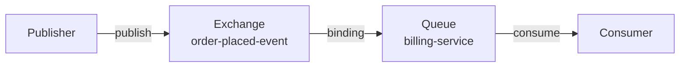

# Mocha Transport Documentation Conventions

This document captures the conventions, patterns, and structure used across existing Mocha transport documentation to ensure the Azure Event Hubs transport doc follows the same style.

## Frontmatter Schema

All transport docs use standard YAML frontmatter with two fields:

```yaml
---
title: "Transport Name"
description: "Concise description of what the transport does and when to use it."
---
```

**Conventions:**
- `title`: Transport name only, with proper capitalization (e.g., "RabbitMQ Transport", "PostgreSQL Transport")
- `description`: 1-2 sentences covering what the transport is and its primary use case
- Experimental status goes in the first paragraph of the doc body, not frontmatter

Example (PostgreSQL):
```yaml
---
title: "PostgreSQL Transport"
description: "Configure the PostgreSQL transport in Mocha for database-backed messaging with automatic topology provisioning, LISTEN/NOTIFY signaling, and schema multi-tenancy."
---

> **Experimental:** The PostgreSQL transport is currently in preview and its API may change in future releases.
```

## Section Structure

Transport docs follow a consistent section order:

1. **Intro paragraph** (no heading) — What the transport is and when to use it
2. **"When to choose [Transport] over X"** — Decision matrix comparing to other transports (RabbitMQ style shows this)
3. **"Set up the [Transport]"** — Main setup section
4. **"Install the package"** — Package installation command
5. **Setup variations:**
   - Default setup method (Aspire, connection string, etc.)
   - Alternative setup methods if applicable
   - Advanced configuration if applicable
6. **"Verify it works"** — Simple POST endpoint showing the transport works
7. **Transport-specific deep dives** (varies by transport):
   - Topology explanation with Mermaid diagrams or visualizations
   - Connection/pooling details
   - Naming conventions
   - Configuration options (tables with Property/Type/Description)
8. **Custom configuration** — Customizing defaults, declaring topology, binding handlers
9. **Control auto-provisioning** — How to manage automatic vs. manual provisioning
10. **Concurrency/prefetch tuning** — Performance configuration per endpoint
11. **Next steps** — Links to related docs
12. **Runnable examples** — Links to GitHub examples

## Voice and Tone

- **Direct and practical**: "You write handlers. That is the primary abstraction."
- **Imperative headings**: "Install the package", "Verify it works", "Declare custom topology"
- **Explanation before configuration**: Always explain *why* before showing *how*
- **Specific over abstract**: "This prevents back-pressure from slow consumers from blocking outbound message publishing" vs. just "decouples concerns"
- **Assume C# knowledge**: No "what is async/await"; assume .NET familiarity
- **Real-world context**: "When you already run PostgreSQL and want messaging without deploying a separate broker"

## Code Example Style

1. **Full, working code blocks** — Always include necessary `using` statements
2. **Builder pattern is standard**:
   ```csharp
   builder.Services
       .AddMessageBus()
       .AddEventHandler<OrderPlacedEventHandler>()
       .AddRabbitMQ();
   ```
3. **Configuration callbacks shown for each method**:
   ```csharp
   .AddRabbitMQ(transport =>
   {
       transport.ConfigureDefaults(defaults => { ... });
   });
   ```
4. **Comments within code blocks** explain config parameters, not redundant to surrounding text
5. **Verification code includes both publish side and handler side** (see RabbitMQ, Postgres)
6. **Handler/Consumer code always shown** when introducing new concepts (not just config)

## Cross-Link Patterns

- **"Next steps" section** (bottom of doc) links to 2-3 related topics
- **Inline links** use absolute paths: `[name](/docs/mocha/v1/section)`
- **Related concepts** linked contextually: "See [Enterprise Integration Patterns](https://link)" or "See [microservices.io](https://link)"
- **Runnable example links** use special blockquote at the end:
  ```
  > **Runnable example:** [RabbitMQ](https://github.com/...)
  > **Full demo:** ... all three Demo services use RabbitMQ...
  ```

## Admonition Usage

Three admonition types observed:

1. **`:::warning`** — Operational concerns, deployment warnings
   ```
   :::warning
   **Message loss warning.** Messages published before the transport completes its Start phase may be lost...
   :::
   ```

2. **`:::note`** — Clarifications, non-critical caveats
   ```
   :::note
   InMemory tests exercise handler logic and message routing, but not RabbitMQ-specific behavior...
   :::
   ```

3. **`> **Bold text.** Explanation`** — Important blockquote callouts (not in fence)
   ```
   > **Runnable example:** [MultiTransport](...)
   ```

4. **`> **Experimental:**** — Preview/alpha status (not fenced, at top)

## Table Formats

**Configuration options table** (most common):
| Column 1 | Column 2 | Column 3 |
| --- | --- | --- |
| Property name | Type | Description with details |

Example (RabbitMQ prefetch):
```markdown
| Property     | Type                         | Description                                                       |
| ------------ | ---------------------------- | ----------------------------------------------------------------- |
| `QueueType`  | `string`                     | Queue type: `RabbitMQQueueType.Classic`, `.Quorum`, or `.Stream`  |
```

**Decision/comparison table**:
| Criterion | Option 1 | Option 2 |
| --- | --- | --- |
| Aspect | Description | Description |

Example (InMemory vs RabbitMQ):
```markdown
| Criterion          | InMemory                          | RabbitMQ                                    |
| ------------------ | --------------------------------- | ------------------------------------------- |
| Setup effort       | None - zero dependencies          | Requires a running broker                   |
```

**Resource naming table** (topology reference):
| Resource | Naming convention | Created when |
| --- | --- | --- |
| Topic | Name derivation | Trigger condition |

## Mermaid Diagrams

- **Topology diagrams**: Used to show exchange/queue/binding relationships (RabbitMQ example)
- **State diagrams**: Used for saga workflows (sagas.md example)
- **Flow charts**: Used to show architecture/scoping (routing-and-endpoints.md example)

Example (simplest topology):


## TopologyVisualization Component

Special custom component embedded in docs:
```markdown
<TopologyVisualization data='{...json...}' />
```

This is **not** something to replicate in a new doc unless you have the exact JSON structure. These are auto-generated from the framework. If the new transport needs topology visualization, that component would be generated separately.

## Key Conventions by Transport Type

### RabbitMQ-specific:
- Emphasizes publisher confirms for delivery guarantees
- Explains fanout exchanges for pub/sub vs. direct for commands
- Prefetch tuning guidance (10-100 range, CloudAMQP reference)
- Quorum queues, stream queues, classic types explained
- Two connections (one for publish, one for consume) explained

### PostgreSQL-specific:
- "Experimental" callout at top
- Emphasizes LISTEN/NOTIFY polling model
- SELECT...FOR UPDATE SKIP LOCKED explained
- Advisory locks and migration strategy detailed
- Multi-tenancy via schema/table prefix explained
- Background maintenance tasks (10s-5min intervals) table shown

### InMemory-specific:
- Minimal setup (almost no config shown)
- Emphasizes it's for testing/dev only
- Notes what it *doesn't* exercise (broker-specific behavior)
- Custom topology rare but shown for completeness

## Naming Conventions to Document

When explaining topology naming:
- **Events** → fanout exchange or topic
- **Commands** → direct queue or point-to-point queue
- **Request/reply** → request queue + temporary reply queue
- **Service prefix** → used for subscribe endpoints to make queues unique per service
- **Kebab-case** → PascalCase type names convert to kebab-case (OrderPlacedEvent → order-placed-event)
- **Suffix stripping** → Handler, Consumer, Command, Event, Message, Query, Response suffixes removed

## Paragraphing and Flow

- **Short paragraphs** — 2-3 sentences max; long explanations broken into multiple paragraphs
- **Imperative starts** — "Configure transport-level defaults", "Control auto-provisioning"
- **Explanation then example** — Never dump code without context
- **Before/after** — "Without separation, a slow consumer could..." vs. "With separate connections, each direction..."

## Common Gotchas to Highlight

Looking across the docs, these patterns appear:

1. **Topology timing** — Must exist before handler starts (startup validation)
2. **Message loss windows** — Between exchange creation and binding
3. **Publisher confirms** — Required for at-least-once delivery
4. **Advisory locks** — Fixed ID, serializes migrations even across different prefixes
5. **Prefetch starvation** — Avoid prefetch=1 with quorum queues
6. **Service naming** — Critical for pub/sub to work across multiple services (why service prefix matters)

## Testing and Examples

- **Runnable examples** link to GitHub repo paths like: `src/Mocha/src/Examples/Transports/RabbitMQ`
- **Multi-service demos** referenced: `src/Mocha/src/Demo/Demo.AppHost`
- **Example naming** matches transport name: RabbitMQ example in /Transports/RabbitMQ directory
