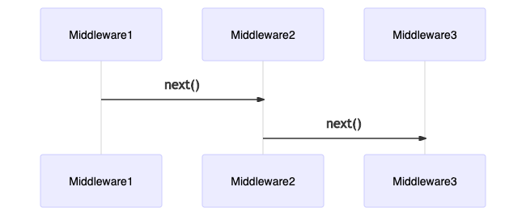
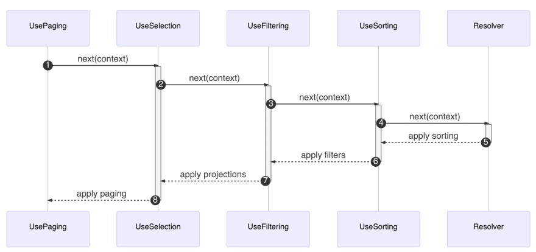

# Understanding middleware

The field middleware is one of the foundational components in Hot Chocolate. Many features that you use like, for instance, the `ID` transformation from internal IDs to global object identifiers, are a field middleware. Even resolvers are compiled into a field middleware.

All the middleware that are applied to a field are compiled into one delegate that can be executed. Each middleware knows about the next middleware component in its chain and with this can choose to execute logic before it or after it or before and after it. Also, a middleware might skip the next middleware in line by not calling next.



A field middleware can be defined by binding it to a field with the descriptor API:

```csharp
context.Use(next => async context =>
{
    // do some logic

    // invoke next middleware component in the chain.
    await next(context);


    // do some more logic
})
```

A resolver pipeline is built by applying middleware in order, meaning that the first declared middleware on the field descriptor is the first one executed in the pipeline. The last middleware in the field resolver pipeline is always the field resolver itself.


The field resolver middleware will only execute if no result has been produced so far. So, if any middleware has set the `Result` property on the context, the field resolver will be skipped.

Let us write a little middleware that makes a string into an all upper case string to understand better how field middleware works.

```csharp
descriptor.Use(next => async context =>
{
    await next(context);

    if (context.Result is string s)
    {
        context.Result = s.ToUpperInvariant();
    }
});
```

The above middleware first invokes the `next` middleware, and by doing so, gives up control and lets the rest of the pipeline do its job.

After `next` has finished executing, the middleware checks if the result is a `string`, and if so, it applies a `ToUpperInvariant` on that `string` and writes back the updated `string` to `context.Result`.


## Add UseUpper middleware

1. Head over to the `ObjectFieldDescriptorExtensions` class located in the `Extensions` folder.

1. Add the `UseUpperCase` extension method to the `ObjectFieldDescriptorExtensions` class.

   ```csharp
   public static IObjectFieldDescriptor UseUpperCase(
       this IObjectFieldDescriptor descriptor)
   {
       return descriptor.Use(next => async context =>
       {
           await next(context);

           if (context.Result is string s)
           {
               context.Result = s.ToUpperInvariant();
           }
       });
   }
   ```

1. Head over to the `TrackType` in the `Types` folder and use the middleware on the `name` field.

   ```csharp
   descriptor
       .Field(t => t.Name)
       .UseUpperCase();
   ```

1. Start your server and query your tracks.

   ```console
   dotnet run --project GraphQL
   ```

   ```graphql
   {
     tracks {
       name
     }
   }
   ```

   The result should correctly present us with the name all in upper-case.

   ```json
   {
     "data": {
       "tracks": [
         {
           "name": "TRACK 1"
         },
         {
           "name": "TRACK 2"
         }
       ]
     }
   }
   ```

## Create middleware attribute

To use middleware on plain C# types, we can wrap them in so-called descriptor attributes. Descriptor attributes let us intercept the descriptors when the type is inferred. For each descriptor type, there is a specific descriptor attribute base class. For our case, we need to use the `ObjectFieldDescriptorAttribute` base class.

1. Create a new class `UseUpperCaseAttribute` in the `Extensions` directory and add the following code:

   ```csharp
   using HotChocolate.Types;
   using HotChocolate.Types.Descriptors;
   using System.Reflection;

   namespace ConferencePlanner.GraphQL
   {
       public class UseUpperCaseAttribute : ObjectFieldDescriptorAttribute
       {
           public override void OnConfigure(
               IDescriptorContext context,
               IObjectFieldDescriptor descriptor,
               MemberInfo member)
           {
               descriptor.UseUpperCase();
           }
       }
   }
   ```

   > This new attribute can now be applied to any property or method on a plain C# type.

   > ```csharp
   > public class Foo
   > {
   >     [UseUpperCase]
   >     public string Bar { get; set; }
   > }
   > ```

## Middleware order

The following diagram shows the complete field request pipeline with filtering and pagination. You can see how, existing middleware are ordered. You have full control over how to order middleware or inject new custom middleware as necessary for your scenarios.



The thing here is that if you take for instance UseFiltering and UsePaging, it would make no sense to first apply paging and basically trim the result in order to then apply filters onto that trimmed result set, the other way around however makes perfect sense.

**Middleware order is important!**

That also means that the order of middleware attributes is important since they form the request pipeline.

## Summary

In this session, we have looked at what field middleware are and how we can use them to add additional processing logic to our field resolver pipeline.

[**<< Session #4 - GraphQL schema design**](4-schema-design.md) | [**Session #6 - Adding complex filter capabilities >>**](6-adding-complex-filter-capabilities.md) 
