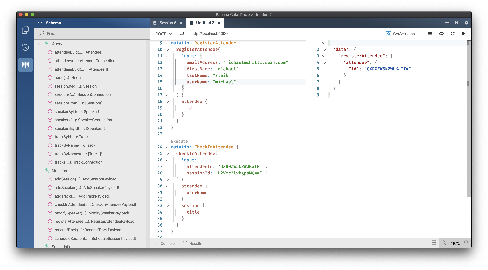
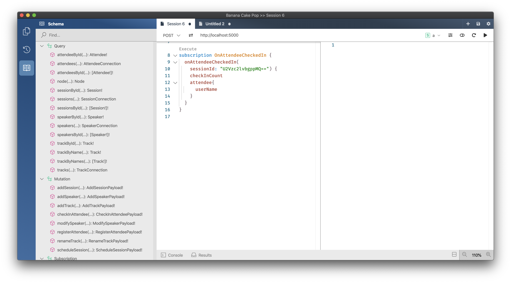

# Adding real-time functionality with subscriptions

For the last few parts of our journey through GraphQL, we have dealt with queries and mutations. In many APIs, this is all people need or want, but GraphQL also offers us real-time capabilities where we can formulate what data we want to receive when a specific event happens.

For our conference API, we would like to introduce two events a user can subscribe to. So, whenever a session is scheduled, we want to be notified. An `onSessionScheduled` event would allow us to send the user notifications whenever a new session is available or whenever a schedule for a specific session has changed.

The second case that we have for subscriptions is whenever a user checks in to a session we want to raise a subscription so that we can notify users that the space in a session is running low or even have some analytics tool subscribe to this event.

## Refactor GraphQL API

Before we can start with introducing our new subscriptions, we need first to bring in some new types and add some more packages.

1. Add a new directory `Attendees`.

   ```console
   mkdir GraphQL/Attendees
   ```

1. Create a new class `AttendeeQueries` located in the `Attendees` directory with the following content:

   ```csharp
   using System.Collections.Generic;
   using System.Threading;
   using System.Threading.Tasks;
   using ConferencePlanner.GraphQL.Data;
   using ConferencePlanner.GraphQL.DataLoader;
   using HotChocolate;
   using HotChocolate.Types;
   using HotChocolate.Types.Relay;
   using System.Linq;

   namespace ConferencePlanner.GraphQL.Attendees
   {
       [ExtendObjectType(Name = "Query")]
       public class AttendeeQueries
       {
           [UseApplicationDbContext]
           [UsePaging]
           public IQueryable<Attendee> GetAttendees(
               [ScopedService] ApplicationDbContext context) =>
               context.Attendees;

           public Task<Attendee> GetAttendeeByIdAsync(
               [ID(nameof(Attendee))]int id,
               AttendeeByIdDataLoader attendeeById,
               CancellationToken cancellationToken) =>
               attendeeById.LoadAsync(id, cancellationToken);

           public async Task<IEnumerable<Attendee>> GetAttendeesByIdAsync(
               [ID(nameof(Attendee))]int[] ids,
               AttendeeByIdDataLoader attendeeById,
               CancellationToken cancellationToken) =>
               await attendeeById.LoadAsync(ids, cancellationToken);
       }
   }
   ```

1. Add a class `AttendeePayloadBase` to the `Attendees` directory.

    ```csharp
    using System.Collections.Generic;
    using ConferencePlanner.GraphQL.Common;
    using ConferencePlanner.GraphQL.Data;

    namespace ConferencePlanner.GraphQL.Attendees
    {
        public class AttendeePayloadBase : Payload
        {
            protected AttendeePayloadBase(Attendee attendee)
            {
                Attendee = attendee;
            }

            protected AttendeePayloadBase(IReadOnlyList<UserError> errors)
                : base(errors)
            {
            }

            public Attendee? Attendee { get; }
        }
    }
    ```

### Add `registerAttendee` Mutation

We now have the base types integrated and can start adding the attendee mutations. We will begin by adding in the `registerAttendee` Mutation.

1. Add a new class `RegisterAttendeeInput` to the `Attendees` directory.

    ```csharp
    namespace ConferencePlanner.GraphQL.Attendees
    {
        public record RegisterAttendeeInput(
            string FirstName,
            string LastName,
            string UserName,
            string EmailAddress);
    }
    ```

1. Now, add the `RegisterAttendeePayload` class to the `Attendees` directory.

    ```csharp
    using ConferencePlanner.GraphQL.Common;
    using ConferencePlanner.GraphQL.Data;

    namespace ConferencePlanner.GraphQL.Attendees
    {
        public class RegisterAttendeePayload : AttendeePayloadBase
        {
            public RegisterAttendeePayload(Attendee attendee)
                : base(attendee)
            {
            }

            public RegisterAttendeePayload(UserError error)
                : base(new[] { error })
            {
            }
        }
    }
    ```

1. Add the `AttendeeMutations` with the `RegisterAttendeeAsync` resolver to the `Attendees` directory.

   ```csharp
   using System.Threading;
   using System.Threading.Tasks;
   using ConferencePlanner.GraphQL.Common;
   using ConferencePlanner.GraphQL.Data;
   using HotChocolate;
   using HotChocolate.Types;
   using HotChocolate.Subscriptions;

   namespace ConferencePlanner.GraphQL.Attendees
   {
       [ExtendObjectType(Name = "Mutation")]
       public class AttendeeMutations
       {
           [UseApplicationDbContext]
           public async Task<RegisterAttendeePayload> RegisterAttendeeAsync(
               RegisterAttendeeInput input,
               [ScopedService] ApplicationDbContext context,
               CancellationToken cancellationToken)
           {
               var attendee = new Attendee
               {
                   FirstName = input.FirstName,
                   LastName = input.LastName,
                   UserName = input.UserName,
                   EmailAddress = input.EmailAddress
               };

               context.Attendees.Add(attendee);

               await context.SaveChangesAsync(cancellationToken);

               return new RegisterAttendeePayload(attendee);
           }
       }
   }
   ```

### Add `checkInAttendee` Mutation

Now that we have the mutation in to register new attendees, let us move on to add another mutation that will allow us to check-in a user to a session.

1. Add the `CheckInAttendeeInput` to the `Attendees` directory.

    ```csharp
    using ConferencePlanner.GraphQL.Data;
    using HotChocolate.Types.Relay;

    namespace ConferencePlanner.GraphQL.Attendees
    {
        public record CheckInAttendeeInput(
            [ID(nameof(Session))]
            int SessionId,
            [ID(nameof(Attendee))]
            int AttendeeId);
    }
    ```

1. Next we add the payload type for the `CheckInAttendeePayload` Mutation:

    ```csharp
    using System.Threading;
    using System.Threading.Tasks;
    using ConferencePlanner.GraphQL.Common;
    using ConferencePlanner.GraphQL.Data;
    using ConferencePlanner.GraphQL.DataLoader;

    namespace ConferencePlanner.GraphQL.Attendees
    {
        public class CheckInAttendeePayload : AttendeePayloadBase
        {
            private int? _sessionId;

            public CheckInAttendeePayload(Attendee attendee, int sessionId)
                : base(attendee)
            {
                _sessionId = sessionId;
            }

            public CheckInAttendeePayload(UserError error)
                : base(new[] { error })
            {
            }

            public async Task<Session?> GetSessionAsync(
                SessionByIdDataLoader sessionById,
                CancellationToken cancellationToken)
            {
                if (_sessionId.HasValue)
                {
                    return await sessionById.LoadAsync(_sessionId.Value, cancellationToken);
                }

                return null;
            }
        }
    }
    ```

1. Head back to the `AttendeeMutations` class in the `Attendees` directory and add the `CheckInAttendeeAsync` resolver to it:

    ```csharp
    [UseApplicationDbContext]
    public async Task<CheckInAttendeePayload> CheckInAttendeeAsync(
        CheckInAttendeeInput input,
        [ScopedService] ApplicationDbContext context,
        CancellationToken cancellationToken)
    {
        Attendee attendee = await context.Attendees.FirstOrDefaultAsync(
            t => t.Id == input.AttendeeId, cancellationToken);

        if (attendee is null)
        {
            return new CheckInAttendeePayload(
                new UserError("Attendee not found.", "ATTENDEE_NOT_FOUND"));
        }

        attendee.SessionsAttendees.Add(
            new SessionAttendee
            {
                SessionId = input.SessionId
            });

        await context.SaveChangesAsync(cancellationToken);

        return new CheckInAttendeePayload(attendee, input.SessionId);
    }
    ```

   Your `AttendeeMutations` class should now look like the following:

    ```csharp
    using System.Threading;
    using System.Threading.Tasks;
    using Microsoft.EntityFrameworkCore;
    using ConferencePlanner.GraphQL.Common;
    using ConferencePlanner.GraphQL.Data;
    using HotChocolate;
    using HotChocolate.Types;

    namespace ConferencePlanner.GraphQL.Attendees
    {
        [ExtendObjectType(Name = "Mutation")]
        public class AttendeeMutations
        {
            [UseApplicationDbContext]
            public async Task<RegisterAttendeePayload> RegisterAttendeeAsync(
                RegisterAttendeeInput input,
                [ScopedService] ApplicationDbContext context,
                CancellationToken cancellationToken)
            {
                var attendee = new Attendee
                {
                    FirstName = input.FirstName,
                    LastName = input.LastName,
                    UserName = input.UserName,
                    EmailAddress = input.EmailAddress
                };

                context.Attendees.Add(attendee);

                await context.SaveChangesAsync(cancellationToken);

                return new RegisterAttendeePayload(attendee);
            }

            [UseApplicationDbContext]
            public async Task<CheckInAttendeePayload> CheckInAttendeeAsync(
                CheckInAttendeeInput input,
                [ScopedService] ApplicationDbContext context,
                CancellationToken cancellationToken)
            {
                Attendee attendee = await context.Attendees.FirstOrDefaultAsync(
                    t => t.Id == input.AttendeeId, cancellationToken);

                if (attendee is null)
                {
                    return new CheckInAttendeePayload(
                        new UserError("Attendee not found.", "ATTENDEE_NOT_FOUND"));
                }

                attendee.SessionsAttendees.Add(
                    new SessionAttendee
                    {
                        SessionId = input.SessionId
                    });

                await context.SaveChangesAsync(cancellationToken);

                return new CheckInAttendeePayload(attendee, input.SessionId);
            }
        }
    }
    ```

1. Head over to the `Startup.cs` and register the query and mutation type that we have just added with the schema builder.

    ```csharp
    services
        .AddGraphQLServer()
        .AddQueryType(d => d.Name("Query"))
            .AddTypeExtension<AttendeeQueries>()
            .AddTypeExtension<SpeakerQueries>()
            .AddTypeExtension<SessionQueries>()
            .AddTypeExtension<TrackQueries>()
        .AddMutationType(d => d.Name("Mutation"))
            .AddTypeExtension<AttendeeMutations>()
            .AddTypeExtension<SessionMutations>()
            .AddTypeExtension<SpeakerMutations>()
            .AddTypeExtension<TrackMutations>()
        .AddType<AttendeeType>()
        .AddType<SessionType>()
        .AddType<SpeakerType>()
        .AddType<TrackType>()
        .EnableRelaySupport()
        .AddFiltering()
        .AddSorting()
        .AddDataLoader<SpeakerByIdDataLoader>()
        .AddDataLoader<SessionByIdDataLoader>();
    ```

1. Start your GraphQL server.

   ```console
   dotnet run --project GraphQL
   ```

1. Validate that you see your new queries and mutations with Banana Cake Pop.

## Add `onSessionScheduled` Subscription

With the base in, we now can focus on putting subscriptions on our GraphQL server. GraphQL subscriptions by default work over WebSockets but could also work over SignalR or gRPC. We will first update our request pipeline to use WebSockets, and then we will set up the subscription pub/sub-system. After having our server prepared, we will put in the subscriptions to our API.

1. Head over to `Startup.cs` and add `app.WebSockets` to the request pipeline. Middleware order is also important with ASP.NET Core, so this middleware needs to come before the GraphQL middleware.

    ```csharp
    public void Configure(IApplicationBuilder app, IWebHostEnvironment env)
    {
        if (env.IsDevelopment())
        {
            app.UseDeveloperExceptionPage();
        }

        app.UseWebSockets();
        app.UseRouting();

        app.UseEndpoints(endpoints =>
        {
            endpoints.MapGraphQL();
        });
    }
    ```

1. Stay in the `Startup.cs` and add `.AddInMemorySubscriptions();` to the `ConfigureServices` method.

    ```csharp
    public void ConfigureServices(IServiceCollection services)
    {
        services.AddPooledDbContextFactory<ApplicationDbContext>(
            options => options.UseSqlite("Data Source=conferences.db"));

        services
            .AddGraphQLServer()
            .AddQueryType(d => d.Name("Query"))
                .AddTypeExtension<AttendeeQueries>()
                .AddTypeExtension<SpeakerQueries>()
                .AddTypeExtension<SessionQueries>()
                .AddTypeExtension<TrackQueries>()
            .AddMutationType(d => d.Name("Mutation"))
                .AddTypeExtension<AttendeeMutations>()
                .AddTypeExtension<SessionMutations>()
                .AddTypeExtension<SpeakerMutations>()
                .AddTypeExtension<TrackMutations>()
            .AddType<AttendeeType>()
            .AddType<SessionType>()
            .AddType<SpeakerType>()
            .AddType<TrackType>()
            .EnableRelaySupport()
            .AddFiltering()
            .AddSorting()
            .AddInMemorySubscriptions()
            .AddDataLoader<SpeakerByIdDataLoader>()
            .AddDataLoader<SessionByIdDataLoader>();
    }
    ```

   > With `app.UseWebSockets()` we have enabled our server to handle websocket request. With `.AddInMemorySubscriptions();` we have added an in-memory pub/sub system for GraphQL subscriptions to our schema.

1. Add a new class `SessionSubscriptions` to the `Sessions` directory.

    ```csharp
    using System.Threading;
    using System.Threading.Tasks;
    using ConferencePlanner.GraphQL.Data;
    using ConferencePlanner.GraphQL.DataLoader;
    using HotChocolate;
    using HotChocolate.Types;

    namespace ConferencePlanner.GraphQL.Sessions
    {
        [ExtendObjectType(Name = "Subscription")]
        public class SessionSubscriptions
        {
            [Subscribe]
            [Topic]
            public Task<Session> OnSessionScheduledAsync(
                [EventMessage] int sessionId,
                SessionByIdDataLoader sessionById,
                CancellationToken cancellationToken) =>
                sessionById.LoadAsync(sessionId, cancellationToken);
        }
    }
    ```

   > The `[Topic]` attribute can be put on the method or a parameter of the method and will infer the pub/sub-topic for this subscription.

   > The `[Subscribe]` attribute tells the schema builder that this resolver method needs to be hooked up to the pub/sub-system. This means that in the background, the resolver compiler will create a so-called subscribe resolver that handles subscribing to the pub/sub-system.

   > The `[EventMessage]` attribute marks the parameter where the execution engine shall inject the message payload of the pub/sub-system.

1. Head back to the `Startup.cs` and register the `SessionSubscriptions` with the schema builder.

    ```csharp
    services
        .AddGraphQLServer()
        .AddQueryType(d => d.Name("Query"))
            .AddTypeExtension<AttendeeQueries>()
            .AddTypeExtension<SpeakerQueries>()
            .AddTypeExtension<SessionQueries>()
            .AddTypeExtension<TrackQueries>()
        .AddMutationType(d => d.Name("Mutation"))
            .AddTypeExtension<AttendeeMutations>()
            .AddTypeExtension<SessionMutations>()
            .AddTypeExtension<SpeakerMutations>()
            .AddTypeExtension<TrackMutations>()
        .AddSubscriptionType(d => d.Name("Subscription"))
            .AddTypeExtension<SessionSubscriptions>()
        .AddType<AttendeeType>()
        .AddType<SessionType>()
        .AddType<SpeakerType>()
        .AddType<TrackType>()
        .EnableRelaySupport()
        .AddFiltering()
        .AddSorting()
        .AddInMemorySubscriptions()
        .AddDataLoader<SpeakerByIdDataLoader>()
        .AddDataLoader<SessionByIdDataLoader>();
    ```

   The subscription type itself is now registered, but we still need something to trigger the event. So, next, we are going to update our `scheduleSession` resolver to trigger an event.

1. Head over to the `SessionMutations` class in the `Sessions` directory and replace `ScheduleSessionAsync` with the following code:

    ```csharp
    [UseApplicationDbContext]
    public async Task<ScheduleSessionPayload> ScheduleSessionAsync(
        ScheduleSessionInput input,
        [ScopedService] ApplicationDbContext context,
        [Service]ITopicEventSender eventSender)
    {
        if (input.EndTime < input.StartTime)
        {
            return new ScheduleSessionPayload(
                new UserError("endTime has to be larger than startTime.", "END_TIME_INVALID"));
        }

        Session session = await context.Sessions.FindAsync(input.SessionId);
        int? initialTrackId = session.TrackId;

        if (session is null)
        {
            return new ScheduleSessionPayload(
                new UserError("Session not found.", "SESSION_NOT_FOUND"));
        }

        session.TrackId = input.TrackId;
        session.StartTime = input.StartTime;
        session.EndTime = input.EndTime;

        await context.SaveChangesAsync();

        await eventSender.SendAsync(
            nameof(SessionSubscriptions.OnSessionScheduledAsync),
            session.Id);

        return new ScheduleSessionPayload(session);
    }
    ```

   > Our improved resolver now injects `[Service]ITopicEventSender eventSender`. This gives us access to send messages to the underlying pub/sub-system.

   > After `await context.SaveChangesAsync();` we are add sending in a new message.

   ```csharp
   await eventSender.SendAsync(
       nameof(SessionSubscriptions.OnSessionScheduledAsync),
       session.Id);
   ```

   > Since we added the `[Topic]` attribute on our resolver method in the `SessionSubscriptions` class, the topic is now the name of this method. A topic can be anything that can be serialized and has equality implemented so you could also use an object.

1. Start your GraphQL server.

   ```console
   dotnet run --project GraphQL
   ```

1. Open Banana Cake Pop and refresh the schema.

1. Open a new query tab and add the following subscription query:

   ```graphql
   subscription {
     onSessionScheduled {
       title
       startTime
     }
   }
   ```

   Execute the subscription query. Nothing will happen at this point, and you will just see a loading indicator.

   

1. Open another tab in Banana Cake Pop and add the following query:

   ```graphql
   query GetSessionsAndTracks {
     sessions {
       nodes {
         id
       }
     }
     tracks {
       nodes {
         id
       }
     }
   }

   mutation ScheduleSession {
     scheduleSession(
       input: {
         sessionId: "U2Vzc2lvbgppMQ=="
         trackId: "VHJhY2sKaTE="
         startTime: "2020-08-01T16:00"
         endTime: "2020-08-01T17:00"
       }
     ) {
       session {
         title
       }
     }
   }
   ```

   Execute `GetSessionsAndTracks` first by clicking in the execute link above it. Use the IDs from the response for `ScheduleSession` and execute it once you have filled in the correct IDs.

   

1. Return to your first query tab (the tab where you specified the subscription query).

   

   The event was raised, and our subscription query was executed. We can also see that the loading indicator is still turning since we are still subscribed, and we will get new responses whenever the event is raised. With GraphQL a subscription stream can be infinite or finite. A finite stream will automatically complete whenever the server chooses to complete the topic `ITopicEventSender.CompleteAsync`.

   To stop the subscription from the client-side, click on the stop button right of the loading indicator.

## Add `onAttendeeCheckedIn` subscription

The `onSessionScheduled` was quite simple since we did not subscribe to a dynamic topic. Meaning a topic that is defined at the moment we subscribe to it or a topic that depends on the user-context. With `onAttendeeCheckedIn`, we will subscribe to a specific session to see who checked in and how quickly it fills up.

1. Head over to the `AttendeeMutations` class and replace the `CheckInAttendeeAsync` resolver with the following code:

    ```csharp
    [UseApplicationDbContext]
    public async Task<CheckInAttendeePayload> CheckInAttendeeAsync(
        CheckInAttendeeInput input,
        [ScopedService] ApplicationDbContext context,
        [Service] ITopicEventSender eventSender,
        CancellationToken cancellationToken)
    {
        Attendee attendee = await context.Attendees.FirstOrDefaultAsync(
            t => t.Id == input.AttendeeId, cancellationToken);

        if (attendee is null)
        {
            return new CheckInAttendeePayload(
                new UserError("Attendee not found.", "ATTENDEE_NOT_FOUND"));
        }

        attendee.SessionsAttendees.Add(
            new SessionAttendee
            {
                SessionId = input.SessionId
            });

        await context.SaveChangesAsync(cancellationToken);

        await eventSender.SendAsync(
            "OnAttendeeCheckedIn_" + input.SessionId,
            input.AttendeeId,
            cancellationToken);

        return new CheckInAttendeePayload(attendee, input.SessionId);
    }
    ```

   In this instance, we are again using our `ITopicEventSender` to send messages to our pub/sub-system. However, we are now creating a string topic combined with parts of the input `input.SessionId` and a string describing the event `OnAttendeeCheckedIn_`. If nobody is subscribed, the messages will just be dropped.

    ```csharp
    await eventSender.SendAsync(
        "OnAttendeeCheckedIn_" + input.SessionId,
        input.AttendeeId,
        cancellationToken);
    ```

1. Add a new class `SessionAttendeeCheckIn` to the `Attendees` directory. This will be our subscription payload.

    ```csharp
    using System.Linq;
    using System.Threading;
    using System.Threading.Tasks;
    using Microsoft.EntityFrameworkCore;
    using ConferencePlanner.GraphQL.Data;
    using ConferencePlanner.GraphQL.DataLoader;
    using HotChocolate;
    using HotChocolate.Types.Relay;

    namespace ConferencePlanner.GraphQL.Attendees
    {
        public class SessionAttendeeCheckIn
        {
            public SessionAttendeeCheckIn(int attendeeId, int sessionId)
            {
                AttendeeId = attendeeId;
                SessionId = sessionId;
            }

            [ID(nameof(Attendee))]
            public int AttendeeId { get; }

            [ID(nameof(Session))]
            public int SessionId { get; }

            [UseApplicationDbContext]
            public async Task<int> CheckInCountAsync(
                [ScopedService] ApplicationDbContext context,
                CancellationToken cancellationToken) =>
                await context.Sessions
                    .Where(session => session.Id == SessionId)
                    .SelectMany(session => session.SessionAttendees)
                    .CountAsync(cancellationToken);

            public Task<Attendee> GetAttendeeAsync(
                AttendeeByIdDataLoader attendeeById,
                CancellationToken cancellationToken) =>
                attendeeById.LoadAsync(AttendeeId, cancellationToken);

            public Task<Session> GetSessionAsync(
                SessionByIdDataLoader sessionById,
                CancellationToken cancellationToken) =>
                sessionById.LoadAsync(AttendeeId, cancellationToken);
        }
    }
    ```

1. Create a new class, `AttendeeSubscriptions` and put it in the `Attendees` directory.

    ```csharp
    using System.Threading;
    using System.Threading.Tasks;
    using ConferencePlanner.GraphQL.Data;
    using ConferencePlanner.GraphQL.DataLoader;
    using HotChocolate;
    using HotChocolate.Execution;
    using HotChocolate.Subscriptions;
    using HotChocolate.Types;
    using HotChocolate.Types.Relay;

    namespace ConferencePlanner.GraphQL.Attendees
    {
        [ExtendObjectType(Name = "Subscription")]
        public class AttendeeSubscriptions
        {
            [Subscribe(With = nameof(SubscribeToOnAttendeeCheckedInAsync))]
            public SessionAttendeeCheckIn OnAttendeeCheckedIn(
                [ID(nameof(Session))] int sessionId,
                [EventMessage] int attendeeId,
                SessionByIdDataLoader sessionById,
                CancellationToken cancellationToken) =>
                new SessionAttendeeCheckIn(attendeeId, sessionId);

            public async ValueTask<ISourceStream<int>> SubscribeToOnAttendeeCheckedInAsync(
                int sessionId,
                [Service] ITopicEventReceiver eventReceiver,
                CancellationToken cancellationToken) =>
                await eventReceiver.SubscribeAsync<string, int>(
                    "OnAttendeeCheckedIn_" + sessionId, cancellationToken);
        }
    }
    ```

   `OnAttendeeCheckedIn` represents our resolver like in the first subscription we built, but now in our `SubscribeAttribute` we are referring to a method called `SubscribeToOnAttendeeCheckedInAsync`. So, instead of letting the system generate a subscribe resolver that handles subscribing to the pub/sub-system we are creating it ourselves in order to control how it is done or event order to filter out events that we do not want to pass down.

   ```csharp
   public async ValueTask<IAsyncEnumerable<int>> SubscribeToOnAttendeeCheckedInAsync(
       int sessionId,
       [Service] ITopicEventReceiver eventReceiver,
       CancellationToken cancellationToken) =>
       await eventReceiver.SubscribeAsync<string, int>(
           "OnAttendeeCheckedIn_" + sessionId, cancellationToken);
   ```

   The subscribe resolver is using `ITopicEventReceiver` to subscribe to a topic. A subscribe resolver can return `IAsyncEnumerable<T>`, `IEnumerable<T>` or `IObservable<T>` to represent the subscription stream. The subscribe resolver has access to all the arguments that the actual resolver has access to.

   1. Head back to the `Startup.cs` and register this new subscription type with the schema builder.

    ```csharp
    services
        .AddGraphQLServer()
        .AddQueryType(d => d.Name("Query"))
            .AddTypeExtension<AttendeeQueries>()
            .AddTypeExtension<SpeakerQueries>()
            .AddTypeExtension<SessionQueries>()
            .AddTypeExtension<TrackQueries>()
        .AddMutationType(d => d.Name("Mutation"))
            .AddTypeExtension<AttendeeMutations>()
            .AddTypeExtension<SessionMutations>()
            .AddTypeExtension<SpeakerMutations>()
            .AddTypeExtension<TrackMutations>()
        .AddSubscriptionType(d => d.Name("Subscription"))
            .AddTypeExtension<AttendeeSubscriptions>()
            .AddTypeExtension<SessionSubscriptions>()
        .AddType<AttendeeType>()
        .AddType<SessionType>()
        .AddType<SpeakerType>()
        .AddType<TrackType>()
        .EnableRelaySupport()
        .AddFiltering()
        .AddSorting()
        .AddInMemorySubscriptions()
        .AddDataLoader<SpeakerByIdDataLoader>()
        .AddDataLoader<SessionByIdDataLoader>();
    ```

   1. Start your GraphQL server again.

   ```console
   dotnet run --project GraphQL
   ```

   1. Open a new tab and put the following query document in:

   ```graphql
   query GetSessions {
     sessions {
       nodes {
         id
       }
     }
   }

   mutation RegisterAttendee {
     registerAttendee(
       input: {
         emailAddress: "michael@chillicream.com"
         firstName: "michael"
         lastName: "staib"
         userName: "michael"
       }
     ) {
       attendee {
         id
       }
     }
   }

   mutation CheckInAttendee {
     checkInAttendee(
       input: { attendeeId: "QXR0ZW5kZWUKaTE=", sessionId: "U2Vzc2lvbgppMQ==" }
     ) {
       attendee {
         userName
       }
       session {
         title
       }
     }
   }
   ```

   Execute `GetSessions` first the resulting session ID and feed it into the `CheckInAttendee` operation.

   

   Next, Execute `RegisterAttendee` take the resulting attendee ID and feed it into the `CheckInAttendee` operation.

   

   1. Open another tab in Banana Cake Pop and add the following query document:

   ```graphql
   subscription OnAttendeeCheckedIn {
     onAttendeeCheckedIn(sessionId: "U2Vzc2lvbgppMQ==") {
       checkInCount
       attendee {
         userName
       }
     }
   }
   ```

   Feed-in the session ID you gathered earlier and pass it into the `sessionId` argument of `OnAttendeeCheckedIn`.

   Execute `OnAttendeeCheckedIn`, again nothing will happen at this point, and the query tab is just waiting for incoming messages.

   

   1. Get back to the earlier tab and execute the `CheckInAttendee` operation.

   

   1. Click on the subscription tab to verify that we have received the message that an attendee has checked into our session.

   

## Summary

In this session, we have learned how we can use GraphQL subscription to provide real-time events. GraphQL makes it easy to work with real-time data since we can specify what data we want to receive when an event happens on our system.

[**<< Session #6 - Adding complex filter capabilities**](6-adding-complex-filter-capabilities.md) | [**Session #8 - Testing the GraphQL server >>**](8-testing-the-graphql-server.md) 
