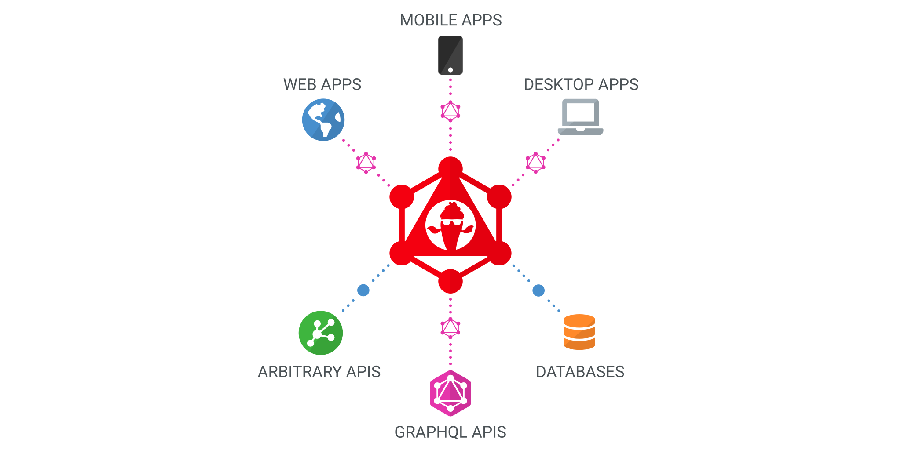

---

## ChilliCream GraphQL Platform

The ChilliCream GraphQL Platform at its core is a new way to create powerful Backends. HotChocolate, our GraphQL server, connects any service or data source and creates a cohesive service out of it to offer your consumers a unified API.

## Product Overview

### Banana Cake Pop

Our IDE to explore, request and analyze any GraphQL endpoint.

[Readme](src/BananaCakePop/README.md)

### Green Donut

Our dataloader to solve the N+1 problem.

[Readme](src/GreenDonut/README.md)

### Hot Chocolate

Our GraphQL server to create GraphQL endpoints and merge schemas.

[Readme](src/HotChocolate/README.md)

### Marshmellow Pie

Our schema registry for any GrapQL client and server.

[Readme](src/MarshmellowPie/README.md)

### Strawberry Shake

Our GraphQL client to fetch data from any GraphQL endpoint.

[Readme](src/StrawberryShake/README.md)

## Examples & Templates

TBD

## Contribution

TBD
