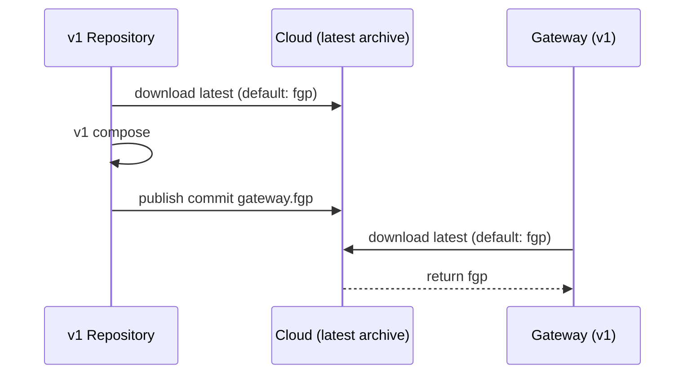
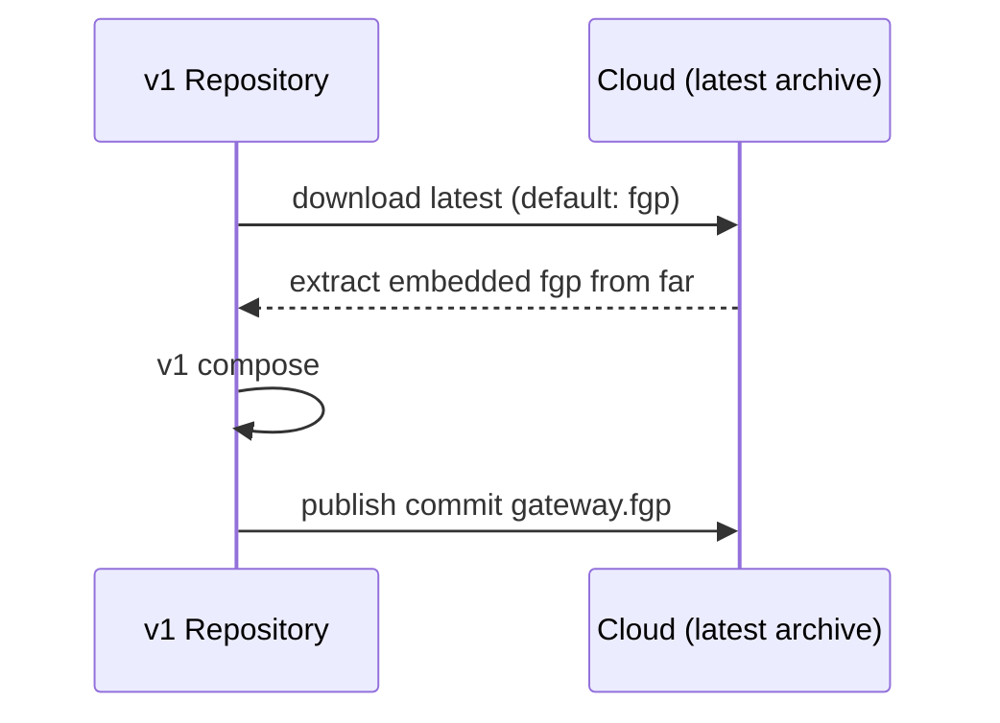
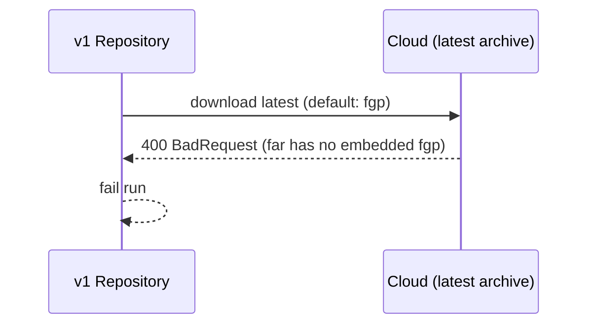
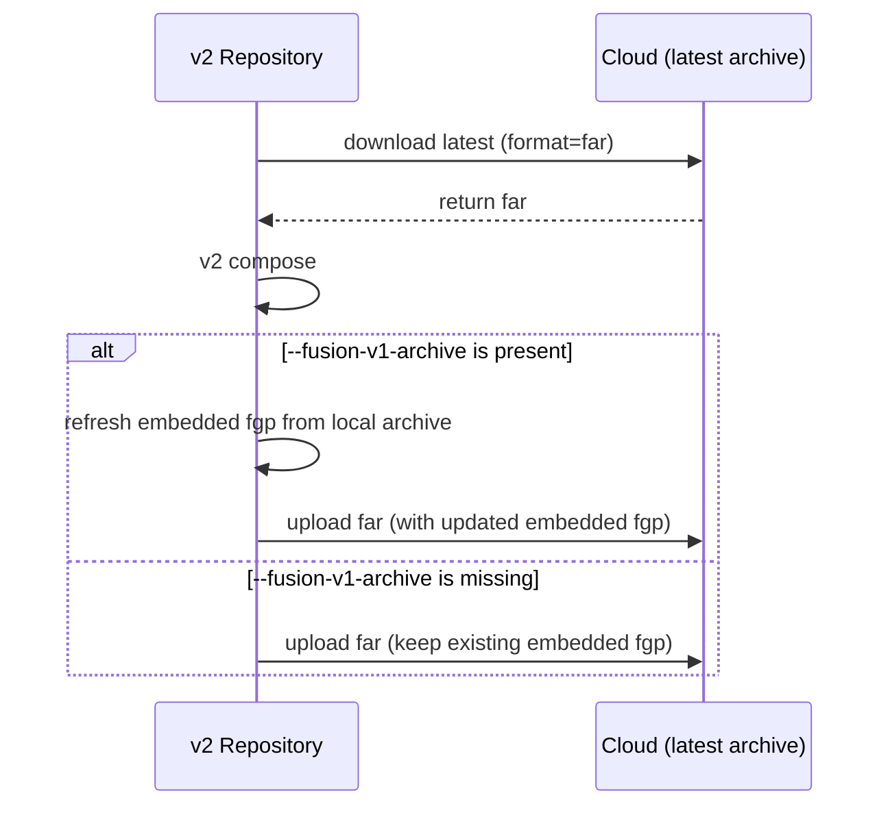
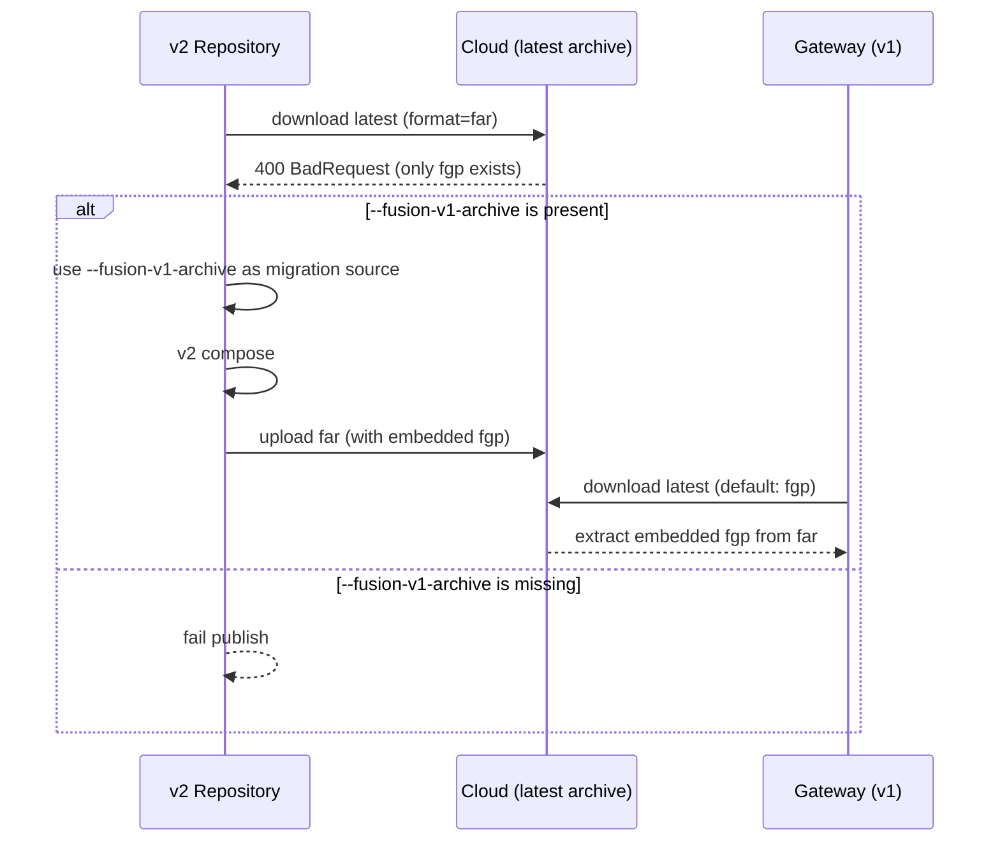
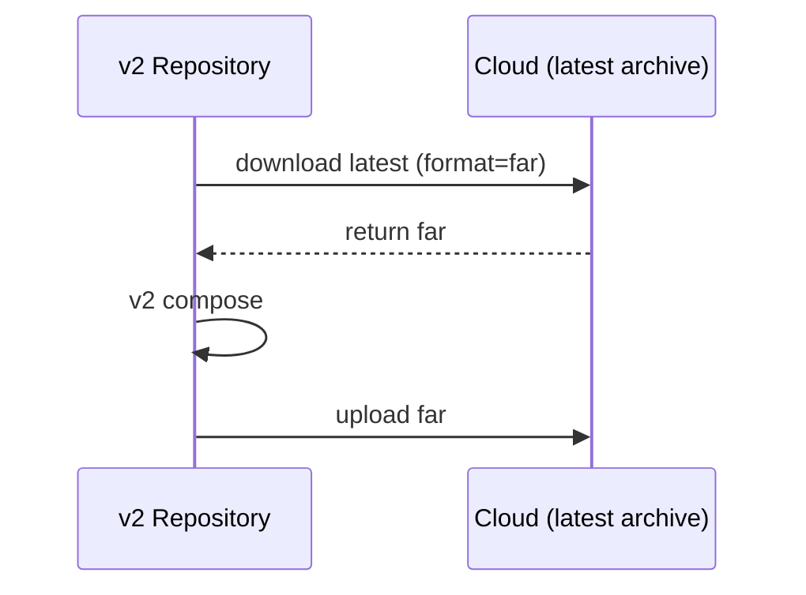

# Migration story

## Phase 1: Per-Repo Migration (One Repo at a Time)

In each repository:

1. Add `schema-settings.json` next to existing `subgraph-config.json`.
2. Keep v1 compose step to produce the latest `.fgp` during transition.
3. Do not adopt v2-only schema/settings features while the v1 compose step still runs in CI.
4. Remove only v1 publish commit step.
5. Publish via v2 and embed the freshly composed `.fgp`.

Transition CI pattern:

```bash
# v1 compose remains during transition to keep .fgp current
# subgraph-config.json (v1)
dotnet nitro fusion-configuration download --output-file gateway.fgp

dotnet fusion compose -s subgraph/schema.graphql -c subgraph/subgraph-config.json -p gateway.fgp

# v2 publish; embeds current .fgp into far
# schema-settings.json (v2)
dotnet nitro fusion publish \
  -s subgraph/schema.graphql \
  -c subgraph/schema-settings.json \
  --fusion-v1-archive gateway.fgp
```

Expected result after each migrated repo:

- cloud latest becomes `.far`,
- `.far` contains current `.fgp`,
- v1 repos can still download `.fgp`,
- v2 repos can download `.far`.

## Phase 2: Gateway Cutover

After all repos publish v2 successfully and `.far` is stable:

1. Upgrade gateway to v2 consumer.
2. Gateway starts downloading/consuming `.far`.

## Phase 3: Cleanup

After gateway cutover:

1. Remove v1 compose steps from CI.
2. Remove `--fusion-v1-archive`.

# Scenarios and Expected Behavior

<a id="scenario-1"></a>

### 1) CI/CD of v1 repository runs (cloud has fgp)



CI run of `v1 repository`:

1. Downloads latest `.fgp` from cloud.
2. Runs v1 composition and updates `gateway.fgp`.
3. Publishes updated `.fgp` back to cloud.
4. v1 gateway continues consuming `.fgp` without behavior change.

<a id="scenario-2"></a>

### 2) CI/CD of v1 repository runs (cloud has far with embedded fgp)



CI run of `v1 repository`:

1. Downloads `.fgp` (extracted from cloud `.far`).
2. Runs v1 composition.
3. Publishes `.fgp`.
4. Cloud latest can temporarily become `.fgp` until next v2 publish.

<a id="scenario-3"></a>

### 3) CI/CD of v1 repository runs (cloud has far)



CI run of `v1 repository`:

1. Downloads latest using default `.fgp` request.
2. Cloud cannot extract `.fgp` from `.far` and returns `400`.
3. CI run fails before v1 composition can proceed.
4. No new artifact is published.

<a id="scenario-4"></a>

### 4) CI/CD of v2 repository runs (coud has far with embedded fgp)



CI run of `v2 repository`:

1. Requests latest `.far`.
2. Cloud returns `.far`.
3. Composes with v2 settings.
4. If `--fusion-v1-archive` is present, embeds an up-to-date `.fgp`.
5. If `--fusion-v1-archive` is missing, previous embedded `.fgp` stays unchanged (can become stale).
6. Uploads the resulting `.far`.

<a id="scenario-5"></a>

### 5) CI/CD of v2 repository runs (cloud has fgp)



CI run of `v2 repository`:

1. Downloads latest `.far`.
2. Gets `400` because cloud only has `.fgp`.
3. If `--fusion-v1-archive` is present, use it as migration source.
4. If `--fusion-v1-archive` is missing, fail publish and leave cloud unchanged.
5. On success, upload `.far` containing embedded `.fgp`.
6. v1 gateway download still works via extraction from `.far`.

<a id="scenario-6"></a>

### 6) CI/CD of v2 repository runs (coud has far)



CI run of `v2 repository`:

1. Requests latest `.far`.
2. Cloud returns `.far`.
3. Composes with v2 settings.
4. Uploads refreshed `.far` (without embedded `.fgp`).
5. v2 consumers continue to work.

# Implementation of v2 CLI

The v2 CLI should support a single publish algorithm with a mode flag (`transition` or `cleanup`):

1. Download latest as `.far` (`format=far`).
2. If `.far` download fails because latest is `.fgp`, then in `transition` mode require `--fusion-v1-archive <path>` as migration source and fail if missing.
3. If `.far` download fails because latest is `.fgp`, then in `cleanup` mode fail publish (no v1 bootstrap path).
4. Run v2 composition and produce `.far`.
5. In `transition` mode with `--fusion-v1-archive`, refresh embedded `.fgp` from that file (up-to-date embedded `.fgp`).
6. In `transition` mode without `--fusion-v1-archive`, carry forward existing embedded `.fgp` from latest `.far` if present (can be stale).
7. In `cleanup` mode, publish `.far` without embedded `.fgp`.
8. Upload `.far`.
9. In `cleanup` mode, v1 `.fgp` download compatibility is no longer guaranteed.

Precedence rule:

- explicit CLI-provided source settings > converted settings from migration source archive (when conversion source exists).

# When Archives Are Not Fully Up-To-Date

The table below describes successful CI runs where either archive does not reflect the latest changes from all source schema inputs.

| Scenario                                                                                                     | `.far` freshness               | `.fgp` freshness        | Why                                                                                           |
| ------------------------------------------------------------------------------------------------------------ | ------------------------------ | ----------------------- | --------------------------------------------------------------------------------------------- |
| [1) CI/CD of v1 repository runs (cloud has fgp)](#scenario-1)                                                | Not present / not updated      | Latest                  | Only v1 archive is produced and published in this run.                                        |
| [2) CI/CD of v1 repository runs (cloud has far with embedded fgp)](#scenario-2)                              | Becomes stale vs latest v1 run | Latest after v1 publish | v1 run publishes `.fgp`; existing `.far` is not refreshed until a v2 run happens.             |
| [4) CI/CD of v2 repository runs (coud has far with embedded fgp)](#scenario-4) with `--fusion-v1-archive`    | Latest                         | Latest (embedded)       | v2 run recomposes `.far` and refreshes embedded `.fgp` from local v1 archive.                 |
| [4) CI/CD of v2 repository runs (coud has far with embedded fgp)](#scenario-4) without `--fusion-v1-archive` | Latest                         | Can become stale        | v2 output is refreshed, but embedded `.fgp` is carried over unchanged.                        |
| [5) CI/CD of v2 repository runs (cloud has fgp)](#scenario-5) with `--fusion-v1-archive`                     | Latest after publish           | Latest (embedded)       | v2 run bootstraps from local v1 archive and publishes `.far` with refreshed embedded `.fgp`.  |
| [6) CI/CD of v2 repository runs (coud has far)](#scenario-6)                                                 | Latest                         | Unavailable             | `.far` is refreshed without embedded `.fgp`, so v1-compatible archive is no longer available. |

Practical implication:

- During transition, `.fgp` is only guaranteed latest if every v2 run refreshes it (or every run is still v1).
- After cleanup, `.far` can stay latest while `.fgp` is stale or unavailable.
