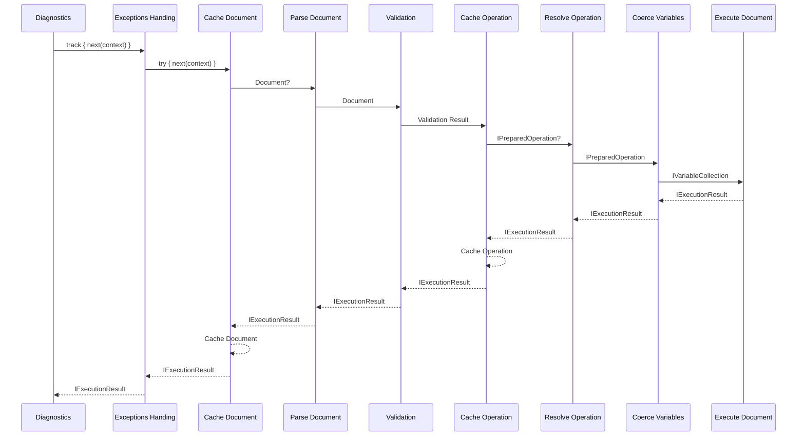

```mermaid
sequenceDiagram
    Diagnostics->>Exceptions Handing: track { next(context) }
    Exceptions Handing->>Cache Document: try { next(context) }
    Cache Document->>Parse Document: Document?
    Parse Document->>Validation: Document
    Validation->>Cache Operation: Validation Result
    Cache Operation->>Resolve Operation: IPreparedOperation?
    Resolve Operation->>Coerce Variables: IPreparedOperation
    Coerce Variables->>Execute Document: IVariableCollection

    Execute Document-->>Coerce Variables: IExecutionResult
    Coerce Variables-->>Resolve Operation: IExecutionResult
    Resolve Operation-->>Cache Operation: IExecutionResult
    Cache Operation-->>Cache Operation: Cache Operation
    Cache Operation-->>Validation: IExecutionResult
    Validation-->>Parse Document: IExecutionResult
    Parse Document-->>Cache Document: IExecutionResult
    Cache Document-->>Cache Document: Cache Document
    Cache Document-->>Exceptions Handing: IExecutionResult
    Exceptions Handing-->>Diagnostics: IExecutionResult
```