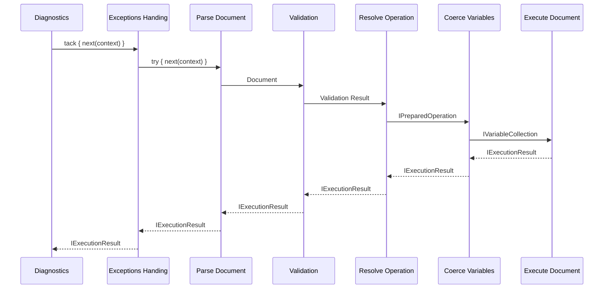

```mermaid
sequenceDiagram
    Diagnostics->>Exceptions Handing: tack { next(context) }
    Exceptions Handing->>Parse Document: try { next(context) }
    Parse Document->>Validation: Document
    Validation->>Resolve Operation: Validation Result
    Resolve Operation->>Coerce Variables: IPreparedOperation
    Coerce Variables->>Execute Document: IVariableCollection

    Execute Document-->>Coerce Variables: IExecutionResult
    Coerce Variables-->>Resolve Operation: IExecutionResult
    Resolve Operation-->>Validation: IExecutionResult
    Validation-->>Parse Document: IExecutionResult
    Parse Document-->>Exceptions Handing: IExecutionResult
    Exceptions Handing-->>Diagnostics: IExecutionResult
```