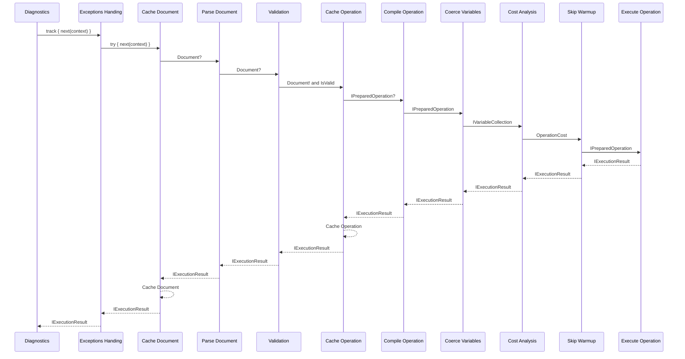
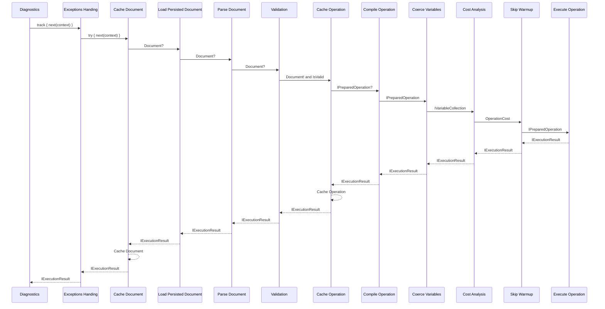

# Pipelines

This document shows the various pre-configured pipelines.

Document normalization is a lazy service that the operation compiler asks for
on a cache miss, not a pipeline stage.

## Default Pipeline

## Persisted Operation Pipeline

