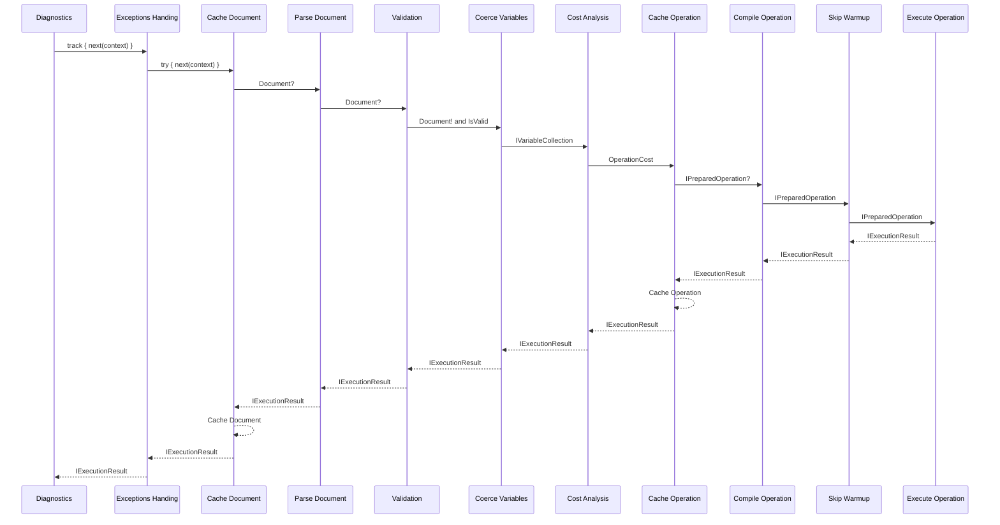
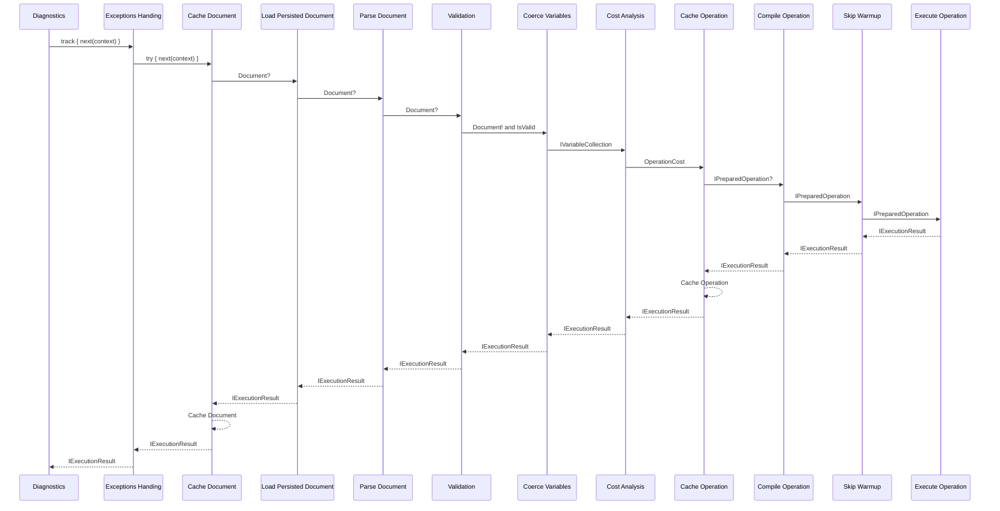

# Pipelines

This document shows the various pre-configured pipelines.

Document normalization is a lazy service resolved by the first stage that
needs it, now variable coercion, not a pipeline stage. Its result is cached
inside the normalizer by operation id, so a later stage or a later request
for the same operation reuses it instead of normalizing again.

## Default Pipeline

## Persisted Operation Pipeline

