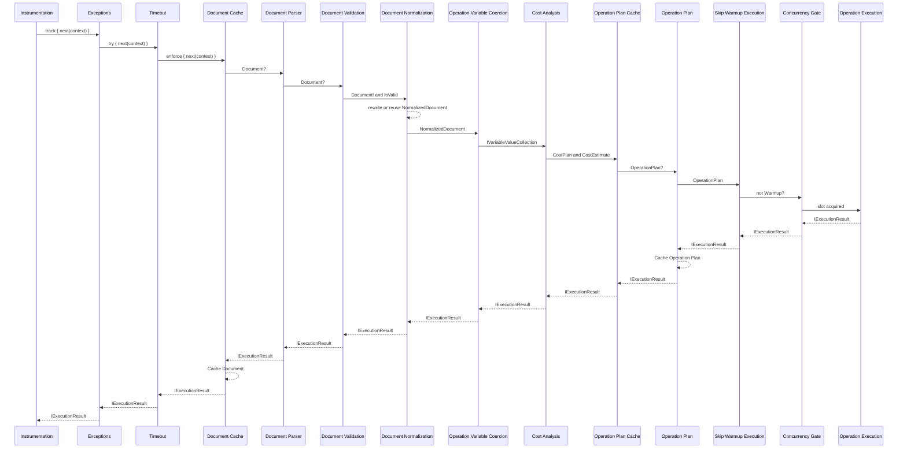
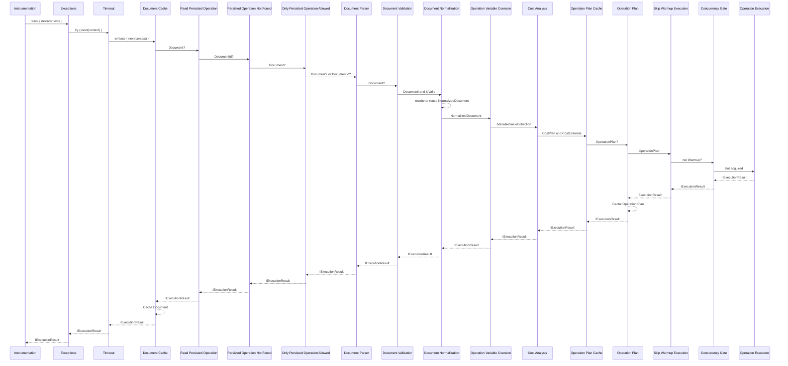
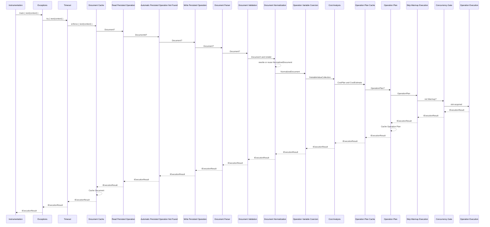

# Pipelines

This document shows the various pre-configured Fusion gateway pipelines.

"Document Normalization" below refers to the `DocumentNormalizationMiddleware`, registered through
`UseDocumentNormalization()`. It creates the operation id, de-fragmentizes the operation and removes
statically excluded selections, and caches the result in the internal `NormalizedDocumentCache` keyed
by that operation id, so a later request for the same operation reuses it instead of rewriting the
document again.

## Default Pipeline

## Persisted Operation Pipeline

## Automatic Persisted Operation Pipeline

