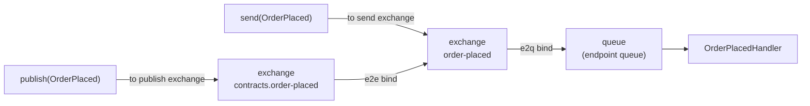
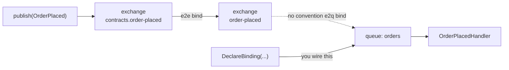
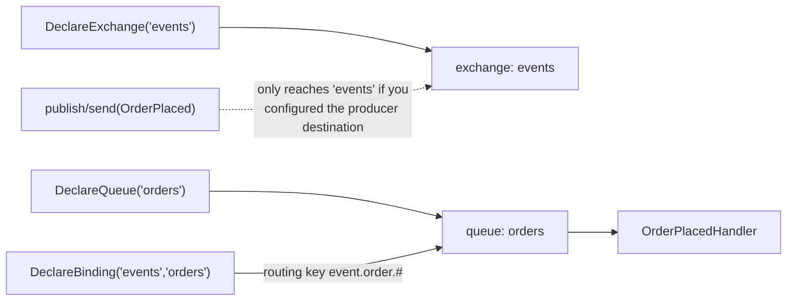
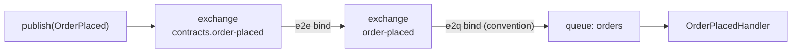

# Bind Mode: Topology Working Document

Status: working draft. Captures the **single `BindMode` axis** design (Implicit / Explicit,
settable at transport scope and overridable per queue), and spells out the exact topology
and wiring that results in every combination.

This intentionally diverges from `routing-topology-proposal.md`, which separates consumer
binding from topology generation into two knobs (`ConfigureConsumeTopology`). The argument
here is the opposite: at transport scope the two are correlated, and the only place they
need to differ is per queue, which a single scoped `BindMode` already gives us. Section 6
records that tension and the open questions it leaves.

Names in the diagrams use the real conventions:

- Publish exchange = `GetPublishEndpointName` = `{namespace}.{name}` (e.g. `contracts.order-placed`).
- Send exchange = `GetSendEndpointName` = `{name}` (e.g. `order-placed`).
- Queue = the receive endpoint's queue (the endpoint owns it).

Example message: `Contracts.OrderPlaced` (an event), consumed by `OrderPlacedHandler`.

---

## 1. Out of the box: the full publish + send chain

With no configuration, the transport defaults to `BindMode.Implicit` and the convention
materializes the complete chain for every consumed type. Producers and consumers resolve
through the same `RabbitMQDestinationResolver`, so they converge on the same entities.



Three edges, two of them type-owned and one queue-owned:

| Edge                                        | Created by                 | Scope       |
| ------------------------------------------- | -------------------------- | ----------- |
| `contracts.order-placed` exchange (publish) | type                       | type-owned  |
| `order-placed` exchange (send)              | type                       | type-owned  |
| publish exchange -> send exchange (e2e)     | type                       | type-owned  |
| send exchange -> **queue** (e2q)            | the bind into _this_ queue | queue-owned |

Why two exchanges: **publish** (events, fan-out) targets the namespaced publish exchange;
**send** (commands, point-to-point) targets the bare send exchange directly. The e2e bind
funnels published events down into the send exchange, so both producer styles converge on
one send exchange, which then binds into each consuming queue.

The producer side (`CreateEndpointConfiguration`) resolves `publish -> contracts.order-placed`
and `send -> order-placed` through the same resolver, so it always targets the head of this
chain regardless of what the consumer side does.

---

## 2. The single axis

```csharp
enum BindMode { Implicit, Explicit }
```

One concept, two scopes:

- **Transport scope** (`t.BindImplicitly()` / `t.BindExplicitly()`): the default for every
  queue and the gate on consumer discovery and producer-route fabrication.
- **Queue scope** (`Queue(name).BindImplicitly()` / `.BindExplicitly()`): overrides the
  transport default for that one queue. Replaces today's `Queue(name).AutoBind(bool)`.

What each mode means **depends on the scope**, because the scope decides what "wiring" is
in play:

|                                                             | Transport `Implicit` | Transport `Explicit` |
| ----------------------------------------------------------- | -------------------- | -------------------- |
| Discover & place unclaimed consumers (`Lifecyle:245`)       | yes                  | no                   |
| Create matching outbound route per inbound (`Lifecyle:291`) | yes                  | no                   |
| Dispatch convention bridges custom exchanges (`:49`)        | yes                  | no                   |
| Default queue bind mode                                     | Implicit             | Explicit             |

|                                               | Queue `Implicit` | Queue `Explicit`     |
| --------------------------------------------- | ---------------- | -------------------- |
| Generate publish/send exchanges for its types | yes (type-owned) | yes (type-owned) \*  |
| Bind send exchange -> this queue (e2q)        | yes              | **no**               |
| Consumers bound to this queue                 | yes              | yes (you bound them) |

\* See Section 6, decision A: queue-Explicit suppresses the **bind into the queue**, not the
type-owned exchanges. "Generate no exchanges at all" is not a queue-local fact, because a
publisher or a sibling queue of the same type still needs them.

---

## 3. Combination: transport `Implicit`

### 3.1 Queue default (Implicit) — the Section 1 chain

Full chain. Nothing to add.

### 3.2 `Queue("orders").BindExplicitly()` — "just listen, I own the binds"

The queue is declared and the consumer is bound, but **no e2q bind** is generated into it.
The type-owned exchanges still exist (a publisher of `OrderPlaced`, or another queue that
binds it, needs them); this queue is simply not subscribed by convention.



This is the precise replacement for today's `Queue("orders").AutoBind(false)`. You then add
the real subscription with `DeclareBinding(exchange, "orders")` and your own routing key.

---

## 4. Combination: transport `Explicit`

No discovery, no matching outbound routes, no convention bridging. The transport builds only
what you declare. A queue that is never declared simply does not exist.

### 4.1 Queue default (Explicit) — fully manual

You declare every exchange, queue, and binding. The framework adds nothing.



Note the producer caveat: in Explicit mode there is no matching outbound route, so a
`publish(OrderPlaced)` resolves to the convention `contracts.order-placed` exchange unless
you also set an explicit producer destination (`AddMessage<OrderPlaced>().Publish(ToExchange("events"))`).
Otherwise producer and consumer point at different exchanges (this is the original bug
`routing-topology-proposal.md` section 1 describes).

### 4.2 `Queue("orders").BindImplicitly()` — opt one queue back into conventions

Everything else is manual, but this one queue gets the full convention chain bound into it.
Useful when most of the transport is hand-wired but a few queues should just follow the
convention.



Open: does queue-`Implicit` under a transport-`Explicit` parent also re-enable the matching
outbound route for its types (so `publish(OrderPlaced)` reaches it)? See Section 6, decision B.

---

## 5. Combination matrix (summary)

| Transport | Queue              | Consumer placed?    | e2q bind into queue? | Producer auto-routed to it? |
| --------- | ------------------ | ------------------- | -------------------- | --------------------------- |
| Implicit  | (default) Implicit | auto                | yes                  | yes                         |
| Implicit  | Explicit           | yes (you bound it)  | no                   | yes \*\*                    |
| Explicit  | (default) Explicit | no (you declare it) | no                   | no (explicit dest only)     |
| Explicit  | Implicit           | yes (you bound it)  | yes                  | decision B                  |

\*\* Under transport-Implicit, the matching outbound route is still created for the queue's
types even when the queue is Explicit, because that loop keys off transport mode. So a
publish still _reaches_ the send exchange; it just is not bound onward into this queue. That
is the intended "I'll add the bind myself" semantics.

---

## 6. Open decisions

**A. What does queue-`Explicit` suppress?**
Recommended: only the **e2q bind into that queue** (= today's `AutoBind(false)`, with its
existing "suppression scope" so type-owned exchanges survive for other consumers/producers).
It cannot mean "no exchanges exist" because exchange existence is a property of the message
type, not of one queue.

**B. Does queue-scope mode affect the producer route?**
The matching-outbound-route creation (`Lifecyle:135`, `:291`) and discovery (`:245`) key off
**transport** mode only today. To make queue-`Explicit` mean "I wire the producer side too"
(or queue-`Implicit` under an Explicit transport mean "auto-route producers to me"), that
loop must become route/queue-aware. If we decide queue mode governs **only the e2q bind**,
no plumbing changes and `BindMode` at queue scope is exactly a rename of `AutoBind`.

**C. Per-type granularity.**
`AutoBind` is resolvable per **type** today (`BindFrom` implies `AutoBind(false)` for a single
type — `InMemoryReceiveEndpoint.cs:65`). A per-queue `BindMode` cannot express "on this queue,
auto-bind type X but not type Y." Either keep a per-type escape hatch, or consciously drop
mixed-mode queues. Decide explicitly.

**D. Relationship to `routing-topology-proposal.md`.**
That proposal separates the axes (`ConfigureConsumeTopology` distinct from consumer binding).
This doc unifies them into one scoped `BindMode`. Both cannot ship. Pick one before
implementing; this doc exists to make the unified option concrete enough to compare.
