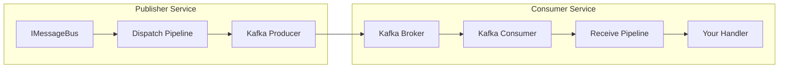
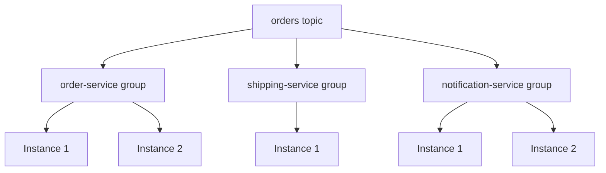
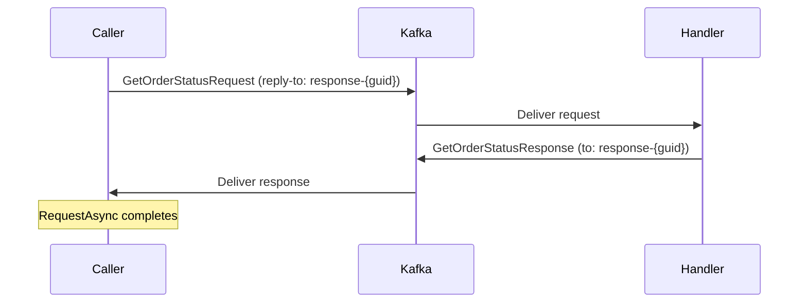

# Kafka Transport

The Mocha Kafka transport connects your application to [Apache Kafka](https://kafka.apache.org/) for durable, high-throughput messaging. It supports publish/subscribe, point-to-point commands, request-reply, batch processing, and sagas -- all through the same `IMessageBus` API you use with any Mocha transport.

## Getting Started

### Prerequisites

- .NET 8 or later
- A running Apache Kafka broker (or .NET Aspire to manage one automatically)

### Install the Package

```xml
<PackageReference Include="Mocha.Transport.Kafka" />
```

### Minimal Setup with Aspire

The recommended path to a working Kafka setup uses [.NET Aspire](https://learn.microsoft.com/en-us/dotnet/aspire/overview) to provision Kafka automatically.

**AppHost (Aspire orchestrator):**

```csharp
var builder = DistributedApplication.CreateBuilder(args);

var kafka = builder.AddKafka("kafka").WithKafkaUI();

builder
    .AddProject<Projects.MyService>("my-service")
    .WithReference(kafka)
    .WaitFor(kafka);

builder.Build().Run();
```

**Service (your application):**

```csharp
var builder = WebApplication.CreateBuilder(args);

builder.AddServiceDefaults();

var bootstrapServers = builder.Configuration.GetConnectionString("kafka")
    ?? "localhost:9092";

builder.Services
    .AddMessageBus()
    .AddInstrumentation()                      // OpenTelemetry traces and metrics
    .AddEventHandler<OrderPlacedEventHandler>() // register your handler
    .AddKafka(t =>
    {
        t.BootstrapServers(bootstrapServers);
    });

var app = builder.Build();
app.Run();
```

Aspire injects the Kafka connection string, provisions a Kafka container with UI, and wires up health checks, distributed tracing, and metrics. Your service starts consuming messages as soon as the host starts.

> **Tip:** Call `.WithKafkaUI()` on the Kafka resource to get a browser-based topic inspector at the Aspire dashboard.

### Minimal Setup without Aspire

If you are not using Aspire, point directly at your Kafka cluster:

```csharp
builder.Services
    .AddMessageBus()
    .AddEventHandler<OrderPlacedEventHandler>()
    .AddKafka(t =>
    {
        t.BootstrapServers("kafka1:9092,kafka2:9092,kafka3:9092");
    });
```

Topics are auto-provisioned by default. The transport creates any topics it needs when the host starts.

---

## Core Concepts

### How Messages Flow



Every Mocha service has one shared **producer** for all outbound messages and one **consumer per receive endpoint** for inbound messages. The transport handles serialization, header propagation, offset management, and error routing.

### Topics and Endpoints

A **topic** is a Kafka log that stores messages. Mocha maps handlers to topics through **endpoints**:

- A **receive endpoint** consumes from a topic and dispatches to your handlers
- A **dispatch endpoint** produces to a topic

When you register a handler, Mocha creates the necessary endpoints and topics automatically using naming conventions. You can also declare them explicitly.

### Consumer Groups

Each receive endpoint uses a [Kafka consumer group](https://kafka.apache.org/documentation/#intro_consumers). Multiple instances of the same service share a consumer group, so messages are load-balanced across instances. Different services each get their own consumer group, so every service receives every message (fan-out).



### Naming Conventions

Mocha converts .NET type names to kebab-case topic names:

| Pattern | Convention | Example Type | Topic Name |
|---------|-----------|--------------|------------|
| Publish (events) | `{namespace}.{type}` | `Events.OrderPlacedEvent` | `events.order-placed` |
| Send (commands) | `{type}` | `ProcessOrderCommand` | `process-order` |
| Error | `{topic}_error` | -- | `events.order-placed_error` |
| Skipped | `{topic}_skipped` | -- | `events.order-placed_skipped` |
| Reply | `response-{instance-guid}` | -- | `response-a1b2c3d4...` |

### Delivery Guarantees

The Kafka transport provides **at-least-once delivery**:

- The producer waits for acknowledgement from all in-sync replicas (`Acks.All`) with idempotent writes enabled
- The consumer commits offsets only after your handler completes successfully
- If your handler throws an exception, the message is not committed and will be redelivered

Design your handlers to be [idempotent](https://en.wikipedia.org/wiki/Idempotence) or use the inbox middleware for deduplication.

---

## Publishing Messages

### Events (Fan-Out)

Events are delivered to all subscribed services. Use `PublishAsync` to broadcast an event:

```csharp
// Define the event
public sealed class OrderPlacedEvent
{
    public required Guid OrderId { get; init; }
    public required string ProductName { get; init; }
    public required int Quantity { get; init; }
    public required decimal TotalAmount { get; init; }
    public required DateTimeOffset PlacedAt { get; init; }
}
```

```csharp
// Publish from anywhere you have IMessageBus
await messageBus.PublishAsync(
    new OrderPlacedEvent
    {
        OrderId = Guid.NewGuid(),
        ProductName = "Mechanical Keyboard",
        Quantity = 1,
        TotalAmount = 149.99m,
        PlacedAt = DateTimeOffset.UtcNow
    },
    cancellationToken);
```

Every service with a handler for `OrderPlacedEvent` receives a copy. The topic name is derived from the event type automatically.

### Commands (Point-to-Point)

Commands are delivered to exactly one endpoint. Use `SendAsync` for fire-and-forget commands:

```csharp
public sealed class ProcessOrderCommand
{
    public required Guid OrderId { get; init; }
    public required string Action { get; init; }
    public required DateTimeOffset RequestedAt { get; init; }
}
```

```csharp
await messageBus.SendAsync(
    new ProcessOrderCommand
    {
        OrderId = orderId,
        Action = "validate",
        RequestedAt = DateTimeOffset.UtcNow
    },
    cancellationToken);
```

Send requires explicit endpoint configuration so the transport knows which topic to target:

```csharp
.AddKafka(t =>
{
    t.BootstrapServers(bootstrapServers);

    t.DeclareTopic("process-order");
    t.Endpoint("process-order-ep")
        .Topic("process-order")
        .Handler<ProcessOrderCommandHandler>();
    t.DispatchEndpoint("send-demo")
        .ToTopic("process-order")
        .Send<ProcessOrderCommand>();
});
```

### Request-Reply

Request-reply lets you send a message and await a typed response. The transport creates a temporary per-instance reply topic behind the scenes.

```csharp
// Request type declares its response type
public sealed class GetOrderStatusRequest : IEventRequest<GetOrderStatusResponse>
{
    public required Guid OrderId { get; init; }
}

public sealed class GetOrderStatusResponse
{
    public required Guid OrderId { get; init; }
    public required string Status { get; init; }
    public required DateTimeOffset UpdatedAt { get; init; }
}
```

```csharp
var response = await messageBus.RequestAsync(
    new GetOrderStatusRequest { OrderId = orderId },
    cancellationToken);

// response.Status == "Processing"
```

The request blocks until the handler replies or a timeout expires (default: 2 minutes). If the handler throws, the caller receives a `RemoteErrorException`.



---

## Consuming Messages

### Event Handlers

Implement `IEventHandler<T>` and register it with the bus. The transport subscribes to the appropriate topic automatically.

```csharp
public sealed class OrderPlacedEventHandler(
    IMessageBus messageBus,
    ILogger<OrderPlacedEventHandler> logger)
    : IEventHandler<OrderPlacedEvent>
{
    public async ValueTask HandleAsync(
        OrderPlacedEvent message,
        CancellationToken cancellationToken)
    {
        logger.LogInformation(
            "Order {OrderId}: {Quantity}x {Product}",
            message.OrderId, message.Quantity, message.ProductName);

        // React to the event -- publish another event, update state, etc.
        await messageBus.PublishAsync(
            new OrderShippedEvent
            {
                OrderId = message.OrderId,
                TrackingNumber = "TRK-12345",
                Carrier = "FedEx",
                ShippedAt = DateTimeOffset.UtcNow
            },
            cancellationToken);
    }
}
```

Register the handler:

```csharp
builder.Services
    .AddMessageBus()
    .AddEventHandler<OrderPlacedEventHandler>()
    .AddKafka(t => t.BootstrapServers(bootstrapServers));
```

Multiple handlers for the same event in different services each receive every message. Multiple handlers in the same service also each receive every message independently -- one handler's failure does not affect the others.

### Command Handlers

Command handlers use the same `IEventHandler<T>` interface but are routed via `Send` rather than `Publish`:

```csharp
public sealed class ProcessOrderCommandHandler(
    ILogger<ProcessOrderCommandHandler> logger)
    : IEventHandler<ProcessOrderCommand>
{
    public ValueTask HandleAsync(
        ProcessOrderCommand message,
        CancellationToken cancellationToken)
    {
        logger.LogInformation(
            "Processing order {OrderId}, action: {Action}",
            message.OrderId, message.Action);

        return ValueTask.CompletedTask;
    }
}
```

### Request Handlers

Implement `IEventRequestHandler<TRequest, TResponse>` for typed request-reply:

```csharp
public sealed class GetOrderStatusRequestHandler(
    ILogger<GetOrderStatusRequestHandler> logger)
    : IEventRequestHandler<GetOrderStatusRequest, GetOrderStatusResponse>
{
    public ValueTask<GetOrderStatusResponse> HandleAsync(
        GetOrderStatusRequest message,
        CancellationToken cancellationToken)
    {
        logger.LogInformation("Status query for order {OrderId}", message.OrderId);

        return ValueTask.FromResult(new GetOrderStatusResponse
        {
            OrderId = message.OrderId,
            Status = "Processing",
            UpdatedAt = DateTimeOffset.UtcNow
        });
    }
}
```

Register with `.AddRequestHandler<GetOrderStatusRequestHandler>()`.

### Batch Handlers

Batch handlers accumulate messages and deliver them as a group, triggered by count or timeout -- useful for analytics, bulk database writes, or deduplication.

```csharp
public sealed class OrderAnalyticsBatchHandler(
    ILogger<OrderAnalyticsBatchHandler> logger)
    : IBatchEventHandler<OrderPlacedEvent>
{
    public ValueTask HandleAsync(
        IMessageBatch<OrderPlacedEvent> batch,
        CancellationToken cancellationToken)
    {
        var totalRevenue = batch.Sum(e => e.TotalAmount);

        logger.LogInformation(
            "Batch of {Count} orders ({Mode}): ${Revenue:F2} total revenue",
            batch.Count, batch.CompletionMode, totalRevenue);

        return ValueTask.CompletedTask;
    }
}
```

Register with batch options:

```csharp
builder.Services
    .AddMessageBus()
    .AddBatchHandler<OrderAnalyticsBatchHandler>(o =>
    {
        o.MaxBatchSize = 100;                          // deliver after 100 messages
        o.BatchTimeout = TimeSpan.FromSeconds(2);      // or after 2 seconds, whichever comes first
    })
    .AddKafka(t => t.BootstrapServers(bootstrapServers));
```

`batch.CompletionMode` tells you whether the batch was triggered by `Size` or `Time`.

### Sagas

Sagas coordinate long-running processes across multiple events. Define a state class and configure state transitions:

```csharp
public sealed class OrderFulfillmentSaga : Saga<OrderFulfillmentState>
{
    protected override void Configure(ISagaDescriptor<OrderFulfillmentState> descriptor)
    {
        descriptor
            .Initially()
            .OnEvent<OrderPlacedEvent>()
            .StateFactory(OrderFulfillmentState.FromOrderPlaced)
            .TransitionTo(AwaitingShipment);

        descriptor
            .During(AwaitingShipment)
            .OnEvent<OrderShippedEvent>()
            .Then((state, e) =>
            {
                state.TrackingNumber = e.TrackingNumber;
                state.Carrier = e.Carrier;
                state.ShippedAt = e.ShippedAt;
            })
            .TransitionTo(Fulfilled);

        descriptor
            .Finally(Fulfilled)
            .OnEntry()
            .Publish<OrderFulfilledEvent>(
                (_, state) => state.ToFulfilledEvent(),
                null);
    }
}
```

Register with `.AddSaga<OrderFulfillmentSaga>()`. Sagas use `ICorrelatable.CorrelationId` to match events to saga instances, so your event types should implement `ICorrelatable`:

```csharp
public sealed class OrderPlacedEvent : ICorrelatable
{
    public required Guid OrderId { get; init; }
    // ...other properties...
    Guid? ICorrelatable.CorrelationId => OrderId;
}
```

### Concurrency Control

By default, each receive endpoint processes messages sequentially. To enable parallel processing, set `MaxConcurrency` on the endpoint:

```csharp
.AddKafka(t =>
{
    t.BootstrapServers(bootstrapServers);
    t.Endpoint("order-processor")
        .Handler<SlowOrderHandler>()
        .MaxConcurrency(5); // process up to 5 messages concurrently
});
```

---

## Configure the Transport

### Transport-Level Options

Configure these on the `IKafkaMessagingTransportDescriptor` inside the `AddKafka` callback:

| Method | Type | Default | Description |
|--------|------|---------|-------------|
| `BootstrapServers(string)` | `string` | **(required)** | Comma-separated Kafka broker addresses (e.g. `"kafka1:9092,kafka2:9092"`) |
| `AutoProvision(bool)` | `bool` | `true` | Create topics automatically on startup |
| `ConfigureDefaults(Action<KafkaBusDefaults>)` | -- | See below | Set default topic settings for all auto-provisioned topics |
| `ConfigureProducer(Action<ProducerConfig>)` | -- | See below | Override Confluent producer settings |
| `ConfigureConsumer(Action<ConsumerConfig>)` | -- | See below | Override Confluent consumer settings |
| `IsDefaultTransport()` | -- | -- | Mark this as the default transport when multiple transports are registered |
| `BindHandlersImplicitly()` | -- | implicit | Automatically bind all registered handlers to endpoints |
| `BindHandlersExplicitly()` | -- | -- | Require manual handler-to-endpoint binding |

### Default Producer Settings

These are applied automatically. Override them with `ConfigureProducer`:

| Setting | Default | Description |
|---------|---------|-------------|
| `Acks` | `All` | Wait for all in-sync replicas to acknowledge |
| `EnableIdempotence` | `true` | Prevent duplicate delivery at the broker |
| `LingerMs` | `5` | Batch messages for up to 5ms before sending |
| `BatchNumMessages` | `10000` | Maximum messages per batch |
| `EnableDeliveryReports` | `true` | Receive delivery confirmation callbacks |

```csharp
t.ConfigureProducer(config =>
{
    config.LingerMs = 10;                             // increase batching window
    config.CompressionType = CompressionType.Snappy;  // enable compression
});
```

### Default Consumer Settings

These are applied to every consumer. Override them with `ConfigureConsumer`:

| Setting | Default | Description |
|---------|---------|-------------|
| `EnableAutoCommit` | `false` | Offsets are committed manually after handler completion |
| `AutoOffsetReset` | `Earliest` | Start from the beginning if no committed offset exists |
| `EnablePartitionEof` | `false` | Do not emit end-of-partition markers |
| `MaxPollIntervalMs` | `600000` (10 min) | Maximum time between polls before the broker considers the consumer dead |

```csharp
t.ConfigureConsumer(config =>
{
    config.MaxPollIntervalMs = 1_200_000;  // 20 minutes for slow handlers
    config.SessionTimeoutMs = 30_000;
});
```

### Bus Defaults (Topic Defaults)

Set defaults that apply to all auto-provisioned topics:

```csharp
t.ConfigureDefaults(defaults =>
{
    defaults.Topic.Partitions = 3;
    defaults.Topic.ReplicationFactor = 2;
    defaults.Topic.TopicConfigs = new Dictionary<string, string>
    {
        ["retention.ms"] = "604800000",    // 7 days
        ["cleanup.policy"] = "delete"
    };
});
```

| Property | Type | Default | Description |
|----------|------|---------|-------------|
| `Topic.Partitions` | `int?` | `1` | Number of partitions for new topics |
| `Topic.ReplicationFactor` | `short?` | `1` | Replication factor for new topics |
| `Topic.TopicConfigs` | `Dictionary<string, string>?` | `null` | Kafka topic-level configs (e.g. `retention.ms`, `cleanup.policy`, `min.insync.replicas`) |

### Receive Endpoint Options

| Method | Type | Default | Description |
|--------|------|---------|-------------|
| `Topic(string)` | `string` | endpoint name | Kafka topic to consume from |
| `ConsumerGroup(string)` | `string` | endpoint name | Consumer group ID |
| `Handler<T>()` | -- | -- | Register a handler type for this endpoint |
| `Consumer<T>()` | -- | -- | Register a consumer type for this endpoint |
| `MaxConcurrency(int)` | `int` | `1` | Maximum concurrent message processing |
| `FaultEndpoint(string)` | `string` | `kafka:///t/{topic}_error` | URI for error routing |
| `SkippedEndpoint(string)` | `string` | `kafka:///t/{topic}_skipped` | URI for skipped messages |
| `Kind(ReceiveEndpointKind)` | enum | `Default` | Endpoint kind: `Default`, `Error`, `Reply`, `Skipped` |

### Dispatch Endpoint Options

| Method | Type | Default | Description |
|--------|------|---------|-------------|
| `ToTopic(string)` | `string` | -- | Target Kafka topic |
| `Send<T>()` | -- | -- | Register this endpoint for send (point-to-point) messages of type `T` |
| `Publish<T>()` | -- | -- | Register this endpoint for publish (fan-out) messages of type `T` |

---

## Topic Management

### Auto-Provisioning

Auto-provisioning is enabled by default. When the host starts, the transport creates any topics that do not already exist on the broker, including:

- Topics for each receive endpoint
- Topics for each dispatch endpoint
- Error topics (`{topic}_error`) for each default-kind receive endpoint
- Skipped topics (`{topic}_skipped`) for each default-kind receive endpoint

If a topic already exists, the transport ignores the "topic already exists" error and continues.

To disable auto-provisioning:

```csharp
t.AutoProvision(false);
```

### Declaring Topics Explicitly

For production environments where you want precise control over topic settings, declare topics explicitly:

```csharp
t.DeclareTopic("orders")
    .Partitions(6)
    .ReplicationFactor(3)
    .WithConfig("retention.ms", "604800000")     // 7 days
    .WithConfig("min.insync.replicas", "2");
```

Explicitly declared topics take precedence over convention-generated defaults.

### Per-Topic Auto-Provisioning

You can disable auto-provisioning for individual topics while keeping it enabled globally:

```csharp
t.AutoProvision(true);                           // global default: auto-provision

t.DeclareTopic("managed-externally")
    .Partitions(12)
    .AutoProvision(false);                       // this topic is managed outside Mocha
```

### Topic Configuration Hierarchy

Settings are resolved in this order (highest priority last):

1. **Bus defaults** (`ConfigureDefaults`) -- applied to all auto-provisioned topics
2. **Explicit declarations** (`DeclareTopic`) -- override bus defaults for specific topics
3. **Convention discovery** -- topics created automatically from handler registrations use bus defaults

---

## Error Handling

### What Happens When a Handler Fails

When your handler throws an exception, the following occurs:

1. The **fault middleware** catches the exception
2. For **request-reply** messages: a `NotAcknowledgedEvent` is sent back to the caller, which surfaces as a `RemoteErrorException`
3. For **publish/send** messages: the original message is dispatched to the **error topic** with fault metadata in the headers
4. The offset is committed (the message has been handled -- routed to the error topic)

If the error routing itself fails (e.g., the error topic is unreachable), the offset is **not** committed and the message will be redelivered on the next poll.

### Error Topics

Every default-kind receive endpoint gets an error topic named `{topic}_error`. Error messages arrive with these additional headers:

| Header | Description |
|--------|-------------|
| `fault-exception-type` | Full type name of the exception |
| `fault-message` | Exception message text |
| `fault-stack-trace` | Stack trace |
| `fault-timestamp` | ISO 8601 timestamp of the failure |

To consume error messages for inspection or reprocessing:

```csharp
t.Endpoint("orders-error-consumer")
    .Topic("orders_error")
    .Kind(ReceiveEndpointKind.Error)
    .Consumer<ErrorInspectionConsumer>();
```

### Skipped Messages

Messages that no registered handler can process are routed to the skipped topic (`{topic}_skipped`). This prevents unhandled messages from blocking the consumer.

### Custom Fault Endpoints

To route failures to a custom topic instead of the default error topic:

```csharp
t.Endpoint("order-processor")
    .Handler<OrderHandler>()
    .FaultEndpoint("kafka:///t/order-failures");
```

### Poison Messages

A poison message is one that always fails processing. Because the transport commits the offset after routing to the error topic, poison messages do not block the consumer. They appear in the error topic for investigation.

If error routing itself fails repeatedly, the message remains at the same offset and is redelivered. Monitor your error topics to catch this scenario.

> **Warning:** The transport does not implement automatic retry with backoff. If you need retry logic, implement it in your handler or use custom middleware. For most cases, routing to the error topic and processing failures separately is the recommended pattern.

### Inbox (Deduplication)

For handlers that must not process the same message twice, enable the inbox middleware:

```csharp
builder.Services
    .AddMessageBus()
    .AddEventHandler<OrderPlacedEventHandler>()
    .UseInboxCore()
    .AddKafka(t =>
    {
        t.BootstrapServers(bootstrapServers);
    });
```

The inbox tracks message IDs and skips duplicates. Messages with a `null` message ID bypass deduplication.

---

## Testing

### Integration Tests with Testcontainers

The recommended approach for testing Kafka transport code uses [Testcontainers](https://dotnet.testcontainers.org/) to run a real Kafka broker in Docker:

```csharp
public sealed class KafkaFixture : IAsyncLifetime
{
    private readonly KafkaContainer _container = new KafkaBuilder()
        .WithImage("confluentinc/cp-kafka:7.6.0")
        .Build();

    public string BootstrapServers => _container.GetBootstrapAddress();

    public async ValueTask InitializeAsync()
        => await _container.StartAsync();

    public async ValueTask DisposeAsync()
        => await _container.DisposeAsync();
}
```

```csharp
[Collection("Kafka")]
public class OrderHandlerTests(KafkaFixture kafka)
{
    [Fact]
    public async Task PublishAsync_Should_DeliverToHandler()
    {
        var recorder = new MessageRecorder();
        var orderId = Guid.NewGuid();

        await using var bus = await new ServiceCollection()
            .AddSingleton(recorder)
            .AddMessageBus()
            .AddEventHandler<RecordingOrderHandler>()
            .AddKafka(t => t.BootstrapServers(kafka.BootstrapServers))
            .BuildTestBusAsync();

        using var scope = bus.Provider.CreateScope();
        var messageBus = scope.ServiceProvider.GetRequiredService<IMessageBus>();

        await messageBus.PublishAsync(new OrderPlacedEvent
        {
            OrderId = orderId,
            ProductName = "Widget",
            Quantity = 1,
            TotalAmount = 9.99m,
            PlacedAt = DateTimeOffset.UtcNow
        }, CancellationToken.None);

        Assert.True(
            await recorder.WaitAsync(TimeSpan.FromSeconds(10)),
            "Handler was not invoked within timeout");

        var received = Assert.Single(recorder.Messages.OfType<OrderPlacedEvent>());
        Assert.Equal(orderId, received.OrderId);
    }
}
```

> **Note:** Use unique topic prefixes per test to prevent cross-test interference. The test infrastructure in the Mocha repository generates prefixes from the test name using SHA256 hashing.

### Unit Testing Handlers

Handlers are plain classes with constructor injection. Test them directly without the transport:

```csharp
[Fact]
public async Task HandleAsync_Should_PublishShippedEvent()
{
    var mockBus = new Mock<IMessageBus>();
    var handler = new OrderPlacedEventHandler(mockBus.Object, NullLogger<OrderPlacedEventHandler>.Instance);

    await handler.HandleAsync(
        new OrderPlacedEvent { OrderId = Guid.NewGuid(), /* ... */ },
        CancellationToken.None);

    mockBus.Verify(
        b => b.PublishAsync(It.IsAny<OrderShippedEvent>(), It.IsAny<CancellationToken>()),
        Times.Once);
}
```

---

## Observability

### OpenTelemetry Integration

Call `AddInstrumentation()` on the message bus builder to enable distributed tracing and metrics:

```csharp
builder.Services
    .AddMessageBus()
    .AddInstrumentation()
    .AddKafka(t => t.BootstrapServers(bootstrapServers));
```

This adds:

- **Dispatch instrumentation** -- traces for every outbound message with topic, message type, and correlation IDs
- **Receive instrumentation** -- traces for every inbound message through the handler pipeline

Traces propagate across services through Kafka message headers, so a publish in Service A links to the handler invocation in Service B in your trace viewer.

### Logging

The transport logs through `ILogger<T>` at standard levels:

| Level | Events |
|-------|--------|
| Debug | Producer/consumer lifecycle, librdkafka internal messages |
| Information | Partition assignments, consumer group membership changes |
| Error | Consumer errors, delivery failures |
| Critical | Processing pipeline failures |

To see detailed message flow during development:

```csharp
builder.Logging.AddFilter("Mocha.Transport.Kafka", LogLevel.Debug);
```

### Developer Topology Endpoint

Map the developer topology endpoint to inspect the configured bus at runtime:

```csharp
app.MapMessageBusDeveloperTopology();
```

This exposes a JSON representation of all configured topics, endpoints, handlers, and routes at a developer endpoint.

---

## Troubleshooting

### "Bootstrap servers not configured"

You called `AddKafka` without specifying bootstrap servers. Add `t.BootstrapServers("your-broker:9092")` inside the configuration callback. If using Aspire, ensure the connection string is named correctly:

```csharp
var bootstrapServers = builder.Configuration.GetConnectionString("kafka");
```

### Messages are not being received

1. **Check the topic name.** If your handler is registered but nothing arrives, verify the topic name matches between publisher and consumer. Use `app.MapMessageBusDeveloperTopology()` to inspect the configured topology.
2. **Check the consumer group.** If you scaled down to zero consumers and scaled back up, the consumer group may have committed offsets past all messages. New messages published after the consumer starts will be delivered normally.
3. **Check auto-provisioning.** If `AutoProvision` is `false`, the topic must exist on the broker before the consumer starts. The consumer subscribes on startup and will not receive messages from topics created later.

### Consumer group rebalancing during deployments

When you deploy a new version of your service, Kafka reassigns partitions across the new set of consumers. During this rebalancing window (typically a few seconds), message processing pauses.

To minimize disruption:
- Use rolling deployments so at least one instance is always consuming
- Tune `SessionTimeoutMs` (default: 10 seconds in Confluent client) to control how quickly the broker detects a dead consumer

### RequestAsync times out with ResponseTimeoutException

The default request-reply timeout is 2 minutes. Common causes:

1. **No handler registered** for the request type -- the message sits in the topic unconsumed
2. **Handler throws** -- check the error topic for the fault details
3. **Reply topic not provisioned** -- ensure auto-provisioning is enabled or create the reply topic manually

### High consumer lag

If consumers fall behind:

1. **Increase partitions** to enable more consumer instances: `t.DeclareTopic("orders").Partitions(12)`
2. **Increase `MaxConcurrency`** on the endpoint: `.MaxConcurrency(10)`
3. **Tune the producer batching** for higher throughput: `config.LingerMs = 10; config.BatchNumMessages = 20000`
4. **Check handler performance** -- a slow handler directly limits throughput since each consumer processes messages sequentially by default

### Serialization errors

If you see deserialization failures in the error topic, the producer and consumer likely disagree on the message schema. Verify that:

- Both services reference the same version of the contracts assembly
- The `ContentType` header matches the serializer configured on the consumer
- Custom headers are UTF-8 encoded strings

---

## Limitations

The Kafka transport has the following known limitations:

- **No automatic retry with backoff.** Failed messages are routed to the error topic. Implement retry logic in your handler or in a separate error-topic consumer.
- **Sequential processing by default.** Each consumer processes one message at a time. Use `MaxConcurrency` for parallel processing, but note this changes offset commit ordering.
- **No transactional outbox.** Exactly-once semantics across Kafka and your database require application-level coordination (e.g., inbox/outbox pattern).
- **Reply topics scale with instances.** Each service instance creates its own reply topic. Short retention (1 hour, auto-configured) keeps broker storage manageable, but be aware of this if running many instances.
- **No regex/wildcard topic subscriptions.** Each endpoint subscribes to a single named topic.
- **No tombstone message support.** Log compaction patterns with null-value messages are not built in.
- **No multi-cluster support.** Each `AddKafka` call targets a single Kafka cluster.
- **Producer configuration is global.** All dispatch endpoints share a single producer, so producer settings (batching, compression, acks) apply uniformly.

---

## Full Configuration Example

This example shows a production-oriented configuration with explicit topics, tuned producer/consumer settings, and multiple handler types:

```csharp
builder.Services
    .AddMessageBus()
    .AddInstrumentation()
    .AddSaga<OrderFulfillmentSaga>()
    .AddEventHandler<OrderShippedEventHandler>()
    .AddRequestHandler<GetOrderStatusRequestHandler>()
    .AddBatchHandler<OrderAnalyticsBatchHandler>(o =>
    {
        o.MaxBatchSize = 100;
        o.BatchTimeout = TimeSpan.FromSeconds(2);
    })
    .AddEventHandler<ProcessOrderCommandHandler>()
    .AddKafka(t =>
    {
        t.BootstrapServers("kafka1:9092,kafka2:9092,kafka3:9092");
        t.AutoProvision(true);

        // Default topic settings for all auto-provisioned topics
        t.ConfigureDefaults(defaults =>
        {
            defaults.Topic.Partitions = 3;
            defaults.Topic.ReplicationFactor = 2;
            defaults.Topic.TopicConfigs = new Dictionary<string, string>
            {
                ["retention.ms"] = "604800000",         // 7 days
                ["compression.type"] = "snappy"
            };
        });

        // Explicit topic with custom settings
        t.DeclareTopic("high-throughput-events")
            .Partitions(12)
            .ReplicationFactor(3)
            .WithConfig("min.insync.replicas", "2");

        // Producer tuning
        t.ConfigureProducer(config =>
        {
            config.LingerMs = 10;
            config.CompressionType = CompressionType.Snappy;
        });

        // Consumer tuning
        t.ConfigureConsumer(config =>
        {
            config.SessionTimeoutMs = 30_000;
        });

        // Explicit send pattern
        t.DeclareTopic("process-order");
        t.Endpoint("process-order-ep")
            .Topic("process-order")
            .Handler<ProcessOrderCommandHandler>();
        t.DispatchEndpoint("send-demo")
            .ToTopic("process-order")
            .Send<ProcessOrderCommand>();
    });
```

---

## Message Headers

The transport uses Kafka message headers to carry envelope metadata. All headers use the `mocha-` prefix:

| Header | Description |
|--------|-------------|
| `mocha-message-id` | Unique message identifier (UUID v7) |
| `mocha-correlation-id` | Correlation identifier for related messages |
| `mocha-conversation-id` | Conversation identifier spanning a chain of messages |
| `mocha-causation-id` | ID of the message that caused this message |
| `mocha-source-address` | URI of the source endpoint |
| `mocha-destination-address` | URI of the destination endpoint |
| `mocha-response-address` | URI for reply messages |
| `mocha-fault-address` | URI for fault routing |
| `mocha-content-type` | Serialization content type (e.g. `application/json`) |
| `mocha-message-type` | Fully qualified .NET type name |
| `mocha-sent-at` | ISO 8601 timestamp |
| `mocha-enclosed-message-types` | Comma-separated type hierarchy for polymorphic dispatch |

The message key is set to the correlation ID (or message ID if no correlation ID exists), which ensures related messages are routed to the same partition for ordering.

Custom headers added via `MessageOptions.Headers` are passed through as-is.

## URI Addressing

The transport supports multiple URI schemes for addressing topics:

| Scheme | Example | Use |
|--------|---------|-----|
| `kafka://host:port/t/topic` | `kafka://localhost:9092/t/orders` | Fully qualified topic reference |
| `kafka:///t/topic` | `kafka:///t/orders` | Topology-relative topic reference |
| `topic://name` | `topic://orders` | Shorthand topic reference |
| `topic:name` | `topic:orders` | Shorthand topic reference (colon form) |

You typically encounter these in `FaultEndpoint` and `SkippedEndpoint` configurations:

```csharp
t.Endpoint("orders")
    .Handler<OrderHandler>()
    .FaultEndpoint("kafka:///t/order-failures");
```

---

## Next Steps

- **Run the example project** in `examples/KafkaTransport/` to see publish, send, request-reply, batch, and saga patterns working end-to-end with Aspire.
- **Add observability** with `AddInstrumentation()` to get distributed traces and metrics in your telemetry backend.
- **Explore middleware** to add cross-cutting concerns like deduplication (inbox), logging, or custom error handling to your message pipeline.
- **Tune for production** by configuring explicit topics with appropriate partition counts, replication factors, and retention policies. See the [Full Configuration Example](#full-configuration-example) for a starting point.
