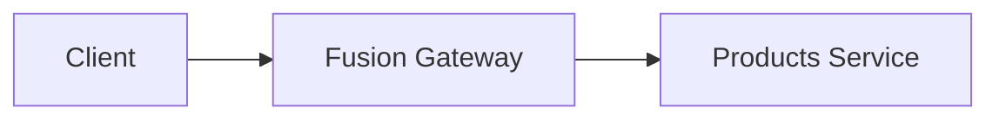

# website-next

The ChilliCream website and documentation, built on Next.js (MDX-based docs).

> [!NOTE]
> This is **not** the Next.js you may know from training data. APIs, conventions,
> and file structure may differ. Read the relevant guide in
> `node_modules/next/dist/docs/` before writing app/build code.

## Development

Use `yarn` (not `npm`):

```bash
yarn
yarn dev
```

## Writing Documentation

Docs live in `content/docs/<product>/...` as Markdown (`.md`) files and are
compiled with a custom MDX pipeline (`src/mdx-plugins.ts`). The rules below are
specific to this repo. Following them keeps the build green (several of these are
enforced at build time and will fail the build if violated).

### File layout

```
content/docs/<product>/<section>/<page>.md
content/docs/<product>/<section>/structure.yaml   # sidebar for that directory
content/docs/<product>/index.md                   # the product/section landing page
```

A directory's `index.md` is its landing page. Images do **not** live next to docs
(see [Images](#images)).

### Frontmatter

Every doc starts with YAML frontmatter:

```markdown
---
title: "Page Title"
description: "One-sentence summary used for SEO and Open Graph."
---
```

- `title` is rendered by the page layout as the page's single `<h1>`.
- **Do not repeat the title as the first heading in the body.** The layout already
  shows it, so a `# Page Title` at the top produces a duplicate heading.
- Headings are **automatically demoted one level** at build time
  (`src/remark/demoteHeadings.mjs`): write `#` in source and it renders as `<h2>`,
  `##` renders as `<h3>`, and so on. So author your top-level sections with `#`.

### Sidebar (`structure.yaml`)

The sidebar is built by walking the directory tree
(`src/helpers/buildContentTree.ts`). **Every directory that appears in the
navigation must contain a `structure.yaml`.**

```yaml
title: Section Title
items:
  - path: index # resolves to ./index.md, used as the section landing page
    title: Overview
  - path: getting-started # resolves to ./getting-started.md
    title: Getting Started
  - path: guides # a subdirectory -> must have its own structure.yaml
    title: Guides
```

- `items` is a **flat** list for the current directory only. Nesting is expressed
  through subdirectories, each with its own `structure.yaml`.
- A `path` resolves to `<path>.md` if that file exists, otherwise to the
  subdirectory `<path>/` (which must contain `index.md` to be linkable and a
  `structure.yaml`).
- A referenced item that doesn't exist on disk fails the build.

### Links

Link directly to the target Markdown file using a **relative filesystem path**.
The `rewriteMdLinks` remark plugin rewrites these to the correct route at build
time, and **fails the build on broken links**.

```markdown
[Sibling page](./other-page.md)
[Page in another section](../guides/first-party-api.md)
[Cross-product page](../../hotchocolate/index.md)
[Deep link with anchor](./other-page.md#a-section)
[Same-page anchor](#a-section) <!-- just the hash, no file -->
```

- Always point at the `.md` file (e.g. `./cli.md`, not `/docs/.../cli`).
- For a directory/section landing page, link to its `index.md`
  (e.g. `./guides/index.md`).
- Same-page anchors are just `#anchor` (no file path).
- Links to **other doc versions** (not present in this repo) or external sites use
  absolute URLs, e.g. `https://chillicream.com/docs/hotchocolate/v13/...`.

### Images

Store images under a product namespace in `public/`, **not** next to the docs:

```
public/images/<product>-docs/<name>.webp
```

Reference them with a relative path that resolves **into `public/`**; the
`rewriteMdLinks` plugin rewrites it to a rooted URL (`/images/...`) at build time:

```markdown

```

(Use as many `../` as needed to reach the repo root from the doc's directory.) The
build fails if the referenced file does not exist.

### YouTube videos

Put a YouTube link **alone in its own paragraph**. The `youtubeEmbed` remark
plugin converts it into an embedded player; the link text becomes the play-button
label. A raw Markdown viewer (e.g. GitHub) still shows a clickable link.

```markdown
[Watch the video on YouTube](https://www.youtube.com/watch?v=VIDEO_ID)
```

A YouTube link inside surrounding prose is left as a normal inline link.

### Admonitions

Use GitHub-style alert blockquotes. Supported kinds: `NOTE`, `TIP`, `WARNING`,
`CAUTION`, `EXPERIMENTAL`.

```markdown
> [!WARNING]
> This action cannot be undone.
```

### Diagrams (Mermaid)

Prefer Mermaid over a static image for diagrams (flowcharts, sequence diagrams).
Use a fenced ```mermaid block. Styling (colors, rounded nodes, dimmed lines) is
applied automatically via the theme in `src/mdx-plugins.ts`, so don't hard-code
colors.

````markdown

````

> [!IMPORTANT]
> Keep node labels on a **single line**. Multi-line (`<br/>`) or auto-wrapped
> labels are mis-measured during headless rendering and get clipped at the box
> edge. If a label is long, keep it concise rather than wrapping it.

### MDX gotchas

- **Escape literal curly braces.** Raw `{...}` is parsed as a JavaScript
  expression and breaks the build (e.g. format specifiers, placeholders). Write
  `\{` and `\}`, or wrap the value in backticks.
- HTML comments (`<!-- ... -->`) are stripped before compilation; don't rely on
  them rendering.
- A range of MDX components is available (e.g. `Tabs`, `ExampleTabs`,
  `PackageInstallation`); see `mdx-components.tsx` for the full set.
