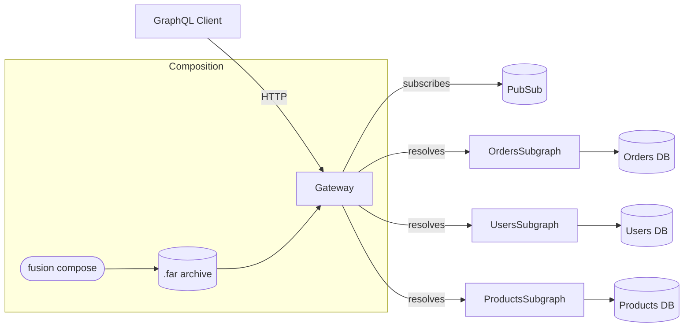
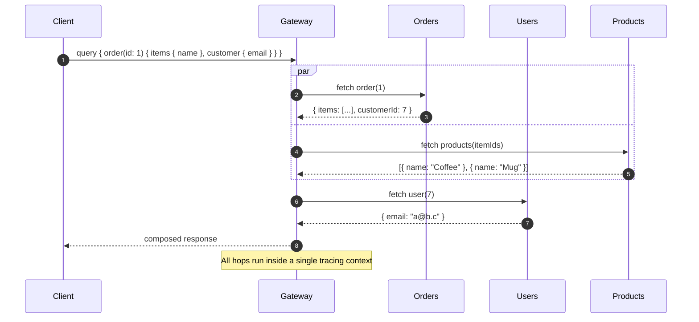
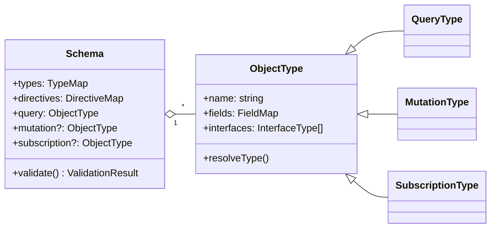
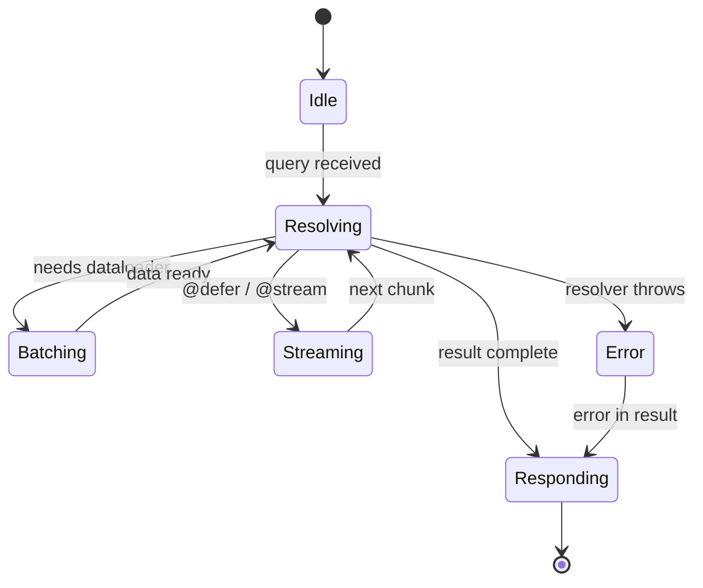
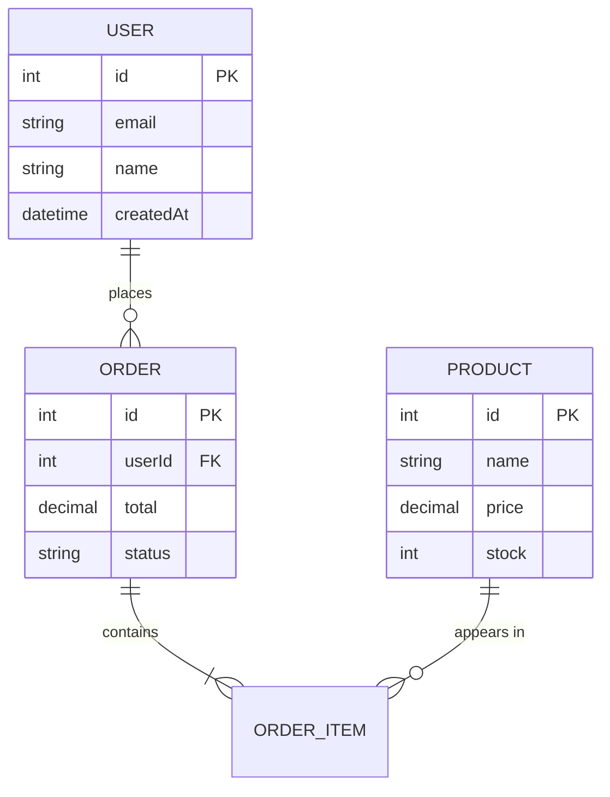
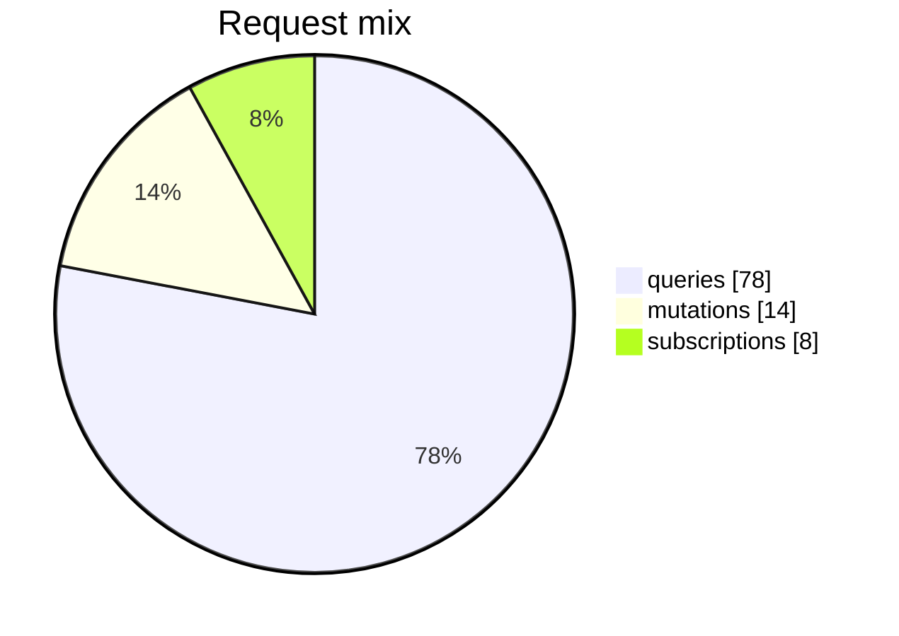

This page is the canonical exercise for the docs renderer. Every standard
markdown feature, every custom component registered in `mdx-components.tsx`,
and a representative set of Mermaid diagrams appear below. If something is
missing here, it isn't supported yet.

# Headings

Headings render with the `Typography` component and produce anchor links on
hover. They also feed the table of contents on the right.

## Heading two

### Heading three

#### Heading four

# Text and inline elements

Paragraphs use the body variant. You can combine **bold**, *italic*,
***bold italic***, ~~struck-through text~~, and `inline code` freely. Inline links
work the same as anywhere else — see the [HotChocolate docs](/docs/hotchocolate)
or an [external resource](https://graphql.org/).

# Lists

Unordered list with nested items:

- Source schemas describe a single service.
- The composed schema is built from one or more source schemas.
  - Composition resolves keys, lookups, and shared fields.
  - The result is a `.far` archive consumed by the gateway.
- Validation runs on every published schema.

Ordered list:

1. Upload the source schema.
2. Publish the archive to a stage.
3. Cut the gateway over to the new archive.

# Blockquote

> A blockquote that doesn't start with an admonition marker renders with the
> `Quote` component. Use it for short callouts that aren't tied to a kind.

# Admonitions

GitHub-style alert markers on a blockquote upgrade it to an `Admonition`.
All six kinds are supported.

> [!NOTE]
> A neutral piece of context the reader should keep in mind.

> [!TIP]
> A small recommendation that improves the result but isn't strictly required.

> [!IMPORTANT]
> Information the reader will need later in the page or workflow.

> [!WARNING]
> Something that can fail or behave surprisingly if ignored.

> [!CAUTION]
> A risk of data loss or other destructive outcome — proceed deliberately.

> [!EXPERIMENTAL]
> A preview API that may change before stabilizing.

# Tables

GFM tables work as expected. Column alignment is honoured.

| Stage  | Artifact              | Consumer              |
| ------ | --------------------- | --------------------- |
| Build  | `schema.graphql`      | `nitro fusion upload` |
| Deploy | `.far` archive        | Fusion gateway        |
| PR     | composed gateway plan | Validation pipeline   |

# Code blocks

Plain fenced code with a language tag:

```ts
export function add(a: number, b: number): number {
  return a + b;
}
```

A code block with a filename and highlighted lines (`{3-5}`):

```ts filename="Program.cs" {3-5}
var builder = WebApplication.CreateBuilder(args);

builder.Services
    .AddGraphQLServer()
    .AddSourceSchemaDefaults();

var app = builder.Build();
app.MapGraphQL();
app.Run();
```

# Code steps

The `[[step, line, token]]` meta annotates a code block with named tokens.
Hovering a `<CodeStep>` reference dims the surrounding code in the figure that
declares the matching step.

```ts filename="Resolver.cs" [[1, 4, "GetProductById"], [2, 5, "id"], [3, 6, "ProductRepository"]]
public sealed class Query
{
    [Lookup]
    public Task<Product?> GetProductById(
        [ID] int id,
        ProductRepository repository,
        CancellationToken cancellationToken)
        => repository.FindAsync(id, cancellationToken);
}
```

The lookup is named <CodeStep step={1}>GetProductById</CodeStep>, takes a
single key argument <CodeStep step={2}>id</CodeStep>, and resolves through the
<CodeStep step={3}>ProductRepository</CodeStep> data loader.

# Horizontal rule

A rule renders as the `Divider` component.

---

# Images

Standard markdown images render through the `Image` component, which adds
a soft ring and rounded corners.


# Tabs

The generic `Tabs` / `Tab` combo is the lowest-level building block. Other
choice tabs (API, input, pipeline) wrap it for specific axes.

<Tabs>
  <Tab label="C#">
    ```csharp
    builder.Services.AddGraphQLServer();
    ```
  </Tab>
  <Tab label="F#">
    ```fsharp
    builder.Services.AddGraphQLServer() |> ignore
    ```
  </Tab>
  <Tab label="VB">
    ```vb
    builder.Services.AddGraphQLServer()
    ```
  </Tab>
</Tabs>

## ApiChoiceTabs

Pick between Minimal APIs and regular controller-style hosting.

<ApiChoiceTabs>
<ApiChoiceTabs.MinimalApis>

```csharp
var app = builder.Build();
app.MapGraphQL();
app.Run();
```

</ApiChoiceTabs.MinimalApis>
<ApiChoiceTabs.Regular>

```csharp
public class Startup
{
    public void Configure(IApplicationBuilder app)
    {
        app.UseRouting();
        app.UseEndpoints(e => e.MapGraphQL());
    }
}
```

</ApiChoiceTabs.Regular>
</ApiChoiceTabs>

## InputChoiceTabs

Pick between CLI and Visual Studio. The `PackageInstallation` component below
uses this internally.

<InputChoiceTabs>
<InputChoiceTabs.CLI>

```bash
dotnet add package HotChocolate.AspNetCore
```

</InputChoiceTabs.CLI>
<InputChoiceTabs.VisualStudio>

Right-click the project → **Manage NuGet Packages…** → search for
`HotChocolate.AspNetCore` and install the latest version.

</InputChoiceTabs.VisualStudio>
</InputChoiceTabs>

## PipelineChoiceTabs

Pick between a GitHub Action and a CLI invocation for a pipeline step.

<PipelineChoiceTabs>
<PipelineChoiceTabs.GitHubAction>

```yaml
- uses: ChilliCream/nitro-fusion-publish@v16
  with:
    tag: ${{ github.sha }}
    stage: prod
    api-id: ${{ secrets.NITRO_API_ID }}
    api-key: ${{ secrets.NITRO_API_KEY }}
    source-schemas: |
      products
```

</PipelineChoiceTabs.GitHubAction>
<PipelineChoiceTabs.CLI>

```bash
dotnet nitro fusion publish \
  --tag "${GITHUB_SHA}" \
  --stage "prod" \
  --api-id "${NITRO_API_ID}" \
  --api-key "${NITRO_API_KEY}" \
  --source-schema "products"
```

</PipelineChoiceTabs.CLI>
</PipelineChoiceTabs>

## ExampleTabs

Show the same example across implementation-first, code-first, and
schema-first styles. The Schema tab is hidden on `/v16/` routes.

<ExampleTabs>
<Implementation>

```csharp
[QueryType]
public static class Query
{
    public static string Hello() => "World";
}
```

</Implementation>
<Code>

```csharp
public class Query
{
    public string Hello() => "World";
}

public class QueryType : ObjectType<Query>
{
    protected override void Configure(IObjectTypeDescriptor<Query> d)
        => d.Field(q => q.Hello()).Type<NonNullType<StringType>>();
}
```

</Code>
<Schema>

```graphql
type Query {
  hello: String!
}
```

</Schema>
</ExampleTabs>

# PackageInstallation

A shortcut that renders the install instructions for a NuGet package using
`InputChoiceTabs` under the hood.

<PackageInstallation packageName="HotChocolate.AspNetCore" />

# Video

A plain markdown link to a YouTube video.

[Watch the introduction video](https://www.youtube.com/watch?v=dQw4w9WgXcQ)

# Mermaid diagrams

Mermaid fences are rendered to inline SVG at build time, so no Mermaid
runtime ships to the browser. The full theme follows the Tailwind palette
configured in `src/mdx-plugins.ts`.

## Flowchart



## Sequence diagram



## Class diagram



## State diagram



## Entity-relationship diagram



## Pie chart


