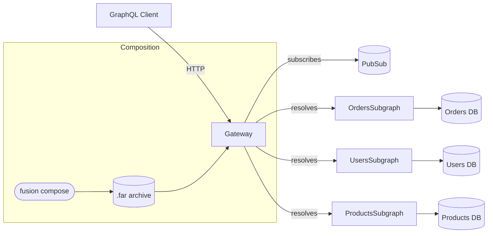
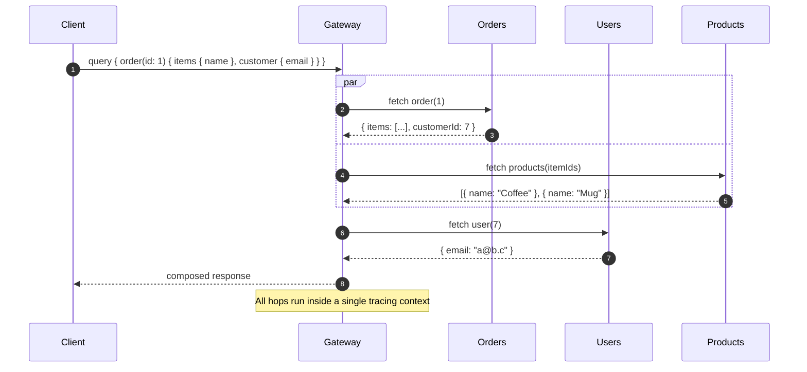
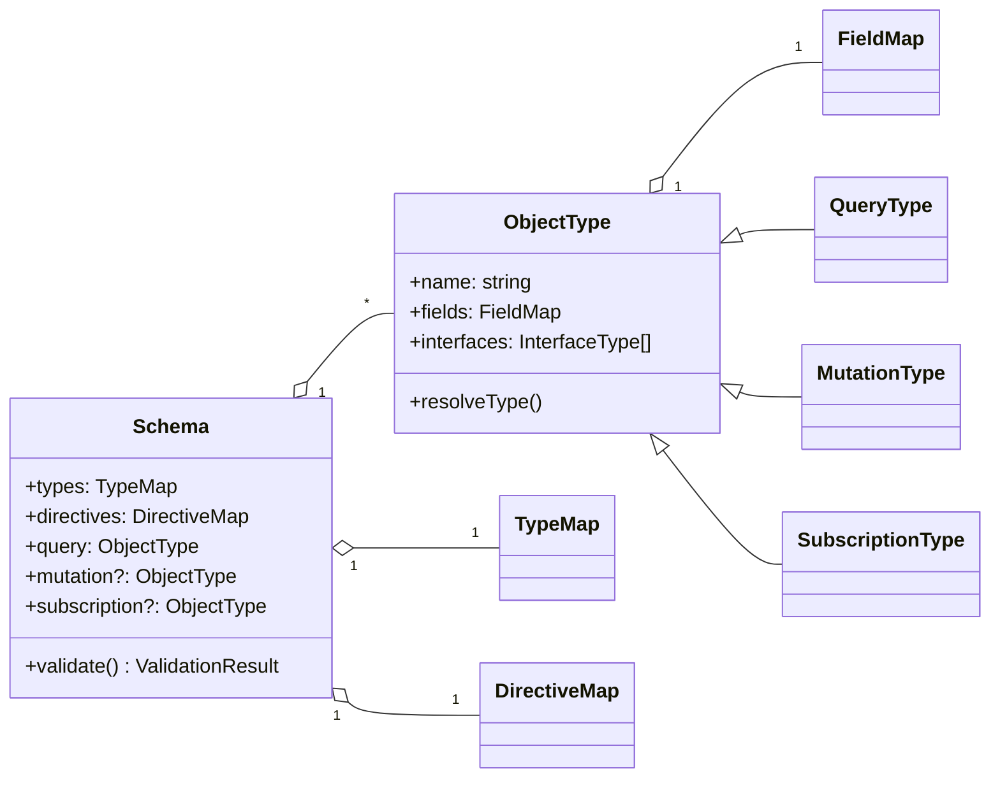
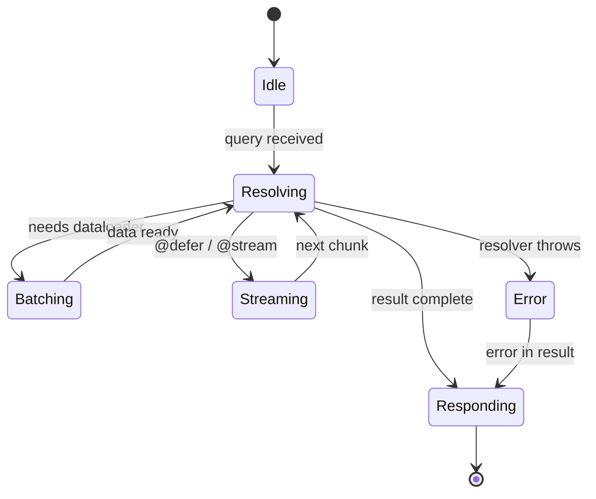
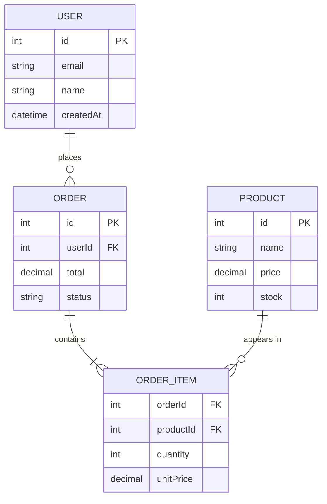
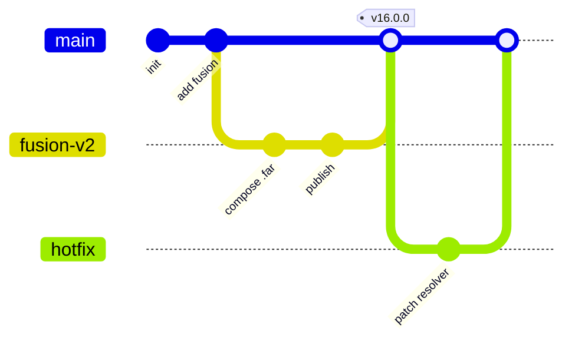
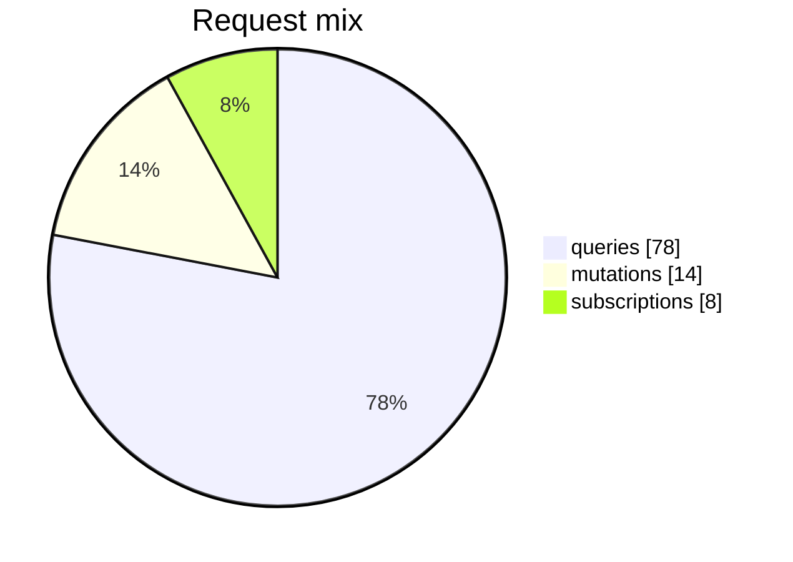

A mixed bag of Mermaid diagrams used to verify the build-time SVG pipeline.
Every diagram below is rendered to inline SVG at build time, so no Mermaid
runtime ships to the browser.

# Flowchart

# Sequence Diagram

# Class Diagram

# State Diagram

# Entity Relationship Diagram

# Git Graph

# Pie Chart

