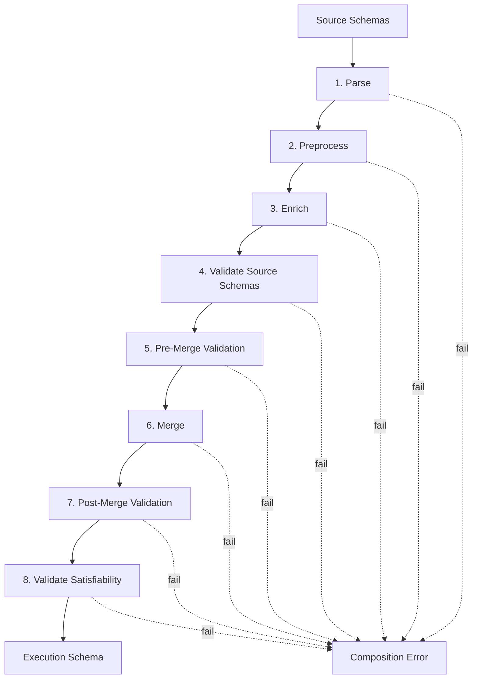

## What Is Composition?

Composition is the build-time process that takes one or more **source schemas** (the schemas exported by your subgraphs) and produces a single, validated, distributable **execution schema** that the gateway uses to plan and execute distributed queries.

Each subgraph is a standalone GraphQL service that exposes a source schema. On its own, a source schema cannot tell whether its types are compatible with the rest of your system, whether the fields it declares actually overlap correctly with another team's source schema, or whether every entity it references can be resolved somewhere. Composition is the step that answers these questions before anything is deployed.

The pipeline runs on the developer machine or in CI. It validates each source schema individually, checks that the schemas are compatible with each other, merges them into one unified schema, validates the merged result, and finally checks that every reachable field can be resolved by at least one subgraph. If any of those phases produces errors, composition fails and emits diagnostic log codes that point to the exact rule that was violated.

The output of a successful composition is a **Fusion archive**: a package built around the execution schema. Lookup, key, and ownership information is embedded directly into the schema as directives, so the gateway has everything it needs to plan and execute distributed queries by reading the schema alone. The gateway loads this archive at startup and never sees raw source schemas, only the composed result.

Composition is the safety net of a Fusion deployment. It catches schema conflicts (mismatched types, broken `@key` references, unreachable fields, ambiguous ownership) at build time, not at request time. A query that succeeds against the gateway is guaranteed to be answerable by your fleet of subgraphs because composition has already proven it.

If you are still onboarding, start with [Getting Started](./getting-started.md). The pages on [Entities and Lookups](./entities-and-lookups.md) and [Field Ownership](./field-ownership-and-sharing.md) cover the directives most often referenced by the log codes below.

## The Composition Pipeline

Composition runs as an ordered set of phases. Each phase reads the output of the previous one, runs its rules, and either passes the schema to the next phase or aborts with diagnostic errors. Composition halts at the first phase that produces errors. Within a single phase, several errors may be reported together before the pipeline stops at the phase boundary.



### 1. Parse Source Schemas

Parses each source schema into an internal representation. This phase catches syntactically invalid SDL (`INVALID_GRAPHQL`).

### 2. Preprocess Source Schemas

Normalizes each source schema for composition. This includes applying tag-based exclusions and any version-specific or interop transformations needed before the validation phases run.

### 3. Enrich Source Schemas

Decorates each schema with metadata extracted from directives, such as key fields, shareability, accessibility flags, and lookup information. The metadata is attached to types and fields so later phases can reason about them efficiently without re-parsing directive arguments.

### 4. Validate Source Schemas

Runs per-schema validation rules against each source schema independently. Each source schema is checked on its own at this stage, before any cross-schema reasoning. Examples of issues caught here include `@external` placed on an interface field, malformed `@key` selection sets, root types with non-default names, and `@override` referencing the same source schema.

### 5. Pre-Merge Validation

Validates compatibility _across_ source schemas. This is where the pipeline checks that two source schemas which both define the same type agree on its shape: enum values match, output field types are mergeable, external argument types align, and input types declare the same required fields. Most "two source schemas disagree" diagnostics are surfaced here.

### 6. Merge Source Schemas

Combines all validated source schemas into a single merged schema. Same-named types are unified, Fusion metadata is applied, and lookup information is recorded so the gateway knows which subgraph owns which field.

### 7. Post-Merge Validation

Validates the merged schema as a whole. The rules here treat the composed schema as if it were a single GraphQL schema and check global invariants: no merged type is empty, all interfaces are implemented, no field references an inaccessible or internal type, the root query type exposes accessible fields, and default values do not point at inaccessible enum values.

### 8. Validate Satisfiability

Performs reachability analysis. Starting from the root types, the pipeline walks every reachable field in the merged schema and confirms it can be resolved by at least one subgraph given the available `@lookup` and `@key` paths. If a field is reachable from a query but no subgraph can produce it, satisfiability fails with `UNSATISFIABLE`. This is the last line of defense against shapes that look valid statically but cannot actually be served at runtime.

## Common Scenarios

A few rules account for most composition failures. Knowing the shape of the error helps you spot the cause quickly.

**Two source schemas return different types for the same field.** If `Product.price` is `Float` in one source schema and `Int` in another, composition fails with `OUTPUT_FIELD_TYPES_NOT_MERGEABLE`. Align the types in the source schemas.

**A field is defined in multiple source schemas without `@shareable`.** Defining `User.name` in both Accounts and Reviews without marking it `@shareable` produces `INVALID_FIELD_SHARING`.

```graphql
# Accounts source schema
type User @key(fields: "id") {
  id: ID!
  name: String!
}

# Reviews source schema
type User @key(fields: "id") {
  id: ID!
  name: String!
}
```

Composition emits one diagnostic per non-shareable definition, so both source schemas are reported:

> The field 'User.name' in schema 'Accounts' must be shareable.
>
> The field 'User.name' in schema 'Reviews' must be shareable.

Add `@shareable` to `User.name` in both source schemas that define it. See [Field Ownership](./field-ownership-and-sharing.md) for when sharing is appropriate.

**`@key` references a field that does not exist on the type.** A `@key(fields: "sku")` on a type that has no `sku` field fails with `KEY_INVALID_FIELDS`. The fix is to either add the missing field to the type or correct the selection set in the `@key` directive. See [Entities and Lookups](./entities-and-lookups.md) for the rules around key selection sets.

## Log Codes Reference

This is the complete list of diagnostic codes the composition pipeline emits, grouped by severity. Codes are stable identifiers and are safe to match on in CI scripts.

The placeholders `{0}`, `{1}`, etc. in the message column are replaced with the relevant type, field, or schema name when the diagnostic is emitted.

### Errors

| Code                                                                                                                                             | Message                                                                                                                                                               | How to resolve                                                                                                                                                                                                                                                                                                                                              |
| ------------------------------------------------------------------------------------------------------------------------------------------------ | --------------------------------------------------------------------------------------------------------------------------------------------------------------------- | ----------------------------------------------------------------------------------------------------------------------------------------------------------------------------------------------------------------------------------------------------------------------------------------------------------------------------------------------------------- |
| `CONFLICTING_SOURCE_SCHEMA_NAME`                                                                                                                 | '{0}' conflicts with the existing source schema name '{1}'. Either rename '{0}' to '{1}' if they're the same, or rename '{0}' to something else if they're different. | Two source schemas were registered under names that the composition treats as the same identity. Rename one of them in your composition configuration so each source schema has a unique name.                                                                                                                                                              |
| [DISALLOWED_INACCESSIBLE](https://graphql.github.io/composite-schemas-spec/draft/#sec-Disallowed-Inaccessible-Elements)                          | (Message varies by element kind: built-in scalar, introspection type, introspection field, introspection argument, or built-in directive argument.)                   | Built-in scalars, introspection types and their members, and built-in directive arguments cannot be marked `@inaccessible`. Remove the directive from the offending element in the named source schema.                                                                                                                                                     |
| [EMPTY_MERGED_ENUM_TYPE](https://graphql.github.io/composite-schemas-spec/draft/#sec-Empty-Merged-Enum-Type)                                     | The merged enum type '{0}' is empty.                                                                                                                                  | Every value of the enum was excluded by `@inaccessible` or tag filters, leaving nothing to merge. Either expose at least one enum value or remove the type entirely.                                                                                                                                                                                        |
| [EMPTY_MERGED_INPUT_OBJECT_TYPE](https://graphql.github.io/composite-schemas-spec/draft/#sec-Empty-Merged-Input-Object-Type)                     | The merged input object type '{0}' is empty.                                                                                                                          | All fields of the input type were excluded after merging. Expose at least one input field or remove the input type from your source schemas.                                                                                                                                                                                                                |
| [EMPTY_MERGED_INTERFACE_TYPE](https://graphql.github.io/composite-schemas-spec/draft/#sec-Empty-Merged-Interface-Type)                           | The merged interface type '{0}' is empty.                                                                                                                             | All fields of the interface were filtered out by `@inaccessible` or tag exclusions. Expose at least one field on the interface, remove the filters that hide them, or drop the interface from the schema.                                                                                                                                                   |
| [EMPTY_MERGED_OBJECT_TYPE](https://graphql.github.io/composite-schemas-spec/draft/#sec-Empty-Merged-Object-Type)                                 | The merged object type '{0}' is empty.                                                                                                                                | Every field on the object type was excluded. Expose at least one field, or remove the type if it is no longer needed.                                                                                                                                                                                                                                       |
| [EMPTY_MERGED_UNION_TYPE](https://graphql.github.io/composite-schemas-spec/draft/#sec-Empty-Merged-Union-Type)                                   | The merged union type '{0}' is empty.                                                                                                                                 | All members of the union were excluded by `@inaccessible` or tag exclusions. Expose at least one member type, remove the filters that hide them, or remove the union.                                                                                                                                                                                       |
| [ENUM_TYPE_DEFAULT_VALUE_INACCESSIBLE](https://graphql.github.io/composite-schemas-spec/draft/#sec-Enum-Type-Default-Value-Inaccessible)         | The default value of '{0}' references the inaccessible enum value '{1}'.                                                                                              | A default points to an enum value that is hidden from the composed schema. Either change the default to a value that is accessible or remove `@inaccessible` from the referenced enum value.                                                                                                                                                                |
| [ENUM_VALUES_MISMATCH](https://graphql.github.io/composite-schemas-spec/draft/#sec-Enum-Values-Mismatch)                                         | The enum type '{0}' in schema '{1}' must define the value '{2}'.                                                                                                      | An enum is defined in more than one source schema and one of them is missing a value the others declare. Add the missing value to the named source schema so all definitions agree.                                                                                                                                                                         |
| [EXTERNAL_ARGUMENT_DEFAULT_MISMATCH](https://graphql.github.io/composite-schemas-spec/draft/#sec-External-Argument-Default-Mismatch)             | The default value '{0}' of external argument '{1}' in schema '{2}' differs from the default value of '{3}' in schema '{4}'.                                           | The same argument has different defaults in the external definition and the owning source schema. Align the default values across both source schemas.                                                                                                                                                                                                      |
| [EXTERNAL_ARGUMENT_MISSING](https://graphql.github.io/composite-schemas-spec/draft/#sec-External-Argument-Missing)                               | The external field '{0}' in schema '{1}' must define the argument '{2}'.                                                                                              | An `@external` field declaration is missing an argument that exists on the canonical definition. Add the argument to the external declaration with a matching type.                                                                                                                                                                                         |
| [EXTERNAL_ARGUMENT_TYPE_MISMATCH](https://graphql.github.io/composite-schemas-spec/draft/#sec-External-Argument-Type-Mismatch)                   | The argument '{0}' on external field '{1}' in schema '{2}' has a different type ({3}) than it does in schema '{4}' ({5}).                                             | The argument types of an `@external` declaration and the owning source schema disagree. Change the argument type in one of the source schemas so the signatures match exactly, including nullability.                                                                                                                                                       |
| [EXTERNAL_MISSING_ON_BASE](https://graphql.github.io/composite-schemas-spec/draft/#sec-External-Missing-on-Base)                                 | The external field '{0}' in schema '{1}' is not defined (non-external) in any other schema.                                                                           | A field marked `@external` has no non-external definition anywhere. Add the canonical definition in another source schema, or remove `@external` if this source schema is meant to own the field. See [Field Ownership](./field-ownership-and-sharing.md).                                                                                      |
| [EXTERNAL_ON_INTERFACE](https://graphql.github.io/composite-schemas-spec/draft/#sec-External-on-Interface)                                       | The interface field '{0}' in schema '{1}' must not be marked as external.                                                                                             | `@external` is not valid on interface fields. Remove `@external` from the interface field; if you need to mark concrete implementations as external, place the directive on the implementing object types instead.                                                                                                                                          |
| [EXTERNAL_OVERRIDE_COLLISION](https://graphql.github.io/composite-schemas-spec/draft/#sec-External-Override-Collision)                           | The external field '{0}' in schema '{1}' must not be annotated with the @override directive.                                                                          | A field cannot be both `@external` and `@override`. Decide which source schema owns the field and apply only the appropriate directive.                                                                                                                                                                                                                     |
| [EXTERNAL_PROVIDES_COLLISION](https://graphql.github.io/composite-schemas-spec/draft/#sec-External-Provides-Collision)                           | The external field '{0}' in schema '{1}' must not be annotated with the @provides directive.                                                                          | `@external` declares a field as not owned here, while `@provides` declares it as supplied here. Remove one of the directives so the ownership story is unambiguous.                                                                                                                                                                                         |
| [EXTERNAL_REQUIRE_COLLISION](https://graphql.github.io/composite-schemas-spec/draft/#sec-External-Require-Collision)                             | The external field '{0}' in schema '{1}' must not have arguments that are annotated with the @require directive.                                                      | An `@external` field cannot consume `@require` arguments because it is not actually executed in this subgraph. Remove `@require` from the arguments, or move the field to a source schema where it is owned.                                                                                                                                                |
| [EXTERNAL_TYPE_MISMATCH](https://graphql.github.io/composite-schemas-spec/draft/#sec-External-Type-Mismatch)                                     | The external field '{0}' in schema '{1}' has a different type ({2}) than it does in schema '{3}' ({4}).                                                               | The return type of the `@external` declaration differs from the canonical definition. Align the field type and nullability in both source schemas.                                                                                                                                                                                                          |
| [EXTERNAL_UNUSED](https://graphql.github.io/composite-schemas-spec/draft/#sec-External-Unused)                                                   | The external field '{0}' in schema '{1}' is not referenced by a @provides directive in the schema.                                                                    | An `@external` field is declared but no `@provides` in this schema references it. Remove the unused declaration, or add a `@provides` that references the field. See [Field Ownership](./field-ownership-and-sharing.md).                                                                                                                       |
| `FEDERATION_DIRECTIVE_NOT_SUPPORTED`                                                                                                             | The @{0} directive is not supported.                                                                                                                                  | The schema uses an Apollo Federation directive that Fusion does not support. Remove the directive or replace it with the equivalent Fusion construct.                                                                                                                                                                                                       |
| `FEDERATION_V1_NOT_SUPPORTED`                                                                                                                    | Federation v1 is not supported.                                                                                                                                       | Upgrade the source schema to Federation v2 (or to native Fusion directives) before running composition.                                                                                                                                                                                                                                                     |
| [FIELD_ARGUMENT_TYPES_NOT_MERGEABLE](https://graphql.github.io/composite-schemas-spec/draft/#sec-Field-Argument-Types-Mergeable)                 | The argument '{0}' has a different type shape in schema '{1}' than it does in schema '{2}'.                                                                           | The argument has a fundamentally different type (different named type or different list/non-null structure) across source schemas. Pick one canonical type and update the other source schema to match.                                                                                                                                                     |
| [FIELD_WITH_MISSING_REQUIRED_ARGUMENT](https://graphql.github.io/composite-schemas-spec/draft/#sec-Field-With-Missing-Required-Arguments)        | The argument '{0}' must be defined as required in schema '{1}'. Arguments marked with @require are treated as non-required.                                           | The argument is required in some source schemas and optional or `@require`-driven in another. Mark the argument as required in the named source schema, or align all source schemas on the same nullability.                                                                                                                                                |
| [IMPLEMENTED_BY_INACCESSIBLE](https://graphql.github.io/composite-schemas-spec/draft/#sec-Implemented-by-Inaccessible)                           | The field '{0}' implementing interface field '{1}' is inaccessible in the composed schema.                                                                            | An object type implements an interface field, but its implementation is hidden. Either expose the implementing field or hide the interface field as well.                                                                                                                                                                                                   |
| [INPUT_FIELD_DEFAULT_MISMATCH](https://graphql.github.io/composite-schemas-spec/draft/#sec-Input-Field-Default-Mismatch)                         | The default value '{0}' of input field '{1}' in schema '{2}' differs from the default value of '{3}' in schema '{4}'.                                                 | The same input field has different defaults in two source schemas. Align the default value across all definitions of the input type.                                                                                                                                                                                                                        |
| [INPUT_FIELD_TYPES_NOT_MERGEABLE](https://graphql.github.io/composite-schemas-spec/draft/#sec-Input-Field-Types-mergeable)                       | The input field '{0}' has a different type shape in schema '{1}' than it does in schema '{2}'.                                                                        | An input field has a different type structure (named type, list, or nullability) across source schemas. Decide on the canonical type and update the other source schema.                                                                                                                                                                                    |
| [INPUT_WITH_MISSING_REQUIRED_FIELDS](https://graphql.github.io/composite-schemas-spec/draft/#sec-Input-With-Missing-Required-Fields)             | The input type '{0}' in schema '{1}' must define the required field '{2}'.                                                                                            | One source schema requires a field on an input type that another source schema omits. Add the field (with the same type) to the named source schema so the input shape is consistent.                                                                                                                                                                       |
| `INPUT_WITH_MISSING_ONEOF`                                                                                                                       | The input type '{0}' in schema '{1}' must be annotated with the '@oneOf' directive, since the same type has been annotated with it in schema '{2}'.                   | The same input type is `@oneOf` in one source schema but not in another. Add `@oneOf` to the input type in the named source schema (or remove it from the other) so all definitions agree.                                                                                                                                                                  |
| [INTERFACE_FIELD_NO_IMPLEMENTATION](https://graphql.github.io/composite-schemas-spec/draft/#sec-Interface-Field-No-Implementation)               | The merged object type '{0}' must implement the field '{1}' on interface '{2}'.                                                                                       | After merging, an object type declares it implements the interface but does not provide every field the interface requires. Add the missing field to the object type, or stop implementing the interface.                                                                                                                                                   |
| [INVALID_FIELD_SHARING](https://graphql.github.io/composite-schemas-spec/draft/#sec-Invalid-Field-Sharing)                                       | The field '{0}' in schema '{1}' must be shareable.                                                                                                                    | The same non-key field is owned by more than one source schema without an explicit sharing contract. Add `@shareable` to the field (or to the enclosing type, which applies to all of its fields) in every source schema that defines it, or move ownership to a single source schema. See [Field Ownership](./field-ownership-and-sharing.md). |
| [INVALID_GRAPHQL](https://graphql.github.io/composite-schemas-spec/draft/#sec-Invalid-GraphQL)                                                   | Invalid GraphQL in source schema. Exception message: {0}.                                                                                                             | The source schema does not parse as valid GraphQL. Read the included parser exception, fix the SDL in the offending source schema, and re-export. See [Getting Started](./getting-started.md) for how to export a source schema.                                                                                                                |
| [INVALID_SHAREABLE_USAGE](https://graphql.github.io/composite-schemas-spec/draft/#sec-Invalid-Shareable-Usage)                                   | The field '{0}' in schema '{1}' must not be marked as shareable.                                                                                                      | `@shareable` was applied where it is not allowed (for example, on a field that is already governed by another ownership directive). Remove `@shareable` from the field. See [Field Ownership](./field-ownership-and-sharing.md).                                                                                                                |
| [IS_INVALID_FIELDS](https://graphql.github.io/composite-schemas-spec/draft/#sec-Is-Invalid-Fields)                                               | The @is directive on argument '{0}' in schema '{1}' specifies an invalid field selection against the composed schema.                                                 | The field selection map in `@is(field: ...)` does not resolve against the entity's fields. Update it to reference fields that actually exist on the parent type. See [Entities and Lookups](./entities-and-lookups.md).                                                                                                                         |
| [IS_INVALID_FIELD_TYPE](https://graphql.github.io/composite-schemas-spec/draft/#sec-Is-Invalid-Field-Type)                                       | The @is directive on argument '{0}' in schema '{1}' must specify a string value for the 'field' argument.                                                             | The `field` argument was given as a non-string literal. Pass it as a quoted string, for example `@is(field: "id")`.                                                                                                                                                                                                                                         |
| [IS_INVALID_SYNTAX](https://graphql.github.io/composite-schemas-spec/draft/#sec-Is-Invalid-Syntax)                                               | The @is directive on argument '{0}' in schema '{1}' contains invalid syntax in the 'field' argument.                                                                  | The string value for `field` is not a valid field selection map. Rewrite it as a syntactically valid field selection map.                                                                                                                                                                                                                                   |
| [IS_INVALID_USAGE](https://graphql.github.io/composite-schemas-spec/draft/#sec-Is-Invalid-Usage)                                                 | The @is directive on argument '{0}' in schema '{1}' is invalid because the declaring field is not a lookup field.                                                     | `@is` is only valid on arguments of lookup fields. Move `@is` to a lookup, or annotate the declaring field with `@lookup`. See [Entities and Lookups](./entities-and-lookups.md).                                                                                                                                                               |
| [KEY_DIRECTIVE_IN_FIELDS_ARGUMENT](https://graphql.github.io/composite-schemas-spec/draft/#sec-Key-Directive-in-Fields-Argument)                 | A @key directive on type '{0}' in schema '{1}' references field '{2}', which must not include directive applications.                                                 | The `fields` selection of `@key` cannot apply directives to the selected fields. Remove the directive applications from the selection set. See [Entities and Lookups](./entities-and-lookups.md).                                                                                                                                               |
| [KEY_FIELDS_HAS_ARGUMENTS](https://graphql.github.io/composite-schemas-spec/draft/#sec-Key-Fields-Has-Arguments)                                 | A @key directive on type '{0}' in schema '{1}' references field '{2}', which must not have arguments.                                                                 | A field referenced by `@key` is being called with arguments, which is not allowed for key fields. Either select an argument-less field or expose a derived argument-less field for use as a key.                                                                                                                                                            |
| [KEY_FIELDS_SELECT_INVALID_TYPE](https://graphql.github.io/composite-schemas-spec/draft/#sec-Key-Fields-Select-Invalid-Type)                     | A @key directive on type '{0}' in schema '{1}' references field '{2}', which must not be a list, interface, or union type.                                            | Key fields must resolve to scalar, enum, or object types, not lists, interfaces, or unions. Pick a different field for the key, or model the key as a scalar identifier.                                                                                                                                                                                    |
| [KEY_INVALID_FIELDS](https://graphql.github.io/composite-schemas-spec/draft/#sec-Key-Invalid-Fields)                                             | A @key directive on type '{0}' in schema '{1}' specifies an invalid field selection against the composed schema.                                                      | The `fields` selection refers to fields that do not exist on the type. Add the missing fields to the type or correct the selection set. See [Entities and Lookups](./entities-and-lookups.md).                                                                                                                                                  |
| [KEY_INVALID_FIELDS_TYPE](https://graphql.github.io/composite-schemas-spec/draft/#sec-Key-Invalid-Fields-Type)                                   | A @key directive on type '{0}' in schema '{1}' must specify a string value for the 'fields' argument.                                                                 | The `fields` argument was given as a non-string literal. Pass it as a quoted string, for example `@key(fields: "id")`.                                                                                                                                                                                                                                      |
| [KEY_INVALID_SYNTAX](https://graphql.github.io/composite-schemas-spec/draft/#sec-Key-Invalid-Syntax)                                             | A @key directive on type '{0}' in schema '{1}' contains invalid syntax in the 'fields' argument.                                                                      | The string value for `fields` is not a valid GraphQL selection set. Rewrite it as a syntactically valid selection.                                                                                                                                                                                                                                          |
| [LOOKUP_RETURNS_LIST](https://graphql.github.io/composite-schemas-spec/draft/#sec-Lookup-Returns-List)                                           | The lookup field '{0}' in schema '{1}' must not return a list.                                                                                                        | A `@lookup` field returned a list, which prevents the gateway from mapping a key to a single entity. Change the return type to a single nullable entity. See [Entities and Lookups](./entities-and-lookups.md).                                                                                                                                 |
| [NON_NULL_INPUT_FIELD_IS_INACCESSIBLE](https://graphql.github.io/composite-schemas-spec/draft/#sec-Non-Null-Input-Fields-cannot-be-inaccessible) | The non-null input field '{0}' in schema '{1}' must be accessible in the composed schema.                                                                             | A required input field was hidden by `@inaccessible`, which would make the input impossible to construct from the gateway. Either make the field nullable or expose it.                                                                                                                                                                                     |
| [NO_QUERIES](https://graphql.github.io/composite-schemas-spec/draft/#sec-No-Queries)                                                             | The merged query type has no accessible fields.                                                                                                                       | After merging and applying accessibility filters, no query fields remain. Expose at least one query field, or remove `@inaccessible` from the queries you intend to publish.                                                                                                                                                                                |
| [OUTPUT_FIELD_TYPES_NOT_MERGEABLE](https://graphql.github.io/composite-schemas-spec/draft/#sec-Output-Field-Types-Mergeable)                     | The output field '{0}' has a different type shape in schema '{1}' than it does in schema '{2}'.                                                                       | Two source schemas return different types (different named type, different list shape, or different nullability) for the same field. Align the return types in both source schemas.                                                                                                                                                                         |
| [OVERRIDE_FROM_SELF](https://graphql.github.io/composite-schemas-spec/draft/#sec-Override-from-Self)                                             | The @override directive on field '{0}' in schema '{1}' must not reference the same schema.                                                                            | `@override(from: "...")` cannot point at the source schema that owns the directive. Set `from` to the name of the source schema the field is being taken from. See [Field Ownership](./field-ownership-and-sharing.md).                                                                                                                         |
| [OVERRIDE_ON_INTERFACE](https://graphql.github.io/composite-schemas-spec/draft/#sec-Override-on-Interface)                                       | The interface field '{0}' in schema '{1}' must not be annotated with the @override directive.                                                                         | `@override` cannot be applied to interface fields. Move the directive to the implementing object types if you need to take ownership of a specific implementation. See [Field Ownership](./field-ownership-and-sharing.md).                                                                                                                     |
| [PROVIDES_DIRECTIVE_IN_FIELDS_ARGUMENT](https://graphql.github.io/composite-schemas-spec/draft/#sec-Provides-Directive-in-Fields-Argument)       | The @provides directive on field '{0}' in schema '{1}' references field '{2}', which must not include directive applications.                                         | The selection in `@provides(fields: ...)` cannot apply directives. Remove the directive applications from the selection. See [Field Ownership](./field-ownership-and-sharing.md).                                                                                                                                                               |
| [PROVIDES_FIELDS_HAS_ARGUMENTS](https://graphql.github.io/composite-schemas-spec/draft/#sec-Provides-Fields-Has-Arguments)                       | The @provides directive on field '{0}' in schema '{1}' references field '{2}', which must not have arguments.                                                         | A field selected by `@provides` is being called with arguments, which is not allowed. Pick an argument-less field or restructure the schema so the provided field needs no arguments.                                                                                                                                                                       |
| [PROVIDES_FIELDS_MISSING_EXTERNAL](https://graphql.github.io/composite-schemas-spec/draft/#sec-Provides-Fields-Missing-External)                 | The @provides directive on field '{0}' in schema '{1}' references field '{2}', which must be marked as external.                                                      | `@provides` only makes sense when the referenced field is `@external` here. Add `@external` to the referenced field in the same source schema. See [Field Ownership](./field-ownership-and-sharing.md).                                                                                                                                         |
| [PROVIDES_INVALID_FIELDS](https://graphql.github.io/composite-schemas-spec/draft/#sec-Provides-Invalid-Fields)                                   | The @provides directive on field '{0}' in schema '{1}' specifies an invalid field selection.                                                                          | The selection points to fields that do not exist on the returned type. Update the selection so it matches fields that the returned type actually defines.                                                                                                                                                                                                   |
| [PROVIDES_INVALID_FIELDS_TYPE](https://graphql.github.io/composite-schemas-spec/draft/#sec-Provides-Invalid-Fields-Type)                         | The @provides directive on field '{0}' in schema '{1}' must specify a string value for the 'fields' argument.                                                         | The `fields` argument was given as a non-string literal. Pass it as a quoted string.                                                                                                                                                                                                                                                                        |
| [PROVIDES_INVALID_SYNTAX](https://graphql.github.io/composite-schemas-spec/draft/#sec-Provides-Invalid-Syntax)                                   | The @provides directive on field '{0}' in schema '{1}' contains invalid syntax in the 'fields' argument.                                                              | The selection set syntax in `fields` is invalid. Rewrite it as a valid GraphQL selection set.                                                                                                                                                                                                                                                               |
| [PROVIDES_ON_NON_COMPOSITE_FIELD](https://graphql.github.io/composite-schemas-spec/draft/#sec-Provides-on-Non-Composite-Field)                   | The field '{0}' in schema '{1}' includes a @provides directive, but does not return a composite type.                                                                 | `@provides` only applies when a field returns an object, interface, or union, because the directive describes which sub-fields are also delivered. Remove `@provides`, or change the field to return a composite type.                                                                                                                                      |
| [QUERY_ROOT_TYPE_INACCESSIBLE](https://graphql.github.io/composite-schemas-spec/draft/#sec-Query-Root-Type-Inaccessible)                         | The root query type in schema '{0}' must be accessible.                                                                                                               | The query root cannot be marked `@inaccessible`. Remove the directive from the root query type.                                                                                                                                                                                                                                                             |
| [REFERENCE_TO_INACCESSIBLE_TYPE](https://graphql.github.io/composite-schemas-spec/draft/#sec-Reference-To-Inaccessible-Type)                     | (Message varies by reference site: field argument, input field, or output field.)                                                                                     | A publicly accessible position (a field argument, input field, or output field) references a type that has been hidden from the composed schema. Either expose the referenced type or change the position to use a publicly accessible type.                                                                                                                |
| [REFERENCE_TO_INTERNAL_TYPE](https://graphql.github.io/composite-schemas-spec/draft/#sec-Reference-To-Internal-Type)                             | The merged field '{0}' in type '{1}' cannot reference the internal type '{2}'.                                                                                        | A public field returns an internal type, which would leak the internal type into the composed schema. Either mark the field as internal as well, or change the return type to a non-internal one.                                                                                                                                                           |
| [REQUIRE_INVALID_FIELDS](https://graphql.github.io/composite-schemas-spec/draft/#sec-Require-Invalid-Fields)                                     | The @require directive on argument '{0}' in schema '{1}' specifies an invalid field selection against the composed schema.                                            | The field selection map in `@require(field: ...)` references fields that the parent type does not expose. Update it to reference fields that exist on the parent. See [Entities and Lookups](./entities-and-lookups.md).                                                                                                                        |
| [REQUIRE_INVALID_FIELD_TYPE](https://graphql.github.io/composite-schemas-spec/draft/#sec-Require-Invalid-Field-Type)                             | The @require directive on argument '{0}' in schema '{1}' must specify a string value for the 'field' argument.                                                        | The `field` argument must be a string literal. Pass it as a quoted string.                                                                                                                                                                                                                                                                                  |
| [REQUIRE_INVALID_SYNTAX](https://graphql.github.io/composite-schemas-spec/draft/#sec-Require-Invalid-Syntax)                                     | The @require directive on argument '{0}' in schema '{1}' contains invalid syntax in the 'field' argument.                                                             | The `field` value is not a valid field selection map. Rewrite it as a syntactically valid field selection map.                                                                                                                                                                                                                                              |
| [ROOT_MUTATION_USED](https://graphql.github.io/composite-schemas-spec/draft/#sec-Root-Mutation-Used)                                             | The root mutation type in schema '{0}' must be named 'Mutation'.                                                                                                      | Fusion requires the root mutation type to use the canonical name `Mutation`. Rename the type in the named source schema. A type named `Mutation` must not exist unless it is the root mutation type.                                                                                                                                                        |
| [ROOT_QUERY_USED](https://graphql.github.io/composite-schemas-spec/draft/#sec-Root-Query-Used)                                                   | The root query type in schema '{0}' must be named 'Query'.                                                                                                            | Fusion requires the root query type to use the canonical name `Query`. Rename the type in the named source schema. A type named `Query` must not exist unless it is the root query type. See [Getting Started](./getting-started.md) for the expected schema layout.                                                                            |
| [ROOT_SUBSCRIPTION_USED](https://graphql.github.io/composite-schemas-spec/draft/#sec-Root-Subscription-Used)                                     | The root subscription type in schema '{0}' must be named 'Subscription'.                                                                                              | Fusion requires the root subscription type to use the canonical name `Subscription`. Rename the type in the named source schema. A type named `Subscription` must not exist unless it is the root subscription type.                                                                                                                                        |
| [TYPE_KIND_MISMATCH](https://graphql.github.io/composite-schemas-spec/draft/#sec-Type-Kind-Mismatch)                                             | The type '{0}' has a different kind in schema '{1}' ({2}) than it does in schema '{3}' ({4}).                                                                         | The same type name was used for different kinds (for example, an object in one source schema and an interface in another). Decide which kind is correct and update the other source schema, or rename one of the types so they no longer collide.                                                                                                           |
| `UNSATISFIABLE`                                                                                                                                  | (Message varies. Includes the unreachable field, the path the validator tried, and the lookups it considered.)                                                        | Some reachable field cannot be resolved through the available `@lookup` and `@key` paths. See [Diagnosing UNSATISFIABLE Errors](#diagnosing-unsatisfiable-errors) for how to read the message and fix the underlying gap.                                                                                                                                   |

### Warnings

| Code                                                                                                                             | Message                                                                                                          | How to resolve                                                                                                                                                                                                                 |
| -------------------------------------------------------------------------------------------------------------------------------- | ---------------------------------------------------------------------------------------------------------------- | ------------------------------------------------------------------------------------------------------------------------------------------------------------------------------------------------------------------------------ |
| [LOOKUP_RETURNS_NON_NULLABLE_TYPE](https://graphql.github.io/composite-schemas-spec/draft/#sec-Lookup-Returns-Non-Nullable-Type) | The lookup field '{0}' in schema '{1}' should return a nullable type.                                            | Lookups should return nullable entities so the gateway can represent missing keys without throwing. Change the return type of the lookup field to nullable. See [Entities and Lookups](./entities-and-lookups.md). |
| [SPECIFIED_BY_URL_MISMATCH](https://graphql.github.io/composite-schemas-spec/draft/#sec-SpecifiedBy-URL-Mismatch)                | The scalar type '{0}' has a different specified-by URL in schema '{1}' ({2}) than it does in schema '{3}' ({4}). | The same scalar declares conflicting `@specifiedBy(url: ...)` URLs in different source schemas. Align the URL across all source schemas that define the scalar so the composed schema points to a single specification.        |

### Diagnosing UNSATISFIABLE Errors

Most composition errors point at a single source schema or definition. `UNSATISFIABLE` is different. It is raised by the satisfiability validator (phase 8) and tells you that the merged schema as a whole has at least one reachable field that no source schema can serve through the available `@lookup` and `@key` paths.

Because the validator weighs every option for reaching a field across every source schema, the diagnostic carries a tree of nested errors that explain why each candidate option failed. Reading that tree from the bottom up is the fastest way to find the gap.

#### Anatomy of the message

The top-level message names the unreachable field:

```text
Unable to access the field 'Order.shippingAddress'.
```

Underneath it, indented with two spaces per level, are the nested errors that the validator collected for each option it tried. Common nested messages and what they signal:

| Nested message shape                                                                                                                         | What it means                                                                                                                                                                                |
| -------------------------------------------------------------------------------------------------------------------------------------------- | -------------------------------------------------------------------------------------------------------------------------------------------------------------------------------------------- |
| `Unable to transition between schemas '<from>' and '<to>' for access to field '<coordinate>'.`                                               | The validator wanted to hop from one source schema to another to fetch the field, but transitioning failed. The reason for the failure appears as a further nested child under this message. |
| `No lookups found for type '<type>' in schema '<schema>'.`                                                                                   | A specific reason a transition failed: the target source schema has no `@lookup` for the entity at all.                                                                                      |
| `Unable to satisfy the requirement '<selection>' for lookup '<lookup>' in schema '<schema>'.`                                                | A `@lookup` on the target source schema needs key fields that the parent type does not expose along this path.                                                                               |
| `Unable to satisfy the requirement '<selection>' on field '<coordinate>'.`                                                                   | A field's `@require` argument depends on fields the parent type does not expose along this path.                                                                                             |
| `Type '<type>' implements the 'Node' interface, but no source schema provides a non-internal 'Query.node<Node>' lookup field for this type.` | A type implements `Node` but no source schema exposes a `node(id: ID!)` lookup that returns it.                                                                                              |

Indentation is meaningful: a nested message is the reason its parent option failed. Start at the leaves and work up.

#### Showing the path the validator took

By default, the top-level message names the failed field but not the path the validator walked to reach it. Enable `IncludeSatisfiabilityPaths` to extend the message with the path:

```text
Unable to access the field 'Order.shippingAddress' on path 'accounts:Query.viewer<User> -> accounts:User.orders<Order>'.
```

Each path segment has the shape `<schemaName>:<TypeName>.<fieldName><<FieldTypeName>>`, and segments are joined with `->`. The form is verbose, but unambiguous: it tells you which source schema served each hop and which field type the validator ended up holding.

Set the option via the CLI flag during composition:

```shell
nitro fusion compose --include-satisfiability-paths
```

Paths add noise to short outputs and pay off on any non-trivial graph. Turn them on whenever an `UNSATISFIABLE` error is hard to triage.

#### Common causes and fixes

- **Missing `@lookup` for an entity in the target source schema.** A field on schema A returns an entity that is also defined in schema B, but B has no lookup that takes the entity's key. Add a lookup on B (typically `<entity>(id: ID!): <Entity>`) annotated with `@lookup`. See [Entities and Lookups](./entities-and-lookups.md).
- **Mismatched `@key` selections across source schemas.** The shared entity has different `@key` selection sets in different source schemas, so the validator cannot find a key both sides recognize. Align the key selection sets, or add additional `@key` directives so every key the producer uses is also a key the consumer recognizes.
- **`@require` reaches for a field that is not on the path.** A `@require(field: "...")` references parent fields that the validator cannot resolve given the path it took. Either expose the required field on the parent type along that path, or rewrite the requirement.
- **`Node` interface without a node lookup.** A type implements `Node` but no source schema exposes a `node(id: ID!): Node` lookup that returns it. Add one in any source schema that owns the entity.

When you fix the root cause, both the top-level `UNSATISFIABLE` error and its nested children disappear together.

#### Temporarily ignoring a non-accessible field

When a field is intentionally non-accessible at the moment, for example during an incremental rollout, you can ask the validator to skip it instead of failing composition. Add the qualified field name and the path to skip under the source schema's `satisfiability.ignoredNonAccessibleFields` in its `<schema>-settings.json` file:

```json
{
  "satisfiability": {
    "ignoredNonAccessibleFields": {
      "Order.shippingAddress": [
        "accounts:Query.viewer<User> -> accounts:User.orders<Order>"
      ]
    }
  }
}
```

The key is `<TypeName>.<fieldName>`. Each value is a list of paths (matching exactly what `IncludeSatisfiabilityPaths` would print for that field) where the validator should skip the check. The field name and at least one of its paths must match for the error to be silenced.

This setting lives in the per-source-schema settings file (e.g. `accounts-settings.json`), not in the archive-level composition settings.

> [!WARNING]
> Use this sparingly. It silences a real diagnostic without fixing the underlying gap, so leaving entries in place lets unsatisfiable shapes ship.
