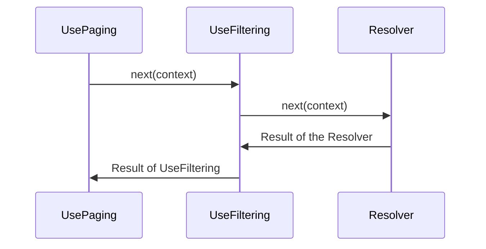

Field middleware in Hot Chocolate lets you add reusable logic to a field, either before or after the field resolver runs. This is useful for adding features like logging, validation, or authorization. You can stack multiple middleware, and they run in the order you declare them. The field resolver always comes last in the chain.

Each middleware only knows about the next step in the chain. It can:

- Run logic before the next step
- Run logic after the next step (including after the resolver)
- Skip the next step entirely

Every middleware receives an `IMiddlewareContext`. This extends `IResolverContext`, so you can use all the same APIs as in a resolver. The `IMiddlewareContext` also has properties like `Result`, which holds the value returned by the resolver or another middleware.

# Middleware Order

The order in which you add middleware matters. It controls how the resolver result is processed. For example, if you use both `UsePaging` and `UseFiltering`, filtering should happen before paging. So, you declare `UsePaging` before `UseFiltering`.

```csharp
descriptor
    .UsePaging()
    .UseFiltering()
    .Resolve(context =>
    {
        // Omitted code for brevity
    });
```

At first, this might look backwards. The diagram below explains why this order works:



Middleware runs in the order you declare it, but the result from the resolver travels back through the chain in reverse. This is why the order is important.

# Defining Field Middleware

You can create field middleware as either a delegate or a class. In both cases, you get a `FieldDelegate` (which calls the next middleware) and the `IMiddlewareContext`.

When you await the `FieldDelegate`, you let all later middleware and the resolver run before your code continues.

## Delegate-based middleware

To define middleware as a delegate, use the code-first API:

```csharp
public class QueryType : ObjectType
{
    protected override void Configure(IObjectTypeDescriptor descriptor)
    {
        descriptor
            .Field("example")
            .Use(next => async context =>
            {
                // Runs before the next middleware and the field resolver

                // Call the next middleware or the resolver
                await next(context);

                // Runs after all later middleware and the resolver
            })
            .Resolve(context =>
            {
                // Omitted for brevity
            });
    }
}
```

### Reusing the middleware delegate

The example above adds middleware to one field. To reuse it, create an extension method on `IObjectFieldDescriptor`:

```csharp
public static class MyMiddlewareObjectFieldDescriptorExtension
{
    public static IObjectFieldDescriptor UseMyMiddleware(
        this IObjectFieldDescriptor descriptor)
    {
        return descriptor
            .Use(next => async context =>
            {
                // Omitted code for brevity

                await next(context);

                // Omitted code for brevity
            });
    }
}
```

> It's a good idea to start your extension method name with `Use` to show it adds middleware.

Now you can use this middleware on any field in your schema:

```csharp
public class QueryType : ObjectType
{
    protected override void Configure(IObjectTypeDescriptor descriptor)
    {
        descriptor
            .Field("example")
            .UseMyMiddleware()
            .Resolve(context =>
            {
                // Omitted for brevity
            });
    }
}
```

## Class-based middleware

If you prefer, you can write middleware as a class. Create a class that takes a `FieldDelegate` in its constructor and has a method called `InvokeAsync` or `Invoke`.

```csharp
public class MyMiddleware
{
    private readonly FieldDelegate _next;

    public MyMiddleware(FieldDelegate next)
    {
        _next = next;
    }

    public async Task InvokeAsync(IMiddlewareContext context)
    {
        // Runs before the next middleware and the resolver

        await _next(context);

        // Runs after all later middleware and the resolver
    }
}
```

You can inject services into the constructor (for singletons) or as parameters on `InvokeAsync` (for scoped or transient services):

```csharp
public class MyMiddleware
{
    private readonly FieldDelegate _next;
    private readonly IMySingletonService _singletonService;

    public MyMiddleware(FieldDelegate next, IMySingletonService singletonService)
    {
        _next = next;
        _singletonService = singletonService;
    }

    public async Task InvokeAsync(IMiddlewareContext context,
        IMyScopedService scopedService)
    {
        // Omitted code for brevity
    }
}
```

This flexibility is why there is no interface or base class for field middleware.

### Applying class-based middleware

To use your class-based middleware, call `Use<T>()` on the field:

```csharp
public class QueryType : ObjectType
{
    protected override void Configure(IObjectTypeDescriptor descriptor)
    {
        descriptor
            .Field("example")
            .Use<MyMiddleware>()
            .Resolve(context =>
            {
                // Omitted for brevity
            });
    }
}
```

It's still a good idea to wrap `Use<MyMiddleware>()` in an extension method like `UseMyMiddleware()`. This makes it easier to change the middleware later without updating every field.

If you need to pass a custom argument, use the factory overload:

```csharp
descriptor
    .Field("example")
    .Use((provider, next) => new MyMiddleware(next, "custom",
        provider.GetRequiredService<FooBar>()));
```

# Using Middleware as an Attribute

You can also add middleware to resolvers that use attributes. To do this, create an attribute that inherits from `ObjectFieldDescriptorAttribute` and call your middleware in the `OnConfigure` method.

> In C#, attribute order is not guaranteed. Middleware attributes use the `CallerLineNumberAttribute` to capture the line number at compile time, which sets the order. Avoid inheriting middleware attributes from a base method or property, as this can make the order unclear. Always pass the `order` argument if you inherit from another middleware attribute. Start your attribute name with `Use` to show it adds middleware.

```csharp
public class UseMyMiddlewareAttribute : ObjectFieldDescriptorAttribute
{
    public UseMyMiddlewareAttribute([CallerLineNumber] int order = 0)
    {
        Order = order;
    }

    protected override void OnConfigure(IDescriptorContext context,
        IObjectFieldDescriptor descriptor, MemberInfo member)
    {
        descriptor.UseMyMiddleware();
    }
}
```

Now you can add the attribute to a resolver:

```csharp
public class Query
{
    [UseMyMiddleware]
    public string MyResolver()
    {
        // Omitted code for brevity
    }
}
```

# Accessing the Resolver Result

The `IMiddlewareContext` has a `Result` property you can use to read or change the value returned by the resolver:

```csharp
descriptor
    .Use(next => async context =>
    {
        await next(context);

        // After calling next(context), you can access the result
        object? result = context.Result;

        // You can check the type and work with it
        if (result is string stringResult)
        {
            // Work with the stringResult
        }
    });
```

Middleware can also set or override the result by assigning to `context.Result`.

> The field resolver only runs if no earlier middleware has set the `Result` property. If any middleware sets `Result`, the resolver is skipped.

# Short-Circuiting

Sometimes, you may want to stop the middleware chain and skip the field resolver. To do this, simply do not call the `FieldDelegate` (`next`).

```csharp
descriptor
    .Use(next => context =>
    {
        if (context.Parent<object>() is IDictionary<string, object> dict)
        {
            context.Result = dict[context.Field.Name];

            // The rest of the middleware and the resolver will not run
            return Task.CompletedTask;
        }
        else
        {
            return next(context);
        }
    })
```

# Next Steps

- Learn more about [resolvers](/docs/hotchocolate/v16/resolvers/resolvers) for field resolution
- Explore [filtering](/docs/hotchocolate/v16/fetching-data/filtering) and [sorting](/docs/hotchocolate/v16/fetching-data/sorting) middleware
- Read about [pagination](/docs/hotchocolate/v16/fetching-data/pagination) middleware
