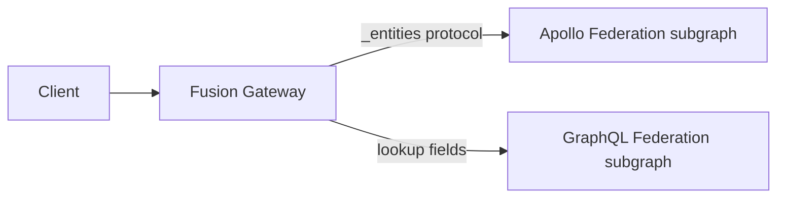

Fusion supports two subgraph protocols: GraphQL Federation and Apollo Federation. GraphQL Federation is the open specification (formerly the GraphQL Composite Schemas specification) that a Fusion gateway speaks directly. Apollo Federation is Apollo's model for distributed GraphQL. This page explains the Apollo Federation connector, which lets a Fusion gateway run Apollo Federation subgraphs.

The connector lets you put a Fusion gateway in front of existing Apollo Federation subgraphs without changing them. During composition, Fusion reads each subgraph's Apollo Federation SDL, detects Apollo Federation schemas, and translates them into the GraphQL Federation model. At runtime, the gateway speaks Apollo's wire protocol (the `_entities` field with typed representations) to Apollo Federation subgraphs. It speaks the GraphQL Federation protocol through lookup fields to GraphQL Federation subgraphs in the same graph. Your subgraphs keep their existing SDL, `__resolveReference` and reference resolvers, and deployment model.

Apollo Federation v2 has no separate mode to enable. Detection happens per source schema, so one graph can mix Apollo Federation subgraphs (in any language: Apollo Server, HotChocolate.ApolloFederation, graphql-java, and others) with GraphQL Federation subgraphs and compose them into the composed schema. Apollo Federation v1 requires an explicit source setting, as described in [Choose the Schema Acquisition Protocol](#choose-the-schema-acquisition-protocol).

Use this page when you want to run Apollo Federation subgraphs as they are. To move a subgraph to the GraphQL Federation protocol instead, see [Coming from Apollo Federation](../migration/coming-from-apollo-federation.md). The two protocols interoperate, so you can move one subgraph at a time.

# How the Connector Works

The connector does two things: it translates Apollo Federation schemas at composition time, and it uses Apollo's entity protocol at runtime.



**At composition time**, Fusion inspects each source schema. When a v2 schema carries the Apollo Federation `@link` to `https://specs.apollo.dev/federation`, the composer recognizes it as an Apollo Federation subgraph and runs a translation pass over it. For a v1 schema, the source settings must opt into the legacy parser with the exact `"1.0"` marker shown below.

That pass maps Apollo Federation directives onto the GraphQL Federation model: `@key` becomes lookup fields, `@requires` becomes `@require`, `@external` fields are resolved into the model, and the Relay `node` field becomes a lookup. Fusion removes the Apollo Federation infrastructure types (`_service`, `_entities`, `_Entity`, `_Any`). The result is the composed schema. Clients do not see Apollo Federation directives or infrastructure types.

**At runtime**, when the gateway needs to resolve entity fields from an Apollo Federation subgraph, it calls that subgraph as an Apollo router would. It sends the `_entities(representations: [...])` query with typed representations (`{ __typename, <key fields> }`) and reads the entities back. The gateway enters GraphQL Federation subgraphs through their lookup fields instead. Both paths run inside the same query plan.

Because Federation v2 detection happens per source schema, mixed graphs with v2 Apollo Federation sources need no graph-wide connector configuration. Federation v1 sources still require the exact per-source `"1.0"` marker. An Apollo Federation subgraph and a GraphQL Federation subgraph that both contribute fields to `Product` merge into one `Product` type in the composed schema.

# Getting the Subgraph Schema

Composition consumes Apollo Federation SDL in the form that the subgraph exposes through Apollo's `_service` field. For v2, this is the `@link`-carrying document that still contains `@key`, `@requires`, `@external`, and the other Federation directives.

You can let Nitro download live schemas during composition, or save each schema to a file first.

## Download Live Schemas with Nitro

For each remote source, repeat both `--source-schema-url` and `--source-schema-settings-file`. Nitro pairs the first URL with the first settings file, the second URL with the second settings file, and so on. Keep each pair adjacent so the relationship is visible in scripts.

Local schema files remain independent. They continue to use the companion settings file next to the schema, not `--source-schema-settings-file`.

This example composes two live Apollo subgraphs and one saved GraphQL Federation schema:

```bash
nitro fusion compose \
  --source-schema-url https://products.example.com/graphql \
  --source-schema-settings-file ./products/schema-settings.json \
  --source-schema-url https://reviews.example.com/graphql \
  --source-schema-settings-file ./reviews/schema-settings.json \
  --source-schema-file ./inventory/schema.graphqls \
  --archive gateway.far
```

After a successful composition, Nitro prints:

```text
✅ Composite schema written to '/absolute/path/to/gateway.far'.
```

The URL option controls where Nitro acquires the schema during composition. The paired settings file still controls how the gateway reaches the source at runtime. These URLs can differ.

For an Apollo Federation v2 endpoint, use a settings file such as:

```json
{
  "name": "Products",
  "transports": {
    "http": {
      "url": "https://products.internal/graphql"
    }
  },
  "extensions": {
    "chillicream": {
      "apolloFederationSupport": {
        "version": "2.0"
      }
    }
  }
}
```

## Choose the Schema Acquisition Protocol

The `apolloFederationSupport` marker selects how Nitro uses the paired URL:

| Marker | HTTP request | Composition behavior |
| --- | --- | --- |
| Absent | GET the exact supplied URL | Treat the response body as plain SDL. A returned v2 `@link` is still detected. |
| Exact `"1.0"` | POST an Apollo `_service { sdl }` query | Enable Federation v1 composition for the returned SDL. |
| Exact `"2.0"` | POST an Apollo `_service { sdl }` query | Use normal v2 `@link` detection for the returned SDL. |

The support object must contain only the `version` property. Only exact `"1.0"` and `"2.0"` values are accepted. Other values, whitespace variants, and extra properties fail validation before Nitro sends a schema request.

For a Federation v1 source, use the same settings shape with the v1 marker:

```json
{
  "name": "Products",
  "transports": {
    "http": {
      "url": "https://products.internal/graphql"
    }
  },
  "extensions": {
    "chillicream": {
      "apolloFederationSupport": {
        "version": "1.0"
      }
    }
  }
}
```

Raw Federation v1 SDL without the `"1.0"` marker remains unsupported. The marker is preserved in the archived source settings so future composition keeps the same acquisition contract, but it is removed from runtime gateway settings.

## Save the SDL to a File

To export a schema yourself, query the subgraph:

```graphql
query {
  _service {
    sdl
  }
}
```

Save the `_service { sdl }` value unchanged to a `.graphqls` file. A schema stripped of its Federation directives cannot be detected and translated. Give each file a companion settings file based on the schema file name. For example, `products.graphqls` uses `products-settings.json`. See the [Schema Settings File Reference](../cli.md#schema-settings-file-reference) for the settings file format.

# Composing an Apollo Federation Subgraph

<!-- PENDING: assumes the federation-gated key-inference suppression fix lands before the preview build; if it does not, replace with the schema-settings InferKeysFromLookups:false workaround -->

Compose Apollo Federation subgraphs the same way you compose GraphQL Federation subgraphs. Federation v2 has no compose flag to set. Point `nitro fusion compose` at the source schema files, and the composer detects and translates v2 subgraphs automatically. Federation v1 sources still need the exact per-source `"1.0"` marker:

```bash
nitro fusion compose \
  --source-schema-file ./accounts/schema.graphqls \
  --source-schema-file ./reviews/schema.graphqls \
  --archive gateway.far
```

After a successful composition, Nitro prints:

```text
✅ Composite schema written to '/absolute/path/to/gateway.far'.
```

You can list Apollo Federation and GraphQL Federation source schema files in the same command. Composition produces a single `.far` archive that contains the composed schema. If a subgraph uses an Apollo Federation feature that Fusion does not yet support, composition fails with a specific error code (see [Current Limitations](#current-limitations)).

For the full command reference, see [nitro fusion compose](../cli.md#nitro-fusion-compose). For the composition rules and the complete log-code list, see [Composition](../composition.md).

# What Translates to What

Composition resolves Apollo Federation constructs before clients see the schema. The composed schema follows the GraphQL Federation model, so clients and downstream tools do not see Apollo Federation directives.

| Apollo Federation                          | Handled during composition as                                                                     |
| ------------------------------------------ | ------------------------------------------------------------------------------------------------- |
| `@key(fields: "...")`                      | Generated lookup fields, one per key. Single, composite, and nested keys are supported.           |
| `_entities` / `__resolveReference`         | Kept as the runtime contract. The gateway calls them over the `_entities` protocol like a router. |
| `@requires(fields: "...")`                 | Translated to `@require`, including nested object requirements and requirement chains.            |
| `@provides(fields: "...")`                 | Honored. The `@external` fields it references are kept resolvable from the providing subgraph.    |
| `@external`                                | External fields are resolved into the model.                                                      |
| `@shareable`                               | Preserved. Key fields are marked shareable automatically.                                         |
| `@override(from: "...")`                   | Preserved as override semantics.                                                                  |
| `@inaccessible`                            | Preserved.                                                                                        |
| `@tag`                                     | Preserved.                                                                                        |
| `@interfaceObject`                         | Projects fields onto the same-named interface and compatible implementations.                     |
| Union members contributed across subgraphs | Merged into a single union in the composed schema.                                                |

# Shareable Abstract Field Routing

Apollo Federation subgraphs can define the same shareable field while declaring different members for its interface or union result type. Fusion offers two policies for routing selections under inline fragments and other type conditions:

| C# setting value     | CLI value              | Execution-schema value | Behavior                                                                                                                                                                  |
| -------------------- | ---------------------- | ---------------------- | ------------------------------------------------------------------------------------------------------------------------------------------------------------------------- |
| `SourceLocal`        | `source-local`         | `SOURCE_LOCAL`         | Routes type-conditioned selections according to the source schema that resolves the shareable field. This is the default, including for archives that predate the policy. |
| `CommonRuntimeTypes` | `common-runtime-types` | `COMMON_RUNTIME_TYPES` | Routes only runtime types shared by viable Apollo providers: those in current scope, directly reachable through one entity lookup, or non-external at an operation root.  |

`CommonRuntimeTypes` does not filter objects returned by a source or change `__typename`. A source-specific object can still appear in the response, while fields requested only through a type condition that was not routed can be `null`.

Use `CommonRuntimeTypes` to reproduce the conservative routing exercised by the legacy `PartialUnion` and `PartialUnionComplex` federation gateway-audit cases, or whenever viable providers expose different members of the same interface or union. Select it while composing:

```bash
nitro fusion compose \
  --source-schema-file ./products/schema.graphqls \
  --source-schema-file ./reviews/schema.graphqls \
  --shareable-field-runtime-type-routing common-runtime-types \
  --archive gateway.far
```

After a successful composition, Nitro prints the archive path:

```text
✅ Composite schema written to '/absolute/path/to/gateway.far'.
```

To change the policy in an existing archive, run:

```bash
nitro fusion settings set shareable-field-runtime-type-routing common-runtime-types \
  --archive gateway.far
```

Nitro reports `Composed new configuration.` after it recomposes the archive. With Aspire, set `GraphQLCompositionSettings.ShareableFieldRuntimeTypeRouting` to `ShareableFieldRuntimeTypeRouting.CommonRuntimeTypes`. See [Composition Settings](../aspire-integration.md#composition-settings).

Composition records the policy in the execution schema. For example, `common-runtime-types` produces:

```graphql
schema
  @fusion__execution(
    nodeResolution: GATEWAY
    shareableFieldRuntimeTypeRouting: COMMON_RUNTIME_TYPES
  ) {
  query: Query
}
```

The default is recorded as `shareableFieldRuntimeTypeRouting: SOURCE_LOCAL`.

# Interface Objects

Apollo Federation v2 interface objects compose with native GraphQL Federation interfaces. Keep the Apollo declaration and its Federation v2 import in the subgraph SDL:

```graphql
extend schema
  @link(
    url: "https://specs.apollo.dev/federation/v2.6"
    import: ["@key", "@interfaceObject"]
  )

type Media @key(fields: "id") @interfaceObject {
  id: ID!
  views: Int!
}
```

Fusion projects this stand-in's fields onto the interface and compatible implementations. Values produced by the stand-in remain opaque until Fusion recovers their concrete type through a source that knows the implementations.

Apollo Federation does not define Fusion's native `@implement` directive. When an Apollo implementing type redeclares a projected field, mark the compatible declarations with Apollo `@shareable`. Fusion uses that declaration as the explicit replacement contract. A redeclaration that is not shareable fails composition.

At runtime, Fusion enters the Apollo stand-in through `_entities`. Native GraphQL Federation interface objects use `@lookup` fields instead. Both source kinds can participate in the same interface.

See [Interface Objects](../interface-objects.md) for field projection, opaque identity, covering lookups, and native source-schema examples.

## Allow Non-Resolvable Interface Objects

By default, composition rejects an Apollo interface object whose key uses `resolvable: false` when Fusion cannot build the required route. This strict default catches projected fields that the gateway could not fetch.

For compatibility with an existing Apollo graph, opt in while composing the archive:

```bash
nitro fusion compose \
  --source-schema-file ./products/schema.graphqls \
  --source-schema-file ./reviews/schema.graphqls \
  --allow-non-resolvable-interface-objects \
  --archive gateway.far
```

After a successful composition, Nitro prints:

```text
✅ Composite schema written to '/absolute/path/to/gateway.far'.
```

To enable the option in an existing archive, run:

```bash
nitro fusion settings set allow-non-resolvable-interface-objects true \
  --archive gateway.far
```

Nitro reports `Composed new configuration.` after it recomposes the archive.

With Aspire composition, set the equivalent property:

```csharp
builder
    .AddProject<Projects.Gateway>("gateway-api")
    .WithGraphQLSchemaComposition(
        settings: new GraphQLCompositionSettings
        {
            AllowNonResolvableInterfaceObjects = true
        });
```

> This option applies only to source schemas detected as Apollo Federation schemas. It does not relax native interface-object satisfiability. Enabling it does not create a lookup route, so an unresolved selection produces a field error at runtime.

# Global Object Identification

If your Apollo Federation subgraphs implement the Relay `node` field (a `Query.node(id: ID!): Node` field over a `Node` interface), the connector turns it into a lookup during composition. Keep the Apollo Federation SDL as exported. You do not need to add Fusion's `@lookup` directive to the field.

## Configure node resolution

Choose how the gateway resolves `node(id:)` when you compose the gateway archive. Fusion records the mode in the execution schema, so every compatible gateway that loads the archive uses the same behavior.

| CLI value       | Execution-schema value | Behavior                                                                                                                                                                                                                                                                                        |
| --------------- | ---------------------- | ----------------------------------------------------------------------------------------------------------------------------------------------------------------------------------------------------------------------------------------------------------------------------------------------- |
| `gateway`       | `GATEWAY`              | The gateway decodes the ID, determines the object type, and routes the lookup to the source schema that owns that type. This is the default.                                                                                                                                                    |
| `source-schema` | `SOURCE_SCHEMA`        | The gateway forwards the opaque ID to a source schema with a public root `Query.node(id: ID!): Node` lookup. That source schema determines the object type and can resolve the concrete `Node` implementations that it declares. Use this mode when the gateway cannot decode your identifiers. |

To use source-schema resolution, enable Global Object Identification and select the mode in the compose command:

```bash
nitro fusion compose \
  --source-schema-file ./accounts/schema.graphqls \
  --source-schema-file ./reviews/schema.graphqls \
  --archive gateway.far \
  --enable-global-object-identification \
  --node-resolution source-schema
```

To update an existing archive, enable Global Object Identification before changing the node-resolution setting:

```bash
nitro fusion settings set global-object-identification true \
  --archive gateway.far

nitro fusion settings set node-resolution source-schema \
  --archive gateway.far
```

For the settings command reference, see [nitro fusion settings set](../cli.md#nitro-fusion-settings-set). If you compose through Aspire, set `EnableGlobalObjectIdentification` to `true` and `NodeResolution` to `NodeResolution.SourceSchema` in `GraphQLCompositionSettings`. See [Composition settings](../aspire-integration.md#composition-settings).

## Verify node resolution

After a successful composition, Nitro prints the archive path:

```text
✅ Composite schema written to '/absolute/path/to/gateway.far'.
```

The generated execution schema should also contain:

```graphql
schema @fusion__execution(nodeResolution: SOURCE_SCHEMA) {
  query: Query
}
```

Deploy a `SOURCE_SCHEMA` archive only to compatible gateways that support the `@fusion__execution` metadata. An older gateway can fall back to gateway-side ID decoding.

## Troubleshoot source-schema resolution

If composition reports `Source-schema node resolution requires global object identification to be enabled.`, you selected `source-schema` without enabling Global Object Identification. Add both `--enable-global-object-identification` and `--node-resolution source-schema` to the compose command.

Source-schema resolution covers only concrete `Node` implementations declared by a source schema with a public root `Query.node(id: ID!): Node` lookup. If a valid dispatcher covers some implementations but another composite `Node` type is uncovered, composition emits an `UNSATISFIABLE_QUERY_PATH` warning. A request for an uncovered type can return `node: null`, with an error if the source resolver reports one. Add the type as a `Node` implementation in a source schema with a public root node lookup. If no public root dispatcher covers any `Node` implementation, composition fails.

See [GraphQL Global Object Identification](../entities-and-lookups.md#graphql-global-object-identification) for the required schema shape and the [composition log-code reference](../composition.md#log-codes-reference) for diagnostic details.

# Runtime Behavior

The gateway uses Apollo's entity protocol when it routes to Apollo Federation subgraphs.

**Entity batching.** When the gateway needs several entities of the same type from one subgraph, it sends one `_entities` call with all representations in the `representations` array. Identical representations are de-duplicated.

When a query plan needs several different lookups from the same subgraph, the gateway dispatches them together as one batched request.

**Requirement threading.** When a field on one subgraph depends on data owned by another (the `@requires` case), the gateway resolves the required fields first. It then threads them into the representation it sends to the subgraph that needs them.

**Error propagation.** Errors returned by a subgraph and transport failures that prevent the gateway from reaching it are attached to the affected result paths and surfaced in the gateway response.

# Current Limitations

The connector is under active development and ships as a preview. Composition rejects unsupported Apollo Federation features with a specific error code, so the gateway does not produce a schema that would misbehave at runtime.

- **Apollo Federation v1 requires explicit source settings.** Set `extensions.chillicream.apolloFederationSupport.version` to exact `"1.0"` for that source. Raw v1 SDL without the marker is rejected with `FEDERATION_V1_NOT_SUPPORTED`. Federation v2 schemas continue to use their `@link`; for a remote source, the optional exact `"2.0"` marker selects `_service.sdl` acquisition without enabling the v1 parser.
- **Several Apollo Federation v2 directives are not supported.** Composition rejects `@composeDirective`, `@authenticated`, `@requiresScopes`, and `@policy` with `FEDERATION_DIRECTIVE_NOT_SUPPORTED`. Remove the directive, or express the equivalent with a GraphQL Federation construct.

Both error codes are listed in the [Composition log-code reference](../composition.md#log-codes-reference).

Feature support tracks the [GraphQL Hive federation-gateway-audit](https://github.com/graphql-hive/federation-gateway-audit) compliance suite, and the set of supported features grows as the connector passes more of that suite.

# Relationship to Migrating

The connector runs your Apollo Federation subgraphs as they are. It does not rewrite them. When you want to move a subgraph to the GraphQL Federation protocol (`[Lookup]` in place of `@key`, `[Require]` in place of `@requires`, and so on), see [Coming from Apollo Federation](../migration/coming-from-apollo-federation.md).

You do not have to choose one protocol for the whole graph. Apollo Federation and GraphQL Federation subgraphs compose together, so you can put the gateway in front of your existing Apollo Federation fleet first. Then you can move subgraphs to the GraphQL Federation protocol one at a time while the rest keep running unchanged.

# Next Steps

- Compose and run a gateway: [nitro fusion compose](../cli.md#nitro-fusion-compose) and [Getting Started](../getting-started.md).
- Understand entity resolution in the GraphQL Federation model: [Entities and Lookups](../entities-and-lookups.md).
- Extend interfaces across source schemas: [Interface Objects](../interface-objects.md).
- Move subgraphs to the GraphQL Federation protocol: [Coming from Apollo Federation](../migration/coming-from-apollo-federation.md).
