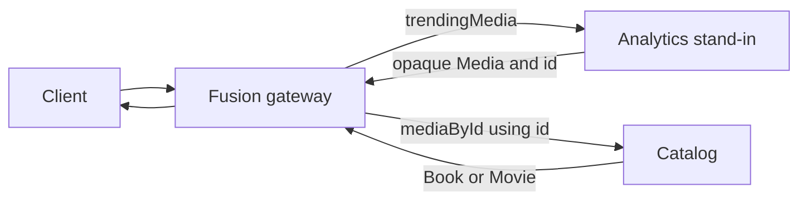

An interface object lets one source schema add fields to an interface without declaring every type that implements it. This is useful when a source owns behavior that applies to all implementations, but another source owns the interface and its concrete types.

This page explains how Fusion composes a same-named object stand-in, projects its fields, and uses lookups to recover concrete types. The examples focus on the source-schema contracts and the resulting query flow.

Before you begin, make sure you understand [entity keys and lookups](./entities-and-lookups.md). Interface objects use the same identity and lookup contracts to move values between source schemas.

# Extend an Interface from Another Source

The Catalog source owns a `Media` interface and knows its concrete `Book` and `Movie` types. It also exposes a lookup that returns the interface.

**Catalog source schema**

```graphql
type Query {
  mediaById(id: ID!): Media @lookup
}

interface Media {
  id: ID!
  title: String!
}

type Book implements Media @key(fields: "id") {
  id: ID!
  title: String!
  isbn: String!
}

type Movie implements Media @key(fields: "id") {
  id: ID!
  title: String!
  runtime: Int!
}
```

The Analytics source does not need to declare `Book` or `Movie`. Instead, it declares an object named `Media` and marks it with `@interfaceObject`.

**Analytics source schema**

```graphql
type Query {
  trendingMedia: [Media!]!
  mediaByKey(id: ID!): Media @lookup @internal
}

type Media @interfaceObject @key(fields: "id") {
  id: ID!
  views: Int!
}
```

The object name must match the interface name. Fusion infers `id` as a `Media` key from the Catalog lookup. The stand-in must declare the matching key explicitly. Fusion uses this key to correlate an opaque `Media` value with a concrete value from another source.

The `views` field becomes part of `Media` and is projected as a default field onto every compatible implementation. The client-facing schema contains this shape:

```graphql
interface Media {
  id: ID!
  title: String!
  views: Int!
}

type Book implements Media {
  id: ID!
  title: String!
  isbn: String!
  views: Int!
}

type Movie implements Media {
  id: ID!
  title: String!
  runtime: Int!
  views: Int!
}
```

The internal `mediaByKey` lookup gives Fusion a route back into Analytics when it needs a projected field. `@internal` hides this routing field from clients. See [Internal Lookups](./entities-and-lookups.md#internal-lookups) for the complete pattern.

> A stand-in that contributes a non-key field must have a lookup in its own source schema. Declaring a matching type and key without a lookup is not enough to make the projected field reachable.

# Query Fields from the Stand-In

When a query selects only fields that Analytics can provide, Fusion can resolve the operation from that source.

```graphql
query TrendingMedia {
  trendingMedia {
    id
    views
  }
}
```

For one media item, the result can look like this:

```json
{
  "data": {
    "trendingMedia": [
      {
        "id": "TWVkaWE6MQ==",
        "views": 123
      }
    ]
  }
}
```

Fusion performs one Analytics fetch. It does not ask Catalog for the concrete type because the operation does not observe concrete identity.

# Recover Concrete Types

Analytics knows that a value has the `Media` shape, but it does not know whether that value is a `Book`, `Movie`, or another implementation. Values returned through the stand-in are therefore opaque.

Selecting `__typename` or a concrete inline fragment makes the concrete identity observable. Fusion then uses the key from Analytics to call the covering interface lookup in Catalog.



The Catalog lookup is a covering lookup because it returns `Media` and its source can resolve every possible concrete type in the composite schema.

```graphql
query TrendingMedia {
  trendingMedia {
    __typename
    id
    views
    ... on Book {
      isbn
    }
    ... on Movie {
      runtime
    }
  }
}
```

For a `Book`, the result can look like this:

```json
{
  "data": {
    "trendingMedia": [
      {
        "__typename": "Book",
        "id": "TWVkaWE6MQ==",
        "views": 123,
        "isbn": "Book: TWVkaWE6MQ=="
      }
    ]
  }
}
```

The data flow has four steps:

1. Analytics returns the `id` and `views` fields for each opaque `Media` value.
2. Fusion batches Catalog `mediaById` lookups for the returned IDs.
3. Catalog returns the authoritative `__typename` and concrete fields.
4. Fusion merges the concrete data into the original result.

A covering lookup must meet all of these conditions:

- It returns the interface, not one concrete implementation.
- Its arguments can be populated from the stand-in key.
- One source schema containing the lookup covers every possible implementation in the composite schema.

Several concrete lookups spread across different source schemas do not form one covering lookup.

## Resolve a Stand-In Field Inside a Concrete Fragment

When you select a projected field inside a concrete fragment, Analytics cannot return that field until Fusion knows whether the fragment applies. This produces an Analytics to Catalog to Analytics route (B to A to B):

```graphql
query TrendingBooks {
  trendingMedia {
    ... on Book {
      views
    }
  }
}
```

For the earlier `Book` value, the result can look like this:

```json
{
  "data": {
    "trendingMedia": [
      {
        "views": 123
      }
    ]
  }
}
```

Fusion resolves this query in three source operations:

1. Analytics returns each opaque value's `id`.
2. Catalog uses `mediaById` to recover `Book` as the concrete type.
3. Analytics uses `mediaByKey` to fetch `views` for values that match the `Book` fragment.

Fusion carries the `id` from the first operation through both lookups.

# Replace a Projected Default

An implementation normally adopts a field projected from the interface object. To provide a different implementation for one concrete type, declare the field on that type and mark it with `@implement`.

```graphql
type Book implements Media @key(fields: "id") {
  id: ID!
  title: String!
  isbn: String!
  views: Int! @implement
}
```

This declaration tells composition that Catalog intentionally replaces the Analytics default for `Book.views`. Other implementations, such as `Movie`, continue to use the projected default.

If you declare `Book.views` without `@implement`, composition reports `INTERFACE_OBJECT_FIELD_REQUIRES_IMPLEMENT`. If there is no projected default to replace, `@implement` reports `IMPLEMENT_WITHOUT_DEFAULT`.

# Share Defaults from Unrelated Interfaces

An object can implement unrelated interfaces whose stand-ins project a field with the same name. When the field has the same contract and result in every source, mark every contributing declaration with `@shareable`.

The following three source schemas define the interfaces, a concrete type that implements both, and the lookups needed to resolve the projected field.

**Catalog source schema**

```graphql
type Query {
  physicalProductById(id: ID!): PhysicalProduct @lookup
  digitalProductById(id: ID!): DigitalProduct @lookup
}

interface PhysicalProduct @key(fields: "id") {
  id: ID!
}

interface DigitalProduct @key(fields: "id") {
  id: ID!
}

type Chair implements PhysicalProduct & DigitalProduct @key(fields: "id") {
  id: ID!
}
```

**Physical reviews source schema**

```graphql
type Query {
  physicalProductByKey(id: ID!): PhysicalProduct @lookup @internal
}

type PhysicalProduct @interfaceObject @key(fields: "id") {
  id: ID!
  reviews: [Review!]! @shareable
}

type Review {
  rating: Int! @shareable
}
```

**Digital reviews source schema**

```graphql
type Query {
  digitalProductByKey(id: ID!): DigitalProduct @lookup @internal
}

type DigitalProduct @interfaceObject @key(fields: "id") {
  id: ID!
  reviews: [Review!]! @shareable
}

type Review {
  rating: Int! @shareable
}
```

Both defaults project `reviews` onto `Chair`. If any contributing declaration is not shareable, composition reports `INVALID_PROJECTED_FIELD_SHARING`. Use `@shareable` only when the field semantics match. See [Field Ownership](./field-ownership-and-sharing.md) for the full sharing contract.

# Use Interface Objects with Apollo Federation

Apollo Federation v2 subgraphs use the same `type Media @interfaceObject @key(...)` stand-in shape, imported through `@link`. Fusion composes that construct with native interface objects.

Resolution still follows each source protocol. Fusion enters native GraphQL Federation sources through `@lookup` fields and Apollo Federation sources through `_entities` representations. Apollo Federation has no `@implement` directive. When an Apollo implementation redeclares a projected default, mark the compatible declarations with `@shareable`; Fusion uses that declaration as the explicit replacement contract.

For Apollo-specific translation, runtime behavior, and non-resolvable key compatibility, see the [Apollo Federation Connector](./connectors/apollofederation.md#interface-objects).

# Troubleshooting

## `INTERFACE_OBJECT_KEY_MISSING`

The stand-in has no key. Add at least one key that identifies the interface value and can be passed to its lookups.

```graphql
type Media @interfaceObject @key(fields: "id") {
  id: ID!
}
```

## `INTERFACE_OBJECT_NO_INTERFACE`

No source schema defines an interface with the stand-in's name. Define the real interface and its implementing types in at least one concrete-aware source.

## `INTERFACE_OBJECT_KEY_MISMATCH`

The stand-in key does not match a key on the real interface. Use one of the interface entity's keys on the stand-in.

## Source schema 'B' contributes fields to 'Media' but provides no lookup to resolve them

This `UNSATISFIABLE_QUERY_PATH` message means a stand-in adds a non-key field, but its source has no lookup returning that stand-in. Add a nullable lookup. You can mark it `@internal` when clients should not call it.

```graphql
type Query {
  mediaByKey(id: ID!): Media @lookup @internal
}
```

## `UNSATISFIABLE_QUERY_PATH`: no lookup covers the possible types

The diagnostic identifies the uncovered types and the source schemas that introduced them. For example:

> The query path 'Query.topReviewed' cannot be satisfied: values of 'Media' produced by source schema 'B' are opaque, and no source schema provides a lookup for 'Media' that covers the possible type(s) 'Photo' introduced by source schema(s) 'C'.

An opaque value can reach a client, but no concrete-aware source can recover every possible runtime type. Add an interface lookup to one source schema and make every composite implementation resolvable there.

See [Diagnosing `UNSATISFIABLE_QUERY_PATH` Diagnostics](./composition.md#diagnosing-unsatisfiable_query_path-diagnostics) for help reading the complete lookup failure tree.

# Next Steps

- Define stable identity and routing paths: [Entities and Lookups](./entities-and-lookups.md).
- Review sharing and ownership contracts: [Field Ownership](./field-ownership-and-sharing.md).
- Look up exact directive signatures: [Directive Reference](./directives-reference.md#interface-objects).
- Connect Apollo Federation subgraphs: [Apollo Federation Connector](./connectors/apollofederation.md#interface-objects).
