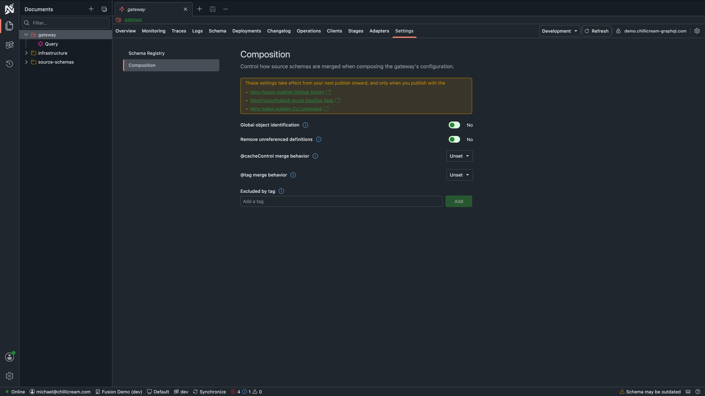

Fusion's local development experience is built on [Aspire](https://aspire.dev): an AppHost, written in C# or TypeScript, starts your subgraphs and composes them into a running router. Without it, every change to a type, a field, or a resolver means re-exporting the schema, re-composing with the Nitro CLI, and restarting the router.

The `HotChocolate.Fusion.Aspire` package integrates composition into the Aspire AppHost. When you run the AppHost, the orchestrator starts your subgraphs, fetches their source schemas from live endpoints, composes them into a Fusion archive, and writes it to the router project directory. This startup flow replaces the manual export-compose-restart cycle. Mark each local subgraph with `WithGraphQLHttpEndpoint()` so composition uses the schema exposed by the running service. The examples on this page show both AppHost languages.

If different teams own subgraphs in separate repositories, bind each team's AppHost to a shared Nitro stage. The AppHost composes the live schemas from the team's local subgraphs with the stage's published fusion configuration. That configuration supplies the schemas and routes for the remaining subgraphs. You can then develop and debug your team's subgraphs inside the full graph without copying another team's schema artifacts into your repository. See [Developing Across Teams and Repositories](#developing-across-teams-and-repositories).

# Prerequisites

You need an Aspire AppHost project with the `HotChocolate.Fusion.Aspire` package.

<LanguageTabs>
<CSharp>

If you do not have an AppHost yet, create it with:

```bash
dotnet new aspire-apphost -n AppHost
```

Add the Fusion Aspire package to the AppHost project:

```bash
cd AppHost
dotnet add package HotChocolate.Fusion.Aspire
```

</CSharp>
<TypeScript>

If you do not have an AppHost yet, create it with the Aspire CLI:

```bash
aspire new aspire-ts-empty -n AppHost -o .
```

`aspire add` does not list `HotChocolate.Fusion.Aspire`, so add the package to the `packages` section of `aspire.config.json` by hand:

```json filename="aspire.config.json"
{
  "packages": {
    "HotChocolate.Fusion.Aspire": "<version>"
  }
}
```

Then restore the AppHost, which regenerates the typed SDK under `.aspire/modules`:

```bash
aspire restore
```

</TypeScript>
</LanguageTabs>

Each subgraph project needs a `schema-settings.json` file in its project directory so the orchestrator can identify the source schema and choose how to fetch it. Generate this file with the `schema export` command from `HotChocolate.AspNetCore.CommandLine`. If you followed [Getting Started](./getting-started.md#export-the-schema), you already have it.

# Setting Up the AppHost

The AppHost wires together your subgraphs and router. Three extension methods configure the composition pipeline.

<LanguageTabs>
<CSharp>

```csharp filename="AppHost/Program.cs"
var builder = DistributedApplication.CreateBuilder(args);

builder.AddNitroComposition();

var productsApi = builder
    .AddProject<Projects.Products>("products-api")
    .WithGraphQLHttpEndpoint();

var reviewsApi = builder
    .AddProject<Projects.Reviews>("reviews-api")
    .WithGraphQLHttpEndpoint();

builder
    .AddProject<Projects.Router>("router-api")
    .WithNitroComposition()
    .WithReference(productsApi)
    .WithReference(reviewsApi);

builder.Build().Run();
```

</CSharp>
<TypeScript>

```typescript filename="apphost.mts"
import { createBuilder } from "./.aspire/modules/aspire.mjs";

const builder = await createBuilder();

await builder.addNitroComposition();

const productsApi = await builder
  .addProject("products-api", "../Products/Products.csproj")
  .withGraphQLHttpEndpoint();

const reviewsApi = await builder
  .addProject("reviews-api", "../Reviews/Reviews.csproj")
  .withGraphQLHttpEndpoint();

await builder
  .addProject("router-api", "../Router/Router.csproj")
  .withNitroComposition()
  .withReference(productsApi)
  .withReference(reviewsApi);

await builder.build().run();
```

</TypeScript>
</LanguageTabs>

Four things to notice:

- **`AddNitroComposition()`** registers the composition orchestrator with the Aspire eventing system. Call this once on the application builder.
- **`WithGraphQLHttpEndpoint()`** declares the GraphQL route of a subgraph and the path its source schema is downloaded from. The orchestrator waits for the subgraph to start, then fetches the source schema over HTTP.
- **`WithNitroComposition()`** marks the router as needing composition. The orchestrator discovers all referenced subgraphs, extracts their schemas, composes them, and writes a `graph.far` file to the router project directory.
- **`WithReference()`** is standard Aspire. It tells the orchestrator which subgraphs to include in composition for this router.

In a TypeScript AppHost, the same extension methods surface camelCased, optional parameters are gathered into a single options object, and every chained call is awaited.

When you build and run the AppHost, the orchestrator handles the entire composition pipeline automatically. No manual `nitro fusion compose` step needed.

# Live Schema Extraction

`WithGraphQLHttpEndpoint()` declares two paths: `path` is the GraphQL route the subgraph serves (`/graphql` by default), and `schemaPath` is where the schema document is downloaded from (`/graphql/schema.graphql` by default). An Apollo Federation subgraph serves its schema through the GraphQL endpoint at `path` via `_service.sdl`, so `schemaPath` is ignored for it. The orchestrator reads `schema-settings.json` to tell the two kinds of subgraphs apart.

The orchestrator starts each subgraph, waits for it to become healthy, then fetches its schema. If the subgraph is not ready within the timeout, the orchestrator reports an error and the dependent router fails to start. Other resources continue running.

You can customize the GraphQL route, the schema download path, and the endpoint name. You can also provide the expected source schema name to validate the fetched schema:

<LanguageTabs>
<CSharp>

```csharp
var productsApi = builder
    .AddProject<Projects.Products>("products-api")
    .WithGraphQLHttpEndpoint(
        path: "/graphql",
        schemaPath: "/graphql/schema.graphql",
        endpointName: "http",
        sourceSchemaName: "Products");
```

</CSharp>
<TypeScript>

```typescript
const productsApi = await builder
  .addProject("products-api", "../Products/Products.csproj")
  .withGraphQLHttpEndpoint({
    path: "/graphql",
    schemaPath: "/graphql/schema.graphql",
    endpointName: "http",
    sourceSchemaName: "Products",
  });
```

</TypeScript>
</LanguageTabs>

Every parameter has a default, so pass only what differs. The source schema name comes from `schema-settings.json`. When you pass `sourceSchemaName`, it acts as an assertion and must match that configured name exactly. It does not rename the source schema, so you can usually omit it.

# Developing Across Teams and Repositories

In an organization where teams own subgraphs in separate repositories, each team can keep an AppHost alongside the subgraphs it develops. Register each local subgraph with `WithGraphQLHttpEndpoint()` so the AppHost fetches its live schema. Bind the AppHost to the graph's shared Nitro stage to compose those local schemas with the published fusion configuration. Nitro supplies the remaining source schemas and routes, so the router still represents the full graph while only your team's subgraphs run on your machine.

Sign in once with the Nitro CLI ([installation](./cli.md#installation)). The AppHost reads the session that the CLI stores and never signs in on its own:

```bash
nitro login
```

Then bind the AppHost to a stage and tell the router which Nitro API carries its fusion configuration:

<LanguageTabs>
<CSharp>

```csharp filename="AppHost/Program.cs"
var builder = DistributedApplication.CreateBuilder(args);

builder.AddNitroComposition("dev");

var productsApi = builder
    .AddProject<Projects.Products>("products-api")
    .WithGraphQLHttpEndpoint();

builder
    .AddProject<Projects.Router>("router-api")
    .WithNitroApiId("QXBpCmcwMTk5MGUzNDVlMWU3MjMyYjc2MjYxYzFiNjRkMGQzYg==")
    .WithNitroComposition()
    .WithReference(productsApi);

builder.Build().Run();
```

</CSharp>
<TypeScript>

```typescript filename="apphost.mts"
import { createBuilder } from "./.aspire/modules/aspire.mjs";

const builder = await createBuilder();

await builder.addNitroComposition({ stage: "dev" });

const productsApi = await builder
  .addProject("products-api", "../Products/Products.csproj")
  .withGraphQLHttpEndpoint();

await builder
  .addProject("router-api", "../Router/Router.csproj")
  .withNitroApiId("QXBpCmcwMTk5MGUzNDVlMWU3MjMyYjc2MjYxYzFiNjRkMGQzYg==")
  .withNitroComposition()
  .withReference(productsApi);

await builder.build().run();
```

</TypeScript>
</LanguageTabs>

- **`AddNitroComposition()`** registers the orchestrator for composing only the subgraphs that run locally. **`AddNitroComposition(stage)`** additionally binds the distributed application to one stage in Nitro. Calling both is safe and registers the orchestrator once. Calling `AddNitroComposition(stage)` twice with different stage names throws during AppHost configuration, because a run composes against a single stage.
- **`WithNitroApiId(apiId)`** selects the Nitro API whose fusion configuration a router composes against. The API id is the id that the Nitro dashboard and the Nitro CLI report for the API, the same value that `--api-id` takes. Calling the method again replaces the previously configured id. On a resource that is not composed, the API id is accepted as identity metadata for your own tooling and the pull and compose flow ignores it. If you set an API id without calling `AddNitroComposition`, the resource console tells you that it cannot take effect.

## What Happens When a Router Starts

Before the orchestrator starts a router process that carries an API id:

1. The fusion configuration for that API id and the `AddNitroComposition` stage is downloaded from Nitro. The download runs while the orchestrator waits for the local subgraphs to become healthy, so the two waits do not add up.
2. Each source schema of the distributed application replaces the source schema of the same name in the downloaded configuration. A source schema whose name does not appear there is added to the composition.
3. Each source schema that the distributed application runs is reached at the allocated HTTP endpoint of its Aspire resource. The orchestrator combines that endpoint with the path of the `url` in the subgraph's `schema-settings.json`, or with `/graphql` when the settings define no usable path.
4. Each source schema that only the downloaded configuration carries is external. The router reaches it at its `devUrl`, or at its `url` when no `devUrl` is defined. Composition logs a warning for every external source schema without a `devUrl`, because a deployed URL is often not reachable from a developer machine. A subgraph that runs in the local AppHost but has no allocated HTTP endpoint at composition time cannot receive an injected URL either, so it is treated like an external schema for URL resolution, which is why such a resource can also trigger the missing-devUrl warning. See [`transports.http.devUrl`](./cli.md#transports-http-devurl).
5. The composed archive is written to the router project directory as usual. The router console then reports which fusion configuration it composed against, when that configuration was downloaded, and which external source schemas it carries together with the URLs they resolved to.

The downloaded configuration is the only base the composition builds on. What a previous composition wrote to `graph.far` is never an input again, so a source schema that was removed or renamed upstream also disappears from your next run.

Variable substitution follows the same split as the URL resolution. The settings of the subgraphs you run resolve against the `Aspire` environment in `schema-settings.json`, while the settings that the downloaded configuration carries resolve against the stage name you passed to `AddNitroComposition`.

A composition or download failure fails only the router it belongs to. The rest of the distributed application keeps running.

## Matching Source Schemas by Name

Replacement matches source schemas by name. `WithGraphQLHttpEndpoint()` uses the `name` from the subgraph's `schema-settings.json`. If you pass `sourceSchemaName`, it must match that name exactly or composition fails. It does not rename the source schema.

A local source schema whose configured name does not match the one in Nitro is added next to it instead of replacing it, which usually surfaces as a composition error about a conflicting field. Make sure the `name` in `schema-settings.json` matches the published source schema name.

## Rebuilding a Subgraph

A rebuild or restart of a local subgraph recomposes the router schema exactly as it does without Nitro, and the recomposition reuses the fusion configuration that was downloaded when the router started. A run therefore downloads once per router, and your inner loop stays as fast as a local-only composition. To pick up what was published to the stage in the meantime, use the router's Recompose command described below, or restart the AppHost.

When a router never acquired a configuration because it failed to start, later composition attempts are skipped with a log entry instead of composing against a stale base.

You do not need to stop the run to restart one subgraph. While `aspire run` keeps the AppHost in the foreground, restart the subgraph from a second terminal with the Aspire CLI:

```bash
aspire resource products-api restart
```

The command executes against the running AppHost. The orchestrator sees the restart, recomposes the schema of every router that references the subgraph, and logs the recomposition on the router console. When a recomposition fails, the router keeps the previous schema. The dashboard offers the same action as Restart in the resource submenu on the Resources page.

The router additionally exposes a Recompose command. It downloads a fresh fusion configuration first, so it also picks up what was published to the stage since the run started, without an AppHost restart. Invoke it from the resource submenu of the router or from the CLI:

```bash
aspire resource router-api recompose
```

## Working Offline

Every downloaded fusion configuration is cached per Nitro API URL, API id, and stage, next to the Nitro CLI configuration (`~/.config/nitro/cache/fusion` on macOS and Linux, `%APPDATA%\nitro\cache\fusion` on Windows). The cache lives outside your repository, so it survives a clean and is shared across working trees.

When the download fails for any reason, including no network, a rejected or expired sign-in, and a stage without a fusion configuration, the router composes against the cached copy. Its console gets a warning that the configuration could not be refreshed, names the timestamp of the cached copy, and tells you to run `nitro login` when the sign-in expired. Only when there is no cached copy at all does the router fail to start with that reason as its error.

## Continuous Integration and Self-Hosted Nitro

Two environment variables configure the AppHost's connection to Nitro. They carry the same names and the same meaning as in the Nitro CLI, so a shell that is set up for the CLI also configures the AppHost.

| Variable          | Purpose                                                                                                                                                                       |
| ----------------- | ----------------------------------------------------------------------------------------------------------------------------------------------------------------------------- |
| `NITRO_API_KEY`   | Authenticates with an API key instead of an interactive session. It takes precedence over the CLI session file. Set it where `nitro login` cannot run, for example in CI.     |
| `NITRO_CLOUD_URL` | Points the AppHost at a self-hosted Nitro instance. Without it, the AppHost uses the API URL that `nitro login` stored, and `https://api.chillicream.com` when there is none. |

# Composition Settings

Composition settings are configured in Nitro. Open the router document and go to Settings > Schema Registry > Composition to control how source schemas are merged when composing the router's configuration.



The page carries toggles for global object identification and for removing unreferenced definitions, merge behavior selections for the `@cacheControl` and `@tag` directives, and a tag list that excludes tagged definitions from the composite schema.

Settings apply at publish time. The banner on the page states that changes take effect from the next publish onward, and only when publishing with the `nitro-fusion-publish` GitHub Action, the `NitroFusionPublish` Azure DevOps task, or the `nitro fusion publish` CLI command. A stage keeps the fusion configuration it already carries until that next publish, so changing a setting does not alter what a bound AppHost downloads in the meantime.

The output file name defaults to `graph.far`. You can change it if needed:

<LanguageTabs>
<CSharp>

```csharp
builder
    .AddProject<Projects.Router>("router-api")
    .WithNitroComposition(outputFileName: "composed.far")
    .WithReference(productsApi)
    .WithReference(reviewsApi);
```

</CSharp>
<TypeScript>

```typescript
await builder
  .addProject("router-api", "../Router/Router.csproj")
  .withNitroComposition({ outputFileName: "composed.far" })
  .withReference(productsApi)
  .withReference(reviewsApi);
```

</TypeScript>
</LanguageTabs>

# How Composition Fits the Dev Loop

With Aspire, your inner dev loop looks like this:

1. Change code in a subgraph (add a field, modify a type, adjust a resolver).
2. Build and run the AppHost.
3. The orchestrator starts your subgraphs, extracts their schemas, and composes the Fusion archive.
4. The router loads the new archive and exposes the updated composite schema.
5. Open Nitro at the router endpoint and query immediately.

With `AddNitroComposition`, step 3 composes on top of the fusion configuration that was downloaded when the router started, so the loop stays the same while your subgraph runs inside the full graph.

If composition fails (for example, a field conflict or a missing lookup), the orchestrator logs the error on the router console and the router fails to start. Every other resource keeps running, so you can fix the issue and restart the router, which composes again. You get the same composition validation as the Nitro CLI, integrated into your build step.

## Validating Changes Against the Stage

When `AddNitroComposition` binds the run to a stage and the router selects a Nitro API with `WithNitroApiId`, every composition is followed by a validation of the composed router schema against that stage. The AppHost uploads the schema to Nitro, and Nitro compares it with the schema version and the clients registered for the API and stage:

- Schema changes are classified as breaking, dangerous, or safe.
- Every registered client is checked with its persisted operations. A violated operation is reported with its hash, its deployed tags, and the message, code, path, and location of each error.

Validation is observational. The composed archive is installed before validation starts, so a finding never blocks the router, and the router serves the newly composed schema either way. Findings surface in two places:

- The router console logs the findings, grouped by client and operation.
- The Aspire dashboard shows a notification that names the router and the stage and links to the console logs. When a later composition passes again, a follow-up notification reports the recovery. A run that never violates anything triggers no notifications.

A composition that yields an unchanged router schema is not validated again, so a restart without schema changes sends no request to Nitro. Validation runs only while the AppHost runs; `aspire publish` never validates.

To turn validation off for a router:

<LanguageTabs>
<CSharp>

```csharp
builder
    .AddProject<Projects.Router>("router-api")
    .WithNitroComposition(disableValidation: true);
```

</CSharp>
<TypeScript>

```typescript
await builder
  .addProject("router-api", "../Router/Router.csproj")
  .withNitroComposition({ disableValidation: true });
```

</TypeScript>
</LanguageTabs>

Disabling validation turns off only the schema upload and the reports. Composition, the configuration download, and the archive install are unaffected.

# Next Steps

- **Need to compose without Aspire?** See the Nitro CLI composition workflow in [Adding a Subgraph](./adding-a-subgraph.md).
- **Need entity resolution patterns?** See [Entities and Lookups](./entities-and-lookups.md) for public vs. internal lookups, composite keys, and the node pattern.
- **Need cross-subgraph field dependencies?** See [Data Requirements](./data-requirements-and-mapping.md) for `@require` and FieldSelectionMap patterns.
- **Need visibility controls?** See [Schema Exposure and Evolution](./schema-exposure-and-evolution.md) for `@inaccessible`, `@internal`, `@deprecated`, `@requiresOptIn`, and `@override`.
- **Driving the run from the terminal?** [`aspire run`](https://aspire.dev/reference/cli/commands/aspire-run/) and [`aspire resource`](https://aspire.dev/reference/cli/commands/aspire-resource/) in the Aspire CLI reference apply to C# and TypeScript AppHosts alike.
