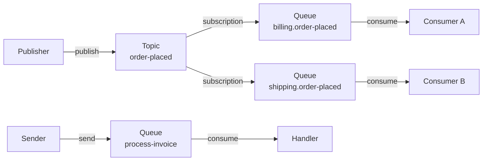

The Azure Service Bus (ASB) transport connects Mocha to a fully managed Azure messaging namespace. It provisions queues, topics, and subscriptions automatically, dispatches publishes through topics and sends through queues, and exposes ASB-specific primitives - native scheduling with cancellation, broker dead-letter forwarding, and lock-renewal-aware acknowledgement. When you run on Azure and want a managed broker without operating the infrastructure yourself, this is the transport to use.

# Set up the Azure Service Bus transport

By the end of this section, you will have a Mocha bus connected to Azure Service Bus with automatic topology provisioning.

## Install the package

```bash
dotnet add package Mocha.Transport.AzureServiceBus
```

## Register with a connection string

The simplest setup passes a Service Bus connection string directly:

```csharp
using Mocha;
using Mocha.Transport.AzureServiceBus;

var builder = WebApplication.CreateBuilder(args);

builder.Services
    .AddMessageBus()
    .AddEventHandler<OrderPlacedEventHandler>()
    .AddAzureServiceBus("Endpoint=sb://<namespace>.servicebus.windows.net/;SharedAccessKeyName=...;SharedAccessKey=...");

var app = builder.Build();
app.Run();
```

## Register with a fully qualified namespace and a token credential

Use [Microsoft Entra ID authentication](https://learn.microsoft.com/azure/service-bus-messaging/service-bus-authentication-and-authorization) with a [managed identity](https://learn.microsoft.com/azure/service-bus-messaging/service-bus-managed-service-identity), [workload identity](https://learn.microsoft.com/azure/aks/workload-identity-overview), or any other [`TokenCredential`](https://learn.microsoft.com/dotnet/api/azure.core.tokencredential) instead of a [shared access key](https://learn.microsoft.com/azure/service-bus-messaging/service-bus-sas):

```csharp
using Azure.Identity;
using Mocha;
using Mocha.Transport.AzureServiceBus;

var builder = WebApplication.CreateBuilder(args);

builder.Services
    .AddMessageBus()
    .AddEventHandler<OrderPlacedEventHandler>()
    .AddAzureServiceBus(transport =>
    {
        transport.Namespace(
            "example.servicebus.windows.net",
            new DefaultAzureCredential());
    });

var app = builder.Build();
app.Run();
```

The example uses [`DefaultAzureCredential`](https://learn.microsoft.com/dotnet/api/azure.identity.defaultazurecredential), which supports local developer credentials as well as credentials provided by Azure hosting environments.

## Register with .NET Aspire

When using [.NET Aspire](https://aspire.dev/integrations/cloud/azure/azure-service-bus/), define a Service Bus resource in your AppHost and reference it from each service. Aspire injects `MESSAGING_CONNECTIONSTRING` for the local emulator and `MESSAGING_FULLYQUALIFIEDNAMESPACE` for an Azure-hosted namespace.

The emulator serves messaging and management on different dynamically allocated endpoints. Pass its management endpoint to each service so Mocha can auto-provision topology locally:

```csharp
using Aspire.Hosting.ApplicationModel;

// AppHost
var serviceBus = builder
    .AddAzureServiceBus("messaging")
    .RunAsEmulator();

var administrationEndpoint = serviceBus.GetEndpoint("emulatorhealth");
var administrationConnectionString = ReferenceExpression.Create(
    $"Endpoint=sb://{administrationEndpoint.Property(EndpointProperty.HostAndPort)};SharedAccessKeyName=RootManageSharedAccessKey;SharedAccessKey=SAS_KEY_VALUE;UseDevelopmentEmulator=true;");

builder
    .AddProject<Projects.OrderService>("order-service")
    .WithReference(serviceBus)
    .WithEnvironment(
        "ConnectionStrings__messaging-administration",
        administrationConnectionString)
    .WaitFor(serviceBus);
```

Install Aspire's Azure Service Bus client integration in each service:

```bash
dotnet add package Aspire.Azure.Messaging.ServiceBus
```

Then register Aspire's messaging client. For the emulator, pass only its administration connection string to Mocha:

```csharp
builder.AddAzureServiceBusClient("messaging");

var administrationConnectionString = builder.Configuration.GetConnectionString("messaging-administration");

builder.Services
    .AddMessageBus()
    .AddEventHandler<OrderPlacedEventHandler>()
    .AddAzureServiceBus(transport =>
    {
        // Aspire does not register the emulator's separate administration client.
        if (administrationConnectionString is not null)
        {
            transport.AdministrationConnectionString(administrationConnectionString);
        }
    });
```

With this configuration, Mocha resolves Aspire's singleton `ServiceBusClient` from dependency injection. The additional connection string creates only the `ServiceBusAdministrationClient` needed because the emulator exposes management on a separate endpoint. In Azure, the administration connection string is absent, Aspire uses `DefaultAzureCredential`, and runtime provisioning remains disabled. Explicit `ConnectionString(...)` or `Namespace(...)` transport configuration takes precedence over the client registered in dependency injection.

The emulator supports runtime entity management through [`ServiceBusAdministrationClient`](https://learn.microsoft.com/dotnet/api/azure.messaging.servicebus.administration.servicebusadministrationclient), so no queues, topics, or subscriptions need to be pre-declared in its configuration. For production, grant the application an appropriate Azure Service Bus data role and provision topology through Aspire or another infrastructure deployment process.

## Verify it works

Add an endpoint that publishes through the bus and verify the handler executes:

```csharp
app.MapPost("/orders", async (IMessageBus bus) =>
{
    await bus.PublishAsync(new OrderPlacedEvent
    {
        OrderId = Guid.NewGuid(),
        CustomerId = "customer-1",
        TotalAmount = 99.99m
    }, CancellationToken.None);

    return Results.Ok();
});
```

Send a POST request to `/orders` and check your application logs. You should see the handler process the event. You can also inspect the auto-provisioned topics, subscriptions, and queues in the Azure portal under your Service Bus namespace.

# How topology works

The transport maps Mocha's routing model onto Azure Service Bus [queues, topics, and subscriptions](https://learn.microsoft.com/azure/service-bus-messaging/service-bus-queues-topics-subscriptions):



**Events (publish/subscribe):** Each event type gets a topic. Each subscribing receive endpoint gets a queue and a forwarding subscription that delivers messages from the topic into the queue. Publishing sends the message to the topic, which fans it out to all forwarded subscriber queues.

**Commands (send):** Each command type gets a queue named after the command. The sender writes directly to that queue - there is no intermediate topic on the send path. The receiving handler binds to the same queue, so a single message instance is delivered to exactly one handler.

**Request/reply:** The transport creates a temporary reply queue per service instance (`response-{instanceId}`). The reply address is embedded in the request message so the responder knows where to send the reply. Reply queues are auto-provisioned with a 24-hour idle-deletion policy. While the service is running, the transport periodically peeks at its reply queue to keep it alive even when no replies are in flight. After the service stops, Azure Service Bus removes the idle queue automatically.

**Scheduled messages:** Azure Service Bus holds scheduled messages in the broker through its native scheduling API. Mocha returns a transport-scoped cancellation token containing the target entity and broker sequence number, which it uses to cancel the message without a separate scheduler or database. See [Scheduling](../scheduling.md) for the common API and cancellation behavior.

## Default topology for handlers

Each handler-bound receive endpoint provisions three queues by convention - the main queue plus an `_error` queue (handler exceptions) and a `_skipped` queue (no matching consumer):

| Queue                         | Purpose                                                      |
| ----------------------------- | ------------------------------------------------------------ |
| `{service}.{handler}`         | Main inbound queue for the handler                           |
| `{service}.{handler}_error`   | Destination of `ReceiveFaultMiddleware` (handler exceptions) |
| `{service}.{handler}_skipped` | Destination of `ReceiveDeadLetterMiddleware` (unmatched)     |

This naming is identical across transports - see [Routing and Endpoints](../routing-and-endpoints.md) for the full convention.

# Configure transport-level defaults

You can set defaults that apply to all auto-provisioned queues, topics, and endpoints:

```csharp
builder.Services
    .AddMessageBus()
    .AddAzureServiceBus(transport =>
    {
        transport.ConnectionString(connectionString);

        transport.ConfigureDefaults(defaults =>
        {
            defaults.Queue.MaxDeliveryCount = 5;
            defaults.Queue.LockDuration = TimeSpan.FromMinutes(1);
            defaults.Queue.DefaultMessageTimeToLive = TimeSpan.FromDays(7);
            defaults.Queue.DeadLetteringOnMessageExpiration = true;
        });
    });
```

Available queue defaults:

| Property                           | Type        | Description                                                                       |
| ---------------------------------- | ----------- | --------------------------------------------------------------------------------- |
| `AutoProvision`                    | `bool?`     | Whether queues are auto-provisioned at startup                                    |
| `AutoDeleteOnIdle`                 | `TimeSpan?` | Idle window before the broker may delete the queue                                |
| `LockDuration`                     | `TimeSpan?` | How long the broker holds a peek-lock on a delivered message                      |
| `MaxDeliveryCount`                 | `int?`      | Attempts before the broker dead-letters the message (`MaxDeliveryCountExceeded`)  |
| `DefaultMessageTimeToLive`         | `TimeSpan?` | TTL applied to messages that do not specify their own                             |
| `MaxSizeInMegabytes`               | `long?`     | Maximum queue size in megabytes                                                   |
| `RequiresSession`                  | `bool?`     | Whether the queue requires sessions (immutable after creation)                    |
| `EnablePartitioning`               | `bool?`     | Whether the queue is partitioned (immutable after creation)                       |
| `ForwardDeadLetteredMessagesTo`    | `string?`   | Auto-forward target for the entity's `$DeadLetterQueue`                           |
| `DeadLetteringOnMessageExpiration` | `bool?`     | Whether expired messages are moved to `$DeadLetterQueue` instead of being dropped |

Available topic defaults:

| Property                              | Type        | Description                                                                                                                             |
| ------------------------------------- | ----------- | --------------------------------------------------------------------------------------------------------------------------------------- |
| `AutoProvision`                       | `bool?`     | Whether topics are auto-provisioned at startup                                                                                          |
| `AutoDeleteOnIdle`                    | `TimeSpan?` | Idle window before the broker may delete the topic                                                                                      |
| `DefaultMessageTimeToLive`            | `TimeSpan?` | TTL applied to messages that do not specify their own                                                                                   |
| `MaxSizeInMegabytes`                  | `long?`     | Maximum topic size in megabytes                                                                                                         |
| `EnablePartitioning`                  | `bool?`     | Whether the topic is partitioned                                                                                                        |
| `RequiresDuplicateDetection`          | `bool?`     | Whether the broker rejects [duplicate message identifiers](https://learn.microsoft.com/azure/service-bus-messaging/duplicate-detection) |
| `DuplicateDetectionHistoryTimeWindow` | `TimeSpan?` | Window during which duplicate message identifiers are tracked                                                                           |
| `SupportOrdering`                     | `bool?`     | Whether subscriptions support ordered forwarding                                                                                        |

Available receive-endpoint defaults:

| Property         | Type   | Description                                                    |
| ---------------- | ------ | -------------------------------------------------------------- |
| `PrefetchCount`  | `int?` | Number of messages prefetched from the broker                  |
| `MaxConcurrency` | `int?` | Maximum number of messages processed concurrently per endpoint |

Defaults never override explicitly configured values. If you call `MaxDeliveryCount(...)` on a specific queue, the per-queue value wins.

# Configure message properties per type

Azure Service Bus messages carry [native broker properties](https://learn.microsoft.com/azure/service-bus-messaging/service-bus-messages-payloads) such as `SessionId`, `PartitionKey`, and `ReplyToSessionId`. These properties drive session affinity, partition pinning, and request/reply correlation. When a value depends on the payload, register a typed extractor next to the message contract and Mocha writes the result to the outbound `ServiceBusMessage`.

## Configure session affinity with `UseAzureServiceBusSessionId`

```csharp
builder.Services
    .AddMessageBus()
    .AddEventHandler<OrderPlacedEventHandler>()
    .AddMessage<OrderEvent>(m => m
        // Session per order: every message for the same OrderId
        // is delivered in order to a single session receiver.
        .UseAzureServiceBusSessionId<OrderEvent>(msg => msg.OrderId))
    .AddAzureServiceBus(transport =>
    {
        transport.ConnectionString(connectionString);

        // The destination queue must be created with RequiresSession = true.
        transport.DeclareQueue("orders")
            .RequiresSession(true);
    });
```

Use `UseAzureServiceBusSessionId<T>()` when the destination queue or subscription has `RequiresSession = true`, or when you need per-session FIFO processing. The broker routes every message with the same `SessionId` to the same session receiver, which holds an exclusive lock and consumes them in arrival order. See Microsoft Learn on [message sessions](https://learn.microsoft.com/azure/service-bus-messaging/message-sessions) for the complete FIFO and request-response patterns.

The extractor runs at dispatch time for each message. It receives the message instance and returns the session identifier string. Return `null` to publish without a `SessionId`. On a queue or topic that is both partitioned and session-aware, the broker uses the `SessionId` as the partition key - Mocha mirrors that by defaulting `PartitionKey = SessionId` when no partition-key extractor is configured, so you do not need to set both.

> [!WARNING]
> Azure Service Bus rejects a message without a `SessionId` when it is sent to a session-enabled queue or topic subscription. Ensure the extractor always returns a value for messages routed to session-enabled entities.

## Configure partitioning with `UseAzureServiceBusPartitionKey`

```csharp
builder.Services
    .AddMessageBus()
    .AddMessage<TenantEvent>(m => m
        // Pin every tenant's events to the same partition for
        // in-partition ordering on a non-session-aware entity.
        .UseAzureServiceBusPartitionKey<TenantEvent>(msg => msg.TenantId))
    .AddAzureServiceBus(transport =>
    {
        transport.ConnectionString(connectionString);

        transport.DeclareQueue("tenant-events")
            .EnablePartitioning(true);
    });
```

Use `UseAzureServiceBusPartitionKey<T>()` on partitioned queues and topics when related messages must land on the same broker partition, or when transactional sends must share a partition. A partition key preserves broker submission order within that partition, but it does not by itself guarantee consumer processing order when messages are processed concurrently. Use sessions when strict per-key processing order is required. See Microsoft Learn on [partitioned queues and topics](https://learn.microsoft.com/azure/service-bus-messaging/service-bus-partitioning) and [message sequencing](https://learn.microsoft.com/azure/service-bus-messaging/message-sequencing).

When a `SessionId` is also configured on the same message type, the broker requires `PartitionKey == SessionId`. Mocha enforces this at dispatch with a fail-fast check and throws:

```text
PartitionKey must equal SessionId when both are set on an Azure Service Bus message.
```

This `InvalidOperationException` surfaces before the message reaches the broker, so a mismatch never costs you a round trip. If you want the automatic `PartitionKey = SessionId` behavior, configure only `UseAzureServiceBusSessionId<T>()` and let the transport default the partition key.

> [!NOTE]
> When the extractor returns `null`, no partition key is set and Service Bus picks a partition with an internal round-robin - use this only when you do not need per-key ordering.

## Configure reply correlation with `UseAzureServiceBusReplyToSessionId`

```csharp
public sealed class GetOrderRequest : IEventRequest<OrderResponse>
{
    public required string OrderId { get; init; }
    // Unique per requester instance - typically a process GUID.
    public required string RequesterId { get; init; }
}

builder.Services
    .AddMessageBus()
    .AddMessage<GetOrderRequest>(m => m
        // Tell the responder which session ID to apply when the
        // configured reply destination is session-enabled.
        .UseAzureServiceBusReplyToSessionId<GetOrderRequest>(
            req => req.RequesterId))
    .AddAzureServiceBus(transport =>
    {
        transport.ConnectionString(connectionString);
    });
```

Use `UseAzureServiceBusReplyToSessionId<T>()` to put the native `ReplyToSessionId` property on an outbound request. When Mocha dispatches the response, it promotes the received value to the reply's `SessionId` and `PartitionKey`. This preserves the native Azure Service Bus correlation contract for applications that provide a session-enabled reply destination.

The extractor lives on the request type, not the response - the requester is the one that tells the responder where replies should land.

> [!NOTE]
> Mocha's default temporary reply queue is created per service instance and is not session-enabled. Configuring `ReplyToSessionId` does not turn that queue into a shared, multiplexed session queue. Native session multiplexing requires an explicitly managed session-enabled reply destination and receiver.

> [!TIP]
> `ReplyToSessionId` is capped at **128 characters**. Use a stable identifier per requester instance (a GUID created at process start is idiomatic) so replies reach the right receiver even after reconnects.

## Override per dispatch via headers

```csharp
public static class TenantAwareBusExtensions
{
    // Override the configured session ID for this publish only.
    public static ValueTask PublishForTenantAsync<T>(
        this IMessageBus bus,
        T message,
        string tenantId,
        CancellationToken cancellationToken)
        where T : class
    {
        return bus.PublishAsync(
            message,
            new PublishOptions
            {
                Headers = new Dictionary<string, object?>
                {
                    [AzureServiceBusMessageHeaders.SessionId] = tenantId
                }
            },
            cancellationToken);
    }
}
```

Native property values supplied through `PublishOptions.Headers` take precedence over extractors registered on the message type. This lets send-site code override a per-type default for one dispatch without reconfiguring the bus. The supported headers are defined as string constants on `AzureServiceBusMessageHeaders`:

| Constant                                         | Header key              |
| ------------------------------------------------ | ----------------------- |
| `AzureServiceBusMessageHeaders.SessionId`        | `x-session-id`          |
| `AzureServiceBusMessageHeaders.PartitionKey`     | `x-partition-key`       |
| `AzureServiceBusMessageHeaders.ReplyToSessionId` | `x-reply-to-session-id` |

When a message is sent, these headers are mapped to native Service Bus fields and omitted from `ApplicationProperties`. On receive, Mocha restores the native values into the normalized envelope headers so subsequent dispatches can preserve session and partition affinity.

## Reference

`SessionId`, `PartitionKey`, and `ReplyToSessionId` are each capped at **128 characters** by the broker.

| Extension method                                   | Sets on `ServiceBusMessage` | Header key              | Gotcha                                                                                      |
| -------------------------------------------------- | --------------------------- | ----------------------- | ------------------------------------------------------------------------------------------- |
| `UseAzureServiceBusSessionId<T>(extractor)`        | `SessionId`                 | `x-session-id`          | Defaults `PartitionKey` to the same value when no partition-key extractor is set.           |
| `UseAzureServiceBusPartitionKey<T>(extractor)`     | `PartitionKey`              | `x-partition-key`       | Must equal `SessionId` when both are set, else dispatch throws `InvalidOperationException`. |
| `UseAzureServiceBusReplyToSessionId<T>(extractor)` | `ReplyToSessionId`          | `x-reply-to-session-id` | Configure on the request type, not the response.                                            |

Extractors are the right tool when the ASB property is derived from the payload. When you need to declare the entities they land on - session-aware queues, partitioned topics, or automatic forwarding targets - reach for [the topology builder](#declare-custom-topology) in the next section.

# Declare custom topology

Mocha auto-provisions topology by default. To declare additional topics, queues, or subscriptions:

```csharp
builder.Services
    .AddMessageBus()
    .AddAzureServiceBus(transport =>
    {
        transport.ConnectionString(connectionString);

        transport.DeclareTopic("order-events");

        transport.DeclareQueue("billing-orders")
            .MaxDeliveryCount(5)
            .LockDuration(TimeSpan.FromMinutes(1));

        transport.DeclareSubscription("order-events", "billing-orders");
    });
```

To bind handlers explicitly to specific queues:

```csharp
builder.Services
    .AddMessageBus()
    .AddEventHandler<ProcessOrderCommandHandler>()
    .AddAzureServiceBus(transport =>
    {
        transport.ConnectionString(connectionString);
        transport.BindExplicitly();

        transport.DeclareQueue("process-order");

        transport.Endpoint("process-order-ep")
            .Queue("process-order")
            .Handler<ProcessOrderCommandHandler>();

        transport.DispatchEndpoint("send-demo")
            .ToQueue("process-order")
            .Send<ProcessOrderCommand>();
    });
```

## Choose a queue configuration API

Use `Queue(name)` for application queues. It combines the queue declaration with receive endpoint configuration, so handlers, consumers, bindings, middleware, concurrency, and broker settings can be configured in one place:

```csharp
transport.Queue("process-order")
    .Handler<ProcessOrderCommandHandler>()
    .MaxDeliveryCount(5)
    .MaxConcurrency(8);
```

Use `DeclareQueue(name)` for low-level broker topology that does not represent an application receive endpoint. It configures the Azure Service Bus queue resource without attaching handlers or receive middleware.

## Configure receive concurrency and sessions

Configure broker [prefetch](https://learn.microsoft.com/azure/service-bus-messaging/service-bus-performance-improvements), message concurrency, and [lock renewal](https://learn.microsoft.com/azure/service-bus-messaging/message-transfers-locks-settlement) on an application queue:

```csharp
transport.Queue("process-order")
    .PrefetchCount(32)
    .MaxConcurrency(8)
    .MaxAutoLockRenewalDuration(TimeSpan.FromMinutes(10));
```

For a session-enabled queue, configure the number of simultaneously locked sessions independently from the number of concurrent calls within each session:

```csharp
transport.Queue("tenant-orders")
    .RequiresSession(true)
    .MaxConcurrentSessions(8)
    .MaxConcurrentCallsPerSession(1)
    .SessionIdleTimeout(TimeSpan.FromSeconds(30));
```

`MaxConcurrentCallsPerSession` defaults to `1` to preserve in-session processing order. When `MaxConcurrentSessions` is not specified, `MaxConcurrency` determines the maximum number of concurrently locked sessions. Session-only settings cause startup to fail when applied to a non-session queue. Lock auto-renewal defaults to five minutes for both regular and session endpoints.

# Control auto-provisioning

When infrastructure is managed externally, for example through [Bicep](https://learn.microsoft.com/azure/templates/microsoft.servicebus/allversions), Terraform, or a CI/CD pipeline, disable auto-provisioning so the transport expects entities to already exist:

```csharp
builder.Services
    .AddMessageBus()
    .AddAzureServiceBus(transport =>
    {
        transport.ConnectionString(connectionString);
        transport.AutoProvision(false);
    });
```

With auto-provisioning disabled, the transport will not call the management API to create topics, queues, or subscriptions. All entities must already exist on the namespace before the transport starts. Individual resources can opt back in via `.AutoProvision(true)` when most topology is managed externally but a few entities need to be created dynamically.

# Scheduling

Azure Service Bus [schedules messages natively](https://learn.microsoft.com/azure/service-bus-messaging/message-sequencing). The dispatch endpoint calls `ServiceBusSender.ScheduleMessageAsync` and the broker holds the message until the scheduled time:

```csharp
var result = await bus.SchedulePublishAsync(
    new PaymentReminderEvent { OrderId = orderId },
    DateTimeOffset.UtcNow.AddHours(24),
    cancellationToken);

if (result.IsCancellable)
{
    // Persist the token alongside the order so we can cancel later
    await orders.SaveReminderTokenAsync(orderId, result.Token!, cancellationToken);
}
```

Cancellation is supported natively:

```csharp
await bus.CancelScheduledMessageAsync(reminderToken, cancellationToken);
```

The token identifies the transport owner, target entity, and broker-assigned sequence number. It can only be cancelled through the transport and namespace that created it. `CancelScheduledMessageAsync` revokes the message through the broker; if the message has already been dispatched or no longer exists, Mocha returns `false`.

ASB supports both **native scheduling and native cancellation**. See [Scheduling](../scheduling.md) for the full scheduling API.

# Dead-lettering

The transport has two distinct failure destinations. For one-way messages, Mocha forwards exceptions that escape the receive pipeline to the configured fault queue. Azure Service Bus separately owns the entity's `$DeadLetterQueue`, which receives messages explicitly dead-lettered by a handler or moved there by broker rules. `UseNativeDeadLetterForwarding()` can forward messages from the broker dead-letter queue into Mocha's fault queue.

## 1. One-way handler exception → `_error` queue

When a one-way handler throws and the configured retry or redelivery policy does not recover, `ReceiveFaultMiddleware` catches the exception, attaches `fault-*` headers (exception type, message, stack trace, timestamp), and forwards the original envelope to the convention-named `{queue}_error` queue:

```csharp
public class ProcessInvoiceHandler : IEventHandler<ProcessInvoice>
{
    public ValueTask HandleAsync(ProcessInvoice message, CancellationToken ct)
    {
        // Throwing here forwards the message to {queue}_error
        throw new InvalidOperationException("Downstream service is unavailable.");
    }
}
```

The acknowledgement middleware then completes the lock against the broker so the message does not redeliver. This is the path most applications use - it is consistent across all transports and works without ASB-specific code.

For request messages, the fault middleware sends a negative acknowledgement to the response address instead of forwarding the message to `_error`.

## 2. Broker-managed `$DeadLetterQueue`

Messages enter the broker-managed dead-letter queue through broker rules or explicit settlement:

| Condition               | Reason code                   |
| ----------------------- | ----------------------------- |
| Delivery count exceeded | `MaxDeliveryCountExceeded`    |
| Message TTL expired     | `TTLExpiredException`         |
| Explicit dead-letter    | Reason supplied by the caller |

These messages land in the entity's [`$DeadLetterQueue`](https://learn.microsoft.com/azure/service-bus-messaging/service-bus-dead-letter-queues) sub-entity (`{queue}/$DeadLetterQueue`), separate from Mocha's `_error` queue. To consolidate operations, opt the endpoint's queue into forwarding broker-dead-lettered messages into the Mocha-managed `_error` queue:

```csharp
builder.Services
    .AddMessageBus()
    .AddEventHandler<OrderPlacedEventHandler>()
    .AddAzureServiceBus(transport =>
    {
        transport.ConnectionString(connectionString);

        transport.Handler<OrderPlacedEventHandler>()
            .ConfigureEndpoint(e => e.UseNativeDeadLetterForwarding());
    });
```

`UseNativeDeadLetterForwarding()` sets `ForwardDeadLetteredMessagesTo` to the endpoint's configured Azure Service Bus fault queue. By convention this is `{queueName}_error`, but a custom fault endpoint is respected. Messages in the broker dead-letter queue are forwarded into the same fault queue used by one-way handler exceptions, so operators have one place to look.

If you have already configured `ForwardDeadLetteredMessagesTo("custom-target")` on the same queue, the transport surfaces a configuration conflict at provisioning - it will not silently override your choice.

# Next steps

- [Transports Overview](./index.md) - Understand the transport abstraction and lifecycle.
- [Scheduling](../scheduling.md) - Schedule messages for future delivery and cancel them natively through Azure Service Bus.
- [Routing and Endpoints](../routing-and-endpoints.md) - Understand how `_error` and `_skipped` endpoints fit the receive pipeline.
- [Reliability](../reliability.md) - Configure fault handling, retries, the transactional outbox, and the idempotent inbox.
- [Middleware and Pipelines](../middleware-and-pipelines.md) - Customize the receive and dispatch pipelines.

> **Runnable example:** [AzureServiceBusTransport](https://github.com/ChilliCream/graphql-platform/tree/main/src/Mocha/examples/AzureServiceBusTransport)
>
> **Multi-service demo:** The AzureServiceBusTransport example runs OrderService, ShippingService, and NotificationService against the local Azure Service Bus emulator orchestrated through .NET Aspire, demonstrating publish/subscribe, send, request/reply, sagas, and batch processing on a managed broker.
