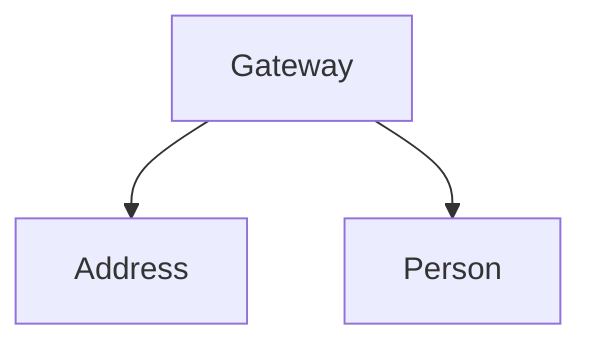
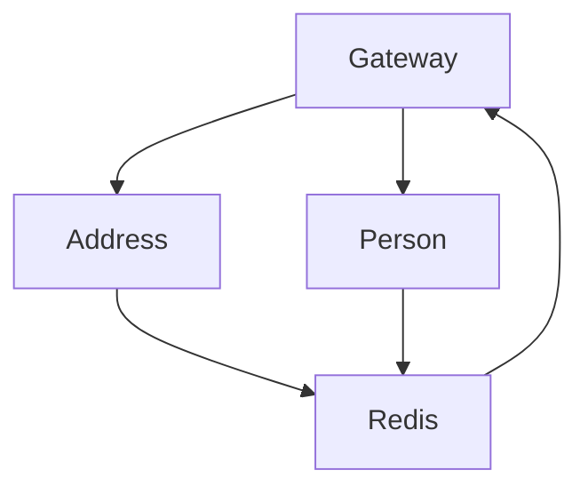
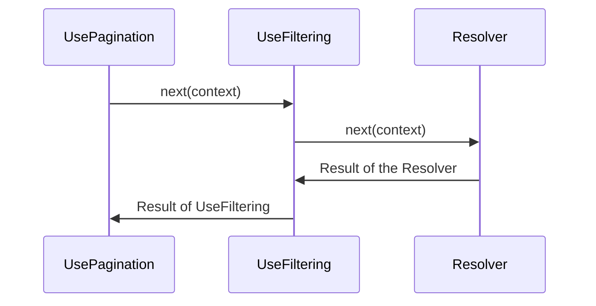
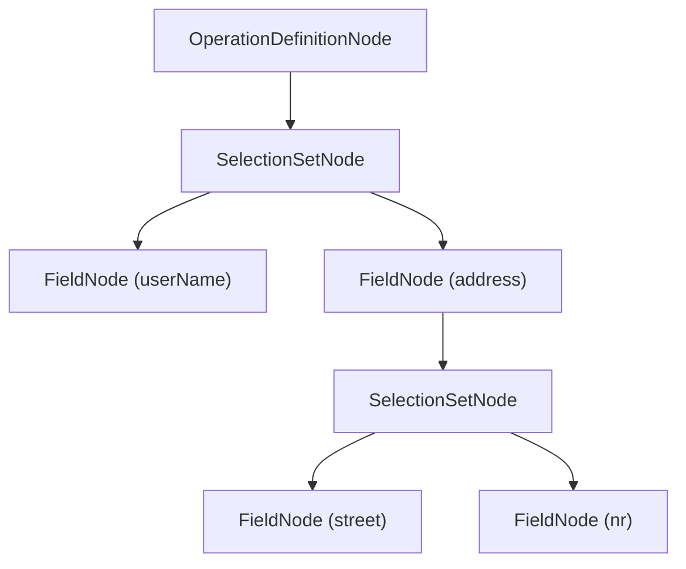
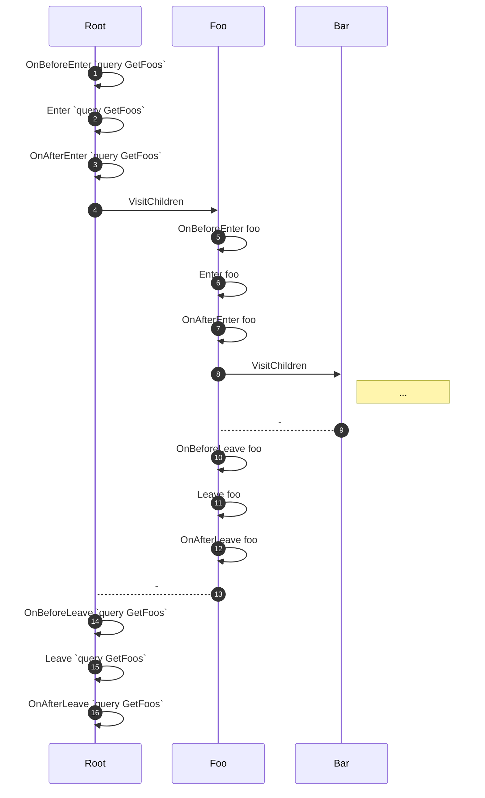
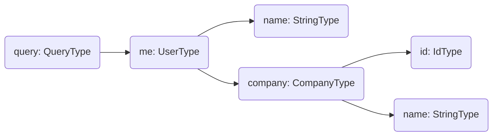
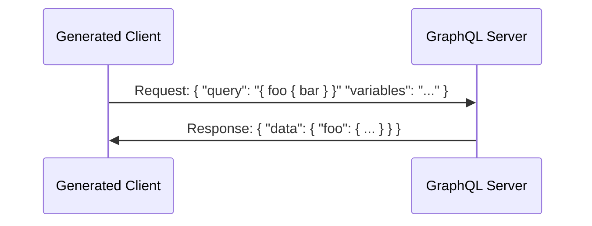
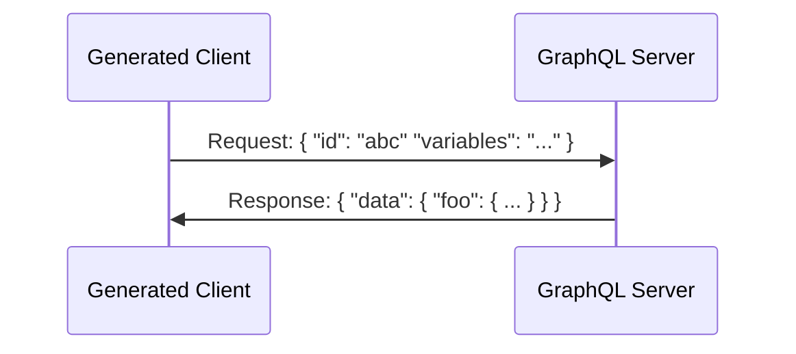
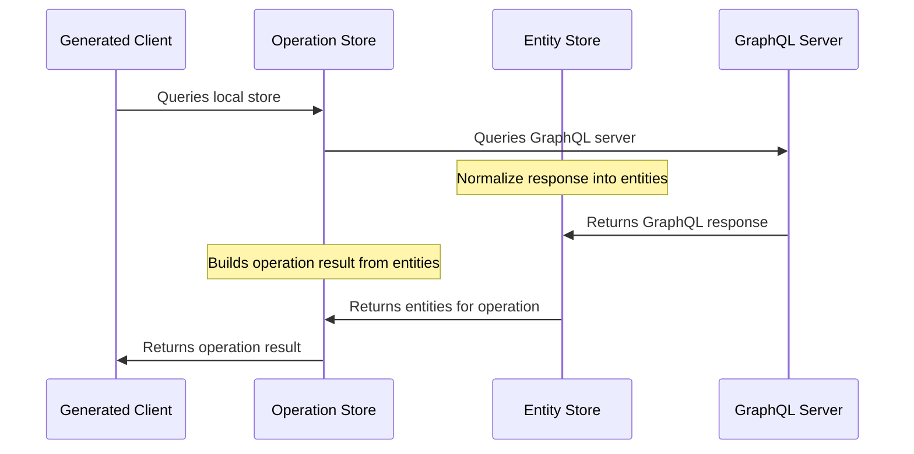

# Acceptance

By using the software, you agree to all of the terms and conditions below.

# Copyright License

The licensor grants you a non-exclusive, royalty-free, worldwide,
non-sublicensable, non-transferable license to use, copy, distribute, make
available, and prepare derivative works of the software, in each case subject to
the limitations and conditions below.

# Limitations

You may not move, change, disable, or circumvent the license key functionality
in the software, and you may not remove or obscure any functionality in the
software that is protected by the license key.

You may not alter, remove, or obscure any licensing, copyright, or other notices
of the licensor in the software. Any use of the licensor’s trademarks is subject
to applicable law.

## Patents

The licensor grants you a license, under any patent claims the licensor can
license, or becomes able to license, to make, have made, use, sell, offer for
sale, import and have imported the software, in each case subject to the
limitations and conditions in this license. This license does not cover any
patent claims that you cause to be infringed by modifications or additions to
the software. If you or your company make any written claim that the software
infringes or contributes to infringement of any patent, your patent license for
the software granted under these terms ends immediately. If your company makes
such a claim, your patent license ends immediately for work on behalf of your
company.

# Notices

You must ensure that anyone who gets a copy of any part of the software from you
also gets a copy of these terms.

If you modify the software, you must include in any modified copies of the
software prominent notices stating that you have modified the software.

# No Other Rights

These terms do not imply any licenses other than those expressly granted in
these terms.

# Termination

If you use the software in violation of these terms, such use is not licensed,
and your licenses will automatically terminate. If the licensor provides you
with a notice of your violation, and you cease all violation of this license no
later than 30 days after you receive that notice, your licenses will be
reinstated retroactively. However, if you violate these terms after such
reinstatement, any additional violation of these terms will cause your licenses
to terminate automatically and permanently.

# No Liability

_As far as the law allows, the software comes as is, without any warranty or
condition, and the licensor will not be liable to you for any damages arising
out of these terms or the use or nature of the software, under any kind of
legal claim._

# Definitions

The **licensor** is the entity offering these terms, and the **software** is the
software the licensor makes available under these terms, including any portion
of it.

**you** refers to the individual or entity agreeing to these terms.

**your company** is any legal entity, sole proprietorship, or other kind of
organization that you work for, plus all organizations that have control over,
are under the control of, or are under common control with that
organization. **control** means ownership of substantially all the assets of an
entity, or the power to direct its management and policies by vote, contract, or
otherwise. Control can be direct or indirect.

**your licenses** are all the licenses granted to you for the software under
these terms.

**use** means anything you do with the software requiring one of your licenses.

**trademark** means trademarks, service marks, and similar rights.
---
title: Environments
---

Environment variable provide a mechanism for reusing specific values across multiple documents. These variables are defined as key-value pairs.

Frequently used data, like URLs, tokens, and credentials, are commonly centrally managed as environment variable. 
By doing so, these values can be referenced in your documents and changed in a single location for all you documents. You can also quickly switch between different values for different environments. 

For instance, you might store your API key as an environment variable, allowing it to be used universally in all your documents. 
If the API key changes, you can just update the environment variable without having to manually alter each document.

You can define multiple environments for a single workspace corresponding to various contexts or project stages (e.g., development, testing, production). The environments can be switched in the status bar.

When you have different project stages such as such as development (`https://serivce1.dev.company.com`), testing (`https://serivce1.test.company.com`), and production (`https://serivce1.prod.company.com`), you can for example set up the dynamic part of the url as a variable URL and incorporate it in all your urls (`https://serivce1.{{subdomain}}.company.com`). 
By switching the active environment in Banana Cake Pop, the base URL will update automatically, streamlining your workflow. 
Similarly, identifiers such as client ID and client secret can be defined as environment variable, which make it convenient to work with.

# Creating Environments

To create a new environment, follow these steps:
1. Click on the environment icon on the left side of your screen. 
2. Click the Plus icon to create a new environment.
3. Enter a name for the environment.

# Rename Environments

You can rename by right-clicking on the environment and selecting the 'Rename' option. 

# Specifying Variables


To open the environment variable editor, click on the environment you would like to edit.

1. **Enabled**: If an environment variable is disabled, it will not be used in requests. This state is not synchronized with the server and is only local to the client. This way you can temporarily disable an environment variable without other users being affected.
2. **Name**: The name of the environment variable. This name will be used to reference the variable in your documents. e.g. `{{ClientId}}`, `{{ClientSecret}}` `{{Subdomain}}`
3. **Value**: The value of the environment variable. This value will be substituted in your documents when the environment variable is referenced.
4. **Secret**: If an environment variable is marked as secret, it will be shown as a password field within the Banana Cake Pop interface. This feature is designed to help prevent accidental exposure of the value. Please note that marking a value as secret does not mean it is encrypted; it is simply visually obscured in the user interface.
5. **Apply**: Clicking the 'Apply' button will save the environment variables. 


# Switching Environments

To switch environments, click on the environment name in the status bar. A dropdown menu will appear, listing all available environments.
After selecting an environment, the environment variables of the selected environment will be active and applied to all documents.

# Using Variables 

Once you have defined an environment variable, you can reference it in your documents by using the following syntax: `{{variable_name}}`.
Environment variable can be employed in a variety of places within Banana Cake Pop, such as URLs, GraphQL Variables, and Connection Settings. When a request is executed, any referenced environment variable will be substituted with their respective values.
---
title: "Organizations"
---
This guide will walk you through the features and functionalities of BCP Organizations, a structure designed to help teams and individuals work efficiently and effectively on GraphQL related services.

# What is an Organization
 An organization typically represents an entire entity or a larger unit within an entity. Each organization can host multiple workspaces, allowing further categorization and organization of resources. A workspace might correspond to a specific project, a specific team within the organization, or a group of related APIs. 

Each BCP user has a personal organization. This is a private space for individual work or for projects that are not associated with any team or company organization. The personal organization is not visible to other users, is created by default and cannot be deleted. 

# Creating an Organization

BCP allows for multiple organizations under one account. To add a new organization, navigate to the organization switcher in the status bar and click on the "Add Organization" button.


You will be redirected to the management portal. Here you can create a new organization by clicking the 'Create' button.


Each organization has a unique name and a display name which can be set during creation. 
The name must be lowercase and may only include dashes (-) and underscores (_).


# Managing Organizations
To manage your organizations, you have to open the management portal. 


In the client app, you can do this by clicking Manage Organizations'  and then 'Manage' on the organization that you like to manage.

You can also navigate to [here](https://identity.chillicream.com/Organizations) to open the management portal and press 'Manage' on the organization that you like to manage.


# Switching Organizations
In Banana Cake Pop, you can be signed into multiple organizations at the same time and switch between them in the status bar. The organization switcher also allows you to create new organizations. 


# Managing Members


1. The count of members and the number of seats available in your subscription are displayed in the management overview section. (members/total seats)

2. This list show all the members of the organization and their role.

3. Members can be invited to join an organization via email. In the management overview section, the 'Invite User' button allows you to send an invitation email containing a join link. 

4. Open invitations are displayed below. You can revoke an invitation by clicking on the 'Cancel' button. Once an invitation is expired, you can resend it by clicking on the 'Resend' button.

## Joining an Organization
Invited users can join an organization in two ways:

1. By clicking on the join link they received via email.
1. By opting to join during login on the sign in page.

During sign-in, the user can select into which organization (join orgs or personal) they want to sign in.

[Description of visualization: Screenshot showing the organization selection during sign-in]

# User Roles and Access

There are three distinct roles within an organization: Owner, Admin, and Collaborator. Each role carries specific permissions:

| Role         | Transfer Ownership | Delete Organization | Invite Users | View Subscriptions | Add Redirect URLs |
| ------------ | ------------------ | ------------------- | ------------ | ------------------ | ----------------- |
| Owner        | Yes                | Yes                 | Yes          | Yes                | Yes               |
| Admin        | No                 | No                  | Yes          | Yes                | Yes               |
| Collaborator | No                 | No                  | No           | No                 | No                |

- **Owner:** The owner can transfer ownership, delete the organization, and has all the permissions of an admin. Each organization can only have one owner.

- **Admin:** Admins can invite users to the organization, view subscriptions, and add redirect URLs. They also have all the permissions of a collaborator.

- **Collaborator:** Collaborators can log into the organization and leave the organization. They cannot add redirect URLs or invite new users.

## Managing Permissions


You can manage the permissions of each member in the member list. 

1. Press the 'Edit' button on the right side of the member list to open the edit dialog.

2. Select the desired role for the member.

3. Press the 'Save' button to save the changes.

4. You can also remove a member from the organization by clicking on the 'Revoke Access' button.

# Transferring Ownership 

Ownership of the organization can be transferred to any existing member from the management portal. 
In the danger zone section, click on the 'Transfer Ownership' button to open the transfer dialog.


# Redirect URLs 

Each time a user signs into an organization from a new origin, a redirect URL must be added to the organization. 

This security measure is designed to prevent your access tokens from being leaked to any arbitrary site hosted by third parties.

If the user is a collaborator, they won't have the permissions to add the URL and will see an informative message. An admin, on the other hand, can directly add the URL to the organization. 

You can add the redirect URL in two ways:

1. By signing in from the new origin. This will trigger a prompt to add the URL to the organization.


2. By adding the URL directly from the management portal. 


In the portal you have more options to configure the allowed destinations. You can for example allow all localhost origins. Or disable the access to the web UI in the [cloud](https://eat.bananacakepop.com) 

1. Configure the allowed types of origins.
2. Add redirect Urls to the organization.
3. Remove redirect Urls from the organization.
---
title: "Key Bindings"
---

This document provides a list of useful keyboard shortcuts for performing various actions in the application.

A full list of all available keyboard shortcuts can be found clicking on the 'Keyboard Shortcuts' button in the status bar.


# Mac

## Application Shortcuts

- Open New Document Tab: ⌘ + ⌥ + T
- Open New Document Tab from Clipboard: ⌘ + ⌥ + V
- Toggle Sidebar (Collapse/Expand): ⌘ + B
- Open Document Explorer: ⌘ + ⇧ + D
- Open History Explorer: ⌘ + ⇧ + H
- Open Settings: ⌘ + ,
- Open Keyboard Shortcuts: ⌘ + K S

## Document Shortcuts

- Copy Document to Clipboard as cURL: ⌘ + ⌥ + C
- Close Document: ⌘ + ⌥ + W
- Save Document: ⌘ + S
- Save All Documents: ⌘ + ⌥ + S
- Format Document: ⇧ + ⌥ + F
- Toggle Operation (Run/Cancel): ⌘ + ⌥ + ⏎
- Reload Schema: ⌘ + ⌥ + R
- Show Operation: ⌘ + ⇧ + O
- Show Schema: ⌘ + ⇧ + S

# Windows

## Application Shortcuts

- Open New Document Tab: CTRL + ALT + T
- Open New Document Tab from Clipboard: Application Key + W (Windows key + W)
- Toggle Sidebar (Collapse/Expand): Application Key + B (Windows key + B)
- Open Document Explorer: CTRL + SHIFT + D
- Open History Explorer: CTRL + SHIFT + H
- Open Settings: Application Key + , (Windows key + comma)
- Open Keyboard Shortcuts: CTRL + K S

## Document Shortcuts

- Copy Document to Clipboard as cURL: CTRL + ALT + C
- Close Document: CTRL + ALT + W
- Save Document: CTRL + S
- Save All Documents: CTRL + ALT + S
- Format Document: SHIFT + ALT + F
- Toggle Operation (Run/Cancel): CTRL + ALT + Enter
- Reload Schema: CTRL + ALT + R
- Show Operation: CTRL + SHIFT + O
- Show Schema: CTRL + SHIFT + S


---
title: Settings - Overview
---


The Settings section provides users with various customization options. To access the settings, click on the cog icon located in the navigation bar on the left.

Currently, the most significant setting available is the [Themes](/docs/bananacakepop/v2/settings/themes) feature. This allows users to personalize the appearance and visual style of the application.

Please note that organization settings are exclusively accessible through the management portal. For more information about organization settings, refer to the [Organizations](/docs/bananacakepop/v2/organizations) documentation.

---
title: Settings - Themes
---

BCP offers a range of themes to customize the visual appearance of the application. These themes are available as light and dark themes, providing flexibility to suit different user preferences.


By syncing the theme mode with your operating system (OS) settings, BCP can automatically adjust the theme based on your OS's light or dark mode. When you switch between light and dark mode on your OS, the theme in BCP will change accordingly. You can specify a dark theme and a light theme to be used when syncing with your OS settings. You can set a default theme for light mode by clicking on the left side of the theme, or set a default theme for dark mode by clicking on the right side of the theme.

Here are the available themes:

**Chilli Cream Blue** 

**Chilli Cream White** 

**GitHub Dark** 

**GitHub Light** 

**GitHub High Contrast Dark** 

**GitHub High Contrast Light** 

--- 
title: Apis
---


An API within the context of Banana Cake Pop, refers to an representation of your GraphQL Servers. 
This representation is more than a mere conceptual framework — it serves as a practical tool that allows you to group your documents and share common settings like connection and authorization parameters among them.

Additionally, an API forms the foundation for your client registry, schema registry setup and the telemetry. For more detailed information on these features, refer to the [Schema & Client Registry](/docs/bananacakepop/v2/schema-client-registry) guide and the [Telemetry](/docs/bananacakepop/v2/telemetry) guide.


# API Types


## API Collection


A compilation of GraphQL Documents with shared connection settings, enabling the grouping of documents for sharing with your t.

## API Service

Incorporates all features of an API Collection and adds the capability to register your schema and clients in the schema registry. It also includes the use of telemetry for service monitoring. This type is ideal for representing a single deployment service or a subgraph.

## API Gateway

Encompasses all the features of the API Service, along with the ability to publish and manage fusion configuration. Additionally, it supports distributed telemetry for comprehensive monitoring of your Gateway.

# Creating an API


Creating an API in Banana Cake Pop is a user-friendly process. There are three methods available:

1. Click on the `Create Api` button located at the top of the document explorer toolbar.
2. Right-click within the document explorer and select `New Api` from the context menu. This creates a new API within the currently selected folder. Note: APIs can be organized in folders but cannot be nested within each other.
3. Choose the API Type. Options include `API Collection`, `API Service`, or `API Gateway`.
---
title: "Schema & Client Registry"
---


The schema registries is an essential tool for managing your GraphQL APIs. It provides a centralized location for storing, managing, and distributing your GraphQL schema definitions. 

With the schema registry, you can upload and store the schema of your API, making it accessible to your development team and other services. 


The schema registry enables you to validate your schemas and clients against previous versions, ensuring that changes to your service do not break existing functionality, deeply integrated into your CI/CD pipeline.


They also maintain a version history, allowing you to track changes over time and revert to previous versions if necessary.

Together with the client registry, you can maintain the integrity of your API and the services that rely on it, ensuring that they can evolve together without breaking.

# Understanding Schemas

In the context of GraphQL APIs, a schema is the blueprint that defines the shape of your data and specifies the capabilities of the API. It outlines the types of queries and mutations that can be executed against your API. 

A schema is more than just a technical specification; it is a contract between your API and your clients. By understanding and managing schema changes, you can ensure that this contract remains valid and that your API and clients can evolve together without breaking.

Each stage of your API can have one active schema. This active schema is the one against which all requests are validated. 

## Schema Changes

Changes to the schema can be categorized into three levels of severity based on their potential impact on the clients: safe, dangerous, and breaking.

1. **Safe**: These changes don't affect the existing functionality. Examples include changes to descriptions or adding a new optional field to a type. Safe changes are generally backward compatible and don't require modifications to existing clients.

Examples are: 
- Adding a new field to an object type
- Adding a new optional argument to a field or directive
- Adding a new type

2. **Dangerous**: These changes could potentially break existing functionality, depending on how your consumers interact with your API. An example of a dangerous change is adding a new member to an enum. If the client is not prepared to handle the new member, it might result in unexpected behavior.

Examples are:
- Adding a new member to an enum
- Adding a new implementation to an interface

3. **Breaking**: These changes will break existing functionality if the affected parts of the schema are being used by clients. Examples include changing the type of a field, adding a required field to an input type, removing a field, or adding a new required argument to a field or directive.

Examples are:
- Removing a field from an object type
- Changing the type of a field
- Change a non-null field to a nullable field

Breaking changes need to be managed with care to avoid disruptions to the service. It's important to ensure that all clients can handle these changes before they are introduced. This can be accomplished by versioning your clients and managing the lifecycle of client versions, as described in the section [Understanding Clients](#understanding-clients)].

## Extracting the Schema 

Extracting your GraphQL API's schema can be beneficial for various purposes, such as documentation, testing, and version control. Here are some methods to extract the schema:

### Using Schema Export Command

One of the simplest ways to extract the schema is by using the `schema export` command. This command exports your current schema into a specified output file.

```shell
dotnet run -- schema export --output schema.graphql
```

For more details about this command and how to setup the command line extension, please refer to the [Command Line Extension documentation](/docs/hotchocolate/v13/server/command-line).

### Utilizing Snapshot Testing

If you have already established snapshot testing in your workflow, you can use it to extract the schema. Snapshot tests compare the current schema against a previously saved one. If the schemas differ, the test fails, ensuring unintentional schema changes are detected.

Additionally, keeping a snapshot test in the repository aids in visualizing schema changes in pull requests.

Here is a sample snapshot test using [Snapshooter](https://github.com/SwissLife-OSS/snapshooter):

```csharp
[Fact]
public async Task Schema_Should_Not_Change()
{
  // Arrange
  var executor = await new ServiceCollection()
    .AddGraphQL()
    .AddYourSchema()
    .BuildRequestExecutorAsync();

  // Act
  var schema = executor.Schema.Print();

  // Assert
  schema.MatchSnapshot();
}
```
# Setting Up a Schema Registry

To set up a schema registry, first, visit `eat.bananacakepop.com` and sign up for an account. Next, you'll need to download and install Barista, the .NET tool used to manage your schema registry. You can find more information about Barista in the [Barista Documentation](/docs/barista/v1). 

After installing Barista, create a new API either through the Bananacakepop UI or the CLI. In the UI, simply right-click the document explorer and select "New API." If you prefer using the CLI, ensure you're logged in with the command `barista login`, then create a new API with the command `barista api create`. With these steps complete, you are ready to start using the schema registry.

To get the id of your API, use the command `barista api list`. This command will list all of your APIs, their names, and their ids. You will need the id of your API to perform most operations on the schema registry. 

# Integrating with Continuous Integration

Integrating the schema registry and into your Continuous Integration/Continuous Deployment (CI/CD) pipeline maximizes their benefits. It ensures that the schemas in your API are always up-to-date and tested against potential breaking changes.

To interact with the schema registry from the pipeline, you will need a API key. You can generate an api key directly with Barista using the command `barista api-key create`. Make sure to copy the key and store it in a secure location. The key will not be displayed again.

You can then use the key to authenticate with the schema registry using the `--api-key` option. 

The schema and client registries work hand-in-hand to ensure the smooth functioning of your API. As you make changes to your schema, the schema registry helps manage these changes, preventing inadvertent breaking changes and preserving a history of your schemas. As you validate, upload, and publish new schemas, the client registry ensures that your clients remain compatible with these changes.

## Understanding the Flow

The general flow for the schema registry involves three main steps: validating the schema, uploading it to the registry, and publishing it.

1. **Validate the Schema **: The first step takes place during your Pull Request (PR) build. Here, you validate the schema against the API using the `barista schema validate` command. This ensures that the schema is compatible with the API and will not break existing functionality. 

2. **Upload the Schema**: The second step takes place during your release build. Here, you upload the schema to the registry using the `barista schema upload` command. This command requires the `--tag` and `--api-id` options. The `--tag` option specifies the tag for the schema, and the `--api-id` option specifies the ID of the API to which you are uploading. This command create a new version of the schema with the specified tag.
The tag is a string that can be used to identify the schema. It can be any string, but it is recommended to use a version number, such as `v1` or `v2`; or a commit hash, such as `a1b2c3d4e5f6g7h8i9j0k1l2m3n`.  The tag is used to identify the schema when publishing it.

3. **Publish the Schema **: The third step takes place just before the release. Here, you publish the schema using the `barista schema publish` command. This command requires the `--tag` and `--api-id` options. The `--tag` option specifies the tag for the schema, and the `--api-id` option specifies the ID of the API to which you are uploading. This command publishes the schema with the specified tag, making it the active version for the specified API.
--- 
title: Stages
---

# Working with Stages


A stage represents an environment of your service, such as development, staging, or production. Each stage can have an active schema and multiple active client versions. 

Stages are integral to the lifecycle management of your GraphQL APIs. They enable you to manage different environments of your service, such as development, staging, or production. Each stage can have an active schema, multiple active client versions and telemetry reports. The active schema and client versions for a stage represent the current state of your API for that environment.

Stages in your development workflow can be arranged sequentially to represent progression of changes. For instance, in a simple flow like Development (Dev) - Quality Assurance (QA) - Production (Prod), each stage comes "after" the preceding one. This signifies that changes propagate from "Dev" to "QA", and finally to "Prod"

## Managing Stages

If you do not have stages yet, you can go the the `Stages` tab and click on `Use default stages`. This will add a stage `Development` and a stage `Production` to your service.


You can always edit these stages or add new ones by clicking the `Edit Stages` button.


The stages dialog allows you to add and edit stages. You can also delete stages, but only if they are not used by any client or schema. 

Stages are edited in a yaml editor. The default configuration looks like this:

```yaml
dev: # define a stage by adding the identifier as a root node
  displayName: Development # add a display name to a stage
prod:
  displayName: Production
  conditions:
    - after: dev # this defines the connection to other stages. production comes after development
```

You can easily create more complex stage configurations. For example, if you have two different QA stages, you can define them like this:

```yaml
dev: 
  displayName: Development 
qa1:
  displayName: QA 1
  conditions:
    - after: dev 
qa2:
  displayName: QA 2
  conditions:
    - after: dev 
prod:
  displayName: Production
  conditions:
    - after: qa1 
    - after: qa2 
```

This configuration defines two QA stages, `QA 1` and `QA 2`. Both of them come after the `Development` stage. The `Production` stage comes after both QA stages. It will result in the following stage order:


---
title: "Client Registry"
---


The client registries is an important tool for managing your GraphQL Clients. It provides a centralized location for clients and queries. 

You can use the client registry to manage your clients and their queries. It allows you to validate your queries against the schema, ensuring that all the operations defined by a client are compatible with the current schema. This validation step is critical to prevent the execution of invalid queries that might result in runtime errors.

# Understanding Clients 

A client, in the context of a GraphQL API, is an entity that interacts with the API by defining and executing GraphQL operations. These operations are stored on the API as persisted queries.

## What is a Persisted Query?

A persisted query is a GraphQL operation that has been sent to the server, stored, and assigned an unique identifier (hash). Instead of sending the full text of a GraphQL operation to the server for execution, clients can send the hash of the operation, reducing the amount of data transmitted over the network. This practice is particularly beneficial for mobile clients operating in environments with limited network capacity.

Persisted queries also add an extra layer of security as the server can be configured to only execute operations that have been previously stored, which prevents malicious queries. This is the cheapest and most effective way to secure your GraphQL API from potential attacks.


Persisted queries can be inspected in the `Operations` tab.

## The Role of the Client Registry

The client registry plays a crucial role in managing these persisted queries. It is used to validate the queries against the schema, ensuring that all the operations defined by a client are compatible with the current schema. This validation step is critical to prevent the execution of invalid queries that might result in runtime errors.

Additionally, the client registry is responsible for distributing the queries to the GraphQL server. It maintains a mapping of hashes to query keys, informing the server which hash corresponds to which query. This allows the server to efficiently look up and execute the appropriate query when it receives a request from a client.

## Client Versions

A client can have multiple versions, with each version containing a different set of persisted queries. This versioning system allows for incremental updates and changes to the client's operations without disrupting the existing functionality. As new versions are released, they can be validated and registered with the client registry, ensuring that they are compatible with the current schema and can be executed by the server.

By managing client versions and persisted queries, the client registry helps maintain the integrity and smooth operation of your GraphQL API. It ensures that your clients and API can evolve together without breaking, contributing to a more robust and reliable system.

The number of active client versions can vary depending on the nature of the client. For instance, a website usually has one active client version per stage. However, during deployment, you might temporarily have two active versions as the new version is phased in and the old version is phased out.

On the other hand, for mobile clients, you often have multiple versions active simultaneously. This is because users may be using different versions of the app, and not all users update their apps at the same time.

Once a client version is no longer in use, it reaches its end of life. At this point, you can unpublish the client version from the client registry. This will remove its persisted queries from distribution, and they will no longer be validated against the schema. 

## The Operations File

In the context of GraphQL, the operations file is a structured file that holds a collection of persisted queries for a client. This file serves as a reference for the client to manage and execute specific operations against a GraphQL API. 

### Understanding the Format and Structure

The operations file typically adopts the JSON format as used by Relay. It comprises key-value pairs, with each pair representing a unique persisted query. The key corresponds to a hash identifier for the query, and the value is the GraphQL query string. Below is an illustrative example of an operations file (`operations.json`):

```json
{
   "913abc361487c481cf6015841c0eca22": "{ me { username } }",
   "0e7cf2125e8eb711b470cc72c73ca77e": "{ me { id } }"
   ...
}
```

### Compatibility with GraphQL Clients

Several GraphQL clients have built-in support for this Relay-style operations file format. This compatibility allows for a standardized way of handling persisted queries across different clients. For more details on how various clients implement and work with persisted queries, consider referring to their respective documentation:

- [StrawberryShake](https://chillicream.com/docs/strawberryshake/v13/performance/persisted-queries)
- [URQL](https://formidable.com/open-source/urql/docs/advanced/persisted-queries/)
- [Relay](https://relay.dev/docs/guides/persisted-queries/)

# Setting Up a Client Registry

To set up a client registry, first, visit `eat.bananacakepop.com` and sign up for an account. Next, you'll need to download and install Barista, the .NET tool used to manage your client registry. You can find more information about Barista in the [Barista Documentation](/docs/barista/v1). 

After installing Barista, create a new API either through the Bananacakepop UI or the CLI. In the UI, simply right-click the document explorer and select "New API." If you prefer using the CLI, ensure you're logged in with the command `barista login`, then create a new API with the command `barista api create`. With these steps complete, you are ready to start using the client registry.

To get the id of your API, use the command `barista api list`. This command will list all of your APIs, their names, and their ids. You will need the id of your API to perform most operations on the schema registry. 

# Integrating with Continuous Integration

Integrating the client registry into your Continuous Integration/Continuous Deployment (CI/CD) pipeline maximizes their benefits. It ensures that the clients in your API are always up-to-date and tested against potential breaking changes.

The schema and client registries work hand-in-hand to ensure the smooth functioning of your API. As you make changes to your schema, the schema registry helps manage these changes, preventing inadvertent breaking changes and preserving a history of your schemas. As you validate, upload, and publish new schemas, the client registry ensures that your clients remain compatible with these changes.

As you release new versions of your clients, the client registry helps manage these versions and the query documents associated with them. By working together, the schema and client registries help maintain the integrity of your API and the services that rely on it, ensuring that they can evolve together without breaking.

## Understanding the Flow

The general flow for the client registry involves three main steps: validating the client, uploading it to the registry, and publishing it.

1. **Validate the Client**: The first step takes place during your Pull Request (PR) build. Here, you validate the client against the API using `barista client validate` command. This ensures that the client is compatible with the API and will not break existing functionality. 

2. **Upload the Client**: The second step takes place during your release build. Here, you upload the client to the registry using the `barista client upload` command. This command requires the `--tag` and `--api-id` options. The `--tag` option specifies the tag for the client, and the `--api-id` option specifies the ID of the API to which you are uploading. This command create a new version of the client with the specified tag.
The tag is a string that can be used to identify the client. It can be any string, but it is recommended to use a version number, such as `v1` or `v2`; or a commit hash, such as `a1b2c3d4e5f6g7h8i9j0k1l2m3n`.  The tag is used to identify the client when publishing it.

3. **Publish the Client **: The third step takes place just before the release. Here, you publish the client using the `barista client publish` commands. This command requires the `--tag` and `--api-id` options. The `--tag` option specifies the tag for the client, and the `--api-id` option specifies the ID of the API to which you are uploading. This command publishes the client with the specified tag, making it the active version for the specified API.
Banana Cake Pop can collect your open telemetry data and visualize your traces in the app. 
With telemetry you can get a better understanding of how your application is performing and where you can improve it.
It helps you to understand which resolver is impacting your system the most, which queries are slow and which are fast. 

## Connect your service to the telemetry system

## 1. Creating an API
All the reporting is done on a per API basis. An api represents one of your deployments. To monitor you services you need to create an API in banana cake pop.
The api needs to be from type "Api Service" or "Api Gateway".


## 2. Creating Stages


To connect your service to the telemetry system, you need to add the nuget package [`BananaCakePop.Services`](https://www.nuget.org/packages/BananaCakePop.Services/) to your project. 

```
dotnet add package BananaCakePop.Services
```

Y

---
title:  Workspaces
---

Workspaces are logical groups within an organization.  A workspace could represent a team, a department, or a group of APIs that are related to each other.

Each workspace has its own APIs, documents, API documents, environments, and more. You cannot share resources between workspaces. 

All members of an organization have default access to all workspaces and can edit the documents within them. In the future we will add more granular permissions to workspaces.

In Banana Cake Pop, you can switch between workspaces using the status bar. 


At the moment, workspaces can only be created with barista. To create a new workspace, use the `barista workspace create` command. 
You can find out more about barista [here](/docs/barista/v1).
---
title: "Getting Started"
---
Ready to explore the delicious features of Banana Cake Pop? In this getting started guide, we'll show you how to get up and running with Banana Cake Pop. 
You have the option to choose between the convenience of the web app or the enhanced capabilities of the desktop version. We'll guide you through the setup process, so you can start enjoying all that Banana Cake Pop has to offer.

Get ready to unlock the full potential of GraphQL with Banana Cake Pop. Choose your preferred option and follow the setup instructions to start enjoying the delicious features that Banana Cake Pop has to offer.
# Web App

To begin your exploration, simply visit [eat.bananacakepop.com](https://eat.bananacakepop.com/) and experience the convenience of Banana Cake Pop's web-based version. This excellent starting point allows you to conveniently probe public GraphQL APIs and access most of the features that Banana Cake Pop offers. For an even more immersive experience, you can also install the web app as a Progressive Web App (PWA) on your device, providing a native-like experience.

# Desktop App

You can install the Banana Cake Pop App directly from our [download page](/products/bananacakepop). The download page provides DMG installers for macOS, x64 installers for Windows, and AppImage/Snap installers for Ubuntu and Ubuntu-based Linux distributions. Note that other Linux distributions or installer formats are currently unsupported.

## Package Managers 

1. **Homebrew**: If you have [Homebrew](https://brew.sh) installed, use this command to install the app:

```bash
brew install --cask banana-cake-pop
```

2. **Windows Package Manager**: For Windows 11 or a supported version of Windows 10 with the [Windows Package Manager](https://docs.microsoft.com/en-us/windows/package-manager/) installed, use:
    ```powershell
    winget install banana-cake-pop
    ```
3. **Scoop**: To install on Windows 7, 10, or 11 using [Scoop](https://scoop.sh/), run these commands:
    ```powershell
    scoop bucket add extras
    scoop install banana-cake-pop
    ```

Upon successful installation, follow the steps in the [Your first Query](#your-first-query) guide to execute your first GraphQL query using Banana Cake Pop.

# Your First Query

Lets guide you through the process of creating your first GraphQL query document using Banana Cake Pop.

**Step 1:** Start the Banana Cake Pop application. You should see an interface similar to this: 


**Step 2:** Click on the "Create Document" button to initiate the creation of your first query document.

**Step 3:** You'll see a new document called 'untitled 1' generated. Simultaneously, the connection settings dialog box will pop up automatically. 
Now, input the following link into the 'Schema Endpoint' field: https://workshop.chillicream.com/graphql
It should resemble this:


**Step 4:** Click on the 'Apply' button. This will save your settings and close the dialog box.

**Step 5:** At this point, your screen should look like this:


Take note of the following key elements:

1. **Operation Pane:** This is where you will input your queries.
1. **Response Pane:** Here, you will see the output or response of your queries.
1. **Variables Pane:** This is where you can define variables for your query.


**Step 6:** The green circle at the top right next to the schema url indicates that you are connected to the GraphQL server and that your schema is fetched. You now have full intellisense for your queries. Copy the following GraphQL query and paste it into the 'Operations' editor area:

```graphql
{
  sessionById(id: "U2Vzc2lvbgppMQ==") {
    title
    track {
      name
    }
    startTime
    endTime
  }
}
```

**Step 7:** Click on the 'Run' button. You should see a response with data in the 'Response' area. Congratulations, you have completed a GraphQL query!

**Step 8:** 
Now, let's save your document. 


Sign in to your account by clicking the 'Sign In' button on the user icon in the bottom left corner of the screen. If you don't have an account, you can create a new one.

**Step 9:** Once you are signed in, save your document by clicking the 'Save' button next to the tabs. Your documents are now synced between your devices.


**Step 10:** Great job! You've successfully created, executed, and saved your first GraphQL query using Banana Cake Pop. To learn more about the Banana Cake Pop User Interface, head over to the [Explore the UI](/docs/bananacakepop/v2/explore-the-ui) guide.

Happy querying!
--- 
title: Connect you API
---

BananaCake Pop can be smoothly integrated into your HotChocolate server, enabling utilization of the Persisted Query Storage found within the client registry. Your server will establish a connection with BananaCake Pop, retrieving persisted queries based on their unique hashes. Additional information on the client registry can be found [here](/docs/bananacakepop/v2/schema-client-registry).

## Getting Started
To get started, follow these steps:

1. Set up a client registry as instructed [here](/docs/bananacakepop/v2/schema-client-registry).

2. Install the BananaCakePop package from NuGet using the following command:
```bash
dotnet add package BananaCakePop.Services
```

3. Configure your services as shown in the following code snippet:
```csharp
var builder = WebApplication.CreateBuilder(args);

builder.Services
    .AddGraphQLServer()
    .AddQueryType<Query>()
    .AddBananaCakePopServices(x =>
    {
        x.ApiId = "VGhpcyBpcyBub3QgYSByZWFsIGFwaSBpZA==";
        x.ApiKey = "Tm9wZSwgdGhpcyBpcyBhbHNvIG5vIHJlYWwga2V5IDspIA==";
        x.Stage = "dev";
    })
    .UseOnlyPersistedQueriesAllowed() // optional
    .UsePersistedQueryPipeline();

var app = builder.Build();

app.MapGraphQL();

app.Run();
```

4. Retrieve the API id and API key from Barista using the `barista api list` and `barista api-key create` commands respectively. Instructions for these commands can be found [here](/docs/barista/v1).

Congratulations! You have successfully integrated BananaCake Pop into your HotChocolate server. You can now publish new versions of your clients and your server will automatically retrieve the latest persisted queries.
---
title: "Status Bar"
---

The status bar is a visual component located at the bottom of the application interface. It is divided into several sections, each providing valuable information to the user.


1. **Connection Status:** This section indicates whether you are currently connected to the internet or not. When online, it means that any changes you make are being synchronized with the cloud.

2. **User Info:** The section displays the email of the user who is currently signed in to the application. It helps you identify the user account associated with the active session.

3. **Selected Organization:** In this section, you can see the name of the organization that is currently selected. Clicking on this section allows you to change the organization or add a new one.


4. **Selected Workspace:** This section shows the currently selected workspace within the chosen organization. By clicking here, you can easily switch to a different workspace, providing seamless navigation between different project environments.


5. **Environment:** This section displays the name of the currently selected environment. Clicking on this section allows you to switch to a different environment or create a new one.


6. **Workspace Synchronization Indicator:** The indicator in this section informs you whether the workspace is currently synchronizing. If synchronization is required or you want to manually trigger the process, you can click here to initiate synchronization.

7. **Schema Up-to-Date:** This section provides an indicator to show whether the schema, which defines the structure and organization of data within the application, is up to date.

8. **Keyboard Shortcuts Overlay:** By clicking on this section, you can display an overlay that shows a list of available keyboard shortcuts for efficient navigation and interaction with the application.


9. **Version Information:** This section displays relevant information about the version of the application you are currently using. It helps you identify the installed version and keep track of updates or changes that may be available.

---
title: "Explorer"
---

The Explorer is a versatile component utilized in various parts of the application. It serves as a navigation tool for traversing the workspace tree, enabling you to efficiently browse and manage their project's structure. Additionally, the Explorer uses icons to visually represent the type of each item within the workspace.


### 1. Quick Actions

The Explorer offers a set of quick actions that allow users to perform common tasks swiftly. In the provided example, the quick actions enable the creation of a document, folder, or API with just a few clicks. 

### 2. Folder Node

Folder nodes within the Explorer can be expanded or collapsed by clicking on the arrow associated with them. The icon accompanying each folder node indicates its item type, aiding in quick identification and differentiation. 

### 3. Context Menu

Right-clicking on an item within the Explorer opens the context menu, which presents a list of actions that can be performed on the selected item. The context menu provides a convenient way to access item-specific operations and functions relevant to the current workspace context. 
---
title: Explore the UI
---


Let's explore the main components of the Banana Cake Pop application's user interface:

1. **Sidebar**: The sidebar contains various icons representing different sections of the application. Interacting with these icons will alter the content displayed in the main area. For instance, in the current view, the highlighted icon indicates that we are in the **Documents** section. For detailed information, please refer to our guide on [Documents](/docs/bananacakepop/v2/documents).

2. **History**: This section displays the list of recently executed queries.

3. **Settings**: To modify application preferences, you can navigate to the Settings section. Learn more about it in our [Settings Guide](/docs/bananacakepop/v2/settings).

4. **User Menu**: This section allows users to sign in/out, manage their accounts, and handle billing. You can read more about account management and billing in the organization section [Organizations](/docs/bananacakepop/v2/organizations).

5. **Status Bar**: The status bar provides quick access to workspace, organization, and synchronization features. It also displays additional information. More details are provided in our [Status Bar Guide](/docs/bananacakepop/v2/explore-the-ui/status-bar).

6. **Document Tree**: Here you can manage files, folders, documents, and APIs. Read more about it in the [Explorer](/docs/bananacakepop/v2/explore-the-ui/explorer).

7. **Main Area**: The main area showcases the content related to the selected section from the sidebar. In this instance, it displays the **Documents** section.
---
title: "Banana Cake Pop - Express"
---

You can easily integrate Banana Cake Pop GraphQL IDE with your server app using the `@chillicream/bananacakepop-express-middleware` package.
You can either use a CDN hosted version of the app or a self-hosted version using the dedicated package.

# Installation

First, you need to install this package and the required peer dependencies in your project:

```bash
npm install @chillicream/bananacakepop-express-middleware --save-dev
# or
yarn add @chillicream/bananacakepop-express-middleware --dev
# or
pnpm add @chillicream/bananacakepop-express-middleware --save-dev
```

Note: `@chillicream/bananacakepop-graphql-ide` is optional and only needed if you prefer to self host the app.

# Usage

To use the middleware, simply import it and add it to your Express app.

```javascript
import express from "express";
import { graphqlHTTP } from "express-graphql";
import { GraphQLObjectType, GraphQLSchema, GraphQLString } from "graphql";

import bcpMiddleware from "@chillicream/bananacakepop-express-middleware";

const schema = new GraphQLSchema({
  query: new GraphQLObjectType({
    name: "Query",
    fields: {
      greeting: {
        type: GraphQLString,
        resolve(_parent, _args) {
          return "Hello, World!";
        },
      },
    },
  }),
});

const app = express();

app.use(
  "/graphql",

  // for `cdn` hosted version
  bcpMiddleware({ mode: "cdn" }),

  // for `self` hosted version
  // bcpMiddleware({ mode: "self" }),

  graphqlHTTP({
    schema,
    graphiql: false,
  })
);

app.listen(3000, () => {
  console.log(`GraphQL on http://localhost:3000/graphql`);
});
```

You can also use it in the `self` mode for a self-hosted version:

```javascript
bcpMiddleware({ mode: "self" }) // for `self` hosted version
```

# Extended configuration

## Pin a specific version
To pin a specific version instead of using "latest":

```javascript
bcpMiddleware({
  mode: "cdn",
  target: { version: "3.0.0" },
});
```

## Use your own infrastructure
To use your own infrastructure:

```javascript
bcpMiddleware({
  mode: "cdn",
  target: "https://mycompany.com/bcp",
});
```

## Custom options
To pass options supported by Banana Cake Pop GraphQL IDE:

```javascript
bcpMiddleware({
  mode: "cdn",
  options: {
    title: "BCP",
  },
});
```

| Property                | Description                                                   | Type                              |
| ----------------------- | ------------------------------------------------------------- | --------------------------------- |
| title                   | The title of the Banana Cake Pop IDE.                         | `string` (optional)               |
| graphQLDocument         | Specifies the GraphQL document (query/mutation/subscription). | `string` (optional)               |
| variables               | Specifies the variables used in the GraphQL document.         | `Record<string, any>` (optional)  |
| includeCookies          | If `true`, includes cookies in the request.                   | `boolean` (optional)              |
| httpHeaders             | Specifies HTTP headers for the request.                       | `HttpHeaderDictionary` (optional) |
| endpoint                | The GraphQL endpoint.                                         | `string` (optional)               |
| useGet                  | If `true`, uses GET method for sending the request.           | `boolean` (optional)              |
| useBrowserUrlAsEndpoint | If `true`, uses the browser's URL as the GraphQL endpoint.    | `boolean`                         |
| subscriptionProtocol    | Specifies the protocol used for GraphQL subscriptions.        | `SubscriptionProtocol` (optional) |

# Recipes
Below are examples of how to use Banana Cake Pop Express Middleware with different GraphQL server setups.

## graphql-http
```javascript
import express from "express";
import { createHandler } from "graphql-http";
//... rest of the imports

const app = express();
//... rest of the app setup

app.use(
  "/graphql",
  bcpMiddleware({ mode: "cdn" }), // or bcpMiddleware({ mode: "self" }),
  async (req, res) => {
    //... rest of the middleware
  }
);

app.listen(3000, () => {
  console.log(`GraphQL on http://localhost:3000/graphql`);
});
```

## graphql-yoga
```javascript
import express from "express";
import { createYoga, createSchema } from "graphql-yoga";
//... rest of the imports

const app = express();
//... rest of the app setup

app.use(
  "/graphql",
  bcpMiddleware({ mode: "cdn" }), // or bcpMiddleware({ mode: "self" }),
  graphQLServer
);

app.listen(3000, () => {
  console.log(`GraphQL on http://localhost:3000/graphql`);
});
```

## express-graphql
```javascript
import express from "express";
import { graphqlHTTP } from "express-graphql";
//... rest of the imports

const app = express();
//... rest of the app setup

app.use(
  "/

graphql",
  bcpMiddleware({ mode: "cdn" }), // or bcpMiddleware({ mode: "self" }),
  graphqlHTTP({
    schema,
    graphiql: false,
  })
);

app.listen(3000, () => {
  console.log(`GraphQL on http://localhost:3000/graphql`);
});
```

## Apollo Server
```javascript
import { ApolloServer } from "@apollo/server";
//... rest of the imports

const app = express();
//... rest of the app setup

app.use(
  "/graphql",
  bcpMiddleware({ mode: "cdn" }), // or bcpMiddleware({ mode: "self" }),
  cors(),
  bodyParser.json(),
  expressMiddleware(server, {
    context: async ({ req }) => ({ token: req.headers.token }),
  })
);

httpServer.listen({ port: 3000 }, () => {
  console.log(`GraphQL on http://localhost:3000/graphql`);
});
```
---
title: ".Net  Middleware"
---

By default, when you map your GraphQL endpoints using `MapGraphQL()`, Banana Cake Pop is automatically served at the `/graphql` endpoint.

```csharp
app.UseEndpoints(endpoints =>
{
    endpoints.MapGraphQL();
});
```

In the example above, the GraphQL service and Banana Cake Pop are both mapped to the `/graphql` endpoint.

If you want to serve Banana Cake Pop on a separate endpoint, you can use `MapBananaCakePop()` method:

```csharp
app.UseEndpoints(endpoints =>
{
    endpoints.MapGraphQL();
    endpoints.MapBananaCakePop("/my-graphql-ui");
});
```

In this configuration, the GraphQL service remains at the `/graphql` endpoint, and Banana Cake Pop is served at the `/my-graphql-ui` endpoint.

# Disable the Middleware 

In some scenarios, you may not want to serve Banana Cake Pop, e.g., in a production environment. You can disable Banana Cake Pop by setting the `Enable` property to `false`:

```csharp
endpoints
  .MapGraphQL()
  .WithOptions(
    new GraphQLServerOptions
    {
      Tool = new GraphQLToolOptions
      {
        Enable = false
      }
    });
```

# Serve Modes

The `ServeMode` property controls which version of Banana Cake Pop to serve. The default mode is `Latest`, serving the most recent version of Banana Cake Pop from a CDN. 
You can also serve the embedded version (`Embedded`) of Banana Cake Pop, which is included in the package.

- `Latest`: Serves the latest version of Banana Cake Pop from a CDN.
- `Insider`: Serves the insider version of Banana Cake Pop from a CDN, allowing preview of upcoming features.
- `Embedded`: Serves the embedded version of Banana Cake Pop that comes with the package.
- `Version(string version)`: Serves a specific version of Banana Cake Pop from the CDN.

Depending on your environment or preferences, you can choose the appropriate mode:

```csharp
endpoints
  .MapBananaCakePop()
  .WithOptions(new GraphQLToolOptions
  {
      ServeMode = GraphQLToolServeMode.Embedded
  });
```

# Configuration Options

You can tailor Banana Cake Pop to your needs by setting various options via the `GraphQLToolOptions` class. You can specify these options using the `WithOptions()` method in both `MapGraphQL()` and `MapBananaCakePop()` methods.

| Property                       | Type                   | Description                                                                                                                                       |
| ------------------------------ | ---------------------- | ------------------------------------------------------------------------------------------------------------------------------------------------- |
| Enable                         | `bool`                 | If `false`, disables the Banana Cake Pop tool.                                                                                                    |
| ServeMode                      | `GraphQLToolServeMode` | Defines how Banana Cake Pop is served. Options include `Latest` (default), `Insider`, `Embedded`, and `Version(string version)`.                  |
| Title                          | `string`               | Specifies the title of the Banana Cake Pop page.                                                                                                  |
| Document                       | `string`               | Specifies the default document content.                                                                                                           |
| IncludeCookies                 | `bool`                 | If `true`, includes cookies in the HTTP call to the GraphQL backend.                                                                              |
| HttpHeaders                    | `IHeaderDictionary`    | Specifies the default HTTP headers for Banana Cake Pop.                                                                                           |
| HttpMethod                     | `DefaultHttpMethod`    | Specifies the default HTTP method to use.                                                                                                         |
| GraphQLEndpoint                | `string`               | Specifies the GraphQL endpoint. If `UseBrowserUrlAsGraphQLEndpoint` is `true`, it must be a relative path; otherwise, it must be an absolute URL. |
| UseBrowserUrlAsGraphQLEndpoint | `bool`                 | If `true`, the schema endpoint URL is inferred from the browser URL.                                                                              |

Here is an example of how to set these options:

```csharp
endpoints
  .MapBananaCakePop()
  .WithOptions(new GraphQLToolOptions
  {
      ServeMode = GraphQLToolServeMode.Insider,
      Title = "My GraphQL API",
      Document = "Query { hello }",
      GraphQLEndpoint = "/api/graphql",
      IncludeCookies = true,
      Enable = true
  });
```
---
title: "Introduction"
---

> Explore, engage and share your thoughts via [slack](http://slack.chillicream.com/) in the **#banana-cake-pop** channel.

Banana Cake Pop is a tool for developers, simplifying API creation, debugging, and collaboration. It enables effortless execution of GraphQL queries and mutations, with visual schema exploration. The platform emphasizes collaboration through seamless team sharing and synchronization. Banana Cake Pop supports you during the entire API lifecycle with  features like  the schema and client registry for confident API evolution.

Are you hungry yet? [Let's get started!](/docs/bananacakepop/v2/getting-started)

# Features

1. **GraphQL IDE**
Whether you're building or consuming GraphQL APIs, Banana Cake Pop simplifies the process by allowing you to effortlessly build and execute GraphQL queries and mutations. Its intuitive UI enables you to visualize and explore your GraphQL schemas, making it easier to understand and work with complex structures. The powerful editor provides syntax highlighting, auto-completion, and error highlighting, helping you write GraphQL queries and mutations with ease.

2. **Collaboration**
Additionally, Banana Cake Pop places a strong emphasis on collaboration. It offers seamless team collaboration features, allowing developers to share documents, API configurations, environment settings and lets you collaborate on projects, and synchronize your work across multiple team members. By facilitating effective communication, Banana Cake Pop ensures that everyone on your team is on the same page, leading to more efficient and coordinated development efforts. 

3. **DevOps**
Banana Cake Pop support you during the entire lifecycle of an API. With its schema and client registry, Banana Cake Pop ensures that your APIs are well-maintained and evolve seamlessly over time. Integrated into your development workflow, Banana Cake Pop helps you manage your APIs effectively, making easy to build and maintain high-quality APIs.

4. **Schema Registry**
Banana Cake Pop's schema registry acts as a centralized repository for your GraphQL schemas. It allows you to store, version, and manage your schemas effectively. Whenever you make changes to your schema, Banana Cake Pop tracks and documents those changes, making it easy to keep a history of modifications. This ensures that you have full visibility into the evolution of your API, making it easier to understand and troubleshoot issues that may arise during development.

5. **Client Registry**
The client registry feature of Banana Cake Pop complements the schema registry by providing a centralized location to manage and track the clients that consume your GraphQL APIs. It enables you to register and document all the client applications that interact with your APIs. By maintaining an up-to-date client registry, you can easily identify which clients may be affected by schema changes and take appropriate actions to ensure a smooth transition.

6. **Intuitive Interface**
Banana Cake Pop provides a user-friendly interface that is easy to navigate, even for those new to GraphQL. Its clean and intuitive design makes it a pleasure to work with, enabling developers to focus on their tasks without unnecessary distractions or complications.


---
title: Authentication
---

Banana Cake pop offers support for various authentication flows. The following guide details how to use these authentication flows to retrieve a token from an identity server and send the Authorization header to the server. 


Accessing the authentication settings is straightforward:

1. Locate the cog icon in the navigation bar on the left side of the screen.
2. Click on the icon to open the authentication settings.

BCP supports three types of authentication flows:

- [Basic Authentication](/docs/bananacakepop/v2/documents/authentication#basic-authentication)
- [Bearer Token](/docs/bananacakepop/v2/documents/authentication#bearer-token)
- [OAuth 2.0](/docs/bananacakepop/v2/documents/authentication#oauth-20)

# Basic Authentication

Basic Authentication is a built-in authentication scheme of the HTTP protocol. It works by sending HTTP requests with an Authorization header. This header includes the word 'Basic' followed by a space and a base64-encoded string of the format 'username:password'. 


When setting up Basic Authentication, you will need to provide the following information:

- **Username**: The username required for authentication.
- **Password**: The corresponding password for the provided username.
- **Authorization Header**: This is a preview of the header that will be used for authentication. This field is auto-generated based on the inputted username and password.

Learn more about Basic Authentication [here](https://en.wikipedia.org/wiki/Basic_access_authentication).

# Bearer Token

This method involves a client sending a token within the Authorization header. The token is typically generated by the server when a login request is processed. Subsequent requests to protected resources must include this token in the Authorization header.


You will need to provide at least the token. The following fields are available:

- **Token**: The token that will be used for authentication.
- **Prefix**: The prefix for the token. By default, this is set as 'Bearer'.
- **Authorization Header**: A preview of the header that will be used for authentication. This field is auto-generated based on the provided token and prefix.

Learn more about Bearer Token Authentication [here](https://swagger.io/docs/specification/authentication/bearer-authentication/).
# OAuth 2.0 
 
OAuth 2.0 authentication flow is a industry-standard authorization framework. It allows third-party applications to gain limited access to a web service through a server that supports the OAuth 2.0 protocol. Most major identity providers support OAuth 2.0, including Auth0, Okta, AWS Cognito, Azure AD, and more. 

In .NET, OAuth 2.0 is implemented by [Duende IdentityServer](https://duendesoftware.com/products/identityserver) and [OpenIddict](https://documentation.openiddict.com/).

BCP supports several OAuth 2.0 flows, including:

- [Authorization Code](https://auth0.com/docs/flows/authorization-code-flow)
- [Client Credentials](https://auth0.com/docs/flows/client-credentials-flow)
- [Resource Owner Password Credentials](https://auth0.com/docs/flows/resource-owner-password-flow)
- [Implicit](https://auth0.com/docs/get-started/authentication-and-authorization-flow/implicit-flow-with-form-post)

Depending on the selected OAuth 2.0 flow, the fields you need to fill in will vary.


The following fields are available required:

- **[Grant Type](https://datatracker.ietf.org/doc/html/rfc6749#section-1.3)**: This is the method an application uses to obtain an access token. Common values include 'authorization_code', 'client_credentials', 'password', and 'refresh_token'. Each type serves a different use case, such as a web application, machine-to-machine, mobile apps, etc.

- **Authorization URL**: This is the URL to which your application directs the user in the initial step of the authorization process. It usually looks something like 'https://auth.example.com/authorize'.

- **Access Token URL**: This is the URL your application uses to obtain the access token from the authorization server. It's typically of the form 'https://auth.example.com/token'. 

- **[Client ID](https://datatracker.ietf.org/doc/html/rfc6749#section-2.2)**: This is a public identifier for your application, issued by the authorization server when you register your application. It's used to identify your application to the user during authorization.

- **[Client Secret](https://datatracker.ietf.org/doc/html/rfc6749#section-2.3.1)**: This is a confidential key held by the client application, used to authenticate to the authorization server when using 'client_credentials' or 'authorization_code' grant types. It should be kept confidential and never exposed publicly.

- **[Use PKCE](https://datatracker.ietf.org/doc/html/rfc7636)**: PKCE (Proof Key for Code Exchange) is a mechanism designed to secure public clients that don't use a client secret. It's highly recommended for mobile and single-page apps. When enabled, it adds an extra step in the authorization process to prevent certain types of attacks.

- **[Scope](https://datatracker.ietf.org/doc/html/rfc6749#section-3.3)**: These are permissions that the application requests. The value is a list of space-delimited strings, such as 'read:messages write:messages'. 'offline_access' can be requested to get a refresh token.

- **[Redirect URL](https://datatracker.ietf.org/doc/html/rfc6749#section-3.1.2)**: This is the URL to which the authorization server will redirect the user's browser after authorization has been granted. It must match one of the redirect URIs registered with the authorization server.

- **[Code Challenge Method](https://datatracker.ietf.org/doc/html/rfc7636#section-4.2)**: This field is relevant if PKCE is used. It defines how the code verifier is transformed. 'PLAIN' or 'S256' (SHA256) are common options, with 'S256' being more secure.

- **[State](https://datatracker.ietf.org/doc/html/rfc6749#section-4.1.1)**: This is an opaque value that is used to maintain state between the request and the callback, mitigating CSRF attacks. It's a good practice to use a unique value for each authorization request.

- **[Credentials](https://datatracker.ietf.org/doc/html/rfc6749#section-2.3)**: Defines how client credentials are sent to the server. They can be sent as a Basic Auth Header or in the Request Body. 

- **Header Prefix**: This is the prefix that appears before the token in the Authorization header. The default is 'Bearer', as described in [RFC 6750](https://datatracker.ietf.org/doc/html/rfc6750), but it could also be 'Token' or other custom strings.

- **Audience**: This is the intended audience of the token, typically the identifier of the resource server that should accept the token.

- **Resource**: The target resource that the application wants to access. 

- **Origin**: This is used in browser-based applications to indicate the origin of the request and mitigate CSRF attacks.

- **Username**: Required for the 'password' grant type. This is the resource owner's username.

- **Password**: Also required for the 'password' grant type. This is the resource owner's password.

- **[Response Type](https://datatracker.ietf.org/doc/html/rfc6749#section-3.1.1)**: Indicates what should be returned from the initial request. For 'authorization_code' grant type, this should be 'code'. For the implicit grant type, this would typically be 'token'.

This comprehensive set of options allows for fine-tuned control of OAuth 2.0 authentication flows in your application.

Learn more about OAuth 2.0 [here](https://oauth.net/2/).

## Request a token

In BCP, you can fetch the authentication token using two different methods:

1. **Fetch Button in Authentication Settings**: 
   
   Located at the bottom of the authentication settings is a button labeled `Fetch`. Clicking this will retrieve the authentication token. Once the token is fetched, you also have options to `Clear` it or `Refresh` it (if a refresh token was requested).

   In the desktop application, there's an additional feature to `Reset the session on identity server`. This is particularly useful because your authentication session on your identity server is persisted in the browser, meaning you don't need to sign in repeatedly. If you wish to log in as a different user, you can reset your session by clicking this button.

   

2. **Key Icon in Operations Pane**:

   At the top right of the operations pane, you'll notice a key icon. Clicking this icon initiates the authentication flow.

   

These two methods allow you to conveniently manage and initiate your authentication flows, providing you with flexibility to cater to different use-case scenarios.

## Redirect URL 

In the context of BCP (Banana Cake Pop), the Redirect URL plays a crucial role, particularly when you're using BCP within a web browser rather than the desktop application. 

The Redirect URL is where your browser is directed to after the authentication process. It must be configured to point back to the URL where BCP is hosted. This is essential because BCP needs to retrieve the authorization code from this URL to exchange it for a token.

--- 
title: Operations Pane
--- 

The Operations Pane provides a comprehensive interface for writing GraphQL queries, mutations, and subscriptions. It offers several features to enhance your development experience.


# **1. Operations Editor**
The Operations Editor is a text editor within the Operations Pane where you can write your GraphQL queries, mutations, and subscriptions. It provides syntax highlighting, intellisense, and validation to assist you in writing accurate queries.

# **2. Inline Run Button**
The Inline Run Button allows you to execute your query directly from the Operations Editor. By clicking this button, your query will be sent to the GraphQL server, and the response will be displayed in the Response Pane.

# **3. Format Button**
The Format Button helps you maintain proper query formatting according to common formatting rules. When clicked, it automatically formats your query and updates the content in the Operations Editor.

# **4. Run Button**
The Run Button enables you to execute your query with a single click. Similar to the Inline Run Button, clicking this button will send your query to the GraphQL server, and the response will be shown in the Response Pane.

# **5. Variables Panel**
The Variables Panel allows you to define variables for your query. You can specify the variable name, type, and default value. These variables can then be utilized within your query, making it more dynamic and reusable.

# **6. Headers Panel**
The Headers Panel enables you to define headers for your query. You can specify the header name and value, which will be included when sending the query to the GraphQL server. This feature is useful for including authentication tokens or other custom headers required by your API. For authentication, you can also use the Authentication Settings feature, which is described in the [Authentication Settings](/docs/bananacakepop/v2/documents/authentication) section.

# **7. File Upload Panel**
The File Upload Panel provides functionality for uploading files to the GraphQL server. You can specify the file name and contents within this panel. This feature works in conjunction with the `Upload` scalar type, a special type in GraphQL that facilitates file uploads. It follows the multipart form request specification to send files to the GraphQL server. For more details, refer to the [documentation](/docs/hotchocolate/v13/server/files) on file uploads in GraphQL.
---
title: "Schema Definition"
---


The Schema Definition feature in Banana Cake Pop provides you with access to the raw Schema Definition Language (SDL) of your GraphQL server. This section explains how to view and download the SDL using Banana Cake Pop.

1. SDL Editor
   The SDL Editor allows you to explore and examine the SDL of your GraphQL server. You can view the SDL code directly in the editor and analyze the schema structure, types, and fields.

2. Download SDL
   To download the SDL, locate the download icon in the top right-hand corner of the "Schema Definition" area. Clicking on the download icon will initiate the download process, allowing you to save the SDL file locally on your device.
---
title: Connection Settings
---

The Connection Settings in Banana Cake Pop allow you to configure various options related to connecting and communicating with your GraphQL server. This section describes the different settings available and their functionalities.


# Schema Endpoint
The Schema Endpoint refers to the URL of your GraphQL server. It is the endpoint used to send queries and mutations. Configure this setting with the appropriate URL to establish a connection with your GraphQL server.

# Subscription Endpoint
The Subscription Endpoint represents the URL used to send subscriptions to the GraphQL server. By default, it is inferred from the Schema Endpoint. Specify the subscription URL if it differs from the Schema Endpoint.

# SSE Subscription Endpoint
If you utilize SSE (Server-Sent Events) subscriptions, the SSE Subscription Endpoint should be provided. This URL specifies the endpoint for SSE subscriptions. By default, it is inferred from the Schema Endpoint.

# Subscription Protocol
The Subscription Protocol setting allows you to choose the protocol for handling subscriptions. Banana Cake Pop supports the following options:

- **Auto**: Banana Cake Pop negotiates the protocol with the server automatically based on server capabilities.
- **GraphQL Websocket**: Banana Cake Pop uses the [graphql-ws](https://github.com/enisdenjo/graphql-ws) protocol for handling subscriptions.
- **GraphQL SSE**: Banana Cake Pop uses the [graphql-sse](https://github.com/enisdenjo/graphql-sse) protocol for handling subscriptions.
- **Apollo Websocket**: Banana Cake Pop uses the deprecated [subscriptions-transport-ws](https://github.com/apollographql/subscriptions-transport-ws) protocol from Apollo.

# Use HTTP GET
By enabling the Use HTTP GET option, Banana Cake Pop will use HTTP GET instead of HTTP POST for executing queries and mutations. This can be useful in certain scenarios or for compatibility with specific GraphQL servers.

# Include Cookies (cross-origin)
Enabling the Include Cookies (cross-origin) option ensures that cookies are included when sending queries and mutations to the GraphQL server. This is particularly relevant in cross-origin situations where cookies are required for authentication or session management.

The Connection Settings provide you with the flexibility to customize the connection parameters and communication behavior with your GraphQL server. Configure these settings according to your server's requirements and the desired functionality of your application.
---
title: Documents
---

The Document View is a feature that allows users to work with documents and API documents within the application. It provides functionality for executing queries, mutations, and subscriptions. This section describes the various components and functionalities available in the Document View.


# 1. Operations
The Operations section is where you can write and execute your queries, mutations, and subscriptions. It provides a convenient interface for interacting with the GraphQL API.

# 2. Schema Reference
The Schema Reference section allows you to explore the schema in a tree view or the explorer view. It provides detailed information about the available schema and its components. For more information on using the Schema Reference, refer to the [Schema Reference](/docs/bananacakepop/v2/documents/schema-reference) guide.

# 3. Schema Definition
The Schema Definition section displays the schema definition in SDL (Schema Definition Language) format. It allows you to inspect the schema structure and understand its various types and fields. Refer to the [Schema Definition](/docs/bananacakepop/v2/documents/schema-definition) guide for further details.

# 4. Document Status Indicator
The Document Status Indicator visually represents whether the current document is saved or not. A white dot indicates that the document is not saved, while a different icon may indicate a saved or modified state.

# 5. Query Editor
The Query Editor provides a dedicated space for writing your queries, mutations, and subscriptions. It offers features such as syntax highlighting, auto-completion, and error checking to assist in query composition. Learn more about using the query editor in the [Operations](/docs/bananacakepop/v2/documents/operations) guide.

# 6. Response Pane
The Response Pane displays the response of your queries, mutations, and subscriptions. It shows the data returned by the API and provides a structured view for easier analysis. Refer to the [Response Pane](/docs/bananacakepop/v2/documents/response) guide for additional information.

# 7. Schema Indicator
The Schema Indicator is a visual cue that indicates the connection status with the GraphQL server and the successful retrieval of the schema. A green circle represents a connected state.

# 8. Connected Schema Endpoint
This section displays the currently connected schema endpoint, providing information about the GraphQL server being accessed.

# 9. Settings
The Document Settings section allows you to configure various settings specific to the document. Refer to the [Connection Settings](/docs/bananacakepop/v2/documents/connection-settings) guide for detailed information about it. You can also configure the authentication settings for the document. Refer to the [Authentication Settings](/docs/bananacakepop/v2/documents/authentication) guide for more details.
---
title: Response Pane
---

The Response Pane is a central feature that is located to the right of the query editor. Its primary function is to display the response of a query that has been executed, but it offers a range of additional features that help in analyzing these responses.


The pane is divided into two sections:

1. The upper section displays all response and transport information.
2. The lower section maintains a record of all executed queries related to the current document.
3. Additionally, you can get a brief overview of the response status code, the duration, and the size of the last executed request on the top right of the pane.

# Response Section

This part of the pane  displays the JSON response of the executed query. In case you have deferred results, this view amalgamates all results into one JSON object. For those using subscriptions, this view will display the most recent result of the subscription.

# Transport Request Body


Found under a separate tab, this section provides the raw JSON request sent to the server.

# Transport Details


This pane  provides in-depth details of the request and response. Here is a rundown of the information displayed:

* **General HTTP Information:** Contains basic information such as the URI, HTTP Method, and Status Code.
* **Request Headers:** Display metadata for the HTTP request, including content-type and user-agent.
* **Response Headers:** Provide information about the HTTP response, such as the content-length, content-security-policy, and strict-transport-security.

# Transport Error


This tab  displays a JSON representation of any errors returned by the server when the request fails.

# Logs


The Logs tab  records all logs generated during the execution of a query. This includes all requests, patch responses, subscription results, errors, and warnings. Clicking on a log entry will prompt the editor below to show more details about the log entry.

# History


The History tab  keeps track of all the queries that have been executed in the current document. Clicking on a history entry will load the corresponding query into the editor, allowing you to review the response.
---
title: "Schema Reference"
---

The Schema Reference feature allows you to inspect and explore the schema of your GraphQL server. It provides valuable information about the available types, fields, and directives within the schema. This section describes the components and functionalities of the Schema Reference.

# Explorer View


## 1. View Switcher
The View Switcher allows you to toggle between two different views: the Tree View and the Explorer View. Each view provides a unique way to navigate and explore the schema. You are currently viewing the Explorer View.

## 2. Selected Type Details
This section displays detailed information about the currently selected type, including its fields and arguments. It offers insights into the structure and properties of the selected type.

## 3. Summary Information
The Summary Information provides quick statistics about the number of types and directives present in the schema. It offers a high-level overview of the schema's composition.

## 4. Search Bar
The Search Bar allows you to search for specific types and fields within the schema. You can enter keywords or names to quickly locate relevant components.

# Tree View


In the Tree View, you start with the root types of the schema, such as Query, Mutation, and Subscription. Clicking on a root type expands it to reveal the available fields associated with that type. By clicking on any field, you can further explore the schema and its nested components. The right side of the interface provides detailed information about the selected field.
---
title: Subscription 
---

You can manage your subscriptions directly from the web portal, accessible through [here](https://identity.chillicream.com/Organization) or through manage organization on the client.

# Creating a Subscription

When you do not have a subscription yet, you can create on in the 'Subscriptions' section of the management portal. Open the organization in the context of an owner or admin to see this section. 


Enter the number of seats you want to purchase and click on the 'Create' button. You will be redirected to the billing portal to complete the payment process.
Enter your payment details and click on the 'Subscribe' button to complete the payment process.

You have the option to pay monthly or annually. Annual payments are discounted.

You can cancel your subscription at any time. The subscription will remain active until the end of the current billing period. You can also change your subscription plan at any time. Check out the [Changing a Subscription](#changing-a-subscription) section for more information.


# Changing a Subscription

To change your subscription plan, follow these steps:

1. **Access the Management Portal:** Open the management portal by clicking ['Manage Organizations' -> 'Manage'](/docs/bananacakepop/v2/organizations#managing-organizations) option in the context menu of the bcp or by navigating to [here](https://identity.chillicream.com/Organizations). 

2. **Navigate to Subscriptions:** Within the management portal, click on 'Manage' in the subscription section.


3. **Adjust Seats:** Here, you can adjust the number of seats that are available in your subscription. Changing this value will affect the number of users who can join your organization.


# Expiry and Seats

Banana Cake Pops subscription model allows a certain number of users (seats) to join an organization based on your chosen subscription plan. 

If your subscription expires, all users except the organization owner will be deactivated a few days after the expiration. The deactivated users will regain access once the subscription is renewed.

If your organization reaches its maximum seat limit, no new users will be able to join the organization. You can manage this by either upgrading your subscription to allow for more seats or by removing existing users from the organization to free up seats.

# Billing 
In the client app you can directly access the billing portal by clicking 'Billing' and managing your running subscriptions:


The billing of an organization is currently on a per-user basis. All billing-related aspects, including subscription management and payment processing, are handled securely through Stripe, which you can directly manage from the management portal.

> Please note that the pricing model and subscription terms are subject to change, and users are advised to stay updated by regularly checking our website or contacting our customer support team.
---
title: "Schema Configuration"
---

Schema stitching and federations do have a lot more potential than just merging root types.
You can remove and rename types and fields, extend types with new resolvers and delegate these resolvers to a domain service.

# Schema Transformation

## Rename Types

The name of a GraphQL type has to be unique.
When you build a standalone GraphQL server, the schema validation will make sure that no name is duplicated.
In case a name is duplicated, an exception is thrown and the schema will not compile.

This behavior is good for the standalone server but can be an issue in distributed schemas.
Even with domain services covering domain-specific topics, a type may be duplicated.

To avoid an invalid schema, Hot Chocolate will prefix duplicated types with the schema name and auto resolves name collisions if they are not structurally equal.

Let us assume we have a product and an inventory service. Both define a type called `Category`:

```sdl
type Category {
  name: String
}
```

```sdl
type Category {
  name: String
  subCategories: [Category!]!
}
```

The collision resolver of Hot Chocolate will resolve the following on the stitching layer:

```sdl
type Category @source(name: "Category", schema: "products") {
  name: String!
  subCategories: [Category!]!
}

type inventory_Category @source(name: "Category", schema: "inventory") {
  name: String!
}
```

Hot Chocolate allows you to rename types to avoid collision auto resolving:

```sdl
type Category @source(name: "Category", schema: "inventory") {
  name: String!
}

type ProductCategory @source(name: "Category", schema: "products") {
  name: String!
  subCategories: [ProductCategory!]!
}
```

### Schema Stitching

In schema stitching type renames can be defined on the gateway:

```csharp
services
    .AddGraphQLServer()
    .AddRemoteSchema(Products)
    .AddRemoteSchema(Inventiory)
    .RenameType("Category","ProductCategory", Products);
```

### Schema Federations

In a federated approach, type renames can be done on the domain service:

```csharp
services
    .AddSingleton(ConnectionMultiplexer.Connect("stitching-redis.services.local"))
    .AddGraphQLServer()
    .AddQueryType<Query>()
    .InitializeOnStartup()
    .PublishSchemaDefinition(
        c => c
            .SetName("products")
            .RenameType("Category", "ProductCategory")
            .AddTypeExtensionsFromFile("./Stitching.graphql")
            .PublishToRedis(
                "Demo",
                sp => sp.GetRequiredService<ConnectionMultiplexer>()));
```

## Rename Fields

Similar to type names, also fields can collide. A type can only declare a field once.
When you bundle domain services together, multiple domain services may declare the same field on the query type.

Let us assume we have a product and an inventory service. Both define a type field called `categories`:

```sdl
type Query {
  categories: [Category!]!
}
```

```sdl
type Query {
  categories: [ProductCategory!]!
}
```

Hot Chocolate will auto-resolve the naming conflict by prefixing the field with the schema name:

```sdl
type Query {
  categories: [ProductCategory!]! @delegate(schema: "products")
  inventory_categories: [Category!]! @delegate(schema: "inventory", path: "categories")
}
```

Hot Chocolate allows you to rename fields to avoid collision auto resolving:

```sdl
type Query {
  productCategories: [ProductCategory!]! @source(name: "categories", schema: "products") @delegate(schema: "products")
  categories: [Category!]! @delegate(schema: "inventory")
}
```

### Schema Stitching

In schema stitching field renames can be defined on the gateway:

```csharp
services
    .AddGraphQLServer()
    .AddRemoteSchema(Products)
    .AddRemoteSchema(Inventiory)
    .RenameField("Query", "categories", "productCategories", schemaName: Products)
```

### Schema Federations

In a federated approach, type renames can be done on the domain service:

```csharp
services
    .AddSingleton(ConnectionMultiplexer.Connect("stitching-redis.services.local"))
    .AddGraphQLServer()
    .AddQueryType<Query>()
    .InitializeOnStartup()
    .PublishSchemaDefinition(
        c => c
            .SetName("products")
            .RenameField("Query", "categories", "productCategories")
            .AddTypeExtensionsFromFile("./Stitching.graphql")
            .PublishToRedis(
                "Demo",
                sp => sp.GetRequiredService<ConnectionMultiplexer>()));
```

## Ignore Types

By default, all types of remote schemas are added to the gateway schema.
This can produce types that are not reachable.
You can remove all not reachable types on the gateway:

```csharp
services
    .AddGraphQLServer()
    .AddQueryType(d => d.Name("Query"))
    .AddRemoteSchemasFromRedis("Demo", sp => sp.GetRequiredService<ConnectionMultiplexer>())
    .ModifyOptions(x => x.RemoveUnreachableTypes = true)
```

If you want to remove a specific type from the schema you can also use `IgnoreType`

### Schema Stitching

```csharp
services
    .AddGraphQLServer()
    .AddRemoteSchema(Products)
    .AddRemoteSchema(Inventiory)
    .IgnoreType("Category", schemaName: Products);
```

### Schema Federations

```csharp
services
    .AddSingleton(ConnectionMultiplexer.Connect("stitching-redis.services.local"))
    .AddGraphQLServer()
    .AddQueryType<Query>()
    .InitializeOnStartup()
    .PublishSchemaDefinition(
        c => c
            .SetName("products")
            .IgnoreType("Category")
            .AddTypeExtensionsFromFile("./Stitching.graphql")
            .PublishToRedis(
                "Demo",
                sp => sp.GetRequiredService<ConnectionMultiplexer>()));
```

## Ignore Field

Hot Chocolate has a convenience API to ignore fields of types.
This can be useful when you want to merge root fields of domain services, but ignore some specific fields

### Schema Stitching

```csharp
services
    .AddGraphQLServer()
    .AddRemoteSchema(Products)
    .AddRemoteSchema(Inventiory)
    .IgnoreField("Query", "categories", Products)
    .IgnoreField("Query", "categories", Inventory);
```

# Delegation of Resolvers

The real power of schema stitching is the delegation of resolvers.
You can extend types with fields and redirect calls to a domain service

Let us assume we have a product and an inventory service.

The product service defines the following types

```sdl
type Product {
  upc: Int!
  name: String!
  price: Int!
  weight: Int!
}

type Query {
  products: [Product!]!
}
```

The inventory service defines the following types

```sdl
type InventoryInfo {
  upc: Int!
  isInStock: bool
}

type Query {
  inventoryInfo(upc: Int!): InventoryInfo!
  shippingEsitmate(price: Int!, weight: Int!): InventoryInfo!
}
```

Resolver delegation allows us to combine these schemas into one cohesive schema.

We can extend the product type with `inStock` and `shippingEstimate`

```sdl
extend type Product {
  inStock: Boolean @delegate(schema:"inventory", path: "inventoryInfo(upc: $fields:upc).isInStock")
  shippingEstimate: Int @delegate(schema:"inventory", path: "shippingEstimate(price: $fields:price weight: $fields:weight)")
}
```

This results in the following schema:

```sdl
type Product {
  upc: Int!
  name: String!
  price: Int!
  weight: Int!
  inStock: Boolean
  shippingEstimate: Int
}

type Query {
  products: [Product!]!
}
```

## Delegate Directive

The `@delegate` directive describes where the remote data is found.

```sdl
directive @delegate(
  "The name of the schema to which this field shall be delegated to"
  schema: String
  "The path on the schema where delegation points to"
  path: String!
) on FIELD_DEFINITION
```

The `path` argument can contain references to context data or fields.

### Field Reference ($fields)

```sdl
@delegate(path: "inventoryInfo(upc: $fields:upc).isInStock")
```

With the `$fields` variable, you can access fields of the type you extend.

```sdl
type Product {
  upc: Int!
  name: String!
}

extend type Product {
  inStock: Boolean @delegate(schema:"inventory", path: "inventoryInfo(upc: $fields:upc).isInStock")
}
```

### Argument Reference ($arguments)

```sdl
@delegate(path: "inventoryInfo(upc: $arguments:sku).isInStock")
```

With the `$fields` variable you can access fields of the type you extend.

```sdl
extend type Query {
  isProductInStock(sku:String!): Boolean @delegate(schema:"inventory", path: "inventoryInfo(upc: $arguments:upc)")
}
```

### Context Data Reference ($contextData)

Every request contains context data. Context data can be set in resolvers or with a `IHttpRequestInterceptor`

```sdl
extend type Query {
  me: User! @delegate(schema: "users", path: "user(id: $contextData:UserId)")
}
```

**UseRequest**

```csharp
services
    .AddGraphQLServer()
    .UseRequest(next => context =>
    {
        context.ContextData["UserId"] = context.GetLoggedInUserId();
        return next(context);
    })
    ...
```

**RequestInterceptor**

```csharp
public class RequestInterceptor : DefaultHttpRequestInterceptor
{
    public ValueTask OnCreateAsync(
        HttpContext context,
        IRequestExecutor requestExecutor,
        IQueryRequestBuilder requestBuilder,
        CancellationToken cancellationToken)
    {
        string userId = context.GetLoggedInUserId();
        requestBuilder.SetProperty("UserId", userId);

        return base.OnCreateAsync(
          context, requestExecutor, requestBuilder, cancellationToken);
    }
}
```

```csharp
services
    .AddGraphQLServer()
    .AddHttpRequestInterceptor<RequestInterceptor>()
    ...
```

**Static Context Data**
Context data can also be set directly on the schema builder.

```csharp
services
    .AddGraphQLServer()
    .SetContextData("foo", "bar")
    ...
```

### Scoped Context Data Reference ($scopedContext)

Scoped context data can be set in a resolver and will be available in all resolvers in the subtree.
You have to use scoped context data when a resolver depends on a field that is higher up than just the parent.
You can use field middlewares to set scoped context data.

Let's assume you have a message and account service.
The message holds a field `messageInfo` and knows the id of the creator of the message.
You want to extend the `messageInfo` with the user from the account service.

**Schema**

```sdl
type Message {
  content: String!
  createdById: ID!
  messageInfo: MessageInfo!
}

type MessageInfo {
  createdAt: DateTime!
}
```

**Extensions**

```sdl
extend type MessageInfo {
  createdBy: User @delegate(schema:"accounts", path: "userById(upc: $scopedContextData:upc).isInStock")
}
```

**UseField**

This middleware is executed for each field.

```csharp
services
    .AddGraphQLServer()
    .UseField(next => async context =>
        {
            if(context.Field.Type.NamedType() is ObjectType objectType &&
              objectType.Name.Equals("Message") &&
              context.Result is IDictionary<string, object> data &&
              data.TryGetValue("createdById", out object value))
            {
                context.ScopedContextData =
                    context.ScopedContextData.SetItem("createdById", value);
            }

            await next.Invoke(context);
        })
```

**Type Interceptor**

The middleware of `UseField` is executed on each field and created overhead.
It would be better if the middleware is only applied to the field that needs it.
You can use a schema interceptor to apply the middleware to the fields that use it.

```csharp
public class MessageMiddlwareInterceptor : TypeInterceptor
{
    public override bool CanHandle(ITypeSystemObjectContext context)
    {
        return context.Type is INamedType { Name: { Value: "Message" } };
    }
    public override void OnBeforeCompleteType(
        ITypeCompletionContext completionContext,
        DefinitionBase? definition,
        IDictionary<string, object?> contextData)
    {
        if (definition is ObjectTypeDefinition otd)
        {
            var field = otd.Fields
                .FirstOrDefault(x => x.Name.Value == "messageInfo");
            if (field is { } messageInfo)
            {
                messageInfo.MiddlewareComponents.Insert(
                    0,
                    next => async context =>
                    {
                        if(context.Result is IDictionary<string, object> data &&
                          data.TryGetValue("createdById", out object value))
                        {
                            context.ScopedContextData =
                                context.ScopedContextData.SetItem("createdById", value);
                        }

                        await next.Invoke(context);
                    });
            }
        }
    }
}
```

## Configuration

You can configure the schema extensions either on the gateway or on the domain service if you use federations.
Type extensions can either be strings, files or resources

- `AddTypeExtensionFromFile("./Stitching.graphql");`
- `AddTypeExtensionFromResource(assembly, key);`
- `AddTypeExtensionFromString("extend type Product {foo : String}");`

### Schema Stitching

**Gateway:**

```csharp
services
    .AddGraphQLServer()
    .AddRemoteSchema(Products)
    .AddRemoteSchema(Inventory)
    // Adds a type extension.
    .AddTypeExtensionsFromFile("./Stitching.graphql")
```

### Schema Federations

**Inventory Domain Service:**

```csharp
services
    .AddSingleton(ConnectionMultiplexer.Connect("stitching-redis.services.local"))
    .AddGraphQLServer()
    .AddQueryType<Query>()
    .InitializeOnStartup()
    .PublishSchemaDefinition(
        c => c
            .SetName("inventory")
            // Ignores the root types. This removes `inStock` and `shippingEsitmate`
            // from the `Query` type of the Gateway
            .IgnoreRootTypes()
            // Adds a type extension.
            .AddTypeExtensionsFromFile("./Stitching.graphql")
            .PublishToRedis(
                "Demo",
                sp => sp.GetRequiredService<ConnectionMultiplexer>()));
```

If you use the `@delegate` directive in federations you can omit the `schema:` argument.
---
title: "Schema Federations"
---

In schema federations, the extension points of the gateway schema are defined on the downstream services.
Therefore you need to configure federations in two places: the gateway schema and the downstream service.

The schemas can either be pushed to a Redis cache and then pulled from the gateway or directly be pulled by the gateway from the downstream service.

# Federation with Redis

Hot Chocolate uses the Redis cache as a pub/sub system to signal changes on the downstream services.
With a cache, the gateway schema is also more stable and faster in bootstrapping, because it does not require to call all downstream services on startup.

You will need to add a package reference to `HotChocolate.Stitching.Redis` to all your services:

<PackageInstallation packageName="HotChocolate.Stitching.Redis" />

## Configuration of a domain service

A domain service has to _publish the schema definition_.
The schema is published on the initialization of the schema.
By default, a schema is lazy and only initialized when the first request is sent.
You can also initialize the schema on startup with `IntitializeOnStartup`.
Every schema requires a unique name. This name is used in several places to reference the schema.
By calling `PublishSchemaDefinition` you can configure how the schema should be published.

Schemas are published to Redis under a configuration name. The gateway is subscribed to this configuration.
All schemas that are registered under this name, will be discovered by the gateway

```csharp
public void ConfigureServices(IServiceCollection services)
{
    services
        // This is the connection multiplexer that redis will use
        .AddSingleton(ConnectionMultiplexer.Connect("stitching-redis.services.local"))
        .AddGraphQLServer()
        .AddQueryType<Query>()
        // We initialize the schema on startup so it is published to the redis as soon as possible
        .InitializeOnStartup()
        // We configure the publish definition
        .PublishSchemaDefinition(c => c
            // The name of the schema. This name should be unique
            .SetName("accounts")
            .PublishToRedis(
                // The configuration name under which the schema should be published
                "Demo",
                // The connection multiplexer that should be used for publishing
                sp => sp.GetRequiredService<ConnectionMultiplexer>()));
}
```

## Configuration of the gateway

The gateway needs HttpClients to fetch the data from the domain services.
You have to register them on the service collection.
The name of the HttpClient has to be the same as the name of the schema it refers to.
As you may use the schema names in several places, it is good practice to store them as constant.

```csharp
public static class WellKnownSchemaNames
{
    public const string Accounts = "accounts";
    public const string Inventory = "inventory";
    public const string Products = "products";
    public const string Reviews = "reviews";
}
```

```csharp
services.AddHttpClient(Accounts, c => c.BaseAddress = new Uri("http://accounts.service.local/graphql"));
services.AddHttpClient(Inventory, c => c.BaseAddress = new Uri("http://inventory.service.local/graphql"));
services.AddHttpClient(Products, c => c.BaseAddress = new Uri("http://products.service.local/graphql"));
services.AddHttpClient(Reviews, c => c.BaseAddress = new Uri("http://reviews.service.local/graphql"));
```

The gateway is subscribed to the Redis cache.
As soon as the domain service has published its schema, the gateway grab the changes and update its own schema.

```csharp
services
    // This is the connection multiplexer that redis will use
    .AddSingleton(ConnectionMultiplexer.Connect("stitching-redis.services.local"))
    .AddGraphQLServer()
    .AddRemoteSchemasFromRedis("Demo", sp => sp.GetRequiredService<ConnectionMultiplexer>());
```

## Example

You can find a full schema federation example here [Federated Schema with Redis](https://github.com/ChilliCream/hotchocolate-examples/tree/master/misc/Stitching/federated-with-hot-reload)

# Federation with schema polling

You can also use federations without a Redis cache. In this case, you cannot hot reload the schema.
The configuration is very much the same as in Redis except the `PublishToRedis` part.
Your schema will expose an additional field. This field is used by the Gateway to fetch the schema definition.

You will need to add a package reference to `HotChocolate.Stitching` to all your services:

<PackageInstallation packageName="HotChocolate.Stitching" />

## Configuration of a domain service

```csharp
public void ConfigureServices(IServiceCollection services)
{

    services
      .AddGraphQLServer()
      .AddQueryType<Query>()
      // We initialize the schema on startup so it is published to the redis as soon as possible
      .InitializeOnStartup()
      // We configure the publish definition
      .PublishSchemaDefinition(c => c
          // The name of the schema. This name should be unique
          .SetName("accounts"));
}
```

## Configuration of the gateway

With the polling approach, we need to make the schema aware of the domain services.
We can just add the schema with `AddRemoteSchema`.

```csharp
public static class WellKnownSchemaNames
{
    public const string Accounts = "accounts";
    public const string Inventory = "inventory";
    public const string Products = "products";
    public const string Reviews = "reviews";
}
```

```csharp
public void ConfigureServices(IServiceCollection services)
{
    // register the http clients th
    services.AddHttpClient(Accounts, c => c.BaseAddress = new Uri("http://accounts.service.local/graphql"));
    services.AddHttpClient(Inventory, c => c.BaseAddress = new Uri("http://inventory.service.local/graphql"));
    services.AddHttpClient(Products, c => c.BaseAddress = new Uri("http://products.service.local/graphql"));
    services.AddHttpClient(Reviews, c => c.BaseAddress = new Uri("http://reviews.service.local/graphql"));

    services
        .AddGraphQLServer()
        // add the remote schemas
        .AddRemoteSchema(Accounts)
        .AddRemoteSchema(Inventory)
        .AddRemoteSchema(Products)
        .AddRemoteSchema(Reviews);
```

## Example

You can find a full schema federation with polling example here [Federated Schema with polling](https://github.com/ChilliCream/hotchocolate-examples/tree/master/misc/Stitching/federated-with-pull)

# Configuration

By default, all the fields that are declared on `Mutation` and `Query` are exposed on the gateway.
In case the schema you do not want to expose the root fields and prefer to define the extension points in an extension file, you can also ignore the root types for a schema on the domain service.

```csharp
public void ConfigureServices(IServiceCollection services)
{
    services
        // This is the connection multiplexer that redis will use
        .AddSingleton(ConnectionMultiplexer.Connect("stitching-redis.services.local"))
        .AddGraphQLServer()
        .AddQueryType<Query>()
        .PublishSchemaDefinition(c => c
            .SetName("accounts")
            // Ignore the root types of accounts
            .IgnoreRootTypes()
            // Declares where the type extension is used
            .AddTypeExtensionsFromFile("./Stitching.graphql")
            .PublishToRedis(
                // The configuration name under which the schema should be published
                "Demo",
                // The connection multiplexer that should be used for publishing
                sp => sp.GetRequiredService<ConnectionMultiplexer>()));
}
```

In case you choose to ignore the root types, make sure to add a `Query` and `Mutation` type to the gateway.
If there are no root types registered on the gateway the schema will be invalid.

```csharp
services
    // This is the connection multiplexer that redis will use
    .AddSingleton(ConnectionMultiplexer.Connect("stitching-redis.services.local"))
    .AddGraphQLServer()
    .AddQueryType(d => d.Name("Query"))
    .AddRemoteSchemasFromRedis("Demo", sp => sp.GetRequiredService<ConnectionMultiplexer>());
```

For further configuration with extension files, have a look at [Schema Configuration](/docs/hotchocolate/v12/distributed-schema/schema-configuration)
---
title: "Distributed Schemas"
---

The strongly typed nature of a GraphQL schema makes it ideal for distribution.
It is possible to have specialized services that expose a GraphQL schema and bundle them together on a gateway.
There are two common approaches to schema distribution: schema stitching and federated schemas.

Both approaches allow us to integrate services into one schema by folding types into one another and even renaming or removing parts.
You can also extend types and delegate resolvers to a specific backend service.

With this, we can create a consistent GraphQL schema that hides the implementation details of our backend services and provides the consumer of our endpoint with the capability to fetch the data they need with one call, no under- or over-fetching and most importantly no repeated fetching

Every Hot Chocolate GraphQL server can be used for schema stitching or federations.
You can also use both approaches on the same gateway.
You can for example stitch third-party services and use federations for domain services.

_Schema of the Person Service_

```sdl
type Query {
  persons: Person
}

type Person {
  id: ID!
  name: String!
}
```

_Schema of the Address Service_

```sdl
type Query {
  addressOfPerson(persondId: ID!): Address
}

type Address {
  street: String!
  city: String!
}
```

_Gateway Service_

```sdl
type Query {
  persons: Person
}

type Person {
  id: ID!
  name: String!
  address: Address
}

type Address {
  street: String!
  city: String!
}
```

# Schema Stitching

In the scenario of schema stitching, the configuration of the gateway schema is on the gateway itself.
The gateway pulls the schema from the downstream services and can be extended with SDL.
The benefit of this approach is that no configuration on the downstream services is needed.
With this approach, it is possible to also stitch third party GraphQL services.

Gateway:

```sdl
extend type Person {
  address: Address @delegate(schema: "Address", path:"addressOfPerson(personId: $fields:Id"))
}
```



# Federated Schema

The major difference between schema federation and schema stitching is where the extensions are stored.
In the federated approach, the schema extensions are defined on the federated service.
The domain services push the schema on a cache (like Redis).
The gateway is subscribed to changes from this cache and can hot reload the schema if the configuration of a domain service changes.
It is also possible to set up federations in a pull setup.
In this setup, the downstream services expose a field on their schema to fetch the stitching information.
The gateway then fetches the federation information from the downstream service on startup.
With this setup, you do not need a Redis instance, but lose the ability to hot-reload the schema on a change of the downstream service.

The benefit of this approach is that the domain services define where they extend the Gateway schema.
This might first seem odd and you could argue that the domain service should not have any knowledge of the gateway schema.
Though in practice many companies see this as a feature rather than a limitation.
As the gateway schema grows, the configuration of the schema on the gateway with schema stitching will become more and more complex.
A change to a downstream service requires also a change to the gateway. This makes development and also deployment a lot more complex.
If teams have sovereignty over different domain services, these teams can work completely independently when you use federations.

Address Service:

```sdl
extend type Person {
  address: Address @delegate(schema: "Address", path:"addressOfPerson(personId: $fields:Id"))
}
```



# A real world example

To showcase how schema stitching works and what the problems are let us assume we have a service like Twitter, where a user can post messages.

Moreover, let us assume we have three teams working on internal micro-/domain-services that handle certain aspects of that service.

The first service is handling the message stream and has the following schema:

```sdl
type Query {
  messages(userId: ID!): [Message!]
  message(messageId: ID!): Message
}

type Mutation {
  newMessage(input: NewMessageInput!): NewMessagePayload!
}

type Message {
  id: ID!
  text: String!
  createdBy: ID!
  createdAt: DateTime!
  tags: [String!]
}

type NewMessageInput {
  text: String!
  tags: [String!]
}

type NewMessagePayload {
  message: Message
}
```

The second service is handling the users of the services and has the following schema:

```sdl
type Query {
  user(userId: ID!): User!
  users: [User!]
}

type Mutation {
  newUser(input: NewUserInput!): NewUserPayload!
  resetPassword(input: ResetPasswordInput!): ResetPasswordPayload!
}

type NewUserInput {
  username: String!
  password: String!
}

type ResetPasswordInput {
  username: String!
  password: String!
}

type NewUserPayload {
  user: User
}

type ResetPasswordPayload {
  user: User
}

type User {
  id: ID!
  username: String!
}
```

Last but not least we have a third service handling the message analytics. In our example case we keep it simple and our analytics service just tracks three different counters per message. The schema for this service looks like the following:

```sdl
type Query {
  analytics(messageId: ID!, type: CounterType!): MessageAnalytics
}

type MessageAnalytics {
  id: ID!
  messageId: ID!
  count: Int!
  type: CounterType!
}

enum CounterType {
  VIEWS
  LIKES
  REPLIES
}
```

With those three separate schemas our UI team would have to fetch from multiple endpoints.

Even worse for our UI team, in order to build a stream view that shows the message text and the name of the user who posted the message, they would have to first fetch all the messages and could only then fetch the names of the users.

This is actually one of the very things GraphQL tries to solve.

With schema stitching or federations the services can be bundled together into one schema:

```sdl
type Query {
  me: User!
  messages(userId: ID!): [Message!]
  message(messageId: ID!): Message
  user(userId: ID!): User!
  users: [User!]
}

type Mutation {
  newMessage(input: NewMessageInput!): NewMessagePayload!
  newUser(input: NewUserInput!): NewUserPayload!
  resetPassword(input: ResetPasswordInput!): ResetPasswordPayload!
}

type Message {
  id: ID!
  text: String!
  createdBy: User
  createdById: ID!
  createdAt: DateTime!
  tags: [String!]
  views: Int!
  likes: Int!
  replies: Int!
}

type NewMessageInput {
  text: String!
  tags: [String!]
}

type NewMessagePayload {
  message: Message
}

type NewUserInput {
  username: String!
  password: String!
}

type ResetPasswordInput {
  username: String!
  password: String!
}

type NewUserPayload {
  user: User
}

type ResetPasswordPayload {
  user: User
}

type User {
  id: ID!
  username: String!
  messages: [Message!]
}
```
---
title: "Schema Stitching"
---

In the centralized approach of schema distribution, all the configuration is done on the gateway.

Hot Chocolate uses the schema name as an identifier for schemas. This schema name is used to create HTTP clients and references the schema in various places. It is good practice to store these schema names as a constant.

You will need to add a package reference to `HotChocolate.Stitching` to your gateway:

<PackageInstallation packageName="HotChocolate.Stitching" />

```csharp
public static class WellKnownSchemaNames
{
    public const string Accounts = "accounts";
    public const string Inventory = "inventory";
    public const string Products = "products";
    public const string Reviews = "reviews";
}
```

The schema names are used to create a HttpClient. You have to register the HttpClients of the schema with `AddHttpClient`.

```csharp
services.AddHttpClient(Accounts, c => c.BaseAddress = new Uri("http://accounts.service.local/graphql"));
services.AddHttpClient(Inventory, c => c.BaseAddress = new Uri("http://inventory.service.local/graphql"));
services.AddHttpClient(Products, c => c.BaseAddress = new Uri("http://products.service.local/graphql"));
services.AddHttpClient(Reviews, c => c.BaseAddress = new Uri("http://reviews.service.local/graphql"));
```

To make your schema aware of the downstream services you have to add them to the schema with `AddRemoteSchema`

```csharp
services
    .AddGraphQLServer()
    .AddRemoteSchema(Accounts)
    .AddRemoteSchema(Inventory)
    .AddRemoteSchema(Products)
    .AddRemoteSchema(Reviews)
```

By default, all the fields that are declared on `Mutation` and `Query` are exposed on the gateway.
In case the schema you do not want to expose the root fields and prefer to define the extension points in an extension file, you can also ignore the root types for a schema.

```csharp
services
    .AddGraphQLServer()
    .AddQueryType(d => d.Name("Query"))
    .AddRemoteSchema(Accounts, ignoreRootTypes: true)
    .AddRemoteSchema(Inventory, ignoreRootTypes: true)
    .AddRemoteSchema(Products, ignoreRootTypes: true)
    .AddRemoteSchema(Reviews, ignoreRootTypes: true)
    .AddTypeExtensionsFromFile("./Stitching.graphql");
```

For further configuration with extension files, have a look at [Schema Configuration](/docs/hotchocolate/v12/distributed-schema/schema-configuration)

# Example

You can find a full schema stitching example here [Centralized Schema Stitching](https://github.com/ChilliCream/hotchocolate-examples/tree/master/misc/Stitching/centralized)
---
title: "Subscriptions"
---

A Subscription type cannot be stitched from downstream services so it must be defined directly in the gateway schema.

> [Learn more about defining a Subscription type](/docs/hotchocolate/v12/defining-a-schema/subscriptions)

> Warning: Subscription stitching is coming in v13

After adding a Subscription type to the gateway service, you may encounter an error when building the gateway schema.

```csharp
1. The schema builder was unable to identify the query type of the schema. Either specify which type is the query type or set the schema builder to non-strict validation mode.
```

If you turn off strict validation and generate the schema, the `schema` element won't include a `query` field despite a Query type being defined.

```csharp
services
    .AddGraphQLServer()
    .ModifyOptions(o =>
        {
            o.StrictValidation = false;
        }
    )
```

```json
schema {
  subscription: Subscription
}

type Query {
  messages: [Message!]!
}
```

To resolve this issue, use the Schema Options to specify the `QueryTypeName` and `MutationTypeName`.

```csharp
services
    .AddGraphQLServer()
    .ModifyOptions(o =>
        {
            o.QueryTypeName = "Query";
            o.MutationTypeName = "Mutation";
        }
    )
```

Generating the schema again results in a valid schema.

```json
schema {
  query: Query
  subscription: Subscription
}

type Query {
  messages: [Message!]!
}

type Subscription {
  onMessagePosted: Message!
}
```
---
title: "Get started with GraphQL in .NET Core"
description: "In this tutorial, we will walk you through the basics of creating a GraphQL .NET server with Hot Chocolate."
---

import { ApiChoiceTabs } from "../../../components/mdx/api-choice-tabs"
import { InputChoiceTabs } from "../../../components/mdx/input-choice-tabs"

<Video videoId="qrh97hToWpM" />

# Setup

If you are integrating Hot Chocolate into an existing project using ASP.NET Core, you can skip step 1.

## 1. Create a new ASP.NET Core project

<InputChoiceTabs>
<InputChoiceTabs.CLI>

```bash
dotnet new web -n Demo
```

This will create a new directory called "Demo" containing your project's files.

You can now open the "Demo" directory or the "Demo.csproj" file in your favorite code editor.

</InputChoiceTabs.CLI>
<InputChoiceTabs.VisualStudio>

Create a new project from within Visual Studio using the "ASP.NET Core Empty" template.

[Learn how you can create a new project within Visual Studio](https://docs.microsoft.com/visualstudio/ide/create-new-project)

</InputChoiceTabs.VisualStudio>
</InputChoiceTabs>

## 2. Add the HotChocolate.AspNetCore package

This package includes everything that's needed to get your GraphQL server up and running.

<PackageInstallation packageName="HotChocolate.AspNetCore" />

## 3. Define the types

Next, we need to define the types our GraphQL schema should contain. These types and their fields define what consumers can query from our GraphQL API.

For starters we can define two object types that we want to expose through our schema.

```csharp
public class Book
{
    public string Title { get; set; }

    public Author Author { get; set; }
}

public class Author
{
    public string Name { get; set; }
}
```

## 4. Add a Query type

Now we need to define a Query type that exposes the types we have just created through a field.

```csharp
public class Query
{
    public Book GetBook() =>
        new Book
        {
            Title = "C# in depth.",
            Author = new Author
            {
                Name = "Jon Skeet"
            }
        };
}
```

The field in question is called `GetBook`, but the name will be shortened to just `book` in the resulting schema.

## 5. Add GraphQL services

Next, we need to add the services required by Hot Chocolate to our Dependency Injection container.

<ApiChoiceTabs>
<ApiChoiceTabs.MinimalApis>

```csharp
var builder = WebApplication.CreateBuilder(args);

builder.Services
    .AddGraphQLServer()
    .AddQueryType<Query>();
```

</ApiChoiceTabs.MinimalApis>
<ApiChoiceTabs.Regular>

```csharp
public void ConfigureServices(IServiceCollection services)
{
    services
        .AddGraphQLServer()
        .AddQueryType<Query>();
}
```

</ApiChoiceTabs.Regular>
</ApiChoiceTabs>

The `AddGraphQLServer` returns an `IRequestExecutorBuilder`, which has many extension methods, similar to an `IServiceCollection`, that can be used to configure the GraphQL schema. In the above example we are specifying the Query type that should be exposed by our GraphQL server.

## 6. Map the GraphQL endpoint

Now that we've added the necessary services, we need to expose our GraphQL server at an endpoint. Hot Chocolate comes with an ASP.NET Core middleware that is used to serve up the GraphQL server.

<ApiChoiceTabs>
<ApiChoiceTabs.MinimalApis>

```csharp
var app = builder.Build();

app.MapGraphQL();

app.Run();
```

</ApiChoiceTabs.MinimalApis>
<ApiChoiceTabs.Regular>

```csharp
public void Configure(IApplicationBuilder app, IWebHostEnvironment env)
{
    app.UseRouting();

    app.UseEndpoints(endpoints =>
    {
        endpoints.MapGraphQL();
    });
}
```

</ApiChoiceTabs.Regular>
</ApiChoiceTabs>

And this is it - you have successfully setup a Hot Chocolate GraphQL server! 🚀

<!-- ## Templates

#### 1. Install the templates

The `HotChocolate.Templates` collection can be installed like the following.

```bash
dotnet new -i HotChocolate.Templates
```

These templates are kept up to date by us with the latest .NET and Hot Chocolate features. We are for example making use of _Implicit Usings_ added with .NET 6 to provide the most common Hot Chocolate namespaces implicitly.

> Note: Our templates have to be updated manually. To update just re-execute the above command. We recommend doing so every time Hot Chocolate releases a new major version.

#### 2. Create a new project using a template

Once you have installed our templates you can use them to bootstrap your next ASP.NET Core project with Hot Chocolate.

<InputChoiceTabs>
<InputChoiceTabs.CLI>

```bash
dotnet new graphql -n Demo
```

This will create a new directory called "Demo" containing your project's files. You can open the directory or the "Demo.csproj" file in your favorite code editor.

</InputChoiceTabs.CLI>
<InputChoiceTabs.VisualStudio>

Create a new project from within Visual Studio using the "HotChocolate GraphQL Server" template.

[Learn how you can create a new project within Visual Studio](https://docs.microsoft.com/visualstudio/ide/create-new-project)

</InputChoiceTabs.VisualStudio>
</InputChoiceTabs> -->

# Executing a query

First off we have to run the project.

<InputChoiceTabs>
<InputChoiceTabs.CLI>

```bash
dotnet run
```

</InputChoiceTabs.CLI>
<InputChoiceTabs.VisualStudio>

The Project can be started by either pressing `Ctrl + F5` or clicking the green "Debug" button in the Visual Studio toolbar.

</InputChoiceTabs.VisualStudio>
</InputChoiceTabs>

If you have setup everything correctly, you should be able to open <a href="http://localhost:5000/graphql" target="_blank" rel="noopener noreferrer">http://localhost:5000/graphql</a> (the port might be different for you) in your browser and be greeted by our GraphQL IDE [Banana Cake Pop](/products/bananacakepop).


Next click on "Create document". You will be presented with a settings dialog for this new tab, pictured below. Make sure the "Schema Endpoint" input field has the correct URL under which your GraphQL endpoint is available. If it is correct you can just go ahead and click the "Apply" button in the bottom right.


Now you should be seeing an editor like the one pictured below. If your GraphQL server has been correctly setup you should be seeing a green "online" in the top right corner of the editor.


The view is split into four panes. The top left pane is where you enter the queries you wish to send to the GraphQL server - the result will be displayed in the top right pane. Variables and headers can be modified in the bottom left pane and recent queries can be viewed in the bottom right pane.

Okay, so let's send a query to your GraphQL server. Paste the below query into the top left pane of the editor:

```graphql
{
  book {
    title
    author {
      name
    }
  }
}
```

To execute the query, simply press the "Run" button. The result should be displayed as JSON in the top right pane as shown below:


You can also view and browse the schema from within Banana Cake Pop. Click on the "Schema Reference" tab next to "Operations" in order to browse the schema. There's also a "Schema Definition" tab, pictured below, which shows the schema using the raw SDL (Schema Definition Language).


Congratulations, you've built your first Hot Chocolate GraphQL server and sent a query using the Banana Cake Pop GraphQL IDE 🎉🚀

# Additional resources

Now that you've setup a basic GraphQL server, what should be your next steps?

If this is your first time using GraphQL, we recommend [this guide](https://graphql.org/learn/) that walks you through the basic concepts of GraphQL.

If you want to get an overview of Hot Chocolate's features, we recommend reading the _Overview_ pages in each section of the documentation. They can be found in the sidebar to your left.

For a guided tutorial that explains how you can setup your GraphQL server beyond this basic example, checkout [our workshop](https://github.com/ChilliCream/graphql-workshop). Here we will dive deeper into several topics around Hot Chocolate and GraphQL in general.

You can also jump straight into our documentation and learn more about<br/>[Defining a GraphQL schema](/docs/hotchocolate/v12/defining-a-schema).
---
title: Overview
description: In this section, we will learn about the Hot Chocolate GraphQL server execution engine.
---

# Request Middleware

The GraphQL execution is abstracted into a request pipeline composed of many request middleware. Each request middleware represents one part of executing a GraphQL request, like the parsing of the GraphQL request document or the semantical validation of the GraphQL request document.

<Video videoId="Ut33sSTYmgw" />

# Field middleware

Field middleware allows us to create reusable logic that is run before or after a resolver. It also allows us to access or even modify the result produced by a resolver.

[Learn more about field middleware](/docs/hotchocolate/v12/execution-engine/field-middleware)

# Resolver Compiler

The resolver compiler will compile for each resolver an optimized resolver pipeline. The resolver compiler can be customized by providing parameter expression builder.

<Video videoId="C2YSeVK6Dck" />
---
title: Field middleware
---

The field middleware is one of the fundamental components in Hot Chocolate. It allows you to create reuseable logic that can be run before or after a field resolver. Field middleware is composable, so you can specify multiple middleware and they will be executed in order. The field resolver is always the last element in this middleware chain.

Each field middleware only knows about the next element in the chain and can choose to

- execute logic before it
- execute logic after all later components (including the field resolver) have been run
- not execute the next component

Each field middleware also has access to an `IMiddlewareContext`. It implements the `IResolverContext` interface so you can use all of the `IResolverContext` APIs in your middleware, similarly to how you would use them in your resolver. There are also some special properties like the `Result`, which holds the resolver or middleware computed result.

# Middleware order

If you have used Hot Chocolate's data middleware before you might have encountered warnings about the order of middleware. The order is important, since it determines in which order the middleware are executed, e.g. in which order the resolver result is being processed.

Take the `UsePagination` and `UseFiltering` middleware for example: Does it make sense to first paginate and then filter? No. It should first be filtered and then paginated. That's why the correct order is `UsePagination` > `UseFiltering`.

```csharp
descriptor
    .UsePagination()
    .UseFiltering()
    .Resolve(context =>
    {
        // Omitted code for brevity
    });
```

But hold up, isn't this the opposite order of what we've just described?

Lets visualize the middleware chain to understand why it is indeed the correct order.



As you can see the result of the resolver flows backwards through the middleware. So the middleware is first invoked in the order they were defined, but the result produced by the last middleware, the field resolver, is sent back to first middleware in reverse order.

# Definition

Field middleware can be defined either as a delegate or as a separate type. In both cases we gain access to a `FieldDelegate`, which allows us to invoke the next middleware, and the `IMiddlewareContext`.

By awaiting the `FieldDelegate` we are waiting for the completion of all of the middleware that might come after the current middleware, including the actual field resolver.

## Field middleware delegate

A field middleware delegate can be defined using Code-first APIs.

```csharp
public class QueryType : ObjectType
{
    protected override void Configure(IObjectTypeDescriptor descriptor)
    {
        descriptor
            .Field("example")
            .Use(next => async context =>
            {
                // Code up here is executed before the following middleware
                // and the actual field resolver

                // This invokes the next middleware
                // or if we are at the last middleware the field resolver
                await next(context);

                // Code down here is executed after all later middleware
                // and the actual field resolver has finished executing
            })
            .Resolve(context =>
            {
                // Omitted for brevity
            });
    }
}
```

### Reusing the middleware delegate

As it's shown above the middleware is only applied to the `example` field on the `Query` type, but what if you want to use this middleware in multiple places?

You can simply create an extension method for the `IObjectFieldDescriptor`.

```csharp
public static class MyMiddlewareObjectFieldDescriptorExtension
{
    public static IObjectFieldDescriptor UseMyMiddleware(
        this IObjectFieldDescriptor descriptor)
    {
        descriptor
            .Use(next => async context =>
            {
                // Omitted code for brevity

                await next(context);

                // Omitted code for brevity
            });
    }
}
```

> Note: We recommend sticking to the convention of prepending `Use` to your extension method to indicate that it is applying a middleware.

You can now use this middleware in different places throughout your schema definition.

```csharp
public class QueryType : ObjectType
{
    protected override void Configure(IObjectTypeDescriptor descriptor)
    {
        descriptor
            .Field("example")
            .UseMyMiddleware()
            .Resolve(context =>
            {
                // Omitted for brevity
            });
    }
}
```

## Field middleware as a class

If you do not like using a delegate, you can also create a dedicated class for your middleware.

```csharp
public class MyMiddleware
{
    private readonly FieldDelegate _next;

    public MyMiddleware(FieldDelegate next)
    {
        _next = next;
    }

    // this method must be called InvokeAsync or Invoke
    public async Task InvokeAsync(IMiddlewareContext context)
    {
        // Code up here is executed before the following middleware
        // and the actual field resolver

        // This invokes the next middleware
        // or if we are at the last middleware the field resolver
        await _next(context);

        // Code down here is executed after all later middleware
        // and the actual field resolver has finished executing
    }
}
```

If you need to access services you can either inject them via the constructor, if they are singleton, or as an argument of the `InvokeAsync` method, if they have a scoped or transient lifetime.

```csharp
public class MyMiddleware
{
    private readonly FieldDelegate _next;
    private readonly IMySingletonService _singletonService;

    public MyMiddleware(FieldDelegate next, IMySingletonService singletonService)
    {
        _next = next;
        _singletonService = singletonService;
    }

    public async Task InvokeAsync(IMiddlewareContext context,
        IMyScopedService scopedService)
    {
        // Omitted code for brevity
    }
}
```

The ability to add additional arguments to the `InvokeAsync` method is the reason why there isn't a contract like an interface or a base class for field middleware.

### Usage

Now that you've defined the middleware as a class we need to still apply it to a field.

```csharp
public class QueryType : ObjectType
{
    protected override void Configure(IObjectTypeDescriptor descriptor)
    {
        descriptor
            .Field("example")
            .Use<MyMiddleware>()
            .Resolve(context =>
            {
                // Omitted for brevity
            });
    }
}
```

While an extension method like `UseMyMiddleware` on the `IObjectFieldDescriptor` doesn't make as much sense for `Use<MyMiddleware>` in contrast to the middleware delegate, we still recommend creating one as shown [here](#reusing-the-middleware-delegate). The reason being that you can make changes to this middleware more easily in the future without potentially having to change all places this middleware is being used in.

If you need to pass an additional custom argument to the middleware you can do so using the factory overload of the `Use` method.

```csharp
descriptor
    .Field("example")
    .Use((provider, next) => new MyMiddleware(next, "custom",
        provider.GetRequiredService<FooBar>()));
```

# Usage as an attribute

Up until now we have only worked with Code-first APIs to create the field middleware. What if you want to apply your middleware to a field resolver defined using the Annotation-based approach?

You can create a new attribute inheriting from `ObjectFieldDescriptorAttribute` and call or create your middleware inside of the `OnConfigure` method.

> Note: Attribute order is not guaranteed in C#, so we, in the case of middleware attributes, use the `CallerLineNumberAttribute` to inject the C# line number at compile time. The line number is used as an order. We do not recommend inheriting middleware attributes from a base method or property since this can lead to confusion about ordering. Look at the example below to see how we infer the order. When inheriting from middleware, attributes always pass through the order argument. Further, indicate with the `Use` verb that your attribute is a middleware attribute.

```csharp
public class UseMyMiddlewareAttribute : ObjectFieldDescriptorAttribute
{
    public UseMyMiddlewareAttribute([CallerLineNumber] int order = 0)
    {
        Order = order;
    }

    public override void OnConfigure(IDescriptorContext context,
        IObjectFieldDescriptor descriptor, MemberInfo member)
    {
        descriptor.UseMyMiddleware();
    }
}

```

The attribute can then be used like the following.

```csharp
public class Query
{
    [UseMyMiddleware]
    public string MyResolver()
    {
        // Omitted code for brevity
    }
}
```

# Accessing the resolver result

The `IMiddlewareContext` conveniently contains a `Result` property that can be used to access the field resolver result.

```csharp
descriptor
    .Use(next => async context =>
    {
        await next(context);

        // It only makes sense to access the result after calling
        // next(context), i.e. after the field resovler and any later
        // middleware has finished executing.
        object? result = context.Result;

        // If needed you can now narrow down the type of the result
        // using pattern matching and continue with the typed result
        if (result is string stringResult)
        {
            // Work with the stringResult
        }
    });
```

A middleware can also set or override the result by assigning the `context.Result` property.

> Note: The field resolver will only execute if no result has been produced by one of the preceding field middleware. If any middleware has set the `Result` property on the `IMiddlewareContext`, the field resolver will be skipped.

# Short-circuiting

In some cases we might want to short-circuit the execution of field middleware / the field resolver. For this we can simply not call the `FieldDelegate` (`next`).

```csharp
descriptor
    .Use(next => context =>
    {
        if(context.Parent<object>() is IDictionary<string, object> dict)
        {
            context.Result = dict[context.Field.Name];

            // We are not executing any of the later middleware
            // or the field resolver
            return Task.CompletedTask;
        }
        else
        {
            return next(context);
        }
    })
```
---
title: Authentication
---

Authentication allows us to determine a user's identity. This is of course a prerequisite for authorization, but it also allows us to access the authenticated user in our resolvers. This is useful, if we for example want to build a `me` field that fetches details about the authenticated user.

Hot Chocolate fully embraces the authentication capabilities of ASP.NET Core, making it easy to reuse existing authentication configuration and integrating a variety of authentication providers.

[Learn more about authentication in ASP.NET Core](https://docs.microsoft.com/aspnet/core/security/authentication)

# Setup

Setting up authentication is largely the same as in any other ASP.NET Core application.

**In the following example we are using JWTs, but we could use any other authentication scheme supported by ASP.NET Core.**

1. Install the `Microsoft.AspNetCore.Authentication.JwtBearer` package

<PackageInstallation packageName="Microsoft.AspNetCore.Authentication.JwtBearer" external />

2. Register the JWT authentication scheme

```csharp
public class Startup
{
    public void ConfigureServices(IServiceCollection services)
    {
        var signingKey = new SymmetricSecurityKey(
            Encoding.UTF8.GetBytes("MySuperSecretKey"));

        services
            .AddAuthentication(JwtBearerDefaults.AuthenticationScheme)
            .AddJwtBearer(options =>
            {
                options.TokenValidationParameters =
                    new TokenValidationParameters
                    {
                        ValidIssuer = "https://auth.chillicream.com",
                        ValidAudience = "https://graphql.chillicream.com",
                        ValidateIssuerSigningKey = true,
                        IssuerSigningKey = signingKey
                    };
            });
    }
}
```

> Warning: This is an example configuration that's not intended for use in a real world application.

3. Register the ASP.NET Core authentication middleware with the request pipeline by calling `UseAuthentication`

```csharp
public class Startup
{
    public void Configure(IApplicationBuilder app, IWebHostEnvironment env)
    {
        app.UseRouting();

        app.UseAuthentication();

        app.UseEndpoints(endpoints =>
        {
            endpoints.MapGraphQL();
        });
    }
}
```

The above takes care of parsing and validating an incoming HTTP request.

In order to make the authentication result available to our resolvers, we need to complete some additional, Hot Chocolate specific steps.

1. Install the `HotChocolate.AspNetCore.Authorization` package

<PackageInstallation packageName="HotChocolate.AspNetCore.Authorization" />

2. Call `AddAuthorization()` on the `IRequestExecutorBuilder`

```csharp
services
    .AddGraphQLServer()
    .AddAuthorization()
    .AddQueryType<Query>();
```

All of this does not yet lock out unauthenticated users. It only exposes the identity of the authenticated user to our application through a `ClaimsPrincipal`. If we want to prevent certain users from querying our graph, we need to utilize authorization.

[Learn more about authorization](/docs/hotchocolate/v12/security/authorization)

# Accessing the ClaimsPrincipal

The [ClaimsPrincipal](https://docs.microsoft.com/dotnet/api/system.security.claims.claimsprincipal) of an authenticated user can be accessed in our resolvers like the following.

<ExampleTabs>
<Annotation>

```csharp
public class Query
{
    public User GetMe(ClaimsPrincipal claimsPrincipal)
    {
        // Omitted code for brevity
    }
}
```

</Annotation>
<Code>

```csharp
public class QueryType : ObjectType
{
    protected override void Configure(IObjectTypeDescriptor descriptor)
    {
        descriptor
            .Field("me")
            .Resolve(context =>
            {
                var claimsPrincipal = context.GetUser();

                // Omitted code for brevity
            });
    }
}
```

</Code>
<Schema>

```csharp
services
    .AddGraphQLServer()
    .AddDocumentFromString(@"
        type Query {
          me: User
        }
    ")
    .AddResolver("Query", "me", (context) =>
    {
        var claimsPrincipal = context.GetUser();

        // Omitted code for brevity
    })
```

</Schema>
</ExampleTabs>

With the authenticated user's `ClaimsPrincipal`, we can now access their claims.

```csharp
var userId = claimsPrincipal.FindFirstValue(ClaimTypes.NameIdentifier);
```
---
title: Authorization
---

Authorization allows us to determine a user's permissions within our system. We can for example limit access to resources or only allow certain users to execute specific mutations.

Authentication is a prerequisite of Authorization, as we first need to validate a user's "authenticity" before we can evaluate his authorization claims.

[Learn how to setup authentication](/docs/hotchocolate/v12/security/authentication)

# Setup

After we have successfully setup authentication, there are only a few things left to do.

1. Install the `HotChocolate.AspNetCore.Authorization` package

<PackageInstallation packageName="HotChocolate.AspNetCore.Authorization" />

2. Register the necessary ASP.NET Core services

```csharp
public class Startup
{
    public void ConfigureServices(IServiceCollection services)
    {
        services.AddAuthorization();

        // Omitted code for brevity

        services
            .AddGraphQLServer()
            .AddAuthorization()
            .AddQueryType<Query>();
    }
}
```

> Warning: We need to call `AddAuthorization()` on the `IServiceCollection`, to register the services needed by ASP.NET Core, and on the `IRequestExecutorBuilder` to register the `@authorize` directive and middleware.

3. Register the ASP.NET Core authorization middleware with the request pipeline by calling `UseAuthorization`

```csharp
public class Startup
{
    public void Configure(IApplicationBuilder app, IWebHostEnvironment env)
    {
        app.UseRouting();

        app.UseAuthentication();
        app.UseAuthorization();

        app.UseEndpoints(endpoints =>
        {
            endpoints.MapGraphQL();
        });
    }
}
```

# Usage

At the core of authorization with Hot Chocolate is the `@authorize` directive. It can be applied to fields and types to denote that they require authorization.

<ExampleTabs>
<Annotation>

In the Annotation-based approach we can use the `[Authorize]` attribute to add the `@authorize` directive.

```csharp
[Authorize]
public class User
{
    public string Name { get; set; }

    [Authorize]
    public Address Address { get; set; }
}
```

> Warning: We need to use the `HotChocolate.AspNetCore.Authorization.AuthorizeAttribute` instead of the `Microsoft.AspNetCore.AuthorizationAttribute`.

</Annotation>
<Code>

```csharp
public class UserType : ObjectType<User>
{
    protected override void Configure(IObjectTypeDescriptor<User> descriptor)
    {
        descriptor.Authorize();

        descriptor.Field(f => f.Address).Authorize();
    }
}
```

</Code>
<Schema>

```sdl
type User @authorize {
  name: String!
  address: Address! @authorize
}
```

</Schema>
</ExampleTabs>

Specified on a type the `@authorize` directive will be applied to each field of that type. Its authorization logic is executed once for each individual field, depending on whether it was selected by the requestor or not. If the directive is placed on an individual field, it overrules the one on the type.

If we do not specify any arguments to the `@authorize` directive, it will only enforce that the requestor is authenticated, nothing more. If he is not and tries to access an authorized field, a GraphQL error will be raised and the field result set to `null`.

> Warning: Using the @authorize directive, all unauthorized requests by default will return status code 200 and a payload like this:

```json
{
  "errors": [
    {
      "message": "The current user is not authorized to access this resource.",
      "locations": [
        {
          "line": 2,
          "column": 3
        }
      ],
      "path": ["welcome"],
      "extensions": {
        "code": "AUTH_NOT_AUTHENTICATED"
      }
    }
  ],
  "data": {
    "welcome": null
  }
}
```

## Roles

Roles provide a very intuitive way of dividing our users into groups with different access rights.

When building our `ClaimsPrincipal`, we just have to add one or more role claims.

```csharp
claims.Add(new Claim(ClaimTypes.Role, "Administrator"));
```

We can then check whether an authenticated user has these role claims.

<ExampleTabs>
<Annotation>

```csharp
[Authorize(Roles = new [] { "Guest", "Administrator" })]
public class User
{
    public string Name { get; set; }

    [Authorize(Roles = new[] { "Administrator" })]
    public Address Address { get; set; }
}
```

</Annotation>
<Code>

```csharp
public class UserType : ObjectType<User>
{
    protected override Configure(IObjectTypeDescriptor<User> descriptor)
    {
        descriptor.Authorize(new[] { "Guest", "Administrator" });

        descriptor.Field(t => t.Address).Authorize(new[] { "Administrator" });
    }
}
```

</Code>
<Schema>

```sdl
type User @authorize(roles: [ "Guest", "Administrator" ]) {
  name: String!
  address: Address! @authorize(roles: "Administrator")
}
```

</Schema>
</ExampleTabs>

> Warning: If multiple roles are specified, a user only has to match one of the specified roles, in order to be able to execute the resolver.

[Learn more about role-based authorization in ASP.NET Core](https://docs.microsoft.com/aspnet/core/security/authorization/roles)

## Policies

Policies allow us to create richer validation logic and decouple the authorization rules from our GraphQL resolvers.

A policy consists of an [IAuthorizationRequirement](https://docs.microsoft.com/aspnet/core/security/authorization/policies#requirements) and an [AuthorizationHandler&#x3C;T&#x3E;](https://docs.microsoft.com/aspnet/core/security/authorization/policies#authorization-handlers).

Once defined, we can register our policies like the following.

```csharp
public class Startup
{
    public void ConfigureServices(IServiceCollection services)
    {
        services.AddAuthorization(options =>
        {
            options.AddPolicy("AtLeast21", policy =>
                policy.Requirements.Add(new MinimumAgeRequirement(21)));

            options.AddPolicy("HasCountry", policy =>
                policy.RequireAssertion(context =>
                    context.User.HasClaim(c => c.Type == ClaimTypes.Country)));
        });

        services.AddSingleton<IAuthorizationHandler, MinimumAgeHandler>();

        // Omitted code for brevity

        services
            .AddGraphQLServer()
            .AddAuthorization()
            .AddQueryType<Query>();
    }
}
```

We can then use these policies to restrict access to our fields.

<ExampleTabs>
<Annotation>

```csharp
[Authorize(Policy = "AllEmployees")]
public class User
{
    public string Name { get; }

    [Authorize(Policy = "SalesDepartment")]
    public Address Address { get; }
}
```

</Annotation>
<Code>

```csharp
public class UserType : ObjectType<User>
{
    protected override Configure(IObjectTypeDescriptor<User> descriptor)
    {
        descriptor.Authorize("AllEmployees");

        descriptor.Field(t => t.Address).Authorize("SalesDepartment");
    }
}
```

</Code>
<Schema>

```sdl
type User @authorize(policy: "AllEmployees") {
  name: String!
  address: Address! @authorize(policy: "SalesDepartment")
}
```

</Schema>
</ExampleTabs>

This essentially uses the provided policy and runs it against the `ClaimsPrincipal` that is associated with the current request.

The `@authorize` directive is also repeatable, which means that we are able to chain the directive and a user is only allowed to access the field if they meet all of the specified conditions.

<ExampleTabs>
<Annotation>

```csharp
[Authorize(Policy = "AtLeast21")]
[Authorize(Policy = "HasCountry")]
public class User
{
    public string Name { get; set; }
}
```

</Annotation>
<Code>

```csharp
public class UserType : ObjectType<User>
{
    protected override Configure(IObjectTypeDescriptor<User> descriptor)
    {
        descriptor
            .Authorize("AtLeast21")
            .Authorize("HasCountry");
    }
}
```

</Code>
<Schema>

```sdl
type User
 @authorize(policy: "AtLeast21")
 @authorize(policy: "HasCountry") {
 name: String!
}
```

</Schema>
</ExampleTabs>

[Learn more about policy-based authorization in ASP.NET Core](https://docs.microsoft.com/aspnet/core/security/authorization/policies)

### IResolverContext within an AuthorizationHandler

If we need to, we can also access the `IResolverContext` in our `AuthorizationHandler`.

```csharp
public class MinimumAgeHandler
    : AuthorizationHandler<MinimumAgeRequirement, IResolverContext>
{
    protected override Task HandleRequirementAsync(
        AuthorizationHandlerContext context,
        MinimumAgeRequirement requirement,
        IResolverContext resolverContext)
    {
        // Omitted code for brevity
    }
}
```

# Global authorization

We can also apply authorization to our entire GraphQL endpoint. To do this, simply call `RequireAuthorization()` on the `GraphQLEndpointConventionBuilder`.

```csharp
public class Startup
{
    public void Configure(IApplicationBuilder app, IWebHostEnvironment env)
    {
        app.UseRouting();

        app.UseAuthentication();
        app.UseAuthorization();

        app.UseEndpoints(endpoints =>
        {
            endpoints.MapGraphQL().RequireAuthorization();
        });
    }
}
```

This method also accepts [roles](#roles) and [policies](#policies) as arguments, similar to the `Authorize` attribute / methods.

> Warning: Unlike the `@authorize directive` this will return status code 401 and prevent unauthorized access to all middleware included in `MapGraphQL`. This includes our GraphQL IDE Banana Cake Pop. If we do not want to block unauthorized access to Banana Cake Pop, we can split up the `MapGraphQL` middleware and for example only apply the `RequireAuthorization` to the `MapGraphQLHttp` middleware.

[Learn more about available middleware](/docs/hotchocolate/v12/server/endpoints)

# Modifying the ClaimsPrincipal

Sometimes we might want to add additional [ClaimsIdentity](https://docs.microsoft.com/dotnet/api/system.security.claims.claimsidentity) to our `ClaimsPrincipal` or modify the default identity.

Hot Chocolate provides the ability to register an `IHttpRequestInterceptor`, allowing us to modify the incoming HTTP request, before it is passed along to the execution engine.

```csharp
public class HttpRequestInterceptor : DefaultHttpRequestInterceptor
{
    public override ValueTask OnCreateAsync(HttpContext context,
        IRequestExecutor requestExecutor, IQueryRequestBuilder requestBuilder,
        CancellationToken cancellationToken)
    {
        var identity = new ClaimsIdentity();
        identity.AddClaim(new Claim(ClaimTypes.Country, "us"));

        context.User.AddIdentity(identity);

        return base.OnCreateAsync(context, requestExecutor, requestBuilder,
            cancellationToken);
    }
}

public class Startup
{
    public void ConfigureServices(IServiceCollection services)
    {
        services
            .AddGraphQLServer()
            .AddHttpRequestInterceptor<HttpRequestInterceptor>();

        // Omitted code for brevity
    }
}
```

[Learn more about interceptors](/docs/hotchocolate/v12/server/interceptors)
---
title: Operation Complexity
---

The operation complexity analyzer is a useful tool to make your API secure. The operation complexity analyzer assigns by default every field a complexity of `1`. The complexity of all fields in one of the operations of a GraphQL request is not allowed to be greater than the maximum permitted operation complexity.

# Static Request Analysis

This sounds fairly simple at first, but the more you think about this, the more you wonder if that is so. Does every field have the same complexity?

In a data graph, not every field is the same. We have fields that fetch data that are more expensive than fields that just complete already resolved data.

```graphql
type Query {
  books(take: Int = 10): [Book]
}

type Book {
  title
  author: Author
}

type Author {
  name
}
```

In the above example executing the `books` field on the `Query` type might go to the database and fetch the `Book`. This means that the cost of the `books` field is probably higher than the cost of the `title` field. The cost of the title field might be the impact on the memory and to the transport. For `title`, the default cost of `1` is OK. But for `books`, we might want to go with a higher cost of `10` since we are getting a list of books from our database.

Moreover, we have the field `author` on the book, which might go to the database as well to fetch the `Author` object. Since we are only fetching a single item here, we might want to apply a cost of `5` to this field.

```graphql
type Query {
  books(take: Int = 10): [Book] @cost(complexity: 10)
}

type Book {
  title
  author: Author @cost(complexity: 5)
}

type Author {
  name
}
```

If we run the following query against our data graph, we will come up with the cost of `11`.

```graphql
query {
  books {
    title
  }
}
```

When drilling in further, a cost of `17` occurs.

```graphql
query {
  books {
    title
    author {
      name
    }
  }
}
```

This kind of analysis is entirely static and could just be done by inspecting the query syntax tree. The impact on the overall execution performance is very low. But with this static approach, we do have a very rough idea of the performance. Is it correct to apply always a cost of `10` even though we might get one or one hundred books back?

# Full Request Analysis

The hot chocolate operation complexity analyzer can also take arguments into account when analyzing operation complexity.

If we look at our data graph, we can see that the `books` field actually has an argument that defines how many books are returned. The `take` argument, in this case, specifies the maximum books that the field will return.

When measuring the field\`s impact, we can take the argument `take` into account as a multiplier of our cost. This means we might want to lower the cost to `5` since now we get a more fine-grained cost calculation by multiplying the complexity of the field with the `take` argument.

```graphql
type Query {
  books(take: Int = 10): [Book] @cost(complexity: 5, multipliers:[take])
}

type Book {
  title
  author: Author @cost(complexity: 5)
}

type Author {
  name
}
```

With the multiplier in place, we now get a cost of `60` for the request since the multiplier is applied to the books field and the child fields' cost.

Cost calculation: `(5 * 10) + (1 * 10)`

```graphql
query {
  books {
    title
  }
}
```

When drilling in further, the cost will go up to `110` since we are also now pulling in the author and by doing so causing a second database call.

Cost calculation: `(5 * 10) + ((1 + 5) * 10)`

```graphql
query {
  books {
    title
    author {
      name
    }
  }
}
```

```csharp
services
    .AddGraphQL()
    .ModifyRequestOptions(o =>
    {
        o.Complexity.Enable = true;
        o.Complexity.MaximumAllowed = 1500;
    });
```

# Default Complexity Rules

Hot Chocolate will automatically apply multipliers to fields that enable pagination. Moreover, explicit resolvers and resolvers compiled from async resolvers are by default weighted with `5` to mark them as having more impact than fields that do not fetch data.

These defaults can be configured.

```csharp
services
    .AddGraphQL()
    .ModifyRequestOptions(o =>
    {
        o.Complexity.ApplyDefaults = true;
        o.Complexity.DefaultComplexity = 1;
        o.Complexity.DefaultResolverComplexity = 5;
    });
```

# Advanced

Often we not only want to make sure that a consumer of our API does not do too complex queries, but we also want to make sure that the consumer does not issue too many complex queries in a given time window. For this reason, the complexity analysis will store the query complexity on the request context data.

The context data key can be configured like the following:

```csharp
services
    .AddGraphQL()
    .ModifyRequestOptions(o =>
    {
        o.Complexity.ContextDataKey = "MyContextDataKey";
    });
```

With this, it is possible to add a request middleware and aggregate the complexity over time on something like _Redis_ and fail a request if the allowed complexity was used up.

## Custom Complexity Calculation

The default complexity calculation is fairly basic and can be customized to fit your needs.

```csharp
services
    .AddGraphQL()
    .ModifyRequestOptions(o =>
    {
        o.Complexity.Calculation = context =>
        {
            if (context.Multipliers.Count == 0)
            {
                return context.Complexity + context.ChildComplexity;
            }

            var cost = context.Complexity + context.ChildComplexity;
            bool needsDefaultMultiplier = true;

            foreach (MultiplierPathString multiplier in context.Multipliers)
            {
                if (context.TryGetArgumentValue(multiplier, out int value))
                {
                    cost *= value;
                    needsDefaultMultiplier = false;
                }
            }

            if(needsDefaultMultiplier && context.DefaultMultiplier.HasValue)
            {
                cost *= context.DefaultMultiplier.Value;
            }

            return cost;
        });
    });
```

**Complexity Context**

| Member              | Description                                                           |
| ------------------- | --------------------------------------------------------------------- |
| Field               | The `IOutputField` for which the complexity is calculated.            |
| Selection           | The field selection node in the query syntax tree.                    |
| Complexity          | The field`s base complexity.                                          |
| ChildComplexity     | The calculated complexity of all child fields.                        |
| Multipliers         | The multiplier argument names.                                        |
| Multipliers         | The default multiplier value when no multiplier argument has a value. |
| FieldDepth          | The field depth in the query.                                         |
| NodeDepth           | The syntax node depth in the query syntax tree.                       |
| TryGetArgumentValue | Helper to get the coerced argument value of a multiplier.             |
---
title: "Overview"
---

In this section we will learn how to secure our GraphQL endpoint.

When we think about API security, we, in many cases, only think about authorization. With GraphQL, we need to think further about security concepts to ensure that our GraphQL API performs predictably and malicious actors do not bring our service down or degrade performance for others.

# Authentication

Authentication in Hot Chocolate is built around the official authentication mechanisms in ASP.NET Core, allowing us to fully embrace their customizability and variety of authentication providers.

[Learn more about authentication](/docs/hotchocolate/v12/security/authentication)

# Authorization

Authorization is one of the most basic security concepts. It builds on top of authentication and allows us to restrict access to types and fields, based on whether a user is authenticated, assigned specific roles or satisfies one or more policies. Hot Chocolate closely matches and nicely integrates with the official ASP.NET Core authorization APIs.

[Learn more about authorization](/docs/hotchocolate/v12/security/authorization)

# Persisted Queries

Depending on our setup and requirements, the simplest way to make our server secure and control the request impact is to use persisted queries. With this approach, we can export the request from our client applications at development time and only allow the set of known queries to be executed in our production environment.

[Learn more about persisted queries](/docs/hotchocolate/v12/performance/persisted-queries)

# Introspection

Introspection is one of the GraphQL's core features and powers many GraphQL IDEs and developer tools. But introspection can also produce large results, which can degrade the performance of our server. Apart from the performance aspect, we might want to limit who can introspect our GraphQL server. Hot Chocolate allows us to control who can access introspection fields by using query validation rules.

[Learn more about restricting introspection](/docs/hotchocolate/v12/server/introspection#disabling-introspection).

# Pagination

Pagination is another topic we often forget when thinking about securing our GraphQL API. Hot Chocolate, by default, will apply strict defaults so that APIs will only allow a certain amount of nodes per connection. While we set defaults, they might not be the right ones for your environment and might yield too much load.

[Learn more about pagination](/docs/hotchocolate/v12/fetching-data/pagination)

<!-- # Execution Timeout

By default, Hot Chocolate has an internal execution timeout of 30 seconds. This is to ensure that requests do not occupy server resources for an extended amount of time. Make sure that the execution options are correctly covering your use case.-->

<!-- # Query Depth

With GraphQL, we give the consumer of our API the ability to drill into our data graph arbitrarily. The user can pick and choose what data he or she needs. This is one of the powerful concepts with GraphQL. It also is one of its vulnerabilities. We need to control how deep a user can drill into our data graph to ensure that requests perform consistently.

[Learn more about query depth validation rules](/docs/hotchocolate/v12/security/query-depth). -->

# Operation complexity

With technologies like REST, it was easy to scale servers and measure the impact of a single request on our server infrastructure. With GraphQL, we need to do a bit more to enforce that requests have a consistent impact on our servers. Hot Chocolate can track the cost of fields and deny the execution of requests that exceed the allowed impact on our system.

[Learn more about the operation complexity analyzer](/docs/hotchocolate/v12/security/operation-complexity).

# FIPS compliance

Per default Hot Chocolate uses MD5 to create a unique document hash. Since MD5 is not FIPS compliant, this might lead to issues, if you are trying to run Hot Chocolate on a device that is in FIPS compliance mode.

Fortunately, we offer the option to use the FIPS compliant SHA256 hashing algorithm to create document hashes.

```csharp
public void ConfigureServices(IServiceCollection services)
{
    services.AddSha256DocumentHashProvider();
}
```

[Learn more about document hashing providers](/docs/hotchocolate/v12/performance/persisted-queries#hashing-algorithms)
---
title: "Query depth"
---
---
title: "Language"
---

# Abstract Syntax Tree (AST)

Hot Chocolate seems to focus solely around `ObjectType`, `InputType` et al. These types work as an interface to configure the _GraphQL_ schema. This schema is used to parse and validate incoming requests. Under the hood, every `query`, `mutation` or `subscription` request is parsed into a so-called abstract syntax tree. Each node of this tree denotes a part of the incoming _GraphQL_ query.

```graphql
query Users {
  userName
  address {
    street
    nr
  }
}
```



---

# Syntax Node

Every node in a syntax tree implements `ISyntaxNode`.

> 💡 The `ToString` method of a syntax node prints the corresponding _GraphQL_ syntax.

This interface defines the `NodeKind` of the node.

**Node Kinds:**

| Name                      | Description (Spec Link)                                                                                                                                                 | Context          | Example                         |
| ------------------------- | ----------------------------------------------------------------------------------------------------------------------------------------------------------------------- | ---------------- | ------------------------------- |
| Name                      | [All names. e.g. Field, Argument ...](http://spec.graphql.org/June2018/#sec-Names)                                                                                     | Both             | foo                             |
| NamedType                 | [Denotes a reference to a type](https://spec.graphql.org/June2018/#NamedType)                                                                                           | Both             | Foo                             |
| ListType                  | [Definition of a list](https://spec.graphql.org/June2018/#ListType)                                                                                                     | Both             | \[Foo]                          |
| NonNullType               | [Definition of type that cannot be null](https://spec.graphql.org/June2018/#NonNullType)                                                                                | Both             | Foo!                            |
| Argument                  | [Representation of an argument. Has a _Name_ and a _Value_](https://spec.graphql.org/June2018/#sec-Language.Arguments)                                                  | Both             | foo: "bar"                      |
| Directive                 | [Denotes a directive](https://spec.graphql.org/June2018/#sec-Language.Directives)                                                                                      | Query            | @foo                            |
| Document                  | [Describes a complete file or request a _GraphQL_ service operates on.](http://spec.graphql.org/June2018/#sec-Language.Document)                                        | Query&nbsp;(out) |                                 |
| OperationDefinition       | [Describes a graphql operation like `query` `mutation` or `subscription`](http://spec.graphql.org/June2018/#sec-Language.Document)                                      | Query&nbsp;(out) | query Foo {}                    |
| VariableDefinition        | [The variables defined by an operation](http://spec.graphql.org/June2018/#VariableDefinitions)                                                                          | Query&nbsp;(out) | (\$foo: String)                 |
| Variable                  | [A variable](https://spec.graphql.org/June2018/#sec-Language.Variables)                                                                                                 | Query&nbsp;(out) | \$foo                           |
| SelectionSet              | [specifies a selection of _Field_, _FragmentSpread_ or _InlineFragment_](http://spec.graphql.org/June2018/#sec-Selection-Sets)                                          | Query&nbsp;(out) | {foo bar}                       |
| Field                     | [Describes a field as a part of a selection set](http://spec.graphql.org/June2018/#sec-Language.Fields)                                                                 | Query&nbsp;(out) | foo                             |
| FragmentSpread            | [Denotes a spread of a `FragemntDefinition`](https://spec.graphql.org/June2018/#FragmentSpread)                                                                         | Query&nbsp;(out) | ...f1                           |
| InlineFragment            | [Denotes an inline fragment](https://spec.graphql.org/June2018/#sec-Inline-Fragments)                                                                                   | Query&nbsp;(out) | ... on Foo { bar}               |
| FragmentDefinition        | [Defines the definition of a fragment](https://spec.graphql.org/June2018/#FragmentDefinition)                                                                           | Query&nbsp;(out) | fragment f1 on Foo {}           |
| IntValue                  | [Denotes a `int` value](https://spec.graphql.org/June2018/#sec-Int-Value)                                                                                               | Query&nbsp;(in)  | 1                               |
| StringValue               | [Denotes a `string` value](https://spec.graphql.org/June2018/#sec-String-Value)                                                                                        | Query&nbsp;(in)  | "bar"                           |
| BooleanValue              | [Denotes a `boolean` value](https://spec.graphql.org/June2018/#sec-Boolean-Value)                                                                                      | Query&nbsp;(in)  | true                            |
| NullValue                 | [Denotes a `null` value](https://spec.graphql.org/June2018/#sec-Null-Value)                                                                                            | Query&nbsp;(in)  | null                            |
| EnumValue                 | [Denotes a `enum` value](https://spec.graphql.org/June2018/#sec-Enum-Value)                                                                                            | Query&nbsp;(in)  | FOO                             |
| FloatValue                | [Denotes a _Float_ value](https://spec.graphql.org/June2018/#sec-Float-Value)                                                                                           | Query&nbsp;(in)  | 0.2                             |
| ListValue                 | [Denotes a _List_ value](https://spec.graphql.org/June2018/#sec-List-Value)                                                                                             | Query&nbsp;(in)  | \["string"]                     |
| ObjectValue               | [Denotes a _ObjectValue_ value](https://spec.graphql.org/June2018/#sec-Input-Object-Values)                                                                            | Query&nbsp;(in)  | {foo: "bar" }                   |
| ObjectField               | [Denotes a field of am input object type](https://spec.graphql.org/June2018/#ObjectField)                                                                               | Query&nbsp;(in)  | foo: "bar"                      |
| SchemaDefinition          | [Definition of a schema](https://spec.graphql.org/June2018/#sec-Schema)                                                                                                 | Schema           | schema {}                       |
| OperationTypeDefinition   | [This defines one of the root operations `Query`, `Mutation` or `Subscription` on the schema-definition](https://spec.graphql.org/June2018/#RootOperationTypeDefinition) | Schema           | query:FooQuery                  |
| ScalarTypeDefinition      | [Definition of a scalar](https://spec.graphql.org/June2018/#sec-Scalars)                                                                                               | Schema           | scalar JSON                     |
| ObjectTypeDefinition      | [Definition of an object type](https://spec.graphql.org/June2018/#sec-Objects)                                                                                          | Schema           | type Foo{}                      |
| FieldDefinition           | [Definition of a field](https://spec.graphql.org/June2018/#FieldDefinition)                                                                                             | Schema           | bar:String                      |
| InputValueDefinition      | [Definition of a input value of an argument](https://spec.graphql.org/June2018/#sec-Field-Arguments)                                                                    | Schema           | x: Float                        |
| InterfaceTypeDefinition   | [Definition of an interface](https://spec.graphql.org/June2018/#sec-Interfaces)                                                                                         | Schema           | interface NamedEntity {}        |
| UnionTypeDefinition       | [Definition of an union](https://spec.graphql.org/June2018/#sec-Unions)                                                                                                 | Schema           | union Ex = Foo \| Bar           |
| EnumTypeDefinition        | [Definition of an enum](https://spec.graphql.org/June2018/#sec-Enums)                                                                                                   | Schema           | enum Foo {BAR}                  |
| EnumValueDefinition       | [Definition of an enum value](https://spec.graphql.org/June2018/#sec-Enum)                                                                                              | Schema           | BAR                             |
| InputObjectTypeDefinition | [Definition of an input type definition](https://spec.graphql.org/June2018/#sec-Input-Objects)                                                                          | Schema           | input FooInput {}               |
| SchemaExtension           | [Definition of a schema extension](https://spec.graphql.org/June2018/#sec-Schema-Extension)                                                                             | Schema           | extend schema {}                |
| ScalarTypeExtension       | [Definition of a scalar extension](https://spec.graphql.org/June2018/#sec-Scalar-Extensions)                                                                            | Schema           | extend scalar Foo @bar          |
| ObjectTypeExtension       | [Definition of an object type extension](https://spec.graphql.org/June2018/#sec-Object-Extensions)                                                                      | Schema           | extend type Foo { name}         |
| InterfaceTypeExtension    | [Definition of an interface type extension](https://spec.graphql.org/June2018/#sec-Interface-Extensions)                                                                | Schema           | extend interface NamedEntity {} |
| UnionTypeExtension        | [Definition of an union type extension](https://spec.graphql.org/June2018/#sec-Union-Extensions)                                                                        | Schema           | extend union Ex = Foo{}         |
| EnumTypeExtension         | [Definition of an enum type extension](https://spec.graphql.org/June2018/#sec-Enum-Extensions)                                                                          | Schema           | extend enum foo{}               |
| InputObjectTypeExtension  | [Definition of an input types](https://spec.graphql.org/June2018/#sec-Input-Object-Extensions)                                                                          | Schema           | input foo {}                    |
| DirectiveDefinition       | [Definition of a directive](https://spec.graphql.org/June2018/#sec-Type-System.Directives)                                                                              | Schema           | directive @foo on               |
---
title: Executable
---

The `IExecutable` and `IExecutable<T>` interfaces are intended to be used by data providers.
These interfaces can abstract any kind of data source.
The data or domain layer can wrap data in an executable and pass it to the GraphQL layer.
A GraphQL resolver that returns an `IExecutable<T>` is recognized as a list.

```csharp
public class User
{
    public string Name { get; }
}

public interface IUserRepostiory
{
    public IExecutable<User> FindAll();
}

public class Query
{
    public IExecutable<User> GetUsers([Service] IUserRepostiory repo) =>
        repo.FindAll();
}
```

```sdl
type Query {
    users: [User!]!
}
```

This abstraction can be used to completely decouple the GraphQL layer form the database-specific knowledge.

Filtering, sorting, projections et al, can pick up the executable and apply logic to it. There is still
a database-specific provider needed for these features, but it is opaque to the GraphQL layer.

The `IExecutable` is known to the execution engine. The engine calls `ToListAsync`, `FirstOrDefault` or
`SingleOrDefault` on the executable. The executable shall execute it in the most efficient way for the
database.

# API

## Source

```csharp
    object Source { get; }
```

The source property stores the current state of the executable

In the EntityFramework executable this property holds the `IQueryable`. In the `MongoExecutable` it is the
`DbSet<T>` or the `IAggregateFluent<T>`. `Source` is deliberately read-only. If you have a custom implementation
of `IExecutable` and you want to set the `Source`, you should create a method that returns a new executable
with the new source

## ToListAsync

```csharp
    ValueTask<IList> ToListAsync(CancellationToken cancellationToken);
```

Should return a list of `<T>`.

## FirstOrDefault

```csharp
    ValueTask<IList> FirstOrDefault(CancellationToken cancellationToken);
```

Should return the first element of a sequence, or a default value if the sequence contains no elements.

## SingleOrDefault

```csharp
    ValueTask<IList> SingleOrDefault(CancellationToken cancellationToken);
```

Should return the only element of a default value if no such element exists. This method
should throw an exception if more than one element satisfies the condition.

## Print

```csharp
string Print();
```

Prints the executable in its current state

# Example

```csharp
public class EntityFrameworkExecutable<T> : QueryableExecutable<T>
{
    public IQueryable<T> Source { get; }

    object IExecutable.Source => Source;

    public EntityFrameworkExecutable(IQueryable<T> queryable) : base(queryable)
    {
    }

    /// <summary>
    /// Returns a new enumerable executable with the provided source
    /// </summary>
    /// <param name="source">The source that should be set</param>
    /// <returns>The new instance of an enumerable executable</returns>
    public QueryableExecutable<T> WithSource(IQueryable<T> source)
    {
        return new QueryableExecutable<T>(source);
    }

    public override async ValueTask<IList> ToListAsync(CancellationToken cancellationToken) =>
        await Source.ToListAsync(cancellationToken).ConfigureAwait(false);

    public override async ValueTask<object?> FirstOrDefaultAsync(
        CancellationToken cancellationToken) =>
        await Source.FirstOrDefaultAsync(cancellationToken).ConfigureAwait(false);

    public override async ValueTask<object?> SingleOrDefaultAsync(
        CancellationToken cancellationToken) =>
        await Source.SingleOrDefaultAsync(cancellationToken).ConfigureAwait(false);

    public override string Print() => Source.ToQueryString();
}
```
---
title: Apollo Federation Subgraph Support
---

> Note: Apollo Federation Support is coming with Hot Chocolate 12.6

## Example subgraphs
---
title: Migrate from Hot Chocolate GraphQL server 11 to 12
---

This guide will walk you through the manual migration steps to get your Hot Chocolate GraphQL server to version 12.

# Resolvers

We have reworked the resolver compiler and are now demanding that the `ParentAttribute` is used when an argument is referring to the parent object.
This is done since in some cases people want to get the parent object which is the same runtime type as an argument value.

**v11**

```csharp
public string MyResolver(Person parent, string additionalInput)
{
    // Code omitted for brevity
}
```

**v12**

```csharp
public string MyResolver([Parent] Person parent, string additionalInput)
{
    // Code omitted for brevity
}
```

# Scalars

We changed some defaults around scalars. These new defaults can break your existing schema but are, in general, better for newcomers and align better with the overall GraphQL ecosystem. Of course, you can naturally opt out of these new defaults to preserve your current schema's integrity.

## UUID

We changed the name of the UUID scalar from `Uuid` to `UUID`. To maintain the old name, register the type manually like the following:

```csharp
services
    .AddGraphQLServer()
    .AddType(() => new UuidType("Uuid"));
```

Further, we changed the default serialization of UUID values from format `N` (`nnnnnnnnnnnnnnnnnnnnnnnnnnnnnnnn`) to format `D` (`nnnnnnnn-nnnn-nnnn-nnnn-nnnnnnnnnnnn`). While the format `N` saved a few payload characters, new users, in general, often had issues with that format and some other tooling. New users will now, by default, have a better experience when using non-ChilliCream tooling.

To preserve the old format, you can directly provide the format in the scalar.

```csharp
services
    .AddGraphQLServer()
    .AddType(() => new UuidType(defaultFormat: 'N'));
```

In order to fully preserve version 11 behavior do:

```csharp
services
    .AddGraphQLServer()
    .AddType(() => new UuidType("Uuid", defaultFormat: 'N'));
```

## URL

We changed the name of the URL scalar from `Url` to `URL`. To maintain the old name, register the type manually like the following:

```csharp
services
    .AddGraphQLServer()
    .AddType(() => new UrlType("Url"));
```

# Pagination

## ConnectionType

In v12 we have removed the `ConnectionType<T>` and `ConnectionType`.

**v11**

```csharp
descriptor
    .Field("users")
    .UsePaging()
    .Type<ConnectionType<UserType>>()
    .Resolver(context =>
    {
        // Omitted code for brevity
    });
```

**v12**

```csharp
descriptor
    .Field("users")
    .UsePaging<UserType>()
    .Resolver(context =>
    {
        // Omitted code for brevity
    });
```

## Connection naming

We have changed the way we infer the name for the connection type when using cursor-based pagination. By default, the connection name is now inferred from the field name instead of the type name.

```sdl
type Person {
  friends: [Person]
}
```

In version 11, we would have created a connection named `PersonConnection`.

```sdl
type Person {
  friends(first: Int, last: Int, after: String, before: String): PersonConnection
}
```

In version 12, we now will infer the connection name as `FriendsConnection`.

```sdl
type Person {
  friends(first: Int, last: Int, after: String, before: String): FriendsConnection
}
```

To keep your schema stable when you migrate, you can switch the behavior back to how you did in version 11.

```csharp
services
    .AddGraphQLServer()
    .SetPagingOptions(new PagingOptions{ InferConnectionNameFromField = false })
    ...
```

Moreover, you now can explicitly define the connection name per field.

```csharp
public class Person
{
    [UsePaging(ConnectionName = "Persons")]
    public IQueryable<Person> GetFriends() => ...
}
```

[Reference](/docs/hotchocolate/v12/fetching-data/pagination#naming)

## MongoDB Paging

In version 11 we had the `UseMongoDbPagingAttribute` and the `UseMongoDbOffsetPagingAttribute`, which we removed with version 11. In version 12 you now can use the standard attributes `UsePagingAttribute` and `UseOffsetPagingAttribute`.

To use these attributes with mongo, you need to register the mongo paging provider with your GraphQL configuration:

```csharp
services
    .AddGraphQLServer()
    .AddMongoDbPagingProviders()
    ...
```

[Reference](/docs/hotchocolate/v12/fetching-data/pagination#providers)

# Records

With version 11, we added support for records and added the ability to infer attributes from parameters. This, in the end, leads to more errors than benefits. With version 12, we removed this feature. Use the official' property' keyword to write records in C# short-hand syntax when annotating properties.

```csharp
public record Foo([property: ID] string Id);
```

# Instrumentation

We added more instrumentation events and generalized more how one can tap into our internal events. The class `DiagnosticEventListener` is now obsolete and replaced with `ExecutionDiagnosticEventListener`. This is due to new event listener classes like `DataLoaderDiagnosticEventListener`. Most virtual methods previously returning IActivityScope now return IDisposable.

[Learn more about instrumentation](/docs/hotchocolate/v12/server/instrumentation)

# Relay

Previously the configuration of the Relay integration was focused around the `EnableRelaySupport()` method. It allowed you to enable Global Object Identification and automatically adding a query field to mutation payloads.

The problem is that `EnableRelaySupport()` always enabled the Global Object Identification feature. This is not obviously implied by the name and also prevents you from using the other feature in isolation.

Therefore we introduced two separate APIs to give you more explicit control over which parts of the Relay integration you want to enable.

## Global Object Identification

**v11**

```csharp
services
    .AddGraphQLServer()
    .EnableRelaySupport();
```

**v12**

```csharp
services
    .AddGraphQLServer()
    .AddGlobalObjectIdentification();
```

[Learn more about Global Object Identification](/docs/hotchocolate/v12/defining-a-schema/relay#global-object-identification)

## Query field in Mutation payloads

**v11**

```csharp
services
    .AddGraphQLServer()
    .EnableRelaySupport(new RelayOptions
    {
        AddQueryFieldToMutationPayloads = true,
        QueryFieldName = "rootQuery",
        MutationPayloadPredicate = type => type.Name.Value.EndsWith("Result")
    });
```

**v12**

```csharp
sevices
    .AddGraphQL()
    .AddQueryFieldToMutationPayloads(options =>
    {
        options.QueryFieldName = "rootQuery";
        options.MutationPayloadPredicate =
            type => type.Name.Value.EndsWith("Result");
    });
```

If you just want to enable the feature without further configuration, you can omit the `options =>` action.

> Warning: Since `EnableRelaySupport()` previously always implied the usage of Global Object Identification, you might have to enable Global Object Identification separately as well.

[Learn more about Query field in Mutation payloads](/docs/hotchocolate/v12/defining-a-schema/relay#query-field-in-mutation-payloads)

# DataLoader

We have consolidated the DataLoader base classes into the GreenDonut package which has no dependency on any HotChocolate packages. This allows for people using DataLoader in their business layer without having to reference GraphQL related packages. In your DataLoader classes the namespace `HotChocolate.Fetching` and `HotChocolate.DataLOader` are no longer needed.

Second, we optimized memory usage of DataLoader and it is now best practice to let the DI inject the DataLoaderOptions into the DataLoader.

**v11**

```csharp
public class CustomBatchDataLoader : BatchDataLoader<string, string?>
{
    public CustomBatchDataLoader(IBatchScheduler batchScheduler)
        : base(batchScheduler)
    {

    }

    // code omitted for brevity.
}
```

**v12**

```csharp
public class CustomBatchDataLoader : BatchDataLoader<string, string?>
{
    public CustomBatchDataLoader(IBatchScheduler batchScheduler, DataLoaderOptions options)
        : base(batchScheduler, options)
    {

    }

    // code omitted for brevity.
}
```

Allowing the DI to inject the options will allow the DataLoader to use the new shared pooled cache objects.

# Custom naming conventions

If you're using a custom naming convention and have xml documentation enabled, you'll need to modify the way the naming convention is hooked up
else your comments will disappear from your schema.

**v11**

```csharp
public class CustomNamingConventions : DefaultNamingConventions
{
    public CustomNamingConventions()
        : base() { }
}

services
    .AddGraphQLServer()
    .AddConvention<INamingConventions>(sp => new CustomNamingConventions()) // or
    .AddConvention<INamingConventions, CustomNamingConventions>();
```

**v12**

```csharp
public class CustomNamingConventions : DefaultNamingConventions
{
    public CustomNamingConventions(IDocumentationProvider documentationProvider)
        : base(documentationProvider) { }
}

IReadOnlySchemaOptions capturedSchemaOptions;
services
    .AddGraphQLServer()
    .ModifyOptions(opt => capturedSchemaOptions = opt)
    .AddConvention<INamingConventions>(sp => new CustomNamingConventions(
        new XmlDocumentationProvider(
            new XmlDocumentationFileResolver(
                capturedSchemaOptions.ResolveXmlDocumentationFileName),
            sp.GetApplicationService<ObjectPool<StringBuilder>>()
                ?? new NoOpStringBuilderPool())));
```

# Miscellaneous

- `IObjectField`
  - If you were using `IObjectField.Member`, you'll likely want to move to `IObjectField.ResolverMember` (as `.Member` can be `null` in some cases now where it previously wasn't; and `.ResolverMember` will fall back to `.Member`).
---
title: ASP.NET Core
---

Hot Chocolate comes with integration to the ASP.NET Core endpoints API. The middleware implementation follows the current GraphQL over HTTP Spec.

```csharp
public void Configure(IApplicationBuilder app, IWebHostEnvironment env)
{
    app.UseRouting()

    app.UseEndpoints(endpoints =>
    {
        endpoints.MapGraphQL();
    });
}
```

# GraphQL over HTTP Spec

The following GraphQL requests follow the current GraphQL over HTTP spec draft.

If no path is specified, the GraphQL middleware will follow the spec recommendation to map the endpoint to `/graphql`.

`http://example.com/graphql`

`http://product.example.com/graphql`

`http://example.com/product/graphql`

## GraphQL HTTP POST requests

The GraphQL HTTP POST request is the most commonly used variant for GraphQL requests over HTTP and is specified [here](https://github.com/graphql/graphql-over-http/blob/master/spec/GraphQLOverHTTP.md#post).

**request:**

```http
POST /graphql
HOST: foo.example
Content-Type: application/json

{
  "query": "query($id: ID!){user(id:$id){name}}",
  "variables": { "id": "QVBJcy5ndXJ1" }
}
```

**response:**

```http
HTTP/1.1 200 OK
Content-Type: application/json

{
  "data": {
    "user": {
      "name": "Jon Doe"
    }
  }
}
```

## GraphQL HTTP GET request

GraphQL can also be served through an HTTP GET request. You have the same options as the HTTP POST request, just that the request properties are provided as query parameters. GraphQL HTTP GET requests can be a good choice if you are looking to cache GraphQL requests.

For example, if we wanted to execute the following GraphQL query:

```graphql
query ($id: ID!) {
  user(id: $id) {
    name
  }
}
```

With the following query variables:

```json
{
  "id": "QVBJcy5ndXJ1"
}
```

This request could be sent via an HTTP GET as follows:

**request:**

```http
GET /graphql?query=query(%24id%3A%20ID!)%7Buser(id%3A%24id)%7Bname%7D%7D&variables=%7B%22id%22%3A%22QVBJcy5ndXJ1%22%7D`
HOST: foo.example
```

**response:**

```http
HTTP/1.1 200 OK
Content-Type: application/json

{
  "data": {
    "user": {
      "name": "Jon Doe"
    }
  }
}
```

> Note: {query} and {operationName} parameters are encoded as raw strings in the query component. Therefore if the query string contained operationName=null then it should be interpreted as the {operationName} being the string "null". If a literal null is desired, the parameter (e.g. {operationName}) should be omitted.

The GraphQL HTTP GET request is specified [here](https://github.com/graphql/graphql-over-http/blob/master/spec/GraphQLOverHTTP.md#get).

By default, Hot Chocolate will only serve query operations when HTTP GET requests are used. You can change this default by specifying the GraphQL server options.

```csharp
public void Configure(IApplicationBuilder app, IWebHostEnvironment env)
{
    app.UseRouting()

    app.UseEndpoints(endpoints =>
    {
        endpoints
            .MapGraphQL()
            .WithOptions(new GraphQLServerOptions
            {
                AllowedGetOperations = AllowedGetOperations.QueryAndMutation
            });
    });
}
```

You can also entirely deactivate HTTP GET request handling.

```csharp
public void Configure(IApplicationBuilder app, IWebHostEnvironment env)
{
    app.UseRouting()

    app.UseEndpoints(endpoints =>
    {
        endpoints
            .MapGraphQL()
            .WithOptions(new GraphQLServerOptions
            {
                EnableGetRequests = false
            });
    });
}
```

## Incremental Delivery over HTTP

The Hot Chocolate GraphQL server supports incremental delivery over HTTP, which essentially uses HTTP chunked transfer encoding combined with the [specification of multipart content defined by the W3 in rfc1341](https://www.w3.org/Protocols/rfc1341/7_2_Multipart.html).

The incremental delivery is at the moment at the RFC stage and is specified [here](https://github.com/graphql/graphql-over-http/blob/master/rfcs/IncrementalDelivery.md).

Incremental delivery is used with `@defer`, `@stream`, and with request batching.

# Additional Requests

Apart from the requests defined by the GraphQL over HTTP spec, Hot Chocolate allows you to batch requests, download the GraphQL SDL, and many more things.

> Many of the request types stated in this section are on their way into the GraphQL over HTTP spec, and we will update this document as the spec, and its RFCs change.

## GraphQL Schema request

Although you can access and query the schema definition through introspection, we support fetching the GraphQL schema SDL as a file. The GraphQL schema SDL is richer with more information and easier to read.

**request:**

```http
GET /graphql?sdl
HOST: foo.example
```

**response:**

```http
HTTP/1.1 200 OK
Content-Type: application/graphql

type Query {
  hello: String!
}
```

## GraphQL HTTP POST batching request

We support two kinds of batching variants.

The first variant to batch GraphQL requests is by sending in an array of GraphQL requests. Hot Chocolate will execute them in order.

```http
POST /graphql
HOST: foo.example
Content-Type: application/json

[
    {
        # The query document.
        "query": "query getHero { hero { name } }",

        # The name of the operation that shall be executed.
        "operationName": "getHero",

        # A key under which a query document was saved on the server.
        "id": "W5vrrAIypCbniaIYeroNnw==",

        # The variable values for this request.
        "variables": {
            "a": 1,
            "b": "abc"
        },

        # Custom properties that can be passed to the execution engine context data.
        "extensions": {
            "a": 1,
            "b": "abc"
        }
    },
    {
        # The query document.
        "query": "query getHero { hero { name } }",

        # The name of the operation that shall be executed.
        "operationName": "getHero",

        # A key under which a query document was saved on the server.
        "id": "W5vrrAIypCbniaIYeroNnw==",

        # The variable values for this request.
        "variables": {
            "a": 1,
            "b": "abc"
        },

        # Custom properties that can be passed to the execution engine context data.
        "extensions": {
            "a": 1,
            "b": "abc"
        }
    },
]
```

The second GraphQL batching variant is called operation batching, where you send in one GraphQL request document with multiple operations. The operation execution order is then specified as a query param.

```http
POST /graphql?batchOperations=[a,b]
HOST: foo.example
Content-Type: application/json

{
    # The query document.
    "query": "query a { hero { name } } query b { hero { name } }",

    # The name of the operation that shall be executed.
    "operationName": "getHero",

    # A key under which a query document was saved on the server.
    "id": "W5vrrAIypCbniaIYeroNnw==",

    # The variable values for this request.
    "variables": {
        "a": 1,
        "b": "abc"
    },

    # Custom properties that can be passed to the execution engine context data.
    "extensions": {
        "a": 1,
        "b": "abc"
    }
}
```

By default, the GraphQL server will use the **incremental delivery over HTTP** specification to write the stream results as soon as they are available. This means that depending on your client implementation; you can start using the results as they appear in order.

The serialization defaults can be changed like the following:

```csharp
services.AddHttpResultSerializer(
    batchSerialization: HttpResultSerialization.JsonArray,
    deferSerialization: HttpResultSerialization.MultiPartChunked)
```

> More about batching can be found [here](/docs/hotchocolate/v10/execution-engine/batching).

# Subscription Transport

Subscriptions are by default delivered over WebSocket. We have implemented the [GraphQL over WebSocket Protocol](https://github.com/apollographql/subscriptions-transport-ws/blob/master/PROTOCOL.md) specified by Apollo.

## Alternative Transport Protocols

With version 11.1, we will add alternative transport protocols like the [new proposal for the GraphQL over HTTP spec](https://github.com/graphql/graphql-over-http/pull/140).

Moreover, we are working on allowing this protocol to be used over SignalR, which gives more flexibility to use subscriptions.

# Tooling

The Hot Chocolate GraphQL server comes right out of the gate with excellent tooling. By default, we are mapping our GraphQL IDE Banana Cake Pop to the GraphQL endpoint. This means you just need to open your browser and navigate to the configured endpoint to send requests to your server, explore your schema, or build-up tests.


The GraphQL IDE can be disabled by specifying tool options:

```csharp
endpoints
    .MapGraphQL()
    .WithOptions(
        new GraphQLServerOptions
        {
            Tool = { Enable = false }
        }));
```

# Serialization

The Hot Chocolate GraphQL server has abstracted the result serialization with the `IHttpResultSerializer` interface. The server uses the registered implementation to resolve the HTTP status code, the HTTP content type, and the serialized response from a GraphQL execution result.

```csharp
/// <summary>
/// This interface specifies how a GraphQL result is serialized to a HTTP response.
/// </summary>
public interface IHttpResultSerializer
{
    /// <summary>
    /// Gets the HTTP content type for the specified execution result.
    /// </summary>
    /// <param name="result">
    /// The GraphQL execution result.
    /// </param>
    /// <returns>
    /// Returns a string representing the content type,
    /// eg. "application/json; charset=utf-8".
    /// </returns>
    string GetContentType(IExecutionResult result);

    /// <summary>
    /// Gets the HTTP status code for the specified execution result.
    /// </summary>
    /// <param name="result">
    /// The GraphQL execution result.
    /// </param>
    /// <returns>
    /// Returns the HTTP status code, eg. <see cref="HttpStatusCode.OK"/>.
    /// </returns>
    HttpStatusCode GetStatusCode(IExecutionResult result);

    /// <summary>
    /// Serializes the specified execution result.
    /// </summary>
    /// <param name="result">
    /// The GraphQL execution result.
    /// </param>
    /// <param name="stream">
    /// The HTTP response stream.
    /// </param>
    /// <param name="cancellationToken">
    /// The request cancellation token.
    /// </param>
    ValueTask SerializeAsync(
        IExecutionResult result,
        Stream stream,
        CancellationToken cancellationToken);
}
```

We have a default implementation (`DefaultHttpResultSerializer`) that can be used to built custom logic on top of the original implementation to make extensibility easier. By default, we are using `System.Text.Json` to serialize GraphQL execution results to JSON.

A custom implementation of the result serializer is registered like the following:

```csharp
services.AddHttpResultSerializer<MyCustomHttpResultSerializer>();
```

If you, for instance, wanted to add some special error code handling when some error happened during execution, you could implement this like the following:

```csharp
public class MyCustomHttpResultSerializer : DefaultHttpResultSerializer
{
    public override HttpStatusCode GetStatusCode(IExecutionResult result)
    {
        if (result is IQueryResult queryResult &&
            queryResult.Errors?.Count > 0 &&
            queryResult.Errors.Any(error => error.Code == "SOME_AUTH_ISSUE"))
        {
            return HttpStatusCode.Forbidden;
        }

        return base.GetStatusCode(result);
    }
}
```
---
title: Error Filter
---

GraphQL errors in Hot Chocolate are passed to the query result by returning an instance of `IError` or an enumerable of `IError` in a field resolver.

Moreover, you can throw a `QueryException` that will be be caught by the query engine and translated to a field error.

One further way to raise an error are non-terminating field errors. This can be raised by using `IResolverContext.RaiseError`. So, with this you can provide a result and raise an error for your current field.

> If you do want to log errors head over to our diagnostic source [documentation](/docs/hotchocolate/v10/execution-engine/instrumentation) and see how you can hook up your logging framework of choice to it.

# Error Builder

Since, errors can have a lot of properties depending on your case we have introduced a new error builder which provides a nice API without thousands of overloads.

```csharp
return ErrorBuilder.New()
    .SetMessage("This is my error.")
    .SetCode("FOO_BAR")
    .Build();
```

# Exceptions

If some other exception is thrown during the query execution, then the execution engine will create an instance of `IError` with the message **Unexpected Execution Error** and the actual exception assigned to the error. However, the exception details will not be serialized so by default the user will only see the error message **Unexpected Execution Error**.

If you want to translate exceptions into errors with useful information then you can write an `IErrorFilter`.

An error filter has to be registered with the execution builder or with your dependency injection.

```csharp
IQueryExecuter executer = schema.MakeExecutable(builder =>
    builder.UseDefaultPipeline(options)
        .AddErrorFilter<MyErrorFilter>());
```

OR

```csharp
services.AddErrorFilter<MyErrorFilter>();
```

It is also possible to just register the error filter as a delegate like the following.

```csharp
IQueryExecuter executer = schema.MakeExecutable(builder =>
    builder.UseDefaultPipeline(options)
        .AddErrorFilter(error =>
        {
            if (error.Exception is NullReferenceException)
            {
                return error.WithCode("NullRef");
            }
            return error;
        }));
```

Since errors are immutable we have added some helper functions like `WithMessage`, `WithCode` and so on that create a new error with the desired properties. Moreover, you can create an error builder from an error and modify multiple properties and then rebuild the error object.

```csharp
return ErrorBuilder.FromError(error)
    .SetMessage("This is my error.")
    .SetCode("FOO_BAR")
    .Build();
```

# Exception Details

In order to automatically add exception details to your GraphQL error you can switch the execution option to include exception details. By default we will switch this on if the debugger is attached. You can overwrite the behavior by setting the option.

```csharp
SchemaBuilder.New()
    ...
    .Create()
    .MakeExecutable(new QueryExecutionOptions
    {
        IncludeExceptionDetails = true
    });
```
---
title: "Custom Attributes"
---

Hot Chocolate allows to define a schema in various ways. When defining schemas with pure .NET types and custom attributes we need a way to access advanced features like custom field middleware that we have at our disposal with schema types.

```csharp
public class QueryType : ObjectType<Query>
{
    protected override void Configure(IObjectTypeDescriptor<Query> descriptor)
    {
        descriptor.Field(t => t.Strings).UsePaging<StringType>();
    }
}
```

This is where descriptor attributes come in. Descriptor attributes allow us to package descriptor configurations into an attribute that can be used to decorate our .NET types. Descriptor attributes act like an interceptor into the configuration of the inferred schema type.

# Built-In Attributes

We have prepared the following set of built-in descriptor attributes.

> ⚠️ **Note:** As middleware comprises the stages of a sequential _pipeline_, the ordering is important. The correct order to use is `UsePaging`, `UseFiltering`, `UseSorting`.

## UsePagingAttribute

The `UsePagingAttribute` allows us to use the paging middleware by annotating it to a property or method.

```csharp
public class Query
{
    [UsePaging]
    public IQueryable<Foo> GetFoos()
    {
        ...
    }
}
```

## UseFilteringAttribute

The `UseFilteringAttribute` allows us to apply the filtering middleware to a property or method.

```csharp
public class Query
{
    [UseFiltering]
    public IQueryable<Foo> GetFoos()
    {
        ...
    }
}
```

> Warning: Be sure to install the `HotChocolate.Types.Filters` NuGet package.

## UseSortingAttribute

The `UseSortingAttribute` allows us to apply the sorting middleware to a property or method.

```csharp
public class Query
{
    [UseSorting]
    public IQueryable<Foo> GetFoos()
    {
        ...
    }
}
```

> Warning: Be sure to install the `HotChocolate.Types.Sorting` NuGet package.

## AuthorizeAttribute

The `AuthorizeAttribute` allows to apply the authorize directives to a class, struct, interface, property or method. The attribute will only be applied if the inferred type is an object type.

```csharp
public class Query
{
    [Authorize(Policy = "MyPolicy")]
    public IQueryable<Foo> GetFoos()
    {
        ...
    }
}
```

# Attribute Chaining

Attributes can by default be chained, meaning that the attributes are applied in order from the top one to the bottom one.

The following code ...

```csharp
public class Query
{
    [UsePaging]
    [UseFiltering]
    [UseSorting]
    public IQueryable<Foo> GetFoos()
    {
        ...
    }
}
```

... would translate to:

```csharp
public class QueryType
    : ObjectType<Query>
{
    protected override void Configure(IObjectTypeDescriptor<Query> descriptor)
    {
        descriptor.Field(t => t.Foos)
            .UsePaging<ObjectType<Foo>>()
            .UseFiltering()
            .UseSorting();
    }
}
```

# Custom Descriptor Attributes

It is super simple to create custom descriptor attributes and package complex functionality in simple to use attributes.

```csharp
public class SomeMiddlewareAttribute
    : ObjectFieldDescriptorAttribute
{
    protected override void OnConfigure(
        IDescriptorContext context,
        IObjectFieldDescriptor descriptor,
        MemberInfo member)
    {
        descriptor.Use(next => context => ...);
    }
}
```

Within the `OnConfigure` method you can do what you actually would do in the `Configure` method of a type.

But you also get some context information about where the configuration was applied to, like you get the member to which the attribute was applied to and you get the descriptor context.

We have one descriptor base class for each first-class descriptor type.

- EnumTypeDescriptorAttribute
- EnumValueDescriptorAttribute
- InputObjectTypeDescriptorAttribute
- InputFieldDescriptorAttribute
- InterfaceTypeDescriptorAttribute
- InterfaceFieldDescriptorAttribute
- ObjectTypeDescriptorAttribute
- ObjectFieldDescriptorAttribute
- UnionTypeDescriptorAttribute
- ArgumentDescriptorAttribute

All of these attribute base classes have already the allowed attribute targets applied. That means that we pre-configured the `ObjectFieldDescriptorAttribute` for instance to be only valid on methods and properties.

If you want to build more complex attributes that can be applied to multiple targets like an interface type and an object type at the same time then you can use our `DescriptorAttribute` base class. This base class is not pre-configured and lets you probe for configuration types.

```csharp
[AttributeUsage(
    AttributeTargets.Property | AttributeTargets.Method,
    Inherited = true,
    AllowMultiple = true)]
public sealed class MyCustomAttribute : DescriptorAttribute
{
    protected override void TryConfigure(
        IDescriptorContext context,
        IDescriptor descriptor,
        ICustomAttributeProvider element)
    {
        if(element is MemberInfo member)
        {
            switch(descriptor)
            {
                case IInterfaceFieldDescriptor interfaceField:
                    // do something ...
                    break;

                case IObjectFieldDescriptor interfaceField:
                    // do something ...
                    break;
            }
        }
    }
}
```

It is simple to use these attributes. Just annotating a type or a property with an attribute will add the packaged functionality. The types can be used in conjunction with schema types or without.
---
title: Custom Context Data
---

When implementing custom middleware, it can be useful to be able to store some custom state on the context. This could be to build up a cache or other state data. Hot Chocolate has two types of context stores that we can use.

# Global Context Data

The global context data is a thread-safe dictionary that is available though the `IQueryContext` and the `IResolverContext`. This means we are able to share context data between query middleware components and field middleware components.

One common use case is to aggregate some state when the GraphQL request is created and use it in field middleware or in the resolver.

In order to intercept the request creation we can add an `IQueryRequestInterceptor` to our services and there build up our custom state.

```csharp
services.AddQueryRequestInterceptor((ctx, builder, ct) =>
{
    builder.SetProperty("Foo", new Foo());
    return Task.CompletedTask;
});
```

We can access the initial provided data in a query middleware, field middleware or our resolver.

Query Middleware Example:

```csharp
builder.Use(next => context =>
{
    // access data
    var foo = (Foo)context.ContextData["Foo"];

    // set new data
    context.ContextData["Bar"] = new Bar();

    return next.Invoke(context);
});
```

Field Middleware Example:

```csharp
SchemaBuilder.New()
  .Use(next => context =>
  {
      // access data
      var foo = (Foo)context.ContextData["Foo"];

      // set new data
      context.ContextData["Bar"] = new Bar();

      return next.Invoke(context);
  })
  .Create();
```

Resolver Example:

```csharp
public Task<string> MyResolver([State("Foo")]Foo foo)
{
  ...
}
```

# Scoped Context Data

The scoped context data is a immutable dictionary and is only available through the `IResolverContext`.

Scoped state allows us to aggregate state for our child field resolvers.

Let's say we have the following query:

```graphql
{
  a {
    b {
      c
    }
  }
  d {
    e {
      f
    }
  }
}
```

If the `a`-resolver would put something on the scoped context its sub-tree could access that data. This means, `b` and `c` could access the data but `d`, `e` and `f` would _NOT_ be able to access the data, their dictionary is still unchanged.

```csharp
context.ScopedContextData = context.ScopedContextData.SetItem("foo", "bar");
```
---
title: "Overview"
---

The API Reference provides deep dives into specific subjects like [ASP.NET Core](/docs/hotchocolate/v12/api-reference/aspnetcore) configuration or how you can [extend filtering](/docs/hotchocolate/v12/api-reference/extending-filtering).
---
title: Schema Options
---

Hot Chocolate distinguishes between schema and execution options. Schema options relate to the type system and execution options to the query engine.

| Member                 | Type     | Default        | Description                                                                 |
| ---------------------- | -------- | -------------- | --------------------------------------------------------------------------- |
| `QueryTypeName`        | `string` | `Query`        | The name of the query type.                                                 |
| `MutationTypeName`     | `string` | `Mutation`     | The name of the mutation type.                                              |
| `SubscriptionTypeName` | `string` | `Subscription` | The name of the subscription type.                                          |
| `StrictValidation`     | `bool`   | `true`         | Defines if the schema is allowed to have errors like missing resolvers etc. |

The schema options allow to alter the overall execution behavior. The options can be set during schema creation.

```csharp
SchemaBuilder.New()
    .ModifyOptions(opt =>
    {
        opt.QueryTypeName = "Foo";
    })
    ...
    .Create()
```
---
title: Extending Filtering
---

> **Work in progress**: This documentation is not yet complete.

The `HotChocolate.Data` package works with all databases that support `IQueryable`. Included in the
default settings, are all filter operations that work over `IQueryable` on all databases.
Sometimes this is not enough. Some databases might not support `IQueryable`. Some other databases may have
technology-specific operations (e.g. SQL Like). Filtering was designed with extensibility in mind.

Filtering can be broken down into two basic parts: schema building and execution. In schema building,
the input types are created. In execution, the data passed by the user is analyzed and translated to a
database query. Both parts can be configured over a convention.

In theory, you are free to design the structure of filters as it suits you best.
Usually, it makes sense to divide the structure into two parts. The _field_ and the _operation_.

The query below returns all movies where the franchise is equal to "Star Wars". There are the _field_ `franchise` that the filter
applies to and the _operation_ equals (`eq`) that should operate on this field.

```graphql
{
  movies(where: { franchise: { eq: "Star Wars" } }) {
    name
  }
}
```

Fields can also form paths. In the query below there are two _fields_: `genre` and `totalMovieCount`, and one operation equals
`eq`.

```graphql
{
  movies(where: { genre: { totalMovieCount: { eq: 100 } } }) {
    name
  }
}
```

The difference between _fields_ and _operations_ is illustrated by the two queries above.
A field is always context-specific, meaning that even when two fields have the same name, such as "description,"
they may refer to different things, such as the description of a movie or the description of a genre in the examples above

On the other hand, an operation always has the same meaning.
The "equals" operation (`eq`) always means that the value of the selected field should be equal to the value provided in the query.
Operations can be applied in different contexts, but the operation itself remains the same.
The name of the operation should be consistent, and there should only be one operation that checks for equality.

With this in mind, let's take a deeper dive into filtering. Buckle up; it might get exciting.

# How everything fits together

At the core of the configuration API of filtering there sits a convention.
The convention holds the entire configuration that filtering needs to create filter types and translate them to database queries.
During schema creation, the schema builder asks the convention how the schema should look.
The convention defines the names and descriptions of types and fields, what types should be used for properties.
The convention also defines what provider should be used to translate a GraphQL query to a database query.
The provider is the only thing that is used after the schema is built.

Every field or operation in a filter type has an annotated handler.
During schema initialization, these handlers are bound to the GraphQL fields.
The provider can specify which handler should be bound to which field.
During execution, the provider visits the incoming value node and executes the handler on the fields.
This loose coupling allows defining the provider independently of the convention.

# Filter Convention

A filter convention is a dotnet class that has to implement the interface `IFilterConvention`.
Instead of writing a convention completely new, it is recommended to extend the base convention `FilterConvention`
This convention is also configurable with a fluent interface, so in most cases, you can probably just use the descriptor API.

## Descriptor

Most of the capabilities of the descriptor are already documented under `Fetching Data -> Filtering`.
If you have not already done so, now is the right time to head over to [Filtering](/docs/hotchocolate/v12/fetching-data/filtering) and read the parts about the `FilterConventions`

There are two things on this descriptor that are not documented in `Fetching Data`: operation and provider.

### Operation

```csharp
    IFilterOperationConventionDescriptor Operation(int operationId);
```

Operations are configured globally. Each operation has a unique identifier. You can find the build-in identifiers in `DefaultFilterOperations`.
This identifier is used in the `FilterInputType<T>`'s to bind operations on a type. Filter operations can also be configured with a fluent interface.
You can specify the name and the description of the operation. This configuration is applied to all operation fields a `FilterInputType<T>` defines.

```csharp
conventionDescriptor
    .Operation(DefaultFilterOperations.Equals)
    .Name("equals")
    .Description("Compares the value of the input to the value of the field");
```
  
With this configuration, all equals operations are now no longer names `eq` but `equals` and have a description.

If you want to create your own operations, you have to choose an identifier.
To make sure not to collide with the framework, choose a number that is higher than 1024.
If you are a framework developer and want to create an extension for HotChocolate, talk to us.
We can assign you a range of operations so you do not collide with the operations defined by users.

You will need this identifier later, so it probably makes sense to store it somewhere on a class

```csharp
public static class CustomOperations
{
    public const int Like = 1025;
}

public static class CustomerFilterConventionExtensions
{
    public static IFilterConventionDescriptor AddInvariantComparison(
        this IFilterConventionDescriptor conventionDescriptor) =>
        conventionDescriptor
            .Operation(CustomOperations.Like)
            .Name("like");
}
```

To apply this configuration to operations types, you can use the Configure method

```csharp
    conventionDescriptor.Configure<StringOperationInputType>(
        x => x.Operation(CustomOperations.Like))
```

### Provider

```csharp
    IFilterConventionDescriptor Provider<TProvider>()
        where TProvider : class, IFilterProvider;
    IFilterConventionDescriptor Provider<TProvider>(TProvider provider)
        where TProvider : class, IFilterProvider;
    IFilterConventionDescriptor Provider(Type provider);
```

On the convention, you can also specify what provider should be used.
For now, you only need to know that you can configure the provider here.
We will have a closer look at the provider later.

```csharp
conventionDescriptor.Provider<CustomProvider>();
```

## Custom Conventions

Most of the time the descriptor API should satisfy your needs.
It is recommended to build extensions based on the descriptor API rather than creating a custom convention. 
However, if you want to have full control over naming and type creation, you can also override the methods
you need on the `FilterConvention`.

You can also override the configure method to have a (probably) familiar API experience.

```csharp
public class CustomConvention : FilterConvention
{
    protected override void Configure(IFilterConventionDescriptor descriptor)
    {
        desciptor.AddDefaults();
    }

    public override NameString GetTypeName(Type runtimeType) =>
        base.GetTypeName(runtimeType) + "Suffix";
}
```

# Providers

Like the convention, a provider can be configured over a fluent interface.
Every filter field or operation has a specific handler defined.
The handler translates the operation to the database.
These handlers are stored on the provider.
After the schema is initialized, an interceptor visits the filter types and requests a handler from the provider.
The handler is annotated directly on the field.
The provider translates an incoming query into a database query by traversing an input object and executing the handlers on the fields.

The output of a translation is always some kind of _filter definition_. In case, of `IQueryable` this is an expression.
In case, of MongoDB this is a `FilterDefinition`. Provider, visitor context and handler, operate on and produce this _filter definition_.

To inspect and analyze the input object, the provider uses a visitor.

What a visitor is and how you can write one is explained [here](/docs/hotchocolate/v12/api-reference/visitors)

Visitors are a powerful yet complex concept, we tried our best to abstract it away.
For most cases, you will not need to create a custom visitor.

## Provider Descriptor

The descriptor of a provider is simple. It only has one method:

```csharp
    IFilterProviderDescriptor<TContext> AddFieldHandler<TFieldHandler>()
        where TFieldHandler : IFilterFieldHandler<TContext>;
```

With this method you can register field handlers on the provider.

## Field Handler

Every field or operation is annotated with an instance of a `FilterFieldHandler<TContext, T>`. When the provider is asked for a handler for a field, it iterates sequentially through the list of existing field handlers and calls the `CanHandle` method.
The first field handler that can handle the field, is annotated on the field.
As the visitor traverses the input object, it calls `TryHandleEnter` as it enters the input field and `TryHandleLeave` as it leaves it.

> A field handler supports constructor injection and is a singleton. Do not store data on the field handler. use the `context` of the visitor for state management.

### CanHandle

```csharp
    bool CanHandle(
        ITypeCompletionContext context,
        IFilterInputTypeDefinition typeDefinition,
        IFilterFieldDefinition fieldDefinition);
```

Tests if this field handler can handle a field. If it can handle the field it will be attached to it.

### TryHandleEnter

```csharp
bool TryHandleEnter(
    TContext context,
    IFilterField field,
    ObjectFieldNode node,
    [NotNullWhen(true)] out ISyntaxVisitorAction? action);
```

This method is called when the visitor encounters a field.

- `context` is the context of the visitor
- `field` is the instance of the field that is currently visited
- `node` is the field node of the input object. `node.Value` contains the value of the field.
- `action` If `TryHandleEnter` returns true, the action is used for further processing by the visitor.

### TryHandleLeave

```csharp
bool TryHandleLeave(
    TContext context,
    IFilterField field,
    ObjectFieldNode node,
    [NotNullWhen(true)] out ISyntaxVisitorAction? action);
```

This method is called when the visitor leave the field it previously entered.

- `context` is the context of the visitor
- `field` is the instance of the field that is currently visited
- `node` is the field node of the input object. `node.Value` contains the value of the field.
- `action` If `TryHandleLeave` returns true, the action is used for further processing by the visitor.

## Filter Operation Handlers

There is only one kind of field handler. To make it easier to handle operations, there also exists `FilterOperationHandler<TContext, T>`, a more specific abstraction.
You can override `TryHandleOperation` to handle operations.

## The Context

As the visitor and the field handlers are singletons, a context object is passed along with the traversion of input objects.
Field handlers can push data on this context, to make it available for other handlers further down in the tree.

The context contains `Types`, `Operations`, `Errors` and `Scopes`. It is very provider-specific what data you need to store in the context.
In the case of the `IQueryable` provider, it also contains `RuntimeTypes` and knows if the source is `InMemory` or a database call.

With `Scopes` it is possible to add multiple logical layers to a context. In the case of `IQuerable` this is needed, whenever a new closure starts:

```csharp
//          /------------------------ SCOPE 1 -----------------------------\
//                                        /----------- SCOPE 2 -------------\
users.Where(x => x.Company.Addresses.Any(y => y.Street == "221B Baker Street"))
```

A filter statement that produces the expression above would look like this:

```graphql
{
  users(
    where: {
      company: { addresses: { any: { street: { eq: "221B Baker Street" } } } }
    }
  ) {
    name
  }
}
```

To make it simpler, this is roughly what occurs during the visitation:

```graphql
{
  users(
    # level[0] = []
    # instance[0] = x
    # Create SCOPE 1 with parameter x of type User
    where: {
      # Push property User.Company onto the scope
      # instance[1] =  x.Company
      # level[1] = []
      company: {
        # Push property Company.Addresses onto the scope
        # instance[2] x.Company.Addresses
        # level[2] = []
        addresses: {
          # Create SCOPE 2 with parameter y of type Address
          # instance[0] = y
          # level[0] = []
          any: {
            # Push poperty Address.Street onto the scope
            # instance[1] = y.Street
            # level[1] = []
            street: {
              # Create and push the operation onto the scope
              # instance[2] = y.Street
              # level[2] = [y.Street == "221B Baker Street"]
              eq: "221B Baker Street"
            }
            # Combine everything of the current level and pop the porperty street from the instance
            # instance[1] = y.Street
            # level[1] = [y.Street == "221B Baker Street"]
          }
          # Combine everything of the current level, create the any operation and exit SCOPE 2
          # instance[2] = x.Company.Addresses
          # level[2] = [x.Company.Addresses.Any(y => y.Street == "221B Baker Street")]
        }
        # Combine everything of the current level and pop the porperty street from the instance
        # instance[1] = x.Company
        # level[1] = [x.Company.Addresses.Any(y => y.Street == "221B Baker Street")]
      }
      # Combine everything of the current level and pop the porperty street from the instance
      # instance[0] = x
      # level[0] = [x.Company.Addresses.Any(y => y.Street == "221B Baker Street")]
    }
  ) {
    name
  }
}
```

# Extending IQueryable

The default filtering implementation uses `IQueryable` under the hood. You can customize the translation of queries by registering handlers on the `QueryableFilterProvider`.

The following example creates a `StringOperationHandler` that supports case insensitive filtering:

```csharp
// The QueryableStringOperationHandler already has an implementation of CanHandle
// It checks if the field is declared in a string operation type and also checks if
// the operation of this field uses the `Operation` specified in the override property 
// further below
public class QueryableStringInvariantEqualsHandler : QueryableStringOperationHandler
{
    // For creating a expression tree we need the `MethodInfo` of the `ToLower` method of string
    private static readonly MethodInfo _toLower = typeof(string)
        .GetMethods()
        .Single(
            x => x.Name == nameof(string.ToLower) &&
            x.GetParameters().Length == 0);

    // This is used to match the handler to all `eq` fields
    protected override int Operation => DefaultFilterOperations.Equals;

    public override Expression HandleOperation(
        QueryableFilterContext context,
        IFilterOperationField field,
        IValueNode value,
        object parsedValue)
    {
        // We get the instance of the context. This is the expression path to the propert
        // e.g. ~> y.Street
        Expression property = context.GetInstance();

        // the parsed value is what was specified in the query
        // e.g. ~> eq: "221B Baker Street"
        if (parsedValue is string str)
        {
            // Creates and returnes the operation
            // e.g. ~> y.Street.ToLower() == "221b baker street"
            return Expression.Equal(
                Expression.Call(property, _toLower),
                Expression.Constant(str.ToLower()));
        }

        // Something went wrong 😱
        throw new InvalidOperationException();
    }
}
```

This operation handler can be registered on the convention:

```csharp
public class CustomFilteringConvention : FilterConvention
{
    protected override void Configure(IFilterConventionDescriptor descriptor)
    {
        descriptor.AddDefaults();
        descriptor.Provider(
            new QueryableFilterProvider(
                x => x
                    .AddDefaultFieldHandlers()
                    .AddFieldHandler<QueryableStringInvariantEqualsHandler>()));
    }
}

// and then
services.AddGraphQLServer()
    .AddFiltering<CustomFilteringConvention>();
```

To make this registration easier, Hot Chocolate also supports convention and provider extensions.
Instead of creating a custom `FilterConvention`, you can also do the following:

```csharp
services
    .AddGraphQLServer()
    .AddFiltering()
    .AddConvention<IFilterConvention>(
        new FilterConventionExtension(
            x => x.AddProviderExtension(
                new QueryableFilterProviderExtension(
                    y => y.AddFieldHandler<QueryableStringInvariantEqualsHandler>()))));
```
---
title: Filtering
---

**What are filters?**

With Hot Chocolate filters, you can expose complex filter objects through your GraphQL API that translates to native database queries.

The default filter implementation translates filters to expression trees and applies these on `IQueryable`.

# Overview

Filters by default work on `IQueryable` but you can also easily customize them to use other interfaces.

Hot Chocolate by default will inspect your .NET model and infer the possible filter operations from it.

The following type would yield the following filter operations:

```csharp
public class Foo
{
    public string Bar { get; set; }
}
```

```graphql
input FooFilter {
  bar: String
  bar_contains: String
  bar_ends_with: String
  bar_in: [String]
  bar_not: String
  bar_not_contains: String
  bar_not_ends_with: String
  bar_not_in: [String]
  bar_not_starts_with: String
  bar_starts_with: String
  AND: [FooFilter!]
  OR: [FooFilter!]
}
```

**So how can we get started with filters?**

Getting started with filters is very easy, especially if you do not want to explicitly define filters or customize anything.

Hot Chocolate will infer the filters directly from your .Net Model and then use a Middleware to apply filters to `IQueryable<T>` or `IEnumerable<T>` on execution.

> ⚠️ **Note:** If you use more than middleware, keep in mind that **ORDER MATTERS**.

> ⚠️ **Note:** Be sure to install the `HotChocolate.Types.Filters` NuGet package.

In the following example, the person resolver returns the `IQueryable` representing the data source. The `IQueryable` represents a not executed database query on which Hot Chocolate can apply filters.

**Code First**

The next thing to note is the `UseFiltering` extension method which adds the filter argument to the field and a middleware that can apply those filters to the `IQueryable`. The execution engine will, in the end, execute the `IQueryable` and fetch the data.

```csharp
public class QueryType
    : ObjectType<Query>
{
    protected override void Configure(IObjectTypeDescriptor<Query> descriptor)
    {
        descriptor.Field(t => t.GetPersons(default))
            .Type<ListType<NonNullType<PersonType>>>()
            .UseFiltering();
    }
}

public class Query
{
    public IQueryable<Person> GetPersons([Service]IPersonRepository repository)
    {
        repository.GetPersons();
    }
}
```

**Pure Code First**

The field descriptor attribute `[UseFiltering]` does apply the extension method `UseFiltering()` on the field descriptor.

```csharp
public class Query
{
    [UseFiltering]
    public IQueryable<Person> GetPersons([Service]IPersonRepository repository)
    {
        repository.GetPersons();
    }
}
```

**Schema First**

> ⚠️ **Note:** Schema first does currently not support filtering!

# Customizing Filters

A `FilterInputType<T>` defines a GraphQL input type, that Hot Chocolate uses for filtering. You can customize these similar to a normal input type. You can change the name of the type; add, remove, or change operations or directive; and configure the binding behavior. To define and customize a filter we must inherit from `FilterInputType<T>` and configure it like any other type by overriding the `Configure` method.

```csharp
public class PersonFilterType
    : FilterInputType<Person>
{
    protected override void Configure(
        IFilterInputTypeDescriptor<Person> descriptor)
    {
        descriptor
            .BindFieldsExplicitly()
            .Filter(t => t.Name)
            .BindOperationsExplicitly()
            .AllowEquals().Name("equals").And()
            .AllowContains().Name("contains").And()
            .AllowIn().Name("in");
    }
}
```

The above filter type defines explicitly which fields allow filtering and what operations these filters allow. Additionally, the filter type changes the name of the equals operation of the filter of the field `Name` to `equals`.

To make use of the configuration in this filter type, you can provide it to the `UseFiltering` extension method as the generic type argument.

```csharp
public class QueryType
    : ObjectType<Query>
{
    protected override void Configure(IObjectTypeDescriptor<Query> descriptor)
    {
        descriptor.Field(t => t.GetPerson(default))
            .Type<ListType<NonNullType<PersonType>>>();
            .UseFiltering<PersonFilterType>()
    }
}
```

# Sorting

Like with filter support you can add sorting support to your database queries.

```csharp
public class QueryType
    : ObjectType<Query>
{
    protected override void Configure(IObjectTypeDescriptor<Query> descriptor)
    {
        descriptor.Field(t => t.GetPerson(default))
            .Type<ListType<NonNullType<PersonType>>>();
            .UseSorting()
    }
}
```

> Warning: Be sure to install the `HotChocolate.Types.Sorting` NuGet package.

If you want to combine for instance paging, filtering, and sorting make sure that the order is like follows:

```csharp
public class QueryType
    : ObjectType<Query>
{
    protected override void Configure(IObjectTypeDescriptor<Query> descriptor)
    {
        descriptor.Field(t => t.GetPerson(default))
            .UsePaging<PersonType>()
            .UseFiltering()
            .UseSorting();
    }
}
```

**Why is order important?**

Paging, filtering, and sorting are modular middlewares that form the field resolver pipeline.

The above example forms the following pipeline:

`Paging -> Filtering -> Sorting -> Field Resolver`

The paging middleware will first delegate to the next middleware, which is filtering.

The filtering middleware will also first delegate to the next middleware, which is sorting.

The sorting middleware will again first delegate to the next middleware, which is the actual field resolver.

The field resolver will call `GetPerson` which returns in this example an `IQueryable<Person>`. The queryable represents a not yet executed database query.

After the resolver has been executed and puts its result onto the middleware context the sorting middleware will apply for the sort order on the query.

After the sorting middleware has been executed and updated the result on the middleware context the filtering middleware will apply its filters on the queryable and updates the result on the middleware context.

After the paging middleware has been executed and updated the result on the middleware context the paging middleware will slice the data and execute the queryable which will then actually pull in data from the data source.

So, if we, for instance, applied paging as our last middleware the data set would have been sliced first and then filtered which in most cases is not what we actually want.

# Filter & Operations Kinds

You can break down filtering into different kinds of filters that then have different operations.
The filter kind is bound to the type. A string is fundamentally something different than an array or an object.
Each filter kind has different operations that you can apply to it. Some operations are unique to a filter and some operations are shared across multiple filter
e.g. A string filter has string specific operations like `Contains` or `EndsWith` but still shares the operations `Equals` and `NotEquals` with the boolean filter.

## Filter Kinds

Hot Chocolate knows following filter kinds

| Kind       | Operations                                                                                                                                                           |
| ---------- | -------------------------------------------------------------------------------------------------------------------------------------------------------------------- |
| String     | Equals, In, EndsWith, StartsWith, Contains, NotEquals, NotIn, NotEndsWith, NotStartsWith, NotContains                                                                |
| Bool       | Equals, NotEquals                                                                                                                                                    |
| Object     | Equals                                                                                                                                                               |
| Array      | Some, Any, All, None                                                                                                                                                 |
| Comparable | Equals, In, GreaterThan, GreaterThanOrEqual, LowerThan, LowerThanOrEqual, NotEquals, NotIn, NotGreaterThan, NotGreaterThanOrEqual, NotLowerThan, NotLowerThanOrEqual |

## Operations Kinds

Hot Chocolate knows following operation kinds

| Kind                   | Operations                                                                                            |
| ---------------------- | ----------------------------------------------------------------------------------------------------- |
| Equals                 | Compares the equality of input value and property value                                               |
| NotEquals              | negation of Equals                                                                                    |
| In                     | Checks if the property value is contained in a given list of input values                             |
| NotIn                  | negation of In                                                                                        |
| GreaterThan            | checks if the input value is greater than the property value                                          |
| NotGreaterThan         | negation of GreaterThan                                                                               |
| GreaterThanOrEquals    | checks if the input value is greater than or equal to the property value                              |
| NotGreaterThanOrEquals | negation of GreaterThanOrEquals                                                                       |
| LowerThan              | checks if the input value is lower than the property value                                            |
| NotLowerThan           | negation of LowerThan                                                                                 |
| LowerThanOrEquals      | checks if the input value is lower than or equal to the property value                                |
| NotLowerThanOrEquals   | negation of LowerThanOrEquals                                                                         |
| EndsWith               | checks if the property value ends with the input value                                                |
| NotEndsWith            | negation of EndsWith                                                                                  |
| StartsWith             | checks if the property value starts with the input value                                              |
| NotStartsWith          | negation of StartsWith                                                                                |
| Contains               | checks if the input value is contained in the property value                                          |
| NotContains            | negation of Contains                                                                                  |
| Some                   | checks if at least one element in the collection exists                                               |
| Some                   | checks if at least one element of the property value meets the condition provided by the input value  |
| None                   | checks if no element of the property value meets the condition provided by the input value            |
| All                    | checks if all least one element of the property value meets the condition provided by the input value |

## Boolean Filter

In this example, we look at the filter configuration of a Boolean filter.
As an example, we will use the following model:

```csharp
public class User
{
    public bool IsOnline {get;set;}
}

public class Query : ObjectType
{
    [UseFiltering]
    public IQueryable<User> GetUsers([Service]UserService users )
      => users.AsQueryable();
}

```

The produced GraphQL SDL will look like the following:

```graphql
type Query {
  users(where: UserFilter): [User]
}

type User {
  isOnline: Boolean
}

input UserFilter {
  isOnline: Boolean
  isOnline_not: Boolean
  AND: [UserFilter!]
  OR: [UserFilter!]
}
```

### Boolean Operation Descriptor

The example above showed that configuring the operations is optional.
If you want to have access to the actual field input types or allow only a subset of Boolean filters for a given property, you can configure the operation over the `IFilterInputTypeDescriptor<User>`

```csharp
public class UserFilterType : FilterInputType<User>
{
    protected override void Configure(
        IFilterInputTypeDescriptor<User> descriptor)
    {
        descriptor.BindFieldsExplicitly();
        descriptor.Filter(x => x.Name)
            .AllowEquals().And()
            .AllowNotEquals();
    }
}
```

## Comparable Filter

In this example, we look at the filter configuration of a comparable filter.

A comparable filter is generated for all values that implement IComparable except string and boolean.
e.g. `csharp±enum`, `csharp±int`, `csharp±DateTime`...

As an example, we will use the following model:

```csharp
public class User
{
    public int LoggingCount {get;set;}
}

public class Query : ObjectType
{
    [UseFiltering]
    public IQueryable<User> GetUsers([Service]UserService users )
      => users.AsQueryable();
}

```

The produced GraphQL SDL will look like the following:

```graphql
type Query {
  users(where: UserFilter): [User]
}

type User {
  loggingCount: Int
}

input UserFilter {
  loggingCount: Int
  loggingCount_gt: Int
  loggingCount_gte: Int
  loggingCount_in: [Int!]
  loggingCount_lt: Int
  loggingCount_lte: Int
  loggingCount_not: Int
  loggingCount_not_gt: Int
  loggingCount_not_gte: Int
  loggingCount_not_in: [Int!]
  loggingCount_not_lt: Int
  loggingCount_not_lte: Int
  AND: [UserFilter!]
  OR: [UserFilter!]
}
```

### Comparable Operation Descriptor

The example above showed that configuring the operations is optional.
If you want to have access to the actual field input types or allow only a subset of comparable filters for a given property, you can configure the operation over the `IFilterInputTypeDescriptor<User>`

```csharp
public class UserFilterType : FilterInputType<User>
{
    protected override void Configure(
        IFilterInputTypeDescriptor<User> descriptor)
    {
        descriptor.BindFieldsExplicitly();
        descriptor.Filter(x => x.Name)
            .AllowEquals().And()
            .AllowNotEquals().And()
            .AllowGreaterThan().And()
            .AllowNotGreaterThan().And()
            .AllowGreaterThanOrEqals().And()
            .AllowNotGreaterThanOrEqals().And()
            .AllowLowerThan().And()
            .AllowNotLowerThan().And()
            .AllowLowerThanOrEqals().And()
            .AllowNotLowerThanOrEqals().And()
            .AllowIn().And()
            .AllowNotIn();
    }
}
```

## String Filter

In this example, we look at the filter configuration of a String filter.
As an example, we will use the following model:

```csharp
public class User
{
    public string Name {get;set;}
}

public class Query : ObjectType
{
    [UseFiltering]
    public IQueryable<User> GetUsers([Service]UserService users )
      => users.AsQueryable();
}

```

The produced GraphQL SDL will look like the following:

```graphql
type Query {
  users(where: UserFilter): [User]
}

type User {
  name: String
}

input UserFilter {
  name: String
  name_contains: String
  name_ends_with: String
  name_in: [String]
  name_not: String
  name_not_contains: String
  name_not_ends_with: String
  name_not_in: [String]
  name_not_starts_with: String
  name_starts_with: String
  AND: [UserFilter!]
  OR: [UserFilter!]
}
```

### String Operation Descriptor

The example above showed that configuring the operations is optional.
If you want to have access to the actual field input types or allow only a subset of string filters for a given property, you can configure the operation over the `IFilterInputTypeDescriptor<User>`

```csharp
public class UserFilterType : FilterInputType<User>
{
    protected override void Configure(
        IFilterInputTypeDescriptor<User> descriptor)
    {
        descriptor.BindFieldsExplicitly();
        descriptor.Filter(x => x.Name)
            .AllowEquals().And()
            .AllowNotEquals().And()
            .AllowContains().And()
            .AllowNotContains().And()
            .AllowStartsWith().And()
            .AllowNotStartsWith().And()
            .AllowEndsWith().And()
            .AllowNotEndsWith().And()
            .AllowIn().And()
            .AllowNotIn();
    }
}
```

## Object Filter

In this example, we look at the filter configuration of an object filter.

Hot Chocolate generated object filters for all objects. Since Version 11, Hot Chocolate also generates filter types for nested objects. You can also use object filters to filter over database relations.

As an example, we will use the following model:

```csharp
public class User
{
    public Address Address {get;set;}
}

public class Address
{
    public string Street {get;set;}

    public bool IsPrimary {get;set;}
}

public class Query : ObjectType
{
    [UseFiltering]
    public IQueryable<User> GetUsers([Service]UserService users )
      => users.AsQueryable();
}

```

The produced GraphQL SDL will look like the following:

```graphql
type Query {
  users(where: UserFilter): [User]
}

type User {
  address: Address
}

type Address {
  isPrimary: Boolean
  street: String
}

input UserFilter {
  address: AddressFilter
  AND: [UserFilter!]
  OR: [UserFilter!]
}

input AddressFilter {
  is_primary: Boolean
  is_primary_not: Boolean
  street: String
  street_contains: String
  street_ends_with: String
  street_in: [String]
  street_not: String
  street_not_contains: String
  street_not_ends_with: String
  street_not_in: [String]
  street_not_starts_with: String
  street_starts_with: String
  AND: [AddressFilter!]
  OR: [AddressFilter!]
}
```

### Object Operation Descriptor

The example above showed that configuring the operations is optional.
If you want to have access to the actual field input types or allow only a subset of comparable filters for a given property, you can configure the operation over the `IFilterInputTypeDescriptor<User>`

```csharp
public class UserFilterType : FilterInputType<User>
{
    protected override void Configure(
        IFilterInputTypeDescriptor<User> descriptor)
    {
        descriptor.BindFieldsExplicitly();
        descriptor.Object(x => x.Address);
    }
}
```

**Configuring a custom nested filter type:**

```csharp
public class UserFilterType : FilterInputType<User>
{
    protected override void Configure(
        IFilterInputTypeDescriptor<User> descriptor)
    {
        descriptor.BindFieldsExplicitly();
        descriptor.Object(x => x.Address).AllowObject<AddressFilterType>();
    }
}

public class AddressFilterType : FilterInputType<Address>
{
    protected override void Configure(
        IFilterInputTypeDescriptor<Address> descriptor)
    {
        descriptor.BindFieldsExplicitly();
        descriptor.Filter(x => x.IsPrimary);
    }
}

// or inline

public class UserFilterType : FilterInputType<User>
{
    protected override void Configure(
        IFilterInputTypeDescriptor<User> descriptor)
    {
        descriptor.BindFieldsExplicitly();
        descriptor.Object(x => x.Address)
          .AllowObject(
            y => y.BindFieldsExplicitly().Filter(z => z.IsPrimary));
    }
}


```

## List Filter

In this example, we look at the filter configuration of a list filter.

Hot Chocolate can also generate filters for `IEnumerable`s. Like object filter, Hot Chocolate generates filters for the whole object tree. List filter addresses scalars and object values differently.
In the case the field is a scalar value, Hot Chocolate creates and object type to address the different operations of this scalar. e.g. If you specify filters for a list of strings, Hot Chocolate creates an object type that contains all operations of the string filter.
In case the list holds a complex object, it generates an object filter for this object instead.

Hot Chocolate implicitly generates filters for all properties that implement `IEnumerable`.
e.g. `csharp±string[]`, `csharp±List<Foo>`, `csharp±IEnumerable<Bar>`...

As an example, we will use the following model:

```csharp
public class User
{
    public string[] Roles {get;set;}

    public IEnumerable<Address> Addresses {get;set;}
}

public class Address
{
    public string Street {get;set;}

    public bool IsPrimary {get;set;}
}

public class Query : ObjectType
{
    [UseFiltering]
    public IQueryable<User> GetUsers([Service]UserService users )
      => users.AsQueryable();
}

```

The produced GraphQL SDL will look like the following:

```graphql
type Query {
  users(where: UserFilter): [User]
}

type User {
  addresses: [Address]
  roles: [String]
}

type Address {
  isPrimary: Boolean
  street: String
}

input UserFilter {
  addresses_some: AddressFilter
  addresses_all: AddressFilter
  addresses_none: AddressFilter
  addresses_any: Boolean
  roles_some: ISingleFilterOfStringFilter
  roles_all: ISingleFilterOfStringFilter
  roles_none: ISingleFilterOfStringFilter
  roles_any: Boolean
  AND: [UserFilter!]
  OR: [UserFilter!]
}

input AddressFilter {
  is_primary: Boolean
  is_primary_not: Boolean
  street: String
  street_contains: String
  street_ends_with: String
  street_in: [String]
  street_not: String
  street_not_contains: String
  street_not_ends_with: String
  street_not_in: [String]
  street_not_starts_with: String
  street_starts_with: String
  AND: [AddressFilter!]
  OR: [AddressFilter!]
}

input ISingleFilterOfStringFilter {
  AND: [ISingleFilterOfStringFilter!]
  element: String
  element_contains: String
  element_ends_with: String
  element_in: [String]
  element_not: String
  element_not_contains: String46
  element_not_ends_with: String
  element_not_in: [String]
  element_not_starts_with: String
  element_starts_with: String
  OR: [ISingleFilterOfStringFilter!]
}
```

### Array Operation Descriptor

The example above showed that configuring the operations is optional.
If you want to have access to the actual field input types or allow only a subset of array filters for a given property, you can configure the operation over the `IFilterInputTypeDescriptor<User>`

```csharp
public class UserFilterType : FilterInputType<User>
{
    protected override void Configure(
        IFilterInputTypeDescriptor<User> descriptor)
    {
        descriptor.BindFieldsExplicitly();
        descriptor.List(x => x.Addresses)
            .AllowSome().And()
            .AlloAny().And()
            .AllowAll().And()
            .AllowNone();
        descriptor.List(x => x.Roles)
            .AllowSome().And()
            .AlloAny().And()
            .AllowAll().And()
            .AllowNone();
    }
}
```

# Naming Conventions

\_Hot Chocolate already provides two naming schemes for filters. If you would like to define your own naming scheme or extend existing ones have a look at the documentation of TODO:Link-Filtering

## Snake Case

**Configuration**
You can configure the Snake Case with the `UseSnakeCase` extension method convention on the `IFilterConventionDescriptor`

```csharp
public class CustomConvention : FilterConvention
{
    protected override void Configure(IFilterConventionDescriptor descriptor)
    {
        descriptor.UseSnakeCase()
    }
}

SchemaBuilder.New().AddConvention<CustomConvention>();
//
SchemaBuilder.New().AddConvention(new FilterConvention(x => x.UseSnakeCase())
```

```graphql
input FooBarFilter {
  AND: [FooBarFilter!]
  nested: String
  nested_contains: String
  nested_ends_with: String
  nested_in: [String]
  nested_not: String
  nested_not_contains: String
  nested_not_ends_with: String
**Change the name of an operation**
  nested_not_in: [String]
  nested_not_starts_with: String
  nested_starts_with: String
  OR: [FooBarFilter!]
}

input FooFilter {
  AND: [FooFilter!]
  bool: Boolean
  bool_not: Boolean
  comparable: Short
  comparableEnumerable_all: ISingleFilterOfInt16Filter
  comparableEnumerable_any: Boolean
  comparableEnumerable_none: ISingleFilterOfInt16Filter
  comparableEnumerable_some: ISingleFilterOfInt16Filter
  comparable_gt: Short
  comparable_gte: Short
  comparable_in: [Short!]
  comparable_lt: Short
  comparable_lte: Short
  comparable_not: Short
  comparable_not_gt: Short
  comparable_not_gte: Short
  comparable_not_in: [Short!]
  comparable_not_lt: Short
  comparable_not_lte: Short
  object: FooBarFilter
  OR: [FooFilter!]
}

input ISingleFilterOfInt16Filter {
  AND: [ISingleFilterOfInt16Filter!]
  element: Short
  element_gt: Short
  element_gte: Short
  element_in: [Short!]
  element_lt: Short
  element_lte: Short
  element_not: Short
  element_not_gt: Short
  element_not_gte: Short
  element_not_in: [Short!]
  element_not_lt: Short
  element_not_lte: Short
  OR: [ISingleFilterOfInt16Filter!]
}
```

## Pascal Case

**Configuration**
You can configure the Pascal Case with the `UsePascalCase` extension method convention on the `IFilterConventionDescriptor`

```csharp
public class CustomConvention : FilterConvention
{
    protected override void Configure(IFilterConventionDescriptor descriptor)
    {
        descriptor.UsePascalCase()
    }
}

SchemaBuilder.New().AddConvention<CustomConvention>();
//
SchemaBuilder.New().AddConvention(new FilterConvention(x => x.UsePascalCase())
```

```graphql
input FooBarFilter {
  AND: [FooBarFilter!]
  Nested: String
  Nested_Contains: String
  Nested_EndsWith: String
  Nested_In: [String]
  Nested_Not: String
  Nested_Not_Contains: String
  Nested_Not_EndsWith: String
  Nested_Not_In: [String]
  Nested_Not_StartsWith: String
  Nested_StartsWith: String
  OR: [FooBarFilter!]
}

input FooFilter {
  AND: [FooFilter!]
  Bool: Boolean
  Bool_Not: Boolean
  Comparable: Short
  ComparableEnumerable_All: ISingleFilterOfInt16Filter
  ComparableEnumerable_Any: Boolean
  ComparableEnumerable_None: ISingleFilterOfInt16Filter
  ComparableEnumerable_Some: ISingleFilterOfInt16Filter
  Comparable_Gt: Short
  Comparable_Gte: Short
  Comparable_In: [Short!]
  Comparable_Lt: Short
  Comparable_Lte: Short
  Comparable_Not: Short
  Comparable_Not_Gt: Short
  Comparable_Not_Gte: Short
  Comparable_Not_In: [Short!]
  Comparable_Not_Lt: Short
  Comparable_Not_Lte: Short
  Object: FooBarFilter
  OR: [FooFilter!]
}

input ISingleFilterOfInt16Filter {
  AND: [ISingleFilterOfInt16Filter!]
  Element: Short
  Element_Gt: Short
  Element_Gte: Short
  Element_In: [Short!]
  Element_Lt: Short
  Element_Lte: Short
  Element_Not_Gt: Short
  Element_Not: Short
  Element_Not_Gte: Short
  Element_Not_In: [Short!]
  Element_Not_Lt: Short
  Element_Not_Lte: Short
  OR: [ISingleFilterOfInt16Filter!]
}
```

# Customizing Filter

Hot Chocolate provides different APIs to customize filtering. You can write custom filter input types, customize the inference behavior of .NET Objects, customize the generated expression, or create a custom visitor, and attach your exotic database.

**As this can be a bit overwhelming the following questionnaire might help:**

|                                                                                                                                       |                                 |
| ------------------------------------------------------------------------------------------------------------------------------------- | ------------------------------- |
| _You do not want all the generated filters and only allow a specific set of filters in a specific case?_                              | Custom&nbsp;FilterInputType     |
| _You want to change the name of a field or a whole type?_                                                                             | Custom&nbsp;FilterInputType     |
| _You want to change the name of the `where` argument?_                                                                                | Filter Conventions ArgumentName |
| _You want to configure how_Hot Chocolate_generates the name and the description of filters in globally? e.g. `PascalCaseFilterType`?_ | Filter&nbsp;Conventions         |
| _You want to configure what the different types of filters are allowed globally?_                                                     | Filter&nbsp;Conventions         |
| _Your database provider does not support certain operations of `IQueryable`_                                                          | Filter&nbsp;Conventions         |
| _You want to change the naming of a specific lar filter type? e.g._ `foo_contains` _should be_ `foo_like`                             | Filter&nbsp;Conventions         |
| _You want to customize the expression a filter is generating: e.g._ `_equals` _should not be case sensitive?_                         | Expression&nbsp;Visitor&nbsp;   |
| _You want to create your own filter types with custom parameters and custom expressions? e.g. GeoJson?_                               | Filter&nbsp;Conventions         |
| _You have a database client that does not support `IQueryable` and wants to generate filters for it?_                                 | Custom&nbsp;Visitor             |

# Custom&nbsp;FilterInputType

Under the hood, filtering is based on top of normal Hot Chocolate input types. You can easily customize them with a very familiar fluent interface. The filter input types follow the same `descriptor` scheme as you are used to from the normal filter input types. Just extend the base class `FilterInputType<T>` and override the descriptor method.

```csharp
public class User
{
    public string Name {get; set; }

    public string LastName {get; set; }
}

public class UserFilterType
    : FilterInputType<User>
{
    protected override void Configure( IFilterInputTypeDescriptor<User> descriptor) {

    }
}
```

`IFilterInputTypeDescriptor<T>` supports most of the methods of `IInputTypeDescriptor<T>` and adds the configuration interface for the filters. By default, Hot Chocolate generates filters for all properties of the type.
If you do want to specify the filters by yourself you can change this behavior with `BindFields`, `BindFieldsExplicitly` or `BindFieldsImplicitly`.

```csharp
public class UserFilterType
    : FilterInputType<User>
{
    protected override void Configure( IFilterInputTypeDescriptor<User> descriptor) {
       descriptor.BindFieldsExplicitly();
       descriptor.Filter(x => x.Name);
    }
}
```

```graphql
input UserFilter {
  name: String
  name_contains: String
  name_ends_with: String
  name_in: [String]
  name_not: String
  name_not_contains: String
  name_not_ends_with: String
  name_not_in: [String]
  name_not_starts_with: String
  name_starts_with: String
  AND: [UserFilter!]
  OR: [UserFilter!]
}
```

To add or customize a filter you must use `Filter(x => x.Foo)` for scalars `List(x => x.Bar)` for lists and `Object(x => x.Baz)` for nested objects.
These methods will return fluent interfaces to configure the filter for the selected field.

A field has different filter operations that you can configure. You will find more about filter types and filter operations here TODO:Link
When fields are bound implicitly, meaning filters are added for all properties, you may want to hide a few fields. You can do this with `Ignore(x => Bar)`.
Operations on fields can again be bound implicitly or explicitly. By default, Hot Chocolate generates operations for all fields of the type.
If you do want to specify the operations by yourself you can change this behavior with `BindFilters`, `BindFiltersExplicitly` or `BindFiltersImplicitly`.

It is also possible to customize the GraphQL field of the operation further. You can change the name, add a description or directive.

```csharp
public class UserFilterType
    : FilterInputType<User>
{
    protected override void Configure( IFilterInputTypeDescriptor<User> descriptor) {
       // descriptor.BindFieldsImplicitly(); <- is already the default
       descriptor.Filter(x => x.Name)
          .BindFilterExplicitly()
          .AllowContains()
            .Description("Checks if the provided string is contained in the `Name` of a User")
            .And()
          .AllowEquals()
            .Name("exits_with_name")
            .Directive("name");
       descriptor.Ignore(x => x.Bar);
    }
}
```

```graphql
input UserFilter {
  exits_with_name: String @name
  """
  Checks if the provided string is contained in the `Name` of a User
  """
  name_contains: String
  AND: [UserFilter!]
  OR: [UserFilter!]
}
```

**API Documentation**

| Method                                                                           | Description                                                                                                                                     |
| -------------------------------------------------------------------------------- | ----------------------------------------------------------------------------------------------------------------------------------------------- |
| `csharp±BindFields(BindingBehavior bindingBehavior)`                             | Defines the filter binding behavior. `Explicitly`or `Implicitly`. Default is `Implicitly`                                                       |
| `csharp±BindFieldsExplicitly`                                                    | Defines that all filters have to be specified explicitly. This means that only the filters are applied that are added with `Filter(x => x.Foo)` |
| `csharp±BindFieldsImplicitly`                                                    | The filter type will add filters for all compatible fields.                                                                                     |
| `csharp±Description(string value)`                                               | Adds explanatory text of the `FilterInputType<T>` that can be accessed via introspection.                                                       |
| `csharp±Name(NameString value)`                                                  | Defines the _GraphQL_ name of the `FilterInputType<T>`.                                                                                         |
| `csharp±Ignore( Expression<Func<T, object>> property);`                          | Ignore the specified property.                                                                                                                  |
| `csharp±Filter( Expression<Func<T, string>> property)`                           | Defines a string filter for the selected property.                                                                                              |
| `csharp±Filter( Expression<Func<T, bool>> property)`                             | Defines a bool filter for the selected property.                                                                                                |
| `csharp±Filter( Expression<Func<T, IComparable>> property)`                      | Defines a comparable filter for the selected property.                                                                                          |
| `csharp±Object<TObject>( Expression<Func<T, TObject>> property)`                 | Defines a object filter for the selected property.                                                                                              |
| `csharp±List( Expression<Func<T, IEnumerable<string>>> property)`                | Defines an array string filter for the selected property.                                                                                       |
| `csharp±List( Expression<Func<T, IEnumerable<bool>>> property)`                  | Defines an array bool filter for the selected property.                                                                                         |
| `csharp±List( Expression<Func<T, IEnumerable<IComparable>>> property)`           | Defines an array comparable filter for the selected property.                                                                                   |
| `csharp±Filter<TObject>( Expression<Func<T, IEnumerable<TObject>>> property)`    | Defines an array object filter for the selected property.                                                                                       |
| `csharp±Directive<TDirective>(TDirective directiveInstance)`                     | Add directive `directiveInstance` to the type                                                                                                   |
| `csharp±Directive<TDirective>(TDirective directiveInstance)`                     | Add directive of type `TDirective` to the type                                                                                                  |
| `csharp±Directive<TDirective>(NameString name, params ArgumentNode[] arguments)` | Add directive of type `TDirective` to the type                                                                                                  |

# Filter Conventions

The customization of filters with `FilterInputTypes<T>` works if you only want to customize one specific filter type.
If you want to change the behavior of all filter types, you want to create a convention for your filters. The filter convention comes with a fluent interface that is close to a type descriptor.
You can see the convention as a configuration object that holds the state that is used by the type system or the execution engine.

## Get Started

To use a filter convention, you can extend `FilterConvention` and override the `Configure` method. Alternatively, you can directly configure the convention over the constructor argument.
You then must register your custom convention on the schema builder with `AddConvention`.

```csharp
public class CustomConvention
    : FilterConvention
{
    protected override void Configure(IFilterConventionDescriptor descriptor) { }
}

SchemaBuilder.New().AddConvention<CustomConvention>();
//
SchemaBuilder.New().AddConvention(new FilterConvention(x => /* Config */));
```

## Convention Descriptor Basics

In this section, we will take a look at the basic features of the filter convention.
The documentation will reference often to `descriptor`. Imagine this `descriptor` as the parameter of the Configure method of the filter convention in the following context:

```csharp {5}
public class CustomConvention
    : FilterConvention
{
    protected override void Configure(
        IFilterConventionDescriptor descriptor
    ) { }
}

SchemaBuilder.New().AddConvention<CustomConvention>();
```

<br/>

### Argument Name

With the convention descriptor, you can easily change the argument name of the `FilterInputType`.

**Configuration**

```csharp
descriptor.ArgumentName("example_argument_name");
```

**Result**

```graphql
type Query {
  users(example_argument_name: UserFilter): [User]
}
```

### Change Name of Scalar List Type Element

You can change the name of the element of the list type.

**Configuration**

```csharp
descriptor.ElementName("example_element_name");
```

**Result**

```graphql
input ISingleFilterOfInt16Filter {
  AND: [ISingleFilterOfInt16Filter!]
  example_element_name: Short
  example_element_name_gt: Short
  example_element_name_gte: Short
  example_element_name_in: [Short!]
  example_element_name_lt: Short
  example_element_name_lte: Short
  example_element_name_not: Short
  example_element_name_not_gt: Short
  example_element_name_not_gte: Short
  example_element_name_not_in: [Short!]
  example_element_name_not_lt: Short
  example_element_name_not_lte: Short
  OR: [ISingleFilterOfInt16Filter!]
}
```

### Configure Filter Type Name Globally

You can change the way Hot Chocolate names the types by supplying a delegate.

This delegate must be of the following type:

```csharp
public delegate NameString GetFilterTypeName(
    IDescriptorContext context,
    Type entityType);
```

**Configuration**

```csharp
descriptor.TypeName((context,types) =>
    context.Naming.GetTypeName(entityType, TypeKind.Object) + "Custom");
```

**Result**

```graphql
type Query {
  users(where: UserCustom): [User]
}
```

### Configure Filter Description Globally

To change the way filter types are named, you have to exchange the factory.

You have to provide a delegate of the following type:

```csharp
public delegate string GetFilterTypeDescription(
    IDescriptorContext context,
    Type entityType);
```

**Configuration**

```csharp
descriptor.TypeName((context,types) =>
    context.Naming.GetTypeDescription(entityType, TypeKind.Object); + "Custom");
```

**Result**

```graphql
"""
Custom
"""
input UserFilter {
  AND: [UserFilter!]
  isOnline: Boolean
  isOnline_not: Boolean
  OR: [UserFilter!]
}
```

### Reset Configuration

Hot Chocolate shippes with well-defined defaults. To start from scratch, you need to call `Reset()`first.

**Configuration**

```csharp
descriptor.Reset();
```

**Result**

> **⚠ Note:** You will need to add a complete configuration, otherwise the filter will not work as desired!

## Describe with convention

With the filter convention descriptor, you have full control over what filters are inferred, their names, operations, and a lot more.
The convention provides a familiar interface to the type configuration. We recommended to first take a look at `Filter & Operations` to understand the concept of filters. This will help you understand how the filter configuration works.

Filtering has two core components at its heart. First, you have the inference of filters based on .NET types. The second part is an interceptor that translates the filters to the desired output and applies it to the resolver pipeline. These two parts can (and have to) be configured completely independently. With this separation, it is possible to easily extend the behavior. The descriptor is designed to be extendable by extension methods.

**It's fluent**

Filter conventions are a completely fluent experience. You can write a whole configuration as a chain of method calls.
This provides a very clean interface, but can, on the other hand, get messy quickly. We recommend using indentation to keep the configuration comprehensible.
You can drill up with `And()`.

```csharp
 descriptor.Operation(FilterOperationKind.Equals).Description("has to be equal");
 descriptor.Operation(FilterOperationKind.NotEquals).Description("has not to be equal");
 descriptor.Type(FilterKind.Comparable).Operation(FilterOperationKind.NotEquals).Description("has to be comparable and not equal")


 descriptor
    .Operation(FilterOperationKind.Equals)
        .Description("has to be equal")
        .And()
    .Operation(FilterOperationKind.NotEquals)
        .Description("has not to be equal")
        .And()
    .Type(FilterKind.Comparable)
        .Operation(FilterOperationKind.NotEquals)
            .Description("has to be comparable and not equal")
```

### Configuration of the type system

In this section, we will focus on the generation of the schema. If you are interested in changing how filters translate to the database, you have to look here TODO:Link

#### Configure Filter Operations

There are two ways to configure Operations.

You can configure a default configuration that applies to all operations of this kind. In this case the configuration for `FilterOperationKind.Equals` would be applied to all `FilterKind` that specify this operation.

```csharp
 descriptor.Operation(FilterOperationKind.Equals)
```

If you want to configure a more specific Operation e.g. `FilterOperationKind.Equal` of kind `FilterKind.String`, you can override the default behavior.

```csharp
 descriptor.Type(FilterKind.String).Operation(FilterOperationKind.Equals)
```

The operation descriptor allows you to configure the name, the description or even ignore an operation completely

In this example, we will look at the following input type:

```graphql
input UserFilter {
  loggingCount: Int
  loggingCount_gt: Int
  loggingCount_gte: Int
  loggingCount_in: [Int!]
  loggingCount_lt: Int
  loggingCount_lte: Int
  loggingCount_not: Int
  loggingCount_not_gt: Int
  loggingCount_not_gte: Int
  loggingCount_not_in: [Int!]
  loggingCount_not_lt: Int
  loggingCount_not_lte: Int
  name: String
  name_contains: String
  name_ends_with: String
  name_in: [String]
  name_not: String
  name_not_contains: String
  name_not_ends_with: String
  name_not_in: [String]
  name_not_starts_with: String
  name_starts_with: String
  AND: [UserFilter!]
  OR: [UserFilter!]
}
```

##### Change the name of an operation

To change the name of an operation you need to specify a delegate of the following type:

```csharp
public delegate NameString CreateFieldName(
    FilterFieldDefintion definition,
    FilterOperationKind kind);
```

**Configuration**

```csharp {1, 6}
 // (A)
 // specifies that all not equals operations should be extended with _nada
 descriptor
    .Operation(FilterOperationKind.NotEquals)
        .Name((def, kind) => def.Name + "_nada" );
 // (B)
 // specifies that the not equals operations should be extended with _niente.
 // this overrides (A)
 descriptor
    .Type(FilterKind.Comparable)
        .Operation(FilterOperationKind.NotEquals)
            .Name((def, kind) => def.Name + "_niente" )
```

**result**

```graphql {8,18}
input UserFilter {
  loggingCount: Int
  loggingCount_gt: Int
  loggingCount_gte: Int
  loggingCount_in: [Int!]
  loggingCount_lt: Int
  loggingCount_lte: Int
  loggingCount_niente: Int   <-- (B)
  loggingCount_not_gt: Int
  loggingCount_not_gte: Int
  loggingCount_not_in: [Int!]
  loggingCount_not_lt: Int
  loggingCount_not_lte: Int
  name: String
  name_contains: String
  name_ends_with: String
  name_in: [String]
  name_nada: String  <-- (A)
  name_not_contains: String
  name_not_ends_with: String
  name_not_in: [String]
  name_not_starts_with: String
  name_starts_with: String
  AND: [UserFilter!]
  OR: [UserFilter!]
}
```

##### Change the description of an operation

In the same way, you can configure names you can also configure the description of operations.
You can either set the description for all operations of this kind or only for a specific one in combination with a filter kind.

**Configuration**

```csharp
 descriptor
    .Operation(FilterOperationKind.Equals)
        .Description("has to be equal")
        .And()
    .Operation(FilterOperationKind.NotEquals)
        .Description("has not to be equal")
        .And()
    .Type(FilterKind.Comparable)
        .Operation(FilterOperationKind.NotEquals)
            .Description("has to be comparable and not equal")
```

**result**

```graphql {2-4,11-14, 20-22,27-29}
input UserFilter {
  """
  has to be equal
  """
  loggingCount: Int
  loggingCount_gt: Int
  loggingCount_gte: Int
  loggingCount_in: [Int!]
  loggingCount_lt: Int
  loggingCount_lte: Int
  """
  has to be comparable and not equal
  """
  loggingCount_not: Int
  loggingCount_not_gt: Int
  loggingCount_not_gte: Int
  loggingCount_not_in: [Int!]
  loggingCount_not_lt: Int
  loggingCount_not_lte: Int
  """
  has to be equal
  """
  name: String
  name_contains: String
  name_ends_with: String
  name_in: [String]
  """
  has not to be equal
  """
  name_not: String
  name_not_contains: String
  name_not_ends_with: String
  name_not_in: [String]
  name_not_starts_with: String
  name_starts_with: String
  AND: [UserFilter!]
  OR: [UserFilter!]
}
```

##### Hide Operations

Hot Chocolate comes preconfigured with a set of operations. If you like to hide operations globally, you can use `Ignore` for it.
If your database provider does not support certain `IQueryable` methods you can just ignore the operation. Ignored operations do not generate filter input types.

There are multiple ways to ignore an operation:

**Configuration**

```csharp
 descriptor
    .Ignore(FilterOperationKind.Equals)
    .Operation(FilterOperationKind.NotEquals)
        .Ignore()
        .And()
    .Type(FilterKind.Comparable)
          .Operation(FilterOperationKind.GreaterThanOrEqual)
          .Ignore();
```

**result**

```graphql {2,4, 8,14,18}
input UserFilter {
  ↵
  loggingCount_gt: Int
  ↵
  loggingCount_in: [Int!]
  loggingCount_lt: Int
  loggingCount_lte: Int
  ↵
  loggingCount_not_gt: Int
  loggingCount_not_gte: Int
  loggingCount_not_in: [Int!]
  loggingCount_not_lt: Int
  loggingCount_not_lte: Int
  ↵
  name_contains: String
  name_ends_with: String
  name_in: [String]
  ↵
  name_not_contains: String
  name_not_ends_with: String
  name_not_in: [String]
  name_not_starts_with: String
  name_starts_with: String
  AND: [UserFilter!]
  OR: [UserFilter!]
}
```

##### Configure Implicit Filter

The default binding behavior of Hot Chocolate is implicit. Filter types are no exception.
This first may seem like magic, but unfortunately, there is none. It is just code. With `AddImplicitFilter` you can add this pinch of magic to your extension too.
Hot Chocolate creates the filters as it builds the input type. The type iterates over a list of factories sequentially and tries to create a definition for each property. The first factory that can handle the property wins and creates a definition for the filter.

To configure you have to use the following delegate:

```csharp
    public delegate bool TryCreateImplicitFilter(
        IDescriptorContext context,
        Type type,
        PropertyInfo property,
        IFilterConvention filterConventions,
        [NotNullWhen(true)] out FilterFieldDefintion? definition);
```

| parameter           | type                        | description                                                                                               |
| ------------------- | --------------------------- | --------------------------------------------------------------------------------------------------------- |
| _context_           | `IDescriptorContext`        | The context of the type descriptor                                                                        |
| _type_              | `Type`                      | The type of the property. `Nullable<T>` is already unwrapped (typeof(T))                                  |
| _property_          | `PropertyInfo`              | The property                                                                                              |
| _filterConventions_ | `IFilterConvention`         | The instance of the `IFilterContention`.                                                                  |
| _definition_        | `out FilterFieldDefintion?` | The generated definition for the property. Return null if the current factory cannot handle the property. |

If you just want to build your extension for implicit bindings, you can just out a custom `FilterFieldDefinition`.

It makes sense to encapsulate that logic in a FilterFieldDescriptor though. You can reuse this descriptor also for the fluent configuration interface.

**Example**

```csharp
private static bool TryCreateStringFilter(
    IDescriptorContext context,
    Type type,
    PropertyInfo property,
    IFilterConvention filterConventions,
    [NotNullWhen(true)] out FilterFieldDefintion? definition)
{
    if (type == typeof(string))
    {
        var field = new StringFilterFieldDescriptor(context, property, filterConventions);
        definition = field.CreateDefinition();
        return true;
    }

    definition = null;
    return false;
}
```

##### Creating a fluent filter extension

Hot Chocolate provides fluent interfaces for all its APIs. If you want to create an extension that integrates seamlessly with Hot Chocolate it makes sense to also provide fluent interfaces. It makes sense to briefly understand how `Type -> Descriptor -> Definition` work. You can read more about it here //TODO LINK

Here a quick introduction:

_Type_

A type is a description of a GraphQL Type System Object. Hot Chocolate builds types during schema creation. Types specify how a GraphQL Type looks like. It holds, for example, the definition, fields, interfaces, and all life cycle methods. Type do only exist on startup; they do not exist on runtime.

_Type Definition_

Each type has a definition that describes the type. It holds, for example, the name, description, the CLR type and the field definitions. The field definitions describe the fields that are on the type.

_Type Descriptor_

A type descriptor is a fluent interface to describe the type over the definition. The type descriptor does not have access to the type itself. It operates solely on the definition.

In the case of filtering, this works nearly the same. The `FilterInputType` is just an extension of the `InputObjectType`. It also has the same _Definition_. The `FilterInputType` stores `FilterOperationField` on this definition. These are extensions of the normal `InputField`'s and extend it by a `FilterOperationKind`.

With a normal `InputTypeDescriptor` you declare a field by selecting a member. The filter descriptor works a little differently. You declare the `FilterKind` of a member by selecting it and then you declare the operations on this filter. These operations are the input field configuration.

```csharp
InputTypeDescriptor<User> inputDesc;
inputDesc.Field(x => x.Name)
            .Description("This is the name")


FilterInputTypeDescriptor<User> inputDesc;
inputDesc.Filter(x => x.Name).AllowEqual().Description("This is the name")
```

We have a few case studies that will show you how you can change the inference:

1. String "\_like" shows an example of how you can easily add a "\_like" operation to the string filter
2. DateTime "from", "to"
3. NetTopologySuite

> The configuration you see in this case study only shows how you add an operation to an already-existing filter. After this, the job is only half way done. To create a working filter, you must also change the expression visitor. Check the documentation for //TODO: ExpressionVisitor

##### Case Study: String "\_like"

**Situation**
The customer has requested a full-text search of the description field of a product. The product owner has promised the feature to the customer two sprints ago and it has still not been shipped. The UX guru of your company has, slightly under pressure, worked out a solution, and together with the frontend team they have already build a prototype. In the heat of the moment, they did not read the user story correctly and, unfortunately, realized last minute that the current filtering API does not fit their needs. The customer does also has to be able to create complex search queries. `This%Test` should match `This is a Test`. As you come back from lunch a hysterical product owner explains the situation to you. To you, it is immediately clear that this can be easily done by using the SQL `like` operator.

In your codebase you use the `UseFiltering` middleware extensively. In some cases, you also have customized filter types. To cover all possible cases you need

1. Implicit Binding: `[UseFiltering]` should automagically create the "\_like" filter for every string filter
2. Explicity Binding: `desc.Filter(x => x.Description).AllowLike())`
3. Expression Visitor: You want to directly filter on the database. You use EF Core.

**Implicit Binding**
With the conventions, it is easy to add operations on already existing filters. We will first look into the configuration for filter inference and in a second step into the code first extension.

You just need to navigate to the filter you like to modify. `descriptor.Type(FilterKind.String)`. Just add the operation you need with `.Operation(FilterOperationKind.Like)`. The next step is to add factories for the name and the description.

Altogether this looks like this:

```csharp
public class CustomConvention : FilterConvention
{
    protected override void Configure(IFilterConventionDescriptor descriptor)
    {
      descriptor
          .Type(FilterKind.String)
            .Operation(FilterOperationKind.GreaterThanOrEqual)
                .Name((def, kind) => def.Name + "_like" );
                .Description("Full text search. Use % as a placeholder for any symbol");
    }
}
```

**Explicit Binding**
By extending the filter descriptor of the string filter you can add a fluent extension that seamlessly integrated with the Hot Chocolate API.

//TODO: currently there `StringFilterOperationDescriptor` requires `StringFilterFieldDescriptor` instead of `StringFilterFieldDescriptor` and there is no way to `Allow<T>`
//TODO: TYPO ! FilterFieldDefintion
//TODO: Move RewriteType to convention .
//TODO: Move up CreateFieldName

```csharp
public static class StringLikeFilterExtension
{
    public static IStringFilterOperationDescriptor AllowLike(
        IStringFilterFieldDescriptor descriptor)
    {
        return descriptor.Allow(
            FilterOperationKind.ArrayAll,
            (ctx, definition) =>
            {
                var operation = new FilterOperation(
                    typeof(string), FilterOperationKind.ArrayAll, definition.Property);

                return StringFilterOperationDescriptor.New(
                    ctx,
                    descriptor,
                    ctx.GetFilterConvention().CreateFieldName(FilterOperationKind.ArrayAll),
                    ctx.GetFilterConvention().RewriteType(FilterOperationKind.ArrayAll),
                    operation);
            }
        )
    }
}
```

---

##### Case Study: DateTime "from", "to"

**Situation**

1. Implicit Binding: `[UseFiltering]` should automagically create `DateTimeFilter` and the corresponding "\_from" and "\_to".
2. Explicity Binding: `desc.Filter(x => x.OrderedAt).AllowFrom().AllowTo())`
3. Expression Visitor: You want to directly filter on the database. You use EF Core.

**Configuration**

It is slightly more complex to create a custom filter than just modifying existing operations. There are a few different parts that must come together to make this work. Implicit and Explicit Bindings are coming together in this example.

Let's start with the configuration of the convention. By splitting the configuration up into a set of extension methods that can be applied to the convention, it is possible to easily replace sub-components of the extension. e.g. some users might want to use an expression visitor, some others might want to use MognoDB Native.

- `UseDateTimeFilter` adds support for date-time filters and registers the expression visitor for it. Abstraction for `UseDateTimeFilterImplicitly().UseDateTimeExpression()`

- `UseDateTimeFilterImplicitly` only registers the configuration of the schema building part of the extension

- `UseDateTimeExpression` only registers the expression visitor configuration.

With this separation, a user that prefers to use a custom visitor, can just register the types and skip the expression visitor configuration

TODO: UseExpressionVisitor should return expression visitor if it already exists
TODO: Reference Definition from Filter Operation instead of property. This way we could reduce complexity further and improve extensibility

```csharp
public static class DateTimeFilterConventionExtensions
{
    public static IFilterConventionDescriptor UseDateTimeFilter(
        this IFilterConventionDescriptor descriptor) =>
            descriptor.UseDateTimeFilterImplicitly()
                .UseDateTimeFilterExpression();

    public static IFilterConventionDescriptor UseDateTimeFilterImplicitly(
        this IFilterConventionDescriptor descriptor) =>
            descriptor.AddImplicitFilter(TryCreateDateTimeFilter)
                .Type(FilterKind.DateTime)
                .Operation(FilterOperationKind.GreaterThanOrEquals)
                    .Name((def, _) => def.Name + "_from")
                    .Description("")
                    .And()
                .Operation(FilterOperationKind.LowerThanOrEquals)
                    .Name((def, _) => def.Name + "_to")
                    .Description("")
                    .And()
                .And();

    public static IFilterConventionDescriptor UseDateTimeFilterExpression(
        this IFilterConventionDescriptor descriptor) =>
            descriptor.UseExpressionVisitor()
                .Kind(FilterKind.DateTime)
                    .Operation(FilterOperationKind.LowerThanOrEquals)
                        .Handler(ComparableOperationHandlers.LowerThanOrEquals).And()
                    .Operation(FilterOperationKind.GreaterThanOrEquals)
                    .Handler(ComparableOperationHandlers.GreaterThanOrEquals).And()
                    .And()
                  .And();
}
```

**Create Date Time Filter Implicitly**

`DateTime` is a new filter. Hot Chocolate is only aware of its existence because of the delegate passed to `AddImplicitFilter`

```csharp
private static bool TryCreateDateTimeFilter(
    IDescriptorContext context,
    Type type,
    PropertyInfo property,
    IFilterConvention filterConventions,
    [NotNullWhen(true)] out FilterFieldDefintion? definition)
{
    if (type == typeof(DateTime))
    {
        var field = new DateTimeFilterFieldDescriptor(
          context, property, filterConventions);
        definition = field.CreateDefinition();
        return true;
    }

    definition = null;
    return false;
}
```

TODO: make filters name based
**Filter Field**

A filter field is a collection of operations. It holds the configuration of the different operations like _“from”_ and _“to”_. In classic Hot Chocolate fashion there is a descriptor that describes these collections. Hot Chocolate provides the base class `FilterFieldDescriptorBase` you can use as an extension point. There is quite a lot of boilerplate code you need to write. e.g. it makes sense to define an interface for the descriptor.
You find an example here: //TODO LINK

For the explicit binding, we need to override `CreateOperationDefinition`. In case the filter is bound implicitly, this method is invoked for each operation.
TODO: I think there is an issue with AllowNotEndsWith.

```csharp
// We override this method for implicity binding
protected override FilterOperationDefintion CreateOperationDefinition(
    FilterOperationKind operationKind) =>
        CreateOperation(operationKind).CreateDefinition();
```

For the implicit binding, we only need to add the methods `AllowFrom` and `AllowTo`.

```csharp
// The following to methods are for adding the filters explicitly
public IDateTimeFilterOperationDescriptor AllowFrom() =>
    GetOrCreateOperation(FilterOperationKind.GreaterThanOrEqual);

public IDateTimeFilterOperationDescriptor AllowTo() =>
    GetOrCreateOperation(FilterOperationKind.LowerThanOrEqual);

// This is just a little helper that reduces code duplication
private DateTimeFilterOperationDescriptor GetOrCreateOperation(
    FilterOperationKind operationKind) =>
        Filters.GetOrAddOperation(operationKind,
            () => CreateOperation(operationKind));
```

All the methods described above call `CreateOperation`. This method creates the operation descriptor. The `FitlerOperation` that is created here, will also be available for the expression visitor.

```csharp
// This helper method creates the operation.
private DateTimeFilterOperationDescriptor CreateOperation(
    FilterOperationKind operationKind)
    {
        // This operation is also available in execution.
        var operation = new FilterOperation(
            typeof(DateTime),
            Definition.Kind,
            operationKind,
            Definition.Property);

        return DateTimeOffsetFilterOperationDescriptor.New(
            Context,
            this,
            CreateFieldName(operationKind),
            RewriteType(operationKind),
            operation,
            FilterConvention);
    }
```

**Filter Operation**

In this example; there are two filter operations _"form"_ and _"to"_. The configuration with a descriptor combines explicit and implicit binding. As a base class, you can use `FilterOperationDescriptorBase`.
Here is the interface that is used in this example:

```csharp
public interface IDateTimeFilterOperationDescriptor
        : IDescriptor<FilterOperationDefintion>
        , IFluent
    {
        /// Define filter operations for another field.
        IDateTimeFilterFieldDescriptor And();

        /// Specify the name of the filter operation.
        IDateTimeFilterOperationDescriptor Name(NameString value);

        /// Specify the description of the filter operation.
        IDateTimeFilterOperationDescriptor Description(string value);

        /// Annotate the operation filter field with a directive.
        IDateTimeFilterOperationDescriptor Directive<T>(T directiveInstance)
            where T : class;
        IDateTimeFilterOperationDescriptor Directive<T>()
            where T : class, new();
        IDateTimeFilterOperationDescriptor Directive(
            NameString name,
            params ArgumentNode[] arguments);
    }
```

You can find the implementation of this interface here: //TODO link

**Filter Type Extension**
The last missing piece to complete the integration into Hot Chocolate is an extension of `FilterInputType<T>`. This can again be done as a extension method.

```csharp
public IStringFilterFieldDescriptor Filter(
    Expression<Func<T, string>> property)
{
    if (property.ExtractMember() is PropertyInfo p)
    {
        return Fields.GetOrAddDescriptor(p,
            () => new StringFilterFieldDescriptor(Context, p));
    }

    throw new ArgumentException(
        FilterResources.FilterInputTypeDescriptor_OnlyProperties,
        nameof(property));
}
```

//TODO Open this api

---

##### Case Study: Filters for NetTopologySuite

**Situation**

> **Note:** If you are searching for `NetTopologySuite`, they are already implemented. Have a look at//TODO LINK

1. Implicit Binding: `[UseFiltering]` should automagically create `Point` and the corresponding "\_distance"
2. Explicity Binding: `desc.Filter(x => x.Location).AllowDistance()`
3. Expression Visitor: You want to directly filter on the database. You use EF Core.

Things are different in this case, as there is no longer a 1:1 mapping of input type to method or property. Imagine you want to fetch all bakeries that are near you. In C# you would write something like `dbContext.Bakeries.Where(x => x.Location.Distance(me.Location) < 5)`. This cannot be translated to a _GraphQL_ input type directly.

A _GraphQL_ query might look like this.

```graphql
{
  bakeries(
    where: { location: { distance: { from: { x: 32, y: 15 }, is_lt: 5 } } }
  ) {
    name
  }
}
```

_GraphQL_ input fields cannot have arguments. To work around this issue a data structure is needed that combines the filter payload and the operation. The input type for this example has the following structure.

```csharp
public class FilterDistance
{

    public FilterDistance(
        FilterPointData from)
    {
        From = from;
    }
    /// contains the x and y coordinates.
    public FilterPointData From { get; }

    public double Is { get; set; }
}
```

```graphql
input FilterDistanceInput {
  from: FilterPointDataInput!
  is: Float
  is_gt: Float
  is_gte: Float
  is_lt: Float
  is_lte: Float
  is_in: Float
  is_not: Float
  is_not_gt: Float
  is_not_gte: Float
  is_not_lt: Float
  is_not_lte: Float
  is_not_in: Float
}
```

//TODO: Add skip / inopfield!

Hot Chocolate would generate nested filters for the payload property "From" by default. This can be avoided by declaring the field as input payload.

```csharp
public class DistanceFilterType
    : FilterInputType<FilterDistance>
{
    protected override void Configure(
        IFilterInputTypeDescriptor<FilterDistance> descriptor)
    {
        descriptor.Input(x => x.From);
        descriptor.Filter(x => x.Is);
    }
}
```

**Convention & Implicit Factory & Type Descriptor**

The configuration of the convention, the implicit type factory and the descirptors are very similar to the the two examples before. To not bloat the documentation with duplication we just refere to these two examples and to the reference implementation here //TODO LINK

---

## Translating Filters

Hot Chocolate can translate incoming filters requests directly onto collections or even on to the database. In the default implementation, the output of this translation is a Linq expression that can be applied to `IQueryable` and `IEnumerable`. You can choose to change the expression that is generated or can even create custom output. Hot Chocolate is using visitors to translate input objects.

[Learn more about visitors here](/docs/hotchocolate/v12/api-reference/visitors).

### Expression Filters

Filter conventions make it easier to change how an expression should be generated. There are three different extension points you can use to change the behavior of the expression visitor. You do not have to worry about the visiting of the input object itself.

##### Describe the Expression Visitor

The expression visitor descriptor is accessible through the filter convention. By calling `UseExpressionVisitor` on the convention descriptor you gain access. The expression visitor has the default set of expressions preconfigured.

```csharp
public class CustomConvention : FilterConvention
{
    protected override void Configure(
        IFilterConventionDescriptor descriptor)
    {
        descriptor.UseExpressionVisitor()
    }
}
```

The descriptor provides a fluent interface that is very similar to the one of the convention descriptor itself. You have to specify what _operation_ on which _filter kind_ you want to configure. You can drill with `Kind` and `Operation` and go back up by calling `And()`:

```csharp
public class CustomConvention : FilterConvention
{
    protected override void Configure(
        IFilterConventionDescriptor descriptor)
    {
        descriptor
            .UseExpressionVisitor()
                .Kind(FilterKind.String)
                    .Operation(FilterKind.Equals)
                    .And()
                .And()
                .Kind(FilterKind.Comparable)
                    .Operation(FilterKind.In)
    }
}
```

**Visitation Flow**

The expression visitor starts as any other visitor at the node you pass in. Usually, this is the node object value node of the filter argument. It then starts the visitation. Every time the visitor _enters_ or _leaves_ an object field, it looks for a matching configuration. If there is no special _enter_ behavior of a field, the visitor generates the expression for the combination of _kind_ and _operation_.

The next two paragraphs show how the algorithm works in detail.

_Enter_

On _entering_ a field, the visitor tries to get a `FilterFieldEnter` delegate for the `FilterKind` of the current field. If a delegate was found, executed, and the execution return true, the `Enter` method returns the _action_ specified by the delegate. In all other cases, the visitor tries to execute an `OperationHandler` for the combination `FilterKind` and `OperationKind`. If the handler returns true, the expression returned by the handler is added to the context.

1. Let _field_ be the field that is visited
1. Let _kind_ be the `FilterKind` of _field_
1. Let _operation_ be the `FilterOperationKind` of _field_
1. Let _convention_ be the `FilterConvention` used by this visitor
1. Let _enterField_ be the `FilterFieldEnter` delegate for _kind_ on _convention_
1. If _enterField_ is not null:
   1. Let _action_ be the visitor action of _enterField_
   1. If _enterField_ returns true:
      1. **return** _action_
1. Let _operationHander_ be the `FilterOperationHandler` delegate for (_kind_, _operation_) on _convention_
1. If _operationHandler_ is not null:
   1. Let _expression_ be the expression generated by _operationHandler_
   1. If _enterField_ returns true:
      1. enqueue _expression_
1. **return** `SkipAndLeave`

_Leave_

On _entering_ a field, the visitor tries to get and execute a `FilterFieldLeave` delegate for the `FilterKind` of the current field.

1. Let _field_ be the field that is visited
1. Let _kind_ be the `FilterKind` of _field_
1. Let _operation_ be the `FilterOperationKind` of _field_
1. Let _convention_ be the `FilterConvention` used by this visitor
1. Let _leaveField_ be the `FilterFieldLeave` delegate for _kind_ on _convention_
1. If _leaveField_ is not null:
   1. Execute _leaveField_

**Operations**

The operation descriptor provides you with the method `Handler`. With this method, you can configure, how the expression for the _operation_ of this filter _kind_ is generated. You have to pass a delegate of the following type:

```csharp
public delegate bool FilterOperationHandler(
    FilterOperation operation,
    IInputType type,
    IValueNode value,
    IQueryableFilterVisitorContext context,
    [NotNullWhen(true)]out Expression? result);
```

This delegate might seem intimidating first, but it is not bad as it looks. If this delegate `true` the `out Expression?` is enqueued on the filters. This means that the visitor will pick it up as it composes the filters.

| Parameter                                | Description                             |
| ---------------------------------------- | --------------------------------------- |
| `FilterOperation operation`              | The operation of the current field      |
| `IInputType type`                        | The input type of the current field     |
| `IValueNode value`                       | The AST value node of the current field |
| `IQueryableFilterVisitorContext context` | The context that builds up the state    |
| `out Expression? result`                 | The generated expression                |

Operations handlers can be configured like the following:

```csharp {10,13}
public class CustomConvention : FilterConvention
{
    protected override void Configure(
        IFilterConventionDescriptor descriptor)
    {
        descriptor
            .UseExpressionVisitor()
                .Kind(FilterKind.String)
                    .Operation(FilterKind.Equals)
                        .Handler(YourVeryOwnHandler.HandleEquals)
                    .And()
                    .Operation(FilterKind.NotEquals)
                        .Handler(YourVeryOwnHandler.HandleNotEquals)
    }
}
```

TODO: add example

**Kind**

There are two extension points on each _filter kind_. You can alter the _entering_ of a filter and the _leaving_.

**Enter**
You can configure the entering with the following delegate:

```csharp
public delegate bool FilterFieldEnter(
    FilterOperationField field,
    ObjectFieldNode node,
    IQueryableFilterVisitorContext context,
    [NotNullWhen(true)]out ISyntaxVisitorAction? action);
```

If this field returns _true_ the filter visitor will continue visitation with the specified _action_ in the out parameter `action`. [Check out the visitor documentation for all possible actions](http://addlinkshere).
If the field does not return true and a visitor action, the visitor will continue and search for a _operation handler_. After this, the visitor will continue with `SkipAndLeave`.

| Parameter                                | Description                          |
| ---------------------------------------- | ------------------------------------ |
| `FilterOperationField field`             | The current field                    |
| `ObjectFieldNode node`                   | The object node of the current field |
| `IQueryableFilterVisitorContext context` | The context that builds up the state |
| `out ISyntaxVisitorAction? action`       | The visitor action                   |

**Leave**
You can configure the entering with the following delegate:

```csharp
public delegate void FilterFieldLeave(
    FilterOperationField field,
    ObjectFieldNode node,
    IQueryableFilterVisitorContext context);
```

| Parameter                                | Description                          |
| ---------------------------------------- | ------------------------------------ |
| `FilterOperationField field`             | The current field                    |
| `ObjectFieldNode node`                   | The object node of the current field |
| `IQueryableFilterVisitorContext context` | The context that builds up the state |
---
title: "Visitors"
---

Hot Chocolate creates an abstract syntax tree for every incoming request.
The execution engine evaluates this syntax tree in many different ways. Validation is a good example.
Every incoming request has to be validated. The execution engine has to be sure that the semantics of the requested document are correct.
A set of rules is applied to the syntax tree, to find potential semantic flaws.

Usually, you do not have to access the _AST_ directly. The AST only becomes significant, when you want to change execution behavior based on the structure of the query.
For example features like _Filtering_, _Sorting_, or _Selection_ analyze the incoming query and generate expressions based on it.

Hot Chocolate provides you with different APIs that support you to traverse these trees.
The `SyntaxWalker` is a visitor that has built-in all the logic to _walk down a syntax tree_.

The `SyntaxWalker` is completely stateless. All the state is on a context object that is passed along.
The type of the context is denoted by the generic argument `TContext` in `SyntaxWalker<TContext>`.

---

# Visitation

To start the visitation of a _GraphQL_ syntax tree, you have to pass the node and the context that the visitation should start from to the visitor's `Visit` method.
On its way down the syntax tree, the visitor _enters_ a node. The visitor then gets the children of the current node and _enters_ its children.
Once the visitor reached a leaf node, it starts walking back up the tree and _leaves_ all the nodes.
The visitor provides virtual `Enter` and `Leave` methods for all _GraphQL_ AST nodes.
These methods are called from the visitor as it _enters_ or _leaves_ a node.

The syntax walker provides a few methods in addition to the `Enter` and `Leave` methods.
For these two methods, there are convenience methods that are called right _before_ and _after_ the method call.
Namely, `OnBeforeEnter`, `OnAfterEnter`, `OnBeforeLeave`, `OnAfterLeave`.
These methods can modify the current `TContext`.
These _before_ and _after_ methods are good places to initialize state that is used in the main _enter_ or _leave_ method.
e.g. before entering a `FieldNode`, you may want to peek the latest type from the context
and get the instance of the `ObjectField` corresponding to `FieldNode` of this type.
You may also want to push this type onto the context to then use it in the `Enter` method.

> **⚠️ NOTE:** In the following sequence diagram the participants do **NOT** represent any object instances. Furthermore, many steps are hidden in this example. The visualization below should just provide you visual insight on the order of the methods being called.

```graphql
query GetFoos {
  foo {
    bar
  }
}
```



1. We start walking down the tree and _enter_. <br/> 
2. Call `OnBeforeEnter(OperationDefinitionNode node, TContext context)`
3. Call `Enter(OperationDefinitionNode node, TContext context)`
4. Call `OnAfterEnter(OperationDefinitionNode node, TContext context)`
5. Call `VisitChildren(OperationDefinitionNode node, TContext context)`
6. Call `OnBeforeEnter(ObjectFieldNode node, TContext context)`
7. Call `Enter(ObjectFieldNode node, TContext context)`
8. Call `OnAfterEnter(ObjectFieldNode node, TContext context)`
9. Call `VisitChildren(ObjectFieldNode node, TContext context)`
10. We walk back up the tree and _leave_
11. Call `OnBeforeLeave(ObjectFieldNode node, TContext context)`
12. Call `Leave(ObjectFieldNode node, TContext context)`
13. Call `OnAfterLeave(ObjectFieldNode node, TContext context)`
14. We walk back up the tree and _leave_.
15. Call `OnBeforeLeave(OperationDefinitionNode node, TContext context)`
16. Call `Leave(OperationDefinitionNode node, TContext context)`
17. Call `OnAfterLeave(OperationDefinitionNode node, TContext context)`

---

# Visitor Actions

The _Enter_ and _Leave_ methods return visitor actions. These methods control the visitor's next step in the visitation.
Visitor actions can be used to _skip_ further visitation and step back up, or to _continue_ and walk the current branch of the tree further down.

## Continue

Returning `Continue` from the `Enter` or `Leave` methods indicates that the visitation shall continue on the current branch.

In the following example `Continue` is returned from the onEnter method. The visitor calls `VisitChildren` and continues by _entering_ the selection set.

```graphql {4}
query {
  foo {
    bar
    baz @onEnter(return: CONTINUE) {
      quux
    }
    qux
  }
}
```

## Skip

Returning `Skip` is returned from the `Enter` or `Leave` methods indicates that any further visitation on this node shall be stopped.

In the following example, `Skip` is returned from the onEnter method.
The visitor skips the field _baz_. It continues visitation by _entering_ the field _qux_:

```graphql {4}
query {
  foo {
    bar
    baz @onEnter(return: SKIP) {
      quux
    }
    qux
  }
}
```

## SkipAndLeave

Returning `SkipAndLeave` from the `Enter` method indicates that any further visitation on this node shall be stopped.
Instead of directly calling the next `Enter` method, the visitor calls the `Leave` method of the current node first.

In the following example `SkipAndLeave` is returned from the onEnter method.
The visitor skips the field _baz_. Before it continues visitation with the field _qux_ it _leaves_ the field _baz_ by calling `Leave`:

```graphql {4}
query {
  foo {
    bar
    baz @onEnter(return: SKIPANDLEAVE) {
      quux
    }
    qux
  }
}
```

## Break

Returning `Break` is from the `Enter` or `Leave` methods indicates that any further visitation on this branch shall be stopped.

In the following example `Break` is returned from the onEnter method. The visitor immediately starts walking back up.
The visitor calls the `Leave` on `foo` instead of visiting the selection set of _baz_ it skips _baz_ and _qux_.

```graphql {4}
query {
  foo {
    bar
    baz @onEnter(return: BREAK) {
      quux
    }
    qux
  }
}
```
---
title: Migrate from Hot Chocolate GraphQL server 10 to 11
---

This guide will walk you through the manual migration steps to get you Hot Chocolate GraphQL server to version 11.

As a general preparation, we recommend removing all HotChocolate.\* package references from your project. Then start by adding the `HotChocolate.AspNetCore` package. The server package now contains most of the needed packages.

When do I need to add other Hot Chocolate packages explicitly?

We have now added the most common packages to the Hot Chocolate core. But there are certain areas where we still need to add some additional packages.

| Package                                  | Topic                                                                                                                                                                |
| ---------------------------------------- | -------------------------------------------------------------------------------------------------------------------------------------------------------------------- |
| HotChocolate.AspNetCore.Authorization    | The authorization package adds the authorization directive and integrates with Microsoft Authorization Policies                                                      |
| HotChocolate.Data                        | The new data package represents our integration with all kinds of data sources. This package provides the fundamentals for filtering, sorting, and projection logic. |
| HotChocolate.Types.Spatial               | This package provides GeoJson spatial types.                                                                                                                         |
| HotChocolate.Data.Spatial                | The package integrates the spatial types with the data package to allow for spatial filtering, sorting, and projections.                                             |
| HotChocolate.Subscriptions.Redis         | The in-memory subscription provider, is now integrated by default. To have an integration with Redis, you need to add this package.                                  |
| HotChocolate.PersistedQueries.FileSystem | This package provides a persisted query storage for the file system.                                                                                                 |
| HotChocolate.PersistedQueries.Redis      | This package provides a persisted query storage for Redis.                                                                                                           |

# ASP.NET Core

One of the main focuses of version 11 was to create a new configuration API that brings all our builders together into one unified API. This also means that we had to introduce breaking changes to the way we
configure schemas.

After you have cleaned up your packages, head over to the `Startup.cs` to start with the new configuration API migration.

## ConfigureServices

In your `Startup.cs` head over to the `ConfigureServices` methods.
The configuration of a schema has slightly changed, and the new configuration API has replaced the `SchemaBuilder`.

We now start with `AddGraphQLServer` to define a new GraphQL server, `AddGraphQLServer`, returns the new `IRequestExecutorBuilder` that lets us apply all the configuration methods that used to be on the `SchemaBuilder`, `StitchingBuilder` and the `QueryExecutionBuilder`.

**Old:**

```csharp
services.AddGraphQL(sp  =>
    SchemaBuilder.New()
        .AddServices(sp)
        .AddQueryType<QueryType>()
        .AddMutationType<MutationType>()
        ...
        .Create());
```

**New:**

```csharp
services
    .AddGraphQLServer()
    .AddQueryType<QueryType>()
    .AddMutationType<MutationType>()
    ...
```

If you were using the `QueryRequestBuilder` to configure request options or change the request pipeline, you need to add those things to the configuration chain of the ```IRequestExecutorBuilder`.

```csharp
services
    .AddGraphQLServer()
    .AddQueryType<QueryType>()
    .AddMutationType<MutationType>()
    ...
    .ModifyRequestOptions(o => o.ExecutionTimeout = TimeSpan.FromSeconds(180));
```

## Configure

After migrating the schema configuration, the next area that has fundamentally changed is the schema middleware.

Hot Chocolate server now embraces the new endpoint routing API from ASP.NET core and with that brings a lot of new features. Head over [here](/docs/hotchocolate/v12/api-reference/aspnetcore) to read more about the ASP.NET Core integration.

**Old:**

```csharp
app.UseGraphQL();
```

**New:**

```csharp
app.UseRouting();

// routing area

app.UseEndpoints(x => x.MapGraphQL());
```

## Request Interceptor

The query request interceptor was reworked and we renamed it to `IHttpRequestInterceptor`.

```csharp
public interface IHttpRequestInterceptor
{
    ValueTask OnCreateAsync(
        HttpContext context,
        IRequestExecutor requestExecutor,
        IQueryRequestBuilder requestBuilder,
        CancellationToken cancellationToken);
}
```

**Old:**

```csharp
services.AddQueryRequestInterceptor(
    (context, builder, ct) =>
    {
        // your code
    });
```

**New:**

```csharp
services.AddGraphQLServer()
    ...
    .AddHttpRequestInterceptor(
    (context, executor, builder, ct) =>
    {
        // your code
    });
```

You can also extend `DefaultHttpRequestInterceptor` and inject it like the following.

```csharp
services.AddGraphQLServer()
    ...
    .AddHttpRequestInterceptor<MyCustomExecutor>();
```

> A request interceptor is a service that is used by all hosted schemas.

## Entity Framework Serial Execution

The serial execution for Entity Framework compatibility is gone. If you use Entity Framework Core we recommend using version 5 and the new context factory in combination with context pooling. This allows the execution engine to execute in parallel and still be memory efficient since context objects are pooled.

Another variant here is to use our scoped service feature that scopes services for the resolver pipeline. This is explained in our GraphQL Workshop project.

https://github.com/ChilliCream/graphql-workshop

# Schema / Resolvers

### Field ordering

Hot Chocolate 11 follows the spec and returns the fields in the order they were defined. This feature
makes migrations harder because the schema snapshot looks different compared to version 11. You can change this behavior with the following setting.

```csharp
    builder.ModifyOptions(x => x.SortFieldsByName = true)
```

## DataLoaders

With Hot Chocolate server 11, we have embraced the new DataLoader spec version 2. With that, we have decoupled the scheduler from the DataLoader itself, meaning you now have to pass on the `IBatchScheduler` to the base implementation of the DataLoader.
Apart from that, DataLoader now uses `ValueTask` instead of `Task` when doing async work.

If you were adding the `DataLoaderRegistry` to the services, remove that code since `service.AddDataLoaderRegistry` is no longer needed.

**Old:**

```csharp
public class FooDataLoader : DataLoaderBase<Guid, Foo>
{
    private readonly IFooRepository _fooRepository;

    public FooDataLoader(IFooRepository fooRepository)
    {
        _fooRepository = fooRepository;
    }


    protected override async Task<IReadOnlyList<Result<Foo>>> FetchAsync(
        IReadOnlyList<Guid> keys,
        CancellationToken cancellationToken)
    {
        ....
    }
}
```

**New:**

```csharp
public class FooDataLoader : DataLoaderBase<Guid, Foo>
{
    private readonly IFooRepository _fooRepository;

    public FooDataLoader(
        //    ▼
        IBatchScheduler scheduler,
        IFooRepository fooRepository)
        : base(scheduler)
    {
        _fooRepository = fooRepository;
    }


    //                          ▼
    protected override async ValueTask<IReadOnlyList<Result<Foo>>> FetchAsync(
        IReadOnlyList<Guid> keys,
        CancellationToken cancellationToken)
    {

    ....
}
```

## Node Resolver

With version 11, we have reworked how Relay node types are defined. Furthermore, we added pure code-first (annotation-based) support.

**Old:**

```csharp
descriptor
    .AsNode()
    .IdField(d => d.Id)
    .NodeResolver(async (ctx, id) => await ctx
        .DataLoader<FooDataLoader>()
        .LoadAsync(id, ctx.RequestAborted))
```

**New:**

The following example essentially aligns very closely to the old variant.

```csharp
descriptor
    .ImplementsNode()
    .IdField(d => d.Id)
    .ResolveNode(async (ctx, id) => await ctx
        .DataLoader<FooDataLoader>()
        .LoadAsync(id, ctx.RequestAborted))
```

But, we can now also use an external resolver like with standard resolvers. This allows us to write better testable code that takes advantage of the method parameter injection we use in everyday resolvers.

```csharp
descriptor
    .ImplementsNode()
    .IdField(d => d.Id)
    .ResolveNodeWith<NodeResolver>(t => t.GetNodeAsync(default, default));
```

But we can go even further now with pure code-first (annotation-based) support. By just annotating the entity with the `NodeAttribute`, we essentially told the schema builder that this is a node. The type initialization can then try to infer the node resolver directly from the type.

```csharp
[Node]
public class MyEntity
{
    public string Id { get; set; }

    public async Task<MyEntity> GetAsync(....)
    {
        ....
    }
}
```

Often, however, we want the repository logic decoupled from our domain object/entity. In this case, we can specify the entity resolver type.

```csharp
[Node(NodeResolverType = typeof(MyEntityResolver))]
public class MyEntity
{
    public string Id { get; set; }
}

public class MyEntityResolver
{
    public async Task<MyEntity> GetAsync(....)
    {
        ....
    }
}
```

There are more variants possible, but to give an impression of the new convenience and flexibility around nodes. As a side note, if you do not want the node attribute on the domain objects, you can also now add your very own attribute or interface to mark this and rewrite that in the schema building process to the `NodeAttribute`.

## Pagination

The first thing to note around pagination is that we listened to a lot of feedback and have removed the `PaginationAmountType`.

Moreover, we have introduced new PagingOptions, which can be set with the new configuration API on the schema level. With the new options, you can configure the `MaxPageSize`, `DefaultPageSize` and whether the total count shall be included `IncludeTotalCount`.

```csharp
builder.SetPagingOptions(
    new PagingOptions()
    {
        MaxPageSize = searchOptions.PaginationAmount,
        DefaultPageSize = searchOptions.PaginationAmount,
        IncludeTotalCount = true
    });
```

Further, you can override the paging option on the resolver level.

```csharp
[UsePaging(MaxPageSize = 100)]
```

```csharp
descriptor.Field(...).UsePaging(maxPageSize = 100)...
```

## Projections

The selection middleware, that was available in `HotChocolate.Types.Selections` was replaced by the projection middleware from `HotChocolate.Data`.

**Old:**

```csharp
descriptor.Field(...).UseSelection()...
```

**New:**

```csharp
descriptor.Field(...).UseProjection()...
```

Similarly, the attribute `[UseSelection]` was replaced by `[UseProjection]`.

To use projections with your GraphQL endpoint you have to register it on the schema:

```csharp
services.AddGraphQLServer()
  // Your schema configuration
  .AddProjections();
```

## Enum Type

Hot Chocolate server 11 now follows the spec recommendation with the new enum name conventions and formats the enum values by default as UPPER_SNAIL_CASE.

To avoid breaking changes to your schema, you will have to override the naming convention:

**Configuration:**

```csharp
    builder
        .AddConvention<INamingConventions>(new CompatibilityNamingConvention())
```

**Convention:**

```csharp
    public class CompatibilityNamingConvention
        : DefaultNamingConventions
    {
        public override NameString GetEnumValueName(object value)
        {
            if (value == null)
            {
                throw new ArgumentNullException(nameof(value));
            }

            return value.ToString().ToUpperInvariant();
        }
    }
```

## IResolverContext.Source

The source result stack was removed from the resolver context for performance reasons. If you need such a functionality, you can write a middleware that aggregates the resulting path on the scoped context.

**Old:**

```csharp
    public class FooType : ObjectType<Foo>
    {
        private static readonly object _empty = new object();

        protected override void Configure(IObjectTypeDescriptor<Foo> descriptor)
        {
            descriptor
                .Field("bar")
                .Type<NonNullType<BarType>>()
                .Resolver(_empty);
        }
    }

    public class BarType : ObjectType
    {
        protected override void Configure(IObjectTypeDescriptor descriptor)
        {
            descriptor
                .Field("baz")
                .Type<DateTimeType>()
                .Resolve(ctx =>
                    {
                        Foo foo = (Foo)ctx.Source.Pop().Peek();
                        return foo.Baz;
                    });
        }
    }

```

**New:**

```csharp
    public class FooType : ObjectType<Foo>
    {
        protected override void Configure(IObjectTypeDescriptor<Foo> descriptor)
        {
            descriptor
                .Field("bar")
                .Type<NonNullType<BarType>>()
                .Resolve(
                    ctx =>
                    {
                        ctx.ScopedContextData =
                            ctx.ScopedContextData.SetItem(nameof(Foo), ctx.Parent<Foo>());
                        return new object();
                    });
        }
    }

    public class BarType : ObjectType
    {
        protected override void Configure(IObjectTypeDescriptor descriptor)
        {
            descriptor
                .Field("baz")
                .Type<DateTimeType>()
                .Resolve(
                    ctx =>
                    {
                        if (ctx.ScopedContextData.TryGetValue(nameof(Foo), out object? potentialFoo) &&
                            potentialFoo is Foo foo)
                        {
                            return foo.Baz;
                        }

                        throw new GraphQLException(
                            ErrorBuilder.New()
                                .AddLocation(ctx.Field.SyntaxNode)
                                .SetMessage("Foo was not pushed down.")
                                .SetPath(ctx.Path)
                                .Build());
                    });
        }
    }
```

## Authorization

If you use authorization, you need to add a package reference to `HotChocolate.AspNetCore.Authorization`.

**Old:**

```csharp
    builder.AddAuthorizeDirectiveType()
```

**New:**

```csharp
    builder.AddAuthorization()
```

## TypeBinding

We have renamed the binding method from `BindClrType` to `BindRuntimeType` to make it more clear what it does.

**Old:**

```csharp
    builder.BindClrType<DateTime, DateTimeType>()
```

**New:**

```csharp
    builder.BindRuntimeType<DateTime, DateTimeType>()
```

## FieldMiddleware

Since all configuration APIs were integrated into one, we needed to make it more specific for what a middleware is defined. `UseField` defines a middleware that is applied to the resolver pipeline / field pipeline whereas `UseRequest` defines a middleware that is defined for the request processing.

**Old:**

```csharp
    builder.Use<CustomMiddleware>()
```

**New:**

```csharp
    builder.UseField<CustomMiddleware>()
```

# Stitching

The schema stitching configuration API has been completely integrated into the new configuration API. This means that a Gateway is nothing more than a GraphQL schema, which will make it easier for new users. However, you will need to completely rewire your stitching configuration.

## Configuration

The stitching builder no longer exists in version 11 and you need to use the new configuration API to configure your gateway.

**Old:**

```csharp
    services.AddStitchedSchema(x => ....);
```

**New:**

```csharp
    services.AddGraphQLServer()....
```

### AddSchemaFromHttp

Registering a remote schema has slightly changed in version 11 to make it more clear that we are adding a remote schema into the local gateway schema. Removing, root types and importing a remote schema can be done in one go now.

**Old:**

```csharp
    builder.AddSchemaFromHttp("SomeSchema").IgnoreRootTypes("SomeSchema");
```

**New:**

```csharp
    builder.AddRemoteSchema("SomeSchema", ignoreRootTypes: true);
```

## AddSchemaConfiguration

In version 11 it is now much easier to configure the gateway schema.

**Old:**

```csharp
    services.AddStitchedSchema(x => x.AddSchemaConfiguration(y => y.RegisterType<FooType>()));
```

**New:**

```csharp
    services
        .AddGraphQLServer()
        .AddType<FooType>();
```

## IgnoreField

The order of the parameters in ignore field and ignore type has changed since we moved optional parameters to the end.

**Old:**

```csharp
    services.AddStitchedSchema(x => x.IgnoreField("SchemaName", "TypeName, "FieldName"));
```

**New:**

```csharp
    services
        .AddGraphQLServer()
        .IgnoreField("TypeName, "FieldName", "SchemaName")
```

## SetExecutionOptions

Execution options can now be configured on the root schema directly like for any other schema:

**Old:**

```csharp
    services.AddStitchedSchema(
        x => x.SetExecutionOptions(
            new QueryExecutionOptions
                {
                    TracingPreference = TracingPreference.OnDemand
                }));
```

**New:**

```csharp
    services
        .AddGraphQLServer()
        .ModifyRequestOptions(x => x.TracingPreference = TracingPreference.OnDemand);
```

## Configuring a downstream schema

In case you want to configure a downstream schema, you can now just use the new configuration API since all downstream schemas have an in-memory representation.

```csharp
    services
        .AddGraphQLServer()
        .AddRemoteSchema("SomeSchema");

    services
        .AddGraphQL("SomeSchema")
        .AddType(new IntType("SpecialIntegerType"));
```

## PaginationAmount

The `PaginationAmount` scalar was removed since it caused a lot of issues with clients and only provided limited benefit. The arguments `first` and `last` use now `Int` as a type. To avoid breaking schemas on a stitched schema, you can add a rewriter that rewrites all
`first: Int` and `last: Int` on a connection to `first: PaginationAmount` and `last: PaginationAmount`.
You also have to make sure that you register a new `IntType` on the root schema and rewrite all
downstream schemas.

**Configuration:**

```csharp
    services
        .AddGraphQLServer()
        .AddRemoteSchema("SomeSchema")
        .ConfigureSchema(x =>
             x.AddType(new IntType())
             .AddType(new IntType("PaginationAmount")))
        .AddMergedDocumentRewriter(
            d => (DocumentNode)new PagingAmountRewriter().Rewrite(d, null));

    services
        .AddGraphQL("SomeSchema")
        .ConfigureSchema(x =>
             x.AddType(new IntType())
             .AddType(new IntType("PaginationAmount")));
```

**PagingAmountRewriter:**

```csharp
    internal class PagingAmountRewriter : SchemaSyntaxRewriter<object?>
    {
        protected override FieldDefinitionNode RewriteFieldDefinition(
            FieldDefinitionNode node,
            object? context)
        {
            if (node.Type.NamedType().Name.Value.EndsWith("Connection") &&
                (node.Arguments.Any(
                    t => t.Name.Value.EqualsOrdinal("first") &&
                        t.Type.NamedType().Name.Value.EqualsOrdinal("Int"))
                || node.Arguments.Any(
                    t => t.Name.Value.EqualsOrdinal("last") &&
                        t.Type.NamedType().Name.Value.EqualsOrdinal("Int"))
                ))
            {
                var arguments = node.Arguments.ToList();

                InputValueDefinitionNode first =
                    arguments.FirstOrDefault(t => t.Name.Value.EqualsOrdinal("first"));

                InputValueDefinitionNode last =
                    arguments.FirstOrDefault(t => t.Name.Value.EqualsOrdinal("last"));

                if (first != null) arguments[arguments.IndexOf(first)] = first.WithType(RewriteType(first.Type, "PaginationAmount"));

                if (last != null) arguments[arguments.IndexOf(last)] = last.WithType(RewriteType(last.Type, "PaginationAmount"));

                node = node.WithArguments(arguments);
            }

            return base.RewriteFieldDefinition(node, context);
        }

        private static ITypeNode RewriteType(ITypeNode type, NameString name)
        {
            if (type is NonNullTypeNode nonNullType)
            {
                return new NonNullTypeNode(
                    (INullableTypeNode)RewriteType(nonNullType.Type, name));
            }

            if (type is ListTypeNode listType)
            {
                return new ListTypeNode(RewriteType(listType.Type, name));
            }

            return new NamedTypeNode(name);
        }
    }

    internal static class StringExtensions
    {
        public static bool EqualsOrdinal(this string value, string other) =>
            string.Equals(value, other, StringComparison.Ordinal);
    }
```

## Batch responses

In v10, responses to batched operations were returned as a JsonArray. In v11 the default is to return MultiPartChunked responses. To switch back to JsonArray, configure the HttpResult serializer as follows:

```csharp
services.AddHttpResultSerializer(
    batchSerialization: HttpResultSerialization.JsonArray
);
```

# Testing

We have added a couple of test helpers to make the transition to the new configuration API easier.

## Schema Snapshot Tests

**Old:**

```csharp
    SchemaBuilder.New()
        .AddQueryType<Query>()
        .Create()
        .ToString()
        .MatchSnapshot();
```

**New:**

```csharp
    ISchema schema =
        await new ServiceCollection()
            .AddGraphQL()
            .AddQueryType<Query>()
            .BuildSchemaAsync();

    schema.Print().MatchSnapshot();
```

## Request Tests

**Old:**

```csharp
    IQueryExecutor executor =
        SchemaBuilder.New()
            .AddQueryType<Query>()
            .Create()
            .MakeExecutable();
```

**New:**

```csharp
    IRequestExecutor executor =
        await new ServiceCollection()
            .AddGraphQL()
            .AddQueryType<Query>()
            .BuildRequestExecutorAsync();

    IExecutionResult result =
        await executor.ExecuteAsync("{ __typename }");

    result.ToJson().MatchSnapshot();
```

Or you can directly build and execute:

```csharp
    IExecutionResult result =
        await new ServiceCollection()
            .AddGraphQL()
            .AddQueryType<Query>()
            .ExecuteRequestAsync("{ __typename }");

    result.ToJson().MatchSnapshot();
```

## DataLoader Testing

Due to the changed constructor you now need to also create a scheduler for the dataloaders

Old

```csharp
    FooDataLoader dataLoader = new FooDataLoader( fooRepoMock.Object);
```

New

```csharp
    var scheduler = new BatchScheduler();
    FooDataLoader dataLoader = new FooDataLoader(
        scheduler,
        fooRepoMock.Object);
```

// TODO : Type Converter
---
title: Introspection
---

Introspection is what enables GraphQL's rich tooling ecosystem as well powerful IDEs like [Banana Cake Pop](/products/bananacakepop) or GraphiQL.

Every GraphQL server exposes a `__schema` and `__type` field on the query type as well as an `__typename` field on each type. These fields are used to gain insights into the schema of our GraphQL server.

Using the `__schema` field, we could for example list the names of all types our GraphQL server contains:

```graphql
{
  __schema {
    types {
      name
    }
  }
}
```

We could also request the fields plus their arguments of a specific type using the `__type` field:

```graphql
{
  __type(name: "Book") {
    fields {
      name
      args {
        name
        type {
          name
        }
      }
    }
  }
}
```

The `__typename` field will most likely be the introspection feature we as regular developers will be using the most. When working with [unions](/docs/hotchocolate/v12/defining-a-schema/unions) for example it can tell us the name of the type that's being returned, allowing us to handle the result accordingly.

```graphql
{
  posts {
    __typename
    ... on VideoPost {
      videoUrl
    }
    ... on TextPost {
      text
    }
  }
}
```

While these fields can be useful to us, they are mainly intended for use in developer tooling and as regular developers we are unlikely required to write our own introspection queries on a daily basis.

[Learn more about introspection](https://graphql.org/learn/introspection)

# Disabling introspection

While introspection is a powerful feature that can tremendously improve our development workflow, it can also be used as an attack vector. A malicious user could for example request all details about all the types of our GraphQL server. Depending on the number of types this can degrade the performance of our GraphQL server. If our API should not be browsed by other developers we have the option to disable the introspection feature.

We can disable introspection by calling `AllowIntrospection()` with a `false` argument on the `IRequestExecutorBuilder`.

```csharp
services.AddGraphQLServer().AllowIntrospection(false);
```

While clients can still issue introspection queries, Hot Chocolate will now return an error response.

But we most likely do not want to disable introspection while developing, so we can make use of the `IWebHostEnvironment` to toggle introspection based on the current hosting environment.

```csharp
public class Startup
{
    private readonly IWebHostEnvironment _webHostEnvironment;

    public Startup(IWebHostEnvironment webHostEnvironment)
    {
        _webHostEnvironment = webHostEnvironment;
    }

    public void ConfigureServices(IServiceCollection services)
    {
        services
            .AddGraphQLServer()
            .AllowIntrospection(_webHostEnvironment.IsDevelopment());
    }
}
```

## Allowlisting requests

We can allow introspection on a per-request basis, while keeping it disabled for the majority of requests. In order to do this we need to create a request interceptor and determine based on the request, i.e. the `HttpContext`, whether we want to allow introspection or not.

```csharp
public class IntrospectionInterceptor : DefaultHttpRequestInterceptor
{
    public override ValueTask OnCreateAsync(HttpContext context,
        IRequestExecutor requestExecutor, IQueryRequestBuilder requestBuilder,
        CancellationToken cancellationToken)
    {
        if (context.Request.Headers.ContainsKey("X-Allow-Introspection"))
        {
            requestBuilder.AllowIntrospection();
        }

        return base.OnCreateAsync(context, requestExecutor, requestBuilder,
            cancellationToken);
    }
}

public class Startup
{
    public void ConfigureServices(IServiceCollection services)
    {
        services
            .AddGraphQLServer()
            // We disable introspection per default
            .AllowIntrospection(false)
            .AddHttpRequestInterceptor<IntrospectionInterceptor>();
    }
}
```

[Learn more about interceptors](/docs/hotchocolate/v12/server/interceptors)

## Custom error message

If a client tries to execute an introspection query whilst introspection is not allowed, he will receive an error message similar to the following:

```json
{
  "errors": [
    {
      "message": "Introspection is not allowed for the current request.",
      "locations": [
        {
          "line": 2,
          "column": 3
        }
      ],
      "extensions": {
        "field": "__schema",
        "code": "HC0046"
      }
    }
  ]
}
```

If we need to customize the error message, we can do so in our request interceptor as well.

```csharp
public class IntrospectionInterceptor : DefaultHttpRequestInterceptor
{
    public override ValueTask OnCreateAsync(HttpContext context,
        IRequestExecutor requestExecutor, IQueryRequestBuilder requestBuilder,
        CancellationToken cancellationToken)
    {
        if (context.Request.Headers.ContainsKey("X-Allow-Introspection"))
        {
            requestBuilder.AllowIntrospection();
        }
        else
        {
            // the header is not present i.e. introspection continues
            // to be disallowed
            requestBuilder.SetIntrospectionNotAllowedMessage(
                "Missing `X-Allow-Introspection` header");
        }

        return base.OnCreateAsync(context, requestExecutor, requestBuilder,
            cancellationToken);
    }
}
```
---
title: Endpoints
---

Hot Chocolate comes with a set of ASP.NET Core middleware used for making the GraphQL server available via HTTP and WebSockets. There are also middleware for hosting our GraphQL IDE [Banana Cake Pop](/products/bananacakepop) as well as an endpoint used for downloading the schema in its SDL representation.

# MapGraphQL

We can call `MapGraphQL()` on the `IEndpointRouteBuilder` to register all of the middleware a standard GraphQL server requires.

```csharp
public class Startup
{
    public void Configure(IApplicationBuilder app, IWebHostEnvironment env)
    {
        app.UseRouting();

        app.UseEndpoints(endpoints =>
        {
            endpoints.MapGraphQL();
        });
    }
}
```

If you are using .NET 6 Minimal APIs, you can also call `MapGraphQL()` on the `app` builder directly, since it implements `IEndpointRouteBuilder`:

```csharp
var builder = WebApplication.CreateBuilder(args);

// Omitted code for brevity

var app = builder.Build();

app.MapGraphQL();

app.Run();
```

The middleware registered by `MapGraphQL` makes the GraphQL server available at `/graphql` per default.

We can customize the endpoint at which the GraphQL server is hosted like the following.

```csharp
endpoints.MapGraphQL("/my/graphql/endpoint");
```

Calling `MapGraphQL()` will enable the following functionality on the specified endpoint:

- HTTP GET and HTTP POST GraphQL requests are handled (Multipart included)
- WebSocket GraphQL requests are handled (if the ASP.NET Core WebSocket Middleware has been registered)
- Including the query string `?sdl` after the endpoint will download the GraphQL schema
- Accessing the endpoint from a browser will load our GraphQL IDE [Banana Cake Pop](/products/bananacakepop)

We can customize the combined middleware using `GraphQLServerOptions` as shown below or we can only include the parts of the middleware we need and configure them explicitly.

The following middleware are available:

- [MapBananaCakePop](#mapbananacakepop)
- [MapGraphQLHttp](#mapgraphqlhttp)
- [MapGraphQLWebsocket](#mapgraphqlwebsocket)
- [MapGraphQLSchema](#mapgraphqlschema)

## GraphQLServerOptions

We can influence the behavior of the middleware registered by `MapGraphQL` using `GraphQLServerOptions`.

### EnableSchemaRequests

```csharp
endpoints.MapGraphQL().WithOptions(new GraphQLServerOptions
{
    EnableSchemaRequests = false
});
```

This setting controls whether the schema of the GraphQL server can be downloaded by appending `?sdl` to the endpoint.

### EnableGetRequests

```csharp
endpoints.MapGraphQL().WithOptions(new GraphQLServerOptions
{
    EnableGetRequests = false
});
```

This setting controls whether the GraphQL server is able to handle GraphQL operations sent via the query string in a HTTP GET request.

### AllowedGetOperations

```csharp
endpoints.MapGraphQL().WithOptions(new GraphQLServerOptions
{
    AllowedGetOperations = AllowedGetOperations.Query
});
```

If [EnableGetRequests](#enablegetrequests) is `true` we can control the allowed operations for HTTP GET requests using the `AllowedGetOperations` setting.

Per default only queries are accepted via HTTP GET. We can also allow mutations by setting `AllowedGetOperations` to `AllowedGetOperations.QueryAndMutation`.

### EnableMultipartRequests

```csharp
endpoints.MapGraphQL().WithOptions(new GraphQLServerOptions
{
    EnableMultipartRequests = false
});
```

This setting controls whether the GraphQL server is able to handle HTTP Multipart forms, i.e. file uploads.

[Learn more about uploading files](/docs/hotchocolate/v12/server/files#upload-scalar)

### Tool

We can specify options for the Banana Cake Pop GraphQL IDE using the `Tool` property.

We could for example only enable Banana Cake Pop during development.

```csharp
public class Startup
{
    public void Configure(IApplicationBuilder app, IWebHostEnvironment env)
    {
        app.UseRouting();

        app.UseEndpoints(endpoints =>
        {
            endpoints.MapGraphQL().WithOptions(new GraphQLServerOptions
            {
                Tool = {
                    Enable = env.IsDevelopment()
                }
            });
        });
    }
}
```

[Learn more about possible GraphQLToolOptions](#graphqltooloptions)

# MapBananaCakePop

We can call `MapBananaCakePop()` on the `IEndpointRouteBuilder` to serve [Banana Cake Pop](/products/bananacakepop) on a different endpoint than the actual GraphQL endpoint.

```csharp
public class Startup
{
    public void Configure(IApplicationBuilder app, IWebHostEnvironment env)
    {
        app.UseRouting();

        app.UseEndpoints(endpoints =>
        {
            endpoints.MapBananaCakePop("/graphql/ui");
        });
    }
}
```

This would make Banana Cake Pop accessible via a Web Browser at the `/graphql/ui` endpoint.

## GraphQLToolOptions

We can configure Banana Cake Pop using `GraphQLToolOptions`.

### Enable

```csharp
endpoints.MapBananaCakePop("/ui").WithOptions(new GraphQLToolOptions
{
    Enable = false
});
```

This setting controls whether Banana Cake Pop should be served or not.

### GraphQLEndpoint

```csharp
endpoints.MapBananaCakePop("/ui").WithOptions(new GraphQLToolOptions
{
    GraphQLEndpoint = "/my/graphql/endpoint"
});
```

This setting sets the GraphQL endpoint to use when creating new documents within Banana Cake Pop.

### UseBrowserUrlAsGraphQLEndpoint

```csharp
endpoints.MapBananaCakePop("/ui").WithOptions(new GraphQLToolOptions
{
    UseBrowserUrlAsGraphQLEndpoint = true
});
```

If set to `true` the current Web Browser URL is treated as the GraphQL endpoint when creating new documents within Banana Cake Pop.

> Warning: [GraphQLEndpoint](#graphqlendpoint) takes precedence over this setting.

### Document

```csharp
endpoints.MapBananaCakePop("/ui").WithOptions(new GraphQLToolOptions
{
    Document = "{ __typename }"
});
```

This setting allows us to set a default GraphQL document that should be a placeholder for each new document created using Banana Cake Pop.

### HttpMethod

```csharp
endpoints.MapBananaCakePop("/ui").WithOptions(new GraphQLToolOptions
{
    HttpMethod = DefaultHttpMethod.Get
});
```

This setting controls the default HTTP method used to execute GraphQL operations when creating new documents within Banana Cake Pop.

### HttpHeaders

```csharp
endpoints.MapBananaCakePop("/ui").WithOptions(new GraphQLToolOptions
{
    HttpHeaders = new HeaderDictionary
    {
        { "Content-Type", "application/json" }
    }
});
```

This setting allows us to specify default HTTP Headers that will be added to each new document created using Banana Cake Pop.

### IncludeCookies

```csharp
endpoints.MapBananaCakePop("/ui").WithOptions(new GraphQLToolOptions
{
    IncludeCookies = true
});
```

This setting specifies the default for including cookies in cross-origin when creating new documents within Banana Cake Pop.

### Title

```csharp
endpoints.MapBananaCakePop("/ui").WithOptions(new GraphQLToolOptions
{
    Title = "My GraphQL explorer"
});
```

This setting controls the tab name, when Banana Cake Pop is opened inside of a Web Browser.

### DisableTelemetry

```csharp
endpoints.MapBananaCakePop("/ui").WithOptions(new GraphQLToolOptions
{
    DisableTelemetry = true
});
```

This setting allows us to disable telemetry events.

### GaTrackingId

```csharp
endpoints.MapBananaCakePop("/ui").WithOptions(new GraphQLToolOptions
{
    GaTrackingId = "google-analytics-id"
});
```

This setting allows us to set a custom Google Analytics Id, which in turn allows us to gain insights into the usage of Banana Cake Pop hosted as part of our GraphQL server.

The following information is collected:

| Name                 | Description                                                           |
| -------------------- | --------------------------------------------------------------------- |
| `deviceId`           | Random string generated on a per-device basis                         |
| `operatingSystem`    | Name of the operating system: `Windows`, `macOS`, `Linux` & `Unknown` |
| `userAgent`          | `User-Agent` header                                                   |
| `applicationType`    | The type of application: `app` (Electron) or `middleware`             |
| `applicationVersion` | Version of Banana Cake Pop                                            |

# MapGraphQLHttp

We can call `MapGraphQLHttp()` on the `IEndpointRouteBuilder` to make our GraphQL server available via HTTP at a specific endpoint.

```csharp
public class Startup
{
    public void Configure(IApplicationBuilder app, IWebHostEnvironment env)
    {
        app.UseRouting();

        app.UseEndpoints(endpoints =>
        {
            endpoints.MapGraphQLHttp("/graphql/http");
        });
    }
}
```

With the above configuration we could now issue HTTP GET / POST requests against the `/graphql/http` endpoint.

## GraphQLHttpOptions

The HTTP endpoint can be configured using `GraphQLHttpOptions`.

```csharp
endpoints.MapGraphQLHttp("/graphql/http").WithOptions(new GraphQLHttpOptions
{
    EnableGetRequests = false
});
```

The `GraphQLHttpOptions` are the same as the `GraphQLServerOptions` except that there are no `Tool` and `EnableSchemaRequests` properties.

[Learn more about GraphQLServerOptions](#graphqlserveroptions)

# MapGraphQLWebsocket

We can call `MapGraphQLWebSocket()` on the `IEndpointRouteBuilder` to make our GraphQL server available via WebSockets at a specific endpoint.

```csharp
public class Startup
{
    public void Configure(IApplicationBuilder app, IWebHostEnvironment env)
    {
        app.UseRouting();

        app.UseEndpoints(endpoints =>
        {
            endpoints.MapGraphQLWebSocket("/graphql/ws");
        });
    }
}
```

With the above configuration we could now issue GraphQL subscription requests via WebSocket against the `/graphql/ws` endpoint.

# MapGraphQLSchema

We can call `MapGraphQLSchema()` on the `IEndpointRouteBuilder` to make our GraphQL schema available at a specific endpoint.

```csharp
public class Startup
{
    public void Configure(IApplicationBuilder app, IWebHostEnvironment env)
    {
        app.UseRouting();

        app.UseEndpoints(endpoints =>
        {
            endpoints.MapGraphQLSchema("/graphql/schema");
        });
    }
}
```

With the above configuration we could now download our `schema.graphql` file from the `/graphql/schema` endpoint.
---
title: Dependency Injection
---

If you are unfamiliar with the term "dependency injection", we recommend the following articles to get you started:

- [Dependency injection in .NET](https://docs.microsoft.com/dotnet/core/extensions/dependency-injection)
- [Dependency injection in ASP.NET Core](https://docs.microsoft.com/aspnet/core/fundamentals/dependency-injection)

Dependency injection with Hot Chocolate works almost the same as with a regular ASP.NET Core application. For instance, nothing changes about how you add services to the dependency injection container.

```csharp
var builder = WebApplication.CreateBuilder(args);

builder.Services
    .AddSingleton<MySingletonService>()
    .AddScoped<MyScopedService>()
    .AddTransient<MyTransientService>();
```

Injecting these services into Hot Chocolate resolvers works a bit different though.

# Resolver injection

The correct way to inject dependencies into your resolvers is by injecting them into your resolver method as an argument.

[Learn more about why constructor injection into GraphQL types is a bad idea](#constructor-injection)

Injecting dependencies at the method-level has a couple of benefits:

- The resolver can be optimized and the execution strategy can be adjusted depending on the needs of a specific service.
- Refactoring, i.e. moving the resolver method between classes, becomes easier, since the resolver does not have any dependencies on its outer class.

You might have already encountered this concept in regular ASP.NET Core applications in form of the [`Microsoft.AspNetCore.Mvc.FromServicesAttribute`](https://docs.microsoft.com/dotnet/api/microsoft.aspnetcore.mvc.fromservicesattribute).

While you can also use this attribute to inject services into Hot Chocolate resolvers, we recommend using our own `HotChocolate.ServiceAttribute`.

```csharp
public class Query
{
    public Foo GetFoo(string bar, [Service] FooService fooService)
        => // Omitted code for brevity
}
```

Our own attribute also accepts a [ServiceKind](#servicekind) which can be used to specify the strategy with which the service should be injected.

```csharp
public Foo GetFoo([Service(ServiceKind.Synchronized)] Service service)
    => // Omitted code for brevity
```

If you want to avoid cluttering your resolvers with too many attributes, you can also [register your services as well-known services](#registerservice), allowing you to omit the `ServiceAttribute`.

If you are working with the `IResolverContext`, for example in the `Resolve()` callback, you can use the `Service<T>` method to access your dependencies.

```csharp
descriptor
    .Field("foo")
    .Resolve(context =>
    {
        FooService service = context.Service<FooService>();

        // Omitted code for brevity
    });
```

If you are trying to inject a Entity Framework Core `DbContext`, be sure to checkout our [guidance on working with Entity Framework Core](/docs/hotchocolate/v12/integrations/entity-framework).

# Constructor injection

When starting out with Hot Chocolate you might be inclined to inject dependencies into your GraphQL type definitions using the constructor.

You should <strong style="color: red">avoid</strong> doing this, because

- GraphQL type definitions are singleton and your injected dependency will therefore also become a singleton.
- access to this dependency can not be synchronized by Hot Chocolate during the execution of a request.

Of course this does not apply within your own dependencies. Your `ServiceA` class can still inject `ServiceB` through the constructor.

When you need to access dependency injection services in your resolvers, try to stick to the [method-level dependency injection approach](#resolver-injection) outlined above.

# RegisterService

Having to specify an attribute to inject a service can become quite tedious when said service is injected into multiple resolvers.

If you want to omit the attribute, you can simply call `RegisterService<T>` on the `IRequestExecutorBuilder`. The Hot Chocolate Resolver Compiler will then take care of wiring up all of the `T` in the method signature of your resolvers to the dependency injection mechanism.

```csharp
var builder = WebApplication.CreateBuilder(args);

builder.Services.AddTransient<FooService>();

builder.Services
    .AddGraphQLServer()
    .RegisterService<FooService>()
    .AddQueryType<Query>();

public class Query
{
    public Foo GetFoo(FooService FooService)
        => // Omitted code for brevity
}
```

> Warning: You still have to register the service with a lifetime in the actual dependency injection container, for example by calling `services.AddTransient<T>`. `RegisterService<T>` on its own is not enough.

You can also specify a [ServiceKind](#servicekind) as argument to the `RegisterService<T>` method.

```csharp
services
    .AddGraphQLServer()
    .RegisterService<FooService>(ServiceKind.Synchronized);
```

If you are registering an interface, you need to call `RegisterService` with the interface as the generic type parameter.

```csharp
var builder = WebApplication.CreateBuilder(args);

builder.Services.AddTransient<IFooService, FooService>();

builder.Services
    .AddGraphQLServer()
    .RegisterService<IFooService>()
    .AddQueryType<Query>();

public class Query
{
    public Foo GetFoo(IFooService FooService)
        => // Omitted code for brevity
}
```

# UseServiceScope

Per default scoped services are scoped to the current request. If you want to resolve the services for a particular resolver using a dedicated [`IServiceScope`](https://docs.microsoft.com/dotnet/api/microsoft.extensions.dependencyinjection.iservicescope), you can use the `UseServiceScope` middleware.

<ExampleTabs>
<Annotation>

```csharp
public class Query
{
    [UseServiceScope]
    public Foo GetFoo([Service] Service1 service1, [Service] Service2 service2)
        => // Omitted code for brevity
}
```

</Annotation>
<Code>

```csharp
descriptor.Field("foo")
    .UseServiceScope()
    .Resolve(context =>
    {
        Service1 service1 = context.Service<Service1>();
        Service2 service2 = context.Service<Service2>();

        // Omitted code for brevity
    });
```

</Code>
<Schema>

Take a look at the Annotation-based or Code-first example.

</Schema>
</ExampleTabs>

If `Service1` and `Service2` are scoped services they will both be resolved from the same [`IServiceScope`](https://docs.microsoft.com/dotnet/api/microsoft.extensions.dependencyinjection.iservicescope) that only exists for this particular resolver. If the resolver is invoked multiple times, the [`IServiceScope`](https://docs.microsoft.com/dotnet/api/microsoft.extensions.dependencyinjection.iservicescope) will be different each time. The resolver-scoped [`IServiceScope`](https://docs.microsoft.com/dotnet/api/microsoft.extensions.dependencyinjection.iservicescope) and all services resolved with it, are disposed as soon as the resolver has been executed.

# ServiceKind

When injecting a service you can specify a `ServiceKind` to instruct Hot Chocolate to use a certain strategy when injecting the service.

## ServiceKind.Default

The services are injected according to their [service lifetime](https://docs.microsoft.com/dotnet/core/extensions/dependency-injection#service-lifetimes).

- Singleton: The same instance of the service is injected into the resolver throughout the lifetime of the GraphQL server.
- Scoped: The same instance of the service is injected into the resolver throughout the lifetime of a request, since the service is being resolved from a request-scoped [`IServiceScope`](https://docs.microsoft.com/dotnet/api/microsoft.extensions.dependencyinjection.iservicescope).
- Transient: A new instance of the service is injected into the resolver for each resolver invocation.

## ServiceKind.Synchronized

Per default (most) resolvers are executed in parallel. Your service might not support being accessed concurrently. If this is the case, you can inject the service using the `ServiceKind.Synchronized`. This will cause the resolver to run serially, which means that no other resolver will be executed, while this resolver is still running.

> Warning: This synchronization only applies within the same request. If your service is a Singleton the `ServiceKind.Synchronized` does not prevent the resolver from running concurrently in two separate requests.

## ServiceKind.Resolver

If the service is scoped it will be resolved from a resolver-scoped [`IServiceScope`](https://docs.microsoft.com/dotnet/api/microsoft.extensions.dependencyinjection.iservicescope), similar to how the [`UseServiceScope`](#useservicescope) middleware works. Except that only this specific service, not other services accessed by the resolver, is provided using this resolver-scoped [`IServiceScope`](https://docs.microsoft.com/dotnet/api/microsoft.extensions.dependencyinjection.iservicescope).

If two scoped services within the same resolver are injected using `ServiceKind.Resolver` they will be resolved from the same resolver-scoped [`IServiceScope`](https://docs.microsoft.com/dotnet/api/microsoft.extensions.dependencyinjection.iservicescope). If the [`UseServiceScope`](#useservicescope) middleware is already applied to the resolver, services injected using `ServiceKind.Resolver` will be resolved from this resolver-scoped [`IServiceScope`](https://docs.microsoft.com/dotnet/api/microsoft.extensions.dependencyinjection.iservicescope).

The resolver-scoped [`IServiceScope`](https://docs.microsoft.com/dotnet/api/microsoft.extensions.dependencyinjection.iservicescope) and all services resolved with it, are disposed as soon as the resolver has been executed.

## ServiceKind.Pooled

If your service is registered as an `ObjectPool<T>` and the service is injected using the `ServiceKind.Pooled`, one instance of the service will be resolved from the pool for each invocation of the resolver and returned after the resolver has finished executing.

```csharp
var builder = WebApplication.CreateBuilder(args);

var pool = new ObjectPool<FooService>();

builder.Services.AddSingleton<ObjectPool<FooService>>(pool);

builder.Services
    .AddGraphQLServer()
    .AddQueryType<Query>();

public class Query
{
    public Foo GetFoo([Service(ServiceKind.Pooled)] FooService service)
        => // Omitted code for brevity
}
```

[Learn more about `ObjectPool<T>`](https://docs.microsoft.com/dotnet/api/microsoft.extensions.objectpool.objectpool-1)

# Switching the service provider

While Hot Chocolate's internals rely heavily on Microsoft's dependency injection container, you are not required to manage your own dependencies using this container. Per default Hot Chocolate uses the request-scoped [`HttpContext.RequestServices`](https://docs.microsoft.com/dotnet/api/microsoft.aspnetcore.http.httpcontext.requestservices) `IServiceProvider` to provide services to your resolvers.

You can switch out the service provider used for GraphQL requests, as long as your dependency injection container implements the [`IServiceProvider`](https://docs.microsoft.com/dotnet/api/system.iserviceprovider) interface.

To switch out the service provider you need to call [`SetServices`](/docs/hotchocolate/v12/server/interceptors#setservices) on the [`IQueryRequestBuilder`](/docs/hotchocolate/v12/server/interceptors#iqueryrequestbuilder) in both the [`IHttpRequestInterceptor`](/docs/hotchocolate/v12/server/interceptors#ihttprequestinterceptor) and the [`ISocketSessionInterceptor`](/docs/hotchocolate/v12/server/interceptors#isocketsessioninterceptor).

```csharp
public class HttpRequestInterceptor : DefaultHttpRequestInterceptor
{
    public override async ValueTask OnCreateAsync(HttpContext context,
        IRequestExecutor requestExecutor, IQueryRequestBuilder requestBuilder,
        CancellationToken cancellationToken)
    {
        // keeping this line is important!
        await base.OnCreateAsync(context, requestExecutor, requestBuilder,
            cancellationToken);

        requestBuilder.SetServices(YOUR_SERVICE_PROVIDER);
    }
}

public class SocketSessionInterceptor : DefaultSocketSessionInterceptor
{
    public override async ValueTask OnRequestAsync(ISocketConnection connection,
        IQueryRequestBuilder requestBuilder,
        CancellationToken cancellationToken)
    {
        // keeping this line is important!
        await base.OnRequestAsync(connection, requestBuilder,
            cancellationToken);

        requestBuilder.SetServices(YOUR_SERVICE_PROVIDER);
    }
}
```

You also need to register these interceptors for them to take effect.

```csharp
services
    .AddGraphQLServer()
    .AddHttpRequestInterceptor<HttpRequestInterceptor>()
    .AddSocketSessionInterceptor<SocketSessionInterceptor>();
```

[Learn more about interceptors](/docs/hotchocolate/v12/server/interceptors)
---
title: Overview
---

In this section, you will learn how you can configure your GraphQL server and we will look at some transport protocol-related details.

# Endpoints

Hot Chocolate comes with ASP.NET Core endpoint middleware for accepting HTTP / WebSocket GraphQL requests, downloading the GraphQL schema, or serving the [Banana Cake Pop](/products/bananacakepop) GraphQL IDE.

[Learn more about endpoints](/docs/hotchocolate/v12/server/endpoints)

# Dependency injection

Hot Chocolate allows you to access dependency injection services inside your resolvers. We will take a look at the different ways you can inject services and also how you can switch out the dependency injection provider.

[Learn more about Dependency Injection](/docs/hotchocolate/v12/server/dependency-injection)

# Interceptors

Interceptors allow you to intercept GraphQL requests before they are executed. There are interceptors for both GraphQL requests sent via HTTP as well as via WebSockets.

In the case of WebSockets, the interceptor also allows you to handle life cycle events, such as when a client first connects.

[Learn more about interceptors](/docs/hotchocolate/v12/server/interceptors)

# Global State

With Global State you can define properties on a per-request basis to be made available to all resolvers and middleware.

[Learn more about Global State](/docs/hotchocolate/v12/server/global-state)

# Introspection

Introspection allows you to query the type system of your GraphQL server using regular GraphQL queries. While this is a powerful feature, enabling all sorts of amazing developer tooling, it can also be used as an attack vector. We will take a look at how you can control who is allowed to issue introspection queries against your GraphQL server.

[Learn more about introspection](/docs/hotchocolate/v12/server/introspection)

# Files

Though not considered one of the responsibilities of a GraphQL server, for convenience, Hot Chocolate provides file upload support. We will also take a look at what other options you have when it comes to uploading and serving files.

[Learn more about handling files](/docs/hotchocolate/v12/server/files)

# Instrumentation

Hot Chocolate allows you to gather instrumentation data about your GraphQL server, by hooking into various events in the execution process of a GraphQL request. You will also learn how to setup our OpenTelemetry integration and how to utilize _Apollo Tracing_.

[Learn more about instrumentation](/docs/hotchocolate/v12/server/instrumentation)
---
title: Instrumentation
---

Hot Chocolate allows us to create custom diagnostic event listeners, tapping into internal instrumentation events and further processing them. This abstraction allows us to use the logging or tracing infrastructure that we want to use. Further, we provide a default implementation for open telemetry.

# Diagnostic events

Currently, we can implement diagnostic event listeners for the following event types:

- [Server events](#server-events)
- [Execution events](#execution-events)
- [DataLoader events](#dataloader-events)

We will learn more about creating diagnostic event listeners for these event types in their respective sections.

After creating a diagnostic event listener for any event type, we can register it by calling `AddDiagnosticEventListener` on the `IRequestExecutorBuilder`, specifying the newly developed diagnostic event listener as the generic type parameter.

```csharp
public class Startup
{
    public void ConfigureServices(IServiceCollection services)
    {
        services
            .AddGraphQLServer()
            .AddDiagnosticEventListener<MyExecutionEventListener>();
    }
}
```

If we need to access services within our event handlers, we can inject them using the constructor. Please note that injected services are effectively singleton since the diagnostic event listener is instantiated once.

```csharp
public class MyExecutionEventListener : ExecutionDiagnosticEventListener
{
    private readonly ILogger<MyExecutionEventListener> _logger;

    public MyExecutionEventListener(ILogger<MyExecutionEventListener> logger)
        => _logger = logger;

    public override void RequestError(IRequestContext context,
        Exception exception)
    {
        _logger.LogError(exception, "A request error occurred!");
    }
}
```

> Warning: Diagnostic event handlers are executed synchronously as part of the GraphQL request. Long-running operations inside a diagnostic event handler will negatively impact the query performance. Expensive operations should only be enqueued from within the handler and processed by a background service.

## Scopes

Most diagnostic event handlers have a return type of `void`, but some return an `IDisposable`. These event handlers enclose a specific operation, sort of like a scope. This scope is instantiated at the start of the operation and disposed of at the end of the operation.

We can simply create a class implementing `IDisposable` to create a scope.

```csharp
public class MyExecutionEventListener : ExecutionDiagnosticEventListener
{
    private readonly ILogger<MyExecutionEventListener> _logger;

    public MyExecutionEventListener(ILogger<MyExecutionEventListener> logger)
        => _logger = logger;

    // this is invoked at the start of the `ExecuteRequest` operation
    public override IDisposable ExecuteRequest(IRequestContext context)
    {
        var start = DateTime.UtcNow;

        return new RequestScope(start, _logger);
    }
}

public class RequestScope : IDisposable
{
    private readonly ILogger _logger;
    private readonly DateTime _start;

    public RequestScope(DateTime start, ILogger logger)
    {
        _start = start;
        _logger = logger;
    }

    // this is invoked at the end of the `ExecuteRequest` operation
    public void Dispose()
    {
        var end = DateTime.UtcNow;
        var elapsed = end - _start;

        _logger.LogInformation("Request finished after {Ticks} ticks",
            elapsed.Ticks);
    }
}
```

If we are not interested in the scope of a specific diagnostic event handler, we can return an `EmptyScope`. Returning an empty scope where we do not need to track a span will reduce the performance impact of triggering your event.

```csharp
public override IDisposable ExecuteRequest(IRequestContext context)
{
    _logger.LogInformation("Request execution started!");

    return EmptyScope;
}
```

## Server Events

We can instrument server events of the Hot Chocolate transport layer by creating a class inheriting from `ServerDiagnosticEventListener`.

```csharp
public class MyServerEventListener : ServerDiagnosticEventListener
{
    public override IDisposable ExecuteHttpRequest(IRequestContext context)
    {
        // Omitted code for brevity
    }
}
```

| Method name                | Description                                                                                                                  |
| -------------------------- | ---------------------------------------------------------------------------------------------------------------------------- |
| ExecuteHttpRequest         | Called when starting to execute a GraphQL over HTTP request in the transport layer.                                          |
| StartSingleRequest         | Called within the ExecuteHttpRequest scope and signals that a single GraphQL request will be executed.                       |
| StartBatchRequest          | Called within the ExecuteHttpRequest scope and signals that a GraphQL batch request will be executed.                        |
| StartOperationBatchRequest | Called within the ExecuteHttpRequest scope and signals that a GraphQL batch request will be executed.                        |
| HttpRequestError           | Called within the ExecuteHttpRequest scope and signals that a error occurred while processing the GraphQL over HTTP request. |
| ParseHttpRequest           | Called when starting to parse a GraphQL HTTP request.                                                                        |
| ParserErrors               | Called within the ParseHttpRequest scope and signals that a error occurred while parsing the GraphQL request.                |
| FormatHttpResponse         | Called when starting to format a GraphQL query result.                                                                       |
| WebSocketSession           | Called when starting to establish a GraphQL WebSocket session.                                                               |
| WebSocketSessionError      | Called within the WebSocketSession scope and signals that a error occurred that terminated the session.                      |

## Execution Events

We can hook into execution events of the Hot Chocolate execution engine by creating a class inheriting from `ExecutionDiagnosticEventListener`.

```csharp
public class MyExecutionEventListener : ExecutionDiagnosticEventListener
{
    public override IDisposable ExecuteRequest(IRequestContext context)
    {
        // Omitted code for brevity
    }
}
```

The following methods can be overridden.

| Method name                         | Description                                                                                                                                    |
| ----------------------------------- | ---------------------------------------------------------------------------------------------------------------------------------------------- |
| ExecuteRequest                      | Scope that encloses the entire GraphQL request execution. Also the first diagnostic event raised during a GraphQL request.                     |
| RequestError                        | Called if the GraphQL request produced an error. Called immediately before the scope of `ExecuteRequest` is disposed.                          |
| ExecuteSubscription                 | Scope that encloses the execution of a subscription query. Scope is created once a client subscribes and disposed once the subscription ends.  |
| ParseDocument                       | Scope that encloses the parsing of a document.                                                                                                 |
| SyntaxError                         | Called if a document could not be parsed due to a syntax error.                                                                                |
| ValidateDocument                    | Scope that encloses the validation of a document.                                                                                              |
| ValidationErrors                    | Called if errors occurred during the validation of the document.                                                                               |
| AnalyzeOperationComplexity          | Called when starting to analyze the operation complexity.                                                                                      |
| OperationComplexityAnalyzerCompiled | Called within AnalyzeOperationComplexity scope and reports that an analyzer was compiled.                                                      |
| OperationComplexityResult           | Called within AnalyzeOperationComplexity scope and reports the outcome of the analyzer.                                                        |
| CoerceVariables                     | Called when starting to coerce variables for a request.                                                                                        |
| CompileOperation                    | Called when starting to compile the GraphQL operation from the syntax tree.                                                                    |
| ExecuteOperation                    | Called when starting to execute the GraphQL operation and its resolvers.                                                                       |
| ExecuteStream                       | Called within the execute operation scope if the result is a streamed result.                                                                  |
| ExecuteDeferredTask                 | Called when starting to execute a deferred part an operation within the ExecuteStream scope or within the ExecuteSubscription scope.           |
| StartProcessing                     | Scope that encloses the scheduling of some work, e.g. invoking a DataLoader or starting execution tasks.                                       |
| StopProcessing                      | Called if the execution engine has to wait for resolvers to complete or whenever the execution has completed.                                  |
| RunTask                             | Scope that encloses the execution of an execution task. A `ResolverExecutionTask` uses the `ResolveFieldValue` event instead.                  |
| TaskError                           | Called if an execution task produced an error.                                                                                                 |
| ResolveFieldValue                   | Scope that encloses the execution of a specific field resolver. (\*)                                                                           |
| ResolverError                       | Called if a specific field resolver produces an error.                                                                                         |
| OnSubscriptionEvent                 | Scope that encloses the computation of a subscription result, once the event stream has yielded a new payload.                                 |
| SubscriptionEventResult             | Called once the subscription result has been successfully computed.                                                                            |
| SubscriptionEventError              | Called if the computation of the subscription result produced an error.                                                                        |
| SubscriptionTransportError          | Called if a subscription result could not be delivered to a client due to a transport issue.                                                   |
| AddedDocumentToCache                | Called once a document has been added to `DocumentCache`.                                                                                      |
| RetrievedDocumentFromCache          | Called once a document has been retrieved from the `DocumentCache`.                                                                            |
| AddedOperationToCache               | Called once an operation has been added to the `OperationCache`.                                                                               |
| RetrievedOperationFromCache         | Called once an operation has been retrieved from the `OperationCache`.                                                                         |
| RetrievedDocumentFromStorage        | Called once a document has been retrieved from a persisted query storage.                                                                      |
| ExecutorCreated                     | Called once a request executor has been created. Executors are created once for a schema (includes stitched schemas) during the first request. |
| ExecutorEvicted                     | Called once a request executor is evicted. This can happen if the schema or the configuration of the executor changes.                         |

(\*): The `ResolveFieldValue` event is not invoked per default, as it would be too much overhead to execute the event for each resolver used within a query. We have to override the `EnableResolveFieldValue` property for the execution engine to invoke the event handler.

```csharp
public class MyExecutionEventListener : ExecutionDiagnosticEventListener
{
    public override bool EnableResolveFieldValue => true;

    public override IDisposable ResolveFieldValue(IMiddlewareContext context)
    {
        // Omitted code for brevity
    }
}
```

## DataLoader Events

We can hook into DataLoader events by creating a class inheriting from `ExecutionDiagnosticEventListener`.

```csharp
public class MyDataLoaderEventListener : DataLoaderDiagnosticEventListener
{
    public override IDisposable ExecuteBatch<TKey>(IDataLoader dataLoader,
        IReadOnlyList<TKey> keys)
    {
        // Omitted code for brevity
    }
}
```

The following methods can be overridden.

| Method name           | Description                                                                                                     |
| --------------------- | --------------------------------------------------------------------------------------------------------------- |
| ExecuteBatch          | Scope that encloses a batch operation, i.e. the resolution of a specific set of keys.                           |
| BatchResults          | Called once a batch operation has been completed, i.e. all items for a specific set of keys have been resolved. |
| BatchError            | Called if a batch operation has failed.                                                                         |
| BatchItemError        | Called for a specific item that contained an error within a batch operation.                                    |
| ResolvedTaskFromCache | Called once a task to resolve an item by its key has been added or retrieved from the `TaskCache`.              |

# OpenTelemetry

OpenTelemetry is an open-source project and unified standard for service instrumentation or a way of measuring performance. Sponsored by the Cloud Native Computing Foundation (CNCF), it replaces OpenTracing and OpenCensus. The goal is to standardize how you collect and send telemetry data to a backend platform.

Hot Chocolate has implemented an OpenTelemetry integration, and you can easily opt into it instead of building a custom tracing integration.

<Video videoId="nCLSfJMihsg" />

## Setup

To get started, add the `HotChocolate.Diagnostics` package to your project.

<PackageInstallation packageName="HotChocolate.Diagnostics" />

Next, head over to your `Program.cs` and add `AddInstrumentation` to your GraphQL configuration.

```csharp
builder.Services
    .AddGraphQLServer()
    .AddQueryType<Query>()
    .AddInstrumentation();
```

Now, we need to add OpenTelemetry to our project, and in the example here, we will use it with a _Jaeger_ exporter.

Let's first add the needed packages:

```bash
dotnet add package OpenTelemetry.Extensions.Hosting --version 1.0.0-rc8
dotnet add package OpenTelemetry.Instrumentation.AspNetCore --version 1.0.0-rc8
dotnet add package OpenTelemetry.Instrumentation.Http --version 1.0.0-rc8
dotnet add package OpenTelemetry.Exporter.Jaeger --version 1.1.0
```

Now add the OpenTelemetry setup code to the `Program.cs`:

```csharp
builder.Logging.AddOpenTelemetry(
    b =>
    {
        b.IncludeFormattedMessage = true;
        b.IncludeScopes = true;
        b.ParseStateValues = true;
        b.SetResourceBuilder(ResourceBuilder.CreateDefault().AddService("Demo"));
    });

builder.Services.AddOpenTelemetryTracing(
    b =>
    {
        b.AddHttpClientInstrumentation();
        b.AddAspNetCoreInstrumentation();
        b.AddHotChocolateInstrumentation();
        b.AddJaegerExporter();
    });
```

`AddHotChocolateInstrumentation` will register the Hot Chocolate instrumentation events with OpenTelemetry.

Your `Program.cs` should look like the following:

```csharp
using OpenTelemetry.Resources;
using OpenTelemetry.Trace;

var builder = WebApplication.CreateBuilder(args);

builder.Services
    .AddGraphQLServer()
    .AddQueryType<Query>()
    .AddInstrumentation();

builder.Logging.AddOpenTelemetry(
    b => b.SetResourceBuilder(ResourceBuilder.CreateDefault().AddService("Demo")));

builder.Services.AddOpenTelemetryTracing(
    b =>
    {
        b.AddHttpClientInstrumentation();
        b.AddAspNetCoreInstrumentation();
        b.AddHotChocolateInstrumentation();
        b.AddJaegerExporter();
    });

var app = builder.Build();
app.MapGraphQL();
app.Run();
```

When running GraphQL requests, you can now inspect in _Jaeger_ how the request performed and look into the various parts of the execution telemetry.


## Options

By default, we have not instrumented all of our execution events. You can drill deeper into the execution telemetry by adding more instrumentation scopes.

```csharp
builder.Services
    .AddGraphQLServer()
    .AddQueryType<Query>()
    .AddInstrumentation(o =>
    {
        o.Scopes = ActivityScopes.All;
    });
```

> Beware, adding more instrumentation scopes is not free and will add more performance overhead.


Further, if you work with elastic and you want to give your root activity a name that is associated with the executed operation, you can quickly just tell the instrumentation to do just that for you.

```csharp
builder.Services
    .AddGraphQLServer()
    .AddQueryType<Query>()
    .AddInstrumentation(o =>
    {
        o.RenameRootActivity = true;
    });
```


## Enriching Activities

You can inherit from `ActivityEnricher` and override the enrich method for an Activity to add custom data or remove default data.

```csharp
public class CustomActivityEnricher : ActivityEnricher
{
    public CustomActivityEnricher(
        ObjectPool<StringBuilder> stringBuilderPoolPool,
        InstrumentationOptions options)
        : base(stringBuilderPoolPool, options)
    {
    }

    public override void EnrichResolveFieldValue(IMiddlewareContext context, Activity activity)
    {
        base.EnrichResolveFieldValue(context, activity);

        activity.SetTag("custom", "data");
    }
}
```

Register the custom activity enricher as a singleton:

```csharp
builder.Services.AddSingleton<ActivityEnricher, CustomActivityEnricher>();
```


# Apollo Tracing

_Apollo Tracing_ is a [performance tracing specification](https://github.com/apollographql/apollo-tracing) for GraphQL servers. It works by returning tracing information about the current request alongside the computed data. While it is not part of the GraphQL specification itself, there is a common agreement in the GraphQL community that all GraphQL servers should support it.

**Example**

```graphql
{
  book(id: 1) {
    name
    author
  }
}
```

The above request would result in the below response if _Apollo Tracing_ is enabled.

```json
{
  "data": {
    "book": {
      "name": "C# in Depth",
      "author": "Jon Skeet"
    }
  },
  "extensions": {
    "tracing": {
      "version": 1,
      "startTime": "2021-09-25T15:31:41.6515774Z",
      "endTime": "2021-09-25T15:31:43.1602255Z",
      "duration": 1508648100,
      "parsing": { "startOffset": 13335, "duration": 781 },
      "validation": { "startOffset": 17012, "duration": 323681 },
      "execution": {
        "resolvers": [
          {
            "path": ["book"],
            "parentType": "Query",
            "fieldName": "book",
            "returnType": "Book",
            "startOffset": 587048,
            "duration": 1004748344
          },
          {
            "path": ["book", "author"],
            "parentType": "Book",
            "fieldName": "author",
            "returnType": "String",
            "startOffset": 1005854823,
            "duration": 500265020
          }
        ]
      }
    }
  }
}
```

## Enabling Apollo Tracing

_Apollo Tracing_ needs to be explicitly enabled by calling `AddApolloTracing` on the `IRequestExecutorBuilder`.

```csharp
public class Startup
{
    public void ConfigureServices(IServiceCollection services)
    {
        services
            .AddGraphQLServer()
            .AddApolloTracing();
    }
}
```

Further, we can specify a `TracingPreference`. Per default, it is `TracingPreference.OnDemand`.

```csharp
services
    .AddGraphQLServer()
    .AddApolloTracing(TracingPreference.Always);
```

There are three possible options for the `TracingPreference`.

| Option     | Description                                                                                  |
| ---------- | -------------------------------------------------------------------------------------------- |
| `Never`    | _Apollo Tracing_ is disabled. Useful if we want to conditionally disable _Apollo Tracing_.   |
| `OnDemand` | _Apollo Tracing_ only traces requests if a specific header is passed with the query request. |
| `Always`   | _Apollo Tracing_ is always enabled, and all query requests are traced automatically.         |

## On Demand

When _Apollo Tracing_ is added using the `TracingPreference.OnDemand`, we are required to pass one of the following HTTP headers with our query request in order to enable tracing for this specific request.

- `GraphQL-Tracing=1`
- `X-Apollo-Tracing=1`

When using `curl` this could look like the following.

```bash
curl -X POST -H 'GraphQL-Tracing: 1' -H 'Content-Type: application/json' \
    -d '{"query":"{\n  book(id: 1) {\n    name\n    author\n  }\n}\n"}' \
    'http://localhost:5000/graphql'
```
---
title: Global State
---

Global State allows us to define properties on a per-request basis to be made available to all resolvers and middleware.

# Initializing Global State

We can add Global State using the `SetProperty` method on the `IQueryRequestBuilder`. This method takes a `key` and a `value` as an argument. While the `key` needs to be a `string` the value can be of any type.

Using an interceptor allows us to initialize the Global State before the request is being executed.

```csharp
public class HttpRequestInterceptor : DefaultHttpRequestInterceptor
{
    public override ValueTask OnCreateAsync(HttpContext context,
        IRequestExecutor requestExecutor, IQueryRequestBuilder requestBuilder,
        CancellationToken cancellationToken)
    {
        string userId =
            context.User.FindFirst(ClaimTypes.NameIdentifier)?.Value;

        requestBuilder.SetProperty("UserId", userId);
        // requestBuilder.SetProperty("IntegerValue", int.Parse(userId));
        // requestBuilder.SetProperty("ObjectValue", new User { Id = userId });

        return base.OnCreateAsync(context, requestExecutor, requestBuilder,
            cancellationToken);
    }
}
```

[Learn more about interceptors](/docs/hotchocolate/v12/server/interceptors)

# Accessing Global State

We can access the Global State in our resolvers like the following.

<ExampleTabs>
<Annotation>

```csharp
public class Query
{
    public string Example1([GlobalState("UserId")] string userId)
    {
        // Omitted code for brevity
    }

    public string Example2([GlobalState("ObjectValue")] User user)
    {
        // Omitted code for brevity
    }
}
```

The `GlobalStateAttribute` accepts the `key` of the Global State `value` as an argument. An exception is thrown if no Global State value exists for the specified `key` or if the `value` can not be coerced to the type of the argument.

It's a good practice to create a new attribute inheriting from `GlobalStateAttribute`.

```csharp
public class UserIdAttribute : GlobalStateAttribute
{
    public UserIdAttribute() : base("UserId")
    {

    }
}

public class Query
{
    public string Example([UserId] string userId)
    {
        // Omitted code for brevity
    }
}
```

</Annotation>
<Code>

```csharp
public class QueryType : ObjectType
{
    protected override void Configure(IObjectTypeDescriptor descriptor)
    {
        descriptor
            .Field("example")
            .Resolve(context =>
            {
                var userId = context.GetGlobalValue<string>("UserId");

                // Omitted code for brevity
            });
    }
}
```

> Warning: If no value exists for the specified `key` a default value is returned an no exception is thrown.

We can also access the Global State through the `ContextData` dictionary on the `IResolverContext`.

```csharp
descriptor
    .Field("example")
    .Resolve(context =>
    {
        if (!context.ContextData.TryGetValue("UserId", out var value)
            || value is not string userId)
        {
            // handle failed assertion
        }

        // Omitted code for brevity
    });
```

</Code>
<Schema>

Take a look at the Annotation-based or Code-first example.

</Schema>
</ExampleTabs>
---
title: Files
---

Handling files is traditionally not a concern of a GraphQL server, which is also why the [GraphQL over HTTP](https://github.com/graphql/graphql-over-http/blob/main/spec/GraphQLOverHTTP.md) specification doesn't mention it.

That being said, we recognize that at some point in the development of a new application you'll likely have to deal with files in some way or another. Which is why we want to give you some guidance on this topic.

# Uploading files

When it comes to uploading files there are a couple of options we have.

## Completely decoupled

We could handle file uploads completely decoupled from our GraphQL server, for example using a dedicated web application offering a HTTP endpoint for us to upload our files to.

This however has a couple of downsides:

- Authentication and authorization need to be handled by this dedicated endpoint as well.
- The process of uploading a file would need to be documented outside of our GraphQL schema.

## Upload scalar

Hot Chocolate implements the [GraphQL multipart request specification](https://github.com/jaydenseric/graphql-multipart-request-spec) which adds a new `Upload` scalar and allows our GraphQL server to handle file upload streams.

<Video videoId="XeF3IuGDq4A" />

> Warning: Files can not yet be uploaded through a gateway to stitched services using the `Upload` scalar.

### Usage

In order to use file upload streams in our input types or as an argument register the `Upload` scalar like the following:

```csharp
services
    .AddGraphQLServer()
    .AddType<UploadType>();
```

> Note: The `Upload` scalar can only be used as an input type and does not work on output types.

We can use the `Upload` scalar as an argument like the following:

<ExampleTabs>
<Annotation>

```csharp
public class Mutation
{
    public async Task<bool> UploadFileAsync(IFile file)
    {
        var fileName = file.Name;
        var fileSize = file.Length;

        await using Stream stream = file.OpenReadStream();

        // We can now work with standard stream functionality of .NET
        // to handle the file.
    }
}
```

</Annotation>
<Code>

```csharp
public class MutationType : ObjectType
{
    protected override void Configure(IObjectTypeDescriptor descriptor)
    {
        descriptor
            .Field("uploadFile")
            .Argument("file", a => a.Type<UploadType>())
            .Resolve(async context =>
            {
                var file = context.ArgumentValue<IFile>("file");

                var fileName = file.Name;
                var fileSize = file.Length;

                await using Stream stream = file.OpenReadStream();

                // We can now work with standard stream functionality of .NET
                // to handle the file.
            });
    }
}
```

</Code>
<Schema>

Take a look at the Annotation-based or Code-first example.

</Schema>
</ExampleTabs>

[Learn more about arguments](/docs/hotchocolate/v12/defining-a-schema/arguments)

In input object types it can be used like the following.

<ExampleTabs>
<Annotation>

```csharp
public class ExampleInput
{
    [GraphQLType(typeof(NonNullType<UploadType>))]
    public IFile File { get; set; }
}
```

</Annotation>
<Code>

```csharp
public class ExampleInput
{
    public IFile File { get; set; }
}

public class ExampleInputType : InputObjectType<ExampleInput>
{
    protected override void Configure(IInputObjectTypeDescriptor<ExampleInput> descriptor)
    {
        descriptor.Field(f => f.File).Type<UploadType>();
    }
}
```

</Code>
<Schema>

Take a look at the Annotation-based or Code-first example.

</Schema>
</ExampleTabs>

[Learn more about input object types](/docs/hotchocolate/v12/defining-a-schema/input-object-types)

If you need to upload a list of files, it works exactly as you would expect. You just use a `List<IFile>` or `ListType<UploadType>`.

[Learn more about lists](/docs/hotchocolate/v12/defining-a-schema/lists)

### Client usage

When performing a mutation with the `Upload` scalar, we need to use variables.

An example mutation could look like the following:

```graphql
mutation ($file: Upload!) {
  uploadFile(file: $file) {
    success
  }
}
```

If we now want to send this request to our GraphQL server, we need to do so using HTTP multipart:

```bash
curl localhost:5000/graphql \
  -F operations='{ "query": "mutation ($file: Upload!) { uploadFile(file: $file) { success } }", "variables": { "file": null } }' \
  -F map='{ "0": ["variables.file"] }' \
  -F 0=@file.txt

```

> Note: The `$file` variable is intentionally `null`. It is filled in by Hot Chocolate on the server.

[More examples can be found here](https://github.com/jaydenseric/graphql-multipart-request-spec#examples)

You can check if your GraphQL client supports the specification [here](https://github.com/jaydenseric/graphql-multipart-request-spec#client).

Both Relay and Apollo support this specification through community packages:

- [react-relay-network-modern](https://github.com/relay-tools/react-relay-network-modern) using the `uploadMiddleware`
- [apollo-upload-client](https://github.com/jaydenseric/apollo-upload-client)

> Warning: [Strawberry Shake](/products/strawberryshake) does not yet support the `Upload` scalar.

### Options

If you need to upload larger files or set custom upload size limits, you can configure those by registering custom [`FormOptions`](https://docs.microsoft.com/dotnet/api/microsoft.aspnetcore.http.features.formoptions).

```csharp
services.Configure<FormOptions>(options =>
{
    // Set the limit to 256 MB
    options.MultipartBodyLengthLimit = 268435456;
});
```

Based on our WebServer we might need to configure these limits elsewhere as well. [Kestrel](https://docs.microsoft.com/aspnet/core/mvc/models/file-uploads#kestrel-maximum-request-body-size) and [IIS](https://docs.microsoft.com/aspnet/core/mvc/models/file-uploads#iis) are covered in the ASP.NET Core Documentation.

## Presigned upload URLs

The arguably best solution for uploading files is a hybrid of the above. Our GraphQL server still provides a mutation for uploading files, **but** the mutation is only used to setup a file upload. The actual file upload is done through a dedicated endpoint.

We can accomplish this by returning _presigned upload URLs_ from our mutations. _Presigned upload URLs_ are URLs that point to an endpoint, through which we can upload our files. Files can only be uploaded to this endpoint, if the URL to this endpoint contains a valid token. Our mutation generates said token, appends the token to the upload URL and returns the _presigned_ URL to the client.

Let's take a look at a quick example. We have built the following mutation resolver:

```csharp
public record ProfilePictureUploadPayload(string UploadUrl);

public class Mutation
{
    [Authorize]
    public ProfilePictureUploadPayload UploadProfilePicture()
    {
        var baseUrl = "https://blob.chillicream.com/upload";

        // Here we can handle our authorization logic

        // If the user is allowed to upload the profile picture
        // we generate the token
        var token = "myuploadtoken";

        var uploadUrl = QueryHelpers.AddQueryString(baseUrl, "token", token);

        return new(uploadUrl);
    }
}
```

If you are using any of the big cloud providers for storing your BLOBs, chances are they already come with support for _presigned upload URLs_:

- [Azure Storage shared access signatures](https://docs.microsoft.com/azure/storage/common/storage-sas-overview)
- [AWS presigned URLS](https://docs.aws.amazon.com/AmazonS3/latest/userguide/PresignedUrlUploadObject.html)
- [GCP signed URLs](https://cloud.google.com/storage/docs/access-control/signed-urls)

If you need to implement the file upload endpoint yourself, you can research best practices for creating _presigned upload URLs_.

Let's take a look at how a client would upload a new profile picture.

**Request**

```graphql
mutation {
  uploadProfilePicture {
    uploadUrl
  }
}
```

**Response**

```json
{
  "data": {
    "uploadProfilePicture": {
      "uploadUrl": "https://blob.chillicream.com/upload?token=myuploadtoken"
    }
  }
}
```

Given the `uploadUrl` our client can now HTTP POST the file to this endpoint to upload his profile picture.

This solution offers the following benefits:

- Uploading files is treated as a separate concern and our GraphQL server is kept _pure_ in a sense.
- The GraphQL server maintains control over authorization and all of the business logic regarding granting a file upload stays in one place.
- The action of uploading a profile picture is described by the schema and therefore more discoverable for developers.

There is still some uncertainty about how the actual file upload happens, e.g. which HTTP verb to use or which headers to send using the `uploadUrl`. These additional parameters can either be documented somewhere or be made queryable using our mutation.

# Serving files

Let's imagine we want to expose the file we just uploaded as the user's profile picture. How would we query for this file?

We _could_ make the profile picture a queryable field in our graph that returns the Base64 encoded image. While this _can_ work it has a number of downsides:

- Since the image is part of the JSON serialized GraphQL response, caching is incredibly hard.
- A query for the user's name might take a couple of milliseconds to transfer from the server to the client. Additionally querying for the image data might increase the response time by seconds.
- Let's not even think about how video playback, i.e. streaming, would work...

The recommended solution is to serve files through a different HTTP endpoint and only referencing this endpoint in our GraphQL response. So instead of querying for the profile picture we would query for an URL that points to the profile picture.

**Request**

```graphql
{
  user {
    name
    imageUrl
  }
}
```

**Response**

```json
{
  "data": {
    "user": {
      "name": "John Doe",
      "imageUrl": "https://blob.chillicream.com/john-doe.png"
    }
  }
}
```

Serving the file through a dedicated HTTP endpoint makes caching a lot easier and also allows for features like streaming video. Ultimately it gives control to the client on how a resource should be handled, given its URL. In the case of a web application we can pass the `imageUrl` as `src` to a HTML `img` element and let the browser handle the fetching and caching of the image.

If you are using a cloud provider for file storage, chances are you are already accessing the files using an URL and you can simply expose this URL as a `String` field in your graph. If infrastructure for serving files is not already in place, you can look into how files can be served using ASP.NET Core or how to setup a dedicated web server like nginx to serve the files.
---
title: Interceptors
---

Interceptors allow us to hook into protocol-specific events. We can, for example, intercept an incoming HTTP request or a client connecting or disconnecting a WebSocket session.

# IHttpRequestInterceptor

Each GraphQL request sent via HTTP can be intercepted using an `IHttpRequestInterceptor` before it is being executed. Per default Hot Chocolate registers a `DefaultHttpRequestInterceptor` for this purpose.

We can create a new class inheriting from `DefaultHttpRequestInterceptor` to provide our own logic for request interception.

```csharp
public class HttpRequestInterceptor : DefaultHttpRequestInterceptor
{
    public override ValueTask OnCreateAsync(HttpContext context,
        IRequestExecutor requestExecutor, IQueryRequestBuilder requestBuilder,
        CancellationToken cancellationToken)
    {
        return base.OnCreateAsync(context, requestExecutor, requestBuilder,
            cancellationToken);
    }
}
```

Once we have defined our custom `HttpRequestInterceptor`, we also have to register it.

```csharp
services
    .AddGraphQLServer()
    .AddHttpRequestInterceptor<HttpRequestInterceptor>();
```

If needed, we can also inject services into our custom `HttpRequestInterceptor` using its constructor.

## OnCreateAsync

This method is invoked for **every** GraphQL request sent via HTTP. It is a great place to set global state variables, extend the identity of the authenticated user or do anything that we want to do on a per-request basis.

```csharp
public override ValueTask OnCreateAsync(HttpContext context,
    IRequestExecutor requestExecutor, IQueryRequestBuilder requestBuilder,
    CancellationToken cancellationToken)
{
    return base.OnCreateAsync(context, requestExecutor, requestBuilder,
        cancellationToken);
}
```

> Warning: `base.OnCreateAsync` should always be invoked, since the default implementation takes care of adding the dependency injection services as well as some important global state variables, such as the `ClaimsPrinicpal`. Not doing this can lead to unexpected issues.

Most of the configuration will be done through the `IQueryRequestBuilder`, injected as argument to this method.

[Learn more about the IQueryRequestBuilder](#iqueryrequestbuilder)

If we want to fail the request, before it is being executed, we can throw a `GraphQLException`. The middleware will then translate this exception to a proper GraphQL error response for the client.

# ISocketSessionInterceptor

Each GraphQL request sent over WebSockets can be intercepted using an `ISocketSessionInterceptor` before it is being executed. Since WebSockets are long lived connections, we can also intercept specific lifecycle events, such as connecting or disconnecting. Per default Hot Chocolate registers a `DefaultSocketSessionInterceptor` for this purpose.

We can create a new class inheriting from `DefaultSocketSessionInterceptor` to provide our own logic for request / lifecycle interception.

```csharp
public class SocketSessionInterceptor : DefaultSocketSessionInterceptor
{
    public override ValueTask<ConnectionStatus> OnConnectAsync(
        ISocketConnection connection, InitializeConnectionMessage message,
        CancellationToken cancellationToken)
    {
        return base.OnConnectAsync(connection, message, cancellationToken);
    }

    public override ValueTask OnRequestAsync(ISocketConnection connection,
        IQueryRequestBuilder requestBuilder,
        CancellationToken cancellationToken)
    {
        return base.OnRequestAsync(connection, requestBuilder,
            cancellationToken);
    }

    public override ValueTask OnCloseAsync(ISocketConnection connection,
        CancellationToken cancellationToken)
    {
        return base.OnCloseAsync(connection, cancellationToken);
    }
}
```

Once we have defined our custom `SocketSessionInterceptor`, we also have to register it.

```csharp
services
    .AddGraphQLServer()
    .AddSocketSessionInterceptor<SocketSessionInterceptor>();
```

If needed, we can also inject services into our custom `HttpRequestInterceptor` using its constructor.

We do not have to override every method shown above, we can also only override the ones we are interested in.

## OnConnectAsync

This method is invoked **once**, when a client attempts to initialize a WebSocket connection. We have the option to either accept or reject specific connection requests.

```csharp
public async override ValueTask<ConnectionStatus> OnConnectAsync(
    ISocketConnection connection, InitializeConnectionMessage message,
    CancellationToken cancellationToken)
{
    if (condition)
    {
        return ConnectionStatus.Reject("Connection rejected for X reason!");
    }

    return ConnectionStatus.Accept();
}
```

We also get access to the `InitializeConnectionMessage`. If a client sends a payload with this message, for example an auth token, we can access the `Payload` like the following.

```csharp
public async override ValueTask<ConnectionStatus> OnConnectAsync(
    ISocketConnection connection, InitializeConnectionMessage message,
    CancellationToken cancellationToken)
{
    if (message.Payload?.TryGetValue("MyKey", out object? value) == true)
    {
        // ...
    }

    return ConnectionStatus.Accept();
}
```

## OnRequestAsync

This method is invoked for **every** GraphQL request a client sends using the already established WebSocket connection. It is a great place to set global state variables, extend the identity of the authenticated user or anything that we want to do on a per-request basis.

```csharp
public override ValueTask OnRequestAsync(ISocketConnection connection,
    IQueryRequestBuilder requestBuilder, CancellationToken cancellationToken)
{
    return base.OnRequestAsync(connection, requestBuilder, cancellationToken);
}
```

> Warning: `base.OnRequestAsync` should always be invoked, since the default implementation takes care of adding the dependency injection services as well as some important global state variables, such as the `ClaimsPrinicpal`. Not doing this can lead to unexpected issues.

Most of the configuration will be done through the `IQueryRequestBuilder`, injected as argument to this method.

[Learn more about the IQueryRequestBuilder](#iqueryrequestbuilder)

If we want to fail the request, before it is being executed, we can throw a `GraphQLException`. The middleware will then translate this exception to a proper GraphQL error response for the client.

## OnCloseAsync

This method is invoked, once a client closes the WebSocket connection or the connection is terminated in any other way.

# IQueryRequestBuilder

The `IQueryRequestBuilder` allows us to influence the execution of a GraphQL request.

It has many capabilities, but most of them are only used internally. In the following we are going to cover the methods that are most relevant to us as consumers.

## Properties

We can set `Properties`, also called Global State, on the `IQueryRequestBuilder`, which can then be referenced in middleware, field resolvers, etc.

[Learn more about Global State](/docs/hotchocolate/v12/server/global-state)

### SetProperty

`SetProperty` allows us to add a key-value pair, where the key is a `string` and the value can be anything, i.e. an `object`.

```csharp
requestBuilder.SetProperty("name", "value");
requestBuilder.SetProperty("name", 123);
requestBuilder.SetProperty("name", new User { Name = "Joe" });
```

There is also `TrySetProperty`, which only adds the property, if it hasn't yet been added.

```csharp
requestBuilder.TryAddProperty("name", 123);
```

### SetProperties

`SetProperties` allows us to set all properties at once.

```csharp
var properties = new Dictionary<string, object>
{
    { "name", "value" }
};

requestBuilder.SetProperties(properties);
```

> Warning: This overwrites all previous properties, which is especially catastrophic, when called after the default implementation of an interceptor has added properties.

## SetServices

`SetServices` allows us to add an `IServiceProvider` which should be used for dependency injection during the request.

```csharp
var provider = new ServiceCollection()
                .AddSingleton<ExampleService>()
                .BuildServiceProvider();

requestBuilder.SetServices(provider);
```

There is also `TrySetServices`, which only sets the `IServiceProvider`, if it hasn't yet been set.

## AllowIntrospection

If we have disabled introspection globally, `AllowIntrospection` allows us to enable it for specific requests.

```csharp
requestBuilder.AllowIntrospection();
```

## SkipComplexityAnalysis

When using the [operation complexity feature](/docs/hotchocolate/v12/security/operation-complexity), we can skip the complexity analysis for specific requests.

```csharp
requestBuilder.SkipComplexityAnalysis();
```

## SetMaximumAllowedComplexity

When using the [operation complexity feature](/docs/hotchocolate/v12/security/operation-complexity), we can overwrite the global complexity limit for specific requests.

```csharp
requestBuilder.SetMaximumAllowedComplexity(5000);
```
---
title: Spatial Data
---

> ⚠️ Experimental Warning: This feature is not yet finished nor polished.
>
> Spatial types is a community-driven feature. As the core team has little experience with spatial data, we need your feedback to decide the next steps for this feature. It is important for us to deliver you the best experience, so reach out to us if you run into issues or have ideas to improve it.
>
> We try not to introduce breaking changes, but we save ourselves the possibility to make changes to the API in future releases, if we find flaws in the current design.

Spatial data describes locations or shapes in form of objects. Many database providers have support
for storing this type of data. APIs often use GeoJSON to send spatial data over the network.

The most common library used for spatial data in .NET is [NetTopologySuite](https://github.com/NetTopologySuite/NetTopologySuite).
Entity Framework supports [Spatial Data](https://docs.microsoft.com/en-gb/ef/core/modeling/spatial) and uses
NetTopologySuite as its data representation.

The package `HotChocolate.Spatial` integrates NetTopologySuite into HotChocolate. With this package your resolvers
can return NetTopologySuite shapes and they will be transformed into GeoJSON.

# Getting Started

You first need to add the `HotChocolate.Spatial` package reference to your project.

<PackageInstallation packageName="HotChocolate.Spatial" />

To make the schema recognize the spatial types you need to register them on the schema builder.

```csharp
services
    .AddGraphQLServer()
    .AddSpatialTypes();
```

If you are using our data extensions to project data from a database you also need to add the package `HotChocolate.Data.Spatial` to your project.

<PackageInstallation packageName="HotChocolate.Data.Spatial" />

In order to use the data extensions in your resolvers you need to register them with the GraphQL configuration builder.

```csharp
services
    .AddGraphQLServer()
    .AddSpatialTypes()
    .AddFiltering()
    .AddProjections()
    .AddSpatialFiltering()
    .AddSpatialProjections();
```

All NetTopologySuite runtime types are now bound to the corresponding GeoJSON type.

```csharp
public class Pub
{
    public int Id { get; set; }

    public string Name { get; set; }

    public Point Location { get; set; }
}

public class Query
{
    // we use ef in this example
    [UseDbContext(typeof(SomeDbContext))]
    public IQueryable<Pub> GetPubs([ScopedService] SomeDbContext someDbContext)
    {
        return someDbContext.Pubs;
    }
}
```

```sdl
type Pub {
  id: Int!
  name: String!
  location: GeoJSONPointType!
}

type Query {
  pubs: [Pub!]!
}
```

```graphql
{
  pubs {
    id
    location {
      __typename
      bbox
      coordinates
      crs
      type
    }
    name
  }
}
```

```json
{
  "data": {
    "pubs": [
      {
        "id": 1,
        "location": {
          "__typename": "GeoJSONPointType",
          "bbox": [12, 12, 12, 12],
          "coordinates": [[12, 12]],
          "crs": 4326,
          "type": "Point"
        },
        "name": "The Winchester"
      },
      {
        "id": 2,
        "location": {
          "__typename": "GeoJSONPointType",
          "bbox": [43, 534, 43, 534],
          "coordinates": [[43, 534]],
          "crs": 4326,
          "type": "Point"
        },
        "name": "Fountains Head"
      }
    ]
  }
}
```

# Spatial Types

Hot Chocolate supports GeoJSON input and output types. There is also a GeoJSON scalar to make generic inputs possible.

## Output Types

The following mappings are available by default:

| NetTopologySuite | GraphQL                    |
| ---------------- | -------------------------- |
| Point            | GeoJSONPointType           |
| MultiPoint       | GeoJSONMultiPointType      |
| LineString       | GeoJSONLineStringType      |
| MultiLineString  | GeoJSONMultiLineStringType |
| Polygon          | GeoJSONPolygonType         |
| MultiPolygon     | GeoJSONMultiPolygonType    |
| Geometry         | GeoJSONInterface           |

All GeoJSON output types implement the following interface.

```sdl
interface GeoJSONInterface {
  "The geometry type of the GeoJson object"
  type: GeoJSONGeometryType!
  "The minimum bounding box around the geometry object"
  bbox: [Float]
  "The coordinate reference system integer identifier"
  crs: Int
}
```

A `NetTopologySuite.Gemeotry` is mapped to this interface by default.

## Input Types

For each output type there is a corresponding input type

| NetTopologySuite | GraphQL                     |
| ---------------- | --------------------------- |
| Point            | GeoJSONPointInput           |
| MultiPoint       | GeoJSONMultiPointInput      |
| LineString       | GeoJSONLineStringInput      |
| MultiLineString  | GeoJSONMultiLineStringInput |
| Polygon          | GeoJSONPolygonInput         |
| MultiPolygon     | GeoJSONMultiPolygonInput    |

## Scalar

With interfaces or unions it is possible to have multiple possible return types.
Input types do not yet have a way of defining multiple possibilities.
As an addition to output and input types there is the `Geometry` scalar, which closes this gap.
When a resolver expects any `Geometry` type as an input, you can use this scalar.
This scalar should be used with caution. Input and output types are much more expressive than a custom scalar.

```sdl
scalar Geometry
```

# Projections

To project spatial types, a special handler is needed. This handler can be registered on the schema with `.AddSpatialProjections()`

```csharp
    services
        .AddGraphQLServer()
        .AddProjections()
        .AddSpatialTypes()
        .AddSpatialProjections()
```

The projection middleware will use this handler to project the spatial data directly to the database

```csharp
[UseDbContext(typeof(SomeDbContext))]
[UseProjection]
public IQueryable<Pub> GetPubs([ScopedService] SomeDbContext someDbContext)
{
    return someDbContext.Pubs;
}
```

```graphql
{
  pubs {
    id
    location {
      __typename
      bbox
      coordinates
      crs
      type
    }
    name
  }
}
```

```sql
SELECT p."Id", p."Location", p."Name"
FROM "Pubs" AS p
```

# Filtering

Entity framework supports filtering on NetTopologySuite objects.
`HotChocolate.Spatial` provides handlers for filtering spatial types on `IQueryable`.
These handlers can be registered on the schema with `.AddSpatialFiltering()`

```csharp
    services
        .AddGraphQLServer()
        .AddProjections()
        .AddSpatialTypes()
        .AddSpatialFiltering()
```

After the registration of the handlers `UseFiltering()` will infer the possible filter types
for all `Geometry` based types.

```csharp
[UseDbContext(typeof(SomeDbContext))]
[UseFiltering]
public IQueryable<Pub> GetPubs([ScopedService] SomeDbContext someDbContext)
{
    return someDbContext.Pubs;
}
```

```sdl {10}
type Query {
  pubs(where: PubFilterInput): [Pub!]!
}

input PubFilterInput {
  and: [PubFilterInput!]
  or: [PubFilterInput!]
  id: ComparableInt32OperationFilterInput
  name: StringOperationFilterInput
  location: PointFilterInput
}

input PointFilterInput {
  and: [PointFilterInput!]
  or: [PointFilterInput!]
  m: ComparableDoubleOperationFilterInput
  x: ComparableDoubleOperationFilterInput
  y: ComparableDoubleOperationFilterInput
  z: ComparableDoubleOperationFilterInput
  area: ComparableDoubleOperationFilterInput
  boundary: GeometryFilterInput
  centroid: PointFilterInput
  dimension: DimensionOperationFilterInput
  envelope: GeometryFilterInput
  geometryType: StringOperationFilterInput
  interiorPoint: PointFilterInput
  isSimple: BooleanOperationFilterInput
  isValid: BooleanOperationFilterInput
  length: ComparableDoubleOperationFilterInput
  numPoints: ComparableInt32OperationFilterInput
  ogcGeometryType: OgcGeometryTypeOperationFilterInput
  pointOnSurface: PointFilterInput
  srid: ComparableInt32OperationFilterInput
  contains: GeometryContainsOperationFilterInput
  distance: GeometryDistanceOperationFilterInput
  intersects: GeometryIntersectsOperationFilterInput
  overlaps: GeometryOverlapsOperationFilterInput
  touches: GeometryTouchesOperationFilterInput
  within: GeometryWithinOperationFilterInput
  ncontains: GeometryContainsOperationFilterInput
  ndistance: GeometryDistanceOperationFilterInput
  nintersects: GeometryIntersectsOperationFilterInput
  noverlaps: GeometryOverlapsOperationFilterInput
  ntouches: GeometryTouchesOperationFilterInput
  nwithin: GeometryWithinOperationFilterInput
}
```

## Distance

The `distance` filter is an implementation of [`Geometry.Within`](http://nettopologysuite.github.io/NetTopologySuite/api/NetTopologySuite.Geometries.Geometry.html#NetTopologySuite_Geometries_Geometry_Within_NetTopologySuite_Geometries_Geometry_)

The filter requires an input geometry. You can optionally buffer this geometry with the input field buffer.
The filter also has all comparable filters.

```sdl
input GeometryDistanceOperationFilterInput {
  geometry: Geometry!
  buffer: Float
  eq: Float
  neq: Float
  in: [Float!]
  nin: [Float!]
  gt: Float
  ngt: Float
  gte: Float
  ngte: Float
  lt: Float
  nlt: Float
  lte: Float
  nlte: Float
}
```

```graphql
{
  pubs(
    where: {
      location: {
        within: { geometry: { type: Point, coordinates: [1, 1] }, lt: 120 }
      }
    }
  ) {
    id
    name
    location
  }
}
```

```sql
SELECT c."Id", c."Name", c."Area"
FROM "Counties" AS c
WHERE ST_Within(c."Area", @__p_0)
```

The negation of this operation is `nwithin`

```sql
SELECT c."Id", c."Name", c."Area"
FROM "Counties" AS c
WHERE NOT ST_Within(c."Area", @__p_0)
```

## Contains

The `contains` filter is an implementation of [`Geometry.Contains`](http://nettopologysuite.github.io/NetTopologySuite/api/NetTopologySuite.Geometries.Geometry.html#NetTopologySuite_Geometries_Geometry_Contains_NetTopologySuite_Geometries_Geometry)

The filter requires an input geometry. You can optionally buffer this geometry with the input field buffer.

```sdl
input GeometryContainsOperationFilterInput {
  geometry: Geometry!
  buffer: Float
}
```

```graphql
{
  counties(
    where: {
      area: { contains: { geometry: { type: Point, coordinates: [1, 1] } } }
    }
  ) {
    id
    name
    area
  }
}
```

```sql
SELECT c."Id", c."Name", c."Area"
FROM "Counties" AS c
WHERE ST_Contains(c."Area", @__p_0)
```

The negation of this operation is `ncontains`

```sql
SELECT c."Id", c."Name", c."Area"
FROM "Counties" AS c
WHERE NOT ST_Contains(c."Area", @__p_0)
```

## Touches

The `touches` filter is an implementation of [`Geometry.Touches`](http://nettopologysuite.github.io/NetTopologySuite/api/NetTopologySuite.Geometries.Geometry.html#NetTopologySuite_Geometries_Geometry_Touches_NetTopologySuite_Geometries_Geometry_)

The filter requires an input geometry. You can optionally buffer this geometry with the input field buffer.

```sdl
input GeometryTouchesOperationFilterInput {
  geometry: Geometry!
  buffer: Float
}
```

```graphql
{
  counties(
    where: {
      area: {
        touches: {
          geometry: {
            type: Polygon,
            coordinates: [[1, 1], ....]
          }
        }
      }
    }){
      id
      name
      area
    }
}
```

```sql
SELECT c."Id", c."Name", c."Area"
FROM "Counties" AS c
WHERE ST_Touches(c."Area", @__p_0)
```

The negation of this operation is `ntouches`

```sql
SELECT c."Id", c."Name", c."Area"
FROM "Counties" AS c
WHERE NOT ST_Touches(c."Area", @__p_0)
```

## Intersects

The `intersects` filter is an implementation of [`Geometry.Intersects`](http://nettopologysuite.github.io/NetTopologySuite/api/NetTopologySuite.Geometries.Geometry.html#NetTopologySuite_Geometries_Geometry_Intersects_NetTopologySuite_Geometries_Geometry_)

The filter requires an input geometry. You can optionally buffer this geometry with the input field buffer.

```sdl
input GeometryIntersectsOperationFilterInput {
  geometry: Geometry!
  buffer: Float
}
```

```graphql
{
  roads(
    where: {
      road: {
        intersects: {
          geometry: {
            type: LineString,
            coordinates: [[1, 1], ....]
          }
        }
      }
    }){
      id
      name
      road
    }
}
```

```sql
SELECT r."Id", r."Name", r."Road"
FROM "Roads" AS r
WHERE ST_Intersects(r."Road", @__p_0)
```

The negation of this operation is `nintersects`

```sql
SELECT r."Id", r."Name", r."Road"
FROM "Roads" AS r
WHERE NOT ST_Intersects(r."Road", @__p_0)
```

## Overlaps

The `overlaps` filter is an implementation of [`Geometry.Overlaps`](http://nettopologysuite.github.io/NetTopologySuite/api/NetTopologySuite.Geometries.Geometry.html#NetTopologySuite_Geometries_Geometry_Overlaps_NetTopologySuite_Geometries_Geometry_)

```sdl
input GeometryOverlapsOperationFilterInput {
  geometry: Geometry!
  buffer: Float
}
```

```graphql
{
  county(
    where: {
      area: {
        overlaps: {
          geometry: {
            type: Polygon,
            coordinates: [[1, 1], ....]
          }
        }
      }
    }){
      id
      name
      area
    }
}
```

```sql
SELECT c."Id", c."Name", c."Area"
FROM "Counties" AS c
WHERE ST_Overlaps(c."Area", @__p_0)
```

The negation of this operation is `noverlaps`

```sql
SELECT c."Id", c."Name", c."Area"
FROM "Counties" AS c
WHERE NOT ST_Overlaps(c."Area", @__p_0)
```

## Within

The `within` filter is an implementation of [`Geometry.Within`](http://nettopologysuite.github.io/NetTopologySuite/api/NetTopologySuite.Geometries.Geometry.html#NetTopologySuite_Geometries_Geometry_Within_NetTopologySuite_Geometries_Geometry_)

```sdl
input GeometryWithinOperationFilterInput {
  geometry: Geometry!
  buffer: Float
}
```

```graphql
{
  pubs(
    where: {
      location: {
        within: { geometry: { type: Point, coordinates: [1, 1] }, buffer: 200 }
      }
    }
  ) {
    id
    name
    location
  }
}
```

```sql
SELECT c."Id", c."Name", c."Area"
FROM "Counties" AS c
WHERE ST_Within(c."Area", @__p_0)
```

The negation of this operation is `nwithin`

```sql
SELECT c."Id", c."Name", c."Area"
FROM "Counties" AS c
WHERE NOT ST_Within(c."Area", @__p_0)
```

# What's next?

In upcoming releases spatial data will get re-projection features and sorting capabilities.

## Re-projection

At the moment the coordinate reference system (crs) is fixed. The user has to know the crs of the backend
to do spatial filtering. The API will furthermore always return the data in the crs it was stored in the database.

We want to improve this. The user should be able to send data to the backend without knowing what the crs. The
backend should re-project the incoming data automatically to the correct crs.

Additionally we want to provide a way for users, to specify in what CRS they want to receive the data.

## Sorting

Currently we only support filtering for spatial data. We also want to provide a way for users to sort results.
This can e.g. be used to find the nearest result for a given point.
---
title: "Integrations"
---

In this section we will look at different technologies and how you can integrate them into your GraphQL server.

# Entity Framework Core

Using Entity Framework Core requires some additional setup to play nicely with the concurrent nature of GraphQL resolvers. You will learn how to correctly use your `DbContext` in different scenarios and also how to tune Entity Framework Core for maximum throughput of your GraphQL server.

[Learn more about our Entity Framework Core integration](/docs/hotchocolate/v12/integrations/entity-framework)

# MongoDB

You will learn how to access MongoDB from within your resolvers and how to translate our pagination, projection, filtering and sorting capabilities to native MongoDB queries.

[Learn more about our MongoDB integration](/docs/hotchocolate/v12/integrations/mongodb)

# Neo4J

You will learn how to access Neo4J from within your resolvers and how to translate our pagination, projection, filtering and sorting capabilities to native Neo4J queries.

[Learn more about our Neo4J integration](/docs/hotchocolate/v12/integrations/neo4j)

# Spatial Data

You will learn how you can expose [NetTopologySuite types](https://github.com/NetTopologySuite/NetTopologySuite) in form of [GeoJSON](https://geojson.org/) and how to integrate it with our data APIs.

[Learn more about our Spatial Data integration](/docs/hotchocolate/v12/integrations/spatial-data)
---
title: Neo4J Database
---

HotChocolate has a data integration for Neo4J.
With this integration, you can translate paging, filtering, sorting, and projections, directly into native cypher queries.

You can find a example project in [HotChocolate Examples](https://github.com/ChilliCream/graphql-workshop-neo4j)

# Get Started

To use the Neo4J integration, you need to install the package `HotChocolate.Data.Neo4J`.

<PackageInstallation packageName="HotChocolate.Data.Neo4J" />

# Neo4JExecutable

The whole integration builds around `IExecutable<T>`.
The execution engine picks up the `IExecutable` and executes it efficiently.

```csharp
[UseNeo4JDatabase("neo4j")]
[UsePaging]
[UseProjection]
[UseSorting]
[UseFiltering]
public IExecutable<Person> GetPersons([ScopedService] IAsyncSession session) => new Neo4JExecutable<Person>(session);
```

# Filtering

To use Neo4J filtering you need to register the convention on the schema builder:

```csharp
services
    .AddGraphQLServer()
    .AddQueryType<Query>()
    .AddNeo4JFiltering();
```

> To use Neo4J filtering alongside with `IQueryable`/`IEnumerable`, you have to register the Neo4J convention under a different scope.
> You can specify the scope on the schema builder by executing `AddNeo4JFiltering("yourScope")`.
> You then have to specify this scope on each method you use Neo4J filtering: `[UseFiltering(Scope = "yourScope")]` or `UseFiltering(scope = "yourScope")`

Your filters are now converted to cypher and applied to the executable.

_GraphQL Query:_

```graphql
query GetPersons {
  persons(
    where: {
      name: { eq: "Yorker Shorton" }
      addresses: { some: { street: { eq: "04 Leroy Trail" } } }
    }
  ) {
    name
    addresses {
      street
      city
    }
  }
}
```

_Cypher Query_

```cypher
MATCH (person:Person)
WHERE person.name = 'Yorker Shorton" AND
RETURN person {.name}
```

# Sorting

To use Neo4J sorting you need to register the convention on the schema builder:

```csharp
services
    .AddGraphQLServer()
    .AddQueryType<Query>()
    .AddNeo4JSorting();
```

> To use Neo4J Sorting alongside with `IQueryable`/`IEnumerable`, you have to register the Neo4J convention under a different scope.
> You can specify the scope on the schema builder by executing `AddNeo4JSorting("yourScope")`.
> You then have to specify this scope on each method you use Neo4J Sorting: `[UseSorting(Scope = "yourScope")]` or `UseSorting(scope = "yourScope")`

Your sorting is now converted to cypher and applied to the executable.

_GraphQL Query:_

```graphql
query GetPersons {
  persons(order: [{ name: ASC }]) {
    name
    addresses {
      street
      city
    }
  }
}
```

_Cypher Query_

```cypher
MATCH (person:Person)
WHERE person.name = 'Yorker Shorton" AND
RETURN person {.name}
```

# Projections

To use Neo4J projections you need to register the convention on the schema builder:

```csharp
services
    .AddGraphQLServer()
    .AddQueryType<Query>()
    .AddNeo4JProjections();
```

> To use Neo4J Projections alongside with `IQueryable`/`IEnumerable`, you have to register the Neo4J convention under a different scope.
> You can specify the scope on the schema builder by executing `AddNeo4JProjections("yourScope")`.
> You then have to specify this scope on each method you use Neo4J Projections: `[UseProjections(Scope = "yourScope")]` or `UseProjections(scope = "yourScope")`

_GraphQL Query:_

```graphql
query GetPersons {
  persons {
    name
    addresses {
      city
    }
  }
}
```

_Cypher Query_

```cypher
MATCH (person:Person)
WHERE person.name = 'Yorker Shorton" AND
RETURN person {.name}
```

# Paging

In order to use pagination with Neo4J, we have to register the Neo4J specific pagination providers.

```csharp
services
    .AddGraphQLServer()
    .AddNeo4JPagingProviders();
```

[Learn more about pagination providers](/docs/hotchocolate/v12/fetching-data/pagination#providers)

## Cursor Pagination

To use cursor based pagination annotate you resolver with `[UseNeo4JPaging]` or `.UseNeo4JPaging()`

```csharp
[UseNeo4JDatabase("neo4j")]
[UsePaging]
[UseProjection]
public IExecutable<Person> GetPersons([ScopedService] IAsyncSession session) => new Neo4JExecutable<Person>(session);
```

You can then execute queries like the following one:

```graphql
query GetPersons {
  persons(first: 50, after: "OTk=") {
    nodes {
      name
      addresses {
        city
      }
    }
    pageInfo {
      endCursor
      hasNextPage
      hasPreviousPage
      startCursor
    }
  }
}
```

## Offset Pagination

To use cursor based pagination annotate you resolver with `[UseNeo4JPaging]` or `.UseNeo4JPaging()`

```csharp
[UseNeo4JDatabase("neo4j")]
[UseOffsetPaging]
[UseProjection]
public IExecutable<Person> GetPersons([ScopedService] IAsyncSession session) => new Neo4JExecutable<Person>(session);
```

You can then execute queries like the following one:

```graphql
query GetPersons {
  persons(skip: 50, take: 50) {
    items {
      name
      addresses {
        city
      }
    }
    pageInfo {
      hasNextPage
      hasPreviousPage
    }
  }
}
```
---
title: MongoDB
---

Hot Chocolate has a data integration for MongoDB.
With this integration, you can translate paging, filtering, sorting, and projections, directly into native MongoDB queries.

You can find a example project in [Hot Chocolate Examples](https://github.com/ChilliCream/hotchocolate-examples/tree/master/misc/MongoDB)

# Get Started

To use the MongoDB integration, you need to install the package `HotChocolate.Data.MongoDb`.

<PackageInstallation packageName="HotChocolate.Data.MongoDb" />

# MongoExecutable

The whole integration builds around `IExecutable<T>`.
The integration provides you the extension method `AsExecutable` on `IMongoCollection<T>`, `IAggregateFluent<T>` and `IFindFluent<T>`
The execution engine picks up the `IExecutable` and executes it efficiently.
You are free to use any form of aggregation or find a pipeline before you execute `AsExecutable`

```csharp
[UsePaging]
[UseProjection]
[UseSorting]
[UseFiltering]
public IExecutable<Person> GetPersons([Service] IMongoCollection<Person> collection)
{
    return collection.AsExecutable();
}

[UseFirstOrDefault]
public IExecutable<Person> GetPersonById(
    [Service] IMongoCollection<Person> collection,
    Guid id)
{
    return collection.Find(x => x.Id == id).AsExecutable();
}
```

# Filtering

To use MongoDB filtering you need to register the convention on the schema builder:

```csharp
services
    .AddGraphQLServer()
    .AddQueryType<Query>()
    .AddMongoDbFiltering();
```

> To use MongoDB filtering alongside with `IQueryable`/`IEnumerable`, you have to register the MongoDB convention under a different scope.
> You can specify the scope on the schema builder by executing `AddMongoDbFiltering("yourScope")`.
> You then have to specify this scope on each method you use MongoDb filtering: `[UseFiltering(Scope = "yourScope")]` or `UseFiltering(scope = "yourScope")`

Your filters are now converted to `BsonDocument`s and applied to the executable.

_GraphQL Query:_

```graphql
query GetPersons {
  persons(
    where: {
      name: { eq: "Yorker Shorton" }
      addresses: { some: { street: { eq: "04 Leroy Trail" } } }
    }
  ) {
    name
    addresses {
      street
      city
    }
  }
}
```

_Mongo Query_

```json
{
  "find": "person",
  "filter": {
    "Name": { "$eq": "Yorker Shorton" },
    "Addresses": { "$elemMatch": { "Street": { "$eq": "04 Leroy Trail" } } }
  }
}
```

# Sorting

To use MongoDB sorting you need to register the convention on the schema builder:

```csharp
services
    .AddGraphQLServer()
    .AddQueryType<Query>()
    .AddMongoDbSorting();
```

> To use MongoDB Sorting alongside with `IQueryable`/`IEnumerable`, you have to register the MongoDB convention under a different scope.
> You can specify the scope on the schema builder by executing `AddMongoDbSorting("yourScope")`.
> You then have to specify this scope on each method you use MongoDb Sorting: `[UseSorting(Scope = "yourScope")]` or `UseSorting(scope = "yourScope")`

Your sorting is now converted to `BsonDocument`s and applied to the executable.

_GraphQL Query:_

```graphql
query GetPersons {
  persons(order: [{ name: ASC }, { mainAddress: { city: DESC } }]) {
    name
    addresses {
      street
      city
    }
  }
}
```

_Mongo Query_

```json
{
  "find": "person",
  "filter": {},
  "sort": { "Name": 1, "MainAddress.City": -1 }
}
```

# Projections

To use MongoDB projections you need to register the convention on the schema builder:

```csharp
services
    .AddGraphQLServer()
    .AddQueryType<Query>()
    .AddMongoDbProjections();
```

> To use MongoDB Projections alongside with `IQueryable`/`IEnumerable`, you have to register the MongoDB convention under a different scope.
> You can specify the scope on the schema builder by executing `AddMongoDbProjections("yourScope")`.
> You then have to specify this scope on each method you use MongoDb Projections: `[UseProjections(Scope = "yourScope")]` or `UseProjections(scope = "yourScope")`

Projections do not always lead to a performance increase.
Even though MongoDB processes and transfers less data, it more often than not harms query performance.
This [Medium article by Tek Loon](https://betterprogramming.pub/improve-mongodb-performance-using-projection-c08c38334269) explains how and when to use projections well.

_GraphQL Query:_

```graphql
query GetPersons {
  persons {
    name
    addresses {
      city
    }
  }
}
```

_Mongo Query_

```json
{
  "find": "person",
  "filter": {},
  "projection": { "Addresses.City": 1, "Name": 1 }
}
```

# Paging

In order to use pagination with MongoDB, we have to register the MongoDB specific pagination providers.

```csharp
services
    .AddGraphQLServer()
    .AddMongoDbPagingProviders();
```

[Learn more about pagination providers](/docs/hotchocolate/v12/fetching-data/pagination#providers)

## Cursor Pagination

To use cursor based pagination annotate you resolver with `[UsePaging]` or `.UsePaging()`

```csharp
[UsePaging]
public IExecutable<Person> GetPersons([Service] IMongoCollection<Person> collection)
{
    return collection.AsExecutable();
}
```

You can then execute queries like the following one:

```graphql
query GetPersons {
  persons(first: 50, after: "OTk=") {
    nodes {
      name
      addresses {
        city
      }
    }
    pageInfo {
      endCursor
      hasNextPage
      hasPreviousPage
      startCursor
    }
  }
}
```

## Offset Pagination

To use offset based pagination annotate you resolver with `[UseOffsetPaging]` or `.UseOffsetPaging()`

```csharp
[UseOffsetPaging]
public IExecutable<Person> GetPersons([Service] IMongoCollection<Person> collection)
{
    return collection.AsExecutable();
}
```

You can then execute queries like the following one:

```graphql
query GetPersons {
  persons(skip: 50, take: 50) {
    items {
      name
      addresses {
        city
      }
    }
    pageInfo {
      hasNextPage
      hasPreviousPage
    }
  }
}
```

# FirstOrDefault / SingleOrDefault

Sometimes you may want to return only a single object of a collection.
To limit the response to one element you can use the `UseFirstOrDefault` or `UseSingleOrDefault` middleware.
Hot Chocolate will rewrite the type of the field from a list type to an object type.

```csharp
[UseFirstOrDefault]
public IExecutable<Person> GetPersonById(
    [Service] IMongoCollection<Person> collection,
    Guid id)
{
    return collection.Find(x => x.Id == id).AsExecutable();
}
```
---
title: Entity Framework Core
---

[Entity Framework Core](https://docs.microsoft.com/ef/core/) is a powerful object-relational mapping framework that has become a staple when working with SQL-based Databases in .NET Core applications.

When working with Entity Framework Core's [DbContext](https://docs.microsoft.com/dotnet/api/system.data.entity.dbcontext), it is most commonly registered as a scoped service.

```csharp
var builder = WebApplication.CreateBuilder(args);

builder.Services.AddDbContext<ApplicationDbContext>(
    options => options.UseSqlServer("YOUR_CONNECTION_STRING"));
```

If you have read our [guidance on dependency injection](/docs/hotchocolate/v12/server/dependency-injection#resolver-injection) you might be inclined to simply inject your `DbContext` using the `HotChocolate.ServiceAttribute`.

```csharp
public Foo GetFoo([Service] ApplicationDbContext dbContext)
    => // Omitted code for brevity
```

While this is usually the correct way to inject services and it may appear to work initially, it has a fatal flaw: Entity Framework Core doesn't support [multiple parallel operations being run on the same context instance](https://docs.microsoft.com/ef/core/miscellaneous/async).

Lets take a look at an example to understand why this can lead to issues. Both the `foo` and `bar` field in the below query are backed by a resolver that injects a scoped `DbContext` instance and performs a database query using it.

```graphql
{
  foo
  bar
}
```

Since Hot Chocolate parallelizes the execution of query fields, and both of the resolvers will receive the same scoped `DbContext` instance, two database queries are likely to be ran through this scoped `DbContext` instance in parallel. This will then lead to one of the following exceptions being thrown:

- `A second operation started on this context before a previous operation completed.`
- `Cannot access a disposed object.`

# Resolver injection of a DbContext

In order to ensure that resolvers do not access the same scoped `DbContext` instance in parallel, you can inject it using the `ServiceKind.Synchronized`.

```csharp
public Foo GetFoo(
    [Service(ServiceKind.Synchronized)] ApplicationDbContext dbContext)
    => // Omitted code for brevity
```

[Learn more about `ServiceKind.Synchronized`](/docs/hotchocolate/v12/server/dependency-injection#servicekindsynchronized)

Since this is a lot of code to write, just to inject a `DbContext`, you can use [`RegisterDbContext<T>`](#registerdbcontext) to simplify the injection.

# RegisterDbContext

In order to simplify the injection of a `DbContext` we have introduced a method called `RegisterDbContext<T>`, similar to the [`RegisterService<T>`](/docs/hotchocolate/v12/server/dependency-injection#registerservice) method for regular services. This method is part of the `HotChocolate.Data.EntityFramework` package, which you'll have to install.

<PackageInstallation packageName="HotChocolate.Data.EntityFramework" />

Once installed you can simply call the `RegisterDbContext<T>` method on the `IRequestExecutorBuilder`. The Hot Chocolate Resolver Compiler will then take care of correctly injecting your scoped `DbContext` instance into your resolvers and also ensuring that the resolvers using it are never run in parallel.

```csharp
var builder = WebApplication.CreateBuilder(args);

builder.Services.AddDbContext<ApplicationDbContext>(
    options => options.UseSqlServer("YOUR_CONNECTION_STRING"));

builder.Services
    .AddGraphQLServer()
    .RegisterDbContext<ApplicationDbContext>()
    .AddQueryType<Query>();

public class Query
{
    public Foo GetFoo(ApplicationDbContext dbContext)
        => // Omitted code for brevity
}
```

> Warning: You still have to register your `DbContext` in the actual dependency injection container, by calling `services.AddDbContext<T>`. `RegisterDbContext<T>` on its own is not enough.

You can also specify a [DbContextKind](#dbcontextkind) as argument to the `RegisterDbContext<T>` method, to change how the `DbContext` should be injected.

```csharp
builder.Services
    .AddGraphQLServer()
    .RegisterDbContext<ApplicationDbContext>(DbContextKind.Pooled)
```

# DbContextKind

When registering a `DbContext` you can specify a `DbContextKind` to instruct Hot Chocolate to use a certain strategy when injecting the `DbContext`. For the most part the `DbContextKind` is really similar to the [ServiceKind](/docs/hotchocolate/v12/server/dependency-injection#servicekind), with the exception of the [DbContextKind.Pooled](#dbcontextkindpooled).

## DbContextKind.Synchronized

This injection mechanism ensures that resolvers injecting the specified `DbContext` are never run in parallel. It is the default for the [`RegisterDbContext<T>`](#registerdbcontext) method and behaves in the same fashion as [ServiceKind.Synchronized](/docs/hotchocolate/v12/server/dependency-injection#servicekindsynchronized) does for regular services.

## DbContextKind.Resolver

This injection mechanism will resolve the scoped `DbContext` from a resolver-scoped [`IServiceScope`](https://docs.microsoft.com/dotnet/api/microsoft.extensions.dependencyinjection.iservicescope). It behaves in the same fashion as [ServiceKind.Resolver](/docs/hotchocolate/v12/server/dependency-injection#servicekindresolver) does for regular services. Since a different `DbContext` instance is resolved for each resolver invocation, Hot Chocolate can parallelize the execution of resolvers using this `DbContext`.

## DbContextKind.Pooled

This injection mechanism will require your `DbContext` to be registered as a [pooled](https://docs.microsoft.com/ef/core/performance/advanced-performance-topics?tabs=with-constant#dbcontext-pooling) `IDbContextFactory<T>`.

```csharp
var builder = WebApplication.CreateBuilder(args);

builder.Services.AddPooledDbContextFactory<ApplicationDbContext>(
    options => options.UseSqlServer("YOUR_CONNECTION_STRING"));

builder.Services
    .AddGraphQLServer()
    .RegisterDbContext<ApplicationDbContext>(DbContextKind.Pooled)
    .AddQueryType<Query>();

public class Query
{
    public Foo GetFoo(ApplicationDbContext dbContext)
        => // Omitted code for brevity
}
```

When injecting a `DbContext` using the `DbContextKind.Pool`, Hot Chocolate will retrieve one `DbContext` instance from the pool for each invocation of a resolver. Once the resolver has finished executing, the instance will be returned to the pool.

Since each resolver invocation is therefore working with a "transient" `DbContext` instance, Hot Chocolate can parallelize the execution of resolvers using this `DbContext`.

# Working with a pooled DbContext

If you have registered your `DbContext` using [DbContextKind.Pooled](#dbcontextkindpooled) you are on your way to squeeze the most performance out of your GraphQL server, but unfortunately it also changes how you have to use the `DbContext`.

For example you need to move all of the configuration from the `OnConfiguring` method inside your `DbContext` into the configuration action on the `AddPooledDbContextFactory` call.

You also need to access your `DbContext` differently. In the following chapters we will take a look at some of the changes you have to make.

## DataLoaders

When creating DataLoaders that need access to your `DbContext`, you need to inject the `IDbContextFactory<T>` using the constructor.

The `DbContext` should only be created **and disposed** in the `LoadBatchAsync` method.

```csharp
public class FooByIdDataLoader : BatchDataLoader<string, Foo>
{
    private readonly IDbContextFactory<ApplicationDbContext> _dbContextFactory;

    public FooByIdDataLoader(
        IDbContextFactory<ApplicationDbContext> dbContextFactory,
        IBatchScheduler batchScheduler, DataLoaderOptions options)
        : base(batchScheduler, options)
    {
        _dbContextFactory = dbContextFactory;
    }

    protected override async Task<IReadOnlyDictionary<string, Foo>>
        LoadBatchAsync(IReadOnlyList<string> keys, CancellationToken ct)
    {
        await using ApplicationDbContext dbContext =
            _dbContextFactory.CreateDbContext();

        return await dbContext.Foos
            .Where(s => keys.Contains(s.Id))
            .ToDictionaryAsync(t => t.Id, ct);
    }
}
```

> Warning: It is important that you dispose the `DbContext` to return it to the pool. In the above example we are using `await using` to dispose the `DbContext` after it is no longer required.

## Services

When creating services, they now need to inject the `IDbContextFactory<T>` instead of the `DbContext` directly. Your services also need be of a transient lifetime. Otherwise you could be faced with the `DbContext` concurrency issue again, if the same `DbContext` instance is accessed by two resolvers through our service in parallel.

```csharp
var builder = WebApplication.CreateBuilder(args);

builder.Services.AddPooledDbContextFactory<ApplicationDbContext>(
    options => options.UseSqlServer("YOUR_CONNECTION_STRING"));

builder.Services.AddTransient<FooService>()

builder.Services
    .AddGraphQLServer()
    .RegisterService<FooService>()
    .AddQueryType<Query>();

public class Query
{
    public Foo GetFoo(FooService FooService)
        => // Omitted code for brevity
}

public class FooService : IAsyncDisposable
{
    private readonly ApplicationDbContext _dbContext;

    public FooService(IDbContextFactory<ApplicationDbContext> dbContextFactory)
    {
        _dbContext = dbContextFactory.CreateDbContext();
    }

    public Foo GetFoo()
        => _dbContext.Foos.FirstOrDefault();

    public ValueTask DisposeAsync()
    {
        return _dbContext.DisposeAsync();
    }
}
```

> Warning: It is important that you dispose the `DbContext` to return it to the pool, once your transient service is being disposed. In the above example we are implementing `IAsyncDisposable` and disposing the created `DbContext` in the `DisposeAsync` method. This method will be invoked by the dependency injection system.
---
title: "Introduction"
---

Hot Chocolate is an open-source GraphQL server for the [Microsoft .NET platform](https://dotnet.microsoft.com/) that is compliant with the newest [GraphQL October 2021 spec + Drafts](https://spec.graphql.org/), which makes Hot Chocolate compatible to all GraphQL compliant clients like [Strawberry Shake](/docs/strawberryshake/v12), [Relay](https://relay.dev/), [Apollo Client](https://www.apollographql.com/docs/react/), [various other GraphQL clients and tools](https://graphql.org/code).

Hot Chocolate takes the complexity away from building a fully-fledged GraphQL server and lets you focus on delivering the next big thing.


You can use Hot Chocolate Server as:

- Stand-alone [ASP.NET Core](https://learn.microsoft.com/aspnet/core) GraphQL Server.
- Serverless [Azure Function](https://azure.microsoft.com/products/functions) or [AWS Lambda](https://aws.amazon.com/lambda) that serves up a GraphQL server.
- [GraphQL Gateway](/docs/hotchocolate/v12/distributed-schema) for a federated data graph that pulls all your data sources together to create the one source of truth.

Hot Chocolate is very easy to set up and takes the clutter away from writing GraphQL schemas. We update Hot Chocolate continuously and implement new spec features as they hit draft status. This lets you pick up new GraphQL features incrementally to open up new development opportunities for your ideas.

Let's [get started](/docs/hotchocolate/v12/get-started-with-graphql-in-net-core) with Hot Chocolate!

Join us on [YouTube](https://youtube.chillicream.com) for Hot Chocolate deep dives.
---
title: "Overview"
---

In this section we will look at some ways of how we can improve the performance of our Hot Chocolate GraphQL server.

# Startup performance

The first GraphQL request issued against a Hot Chocolate server will most of the time take a little longer than subsequent requests. This is because Hot Chocolate has to build up the GraphQL schema and prepare for the execution of requests.

We can however delegate this task to the startup of the application instead of the first request, by call `InitializeOnStartup()` on the `IRequestExecutorBuilder`.

```csharp
public class Startup
{
    public void ConfigureServices(IServiceCollection services)
    {
        services
            .AddGraphQLServer()
            .InitializeOnStartup()
    }
}
```

This will create the schema and warmup the request executor as soon as the app starts. This also brings the added benefit that schema errors are surfaced at app startup and not on the first request.

# Persisted queries

The size of individual GraphQL requests can become a major pain point. This is not only true for the transport but also the server, since large requests need to be parsed and validated often. To solve this problem, Hot Chocolate implements persisted queries. With persisted queries, we can store queries on the server in a key-value store. When we want to execute a persisted query, we can send the key under which the query is stored instead of the query itself. This saves precious bandwidth and also improves execution time since the server will validate, parse, and compile persisted queries just once.

Hot Chocolate supports two flavors of persisted queries.

## Regular persisted queries

The first approach is to store queries ahead of time (ahead of deployment).
This can be done by extracting the queries from our client applications at build time. This will reduce the size of the requests and the bundle size of our application since queries can be removed from the client code at build time and are replaced with query hashes.

Strawberry Shake, [Relay](https://relay.dev/docs/guides/persisted-queries/), and [Apollo](https://www.apollographql.com/docs/react/api/link/persisted-queries/) client all support this approach.

[Learn more about persisted queries](/docs/hotchocolate/v12/performance/persisted-queries)

## Automatic persisted queries

Automatic persisted queries allow us to store queries dynamically on the server at runtime. With this approach, we can give our applications the same performance benefits as with persisted queries without having to opt in to a more complex build process.

However, we do not get any bundle size improvements for our applications since the queries are still needed at runtime.

Both Strawberry Shake and [Apollo](https://www.apollographql.com/docs/apollo-server/performance/apq/) client support this approach.

[Learn more about automatic persisted queries](/docs/hotchocolate/v12/performance/automatic-persisted-queries)
---
title: "Persisted Queries"
description: "In this section, you will learn how to use persisted queries in GraphQL with Hot Chocolate."
---

Persisted queries allow us to pre-register all required queries of our clients. This can be done by extracting the queries of our client applications at build time and placing them in the server's query storage.

Extracting queries is supported by client libraries like [Relay](https://relay.dev/docs/guides/persisted-queries/) and in the case of [Strawberry Shake](/products/strawberryshake) we do not have to do any additional work.

> Note: While this feature is called persisted _queries_ it works for all other GraphQL operations as well.

<Video videoId="ZZ5PF3_P_r4" />

# How it works

- All queries our client(s) will execute are extracted during their build process. Individual queries are hashed to generate a unique identifier for each query.
- Before our server is deployed, the extracted queries are placed in the server's query storage.
- After the server has been deployed, clients can execute persisted queries, by specifying the query id (hash) in their requests.
- If Hot Chocolate can find a query that matches the specified hash in the query storage it will execute it and return the result to the client.

> Note: There are also [automatic persisted queries](/docs/hotchocolate/v12/performance/automatic-persisted-queries), which allow clients to persist queries at runtime. They might be a better fit, if our API is used by many clients with different requirements.

# Benefits

<!-- There are two main benefits to using persisted queries: -->

**Performance**

- Only a hash and optionally variables need to be sent to the server, reducing network traffic.
- Queries no longer need to be embedded into the client code, reducing the bundle size in the case of websites.
- Hot Chocolate can optimize the execution of persisted queries, as they will always be the same.

<!-- **Security**

The server can be tweaked to [only accept persisted queries](#blocking-regular-queries) and refuse queries created by a client at runtime. This is useful mainly for public APIs. -->

# Usage

First we have to instruct our server to handle persisted queries. We can do so by calling `UsePersistedQueryPipeline()` on the `IRequestExecutorBuilder`.

```csharp
public void ConfigureServices(IServiceCollection services)
{
    services
        .AddGraphQLServer()
        .AddQueryType<Query>()
        .UsePersistedQueryPipeline();
}
```

## Storage mechanisms

Hot Chocolate supports two query storages for regular persisted queries.

### Filesystem

To load persisted queries from the filesystem, we have to add the following package.

<PackageInstallation packageName="HotChocolate.PersistedQueries.FileSystem" />

After this we need to specify where the persisted queries are located. The argument of `AddReadOnlyFileSystemQueryStorage()` specifies the directory in which the persisted queries are stored.

```csharp
public void ConfigureServices(IServiceCollection services)
{
    services
        .AddGraphQLServer()
        .AddQueryType<Query>()
        .UsePersistedQueryPipeline()
        .AddReadOnlyFileSystemQueryStorage("./persisted_queries");
}
```

When presented with a query hash, Hot Chocolate will now check the specified folder for a file in the following format: `{Hash}.graphql`.

Example: `0c95d31ca29272475bf837f944f4e513.graphql`

This file is expected to contain the query the hash was generated from.

> Warning: Do not forget to ensure that the server has access to the directory.

### Redis

To load persisted queries from Redis, we have to add the following package.

<PackageInstallation packageName="HotChocolate.PersistedQueries.Redis" />

After this we need to specify where the persisted queries are located. Using `AddReadOnlyRedisQueryStorage()` we can point to a specific Redis database in which the persisted queries are stored.

```csharp
public void ConfigureServices(IServiceCollection services)
{
    services
        .AddGraphQLServer()
        .AddQueryType<Query>()
        .UsePersistedQueryPipeline()
        .AddReadOnlyRedisQueryStorage(services =>
            ConnectionMultiplexer.Connect("host:port").GetDatabase());
}
```

Keys in the specified Redis database are expected to be a query id (hash) and contain the actual query as the value.

## Hashing algorithms

Per default Hot Chocolate uses the MD5 hashing algorithm, but we can override this default by specifying a `DocumentHashProvider`.

```csharp
public void ConfigureServices(IServiceCollection services)
{
    services
        // choose one of the following providers
        .AddMD5DocumentHashProvider()
        .AddSha256DocumentHashProvider()
        .AddSha1DocumentHashProvider()

        // GraphQL server configuration
        .AddGraphQLServer()
        .AddQueryType<Query>()
        .UsePersistedQueryPipeline()
        .AddReadOnlyFileSystemQueryStorage("./persisted_queries");
}
```

We can also configure how these hashes are encoded, by specifying a `HashFormat` as argument:

```csharp
AddSha256DocumentHashProvider(HashFormat.Hex)
AddSha256DocumentHashProvider(HashFormat.Base64)
```

> Note: [Relay](https://relay.dev) uses the MD5 hashing algorithm - no additional Hot Chocolate configuration is required.

# Client expectations

A client is expected to send an `id` field containing the query hash instead of a `query` field.

**HTTP POST**

```json
{
  "id": "0c95d31ca29272475bf837f944f4e513",
  "variables": {
    // ...
  }
}
```

> Note: [Relay's persisted queries documentation](https://relay.dev/docs/guides/persisted-queries/#network-layer-changes) uses `doc_id` instead of `id`, be sure to change it to `id`.
---
title: "Automatic persisted queries"
---

This guide will walk you through how automatic persisted queries work and how you can set them up with the Hot Chocolate GraphQL server.

# How it works

The automatic persisted queries protocol was originally specified by Apollo and represent an evolution of the persisted query feature that many GraphQL servers implement. Instead of storing persisted queries ahead of time, the client can store queries dynamically. This preserves the original proposal's performance benefits but removes the friction of setting up build processes that post-process the client applications source code.

When the client makes a request to the server, it will optimistically send a short cryptographic hash instead of the full query text.

## Optimized Path

Hot Chocolate server will inspect the incoming request for a query id or a full GraphQL query. If the request has only a query id the execution engine will first try to resolve the full query from the query storage. If the query storage contains a query that matches the provided query id, the request will be upgraded to a fully valid GraphQL request and will be executed.

## New Query Path

If the query storage does not contain a query that matches the sent query id, the Hot Chocolate server will return an error result that indicates that the query was not found (this will only happen the first time a client asks for a certain query). The client application will then send in a second request with the specified query id and the complete GraphQL query. This will trigger Hot Chocolate server to store this new query in its query storage and, at the same time, execute the query and returning the result.

# Setup

In the following tutorial, we will walk you through creating a Hot Chocolate GraphQL server and configuring it to support automatic persisted queries.

## Step 1: Create a GraphQL server project

Open your preferred terminal and select a directory where you want to add the code of this tutorial.

1. Install the Hot Chocolate GraphQL server template.

```bash
dotnet new -i HotChocolate.Templates.Server
```

2. Create a new Hot Chocolate GraphQL server project.

```bash
dotnet new graphql
```

3. Add the in-memory query storage to your project.

<PackageInstallation packageName="HotChocolate.PersistedQueries.InMemory" />

## Step 2: Configure automatic persisted queries

Next, we want to configure our GraphQL server to be able to handle automatic persisted query requests. For this, we need to register the in-memory query storage and configure the automatic persisted query request pipeline.

1. Configure GraphQL server to use the automatic persisted query pipeline.

```csharp
public void ConfigureServices(IServiceCollection services)
{
    services
        .AddGraphQLServer()
        .AddQueryType<Query>()
        .UseAutomaticPersistedQueryPipeline();
}
```

2. Next, register the in-memory query storage.

```csharp
public void ConfigureServices(IServiceCollection services)
{
    services
        .AddGraphQLServer()
        .AddQueryType<Query>()
        .UseAutomaticPersistedQueryPipeline()
        .AddInMemoryQueryStorage();
}
```

3. Last but not least, we need to add the Microsoft Memory Cache, which the in-memory query storage will use as the in-memory key-value store.

```csharp
public void ConfigureServices(IServiceCollection services)
{
    services
        // Global Services
        .AddMemoryCache()

        // GraphQL server configuration
        .AddGraphQLServer()
        .AddQueryType<Query>()
        .UseAutomaticPersistedQueryPipeline()
        .AddInMemoryQueryStorage();
}
```

## Step 3: Verify server setup

Now that our server is set up with automatic persisted queries, let us verify that it works as expected. We can do that by just using our console and a tool called `curl`. For our example, we will use a dummy query `{__typename}` with an MD5 hash serialized to base64 as a query id `71yeex4k3iYWQgg9TilDIg==`. We will test the full automatic persisted query flow and walk you through the responses.

1. Start the GraphQL server.

```bash
dotnet run
```

2. First, we will ask our GraphQL server to execute our query with the optimized request containing only the query hash. At this point, the server will not know this query and hast to return an error indicating this.

**Request**

```bash
curl -g 'http://localhost:5000/graphql/?extensions={"persistedQuery":{"version":1,"md5Hash":"71yeex4k3iYWQgg9TilDIg=="}}'
```

**Response**

The response indicates, as expected, that this query is unknown so far.

```json
{
  "errors": [
    {
      "message": "PersistedQueryNotFound",
      "extensions": { "code": "HC0020" }
    }
  ]
}
```

3. Next, we want to store our dummy query on the server. We will send in the hash as before but now also provide the query parameter with the full GraphQL query string.

**Request**

```bash
curl -g 'http://localhost:5000/graphql/?query={__typename}&extensions={"persistedQuery":{"version":1,"md5Hash":"71yeex4k3iYWQgg9TilDIg=="}}'
```

**Response**

Our GraphQL server will respond with the query result and indicate that the query was stored on the server `"persisted": true`.

```json
{
  "data": { "__typename": "Query" },
  "extensions": {
    "persistedQuery": {
      "md5Hash": "71yeex4k3iYWQgg9TilDIg==",
      "persisted": true
    }
  }
}
```

4. Last but not least, we will verify that we can now use our optimized request by executing our initial request containing only the query hash.

**Request**

```bash
curl -g 'http://localhost:5000/graphql/?extensions={"persistedQuery":{"version":1,"md5Hash":"71yeex4k3iYWQgg9TilDIg=="}}'
```

**Response**

This time the server knows the query and will respond with the simple result of this query.

```json
{ "data": { "__typename": "Query" } }
```

> In this example, we used GraphQL HTTP GET requests, which are also useful in caching scenarios with CDNs. But the automatic persisted query flow can also be used with GraphQL HTTP POST requests.

## Step 4: Configure the hashing algorithm

Hot Chocolate server is configured to use by default the MD5 hashing algorithm, which is serialized to a base64 string. Hot Chocolate server comes out of the box with support for MD5, SHA1, and SHA256 and can serialize the hash to base64 or hex. In this step, we will walk you through changing the hashing algorithm to SHA256 with a hex serialization.

1. Add the SHA256 document hash provider to your Hot Chocolate GraphQL server's global services.

```csharp
public void ConfigureServices(IServiceCollection services)
{
    services
        // Global Services
        .AddMemoryCache()
        .AddSha256DocumentHashProvider(HashFormat.Hex)

        // GraphQL server configuration
        .AddGraphQLServer()
        .AddQueryType<Query>()
        .UseAutomaticPersistedQueryPipeline()
        .AddInMemoryQueryStorage();
}
```

2. Start the GraphQL server.

```bash
dotnet run
```

3. Next, let us verify that our server now operates with the new hash provider and the new hash serialization format. For this we will store again a query on the server, but this time our hash string will look like the following: `7f56e67dd21ab3f30d1ff8b7bed08893f0a0db86449836189b361dd1e56ddb4b`.

**Request**

```bash
curl -g 'http://localhost:5000/graphql/?query={__typename}&extensions={"persistedQuery":{"version":1,"sha256Hash":"7f56e67dd21ab3f30d1ff8b7bed08893f0a0db86449836189b361dd1e56ddb4b"}}'
```

**Response**

```json
{
  "data": { "__typename": "Query" },
  "extensions": {
    "persistedQuery": {
      "sha256Hash": "7f56e67dd21ab3f30d1ff8b7bed08893f0a0db86449836189b361dd1e56ddb4b",
      "persisted": true
    }
  }
}
```

## Step 4: Use Redis as a query storage

If you run multiple Hot Chocolate server instances and want to preserve stored queries after a server restart, you can opt to use a file system based query storage or opt to use a Redis cache. Hot Chocolate server supports both.

1. Setup a Redis docker container.

```bash
docker run --name redis-stitching -p 7000:6379 -d redis
```

2. Add the Redis persisted query storage package to your server.

<PackageInstallation packageName="HotChocolate.PersistedQueries.Redis" />

3. Next, we need to configure the server to use Redis as query storage.

```csharp
public void ConfigureServices(IServiceCollection services)
{
    services
        // Global Services
        .AddSha256DocumentHashProvider(HashFormat.Hex)

        // GraphQL server configuration
        .AddGraphQLServer()
        .AddQueryType<Query>()
        .UseAutomaticPersistedQueryPipeline()
        .AddRedisQueryStorage(services => ConnectionMultiplexer.Connect("localhost:7000").GetDatabase());
}
```

4. Start the GraphQL server.

```bash
dotnet run
```

5. Now, let us verify again if our server works correctly by storing our query first.

**Request**

```bash
curl -g 'http://localhost:5000/graphql/?query={__typename}&extensions={"persistedQuery":{"version":1,"sha256Hash":"7f56e67dd21ab3f30d1ff8b7bed08893f0a0db86449836189b361dd1e56ddb4b"}}'
```

**Response**

```json
{
  "data": { "__typename": "Query" },
  "extensions": {
    "persistedQuery": {
      "sha256Hash": "7f56e67dd21ab3f30d1ff8b7bed08893f0a0db86449836189b361dd1e56ddb4b",
      "persisted": true
    }
  }
}
```

6. Stop your GraphQL server.

7. Start your GraphQL server again.

```bash
dotnet run
```

8. Let us execute the optimized query to see if our query was correctly stored on our Redis cache.

**Request**

```bash
curl -g 'http://localhost:5000/graphql/?extensions={"persistedQuery":{"version":1,"sha256Hash":"7f56e67dd21ab3f30d1ff8b7bed08893f0a0db86449836189b361dd1e56ddb4b"}}'
```

**Response**

```json
{ "data": { "__typename": "Query" } }
```
---
title: "Fetching from REST"
description: In this section, we will cover how you can easily integrate a REST API into your GraphQL API.
---

If you want to have an outlook into the upcoming native REST integration with Hot Chocolate 13 you can head over to YouTube and have a look.

<Video videoId="l2QsFlKYqhk" />

GraphQL has a strongly-typed type system and therefore also has to know the dotnet runtime types of the data it returns in advance.

The easiest way to integrate a REST API is, to define an OpenAPI specification for it.
OpenAPI describes what data a REST endpoint returns.
You can automatically generate a dotnet client for this API and integrate it into your schema.

# OpenAPI in .NET

If you do not have an OpenAPI specification for your REST endpoint yet, you can easily add it to your API.
There are two major OpenAPI implementations in dotnet: [NSwag](http://nswag.org) and [Swashbuckle](https://github.com/domaindrivendev/Swashbuckle.AspNetCore).
Head over to the [official ASP.NET Core](https://docs.microsoft.com/aspnet/core/tutorials/web-api-help-pages-using-swagger) documentation to see how it is done.

In this example, we will use [the official example of Swashbuckle](https://github.com/dotnet/AspNetCore.Docs/blob/main/aspnetcore/tutorials/getting-started-with-swashbuckle.md).
When you start this project, you can navigate to the [Swagger UI](http://localhost:5000/swagger).

This REST API covers a simple Todo app.
We will expose `todos` and `todoById` in our GraphQL API.

# Generating a client

Every REST endpoint that supports OpenAPI, can easily be wrapped with a fully typed client.
Again, you have several options on how you generate your client.
You can generate your client from the OpenAPI specification of your endpoint, during build or even with external tools with GUI.
Have a look here and see what fits your use case the best:

- [NSwag Code Generation](https://docs.microsoft.com/aspnet/core/tutorials/getting-started-with-nswag?tabs=visual-studio#code-generation)

In this example, we will use the NSwag dotnet tool.
First, we need to create a tool manifest.
Switch to your GraphQL project and execute

```bash
dotnet new tool-manifest
```

Then we install the NSwag tool

```bash
dotnet tool install NSwag.ConsoleCore --version 13.10.9
```

You then have to get the `swagger.json` from your REST endpoint

```bash
curl -o swagger.json http://localhost:5000/swagger/v1/swagger.json
```

Now you can generate the client from the `swagger.json`.

```bash
dotnet nswag swagger2csclient /input:swagger.json /classname:TodoService /namespace:TodoReader /output:TodoService.cs
```

The code generator generated a new file called `TodoService.cs`.
In this file, you will find the client for your REST API.

The generated needs `Newtonsoft.Json`.
Make sure to also add this package by executing:

<PackageInstallation packageName="Newtonsoft.Json" external />

# Exposing the API

You will have to register the client in the dependency injection of your GraphQL service.
To expose the API you can inject the generated client into your resolvers.

<ExampleTabs>
<Annotation>

```csharp
// Query.cs
public class Query
{
    public Task<ICollection<TodoItem>> GetTodosAsync(
        [Service]TodoService service,
        CancellationToken cancellationToken)
    {
        return service.GetAllAsync(cancellationToken);
    }

    public Task<TodoItem> GetTodoByIdAsync(
        [Service]TodoService service,
        long id,
        CancellationToken cancellationToken)
    {
        return service.GetByIdAsync(id, cancellationToken);
    }
}

// Startup.cs
public class Startup
{
    public void ConfigureServices(IServiceCollection services)
    {
        services.AddHttpClient<TodoService>();
        services
            .AddGraphQLServer()
            .AddQueryType<Query>();
    }

    // Omitted code for brevity
}
```

</Annotation>
<Code>

```csharp
// Query.cs
public class Query
{
    public Task<ICollection<TodoItem>> GetTodosAsync(
        [Service]TodoService service,
        CancellationToken cancellationToken)
    {
        return service.GetAllAsync(cancellationToken);
    }

    public Task<TodoItem> GetTodoByIdAsync(
        [Service]TodoService service,
        long id,
        CancellationToken cancellationToken)
    {
        return service.GetByIdAsync(id, cancellationToken);
    }
}

// QueryType.cs
public class QueryType : ObjectType<Query>
{
    protected override void Configure(IObjectTypeDescriptor<Query> descriptor)
    {
        descriptor
            .Field(f => f.GetTodoByIdAsync(default!, default!, default!))
            .Type<TodoType>();

        descriptor
            .Field(f => f.GetTodosAsync(default!, default!))
            .Type<ListType<TodoType>>();
    }
}

// TodoType.cs
public class TodoType : ObjectType<Todo>
{
    protected override void Configure(IObjectTypeDescriptor<Todo> descriptor)
    {
        descriptor
            .Field(f => f.Id)
            .Type<LongType>();

        descriptor
            .Field(f => f.Name)
            .Type<StringType>();

        descriptor
            .Field(f => f.IsComplete)
            .Type<BooleanType>();
    }
}


// Startup.cs
public class Startup
{
    public void ConfigureServices(IServiceCollection services)
    {
        services
            .AddGraphQLServer()
            .AddQueryType<QueryType>();
    }

    // Omitted code for brevity
}
```

</Code>
<Schema>

```csharp
// Query.cs
public class Query
{
    public Task<ICollection<TodoItem>> GetTodosAsync(
        [Service]TodoService service,
        CancellationToken cancellationToken)
    {
        return service.GetAllAsync(cancellationToken);
    }

    public Task<TodoItem> GetTodoByIdAsync(
        [Service]TodoService service,
        long id,
        CancellationToken cancellationToken)
    {
        return service.GetByIdAsync(id, cancellationToken);
    }
}

// Startup.cs
public class Startup
{
    public void ConfigureServices(IServiceCollection services)
    {
        services
            .AddGraphQLServer()
            .AddDocumentFromString(@"
                type Query {
                  todos: [TodoItem!]!
                  todoById(id: Uuid): TodoItem
                }

                type TodoItem {
                  id: Long
                  name: String
                  isCompleted: Boolean
                }
            ")
            .BindRuntimeType<Query>();
    }

    // Omitted code for brevity
}
```

</Schema>
</ExampleTabs>

You can now head over to your Banana Cake Pop on your GraphQL Server (/graphql) and query `todos`:

```graphql
{
  todoById(id: 1) {
    id
    isComplete
    name
  }
  todos {
    id
    isComplete
    name
  }
}
```
---
title: "Fetching from Databases"
---

In this section, you find a simple example on how you can fetch data from a database and expose it as a GraphQL API.

**Hot Chocolate is not bound to a specific database, pattern or architecture.**
[We do have a few integrations](/docs/hotchocolate/v12/integrations), that help with a variety of databases, though these are just additions on top of HotChocolate.
You can couple your business logic close to the GraphQL server, or cleanly decouple your domain layer from the GraphQL layer over abstractions.
The GraphQL server only knows its schema, types and resolvers, what you do in these resolvers and what types you expose, is up to you.

In this example, we will directly fetch data from MongoDB in a resolver.

# Setting up the Query

The query type in a GraphQL schema is the root type. Each field defined on this type is available at the root of a query.
If a field is requested, the resolver of the field is called.
The data of this resolver is used for further execution.
If you return a scalar, value (e.g. `string`, `int` ...) the value is serialized and added to the response.
If you return an object, this object is the parent of the resolver in the subtree.

<ExampleTabs>
<Annotation>

```csharp
// Query.cs
public class Query
{
    public Task<Book?> GetBookById(
        [Service] IMongoCollection<Book> collection,
        Guid id)
    {
        return collection.Find(x => x.Id == id).FirstOrDefaultAsync();
    }
}

// Book.cs
public class Book
{
    public string Title { get; set; }

    public string Author { get; set; }
}

// Startup.cs
public class Startup
{
    public void ConfigureServices(IServiceCollection services)
    {
        services
            .AddGraphQLServer()
            .AddQueryType<Query>();
    }

    // Omitted code for brevity
}
```

</Annotation>
<Code>

```csharp
// Query.cs
public class Query
{
    public Task<Book?> GetBookById(
        [Service] IMongoCollection<Book> collection,
        Guid id)
    {
        return collection.Find(x => x.Id == id).FirstOrDefaultAsync();
    }
}

// QueryType.cs
public class QueryType : ObjectType<Query>
{
    protected override void Configure(IObjectTypeDescriptor<Query> descriptor)
    {
        descriptor
            .Field(f => f.GetBookById(default!, default!))
            .Type<BookType>();
    }
}

// Book.cs
public class Book
{
    public string Title { get; set; }

    public string Author { get; set; }
}

// BookType.cs
public class BookType : ObjectType<Book>
{
    protected override void Configure(IObjectTypeDescriptor<Query> descriptor)
    {
        descriptor
            .Field(f => f.Title)
            .Type<StringType>();

        descriptor
            .Field(f => f.Author)
            .Type<StringType>();
    }
}


// Startup.cs
public class Startup
{
    public void ConfigureServices(IServiceCollection services)
    {
        services
            .AddGraphQLServer()
            .AddQueryType<QueryType>();
    }

    // Omitted code for brevity
}
```

</Code>
<Schema>

```csharp
// Query.cs
public class Query
{
    public Task<Book?> GetBookById(
        [Service] IMongoCollection<Book> collection,
        Guid id)
    {
        return collection.Find(x => x.Id == id).FirstOrDefaultAsync();
    }
}

// Startup.cs
public class Startup
{
    public void ConfigureServices(IServiceCollection services)
    {
        services
            .AddGraphQLServer()
            .AddDocumentFromString(@"
                type Query {
                  bookById(id: Uuid): Book
                }

                type Book {
                  title: String
                  author: String
                }
            ")
            .BindRuntimeType<Query>();
    }

    // Omitted code for brevity
}
```

</Schema>
</ExampleTabs>
---
title: "Pagination"
---

Pagination is one of the most common problems that we have to solve when implementing our backend. Often, sets of data are too large to pass them directly to the consumer of our service.

Pagination solves this problem by giving the consumer the ability to fetch a set in chunks.

# Connections

_Connections_ are a standardized way to expose pagination to clients.

Instead of returning a list of entries, we return a _Connection_.

```sdl
type Query {
  users(first: Int after: String last: Int before: String): UsersConnection
}

type UsersConnection {
  pageInfo: PageInfo!
  edges: [UsersEdge!]
  nodes: [User!]
}

type UsersEdge {
  cursor: String!
  node: User!
}

type PageInfo {
  hasNextPage: Boolean!
  hasPreviousPage: Boolean!
  startCursor: String
  endCursor: String
}
```

You can learn more about this in the [GraphQL Cursor Connections Specification](https://relay.dev/graphql/connections.htm).

> Note: _Connections_ are often associated with _cursor-based_ pagination, due to the use of a _cursor_. Nonetheless, since the specification describes the _cursor_ as opaque, it can be used to facilitate an _offset_ as well.

## Definition

Adding pagination capabilities to our fields is a breeze. All we have to do is add the `UsePaging` middleware.

<ExampleTabs>
<Annotation>

```csharp
public class Query
{
    [UsePaging]
    public IEnumerable<User> GetUsers([Service] IUserRespository repository)
        => repository.GetUsers();
}
```

</Annotation>
<Code>

```csharp
public class QueryType : ObjectType
{
    protected override void Configure(IObjectTypeDescriptor descriptor)
    {
        descriptor
            .Field("users")
            .UsePaging()
            .Resolve(context =>
            {
                var repository = context.Service<IUserRespository>();

                return repository.GetUsers();
            });
    }
}
```

</Code>
<Schema>

In the Schema-first approach we define the resolver in the same way we would in the Annotation-based approach.

To make our life easier, we do not have to write out the _Connection_ types in our schema, we can simply return a list of our type, e.g. `[User]`. If the resolver for this field is annotated to use pagination, Hot Chocolate will automatically rewrite the field to return a proper _Connection_ type.

```csharp
public class Query
{
    [UsePaging]
    public IEnumerable<User> GetUsers([Service] IUserRespository repository)
        => repository.GetUsers();
}

public class Startup
{
    public void ConfigureServices(IServiceCollection services)
    {
        services
            .AddGraphQLServer()
            .AddDocumentFromString(@"
                type Query {
                    users : [User!]!
                }
            ")
            .AddResolver<Query>();
    }
}
```

</Schema>
</ExampleTabs>

For the `UsePaging` middleware to work, our resolver needs to return an `IEnumerable<T>` or an `IQueryable<T>`. The middleware will then apply the pagination arguments to what we have returned. In the case of an `IQueryable<T>` this means that the pagination operations can be directly translated to native database queries.

We also offer pagination integrations for some database technologies that do not use `IQueryable`.

[Learn more about pagination providers](#providers)

## Naming

The name of the _Connection_ and Edge type is automatically inferred from the field name. If our field is called `users`, a `UsersConnection` and `UsersEdge` type is automatically generated.

We can also specify a custom name for our _Connection_ like the following.

<ExampleTabs>
<Annotation>

```csharp
public class Query
{
    [UsePaging(ConnectionName = "CustomUsers")]
    public IEnumerable<User> GetUsers([Service] IUserRespository repository)
    {
        // Omitted code for brevity
    }
}
```

</Annotation>
<Code>

```csharp
public class QueryType : ObjectType
{
    protected override void Configure(IObjectTypeDescriptor descriptor)
    {
        descriptor
            .Field("users")
            .UsePaging(connectionName: "CustomUsers")
            .Resolve(context =>
            {
                // Omitted code for brevity
            });
    }
}
```

</Code>
<Schema>

Take a look at the Annotation-based or Code-first example.

</Schema>
</ExampleTabs>

The strings `Connection` and `Edge` are automatically appended to this user specified value to form the names of the _Connection_ and Edge types.

## Options

We can define a number of options on a per-field basis.

<ExampleTabs>
<Annotation>

In the Annotation-based approach we can define these options using properties on the `[UsePaging]` attribute.

```csharp
[UsePaging(MaxPageSize = 100)]
```

</Annotation>
<Code>

In the Code-first approach we can pass an instance of `PagingOptions` to the `UsePaging` middleware.

```csharp
descriptor.Field("users").UsePaging(options: new PagingOptions
{
    MaxPageSize = 100
});
```

</Code>
<Schema>

Take a look at the Annotation-based or Code-first example.

</Schema>
</ExampleTabs>

[Learn more about the possible PagingOptions](#pagingoptions)

## Changing the node type

Lets say we are returning a collection of `string` from our pagination resolver, but we want these `string` to be represented in the schema using the `ID` scalar.

For this we can specifically tell the `UsePaging` middleware, which type to use in the schema for representation of the returned CLR type.

<ExampleTabs>
<Annotation>

```csharp
public class Query
{
    [UsePaging(typeof(IdType))]
    public IEnumerable<string> GetIds()
    {
        // Omitted code for brevity
    }
}
```

</Annotation>
<Code>

```csharp
public class QueryType : ObjectType
{
    protected override void Configure(IObjectTypeDescriptor descriptor)
    {
        descriptor
            .Field("ids")
            .UsePaging<IdType>()
            .Resolve(context =>
            {
                // Omitted code for brevity
            });
    }
}
```

</Code>
<Schema>

Take a look at the Annotation-based or Code-first example..

</Schema>
</ExampleTabs>

The same applies of course, if we are returning a collection of `User` from our pagination resolver, but we want to use the `UserType` for representation in the schema.

## Custom pagination logic

If we need more control over the pagination process we can do so, by returning a `Connection<T>`.

<ExampleTabs>
<Annotation>

```csharp
public class Query
{
    [UsePaging]
    public Connection<User> GetUsers(string? after, int? first, string sortBy)
    {
        // get users using the above arguments
        IEnumerable<User> users = null;

        var edges = users.Select(user => new Edge<User>(user, user.Id))
                            .ToList();
        var pageInfo = new ConnectionPageInfo(false, false, null, null);

        var connection = new Connection<User>(edges, pageInfo,
                            ct => ValueTask.FromResult(0));

        return connection;
    }
}
```

</Annotation>
<Code>

```csharp
public class QueryType : ObjectType
{
    protected override void Configure(IObjectTypeDescriptor descriptor)
    {
        descriptor
            .Field("users")
            .UsePaging()
            .Argument("sortBy", a => a.Type<NonNullType<StringType>>())
            .Resolve(context =>
            {
                var after = context.ArgumentValue<string?>("after");
                var first = context.ArgumentValue<int?>("first");
                var sortBy = context.ArgumentValue<string>("sortBy");

                // get users using the above arguments
                IEnumerable<User> users = null;

                var edges = users.Select(user => new Edge<User>(user, user.Id))
                                    .ToList();
                var pageInfo = new ConnectionPageInfo(false, false, null, null);

                var connection = new Connection<User>(edges, pageInfo,
                                    ct => ValueTask.FromResult(0));

                return connection;
            });
    }
}
```

</Code>
<Schema>

Take a look at the Annotation-based or Code-first example.

</Schema>
</ExampleTabs>

## Adding fields to an Edge

We can add new fields to an Edge type, by creating a type extension that targets the Edge type by its name.

If our Edge is named `UsersEdge`, we can add a new field to it like the following.

```csharp
[ExtendObjectType("UsersEdge")]
public class UsersEdge
{
    public string NewField([Parent] Edge<User> edge)
    {
        var cursor = edge.Cursor;
        var user = edge.Node;

        // Omitted code for brevity
    }
}
```

[Learn more about extending types](/docs/hotchocolate/v12/defining-a-schema/extending-types)

## Adding fields to a Connection

We can add new fields to a _Connection_ type, by creating a type extension that targets the _Connection_ type by its name.

If our _Connection_ is named `UsersConnection`, we can add a new field to it like the following.

```csharp
[ExtendObjectType("UsersConnection")]
public class UsersConnectionExtension
{
    public string NewField()
    {
        // Omitted code for brevity
    }
}
```

[Learn more about extending types](/docs/hotchocolate/v12/defining-a-schema/extending-types)

These additional fields are great to perform aggregations either on the entire dataset, by for example issuing a second database call, or on top of the paginated result.

We can access the pagination result like the following:

```csharp
[ExtendObjectType("UsersConnection")]
public class UsersConnectionExtension
{
    public string NewField([Parent] Connection<User> connection)
    {
        var result = connection.Edges.Sum(e => e.Node.SomeField);

        // Omitted code for brevity
    }
}
```

> Note: If you are using [Projections](/docs/hotchocolate/v12/fetching-data/projections), be aware that some properties on your model might not be set, depending on what the user queried for.

## Total count

Sometimes we might want to return the total number of pageable entries.

For this to work we need to enable the `IncludeTotalCount` flag on the `UsePaging` middleware.

<ExampleTabs>
<Annotation>

```csharp
[UsePaging(IncludeTotalCount = true)]
```

</Annotation>
<Code>

```csharp
descriptor.UsePaging(options: new PagingOptions
{
    IncludeTotalCount = true
});
```

</Code>
<Schema>

Take a look at the Annotation-based or Code-first example.

</Schema>
</ExampleTabs>

This will add a new field called `totalCount` to our _Connection_.

```sdl
type UsersConnection {
  pageInfo: PageInfo!
  edges: [UsersEdge!]
  nodes: [User!]
  totalCount: Int!
}
```

If our resolver returns an `IEnumerable<T>` or an `IQueryable<T>` the `totalCount` will be automatically computed, if it has been specified as a subfield in the query.

If we have customized our pagination and our resolver now returns a `Connection<T>`, we have to explicitly declare how the `totalCount` value is computed.

```csharp
var connection = new Connection<User>(
    edges,
    pageInfo,
    getTotalCount: cancellationToken => ValueTask.FromResult(0));
```

# Offset Pagination

> Note: While we support _offset-based_ pagination, we highly encourage the use of [_Connections_](#connections) instead. _Connections_ provide an abstraction which makes it easier to switch to another pagination mechanism later on.

Besides _Connections_ we can also expose a more traditional _offset-based_ pagination.

```sdl
type Query {
  users(skip: Int take: Int): UserCollectionSegment
}

type UserCollectionSegment {
  items: [User!]
  pageInfo: CollectionSegmentInfo!
}

type CollectionSegmentInfo {
  hasNextPage: Boolean!
  hasPreviousPage: Boolean!
}
```

## Definition

To add _offset-based_ pagination capabilities to our fields we have to add the `UseOffsetPaging` middleware.

<ExampleTabs>
<Annotation>

```csharp
public class Query
{
    [UseOffsetPaging]
    public IEnumerable<User> GetUsers([Service] IUserRespository repository)
        => repository.GetUsers();
}
```

</Annotation>
<Code>

```csharp
public class QueryType : ObjectType
{
    protected override void Configure(IObjectTypeDescriptor descriptor)
    {
        descriptor
            .Field("users")
            .UseOffsetPaging()
            .Resolve(context =>
            {
                var repository = context.Service<IUserRespository>();

                return repository.GetUsers();
            });
    }
}
```

</Code>
<Schema>

Take a look at the Annotation-based or Code-first example.

</Schema>
</ExampleTabs>

For the `UseOffsetPaging` middleware to work, our resolver needs to return an `IEnumerable<T>` or an `IQueryable<T>`. The middleware will then apply the pagination arguments to what we have returned. In the case of an `IQueryable<T>` this means that the pagination operations can be directly translated to native database queries.

We also offer pagination integrations for some database technologies that do not use `IQueryable`.

[Learn more about pagination providers](#providers)

## Naming

The name of the CollectionSegment type is inferred from the item type name. If our field returns a collection of `UserType` and the name of this type is `User`, the CollectionSegment will be called `UserCollectionSegment`.

## Options

We can define a number of options on a per-field basis.

<ExampleTabs>
<Annotation>

In the Annotation-based approach we can define these options using properties on the `[UseOffsetPaging]` attribute.

```csharp
[UseOffsetPaging(MaxPageSize = 100)]
```

</Annotation>
<Code>

In the Code-first approach we can pass an instance of `PagingOptions` to the `UseOffsetPaging` middleware.

```csharp
descriptor.Field("users").UseOffsetPaging(options: new PagingOptions
{
    MaxPageSize = 100
});
```

</Code>
<Schema>

Take a look at the Annotation-based or Code-first example.

</Schema>
</ExampleTabs>

[Learn more about the possible PagingOptions](#pagingoptions)

## Changing the item type

Lets say we are returning a collection of `string` from our pagination resolver, but we want these `string` to be represented in the schema using the `ID` scalar.

For this we can specifically tell the `UseOffsetPaging` middleware, which type to use in the schema for representation of the returned CLR type.

<ExampleTabs>
<Annotation>

```csharp
public class Query
{
    [UseOffsetPaging(typeof(IdType))]
    public IEnumerable<string> GetIds()
    {
        // Omitted code for brevity
    }
}
```

</Annotation>
<Code>

```csharp
public class QueryType : ObjectType
{
    protected override void Configure(IObjectTypeDescriptor descriptor)
    {
        descriptor
            .Field("ids")
            .UseOffsetPaging<IdType>()
            .Resolve(context =>
            {
                // Omitted code for brevity
            });
    }
}
```

</Code>
<Schema>

Take a look at the Annotation-based or Code-first example..

</Schema>
</ExampleTabs>

The same applies of course, if we are returning a collection of `User` from our pagination resolver, but we want to use the `UserType` for representation in the schema.

## Custom pagination logic

If we need more control over the pagination process we can do so, by returning a `CollectionSegment<T>`.

<ExampleTabs>
<Annotation>

```csharp
public class Query
{
    [UseOffsetPaging]
    public CollectionSegment<User> GetUsers(int? skip, int? take, string sortBy)
    {
        /// get users using the above arguments
        IEnumerable<User> users = null;

        var pageInfo = new CollectionSegmentInfo(false, false);

        var collectionSegment = new CollectionSegment<User>(
            users,
            pageInfo,
            ct => ValueTask.FromResult(0));

        return collectionSegment;
    }
}
```

</Annotation>
<Code>

```csharp
public class QueryType : ObjectType
{
    protected override void Configure(IObjectTypeDescriptor descriptor)
    {
        descriptor
            .Field("users")
            .UseOffsetPaging()
            .Argument("sortBy", a => a.Type<NonNullType<StringType>>())
            .Resolve(context =>
            {
                var skip = context.ArgumentValue<int?>("skip");
                var take = context.ArgumentValue<int?>("take");
                var sortBy = context.ArgumentValue<string>("sortBy");

                // get users using the above arguments
                IEnumerable<User> users = null;

                var pageInfo = new CollectionSegmentInfo(false, false);

                var collectionSegment = new CollectionSegment<User>(
                    users,
                    pageInfo,
                    ct => ValueTask.FromResult(0));

                return collectionSegment;
            });
    }
}
```

</Code>
<Schema>

Take a look at the Annotation-based or Code-first example..

</Schema>
</ExampleTabs>

## Adding fields to a CollectionSegment

We can add new fields to a CollectionSegment type, by creating a type extension that targets the CollectionSegment by its name.

If our CollectionSegment is named `UserCollectionSegment`, we can add a new field to it like the following.

```csharp
[ExtendObjectType("UserCollectionSegment")]
public class UserCollectionSegmentExtension
{
    public string NewField()
    {
        // Omitted code for brevity
    }
}
```

[Learn more about extending types](/docs/hotchocolate/v12/defining-a-schema/extending-types)

These additional fields are great to perform aggregations either on the entire dataset, by for example issuing a second database call, or on top of the paginated result.

We can access the pagination result like the following:

```csharp
[ExtendObjectType("UserCollectionSegment")]
public class UserCollectionSegmentExtension
{
    public string NewField([Parent] CollectionSegment<User> collectionSegment)
    {
        var result = collectionSegment.Items.Sum(i => i.SomeField);

        // Omitted code for brevity
    }
}
```

> Note: If you are using [Projections](/docs/hotchocolate/v12/fetching-data/projections), be aware that some properties on your model might not be set, depending on what the user queried for.

## Total count

Sometimes we might want to return the total number of pageable entries.

For this to work we need to enable the `IncludeTotalCount` flag on the `UseOffsetPaging` middleware.

<ExampleTabs>
<Annotation>

```csharp
[UseOffsetPaging(IncludeTotalCount = true)]
```

</Annotation>
<Code>

```csharp
descriptor.UseOffsetPaging(options: new PagingOptions
{
    IncludeTotalCount = true
});
```

</Code>
<Schema>

Take a look at the Annotation-based or Code-first example.

</Schema>
</ExampleTabs>

This will add a new field called `totalCount` to our _CollectionSegment_.

```sdl
type UserCollectionSegment {
  pageInfo: CollectionSegmentInfo!
  items: [User!]
  totalCount: Int!
}
```

If our resolver returns an `IEnumerable<T>` or an `IQueryable<T>` the `totalCount` will be automatically computed, if it has been specified as a subfield in the query.

If we have customized our pagination and our resolver now returns a `CollectionSegment<T>`, we have to explicitly declare how the `totalCount` value is computed.

```csharp
var collectionSegment = new CollectionSegment<User>(
    items,
    pageInfo,
    getTotalCount: cancellationToken => ValueTask.FromResult(0));
```

# Providers

The `UsePaging` and `UseOffsetPaging` middleware provide a unified way of applying pagination to our resolvers. Depending on the data source used within the resolver the pagination mechanism needs to be different though. Hot Chocolate includes so called paging providers that allow us to use the same API, e.g. `UsePaging`, but for different data sources, e.g. MongoDB and SQL.

Paging providers can be registered using various methods on the `IRequestExecutorBuilder`. For example the MongoDB paging provider can be registered like the following.

```csharp
services
    .AddGraphQLServer()
    .AddMongoDbPagingProviders();
```

[Consult the specific integration documentation for more details](/docs/hotchocolate/v12/integrations)

When registering paging providers we can name them to be able to explicitly reference them.

```csharp
services
    .AddGraphQLServer()
    .AddMongoDbPagingProviders(providerName: "MongoDB");
```

They can then be referenced like the following.

<ExampleTabs>
<Annotation>

```csharp
[UsePaging(ProviderName = "MongoDB")]
public IEnumerable<User> GetUsers()
```

</Annotation>
<Code>

```csharp
descriptor
    .Field("users")
    .UsePaging(options: new PagingOptions
    {
        ProviderName = "MongoDB"
    })
```

</Code>
<Schema>

Take a look at the Annotation-based or Code-first example.

</Schema>
</ExampleTabs>

If no `ProviderName` is specified, the correct provider is selected based on the return type of the resolver. If the provider to use can't be inferred from the return type, the first (default) provider is used automatically. If needed we can mark a paging provider as the explicit default.

```csharp
services
    .AddGraphQLServer()
    .AddMongoDbPagingProviders(defaultProvider: true);
```

If no paging providers have been registered, a default paging provider capable of handling `IEnumerable<T>` and `IQueryable<T>` is used.

# PagingOptions

`PagingOptions` can either be defined on a per-field basis or [globally](#pagination-defaults).

The following options can be configured.

| Property                       | Default | Description                                                                         |
| ------------------------------ | ------- | ----------------------------------------------------------------------------------- |
| `MaxPageSize`                  | `50`    | Maximum number of items a client can request via `first`, `last` or `take`.         |
| `DefaultPageSize`              | `10`    | The default number of items, if a client does not specify`first`, `last` or `take`. |
| `IncludeTotalCount`            | `false` | Add a `totalCount` field for clients to request the total number of items.          |
| `AllowBackwardPagination`      | `true`  | Include `before` and `last` arguments on the _Connection_.                          |
| `RequirePagingBoundaries`      | `false` | Clients need to specify either `first`, `last` or `take`.                           |
| `InferConnectionNameFromField` | `true`  | Infer the name of the _Connection_ from the field name rather than its type.        |
| `ProviderName`                 | `null`  | The name of the pagination provider to use.                                         |

# Pagination defaults

If we want to enforce consistent pagination defaults throughout our app, we can do so by setting the global `PagingOptions`.

```csharp
public class Startup
{
    public void ConfigureServices(IServiceCollection services)
    {
        services
            .AddGraphQLServer()
            .SetPagingOptions(new PagingOptions
            {
                MaxPageSize = 100
            });
    }
}
```

[Learn more about possible PagingOptions](#pagingoptions)

# Types of pagination

In this section we will look at the most common pagination approaches and their downsides. There are mainly two concepts we find today: _offset-based_ and _cursor-based_ pagination.

> Note: This section is intended as a brief overview and should not be treated as a definitive guide or recommendation.

## Offset Pagination

_Offset-based_ pagination is found in many server implementations whether the backend is implemented in SOAP, REST or GraphQL.

It is so common, since it is the simplest form of pagination we can implement. All it requires is an `offset` (start index) and a `limit` (number of entries) argument.

```sql
SELECT * FROM Users
ORDER BY Id
LIMIT %limit OFFSET %offset
```

### Problems

But whilst _offset-based_ pagination is simple to implement and works relatively well, there are also some problems:

- Using `OFFSET` on the database-side does not scale well for large datasets. Most databases work with an index instead of numbered rows. This means the database always has to count _offset + limit_ rows, before discarding the _offset_ and only returning the requested number of rows.

- If new entries are written to or removed from our database at high frequency, the _offset_ becomes unreliable, potentially skipping or returning duplicate entries.

## Cursor Pagination

Contrary to the _offset-based_ pagination, where we identify the position of an entry using an _offset_, _cursor-based_ pagination works by returning the pointer to the next entry in our pagination.

To understand this concept better, let's look at an example: We want to paginate over the users in our application.

First we execute the following to receive our first page:

```sql
SELECT * FROM Users
ORDER BY Id
LIMIT %limit
```

`%limit` is actually `limit + 1`. We are doing this to know wether there are more entries in our dataset and to receive the _cursor_ of the next entry (in this case its `Id`). This additional entry will not be returned to the consumer of our pagination.

To now receive the second page, we execute:

```sql
SELECT * FROM Users
WHERE Id >= %cursor
ORDER BY Id
LIMIT %limit
```

Using `WHERE` instead of `OFFSET` is great, since now we can leverage the index of the `Id` field and the database does not have to compute an _offset_.

For this to work though, our _cursor_ needs to be **unique** and **sequential**. Most of the time the _Id_ field will be the best fit.

But what if we need to sort by a field that does not have the aforementioned properties? We can simply combine the field with another field, which has the needed properties (like `Id`), to form a _cursor_.

Let's look at another example: We want to paginate over the users sorted by their birthday.

After receiving the first page, we create a combined _cursor_, like `"1435+2020-12-31"` (`Id` + `Birthday`), of the next entry. To receive the second page, we convert the _cursor_ to its original values (`Id` + `Birthday`) and use them in our query:

```sql
SELECT * FROM Users
WHERE (Birthday >= %cursorBirthday
OR (Birthday = %cursorBirthday AND Id >= %cursorId))
ORDER BY Birthday, Id
LIMIT %limit
```

### Problems

Even though _cursor-based_ pagination can be more performant than _offset-based_ pagination, it comes with some downsides as well:

- When using `WHERE` and `ORDER BY` on a field without an index, it can be slower than using `ORDER BY` with `OFFSET`.

- Since we now only know of the next entry, there is no more concept of pages. If we have a feed or only _Next_ and _Previous_ buttons, this works great, but if we depend on page numbers, we are in a tight spot.
---
title: "DataLoader"
---

> If you want to read more about data loaders in general, you can head over to Facebook's [GitHub repository](https://github.com/facebook/dataloader).

Every data fetching technology suffers the _n+1_ problem.
The difference between GraphQL and e.g. REST is, that the _n+1_ problem occurs on the server, rather than on the client.
The clear benefit is, that we only have to deal with this problem once on the server, rather than on every client.

To depict the issue that data loaders solve in this context, let assume we have this schema:

```sdl
type Query {
  person(id: ID): Person
}

type Person {
  id: ID
  name: String
  friends: [Person]
}
```

The above schema allows to fetch a person by its internal identifier and each person has a list of friends that is represented by a list of persons.

A query against the above schema could look like the following:

```graphql
{
  a: person(id: "a") {
    name
  }

  b: person(id: "b") {
    name
  }
}
```

The above request fetches two persons in one go without the need to call the backend twice. The problem with the GraphQL backend is that field resolvers are atomic and do not have any knowledge about the query as a whole. So, a field resolver does not know that it will be called multiple times in parallel to fetch similar or equal data from the same data source.

The idea of a dataloader is to batch these two requests into one call to the database.

Let's look at some code to understand what data loaders are doing. First, let's have a look at how we would write our field resolver without data loaders:

```csharp
public async Task<Person> GetPerson(string id, [Service]IPersonRepository repository)
{
    return await repository.GetPersonById(id);
}
```

The above example would result in two calls to the person repository that would then fetch the persons one by one from our data source.

If you think that through you see that each GraphQL request would cause multiple requests to our data source resulting in sluggish performance and unnecessary round-trips to our data source.

This means that we reduced the round-trips from our client to our server with GraphQL but still have the round-trips between the data sources and the service layer.

With data loaders we can now centralize the data fetching and reduce the number of round trips to our data source.

Instead of fetching the data from the repository directly, we fetch the data from the data loader.
The data loader batches all the requests together into one request to the database.

```csharp
// This is one way of implementing a data loader. You will find the different ways of declaring
// data loaders further down the page.
public class PersonBatchDataLoader : BatchDataLoader<string, Person>
{
    private readonly IPersonRepository _repository;

    public PersonBatchDataLoader(
        IPersonRepository repository,
        IBatchScheduler batchScheduler,
        DataLoaderOptions<string>? options = null)
        : base(batchScheduler, options)
    {
        _repository = repository;
    }

    protected override async Task<IReadOnlyDictionary<string, Person>> LoadBatchAsync(
        IReadOnlyList<string> keys,
        CancellationToken cancellationToken)
    {
        // instead of fetching one person, we fetch multiple persons
        var persons =  await _repository.GetPersonByIds(keys);
        return persons.ToDictionary(x => x.Id);
    }
}


public class Query
{
    public async Task<Person> GetPerson(
        string id,
        PersonBatchDataLoader dataLoader)
        => await dataLoader.LoadAsync(id);
}
```

# Execution

With a data loader, you can fetch entities with a key.
These are the two generics you have in the class data loaders:

```csharp
public class BatchDataLoader<TId, TEntity>
```

`TId` is used as an identifier of `TEntity`. `TId` is the type of the values you put into `LoadAsync`.

The execution engine of Hot Chocolate tries to batch as much as possible.
It executes resolvers until the queue is empty and then triggers the data loader to resolve the data for the waiting resolvers.

# Data Consistency

Dataloader do not only batch calls to the database, they also cache the database response.
A data loader guarantees data consistency in a single request.
If you load an entity with a data loader in your request more than once, it is given that these two entities are equivalent.

Data loaders do not fetch an entity if there is already an entity with the requested key in the cache.

# Types of Data loaders

In Hot Chocolate you can declare data loaders in two different ways.
You can separate the data loading concern into separate classes or you can use a delegate in the resolver to define data loaders on the fly.
Below you will find the different types of data loaders with examples for class and delegate definition.

## Batch DataLoader

> One - To - One, usually used for fields like `personById` or one to one relations

The batch data loader collects requests for entities and sends them as a batch request to the data source. Moreover, the data loader caches the retrieved entries within a request.

The batch data loader gets the keys as `IReadOnlyList<TKey>` and returns an `IReadOnlyDictionary<TKey, TValue>`.

### Class

```csharp
public class PersonBatchDataLoader : BatchDataLoader<string, Person>
{
    private readonly IPersonRepository _repository;

    public PersonBatchDataLoader(
        IPersonRepository repository,
        IBatchScheduler batchScheduler,
        DataLoaderOptions<string>? options = null)
        : base(batchScheduler, options)
    {
        _repository = repository;
    }

    protected override async Task<IReadOnlyDictionary<string, Person>> LoadBatchAsync(
        IReadOnlyList<string> keys,
        CancellationToken cancellationToken)
    {
        // instead of fetching one person, we fetch multiple persons
        var persons =  await _repository.GetPersonByIds(keys);
        return persons.ToDictionary(x => x.Id);
    }
}


public class Query
{
    public async Task<Person> GetPerson(
        string id,
        PersonBatchDataLoader dataLoader)
        => await dataLoader.LoadAsync(id);
}
```

### Delegate

```csharp
public Task<Person> GetPerson(
    string id,
    IResolverContext context,
    [Service] IPersonRepository repository)
{
    return context.BatchDataLoader<string, Person>(
            async (keys, ct) =>
            {
                var result = await repository.GetPersonByIds(keys);
                return result.ToDictionary(x => x.Id);
            })
        .LoadAsync(id);
}
```

_An example with the **Batch DataLoader** can be found [here](https://github.com/ChilliCream/graphql-workshop/blob/master/code/complete/GraphQL/DataLoader/TrackByIdDataLoader.cs)._

## Group DataLoader

> One - To - Many, usually used for fields like `personsByLastName` or one to many relations

The group data loader is also a batch data loader but instead of returning one entity per key, it returns multiple entities per key. As with the batch data loader retrieved collections are cached within a request.

The group data loader gets the keys as `IReadOnlyList<TKey>` and returns an `ILookup<TKey, TValue>`.

### Class

```csharp
public class PersonsByLastNameDataloader
    : GroupedDataLoader<string, Person>
{
    private readonly IPersonRepository _repository;

    public PersonsByLastNameDataloader(
        IPersonRepository repository,
        IBatchScheduler batchScheduler,
        DataLoaderOptions<string>? options = null)
        : base(batchScheduler, options)
    {
        _repository = repository;
    }


    protected override async Task<ILookup<string, Person>> LoadGroupedBatchAsync(
        IReadOnlyList<string> names,
        CancellationToken cancellationToken)
    {
        var persons = await _repository.GetPersonsByLastName(names);
        return persons.ToLookup(x => x.LastName);
    }
}

public class Query
{
    public async Task<IEnumerable<Person>> GetPersonByLastName(
        string lastName,
        PersonsByLastNameDataloader dataLoader)
        => await dataLoader.LoadAsync(lastName);
}
```

### Delegate

```csharp
public Task<IEnumerable<Person>> GetPersonByLastName(
   string lastName,
   IResolverContext context,
   [Service]IPersonRepository repository)
{
    return context.GroupDataLoader<string, Person>(
            async (keys, ct) =>
            {
                var result = await repository.GetPersonsByLastName(keys);
                return result.ToLookup(t => t.LastName);
            })
        .LoadAsync(lastName);
}
```

## Cache DataLoader

> No batching, just caching. This data loader is used rarely. You most likely want to use the batch data loader.

The cache data loader is the easiest to implement since there is no batching involved. You can just use the initial `GetPersonById` method. We do not get the benefits of batching with this one, but if in a query graph the same entity is resolved twice we will load it only once from the data source.

```csharp
public Task<Person> GetPerson(string id, IResolverContext context, [Service]IPersonRepository repository)
{
    return context.CacheDataLoader<string, Person>("personById", keys => repository.GetPersonById(keys)).LoadAsync(id);
}
```

# Stacked DataLoader Calls

This is more like an edge case that is supported than a certain type of data loader. Sometimes we have more complex resolvers that might first fetch data from one data loader and use that to fetch data from the next.

```csharp
public Task<IEnumerable<Customer>> GetCustomers(
    string personId,
    PersonByIdDataLoader personByIdDataLoader,
    CustomerByIdsDataLoader customerByIdsDataloader)
{
    Person person = await personByIdDataLoader.LoadAsync(personId);
    return await customerByIdsDataloader.LoadAsync(person.CustomerIds);
}
```
---
title: Projections
---

Every GraphQL request specifies exactly what data should be returned. Over or under fetching can be reduced
or even eliminated. Hot Chocolate projections leverage this concept and directly projects incoming queries
to the database.

Projections operate on `IQueryable` by default, but it is possible to create custom providers for projections
to support a specific database driver.

> ⚠️ **Note:** Projections currently need a public setter on fields they operate on in order to function correctly. Otherwise the default constructed value will be returned upon query.

```graphql
{
  users {
    email
    address {
      street
    }
  }
}
```

```sql
SELECT "u"."Email", "a"."Id" IS NOT NULL, "a"."Street"
FROM "Users" AS "u"
LEFT JOIN "Address" AS "a" ON "u"."AddressId" = "a"."Id"
```

# Getting Started

Projections are part of the `HotChocolate.Data` package.

<PackageInstallation packageName="HotChocolate.Data" />

To use projections with your GraphQL endpoint you have to register projections on the schema:

```csharp
services.AddGraphQLServer()
  // Your schema configuration
  .AddProjections();
```

Projections can be registered on a field. A middleware will apply the selected fields on the result.
Support for `IQueryable` comes out of the box.
The projection middleware will create a projection for the whole subtree of its field. Only fields that
are members of a type will be projected. Fields that define a customer resolver cannot be projected
to the database. If the middleware encounters a field that specifies `UseProjection()` this field will be skipped.

<ExampleTabs>
<Annotation>

```csharp
public class Query
{
    [UseProjection]
    public IQueryable<User> GetUsers([Service] IUserRepository repository)
        => repository.GetUsers();
}
```

</Annotation>
<Code>

```csharp
public class QueryType : ObjectType<Query>
{
    protected override void Configure(IObjectTypeDescriptor<Query> descriptor)
    {
        descriptor.Field(t => t.GetUsers(default)).UseProjection();
    }
}

public class Query
{
    public IQueryable<User> GetUsers([Service] IUserRepository repository)
        => repository.GetUsers();
}
```

</Code>
<Schema>

⚠️ Schema-first does currently not support projections!

</Schema>
</ExampleTabs>

> ⚠️ **Note:** If you use more than one middleware, keep in mind that **ORDER MATTERS**. The correct order is UsePaging > UseProjection > UseFiltering > UseSorting

# FirstOrDefault / SingleOrDefault

If you want to limit the response to a single result, you would have to declare a resolver.
Without returning an `IQueryable<>` you lose the ability to use filtering.

There are two extensions you can use to leverage `collection.FirstOrDefault()` and `collection.SingleOrDefault()` to
the GraphQL layer. The extensions will rewrite the response type to the element type of the collection apply the behavior.

```csharp
    public class Query
    {
        [UseFirstOrDefault]
        [UseProjection]
        [UseFiltering]
        public IQueryable<User> GetUsers([ScopedService] SomeDbContext someDbContext)
        {
            return someDbContext.Users;
        }
    }
```

```sdl
type Query {
  users(where: UserFilterInput): User
}

type User {
  id: Int!
  name: String!
  email: String!
}
```

# Sorting Filtering and Paging

Projections can be used together with sorting, filtering and paging. The order of the middlewares must be correct.
Make sure to have the following order: UsePaging > UseProjection > UseFiltering > UseSorting

Filtering and sorting can be projected over relations. Projections **cannot** project paging over relations.

```csharp
public class Query
{
    [UsePaging]
    [UseProjection]
    [UseFiltering]
    [UseSorting]
    public IQueryable<User> GetUsers([ScopedService] SomeDbContext someDbContext)
    {
        return someDbContext.Users;
    }
}

public class User
{
    public int Id { get; set; }

    public string Name { get; set; }

    public string Email { get; set; }

    [UseFiltering]
    [UseSorting]
    public ICollection<Address> Addresses { get; set; }
}
```

```graphql
{
  users(
    where: { name: { eq: "ChilliCream" } }
    order: [{ name: DESC }, { email: DESC }]
  ) {
    nodes {
      email
      addresses(where: { street: { eq: "Sesame Street" } }) {
        street
      }
    }
    pageInfo {
      endCursor
      hasNextPage
      hasPreviousPage
      startCursor
    }
  }
}
```

```sql
SELECT "t"."Email", "t"."Id", "a"."Street", "a"."Id"
FROM (
    SELECT "u"."Email", "u"."Id", "u"."Name"
    FROM "Users" AS "u"
    WHERE "u"."Name" = @__p_0
    ORDER BY "u"."Name" DESC, "u"."Email" DESC
    LIMIT @__p_1
) AS "t"
LEFT JOIN "Address" AS "a" ON "t"."Id" = "a"."UserId"
ORDER BY "t"."Name" DESC, "t"."Email" DESC, "t"."Id", "a"."Id"
```

# Always Project Fields

Resolvers on types often access data of the parent, e.g. uses the `Email` member of the parent to fetch some
related data from another service. With projections, this resolver could only work when the user also queries
for the `email` field. To ensure a field is always projected you have to use `IsProjected(true)`.

<ExampleTabs>
<Annotation>

```csharp
public class User
{
    public int Id { get; set; }
    public string Name { get; set; }
    [IsProjected(true)]
    public string Email { get; set; }
    public Address Address { get; set; }
}
```

</Annotation>
<Code>

```csharp
public class UserType : ObjectType<User>
{
    protected override void Configure(
        IObjectTypeDescriptor<User> descriptor)
    {
        descriptor.Field(f => f.Email).IsProjected(true);
    }
}
```

</Code>
<Schema>

⚠️ Schema-first does currently not support projections!

</Schema>
</ExampleTabs>

```graphql
{
  users {
    address {
      street
    }
  }
}
```

```sql
SELECT "u"."Email", "a"."Id" IS NOT NULL, "a"."Street"
FROM "Users" AS "u"
LEFT JOIN "Address" AS "a" ON "u"."AddressId" = "a"."Id"
```

# Exclude fields

If a projected field is requested, the whole subtree is processed. Sometimes you want to opt out of projections.
The projections middleware skips a field in two cases. Either the visitor encounters a field that is a `UseProjection` field
itself, or it defines `IsProjected(false)`.

<ExampleTabs>
<Annotation>

```csharp
public class User
{
    public int Id { get; set; }
    public string Name { get; set; }
    [IsProjected(false)]
    public string Email { get; set; }
    public Address Address { get; set; }
}
```

</Annotation>
<Code>

```csharp
public class UserType : ObjectType<User>
{
    protected override void Configure(
        IObjectTypeDescriptor<User> descriptor)
    {
        descriptor.Field(f => f.Email).IsProjected(false);
    }
}
```

</Code>
<Schema>

⚠️ Schema-first does currently not support projections!

</Schema>
</ExampleTabs>

```graphql
{
  users {
    email
    address {
      street
    }
  }
}
```

```sql
SELECT "a"."Id" IS NOT NULL, "a"."Street"
FROM "Users" AS "u"
LEFT JOIN "Address" AS "a" ON "u"."AddressId" = "a"."Id"
```
---
title: Overview
---

In this section we will learn everything about fetching data with Hot Chocolate.

# Resolvers

Resolvers are the main building blocks when it comes to fetching data. Every field in our GraphQL schema is backed by such a resolver function, responsible for returning the field's value. Since a resolver is just a function, we can use it to retrieve data from a database, a REST service, or any other data source as needed.

[Learn more about resolvers](/docs/hotchocolate/v12/fetching-data/resolvers)

Even though we can connect Hot Chocolate to any data source, most of the time it will be either a database or a REST service.

[Learn how to fetch data from a database](/docs/hotchocolate/v12/fetching-data/fetching-from-databases)

[Learn how to fetch data from a REST service](/docs/hotchocolate/v12/fetching-data/fetching-from-rest)

# DataLoader

DataLoaders provide a way to deduplicate and batch requests to data sources. They can significantly improve the performance of our queries and ease the load on our data sources.

[Learn more about DataLoaders](/docs/hotchocolate/v12/fetching-data/dataloader)

# Pagination

Hot Chocolate provides pagination capabilities out of the box. They allow us to expose pagination in a standardized way and can even take care of crafting the necessary pagination queries to our databases.

[Learn more about pagination](/docs/hotchocolate/v12/fetching-data/pagination)

# Filtering

When returning a list of entities, we often need to filter them using operations like `equals`, `contains`, `startsWith`, etc. Hot Chocolate takes away a lot of the boilerplate, by handling the generation of necessary input types and even translating the applied filters into native database queries.

[Learn more about filtering](/docs/hotchocolate/v12/fetching-data/filtering)

# Sorting

Similar to filtering, Hot Chocolate can also autogenerate input types related to sorting. They allow us to specify by which fields and in which direction our entities should be sorted. These can also be translated into native database queries automatically.

[Learn more about sorting](/docs/hotchocolate/v12/fetching-data/sorting)

# Projections

Projections allow Hot Chocolate to transform an incoming GraphQL query with a sub-selection of fields into an optimized database operation.

For example, if the client only requests the `name` and `id` of a user in their GraphQL query, Hot Chocolate will only query the database for those two columns.

[Learn more about projections](/docs/hotchocolate/v12/fetching-data/projections)
---
title: Sorting
---

# What is sorting

Ordering results of a query dynamically is a common case. With Hot Chocolate sorting, you can expose a sorting argument that abstracts the complexity of ordering logic.
With little configuration, your GraphQL API has sorting capabilities, which translates to native database queries.
The default sort implementation translates sorting statements to expression trees that are applied to `IQueryable`.
Hot Chocolate by default will inspect your .NET model and infer the possible filter operations from it.
Sorting uses `IQueryable` (`IEnumerable`) by default, but you can also easily customize them to use other interfaces.

The following type would yield the following sorting operation

```csharp
    public class User
    {
        public string Name { get; set; }

        public Address Address { get; set; }
    }

    public class Address
    {
        public string Street { get; set; }
    }

```

```sdl
type Query {
  users(order: [UserSortInput]): [User]
}

type User {
  name: String!
  address: Address!
}

input AddressSortInput {
  street: SortEnumType
}

input UserSortInput {
  name: SortEnumType
  address: AddressSortInput
}

enum SortEnumType {
  ASC
  DESC
}
```

# Getting started

Sorting is part of the `HotChocolate.Data` package.

<PackageInstallation packageName="HotChocolate.Data" />

To use sorting you need to register it on the schema:

```csharp
services.AddGraphQLServer()
  // Your schema configuration
  .AddSorting();
```

Hot Chocolate will infer the sorting types directly from your .Net Model and then use a Middleware to apply the order to `IQueryable<T>` or `IEnumerable<T>` on execution.

<ExampleTabs>
<Annotation>

```csharp
public class Query
{
    [UseSorting]
    public IQueryable<User> GetUsers([Service] IUserRepository repository)
        => repository.GetUsers();
}
```

</Annotation>
<Code>

```csharp
public class QueryType : ObjectType<Query>
{
    protected override void Configure(IObjectTypeDescriptor<Query> descriptor)
    {
        descriptor.Field(f => f.GetUsers(default)).UseSorting();
    }
}

public class Query
{
    public IQueryable<User> GetUsers([Service] IUserRepository repository)
        => repository.GetUsers();
}
```

</Code>
<Schema>

⚠️ Schema-first does currently not support sorting!

</Schema>
</ExampleTabs>

> ⚠️ **Note:** If you use more than one middleware, keep in mind that **ORDER MATTERS**. The correct order is UsePaging > UseProjections > UseFiltering > UseSorting

The type can be sorted using the `order` field in the query:

```graphql
query {
  users(order: [{ name: ASC }]) {
    name
    address {
      street
    }
  }
}
```

Properties of nested objects can be sorted as well:

```graphql
query {
  users(order: [{ address: { street: ASC } }]) {
    name
    address {
      street
    }
  }
}
```

Note that it is possible to sort on a field and then by another field:

```graphql
query {
  users(order: [{ name: ASC }, { address: { street: DESC } }]) {
    name
    address {
      street
    }
  }
}
```

# Customization

Under the hood, sorting is based on top of normal Hot Chocolate input types. You can easily customize them with a very familiar fluent interface. The sorting input types follow the same `descriptor` scheme as you are used to from the normal input types. Just extend the base class `SortInputType<T>` and override the descriptor method.

`ISortInputTypeDescriptor<T>` supports most of the methods of `IInputTypeDescriptor<T>`. By default, operations are generated for all fields of the type.
Members that are collections are skipped because you cannot order based on lists.
If you do want to specify the sorting types by yourself, you can change this behavior with `BindFields`, `BindFieldsExplicitly`, or `BindFieldsImplicitly`.
When fields are bound implicitly, meaning sorting is added for all valid properties, you may want to hide a few fields. You can do this with `Ignore(x => Bar)`.
It is also possible to customize the GraphQL field of the operation further. You can change the name or add a description or directive.

```csharp
public class UserSortType : SortInputType<User>
{
    protected override void Configure(ISortInputTypeDescriptor<User> descriptor)
    {
        descriptor.BindFieldsExplicitly();
        descriptor.Field(f => f.Name).Name("custom_name");
    }
}
```

If you want to change the sorting operations on a field, you need to declare your own operation enum type.

```csharp {7}
public class UserSortType : SortInputType<User>
{
    protected override void Configure(ISortInputTypeDescriptor<User> descriptor)
    {
        descriptor.BindFieldsExplicitly();
        descriptor.Field(f => f.Name).Type<AscOnlySortEnumType>();
    }
}

public class AscOnlySortEnumType : DefaultSortEnumType
{
    protected override void Configure(ISortEnumTypeDescriptor descriptor)
    {
        descriptor.Operation(DefaultSortOperations.Ascending);
    }
}

```

```sdl
type Query {
  users(order: [UserSortInput]): [User]
}

type User {
  name: String!
  address: Address!
}

input UserSortInput {
  name: AscOnlySortEnumType
}

enum AscOnlySortEnumType {
  ASC
}
```

To apply this sorting type, we just have to provide it to the `UseSorting` extension method as the generic type argument.

<ExampleTabs>
<Annotation>

```csharp
public class Query
{
    [UseSorting(typeof(UserSortType))]
    public IQueryable<User> GetUsers([Service] IUserRepository repository)
        => repository.GetUsers();
}
```

</Annotation>
<Code>

```csharp
public class QueryType : ObjectType<Query>
{
    protected override void Configure(IObjectTypeDescriptor<Query> descriptor)
    {
        descriptor.Field(f => f.GetUsers(default)).UseSorting<UserSortType>();
    }
}

public class Query
{
    public IQueryable<User> GetUsers([Service] IUserRepository repository)
        => repository.GetUsers();
}
```

</Code>
<Schema>

⚠️ Schema-first does currently not support sorting!

</Schema>
</ExampleTabs>

# Sorting Conventions

If you want to change the behavior of sorting globally, you want to create a convention for sorting. The sorting convention comes with a fluent interface that is close to a type descriptor.

## Get Started

To use a sort convention, you have to extend `SortConvention` and override the `Configure` method. Alternatively, you can directly configure the convention over the constructor argument.
You then have to register your custom convention on the schema builder with `AddConvention`.
By default, a new convention is empty. To add the default behavior, you have to add `AddDefaults`.

```csharp
public class CustomConvention
    : SortConvention
{
    protected override void Configure(ISortConventionDescriptor descriptor)
    {
        descriptor.AddDefaults();
    }
}

services.AddGraphQLServer()
    .AddConvention<ISortConvention, CustomConvention>();
// or
services.AddGraphQLServer()
    .AddConvention<ISortConvention>(new Convention(x =>
        x.AddDefaults()))
```

Often you just want to extend the default behavior of sorting. If this is the case, you can also use `SortConventionExtension`

```csharp
public class CustomConventionExtension
    : SortConventionExtension
{
    protected override void Configure(ISortConventionDescriptor descriptor)
    {
      // config
    }
}

services.AddGraphQLServer()
    .AddConvention<ISortConvention, CustomConventionExtension>();
// or
services.AddGraphQLServer()
    .AddConvention<ISortConvention>(new SortConventionExtension(x =>
    {
        // config
    }))
```

## Argument Name

With the convention descriptor, you can easily change the argument name of the `FilterInputType`.

**Configuration**

```csharp
descriptor.ArgumentName("example_argument_name");
```

**Result**

```sdl
type Query {
  users(example_argument_name: [UserSortInput]): [User]
}
```

## Binding of SortTypes

`SortInputType`'s **cannot** just be registered on the schema. You have to bind them to the runtime type on the convention.

### SortInputType bindings

By default, only the `string` type is bound explicitly. If you want to configure sorting globally, you are free to bind additional types.

**Configuration**

```csharp
public class CustomSortInputType
    : SortInputType<User>
{
    protected override void Configure(ISortInputTypeDescriptor<User> descriptor)
    {
        descriptor.Name("CustomSortInputType");
    }
}
public class CustomConvention
    : SortConvention
{
    protected override void Configure(ISortConventionDescriptor descriptor)
    {
        descriptor.AddDefaults().BindRuntimeType<User, CustomSortInputType>();
    }
}
```

**Result**

```sdl

type Query {
  users(order: [CustomSortInputType!]): [User]
}

type User {
  name: String!
}

input CustomSortInputType {
  name: SortEnumType
}

enum SortEnumType {
  ASC
  DESC
}
```

### Default bindings

For fields all fields where no explicit binding is found, a default is applied. This default is `DefaultSortEnumType`.
This can be configured with the method `DefaultBinding`.

**Configuration**

```csharp
public class CustomConvention : SortConvention
{
    protected override void Configure(ISortConventionDescriptor descriptor)
    {
        descriptor.AddDefaults().DefaultBinding<AscOnlySortEnumType>();
    }
}
```

**Result**

```sdl
type Query {
  users(order: [UserSortInput]): [User]
}

type User {
  logonCount: Int!
}

input UserSortInput {
  logonCount: AscOnlySortEnumType
}

enum AscOnlySortEnumType {
  ASC
}
```

## Extend Types

### SortEnumType

When you build extensions for sorting, you may want to modify or extend the `DefaultSortEnumType`.

```csharp
descriptor.ConfigureEnum<DefaultSortEnumType>(
    x => x.Operation(CustomOperations.NULL_FIRST).Name("NULL_FIRST));
```

```sdl
enum SortEnumType {
  ASC
  DESC
  NULL_FIRST
}
```

### SortType

In case you want to change a specific sort type, you can do this too.
You can use `Configure<TSortType>()` to alter the configuration of a type.

```csharp
descriptor.Configure<CustomSortInputType>(
    x => x.Description("This is my custom description"));
```

```sdl
"This is my customer description"
input CustomSortInputType {
  name: SortEnumType
}
```
---
title: Filtering
---

With Hot Chocolate filters, you can expose complex filter objects through your GraphQL API that translates to native database queries. The default filter implementation translates filters to expression trees that are applied to `IQueryable`.
Hot Chocolate by default will inspect your .NET model and infer the possible filter operations from it.
Filters use `IQueryable` (`IEnumerable`) by default, but you can also easily customize them to use other interfaces.

The following type would yield the following filter operations:

```csharp
public class Foo
{
    public string Bar { get; set; }
}
```

```sdl
input FooFilterInput {
  and: [FooFilterInput!]
  or: [FooFilterInput!]
  name: StringOperationFilterInput
}

input StringOperationFilterInput {
  and: [StringOperationFilterInput!]
  or: [StringOperationFilterInput!]
  eq: String
  neq: String
  contains: String
  ncontains: String
  in: [String]
  nin: [String]
  startsWith: String
  nstartsWith: String
  endsWith: String
  nendsWith: String
}
```

# Getting started

Filtering is part of the `HotChocolate.Data` package.

<PackageInstallation packageName="HotChocolate.Data" />

To use filtering you need to register it on the schema:

```csharp
services.AddGraphQLServer()
  // Your schema configuration
  .AddFiltering();
```

Hot Chocolate will infer the filters directly from your .Net Model and then use a Middleware to apply filters to `IQueryable<T>` or `IEnumerable<T>` on execution.

<ExampleTabs>
<Annotation>

```csharp
public class Query
{
    [UseFiltering]
    public IQueryable<User> GetUsers([Service] IUserRepository repository)
        => repository.GetUsers();
}
```

</Annotation>
<Code>

```csharp
public class Query
{
    public IQueryable<User> GetUsers([Service] IUserRepository repository)
        => repository.GetUsers();
}

public class QueryType : ObjectType<Query>
{
    protected override void Configure(IObjectTypeDescriptor<Query> descriptor)
    {
        descriptor
            .Field(f => f.GetUsers(default))
            .Type<ListType<NonNullType<UserType>>>()
            .UseFiltering();
    }
}
```

</Code>
<Schema>

⚠️ Schema-first does currently not support filtering!

</Schema>
</ExampleTabs>

> ⚠️ **Note:** If you use more than one middleware, keep in mind that **ORDER MATTERS**. The correct order is UsePaging > UseProjections > UseFiltering > UseSorting

# Customization

Under the hood, filtering is based on top of normal Hot Chocolate input types. You can easily customize them with a very familiar fluent interface. The filter input types follow the same `descriptor` scheme as you are used to from the normal input types. Just extend the base class `FilterInputType<T>` and override the descriptor method.

`IFilterInputTypeDescriptor<T>` supports most of the methods of `IInputTypeDescriptor<T>`. By default filters for all fields of the type are generated.
If you do want to specify the filters by yourself you can change this behavior with `BindFields`, `BindFieldsExplicitly` or `BindFieldsImplicitly`.
When fields are bound implicitly, meaning filters are added for all properties, you may want to hide a few fields. You can do this with `Ignore(x => Bar)`.
It is also possible to customize the GraphQL field of the operation further. You can change the name, add a description or directive.

```csharp
public class UserFilterType : FilterInputType<User>
{
    protected override void Configure(
        IFilterInputTypeDescriptor<User> descriptor)
    {
        descriptor.BindFieldsExplicitly();
        descriptor.Field(f => f.Name).Name("custom_name");
    }
}
```

If you want to limit the operations on a field, you need to declare you own operation type.
Given you want to only allow `eq` and `neq` on a string field, this could look like this

```csharp {7}
public class UserFilterType : FilterInputType<User>
{
    protected override void Configure(
        IFilterInputTypeDescriptor<User> descriptor)
    {
        descriptor.BindFieldsExplicitly();
        descriptor.Field(f => f.Name).Type<CustomStringFilterType>();
    }
}

public class CustomerOperationFilterInput : StringOperationFilterInput
{
    protected override void Configure(IFilterInputTypeDescriptor descriptor)
    {
        descriptor.Operation(DefaultFilterOperations.Equals).Type<StringType>();
        descriptor.Operation(DefaultFilterOperations.NotEquals).Type<StringType>();
    }
}
```

```sdl
input UserFilterInput {
  and: [UserFilterInput!]
  or: [UserFilterInput!]
  name: CustomerOperationFilterInput
}

input CustomerOperationFilterInput {
  and: [CustomerOperationFilterInput!]
  or: [CustomerOperationFilterInput!]
  eq: String
  neq: String
}
```

To apply this filter type we just have to provide it to the `UseFiltering` extension method with as the generic type argument.

<ExampleTabs>
<Annotation>

```csharp
public class Query
{
    [UseFiltering(typeof(UserFilterType))]
    public IQueryable<User> GetUsers([Service] IUserRepository repository)
        => repository.GetUsers();
}
```

</Annotation>
<Code>

```csharp
public class QueryType : ObjectType<Query>
{
    protected override void Configure(IObjectTypeDescriptor<Query> descriptor)
    {
        descriptor.Field(f => f.GetUsers(default))
            .Type<ListType<NonNullType<UserType>>>();
            .UseFiltering<UserFilterType>()
    }
}
```

</Code>
<Schema>

⚠️ Schema-first does currently not support filtering!

</Schema>
</ExampleTabs>

# "and" / "or" Filter

There are two built in fields.

- `and`: Every condition has to be valid
- `or` : At least one condition has to be valid

Example:

```graphql
query {
  posts(
    first: 5
    where: {
      or: [{ title: { contains: "Doe" } }, { title: { contains: "John" } }]
    }
  ) {
    edges {
      node {
        id
        title
      }
    }
  }
}
```

**⚠️ `or` does not work when you use it like this:**

```graphql
query {
  posts(
    first: 5
    where: { title: { contains: "John", or: { title: { contains: "Doe" } } } }
  ) {
    edges {
      node {
        id
        title
      }
    }
  }
}
```

In this case the filters are applied like `title.Contains("John") && title.Contains("Doe")` rather than `title.Contains("John") || title.Contains("Doe")` how you probably intended it.

## Removing "and" / "or"

If you do not want to expose `and` and `or` you can remove these fields with the descriptor API:

```csharp
public class UserFilterType : FilterInputType<User>
{
    protected override void Configure(
        IFilterInputTypeDescriptor<User> descriptor)
    {
        descriptor.AllowAnd(false).AllowOr(false);
    }
}
```

# Filter Types

## Boolean Filter

Defined the filter operations of a `bool` field.

```csharp
public class User
{
    public bool IsOnline { get; set; }
}

public class Query
{
    [UseFiltering]
    public IQueryable<User> GetUsers([Service] IUserRepository repository)
        => repository.GetUsers();
}

```

```sdl
type Query {
  users(where: UserFilterInput): [User]
}

input BooleanOperationFilterInput {
  eq: Boolean
  neq: Boolean
}

input UserFilterInput {
  and: [UserFilterInput!]
  or: [UserFilterInput!]
  isOnline: BooleanOperationFilterInput
}
```

## Comparable Filter

Defines filters for `IComparables` like: `bool`, `byte`, `shot`, `int`, `long`, `float`, `double` `decimal`, `Guid`, `DateTime`, `DateTimeOffset` and `TimeSpan`

```csharp
public class User
{
    public int LoginAttempts { get; set; }
}

public class Query
{
    [UseFiltering]
    public IQueryable<User> GetUsers([Service] IUserRepository repository)
        => repository.GetUsers();
}

```

```sdl
type Query {
  users(where: UserFilterInput): [User]
}

input ComparableOperationInt32FilterInput {
  eq: Int
  neq: Int
  in: [Int!]
  nin: [Int!]
  gt: Int
  ngt: Int
  gte: Int
  ngte: Int
  lt: Int
  nlt: Int
  lte: Int
  nlte: Int
}

input UserFilterInput {
  and: [UserFilterInput!]
  or: [UserFilterInput!]
  loginAttempts: ComparableOperationInt32FilterInput
}
```

## String Filter

Defines filters for `string`

```csharp
public class User
{
    public string Name { get; set; }
}

public class Query
{
    [UseFiltering]
    public IQueryable<User> GetUsers([Service] IUserRepository repository)
        => repository.GetUsers();
}

```

```sdl
type Query {
  users(where: UserFilterInput): [User]
}

input StringOperationFilterInput {
  and: [StringOperationFilterInput!]
  or: [StringOperationFilterInput!]
  eq: String
  neq: String
  contains: String
  ncontains: String
  in: [String]
  nin: [String]
  startsWith: String
  nstartsWith: String
  endsWith: String
  nendsWith: String
}

input UserFilterInput {
  and: [UserFilterInput!]
  or: [UserFilterInput!]
  name: StringOperationFilterInput
}
```

## Enum Filter

Defines filters for C# enums

```csharp
public enum Role {
  Default,
  Moderator,
  Admin
}

public class User
{
    public Role Role { get; set; }
}

public class Query
{
    [UseFiltering]
    public IQueryable<User> GetUsers([Service] IUserRepository repository)
        => repository.GetUsers();
}

```

```sdl
type Query {
  users(where: UserFilterInput): [User]
}

input RoleOperationFilterInput {
  eq: Role
  neq: Role
  in: [Role!]
  nin: [Role!]
}

input UserFilterInput {
  and: [UserFilterInput!]
  or: [UserFilterInput!]
  kind: RoleOperationFilterInput
}
```

## Object Filter

An object filter is generated for all nested objects. The object filter can also be used to filter over database relations.
For each nested object, filters are generated.

```csharp
public class User
{
    public Address Address { get; set; }
}

public class Address
{
    public string Street { get; set; }

    public bool IsPrimary { get; set; }
}

public class Query
{
    [UseFiltering]
    public IQueryable<User> GetUsers([Service] IUserRepository repository)
        => repository.GetUsers();
}

```

```sdl
type Query {
  users(where: UserFilterInput): [User]
}

input AddressFilterInput {
  and: [AddressFilterInput!]
  or: [AddressFilterInput!]
  street: StringOperationFilterInput
  isPrimary: BooleanOperationFilterInput
}

input BooleanOperationFilterInput {
  eq: Boolean
  neq: Boolean
}

input StringOperationFilterInput {
  and: [StringOperationFilterInput!]
  or: [StringOperationFilterInput!]
  eq: String
  neq: String
  contains: String
  ncontains: String
  in: [String]
  nin: [String]
  startsWith: String
  nstartsWith: String
  endsWith: String
  nendsWith: String
}

input UserFilterInput {
  and: [UserFilterInput!]
  or: [UserFilterInput!]
  address: AddressFilterInput
}
```

## List Filter

List filters are generated for all nested enumerations.

```csharp
public class User
{
    public string[] Roles { get; set; }

    public IEnumerable<Address> Addresses { get; set; }
}

public class Address
{
    public string Street { get; set; }

    public bool IsPrimary { get; set; }
}

public class Query
{
    [UseFiltering]
    public IQueryable<User> GetUsers([Service] IUserRepository repository)
        => repository.GetUsers();
}

```

```sdl
type Query {
  users(where: UserFilterInput): [User]
}

input AddressFilterInput {
  and: [AddressFilterInput!]
  or: [AddressFilterInput!]
  street: StringOperationFilterInput
  isPrimary: BooleanOperationFilterInput
}

input BooleanOperationFilterInput {
  eq: Boolean
  neq: Boolean
}

input ListAddressFilterInput {
  all: AddressFilterInput
  none: AddressFilterInput
  some: AddressFilterInput
  any: Boolean
}

input ListStringOperationFilterInput {
  all: StringOperationFilterInput
  none: StringOperationFilterInput
  some: StringOperationFilterInput
  any: Boolean
}

input StringOperationFilterInput {
  and: [StringOperationFilterInput!]
  or: [StringOperationFilterInput!]
  eq: String
  neq: String
  contains: String
  ncontains: String
  in: [String]
  nin: [String]
  startsWith: String
  nstartsWith: String
  endsWith: String
  nendsWith: String
}

input UserFilterInput {
  and: [UserFilterInput!]
  or: [UserFilterInput!]
  roles: ListStringOperationFilterInput
  addresses: ListAddressFilterInput
}
```

# Filter Conventions

If you want to change the behavior filtering globally, you want to create a convention for your filters. The filter convention comes with a fluent interface that is close to a type descriptor.

## Get Started

To use a filter convention you can extend `FilterConvention` and override the `Configure` method. Alternatively, you can directly configure the convention over the constructor argument.
You then have to register your custom convention on the schema builder with `AddConvention`.
By default a new convention is empty. To add the default behavior you have to add `AddDefaults`.

```csharp
public class CustomConvention : FilterConvention
{
    protected override void Configure(IFilterConventionDescriptor descriptor)
    {
        descriptor.AddDefaults();
    }
}

services.AddGraphQLServer()
    .AddConvention<IFilterConvention, CustomConvention>();
// or
services.AddGraphQLServer()
    .AddConvention<IFilterConvention>(new FilterConvention(x =>
        x.AddDefaults()))
```

Often you just want to extend the default behavior of filtering. If this is the case, you can also use `FilterConventionExtension`

```csharp
public class CustomConventionExtension : FilterConventionExtension
{
    protected override void Configure(IFilterConventionDescriptor descriptor)
    {
        // config
    }
}

services.AddGraphQLServer()
    .AddConvention<IFilterConvention, CustomConventionExtension>();
// or
services.AddGraphQLServer()
    .AddConvention<IFilterConvention>(new FilterConventionExtension(x =>
    {
        // config
    }));
```

## Argument Name

With the convention descriptor, you can easily change the argument name of the `FilterInputType`.

**Configuration**

```csharp
descriptor.ArgumentName("example_argument_name");
```

**Result**

```sdl
type Query {
  users(example_argument_name: UserFilter): [User]
}
```

## Binding of FilterTypes

`FilterInputType`'s **cannot** just be registered on the schema. You have to bind them to the runtime type on the convention.

**Configuration**

```csharp
public class UserFilterInput : FilterInputType<User>
{
    protected override void Configure(
        IFilterInputTypeDescriptor<User> descriptor)
    {
        descriptor.Field(x => x.Name).Description("This is the name");
    }
}

public class CustomStringOperationFilterInput : StringOperationFilterInput
{
    protected override void Configure(IFilterInputTypeDescriptor descriptor)
    {
        descriptor
            .Operation(DefaultFilterOperations.Equals)
            .Type<StringType>();
        descriptor
            .Operation(DefaultFilterOperations.NotEquals)
            .Type<StringType>();
    }
}

descriptor.BindRuntimeType<string, CustomStringOperationFilterInput >();
descriptor.BindRuntimeType<User, UserFilterInput>();
```

**Result**

```sdl
type Query {
  users(where: UserFilterInput): [User]
}

type User {
  name: String!
}

input CustomStringOperationFilterInput {
  and: [CustomStringOperationFilterInput!]
  or: [CustomStringOperationFilterInput!]
  eq: String
  neq: String
}

input UserFilterInput {
  and: [UserFilterInput!]
  or: [UserFilterInput!]
  "This is the name"
  name: CustomStringOperationFilterInput
}
```

## Extend FilterTypes

Instead of defining your own operation type, you can also just change the configuration of the built
in ones.
You can use `Configure<TFilterType>()` to alter the configuration of a type.

```csharp
  descriptor.Configure<StringOperationFilterInput>(
    x => x.Operation(DefaultFilterOperations.Equals).Description("Equals"))
```

```sdl
input StringOperationFilterInput {
  and: [StringOperationFilterInput!]
  or: [StringOperationFilterInput!]
  "Equals"
  eq: String
  neq: String
  contains: String
  ncontains: String
  in: [String]
  nin: [String]
  startsWith: String
  nstartsWith: String
  endsWith: String
  nendsWith: String
}
```
---
title: "Resolvers"
---

When it comes to fetching data in a GraphQL server, it will always come down to a resolver.

**A resolver is a generic function that fetches data from an arbitrary data source for a particular field.**

We can think of each field in our query as a method of the previous type which returns the next type.

## Resolver Tree

A resolver tree is a projection of a GraphQL operation that is prepared for execution.

For better understanding, let's imagine we have a simple GraphQL query like the following, where we select some fields of the currently logged-in user.

```graphql
query {
  me {
    name
    company {
      id
      name
    }
  }
}
```

In Hot Chocolate, this query results in the following resolver tree.



This tree will be traversed by the execution engine, starting with one or more root resolvers. In the above example the `me` field represents the only root resolver.

Field resolvers that are sub-selections of a field, can only be executed after a value has been resolved for their _parent_ field. In the case of the above example this means that the `name` and `company` resolvers can only run, after the `me` resolver has finished. Resolvers of field sub-selections can and will be executed in parallel.

**Because of this it is important that resolvers, with the exception of top level mutation field resolvers, do not contain side-effects, since their execution order may vary.**

The execution of a request finishes, once each resolver of the selected fields has produced a result.

_This is of course an oversimplification that differs from the actual implementation._

# Defining a Resolver

Resolvers can be defined in a way that should feel very familiar to C# developers, especially in the Annotation-based approach.

## Properties

Hot Chocolate automatically converts properties with a public get accessor to a resolver that simply returns its value.

Properties are also covered in detail by the [object type documentation](/docs/hotchocolate/v12/defining-a-schema/object-types).

## Regular Resolver

A regular resolver is just a simple method, which returns a value.

<ExampleTabs>
<Annotation>

```csharp
public class Query
{
    public string Foo() => "Bar";
}

public class Startup
{
    public void ConfigureServices(IServiceCollection services)
    {
        services
            .AddGraphQLServer()
            .AddQueryType<Query>();
    }
}
```

</Annotation>
<Code>

```csharp
public class Query
{
    public string Foo() => "Bar";
}

public class QueryType: ObjectType<Query>
{
    protected override void Configure(IObjectTypeDescriptor<Query> descriptor)
    {
        descriptor
            .Field(f => f.Foo())
            .Type<NonNullType<StringType>>();
    }
}

public class Startup
{
    public void ConfigureServices(IServiceCollection services)
    {
        services
            .AddGraphQLServer()
            .AddQueryType<QueryType>();
    }
}
```

We can also provide a resolver delegate by using the `Resolve` method.

```csharp
descriptor
    .Field("foo")
    .Resolve(context =>
    {
        return "Bar";
    });
```

</Code>
<Schema>

```csharp
public class Query
{
    public string Foo() => "Bar";
}

public class Startup
{
    public void ConfigureServices(IServiceCollection services)
    {
        services
            .AddGraphQLServer()
            .AddDocumentFromString(@"
                type Query {
                    foo: String!
                }
            ")
            .BindRuntimeType<Query>();
    }
}
```

We can also add a resolver by calling `AddResolver()` on the `IRequestExecutorBuilder`.

```csharp
services
    .AddGraphQLServer()
    .AddDocumentFromString(@"
        type Query {
          foo: String!
        }
    ")
    .AddResolver("Query", "foo", (context) => "Bar");
```

</Schema>
</ExampleTabs>

## Async Resolver

Most data fetching operations, like calling a service or communicating with a database, will be asynchronous.

In Hot Chocolate, we can simply mark our resolver methods and delegates as `async` or return a `Task<T>` and it becomes an async-capable resolver.

We can also add a `CancellationToken` argument to our resolver. Hot Chocolate will automatically cancel this token if the request has been aborted.

```csharp
public class Query
{
    public async Task<string> Foo(CancellationToken ct)
    {
        // Omitted code for brevity
    }
}
```

When using a delegate resolver, the `CancellationToken` is passed as second argument to the delegate.

```csharp
descriptor
    .Field("foo")
    .Resolve((context, ct) =>
    {
        // Omitted code for brevity
    });
```

The `CancellationToken` can also be accessed through the `IResolverContext`.

```csharp
descriptor
    .Field("foo")
    .Resolve(context =>
    {
        CancellationToken ct = context.RequestAborted;

        // Omitted code for brevity
    });
```

## ResolveWith

Thus far we have looked at two ways to specify resolvers in Code-first:

- Add new methods to the CLR type, e.g. the `T` type of `ObjectType<T>`
- Add new fields to the schema type in the form of delegates

  ```csharp
  descriptor.Field("foo").Resolve(context => )
  ```

But there's a third way. We can describe our field using the `descriptor`, but instead of a resolver delegate, we can point to a method on another class, responsible for resolving this field.

```csharp
public class FooResolvers
{
    public string GetFoo(string arg, [Service] FooService service)
    {
        // Omitted code for brevity
    }
}

public class QueryType : ObjectType
{
    protected override void Configure(IObjectTypeDescriptor descriptor)
    {
        descriptor
            .Field("foo")
            .Argument("arg", a => a.Type<NonNullType<StringType>>())
            .ResolveWith<FooResolvers>(r => r.GetFoo(default, default));
    }
}
```

# Arguments

We can access arguments we defined for our resolver like regular arguments of a function.

There are also specific arguments that will be automatically populated by Hot Chocolate when the resolver is executed. These include [Dependency injection services](#injecting-services), [DataLoaders](/docs/hotchocolate/v12/fetching-data/dataloader), state, or even context like a [_parent_](#accessing-parent-values) value.

[Learn more about arguments](/docs/hotchocolate/v12/defining-a-schema/arguments)

# Injecting Services

Let's assume we have created a `UserService` and registered it as a service.

```csharp
var builder = WebApplication.CreateBuilder(args);

builder.Services.AddSingleton<UserService>()

builder.Services
    .AddGraphQLServer()
    .AddQueryType<Query>();
```

We can now access it like the following in our resolvers.

```csharp
public class Query
{
    public List<User> GetUsers([Service] UserService userService)
        => userService.GetUsers();
}
```

[Learn more about dependency injection](/docs/hotchocolate/v12/server/dependency-injection)

# Accessing the HttpContext

The [IHttpContextAccessor](https://docs.microsoft.com/dotnet/api/microsoft.aspnetcore.http.ihttpcontextaccessor) allows us to access the [HttpContext](https://docs.microsoft.com/dotnet/api/microsoft.aspnetcore.http.httpcontext) of the current request from within our resolvers. This is useful, if we for example need to set a header or cookie.

First we need to add the `IHttpContextAccessor` as a service.

```csharp
public class Startup
{
    public void ConfigureServices(IServiceCollection services)
    {
        services.AddHttpContextAccessor();

        // Omitted code for brevity
    }
}
```

After this we can inject it into our resolvers and make use of the the `HttpContext` property.

```csharp
public string Foo(string id, [Service] IHttpContextAccessor httpContextAccessor)
{
    if (httpContextAccessor.HttpContext is not null)
    {
        // Omitted code for brevity
    }
}
```

# Accessing parent values

The resolver of each field on a type has access to the value that was resolved for said type.

Let's look at an example. We have the following schema.

```sdl
type Query {
  me: User!;
}

type User {
  id: ID!;
  friends: [User!]!;
}
```

The `User` schema type is represented by an `User` CLR type. The `id` field is an actual property on this CLR type.

```csharp
public class User
{
    public string Id { get; set; }
}
```

`friends` on the other hand is a resolver i.e. method we defined. It depends on the user's `Id` property to compute its result.
From the point of view of this `friends` resolver, the `User` CLR type is its _parent_.

We can access this so called _parent_ value like the following.

<ExampleTabs>
<Annotation>

In the Annotation-based approach we can just access the properties using the `this` keyword.

```csharp
public class User
{
    public string Id { get; set; }

    public List<User> GetFriends()
    {
        var currentUserId = this.Id;

        // Omitted code for brevity
    }
}
```

There's also a `[Parent]` attribute that injects the parent into the resolver.

```csharp
public class User
{
    public string Id { get; set; }

    public List<User> GetFriends([Parent] User parent)
    {
        // Omitted code for brevity
    }
}
```

This is especially useful when using [type extensions](/docs/hotchocolate/v12/defining-a-schema/extending-types).

</Annotation>
<Code>

```csharp
public class User
{
    public string Id { get; set; }

    public List<User> GetFriends([Parent] User parent)
    {
        // Omitted code for brevity
    }
}
```

When using the `Resolve` method, we can access the parent through the `IResolverContext`.

```csharp
public class User
{
    public string Id { get; set; }
}

public class UserType : ObjectType<User>
{
    protected override void Configure(IObjectTypeDescriptor<User> descriptor)
    {
        descriptor
            .Field("friends")
            .Resolve(context =>
            {
                User parent = context.Parent<User>();

                // Omitted code for brevity
            });
    }
}
```

</Code>
<Schema>

```csharp
public class User
{
    public string Id { get; set; }

    public List<User> GetFriends([Parent] User parent)
    {
        // Omitted code for brevity
    }
}
```

When using `AddResolver()`, we can access the parent through the `IResolverContext`.

```csharp
services
    .AddGraphQLServer()
    .AddDocumentFromString(@"
        type User {
          friends: [User!]!
        }
    ")
    .AddResolver("User", "friends", (context) =>
    {
        User parent = context.Parent<User>();

        // Omitted code for brevity
    });
```

</Schema>
</ExampleTabs>
---
title: "Versioning"
---

Whilst we could version our GraphQL API similar to REST, i.e. `/graphql/v1`, it is not a best practice and often unnecessary.

Many changes to a GraphQL schema are non-breaking. We can freely add new types and extend existing types with new fields. This does not break existing queries.
However removing a field or changing its nullability does.

Instead of removing a field immediately and possibly breaking existing consumers of our API, fields can be marked as deprecated in our schema. This signals to consumers that the field will be removed in the future and they need to adapt before then.

```sdl
type Query {
  users: [User] @deprecated("Use the `authors` field instead")
  authors: [User]
}

```

# Deprecating fields

Fields can be deprecated like the following.

<ExampleTabs>
<Annotation>

```csharp
public class Query
{
    [GraphQLDeprecated("Use the `authors` field instead")]
    public User[] GetUsers()
    {
        // Omitted code for brevity
    }
}
```

</Annotation>
<Code>

```csharp
public class QueryType : ObjectType
{
    protected override void Configure(IObjectTypeDescriptor descriptor)
    {
        descriptor
            .Field("users")
            .Deprecated("Use the `authors` field instead")
            .Resolve(context =>
            {
                // Omitted code for brevity
            });
    }
}
```

</Code>
<Schema>

```csharp
services
    .AddGraphQLServer()
    .AddDocumentFromString(@"
        type Query {
          users: [User] @deprecated(""Use the `authors` field instead"")
        }
    ");
```

</Schema>
</ExampleTabs>

> Note: It is currently not possible to deprecate input values, such as arguments.
---
title: "Non-Null"
---

Per default all fields on an object type can be either `null` or the specified type.

```sdl
type User {
  name: String
}
```

In the above example `name` can either be `null` or a `String`.

Being nullable does not make sense for every field though. Maybe we have some database constraint which enforces the `name` to never be `null`.
GraphQL allows us to be specific about this, by marking a field as non-null.

```sdl
type User {
  name: String!
}
```

The exclamation mark (`!`) denotes that the field can never be `null`.
This is also enforced by the execution engine. If we were to return a `null` value in the `name` resolver, the execution engine would throw an error. This prevents unexpected `null` values from causing issues in the consuming applications.

<Video videoId="Zx0nvTUfjn4" />

# Implicit nullability

Hot Chocolate automatically infers the nullability of the schema type from the nullability of the used CLR type.

[Value types](https://docs.microsoft.com/dotnet/csharp/language-reference/builtin-types/value-types) are non-null per default, unless they have been marked as nullable.

| CLR Type                | Schema Type |
| ----------------------- | ----------- |
| int                     | Int!        |
| int?                    | Int         |
| Nullable&#x3C;int&#x3E; | Int         |

[Reference types](https://docs.microsoft.com/dotnet/csharp/language-reference/keywords/reference-types) are always nullable, unless we have enabled [nullable reference types](https://docs.microsoft.com/dotnet/csharp/nullable-references). With nullable reference types enabled all fields are non-null per default.

We strongly encourage the use of nullable reference types.

# Explicit nullability

We can also be explicit about the nullability of our fields.

<ExampleTabs>
<Annotation>

```csharp
public class Query
{
    [GraphQLNonNullType]
    public Book GetBook()
    {
        return new Book { Title  = "C# in depth", Author = "Jon Skeet" };
    }
}

public class Book
{
    [GraphQLNonNullType]
    public string Title { get; set; }

    public string Author { get; set; }
}
```

</Annotation>
<Code>

```csharp
public class QueryType : ObjectType<Query>
{
    protected override void Configure(IObjectTypeDescriptor<Query> descriptor)
    {
        descriptor
            .Field(f => f.GetBook())
            .Type<NonNullType<BookType>>();
    }
}

public class BookType : ObjectType<Book>
{
    protected override void Configure(IObjectTypeDescriptor<Book> descriptor)
    {
        descriptor
            .Field(f => f.Title)
            .Type<NonNullType<StringType>>();

        descriptor
            .Field(f => f.Author)
            .Type<StringType>();
    }
}
```

</Code>
<Schema>

```sdl
type Book {
  title: String!
  nullableTitle: String
}
```

</Schema>
</ExampleTabs>

The inner type of a list can be made non-null like the following.

<ExampleTabs>
<Annotation>

```csharp
public class Book
{
    [GraphQLType(typeof(ListType<NonNullType<StringType>>))]
    public List<string> Genres { get; set; }
}
```

</Annotation>
<Code>

```csharp
public class BookType : ObjectType<Book>
{
    protected override void Configure(IObjectTypeDescriptor<Book> descriptor)
    {
        descriptor
            .Field(f => f.Genres)
            .Type<ListType<NonNullType<StringType>>>();
    }
}
```

</Code>
<Schema>

```sdl
type Book {
  genres: [String!]
}
```

</Schema>
</ExampleTabs>
---
title: "Extending Types"
---

Type extensions allow us to add, remove or replace fields on existing types, without necessarily needing access to these types.

Because of these capabilities, they also allow for better organization of our types. We could for example have classes that encapsulate part of our domain and extend our `Query` type with these functionalities.

Type extensions are especially useful if we want to modify third-party types, such as types that live in a separate assembly and are therefore not directly modifiable by us.

<Video videoId="EHTr4Fq6GlA" />

> Warning: Type extensions do not produce the [extend type syntax that GraphQL offers](http://spec.graphql.org/draft/#sec-Object-Extensions), since it would unnecessarily complicate the resulting schema. Instead, Hot Chocolate's type extensions are directly merged with the original type definition to create a single type at runtime.

# Object Types

Consider we have the following entity that we want to extend with functionality.

```csharp
public class Book
{
    public int Id { get; set; }

    public string Title { get; set; }

    public int AuthorId { get; set; }
}
```

## Adding fields

We can easily add new fields to our existing `Book` type.

<ExampleTabs>
<Annotation>

```csharp
[ExtendObjectType(typeof(Book))]
public class BookExtensions
{
    public IEnumerable<string> GetGenres([Parent] Book book)
    {
        // Omitted code for brevity
    }
}

public class Startup
{
    public void ConfigureServices(IServiceCollection services)
    {
        services
            .AddGraphQLServer()
            .AddTypeExtension<BookExtensions>();
    }
}
```

One of the most common use-cases for this would be adding new resolvers to one of our root types.

```csharp
[ExtendObjectType(typeof(Query))]
public class QueryBookResolvers
{
    public IEnumerable<Book> GetBooks()
    {
        // Omitted code for brevity
    }
}

public class Startup
{
    public void ConfigureServices(IServiceCollection services)
    {
        services
            .AddGraphQLServer()
            .AddTypeExtension<QueryBookResolvers>();
    }
}
```

</Annotation>
<Code>

```csharp
public class BookTypeExtensions : ObjectTypeExtension<Book>
{
    protected override void Configure(IObjectTypeDescriptor<Book> descriptor)
    {
        descriptor
            .Field("genres")
            .Type<ListType<StringType>>()
            .Resolve(context =>
            {
                var parent = context.Parent<Book>();

                // Omitted code for brevity
            });
    }
}

public class Startup
{
    public void ConfigureServices(IServiceCollection services)
    {
        services
            .AddGraphQLServer()
            .AddTypeExtension<BookTypeExtensions>();
    }
}
```

One of the most common use-cases for this would be adding new resolvers to one of our root types.

```csharp
public class QueryTypeBookResolvers : ObjectTypeExtension<Query>
{
    protected override void Configure(IObjectTypeDescriptor<Query> descriptor)
    {
        descriptor
            .Field("books")
            .Type<ListType<BookType>>()
            .Resolve(context =>
            {
                // Omitted code for brevity
            });
    }
}

public class Startup
{
    public void ConfigureServices(IServiceCollection services)
    {
        services
            .AddGraphQLServer()
            .AddTypeExtension<QueryTypeBookResolvers>();
    }
}
```

</Code>
<Schema>

Simply add a new field to the existing type.

</Schema>
</ExampleTabs>

## Removing fields

We can also ignore fields of the type we are extending.

<ExampleTabs>
<Annotation>

```csharp
[ExtendObjectType(typeof(Book),
    IgnoreProperties = new[] { nameof(Book.AuthorId) })]
public class BookExtensions
{
}

public class Startup
{
    public void ConfigureServices(IServiceCollection services)
    {
        services
            .AddGraphQLServer()
            .AddTypeExtension<BookExtensions>();
    }
}
```

</Annotation>
<Code>

```csharp
public class BookTypeExtensions : ObjectTypeExtension<Book>
{
    protected override void Configure(IObjectTypeDescriptor<Book> descriptor)
    {
        descriptor.Ignore(f => f.AuthorId);
    }
}

public class Startup
{
    public void ConfigureServices(IServiceCollection services)
    {
        services
            .AddGraphQLServer()
            .AddTypeExtension<BookTypeExtensions>();
    }
}
```

</Code>
<Schema>

Simply remove the field from the existing type.

</Schema>
</ExampleTabs>

## Replacing fields

We might have an `Id` field, which we want to replace with a field that resolves the actual type the `Id` is pointing to.

In this example we replace the `authorId` field with an `author` field.

<ExampleTabs>
<Annotation>

```csharp
[ExtendObjectType(typeof(Book))]
public class BookExtensions
{
    [BindMember(nameof(Book.AuthorId))]
    public Author GetAuthor([Parent] Book book)
    {
        // Omitted code for brevity
    }
}

public class Startup
{
    public void ConfigureServices(IServiceCollection services)
    {
        services
            .AddGraphQLServer()
            .AddTypeExtension<BookExtensions>();
    }
}
```

</Annotation>
<Code>

**This is currently not working ([#3776](https://github.com/ChilliCream/graphql-platform/issues/3776))**

```csharp
public class BookTypeExtensions : ObjectTypeExtension<Book>
{
    protected override void Configure(IObjectTypeDescriptor<Book> descriptor)
    {
        descriptor
            .Field(f => f.AuthorId)
            .Type<AuthorType>()
            .Name("author")
            .Resolve(context =>
            {
                var parent = context.Parent<Book>();

                // Omitted code for brevity
            });
    }
}

public class Startup
{
    public void ConfigureServices(IServiceCollection services)
    {
        services
            .AddGraphQLServer()
            .AddTypeExtension<BookTypeExtensions>();
    }
}
```

</Code>
<Schema>

Simply replace the field on the existing type.

</Schema>
</ExampleTabs>

## Extending by name

If we can not reference a type, we can still extend it by specifying its name.

<ExampleTabs>
<Annotation>

```csharp
[ExtendObjectType("Foo")]
public class FooExtensions
{
    // Omitted code for brevity
}
```

</Annotation>
<Code>

```csharp
public class FooTypeExtensions : ObjectTypeExtension
{
    protected override void Configure(IObjectTypeDescriptor descriptor)
    {
        descriptor.Name("Foo");

        // Omitted code for brevity
    }
}
```

</Code>
<Schema>

⚠️ Schema-first does not currently support extending types by their name

</Schema>
</ExampleTabs>

When extending root types, we can make use of the constants in `OperationTypeNames`. We can for example use `OperationTypeNames.Query` instead of writing `"Query"` everywhere.

## Extending base types

We can also extend multiple types at once, but still dedicate specific resolvers to specific types.

```csharp
// this extends every type that inherits from object (essentially every type)
[ExtendObjectType(typeof(object))]
public class ObjectExtensions
{
    // this field is added to every object type
    public string NewField()
    {
        // Omitted code for brevity
    }

    // this field is only added to the Book type
    public Author GetAuthor([Parent] Book book)
    {
        // Omitted code for brevity
    }

    // this field is only added to the Author type
    public IEnumerable<Book> GetBooks([Parent] Author author)
    {
        // Omitted code for brevity
    }
}
```

We can also modify all object types that are connected by a base type, like an interface.

```csharp
[InterfaceType]
public interface IPost
{
    string Title { get; set; }
}

// this extends every type that implements the IPost interface,
// not the interface type itself
[ExtendObjectType(typeof(IPost))]
public class PostExtensions
{
    public string NewField([Parent] IPost post)
    {
        // Omitted code for brevity
    }
}
```

> Note: The `IPost` is annotated with `[InterfaceType]` to include it in the GraphQL schema, but that isn't necessary for the type extension to work.
> We can use any base type, like `object` or an `abstract` base class, as an extension point without necessarily exposing the base type in our GraphQL schema.
---
title: "Queries"
---

The query type in GraphQL represents a read-only view of all of our entities and ways to retrieve them. A query type is required for every GraphQL server.

```sdl
type Query {
  books: [Book!]!
  author(id: Int!): Author
}
```

Clients can query one or more fields through the query type.

```graphql
query {
  books {
    title
    author
  }
  author(id: 1) {
    name
  }
}
```

Queries are expected to be side-effect free and are therefore parallelized by the execution engine.

# Usage

A query type can be defined like the following.

<ExampleTabs>
<Annotation>

```csharp
public class Query
{
    public Book GetBook()
    {
        return new Book { Title  = "C# in depth", Author = "Jon Skeet" };
    }
}

public class Startup
{
    public void ConfigureServices(IServiceCollection services)
    {
        services
            .AddGraphQLServer()
            .AddQueryType<Query>();
    }
}
```

</Annotation>
<Code>

```csharp
public class Query
{
    public Book GetBook()
    {
        return new Book { Title  = "C# in depth", Author = "Jon Skeet" };
    }
}

public class QueryType : ObjectType<Query>
{
    protected override void Configure(IObjectTypeDescriptor<Query> descriptor)
    {
        descriptor
            .Field(f => f.GetBook())
            .Type<BookType>();
    }
}

public class BookType : ObjectType<Book>
{
    protected override void Configure(IObjectTypeDescriptor<Book> descriptor)
    {
        descriptor
            .Field(f => f.Title)
            .Type<StringType>();

        descriptor
            .Field(f => f.Author)
            .Type<StringType>();
    }
}

public class Startup
{
    public void ConfigureServices(IServiceCollection services)
    {
        services
            .AddGraphQLServer()
            .AddQueryType<QueryType>();
    }
}
```

</Code>
<Schema>

```csharp
public class Query
{
    public Book GetBook()
    {
        return new Book { Title  = "C# in depth", Author = "Jon Skeet" };
    }
}

public class Startup
{
    public void ConfigureServices(IServiceCollection services)
    {
        services
            .AddGraphQLServer()
            .AddDocumentFromString(@"
                type Query {
                  book: Book
                }

                type Book {
                  title: String
                  author: String
                }
            ")
            .BindRuntimeType<Query>()
            .BindRuntimeType<Book>();
    }
}
```

</Schema>
</ExampleTabs>

> Warning: Only **one** query type can be registered using `AddQueryType()`. If we want to split up our query type into multiple classes, we can do so using type extensions.
>
> [Learn more about extending types](/docs/hotchocolate/v12/defining-a-schema/extending-types)

A query type is just a regular object type, so everything that applies to an object type also applies to the query type (this is true for all root types).

[Learn more about object types](/docs/hotchocolate/v12/defining-a-schema/object-types)
---
title: "Unions"
---

A union type represents a set of object types. It is very similar to an [interface](/docs/hotchocolate/v12/defining-a-schema/interfaces), except that there is no requirement for common fields between the specified types.

```sdl
type TextContent {
  text: String!
}

type ImageContent {
  imageUrl: String!
  height: Int!
}

union PostContent = TextContent | ImageContent
```

Clients can query fields returning a union like the following.

```graphql
{
  content {
    ... on TextContent {
      text
    }
    ... on ImageContent {
      imageUrl
    }
  }
}
```

Learn more about unions [here](https://graphql.org/learn/schema/#union-types).

# Usage

Unions can be defined like the following.

<ExampleTabs>
<Annotation>

We can use a marker interface to define object types as part of a union.

```csharp
[UnionType("PostContent")]
public interface IPostContent
{
}

public class TextContent : IPostContent
{
    public string Text { get; set; }
}

public class ImageContent : IPostContent
{
    public string ImageUrl { get; set; }

    public int Height { get; set; }
}

public class Query
{
    public IPostContent GetContent()
    {
        // Omitted code for brevity
    }
}

public class Startup
{
    public void ConfigureServices(IServiceCollection services)
    {
        services
            .AddGraphQLServer()
            .AddQueryType<Query>()
            .AddType<TextContent>()
            .AddType<ImageContent>();
    }
}
```

</Annotation>
<Code>

```csharp
public class TextContent
{
    public string Text { get; set; }
}

public class TextContentType : ObjectType<TextContent>
{
}

public class ImageContent
{
    public string ImageUrl { get; set; }

    public int Height { get; set; }
}

public class ImageContentType : ObjectType<ImageContent>
{
}

public class PostContentType : UnionType
{
    protected override void Configure(IUnionTypeDescriptor descriptor)
    {
        descriptor.Name("PostContent");

        // The object types that belong to this union
        descriptor.Type<TextContentType>();
        descriptor.Type<ImageContentType>();
    }
}

public class Query
{
    public object GetContent()
    {
        // Omitted code for brevity
    }
}


public class QueryType : ObjectType<Query>
{
    protected override void Configure(IObjectTypeDescriptor<Query> descriptor)
    {
        descriptor
            .Field(f => f.GetContent(default))
            .Type<PostContentType>();
    }
}
```

Since the types are already registered within the union, we do not have to register them again in our `Startup` class.

We can use a marker interface, as in the annotation-based approach, to type our union definition: `UnionType<IMarkerInterface>`

</Code>
<Schema>

```csharp
public class TextContent
{
    public string Text { get; set; }
}

public class ImageContent
{
    public string ImageUrl { get; set; }

    public int Height { get; set; }
}

public class Startup
{
    public void ConfigureServices(IServiceCollection services)
    {
        services
            .AddGraphQLServer()
            .AddDocumentFromString(@"
                type Query {
                  content: PostContent
                }

                type TextContent {
                  text: String!
                }

                type ImageContent {
                  imageUrl: String!
                  height: Int!
                }

                union PostContent = TextContent | ImageContent
            ")
            .BindRuntimeType<TextContent>()
            .BindRuntimeType<ImageContent>()
            .AddResolver("Query", "content", (context) =>
            {
                // Omitted code for brevity
            });
    }
}
```

</Schema>
</ExampleTabs>
---
title: "Relay"
---

> Note: Even though they originated in Relay, the design principles described in this document are not exclusive to Relay. They lead to an overall better schema design, which is why we recommend them to **all** users of Hot Chocolate.

[Relay](https://relay.dev) is a JavaScript framework for building data-driven React applications with GraphQL, which is developed and used by _Facebook_.

As part of a specification Relay proposes some schema design principles for GraphQL servers in order to more efficiently fetch, refetch and cache entities on the client. In order to get the most performance out of Relay our GraphQL server needs to abide by these principles.

[Learn more about the Relay GraphQL Server Specification](https://relay.dev/docs/guides/graphql-server-specification)

<Video videoId="qWguoAMzn9E" />

# Global identifiers

If an output type contains an `id: ID!` field, [Relay](https://relay.dev) and other GraphQL clients will consider this the unique identifier of the entity and might use it to construct a flat cache. This can be problematic, since we could have the same identifier for two of our types. When using a database for example, a `Foo` and `Bar` entity could both contain a row with the identifier `1` in their respective tables.

We could try and enforce unique identifiers for our Ids. Still, as soon as we introduce another data source to our schema, we might be facing identifier collisions between entities of our various data sources.

Fortunately there is an easier, more integrated way to go about solving this problem in Hot Chocolate: Global identifiers.

With Global Identifiers, Hot Chocolate adds a middleware that automatically serializes our identifiers to be unique within the schema. The concern of globally unique identifiers is therefore kept separate from our business domain and we can continue using the "real" identifiers within our business code, without worrying about uniqueness for a client.

## Usage in Output Types

Id fields can be opted in to the global identifier behavior using the `ID` middleware.

Hot Chocolate automatically combines the value of fields annotated as `ID` with another value to form a global identifier. Per default, this additional value is the name of the type the Id belongs to. Since type names are unique within a schema, this ensures that we are returning a unique Id within the schema. If our GraphQL server serves multiple schemas, the schema name is also included in this combined Id. The resulting Id is then Base64 encoded to make it opaque.

<ExampleTabs>
<Annotation>

```csharp
public class Product
{
    [ID]
    public int Id { get; set; }
}
```

If no arguments are passed to the `[ID]` attribute, it will use the name of the output type, in this case `Product`, to serialize the Id.

The `[ID]` attribute can be used on primary key fields and on fields that act as foreign keys. For these, we have to specify the name of the type they are referencing manually. In the below example, a type named `Foo` is being referenced using its Id.

```csharp
[ID("Foo")]
public int FooId { get; set; }
```

</Annotation>
<Code>

```csharp
public class Product
{
    public string Id { get; set; }
}

public class ProductType : ObjectType<Product>
{
    protected override void Configure(IObjectTypeDescriptor<Product> descriptor)
    {
        descriptor.Field(f => f.Id).ID();
    }
}
```

If no arguments are passed to `ID()`, it will use the name of the output type, in this case `Product`, to serialize the Id.

The `ID()` can not only be used on primary key fields but also on fields that act as foreign keys. For these, we have to specify the name of the type they are referencing manually. In the below example, a type named `Foo` is being referenced using its Id.

```csharp
descriptor.Field(f => f.FooId).ID("Foo");
```

</Code>
<Schema>

The approach of either Annotation-based or Code-first can be used in conjunction with Schema-first.

</Schema>
</ExampleTabs>

The type of fields specified as `ID` is also automatically rewritten to the ID scalar.

[Learn more about the ID scalar](/docs/hotchocolate/v12/defining-a-schema/scalars#id)

## Usage in Input Types

If our `Product` output type returns a serialized Id, all arguments and fields on input object types, accepting a `Product` Id, need to be able to interpret the serialized Id.
Therefore we also need to define them as `ID`, in order to deserialize the serialized Id to the actual Id.

<ExampleTabs>
<Annotation>

```csharp
public class Query
{
    public Product GetProduct([ID] int id)
    {
        // Omitted code for brevity
    }
}
```

In input object types we can use the `[ID]` attribute on specific fields.

```csharp
public class ProductInput
{
    [ID]
    public int ProductId { get; set; }
}
```

Per default all serialized Ids are accepted. If we want to only accept Ids that have been serialized for the `Product` output type, we can specify the type name as argument to the `[ID]` attribute.

```csharp
public Product GetProduct([ID(nameof(Product))] int id)
```

This will result in an error if an Id, serialized using a different type name than `Product`, is used as input.

</Annotation>
<Code>

```csharp
descriptor
    .Field("product")
    .Argument("id", a => a.Type<NonNullType<IdType>>().ID())
    .Type<ProductType>()
    .Resolve(context =>
    {
        var id = context.ArgumentValue<int>("id");

        // Omitted code for brevity
    });
```

> Note: `ID()` can only be used on fields and arguments with a concrete type. Otherwise type modifiers like non-null or list can not be correctly rewritten.

In input object types we can use `ID()` on specific fields.

```csharp
descriptor
    .Field("id")
    .Type<NonNullType<IdType>>()
    .ID();
```

Per default all serialized Ids are accepted. If we want to only accept Ids that have been serialized for the `Product` output type, we can specify the type name as argument to `ID()`.

```csharp
.Argument("id", a => a.Type<NonNullType<IdType>>().ID(nameof(Product)))
```

This will result in an error if an Id, serialized using a different type name than `Product`, is used as input.

</Code>
<Schema>

The approach of either Annotation-based or Code-first can be used in conjunction with Schema-first.

</Schema>
</ExampleTabs>

## Id Serializer

Unique (or global) Ids are generated using the `IIdSerializer`. We can access it like any other service and use it to serialize or deserialize global Ids ourselves.

```csharp
public class Query
{
    public string Example([Service] IIdSerializer serializer)
    {
        string serializedId = serializer.Serialize(null, "Product", "123");

        IdValue deserializedIdValue = serializer.Deserialize(serializedId);
        object deserializedId = deserializedIdValue.Value;

        // Omitted code for brevity
    }
}
```

The `Serialize()` method takes the schema name as a first argument, followed by the type name and lastly the actual Id.

[Learn more about accessing services](/docs/hotchocolate/v12/fetching-data/resolvers#injecting-services)

# Global Object Identification

Global Object Identification, as the name suggests, is about being able to uniquely identify an object within our schema. Moreover, it allows consumers of our schema to refetch an object in a standardized way. This capability allows client applications, such as [Relay](https://relay.dev), to automatically refetch types.

To identify types that can be re-fetched, a new `Node` interface type is introduced.

```sdl
interface Node {
  id: ID!
}
```

Implementing this type signals to client applications, that the implementing type can be re-fetched. Implementing it also enforces the existence of an `id` field, a unique identifier, needed for the refetch operation.

To refetch the types implementing the `Node` interface, a new `node` field is added to the query.

```sdl
type Query {
  node(id: ID!): Node
}
```

While it is not part of the specification, it is recommended to add the ability for plural fetches. That's why Hot Chocolate adds a `nodes` field allowing us to refetch multiple objects in one round trip.

```sdl
type Query {
  node(id: ID!): Node
  nodes(ids: [ID!]!): [Node]!
}
```

## Usage

In Hot Chocolate we can enable Global Object Identification, by calling `AddGlobalObjectIdentification()` on the `IRequestExecutorBuilder`.

```csharp
public class Startup
{
    public void ConfigureServices(IServiceCollection services)
    {
        services
            .AddGraphQLServer()
            .AddGlobalObjectIdentification()
            .AddQueryType<Query>();
    }
}
```

This registers the `Node` interface type and adds the `node(id: ID!): Node` and the `nodes(ids: [ID!]!): [Node]!` field to our query type. At least one type in our schema needs to implement the `Node` interface or an exception is raised.

> Warning: Using `AddGlobalObjectIdentification()` in two upstream stitched services does currently not work out of the box.

Next we need to extend our object types with the `Global Object Identification` functionality. Therefore 3 criteria need to be fulfilled:

1. The type needs to implement the `Node` interface.
2. On the type an `id` field needs to be present to properly implement the contract of the `Node` interface.
3. A method responsible for refetching an object based on its `id` needs to be defined.

<ExampleTabs>
<Annotation>

To declare an object type as a re-fetchable, we need to annotate it using the `[Node]` attribute. This in turn causes the type to implement the `Node` interface and if present automatically turns the `id` field into a [global identifier](#global-identifiers).

There also needs to be a method, a _node resolver_, responsible for the actual refetching of the object. Assuming our class is called `Product`, Hot Chocolate looks for a static method, with one of the following names:

- `Get`
- `GetAsync`
- `GetProduct`
- `GetProductAsync`

The method is expected to have a return type of either `Product` or `Task<Product>`. Furthermore the first argument of this method is expected to be of the same type as the `Id` property. At runtime Hot Chocolate will invoke this method with the `id` of the object that should be re-fetched. Special types, such as services, can be injected as arguments as well.

```csharp
[Node]
public class Product
{
    public string Id { get; set; }

    public static async Task<Product> Get(string id,
        [Service] ProductService service)
    {
        Product product = await service.GetByIdAsync(id);

        return product;
    }
}
```

If we need to influence the global identifier generation, we can annotate the `Id` property manually.

```csharp
[ID("Example")]
public string Id { get; set; }
```

If the `Id` property of our class is not called `id`, we can either [rename it](/docs/hotchocolate/v12/defining-a-schema/object-types#naming) or specify the name of the property that should be the `id` field through the `[Node]` attribute. Hot Chocolate will then automatically rename this property to `id` in the schema to properly implement the contract of the `Node` interface.

```csharp
[Node(IdField = nameof(ProductId))]
public class Product
{
    public string ProductId { get; set; }

    // Omitted code for brevity
}
```

If our _node resolver_ method doesn't follow the naming conventions laid out above, we can annotate it using the `[NodeResolver]` attribute to let Hot Chocolate know that this should be the method used for refetching the object.

```csharp
[NodeResolver]
public static Product OtherMethod(string id)
{
    // Omitted code for brevity
}
```

If we want to resolve the object using another class, we can reference the class/method like the following.

```csharp
[Node(NodeResolverType = typeof(ProductNodeResolver),
    NodeResolver = nameof(ProductNodeResolver.MethodName))]
public class Product
{
    public string ProductId { get; set; }
}

public class ProductNodeResolver
{
    public static Product MethodName(string id)
    {
        // Omitted code for brevity
    }
}
```

When placing the `Node` functionality in an extension type, it is important to keep in mind that the `[Node]` attribute needs to be defined on the class extending the original type.

```csharp
[Node]
[ExtendObjectType(typeof(Product))]
public class ProductExtensions
{
    public Product GetProductAsync(string id)
    {
        // Omitted code for brevity
    }
}
```

[Learn more about extending types](/docs/hotchocolate/v12/defining-a-schema/extending-types)

</Annotation>
<Code>

In the Code-first approach, we have multiple APIs on the `IObjectTypeDescriptor` to fulfill these criteria:

- `ImplementsNode`: Implements the `Node` interface.
- `IdField`: Selects the property that represents the unique identifier of the object.
- `ResolveNode` / `ResolveNodeWith`: Method that re-fetches the object by its Id, also called the _node resolver_. If these methods are chained after `IdField`, they automatically infer the correct type of the `id` argument.

```csharp
public class Product
{
    public string Id { get; set; }
}

public class ProductType : ObjectType<Product>
{
    protected override void Configure(IObjectTypeDescriptor<Product> descriptor)
    {
        descriptor
            .ImplementsNode()
            .IdField(f => f.Id)
            .ResolveNode(async (context, id) =>
            {
                Product product =
                    await context.Service<ProductService>().GetByIdAsync(id);

                return product;
            });
    }
}
```

> Warning: When using middleware such as `UseDbContext` it needs to be chained after the `ResolveNode` call. The order of middleware still matters.

If the `Id` property of our class is not called `id`, we can either [rename it](/docs/hotchocolate/v12/defining-a-schema/object-types#naming) or specify it through the `IdField` method on the `IObjectTypeDescriptor`. Hot Chocolate will then automatically rename this property to `id` in the schema to properly implement the contract of the `Node` interface.

```csharp
public class Product
{
    public string ProductId { get; set; }
}

public class ProductType : ObjectType<Product>
{
    protected override void Configure(IObjectTypeDescriptor<Product> descriptor)
    {
        descriptor
            .ImplementsNode()
            .IdField(f => f.ProductId)
            .ResolveNode((context, id) =>
            {
                // Omitted code for brevity
            });
    }
}
```

In case we want to resolve the object using another class, we can do so using `ResolveNodeWith`.

```csharp
public class ProductType : ObjectType<Product>
{
    protected override void Configure(IObjectTypeDescriptor<Product> descriptor)
    {
        descriptor
            .ImplementsNode()
            .IdField(f => f.ProductId)
            .ResolveNodeWith<ProductNodeResolver>(r =>
                r.GetProductAsync(default));
    }
}

public class ProductNodeResolver
{
    public async Task<Product> GetProductAsync(string id)
    {
        // Omitted code for brevity
    }
}
```

</Code>
<Schema>

The approach of either Annotation-based or Code-first can be used in conjunction with Schema-first.

</Schema>
</ExampleTabs>

Since node resolvers resolve entities by their Id, they are the perfect place to start utilizing DataLoaders.

[Learn more about DataLoaders](/docs/hotchocolate/v12/fetching-data/dataloader)

# Connections

_Connections_ are a standardized way to expose pagination capabilities.

```sdl
type Query {
  users(first: Int after: String last: Int before: String): UsersConnection
}

type UsersConnection {
  pageInfo: PageInfo!
  edges: [UsersEdge!]
  nodes: [User!]
}

type UsersEdge {
  cursor: String!
  node: User!
}

type PageInfo {
  hasNextPage: Boolean!
  hasPreviousPage: Boolean!
  startCursor: String
  endCursor: String
}
```

[Learn more about Connections](/docs/hotchocolate/v12/fetching-data/pagination#connections)

# Query field in Mutation payloads

It's a common best practice to return a payload type from mutations containing the affected entity as a field.

```sdl
type Mutation {
  likePost(id: ID!): LikePostPayload
}

type LikePostPayload {
  post: Post
}
```

This allows us to immediately process the affected entity in the client application responsible for the mutation.

Sometimes a mutation might affect other parts of our application as well. Maybe the `likePost` mutation needs to update an Activity Feed.

For this scenario, we can expose a `query` field on our payload type to allow the client application to fetch everything it needs to update its state in one round trip.

```sdl
type LikePostPayload {
  post: Post
  query: Query
}
```

A resulting mutation request could look like the following.

```graphql
mutation {
  likePost(id: 1) {
    post {
      id
      content
      likes
    }
    query {
      ...ActivityFeed_Fragment
    }
  }
}
```

## Usage

Hot Chocolate allows us to automatically add this `query` field to all of our mutation payload types:

```csharp
public class Startup
{
    public void ConfigureServices(IServiceCollection services)
    {
        services
            .AddGraphQLServer()
            .AddQueryFieldToMutationPayloads();
    }
}
```

By default, this will add a field of type `Query` called `query` to each top-level mutation field type, whose name ends in `Payload`.

Of course these defaults can be tweaked:

```csharp
services
    .AddGraphQLServer()
    .AddQueryFieldToMutationPayloads(options =>
    {
        options.QueryFieldName = "rootQuery";
        options.MutationPayloadPredicate =
            (type) => type.Name.Value.EndsWith("Result");
    });
```

This would add a field of type `Query` with the name of `rootQuery` to each top-level mutation field type, whose name ends in `Result`.

> Warning: This feature currently doesn't work on a stitching gateway, however this will be addressed in a future release focused on stitching. It's tracked as [#3158](https://github.com/ChilliCream/graphql-platform/issues/3158).
---
title: "Directives"
---

Directives provide a way to add metadata for client tools such as code generators and IDEs or alternate a GraphQL server's runtime execution and type validation behavior.

There are two kinds of directives, executable directives to annotate executable parts of GraphQL documents and type-system directives to annotate SDL types.

Typically, any GraphQL server implementation should provide the following directives `@skip`, `@include`, and `@deprecated`. `@skip` and `@include`, for example, are executable directives used in GraphQL documents to exclude or include fields, whereas `@deprecated` is a type-system directive used in SDL types to inform client tools that a particular part such as a field is deprecated.

# Structure

Directives consist of a name and zero or more arguments. `@skip`, for example, has the name **skip** and a mandatory argument named **if**. Also, `@skip` carries a piece of hidden information only examinable in SDL, namely the location, which specifies where a directive is applicable. Let's take a look at the SDL of the `@skip` directive.

```sdl
directive @skip(if: Boolean!) on
    | FIELD
    | FRAGMENT_SPREAD
    | INLINE_FRAGMENT
```

The `directive` keyword in SDL indicates that we're dealing with a directive type declaration. The `@` sign also indicates that this is a directive but more from a usage perspective.

The word `skip` represents the directive's name followed by a pair of parentheses that includes a list of arguments, consisting, in our case, of one argument named `if` of type non-nullable boolean (meaning it is required).

The `on` keyword indicates the location where or at which part a directive is applicable, followed by a list of exact locations separated by pipes `|`. In the case of `@skip`, we can see that we're dealing with an executable directive because this directive is only applicable to fields, fragment-spreads, and inline-fragments.

# Usage

Let's say we have a GraphQL document and want to exclude details under certain circumstances; it would probably look something like this.

```graphql
query me($excludeDetails: Boolean!) {
  me {
    id
    name
    ...Details @skip(if: $excludeDetails)
  }
}

fragment Details on User {
  mobileNumber
  phoneNumber
}
```

With `@skip`, we've successfully altered the GraphQL's runtime execution behavior. If `$excludeDetails` is set to `true`, the execution engine will exclude the fields `mobileNumber` and `phoneNumber`; the response would look like this.

```json
{
  "data": {
    "me": {
      "id": "VXNlcgox",
      "name": "Henry"
    }
  }
}
```

Now that we know how to use directives in GraphQL, let's head over to the next section, which is about one crucial aspect of directives.

## Order Matters

**The order of directives is significant**, because the execution is in **sequential order**, which means one after the other. If we have something like the following example, we can see how directives can affect each other.

```graphql
query me {
  me {
    name @skip(if: true) @include(if: true)
  }
}
```

Since we excluded the field `name` in the first place, `@include` does not affect the field `name` anymore. We then just get an empty `me` object in return.

```json
{
  "data": {
    "me": {}
  }
}
```

> **Note:** We will have a deep dive on directives' order under the [Middleware](#order) section.

Now that we have a basic understanding of what directives are, how they work, and what we can do with them, let's create a custom directive.

# Custom Directives

To create a directive, we need to create a new class that inherits from `DirectiveType` and also to override the `Configure` method.

```csharp
public class MyDirectiveType : DirectiveType
{
    protected override void Configure(IDirectiveTypeDescriptor descriptor)
    {
        descriptor.Name("my");
        descriptor.Location(DirectiveLocation.Field);
    }
}
```

[Learn more about Locations](#locations)

We also have to register the directive explicitly.

```csharp
services
    .AddGraphQLServer()
    .AddDirectiveType<MyDirectiveType>();
```

Let's recap! We have registered a new directive named `my` without any arguments and limited the usage to fields only. A GraphQL query request with our new directive could look like this.

```graphql
query foo {
  bar @my
}
```

As of now, our custom directive provides no functionality. We will handle that part in the [Middleware](#middleware) section. But before that, let's talk about repeatable directives and arguments.

## Repeatable

By default, directives are not repeatable, which means directives are unique and can only be applied once at a specific location. For example, if we use the `my` directive twice at the field `bar`, we will encounter a validation error. So the following GraphQL query request results in an error if the directive is not repeatable.

```graphql
query foo {
  bar @my @my
}
```

We can enable repeatability like the following.

```csharp
public class MyDirectiveType : DirectiveType
{
    protected override void Configure(IDirectiveTypeDescriptor descriptor)
    {
        descriptor.Name("my");
        descriptor.Location(DirectiveLocation.Field);
        descriptor.Repeatable();
    }
}
```

This configuration will translate into the following SDL.

```sdl
directive @my repeatable on FIELD
```

## Arguments

A directive can provide additional information through arguments.
They might also come in handy, in combination with repeatable directives, for reusability purposes.

We can add an argument like the following.

```csharp
public class MyDirective
{
    public string Name { get; set; }
}

public class MyDirectiveType : DirectiveType<MyDirective>
{
    protected override void Configure(
        IDirectiveTypeDescriptor<MyDirective> descriptor)
    {
        descriptor.Name("my");
        descriptor.Location(DirectiveLocation.FieldDefinition);

        // The 'Name' property is included as an argument implicitly

        // descriptor
        //     .Argument(f => f.ChangeMe)
        //     .Type<NonNullType<StringType>>()
        //     .Name("differentName");
        // descriptor.Ignore(f => f.IgnoreMe);
    }
}
```

If we prefer to not use a backing POCO (`<T>`) we an also use the `Argument()` method on the `descriptor`.

```csharp
public class MyDirectiveType : DirectiveType
{
    protected override void Configure(IDirectiveTypeDescriptor descriptor)
    {
        descriptor.Name("my");
        descriptor.Location(DirectiveLocation.Field);

        descriptor
            .Argument("name")
            .Type<NonNullType<StringType>>();
    }
}
```

This configuration will translate into the following SDL.

```sdl
directive @my(name: String!) on FIELD
```

## Usage within Types

We could associate the `MyDirectiveType` with an object type like the following.

```csharp
public class FooType : ObjectType
{
    protected override void Configure(IObjectTypeDescriptor descriptor)
    {
        descriptor.Name("Foo");
        descriptor.Directive("my", new ArgumentNode("name", "bar"));
    }
}
```

> Note: For this to work the `MyDirectiveType` directive needs to have the appropriate location within the schema. In this example it would be `DirectiveLocation.Object`.

Referencing directives using their name is not type-safe and could lead to runtime errors, which are avoidable by using our generic variant of the directive type.

Once we have defined our directive using `DirectiveType<T>`, we can pass an instance of the backing POCO (`<T>`) instead of the name of the directive and an `ArgumentNode`.

```csharp
public class FooType : ObjectType
{
    protected override void Configure(IObjectTypeDescriptor descriptor)
    {
        descriptor.Name("Foo");
        descriptor.Directive(new MyDirective { Name = "bar" });
    }
}
```

Since the directive instance that we have added to our type is now a strong .NET type, we don't have to fear changes to the directive structure or name anymore.

## Locations

A directive can define one or multiple locations, where it can be applied. Multiple locations are separated by a pipe `|`.

```csharp
descriptor.Location(DirectiveLocation.Field | DirectiveLocation.Object);
```

Generally we distinguish between two types of locations: Type system and executable locations.

### Type System Locations

Type system locations specify where we can place a specific directive in the schema. The arguments of directives specified in these locations are fixed. We can query such directives through introspection.

The following schema shows where type system directives can be applied.

```sdl
directive @schema on SCHEMA
directive @object on OBJECT
directive @argumentDefinition on ARGUMENT_DEFINITION
directive @fieldDefinition on FIELD_DEFINITION
directive @inputObject on INPUT_OBJECT
directive @inputFieldDefinition on INPUT_FIELD_DEFINITION
directive @interface on INTERFACE
directive @enum on ENUM
directive @enumValue on ENUM_VALUE
directive @union on UNION
directive @scalar on SCALAR
schema @schema {
  query: Query
}
type Query @object {
  search(by: SearchInput! @argumentDefinition): SearchResult @fieldDefinition
}
input SearchInput @inputObject {
  searchTerm: String @inputFieldDefinition
}
interface HasDescription @interface {
  description: String
}
type Product implements HasDescription {
  added: DateTime
  description: String
}
enum UserKind @enum {
  Administrator @enumValue
  Moderator
}
type User {
  name: String
  userKind: UserKind
}
union SearchResult @union = Product | User
scalar DateTime @scalar
```

### Executable Locations

Executable locations specify where a client can place a specific directive, when executing an operation.

Our server defines the following directives.

```sdl
directive @query on QUERY
directive @field on FIELD
directive @fragmentSpread on FRAGMENT_SPREAD
directive @inlineFragment on INLINE_FRAGMENT
directive @fragmentDefinition on FRAGMENT_DEFINITION
directive @mutation on MUTATION
directive @subscription on SUBSCRIPTION
```

The following request document shows where we, as a client, can apply these directives.

```graphql
query getUsers @query {
  search(by: { searchTerm: "Foo" }) @field {
    ...DescriptionFragment @fragmentSpread
    ... on User @inlineFragment {
      userKind
    }
  }
}

fragment DescriptionFragment on HasDescription @fragmentDefinition {
  description
}

mutation createNewUser @mutation {
  createUser(input: { name: "Ada Lovelace" }) {
    user {
      name
    }
  }
}

subscription subscribeToUser @subscription {
  onUserChanged(id: 1) {
    user {
      name
    }
  }
}
```

## Middleware

What makes directives in Hot Chocolate very useful is the ability to associate a middleware with it. A middleware can alternate the result, or even produce the result, of a field. A directive middleware is only added to a field middleware pipeline when the directive was annotated to the object definition, the field definition or the field.

Moreover, if the directive is repeatable the middleware will be added multiple times to the middleware allowing to build a real pipeline with it.

In order to add a middleware to a directive we could declare it with the descriptor as a delegate.

```csharp
public class MyDirectiveType : DirectiveType<MyDirective>
{
    protected override void Configure(
        IDirectiveTypeDescriptor<MyDirective> descriptor)
    {
        descriptor.Name("my");
        descriptor.Location(DirectiveLocation.Object);

        descriptor.Use(next => context =>
        {
            context.Result = "Bar";
            return next.Invoke(context);
        });
    }
}
```

Directives with middleware or executable directives can be put on object types and on their field definitions or on the field selection in a query. Executable directives on an object type will replace the field resolver of every field of the annotated object type.

### Order

In GraphQL the order of directives is significant and with our middleware we use this order to create a resolver pipeline through which the result flows.

The resolver pipeline consists of a sequence of directive delegates, called one after the other.

Each delegate can perform operations before and after the next delegate. A delegate can also decide to not pass a resolver request to the next delegate, which is called short-circuiting the resolver pipeline.
Short-circuiting is often desirable because it avoids unnecessary work.

The order of the middleware pipeline is defined by the order of the directives. Since executable directives will flow from the object type to its field definitions, the directives of the type would be called first in the order that they were annotated.

```sdl
type Query {
  foo: Bar
}

type Bar @a @b {
  baz: String @c @d
}
```

So, the directives in the above example would be called in the following order `a, b, c, d`.

If there were more directives in the query, they would be appended to the directives from the type.

```graphql
{
  foo {
    baz @e @f
  }
}
```

So, now the order would be like the following: `a, b, c, d, e, f`.

Every middleware can execute the original resolver function by calling `ResolveAsync()` on the `IDirectiveContext`.
---
title: "Input Object Types"
---

We already looked at [arguments](/docs/hotchocolate/v12/defining-a-schema/arguments), which allow us to use simple [scalars](/docs/hotchocolate/v12/defining-a-schema/scalars) like `String` to pass data into a field. GraphQL defines input object types to allow us to use objects as arguments on our fields.

Input object type definitions differ from [object types](/docs/hotchocolate/v12/defining-a-schema/object-types) only in the used keyword and in that their fields can not have arguments.

```sdl
input BookInput {
  title: String
  author: String
}
```

# Usage

Input object types can be defined like the following.

<ExampleTabs>
<Annotation>

```csharp
public class BookInput
{
    public string Title { get; set; }

    public string Author { get; set; }
}

public class Mutation
{
    public async Task<Book> AddBook(BookInput input)
    {
        // Omitted code for brevity
    }
}
```

> Note: If a class is used as an argument to a resolver and it does not end in `Input`, Hot Chocolate (by default) will append `Input` to the type name in the resulting schema.

We can also use a class both as an output- and an input-type.

```csharp
public class Book
{
    public string Title { get; set; }

    public string Author { get; set; }
}

public class Mutation
{
    public async Task<Book> AddBook(Book input)
    {
        // Omitted code for brevity
    }
}
```

This will produce the following schema.

```sdl
type Book {
  title: String
  author: String
}

input BookInput {
  title: String
  author: String
}

type Mutation {
  addBook(input: BookInput): Book
}
```

> Note: While it is possible, it is not encouraged, as it complicates future extensions of either type.

</Annotation>
<Code>

```csharp
public class BookInput
{
    public string Title { get; set; }

    public string Author { get; set; }
}

public class BookInputType : InputObjectType<BookInput>
{
    protected override void Configure(
        IInputObjectTypeDescriptor<BookInput> descriptor)
    {
        // Omitted code for brevity
    }
}

public class MutationType : ObjectType
{
    protected override void Configure(IObjectTypeDescriptor descriptor)
    {
        descriptor.Name(OperationTypeNames.Mutation);

        descriptor
            .Field("addBook")
            .Argument("input", a => a.Type<BookInputType>())
            .Resolve(context =>
            {
                var input = context.ArgumentValue<BookInput>("input");

                // Omitted code for brevity
            });
    }
}
```

The `IInputTypeDescriptor` is really similar to the `IObjectTypeDescriptor` and provides almost the same capabilities.

[Learn more about object types](/docs/hotchocolate/v12/defining-a-schema/object-types)

</Code>
<Schema>

```csharp
public class BookInput
{
    public string Title { get; set; }

    public string Author { get; set; }
}

public class Startup
{
    public void ConfigureServices(IServiceCollection services)
    {
        services
            .AddGraphQLServer()
            .AddDocumentFromString(@"
                input BookInput {
                  title: String
                  author: String
                }

                type Mutation {
                  addBook(input: BookInput): Book
                }
            ")
            .BindRuntimeType<BookInput>()
            .AddResolver( "Mutation", "addBook", (context) =>
            {
                var input = context.ArgumentValue<BookInput>("input");

                // Omitted code for brevity
            });
    }
}
```

</Schema>
</ExampleTabs>

## Immutable types

If we want our input type classes to be immutable, or we are using [nullable reference types](https://docs.microsoft.com/dotnet/csharp/nullable-references), we can provide a non-empty constructor and Hot Chocolate will instead use that when instantiating the input. Just note that

1. The type of the argument must exactly match the property's type
2. The name of the argument must match the property name (bar a lowercase first letter)
3. No setters will be called, so you need to provide arguments for all the properties.

Hot Chocolate validates any custom input constructor at schema build time, so we don't need to worry about breaking things during refactoring!

```csharp
public class BookInput
{
    // No need for the setters now
    public string Title { get; }
    public string Author { get; }

    public BookingInput(string title, string author)
    {
        Title = title;
        Author = author;
    }
}
```

We can also use record types, if we're on C# 9.0+. The equivalent to the above would be:

```csharp
public record BookingInput(string Title, string Author);
```

## Optional Properties

If we want our input type classes to contain optional properties, we can use the `Optional<T>` type or mark the properties of the class as `nullable`. It is important to also define a default value for any non-nullable property that is using the `Optional<T>` type by adding the `[DefaultValue]` attribute, otherwise the field will still be required when defining the input.

```csharp
public class BookInput
{
    [DefaultValue("")]
    public Optional<string> Title { get; set; }
    public string Author { get; set; }

    public BookInput(string title, string author)
    {
        Title = title;
        Author = author;
    }
}

```

Also with record types, the equivalent of the above would be:

```csharp
public record BookInput([property:DefaultValue("")]Optional<string> Title, string Author);

```

## `Oneof` Input Objects

`Oneof` Input Objects are a special variant of Input Objects where the type system asserts that exactly one of the fields must be set and non-null, all others being omitted. This is represented in introspection with the \_\_Type.oneField: Boolean field, and in SDL via the @oneOf directive on the input object.

> Warning: `Oneof` Input Objects is currently a draft feature to the GraphQL spec. <https://github.com/graphql/graphql-spec/pull/825>

<Video videoId="tztXm15grU0" />

This introduces a form of input polymorphism to GraphQL. For example, the following PetInput input object lets you choose between a number of potential input types:

```sdl
input PetInput @oneOf {
  cat: CatInput
  dog: DogInput
  fish: FishInput
}

input CatInput { name: String!, numberOfLives: Int }
input DogInput { name: String!, wagsTail: Boolean }
input FishInput { name: String!, bodyLengthInMm: Int }

type Mutation {
  addPet(pet: PetInput!): Pet
}
```

Since the `Oneof` Input Objects RFC is not yet in the draft stage it is still an opt-in feature. In order to activate it set the schema options to enable it.

```csharp
builder.Services
    .AddGraphQLServer()
    ...
    .ModifyOptions(o => o.EnableOneOf = true);
```

Once activate you can create `Oneof` Input Objects like the following:

<ExampleTabs>
<Annotation>

```csharp
[OneOf]
public class PetInput
{
    public Dog? Dog { get; set; }

    public Cat? Cat { get; set; }
}

public interface IPet
{
    string Name { get; }
}

public class Dog : IPet
{
    public string Name { get; set; }
}

public class Cat : IPet
{
    public string Name { get; set; }
}

public class Mutation
{
    public Task<IPet> CreatePetAsync(PetInput input)
    {
        // Omitted code for brevity
    }
}
```

This will produce the following schema.

```sdl
input PetInput @oneOf {
  dog: DogInput
  cat: CatInput
}

input DogInput {
  name: String!
}

input CatInput {
  name: String!
}

interface Pet {
  name: String!
}

type Dog implements Pet {
  name: String!
}

type Cat implements Pet {
  name: String!
}

type Mutation {
  createPet(input: PetInput): Pet
}
```

</Annotation>
<Code>

```csharp
public class PetInput
{
    public Dog? Dog { get; set; }

    public Cat? Cat { get; set; }
}

public class Dog
{
    public string Name { get; set; }
}

public class Cat
{
    public string Name { get; set; }
}

public class PetType : InterfaceType
{
    protected override void Configure(
        IInterfaceTypeDescriptor descriptor)
    {
        descriptor
            .Name("Pet")
            .Field("name")
            .Type("String!");
    }
}

public class PetInputType : InputObjectType<PetInput>
{
    protected override void Configure(
        IInputObjectTypeDescriptor<PetInput> descriptor)
    {
        descriptor.OneOf();
    }
}

public class MutationType : ObjectType
{
    protected override void Configure(IObjectTypeDescriptor descriptor)
    {
        descriptor.Name(OperationTypeNames.Mutation);

        descriptor
            .Field("createPet")
            .Argument("input", a => a.Type<PetInputType>())
            .Resolve(context =>
            {
                var input = context.ArgumentValue<PetInput>("input");

                // Omitted code for brevity
            });
    }
}
```

This will produce the following schema.

```sdl
input PetInput @oneOf {
  dog: DogInput
  cat: CatInput
}

input DogInput {
  name: String!
}

input CatInput {
  name: String!
}

interface Pet {
  name: String!
}

type Dog implements Pet {
  name: String!
}

type Cat implements Pet {
  name: String!
}

type Mutation {
  createPet(input: PetInput): Pet
}
```

</Code>
<Schema>

```csharp
public class PetInput
{
    public Dog? Dog { get; set; }

    public Cat? Cat { get; set; }
}

public interface IPet
{
    string Name { get; }
}

public class Dog : IPet
{
    public string Name { get; set; }
}

public class Cat : IPet
{
    public string Name { get; set; }
}

public class Mutation
{
    public Task<IPet> CreatePetAsync(PetInput input)
    {
        // Omitted code for brevity
    }
}

public class Startup
{
    public void ConfigureServices(IServiceCollection services)
    {
        services
            .AddGraphQLServer()
            .AddDocumentFromString(@"
                input PetInput @oneOf {
                    dog: DogInput
                    cat: CatInput
                }

                input DogInput {
                    name: String!
                }

                input CatInput {
                    name: String!
                }

                interface Pet {
                    name: String!
                }

                type Dog implements Pet {
                    name: String!
                }

                type Cat implements Pet {
                    name: String!
                }

                type Mutation {
                    createPet(input: PetInput): Pet
                }
            ")
            .BindRuntimeType<Mutation>()
            .BindRuntimeType<Pet>()
            .BindRuntimeType<Dog>()
            .ModifyOptions(o => o.EnableOneOf = true);
    }
}
```

</Schema>
</ExampleTabs>
---
title: "Scalars"
---

Scalar types are the primitives of our schema and can hold a specific type of data. They are leaf types, meaning we cannot use e.g. `{ fieldname }` to further drill down into the type. The main purpose of a scalar is to define how a value is serialized and deserialized.

Besides basic scalars like `String` and `Int`, we can also create custom scalars like `CreditCardNumber` or `SocialSecurityNumber`. These custom scalars can greatly enhance the expressiveness of our schema and help new developers to get a grasp of our API.

# GraphQL scalars

The GraphQL specification defines the following scalars.

## String

```sdl
type Product {
  description: String;
}
```

This scalar represents an UTF-8 character sequence.

It is automatically inferred from the usage of the .NET [string type](https://docs.microsoft.com/dotnet/csharp/language-reference/builtin-types/reference-types#the-string-type).

## Boolean

```sdl
type Product {
  purchasable: Boolean;
}
```

This scalar represent a Boolean value, which can be either `true` or `false`.

It is automatically inferred from the usage of the .NET [bool type](https://docs.microsoft.com/dotnet/csharp/language-reference/builtin-types/bool).

## Int

```sdl
type Product {
  quantity: Int;
}
```

This scalar represents a signed 32-bit numeric non-fractional value.

It is automatically inferred from the usage of the .NET [int type](https://docs.microsoft.com/dotnet/api/system.int32).

## Float

```sdl
type Product {
  price: Float;
}
```

This scalar represents double-precision fractional values, as specified by IEEE 754.

It is automatically inferred from the usage of the .NET [float](https://docs.microsoft.com/dotnet/api/system.single) or [double type](https://docs.microsoft.com/dotnet/api/system.double).

> Note: We introduced a separate `Decimal` scalar to handle `decimal` values.

## ID

```sdl
type Product {
  id: ID!;
}
```

This scalar is used to facilitate technology-specific Ids, like `int`, `string` or `Guid`.

It is **not** automatically inferred and the `IdType` needs to be [explicitly specified](/docs/hotchocolate/v12/defining-a-schema/object-types#explicit-types).

`ID` values are always represented as a [String](#string) in client-server communication, but can be coerced to their expected type on the server.

<ExampleTabs>
<Annotation>

```csharp
public class Product
{
    [GraphQLType(typeof(IdType))]
    public int Id { get; set; }
}

public class Query
{
    public Product GetProduct([GraphQLType(typeof(IdType))] int id)
    {
        // Omitted code for brevity
    }
}
```

</Annotation>
<Code>

```csharp
public class Product
{
    public int Id { get; set; }
}

public class ProductType : ObjectType<Product>
{
    protected override void Configure(IObjectTypeDescriptor<Product> descriptor)
    {
        descriptor.Name("Product");

        descriptor.Field(f => f.Id).Type<IdType>();
    }
}

public class QueryType : ObjectType
{
    protected override void Configure(IObjectTypeDescriptor descriptor)
    {
        descriptor.Name(OperationTypeNames.Query);

        descriptor
            .Field("product")
            .Argument("id", a => a.Type<IdType>())
            .Type<ProductType>()
            .Resolve(context =>
            {
                var id = context.ArgumentValue<int>("id");

                // Omitted code for brevity
            });
    }
}
```

</Code>
<Schema>

```csharp
public class Product
{
    public int Id { get; set; }
}

public class Startup
{
    public void ConfigureServices(IServiceCollection services)
    {
        services
            .AddGraphQLServer()
            .AddDocumentFromString(@"
               type Query {
                 product(id: ID): Product
               }

               type Product {
                 id: ID
               }
            ")
            .BindRuntimeType<Product>()
            .AddResolver("Query", "product", context =>
            {
                var id = context.ArgumentValue<int>("id");

                // Omitted code for brevity
            });
    }
}
```

</Schema>
</ExampleTabs>

Notice how our code uses `int` for the `Id`, but in a request / response it would be serialized as a `string`. This allows us to switch the CLR type of our `Id`, without affecting the schema and our clients.

# GraphQL Community Scalars

The website <https://www.graphql-scalars.com/> hosts specifications for GraphQL scalars defined by the community. The community scalars use the `@specifiedBy` directive to point to the spec that is implemented.

```sdl
scalar UUID @specifiedBy(url: "https://tools.ietf.org/html/rfc4122")
```

## DateTime Type

A custom GraphQL scalar which represents an exact point in time. This point in time is specified by having an offset to UTC and does not use time zone.

The DateTime scalar is based RFC3339.

```sdl
scalar DateTime @specifiedBy(url: "https://www.graphql-scalars.com/date-time/")
```

<Video videoId="gO3bNKBmXZM" />

# .NET Scalars

In addition to the scalars defined by the specification, Hot Chocolate also supports the following set of scalar types:

| Type        | Description                                                  |
| ----------- | ------------------------------------------------------------ |
| `Byte`      | Byte                                                         |
| `ByteArray` | Base64 encoded array of bytes                                |
| `Short`     | Signed 16-bit numeric non-fractional value                   |
| `Long`      | Signed 64-bit numeric non-fractional value                   |
| `Decimal`   | .NET Floating Point Type                                     |
| `Url`       | Url                                                          |
| `Date`      | ISO-8601 date                                                |
| `TimeSpan`  | ISO-8601 duration                                            |
| `Uuid`      | GUID                                                         |
| `Any`       | This type can be anything, string, int, list or object, etc. |

## Uuid Type

The `Uuid` scalar supports the following serialization formats.

| Specifier   | Format                                                               |
| ----------- | -------------------------------------------------------------------- |
| N (default) | 00000000000000000000000000000000                                     |
| D           | 00000000-0000-0000-0000-000000000000                                 |
| B           | {00000000-0000-0000-0000-000000000000}                               |
| P           | (00000000-0000-0000-0000-000000000000)                               |
| X           | {0x00000000,0x0000,0x0000,{0x00,0x00,0x00,0x00,0x00,0x00,0x00,0x00}} |

The `UuidType` will always return the value in the specified format. In case it is used as an input type, it will first try to parse the result in the specified format. If the parsing does not succeed, it will try to parse the value in other formats.

To change the default format we have to register the `UuidType` with the specifier on the schema:

```csharp
services
   .AddGraphQLServer()
   .AddType(new UuidType('D'));
```

## Any Type

The `Any` scalar is a special type that can be compared to `object` in C#.
`Any` allows us to specify any literal or return any output type.

Consider the following type:

```sdl
type Query {
  foo(bar: Any): String
}
```

Since our field `foo` specifies an argument `bar` of type `Any` all of the following queries would be valid:

```graphql
{
  a: foo(bar: 1)
  b: foo(bar: [1, 2, 3, 4, 5])
  a: foo(bar: "abcdef")
  a: foo(bar: true)
  a: foo(bar: { a: "foo", b: { c: 1 } })
  a: foo(bar: [{ a: "foo", b: { c: 1 } }, { a: "foo", b: { c: 1 } }])
}
```

The same goes for the output side. `Any` can return a structure of data although it is a scalar type.

If we want to access the data we can either fetch data as an object or you can ask the context to provide it as a specific object.

```csharp
object foo = context.ArgumentValue<object>("bar");
Foo foo = context.ArgumentValue<Foo>("bar");
```

We can also ask the context which kind the current argument is:

```csharp
ValueKind kind = context.ArgumentKind("bar");
```

The value kind will tell us by which kind of literal the argument is represented.

> An integer literal can still contain a long value and a float literal could be a decimal but it also could just be a float.

```csharp
public enum ValueKind
{
    String,
    Integer,
    Float,
    Boolean,
    Enum,
    Object,
    Null
}
```

If we want to access an object dynamically without serializing it to a strongly typed model we can get it as `IReadOnlyDictionary<string, object>` or as `ObjectValueNode`.

Lists can be accessed generically by getting them as `IReadOnlyList<object>` or as `ListValueNode`.

# Additional Scalars

We also offer a separate package with scalars for more specific use cases.

To use these scalars we have to add the `HotChocolate.Types.Scalars` package.

<PackageInstallation packageName="HotChocolate.Types.Scalars" />

**Available Scalars:**

| Type             | Description                                                                                                                                              |
| ---------------- | -------------------------------------------------------------------------------------------------------------------------------------------------------- |
| EmailAddress     | Email address, represented as UTF-8 character sequences, as defined in [RFC5322](https://tools.ietf.org/html/rfc5322)                                    |
| HexColor         | HEX color code                                                                                                                                           |
| Hsl              | CSS HSL color as defined [here][1]                                                                                                                       |
| Hsla             | CSS HSLA color as defined [here][1]                                                                                                                      |
| IPv4             | IPv4 address as defined [here](https://en.wikipedia.org/wiki/IPv4)                                                                                       |
| IPv6             | IPv6 address as defined in [RFC8064](https://tools.ietf.org/html/rfc8064)                                                                                |
| Isbn             | ISBN-10 or ISBN-13 number as defined [here](https://en.wikipedia.org/wiki/International_Standard_Book_Number)                                            |
| Latitude         | Decimal degrees latitude number                                                                                                                          |
| Longitude        | Decimal degrees longitude number                                                                                                                         |
| LocalCurrency    | Currency string                                                                                                                                          |
| LocalDate        | ISO date string, represented as UTF-8 character sequences yyyy-mm-dd, as defined in [RFC3339][2]                                                         |
| LocalTime        | Local time string (i.e., with no associated timezone) in 24-hr `HH:mm:ss`                                                                                |
| MacAddress       | IEEE 802 48-bit (MAC-48/EUI-48) and 64-bit (EUI-64) Mac addresses, represented as UTF-8 character sequences, as defined in [RFC7042][3] and [RFC7043][4] |
| NegativeFloat    | Double‐precision fractional value less than 0                                                                                                            |
| NegativeInt      | Signed 32-bit numeric non-fractional with a maximum of -1                                                                                                |
| NonEmptyString   | Non empty textual data, represented as UTF‐8 character sequences with at least one character                                                             |
| NonNegativeFloat | Double‐precision fractional value greater than or equal to 0                                                                                             |
| NonNegativeInt   | Unsigned 32-bit numeric non-fractional value greater than or equal to 0                                                                                  |
| NonPositiveFloat | Double‐precision fractional value less than or equal to 0                                                                                                |
| NonPositiveInt   | Signed 32-bit numeric non-fractional value less than or equal to 0                                                                                       |
| PhoneNumber      | A value that conforms to the standard E.164 format as defined [here](https://en.wikipedia.org/wiki/E.164)                                                |
| PositiveInt      | Signed 32‐bit numeric non‐fractional value of at least the value 1                                                                                       |
| PostalCode       | Postal code                                                                                                                                              |
| Port             | TCP port within the range of 0 to 65535                                                                                                                  |
| Rgb              | CSS RGB color as defined [here](https://developer.mozilla.org/docs/Web/CSS/color_value#rgb_colors)                                                       |
| Rgba             | CSS RGBA color as defined [here](https://developer.mozilla.org/docs/Web/CSS/color_value#rgb_colors)                                                      |
| SignedByte       | Signed 8-bit numeric non‐fractional value greater than or equal to -127 and smaller than or equal to 128.                                                |
| UnsignedInt      | Unsigned 32‐bit numeric non‐fractional value greater than or equal to 0                                                                                  |
| UnsignedLong     | Unsigned 64‐bit numeric non‐fractional value greater than or equal to 0                                                                                  |
| UnsignedShort    | Unsigned 16‐bit numeric non‐fractional value greater than or equal to 0 and smaller or equal to 65535.                                                   |
| UtcOffset        | A value of format `±hh:mm`                                                                                                                               |

[1]: https://developer.mozilla.org/docs/Web/CSS/color_value#hsl_colors
[2]: https://tools.ietf.org/html/rfc3339
[3]: https://tools.ietf.org/html/rfc7042#page-19
[4]: https://tools.ietf.org/html/rfc7043

Most of these scalars are built on top of native .NET types. An Email Address for example is represented as a `string`, but just returning a `string` from our resolver would result in Hot Chocolate interpreting it as a `StringType`. We need to explicitly specify that the returned type (`string`) should be treated as an `EmailAddressType`.

```csharp
[GraphQLType(typeof(EmailAddressType))]
public string GetEmail() => "test@example.com";
```

[Learn more about explicitly specifying GraphQL types](/docs/hotchocolate/v12/defining-a-schema/object-types#explicit-types)

## NodaTime

We also offer a package specifically for [NodaTime](https://github.com/nodatime/nodatime).

It can be installed like the following.

<PackageInstallation packageName="HotChocolate.Types.NodaTime" />

**Available Scalars:**

| Type           | Description                                                                               | Example                                       |
| -------------- | ----------------------------------------------------------------------------------------- | --------------------------------------------- |
| DateTimeZone   | A [NodaTime DateTimeZone](https://nodatime.org/TimeZones)                                 | `"Europe/Rome"`                               |
| Duration       | A [NodaTime Duration](https://nodatime.org/3.0.x/userguide/duration-patterns)             | `"-123:07:53:10.019"`                         |
| Instant        | A [NodaTime Instant](https://nodatime.org/3.0.x/userguide/instant-patterns)               | `"2020-02-20T17:42:59Z"`                      |
| IsoDayOfWeek   | A [NodaTime IsoDayOfWeek](https://nodatime.org/3.0.x/api/NodaTime.IsoDayOfWeek.html)      | `7`                                           |
| LocalDate      | A [NodaTime LocalDate](https://nodatime.org/3.0.x/userguide/localdate-patterns)           | `"2020-12-25"`                                |
| LocalDateTime  | A [NodaTime LocalDateTime](https://nodatime.org/3.0.x/userguide/localdatetime-patterns)   | `"2020-12-25T13:46:78"`                       |
| LocalTime      | A [NodaTime LocalTime](https://nodatime.org/3.0.x/userguide/localtime-patterns)           | `"12:42:13.03101"`                            |
| OffsetDateTime | A [NodaTime OffsetDateTime](https://nodatime.org/3.0.x/userguide/offsetdatetime-patterns) | `"2020-12-25T13:46:78+02:35"`                 |
| OffsetDate     | A [NodaTime OffsetDate](https://nodatime.org/3.0.x/userguide/offsetdate-patterns)         | `"2020-12-25+02:35"`                          |
| OffsetTime     | A [NodaTime OffsetTime](https://nodatime.org/3.0.x/userguide/offsettime-patterns)         | `"13:46:78+02:35"`                            |
| Offset         | A [NodeTime Offset](https://nodatime.org/3.0.x/userguide/offset-patterns)                 | `"+02:35"`                                    |
| Period         | A [NodeTime Period](https://nodatime.org/3.0.x/userguide/period-patterns)                 | `"P-3W3DT139t"`                               |
| ZonedDateTime  | A [NodaTime ZonedDateTime](https://nodatime.org/3.0.x/userguide/zoneddatetime-patterns)   | `"2020-12-31T19:40:13 Asia/Kathmandu +05:45"` |

When returning a NodaTime type from one of our resolvers, for example a `NodaTime.Duration`, we also need to explicitly register the corresponding scalar type. In the case of a `NodaTime.Duration` this would be the `DurationType` scalar.

```csharp
public class Query
{
    public Duration GetDuration() => Duration.FromMinutes(3);
}

public class Startup
{
    public void ConfigureServices(IServiceCollection services)
    {
        services
            .AddGraphQLServer()
            .AddQueryType<Query>()
            .AddType<DurationType>();
    }
}
```

This package was originally developed by [@shoooe](https://github.com/shoooe).

# Binding behavior

Hot Chocolate binds most of the native .NET types automatically.
A `System.String` is for example automatically mapped to a `StringType` in the schema.

We can override these mappings by explicitly specifying type bindings.

```csharp
services
    .AddGraphQLServer()
    .BindRuntimeType<string, StringType>();
```

Furthermore, we can also bind scalars to arrays or type structures:

```csharp
services
    .AddGraphQLServer()
    .BindRuntimeType<byte[], ByteArrayType>();
```

Hot Chocolate only exposes the used scalars in the generated schema, keeping it simple and clean.

# Custom Converters

We can reuse existing scalar types and bind them to different runtime types by specifying converters.

We could for example register converters between [NodaTime](https://nodatime.org/)'s `OffsetDateTime` and .NET's `DateTimeOffset` to reuse the existing `DateTimeType`.

```csharp
public class Query
{
    public OffsetDateTime GetDateTime(OffsetDateTime offsetDateTime)
    {
        return offsetDateTime;
    }
}

public class Startup
{
    public void ConfigureServices(IServiceCollection services)
    {
        services
            .AddGraphQLServer()
            .AddQueryType<Query>()
            .BindRuntimeType<OffsetDateTime, DateTimeType>()
            .AddTypeConverter<OffsetDateTime, DateTimeOffset>(
                x => x.ToDateTimeOffset())
            .AddTypeConverter<DateTimeOffset, OffsetDateTime>(
                x => OffsetDateTime.FromDateTimeOffset(x));
    }
}
```

# Scalar Options

Some scalars like `TimeSpan` or `Uuid` have options like their serialization format.

We can specify these options by registering the scalar explicitly.

```csharp
services
   .AddGraphQLServer()
   .AddType(new UuidType('D'));
```

# Custom Scalars

All scalars in Hot Chocolate are defined through a `ScalarType`.
The easiest way to create a custom scalar is to extend `ScalarType<TRuntimeType, TLiteral>`.
This base class already includes basic serialization and parsing logic.

```csharp
public sealed class CreditCardNumberType : ScalarType<string, StringValueNode>
{
    private readonly ICreditCardValidator _validator;

    // we can inject services that have been registered
    // with the DI container
    public CreditCardNumberType(ICreditCardValidator validator)
        : base("CreditCardNumber")
    {
        _validator = validator;

        Description = "Represents a credit card number";
    }

    // is another StringValueNode an instance of this scalar
    protected override bool IsInstanceOfType(StringValueNode valueSyntax)
        => IsInstanceOfType(valueSyntax.Value);

    // is another string .NET type an instance of this scalar
    protected override bool IsInstanceOfType(string runtimeValue)
        => _validator.ValidateCreditCard(runtimeValue);

    public override IValueNode ParseResult(object? resultValue)
        => ParseValue(resultValue);

    // define how a value node is parsed to the string .NET type
    protected override string ParseLiteral(StringValueNode valueSyntax)
        => valueSyntax.Value;

    // define how the string .NET type is parsed to a value node
    protected override StringValueNode ParseValue(string runtimeValue)
        => new StringValueNode(runtimeValue);

    public override bool TryDeserialize(object? resultValue,
        out object? runtimeValue)
    {
        runtimeValue = null;

        if (resultValue is string s && _validator.ValidateCreditCard(s))
        {
            runtimeValue = s;
            return true;
        }

        return false;
    }

    public override bool TrySerialize(object? runtimeValue,
        out object? resultValue)
    {
        resultValue = null;

        if (runtimeValue is string s && _validator.ValidateCreditCard(s))
        {
            resultValue = s;
            return true;
        }

        return false;
    }
}
```

By extending `ScalarType` we have full control over serialization and parsing.

```csharp
public class CreditCardNumberType : ScalarType
{
    private readonly ICreditCardValidator _validator;

    public CreditCardNumberType(ICreditCardValidator validator)
        : base("CreditCardNumber")
    {
        _validator = validator;

        Description = "Represents a credit card number";
    }

    // define which .NET type represents your type
    public override Type RuntimeType { get; } = typeof(string);

    // define which value nodes this type can be parsed from
    public override bool IsInstanceOfType(IValueNode valueSyntax)
    {
        if (valueSyntax == null)
        {
            throw new ArgumentNullException(nameof(valueSyntax));
        }

        return valueSyntax is StringValueNode stringValueNode &&
            _validator.ValidateCreditCard(stringValueNode.Value);
    }

    // define how a value node is parsed to the native .NET type
    public override object ParseLiteral(IValueNode valueSyntax,
        bool withDefaults = true)
    {
        if (valueSyntax is StringValueNode stringLiteral &&
            _validator.ValidateCreditCard(stringLiteral.Value))
        {
            return stringLiteral.Value;
        }

        throw new SerializationException(
            "The specified value has to be a credit card number in the format "
                + "XXXX XXXX XXXX XXXX",
            this);
    }

    // define how the .NET type is parsed to a value node
    public override IValueNode ParseValue(object? runtimeValue)
    {
        if (runtimeValue is string s &&
            _validator.ValidateCreditCard(s))
        {
            return new StringValueNode(null, s, false);
        }

        throw new SerializationException(
            "The specified value has to be a credit card number in the format "
                + "XXXX XXXX XXXX XXXX",
            this);
    }

    public override IValueNode ParseResult(object? resultValue)
    {
        if (resultValue is string s &&
            _validator.ValidateCreditCard(s))
        {
            return new StringValueNode(null, s, false);
        }

        throw new SerializationException(
            "The specified value has to be a credit card number in the format "
                + "XXXX XXXX XXXX XXXX",
            this);
    }

    public override bool TrySerialize(object? runtimeValue,
        out object? resultValue)
    {
        resultValue = null;

        if (runtimeValue is string s &&
            _validator.ValidateCreditCard(s))
        {
            resultValue = s;
            return true;
        }

        return false;
    }

    public override bool TryDeserialize(object? resultValue,
        out object? runtimeValue)
    {
        runtimeValue = null;

        if (resultValue is string s &&
            _validator.ValidateCreditCard(s))
        {
            runtimeValue = s;
            return true;
        }

        return false;
    }
}
```

The implementation of [Hot Chocolate's own scalars](https://github.com/ChilliCream/graphql-platform/tree/main/src/HotChocolate/Core/src/Types.Scalars) can be used as a reference for writing custom scalars.
---
title: "Lists"
---

GraphQL allows us to return lists of elements from our fields.

```sdl
type Query {
  users: [User]
}
```

Clients can query list fields like any other field.

```graphql
{
  users {
    id
    name
  }
}
```

Querying a list field will result in an ordered list containing elements with the specified sub-selection of fields.

Learn more about lists [here](https://graphql.org/learn/schema/#lists-and-non-null).

# Usage

Lists can be defined like the following.

<ExampleTabs>
<Annotation>

If our field resolver returns a list type, e.g. `IEnumerable<T>` or `IQueryable<T>`, it will automatically be treated as a list type in the schema.

```csharp
public class Query
{
    public List<User> GetUsers()
    {
        // Omitted code for brevity
    }
}
```

</Annotation>
<Code>

If our field resolver returns a list type, e.g. `IEnumerable<T>` or `IQueryable<T>`, it will automatically be treated as a list type in the schema.

```csharp
public class QueryType : ObjectType
{
    protected override void Configure(IObjectTypeDescriptor descriptor)
    {
        descriptor.Name(OperationTypeNames.Query);

        descriptor
            .Field("users")
            .Resolve(context =>
            {
                List<User> users = null;

                // Omitted code for brevity

                return users;
            });
    }
}
```

We can also be more explicit by specifying a `ListType<Type>` as the return type.

```csharp
public class QueryType : ObjectType
{
    protected override void Configure(IObjectTypeDescriptor descriptor)
    {
        descriptor.Name(OperationTypeNames.Query);

        descriptor
            .Field("users")
            .Type<ListType<UserType>>()
            .Resolve(context =>
            {
                // Omitted code for brevity
            });
    }
}
```

</Code>
<Schema>

```sdl
type Query {
  users: [User]
}
```

</Schema>
</ExampleTabs>
---
title: "Overview"
---

In this section we will learn everything that is needed to build an expressive GraphQL schema.

# Operations

First we will look at the three root types, often called _Operations_, that represent entry points to our schema:

- Queries allow us to _query_ our graph and retrieve data in a readonly manner.<br />[Learn more about queries](/docs/hotchocolate/v12/defining-a-schema/queries)

- Mutations allow us to _mutate_ our graph entities in the form of adding, removing or updating entities.<br />[Learn more about mutations](/docs/hotchocolate/v12/defining-a-schema/mutations)

- Subscriptions allow us to _subscribe_ to events in our system and be notified in real-time of their occurrence.<br />[Learn more about subscriptions](/docs/hotchocolate/v12/defining-a-schema/subscriptions)

# Types

Each GraphQL schema is made up of two basic building blocks:

- Object types contain fields and describe our entities.<br />[Learn more about object types](/docs/hotchocolate/v12/defining-a-schema/object-types)

- Scalars are the primitives of our GraphQL schema: `String`, `Int`, etc.<br />We can also define custom scalars to more precisely describe our business domain.<br />[Learn more about scalars](/docs/hotchocolate/v12/defining-a-schema/scalars)

There are also more advanced types:

- Enums are a special kind of scalar, restricted to a particular set of allowed values.<br />[Learn more about enums](/docs/hotchocolate/v12/defining-a-schema/enums)
- Interfaces represent a shared contract that other types can implement.<br />[Learn more about interfaces](/docs/hotchocolate/v12/defining-a-schema/interfaces)
- Unions represent a set of object types, without the need for a shared contract.<br />[Learn more about unions](/docs/hotchocolate/v12/defining-a-schema/unions).

# Type Modifiers

Besides regular types, like scalars and object types, there are also _type modifiers_.

A non-null field for example indicates that a client can always expect a non-null value to be returned from the field.

[Learn more about non-null](/docs/hotchocolate/v12/defining-a-schema/non-null)

List fields indicate to a client that the field will return a list in the specified shape.

[Learn more about lists](/docs/hotchocolate/v12/defining-a-schema/lists)

# Arguments

We can pass arguments to individual fields on an object type and access their values inside the field's resolver.

[Learn more about arguments](/docs/hotchocolate/v12/defining-a-schema/arguments)

Nested object types can also be used as arguments by declaring so called input object types. These are most commonly used when passing a payload to a mutation.

[Learn more about input object types](/docs/hotchocolate/v12/defining-a-schema/input-object-types)

# Extending Types

Hot Chocolate allows us to extend existing types, helping us keep our code organized.

Rather than adding more and more fields to the Query type in the same class for instance, we can _extend_ the Query type with a new field from another location in our codebase where that field logically should live.

[Learn more about extending types](/docs/hotchocolate/v12/defining-a-schema/extending-types)

# Directives

Directives allow us to decorate parts of our GraphQL schema with additional configuration.

This configuration can be used as metadata for client tools or alternate our GraphQL server's runtime execution and type validation behavior.

[Learn more about directives](/docs/hotchocolate/v12/defining-a-schema/directives)

# Schema evolution

As our data graph and number of developers/clients grows, we need to ensure that the graph is understood by everyone. Therefore, our schema should expose as much information to consumers of our API as possible.

[Learn more about schema documentation](/docs/hotchocolate/v12/defining-a-schema/documentation)

[Learn more about versioning](/docs/hotchocolate/v12/defining-a-schema/versioning)

# Relay

[Relay](https://relay.dev) proposes some schema design principles for GraphQL servers in order to more efficiently fetch, refetch and cache entities on the client. Since these principles make for a better schema, we encourage all users, not only those of Relay, to consider these principles.

[Learn more about Relay-compatible schema design](/docs/hotchocolate/v12/defining-a-schema/relay)

# Automatic type registration

Starting with Hot Chocolate 12.7 we introduced a new source generator that automatically registers types and DataLoader with your GraphQL configuration builder. Watch on YouTube how you can simplify your Hot Chocolate configuration code.

<Video videoId="QPelWd9L9ck" />
---
title: "Interfaces"
---

An interface is an abstract type that defines a certain set of fields that an object type or another interface must include to implement the interface. Interfaces can only be used as output types, meaning we can't use interfaces as arguments or as fields on input object types.

```sdl
interface Message {
  author: User!
  createdAt: DateTime!
}

type TextMessage implements Message {
  author: User!
  createdAt: DateTime!
  content: String!
}

type Query {
    messages: [Message]!
}
```

# Usage

Given is the schema from above.

When querying a field returning an interface, we can query the fields defined in the interface like we would query a regular object type.

```graphql
{
  messages {
    createdAt
  }
}
```

If we need to access fields that are part of an object type implementing the interface, we can do so using [fragments](https://graphql.org/learn/queries/#fragments).

```graphql
{
  messages {
    createdAt
    ... on TextMessage {
      content
    }
  }
}
```

# Definition

Interfaces can be defined like the following.

<ExampleTabs>
<Annotation>

```csharp
[InterfaceType("Message")]
public interface IMessage
{
    User Author { get; set; }

    DateTime CreatedAt { get; set; }
}

public class TextMessage : IMessage
{
    public User Author { get; set; }

    public DateTime CreatedAt { get; set; }

    public string Content { get; set; }
}

public class Query
{
    public IMessage[] GetMessages()
    {
        // Omitted code for brevity
    }
}

public class Startup
{
    public void ConfigureServices(IServiceCollection services)
    {
        services
            .AddGraphQLServer()
            .AddQueryType<Query>()
            .AddType<TextMessage>();
    }
}
```

We can also use classes to define an interface.

```csharp
[InterfaceType]
public abstract class Message
{
    public User SendBy { get; set; }

    public DateTime CreatedAt { get; set; }
}

public class TextMessage : Message
{
    public string Content { get; set; }
}

public class Startup
{
    public void ConfigureServices(IServiceCollection services)
    {
        services
            .AddGraphQLServer()
            // ...
            .AddType<TextMessage>();
    }
}
```

</Annotation>
<Code>

```csharp
public interface IMessage
{
    User Author { get; set; }

    DateTime CreatedAt { get; set; }
}

public class MessageType : InterfaceType<IMessage>
{
    protected override void Configure(
        IInterfaceTypeDescriptor<IMessage> descriptor)
    {
        descriptor.Name("Message");
    }
}

public class TextMessage : IMessage
{
    public User Author { get; set; }

    public DateTime CreatedAt { get; set; }

    public string Content { get; set; }
}

public class TextMessageType : ObjectType<TextMessage>
{
    protected override void Configure(
        IObjectTypeDescriptor<TextMessage> descriptor)
    {
        descriptor.Name("TextMessage");

        // The interface that is being implemented
        descriptor.Implements<MessageType>();
    }
}

public class Query
{
    public IMessage[] GetMessages()
    {
        // Omitted code for brevity
    }
}

public class QueryType : ObjectType<Query>
{
    protected override void Configure(IObjectTypeDescriptor<Query> descriptor)
    {
        descriptor
            .Field(f => f.GetMessages(default));
    }
}

public class Startup
{
    public void ConfigureServices(IServiceCollection services)
    {
        services
            .AddGraphQLServer()
            .AddQueryType<QueryType>()
            .AddType<TextMessageType>();
    }
}
```

</Code>
<Schema>

```csharp
public interface IMessage
{
    User Author { get; set; }

    DateTime CreatedAt { get; set; }
}

public class TextMessage : IMessage
{
    public User Author { get; set; }

    public DateTime CreatedAt { get; set; }

    public string Content { get; set; }
}

public class Startup
{
    public void ConfigureServices(IServiceCollection services)
    {
        services
            .AddGraphQLServer()
            .AddDocumentFromString(@"
                type Query {
                  messages: [Message]
                }

                interface Message {
                  author: User!
                  createdAt: DateTime!
                }

                type TextMessage implements Message {
                  author: User!
                  createdAt: DateTime!
                  content: String!
                }
            ")
            .BindRuntimeType<TextMessage>()
            .AddResolver("Query", "messages", (context) =>
            {
                // Omitted code for brevity
            });
    }
}
```

</Schema>
</ExampleTabs>

> Note: We have to explicitly register the interface implementations:
>
> ```csharp
> services.AddGraphQLServer().AddType<TextMessageType>()
> ```

# Binding behavior

In the Annotation-based approach all public properties and methods are implicitly mapped to fields on the schema interface type. The same is true for `T` of `InterfaceType<T>` when using the Code-first approach.

In the Code-first approach we can also enable explicit binding, where we have to opt-in properties and methods we want to include instead of them being implicitly included.

<!-- todo: this should not be covered in each type documentation, rather once in a server configuration section -->

We can configure our preferred binding behavior globally like the following.

```csharp
services
    .AddGraphQLServer()
    .ModifyOptions(options =>
    {
        options.DefaultBindingBehavior = BindingBehavior.Explicit;
    });
```

> Warning: This changes the binding behavior for all types, not only interface types.

We can also override it on a per type basis:

```csharp
public class MessageType : InterfaceType<IMessage>
{
    protected override void Configure(
        IInterfaceTypeDescriptor<IMessage> descriptor)
    {
        descriptor.BindFields(BindingBehavior.Implicit);

        // We could also use the following methods respectively
        // descriptor.BindFieldsExplicitly();
        // descriptor.BindFieldsImplicitly();
    }
}
```

## Ignoring fields

<ExampleTabs>
<Annotation>

In the Annotation-based approach we can ignore fields using the `[GraphQLIgnore]` attribute.

```csharp
public interface IMessage
{
    [GraphQLIgnore]
    User Author { get; set; }

    DateTime CreatedAt { get; set; }
}
```

</Annotation>
<Code>

In the Code-first approach we can ignore fields using the `Ignore` method on the `IInterfaceTypeDescriptor`. This is only necessary, if the binding behavior of the interface type is implicit.

```csharp
public class MessageType : InterfaceType<IMessage>
{
    protected override void Configure(
        IInterfaceTypeDescriptor<IMessage> descriptor)
    {
        descriptor.Ignore(f => f.Author);
    }
}

```

</Code>
<Schema>

We do not have to ignore fields in the Schema-first approach.

</Schema>
</ExampleTabs>

## Including fields

In the Code-first approach we can explicitly include properties of our POCO using the `Field` method on the `IInterfaceTypeDescriptor`. This is only necessary, if the binding behavior of the interface type is explicit.

```csharp
public class MessageType : InterfaceType<IMessage>
{
    protected override void Configure(
        IInterfaceTypeDescriptor<IMessage> descriptor)
    {
        descriptor.BindFieldsExplicitly();

        descriptor.Field(f => f.Title);
    }
}
```

# Naming

Unless specified explicitly, Hot Chocolate automatically infers the names of interface types and their fields. Per default the name of the interface / abstract class becomes the name of the interface type. When using `InterfaceType<T>` in Code-first, the name of `T` is chosen as the name for the interface type. The names of methods and properties on the respective interface / abstract class are chosen as names of the fields of the interface type

If we need to we can override these inferred names.

<ExampleTabs>
<Annotation>

The `[GraphQLName]` attribute allows us to specify an explicit name.

```csharp
[GraphQLName("Post")]
public interface IMessage
{
    User Author { get; set; }

    [GraphQLName("addedAt")]
    DateTime CreatedAt { get; set; }
}
```

We can also specify a name for the interface type using the `[InterfaceType]` attribute.

```csharp
[InterfaceType("Post")]
public interface IMessage
```

</Annotation>
<Code>

The `Name` method on the `IInterfaceTypeDescriptor` / `IInterfaceFieldDescriptor` allows us to specify an explicit name.

```csharp
public class MessageType : InterfaceType<IMessage>
{
    protected override void Configure(
        IInterfaceTypeDescriptor<IMessage> descriptor)
    {
        descriptor.Name("Post");

        descriptor
            .Field(f => f.CreatedAt)
            .Name("addedAt");
    }
}
```

</Code>
<Schema>

Simply change the names in the schema.

</Schema>
</ExampleTabs>

This would produce the following `Post` schema interface type:

```sdl
interface Post {
  author: User!
  addedAt: DateTime!
}
```

# Interfaces implementing interfaces

Interfaces can also implement other interfaces.

```sdl
interface Message {
  author: User
}

interface DatedMessage implements Message {
  createdAt: DateTime!
  author: User
}

type TextMessage implements DatedMessage & Message {
  author: User
  createdAt: DateTime!
  content: String
}
```

We can implement this like the following.

<ExampleTabs>
<Annotation>

```csharp
[InterfaceType("Message")]
public interface IMessage
{
    User Author { get; set; }
}

[InterfaceType("DatedMessage")]
public interface IDatedMessage : IMessage
{
    DateTime CreatedAt { get; set; }
}

public class TextMessage : IDatedMessage
{
    public User Author { get; set; }

    public DateTime CreatedAt { get; set; }

    public string Content { get; set; }
}

public class Query
{
    public IMessage[] GetMessages()
    {
        // Omitted code for brevity
    }
}

public class Startup
{
    public void ConfigureServices(IServiceCollection services)
    {
        services
            .AddGraphQLServer()
            .AddQueryType<Query>()
            .AddType<IDatedMessage>()
            .AddType<TextMessage>();
    }
}
```

</Annotation>
<Code>

```csharp
public interface IMessage
{
    User Author { get; set; }
}

public class MessageType : InterfaceType<IMessage>
{
    protected override void Configure(
        IInterfaceTypeDescriptor<IMessage> descriptor)
    {
        descriptor.Name("Message");
    }
}

public interface IDatedMessage : IMessage
{
    DateTime CreatedAt { get; set; }
}

public class DatedMessageType : InterfaceType<IDatedMessage>
{
    protected override void Configure(
        IInterfaceTypeDescriptor<IDatedMessage> descriptor)
    {
        descriptor.Name("DatedMessage");

        descriptor.Implements<MessageType>();
    }
}

public class TextMessage : IDatedMessage
{
    public User Author { get; set; }

    public DateTime CreatedAt { get; set; }

    public string Content { get; set; }
}

public class TextMessageType : ObjectType<TextMessage>
{
    protected override void Configure(
        IObjectTypeDescriptor<TextMessage> descriptor)
    {
        descriptor.Name("TextMessage");

        // The interface that is being implemented
        descriptor.Implements<DatedMessageType>();
    }
}

public class Query
{
    public IMessage[] GetMessages()
    {
        // Omitted code for brevity
    }
}

public class QueryType : ObjectType<Query>
{
    protected override void Configure(IObjectTypeDescriptor<Query> descriptor)
    {
        descriptor
            .Field(f => f.GetMessages(default));
    }
}

public class Startup
{
    public void ConfigureServices(IServiceCollection services)
    {
        services
            .AddGraphQLServer()
            .AddQueryType<QueryType>()
            .AddType<DatedMessageType>()
            .AddType<TextMessageType>();
    }
}
```

</Code>
<Schema>

```csharp
public interface IMessage
{
    User Author { get; set; }
}

public interface IDatedMessage : IMessage
{
    DateTime CreatedAt { get; set; }
}

public class TextMessage : IDatedMessage
{
    public User Author { get; set; }

    public DateTime CreatedAt { get; set; }

    public string Content { get; set; }
}

public class Startup
{
    public void ConfigureServices(IServiceCollection services)
    {
        services
            .AddGraphQLServer()
            .AddDocumentFromString(@"
                type Query {
                  messages: [Message]
                }

                interface Message {
                  author: User
                }

                interface DatedMessage implements Message {
                  createdAt: DateTime!
                  author: User
                }

                type TextMessage implements DatedMessage & Message {
                  author: User
                  createdAt: DateTime!
                  content: String
                }
            ")
            .BindRuntimeType<TextMessage>()
            .AddResolver("Query", "messages", (context) =>
            {
                // Omitted code for brevity
            });
    }
}
```

</Schema>
</ExampleTabs>

> Note: We also have to register the `DatedMessage` interface manually, if we do not expose it through a field directly:
>
> ```csharp
> services.AddGraphQLServer().AddType<DatedMessageType>()
> ```
---
title: "Enums"
---

An Enum is a special kind of [scalar](/docs/hotchocolate/v12/defining-a-schema/scalars) that is restricted to a particular set of allowed values. It can be used as both an input and an output type.

```sdl
enum UserRole {
  GUEST,
  DEFAULT,
  ADMINISTRATOR
}

type Query {
  role: UserRole
  usersByRole(role: UserRole): [User]
}
```

# Usage

Given is the schema from above.

When querying a field returning an enum type, the enum value will be serialized as a string.

**Request**

```graphql
{
  role
}
```

**Response**

```json
{
  "data": {
    "role": "STANDARD"
  }
}
```

When using an enum value as an argument, it is represented as a literal and **not** a string.

**Request**

```graphql
{
  usersByRole(role: ADMINISTRATOR) {
    id
  }
}
```

When used as a type for a variable, it is represented as a string in the variables object, since JSON does not offer support for literals.

**Request**

Operation:

```graphql
query ($role: UserRole) {
  usersByRole(role: $role) {
    id
  }
}
```

Variables:

```json
{
  "role": "ADMINISTRATOR"
}
```

# Definition

We can define enums like the following.

<ExampleTabs>
<Annotation>

```csharp
public enum UserRole
{
    Guest,
    Standard,
    Administrator
}

public class Query
{
    public User[] GetUsers(UserRole role)
    {
        // Omitted code for brevity
    }
}
```

</Annotation>
<Code>

```csharp
public enum UserRole
{
    Guest,
    Standard,
    Administrator
}

public class UserRoleType : EnumType<UserRole>
{
}

public class QueryType : ObjectType
{
    protected override void Configure(IObjectTypeDescriptor descriptor)
    {
        descriptor.Name(OperationTypeNames.Query);

        descriptor
            .Field("users")
            .Argument("role", a => a.Type<UserRoleType>())
            .Resolve(context =>
            {
                var role = context.ArgumentValue<UserRole>("role");

                // Omitted code for brevity
            });
    }
}
```

Since there could be multiple enum types inheriting from `EnumType<UserRole>`, but differing in their name and values, it is not certain which of these types should be used when we return a `UserRole` CLR type from one of our resolvers.

**Therefore it's important to note that Code-first enum types are not automatically inferred. They need to be explicitly specified or registered.**

We can either [explicitly specify the type on a per-resolver basis](/docs/hotchocolate/v12/defining-a-schema/object-types#explicit-types) or we can register the type once globally:

```csharp
public class Startup
{
    public void ConfigureServices(IServiceCollection services)
    {
        services
            .AddGraphQLServer()
            .AddType<UserRoleType>();
    }
}
```

With this configuration each `UserRole` CLR type we return from our resolvers would be assumed to be a `UserRoleType`.

</Code>
<Schema>

```csharp
services
    .AddGraphQLServer()
    .AddDocumentFromString(@"
        type Query {
          user(role: UserRole): User
        }

        enum UserRole {
          GUEST,
          DEFAULT,
          ADMINISTRATOR
        }
    ")
    .AddResolver("Query", "user", (context) =>-
    {
        var role = context.ArgumentValue<string>("role");

        // Omitted code for brevity
    })
```

</Schema>
</ExampleTabs>

## Non-enum values

In Code-first we can also bind the enum type to any other .NET type, for example a `string`.

```csharp
public class UserRoleType : EnumType<string>
{
    protected override void Configure(IEnumTypeDescriptor<string> descriptor)
    {
        // we need to specify a name or otherwise we will get a conflict
        // with the built-in StringType
        descriptor.Name("UserRole");

        descriptor
            .Value("Default")
            .Name("STANDARD");
    }
}

public class QueryType : ObjectType
{
    protected override void Configure(IObjectTypeDescriptor descriptor)
    {
        descriptor.Name(OperationTypeNames.Query);

        descriptor
            .Field("users")
            .Argument("role", a => a.Type<UserRoleType>())
            .Resolve(context =>
            {
                var role = context.ArgumentValue<string>("role");

                // Omitted code for brevity
            });
    }
}
```

# Binding behavior

In the Annotation-based approach all enum values are implicitly included on the schema enum type. The same is true for `T` of `EnumType<T>` when using the Code-first approach.

In the Code-first approach we can also enable explicit binding, where we have to opt-in enum values we want to include instead of them being implicitly included.

<!-- todo: this should not be covered in each type documentation, rather once in a server configuration section -->

We can configure our preferred binding behavior globally like the following.

```csharp
services
    .AddGraphQLServer()
    .ModifyOptions(options =>
    {
        options.DefaultBindingBehavior = BindingBehavior.Explicit;
    });
```

> Warning: This changes the binding behavior for all types, not only enum types.

We can also override it on a per type basis:

```csharp
public class UserRoleType : EnumType<UserRole>
{
    protected override void Configure(IEnumTypeDescriptor<UserRole> descriptor)
    {
        descriptor.BindValues(BindingBehavior.Implicit);

        // We could also use the following methods respectively
        // descriptor.BindValuesExplicitly();
        // descriptor.BindValuesImplicitly();
    }
}
```

## Ignoring values

<ExampleTabs>
<Annotation>

In the Annotation-based approach we can ignore values using the `[GraphQLIgnore]` attribute.

```csharp
public enum UserRole
{
    [GraphQLIgnore]
    Guest,
    Standard,
    Administrator
}
```

</Annotation>
<Code>

In the Code-first approach we can ignore values using the `Ignore` method on the `IEnumTypeDescriptor`. This is only necessary, if the binding behavior of the enum type is implicit.

```csharp
public class UserRoleType : EnumType<UserRole>
{
    protected override void Configure(IEnumTypeDescriptor<UserRole> descriptor)
    {
        descriptor.Ignore(UserRole.Guest);
    }
}
```

</Code>
<Schema>

We do not have to ignore values in the Schema-first approach.

</Schema>
</ExampleTabs>

## Including values

In the Code-first approach we can explicitly include values using the `Value` method on the `IEnumTypeDescriptor`. This is only necessary, if the binding behavior of the enum type is explicit.

```csharp
public class UserRoleType : EnumType<UserRole>
{
    protected override void Configure(IEnumTypeDescriptor<UserRole> descriptor)
    {
        descriptor.BindValuesExplicitly();

        descriptor.Value(UserRole.Guest);
    }
}
```

# Naming

Unless specified explicitly, Hot Chocolate automatically infers the names of enums and their values. Per default the name of the enum becomes the name of the enum type. When using `EnumType<T>` in Code-first, the name of `T` is chosen as the name for the enum type.

Enum values are automatically formatted to the UPPER_SNAIL_CASE according to the GraphQL specification:

- `Guest` becomes `GUEST`
- `HeadOfDepartment` becomes `HEAD_OF_DEPARTMENT`

If we need to we can override these inferred names.

<ExampleTabs>
<Annotation>

The `[GraphQLName]` attribute allows us to specify an explicit name.

```csharp
[GraphQLName("Role")]
public enum UserRole
{
    [GraphQLName("VISITOR")]
    Guest,
    Standard,
    Administrator
}
```

</Annotation>
<Code>

The `Name` method on the `IEnumTypeDescriptor` / `IEnumValueDescriptor` allows us to specify an explicit name.

```csharp
public class UserRoleType : EnumType<UserRole>
{
    protected override void Configure(IEnumTypeDescriptor<UserRole> descriptor)
    {
        descriptor.Name("Role");

        descriptor.Value(UserRole.Guest).Name("VISITOR");
    }
}
```

</Code>
<Schema>

Simply change the names in the schema.

</Schema>
</ExampleTabs>

This would produce the following `Role` schema enum type:

```sdl
enum Role {
  VISITOR,
  STANDARD,
  ADMINISTRATOR
}
```
---
title: Documentation
---

Documentation allows us to enrich our schema with additional information that is useful for a consumer of our API.

In GraphQL we can do this by providing descriptions to our types, fields, etc.

```sdl
type Query {
  "A query field"
  user("An argument" username: String): User
}

"An object type"
type User {
  "A field"
  username: String
}

"An enum"
enum UserRole {
  "An enum value"
  ADMINISTRATOR
}
```

# Usage

We can define descriptions like the following.

<ExampleTabs>
<Annotation>

```csharp
[GraphQLDescription("An object type")]
public class User
{
    [GraphQLDescription("A field")]
    public string Username { get; set; }
}

[GraphQLDescription("An enum")]
public enum UserRole
{
    [GraphQLDescription("An enum value")]
    Administrator
}

public class Query
{
    [GraphQLDescription("A query field")]
    public User GetUser(
        [GraphQLDescription("An argument")] string username)
    {
        // Omitted code for brevity
    }
}
```

If the description provided to the `GraphQLDescriptionAttribute` is `null` or made up of only white space, XML documentation comments are used as a fallback.

Learn more about XML documentation below.

</Annotation>
<Code>

```csharp
public class UserType : ObjectType<User>
{
    protected override void Configure(IObjectTypeDescriptor<User> descriptor)
    {
        descriptor.Name("User");
        descriptor.Description("An object type");

        descriptor
            .Field(f => f.Username)
            .Description("A field");
    }
}

public class UserRoleType : EnumType<UserRole>
{
    protected override void Configure(IEnumTypeDescriptor<UserRole> descriptor)
    {
        descriptor.Name("UserRole");
        descriptor.Description("An enum");

        descriptor
            .Value(UserRole.Administrator)
            .Description("An enum value");
    }
}

public class QueryType : ObjectType
{
    protected override void Configure(IObjectTypeDescriptor descriptor)
    {
        descriptor.Name(OperationTypeNames.Query);

        descriptor
            .Field("user")
            .Description("A query field")
            .Argument("username", a => a.Type<StringType>()
                                        .Description("An argument"))
            .Resolve(context =>
            {
                // Omitted code for brevity
            });
    }
}
```

The `Description()` methods take precedence over all other forms of documentation. This is true, even if the provided value is `null` or only white space.

</Code>
<Schema>

```csharp
services
    .AddGraphQLServer()
    .AddDocumentFromString(@"
        type Query {
            """"""
            A query field
            """"""
            user(""An argument"" username: String): User
        }

        """"""
        An object type
        """"""
        type User {
            ""A field""
            username: String
        }

        """"""
        An enum
        """"""
        enum UserRole {
            ""An enum value""
            ADMINISTRATOR
        }
    ")
    // Omitted code for brevity
```

</Schema>
</ExampleTabs>

# XML Documentation

Hot Chocolate provides the ability to automatically generate API documentation from our existing [XML documentation](https://docs.microsoft.com/dotnet/csharp/codedoc).

The following will produce the same schema descriptions we declared above.

```csharp
/// <summary>
/// An object type
/// </summary>
public class User
{
    /// <summary>
    /// A field
    /// </summary>
    public string Username { get; set; }
}

/// <summary>
/// An enum
/// </summary>
public enum UserRole
{
    /// <summary>
    /// An enum value
    /// </summary>
    Administrator
}

public class Query
{
    /// <summary>
    /// A query field
    /// </summary>
    /// <param name="username">An argument</param>
    public User GetUser(string username)
    {
        // Omitted code for brevity
    }
}
```

To make the XML documentation available to Hot Chocolate, we have to enable `GenerateDocumentationFile` in our `.csproj` file.

```xml
<PropertyGroup>
    <GenerateDocumentationFile>true</GenerateDocumentationFile>
    <NoWarn>$(NoWarn);1591</NoWarn>
</PropertyGroup>
```

> Note: The `<NoWarn>` element is optional. It prevents the compiler from emitting warnings for missing documentation strings.

If we do not want to include XML documentation in our schema, we can set the `UseXmlDocumentation` property on the schema's `ISchemaOptions`.

```csharp
services
    .AddGraphQLServer()
    .ModifyOptions(opt => opt.UseXmlDocumentation = false);
```

## With a custom naming convention

If you want to use a custom naming convention and XML documentation, ensure you give the convention an instance of the `XmlDocumentationProvider` as demonstrated below; otherwise the comments won't appear in your schema.

```csharp
public class CustomNamingConventions : DefaultNamingConventions
{
    // Before
    public CustomNamingConventions()
        : base() { }

    // After
    public CustomNamingConventions(IDocumentationProvider documentationProvider)
        : base(documentationProvider) { }
}

// Startup
// Before
.AddConvention<INamingConventions>(sp => new CustomNamingConventions());

// After
IReadOnlySchemaOptions capturedSchemaOptions;

services
    .AddGraphQLServer()
    .ModifyOptions(opt => capturedSchemaOptions = opt)
    .AddConvention<INamingConventions>(sp => new CustomNamingConventions(
        new XmlDocumentationProvider(
            new XmlDocumentationFileResolver(
                capturedSchemaOptions.ResolveXmlDocumentationFileName),
            sp.GetApplicationService<ObjectPool<StringBuilder>>()
              ?? new NoOpStringBuilderPool())));
```
---
title: "Object Types"
---

The most important type in a GraphQL schema is the object type. It contains fields that can return simple scalars like `String`, `Int`, or again object types.

```sdl
type Author {
  name: String
}

type Book {
  title: String
  author: Author
}
```

Learn more about object types [here](https://graphql.org/learn/schema/#object-types-and-fields).

# Definition

Object types can be defined like the following.

<ExampleTabs>
<Annotation>

In the Annotation-based approach we are essentially just creating regular C# classes.

```csharp
public class Author
{
    public string Name { get; set; }
}
```

</Annotation>
<Code>

In the Code-first approach we create a new class inheriting from `ObjectType<T>` to map our POCO `Author` to an object type.

```csharp
public class Author
{
    public string Name { get; set; }
}

public class AuthorType : ObjectType<Author>
{
}
```

We can override the `Configure` method to have access to an `IObjectTypeDescriptor` through which we can configure the object type.

```csharp
public class AuthorType : ObjectType<Author>
{
    protected override void Configure(IObjectTypeDescriptor<Author> descriptor)
    {

    }
}
```

The `IObjectTypeDescriptor` gives us the ability to configure the object type. We will cover how to use it in the following chapters.

Since there could be multiple types inheriting from `ObjectType<Author>`, but differing in their name and fields, it is not certain which of these types should be used when we return an `Author` CLR type from one of our resolvers.

**Therefore it's important to note that Code-first object types are not automatically inferred. They need to be explicitly specified or registered.**

We can either [explicitly specify the type on a per-resolver basis](#explicit-types) or we can register the type once globally:

```csharp
public class Startup
{
    public void ConfigureServices(IServiceCollection services)
    {
        services
            .AddGraphQLServer()
            .AddType<AuthorType>();
    }
}
```

With this configuration every `Author` CLR type we return from our resolvers would be assumed to be an `AuthorType`.

We can also create schema object types without a backing POCO.

```csharp
public class AuthorType : ObjectType
{
    protected override void Configure(IObjectTypeDescriptor descriptor)
    {

    }
}
```

Head over [here](#additional-fields) to learn how to add fields to such a type.

</Code>
<Schema>

```csharp
public class Author
{
    public string Name { get; set; }
}

public class Startup
{
    public void ConfigureServices(IServiceCollection services)
    {
        services
            .AddGraphQLServer()
            .AddDocumentFromString(@"
                type Author {
                  name: String
                }
            ")
            .BindRuntimeType<Author>();
    }
}
```

</Schema>
</ExampleTabs>

# Binding behavior

In the Annotation-based approach all public properties and methods are implicitly mapped to fields on the schema object type. The same is true for `T` of `ObjectType<T>` when using the Code-first approach.

In the Code-first approach we can also enable explicit binding, where we have to opt-in properties and methods we want to include instead of them being implicitly included.

<!-- todo: this should not be covered in each type documentation, rather once in a server configuration section -->

We can configure our preferred binding behavior globally like the following.

```csharp
services
    .AddGraphQLServer()
    .ModifyOptions(options =>
    {
        options.DefaultBindingBehavior = BindingBehavior.Explicit;
    });
```

> Warning: This changes the binding behavior for all types, not only object types.

We can also override it on a per type basis:

```csharp
public class BookType : ObjectType<Book>
{
    protected override void Configure(IObjectTypeDescriptor<Book> descriptor)
    {
        descriptor.BindFields(BindingBehavior.Implicit);

        // We could also use the following methods respectively
        // descriptor.BindFieldsExplicitly();
        // descriptor.BindFieldsImplicitly();
    }
}
```

## Ignoring fields

<ExampleTabs>
<Annotation>

In the Annotation-based approach we can ignore fields using the `[GraphQLIgnore]` attribute.

```csharp
public class Book
{
    [GraphQLIgnore]
    public string Title { get; set; }

    public Author Author { get; set; }
}
```

</Annotation>
<Code>

In the Code-first approach we can ignore fields of our POCO using the `Ignore` method on the `IObjectTypeDescriptor`. This is only necessary, if the binding behavior of the object type is implicit.

```csharp
public class BookType : ObjectType<Book>
{
    protected override void Configure(IObjectTypeDescriptor<Book> descriptor)
    {
        descriptor.Ignore(f => f.Title);
    }
}
```

</Code>
<Schema>

We do not have to ignore fields in the Schema-first approach.

</Schema>
</ExampleTabs>

## Including fields

In the Code-first approach we can explicitly include properties of our POCO using the `Field` method on the `IObjectTypeDescriptor`. This is only necessary, if the binding behavior of the object type is explicit.

```csharp
public class BookType : ObjectType<Book>
{
    protected override void Configure(IObjectTypeDescriptor<Book> descriptor)
    {
        descriptor.BindFieldsExplicitly();

        descriptor.Field(f => f.Title);
    }
}
```

# Naming

Unless specified explicitly, Hot Chocolate automatically infers the names of object types and their fields. Per default the name of the class becomes the name of the object type. When using `ObjectType<T>` in Code-first, the name of `T` is chosen as the name for the object type. The names of methods and properties on the respective class are chosen as names of the fields of the object type.

The following conventions are applied when transforming C# method and property names into SDL types and fields:

- **Get prefixes are removed:** The get operation is implied and therefore redundant information.
- **Async postfixes are removed:** The `Async` is an implementation detail and therefore not relevant to the schema.
- **The first letter is lowercased:** This is not part of the specification, but a widely agreed upon standard in the GraphQL world.

If we need to we can override these inferred names.

<ExampleTabs>
<Annotation>

The `[GraphQLName]` attribute allows us to specify an explicit name.

```csharp
[GraphQLName("BookAuthor")]
public class Author
{
    [GraphQLName("fullName")]
    public string Name { get; set; }
}
```

</Annotation>
<Code>

The `Name` method on the `IObjectTypeDescriptor` / `IObjectFieldDescriptor` allows us to specify an explicit name.

```csharp
public class AuthorType : ObjectType<Author>
{
    protected override void Configure(IObjectTypeDescriptor<Author> descriptor)
    {
        descriptor.Name("BookAuthor");

        descriptor
            .Field(f => f.Name)
            .Name("fullName");
    }
}
```

</Code>
<Schema>

Simply change the names in the schema.

</Schema>
</ExampleTabs>

This would produce the following `BookAuthor` schema object type:

```sdl
type BookAuthor {
  fullName: String
}
```

If only one of our clients requires specific names, it is better to use [aliases](https://graphql.org/learn/queries/#aliases) in this client's operations than changing the entire schema.

```graphql
{
  MyUser: user {
    Username: name
  }
}
```

# Explicit types

Hot Chocolate will, most of the time, correctly infer the schema types of our fields. Sometimes we might have to be explicit about it though. For example when we are working with custom scalars or Code-first types in general.

<ExampleTabs>
<Annotation>

In the annotation-based approach we can use the `[GraphQLType]` attribute.

```csharp
public class Author
{
    [GraphQLType(typeof(StringType))]
    public string Name { get; set; }
}
```

</Annotation>
<Code>

In the Code-first approach we can use the `Type<T>` method on the `IObjectFieldDescriptor`.

```csharp
public class AuthorType : ObjectType<Author>
{
    protected override void Configure(IObjectTypeDescriptor<Author> descriptor)
    {
        descriptor
            .Field(f => f.Name)
            .Type<StringType>();
    }
}
```

</Code>
<Schema>

Simply change the field type in the schema.

</Schema>
</ExampleTabs>

# Additional fields

We can add additional (dynamic) fields to our schema types, without adding new properties to our backing class.

<ExampleTabs>
<Annotation>

```csharp
public class Author
{
    public string Name { get; set; }

    public DateTime AdditionalField()
    {
        // Omitted code for brevity
    }
}
```

</Annotation>
<Code>

In the Code-first approach we can use the `Resolve` method on the `IObjectFieldDescriptor`.

```csharp
public class AuthorType : ObjectType<Author>
{
    protected override void Configure(IObjectTypeDescriptor<Author> descriptor)
    {
        descriptor
            .Field("AdditionalField")
            .Resolve(context =>
            {
                // Omitted code for brevity
            })
    }
}
```

</Code>
<Schema>

```csharp
public class Author
{
    public string Name { get; set; }
}

public class Startup
{
    public void ConfigureServices(IServiceCollection services)
    {
        services
            .AddGraphQLServer()
            .AddDocumentFromString(@"
                type Author {
                  name: String
                  additionalField: DateTime!
                }
            ")
            .BindRuntimeType<Author>()
            .AddResolver("Author", "additionalField", (context) =>
            {
                // Omitted code for brevity
            });
    }
}
```

</Schema>
</ExampleTabs>

What we have just created is a resolver. Hot Chocolate automatically creates resolvers for our properties, but we can also define them ourselves.

[Learn more about resolvers](/docs/hotchocolate/v12/fetching-data/resolvers)

# Generics

> Note: Read about [interfaces](/docs/hotchocolate/v12/defining-a-schema/interfaces) and [unions](/docs/hotchocolate/v12/defining-a-schema/unions) before resorting to generic object types.

In the Code-first approach we can define generic object types.

```csharp
public class Response
{
    public string Status { get; set; }

    public object Payload { get; set; }
}

public class ResponseType<T> : ObjectType<Response>
    where T : class, IOutputType
{
    protected override void Configure(
        IObjectTypeDescriptor<Response> descriptor)
    {
        descriptor.Field(f => f.Status);

        descriptor
            .Field(f => f.Payload)
            .Type<T>();
    }
}

public class Query
{
    public Response GetResponse()
    {
        return new Response
        {
            Status = "OK",
            Payload = 123
        };
    }
}

public class QueryType : ObjectType<Query>
{
    protected override void Configure(IObjectTypeDescriptor<Query> descriptor)
    {
        descriptor
            .Field(f => f.GetResponse())
            .Type<ResponseType<IntType>>();
    }
}
```

This will produce the following schema types.

```sdl
type Query {
  response: Response
}

type Response {
  status: String!
  payload: Int
}
```

We have used an `object` as the generic field above, but we can also make `Response` generic and add another generic parameter to the `ResponseType`.

```csharp
public class Response<T>
{
    public string Status { get; set; }

    public T Payload { get; set; }
}

public class ResponseType<TSchemaType, TRuntimeType>
    : ObjectType<Response<TRuntimeType>>
    where TSchemaType : class, IOutputType
{
    protected override void Configure(
        IObjectTypeDescriptor<Response<TRuntimeType>> descriptor)
    {
        descriptor.Field(f => f.Status);

        descriptor
            .Field(f => f.Payload)
            .Type<TSchemaType>();
    }
}
```

## Naming

If we were to use the above type with two different generic arguments, we would get an error, since both `ResponseType` have the same name.

We can change the name of our generic object type depending on the used generic type.

```csharp
public class ResponseType<T> : ObjectType<Response>
    where T : class, IOutputType
{
    protected override void Configure(
        IObjectTypeDescriptor<Response> descriptor)
    {
        descriptor
            .Name(dependency => dependency.Name + "Response")
            .DependsOn<T>();

        descriptor.Field(f => f.Status);

        descriptor
            .Field(f => f.Payload)
            .Type<T>();
    }
}
```
---
title: "Arguments"
---

GraphQL allows us to specify arguments on a field and access their values in the field's resolver.

```sdl
type Query {
  user(id: ID!): User
}
```

Clients can specify arguments like the following.

```graphql
{
  user(id: "123") {
    username
  }
}
```

Often times arguments will be specified using variables.

```graphql
query ($userId: ID!) {
  user(id: $userId) {
    username
  }
}
```

Learn more about arguments [here](https://graphql.org/learn/schema/#arguments) and variables [here](https://graphql.org/learn/queries/#variables).

# Usage

Arguments can be defined like the following.

<ExampleTabs>
<Annotation>

```csharp
public class Query
{
    public User GetUser(string username)
    {
        // Omitted code for brevity
    }
}
```

We can also change the name of the argument used in the schema.

```csharp
public class Query
{
    public User GetUser([GraphQLName("name")] string username)
    {
        // Omitted code for brevity
    }
}
```

</Annotation>
<Code>

```csharp
public class QueryType : ObjectType
{
    protected override void Configure(IObjectTypeDescriptor descriptor)
    {
        descriptor.Name(OperationTypeNames.Query);

        descriptor
            .Field("user")
            .Argument("username", a => a.Type<NonNullType<StringType>>())
            .Resolve(context =>
            {
                var username = context.ArgumentValue<string>("username");

                // Omitted code for brevity
            });
    }
}
```

We can also access nullable values through an `Optional<T>`.

```csharp
var username = context.ArgumentOptional<string>("username");

if (username.HasValue)
{
    // use username.Value
}
```

</Code>
<Schema>

```csharp
services
    .AddGraphQLServer()
    .AddDocumentFromString(@"
        type Query {
          user(username: String!): User
        }
    ")
    .AddResolver("Query", "user", (context) =>
    {
        var username = context.ArgumentValue<string>("username");

        // Omitted code for brevity
    });
```

</Schema>
</ExampleTabs>

Arguments can be made required by using the non-null type. Learn more about [non-null](/docs/hotchocolate/v12/defining-a-schema/non-null)

If we need to provide complex objects as arguments, we can use [input object types](/docs/hotchocolate/v12/defining-a-schema/input-object-types).
---
title: "Mutations"
---

The mutation type in GraphQL is used to mutate/change data. This means that when we are doing mutations, we are intending to cause side-effects in the system.

GraphQL defines mutations as top-level fields on the mutation type. Meaning only the fields on the mutation root type itself are mutations. Everything that is returned from a mutation field represents the changed state of the server.

```sdl
type Mutation {
 addBook(input: AddBookInput!): AddBookPayload!
 publishBook(input: PublishBookInput!): PublishBookPayload!
}
```

Clients can execute one or more mutations through the mutation type.

```graphql
mutation {
  addBook(input: { title: "C# in depth" }) {
    book {
      id
      title
    }
  }
  publishBook(input: { id: 1 }) {
    book {
      publishDate
    }
  }
}
```

Each of these mutations is executed serially one by one whereas their child selection sets are executed possibly in parallel since only top-level mutation fields (those directly under `mutation`) are allowed to cause side-effects in GraphQL.

# Usage

A mutation type can be defined like the following.

<ExampleTabs>
<Annotation>

```csharp
public class Mutation
{
    public async Task<BookAddedPayload> AddBook(Book book)
    {
        // Omitted code for brevity
    }
}

public class Startup
{
    public void ConfigureServices(IServiceCollection services)
    {
        services
            .AddGraphQLServer()
            .AddMutationType<Mutation>();
    }

    // Omitted code for brevity
}
```

</Annotation>
<Code>

```csharp
public class Mutation
{
    public async Task<BookAddedPayload> AddBook(Book book)
    {
        // Omitted code for brevity
    }
}

public class MutationType : ObjectType<Mutation>
{
    protected override void Configure(
        IObjectTypeDescriptor<Mutation> descriptor)
    {
        descriptor.Field(f => f.AddBook(default));
    }
}

public class Startup
{
    public void ConfigureServices(IServiceCollection services)
    {
        services
            .AddGraphQLServer()
            .AddMutationType<MutationType>();
    }
}
```

</Code>
<Schema>

```csharp
public class Mutation
{
    public async Task<BookAddedPayload> AddBook(Book book)
    {
        // Omitted code for brevity
    }
}

public class Startup
{
    public void ConfigureServices(IServiceCollection services)
    {
        services
            .AddGraphQLServer()
            .AddDocumentFromString(@"
                type Mutation {
                    addBook(input: BookInput): Book
                }

                input BookInput {
                    title: String
                    author: String
                }

                type Book {
                    title: String
                    author: String
                }
                ")
            .BindRuntimeType<Mutation>();
    }
}
```

</Schema>
</ExampleTabs>

> Warning: Only **one** mutation type can be registered using `AddMutationType()`. If we want to split up our mutation type into multiple classes, we can do so using type extensions.
>
> [Learn more about extending types](/docs/hotchocolate/v12/defining-a-schema/extending-types)

A mutation type is just a regular object type, so everything that applies to an object type also applies to the mutation type (this is true for all root types).

[Learn more about object types](/docs/hotchocolate/v12/defining-a-schema/object-types)

# Transactions

With multiple mutations executed serially in one request it can be useful to wrap these in a transaction that we can control.

Hot Chocolate provides for this the `ITransactionScopeHandler` which is used by the operation execution middleware to create transaction scopes for mutation requests.

Hot Chocolate provides a default implementation based on the `System.Transactions.TransactionScope` which works with Microsoft ADO.NET data provider and hence can be used in combination with Entity Framework.

The default transaction scope handler can be added like the following.

```csharp
services
    .AddGraphQLServer()
    .AddDefaultTransactionScopeHandler();
```

This is how the default implementation looks like:

```csharp
/// <summary>
/// Represents the default mutation transaction scope handler implementation.
/// </summary>
public class DefaultTransactionScopeHandler : ITransactionScopeHandler
{
    /// <summary>
    /// Creates a new transaction scope for the current
    /// request represented by the <see cref="IRequestContext"/>.
    /// </summary>
    /// <param name="context">
    /// The GraphQL request context.
    /// </param>
    /// <returns>
    /// Returns a new <see cref="ITransactionScope"/>.
    /// </returns>
    public virtual ITransactionScope Create(IRequestContext context)
    {
        return new DefaultTransactionScope(
            context,
            new TransactionScope(
            TransactionScopeOption.Required,
            new TransactionOptions
            {
                IsolationLevel = IsolationLevel.ReadCommitted
            }));
    }
}
```

If we implement a custom transaction scope handler or if we choose to extend upon the default transaction scope handler, we can add it like the following.

```csharp
services
    .AddGraphQLServer()
    .AddTransactionScopeHandler<CustomTransactionScopeHandler>();
```

# Conventions

In GraphQL, it is best practice to have a single argument on mutations called `input`, and each mutation should return a payload object.
The payload object allows to read the changes of the mutation or to access the domain errors caused by a mutation.

```sdl
type Mutation {
  updateUserName(input: UpdateUserNameInput!): UpdateUserNamePayload!
}

input UpdateUserNameInput {
  userId: ID!
  username: String!
}

type UpdateUserNamePayload {
  user: User
}
```

Following this pattern helps to keep the schema evolvable but requires a lot of boilerplate code to realize.

## Input and Payload

HotChocolate has built-in conventions for mutations to minimize boilerplate code.

The HotChocolate mutation conventions are opt-in and can be enabled like the following:

```csharp
service
    .AddGraphQLServer()
    .AddMutationConventions()
    ...
```

With the mutation conventions enabled, we can define the described mutation pattern with minimal code by just annotating a field with `UseMutationConvention`.

<ExampleTabs>
<Annotation>

```csharp
public class Mutation
{
    [UseMutationConvention]
    public User? UpdateUserNameAsync([ID] Guid userId, string username)
    {
    //...
    }
}
```

</Annotation>
<Code>

```csharp
public class Mutation
{
    public User UpdateUserNameAsync(
        Guid userId,
        string username)
        => ...
}

public class MutationType : ObjectType<Mutation>
{
    protected override void Configure(
        IObjectTypeDescriptor<Mutation> descriptor)
    {
        descriptor
            .Field(f => f.UpdateUserNameAsync(default, default))
            .Argument("userId", a => a.ID())
            .UseMutationConvention();
    }
}
```

</Code>
<Schema>

```sdl
type Mutation {
  updateUserName(userId: ID!, username: String!) : User @useMutationConvention
}
```

</Schema>
</ExampleTabs>

We also can configure the mutation conventions to be applied to all mutations by default.

```csharp
service
    .AddGraphQLServer()
    .AddMutationConventions(applyToAllMutations: true)
    ...
```

In the case that the conventions are applied by default we no longer need any annotation.

<ExampleTabs>
<Annotation>

```csharp
public class Mutation
{
    public User? UpdateUserNameAsync([ID] Guid userId, string username)
    {
    //...
    }
}
```

</Annotation>
<Code>

```csharp
public class Mutation
{
    public User UpdateUserNameAsync(
        Guid userId,
        string username)
        => ...
}

public class MutationType : ObjectType<Mutation>
{
    protected override void Configure(
        IObjectTypeDescriptor<Mutation> descriptor)
    {
        descriptor
            .Field(f => f.UpdateUserNameAsync(default, default))
            .Argument("userId", a => a.ID());
    }
}
```

</Code>
<Schema>

```sdl
type Mutation {
  updateUserName(userId: ID!, username: String!) : User
}
```

</Schema>
</ExampleTabs>

## Errors

The mutation conventions also allow you to create mutations that follow the error
[stage 6a Pattern Marc-Andre Giroux layed out](https://xuorig.medium.com/a-guide-to-graphql-errors-bb9ba9f15f85) with minimal effort.

The basic concept here is to keep the resolver clean of any error handling code and use exceptions to signal an error state. The field will simply expose which exceptions are domain errors that shall be exposed to the schema. All other exceptions will still cause runtime errors.

<ExampleTabs>
<Annotation>

```csharp
public class Mutation
{
    [Error(typeof(UserNameTakenException))]
    [Error(typeof(InvalidUserNameException))]
    public User? UpdateUserNameAsync([ID] Guid userId, string username)
    {
        //...
    }
}
```

</Annotation>
<Code>

```csharp
public class Mutation
{
    public User? UpdateUserNameAsync(Guid userId, string username)
    {
       // ...
    }
}

public class MutationType : ObjectType<Mutation>
{
    protected override void Configure(
        IObjectTypeDescriptor<Mutation> descriptor)
    {
        descriptor
          .Field(f => f.UpdateUserNameAsync(default))
          .Error<UserNameTakenException>()
          .Error<InvalidUserNameException>();
    }
}
```

</Code>
<Schema>

```sdl
type Mutation {
  updateUserName(userId: ID!, username: String!): User
}
```

```csharp
public class Mutation
{
    [Error(typeof(UserNameTakenException))]
    [Error(typeof(InvalidUserNameException))]
    public User? UpdateUserNameAsync(Guid userId, string username)
    {
        //...
    }
}
```

</Schema>
</ExampleTabs>

The HotChocolate schema is automatically rewritten, and an error middleware will catch all the exceptions that represent domain errors and rewrite them into the correct error object.

The configuration above emits the following schema:

```sdl
type Mutation {
  updateUserName(input: UpdateUserNameInput!): UpdateUserNamePayload!
}

input UpdateUserNameInput {
  userId: ID!
  username: String!
}

type UpdateUserNamePayload {
  user: User
  errors: [UpdateUserNameError!]
}

type User {
  username: String
}

interface Error {
  message: String!
}

type UserNameTakenError implements Error {
  message: String!
}

type InvalidUserNameError implements Error {
  message: String!
}

union UpdateUserNameError = UserNameTakenError | InvalidUserNameError
```

There are three ways to map an exception to a user error.

1. Map the exception directly
2. Map with a factory method (`CreateErrorFrom`)
3. Map with a constructor

> Note: You can use AggregateExceptions to return multiple errors at once.

### Map exceptions directly

The quickest way to define a user error, is to map the exception directly into the graph. You can just annotate the exception directly on the resolver.
If the exception is thrown and is caught in the error middleware, it will be rewritten into an user error that is exposed on the mutation payload.

> The name of the exception will be rewritten. `Exception` is replaced with `Error` to follow the common GraphQL naming conventions.

<ExampleTabs>
<Annotation>

```csharp
public class UserNameTakenException : Exception
{
    public UserNameTakenException(string username)
        : base($"The username {username} is already taken.")
    {
    }
}

public class Mutation
{
    [Error(typeof(UserNameTakenException))]
    public User? UpdateUserNameAsync([ID] Guid userId, string username)
    {
        //...
    }
}
```

</Annotation>
<Code>

```csharp
public class UserNameTakenException : Exception
{
    public UserNameTakenException(string username)
        : base($"The username {username} is already taken.")
    {
    }
}

public class Mutation
{
    public User? UpdateUserNameAsync(Guid userId, string username)
    {
       // ...
    }
}

public class MutationType : ObjectType<Mutation>
{
    protected override void Configure(
        IObjectTypeDescriptor<Mutation> descriptor)
    {
        descriptor
          .Field(f => f.UpdateUserNameAsync(default))
          .Error<UserNameTakenException>();
    }
}
```

</Code>
<Schema>

```csharp
public class UserNameTakenException : Exception
{
    public UserNameTakenException(string username)
        : base($"The username {username} is already taken.")
    {
    }
}
```

```sdl
type Mutation {
  updateUserName(userId: ID!, username: String!): User
}
```

```csharp
public class Mutation
{
    [Error(typeof(UserNameTakenException))]
    public User? UpdateUserNameAsync(Guid userId, string username)
    {
        //...
    }
}
```

</Schema>
</ExampleTabs>

### Map with a factory method

Often there is a need to control the error shape and ensure that not too many details are exposed. In these cases, we can use a custom error class representing the user error in our schema.

The error instance and the translation of the exception can be done by an error factory. The error factory method receives an exception and returns the error object.

Add a `public` `static` method called `CreateErrorFrom` that takes an exception and returns the error object.

<ExampleTabs>
<Annotation>

```csharp
public class UserNameTakenError
{
    private UserNameTakenError(string username)
    {
        Message = $"The username {username} is already taken.";
    }

    public static MyCustomError CreateErrorFrom(UserNameTakenException ex)
    {
        return new MyCustomError(ex.Username);
    }

    public static MyCustomError CreateErrorFrom(OtherException ex)
    {
        return new MyCustomError(ex.Username);
    }

    public string Message { get; }
}

public class UserNameTakenException : Exception
{
    public UserNameTakenException(string username)
    {
        Username = username;
    }

    public string Username { get; }
}

public class Mutation
{
    [Error(typeof(UserNameTakenError))]
    public User? UpdateUserNameAsync([ID] Guid userId, string username)
    {
        //...
    }
}
```

</Annotation>
<Code>

```csharp
public class UserNameTakenError
{
    private UserNameTakenError(string username)
    {
        Message = $"The username {username} is already taken.";
    }

    public static MyCustomError CreateErrorFrom(UserNameTakenException ex)
    {
        return new MyCustomError(ex.Username);
    }

    public static MyCustomError CreateErrorFrom(OtherException ex)
    {
        return new MyCustomError(ex.Username);
    }

    public string Message { get; }
}

public class UserNameTakenException : Exception
{
    public UserNameTakenException(string username)
    {
        Username = username;
    }

    public string Username { get; }
}

public class Mutation
{
    public User? UpdateUserNameAsync(Guid userId, string username)
    {
       // ...
    }
}

public class MutationType : ObjectType<Mutation>
{
    protected override void Configure(
        IObjectTypeDescriptor<Mutation> descriptor)
    {
        descriptor
          .Field(f => f.UpdateUserNameAsync(default))
          .Error<UserNameTakenError>();
    }
}
```

</Code>
<Schema>

```csharp
public class UserNameTakenError
{
    private UserNameTakenError(string username)
    {
        Message = $"The username {username} is already taken.";
    }

    public static MyCustomError CreateErrorFrom(UserNameTakenException ex)
    {
        return new MyCustomError(ex.Username);
    }

    public static MyCustomError CreateErrorFrom(OtherException ex)
    {
        return new MyCustomError(ex.Username);
    }

    public string Message { get; }
}
```

```sdl
type Mutation {
  updateUserName(userId: ID!, username: String!): User
}
```

```csharp
public class Mutation
{
    [Error(typeof(UserNameTakenError))]
    public User? UpdateUserNameAsync(Guid userId, string username)
    {
        //...
    }
}
```

</Schema>
</ExampleTabs>

Error factories can also be located in a dedicated class.

```csharp
public static class CreateUserErrorFactory
{
    public static MyCustomErrorA CreateErrorFrom(DomainExceptionA ex)
    {
        return new MyCustomError();
    }

    public static MyCustomErrorB CreateErrorFrom(DomainExceptionB ex)
    {
        return new MyCustomError();
    }
}

public class Mutation
{
    [Error(typeof(CreateUserErrorFactory))]
    public CreateUserPayload CreateUser(CreateUserInput input)
    {
       // ...
    }
}
```

Further the error factory methods do not have to be static.
You can also use the `IPayloadErrorFactory<TError, TException>` interface, to define instance error factory methods. This also enables you to use dependency injection with your factory class.

```csharp
public class CreateUserErrorFactory
    : IPayloadErrorFactory<MyCustomErrorA, DomainExceptionA>
    , IPayloadErrorFactory<MyCustomErrorB, DomainExceptionB>
{
    public MyCustomErrorA CreateErrorFrom(DomainExceptionA ex)
    {
        return new MyCustomError();
    }

    public MyCustomErrorB CreateErrorFrom(DomainExceptionB ex)
    {
        return new MyCustomError();
    }
}

public class Mutation
{
    [Error(typeof(CreateUserErrorFactory))]
    public CreateUserPayload CreateUser(CreateUserInput input)
    {
       // ...
    }
}
```

### Map with a constructor

Lastly, we can also use the constructor of an error class to consume an exception. Essentially the constructor in this case represents the factory that we described earlier.

<ExampleTabs>
<Annotation>

```csharp
public class UserNameTakenError
{
    private UserNameTakenError(UserNameTakenException ex)
    {
        Message = $"The username {ex.Username} is already taken.";
    }

    public string Message { get; }
}

public class UserNameTakenException : Exception
{
    public UserNameTakenException(string username)
    {
        Username = username;
    }

    public string Username { get; }
}

public class Mutation
{
    [Error(typeof(UserNameTakenError))]
    public User? UpdateUserNameAsync([ID] Guid userId, string username)
    {
        //...
    }
}
```

</Annotation>
<Code>

```csharp
public class UserNameTakenError
{
    private UserNameTakenError(UserNameTakenException ex)
    {
        Message = $"The username {ex.Username} is already taken.";
    }

    public string Message { get; }
}

public class UserNameTakenException : Exception
{
    public UserNameTakenException(string username)
    {
        Username = username;
    }

    public string Username { get; }
}

public class Mutation
{
    public User? UpdateUserNameAsync(Guid userId, string username)
    {
       // ...
    }
}

public class MutationType : ObjectType<Mutation>
{
    protected override void Configure(
        IObjectTypeDescriptor<Mutation> descriptor)
    {
        descriptor
          .Field(f => f.UpdateUserNameAsync(default))
          .Error<UserNameTakenError>();
    }
}
```

</Code>
<Schema>

```csharp
public class UserNameTakenError
{
    private UserNameTakenError(UserNameTakenException ex)
    {
        Message = $"The username {ex.Username} is already taken.";
    }

    public string Message { get; }
}

public class UserNameTakenException : Exception
{
    public UserNameTakenException(string username)
    {
        Username = username;
    }

    public string Username { get; }
}
```

```sdl
type Mutation {
  updateUserName(userId: ID!, username: String!): User
}
```

```csharp
public class Mutation
{
    [Error(typeof(UserNameTakenError))]
    public User? UpdateUserNameAsync(Guid userId, string username)
    {
        //...
    }
}
```

</Schema>
</ExampleTabs>

> Note: errors and error factories can be shared between multiple mutations.

## Customization

While the mutation conventions strictly follow the outlined mutation and error patterns they still can be customized.

### Naming

The naming patterns for inputs, payloads and errors can be adjusted globally as well as on a per mutation basis.

In order to change the global mutation naming patterns you can pass in the `MutationConventionOptions` into the `AddMutationConventions` configuration method.

```csharp
services
    .AddGraphQL()
    .AddMutationConventions(
        new MutationConventionOptions
        {
            InputArgumentName = "input",
            InputTypeNamePattern = "{MutationName}Input",
            PayloadTypeNamePattern = "{MutationName}Payload",
            PayloadErrorTypeNamePattern = "{MutationName}Error",
            PayloadErrorsFieldName = "errors",
            ApplyToAllMutations = true
        })
    ...
```

To override the global mutation settings on a mutation use the `UseMutationConvention` annotation.

```csharp
[UseMutationConvention(
    InputTypeName = "FooInput",
    InputArgumentName = "foo",
    PayloadTypeName = "FooPayload",
    PayloadFieldName = "bar")]
public User? UpdateUserNameAsync(Guid userId, string username)
{
    //...
}
```

### Opting Out

Often we want to infer everything and only opt-out for exceptional cases, and the mutation convention allows us to do that in an effortless way.

The first way to opt out of the global conventions is to use the `UseMutationConvention` annotation. With `UseMutationConvention` we can tell the type system initialization to disable the convention on certain mutations.

```csharp
[UseMutationConvention(Disable = true)]
public User? UpdateUserNameAsync(Guid userId, string username)
{
    //...
}
```

In many cases, we do not want to entirely opt-out but rather override the global settings since we wish for a more complex payload or input. We can simply add our own payload or input type in these cases, and the schema initialization will recognize that. Essentially if we follow the naming pattern for either input or payload, the initialization will not rewrite that part that already follows the global convention.

```csharp
public UpdateUserNamePayload UpdateUserNameAsync(UpdateUserNameInput input)
{
    //...
}
```

You can also partially opt-out:

```csharp
public User UpdateUserNameAsync(UpdateUserNameInput input)
{
    //...
}
```

### Custom error interface

Lastly, we can customize the error interface we want to use with our mutation convention. The error interface is shared across all error types that the schema defines and provides the minimum shape that all errors have to fulfill.

By default, this error interface type is called `Error` and defines a non-nullable field `message`.

```sdl
interface Error {
  message: String!
}
```

Often we also want to provide an error code so that the GUI components can more easily implement error handling logic. In such a case, we could provide our own error interface.

> Note: All your error types have to implement the contract that the interface declares! Your errors/exceptions do not have to implement the common interface, but they have to declare all the interface's members.

<ExampleTabs>
<Annotation>

```csharp
[GraphQLName("UserError")]
public interface IUserError
{
  string Message { get; }

  string Code { get; }
}

public class Startup
{
    public void ConfigureServices(IServiceCollection services)
    {
        services
            .AddGraphQLServer()
            // ... Omitted code for brevity
            .AddErrorInterfaceType<IUserError>();
    }
}
```

</Annotation>
<Code>

```csharp
public class CustomErrorInterfaceType : InterfaceType
{
    protected override void Configure(IInterfaceTypeDescriptor descriptor)
    {
        descriptor.Name("UserError");
        descriptor.Field("message").Type<NonNullType<StringType>>();
        descriptor.Field("code").Type<NonNullType<StringType>>();
    }
}

public class Startup
{
    public void ConfigureServices(IServiceCollection services)
    {
        services
            .AddGraphQLServer()
            // ... Omitted code for brevity
            .AddErrorInterfaceType<CustomErrorInterfaceType>();
    }
}
```

</Code>
<Schema>

```sdl
interface UserError @errorInterface {
  message: String!
  code: String!
}
```

</Schema>
</ExampleTabs>

```sdl
interface UserError {
  message: String!
  code: String!
}
```
---
title: "Subscriptions"
---

The subscription type in GraphQL is used to add real-time capabilities to our applications. Clients can subscribe to events and receive the event data in real-time, as soon as the server publishes it.

<Video videoId="wHC9gOk__y0" />

```sdl
type Subscription {
  bookAdded: Book!
  bookPublished(author: String!): Book!
}
```

Subscribing to an event is like writing a standard query. The only difference is the operation keyword and that we are only allowed to have one root field.

```graphql
subscription {
  bookAdded {
    title
  }
}
```

Hot Chocolate implements subscriptions via WebSockets and uses the pub/sub approach of [Apollo](https://www.apollographql.com/docs/apollo-server/data/subscriptions/#the-pubsub-class) for triggering subscriptions.

# Usage

A subscription type can be defined like the following.

<ExampleTabs>
<Annotation>

```csharp
public class Subscription
{
    [Subscribe]
    public Book BookAdded([EventMessage] Book book) => book;
}

public class Startup
{
    public void ConfigureServices(IServiceCollection services)
    {
        services
            .AddGraphQLServer()
            .AddSubscriptionType<Subscription>();
    }

    // Omitted code for brevity
}
```

</Annotation>
<Code>

```csharp
public class SubscriptionType : ObjectType
{
    protected override void Configure(IObjectTypeDescriptor descriptor)
    {
        descriptor
            .Field("bookAdded")
            .Type<BookType>()
            .Resolve(context => context.GetEventMessage<Book>())
            .Subscribe(async context =>
            {
                var receiver = context.Service<ITopicEventReceiver>();

                ISourceStream stream =
                    await receiver.SubscribeAsync<string, Book>("bookAdded");

                return stream;
            });
    }
}


public class Startup
{
    public void ConfigureServices(IServiceCollection services)
    {
        services
            .AddGraphQLServer()
            .AddSubscriptionType<SubscriptionType>();
    }

    // Omitted code for brevity
}
```

</Code>
<Schema>

```csharp
public class Subscription
{
    [Subscribe]
    public Book BookAdded([EventMessage] Book book) => book;
}

public class Startup
{
    public void ConfigureServices(IServiceCollection services)
    {
        services
            .AddGraphQLServer()
            .AddDocumentFromString(@"
                type Subscription {
                  bookAdded: Book!
                }

                type Book {
                  title: String
                  author: String
                }
            ")
            .BindRuntimeType<Subscription>();
    }

    // Omitted code for brevity
}
```

</Schema>
</ExampleTabs>

> Warning: Only **one** subscription type can be registered using `AddSubscriptionType()`. If we want to split up our subscription type into multiple classes, we can do so using type extensions.
>
> [Learn more about extending types](/docs/hotchocolate/v12/defining-a-schema/extending-types)

A subscription type is just a regular object type, so everything that applies to an object type also applies to the subscription type (this is true for all all root types).

[Learn more about object types](/docs/hotchocolate/v12/defining-a-schema/object-types)

# Transport

After defining the subscription type, we need to add the WebSockets middleware to our request pipeline.

```csharp
public class Startup
{
    public void Configure(IApplicationBuilder app, IWebHostEnvironment env)
    {
        app.UseRouting();

        app.UseWebSockets();

        app.UseEndpoints(endpoints =>
        {
            endpoints.MapGraphQL();
        });
    }

    // Omitted code for brevity
}
```

To make pub/sub work, we also have to register a subscription provider. A subscription provider represents a pub/sub implementation used to handle events. Out of the box we support two subscription providers.

## In-Memory Provider

The In-Memory subscription provider does not need any configuration and is easily setup.

```csharp
services.AddInMemorySubscriptions();
```

## Redis Provider

The Redis subscription provider enables us to run multiple instances of our Hot Chocolate GraphQL server and handle subscription events reliably.

In order to use the Redis provider we have to add the `HotChocolate.Subscriptions.Redis` package.

<PackageInstallation packageName="HotChocolate.Subscriptions.Redis" />

After we have added the package we can setup the Redis subscription provider.

```csharp
services.AddRedisSubscriptions((sp) =>
    ConnectionMultiplexer.Connect("host:port"));
```

Our Redis subscription provider uses the [StackExchange.Redis](https://github.com/StackExchange/StackExchange.Redis) Redis client underneath.

# Publishing Events

To publish events and trigger subscriptions, we can use the `ITopicEventSender`. The `ITopicEventSender` is an abstraction for the registered event publishing provider. Using this abstraction allows us to seamlessly switch between subscription providers, when necessary.

Most of the time we will be publishing events for successful mutations. Therefore we can simply inject the `ITopicEventSender` into our mutations like we would with every other `Service`. Of course we can not only publish events from mutations, but everywhere we have access to the `ITopicEventSender` through the DI Container.

```csharp
public class Mutation
{
    public async Book AddBook(Book book, [Service] ITopicEventSender sender)
    {
        await sender.SendAsync("BookAdded", book);

        // Omitted code for brevity
    }
}
```

In the example the `"BookAdded"` is the topic we want to publish to, and `book` is our payload. Even though we have used a string as the topic, we do not have to. Any other type works just fine.

But where is the connection between `"BookAdded"` as a topic and the subscription type? By default, Hot Chocolate will try to map the topic to a field of the subscription type. If we want to make this binding less error-prone, we could do the following.

```csharp
await sender.SendAsync(nameof(Subscription.BookAdded), book);
```

If we do not want to use the method name, we could use the `Topic` attribute.

```csharp
public class Subscription
{
    [Subscribe]
    [Topic("ExampleTopic")]
    public Book BookAdded([EventMessage] Book book) => book;
}

public async Book AddBook(Book book, [Service] ITopicEventSender sender)
{
    await sender.SendAsync("ExampleTopic", book);

    // Omitted code for brevity
}
```

## Dynamic Topics

We can even use the `Topic` attribute on dynamic arguments of the subscription field.

```csharp
public class Subscription
{
    [Subscribe]
    public Book BookPublished([Topic] string author, [EventMessage] Book book)
        => book;
}

public async Book PublishBook(Book book, [Service] ITopicEventSender sender)
{
    await sender.SendAsync(book.Author, book);

    // Omitted code for brevity
}
```

## ITopicEventReceiver

If more complex topics are required, we can use the `ITopicEventReceiver`.

```csharp
public class Subscription
{
    [SubscribeAndResolve]
    public ValueTask<ISourceStream<Book>> BookPublished(string author,
        [Service] ITopicEventReceiver receiver)
    {
        var topic = $"{author}_PublishedBook";

        return receiver.SubscribeAsync<string, Book>(topic);
    }
}

public async Book PublishBook(Book book, [Service] ITopicEventSender sender)
{
    await sender.SendAsync($"{book.Author}_PublishedBook", book);

    // Omitted code for brevity
}
```

If we do not want to mix the subscription logic with our resolver, we can also use the `With` argument on the `Subscribe` attribute to specify a separate method that handles the event subscription.

```csharp
public class Subscription
{
    public ValueTask<ISourceStream<Book>> SubscribeToBooks(
        [Service] ITopicEventReceiver receiver)
        => receiver.SubscribeAsync<string, Book>("ExampleTopic");

    [Subscribe(With = nameof(SubscribeToBooks))]
    public Book BookAdded([EventMessage] Book book)
        => book;
}
```
---
title: Migrate Hot Chocolate from 11 to 12
---

This guide will walk you through the manual migration steps to get your Hot Chocolate GraphQL server to version 12.

# Resolvers

We have reworked the resolver compiler and are now demanding that the `ParentAttribute` is used when an argument is referring to the parent object.
This is done since in some cases people want to get the parent object which is the same runtime type as an argument value.

**v11**

```csharp
public string MyResolver(Person parent, string additionalInput)
{
    // Code omitted for brevity
}
```

**v12**

```csharp
public string MyResolver([Parent] Person parent, string additionalInput)
{
    // Code omitted for brevity
}
```

# Scalars

We changed some defaults around scalars. These new defaults can break your existing schema but are, in general, better for newcomers and align better with the overall GraphQL ecosystem. Of course, you can naturally opt out of these new defaults to preserve your current schema's integrity.

## UUID

We changed the name of the UUID scalar from `Uuid` to `UUID`. To maintain the old name, register the type manually like the following:

```csharp
services
    .AddGraphQLServer()
    .AddType(() => new UuidType("Uuid"));
```

Further, we changed the default serialization of UUID values from format `N` (`nnnnnnnnnnnnnnnnnnnnnnnnnnnnnnnn`) to format `D` (`nnnnnnnn-nnnn-nnnn-nnnn-nnnnnnnnnnnn`). While the format `N` saved a few payload characters, new users, in general, often had issues with that format and some other tooling. New users will now, by default, have a better experience when using non-ChilliCream tooling.

To preserve the old format, you can directly provide the format in the scalar.

```csharp
services
    .AddGraphQLServer()
    .AddType(() => new UuidType(defaultFormat: 'N'));
```

In order to fully preserve version 11 behavior do:

```csharp
services
    .AddGraphQLServer()
    .AddType(() => new UuidType("Uuid", defaultFormat: 'N'));
```

## URL

We changed the name of the URL scalar from `Url` to `URL`. To maintain the old name, register the type manually like the following:

```csharp
services
    .AddGraphQLServer()
    .AddType(() => new UrlType("Url"));
```

# Pagination

## ConnectionType

In v12 we have removed the `ConnectionType<T>` and `ConnectionType`.

**v11**

```csharp
descriptor
    .Field("users")
    .UsePaging()
    .Type<ConnectionType<UserType>>()
    .Resolver(context =>
    {
        // Omitted code for brevity
    });
```

**v12**

```csharp
descriptor
    .Field("users")
    .UsePaging<UserType>()
    .Resolver(context =>
    {
        // Omitted code for brevity
    });
```

## Connection naming

We have changed the way we infer the name for the connection type when using cursor-based pagination. By default, the connection name is now inferred from the field name instead of the type name.

```sdl
type Person {
  friends: [Person]
}
```

In version 11, we would have created a connection named `PersonConnection`.

```sdl
type Person {
  friends(first: Int, last: Int, after: String, before: String): PersonConnection
}
```

In version 12, we now will infer the connection name as `FriendsConnection`.

```sdl
type Person {
  friends(first: Int, last: Int, after: String, before: String): FriendsConnection
}
```

To keep your schema stable when you migrate, you can switch the behavior back to how you did in version 11.

```csharp
services
    .AddGraphQLServer()
    .SetPagingOptions(new PagingOptions{ InferConnectionNameFromField = false })
    ...
```

Moreover, you now can explicitly define the connection name per field.

```csharp
public class Person
{
    [UsePaging(ConnectionName = "Persons")]
    public IQueryable<Person> GetFriends() => ...
}
```

[Reference](/docs/hotchocolate/v12/fetching-data/pagination#naming)

## MongoDB Paging

In version 11 we had the `UseMongoDbPagingAttribute` and the `UseMongoDbOffsetPagingAttribute`, which we removed with version 11. In version 12 you now can use the standard attributes `UsePagingAttribute` and `UseOffsetPagingAttribute`.

To use these attributes with mongo, you need to register the mongo paging provider with your GraphQL configuration:

```csharp
services
    .AddGraphQLServer()
    .AddMongoDbPagingProviders()
    ...
```

[Reference](/docs/hotchocolate/v12/fetching-data/pagination#providers)

# Records

With version 11, we added support for records and added the ability to infer attributes from parameters. This, in the end, leads to more errors than benefits. With version 12, we removed this feature. Use the official' property' keyword to write records in C# short-hand syntax when annotating properties.

```csharp
public record Foo([property: ID] string Id);
```

# Instrumentation

We added more instrumentation events and generalized more how one can tap into our internal events. The class `DiagnosticEventListener` is now obsolete and replaced with `ExecutionDiagnosticEventListener`. This is due to new event listener classes like `DataLoaderDiagnosticEventListener`. Most virtual methods previously returning IActivityScope now return IDisposable.

[Learn more about instrumentation](/docs/hotchocolate/v12/server/instrumentation)

# Relay

Previously the configuration of the Relay integration was focused around the `EnableRelaySupport()` method. It allowed you to enable Global Object Identification and automatically adding a query field to mutation payloads.

The problem is that `EnableRelaySupport()` always enabled the Global Object Identification feature. This is not obviously implied by the name and also prevents you from using the other feature in isolation.

Therefore we introduced two separate APIs to give you more explicit control over which parts of the Relay integration you want to enable.

## Global Object Identification

**v11**

```csharp
services
    .AddGraphQLServer()
    .EnableRelaySupport();
```

**v12**

```csharp
services
    .AddGraphQLServer()
    .AddGlobalObjectIdentification();
```

[Learn more about Global Object Identification](/docs/hotchocolate/v12/defining-a-schema/relay#global-object-identification)

## Query field in Mutation payloads

**v11**

```csharp
services
    .AddGraphQLServer()
    .EnableRelaySupport(new RelayOptions
    {
        AddQueryFieldToMutationPayloads = true,
        QueryFieldName = "rootQuery",
        MutationPayloadPredicate = type => type.Name.Value.EndsWith("Result")
    });
```

**v12**

```csharp
sevices
    .AddGraphQL()
    .AddQueryFieldToMutationPayloads(options =>
    {
        options.QueryFieldName = "rootQuery";
        options.MutationPayloadPredicate =
            type => type.Name.Value.EndsWith("Result");
    });
```

If you just want to enable the feature without further configuration, you can omit the `options =>` action.

> Warning: Since `EnableRelaySupport()` previously always implied the usage of Global Object Identification, you might have to enable Global Object Identification separately as well.

[Learn more about Query field in Mutation payloads](/docs/hotchocolate/v12/defining-a-schema/relay#query-field-in-mutation-payloads)

# DataLoader

We have consolidated the DataLoader base classes into the GreenDonut package which has no dependency on any HotChocolate packages. This allows for people using DataLoader in their business layer without having to reference GraphQL related packages. In your DataLoader classes the namespace `HotChocolate.Fetching` and `HotChocolate.DataLOader` are no longer needed.

Second, we optimized memory usage of DataLoader and it is now best practice to let the DI inject the DataLoaderOptions into the DataLoader.

**v11**

```csharp
public class CustomBatchDataLoader : BatchDataLoader<string, string?>
{
    public CustomBatchDataLoader(IBatchScheduler batchScheduler)
        : base(batchScheduler)
    {

    }

    // code omitted for brevity.
}
```

**v12**

```csharp
public class CustomBatchDataLoader : BatchDataLoader<string, string?>
{
    public CustomBatchDataLoader(IBatchScheduler batchScheduler, DataLoaderOptions options)
        : base(batchScheduler, options)
    {

    }

    // code omitted for brevity.
}
```

Allowing the DI to inject the options will allow the DataLoader to use the new shared pooled cache objects.

# Custom naming conventions

If you're using a custom naming convention and have xml documentation enabled, you'll need to modify the way the naming convention is hooked up
else your comments will disappear from your schema.

**v11**

```csharp
public class CustomNamingConventions : DefaultNamingConventions
{
    public CustomNamingConventions()
        : base() { }
}

services
    .AddGraphQLServer()
    .AddConvention<INamingConventions>(sp => new CustomNamingConventions()) // or
    .AddConvention<INamingConventions, CustomNamingConventions>();
```

**v12**

```csharp
public class CustomNamingConventions : DefaultNamingConventions
{
    public CustomNamingConventions(IDocumentationProvider documentationProvider)
        : base(documentationProvider) { }
}

IReadOnlySchemaOptions capturedSchemaOptions;
services
    .AddGraphQLServer()
    .ModifyOptions(opt => capturedSchemaOptions = opt)
    .AddConvention<INamingConventions>(sp => new CustomNamingConventions(
        new XmlDocumentationProvider(
            new XmlDocumentationFileResolver(
                capturedSchemaOptions.ResolveXmlDocumentationFileName),
            sp.GetApplicationService<ObjectPool<StringBuilder>>()
                ?? new NoOpStringBuilderPool())));
```

# Miscellaneous

- `IObjectField`
  - If you were using `IObjectField.Member`, you'll likely want to move to `IObjectField.ResolverMember` (as `.Member` can be `null` in some cases now where it previously wasn't; and `.ResolverMember` will fall back to `.Member`).
---
title: Migrate Hot Chocolate from 12 to 13
---

This guide will walk you through the manual migration steps to update your Hot Chocolate GraphQL server to version 13.

Start by installing the latest `13.x.x` version of **all** of the `HotChocolate.*` packages referenced by your project.

# Breaking changes

Things that have been removed or had a change in behavior that may cause your code not to compile or lead to unexpected behavior at runtime if not addressed.

## @authorize on types

If you previously annotated a type with `@authorize`, either directly in the schema or via `[Authorize]` or `descriptor.Authorize()`, the authorization rule was copied to each field of this type. This meant the authorization rule would be evaluated for each selected field beneath the annotated type in a request. This is inefficient, so we switched to evaluating the authorization rule **once** on the field that returns the "authorized" type instead.

Let's imagine you currently have the following GraphQL schema:

```graphql
type Query {
  user: User
}

type User @authorize {
  field1: String
  field2: Int
}
```

This is how the authorization rule would be evaluated previously and now:

**Before**

```graphql
{
  user {
    # The authorization rule is evaluated here since this field is beneath
    # the `User` type, which is annotated with @authorize
    field1
    # The authorization rule is evaluated here since this field is beneath
    # the `User` type, which is annotated with @authorize
    field2
  }
}
```

**After**

```graphql
{
  # The authorization rule is now evaluated here since the `user` field
  # returns the `User` type, which is annotated with @authorize
  user {
    field1
    field2
  }
}
```

We observed a common pattern to put a '@authorize' directive on the root types and secure all their fields.

With the new default behavior of authorization, this would now fail since annotating the type will ensure that all fields returning instances of this type will be validated. Since there is no field returning the root types in most cases, these authorization rules will have no effect.

With the Authorization overhaul, we also introduced a way to more efficiently implement such a pattern by moving parts of the authorization into the validation.

```graphql
type Query @authorize(apply: VALIDATION) {
  user: User
}

type User {
  field1: String
  field2: Int
}
```

The ‘apply‘ argument defines when an authorization rule is applied. In the above case, the validation ensures that the GraphQL request documents authorization rules are fulfilled. We do that by collecting all authorization directives with ‘apply‘ set to ‘Validation‘ and running them before we start the execution.

<!--
TODO: mention effect on root types
TODO: mention change in errors due to non-null fields
-->

## RegisterDbContext

We changed the default [DbContextKind](/docs/hotchocolate/v13/integrations/entity-framework#dbcontextkind) from [DbContextKind.Synchronized](/docs/hotchocolate/v13/integrations/entity-framework#dbcontextkindsynchronized) to [DbContextKind.Resolver](/docs/hotchocolate/v13/integrations/entity-framework#dbcontextkindresolver). If the instance of your `DbContext` doesn't need to be the same for each executed resolver during a request, this should lead to a performance improvement.

To restore the v12 default behavior, pass the [DbContextKind.Synchronized](/docs/hotchocolate/v13/integrations/entity-framework#dbcontextkindsynchronized) to the `RegisterDbContext<T>` call.

**Before**

```csharp
services.AddGraphQLServer()
    .RegisterDbContext<DbContext>()
```

**After**

```csharp
services.AddGraphQLServer()
    .RegisterDbContext<DbContext>(DbContextKind.Synchronized)
```

> Note: Only add this if your application requires it. You're better off with the new default otherwise.

## Batching

As an added security measure, batching has been disabled per default in this release. If you require batching, you now need to explicitly enable it.

```csharp
app.MapGraphQL().WithOptions(new GraphQLServerOptions
{
    EnableBatching = true
});
```

Previously you might have also configured the ([now replaced](#ihttpresultserializer)) `IHttpResultSerializer` to produce a `JsonArray` for your batches:

```csharp
services.AddHttpResultSerializer(batchSerialization: HttpResultSerialization.JsonArray)
```

This option has been removed in this release and batch results are now always being delivered through `multipart/mixed` responses. This allows us to send the batch results back to the client as soon as they are ready, without having to hold on to the result and performing a JSON array aggregation on the server. If you need an aggregated batch result, you should do the aggregation on the client instead.

[Learn more about the batching](/docs/hotchocolate/v13/server/batching)

## Nodes batch size

The number of nodes that can be requested through the `nodes` field is limited to 10 by default.
See [Nodes batch size](/docs/hotchocolate/v13/security#nodes-batch-size) for the details.

You can change this default to suite the needs of your application as shown below:

```csharp
builder.Services.AddGraphQLServer()
    .ModifyOptions(o => o.MaxAllowedNodeBatchSize = 1);
```

## UseOffsetPaging

In this release we aligned the naming of types generated by `UseOffsetPaging` with the behavior of `UsePaging`.

```csharp
[UseOffsetPaging]
public IQueryable<Order> GetUserOrders() => ...
```

The above resolver would previously generated a schema like this:

```graphql
type Query {
  userOrders(skip: Int, take: Int): OrderCollectionSegment
}

type OrderCollectionSegment {
  items: [Order!]
  pageInfo: CollectionSegmentInfo!
}
```

Notice how the CollectionSegment is named after the type being returned and not the name of the field. If you were to create a second resolver returning the same type also annotated with `UseOffsetPaging`, the previous CollectionSegment would be re-used. This could lead to issues, if you wanted to add additional information to only one of the CollectionSegments.

Given the same resolver from above, we now generate the following schema in v13, where the CollectionSegment is named after the field it's being returned from and not the field's return type:

```graphql
type Query {
  userOrders(skip: Int, take: Int): UserOrdersCollectionSegment
}

type UserOrdersCollectionSegment {
  items: [Order!]
  pageInfo: CollectionSegmentInfo!
}
```

If you want to retain the old behavior, you can disable the inferring from the field name either on a per-field basis

```csharp
[UseOffsetPaging(InferCollectionSegmentNameFromField = false)]
```

or change the global default

```csharp
builder.Services
    .AddGraphQLServer()
    .SetPagingOptions(new PagingOptions
    {
        InferCollectionSegmentNameFromField = false
    });
```

## Field naming

Previously only the first character in a property or method name was lowercased in the schema. This worked fine in most cases, but if a name started with multiple uppercase characters or was all uppercase, the resulting field name was pretty weird. In this release we therefore changed how those field names are being inferred.

**Before**

```
FooBar --> fooBar
IPAddress --> iPAddress
PLZ --> pLZ
```

**After**

```
FooBar --> fooBar
IPAddress --> ipAddress
PLZ --> plz
```

If you need to retain the old naming behavior or the inferred field name doesn't match your expectation, you can still [explicitly override the name of the fields in question](/docs/hotchocolate/v13/defining-a-schema/object-types#naming).

## IHttpResultSerializer

In this release we have replaced the `IHttpResultSerializer`, and consequently the `DefaultHttpResultSerializer`, with the `IHttpResponseFormatter` and `DefaultHttpResponseFormatter`.

Below you can see how you can port your custom HTTP status code generation logic to the new contract:

**Before**

```csharp
builder.Services.AddHttpResultSerializer<CustomHttpResultSerializer>();

// ...

public class CustomHttpResultSerializer : DefaultHttpResultSerializer
{
    public override HttpStatusCode GetStatusCode(IExecutionResult result)
    {
        if (result is IQueryResult queryResult &&
            queryResult.Errors?.Count > 0 &&
            queryResult.Errors.Any(error => error.Code == "SOME_AUTH_ISSUE"))
        {
            return HttpStatusCode.Forbidden;
        }

        return base.GetStatusCode(result);
    }
}
```

**After**

```csharp
builder.Services.AddHttpResponseFormatter<CustomHttpResponseFormatter>();

// ...

public class CustomHttpResponseFormatter : DefaultHttpResponseFormatter
{
    protected override HttpStatusCode OnDetermineStatusCode(
        IQueryResult result, FormatInfo format,
        HttpStatusCode? proposedStatusCode)
    {
        if (result.Errors?.Count > 0 &&
            result.Errors.Any(error => error.Code == "SOME_AUTH_ISSUE"))
        {
            return HttpStatusCode.Forbidden;
        }

        return base.OnDetermineStatusCode(result, format, proposedStatusCode);
    }
}
```

## HTTP transport

With this release we adopted the latest [GraphQL over HTTP](https://github.com/graphql/graphql-over-http/blob/a1e6d8ca248c9a19eb59a2eedd988c204909ee3f/spec/GraphQLOverHTTP.md) specification changes.

Most notably the server now returns the `Content-Type: application/graphql-response+json;charset=utf-8` response header for requests without an `Accept: application/json` request header. This might break expectations of existing clients. Apollo Federation Gateway (`@apollo/gateway`) for example still expects responses from subgraphs to contain the `Content-Type: application/json` header.

If you need to support legacy clients that do not yet support the [GraphQL over HTTP](https://github.com/graphql/graphql-over-http/blob/a1e6d8ca248c9a19eb59a2eedd988c204909ee3f/spec/GraphQLOverHTTP.md) specification, you can

1. Send the `Accept: application/json` header in requests from the legacy client
2. Infer `application/json` as the `Accept` header value for requests with a missing `Accept` header or `Accept: */*`, by setting the `HttpTransportVersion` to `Legacy`:

```csharp
builder.Services.AddHttpResponseFormatter(new HttpResponseFormatterOptions {
    HttpTransportVersion = HttpTransportVersion.Legacy
});
```

An `Accept` header with the value `application/json` will opt you out of the [GraphQL over HTTP](https://github.com/graphql/graphql-over-http/blob/a1e6d8ca248c9a19eb59a2eedd988c204909ee3f/spec/GraphQLOverHTTP.md) specification. The response `Content-Type` will now be `application/json` and a status code of 200 will be returned for every request, even if it had validation errors or a valid response could not be produced.

[Learn more about the HTTP transport](/docs/hotchocolate/v13/server/http-transport)

## DataLoaderAttribute

Previously you might have annotated [DataLoaders](/docs/hotchocolate/v13/fetching-data/dataloader) in your resolver method signature with the `[DataLoader]` attribute. This attribute has been removed in v13 and can be safely removed from your code.

**Before**

```csharp
public async Task<User> GetUserByIdAsync(string id, [DataLoader] UserDataLoader loader)
    => await loader.LoadAsync(id);
```

**After**

```csharp
public async Task<User> GetUserByIdAsync(string id, UserDataLoader loader)
    => await loader.LoadAsync(id);
```

## ITopicEventReceiver / ITopicEventSender

Previously you could use any type as the topic for an event stream. In this release we are requiring the topic to be a `string`.

**Before**

```csharp
ITopicEventReceiver.SubscribeAsync<TTopic, TMessage>(TTopic topic,
    CancellationToken cancellationToken);

ITopicEventSender.SendAsync<TTopic, TMessage>(TTopic topic, TMessage message,
    CancellationToken cancellationToken)
```

**After**

```csharp
ITopicEventReceiver.SubscribeAsync<TMessage>(string topicName,
    CancellationToken cancellationToken);

ITopicEventSender.SendAsync<TMessage>(string topicName, TMessage message,
    CancellationToken cancellationToken)
```

## TopicAttribute

Previously you might have annotated the `[Topic]` attribute on a method argument, to designate its runtime value as a dynamic topic.
Now we no longer allow the attribute on arguments, but only on the method itself.

**Before**

```csharp
public class Subscription
{
    [Subscribe]
    public Book BookPublished([Topic] string author, [EventMessage] Book book)
        => book;
}
```

**After**

```csharp
public class Subscription
{
    [Subscribe]
    // What's inbetween the curly braces must match an argument name.
    [Topic("{author}")]
    public Book BookPublished(string author, [EventMessage] Book book)
        => book;
}
```

## AddInMemorySubscriptions / AddRedisSubscriptions

We moved the extension methods from the `IServiceCollection` to our `IRequestExecutorBuilder`.

**Before**

```csharp
builder.Services.AddInMemorySubscriptions();
// or
builder.Services.AddRedisSubscriptions();
```

**After**

```csharp
builder.Services
    .AddGraphQLServer()
    .AddInMemorySubscriptions()
    // or
    .AddRedisSubscriptions();
```

## @defer / @stream

`@defer` and `@stream` have now been disabled per default. If you want to continue using them, you have to opt-in now:

```csharp
services.AddGraphQLServer()
    .ModifyOptions(o =>
    {
        o.EnableDefer = true;
        o.EnableStream = true;
    });
```

If your client is setting an `Accept` header value that doesn't include `multipart/mixed` or `text/event-stream`, the server will no longer produce a response, because the client is signaling that it can't handle a streamed response.
In order for the server to produce a streamed response, you now need to either

1. Omit the `Accept` header
2. Send an `Accept` header with the value `*/*`, signaling that your client can handle any format
3. Send an `Accept` header which includes `multipart/mixed` and/or `text/event-stream`

There have also been changes to the response format of streamed responses. You can checkout the currently proposed format [here](https://github.com/graphql/graphql-spec/blob/94363c9d5d8e53e91240ea3eabd32ff522f27a6b/spec/Section%207%20--%20Response.md).

> Warning: The spec of these features is still evolving, so expect more changes on how the incremental payloads are being delivered.

## NameString

In this release we have abandoned the `NameString` in favor of simple `string`s. Most commonly you would encounter the `NameString` when defining names for fields or types. Since `string` was already implicitly converted to `NameString`, there shouldn't be any issues unless you were instantiating a `NameString` yourself.

## IResolverContext / IMiddlewareContext

Previously you could access properties like `Document` and `RootType` directly on the `IResolverContext` or the `IMiddlewareContext`. In this release we have moved these properties and they can now be accessed through the `Operation` property on the contexts. We have also removed the deprecated properties `Field` and `FieldSelection`.

`context.Document` --> `context.Operation.Document`
`context.RootType` --> `context.Operation.RootType`
`context.Field` --> `context.Selection.Field`
`context.FieldSelection` --> `context.Selection.SyntaxNode`

# Deprecations

Things that will continue to function this release, but we encourage you to move away from.

## ScopedServiceAttribute

In this release, we are deprecating the `[ScopedService]` attribute and encourage you to use `RegisterDbContext<T>(DbContextKind.Pooled)` instead.

Checkout [this part of our Entity Framework documentation](/docs/hotchocolate/v13/integrations/entity-framework#registerdbcontext) to learn how to register your `DbContext` with `DbContextKind.Pooled`.

Afterward you just need to update your resolvers:

**Before**

```csharp
[UseDbContext]
public IQueryable<User> GetUsers([ScopedService] MyDbContext dbContext)
    => dbContext.Users;
```

**After**

```csharp
public IQueryable<User> GetUsers(MyDbContext dbContext)
    => dbContext.Users;
```

If you've been using `[ScopedService]` without a pooled `DbContext`, you can recreate its behavior by switching it out for `[LocalState("FullName")]` (where `FullName` is the [full name](https://learn.microsoft.com/dotnet/api/system.type.fullname) of the method argument type).

## SubscribeAndResolve

**Before**

```csharp
public class Subscription
{
    [SubscribeAndResolve]
    public ValueTask<ISourceStream<Book>> BookPublished(string author,
        [Service] ITopicEventReceiver receiver)
    {
        var topic = $"{author}_PublishedBook";

        return receiver.SubscribeAsync<string, Book>(topic);
    }
}
```

**After**

```csharp
public class Subscription
{
    public ValueTask<ISourceStream<Book>> SubscribeToPublishedBooks(
        string author, ITopicEventReceiver receiver)
    {
        var topic = $"{author}_PublishedBook";

        return receiver.SubscribeAsync<Book>(topic);
    }

    [Subscribe(With = nameof(SubscribeToPublishedBooks))]
    public Book BookPublished(string author, [EventMessage] Book book)
        => book;
}
```

## LocalValue / ScopedValue / GlobalValue

We aligned the naming of state related APIs:

### IResolverContext

- `IResolverContext.GetGlobalValue` --> `IResolverContext.GetGlobalStateOrDefault`
- `IResolverContext.GetOrAddGlobalValue` --> `IResolverContext.GetOrSetGlobalState`
- `IResolverContext.SetGlobalValue` --> `IResolverContext.SetGlobalState`
- `IResolverContext.RemoveGlobalValue` --> _Removed_
- `IResolverContext.GetScopedValue` --> `IResolverContext.GetScopedStateOrDefault`
- `IResolverContext.GetOrAddScopedValue` --> `IResolverContext.GetOrSetScopedState`
- `IResolverContext.SetScopedValue` --> `IResolverContext.SetScopedState`
- `IResolverContext.RemoveScopedValue` --> `IResolverContext.RemoveScopedState`
- `IResolverContext.GetLocalValue` --> `IResolverContext.GetLocalStateOrDefault`
- `IResolverContext.GetOrAddLocalValue` --> `IResolverContext.GetOrSetLocalState`
- `IResolverContext.SetLocalValue` --> `IResolverContext.SetLocalState`
- `IResolverContext.RemoveLocalValue` --> `IResolverContext.RemoveLocalState`

### IQueryRequestBuilder

- `IQueryRequestBuilder.SetProperties` --> `IQueryRequestBuilder.InitializeGlobalState`
- `IQueryRequestBuilder.SetProperty` --> `IQueryRequestBuilder.SetGlobalState`
- `IQueryRequestBuilder.AddProperty` --> `IQueryRequestBuilder.AddGlobalState`
- `IQueryRequestBuilder.TryAddProperty` --> `IQueryRequestBuilder.TryAddGlobalState`
- `IQueryRequestBuilder.TryRemoveProperty` --> `IQueryRequestBuilder.RemoveGlobalState`

<!--
TODO: Link to new docs once done
-->
---
title: Migrate Hot Chocolate from 10 to 11
---

This guide will walk you through the manual migration steps to get you Hot Chocolate GraphQL server to version 11.

As a general preparation, we recommend removing all HotChocolate.\* package references from your project. Then start by adding the `HotChocolate.AspNetCore` package. The server package now contains most of the needed packages.

When do I need to add other Hot Chocolate packages explicitly?

We have now added the most common packages to the Hot Chocolate core. But there are certain areas where we still need to add some additional packages.

| Package                                  | Topic                                                                                                                                                                |
| ---------------------------------------- | -------------------------------------------------------------------------------------------------------------------------------------------------------------------- |
| HotChocolate.AspNetCore.Authorization    | The authorization package adds the authorization directive and integrates with Microsoft Authorization Policies                                                      |
| HotChocolate.Data                        | The new data package represents our integration with all kinds of data sources. This package provides the fundamentals for filtering, sorting, and projection logic. |
| HotChocolate.Types.Spatial               | This package provides GeoJson spatial types.                                                                                                                         |
| HotChocolate.Data.Spatial                | The package integrates the spatial types with the data package to allow for spatial filtering, sorting, and projections.                                             |
| HotChocolate.Subscriptions.Redis         | The in-memory subscription provider, is now integrated by default. To have an integration with Redis, you need to add this package.                                  |
| HotChocolate.PersistedQueries.FileSystem | This package provides a persisted query storage for the file system.                                                                                                 |
| HotChocolate.PersistedQueries.Redis      | This package provides a persisted query storage for Redis.                                                                                                           |

# ASP.NET Core

One of the main focuses of version 11 was to create a new configuration API that brings all our builders together into one unified API. This also means that we had to introduce breaking changes to the way we
configure schemas.

After you have cleaned up your packages, head over to the `Startup.cs` to start with the new configuration API migration.

## ConfigureServices

In your `Startup.cs` head over to the `ConfigureServices` methods.
The configuration of a schema has slightly changed, and the new configuration API has replaced the `SchemaBuilder`.

We now start with `AddGraphQLServer` to define a new GraphQL server, `AddGraphQLServer`, returns the new `IRequestExecutorBuilder` that lets us apply all the configuration methods that used to be on the `SchemaBuilder`, `StitchingBuilder` and the `QueryExecutionBuilder`.

**Old:**

```csharp
services.AddGraphQL(sp  =>
    SchemaBuilder.New()
        .AddServices(sp)
        .AddQueryType<QueryType>()
        .AddMutationType<MutationType>()
        ...
        .Create());
```

**New:**

```csharp
services
    .AddGraphQLServer()
    .AddQueryType<QueryType>()
    .AddMutationType<MutationType>()
    ...
```

If you were using the `QueryRequestBuilder` to configure request options or change the request pipeline, you need to add those things to the configuration chain of the ```IRequestExecutorBuilder`.

```csharp
services
    .AddGraphQLServer()
    .AddQueryType<QueryType>()
    .AddMutationType<MutationType>()
    ...
    .ModifyRequestOptions(o => o.ExecutionTimeout = TimeSpan.FromSeconds(180));
```

## Configure

After migrating the schema configuration, the next area that has fundamentally changed is the schema middleware.

Hot Chocolate server now embraces the new endpoint routing API from ASP.NET core and with that brings a lot of new features. Head over [here](/docs/hotchocolate/v11/api-reference/aspnetcore) to read more about the ASP.NET Core integration.

**Old:**

```csharp
app.UseGraphQL();
```

**New:**

```csharp
app.UseRouting();

// routing area

app.UseEndpoints(x => x.MapGraphQL());
```

## Request Interceptor

The query request interceptor was reworked and we renamed it to `IHttpRequestInterceptor`.

```csharp
public interface IHttpRequestInterceptor
{
    ValueTask OnCreateAsync(
        HttpContext context,
        IRequestExecutor requestExecutor,
        IQueryRequestBuilder requestBuilder,
        CancellationToken cancellationToken);
}
```

**Old:**

```csharp
services.AddQueryRequestInterceptor(
    (context, builder, ct) =>
    {
        // your code
    });
```

**New:**

```csharp
services.AddGraphQLServer()
    ...
    .AddHttpRequestInterceptor(
    (context, executor, builder, ct) =>
    {
        // your code
    });
```

You can also extend `DefaultHttpRequestInterceptor` and inject it like the following.

```csharp
services.AddGraphQLServer()
    ...
    .AddHttpRequestInterceptor<MyCustomExecutor>();
```

> A request interceptor is a service that is used by all hosted schemas.

## Entity Framework Serial Execution

The serial execution for Entity Framework compatibility is gone. If you use Entity Framework Core we recommend using version 5 and the new context factory in combination with context pooling. This allows the execution engine to execute in parallel and still be memory efficient since context objects are pooled.

Another variant here is to use our scoped service feature that scopes services for the resolver pipeline. This is explained in our GraphQL Workshop project.

https://github.com/ChilliCream/graphql-workshop

# Schema / Resolvers

### Field ordering

Hot Chocolate 11 follows the spec and returns the fields in the order they were defined. This feature
makes migrations harder because the schema snapshot looks different compared to version 11. You can change this behavior with the following setting.

```csharp
    builder.ModifyOptions(x => x.SortFieldsByName = true)
```

## DataLoaders

With Hot Chocolate server 11, we have embraced the new DataLoader spec version 2. With that, we have decoupled the scheduler from the DataLoader itself, meaning you now have to pass on the `IBatchScheduler` to the base implementation of the DataLoader.
Apart from that, DataLoader now uses `ValueTask` instead of `Task` when doing async work.

If you were adding the `DataLoaderRegistry` to the services, remove that code since `service.AddDataLoaderRegistry` is no longer needed.

**Old:**

```csharp
public class FooDataLoader : DataLoaderBase<Guid, Foo>
{
    private readonly IFooRepository _fooRepository;

    public FooDataLoader(IFooRepository fooRepository)
    {
        _fooRepository = fooRepository;
    }


    protected override async Task<IReadOnlyList<Result<Foo>>> FetchAsync(
        IReadOnlyList<Guid> keys,
        CancellationToken cancellationToken)
    {
        ....
    }
}
```

**New:**

```csharp
public class FooDataLoader : DataLoaderBase<Guid, Foo>
{
    private readonly IFooRepository _fooRepository;

    public FooDataLoader(
        //    ▼
        IBatchScheduler scheduler,
        IFooRepository fooRepository)
        : base(scheduler)
    {
        _fooRepository = fooRepository;
    }


    //                          ▼
    protected override async ValueTask<IReadOnlyList<Result<Foo>>> FetchAsync(
        IReadOnlyList<Guid> keys,
        CancellationToken cancellationToken)
    {

    ....
}
```

## Node Resolver

With version 11, we have reworked how Relay node types are defined. Furthermore, we added pure code-first (annotation-based) support.

**Old:**

```csharp
descriptor
    .AsNode()
    .IdField(d => d.Id)
    .NodeResolver(async (ctx, id) => await ctx
        .DataLoader<FooDataLoader>()
        .LoadAsync(id, ctx.RequestAborted))
```

**New:**

The following example essentially aligns very closely to the old variant.

```csharp
descriptor
    .ImplementsNode()
    .IdField(d => d.Id)
    .ResolveNode(async (ctx, id) => await ctx
        .DataLoader<FooDataLoader>()
        .LoadAsync(id, ctx.RequestAborted))
```

But, we can now also use an external resolver like with standard resolvers. This allows us to write better testable code that takes advantage of the method parameter injection we use in everyday resolvers.

```csharp
descriptor
    .ImplementsNode()
    .IdField(d => d.Id)
    .ResolveNodeWith<NodeResolver>(t => t.GetNodeAsync(default, default));
```

But we can go even further now with pure code-first (annotation-based) support. By just annotating the entity with the `NodeAttribute`, we essentially told the schema builder that this is a node. The type initialization can then try to infer the node resolver directly from the type.

```csharp
[Node]
public class MyEntity
{
    public string Id { get; set; }

    public async Task<MyEntity> GetAsync(....)
    {
        ....
    }
}
```

Often, however, we want the repository logic decoupled from our domain object/entity. In this case, we can specify the entity resolver type.

```csharp
[Node(NodeResolverType = typeof(MyEntityResolver))]
public class MyEntity
{
    public string Id { get; set; }
}

public class MyEntityResolver
{
    public async Task<MyEntity> GetAsync(....)
    {
        ....
    }
}
```

There are more variants possible, but to give an impression of the new convenience and flexibility around nodes. As a side note, if you do not want the node attribute on the domain objects, you can also now add your very own attribute or interface to mark this and rewrite that in the schema building process to the `NodeAttribute`.

## Pagination

The first thing to note around pagination is that we listened to a lot of feedback and have removed the `PaginationAmountType`.

Moreover, we have introduced new PagingOptions, which can be set with the new configuration API on the schema level. With the new options, you can configure the `MaxPageSize`, `DefaultPageSize` and whether the total count shall be included `IncludeTotalCount`.

```csharp
builder.SetPagingOptions(
    new PagingOptions()
    {
        MaxPageSize = searchOptions.PaginationAmount,
        DefaultPageSize = searchOptions.PaginationAmount,
        IncludeTotalCount = true
    });
```

Further, you can override the paging option on the resolver level.

```csharp
[UsePaging(MaxPageSize = 100)]
```

```csharp
descriptor.Field(...).UsePaging(maxPageSize = 100)...
```

## Projections

The selection middleware, that was available in `HotChocolate.Types.Selections` was replaced by the projection middleware from `HotChocolate.Data`.

**Old:**

```csharp
descriptor.Field(...).UseSelection()...
```

**New:**

```csharp
descriptor.Field(...).UseProjection()...
```

Similarly, the attribute `[UseSelection]` was replaced by `[UseProjection]`.

To use projections with your GraphQL endpoint you have to register it on the schema:

```csharp
services.AddGraphQLServer()
  // Your schema configuration
  .AddProjections();
```

## Enum Type

Hot Chocolate server 11 now follows the spec recommendation with the new enum name conventions and formats the enum values by default as UPPER_SNAIL_CASE.

To avoid breaking changes to your schema, you will have to override the naming convention:

**Configuration:**

```csharp
    builder
        .AddConvention<INamingConventions>(new CompatibilityNamingConvention())
```

**Convention:**

```csharp
    public class CompatibilityNamingConvention
        : DefaultNamingConventions
    {
        public override NameString GetEnumValueName(object value)
        {
            if (value == null)
            {
                throw new ArgumentNullException(nameof(value));
            }

            return value.ToString().ToUpperInvariant();
        }
    }
```

## IResolverContext.Source

The source result stack was removed from the resolver context for performance reasons. If you need such a functionality, you can write a middleware that aggregates the resulting path on the scoped context.

**Old:**

```csharp
    public class FooType : ObjectType<Foo>
    {
        private static readonly object _empty = new object();

        protected override void Configure(IObjectTypeDescriptor<Foo> descriptor)
        {
            descriptor
                .Field("bar")
                .Type<NonNullType<BarType>>()
                .Resolver(_empty);
        }
    }

    public class BarType : ObjectType
    {
        protected override void Configure(IObjectTypeDescriptor descriptor)
        {
            descriptor
                .Field("baz")
                .Type<DateTimeType>()
                .Resolve(ctx =>
                    {
                        Foo foo = (Foo)ctx.Source.Pop().Peek();
                        return foo.Baz;
                    });
        }
    }

```

**New:**

```csharp
    public class FooType : ObjectType<Foo>
    {
        protected override void Configure(IObjectTypeDescriptor<Foo> descriptor)
        {
            descriptor
                .Field("bar")
                .Type<NonNullType<BarType>>()
                .Resolve(
                    ctx =>
                    {
                        ctx.ScopedContextData =
                            ctx.ScopedContextData.SetItem(nameof(Foo), ctx.Parent<Foo>());
                        return new object();
                    });
        }
    }

    public class BarType : ObjectType
    {
        protected override void Configure(IObjectTypeDescriptor descriptor)
        {
            descriptor
                .Field("baz")
                .Type<DateTimeType>()
                .Resolve(
                    ctx =>
                    {
                        if (ctx.ScopedContextData.TryGetValue(nameof(Foo), out object? potentialFoo) &&
                            potentialFoo is Foo foo)
                        {
                            return foo.Baz;
                        }

                        throw new GraphQLException(
                            ErrorBuilder.New()
                                .AddLocation(ctx.Field.SyntaxNode)
                                .SetMessage("Foo was not pushed down.")
                                .SetPath(ctx.Path)
                                .Build());
                    });
        }
    }
```

## Authorization

If you use authorization, you need to add a package reference to `HotChocolate.AspNetCore.Authorization`.

**Old:**

```csharp
    builder.AddAuthorizeDirectiveType()
```

**New:**

```csharp
    builder.AddAuthorization()
```

## TypeBinding

We have renamed the binding method from `BindClrType` to `BindRuntimeType` to make it more clear what it does.

**Old:**

```csharp
    builder.BindClrType<DateTime, DateTimeType>()
```

**New:**

```csharp
    builder.BindRuntimeType<DateTime, DateTimeType>()
```

## FieldMiddleware

Since all configuration APIs were integrated into one, we needed to make it more specific for what a middleware is defined. `UseField` defines a middleware that is applied to the resolver pipeline / field pipeline whereas `UseRequest` defines a middleware that is defined for the request processing.

**Old:**

```csharp
    builder.Use<CustomMiddleware>()
```

**New:**

```csharp
    builder.UseField<CustomMiddleware>()
```

# Stitching

The schema stitching configuration API has been completely integrated into the new configuration API. This means that a Gateway is nothing more than a GraphQL schema, which will make it easier for new users. However, you will need to completely rewire your stitching configuration.

## Configuration

The stitching builder no longer exists in version 11 and you need to use the new configuration API to configure your gateway.

**Old:**

```csharp
    services.AddStitchedSchema(x => ....);
```

**New:**

```csharp
    services.AddGraphQLServer()....
```

### AddSchemaFromHttp

Registering a remote schema has slightly changed in version 11 to make it more clear that we are adding a remote schema into the local gateway schema. Removing, root types and importing a remote schema can be done in one go now.

**Old:**

```csharp
    builder.AddSchemaFromHttp("SomeSchema").IgnoreRootTypes("SomeSchema");
```

**New:**

```csharp
    builder.AddRemoteSchema("SomeSchema", ignoreRootTypes: true);
```

## AddSchemaConfiguration

In version 11 it is now much easier to configure the gateway schema.

**Old:**

```csharp
    services.AddStitchedSchema(x => x.AddSchemaConfiguration(y => y.RegisterType<FooType>()));
```

**New:**

```csharp
    services
        .AddGraphQLServer()
        .AddType<FooType>();
```

## IgnoreField

The order of the parameters in ignore field and ignore type has changed since we moved optional parameters to the end.

**Old:**

```csharp
    services.AddStitchedSchema(x => x.IgnoreField("SchemaName", "TypeName, "FieldName"));
```

**New:**

```csharp
    services
        .AddGraphQLServer()
        .IgnoreField("TypeName, "FieldName", "SchemaName")
```

## SetExecutionOptions

Execution options can now be configured on the root schema directly like for any other schema:

**Old:**

```csharp
    services.AddStitchedSchema(
        x => x.SetExecutionOptions(
            new QueryExecutionOptions
                {
                    TracingPreference = TracingPreference.OnDemand
                }));
```

**New:**

```csharp
    services
        .AddGraphQLServer()
        .ModifyRequestOptions(x => x.TracingPreference = TracingPreference.OnDemand);
```

## Configuring a downstream schema

In case you want to configure a downstream schema, you can now just use the new configuration API since all downstream schemas have an in-memory representation.

```csharp
    services
        .AddGraphQLServer()
        .AddRemoteSchema("SomeSchema");

    services
        .AddGraphQL("SomeSchema")
        .AddType(new IntType("SpecialIntegerType"));
```

## PaginationAmount

The `PaginationAmount` scalar was removed since it caused a lot of issues with clients and only provided limited benefit. The arguments `first` and `last` use now `Int` as a type. To avoid breaking schemas on a stitched schema, you can add a rewriter that rewrites all
`first: Int` and `last: Int` on a connection to `first: PaginationAmount` and `last: PaginationAmount`.
You also have to make sure that you register a new `IntType` on the root schema and rewrite all
downstream schemas.

**Configuration:**

```csharp
    services
        .AddGraphQLServer()
        .AddRemoteSchema("SomeSchema")
        .ConfigureSchema(x =>
             x.AddType(new IntType())
             .AddType(new IntType("PaginationAmount")))
        .AddMergedDocumentRewriter(
            d => (DocumentNode)new PagingAmountRewriter().Rewrite(d, null));

    services
        .AddGraphQL("SomeSchema")
        .ConfigureSchema(x =>
             x.AddType(new IntType())
             .AddType(new IntType("PaginationAmount")));
```

**PagingAmountRewriter:**

```csharp
    internal class PagingAmountRewriter : SchemaSyntaxRewriter<object?>
    {
        protected override FieldDefinitionNode RewriteFieldDefinition(
            FieldDefinitionNode node,
            object? context)
        {
            if (node.Type.NamedType().Name.Value.EndsWith("Connection") &&
                (node.Arguments.Any(
                    t => t.Name.Value.EqualsOrdinal("first") &&
                        t.Type.NamedType().Name.Value.EqualsOrdinal("Int"))
                || node.Arguments.Any(
                    t => t.Name.Value.EqualsOrdinal("last") &&
                        t.Type.NamedType().Name.Value.EqualsOrdinal("Int"))
                ))
            {
                var arguments = node.Arguments.ToList();

                InputValueDefinitionNode first =
                    arguments.FirstOrDefault(t => t.Name.Value.EqualsOrdinal("first"));

                InputValueDefinitionNode last =
                    arguments.FirstOrDefault(t => t.Name.Value.EqualsOrdinal("last"));

                if (first != null) arguments[arguments.IndexOf(first)] = first.WithType(RewriteType(first.Type, "PaginationAmount"));

                if (last != null) arguments[arguments.IndexOf(last)] = last.WithType(RewriteType(last.Type, "PaginationAmount"));

                node = node.WithArguments(arguments);
            }

            return base.RewriteFieldDefinition(node, context);
        }

        private static ITypeNode RewriteType(ITypeNode type, NameString name)
        {
            if (type is NonNullTypeNode nonNullType)
            {
                return new NonNullTypeNode(
                    (INullableTypeNode)RewriteType(nonNullType.Type, name));
            }

            if (type is ListTypeNode listType)
            {
                return new ListTypeNode(RewriteType(listType.Type, name));
            }

            return new NamedTypeNode(name);
        }
    }

    internal static class StringExtensions
    {
        public static bool EqualsOrdinal(this string value, string other) =>
            string.Equals(value, other, StringComparison.Ordinal);
    }
```

## Batch responses

In v10, responses to batched operations were returned as a JsonArray. In v11 the default is to return MultiPartChunked responses. To switch back to JsonArray, configure the HttpResult serializer as follows:

```csharp
services.AddHttpResultSerializer(
    batchSerialization: HttpResultSerialization.JsonArray
);
```

# Testing

We have added a couple of test helpers to make the transition to the new configuration API easier.

## Schema Snapshot Tests

**Old:**

```csharp
    SchemaBuilder.New()
        .AddQueryType<Query>()
        .Create()
        .ToString()
        .MatchSnapshot();
```

**New:**

```csharp
    ISchema schema =
        await new ServiceCollection()
            .AddGraphQL()
            .AddQueryType<Query>()
            .BuildSchemaAsync();

    schema.Print().MatchSnapshot();
```

## Request Tests

**Old:**

```csharp
    IQueryExecutor executor =
        SchemaBuilder.New()
            .AddQueryType<Query>()
            .Create()
            .MakeExecutable();
```

**New:**

```csharp
    IRequestExecutor executor =
        await new ServiceCollection()
            .AddGraphQL()
            .AddQueryType<Query>()
            .BuildRequestExecutorAsync();

    IExecutionResult result =
        await executor.ExecuteAsync("{ __typename }");

    result.ToJson().MatchSnapshot();
```

Or you can directly build and execute:

```csharp
    IExecutionResult result =
        await new ServiceCollection()
            .AddGraphQL()
            .AddQueryType<Query>()
            .ExecuteRequestAsync("{ __typename }");

    result.ToJson().MatchSnapshot();
```

## DataLoader Testing

Due to the changed constructor you now need to also create a scheduler for the dataloaders

Old

```csharp
    FooDataLoader dataLoader = new FooDataLoader( fooRepoMock.Object);
```

New

```csharp
    var scheduler = new BatchScheduler();
    FooDataLoader dataLoader = new FooDataLoader(
        scheduler,
        fooRepoMock.Object);
```

// TODO : Type Converter
---
title: "Schema Configuration"
---

Schema stitching and federations do have a lot more potential than just merging root types.
You can remove and rename types and fields, extend types with new resolvers and delegate these resolvers to a domain service.

# Schema Transformation

## Rename Types

The name of a GraphQL type has to be unique.
When you build a standalone GraphQL server, the schema validation will make sure that no name is duplicated.
In case a name is duplicated, an exception is thrown and the schema will not compile.

This behavior is good for the standalone server but can be an issue in distributed schemas.
Even with domain services covering domain-specific topics, a type may be duplicated.

To avoid an invalid schema, Hot Chocolate will prefix duplicated types with the schema name and auto resolves name collisions if they are not structurally equal.

Let us assume we have a product and an inventory service. Both define a type called `Category`:

```sdl
type Category {
  name: String
}
```

```sdl
type Category {
  name: String
  subCategories: [Category!]!
}
```

The collision resolver of Hot Chocolate will resolve the following on the stitching layer:

```sdl
type Category @source(name: "Category", schema: "products") {
  name: String!
  subCategories: [Category!]!
}

type inventory_Category @source(name: "Category", schema: "inventory") {
  name: String!
}
```

Hot Chocolate allows you to rename types to avoid collision auto resolving:

```sdl
type Category @source(name: "Category", schema: "inventory") {
  name: String!
}

type ProductCategory @source(name: "Category", schema: "products") {
  name: String!
  subCategories: [ProductCategory!]!
}
```

### Schema Stitching

In schema stitching type renames can be defined on the gateway:

```csharp
services
    .AddGraphQLServer()
    .AddRemoteSchema(Products)
    .AddRemoteSchema(Inventory)
    .RenameType("Category","ProductCategory", Products);
```

### Schema Federations

In a federated approach, type renames can be done on the domain service:

```csharp
services
    .AddSingleton(ConnectionMultiplexer.Connect("stitching-redis.services.local"))
    .AddGraphQLServer()
    .AddQueryType<Query>()
    .InitializeOnStartup()
    .PublishSchemaDefinition(
        c => c
            .SetName("products")
            .RenameType("Category", "ProductCategory")
            .AddTypeExtensionsFromFile("./Stitching.graphql")
            .PublishToRedis(
                "Demo",
                sp => sp.GetRequiredService<ConnectionMultiplexer>()));
```

## Rename Fields

Similar to type names, also fields can collide. A type can only declare a field once.
When you bundle domain services together, multiple domain services may declare the same field on the query type.

Let us assume we have a product and an inventory service. Both define a type field called `categories`:

```sdl
type Query {
  categories: [Category!]!
}
```

```sdl
type Query {
  categories: [ProductCategory!]!
}
```

Hot Chocolate will auto-resolve the naming conflict by prefixing the field with the schema name:

```sdl
type Query {
  categories: [ProductCategory!]! @delegate(schema: "products")
  inventory_categories: [Category!]! @delegate(schema: "inventory", path: "categories")
}
```

Hot Chocolate allows you to rename fields to avoid collision auto resolving:

```sdl
type Query {
  productCategories: [ProductCategory!]! @source(name: "categories", schema: "products") @delegate(schema: "products")
  categories: [Category!]! @delegate(schema: "inventory")
}
```

### Schema Stitching

In schema stitching field renames can be defined on the gateway:

```csharp
services
    .AddGraphQLServer()
    .AddRemoteSchema(Products)
    .AddRemoteSchema(Inventory)
    .RenameField("Query", "categories", "productCategories", schemaName: Products)
```

### Schema Federations

In a federated approach, type renames can be done on the domain service:

```csharp
services
    .AddSingleton(ConnectionMultiplexer.Connect("stitching-redis.services.local"))
    .AddGraphQLServer()
    .AddQueryType<Query>()
    .InitializeOnStartup()
    .PublishSchemaDefinition(
        c => c
            .SetName("products")
            .RenameField("Query", "categories", "productCategories")
            .AddTypeExtensionsFromFile("./Stitching.graphql")
            .PublishToRedis(
                "Demo",
                sp => sp.GetRequiredService<ConnectionMultiplexer>()));
```

## Ignore Types

By default, all types of remote schemas are added to the gateway schema.
This can produce types that are not reachable.
You can remove all not reachable types on the gateway:

```csharp
services
    .AddGraphQLServer()
    .AddQueryType(d => d.Name("Query"))
    .AddRemoteSchemasFromRedis("Demo", sp => sp.GetRequiredService<ConnectionMultiplexer>())
    .ModifyOptions(x => x.RemoveUnreachableTypes = true)
```

If you want to remove a specific type from the schema you can also use `IgnoreType`

### Schema Stitching

```csharp
services
    .AddGraphQLServer()
    .AddRemoteSchema(Products)
    .AddRemoteSchema(Inventory)
    .IgnoreType("Category", schemaName: Products);
```

### Schema Federations

```csharp
services
    .AddSingleton(ConnectionMultiplexer.Connect("stitching-redis.services.local"))
    .AddGraphQLServer()
    .AddQueryType<Query>()
    .InitializeOnStartup()
    .PublishSchemaDefinition(
        c => c
            .SetName("products")
            .IgnoreType("Category")
            .AddTypeExtensionsFromFile("./Stitching.graphql")
            .PublishToRedis(
                "Demo",
                sp => sp.GetRequiredService<ConnectionMultiplexer>()));
```

## Ignore Field

Hot Chocolate has a convenience API to ignore fields of types.
This can be useful when you want to merge root fields of domain services, but ignore some specific fields

### Schema Stitching

```csharp
services
    .AddGraphQLServer()
    .AddRemoteSchema(Products)
    .AddRemoteSchema(Inventory)
    .IgnoreField("Query", "categories", Products)
    .IgnoreField("Query", "categories", Inventory);
```

# Delegation of Resolvers

The real power of schema stitching is the delegation of resolvers.
You can extend types with fields and redirect calls to a domain service

Let us assume we have a product and an inventory service.

The product service defines the following types

```sdl
type Product {
  upc: Int!
  name: String!
  price: Int!
  weight: Int!
}

type Query {
  products: [Product!]!
}
```

The inventory service defines the following types

```sdl
type InventoryInfo {
  upc: Int!
  isInStock: bool
}

type Query {
  inventoryInfo(upc: Int!): InventoryInfo!
  shippingEsitmate(price: Int!, weight: Int!): InventoryInfo!
}
```

Resolver delegation allows us to combine these schemas into one cohesive schema.

We can extend the product type with `inStock` and `shippingEstimate`

```sdl
extend type Product {
  inStock: Boolean @delegate(schema:"inventory", path: "inventoryInfo(upc: $fields:upc).isInStock")
  shippingEstimate: Int @delegate(schema:"inventory", path: "shippingEstimate(price: $fields:price weight: $fields:weight)")
}
```

This results in the following schema:

```sdl
type Product {
  upc: Int!
  name: String!
  price: Int!
  weight: Int!
  inStock: Boolean
  shippingEstimate: Int
}

type Query {
  products: [Product!]!
}
```

## Delegate Directive

The `@delegate` directive describes where the remote data is found.

```sdl
directive @delegate(
  "The name of the schema to which this field shall be delegated to"
  schema: String
  "The path on the schema where delegation points to"
  path: String!
) on FIELD_DEFINITION
```

The `path` argument can contain references to context data or fields.

### Field Reference ($fields)

```sdl
@delegate(path: "inventoryInfo(upc: $fields:upc).isInStock")
```

With the `$fields` variable, you can access fields of the type you extend.

```sdl
type Product {
  upc: Int!
  name: String!
}

extend type Product {
  inStock: Boolean @delegate(schema:"inventory", path: "inventoryInfo(upc: $fields:upc).isInStock")
}
```

### Argument Reference ($arguments)

```sdl
@delegate(path: "inventoryInfo(upc: $arguments:sku).isInStock")
```

With the `$arguments` variable you can access the arguments of the Gateway resolver

```sdl
extend type Query {
  isProductInStock(sku:String!): Boolean @delegate(schema:"inventory", path: "inventoryInfo(upc: $arguments:upc)")
}
```

### Context Data Reference ($contextData)

Every request contains context data. Context data can be set in resolvers or with a `IHttpRequestInterceptor`

```sdl
extend type Query {
  me: User! @delegate(schema: "users", path: "user(id: $contextData:UserId)")
}
```

**UseRequest**

```csharp
services
    .AddGraphQLServer()
    .UseRequest(next => context =>
    {
        context.ContextData["UserId"] = context.GetLoggedInUserId();
        return next(context);
    })
    ...
```

**RequestInterceptor**

```csharp
public class RequestInterceptor : DefaultHttpRequestInterceptor
{
    public ValueTask OnCreateAsync(
        HttpContext context,
        IRequestExecutor requestExecutor,
        IQueryRequestBuilder requestBuilder,
        CancellationToken cancellationToken)
    {
        string userId = context.GetLoggedInUserId();
        requestBuilder.SetProperty("UserId", userId);

        return base.OnCreateAsync(
          context, requestExecutor, requestBuilder, cancellationToken);
    }
}
```

```csharp
services
    .AddGraphQLServer()
    .AddHttpRequestInterceptor<RequestInterceptor>()
    ...
```

**Static Context Data**
Context data can also be set directly on the schema builder.

```csharp
services
    .AddGraphQLServer()
    .SetContextData("foo", "bar")
    ...
```

### Scoped Context Data Reference ($scopedContext)

Scoped context data can be set in a resolver and will be available in all resolvers in the subtree.
You have to use scoped context data when a resolver depends on a field that is higher up than just the parent.
You can use field middlewares to set scoped context data.

Let's assume you have a message and account service.
The message holds a field `messageInfo` and knows the id of the creator of the message.
You want to extend the `messageInfo` with the user from the account service.

**Schema**

```sdl
type Message {
  content: String!
  createdById: ID!
  messageInfo: MessageInfo!
}

type MessageInfo {
  createdAt: DateTime!
}
```

**Extensions**

```sdl
extend type MessageInfo {
  createdBy: User @delegate(schema:"accounts", path: "userById(upc: $scopedContextData:upc).isInStock")
}
```

**UseField**

This middleware is executed for each field.

```csharp
services
    .AddGraphQLServer()
    .UseField(next => async context =>
        {
            if(context.Field.Type.NamedType() is ObjectType objectType &&
              objectType.Name.Equals("Message") &&
              context.Result is IDictionary<string, object> data &&
              data.TryGetValue("createdById", out object value))
            {
                context.ScopedContextData =
                    context.ScopedContextData.SetItem("createdById", value);
            }

            await next.Invoke(context);
        })
```

**Type Interceptor**

The middleware of `UseField` is executed on each field and created overhead.
It would be better if the middleware is only applied to the field that needs it.
You can use a schema interceptor to apply the middleware to the fields that use it.

```csharp
public class MessageMiddlwareInterceptor : TypeInterceptor
{
    public override bool CanHandle(ITypeSystemObjectContext context)
    {
        return context.Type is INamedType { Name: { Value: "Message" } };
    }
    public override void OnBeforeCompleteType(
        ITypeCompletionContext completionContext,
        DefinitionBase? definition,
        IDictionary<string, object?> contextData)
    {
        if (definition is ObjectTypeDefinition otd)
        {
            var field = otd.Fields
                .FirstOrDefault(x => x.Name.Value == "messageInfo");
            if (field is { } messageInfo)
            {
                messageInfo.MiddlewareComponents.Insert(
                    0,
                    next => async context =>
                    {
                        if(context.Result is IDictionary<string, object> data &&
                          data.TryGetValue("createdById", out object value))
                        {
                            context.ScopedContextData =
                                context.ScopedContextData.SetItem("createdById", value);
                        }

                        await next.Invoke(context);
                    });
            }
        }
    }
}
```

## Configuration

You can configure the schema extensions either on the gateway or on the domain service if you use federations.
Type extensions can either be strings, files or resources

- `AddTypeExtensionFromFile("./Stitching.graphql");`
- `AddTypeExtensionFromResource(assembly, key);`
- `AddTypeExtensionFromString("extend type Product {foo : String}");`

### Schema Stitching

**Gateway:**

```csharp
services
    .AddGraphQLServer()
    .AddRemoteSchema(Products)
    .AddRemoteSchema(Inventory)
    // Adds a type extension.
    .AddTypeExtensionsFromFile("./Stitching.graphql")
```

### Schema Federations

**Inventory Domain Service:**

```csharp
services
    .AddSingleton(ConnectionMultiplexer.Connect("stitching-redis.services.local"))
    .AddGraphQLServer()
    .AddQueryType<Query>()
    .InitializeOnStartup()
    .PublishSchemaDefinition(
        c => c
            .SetName("inventory")
            // Ignores the root types. This removes `inStock` and `shippingEsitmate`
            // from the `Query` type of the Gateway
            .IgnoreRootTypes()
            // Adds a type extension.
            .AddTypeExtensionsFromFile("./Stitching.graphql")
            .PublishToRedis(
                "Demo",
                sp => sp.GetRequiredService<ConnectionMultiplexer>()));
```

If you use the `@delegate` directive in federations you can omit the `schema:` argument.
---
title: "Schema Federations"
---

In schema federations, the extension points of the gateway schema are defined on the downstream services.
Therefore you need to configure federations in two places: the gateway schema and the downstream service.

The schemas can either be pushed to a Redis cache and then pulled from the gateway or directly be pulled by the gateway from the downstream service.

# Federation with Redis

Hot Chocolate uses the Redis cache as a pub/sub system to signal changes on the downstream services.
With a cache, the gateway schema is also more stable and faster in bootstrapping, because it does not require to call all downstream services on startup.

You will need to add a package reference to `HotChocolate.Stitching.Redis` to all your services:

<PackageInstallation packageName="HotChocolate.Stitching.Redis" />

## Configuration of a domain service

A domain service has to _publish the schema definition_.
The schema is published on the initialization of the schema.
By default, a schema is lazy and only initialized when the first request is sent.
You can also initialize the schema on startup with `IntitializeOnStartup`.
Every schema requires a unique name. This name is used in several places to reference the schema.
By calling `PublishSchemaDefinition` you can configure how the schema should be published.

Schemas are published to Redis under a configuration name. The gateway is subscribed to this configuration.
All schemas that are registered under this name, will be discovered by the gateway

```csharp
public void ConfigureServices(IServiceCollection services)
{
    services
        // This is the connection multiplexer that redis will use
        .AddSingleton(ConnectionMultiplexer.Connect("stitching-redis.services.local"))
        .AddGraphQLServer()
        .AddQueryType<Query>()
        // We initialize the schema on startup so it is published to the redis as soon as possible
        .InitializeOnStartup()
        // We configure the publish definition
        .PublishSchemaDefinition(c => c
            // The name of the schema. This name should be unique
            .SetName("accounts")
            .PublishToRedis(
                // The configuration name under which the schema should be published
                "Demo",
                // The connection multiplexer that should be used for publishing
                sp => sp.GetRequiredService<ConnectionMultiplexer>()));
}
```

## Configuration of the gateway

The gateway needs HttpClients to fetch the data from the domain services.
You have to register them on the service collection.
The name of the HttpClient has to be the same as the name of the schema it refers to.
As you may use the schema names in several places, it is good practice to store them as constant.

```csharp
public static class WellKnownSchemaNames
{
    public const string Accounts = "accounts";
    public const string Inventory = "inventory";
    public const string Products = "products";
    public const string Reviews = "reviews";
}
```

```csharp
services.AddHttpClient(Accounts, c => c.BaseAddress = new Uri("http://accounts.service.local/graphql"));
services.AddHttpClient(Inventory, c => c.BaseAddress = new Uri("http://inventory.service.local/graphql"));
services.AddHttpClient(Products, c => c.BaseAddress = new Uri("http://products.service.local/graphql"));
services.AddHttpClient(Reviews, c => c.BaseAddress = new Uri("http://reviews.service.local/graphql"));
```

The gateway is subscribed to the Redis cache.
As soon as the domain service has published its schema, the gateway grab the changes and update its own schema.

```csharp
services
    // This is the connection multiplexer that redis will use
    .AddSingleton(ConnectionMultiplexer.Connect("stitching-redis.services.local"))
    .AddGraphQLServer()
    .AddRemoteSchemasFromRedis("Demo", sp => sp.GetRequiredService<ConnectionMultiplexer>());
```

## Example

You can find a full schema federation example here [Federated Schema with Redis](https://github.com/ChilliCream/hotchocolate-examples/tree/master/misc/Stitching/federated-with-hot-reload)

# Federation with schema polling

You can also use federations without a Redis cache. In this case, you cannot hot reload the schema.
The configuration is very much the same as in Redis except the `PublishToRedis` part.
Your schema will expose an additional field. This field is used by the Gateway to fetch the schema definition.

You will need to add a package reference to `HotChocolate.Stitching` to all your services:

<PackageInstallation packageName="HotChocolate.Stitching" />

## Configuration of a domain service

```csharp
public void ConfigureServices(IServiceCollection services)
{

    services
      .AddGraphQLServer()
      .AddQueryType<Query>()
      // We initialize the schema on startup so it is published to the redis as soon as possible
      .InitializeOnStartup()
      // We configure the publish definition
      .PublishSchemaDefinition(c => c
          // The name of the schema. This name should be unique
          .SetName("accounts"));
}
```

## Configuration of the gateway

With the polling approach, we need to make the schema aware of the domain services.
We can just add the schema with `AddRemoteSchema`.

```csharp
public static class WellKnownSchemaNames
{
    public const string Accounts = "accounts";
    public const string Inventory = "inventory";
    public const string Products = "products";
    public const string Reviews = "reviews";
}
```

```csharp
public void ConfigureServices(IServiceCollection services)
{
    // register the http clients th
    services.AddHttpClient(Accounts, c => c.BaseAddress = new Uri("http://accounts.service.local/graphql"));
    services.AddHttpClient(Inventory, c => c.BaseAddress = new Uri("http://inventory.service.local/graphql"));
    services.AddHttpClient(Products, c => c.BaseAddress = new Uri("http://products.service.local/graphql"));
    services.AddHttpClient(Reviews, c => c.BaseAddress = new Uri("http://reviews.service.local/graphql"));

    services
        .AddGraphQLServer()
        // add the remote schemas
        .AddRemoteSchema(Accounts)
        .AddRemoteSchema(Inventory)
        .AddRemoteSchema(Products)
        .AddRemoteSchema(Reviews);
```

## Example

You can find a full schema federation with polling example here [Federated Schema with polling](https://github.com/ChilliCream/hotchocolate-examples/tree/master/misc/Stitching/federated-with-pull)

# Configuration

By default, all the fields that are declared on `Mutation` and `Query` are exposed on the gateway.
In case the schema you do not want to expose the root fields and prefer to define the extension points in an extension file, you can also ignore the root types for a schema on the domain service.

```csharp
public void ConfigureServices(IServiceCollection services)
{
    services
        // This is the connection multiplexer that redis will use
        .AddSingleton(ConnectionMultiplexer.Connect("stitching-redis.services.local"))
        .AddGraphQLServer()
        .AddQueryType<Query>()
        .PublishSchemaDefinition(c => c
            .SetName("accounts")
            // Ignore the root types of accounts
            .IgnoreRootTypes()
            // Declares where the type extension is used
            .AddTypeExtensionsFromFile("./Stitching.graphql")
            .PublishToRedis(
                // The configuration name under which the schema should be published
                "Demo",
                // The connection multiplexer that should be used for publishing
                sp => sp.GetRequiredService<ConnectionMultiplexer>()));
}
```

In case you choose to ignore the root types, make sure to add a `Query` and `Mutation` type to the gateway.
If there are no root types registered on the gateway the schema will be invalid.

```csharp
services
    // This is the connection multiplexer that redis will use
    .AddSingleton(ConnectionMultiplexer.Connect("stitching-redis.services.local"))
    .AddGraphQLServer()
    .AddQueryType(d => d.Name("Query"))
    .AddRemoteSchemasFromRedis("Demo", sp => sp.GetRequiredService<ConnectionMultiplexer>());
```

For further configuration with extension files, have a look at [Schema Configuration](/docs/hotchocolate/v13/distributed-schema/schema-configuration)
---
title: "Distributed Schemas"
---

The strongly typed nature of a GraphQL schema makes it ideal for distribution.
It is possible to have specialized services that expose a GraphQL schema and bundle them together on a gateway.
There are two common approaches to schema distribution: schema stitching and federated schemas.

Both approaches allow us to integrate services into one schema by folding types into one another and even renaming or removing parts.
You can also extend types and delegate resolvers to a specific backend service.

With this, we can create a consistent GraphQL schema that hides the implementation details of our backend services and provides the consumer of our endpoint with the capability to fetch the data they need with one call, no under- or over-fetching and most importantly no repeated fetching

Every Hot Chocolate GraphQL server can be used for schema stitching or federations.
You can also use both approaches on the same gateway.
You can for example stitch third-party services and use federations for domain services.

_Schema of the Person Service_

```sdl
type Query {
  persons: Person
}

type Person {
  id: ID!
  name: String!
}
```

_Schema of the Address Service_

```sdl
type Query {
  addressOfPerson(persondId: ID!): Address
}

type Address {
  street: String!
  city: String!
}
```

_Gateway Service_

```sdl
type Query {
  persons: Person
}

type Person {
  id: ID!
  name: String!
  address: Address
}

type Address {
  street: String!
  city: String!
}
```

# Schema Stitching

In the scenario of schema stitching, the configuration of the gateway schema is on the gateway itself.
The gateway pulls the schema from the downstream services and can be extended with SDL.
The benefit of this approach is that no configuration on the downstream services is needed.
With this approach, it is possible to also stitch third party GraphQL services.

Gateway:

```sdl
extend type Person {
  address: Address @delegate(schema: "Address", path:"addressOfPerson(personId: $fields:Id"))
}
```


# Federated Schema

The major difference between schema federation and schema stitching is where the extensions are stored.
In the federated approach, the schema extensions are defined on the federated service.
The domain services push the schema on a cache (like Redis).
The gateway is subscribed to changes from this cache and can hot reload the schema if the configuration of a domain service changes.
It is also possible to set up federations in a pull setup.
In this setup, the downstream services expose a field on their schema to fetch the stitching information.
The gateway then fetches the federation information from the downstream service on startup.
With this setup, you do not need a Redis instance, but lose the ability to hot-reload the schema on a change of the downstream service.

The benefit of this approach is that the domain services define where they extend the Gateway schema.
This might first seem odd and you could argue that the domain service should not have any knowledge of the gateway schema.
Though in practice many companies see this as a feature rather than a limitation.
As the gateway schema grows, the configuration of the schema on the gateway with schema stitching will become more and more complex.
A change to a downstream service requires also a change to the gateway. This makes development and also deployment a lot more complex.
If teams have sovereignty over different domain services, these teams can work completely independently when you use federations.

Address Service:

```sdl
extend type Person {
  address: Address @delegate(schema: "Address", path:"addressOfPerson(personId: $fields:Id"))
}
```


# A real world example

To showcase how schema stitching works and what the problems are let us assume we have a service like Twitter, where a user can post messages.

Moreover, let us assume we have three teams working on internal micro-/domain-services that handle certain aspects of that service.

The first service is handling the message stream and has the following schema:

```sdl
type Query {
  messages(userId: ID!): [Message!]
  message(messageId: ID!): Message
}

type Mutation {
  newMessage(input: NewMessageInput!): NewMessagePayload!
}

type Message {
  id: ID!
  text: String!
  createdBy: ID!
  createdAt: DateTime!
  tags: [String!]
}

type NewMessageInput {
  text: String!
  tags: [String!]
}

type NewMessagePayload {
  message: Message
}
```

The second service is handling the users of the services and has the following schema:

```sdl
type Query {
  user(userId: ID!): User!
  users: [User!]
}

type Mutation {
  newUser(input: NewUserInput!): NewUserPayload!
  resetPassword(input: ResetPasswordInput!): ResetPasswordPayload!
}

type NewUserInput {
  username: String!
  password: String!
}

type ResetPasswordInput {
  username: String!
  password: String!
}

type NewUserPayload {
  user: User
}

type ResetPasswordPayload {
  user: User
}

type User {
  id: ID!
  username: String!
}
```

Last but not least we have a third service handling the message analytics. In our example case we keep it simple and our analytics service just tracks three different counters per message. The schema for this service looks like the following:

```sdl
type Query {
  analytics(messageId: ID!, type: CounterType!): MessageAnalytics
}

type MessageAnalytics {
  id: ID!
  messageId: ID!
  count: Int!
  type: CounterType!
}

enum CounterType {
  VIEWS
  LIKES
  REPLIES
}
```

With those three separate schemas our UI team would have to fetch from multiple endpoints.

Even worse for our UI team, in order to build a stream view that shows the message text and the name of the user who posted the message, they would have to first fetch all the messages and could only then fetch the names of the users.

This is actually one of the very things GraphQL tries to solve.

With schema stitching or federations the services can be bundled together into one schema:

```sdl
type Query {
  me: User!
  messages(userId: ID!): [Message!]
  message(messageId: ID!): Message
  user(userId: ID!): User!
  users: [User!]
}

type Mutation {
  newMessage(input: NewMessageInput!): NewMessagePayload!
  newUser(input: NewUserInput!): NewUserPayload!
  resetPassword(input: ResetPasswordInput!): ResetPasswordPayload!
}

type Message {
  id: ID!
  text: String!
  createdBy: User
  createdById: ID!
  createdAt: DateTime!
  tags: [String!]
  views: Int!
  likes: Int!
  replies: Int!
}

type NewMessageInput {
  text: String!
  tags: [String!]
}

type NewMessagePayload {
  message: Message
}

type NewUserInput {
  username: String!
  password: String!
}

type ResetPasswordInput {
  username: String!
  password: String!
}

type NewUserPayload {
  user: User
}

type ResetPasswordPayload {
  user: User
}

type User {
  id: ID!
  username: String!
  messages: [Message!]
}
```
---
title: "Schema Stitching"
---

In the centralized approach of schema distribution, all the configuration is done on the gateway.

Hot Chocolate uses the schema name as an identifier for schemas. This schema name is used to create HTTP clients and references the schema in various places. It is good practice to store these schema names as a constant.

You will need to add a package reference to `HotChocolate.Stitching` to your gateway:

<PackageInstallation packageName="HotChocolate.Stitching" />

```csharp
public static class WellKnownSchemaNames
{
    public const string Accounts = "accounts";
    public const string Inventory = "inventory";
    public const string Products = "products";
    public const string Reviews = "reviews";
}
```

The schema names are used to create a HttpClient. You have to register the HttpClients of the schema with `AddHttpClient`.

```csharp
services.AddHttpClient(Accounts, c => c.BaseAddress = new Uri("http://accounts.service.local/graphql"));
services.AddHttpClient(Inventory, c => c.BaseAddress = new Uri("http://inventory.service.local/graphql"));
services.AddHttpClient(Products, c => c.BaseAddress = new Uri("http://products.service.local/graphql"));
services.AddHttpClient(Reviews, c => c.BaseAddress = new Uri("http://reviews.service.local/graphql"));
```

To make your schema aware of the downstream services you have to add them to the schema with `AddRemoteSchema`

```csharp
services
    .AddGraphQLServer()
    .AddRemoteSchema(Accounts)
    .AddRemoteSchema(Inventory)
    .AddRemoteSchema(Products)
    .AddRemoteSchema(Reviews)
```

By default, all the fields that are declared on `Mutation` and `Query` are exposed on the gateway.
In case the schema you do not want to expose the root fields and prefer to define the extension points in an extension file, you can also ignore the root types for a schema.

```csharp
services
    .AddGraphQLServer()
    .AddQueryType(d => d.Name("Query"))
    .AddRemoteSchema(Accounts, ignoreRootTypes: true)
    .AddRemoteSchema(Inventory, ignoreRootTypes: true)
    .AddRemoteSchema(Products, ignoreRootTypes: true)
    .AddRemoteSchema(Reviews, ignoreRootTypes: true)
    .AddTypeExtensionsFromFile("./Stitching.graphql");
```

For further configuration with extension files, have a look at [Schema Configuration](/docs/hotchocolate/v13/distributed-schema/schema-configuration)

# Example

You can find a full schema stitching example here [Centralized Schema Stitching](https://github.com/ChilliCream/hotchocolate-examples/tree/master/misc/Stitching/centralized) 
---
title: "Subscriptions"
---

A Subscription type cannot be stitched from downstream services so it must be defined directly in the gateway schema.

> [Learn more about defining a Subscription type](/docs/hotchocolate/v13/defining-a-schema/subscriptions)

> Warning: Subscription stitching is coming in v13

After adding a Subscription type to the gateway service, you may encounter an error when building the gateway schema.

```csharp
1. The schema builder was unable to identify the query type of the schema. Either specify which type is the query type or set the schema builder to non-strict validation mode.
```

If you turn off strict validation and generate the schema, the `schema` element won't include a `query` field despite a Query type being defined.

```csharp
services
    .AddGraphQLServer()
    .ModifyOptions(o =>
        {
            o.StrictValidation = false;
        }
    )
```

```json
schema {
  subscription: Subscription
}

type Query {
  messages: [Message!]!
}
```

To resolve this issue, use the Schema Options to specify the `QueryTypeName` and `MutationTypeName`.

```csharp
services
    .AddGraphQLServer()
    .ModifyOptions(o =>
        {
            o.QueryTypeName = "Query";
            o.MutationTypeName = "Mutation";
        }
    )
```

Generating the schema again results in a valid schema.

```json
schema {
  query: Query
  subscription: Subscription
}

type Query {
  messages: [Message!]!
}

type Subscription {
  onMessagePosted: Message!
}
```
---
title: "Get started with GraphQL in .NET Core"
description: "In this tutorial, we will walk you through the basics of creating a GraphQL .NET server with Hot Chocolate."
---

import { ApiChoiceTabs } from "../../../components/mdx/api-choice-tabs"
import { InputChoiceTabs } from "../../../components/mdx/input-choice-tabs"

<Video videoId="qrh97hToWpM" />

# Setup

If you are integrating Hot Chocolate into an existing project using ASP.NET Core, you can skip step 1.

## 1. Create a new ASP.NET Core project

<InputChoiceTabs>
<InputChoiceTabs.CLI>

```bash
dotnet new web -n Demo
```

This will create a new directory called "Demo" containing your project's files.

You can now open the "Demo" directory or the "Demo.csproj" file in your favorite code editor.

</InputChoiceTabs.CLI>
<InputChoiceTabs.VisualStudio>

Create a new project from within Visual Studio using the "ASP.NET Core Empty" template.

[Learn how you can create a new project within Visual Studio](https://docs.microsoft.com/visualstudio/ide/create-new-project)

</InputChoiceTabs.VisualStudio>
</InputChoiceTabs>

## 2. Add the HotChocolate.AspNetCore package

This package includes everything that's needed to get your GraphQL server up and running.

<PackageInstallation packageName="HotChocolate.AspNetCore" />

## 3. Define the types

Next, we need to define the types our GraphQL schema should contain. These types and their fields define what consumers can query from our GraphQL API.

For starters we can define two object types that we want to expose through our schema.

```csharp
public class Book
{
    public string Title { get; set; }

    public Author Author { get; set; }
}

public class Author
{
    public string Name { get; set; }
}
```

## 4. Add a Query type

Now we need to define a Query type that exposes the types we have just created through a field.

```csharp
public class Query
{
    public Book GetBook() =>
        new Book
        {
            Title = "C# in depth.",
            Author = new Author
            {
                Name = "Jon Skeet"
            }
        };
}
```

The field in question is called `GetBook`, but the name will be shortened to just `book` in the resulting schema.

## 5. Add GraphQL services

Next, we need to add the services required by Hot Chocolate to our Dependency Injection container.

<ApiChoiceTabs>
<ApiChoiceTabs.MinimalApis>

```csharp
var builder = WebApplication.CreateBuilder(args);

builder.Services
    .AddGraphQLServer()
    .AddQueryType<Query>();
```

</ApiChoiceTabs.MinimalApis>
<ApiChoiceTabs.Regular>

```csharp
public void ConfigureServices(IServiceCollection services)
{
    services
        .AddGraphQLServer()
        .AddQueryType<Query>();
}
```

</ApiChoiceTabs.Regular>
</ApiChoiceTabs>

The `AddGraphQLServer` returns an `IRequestExecutorBuilder`, which has many extension methods, similar to an `IServiceCollection`, that can be used to configure the GraphQL schema. In the above example we are specifying the Query type that should be exposed by our GraphQL server.

## 6. Map the GraphQL endpoint

Now that we've added the necessary services, we need to expose our GraphQL server at an endpoint. Hot Chocolate comes with an ASP.NET Core middleware that is used to serve up the GraphQL server.

<ApiChoiceTabs>
<ApiChoiceTabs.MinimalApis>

```csharp
var app = builder.Build();

app.MapGraphQL();

app.Run();
```

</ApiChoiceTabs.MinimalApis>
<ApiChoiceTabs.Regular>

```csharp
public void Configure(IApplicationBuilder app, IWebHostEnvironment env)
{
    app.UseRouting();

    app.UseEndpoints(endpoints =>
    {
        endpoints.MapGraphQL();
    });
}
```

</ApiChoiceTabs.Regular>
</ApiChoiceTabs>

And this is it - you have successfully setup a Hot Chocolate GraphQL server! 🚀

<!-- ## Templates

#### 1. Install the templates

The `HotChocolate.Templates` collection can be installed like the following.

```bash
dotnet new -i HotChocolate.Templates
```

These templates are kept up to date by us with the latest .NET and Hot Chocolate features. We are for example making use of _Implicit Usings_ added with .NET 6 to provide the most common Hot Chocolate namespaces implicitly.

> Note: Our templates have to be updated manually. To update just re-execute the above command. We recommend doing so every time Hot Chocolate releases a new major version.

#### 2. Create a new project using a template

Once you have installed our templates you can use them to bootstrap your next ASP.NET Core project with Hot Chocolate.

<InputChoiceTabs>
<InputChoiceTabs.CLI>

```bash
dotnet new graphql -n Demo
```

This will create a new directory called "Demo" containing your project's files. You can open the directory or the "Demo.csproj" file in your favorite code editor.

</InputChoiceTabs.CLI>
<InputChoiceTabs.VisualStudio>

Create a new project from within Visual Studio using the "HotChocolate GraphQL Server" template.

[Learn how you can create a new project within Visual Studio](https://docs.microsoft.com/visualstudio/ide/create-new-project)

</InputChoiceTabs.VisualStudio>
</InputChoiceTabs> -->

# Executing a query

First off we have to run the project.

<InputChoiceTabs>
<InputChoiceTabs.CLI>

```bash
dotnet run
```

</InputChoiceTabs.CLI>
<InputChoiceTabs.VisualStudio>

The Project can be started by either pressing `Ctrl + F5` or clicking the green "Debug" button in the Visual Studio toolbar.

</InputChoiceTabs.VisualStudio>
</InputChoiceTabs>

If you have setup everything correctly, you should be able to open <a href="http://localhost:5000/graphql" target="_blank" rel="noopener noreferrer">http://localhost:5000/graphql</a> (the port might be different for you) in your browser and be greeted by our GraphQL IDE [Banana Cake Pop](/products/bananacakepop).


Next click on "Create document". You will be presented with a settings dialog for this new tab, pictured below. Make sure the "Schema Endpoint" input field has the correct URL under which your GraphQL endpoint is available. If it is correct you can just go ahead and click the "Apply" button in the bottom right.


Now you should be seeing an editor like the one pictured below. If your GraphQL server has been correctly setup you should be seeing a green "online" in the top right corner of the editor.


The view is split into four panes. The top left pane is where you enter the queries you wish to send to the GraphQL server - the result will be displayed in the top right pane. Variables and headers can be modified in the bottom left pane and recent queries can be viewed in the bottom right pane.

Okay, so let's send a query to your GraphQL server. Paste the below query into the top left pane of the editor:

```graphql
{
  book {
    title
    author {
      name
    }
  }
}
```

To execute the query, simply press the "Run" button. The result should be displayed as JSON in the top right pane as shown below:


You can also view and browse the schema from within Banana Cake Pop. Click on the "Schema Reference" tab next to "Operations" in order to browse the schema. There's also a "Schema Definition" tab, pictured below, which shows the schema using the raw SDL (Schema Definition Language).


Congratulations, you've built your first Hot Chocolate GraphQL server and sent a query using the Banana Cake Pop GraphQL IDE 🎉🚀

# Additional resources

Now that you've setup a basic GraphQL server, what should be your next steps?

If this is your first time using GraphQL, we recommend [this guide](https://graphql.org/learn/) that walks you through the basic concepts of GraphQL.

If you want to get an overview of Hot Chocolate's features, we recommend reading the _Overview_ pages in each section of the documentation. They can be found in the sidebar to your left.

For a guided tutorial that explains how you can setup your GraphQL server beyond this basic example, checkout [our workshop](https://github.com/ChilliCream/graphql-workshop). Here we will dive deeper into several topics around Hot Chocolate and GraphQL in general.

You can also jump straight into our documentation and learn more about<br/>[Defining a GraphQL schema](/docs/hotchocolate/v13/defining-a-schema).
---
title: Overview
description: In this section, we will learn about the Hot Chocolate GraphQL server execution engine.
---

# Request Middleware

The GraphQL execution is abstracted into a request pipeline composed of many request middleware. Each request middleware represents one part of executing a GraphQL request, like the parsing of the GraphQL request document or the semantical validation of the GraphQL request document.

<Video videoId="Ut33sSTYmgw" />

# Field middleware

Field middleware allows us to create reusable logic that is run before or after a resolver. It also allows us to access or even modify the result produced by a resolver.

[Learn more about field middleware](/docs/hotchocolate/v13/execution-engine/field-middleware)

# Resolver Compiler

The resolver compiler will compile for each resolver an optimized resolver pipeline. The resolver compiler can be customized by providing parameter expression builder.

<Video videoId="C2YSeVK6Dck" />
---
title: Field middleware
---

The field middleware is one of the fundamental components in Hot Chocolate. It allows you to create reuseable logic that can be run before or after a field resolver. Field middleware is composable, so you can specify multiple middleware and they will be executed in order. The field resolver is always the last element in this middleware chain.

Each field middleware only knows about the next element in the chain and can choose to

- execute logic before it
- execute logic after all later components (including the field resolver) have been run
- not execute the next component

Each field middleware also has access to an `IMiddlewareContext`. It implements the `IResolverContext` interface so you can use all of the `IResolverContext` APIs in your middleware, similarly to how you would use them in your resolver. There are also some special properties like the `Result`, which holds the resolver or middleware computed result.

# Middleware order

If you have used Hot Chocolate's data middleware before you might have encountered warnings about the order of middleware. The order is important, since it determines in which order the middleware are executed, e.g. in which order the resolver result is being processed.

Take the `UsePagination` and `UseFiltering` middleware for example: Does it make sense to first paginate and then filter? No. It should first be filtered and then paginated. That's why the correct order is `UsePagination` > `UseFiltering`.

```csharp
descriptor
    .UsePagination()
    .UseFiltering()
    .Resolve(context =>
    {
        // Omitted code for brevity
    });
```

But hold up, isn't this the opposite order of what we've just described?

Lets visualize the middleware chain to understand why it is indeed the correct order.


As you can see the result of the resolver flows backwards through the middleware. So the middleware is first invoked in the order they were defined, but the result produced by the last middleware, the field resolver, is sent back to first middleware in reverse order.

# Definition

Field middleware can be defined either as a delegate or as a separate type. In both cases we gain access to a `FieldDelegate`, which allows us to invoke the next middleware, and the `IMiddlewareContext`.

By awaiting the `FieldDelegate` we are waiting for the completion of all of the middleware that might come after the current middleware, including the actual field resolver.

## Field middleware delegate

A field middleware delegate can be defined using Code-first APIs.

```csharp
public class QueryType : ObjectType
{
    protected override void Configure(IObjectTypeDescriptor descriptor)
    {
        descriptor
            .Field("example")
            .Use(next => async context =>
            {
                // Code up here is executed before the following middleware
                // and the actual field resolver

                // This invokes the next middleware
                // or if we are at the last middleware the field resolver
                await next(context);

                // Code down here is executed after all later middleware
                // and the actual field resolver has finished executing
            })
            .Resolve(context =>
            {
                // Omitted for brevity
            });
    }
}
```

### Reusing the middleware delegate

As it's shown above the middleware is only applied to the `example` field on the `Query` type, but what if you want to use this middleware in multiple places?

You can simply create an extension method for the `IObjectFieldDescriptor`.

```csharp
public static class MyMiddlewareObjectFieldDescriptorExtension
{
    public static IObjectFieldDescriptor UseMyMiddleware(
        this IObjectFieldDescriptor descriptor)
    {
        descriptor
            .Use(next => async context =>
            {
                // Omitted code for brevity

                await next(context);

                // Omitted code for brevity
            });
    }
}
```

> Note: We recommend sticking to the convention of prepending `Use` to your extension method to indicate that it is applying a middleware.

You can now use this middleware in different places throughout your schema definition.

```csharp
public class QueryType : ObjectType
{
    protected override void Configure(IObjectTypeDescriptor descriptor)
    {
        descriptor
            .Field("example")
            .UseMyMiddleware()
            .Resolve(context =>
            {
                // Omitted for brevity
            });
    }
}
```

## Field middleware as a class

If you do not like using a delegate, you can also create a dedicated class for your middleware.

```csharp
public class MyMiddleware
{
    private readonly FieldDelegate _next;

    public MyMiddleware(FieldDelegate next)
    {
        _next = next;
    }

    // this method must be called InvokeAsync or Invoke
    public async Task InvokeAsync(IMiddlewareContext context)
    {
        // Code up here is executed before the following middleware
        // and the actual field resolver

        // This invokes the next middleware
        // or if we are at the last middleware the field resolver
        await _next(context);

        // Code down here is executed after all later middleware
        // and the actual field resolver has finished executing
    }
}
```

If you need to access services you can either inject them via the constructor, if they are singleton, or as an argument of the `InvokeAsync` method, if they have a scoped or transient lifetime.

```csharp
public class MyMiddleware
{
    private readonly FieldDelegate _next;
    private readonly IMySingletonService _singletonService;

    public MyMiddleware(FieldDelegate next, IMySingletonService singletonService)
    {
        _next = next;
        _singletonService = singletonService;
    }

    public async Task InvokeAsync(IMiddlewareContext context,
        IMyScopedService scopedService)
    {
        // Omitted code for brevity
    }
}
```

The ability to add additional arguments to the `InvokeAsync` method is the reason why there isn't a contract like an interface or a base class for field middleware.

### Usage

Now that you've defined the middleware as a class we need to still apply it to a field.

```csharp
public class QueryType : ObjectType
{
    protected override void Configure(IObjectTypeDescriptor descriptor)
    {
        descriptor
            .Field("example")
            .Use<MyMiddleware>()
            .Resolve(context =>
            {
                // Omitted for brevity
            });
    }
}
```

While an extension method like `UseMyMiddleware` on the `IObjectFieldDescriptor` doesn't make as much sense for `Use<MyMiddleware>` in contrast to the middleware delegate, we still recommend creating one as shown [here](#reusing-the-middleware-delegate). The reason being that you can make changes to this middleware more easily in the future without potentially having to change all places this middleware is being used in.

If you need to pass an additional custom argument to the middleware you can do so using the factory overload of the `Use` method.

```csharp
descriptor
    .Field("example")
    .Use((provider, next) => new MyMiddleware(next, "custom",
        provider.GetRequiredService<FooBar>()));
```

# Usage as an attribute

Up until now we have only worked with Code-first APIs to create the field middleware. What if you want to apply your middleware to a field resolver defined using the Annotation-based approach?

You can create a new attribute inheriting from `ObjectFieldDescriptorAttribute` and call or create your middleware inside of the `OnConfigure` method.

> Note: Attribute order is not guaranteed in C#, so we, in the case of middleware attributes, use the `CallerLineNumberAttribute` to inject the C# line number at compile time. The line number is used as an order. We do not recommend inheriting middleware attributes from a base method or property since this can lead to confusion about ordering. Look at the example below to see how we infer the order. When inheriting from middleware, attributes always pass through the order argument. Further, indicate with the `Use` verb that your attribute is a middleware attribute.

```csharp
public class UseMyMiddlewareAttribute : ObjectFieldDescriptorAttribute
{
    public UseMyMiddlewareAttribute([CallerLineNumber] int order = 0)
    {
        Order = order;
    }

    protected override void OnConfigure(IDescriptorContext context,
        IObjectFieldDescriptor descriptor, MemberInfo member)
    {
        descriptor.UseMyMiddleware();
    }
}

```

The attribute can then be used like the following.

```csharp
public class Query
{
    [UseMyMiddleware]
    public string MyResolver()
    {
        // Omitted code for brevity
    }
}
```

# Accessing the resolver result

The `IMiddlewareContext` conveniently contains a `Result` property that can be used to access the field resolver result.

```csharp
descriptor
    .Use(next => async context =>
    {
        await next(context);

        // It only makes sense to access the result after calling
        // next(context), i.e. after the field resovler and any later
        // middleware has finished executing.
        object? result = context.Result;

        // If needed you can now narrow down the type of the result
        // using pattern matching and continue with the typed result
        if (result is string stringResult)
        {
            // Work with the stringResult
        }
    });
```

A middleware can also set or override the result by assigning the `context.Result` property.

> Note: The field resolver will only execute if no result has been produced by one of the preceding field middleware. If any middleware has set the `Result` property on the `IMiddlewareContext`, the field resolver will be skipped.

# Short-circuiting

In some cases we might want to short-circuit the execution of field middleware / the field resolver. For this we can simply not call the `FieldDelegate` (`next`).

```csharp
descriptor
    .Use(next => context =>
    {
        if(context.Parent<object>() is IDictionary<string, object> dict)
        {
            context.Result = dict[context.Field.Name];

            // We are not executing any of the later middleware
            // or the field resolver
            return Task.CompletedTask;
        }
        else
        {
            return next(context);
        }
    })
```
---
title: Authentication
---

Authentication allows us to determine a user's identity. This is of course a prerequisite for authorization, but it also allows us to access the authenticated user in our resolvers. This is useful, if we for example want to build a `me` field that fetches details about the authenticated user.

Hot Chocolate fully embraces the authentication capabilities of ASP.NET Core, making it easy to reuse existing authentication configuration and integrating a variety of authentication providers.

[Learn more about authentication in ASP.NET Core](https://docs.microsoft.com/aspnet/core/security/authentication)

# Setup

Setting up authentication is largely the same as in any other ASP.NET Core application.

**In the following example we are using JWTs, but we could use any other authentication scheme supported by ASP.NET Core.**

1. Install the `Microsoft.AspNetCore.Authentication.JwtBearer` package

<PackageInstallation packageName="Microsoft.AspNetCore.Authentication.JwtBearer" external />

2. Register the JWT authentication scheme

```csharp
public class Startup
{
    public void ConfigureServices(IServiceCollection services)
    {
        var signingKey = new SymmetricSecurityKey(
            Encoding.UTF8.GetBytes("MySuperSecretKey"));

        services
            .AddAuthentication(JwtBearerDefaults.AuthenticationScheme)
            .AddJwtBearer(options =>
            {
                options.TokenValidationParameters =
                    new TokenValidationParameters
                    {
                        ValidIssuer = "https://auth.chillicream.com",
                        ValidAudience = "https://graphql.chillicream.com",
                        ValidateIssuerSigningKey = true,
                        IssuerSigningKey = signingKey
                    };
            });
    }
}
```

> Warning: This is an example configuration that's not intended for use in a real world application.

3. Register the ASP.NET Core authentication middleware with the request pipeline by calling `UseAuthentication`

```csharp
public class Startup
{
    public void Configure(IApplicationBuilder app, IWebHostEnvironment env)
    {
        app.UseRouting();

        app.UseAuthentication();

        app.UseEndpoints(endpoints =>
        {
            endpoints.MapGraphQL();
        });
    }
}
```

The above takes care of parsing and validating an incoming HTTP request.

In order to make the authentication result available to our resolvers, we need to complete some additional, Hot Chocolate specific steps.

1. Install the `HotChocolate.AspNetCore.Authorization` package

<PackageInstallation packageName="HotChocolate.AspNetCore.Authorization" />

2. Call `AddAuthorization()` on the `IRequestExecutorBuilder`

```csharp
services
    .AddGraphQLServer()
    .AddAuthorization()
    .AddQueryType<Query>();
```

All of this does not yet lock out unauthenticated users. It only exposes the identity of the authenticated user to our application through a `ClaimsPrincipal`. If we want to prevent certain users from querying our graph, we need to utilize authorization.

[Learn more about authorization](/docs/hotchocolate/v13/security/authorization)

# Accessing the ClaimsPrincipal

The [ClaimsPrincipal](https://docs.microsoft.com/dotnet/api/system.security.claims.claimsprincipal) of an authenticated user can be accessed in our resolvers like the following.

<ExampleTabs>
<Annotation>

```csharp
public class Query
{
    public User GetMe(ClaimsPrincipal claimsPrincipal)
    {
        // Omitted code for brevity
    }
}
```

</Annotation>
<Code>

```csharp
public class QueryType : ObjectType
{
    protected override void Configure(IObjectTypeDescriptor descriptor)
    {
        descriptor
            .Field("me")
            .Resolve(context =>
            {
                var claimsPrincipal = context.GetUser();

                // Omitted code for brevity
            });
    }
}
```

</Code>
<Schema>

```csharp
services
    .AddGraphQLServer()
    .AddDocumentFromString(@"
        type Query {
          me: User
        }
    ")
    .AddResolver("Query", "me", (context) =>
    {
        var claimsPrincipal = context.GetUser();

        // Omitted code for brevity
    })
```

</Schema>
</ExampleTabs>

With the authenticated user's `ClaimsPrincipal`, we can now access their claims.

```csharp
var userId = claimsPrincipal.FindFirstValue(ClaimTypes.NameIdentifier);
```
---
title: Authorization
---

<Video videoId="0nRoP1_u4SE" />

Authorization allows us to determine a user's permissions within our system. We can for example limit access to resources or only allow certain users to execute specific mutations.

Authentication is a prerequisite of Authorization, as we first need to validate a user's "authenticity" before we can evaluate his authorization claims.

[Learn how to setup authentication](/docs/hotchocolate/v13/security/authentication)

# Setup

After we have successfully setup authentication, there are only a few things left to do.

1. Install the `HotChocolate.AspNetCore.Authorization` package

<PackageInstallation packageName="HotChocolate.AspNetCore.Authorization" />

2. Register the necessary ASP.NET Core services

```csharp
public class Startup
{
    public void ConfigureServices(IServiceCollection services)
    {
        services.AddAuthorization();

        // Omitted code for brevity

        services
            .AddGraphQLServer()
            .AddAuthorization()
            .AddQueryType<Query>();
    }
}
```

> Warning: We need to call `AddAuthorization()` on the `IServiceCollection`, to register the services needed by ASP.NET Core, and on the `IRequestExecutorBuilder` to register the `@authorize` directive and middleware.

3. Register the ASP.NET Core authorization middleware with the request pipeline by calling `UseAuthorization`

```csharp
public class Startup
{
    public void Configure(IApplicationBuilder app, IWebHostEnvironment env)
    {
        app.UseRouting();

        app.UseAuthentication();
        app.UseAuthorization();

        app.UseEndpoints(endpoints =>
        {
            endpoints.MapGraphQL();
        });
    }
}
```

# Usage

At the core of authorization with Hot Chocolate is the `@authorize` directive. It can be applied to fields and types to denote that they require authorization.

<ExampleTabs>
<Annotation>

In the Annotation-based approach we can use the `[Authorize]` attribute to add the `@authorize` directive.

```csharp
[Authorize]
public class User
{
    public string Name { get; set; }

    [Authorize]
    public Address Address { get; set; }
}
```

> Warning: We need to use the `HotChocolate.Authorization.AuthorizeAttribute` instead of the `Microsoft.AspNetCore.AuthorizationAttribute`.

</Annotation>
<Code>

```csharp
public class UserType : ObjectType<User>
{
    protected override void Configure(IObjectTypeDescriptor<User> descriptor)
    {
        descriptor.Authorize();

        descriptor.Field(f => f.Address).Authorize();
    }
}
```

</Code>
<Schema>

```sdl
type User @authorize {
  name: String!
  address: Address! @authorize
}
```

</Schema>
</ExampleTabs>

Specified on a type the `@authorize` directive will be applied to each field of that type. Its authorization logic is executed once for each individual field, depending on whether it was selected by the requestor or not. If the directive is placed on an individual field, it overrules the one on the type.

If we do not specify any arguments to the `@authorize` directive, it will only enforce that the requestor is authenticated, nothing more. If he is not and tries to access an authorized field, a GraphQL error will be raised and the field result set to `null`.

> Warning: Using the @authorize directive, all unauthorized requests by default will return status code 200 and a payload like this:

```json
{
  "errors": [
    {
      "message": "The current user is not authorized to access this resource.",
      "locations": [
        {
          "line": 2,
          "column": 3
        }
      ],
      "path": ["welcome"],
      "extensions": {
        "code": "AUTH_NOT_AUTHENTICATED"
      }
    }
  ],
  "data": {
    "welcome": null
  }
}
```

## Roles

Roles provide a very intuitive way of dividing our users into groups with different access rights.

When building our `ClaimsPrincipal`, we just have to add one or more role claims.

```csharp
claims.Add(new Claim(ClaimTypes.Role, "Administrator"));
```

We can then check whether an authenticated user has these role claims.

<ExampleTabs>
<Annotation>

```csharp
[Authorize(Roles = new [] { "Guest", "Administrator" })]
public class User
{
    public string Name { get; set; }

    [Authorize(Roles = new[] { "Administrator" })]
    public Address Address { get; set; }
}
```

</Annotation>
<Code>

```csharp
public class UserType : ObjectType<User>
{
    protected override Configure(IObjectTypeDescriptor<User> descriptor)
    {
        descriptor.Authorize(new[] { "Guest", "Administrator" });

        descriptor.Field(t => t.Address).Authorize(new[] { "Administrator" });
    }
}
```

</Code>
<Schema>

```sdl
type User @authorize(roles: [ "Guest", "Administrator" ]) {
  name: String!
  address: Address! @authorize(roles: "Administrator")
}
```

</Schema>
</ExampleTabs>

> Warning: If multiple roles are specified, a user only has to match one of the specified roles, in order to be able to execute the resolver.

[Learn more about role-based authorization in ASP.NET Core](https://docs.microsoft.com/aspnet/core/security/authorization/roles)

## Policies

Policies allow us to create richer validation logic and decouple the authorization rules from our GraphQL resolvers.

A policy consists of an [IAuthorizationRequirement](https://docs.microsoft.com/aspnet/core/security/authorization/policies#requirements) and an [AuthorizationHandler&#x3C;T&#x3E;](https://docs.microsoft.com/aspnet/core/security/authorization/policies#authorization-handlers).

Once defined, we can register our policies like the following.

```csharp
public class Startup
{
    public void ConfigureServices(IServiceCollection services)
    {
        services.AddAuthorization(options =>
        {
            options.AddPolicy("AtLeast21", policy =>
                policy.Requirements.Add(new MinimumAgeRequirement(21)));

            options.AddPolicy("HasCountry", policy =>
                policy.RequireAssertion(context =>
                    context.User.HasClaim(c => c.Type == ClaimTypes.Country)));
        });

        services.AddSingleton<IAuthorizationHandler, MinimumAgeHandler>();

        // Omitted code for brevity

        services
            .AddGraphQLServer()
            .AddAuthorization()
            .AddQueryType<Query>();
    }
}
```

We can then use these policies to restrict access to our fields.

<ExampleTabs>
<Annotation>

```csharp
[Authorize(Policy = "AllEmployees")]
public class User
{
    public string Name { get; }

    [Authorize(Policy = "SalesDepartment")]
    public Address Address { get; }
}
```

</Annotation>
<Code>

```csharp
public class UserType : ObjectType<User>
{
    protected override Configure(IObjectTypeDescriptor<User> descriptor)
    {
        descriptor.Authorize("AllEmployees");

        descriptor.Field(t => t.Address).Authorize("SalesDepartment");
    }
}
```

</Code>
<Schema>

```sdl
type User @authorize(policy: "AllEmployees") {
  name: String!
  address: Address! @authorize(policy: "SalesDepartment")
}
```

</Schema>
</ExampleTabs>

This essentially uses the provided policy and runs it against the `ClaimsPrincipal` that is associated with the current request.

The `@authorize` directive is also repeatable, which means that we are able to chain the directive and a user is only allowed to access the field if they meet all of the specified conditions.

<ExampleTabs>
<Annotation>

```csharp
[Authorize(Policy = "AtLeast21")]
[Authorize(Policy = "HasCountry")]
public class User
{
    public string Name { get; set; }
}
```

</Annotation>
<Code>

```csharp
public class UserType : ObjectType<User>
{
    protected override Configure(IObjectTypeDescriptor<User> descriptor)
    {
        descriptor
            .Authorize("AtLeast21")
            .Authorize("HasCountry");
    }
}
```

</Code>
<Schema>

```sdl
type User
 @authorize(policy: "AtLeast21")
 @authorize(policy: "HasCountry") {
 name: String!
}
```

</Schema>
</ExampleTabs>

[Learn more about policy-based authorization in ASP.NET Core](https://docs.microsoft.com/aspnet/core/security/authorization/policies)

### IResolverContext within an AuthorizationHandler

If we need to, we can also access the `IResolverContext` in our `AuthorizationHandler`.

```csharp
public class MinimumAgeHandler
    : AuthorizationHandler<MinimumAgeRequirement, IResolverContext>
{
    protected override Task HandleRequirementAsync(
        AuthorizationHandlerContext context,
        MinimumAgeRequirement requirement,
        IResolverContext resolverContext)
    {
        // Omitted code for brevity
    }
}
```
# Allow Anonymous Access

In some scenarios, you may want to allow anonymous access to certain fields or actions in your GraphQL schema, bypassing any authentication or authorization that may be in place. This is achieved using the `AllowAnonymous` attribute. This attribute effectively ignores any other authorization attributes present on the field, allowing unauthenticated or anonymous access.

The `AllowAnonymous` attribute, if present, erases all other authorization attributes on the field. **Be careful where you use it to ensure you're not unintentionally allowing access to sensitive information.**

## Usage

Here's an example of how you can use the `AllowAnonymous` attribute in conjunction with the `Authorize` attribute:

```csharp
public class AccountMutations
{
    [Authorize]
    public Task<User> AddAddressAsync(CancellationToken cancellationToken)
    {
        // Implementation
    }

    [AllowAnonymous]
    public Task<User> RegisterAsync(CancellationToken cancellationToken)
    {
        // Implementation
    }
}
```

In this example, only authenticated users can access the `AddAddressAsync` method, as it has the `Authorize` attribute applied. However, the `Register` method is accessible by everyone, regardless of their authentication status, due to the `AllowAnonymous` attribute. This is typical for registration endpoints, where new users who don't yet have an account need to be able to access the endpoint.

> Note: Make sure to use `HotChocolate.AspNetCore.Authorization.AllowAnonymousAttribute` instead of the `Microsoft.AspNetCore.Authorization.AllowAnonymousAttribute`.

# Global authorization

We can also apply authorization to our entire GraphQL endpoint. To do this, simply call `RequireAuthorization()` on the `GraphQLEndpointConventionBuilder`.

```csharp
public class Startup
{
    public void Configure(IApplicationBuilder app, IWebHostEnvironment env)
    {
        app.UseRouting();

        app.UseAuthentication();
        app.UseAuthorization();

        app.UseEndpoints(endpoints =>
        {
            endpoints.MapGraphQL().RequireAuthorization();
        });
    }
}
```

This method also accepts [roles](#roles) and [policies](#policies) as arguments, similar to the `Authorize` attribute / methods.

> Warning: Unlike the `@authorize directive` this will return status code 401 and prevent unauthorized access to all middleware included in `MapGraphQL`. This includes our GraphQL IDE Banana Cake Pop. If we do not want to block unauthorized access to Banana Cake Pop, we can split up the `MapGraphQL` middleware and for example only apply the `RequireAuthorization` to the `MapGraphQLHttp` middleware.

[Learn more about available middleware](/docs/hotchocolate/v13/server/endpoints)

# Modifying the ClaimsPrincipal

Sometimes we might want to add additional [ClaimsIdentity](https://docs.microsoft.com/dotnet/api/system.security.claims.claimsidentity) to our `ClaimsPrincipal` or modify the default identity.

Hot Chocolate provides the ability to register an `IHttpRequestInterceptor`, allowing us to modify the incoming HTTP request, before it is passed along to the execution engine.

```csharp
public class HttpRequestInterceptor : DefaultHttpRequestInterceptor
{
    public override ValueTask OnCreateAsync(HttpContext context,
        IRequestExecutor requestExecutor, IQueryRequestBuilder requestBuilder,
        CancellationToken cancellationToken)
    {
        var identity = new ClaimsIdentity();
        identity.AddClaim(new Claim(ClaimTypes.Country, "us"));

        context.User.AddIdentity(identity);

        return base.OnCreateAsync(context, requestExecutor, requestBuilder,
            cancellationToken);
    }
}

public class Startup
{
    public void ConfigureServices(IServiceCollection services)
    {
        services
            .AddGraphQLServer()
            .AddHttpRequestInterceptor<HttpRequestInterceptor>();

        // Omitted code for brevity
    }
}
```

[Learn more about interceptors](/docs/hotchocolate/v13/server/interceptors)
---
title: Operation Complexity
---

The operation complexity analyzer is a useful tool to make your API secure. The operation complexity analyzer assigns by default every field a complexity of `1`. The complexity of all fields in one of the operations of a GraphQL request is not allowed to be greater than the maximum permitted operation complexity.

# Static Request Analysis

This sounds fairly simple at first, but the more you think about this, the more you wonder if that is so. Does every field have the same complexity?

In a data graph, not every field is the same. We have fields that fetch data that are more expensive than fields that just complete already resolved data.

```graphql
type Query {
  books(take: Int = 10): [Book]
}

type Book {
  title
  author: Author
}

type Author {
  name
}
```

In the above example executing the `books` field on the `Query` type might go to the database and fetch the `Book`. This means that the cost of the `books` field is probably higher than the cost of the `title` field. The cost of the title field might be the impact on the memory and to the transport. For `title`, the default cost of `1` os OK. But for `books`, we might want to go with a higher cost of `10` since we are getting a list of books from our database.

Moreover, we have the field `author` on the book, which might go to the database as well to fetch the `Author` object. Since we are only fetching a single item here, we might want to apply a cost of `5` to this field.

```graphql
type Query {
  books(take: Int = 10): [Book] @cost(complexity: 10)
}

type Book {
  title
  author: Author @cost(complexity: 5)
}

type Author {
  name
}
```

If we run the following query against our data graph, we will come up with the cost of `11`.

```graphql
query {
  books {
    title
  }
}
```

When drilling in further, a cost of `17` occurs.

```graphql
query {
  books {
    title
    author {
      name
    }
  }
}
```

This kind of analysis is entirely static and could just be done by inspecting the query syntax tree. The impact on the overall execution performance is very low. But with this static approach, we do have a very rough idea of the performance. Is it correct to apply always a cost of `10` even though we might get one or one hundred books back?

# Full Request Analysis

The hot chocolate operation complexity analyzer can also take arguments into account when analyzing operation complexity.

If we look at our data graph, we can see that the `books` field actually has an argument that defines how many books are returned. The `take` argument, in this case, specifies the maximum books that the field will return.

When measuring the field\`s impact, we can take the argument `take` into account as a multiplier of our cost. This means we might want to lower the cost to `5` since now we get a more fine-grained cost calculation by multiplying the complexity of the field with the `take` argument.

```graphql
type Query {
  books(take: Int = 10): [Book] @cost(complexity: 5, multipliers:[take])
}

type Book {
  title
  author: Author @cost(complexity: 5)
}

type Author {
  name
}
```

With the multiplier in place, we now get a cost of `60` for the request since the multiplier is applied to the books field and the child fields' cost.

Cost calculation: `(5 * 10) + (1 * 10)`

```graphql
query {
  books {
    title
  }
}
```

When drilling in further, the cost will go up to `110` since we are also now pulling in the author and by doing so causing a second database call.

Cost calculation: `(5 * 10) + ((1 + 5) * 10)`

```graphql
query {
  books {
    title
    author {
      name
    }
  }
}
```

```csharp
services
    .AddGraphQL()
    .ModifyRequestOptions(o =>
    {
        o.Complexity.Enable = true;
        o.Complexity.MaximumAllowed = 1500;
    });
```

# Default Complexity Rules

Hot Chocolate will automatically apply multipliers to fields that enable pagination. Moreover, explicit resolvers and resolvers compiled from async resolvers are by default weighted with `5` to mark them as having more impact than fields that do not fetch data.

These defaults can be configured.

```csharp
services
    .AddGraphQL()
    .ModifyRequestOptions(o =>
    {
        o.Complexity.ApplyDefaults = true;
        o.Complexity.DefaultComplexity = 1;
        o.Complexity.DefaultResolverComplexity = 5;
    });
```

# Advanced

Often we not only want to make sure that a consumer of our API does not do too complex queries, but we also want to make sure that the consumer does not issue too many complex queries in a given time window. For this reason, the complexity analysis will store the query complexity on the request context data.

The context data key can be configured like the following:

```csharp
services
    .AddGraphQL()
    .ModifyRequestOptions(o =>
    {
        o.Complexity.ContextDataKey = "MyContextDataKey";
    });
```

With this, it is possible to add a request middleware and aggregate the complexity over time on something like _Redis_ and fail a request if the allowed complexity was used up.

## Custom Complexity Calculation

The default complexity calculation is fairly basic and can be customized to fit your needs.

```csharp
services
    .AddGraphQL()
    .ModifyRequestOptions(o =>
    {
        o.Complexity.Calculation = context =>
        {
            if (context.Multipliers.Count == 0)
            {
                return context.Complexity + context.ChildComplexity;
            }

            var cost = context.Complexity + context.ChildComplexity;
            bool needsDefaultMultiplier = true;

            foreach (MultiplierPathString multiplier in context.Multipliers)
            {
                if (context.TryGetArgumentValue(multiplier, out int value))
                {
                    cost *= value;
                    needsDefaultMultiplier = false;
                }
            }

            if(needsDefaultMultiplier && context.DefaultMultiplier.HasValue)
            {
                cost *= context.DefaultMultiplier.Value;
            }

            return cost;
        });
    });
```

**Complexity Context**

| Member              | Description                                                           |
| ------------------- | --------------------------------------------------------------------- |
| Field               | The `IOutputField` for which the complexity is calculated.            |
| Selection           | The field selection node in the query syntax tree.                    |
| Complexity          | The field`s base complexity.                                          |
| ChildComplexity     | The calculated complexity of all child fields.                        |
| Multipliers         | The multiplier argument names.                                        |
| Multipliers         | The default multiplier value when no multiplier argument has a value. |
| FieldDepth          | The field depth in the query.                                         |
| NodeDepth           | The syntax node depth in the query syntax tree.                       |
| TryGetArgumentValue | Helper to get the coerced argument value of a multiplier.             |
---
title: "Overview"
---

In this section we will learn how to secure our GraphQL endpoint.

When we think about API security, we, in many cases, only think about authorization. With GraphQL, we need to think further about security concepts to ensure that our GraphQL API performs predictably and malicious actors do not bring our service down or degrade performance for others.

# Authentication

Authentication in Hot Chocolate is built around the official authentication mechanisms in ASP.NET Core, allowing us to fully embrace their customizability and variety of authentication providers.

[Learn more about authentication](/docs/hotchocolate/v13/security/authentication)

# Authorization

Authorization is one of the most basic security concepts. It builds on top of authentication and allows us to restrict access to types and fields, based on whether a user is authenticated, assigned specific roles or satisfies one or more policies. Hot Chocolate closely matches and nicely integrates with the official ASP.NET Core authorization APIs.

[Learn more about authorization](/docs/hotchocolate/v13/security/authorization)

# Persisted Queries

Depending on our setup and requirements, the simplest way to make our server secure and control the request impact is to use persisted queries. With this approach, we can export the request from our client applications at development time and only allow the set of known queries to be executed in our production environment.

[Learn more about persisted queries](/docs/hotchocolate/v13/performance/persisted-queries)

# Introspection

Introspection is one of the GraphQL's core features and powers many GraphQL IDEs and developer tools. But introspection can also produce large results, which can degrade the performance of our server. Apart from the performance aspect, we might want to limit who can introspect our GraphQL server. Hot Chocolate allows us to control who can access introspection fields by using query validation rules.

[Learn more about restricting introspection](/docs/hotchocolate/v13/server/introspection#disabling-introspection).

# Pagination

Pagination is another topic we often forget when thinking about securing our GraphQL API. Hot Chocolate, by default, will apply strict defaults so that APIs will only allow a certain amount of nodes per connection. While we set defaults, they might not be the right ones for your environment and might yield too much load.

[Learn more about pagination](/docs/hotchocolate/v13/fetching-data/pagination)

# Execution depth

You can limit the depth a user is able to query in a single request.

```csharp
builder.Services.AddGraphQLServer()
    .AddMaxExecutionDepthRule(5);
```

<Video videoId="PYZSSlVCuJc" />

# Execution timeout

The execution of a GraphQL request is automatically aborted after 30 seconds to prevent long-running queries affecting the performance of your GraphQL server.

This default can be overridden as shown below:

```csharp
builder.Services.AddGraphQLServer()
    .ModifyRequestOptions(o =>
    {
        o.ExecutionTimeout = TimeSpan.FromSeconds(60);
    });
```

The `ExecutionTimeout` is not honored, if a debugger is attached.

# Validation error limit

To protect against malicious queries that intentionally craft payloads, which would generate a large number of validation errors, Hot Chocolate limits the number of validation errors to 5 per default. As soon as the execution engine tries to produce a 6th validation error, the validation process is aborted and the previous 5 errors are returned.

The maximum number of validation errors can be overridden as shown below:

```csharp
builder.Services.AddGraphQLServer()
    .SetMaxAllowedValidationErrors(10);
```

# Nodes batch size

When building a [Relay.js compliant schema](/docs/hotchocolate/v13/defining-a-schema/relay#global-object-identification), our server also exposes a `nodes(ids: [ID])` field besides the `node(id: ID)` field, required by the Relay specification. This `nodes` field allows users to fetch multiple nodes at once. An attacker could exploit this and attempt to fetch a large quantity of nodes to degrade the performance of your GraphQL server. To prevent this, we limit the number of nodes that can be requested to 10.

You can change this default to suite the needs of your application as shown below:

```csharp
builder.Services.AddGraphQLServer()
    .ModifyOptions(o => o.MaxAllowedNodeBatchSize = 1);
```

# Operation complexity

With technologies like REST, it was easy to scale servers and measure the impact of a single request on our server infrastructure. With GraphQL, we need to do a bit more to enforce that requests have a consistent impact on our servers. Hot Chocolate can track the cost of fields and deny the execution of requests that exceed the allowed impact on our system.

[Learn more about the operation complexity analyzer](/docs/hotchocolate/v13/security/operation-complexity).

# FIPS compliance

Per default Hot Chocolate uses MD5 to create a unique document hash. Since MD5 is not FIPS compliant, this might lead to issues, if you are trying to run Hot Chocolate on a device that is in FIPS compliance mode.

Fortunately, we offer the option to use the FIPS compliant SHA256 hashing algorithm to create document hashes.

```csharp
builder.Services.AddSha256DocumentHashProvider();
```

[Learn more about document hashing providers](/docs/hotchocolate/v13/performance/persisted-queries#hashing-algorithms)
---
title: "Query depth"
---
---
title: "Language"
---

# Abstract Syntax Tree (AST)

Hot Chocolate seems to focus solely around `ObjectType`, `InputType` et al. These types work as an interface to configure the _GraphQL_ schema. This schema is used to parse and validate incoming requests. Under the hood, every `query`, `mutation` or `subscription` request is parsed into a so-called abstract syntax tree. Each node of this tree denotes a part of the incoming _GraphQL_ query.

```graphql
query Users {
  userName
  address {
    street
    nr
  }
}
```


---

# Syntax Node

Every node in a syntax tree implements `ISyntaxNode`.

> 💡 The `ToString` method of a syntax node prints the corresponding _GraphQL_ syntax.

This interface defines the `NodeKind` of the node.

**Node Kinds:**

| Name                      | Description (Spec Link)                                                                                                                                                 | Context          | Example                         |
| ------------------------- | ----------------------------------------------------------------------------------------------------------------------------------------------------------------------- | ---------------- | ------------------------------- |
| Name                      | [All names. e.g. Field, Argument ...](http://spec.graphql.org/June2018/#sec-Names)                                                                                     | Both             | foo                             |
| NamedType                 | [Denotes a reference to a type](https://spec.graphql.org/June2018/#NamedType)                                                                                           | Both             | Foo                             |
| ListType                  | [Definition of a list](https://spec.graphql.org/June2018/#ListType)                                                                                                     | Both             | \[Foo]                          |
| NonNullType               | [Definition of type that cannot be null](https://spec.graphql.org/June2018/#NonNullType)                                                                                | Both             | Foo!                            |
| Argument                  | [Representation of an argument. Has a _Name_ and a _Value_](https://spec.graphql.org/June2018/#sec-Language.Arguments)                                                  | Both             | foo: "bar"                      |
| Directive                 | [Denotes a directive](https://spec.graphql.org/June2018/#sec-Language.Directives)                                                                                      | Query            | @foo                            |
| Document                  | [Describes a complete file or request a _GraphQL_ service operates on.](http://spec.graphql.org/June2018/#sec-Language.Document)                                        | Query&nbsp;(out) |                                 |
| OperationDefinition       | [Describes a graphql operation like `query` `mutation` or `subscription`](http://spec.graphql.org/June2018/#sec-Language.Document)                                      | Query&nbsp;(out) | query Foo {}                    |
| VariableDefinition        | [The variables defined by an operation](http://spec.graphql.org/June2018/#VariableDefinitions)                                                                          | Query&nbsp;(out) | (\$foo: String)                 |
| Variable                  | [A variable](https://spec.graphql.org/June2018/#sec-Language.Variables)                                                                                                 | Query&nbsp;(out) | \$foo                           |
| SelectionSet              | [specifies a selection of _Field_, _FragmentSpread_ or _InlineFragment_](http://spec.graphql.org/June2018/#sec-Selection-Sets)                                          | Query&nbsp;(out) | {foo bar}                       |
| Field                     | [Describes a field as a part of a selection set](http://spec.graphql.org/June2018/#sec-Language.Fields)                                                                 | Query&nbsp;(out) | foo                             |
| FragmentSpread            | [Denotes a spread of a `FragemntDefinition`](https://spec.graphql.org/June2018/#FragmentSpread)                                                                         | Query&nbsp;(out) | ...f1                           |
| InlineFragment            | [Denotes an inline fragment](https://spec.graphql.org/June2018/#sec-Inline-Fragments)                                                                                   | Query&nbsp;(out) | ... on Foo { bar}               |
| FragmentDefinition        | [Defines the definition of a fragment](https://spec.graphql.org/June2018/#FragmentDefinition)                                                                           | Query&nbsp;(out) | fragment f1 on Foo {}           |
| IntValue                  | [Denotes a `int` value](https://spec.graphql.org/June2018/#sec-Int-Value)                                                                                               | Query&nbsp;(in)  | 1                               |
| StringValue               | [Denotes a `string` value](https://spec.graphql.org/June2018/#sec-String-Value)                                                                                        | Query&nbsp;(in)  | "bar"                           |
| BooleanValue              | [Denotes a `boolean` value](https://spec.graphql.org/June2018/#sec-Boolean-Value)                                                                                      | Query&nbsp;(in)  | true                            |
| NullValue                 | [Denotes a `null` value](https://spec.graphql.org/June2018/#sec-Null-Value)                                                                                            | Query&nbsp;(in)  | null                            |
| EnumValue                 | [Denotes a `enum` value](https://spec.graphql.org/June2018/#sec-Enum-Value)                                                                                            | Query&nbsp;(in)  | FOO                             |
| FloatValue                | [Denotes a _Float_ value](https://spec.graphql.org/June2018/#sec-Float-Value)                                                                                           | Query&nbsp;(in)  | 0.2                             |
| ListValue                 | [Denotes a _List_ value](https://spec.graphql.org/June2018/#sec-List-Value)                                                                                             | Query&nbsp;(in)  | \["string"]                     |
| ObjectValue               | [Denotes a _ObjectValue_ value](https://spec.graphql.org/June2018/#sec-Input-Object-Values)                                                                            | Query&nbsp;(in)  | {foo: "bar" }                   |
| ObjectField               | [Denotes a field of am input object type](https://spec.graphql.org/June2018/#ObjectField)                                                                               | Query&nbsp;(in)  | foo: "bar"                      |
| SchemaDefinition          | [Definition of a schema](https://spec.graphql.org/June2018/#sec-Schema)                                                                                                 | Schema           | schema {}                       |
| OperationTypeDefinition   | [This defines one of the root operations `Query`, `Mutation` or `Subscription` on the schema-definition](https://spec.graphql.org/June2018/#RootOperationTypeDefinition) | Schema           | query:FooQuery                  |
| ScalarTypeDefinition      | [Definition of a scalar](https://spec.graphql.org/June2018/#sec-Scalars)                                                                                               | Schema           | scalar JSON                     |
| ObjectTypeDefinition      | [Definition of an object type](https://spec.graphql.org/June2018/#sec-Objects)                                                                                          | Schema           | type Foo{}                      |
| FieldDefinition           | [Definition of a field](https://spec.graphql.org/June2018/#FieldDefinition)                                                                                             | Schema           | bar:String                      |
| InputValueDefinition      | [Definition of a input value of an argument](https://spec.graphql.org/June2018/#sec-Field-Arguments)                                                                    | Schema           | x: Float                        |
| InterfaceTypeDefinition   | [Definition of an interface](https://spec.graphql.org/June2018/#sec-Interfaces)                                                                                         | Schema           | interface NamedEntity {}        |
| UnionTypeDefinition       | [Definition of an union](https://spec.graphql.org/June2018/#sec-Unions)                                                                                                 | Schema           | union Ex = Foo \| Bar           |
| EnumTypeDefinition        | [Definition of an enum](https://spec.graphql.org/June2018/#sec-Enums)                                                                                                   | Schema           | enum Foo {BAR}                  |
| EnumValueDefinition       | [Definition of an enum value](https://spec.graphql.org/June2018/#sec-Enum)                                                                                              | Schema           | BAR                             |
| InputObjectTypeDefinition | [Definition of an input type definition](https://spec.graphql.org/June2018/#sec-Input-Objects)                                                                          | Schema           | input FooInput {}               |
| SchemaExtension           | [Definition of a schema extension](https://spec.graphql.org/June2018/#sec-Schema-Extension)                                                                             | Schema           | extend schema {}                |
| ScalarTypeExtension       | [Definition of a scalar extension](https://spec.graphql.org/June2018/#sec-Scalar-Extensions)                                                                            | Schema           | extend scalar Foo @bar          |
| ObjectTypeExtension       | [Definition of an object type extension](https://spec.graphql.org/June2018/#sec-Object-Extensions)                                                                      | Schema           | extend type Foo { name}         |
| InterfaceTypeExtension    | [Definition of an interface type extension](https://spec.graphql.org/June2018/#sec-Interface-Extensions)                                                                | Schema           | extend interface NamedEntity {} |
| UnionTypeExtension        | [Definition of an union type extension](https://spec.graphql.org/June2018/#sec-Union-Extensions)                                                                        | Schema           | extend union Ex = Foo{}         |
| EnumTypeExtension         | [Definition of an enum type extension](https://spec.graphql.org/June2018/#sec-Enum-Extensions)                                                                          | Schema           | extend enum foo{}               |
| InputObjectTypeExtension  | [Definition of an input types](https://spec.graphql.org/June2018/#sec-Input-Object-Extensions)                                                                          | Schema           | input foo {}                    |
| DirectiveDefinition       | [Definition of a directive](https://spec.graphql.org/June2018/#sec-Type-System.Directives)                                                                              | Schema           | directive @foo on               |
---
title: Executable
---

The `IExecutable` and `IExecutable<T>` interfaces are intended to be used by data providers.
These interfaces can abstract any kind of data source.
The data or domain layer can wrap data in an executable and pass it to the GraphQL layer.
A GraphQL resolver that returns an `IExecutable<T>` is recognized as a list.

```csharp
public class User
{
    public string Name { get; }
}

public interface IUserRepostiory
{
    public IExecutable<User> FindAll();
}

public class Query
{
    public IExecutable<User> GetUsers([Service] IUserRepostiory repo) =>
        repo.FindAll();
}
```

```sdl
type Query {
    users: [User!]!
}
```

This abstraction can be used to completely decouple the GraphQL layer form the database-specific knowledge.

Filtering, sorting, projections et al, can pick up the executable and apply logic to it. There is still
a database-specific provider needed for these features, but it is opaque to the GraphQL layer.

The `IExecutable` is known to the execution engine. The engine calls `ToListAsync`, `FirstOrDefault` or
`SingleOrDefault` on the executable. The executable shall execute it in the most efficient way for the
database.

# API

## Source

```csharp
    object Source { get; }
```

The source property stores the current state of the executable

In the EntityFramework executable this property holds the `IQueryable`. In the `MongoExecutable` it is the
`DbSet<T>` or the `IAggregateFluent<T>`. `Source` is deliberately read-only. If you have a custom implementation
of `IExecutable` and you want to set the `Source`, you should create a method that returns a new executable
with the new source

## ToListAsync

```csharp
    ValueTask<IList> ToListAsync(CancellationToken cancellationToken);
```

Should return a list of `<T>`.

## FirstOrDefault

```csharp
    ValueTask<IList> FirstOrDefault(CancellationToken cancellationToken);
```

Should return the first element of a sequence, or a default value if the sequence contains no elements.

## SingleOrDefault

```csharp
    ValueTask<IList> SingleOrDefault(CancellationToken cancellationToken);
```

Should return the only element of a default value if no such element exists. This method
should throw an exception if more than one element satisfies the condition.

## Print

```csharp
string Print();
```

Prints the executable in its current state

# Example

```csharp
public class EntityFrameworkExecutable<T> : QueryableExecutable<T>
{
    public IQueryable<T> Source { get; }

    object IExecutable.Source => Source;

    public EntityFrameworkExecutable(IQueryable<T> queryable) : base(queryable)
    {
    }

    /// <summary>
    /// Returns a new enumerable executable with the provided source
    /// </summary>
    /// <param name="source">The source that should be set</param>
    /// <returns>The new instance of an enumerable executable</returns>
    public QueryableExecutable<T> WithSource(IQueryable<T> source)
    {
        return new QueryableExecutable<T>(source);
    }

    public override async ValueTask<IList> ToListAsync(CancellationToken cancellationToken) =>
        await Source.ToListAsync(cancellationToken).ConfigureAwait(false);

    public override async ValueTask<object?> FirstOrDefaultAsync(
        CancellationToken cancellationToken) =>
        await Source.FirstOrDefaultAsync(cancellationToken).ConfigureAwait(false);

    public override async ValueTask<object?> SingleOrDefaultAsync(
        CancellationToken cancellationToken) =>
        await Source.SingleOrDefaultAsync(cancellationToken).ConfigureAwait(false);

    public override string Print() => Source.ToQueryString();
}
```
---
title: Apollo Federation Subgraph Support
---

> Note: Apollo Federation Support is coming with Hot Chocolate 12.6

## Example subgraphs
---
title: Error Filter
---

GraphQL errors in Hot Chocolate are passed to the query result by returning an instance of `IError` or an enumerable of `IError` in a field resolver.

Moreover, you can throw a `QueryException` that will be be caught by the query engine and translated to a field error.

One further way to raise an error are non-terminating field errors. This can be raised by using `IResolverContext.ReportError`. So, with this you can provide a result and raise an error for your current field.

> If you do want to log errors head over to our diagnostic source [documentation](/docs/hotchocolate/v13/server/instrumentation) and see how you can hook up your logging framework of choice to it.

# Error Builder

Since, errors can have a lot of properties depending on your case we have introduced a new error builder which provides a nice API without thousands of overloads.

```csharp
return ErrorBuilder.New()
    .SetMessage("This is my error.")
    .SetCode("FOO_BAR")
    .Build();
```

# Exceptions

If some other exception is thrown during the query execution, then the execution engine will create an instance of `IError` with the message **Unexpected Execution Error** and the actual exception assigned to the error. However, the exception details will not be serialized so by default the user will only see the error message **Unexpected Execution Error**.

If you want to translate exceptions into errors with useful information then you can write an `IErrorFilter`.

An error filter has to be registered with the execution builder or with your dependency injection.

```csharp
IQueryExecuter executer = schema.MakeExecutable(builder =>
    builder.UseDefaultPipeline(options)
        .AddErrorFilter<MyErrorFilter>());
```

OR

```csharp
services.AddErrorFilter<MyErrorFilter>();
```

It is also possible to just register the error filter as a delegate like the following.

```csharp
IQueryExecuter executer = schema.MakeExecutable(builder =>
    builder.UseDefaultPipeline(options)
        .AddErrorFilter(error =>
        {
            if (error.Exception is NullReferenceException)
            {
                return error.WithCode("NullRef");
            }
            return error;
        }));
```

Since errors are immutable we have added some helper functions like `WithMessage`, `WithCode` and so on that create a new error with the desired properties. Moreover, you can create an error builder from an error and modify multiple properties and then rebuild the error object.

```csharp
return ErrorBuilder.FromError(error)
    .SetMessage("This is my error.")
    .SetCode("FOO_BAR")
    .Build();
```

# Exception Details

In order to automatically add exception details to your GraphQL error you can switch the execution option to include exception details. By default we will switch this on if the debugger is attached. You can overwrite the behavior by setting the option.

```csharp
SchemaBuilder.New()
    ...
    .Create()
    .MakeExecutable(new QueryExecutionOptions
    {
        IncludeExceptionDetails = true
    });
```
---
title: "Custom Attributes"
---

Hot Chocolate allows to define a schema in various ways. When defining schemas with pure .NET types and custom attributes we need a way to access advanced features like custom field middleware that we have at our disposal with schema types.

```csharp
public class QueryType : ObjectType<Query>
{
    protected override void Configure(IObjectTypeDescriptor<Query> descriptor)
    {
        descriptor.Field(t => t.Strings).UsePaging<StringType>();
    }
}
```

This is where descriptor attributes come in. Descriptor attributes allow us to package descriptor configurations into an attribute that can be used to decorate our .NET types. Descriptor attributes act like an interceptor into the configuration of the inferred schema type.

# Built-In Attributes

We have prepared the following set of built-in descriptor attributes.

> ⚠️ **Note:** As middleware comprises the stages of a sequential _pipeline_, the ordering is important. The correct order to use is `UsePaging`, `UseFiltering`, `UseSorting`.

## UsePagingAttribute

The `UsePagingAttribute` allows us to use the paging middleware by annotating it to a property or method.

```csharp
public class Query
{
    [UsePaging]
    public IQueryable<Foo> GetFoos()
    {
        ...
    }
}
```

## UseFilteringAttribute

The `UseFilteringAttribute` allows us to apply the filtering middleware to a property or method.

```csharp
public class Query
{
    [UseFiltering]
    public IQueryable<Foo> GetFoos()
    {
        ...
    }
}
```

> Warning: Be sure to install the `HotChocolate.Types.Filters` NuGet package.

## UseSortingAttribute

The `UseSortingAttribute` allows us to apply the sorting middleware to a property or method.

```csharp
public class Query
{
    [UseSorting]
    public IQueryable<Foo> GetFoos()
    {
        ...
    }
}
```

> Warning: Be sure to install the `HotChocolate.Types.Sorting` NuGet package.

## AuthorizeAttribute

The `AuthorizeAttribute` allows to apply the authorize directives to a class, struct, interface, property or method. The attribute will only be applied if the inferred type is an object type.

```csharp
public class Query
{
    [Authorize(Policy = "MyPolicy")]
    public IQueryable<Foo> GetFoos()
    {
        ...
    }
}
```

# Attribute Chaining

Attributes can by default be chained, meaning that the attributes are applied in order from the top one to the bottom one.

The following code ...

```csharp
public class Query
{
    [UsePaging]
    [UseFiltering]
    [UseSorting]
    public IQueryable<Foo> GetFoos()
    {
        ...
    }
}
```

... would translate to:

```csharp
public class QueryType
    : ObjectType<Query>
{
    protected override void Configure(IObjectTypeDescriptor<Query> descriptor)
    {
        descriptor.Field(t => t.Foos)
            .UsePaging<ObjectType<Foo>>()
            .UseFiltering()
            .UseSorting();
    }
}
```

# Custom Descriptor Attributes

It is super simple to create custom descriptor attributes and package complex functionality in simple to use attributes.

```csharp
public class SomeMiddlewareAttribute
    : ObjectFieldDescriptorAttribute
{
    public override void OnConfigure(
        IDescriptorContext context,
        IObjectFieldDescriptor descriptor,
        MemberInfo member)
    {
        descriptor.Use(next => context => ...);
    }
}
```

Within the `OnConfigure` method you can do what you actually would do in the `Configure` method of a type.

But you also get some context information about where the configuration was applied to, like you get the member to which the attribute was applied to and you get the descriptor context.

We have one descriptor base class for each first-class descriptor type.

- EnumTypeDescriptorAttribute
- EnumValueDescriptorAttribute
- InputObjectTypeDescriptorAttribute
- InputFieldDescriptorAttribute
- InterfaceTypeDescriptorAttribute
- InterfaceFieldDescriptorAttribute
- ObjectTypeDescriptorAttribute
- ObjectFieldDescriptorAttribute
- UnionTypeDescriptorAttribute
- ArgumentDescriptorAttribute

All of these attribute base classes have already the allowed attribute targets applied. That means that we pre-configured the `ObjectFieldDescriptorAttribute` for instance to be only valid on methods and properties.

If you want to build more complex attributes that can be applied to multiple targets like an interface type and an object type at the same time then you can use our `DescriptorAttribute` base class. This base class is not pre-configured and lets you probe for configuration types.

```csharp
[AttributeUsage(
    AttributeTargets.Property | AttributeTargets.Method,
    Inherited = true,
    AllowMultiple = true)]
public sealed class MyCustomAttribute : DescriptorAttribute
{
    protected override void TryConfigure(
        IDescriptorContext context,
        IDescriptor descriptor,
        ICustomAttributeProvider element)
    {
        if(element is MemberInfo member)
        {
            switch(descriptor)
            {
                case IInterfaceFieldDescriptor interfaceField:
                    // do something ...
                    break;

                case IObjectFieldDescriptor interfaceField:
                    // do something ...
                    break;
            }
        }
    }
}
```

It is simple to use these attributes. Just annotating a type or a property with an attribute will add the packaged functionality. The types can be used in conjunction with schema types or without.
---
title: Custom Context Data
---

When implementing custom middleware, it can be useful to be able to store some custom state on the context. This could be to build up a cache or other state data. Hot Chocolate has two types of context stores that we can use.

# Global Context Data

The global context data is a thread-safe dictionary that is available though the `IQueryContext` and the `IResolverContext`. This means we are able to share context data between query middleware components and field middleware components.

One common use case is to aggregate some state when the GraphQL request is created and use it in field middleware or in the resolver.

In order to intercept the request creation we can add an `IQueryRequestInterceptor` to our services and there build up our custom state.

```csharp
services.AddQueryRequestInterceptor((ctx, builder, ct) =>
{
    builder.SetProperty("Foo", new Foo());
    return Task.CompletedTask;
});
```

We can access the initial provided data in a query middleware, field middleware or our resolver.

Query Middleware Example:

```csharp
builder.Use(next => context =>
{
    // access data
    var foo = (Foo)context.ContextData["Foo"];

    // set new data
    context.ContextData["Bar"] = new Bar();

    return next.Invoke(context);
});
```

Field Middleware Example:

```csharp
SchemaBuilder.New()
  .Use(next => context =>
  {
      // access data
      var foo = (Foo)context.ContextData["Foo"];

      // set new data
      context.ContextData["Bar"] = new Bar();

      return next.Invoke(context);
  })
  .Create();
```

Resolver Example:

```csharp
public Task<string> MyResolver([State("Foo")]Foo foo)
{
  ...
}
```

# Scoped Context Data

The scoped context data is a immutable dictionary and is only available through the `IResolverContext`.

Scoped state allows us to aggregate state for our child field resolvers.

Let's say we have the following query:

```graphql
{
  a {
    b {
      c
    }
  }
  d {
    e {
      f
    }
  }
}
```

If the `a`-resolver would put something on the scoped context its sub-tree could access that data. This means, `b` and `c` could access the data but `d`, `e` and `f` would _NOT_ be able to access the data, their dictionary is still unchanged.

```csharp
context.ScopedContextData = context.ScopedContextData.SetItem("foo", "bar");
```
---
title: Schema Options
---

Hot Chocolate distinguishes between schema and execution options. Schema options relate to the type system and execution options to the query engine.

| Member                 | Type     | Default        | Description                                                                 |
| ---------------------- | -------- | -------------- | --------------------------------------------------------------------------- |
| `QueryTypeName`        | `string` | `Query`        | The name of the query type.                                                 |
| `MutationTypeName`     | `string` | `Mutation`     | The name of the mutation type.                                              |
| `SubscriptionTypeName` | `string` | `Subscription` | The name of the subscription type.                                          |
| `StrictValidation`     | `bool`   | `true`         | Defines if the schema is allowed to have errors like missing resolvers etc. |

The schema options allow to alter the overall execution behavior. The options can be set during schema creation.

```csharp
SchemaBuilder.New()
    .ModifyOptions(opt =>
    {
        opt.QueryTypeName = "Foo";
    })
    ...
    .Create()
```
---
title: Extending Filtering
---

> **Work in progress**: This documentation is not yet complete.

The `HotChocolate.Data` package works with all databases that support `IQueryable`. Included in the
default settings, are all filter operations that work over `IQueryable` on all databases.
Sometimes this is not enough. Some databases might not support `IQueryable`. Some other databases may have
technology-specific operations (e.g. SQL Like). Filtering was designed with extensibility in mind.

Filtering can be broken down into two basic parts. Schema building and execution. In schema building,
the input types are created. In execution, the data passed by the user is analyzed and translated to a
database query. Both parts can be configured over a convention.

In theory, you are free to design the structure of filters as it suits you best.
Usually, it makes sense to divide the structure into two parts. The _field_ and the _operation_.

The query below returns all movies where the franchise is equal to "Star Wars". The _field_ `franchise` where the filter
is applied to and the _operation_ equals (`eq`) that should operate on this field.

```graphql
{
  movies(where: { franchise: { eq: "Star Wars" } }) {
    name
  }
}
```

Fields can also form paths. In the query below there are two _fields_ `genre` and `totalMovieCount` and one operation equals
`eq`

```graphql
{
  movies(where: { genre: { totalMovieCount: { eq: 100 } } }) {
    name
  }
}
```

The two queries above show the difference between _fields_ and _operations_ well. A field is always context-specific.
Even when two fields have the same name, like the description of a movie and the description of a genre, they have different meanings.
One field refers to the description of a movie and the other description refers to the description of a genre.
Same name, different meanings. An operation on the other hand, has always the same meaning.
The equals operation (`eq`) do always mean that the value of the selected field, should
be equals to the value that was provided in the query.
Operations can be applied in different contexts, but the operation itself, stays the same.
The name of the operation should be consistent. There should only be one operation that checks for equality.
This operation should always have the same name.

With this in mind, we can have a deeper dive into filtering. Buckle up, this might get exciting.

# How everything fits together

At the core of the configuration API of filtering there sits a convention. The convention holds the whole
configuration that filtering needs to create filter types and to translate them to the database.
During schema creation, the schema builder asks the convention how the schema should look like.
The convention defines the names and descriptions of types and fields and also what the type should be used for properties.
The convention also defines what provider should be used to translate a GraphQL query to a database query.
The provider is the only thing that is used after the schema is built.
Every field or operation in a filter type has a handler annotated.
During schema initialization, these handlers are bound, to the GraphQL fields. The provider can specify which handler should be bound to which field.
During execution, the provider visits the incoming value node and executes the handler on the fields.
This loose coupling allows defining the provider independently of the convention.

# Filter Convention

A filter convention is a dotnet class that has to implement the interface `IFilterConvention`.
Instead of writing a convention completely new, it is recommended to extend the base convention `FilterConvention`
This convention is also configurable with a fluent interface, so in most cases you can probably just use the descriptor API.

## Descriptor

Most of the capabilities of the descriptor are already documented under `Fetching Data -> Filtering`.
If you have not done this already, it is now the right time to head over to [Filtering](/docs/hotchocolate/v13/fetching-data/filtering) and read the parts about the `FilterConventions`

There are two things on this descriptor that are not documented in `Fetching Data`:

### Operation

```csharp
    IFilterOperationConventionDescriptor Operation(int operationId);
```

Operations are configured globally. Each operation has a unique identifier. You can find the build-in identifiers in `DefaultFilterOperations`.
This identifier is used in the `FilterInputType<T>`'s to bind operations on a type. Filter operations can also be configured with a fluent interface.
You can specify the name and the description of the operation. This configuration is applied to all operation fields a `FilterInputType<T>` defines.

```csharp
conventionDescriptor
    .Operation(DefaultFilterOperations.Equals)
    .Name("equals")
    .Description("Compares the value of the input to the value of the field");
```

With this configuration, all equals operations are now no longer names `eq` but `equals` and have a description.

If you want to create your own operations, you have to choose an identifier.
To make sure to not collide with the framework, choose a number that is higher than 1024.
If you are a framework developer and want to create an extension for HotChocolate, talk to us.
We can assign you a range of operations so you do not collide with the operations defined by users.

You will need this identifier later, so it probably makes sense to store it somewhere on a class

```csharp
public static class CustomOperations
{
    public const int Like = 1025;
}

public static class CustomerFilterConventionExtensions
{
    public static IFilterConventionDescriptor AddInvariantComparison(
        this IFilterConventionDescriptor conventionDescriptor) =>
        conventionDescriptor
            .Operation(CustomOperations.Like)
            .Name("like");
}
```

To apply this configuration to operations types, you can use the Configure method

```csharp
    conventionDescriptor.Configure<StringOperationInputType>(
        x => x.Operation(CustomOperations.Like))
```

### Provider

```csharp
    IFilterConventionDescriptor Provider<TProvider>()
        where TProvider : class, IFilterProvider;
    IFilterConventionDescriptor Provider<TProvider>(TProvider provider)
        where TProvider : class, IFilterProvider;
    IFilterConventionDescriptor Provider(Type provider);
```

On the convention, you can also specify what provider should be used. For now you need just to know
that you can configure the provider here. We will have a closer look at the provider later.

```csharp
conventionDescriptor.Provider<CustomProvider>();
```

## Custom Conventions

Most of the time the descriptor API should satisfy your needs. It is recommended to build extensions
based on the descriptor API, rather than creating a custom convention.
However, if you want to have full control over naming and type creation, you can also override the methods
you need on the `FilterConvention`.

You can also override the configure method to have a (probably) familiar API experience.

```csharp
public class CustomConvention : FilterConvention
{
    protected override void Configure(IFilterConventionDescriptor descriptor)
    {
        desciptor.AddDefaults();
    }

    public override NameString GetTypeName(Type runtimeType) =>
        base.GetTypeName(runtimeType) + "Suffix";
}
```

# Providers

Like the convention, a provider can be configured over a fluent interface.
Every filter field or operation has a specific handler defined. The handler translates the operation to the database.
These handlers are stored on the provider. After the schema is initialized, an interceptor visits the filter types and requests a handler from the provider.
The handler is annotated directly on the field.
The provider translates an incoming query into a database query by traversing an input object and executing the handlers on the fields.

The output of a translation is always some kind of _filter definition_. In case, of `IQueryable` this is an expression.
In case, of MongoDB this is a `FilterDefinition`. Provider, visitor context and handler, operate on and produce this _filter definition_.

To inspect and analyze the input object, the provider uses a visitor.

What a visitor is and how you can write you own visitor is explained [here](/docs/hotchocolate/v13/api-reference/visitors)

Visitors are a powerful yet complex concept, we tried our best to abstract it away.
For most cases, you will not need to create a custom visitor.

## Provider Descriptor

The descriptor of a provider is simple. It only has one method:

```csharp
    IFilterProviderDescriptor<TContext> AddFieldHandler<TFieldHandler>()
        where TFieldHandler : IFilterFieldHandler<TContext>;
```

With this method you can register field handlers on the provider.

## Field Handler

Every field or operation is annotated with an instance of a `FilterFieldHandler<TContext, T>`. When the provider is asked for a handler for a field, it iterates sequentially through the list of existing field handlers and calls the `CanHandle` method.
The first field handler that can handle the field, is annotated on the field.
As the visitor traverses the input object, it calls `TryHandleEnter` as it enters the input field and `TryHandleLeave` as it leaves it.

> A field handler supports constructor injection and is a singleton. Do not store data on the field handler. use the `context` of the visitor for state management.

### CanHandle

```csharp
    bool CanHandle(
        ITypeCompletionContext context,
        IFilterInputTypeDefinition typeDefinition,
        IFilterFieldDefinition fieldDefinition);
```

Tests if this field handler can handle a field. If it can handle the field it will be attached to it.

### TryHandleEnter

```csharp
bool TryHandleEnter(
    TContext context,
    IFilterField field,
    ObjectFieldNode node,
    [NotNullWhen(true)] out ISyntaxVisitorAction? action);
```

This method is called when the visitor encounters a field.

- `context` is the context of the visitor
- `field` is the instance of the field that is currently visited
- `node` is the field node of the input object. `node.Value` contains the value of the field.
- `action` If `TryHandleEnter` returns true, the action is used for further processing by the visitor.

### TryHandleLeave

```csharp
bool TryHandleLeave(
    TContext context,
    IFilterField field,
    ObjectFieldNode node,
    [NotNullWhen(true)] out ISyntaxVisitorAction? action);
```

This method is called when the visitor leave the field it previously entered.

- `context` is the context of the visitor
- `field` is the instance of the field that is currently visited
- `node` is the field node of the input object. `node.Value` contains the value of the field.
- `action` If `TryHandleLeave` returns true, the action is used for further processing by the visitor.

## Filter Operation Handlers

There is only one kind of field handler. To make it easier to handle operations, there also exists `FilterOperationHandler<TContext, T>`, a more specific abstraction.
You can override `TryHandleOperation` to handle operations.

## The Context

As the visitor and the field handlers are singletons, a context object is passed along with the traversion of input objects.
Field handlers can push data on this context, to make it available for other handlers further down in the tree.

The context contains `Types`, `Operations`, `Errors` and `Scopes`. It is very provider-specific what data you need to store in the context.
In the case of the `IQueryable` provider, it also contains `RuntimeTypes` and knows if the source is `InMemory` or a database call.

With `Scopes` it is possible to add multiple logical layers to a context. In the case of `IQuerable` this is needed, whenever a new closure starts

```csharp
//          /------------------------ SCOPE 1 -----------------------------\
//                                        /----------- SCOPE 2 -------------\
users.Where(x => x.Company.Addresses.Any(y => y.Street == "221B Baker Street"))
```

A filter statement that produces the expression above would look like this

```graphql
{
  users(
    where: {
      company: { addresses: { any: { street: { eq: "221B Baker Street" } } } }
    }
  ) {
    name
  }
}
```

A little simplified this is what happens during visitation:

```graphql
{
  users(
    # level[0] = []
    # instance[0] = x
    # Create SCOPE 1 with parameter x of type User
    where: {
      # Push property User.Company onto the scope
      # instance[1] =  x.Company
      # level[1] = []
      company: {
        # Push property Company.Addresses onto the scope
        # instance[2] x.Company.Addresses
        # level[2] = []
        addresses: {
          # Create SCOPE 2 with parameter y of type Address
          # instance[0] = y
          # level[0] = []
          any: {
            # Push poperty Address.Street onto the scope
            # instance[1] = y.Street
            # level[1] = []
            street: {
              # Create and push the operation onto the scope
              # instance[2] = y.Street
              # level[2] = [y.Street == "221B Baker Street"]
              eq: "221B Baker Street"
            }
            # Combine everything of the current level and pop the porperty street from the instance
            # instance[1] = y.Street
            # level[1] = [y.Street == "221B Baker Street"]
          }
          # Combine everything of the current level, create the any operation and exit SCOPE 2
          # instance[2] = x.Company.Addresses
          # level[2] = [x.Company.Addresses.Any(y => y.Street == "221B Baker Street")]
        }
        # Combine everything of the current level and pop the porperty street from the instance
        # instance[1] = x.Company
        # level[1] = [x.Company.Addresses.Any(y => y.Street == "221B Baker Street")]
      }
      # Combine everything of the current level and pop the porperty street from the instance
      # instance[0] = x
      # level[0] = [x.Company.Addresses.Any(y => y.Street == "221B Baker Street")]
    }
  ) {
    name
  }
}
```

# Extending IQueryable

The default filtering implementation uses `IQueryable` under the hood. You can customize the translation of queries by registering handlers on the `QueryableFilterProvider`.

The following example creates a `StringOperationHandler` that supports case insensitive filtering:

```csharp
// The QueryableStringOperationHandler already has an implemenation of CanHandle
// It checks if the field is declared in a string operation type and also checks if
// the operation of this field uses the `Operation` specified in the override property further
// below
public class QueryableStringInvariantEqualsHandler : QueryableStringOperationHandler
{
    public QueryableStringInvariantContainsHandler(InputParser inputParser) : base(inputParser)
    {
    }
   
    // For creating a expression tree we need the `MethodInfo` of the `ToLower` method of string
    private static readonly MethodInfo _toLower = typeof(string)
        .GetMethods()
        .Single(
            x => x.Name == nameof(string.ToLower) &&
            x.GetParameters().Length == 0);

    // This is used to match the handler to all `eq` fields
    protected override int Operation => DefaultFilterOperations.Equals;

    public override Expression HandleOperation(
        QueryableFilterContext context,
        IFilterOperationField field,
        IValueNode value,
        object parsedValue)
    {
        // We get the instance of the context. This is the expression path to the propert
        // e.g. ~> y.Street
        Expression property = context.GetInstance();

        // the parsed value is what was specified in the query
        // e.g. ~> eq: "221B Baker Street"
        if (parsedValue is string str)
        {
            // Creates and returnes the operation
            // e.g. ~> y.Street.ToLower() == "221b baker street"
            return Expression.Equal(
                Expression.Call(property, _toLower),
                Expression.Constant(str.ToLower()));
        }

        // Something went wrong 😱
        throw new InvalidOperationException();
    }
}
```

This operation handler can be registered on the convention:

```csharp
public class CustomFilteringConvention : FilterConvention
{
    protected override void Configure(IFilterConventionDescriptor descriptor)
    {
        descriptor.AddDefaults();
        descriptor.Provider(
            new QueryableFilterProvider(
                x => x
                    .AddDefaultFieldHandlers()
                    .AddFieldHandler<QueryableStringInvariantEqualsHandler>()));
    }
}

// and then
services.AddGraphQLServer()
    .AddFiltering<CustomFilteringConvention>();
```

To make this registration easier, Hot Chocolate also supports convention and provider extensions.
Instead of creating a custom `FilterConvention`, you can also do the following:

```csharp
services
    .AddGraphQLServer()
    .AddFiltering()
    .AddConvention<IFilterConvention>(
        new FilterConventionExtension(
            x => x.AddProviderExtension(
                new QueryableFilterProviderExtension(
                    y => y.AddFieldHandler<QueryableStringInvariantEqualsHandler>()))));
```
---
title: Filtering
---

**What are filters?**

With Hot Chocolate filters, you can expose complex filter objects through your GraphQL API that translates to native database queries.

The default filter implementation translates filters to expression trees and applies these on `IQueryable`.

# Overview

Filters by default work on `IQueryable` but you can also easily customize them to use other interfaces.

Hot Chocolate by default will inspect your .NET model and infer the possible filter operations from it.

The following type would yield the following filter operations:

```csharp
public class Foo
{
    public string Bar { get; set; }
}
```

```graphql
input FooFilter {
  bar: String
  bar_contains: String
  bar_ends_with: String
  bar_in: [String]
  bar_not: String
  bar_not_contains: String
  bar_not_ends_with: String
  bar_not_in: [String]
  bar_not_starts_with: String
  bar_starts_with: String
  AND: [FooFilter!]
  OR: [FooFilter!]
}
```

**So how can we get started with filters?**

Getting started with filters is very easy, especially if you do not want to explicitly define filters or customize anything.

Hot Chocolate will infer the filters directly from your .Net Model and then use a Middleware to apply filters to `IQueryable<T>` or `IEnumerable<T>` on execution.

> ⚠️ **Note:** If you use more than middleware, keep in mind that **ORDER MATTERS**.

> ⚠️ **Note:** Be sure to install the `HotChocolate.Types.Filters` NuGet package.

In the following example, the person resolver returns the `IQueryable` representing the data source. The `IQueryable` represents a not executed database query on which Hot Chocolate can apply filters.

**Code First**

The next thing to note is the `UseFiltering` extension method which adds the filter argument to the field and a middleware that can apply those filters to the `IQueryable`. The execution engine will, in the end, execute the `IQueryable` and fetch the data.

```csharp
public class QueryType
    : ObjectType<Query>
{
    protected override void Configure(IObjectTypeDescriptor<Query> descriptor)
    {
        descriptor.Field(t => t.GetPersons(default))
            .Type<ListType<NonNullType<PersonType>>>()
            .UseFiltering();
    }
}

public class Query
{
    public IQueryable<Person> GetPersons([Service]IPersonRepository repository)
    {
        repository.GetPersons();
    }
}
```

**Pure Code First**

The field descriptor attribute `[UseFiltering]` does apply the extension method `UseFiltering()` on the field descriptor.

```csharp
public class Query
{
    [UseFiltering]
    public IQueryable<Person> GetPersons([Service]IPersonRepository repository)
    {
        repository.GetPersons();
    }
}
```

**Schema First**

> ⚠️ **Note:** Schema first does currently not support filtering!

# Customizing Filters

A `FilterInputType<T>` defines a GraphQL input type, that Hot Chocolate uses for filtering. You can customize these similar to a normal input type. You can change the name of the type; add, remove, or change operations or directive; and configure the binding behavior. To define and customize a filter we must inherit from `FilterInputType<T>` and configure it like any other type by overriding the `Configure` method.

```csharp
public class PersonFilterType
    : FilterInputType<Person>
{
    protected override void Configure(
        IFilterInputTypeDescriptor<Person> descriptor)
    {
        descriptor
            .BindFieldsExplicitly()
            .Filter(t => t.Name)
            .BindOperationsExplicitly()
            .AllowEquals().Name("equals").And()
            .AllowContains().Name("contains").And()
            .AllowIn().Name("in");
    }
}
```

The above filter type defines explicitly which fields allow filtering and what operations these filters allow. Additionally, the filter type changes the name of the equals operation of the filter of the field `Name` to `equals`.

To make use of the configuration in this filter type, you can provide it to the `UseFiltering` extension method as the generic type argument.

```csharp
public class QueryType
    : ObjectType<Query>
{
    protected override void Configure(IObjectTypeDescriptor<Query> descriptor)
    {
        descriptor.Field(t => t.GetPerson(default))
            .Type<ListType<NonNullType<PersonType>>>();
            .UseFiltering<PersonFilterType>()
    }
}
```

# Sorting

Like with filter support you can add sorting support to your database queries.

```csharp
public class QueryType
    : ObjectType<Query>
{
    protected override void Configure(IObjectTypeDescriptor<Query> descriptor)
    {
        descriptor.Field(t => t.GetPerson(default))
            .Type<ListType<NonNullType<PersonType>>>();
            .UseSorting()
    }
}
```

> Warning: Be sure to install the `HotChocolate.Types.Sorting` NuGet package.

If you want to combine for instance paging, filtering, and sorting make sure that the order is like follows:

```csharp
public class QueryType
    : ObjectType<Query>
{
    protected override void Configure(IObjectTypeDescriptor<Query> descriptor)
    {
        descriptor.Field(t => t.GetPerson(default))
            .UsePaging<PersonType>()
            .UseFiltering()
            .UseSorting();
    }
}
```

**Why is order important?**

Paging, filtering, and sorting are modular middlewares that form the field resolver pipeline.

The above example forms the following pipeline:

`Paging -> Filtering -> Sorting -> Field Resolver`

The paging middleware will first delegate to the next middleware, which is filtering.

The filtering middleware will also first delegate to the next middleware, which is sorting.

The sorting middleware will again first delegate to the next middleware, which is the actual field resolver.

The field resolver will call `GetPerson` which returns in this example an `IQueryable<Person>`. The queryable represents a not yet executed database query.

After the resolver has been executed and puts its result onto the middleware context the sorting middleware will apply for the sort order on the query.

After the sorting middleware has been executed and updated the result on the middleware context the filtering middleware will apply its filters on the queryable and updates the result on the middleware context.

After the paging middleware has been executed and updated the result on the middleware context the paging middleware will slice the data and execute the queryable which will then actually pull in data from the data source.

So, if we, for instance, applied paging as our last middleware the data set would have been sliced first and then filtered which in most cases is not what we actually want.

# Filter & Operations Kinds

You can break down filtering into different kinds of filters that then have different operations.
The filter kind is bound to the type. A string is fundamentally something different than an array or an object.
Each filter kind has different operations that you can apply to it. Some operations are unique to a filter and some operations are shared across multiple filter
e.g. A string filter has string specific operations like `Contains` or `EndsWith` but still shares the operations `Equals` and `NotEquals` with the boolean filter.

## Filter Kinds

Hot Chocolate knows following filter kinds

| Kind       | Operations                                                                                                                                                           |
| ---------- | -------------------------------------------------------------------------------------------------------------------------------------------------------------------- |
| String     | Equals, In, EndsWith, StartsWith, Contains, NotEquals, NotIn, NotEndsWith, NotStartsWith, NotContains                                                                |
| Bool       | Equals, NotEquals                                                                                                                                                    |
| Object     | Equals                                                                                                                                                               |
| Array      | Some, Any, All, None                                                                                                                                                 |
| Comparable | Equals, In, GreaterThan, GreaterThanOrEqual, LowerThan, LowerThanOrEqual, NotEquals, NotIn, NotGreaterThan, NotGreaterThanOrEqual, NotLowerThan, NotLowerThanOrEqual |

## Operations Kinds

Hot Chocolate knows following operation kinds

| Kind                   | Operations                                                                                            |
| ---------------------- | ----------------------------------------------------------------------------------------------------- |
| Equals                 | Compares the equality of input value and property value                                               |
| NotEquals              | negation of Equals                                                                                    |
| In                     | Checks if the property value is contained in a given list of input values                             |
| NotIn                  | negation of In                                                                                        |
| GreaterThan            | checks if the input value is greater than the property value                                          |
| NotGreaterThan         | negation of GreaterThan                                                                               |
| GreaterThanOrEquals    | checks if the input value is greater than or equal to the property value                              |
| NotGreaterThanOrEquals | negation of GreaterThanOrEquals                                                                       |
| LowerThan              | checks if the input value is lower than the property value                                            |
| NotLowerThan           | negation of LowerThan                                                                                 |
| LowerThanOrEquals      | checks if the input value is lower than or equal to the property value                                |
| NotLowerThanOrEquals   | negation of LowerThanOrEquals                                                                         |
| EndsWith               | checks if the property value ends with the input value                                                |
| NotEndsWith            | negation of EndsWith                                                                                  |
| StartsWith             | checks if the property value starts with the input value                                              |
| NotStartsWith          | negation of StartsWith                                                                                |
| Contains               | checks if the input value is contained in the property value                                          |
| NotContains            | negation of Contains                                                                                  |
| Some                   | checks if at least one element in the collection exists                                               |
| Some                   | checks if at least one element of the property value meets the condition provided by the input value  |
| None                   | checks if no element of the property value meets the condition provided by the input value            |
| All                    | checks if all least one element of the property value meets the condition provided by the input value |

## Boolean Filter

In this example, we look at the filter configuration of a Boolean filter.
As an example, we will use the following model:

```csharp
public class User
{
    public bool IsOnline {get;set;}
}

public class Query : ObjectType
{
    [UseFiltering]
    public IQueryable<User> GetUsers([Service]UserService users )
      => users.AsQueryable();
}

```

The produced GraphQL SDL will look like the following:

```graphql
type Query {
  users(where: UserFilter): [User]
}

type User {
  isOnline: Boolean
}

input UserFilter {
  isOnline: Boolean
  isOnline_not: Boolean
  AND: [UserFilter!]
  OR: [UserFilter!]
}
```

### Boolean Operation Descriptor

The example above showed that configuring the operations is optional.
If you want to have access to the actual field input types or allow only a subset of Boolean filters for a given property, you can configure the operation over the `IFilterInputTypeDescriptor<User>`

```csharp
public class UserFilterType : FilterInputType<User>
{
    protected override void Configure(
        IFilterInputTypeDescriptor<User> descriptor)
    {
        descriptor.BindFieldsExplicitly();
        descriptor.Filter(x => x.Name)
            .AllowEquals().And()
            .AllowNotEquals();
    }
}
```

## Comparable Filter

In this example, we look at the filter configuration of a comparable filter.

A comparable filter is generated for all values that implement IComparable except string and boolean.
e.g. `csharp±enum`, `csharp±int`, `csharp±DateTime`...

As an example, we will use the following model:

```csharp
public class User
{
    public int LoggingCount {get;set;}
}

public class Query : ObjectType
{
    [UseFiltering]
    public IQueryable<User> GetUsers([Service]UserService users )
      => users.AsQueryable();
}

```

The produced GraphQL SDL will look like the following:

```graphql
type Query {
  users(where: UserFilter): [User]
}

type User {
  loggingCount: Int
}

input UserFilter {
  loggingCount: Int
  loggingCount_gt: Int
  loggingCount_gte: Int
  loggingCount_in: [Int!]
  loggingCount_lt: Int
  loggingCount_lte: Int
  loggingCount_not: Int
  loggingCount_not_gt: Int
  loggingCount_not_gte: Int
  loggingCount_not_in: [Int!]
  loggingCount_not_lt: Int
  loggingCount_not_lte: Int
  AND: [UserFilter!]
  OR: [UserFilter!]
}
```

### Comparable Operation Descriptor

The example above showed that configuring the operations is optional.
If you want to have access to the actual field input types or allow only a subset of comparable filters for a given property, you can configure the operation over the `IFilterInputTypeDescriptor<User>`

```csharp
public class UserFilterType : FilterInputType<User>
{
    protected override void Configure(
        IFilterInputTypeDescriptor<User> descriptor)
    {
        descriptor.BindFieldsExplicitly();
        descriptor.Filter(x => x.Name)
            .AllowEquals().And()
            .AllowNotEquals().And()
            .AllowGreaterThan().And()
            .AllowNotGreaterThan().And()
            .AllowGreaterThanOrEqals().And()
            .AllowNotGreaterThanOrEqals().And()
            .AllowLowerThan().And()
            .AllowNotLowerThan().And()
            .AllowLowerThanOrEqals().And()
            .AllowNotLowerThanOrEqals().And()
            .AllowIn().And()
            .AllowNotIn();
    }
}
```

## String Filter

In this example, we look at the filter configuration of a String filter.
As an example, we will use the following model:

```csharp
public class User
{
    public string Name {get;set;}
}

public class Query : ObjectType
{
    [UseFiltering]
    public IQueryable<User> GetUsers([Service]UserService users )
      => users.AsQueryable();
}

```

The produced GraphQL SDL will look like the following:

```graphql
type Query {
  users(where: UserFilter): [User]
}

type User {
  name: String
}

input UserFilter {
  name: String
  name_contains: String
  name_ends_with: String
  name_in: [String]
  name_not: String
  name_not_contains: String
  name_not_ends_with: String
  name_not_in: [String]
  name_not_starts_with: String
  name_starts_with: String
  AND: [UserFilter!]
  OR: [UserFilter!]
}
```

### String Operation Descriptor

The example above showed that configuring the operations is optional.
If you want to have access to the actual field input types or allow only a subset of string filters for a given property, you can configure the operation over the `IFilterInputTypeDescriptor<User>`

```csharp
public class UserFilterType : FilterInputType<User>
{
    protected override void Configure(
        IFilterInputTypeDescriptor<User> descriptor)
    {
        descriptor.BindFieldsExplicitly();
        descriptor.Filter(x => x.Name)
            .AllowEquals().And()
            .AllowNotEquals().And()
            .AllowContains().And()
            .AllowNotContains().And()
            .AllowStartsWith().And()
            .AllowNotStartsWith().And()
            .AllowEndsWith().And()
            .AllowNotEndsWith().And()
            .AllowIn().And()
            .AllowNotIn();
    }
}
```

## Object Filter

In this example, we look at the filter configuration of an object filter.

Hot Chocolate generated object filters for all objects. Since Version 11, Hot Chocolate also generates filter types for nested objects. You can also use object filters to filter over database relations.

As an example, we will use the following model:

```csharp
public class User
{
    public Address Address {get;set;}
}

public class Address
{
    public string Street {get;set;}

    public bool IsPrimary {get;set;}
}

public class Query : ObjectType
{
    [UseFiltering]
    public IQueryable<User> GetUsers([Service]UserService users )
      => users.AsQueryable();
}

```

The produced GraphQL SDL will look like the following:

```graphql
type Query {
  users(where: UserFilter): [User]
}

type User {
  address: Address
}

type Address {
  isPrimary: Boolean
  street: String
}

input UserFilter {
  address: AddressFilter
  AND: [UserFilter!]
  OR: [UserFilter!]
}

input AddressFilter {
  is_primary: Boolean
  is_primary_not: Boolean
  street: String
  street_contains: String
  street_ends_with: String
  street_in: [String]
  street_not: String
  street_not_contains: String
  street_not_ends_with: String
  street_not_in: [String]
  street_not_starts_with: String
  street_starts_with: String
  AND: [AddressFilter!]
  OR: [AddressFilter!]
}
```

### Object Operation Descriptor

The example above showed that configuring the operations is optional.
If you want to have access to the actual field input types or allow only a subset of comparable filters for a given property, you can configure the operation over the `IFilterInputTypeDescriptor<User>`

```csharp
public class UserFilterType : FilterInputType<User>
{
    protected override void Configure(
        IFilterInputTypeDescriptor<User> descriptor)
    {
        descriptor.BindFieldsExplicitly();
        descriptor.Object(x => x.Address);
    }
}
```

**Configuring a custom nested filter type:**

```csharp
public class UserFilterType : FilterInputType<User>
{
    protected override void Configure(
        IFilterInputTypeDescriptor<User> descriptor)
    {
        descriptor.BindFieldsExplicitly();
        descriptor.Object(x => x.Address).AllowObject<AddressFilterType>();
    }
}

public class AddressFilterType : FilterInputType<Address>
{
    protected override void Configure(
        IFilterInputTypeDescriptor<Address> descriptor)
    {
        descriptor.BindFieldsExplicitly();
        descriptor.Filter(x => x.IsPrimary);
    }
}

// or inline

public class UserFilterType : FilterInputType<User>
{
    protected override void Configure(
        IFilterInputTypeDescriptor<User> descriptor)
    {
        descriptor.BindFieldsExplicitly();
        descriptor.Object(x => x.Address)
          .AllowObject(
            y => y.BindFieldsExplicitly().Filter(z => z.IsPrimary));
    }
}


```

## List Filter

In this example, we look at the filter configuration of a list filter.

Hot Chocolate can also generate filters for `IEnumerable`s. Like object filter, Hot Chocolate generates filters for the whole object tree. List filter addresses scalars and object values differently.
In the case the field is a scalar value, Hot Chocolate creates and object type to address the different operations of this scalar. e.g. If you specify filters for a list of strings, Hot Chocolate creates an object type that contains all operations of the string filter.
In case the list holds a complex object, it generates an object filter for this object instead.

Hot Chocolate implicitly generates filters for all properties that implement `IEnumerable`.
e.g. `csharp±string[]`, `csharp±List<Foo>`, `csharp±IEnumerable<Bar>`...

As an example, we will use the following model:

```csharp
public class User
{
    public string[] Roles {get;set;}

    public IEnumerable<Address> Addresses {get;set;}
}

public class Address
{
    public string Street {get;set;}

    public bool IsPrimary {get;set;}
}

public class Query : ObjectType
{
    [UseFiltering]
    public IQueryable<User> GetUsers([Service]UserService users )
      => users.AsQueryable();
}

```

The produced GraphQL SDL will look like the following:

```graphql
type Query {
  users(where: UserFilter): [User]
}

type User {
  addresses: [Address]
  roles: [String]
}

type Address {
  isPrimary: Boolean
  street: String
}

input UserFilter {
  addresses_some: AddressFilter
  addresses_all: AddressFilter
  addresses_none: AddressFilter
  addresses_any: Boolean
  roles_some: ISingleFilterOfStringFilter
  roles_all: ISingleFilterOfStringFilter
  roles_none: ISingleFilterOfStringFilter
  roles_any: Boolean
  AND: [UserFilter!]
  OR: [UserFilter!]
}

input AddressFilter {
  is_primary: Boolean
  is_primary_not: Boolean
  street: String
  street_contains: String
  street_ends_with: String
  street_in: [String]
  street_not: String
  street_not_contains: String
  street_not_ends_with: String
  street_not_in: [String]
  street_not_starts_with: String
  street_starts_with: String
  AND: [AddressFilter!]
  OR: [AddressFilter!]
}

input ISingleFilterOfStringFilter {
  AND: [ISingleFilterOfStringFilter!]
  element: String
  element_contains: String
  element_ends_with: String
  element_in: [String]
  element_not: String
  element_not_contains: String46
  element_not_ends_with: String
  element_not_in: [String]
  element_not_starts_with: String
  element_starts_with: String
  OR: [ISingleFilterOfStringFilter!]
}
```

### Array Operation Descriptor

The example above showed that configuring the operations is optional.
If you want to have access to the actual field input types or allow only a subset of array filters for a given property, you can configure the operation over the `IFilterInputTypeDescriptor<User>`

```csharp
public class UserFilterType : FilterInputType<User>
{
    protected override void Configure(
        IFilterInputTypeDescriptor<User> descriptor)
    {
        descriptor.BindFieldsExplicitly();
        descriptor.List(x => x.Addresses)
            .AllowSome().And()
            .AlloAny().And()
            .AllowAll().And()
            .AllowNone();
        descriptor.List(x => x.Roles)
            .AllowSome().And()
            .AlloAny().And()
            .AllowAll().And()
            .AllowNone();
    }
}
```

# Naming Conventions

\_Hot Chocolate already provides two naming schemes for filters. If you would like to define your own naming scheme or extend existing ones have a look at the documentation of TODO:Link-Filtering

## Snake Case

**Configuration**
You can configure the Snake Case with the `UseSnakeCase` extension method convention on the `IFilterConventionDescriptor`

```csharp
public class CustomConvention : FilterConvention
{
    protected override void Configure(IFilterConventionDescriptor descriptor)
    {
        descriptor.UseSnakeCase()
    }
}

SchemaBuilder.New().AddConvention<CustomConvention>();
//
SchemaBuilder.New().AddConvention(new FilterConvention(x => x.UseSnakeCase())
```

```graphql
input FooBarFilter {
  AND: [FooBarFilter!]
  nested: String
  nested_contains: String
  nested_ends_with: String
  nested_in: [String]
  nested_not: String
  nested_not_contains: String
  nested_not_ends_with: String
**Change the name of an operation**
  nested_not_in: [String]
  nested_not_starts_with: String
  nested_starts_with: String
  OR: [FooBarFilter!]
}

input FooFilter {
  AND: [FooFilter!]
  bool: Boolean
  bool_not: Boolean
  comparable: Short
  comparableEnumerable_all: ISingleFilterOfInt16Filter
  comparableEnumerable_any: Boolean
  comparableEnumerable_none: ISingleFilterOfInt16Filter
  comparableEnumerable_some: ISingleFilterOfInt16Filter
  comparable_gt: Short
  comparable_gte: Short
  comparable_in: [Short!]
  comparable_lt: Short
  comparable_lte: Short
  comparable_not: Short
  comparable_not_gt: Short
  comparable_not_gte: Short
  comparable_not_in: [Short!]
  comparable_not_lt: Short
  comparable_not_lte: Short
  object: FooBarFilter
  OR: [FooFilter!]
}

input ISingleFilterOfInt16Filter {
  AND: [ISingleFilterOfInt16Filter!]
  element: Short
  element_gt: Short
  element_gte: Short
  element_in: [Short!]
  element_lt: Short
  element_lte: Short
  element_not: Short
  element_not_gt: Short
  element_not_gte: Short
  element_not_in: [Short!]
  element_not_lt: Short
  element_not_lte: Short
  OR: [ISingleFilterOfInt16Filter!]
}
```

## Pascal Case

**Configuration**
You can configure the Pascal Case with the `UsePascalCase` extension method convention on the `IFilterConventionDescriptor`

```csharp
public class CustomConvention : FilterConvention
{
    protected override void Configure(IFilterConventionDescriptor descriptor)
    {
        descriptor.UsePascalCase()
    }
}

SchemaBuilder.New().AddConvention<CustomConvention>();
//
SchemaBuilder.New().AddConvention(new FilterConvention(x => x.UsePascalCase())
```

```graphql
input FooBarFilter {
  AND: [FooBarFilter!]
  Nested: String
  Nested_Contains: String
  Nested_EndsWith: String
  Nested_In: [String]
  Nested_Not: String
  Nested_Not_Contains: String
  Nested_Not_EndsWith: String
  Nested_Not_In: [String]
  Nested_Not_StartsWith: String
  Nested_StartsWith: String
  OR: [FooBarFilter!]
}

input FooFilter {
  AND: [FooFilter!]
  Bool: Boolean
  Bool_Not: Boolean
  Comparable: Short
  ComparableEnumerable_All: ISingleFilterOfInt16Filter
  ComparableEnumerable_Any: Boolean
  ComparableEnumerable_None: ISingleFilterOfInt16Filter
  ComparableEnumerable_Some: ISingleFilterOfInt16Filter
  Comparable_Gt: Short
  Comparable_Gte: Short
  Comparable_In: [Short!]
  Comparable_Lt: Short
  Comparable_Lte: Short
  Comparable_Not: Short
  Comparable_Not_Gt: Short
  Comparable_Not_Gte: Short
  Comparable_Not_In: [Short!]
  Comparable_Not_Lt: Short
  Comparable_Not_Lte: Short
  Object: FooBarFilter
  OR: [FooFilter!]
}

input ISingleFilterOfInt16Filter {
  AND: [ISingleFilterOfInt16Filter!]
  Element: Short
  Element_Gt: Short
  Element_Gte: Short
  Element_In: [Short!]
  Element_Lt: Short
  Element_Lte: Short
  Element_Not_Gt: Short
  Element_Not: Short
  Element_Not_Gte: Short
  Element_Not_In: [Short!]
  Element_Not_Lt: Short
  Element_Not_Lte: Short
  OR: [ISingleFilterOfInt16Filter!]
}
```

# Customizing Filter

Hot Chocolate provides different APIs to customize filtering. You can write custom filter input types, customize the inference behavior of .NET Objects, customize the generated expression, or create a custom visitor, and attach your exotic database.

**As this can be a bit overwhelming the following questionnaire might help:**

|                                                                                                                                           |                                 |
| ----------------------------------------------------------------------------------------------------------------------------------------- | ------------------------------- |
| _You do not want all the generated filters and only allow a specific set of filters in a specific case?_                                  | Custom&nbsp;FilterInputType     |
| _You want to change the name of a field or a whole type?_                                                                                 | Custom&nbsp;FilterInputType     |
| _You want to change the name of the `where` argument?_                                                                                    | Filter Conventions ArgumentName |
| _You want to configure how \_Hot Chocolate_ generates the name and the description of filters in globally? e.g. `PascalCaseFilterType`?\_ | Filter&nbsp;Conventions         |
| _You want to configure what the different types of filters are allowed globally?_                                                         | Filter&nbsp;Conventions         |
| _Your database provider does not support certain operations of `IQueryable`_                                                              | Filter&nbsp;Conventions         |
| _You want to change the naming of a specific lar filter type? e.g._ `foo_contains` _should be_ `foo_like`                                 | Filter&nbsp;Conventions         |
| _You want to customize the expression a filter is generating: e.g._ `_equals` _should not be case sensitive?_                             | Expression&nbsp;Visitor&nbsp;   |
| _You want to create your own filter types with custom parameters and custom expressions? e.g. GeoJson?_                                   | Filter&nbsp;Conventions         |
| _You have a database client that does not support `IQueryable` and wants to generate filters for it?_                                     | Custom&nbsp;Visitor             |

# Custom&nbsp;FilterInputType

Under the hood, filtering is based on top of normal Hot Chocolate input types. You can easily customize them with a very familiar fluent interface. The filter input types follow the same `descriptor` scheme as you are used to from the normal filter input types. Just extend the base class `FilterInputType<T>` and override the descriptor method.

```csharp
public class User
{
    public string Name {get; set; }

    public string LastName {get; set; }
}

public class UserFilterType
    : FilterInputType<User>
{
    protected override void Configure( IFilterInputTypeDescriptor<User> descriptor) {

    }
}
```

`IFilterInputTypeDescriptor<T>` supports most of the methods of `IInputTypeDescriptor<T>` and adds the configuration interface for the filters. By default, Hot Chocolate generates filters for all properties of the type.
If you do want to specify the filters by yourself you can change this behavior with `BindFields`, `BindFieldsExplicitly` or `BindFieldsImplicitly`.

```csharp
public class UserFilterType
    : FilterInputType<User>
{
    protected override void Configure( IFilterInputTypeDescriptor<User> descriptor) {
       descriptor.BindFieldsExplicitly();
       descriptor.Filter(x => x.Name);
    }
}
```

```graphql
input UserFilter {
  name: String
  name_contains: String
  name_ends_with: String
  name_in: [String]
  name_not: String
  name_not_contains: String
  name_not_ends_with: String
  name_not_in: [String]
  name_not_starts_with: String
  name_starts_with: String
  AND: [UserFilter!]
  OR: [UserFilter!]
}
```

To add or customize a filter you must use `Filter(x => x.Foo)` for scalars `List(x => x.Bar)` for lists and `Object(x => x.Baz)` for nested objects.
These methods will return fluent interfaces to configure the filter for the selected field.

A field has different filter operations that you can configure. You will find more about filter types and filter operations here TODO:Link
When fields are bound implicitly, meaning filters are added for all properties, you may want to hide a few fields. You can do this with `Ignore(x => Bar)`.
Operations on fields can again be bound implicitly or explicitly. By default, Hot Chocolate generates operations for all fields of the type.
If you do want to specify the operations by yourself you can change this behavior with `BindFilters`, `BindFiltersExplicitly` or `BindFiltersImplicitly`.

It is also possible to customize the GraphQL field of the operation further. You can change the name, add a description or directive.

```csharp
public class UserFilterType
    : FilterInputType<User>
{
    protected override void Configure( IFilterInputTypeDescriptor<User> descriptor) {
       // descriptor.BindFieldsImplicitly(); <- is already the default
       descriptor.Filter(x => x.Name)
          .BindFilterExplicitly()
          .AllowContains()
            .Description("Checks if the provided string is contained in the `Name` of a User")
            .And()
          .AllowEquals()
            .Name("exits_with_name")
            .Directive("name");
       descriptor.Ignore(x => x.Bar);
    }
}
```

```graphql
input UserFilter {
  exits_with_name: String @name
  """
  Checks if the provided string is contained in the `Name` of a User
  """
  name_contains: String
  AND: [UserFilter!]
  OR: [UserFilter!]
}
```

**API Documentation**

| Method                                                                           | Description                                                                                                                                     |
| -------------------------------------------------------------------------------- | ----------------------------------------------------------------------------------------------------------------------------------------------- |
| `csharp±BindFields(BindingBehavior bindingBehavior)`                             | Defines the filter binding behavior. `Explicitly`or `Implicitly`. Default is `Implicitly`                                                       |
| `csharp±BindFieldsExplicitly`                                                    | Defines that all filters have to be specified explicitly. This means that only the filters are applied that are added with `Filter(x => x.Foo)` |
| `csharp±BindFieldsImplicitly`                                                    | The filter type will add filters for all compatible fields.                                                                                     |
| `csharp±Description(string value)`                                               | Adds explanatory text of the `FilterInputType<T>` that can be accessed via introspection.                                                       |
| `csharp±Name(NameString value)`                                                  | Defines the _GraphQL_ name of the `FilterInputType<T>`.                                                                                         |
| `csharp±Ignore( Expression<Func<T, object>> property);`                          | Ignore the specified property.                                                                                                                  |
| `csharp±Filter( Expression<Func<T, string>> property)`                           | Defines a string filter for the selected property.                                                                                              |
| `csharp±Filter( Expression<Func<T, bool>> property)`                             | Defines a bool filter for the selected property.                                                                                                |
| `csharp±Filter( Expression<Func<T, IComparable>> property)`                      | Defines a comparable filter for the selected property.                                                                                          |
| `csharp±Object<TObject>( Expression<Func<T, TObject>> property)`                 | Defines a object filter for the selected property.                                                                                              |
| `csharp±List( Expression<Func<T, IEnumerable<string>>> property)`                | Defines an array string filter for the selected property.                                                                                       |
| `csharp±List( Expression<Func<T, IEnumerable<bool>>> property)`                  | Defines an array bool filter for the selected property.                                                                                         |
| `csharp±List( Expression<Func<T, IEnumerable<IComparable>>> property)`           | Defines an array comparable filter for the selected property.                                                                                   |
| `csharp±Filter<TObject>( Expression<Func<T, IEnumerable<TObject>>> property)`    | Defines an array object filter for the selected property.                                                                                       |
| `csharp±Directive<TDirective>(TDirective directiveInstance)`                     | Add directive `directiveInstance` to the type                                                                                                   |
| `csharp±Directive<TDirective>(TDirective directiveInstance)`                     | Add directive of type `TDirective` to the type                                                                                                  |
| `csharp±Directive<TDirective>(NameString name, params ArgumentNode[] arguments)` | Add directive of type `TDirective` to the type                                                                                                  |

# Filter Conventions

The customization of filters with `FilterInputTypes<T>` works if you only want to customize one specific filter type.
If you want to change the behavior of all filter types, you want to create a convention for your filters. The filter convention comes with a fluent interface that is close to a type descriptor.
You can see the convention as a configuration object that holds the state that is used by the type system or the execution engine.

## Get Started

To use a filter convention, you can extend `FilterConvention` and override the `Configure` method. Alternatively, you can directly configure the convention over the constructor argument.
You then must register your custom convention on the schema builder with `AddConvention`.

```csharp
public class CustomConvention
    : FilterConvention
{
    protected override void Configure(IFilterConventionDescriptor descriptor) { }
}

SchemaBuilder.New().AddConvention<CustomConvention>();
//
SchemaBuilder.New().AddConvention(new FilterConvention(x => /* Config */));
```

## Convention Descriptor Basics

In this section, we will take a look at the basic features of the filter convention.
The documentation will reference often to `descriptor`. Imagine this `descriptor` as the parameter of the Configure method of the filter convention in the following context:

```csharp {5}
public class CustomConvention
    : FilterConvention
{
    protected override void Configure(
        IFilterConventionDescriptor descriptor
    ) { }
}

SchemaBuilder.New().AddConvention<CustomConvention>();
```

<br/>

### Argument Name

With the convention descriptor, you can easily change the argument name of the `FilterInputType`.

**Configuration**

```csharp
descriptor.ArgumentName("example_argument_name");
```

**Result**

```graphql
type Query {
  users(example_argument_name: UserFilter): [User]
}
```

### Change Name of Scalar List Type Element

You can change the name of the element of the list type.

**Configuration**

```csharp
descriptor.ElementName("example_element_name");
```

**Result**

```graphql
input ISingleFilterOfInt16Filter {
  AND: [ISingleFilterOfInt16Filter!]
  example_element_name: Short
  example_element_name_gt: Short
  example_element_name_gte: Short
  example_element_name_in: [Short!]
  example_element_name_lt: Short
  example_element_name_lte: Short
  example_element_name_not: Short
  example_element_name_not_gt: Short
  example_element_name_not_gte: Short
  example_element_name_not_in: [Short!]
  example_element_name_not_lt: Short
  example_element_name_not_lte: Short
  OR: [ISingleFilterOfInt16Filter!]
}
```

### Configure Filter Type Name Globally

You can change the way Hot Chocolate names the types by supplying a delegate.

This delegate must be of the following type:

```csharp
public delegate NameString GetFilterTypeName(
    IDescriptorContext context,
    Type entityType);
```

**Configuration**

```csharp
descriptor.TypeName((context,types) =>
    context.Naming.GetTypeName(entityType, TypeKind.Object) + "Custom");
```

**Result**

```graphql
type Query {
  users(where: UserCustom): [User]
}
```

### Configure Filter Description Globally

To change the way filter types are named, you have to exchange the factory.

You have to provide a delegate of the following type:

```csharp
public delegate string GetFilterTypeDescription(
    IDescriptorContext context,
    Type entityType);
```

**Configuration**

```csharp
descriptor.TypeName((context,types) =>
    context.Naming.GetTypeDescription(entityType, TypeKind.Object); + "Custom");
```

**Result**

```graphql
"""
Custom
"""
input UserFilter {
  AND: [UserFilter!]
  isOnline: Boolean
  isOnline_not: Boolean
  OR: [UserFilter!]
}
```

### Reset Configuration

Hot Chocolate shippes with well-defined defaults. To start from scratch, you need to call `Reset()`first.

**Configuration**

```csharp
descriptor.Reset();
```

**Result**

> **⚠ Note:** You will need to add a complete configuration, otherwise the filter will not work as desired!

## Describe with convention

With the filter convention descriptor, you have full control over what filters are inferred, their names, operations, and a lot more.
The convention provides a familiar interface to the type configuration. We recommended to first take a look at `Filter & Operations` to understand the concept of filters. This will help you understand how the filter configuration works.

Filtering has two core components at its heart. First, you have the inference of filters based on .NET types. The second part is an interceptor that translates the filters to the desired output and applies it to the resolver pipeline. These two parts can (and have to) be configured completely independently. With this separation, it is possible to easily extend the behavior. The descriptor is designed to be extendable by extension methods.

**It's fluent**

Filter conventions are a completely fluent experience. You can write a whole configuration as a chain of method calls.
This provides a very clean interface, but can, on the other hand, get messy quickly. We recommend using indentation to keep the configuration comprehensible.
You can drill up with `And()`.

```csharp
 descriptor.Operation(FilterOperationKind.Equals).Description("has to be equal");
 descriptor.Operation(FilterOperationKind.NotEquals).Description("has not to be equal");
 descriptor.Type(FilterKind.Comparable).Operation(FilterOperationKind.NotEquals).Description("has to be comparable and not equal")


 descriptor
    .Operation(FilterOperationKind.Equals)
        .Description("has to be equal")
        .And()
    .Operation(FilterOperationKind.NotEquals)
        .Description("has not to be equal")
        .And()
    .Type(FilterKind.Comparable)
        .Operation(FilterOperationKind.NotEquals)
            .Description("has to be comparable and not equal")
```

### Configuration of the type system

In this section, we will focus on the generation of the schema. If you are interested in changing how filters translate to the database, you have to look here TODO:Link

#### Configure Filter Operations

There are two ways to configure Operations.

You can configure a default configuration that applies to all operations of this kind. In this case the configuration for `FilterOperationKind.Equals` would be applied to all `FilterKind` that specify this operation.

```csharp
 descriptor.Operation(FilterOperationKind.Equals)
```

If you want to configure a more specific Operation e.g. `FilterOperationKind.Equal` of kind `FilterKind.String`, you can override the default behavior.

```csharp
 descriptor.Type(FilterKind.String).Operation(FilterOperationKind.Equals)
```

The operation descriptor allows you to configure the name, the description or even ignore an operation completely

In this example, we will look at the following input type:

```graphql
input UserFilter {
  loggingCount: Int
  loggingCount_gt: Int
  loggingCount_gte: Int
  loggingCount_in: [Int!]
  loggingCount_lt: Int
  loggingCount_lte: Int
  loggingCount_not: Int
  loggingCount_not_gt: Int
  loggingCount_not_gte: Int
  loggingCount_not_in: [Int!]
  loggingCount_not_lt: Int
  loggingCount_not_lte: Int
  name: String
  name_contains: String
  name_ends_with: String
  name_in: [String]
  name_not: String
  name_not_contains: String
  name_not_ends_with: String
  name_not_in: [String]
  name_not_starts_with: String
  name_starts_with: String
  AND: [UserFilter!]
  OR: [UserFilter!]
}
```

##### Change the name of an operation

To change the name of an operation you need to specify a delegate of the following type:

```csharp
public delegate NameString CreateFieldName(
    FilterFieldDefintion definition,
    FilterOperationKind kind);
```

**Configuration**

```csharp {1, 6}
 // (A)
 // specifies that all not equals operations should be extended with _nada
 descriptor
    .Operation(FilterOperationKind.NotEquals)
        .Name((def, kind) => def.Name + "_nada" );
 // (B)
 // specifies that the not equals operations should be extended with _niente.
 // this overrides (A)
 descriptor
    .Type(FilterKind.Comparable)
        .Operation(FilterOperationKind.NotEquals)
            .Name((def, kind) => def.Name + "_niente" )
```

**result**

```graphql {8,18}
input UserFilter {
  loggingCount: Int
  loggingCount_gt: Int
  loggingCount_gte: Int
  loggingCount_in: [Int!]
  loggingCount_lt: Int
  loggingCount_lte: Int
  loggingCount_niente: Int   <-- (B)
  loggingCount_not_gt: Int
  loggingCount_not_gte: Int
  loggingCount_not_in: [Int!]
  loggingCount_not_lt: Int
  loggingCount_not_lte: Int
  name: String
  name_contains: String
  name_ends_with: String
  name_in: [String]
  name_nada: String  <-- (A)
  name_not_contains: String
  name_not_ends_with: String
  name_not_in: [String]
  name_not_starts_with: String
  name_starts_with: String
  AND: [UserFilter!]
  OR: [UserFilter!]
}
```

##### Change the description of an operation

In the same way, you can configure names you can also configure the description of operations.
You can either set the description for all operations of this kind or only for a specific one in combination with a filter kind.

**Configuration**

```csharp
 descriptor
    .Operation(FilterOperationKind.Equals)
        .Description("has to be equal")
        .And()
    .Operation(FilterOperationKind.NotEquals)
        .Description("has not to be equal")
        .And()
    .Type(FilterKind.Comparable)
        .Operation(FilterOperationKind.NotEquals)
            .Description("has to be comparable and not equal")
```

**result**

```graphql {2-4,11-14, 20-22,27-29}
input UserFilter {
  """
  has to be equal
  """
  loggingCount: Int
  loggingCount_gt: Int
  loggingCount_gte: Int
  loggingCount_in: [Int!]
  loggingCount_lt: Int
  loggingCount_lte: Int
  """
  has to be comparable and not equal
  """
  loggingCount_not: Int
  loggingCount_not_gt: Int
  loggingCount_not_gte: Int
  loggingCount_not_in: [Int!]
  loggingCount_not_lt: Int
  loggingCount_not_lte: Int
  """
  has to be equal
  """
  name: String
  name_contains: String
  name_ends_with: String
  name_in: [String]
  """
  has not to be equal
  """
  name_not: String
  name_not_contains: String
  name_not_ends_with: String
  name_not_in: [String]
  name_not_starts_with: String
  name_starts_with: String
  AND: [UserFilter!]
  OR: [UserFilter!]
}
```

##### Hide Operations

Hot Chocolate comes pre-configured with a set of operations. If you like to hide operations globally, you can use `Ignore` for it.
If your database provider does not support certain `IQueryable` methods you can just ignore the operation. Ignored operations do not generate filter input types.

There are multiple ways to ignore an operation:

**Configuration**

```csharp
 descriptor
    .Ignore(FilterOperationKind.Equals)
    .Operation(FilterOperationKind.NotEquals)
        .Ignore()
        .And()
    .Type(FilterKind.Comparable)
          .Operation(FilterOperationKind.GreaterThanOrEqual)
          .Ignore();
```

**result**

```graphql {2,4, 8,14,18}
input UserFilter {
  ↵
  loggingCount_gt: Int
  ↵
  loggingCount_in: [Int!]
  loggingCount_lt: Int
  loggingCount_lte: Int
  ↵
  loggingCount_not_gt: Int
  loggingCount_not_gte: Int
  loggingCount_not_in: [Int!]
  loggingCount_not_lt: Int
  loggingCount_not_lte: Int
  ↵
  name_contains: String
  name_ends_with: String
  name_in: [String]
  ↵
  name_not_contains: String
  name_not_ends_with: String
  name_not_in: [String]
  name_not_starts_with: String
  name_starts_with: String
  AND: [UserFilter!]
  OR: [UserFilter!]
}
```

##### Configure Implicit Filter

The default binding behavior of Hot Chocolate is implicit. Filter types are no exception.
This first may seem like magic, but unfortunately, there is none. It is just code. With `AddImplicitFilter` you can add this pinch of magic to your extension too.
Hot Chocolate creates the filters as it builds the input type. The type iterates over a list of factories sequentially and tries to create a definition for each property. The first factory that can handle the property wins and creates a definition for the filter.

To configure you have to use the following delegate:

```csharp
    public delegate bool TryCreateImplicitFilter(
        IDescriptorContext context,
        Type type,
        PropertyInfo property,
        IFilterConvention filterConventions,
        [NotNullWhen(true)] out FilterFieldDefintion? definition);
```

| parameter           | type                        | description                                                                                               |
| ------------------- | --------------------------- | --------------------------------------------------------------------------------------------------------- |
| _context_           | `IDescriptorContext`        | The context of the type descriptor                                                                        |
| _type_              | `Type`                      | The type of the property. `Nullable<T>` is already unwrapped (typeof(T))                                  |
| _property_          | `PropertyInfo`              | The property                                                                                              |
| _filterConventions_ | `IFilterConvention`         | The instance of the `IFilterContention`.                                                                  |
| _definition_        | `out FilterFieldDefintion?` | The generated definition for the property. Return null if the current factory cannot handle the property. |

If you just want to build your extension for implicit bindings, you can just out a custom `FilterFieldDefinition`.

It makes sense to encapsulate that logic in a FilterFieldDescriptor though. You can reuse this descriptor also for the fluent configuration interface.

**Example**

```csharp
private static bool TryCreateStringFilter(
    IDescriptorContext context,
    Type type,
    PropertyInfo property,
    IFilterConvention filterConventions,
    [NotNullWhen(true)] out FilterFieldDefintion? definition)
{
    if (type == typeof(string))
    {
        var field = new StringFilterFieldDescriptor(context, property, filterConventions);
        definition = field.CreateDefinition();
        return true;
    }

    definition = null;
    return false;
}
```

##### Creating a fluent filter extension

Hot Chocolate provides fluent interfaces for all its APIs. If you want to create an extension that integrates seamlessly with Hot Chocolate it makes sense to also provide fluent interfaces. It makes sense to briefly understand how `Type -> Descriptor -> Definition` work. You can read more about it here //TODO LINK

Here a quick introduction:

_Type_

A type is a description of a GraphQL Type System Object. Hot Chocolate builds types during schema creation. Types specify how a GraphQL Type looks like. It holds, for example, the definition, fields, interfaces, and all life cycle methods. Type do only exist on startup; they do not exist on runtime.

_Type Definition_

Each type has a definition that describes the type. It holds, for example, the name, description, the CLR type and the field definitions. The field definitions describe the fields that are on the type.

_Type Descriptor_

A type descriptor is a fluent interface to describe the type over the definition. The type descriptor does not have access to the type itself. It operates solely on the definition.

In the case of filtering, this works nearly the same. The `FilterInputType` is just an extension of the `InputObjectType`. It also has the same _Definition_. The `FilterInputType` stores `FilterOperationField` on this definition. These are extensions of the normal `InputField`'s and extend it by a `FilterOperationKind`.

With a normal `InputTypeDescriptor` you declare a field by selecting a member. The filter descriptor works a little differently. You declare the `FilterKind` of a member by selecting it and then you declare the operations on this filter. These operations are the input field configuration.

```csharp
InputTypeDescriptor<User> inputDesc;
inputDesc.Field(x => x.Name)
            .Description("This is the name")


FilterInputTypeDescriptor<User> inputDesc;
inputDesc.Filter(x => x.Name).AllowEqual().Description("This is the name")
```

We have a few case studies that will show you how you can change the inference:

1. String "\_like" shows an example of how you can easily add a "\_like" operation to the string filter
2. DateTime "from", "to"
3. NetTopologySuite

> The configuration you see in this case study only shows how you add an operation to an already-existing filter. After this, the job is only half way done. To create a working filter, you must also change the expression visitor. Check the documentation for //TODO: ExpressionVisitor

##### Case Study: String "\_like"

**Situation**
The customer has requested a full-text search of the description field of a product. The product owner has promised the feature to the customer two sprints ago and it has still not been shipped. The UX guru of your company has, slightly under pressure, worked out a solution, and together with the frontend team they have already build a prototype. In the heat of the moment, they did not read the user story correctly and, unfortunately, realized last minute that the current filtering API does not fit their needs. The customer does also has to be able to create complex search queries. `This%Test` should match `This is a Test`. As you come back from lunch a hysterical product owner explains the situation to you. To you, it is immediately clear that this can be easily done by using the SQL `like` operator.

In your codebase you use the `UseFiltering` middleware extensively. In some cases, you also have customized filter types. To cover all possible cases you need

1. Implicit Binding: `[UseFiltering]` should automagically create the "\_like" filter for every string filter
2. Explicity Binding: `desc.Filter(x => x.Description).AllowLike())`
3. Expression Visitor: You want to directly filter on the database. You use EF Core.

**Implicit Binding**
With the conventions, it is easy to add operations on already existing filters. We will first look into the configuration for filter inference and in a second step into the code first extension.

You just need to navigate to the filter you like to modify. `descriptor.Type(FilterKind.String)`. Just add the operation you need with `.Operation(FilterOperationKind.Like)`. The next step is to add factories for the name and the description.

Altogether this looks like this:

```csharp
public class CustomConvention : FilterConvention
{
    protected override void Configure(IFilterConventionDescriptor descriptor)
    {
      descriptor
          .Type(FilterKind.String)
            .Operation(FilterOperationKind.GreaterThanOrEqual)
                .Name((def, kind) => def.Name + "_like" );
                .Description("Full text search. Use % as a placeholder for any symbol");
    }
}
```

**Explicit Binding**
By extending the filter descriptor of the string filter you can add a fluent extension that seamlessly integrated with the Hot Chocolate API.

//TODO: currently there `StringFilterOperationDescriptor` requires `StringFilterFieldDescriptor` instead of `StringFilterFieldDescriptor` and there is no way to `Allow<T>`
//TODO: TYPO ! FilterFieldDefintion
//TODO: Move RewriteType to convention .
//TODO: Move up CreateFieldName

```csharp
public static class StringLikeFilterExtension
{
    public static IStringFilterOperationDescriptor AllowLike(
        IStringFilterFieldDescriptor descriptor)
    {
        return descriptor.Allow(
            FilterOperationKind.ArrayAll,
            (ctx, definition) =>
            {
                var operation = new FilterOperation(
                    typeof(string), FilterOperationKind.ArrayAll, definition.Property);

                return StringFilterOperationDescriptor.New(
                    ctx,
                    descriptor,
                    ctx.GetFilterConvention().CreateFieldName(FilterOperationKind.ArrayAll),
                    ctx.GetFilterConvention().RewriteType(FilterOperationKind.ArrayAll),
                    operation);
            }
        )
    }
}
```

---

##### Case Study: DateTime "from", "to"

**Situation**

1. Implicit Binding: `[UseFiltering]` should automagically create `DateTimeFilter` and the corresponding "\_from" and "\_to".
2. Explicity Binding: `desc.Filter(x => x.OrderedAt).AllowFrom().AllowTo())`
3. Expression Visitor: You want to directly filter on the database. You use EF Core.

**Configuration**

It is slightly more complex to create a custom filter than just modifying existing operations. There are a few different parts that must come together to make this work. Implicit and Explicit Bindings are coming together in this example.

Let's start with the configuration of the convention. By splitting the configuration up into a set of extension methods that can be applied to the convention, it is possible to easily replace sub-components of the extension. e.g. some users might want to use an expression visitor, some others might want to use MognoDB Native.

- `UseDateTimeFilter` adds support for date-time filters and registers the expression visitor for it. Abstraction for `UseDateTimeFilterImplicitly().UseDateTimeExpression()`

- `UseDateTimeFilterImplicitly` only registers the configuration of the schema building part of the extension

- `UseDateTimeExpression` only registers the expression visitor configuration.

With this separation, a user that prefers to use a custom visitor, can just register the types and skip the expression visitor configuration

TODO: UseExpressionVisitor should return expression visitor if it already exists
TODO: Reference Definition from Filter Operation instead of property. This way we could reduce complexity further and improve extensibility

```csharp
public static class DateTimeFilterConventionExtensions
{
    public static IFilterConventionDescriptor UseDateTimeFilter(
        this IFilterConventionDescriptor descriptor) =>
            descriptor.UseDateTimeFilterImplicitly()
                .UseDateTimeFilterExpression();

    public static IFilterConventionDescriptor UseDateTimeFilterImplicitly(
        this IFilterConventionDescriptor descriptor) =>
            descriptor.AddImplicitFilter(TryCreateDateTimeFilter)
                .Type(FilterKind.DateTime)
                .Operation(FilterOperationKind.GreaterThanOrEquals)
                    .Name((def, _) => def.Name + "_from")
                    .Description("")
                    .And()
                .Operation(FilterOperationKind.LowerThanOrEquals)
                    .Name((def, _) => def.Name + "_to")
                    .Description("")
                    .And()
                .And();

    public static IFilterConventionDescriptor UseDateTimeFilterExpression(
        this IFilterConventionDescriptor descriptor) =>
            descriptor.UseExpressionVisitor()
                .Kind(FilterKind.DateTime)
                    .Operation(FilterOperationKind.LowerThanOrEquals)
                        .Handler(ComparableOperationHandlers.LowerThanOrEquals).And()
                    .Operation(FilterOperationKind.GreaterThanOrEquals)
                    .Handler(ComparableOperationHandlers.GreaterThanOrEquals).And()
                    .And()
                  .And();
}
```

**Create Date Time Filter Implicitly**

`DateTime` is a new filter. Hot Chocolate is only aware of its existence because of the delegate passed to `AddImplicitFilter`

```csharp
private static bool TryCreateDateTimeFilter(
    IDescriptorContext context,
    Type type,
    PropertyInfo property,
    IFilterConvention filterConventions,
    [NotNullWhen(true)] out FilterFieldDefintion? definition)
{
    if (type == typeof(DateTime))
    {
        var field = new DateTimeFilterFieldDescriptor(
          context, property, filterConventions);
        definition = field.CreateDefinition();
        return true;
    }

    definition = null;
    return false;
}
```

TODO: make filters name based
**Filter Field**

A filter field is a collection of operations. It holds the configuration of the different operations like _“from”_ and _“to”_. In classic Hot Chocolate fashion there is a descriptor that describes these collections. Hot Chocolate provides the base class `FilterFieldDescriptorBase` you can use as an extension point. There is quite a lot of boilerplate code you need to write. e.g. it makes sense to define an interface for the descriptor.
You find an example here: //TODO LINK

For the explicit binding, we need to override `CreateOperationDefinition`. In case the filter is bound implicitly, this method is invoked for each operation.
TODO: I think there is an issue with AllowNotEndsWith.

```csharp
// We override this method for implicity binding
protected override FilterOperationDefintion CreateOperationDefinition(
    FilterOperationKind operationKind) =>
        CreateOperation(operationKind).CreateDefinition();
```

For the implicit binding, we only need to add the methods `AllowFrom` and `AllowTo`.

```csharp
// The following to methods are for adding the filters explicitly
public IDateTimeFilterOperationDescriptor AllowFrom() =>
    GetOrCreateOperation(FilterOperationKind.GreaterThanOrEqual);

public IDateTimeFilterOperationDescriptor AllowTo() =>
    GetOrCreateOperation(FilterOperationKind.LowerThanOrEqual);

// This is just a little helper that reduces code duplication
private DateTimeFilterOperationDescriptor GetOrCreateOperation(
    FilterOperationKind operationKind) =>
        Filters.GetOrAddOperation(operationKind,
            () => CreateOperation(operationKind));
```

All the methods described above call `CreateOperation`. This method creates the operation descriptor. The `FitlerOperation` that is created here, will also be available for the expression visitor.

```csharp
// This helper method creates the operation.
private DateTimeFilterOperationDescriptor CreateOperation(
    FilterOperationKind operationKind)
    {
        // This operation is also available in execution.
        var operation = new FilterOperation(
            typeof(DateTime),
            Definition.Kind,
            operationKind,
            Definition.Property);

        return DateTimeOffsetFilterOperationDescriptor.New(
            Context,
            this,
            CreateFieldName(operationKind),
            RewriteType(operationKind),
            operation,
            FilterConvention);
    }
```

**Filter Operation**

In this example; there are two filter operations _"form"_ and _"to"_. The configuration with a descriptor combines explicit and implicit binding. As a base class, you can use `FilterOperationDescriptorBase`.
Here is the interface that is used in this example:

```csharp
public interface IDateTimeFilterOperationDescriptor
        : IDescriptor<FilterOperationDefintion>
        , IFluent
    {
        /// Define filter operations for another field.
        IDateTimeFilterFieldDescriptor And();

        /// Specify the name of the filter operation.
        IDateTimeFilterOperationDescriptor Name(NameString value);

        /// Specify the description of the filter operation.
        IDateTimeFilterOperationDescriptor Description(string value);

        /// Annotate the operation filter field with a directive.
        IDateTimeFilterOperationDescriptor Directive<T>(T directiveInstance)
            where T : class;
        IDateTimeFilterOperationDescriptor Directive<T>()
            where T : class, new();
        IDateTimeFilterOperationDescriptor Directive(
            NameString name,
            params ArgumentNode[] arguments);
    }
```

You can find the implementation of this interface here: //TODO link

**Filter Type Extension**
The last missing piece to complete the integration into Hot Chocolate is an extension of `FilterInputType<T>`. This can again be done as a extension method.

```csharp
public IStringFilterFieldDescriptor Filter(
    Expression<Func<T, string>> property)
{
    if (property.ExtractMember() is PropertyInfo p)
    {
        return Fields.GetOrAddDescriptor(p,
            () => new StringFilterFieldDescriptor(Context, p));
    }

    throw new ArgumentException(
        FilterResources.FilterInputTypeDescriptor_OnlyProperties,
        nameof(property));
}
```

//TODO Open this api

---

##### Case Study: Filters for NetTopologySuite

**Situation**

> **Note:** If you are searching for `NetTopologySuite`, they are already implemented. Have a look at//TODO LINK

1. Implicit Binding: `[UseFiltering]` should automagically create `Point` and the corresponding "\_distance"
2. Explicity Binding: `desc.Filter(x => x.Location).AllowDistance()`
3. Expression Visitor: You want to directly filter on the database. You use EF Core.

Things are different in this case, as there is no longer a 1:1 mapping of input type to method or property. Imagine you want to fetch all bakeries that are near you. In C# you would write something like `dbContext.Bakeries.Where(x => x.Location.Distance(me.Location) < 5)`. This cannot be translated to a _GraphQL_ input type directly.

A _GraphQL_ query might look like this.

```graphql
{
  bakeries(
    where: { location: { distance: { from: { x: 32, y: 15 }, is_lt: 5 } } }
  ) {
    name
  }
}
```

_GraphQL_ input fields cannot have arguments. To work around this issue a data structure is needed that combines the filter payload and the operation. The input type for this example has the following structure.

```csharp
public class FilterDistance
{

    public FilterDistance(
        FilterPointData from)
    {
        From = from;
    }
    /// contains the x and y coordinates.
    public FilterPointData From { get; }

    public double Is { get; set; }
}
```

```graphql
input FilterDistanceInput {
  from: FilterPointDataInput!
  is: Float
  is_gt: Float
  is_gte: Float
  is_lt: Float
  is_lte: Float
  is_in: Float
  is_not: Float
  is_not_gt: Float
  is_not_gte: Float
  is_not_lt: Float
  is_not_lte: Float
  is_not_in: Float
}
```

//TODO: Add skip / inopfield!

Hot Chocolate would generate nested filters for the payload property "From" by default. This can be avoided by declaring the field as input payload.

```csharp
public class DistanceFilterType
    : FilterInputType<FilterDistance>
{
    protected override void Configure(
        IFilterInputTypeDescriptor<FilterDistance> descriptor)
    {
        descriptor.Input(x => x.From);
        descriptor.Filter(x => x.Is);
    }
}
```

**Convention & Implicit Factory & Type Descriptor**

The configuration of the convention, the implicit type factory and the descriptors are very similar to the the two examples before. To not bloat the documentation with duplication we just refer to these two examples and to the reference implementation here //TODO LINK

---

## Translating Filters

Hot Chocolate can translate incoming filters requests directly onto collections or even on to the database. In the default implementation, the output of this translation is a Linq expression that can be applied to `IQueryable` and `IEnumerable`. You can choose to change the expression that is generated or can even create custom output. Hot Chocolate is using visitors to translate input objects.

[Learn more about visitors here](/docs/hotchocolate/v13/api-reference/visitors).

### Expression Filters

Filter conventions make it easier to change how an expression should be generated. There are three different extension points you can use to change the behavior of the expression visitor. You do not have to worry about the visiting of the input object itself.

##### Describe the Expression Visitor

The expression visitor descriptor is accessible through the filter convention. By calling `UseExpressionVisitor` on the convention descriptor you gain access. The expression visitor has the default set of expressions pre-configured.

```csharp
public class CustomConvention : FilterConvention
{
    protected override void Configure(
        IFilterConventionDescriptor descriptor)
    {
        descriptor.UseExpressionVisitor()
    }
}
```

The descriptor provides a fluent interface that is very similar to the one of the convention descriptor itself. You have to specify what _operation_ on which _filter kind_ you want to configure. You can drill with `Kind` and `Operation` and go back up by calling `And()`:

```csharp
public class CustomConvention : FilterConvention
{
    protected override void Configure(
        IFilterConventionDescriptor descriptor)
    {
        descriptor
            .UseExpressionVisitor()
                .Kind(FilterKind.String)
                    .Operation(FilterKind.Equals)
                    .And()
                .And()
                .Kind(FilterKind.Comparable)
                    .Operation(FilterKind.In)
    }
}
```

**Visitation Flow**

The expression visitor starts as any other visitor at the node you pass in. Usually, this is the node object value node of the filter argument. It then starts the visitation. Every time the visitor _enters_ or _leaves_ an object field, it looks for a matching configuration. If there is no special _enter_ behavior of a field, the visitor generates the expression for the combination of _kind_ and _operation_.

The next two paragraphs show how the algorithm works in detail.

_Enter_

On _entering_ a field, the visitor tries to get a `FilterFieldEnter` delegate for the `FilterKind` of the current field. If a delegate was found, executed, and the execution return true, the `Enter` method returns the _action_ specified by the delegate. In all other cases, the visitor tries to execute an `OperationHandler` for the combination `FilterKind` and `OperationKind`. If the handler returns true, the expression returned by the handler is added to the context.

1. Let _field_ be the field that is visited
1. Let _kind_ be the `FilterKind` of _field_
1. Let _operation_ be the `FilterOperationKind` of _field_
1. Let _convention_ be the `FilterConvention` used by this visitor
1. Let _enterField_ be the `FilterFieldEnter` delegate for _kind_ on _convention_
1. If _enterField_ is not null:
   1. Let _action_ be the visitor action of _enterField_
   1. If _enterField_ returns true:
      1. **return** _action_
1. Let _operationHander_ be the `FilterOperationHandler` delegate for (_kind_, _operation_) on _convention_
1. If _operationHandler_ is not null:
   1. Let _expression_ be the expression generated by _operationHandler_
   1. If _enterField_ returns true:
      1. enqueue _expression_
1. **return** `SkipAndLeave`

_Leave_

On _entering_ a field, the visitor tries to get and execute a `FilterFieldLeave` delegate for the `FilterKind` of the current field.

1. Let _field_ be the field that is visited
1. Let _kind_ be the `FilterKind` of _field_
1. Let _operation_ be the `FilterOperationKind` of _field_
1. Let _convention_ be the `FilterConvention` used by this visitor
1. Let _leaveField_ be the `FilterFieldLeave` delegate for _kind_ on _convention_
1. If _leaveField_ is not null:
   1. Execute _leaveField_

**Operations**

The operation descriptor provides you with the method `Handler`. With this method, you can configure, how the expression for the _operation_ of this filter _kind_ is generated. You have to pass a delegate of the following type:

```csharp
public delegate bool FilterOperationHandler(
    FilterOperation operation,
    IInputType type,
    IValueNode value,
    IQueryableFilterVisitorContext context,
    [NotNullWhen(true)]out Expression? result);
```

This delegate might seem intimidating first, but it is not bad as it looks. If this delegate `true` the `out Expression?` is enqueued on the filters. This means that the visitor will pick it up as it composes the filters.

| Parameter                                | Description                             |
| ---------------------------------------- | --------------------------------------- |
| `FilterOperation operation`              | The operation of the current field      |
| `IInputType type`                        | The input type of the current field     |
| `IValueNode value`                       | The AST value node of the current field |
| `IQueryableFilterVisitorContext context` | The context that builds up the state    |
| `out Expression? result`                 | The generated expression                |

Operations handlers can be configured like the following:

```csharp {10,13}
public class CustomConvention : FilterConvention
{
    protected override void Configure(
        IFilterConventionDescriptor descriptor)
    {
        descriptor
            .UseExpressionVisitor()
                .Kind(FilterKind.String)
                    .Operation(FilterKind.Equals)
                        .Handler(YourVeryOwnHandler.HandleEquals)
                    .And()
                    .Operation(FilterKind.NotEquals)
                        .Handler(YourVeryOwnHandler.HandleNotEquals)
    }
}
```

TODO: add example

**Kind**

There are two extension points on each _filter kind_. You can alter the _entering_ of a filter and the _leaving_.

**Enter**
You can configure the entering with the following delegate:

```csharp
public delegate bool FilterFieldEnter(
    FilterOperationField field,
    ObjectFieldNode node,
    IQueryableFilterVisitorContext context,
    [NotNullWhen(true)]out ISyntaxVisitorAction? action);
```

If this field returns _true_ the filter visitor will continue visitation with the specified _action_ in the out parameter `action`. [Check out the visitor documentation for all possible actions](http://addlinkshere).
If the field does not return true and a visitor action, the visitor will continue and search for a _operation handler_. After this, the visitor will continue with `SkipAndLeave`.

| Parameter                                | Description                          |
| ---------------------------------------- | ------------------------------------ |
| `FilterOperationField field`             | The current field                    |
| `ObjectFieldNode node`                   | The object node of the current field |
| `IQueryableFilterVisitorContext context` | The context that builds up the state |
| `out ISyntaxVisitorAction? action`       | The visitor action                   |

**Leave**
You can configure the entering with the following delegate:

```csharp
public delegate void FilterFieldLeave(
    FilterOperationField field,
    ObjectFieldNode node,
    IQueryableFilterVisitorContext context);
```

| Parameter                                | Description                          |
| ---------------------------------------- | ------------------------------------ |
| `FilterOperationField field`             | The current field                    |
| `ObjectFieldNode node`                   | The object node of the current field |
| `IQueryableFilterVisitorContext context` | The context that builds up the state |
---
title: "Visitors"
---

Hot Chocolate creates an abstract syntax tree for every incoming request. The execution engine evaluates this syntax tree in many different ways. Validation is a good example. Every incoming request has to be validated. The execution engine has to be sure that the semantic of the requested document is correct. A set of rules is applied to the syntax tree, to find potential semantic flaws.

Usually, you do not have to access the _AST_ directly. The AST only becomes significant, when you want to change execution behavior based on the structure of the query. For example features like _Filtering_, _Sorting_, or _Selection_, analyze the incoming query and generate expressions based on it.

Hot Chocolate provides you with different APIs that support you to traverse these trees. The `SyntaxWalker` is a visitor that has built-in all the logic to _walk down a syntax tree_.

The `SyntaxWalker` is completely stateless. All the state is on a context object that is passed along. The generic argument `TContext` of `SyntaxWalker<TContext>` denotes the type of the context.

To start the visitation of a _GraphQL_ syntax tree, you have to pass the node and the context the visitation should start from to the visitors `Visit` method.

---

# Visitation

To start the visitation of a _GraphQL_ syntax tree, you have to pass the node and the context the visitation should start from to the visitors `Visit` method. On its way down the syntax tree, the visitor _enters_ a node. The visitor then gets the children of the current node and _enters_ its children. Once the visitor reached a leaf node, it starts walking back up the tree and _leaves_ all the nodes. The visitor provides a virtual `Enter` and a virtual `Leave` method for all _GraphQL_ AST nodes. These methods are called from the visitor as it _enters_ or _leaves_ a node.

The syntax walker provides a few methods in addition to the `Enter` and `Leave` methods. For these two methods, there are also convenience methods that are called right _before_ and _after_ the method call. Namely, `OnBeforeEnter`, `OnAfterEnter`, `OnBeforeLeave`, `OnAfterLeave`.
These methods can modify the current `TContext`. These _before_ and _after_ methods are good places to initialize state that is used in the main _enter_ or _leave_ method. e.g. before entering a `FieldNode`, you may want to peek the latest type from the context and get the instance of the `ObjectField` corresponding to `FieldNode` of this type. You may also want to push this type onto the context to then use it in the `Enter` method.

> **⚠️ NOTE:** In the following sequence diagram the participants do **NOT** represent any object instances. Furthermore, many steps are hidden in this example. The visualization below should just give you provide you visual insight on the order of the methods being called.

```graphql
query GetFoos {
  foo {
    bar
  }
}
```


1. We start walking down the tree and _enter_. <br/> Call the `csharp±OnBeforeEnter(OperationDefinitionNode node, TContext context)`
2. Call the `csharp±Enter(OperationDefinitionNode node, TContext context)`
3. Call the `csharp±OnAfterEnter(OperationDefinitionNode node, TContext context)`
4. Call the `csharp±VisitChildren(OperationDefinitionNode node, TContext context)`
5. Call the `csharp±OnBeforeEnter(ObjectFieldNode node, TContext context)`
6. Call the `csharp±Enter(ObjectFieldNode node, TContext context)`
7. Call the `csharp±OnAfterEnter(ObjectFieldNode node, TContext context)`
8. Call the `csharp±VisitChildren(ObjectFieldNode node, TContext context)`
9. We walk back up the tree and _leave_
10. Call the `csharp±OnBeforeLeave(ObjectFieldNode node, TContext context)`
11. Call the `csharp±Leave(ObjectFieldNode node, TContext context)`
12. Call the `csharp±OnAfterLeave(ObjectFieldNode node, TContext context)`
13. We walk back up the tree and _leave_.
14. Call the `csharp±OnBeforeLeave(OperationDefinitionNode node, TContext context)`
15. Call the `csharp±Leave(OperationDefinitionNode node, TContext context)`
16. Call the `csharp±OnAfterLeave(OperationDefinitionNode node, TContext context)`

---

# Visitor Actions

The _Enter_ and _Leave_ methods return visitor actions. These methods control the visitors' next step in the visitation. Visitor actions can be used to _skip_ further visitation and step back up, or to _continue_ and walk the current branch of the tree further down.

## Continue

If `Continue` is returned from the `Enter` or `Leave` method visitation on the current branch continues.

In the following example `Continue` is returned from the onEnter method. The visitor calls `VisitChildren` and continues by _entering_ the selection set.

```graphql {4}
query {
  foo {
    bar
    baz @onEnter(return: CONTINUE) {
      quux
    }
    qux
  }
}
```

## Skip

If `Skip` is returned from the `Enter` or `Leave` method, further visitation on this node stops.

In the following example `Skip` is returned from the onEnter method. The visitor skips the field _baz_. It continues visitation by _entering_ the field _qux_.

```graphql {4}
query {
  foo {
    bar
    baz @onEnter(return: SKIP) {
      quux
    }
    qux
  }
}
```

## SkipAndLeave

If `SkipAndLeave` is returned from the `Enter` method, further visitation on this node stops. Instead of directly calling the next `Enter` method. The visitor calls the `Leave` method of the current node first.

In the following example `SkipAndLeave` is returned from the onEnter method. The visitor skips the field _baz_. Before it continues visitation with the field _qux_ it _leaves_ the field _baz_ by calling `Leave`

```graphql {4}
query {
  foo {
    bar
    baz @onEnter(return: SKIPANDLEAVE) {
      quux
    }
    qux
  }
}
```

## Break

If `Break` is returned from the `Enter` or `Leave` method, further visitation on this branch stops.

In the following example `Break` is returned from the onEnter method. The visitor immediately starts walking back up. The visitor calls the `Leave` on `foo` instead of visiting the selections set of _baz_ it skips _baz_ and _qux_.

```graphql {4}
query {
  foo {
    bar
    baz @onEnter(return: BREAK) {
      quux
    }
    qux
  }
}
```
---
title: Introspection
---

Introspection is what enables GraphQL's rich tooling ecosystem as well powerful IDEs like [Banana Cake Pop](/products/bananacakepop) or GraphiQL.

Every GraphQL server exposes a `__schema` and `__type` field on the query type as well as an `__typename` field on each type. These fields are used to gain insights into the schema of our GraphQL server.

Using the `__schema` field, we could for example list the names of all types our GraphQL server contains:

```graphql
{
  __schema {
    types {
      name
    }
  }
}
```

We could also request the fields plus their arguments of a specific type using the `__type` field:

```graphql
{
  __type(name: "Book") {
    fields {
      name
      args {
        name
        type {
          name
        }
      }
    }
  }
}
```

The `__typename` field will most likely be the introspection feature we as regular developers will be using the most. When working with [unions](/docs/hotchocolate/v13/defining-a-schema/unions) for example it can tell us the name of the type that's being returned, allowing us to handle the result accordingly.

```graphql
{
  posts {
    __typename
    ... on VideoPost {
      videoUrl
    }
    ... on TextPost {
      text
    }
  }
}
```

While these fields can be useful to us, they are mainly intended for use in developer tooling and as regular developers we are unlikely required to write our own introspection queries on a daily basis.

[Learn more about introspection](https://graphql.org/learn/introspection)

# Disabling introspection

While introspection is a powerful feature that can tremendously improve our development workflow, it can also be used as an attack vector. A malicious user could for example request all details about all the types of our GraphQL server. Depending on the number of types this can degrade the performance of our GraphQL server. If our API should not be browsed by other developers we have the option to disable the introspection feature.

We can disable introspection by calling `AllowIntrospection()` with a `false` argument on the `IRequestExecutorBuilder`.

```csharp
services.AddGraphQLServer().AllowIntrospection(false);
```

While clients can still issue introspection queries, Hot Chocolate will now return an error response.

But we most likely do not want to disable introspection while developing, so we can make use of the `IWebHostEnvironment` to toggle introspection based on the current hosting environment.

```csharp
public class Startup
{
    private readonly IWebHostEnvironment _webHostEnvironment;

    public Startup(IWebHostEnvironment webHostEnvironment)
    {
        _webHostEnvironment = webHostEnvironment;
    }

    public void ConfigureServices(IServiceCollection services)
    {
        services
            .AddGraphQLServer()
            .AllowIntrospection(_webHostEnvironment.IsDevelopment());
    }
}
```

## Allowlisting requests

We can allow introspection on a per-request basis, while keeping it disabled for the majority of requests. In order to do this we need to create a request interceptor and determine based on the request, i.e. the `HttpContext`, whether we want to allow introspection or not.

```csharp
public class IntrospectionInterceptor : DefaultHttpRequestInterceptor
{
    public override ValueTask OnCreateAsync(HttpContext context,
        IRequestExecutor requestExecutor, IQueryRequestBuilder requestBuilder,
        CancellationToken cancellationToken)
    {
        if (context.Request.Headers.ContainsKey("X-Allow-Introspection"))
        {
            requestBuilder.AllowIntrospection();
        }

        return base.OnCreateAsync(context, requestExecutor, requestBuilder,
            cancellationToken);
    }
}

public class Startup
{
    public void ConfigureServices(IServiceCollection services)
    {
        services
            .AddGraphQLServer()
            // We disable introspection per default
            .AllowIntrospection(false)
            .AddHttpRequestInterceptor<IntrospectionInterceptor>();
    }
}
```

[Learn more about interceptors](/docs/hotchocolate/v13/server/interceptors)

## Custom error message

If a client tries to execute an introspection query whilst introspection is not allowed, he will receive an error message similar to the following:

```json
{
  "errors": [
    {
      "message": "Introspection is not allowed for the current request.",
      "locations": [
        {
          "line": 2,
          "column": 3
        }
      ],
      "extensions": {
        "field": "__schema",
        "code": "HC0046"
      }
    }
  ]
}
```

If we need to customize the error message, we can do so in our request interceptor as well.

```csharp
public class IntrospectionInterceptor : DefaultHttpRequestInterceptor
{
    public override ValueTask OnCreateAsync(HttpContext context,
        IRequestExecutor requestExecutor, IQueryRequestBuilder requestBuilder,
        CancellationToken cancellationToken)
    {
        if (context.Request.Headers.ContainsKey("X-Allow-Introspection"))
        {
            requestBuilder.AllowIntrospection();
        }
        else
        {
            // the header is not present i.e. introspection continues
            // to be disallowed
            requestBuilder.SetIntrospectionNotAllowedMessage(
                "Missing `X-Allow-Introspection` header");
        }

        return base.OnCreateAsync(context, requestExecutor, requestBuilder,
            cancellationToken);
    }
}
```
---
title: Endpoints
---

Hot Chocolate comes with a set of ASP.NET Core middleware used for making the GraphQL server available via HTTP and WebSockets. There are also middleware for hosting our GraphQL IDE [Banana Cake Pop](/products/bananacakepop) as well as an endpoint used for downloading the schema in its SDL representation.

# MapGraphQL

We can call `MapGraphQL()` on the `IEndpointRouteBuilder` to register all of the middleware a standard GraphQL server requires.

```csharp
public class Startup
{
    public void Configure(IApplicationBuilder app, IWebHostEnvironment env)
    {
        app.UseRouting();

        app.UseEndpoints(endpoints =>
        {
            endpoints.MapGraphQL();
        });
    }
}
```

If you are using .NET 6 Minimal APIs, you can also call `MapGraphQL()` on the `app` builder directly, since it implements `IEndpointRouteBuilder`:

```csharp
var builder = WebApplication.CreateBuilder(args);

// Omitted code for brevity

var app = builder.Build();

app.MapGraphQL();

app.Run();
```

The middleware registered by `MapGraphQL` makes the GraphQL server available at `/graphql` per default.

We can customize the endpoint at which the GraphQL server is hosted like the following.

```csharp
endpoints.MapGraphQL("/my/graphql/endpoint");
```

Calling `MapGraphQL()` will enable the following functionality on the specified endpoint:

- HTTP GET and HTTP POST GraphQL requests are handled (Multipart included)
- WebSocket GraphQL requests are handled (if the ASP.NET Core WebSocket Middleware has been registered)
- Including the query string `?sdl` after the endpoint will download the GraphQL schema
- Accessing the endpoint from a browser will load our GraphQL IDE [Banana Cake Pop](/products/bananacakepop)

We can customize the combined middleware using `GraphQLServerOptions` as shown below or we can only include the parts of the middleware we need and configure them explicitly.

The following middleware are available:

- [MapBananaCakePop](#mapbananacakepop)
- [MapGraphQLHttp](#mapgraphqlhttp)
- [MapGraphQLWebsocket](#mapgraphqlwebsocket)
- [MapGraphQLSchema](#mapgraphqlschema)

## GraphQLServerOptions

We can influence the behavior of the middleware registered by `MapGraphQL` using `GraphQLServerOptions`.

### EnableSchemaRequests

```csharp
endpoints.MapGraphQL().WithOptions(new GraphQLServerOptions
{
    EnableSchemaRequests = false
});
```

This setting controls whether the schema of the GraphQL server can be downloaded by appending `?sdl` to the endpoint.

### EnableGetRequests

```csharp
endpoints.MapGraphQL().WithOptions(new GraphQLServerOptions
{
    EnableGetRequests = false
});
```

This setting controls whether the GraphQL server is able to handle GraphQL operations sent via the query string in a HTTP GET request.

### AllowedGetOperations

```csharp
endpoints.MapGraphQL().WithOptions(new GraphQLServerOptions
{
    AllowedGetOperations = AllowedGetOperations.Query
});
```

If [EnableGetRequests](#enablegetrequests) is `true` we can control the allowed operations for HTTP GET requests using the `AllowedGetOperations` setting.

Per default only queries are accepted via HTTP GET. We can also allow mutations by setting `AllowedGetOperations` to `AllowedGetOperations.QueryAndMutation`.

### EnableMultipartRequests

```csharp
endpoints.MapGraphQL().WithOptions(new GraphQLServerOptions
{
    EnableMultipartRequests = false
});
```

This setting controls whether the GraphQL server is able to handle HTTP Multipart forms, i.e. file uploads.

[Learn more about uploading files](/docs/hotchocolate/v13/server/files#upload-scalar)

### Tool

We can specify options for the Banana Cake Pop GraphQL IDE using the `Tool` property.

We could for example only enable Banana Cake Pop during development.

```csharp
public class Startup
{
    public void Configure(IApplicationBuilder app, IWebHostEnvironment env)
    {
        app.UseRouting();

        app.UseEndpoints(endpoints =>
        {
            endpoints.MapGraphQL().WithOptions(new GraphQLServerOptions
            {
                Tool = {
                    Enable = env.IsDevelopment()
                }
            });
        });
    }
}
```

[Learn more about possible GraphQLToolOptions](#graphqltooloptions)

# MapBananaCakePop

We can call `MapBananaCakePop()` on the `IEndpointRouteBuilder` to serve [Banana Cake Pop](/products/bananacakepop) on a different endpoint than the actual GraphQL endpoint.

```csharp
public class Startup
{
    public void Configure(IApplicationBuilder app, IWebHostEnvironment env)
    {
        app.UseRouting();

        app.UseEndpoints(endpoints =>
        {
            endpoints.MapBananaCakePop("/graphql/ui");
        });
    }
}
```

This would make Banana Cake Pop accessible via a Web Browser at the `/graphql/ui` endpoint.

## GraphQLToolOptions

We can configure Banana Cake Pop using `GraphQLToolOptions`.

### Enable

```csharp
endpoints.MapBananaCakePop("/ui").WithOptions(new GraphQLToolOptions
{
    Enable = false
});
```

This setting controls whether Banana Cake Pop should be served or not.

### GraphQLEndpoint

```csharp
endpoints.MapBananaCakePop("/ui").WithOptions(new GraphQLToolOptions
{
    GraphQLEndpoint = "/my/graphql/endpoint"
});
```

This setting sets the GraphQL endpoint to use when creating new documents within Banana Cake Pop.

### UseBrowserUrlAsGraphQLEndpoint

```csharp
endpoints.MapBananaCakePop("/ui").WithOptions(new GraphQLToolOptions
{
    UseBrowserUrlAsGraphQLEndpoint = true
});
```

If set to `true` the current Web Browser URL is treated as the GraphQL endpoint when creating new documents within Banana Cake Pop.

> Warning: [GraphQLEndpoint](#graphqlendpoint) takes precedence over this setting.

### Document

```csharp
endpoints.MapBananaCakePop("/ui").WithOptions(new GraphQLToolOptions
{
    Document = "{ __typename }"
});
```

This setting allows us to set a default GraphQL document that should be a placeholder for each new document created using Banana Cake Pop.

### HttpMethod

```csharp
endpoints.MapBananaCakePop("/ui").WithOptions(new GraphQLToolOptions
{
    HttpMethod = DefaultHttpMethod.Get
});
```

This setting controls the default HTTP method used to execute GraphQL operations when creating new documents within Banana Cake Pop.

### HttpHeaders

```csharp
endpoints.MapBananaCakePop("/ui").WithOptions(new GraphQLToolOptions
{
    HttpHeaders = new HeaderDictionary
    {
        { "Content-Type", "application/json" }
    }
});
```

This setting allows us to specify default HTTP Headers that will be added to each new document created using Banana Cake Pop.

### IncludeCookies

```csharp
endpoints.MapBananaCakePop("/ui").WithOptions(new GraphQLToolOptions
{
    IncludeCookies = true
});
```

This setting specifies the default for including cookies in cross-origin when creating new documents within Banana Cake Pop.

### Title

```csharp
endpoints.MapBananaCakePop("/ui").WithOptions(new GraphQLToolOptions
{
    Title = "My GraphQL explorer"
});
```

This setting controls the tab name, when Banana Cake Pop is opened inside of a Web Browser.

### DisableTelemetry

```csharp
endpoints.MapBananaCakePop("/ui").WithOptions(new GraphQLToolOptions
{
    DisableTelemetry = true
});
```

This setting allows us to disable telemetry events.

### GaTrackingId

```csharp
endpoints.MapBananaCakePop("/ui").WithOptions(new GraphQLToolOptions
{
    GaTrackingId = "google-analytics-id"
});
```

This setting allows us to set a custom Google Analytics Id, which in turn allows us to gain insights into the usage of Banana Cake Pop hosted as part of our GraphQL server.

The following information is collected:

| Name                 | Description                                                           |
| -------------------- | --------------------------------------------------------------------- |
| `deviceId`           | Random string generated on a per-device basis                         |
| `operatingSystem`    | Name of the operating system: `Windows`, `macOS`, `Linux` & `Unknown` |
| `userAgent`          | `User-Agent` header                                                   |
| `applicationType`    | The type of application: `app` (Electron) or `middleware`             |
| `applicationVersion` | Version of Banana Cake Pop                                            |

# MapGraphQLHttp

We can call `MapGraphQLHttp()` on the `IEndpointRouteBuilder` to make our GraphQL server available via HTTP at a specific endpoint.

```csharp
public class Startup
{
    public void Configure(IApplicationBuilder app, IWebHostEnvironment env)
    {
        app.UseRouting();

        app.UseEndpoints(endpoints =>
        {
            endpoints.MapGraphQLHttp("/graphql/http");
        });
    }
}
```

With the above configuration we could now issue HTTP GET / POST requests against the `/graphql/http` endpoint.

## GraphQLHttpOptions

The HTTP endpoint can be configured using `GraphQLHttpOptions`.

```csharp
endpoints.MapGraphQLHttp("/graphql/http").WithOptions(new GraphQLHttpOptions
{
    EnableGetRequests = false
});
```

The `GraphQLHttpOptions` are the same as the `GraphQLServerOptions` except that there are no `Tool` and `EnableSchemaRequests` properties.

[Learn more about GraphQLServerOptions](#graphqlserveroptions)

# MapGraphQLWebsocket

We can call `MapGraphQLWebSocket()` on the `IEndpointRouteBuilder` to make our GraphQL server available via WebSockets at a specific endpoint.

```csharp
public class Startup
{
    public void Configure(IApplicationBuilder app, IWebHostEnvironment env)
    {
        app.UseRouting();

        app.UseEndpoints(endpoints =>
        {
            endpoints.MapGraphQLWebSocket("/graphql/ws");
        });
    }
}
```

With the above configuration we could now issue GraphQL subscription requests via WebSocket against the `/graphql/ws` endpoint.

# MapGraphQLSchema

We can call `MapGraphQLSchema()` on the `IEndpointRouteBuilder` to make our GraphQL schema available at a specific endpoint.

```csharp
public class Startup
{
    public void Configure(IApplicationBuilder app, IWebHostEnvironment env)
    {
        app.UseRouting();

        app.UseEndpoints(endpoints =>
        {
            endpoints.MapGraphQLSchema("/graphql/schema");
        });
    }
}
```

With the above configuration we could now download our `schema.graphql` file from the `/graphql/schema` endpoint.
---
title: Dependency injection
---

If you are unfamiliar with the term "dependency injection", we recommend the following articles to get you started:

- [Dependency injection in .NET](https://docs.microsoft.com/dotnet/core/extensions/dependency-injection)
- [Dependency injection in ASP.NET Core](https://docs.microsoft.com/aspnet/core/fundamentals/dependency-injection)

Dependency injection with Hot Chocolate works almost the same as with a regular ASP.NET Core application. For instance, nothing changes about how you add services to the dependency injection container.

```csharp
var builder = WebApplication.CreateBuilder(args);

builder.Services
    .AddSingleton<MySingletonService>()
    .AddScoped<MyScopedService>()
    .AddTransient<MyTransientService>();
```

Injecting these services into Hot Chocolate resolvers works a bit different though.

# Resolver injection

The correct way to inject dependencies into your resolvers is by injecting them into your resolver method as an argument.

[Learn more about why constructor injection into GraphQL types is a bad idea](#constructor-injection)

Injecting dependencies at the method-level has a couple of benefits:

- The resolver can be optimized and the execution strategy can be adjusted depending on the needs of a specific service.
- Refactoring, i.e. moving the resolver method between classes, becomes easier, since the resolver does not have any dependencies on its outer class.

You might have already encountered this concept in regular ASP.NET Core applications in form of the [`Microsoft.AspNetCore.Mvc.FromServicesAttribute`](https://docs.microsoft.com/dotnet/api/microsoft.aspnetcore.mvc.fromservicesattribute).

While you can also use this attribute to inject services into Hot Chocolate resolvers, we recommend using our own `HotChocolate.ServiceAttribute`.

```csharp
public class Query
{
    public Foo GetFoo(string bar, [Service] FooService fooService)
        => // Omitted code for brevity
}
```

Our own attribute also accepts a [ServiceKind](#servicekind) which can be used to specify the strategy with which the service should be injected.

```csharp
public Foo GetFoo([Service(ServiceKind.Synchronized)] Service service)
    => // Omitted code for brevity
```

If you want to avoid cluttering your resolvers with too many attributes, you can also [register your services as well-known services](#registerservice), allowing you to omit the `ServiceAttribute`.

If you are working with the `IResolverContext`, for example in the `Resolve()` callback, you can use the `Service<T>` method to access your dependencies.

```csharp
descriptor
    .Field("foo")
    .Resolve(context =>
    {
        FooService service = context.Service<FooService>();

        // Omitted code for brevity
    });
```

If you are trying to inject a Entity Framework Core `DbContext`, be sure to checkout our [guidance on working with Entity Framework Core](/docs/hotchocolate/v13/integrations/entity-framework).

# Constructor injection

When starting out with Hot Chocolate you might be inclined to inject dependencies into your GraphQL type definitions using the constructor.

You should <strong style="color: red">avoid</strong> doing this, because

- GraphQL type definitions are singleton and your injected dependency will therefore also become a singleton.
- access to this dependency can not be synchronized by Hot Chocolate during the execution of a request.

Of course this does not apply within your own dependencies. Your `ServiceA` class can still inject `ServiceB` through the constructor.

When you need to access dependency injection services in your resolvers, try to stick to the [method-level dependency injection approach](#resolver-injection) outlined above.

# RegisterService

Having to specify an attribute to inject a service can become quite tedious when said service is injected into multiple resolvers.

If you want to omit the attribute, you can simply call `RegisterService<T>` on the `IRequestExecutorBuilder`. The Hot Chocolate Resolver Compiler will then take care of wiring up all of the `T` in the method signature of your resolvers to the dependency injection mechanism.

```csharp
var builder = WebApplication.CreateBuilder(args);

builder.Services.AddTransient<FooService>();

builder.Services
    .AddGraphQLServer()
    .RegisterService<FooService>()
    .AddQueryType<Query>();

public class Query
{
    public Foo GetFoo(FooService FooService)
        => // Omitted code for brevity
}
```

> Warning: You still have to register the service with a lifetime in the actual dependency injection container, for example by calling `services.AddTransient<T>`. `RegisterService<T>` on its own is not enough.

You can also specify a [ServiceKind](#servicekind) as argument to the `RegisterService<T>` method.

```csharp
services
    .AddGraphQLServer()
    .RegisterService<FooService>(ServiceKind.Synchronized);
```

If you are registering an interface, you need to call `RegisterService` with the interface as the generic type parameter.

```csharp
var builder = WebApplication.CreateBuilder(args);

builder.Services.AddTransient<IFooService, FooService>();

builder.Services
    .AddGraphQLServer()
    .RegisterService<IFooService>()
    .AddQueryType<Query>();

public class Query
{
    public Foo GetFoo(IFooService FooService)
        => // Omitted code for brevity
}
```

# UseServiceScope

Per default scoped services are scoped to the current request. If you want to resolve the services for a particular resolver using a dedicated [`IServiceScope`](https://docs.microsoft.com/dotnet/api/microsoft.extensions.dependencyinjection.iservicescope), you can use the `UseServiceScope` middleware.

<ExampleTabs>
<Annotation>

```csharp
public class Query
{
    [UseServiceScope]
    public Foo GetFoo([Service] Service1 service1, [Service] Service2 service2)
        => // Omitted code for brevity
}
```

</Annotation>
<Code>

```csharp
descriptor.Field("foo")
    .UseServiceScope()
    .Resolve(context =>
    {
        Service1 service1 = context.Service<Service1>();
        Service2 service2 = context.Service<Service2>();

        // Omitted code for brevity
    });
```

</Code>
<Schema>

Take a look at the Annotation-based or Code-first example.

</Schema>
</ExampleTabs>

If `Service1` and `Service2` are scoped services they will both be resolved from the same [`IServiceScope`](https://docs.microsoft.com/dotnet/api/microsoft.extensions.dependencyinjection.iservicescope) that only exists for this particular resolver. If the resolver is invoked multiple times, the [`IServiceScope`](https://docs.microsoft.com/dotnet/api/microsoft.extensions.dependencyinjection.iservicescope) will be different each time. The resolver-scoped [`IServiceScope`](https://docs.microsoft.com/dotnet/api/microsoft.extensions.dependencyinjection.iservicescope) and all services resolved with it, are disposed as soon as the resolver has been executed.

# ServiceKind

When injecting a service you can specify a `ServiceKind` to instruct Hot Chocolate to use a certain strategy when injecting the service.

## ServiceKind.Default

The services are injected according to their [service lifetime](https://docs.microsoft.com/dotnet/core/extensions/dependency-injection#service-lifetimes).

- Singleton: The same instance of the service is injected into the resolver throughout the lifetime of the GraphQL server.
- Scoped: The same instance of the service is injected into the resolver throughout the lifetime of a request, since the service is being resolved from a request-scoped [`IServiceScope`](https://docs.microsoft.com/dotnet/api/microsoft.extensions.dependencyinjection.iservicescope).
- Transient: A new instance of the service is injected into the resolver for each resolver invocation.

## ServiceKind.Synchronized

Per default (most) resolvers are executed in parallel. Your service might not support being accessed concurrently. If this is the case, you can inject the service using the `ServiceKind.Synchronized`. This will cause the resolver to run serially, which means that no other resolver will be executed, while this resolver is still running.

> Warning: This synchronization only applies within the same request. If your service is a Singleton the `ServiceKind.Synchronized` does not prevent the resolver from running concurrently in two separate requests.

## ServiceKind.Resolver

If the service is scoped it will be resolved from a resolver-scoped [`IServiceScope`](https://docs.microsoft.com/dotnet/api/microsoft.extensions.dependencyinjection.iservicescope), similar to how the [`UseServiceScope`](#useservicescope) middleware works. Except that only this specific service, not other services accessed by the resolver, is provided using this resolver-scoped [`IServiceScope`](https://docs.microsoft.com/dotnet/api/microsoft.extensions.dependencyinjection.iservicescope).

If two scoped services within the same resolver are injected using `ServiceKind.Resolver` they will be resolved from the same resolver-scoped [`IServiceScope`](https://docs.microsoft.com/dotnet/api/microsoft.extensions.dependencyinjection.iservicescope). If the [`UseServiceScope`](#useservicescope) middleware is already applied to the resolver, services injected using `ServiceKind.Resolver` will be resolved from this resolver-scoped [`IServiceScope`](https://docs.microsoft.com/dotnet/api/microsoft.extensions.dependencyinjection.iservicescope).

The resolver-scoped [`IServiceScope`](https://docs.microsoft.com/dotnet/api/microsoft.extensions.dependencyinjection.iservicescope) and all services resolved with it, are disposed as soon as the resolver has been executed.

## ServiceKind.Pooled

If your service is registered as an `ObjectPool<T>` and the service is injected using the `ServiceKind.Pooled`, one instance of the service will be resolved from the pool for each invocation of the resolver and returned after the resolver has finished executing.

```csharp
var builder = WebApplication.CreateBuilder(args);

var pool = new ObjectPool<FooService>();

builder.Services.AddSingleton<ObjectPool<FooService>>(pool);

builder.Services
    .AddGraphQLServer()
    .AddQueryType<Query>();

public class Query
{
    public Foo GetFoo([Service(ServiceKind.Pooled)] FooService service)
        => // Omitted code for brevity
}
```

[Learn more about `ObjectPool<T>`](https://docs.microsoft.com/dotnet/api/microsoft.extensions.objectpool.objectpool-1)

# Switching the service provider

While Hot Chocolate's internals rely heavily on Microsoft's dependency injection container, you are not required to manage your own dependencies using this container. Per default Hot Chocolate uses the request-scoped [`HttpContext.RequestServices`](https://docs.microsoft.com/dotnet/api/microsoft.aspnetcore.http.httpcontext.requestservices) `IServiceProvider` to provide services to your resolvers.

You can switch out the service provider used for GraphQL requests, as long as your dependency injection container implements the [`IServiceProvider`](https://docs.microsoft.com/dotnet/api/system.iserviceprovider) interface.

To switch out the service provider you need to call [`SetServices`](/docs/hotchocolate/v13/server/interceptors#setservices) on the [`IQueryRequestBuilder`](/docs/hotchocolate/v13/server/interceptors#iqueryrequestbuilder) in both the [`IHttpRequestInterceptor`](/docs/hotchocolate/v13/server/interceptors#ihttprequestinterceptor) and the [`ISocketSessionInterceptor`](/docs/hotchocolate/v13/server/interceptors#isocketsessioninterceptor).

```csharp
public class HttpRequestInterceptor : DefaultHttpRequestInterceptor
{
    public override async ValueTask OnCreateAsync(HttpContext context,
        IRequestExecutor requestExecutor, IQueryRequestBuilder requestBuilder,
        CancellationToken cancellationToken)
    {
        // keeping this line is important!
        await base.OnCreateAsync(context, requestExecutor, requestBuilder,
            cancellationToken);

        requestBuilder.SetServices(YOUR_SERVICE_PROVIDER);
    }
}

public class SocketSessionInterceptor : DefaultSocketSessionInterceptor
{
    public override async ValueTask OnRequestAsync(ISocketConnection connection,
        IQueryRequestBuilder requestBuilder,
        CancellationToken cancellationToken)
    {
        // keeping this line is important!
        await base.OnRequestAsync(connection, requestBuilder,
            cancellationToken);

        requestBuilder.SetServices(YOUR_SERVICE_PROVIDER);
    }
}
```

You also need to register these interceptors for them to take effect.

```csharp
services
    .AddGraphQLServer()
    .AddHttpRequestInterceptor<HttpRequestInterceptor>()
    .AddSocketSessionInterceptor<SocketSessionInterceptor>();
```

[Learn more about interceptors](/docs/hotchocolate/v13/server/interceptors)
---
title: Command Line
---

# Overview
The `HotChocolate.AspNetCore.CommandLine` package extends the `IHostBuilder` interface, offering a command-line interface for managing GraphQL schemas.
This extension provides a seamless experience for developers, allowing them to export their schemas directly from the command line, which can be beneficial for CI/CD.

# Setup the Command Line Interface

Here's an example of using the `HotChocolate.AspNetCore.CommandLine` package with a minimal API and a simple setup:

```csharp
var builder = WebApplication.CreateBuilder(args);

builder.Services.AddGraphQLServer().AddQueryType<Query>();

var app = builder.Build();

app.MapGraphQL();

app.RunWithGraphQLCommandsAsync(args);
```

# Commands

## Schema Export Command

The `schema export` command exports the GraphQL schema. By default, the schema is printed to the console. However, you can specify an output file using the `--output` option.

```shell
dotnet run -- schema export --output schema.graphql
```

**Options**

- `--output`: The path to the file where the schema should be exported. If no output path is specified, the schema will be printed to the console.
- `--schema-name`: The name of the schema to be exported. If no schema name is specified, the default schema will be exported.
---
title: Overview
---

In this section, you will learn how you can configure your GraphQL server and we will look at some transport protocol-related details.

# Endpoints

Hot Chocolate comes with ASP.NET Core endpoint middleware for accepting HTTP / WebSocket GraphQL requests, downloading the GraphQL schema, or serving the [Banana Cake Pop](/products/bananacakepop) GraphQL IDE.

[Learn more about endpoints](/docs/hotchocolate/v13/server/endpoints)

# HTTP transport

Hot Chocolate implements the GraphQL over HTTP specification.

[Learn more about the HTTP transport](/docs/hotchocolate/v13/server/http-transport)

# Interceptors

Interceptors allow you to intercept GraphQL requests before they are executed. There are interceptors for both GraphQL requests sent via HTTP as well as via WebSockets.

In the case of WebSockets, the interceptor also allows you to handle life cycle events, such as when a client first connects.

[Learn more about interceptors](/docs/hotchocolate/v13/server/interceptors)

# Dependency injection

Hot Chocolate allows you to access dependency injection services inside your resolvers. We will take a look at the different ways you can inject services and also how you can switch out the dependency injection provider.

[Learn more about Dependency Injection](/docs/hotchocolate/v13/server/dependency-injection)

# Global State

With Global State you can define properties on a per-request basis to be made available to all resolvers and middleware.

[Learn more about Global State](/docs/hotchocolate/v13/server/global-state)

# Introspection

Introspection allows you to query the type system of your GraphQL server using regular GraphQL queries. While this is a powerful feature, enabling all sorts of amazing developer tooling, it can also be used as an attack vector. We will take a look at how you can control who is allowed to issue introspection queries against your GraphQL server.

[Learn more about introspection](/docs/hotchocolate/v13/server/introspection)

# Files

Though not considered one of the responsibilities of a GraphQL server, for convenience, Hot Chocolate provides file upload support. We will also take a look at what other options you have when it comes to uploading and serving files.

[Learn more about handling files](/docs/hotchocolate/v13/server/files)

# Instrumentation

Hot Chocolate allows you to gather instrumentation data about your GraphQL server, by hooking into various events in the execution process of a GraphQL request. You will also learn how to setup our OpenTelemetry integration and how to utilize _Apollo Tracing_.

[Learn more about instrumentation](/docs/hotchocolate/v13/server/instrumentation)

# Batching

Batching allows you to send and execute a sequence of GraphQL operations in a single request.

[Learn more about batching](/docs/hotchocolate/v13/server/batching)
---
title: Batching
---

Batching allows you to send and execute a sequence of GraphQL operations in a single request.

This becomes really powerful in combination with our [@export](#export-directive) directive, especially considering mutations. You could for example create a sequence of mutations and export the result of an earlier mutation as the input for a later mutation.

# Enabling batching

Batching is disabled per default as a security measure, so you need to first enable it explicitly:

```csharp
app.MapGraphQL().WithOptions(new GraphQLServerOptions
{
    EnableBatching = true
});
```

# Operation batching

You probably already know that you can send a GraphQL request document with multiple operations to a GraphQL server. However, normally you also have to specify the name of a **single** operation you wish to execute.

```json
{
  "query": "query Operation1 { stories { id } } query Operation2 { me { name } }",
  "operationName": "Operation1"
}
```

With operation batching you can specify a list of operation names you wish to execute in a sequence:

```
POST /graphql?batchOperations=[Operation2,Operation1]
{
  "query": "query Operation1 { stories { id } } query Operation2 { me { name } }"
}
```

The above request would first execute the operation with the name `Operation2` and then the operation with the name `Operation1`. The results are also emitted to the response stream in the specified order.

# Request batching

Request batching allows you to send a JSON array of regular GraphQL documents to your server:

```json
[
    {
        # The query document.
        "query": "query getHero { hero { name } }",
        # The name of the operation that shall be executed.
        "operationName": "getHero",
        # A key under which a query document was saved on the server.
        "id": "W5vrrAIypCbniaIYeroNnw==",
        # The variable values for this request.
        "variables": {
            "a": 1,
            "b": "abc"
        },
        # Custom properties that can be passed to the execution engine context data.
        "extensions": {
            "a": 1,
            "b": "abc"
        }
    },
    {
        # The query document.
        "query": "query getHero { hero { name } }",
        # The name of the operation that shall be executed.
        "operationName": "getHero",
        # A key under which a query document was saved on the server.
        "id": "W5vrrAIypCbniaIYeroNnw==",
        # The variable values for this request.
        "variables": {
            "a": 1,
            "b": "abc"
        },
        # Custom properties that can be passed to the execution engine context data.
        "extensions": {
            "a": 1,
            "b": "abc"
        }
    },
]
```

The documents are executed and emitted to the response stream in the order specified by their placement in the JSON array.

# Response formats

Batch results are delivered as a result stream. This allows us to "stream" the result data back to your client, as soon as an item in the batch has been executed.

Depending on the `Accept` header your client is specifying in its requests, Hot Chocolate will decide to either use `multipart/mixed` or a `text/event-stream` response `Content-Type` to deliver the results. If no `Accept` header or a wildcard is specified, `multipart/mixed` is used.

If you're using a JavaScript client, we can highly recommend

- [meros](https://github.com/maraisr/meros) for handling `multipart/mixed` responses
- [graphql-sse](https://github.com/enisdenjo/graphql-sse) for handling `text/event-stream` responses

# @export directive

The `@export` directive allows you to export the results of a query into a global variable pool from which each query in the sequence can pull data in. Different queries in the sequence can write to the same exported variable, as long as the type matches, but there can also be multiple exported variables of different types. You could for example query for a set of Ids in one query and inject those Ids as variables into a second query, later in the same batch.

Before you can start using the `@export` directive, you need to register it with your schema.

```csharp
builder.Services.AddGraphQLServer()
    .AddExportDirectiveType()
    // Ommited for brevity
```

Now you can annotate the directive on fields in your GraphQL query.

```graphql
query NewsFeed {
  stories {
    id @export(as: "ids")
    actor
    message
  }
}
query StoryComments {
  stories(ids: $ids) {
    comments(first: 2) {
      actor
      message
    }
  }
}
```

In the above example we are exporting the `id` field result into a variable `ids`. Since we are exporting multiple Ids the variable is turned into a list. If the Id is of type `String`, we would get a list of `System.String`. As we collect the variables, we will hold them as the native .NET type and only coerce them once we have to create the variable inputs for the next operation.

As can be seen in the above example we have not declared any variables for the next operation and are just using `$ids`. While we could still declare the `ids` variable explicitly, we can infer the variable declaration. The query engine will essentially rewrite the query.

```graphql
query StoryComments($ids: [ID!]) {
  stories(ids: $ids) {
    comments(first: 2) {
      actor
      message
    }
  }
}
```

You can also export objects, so you are not limited to scalars.

```graphql
query NewsFeed {
  stories @export {
    id
    actor
    message
  }
}
```

In the above example we would export a list of story objects that would be coerced and converted to fit into an input object.
---
title: Instrumentation
---

Hot Chocolate allows us to create custom diagnostic event listeners, tapping into internal instrumentation events and further processing them. This abstraction allows us to use the logging or tracing infrastructure that we want to use. Further, we provide a default implementation for open telemetry.

# Diagnostic events

Currently, we can implement diagnostic event listeners for the following event types:

- [Server events](#server-events)
- [Execution events](#execution-events)
- [DataLoader events](#dataloader-events)

We will learn more about creating diagnostic event listeners for these event types in their respective sections.

After creating a diagnostic event listener for any event type, we can register it by calling `AddDiagnosticEventListener` on the `IRequestExecutorBuilder`, specifying the newly developed diagnostic event listener as the generic type parameter.

```csharp
public class Startup
{
    public void ConfigureServices(IServiceCollection services)
    {
        services
            .AddGraphQLServer()
            .AddDiagnosticEventListener<MyExecutionEventListener>();
    }
}
```

If we need to access services within our event handlers, we can inject them using the constructor. Please note that injected services are effectively singleton since the diagnostic event listener is instantiated once.

```csharp
public class MyExecutionEventListener : ExecutionDiagnosticEventListener
{
    private readonly ILogger<MyExecutionEventListener> _logger;

    public MyExecutionEventListener(ILogger<MyExecutionEventListener> logger)
        => _logger = logger;

    public override void RequestError(IRequestContext context,
        Exception exception)
    {
        _logger.LogError(exception, "A request error occurred!");
    }
}
```

> Warning: Diagnostic event handlers are executed synchronously as part of the GraphQL request. Long-running operations inside a diagnostic event handler will negatively impact the query performance. Expensive operations should only be enqueued from within the handler and processed by a background service.

## Scopes

Most diagnostic event handlers have a return type of `void`, but some return an `IDisposable`. These event handlers enclose a specific operation, sort of like a scope. This scope is instantiated at the start of the operation and disposed of at the end of the operation.

We can simply create a class implementing `IDisposable` to create a scope.

```csharp
public class MyExecutionEventListener : ExecutionDiagnosticEventListener
{
    private readonly ILogger<MyExecutionEventListener> _logger;

    public MyExecutionEventListener(ILogger<MyExecutionEventListener> logger)
        => _logger = logger;

    // this is invoked at the start of the `ExecuteRequest` operation
    public override IDisposable ExecuteRequest(IRequestContext context)
    {
        var start = DateTime.UtcNow;

        return new RequestScope(start, _logger);
    }
}

public class RequestScope : IDisposable
{
    private readonly ILogger _logger;
    private readonly DateTime _start;

    public RequestScope(DateTime start, ILogger logger)
    {
        _start = start;
        _logger = logger;
    }

    // this is invoked at the end of the `ExecuteRequest` operation
    public void Dispose()
    {
        var end = DateTime.UtcNow;
        var elapsed = end - _start;

        _logger.LogInformation("Request finished after {Ticks} ticks",
            elapsed.Ticks);
    }
}
```

If we are not interested in the scope of a specific diagnostic event handler, we can return an `EmptyScope`. Returning an empty scope where we do not need to track a span will reduce the performance impact of triggering your event.

```csharp
public override IDisposable ExecuteRequest(IRequestContext context)
{
    _logger.LogInformation("Request execution started!");

    return EmptyScope;
}
```

## Server Events

We can instrument server events of the Hot Chocolate transport layer by creating a class inheriting from `ServerDiagnosticEventListener`.

```csharp
public class MyServerEventListener : ServerDiagnosticEventListener
{
    public override IDisposable ExecuteHttpRequest(IRequestContext context)
    {
        // Omitted code for brevity
    }
}
```

| Method name                | Description                                                                                                                  |
| -------------------------- | ---------------------------------------------------------------------------------------------------------------------------- |
| ExecuteHttpRequest         | Called when starting to execute a GraphQL over HTTP request in the transport layer.                                          |
| StartSingleRequest         | Called within the ExecuteHttpRequest scope and signals that a single GraphQL request will be executed.                       |
| StartBatchRequest          | Called within the ExecuteHttpRequest scope and signals that a GraphQL batch request will be executed.                        |
| StartOperationBatchRequest | Called within the ExecuteHttpRequest scope and signals that a GraphQL batch request will be executed.                        |
| HttpRequestError           | Called within the ExecuteHttpRequest scope and signals that a error occurred while processing the GraphQL over HTTP request. |
| ParseHttpRequest           | Called when starting to parse a GraphQL HTTP request.                                                                        |
| ParserErrors               | Called within the ParseHttpRequest scope and signals that a error occurred while parsing the GraphQL request.                |
| FormatHttpResponse         | Called when starting to format a GraphQL query result.                                                                       |
| WebSocketSession           | Called when starting to establish a GraphQL WebSocket session.                                                               |
| WebSocketSessionError      | Called within the WebSocketSession scope and signals that a error occurred that terminated the session.                      |

## Execution Events

We can hook into execution events of the Hot Chocolate execution engine by creating a class inheriting from `ExecutionDiagnosticEventListener`.

```csharp
public class MyExecutionEventListener : ExecutionDiagnosticEventListener
{
    public override IDisposable ExecuteRequest(IRequestContext context)
    {
        // Omitted code for brevity
    }
}
```

The following methods can be overridden.

| Method name                         | Description                                                                                                                                    |
| ----------------------------------- | ---------------------------------------------------------------------------------------------------------------------------------------------- |
| ExecuteRequest                      | Scope that encloses the entire GraphQL request execution. Also the first diagnostic event raised during a GraphQL request.                     |
| RequestError                        | Called if the GraphQL request produced an error. Called immediately before the scope of `ExecuteRequest` is disposed.                          |
| ExecuteSubscription                 | Scope that encloses the execution of a subscription query. Scope is created once a client subscribes and disposed once the subscription ends.  |
| ParseDocument                       | Scope that encloses the parsing of a document.                                                                                                 |
| SyntaxError                         | Called if a document could not be parsed due to a syntax error.                                                                                |
| ValidateDocument                    | Scope that encloses the validation of a document.                                                                                              |
| ValidationErrors                    | Called if errors occurred during the validation of the document.                                                                               |
| AnalyzeOperationComplexity          | Called when starting to analyze the operation complexity.                                                                                      |
| OperationComplexityAnalyzerCompiled | Called within AnalyzeOperationComplexity scope and reports that an analyzer was compiled.                                                      |
| OperationComplexityResult           | Called within AnalyzeOperationComplexity scope and reports the outcome of the analyzer.                                                        |
| CoerceVariables                     | Called when starting to coerce variables for a request.                                                                                        |
| CompileOperation                    | Called when starting to compile the GraphQL operation from the syntax tree.                                                                    |
| ExecuteOperation                    | Called when starting to execute the GraphQL operation and its resolvers.                                                                       |
| ExecuteStream                       | Called within the execute operation scope if the result is a streamed result.                                                                  |
| ExecuteDeferredTask                 | Called when starting to execute a deferred part an operation within the ExecuteStream scope or within the ExecuteSubscription scope.           |
| StartProcessing                     | Scope that encloses the scheduling of some work, e.g. invoking a DataLoader or starting execution tasks.                                       |
| StopProcessing                      | Called if the execution engine has to wait for resolvers to complete or whenever the execution has completed.                                  |
| RunTask                             | Scope that encloses the execution of an execution task. A `ResolverExecutionTask` uses the `ResolveFieldValue` event instead.                  |
| TaskError                           | Called if an execution task produced an error.                                                                                                 |
| ResolveFieldValue                   | Scope that encloses the execution of a specific field resolver. (\*)                                                                           |
| ResolverError                       | Called if a specific field resolver produces an error.                                                                                         |
| OnSubscriptionEvent                 | Scope that encloses the computation of a subscription result, once the event stream has yielded a new payload.                                 |
| SubscriptionEventResult             | Called once the subscription result has been successfully computed.                                                                            |
| SubscriptionEventError              | Called if the computation of the subscription result produced an error.                                                                        |
| SubscriptionTransportError          | Called if a subscription result could not be delivered to a client due to a transport issue.                                                   |
| AddedDocumentToCache                | Called once a document has been added to `DocumentCache`.                                                                                      |
| RetrievedDocumentFromCache          | Called once a document has been retrieved from the `DocumentCache`.                                                                            |
| AddedOperationToCache               | Called once an operation has been added to the `OperationCache`.                                                                               |
| RetrievedOperationFromCache         | Called once an operation has been retrieved from the `OperationCache`.                                                                         |
| RetrievedDocumentFromStorage        | Called once a document has been retrieved from a persisted query storage.                                                                      |
| ExecutorCreated                     | Called once a request executor has been created. Executors are created once for a schema (includes stitched schemas) during the first request. |
| ExecutorEvicted                     | Called once a request executor is evicted. This can happen if the schema or the configuration of the executor changes.                         |

(\*): The `ResolveFieldValue` event is not invoked per default, as it would be too much overhead to execute the event for each resolver used within a query. We have to override the `EnableResolveFieldValue` property for the execution engine to invoke the event handler.

```csharp
public class MyExecutionEventListener : ExecutionDiagnosticEventListener
{
    public override bool EnableResolveFieldValue => true;

    public override IDisposable ResolveFieldValue(IMiddlewareContext context)
    {
        // Omitted code for brevity
    }
}
```

## DataLoader Events

We can hook into DataLoader events by creating a class inheriting from `DataLoaderDiagnosticEventListener`.

```csharp
public class MyDataLoaderEventListener : DataLoaderDiagnosticEventListener
{
    public override IDisposable ExecuteBatch<TKey>(IDataLoader dataLoader,
        IReadOnlyList<TKey> keys)
    {
        // Omitted code for brevity
    }
}
```

The following methods can be overridden.

| Method name           | Description                                                                                                     |
| --------------------- | --------------------------------------------------------------------------------------------------------------- |
| ExecuteBatch          | Scope that encloses a batch operation, i.e. the resolution of a specific set of keys.                           |
| BatchResults          | Called once a batch operation has been completed, i.e. all items for a specific set of keys have been resolved. |
| BatchError            | Called if a batch operation has failed.                                                                         |
| BatchItemError        | Called for a specific item that contained an error within a batch operation.                                    |
| ResolvedTaskFromCache | Called once a task to resolve an item by its key has been added or retrieved from the `TaskCache`.              |

# OpenTelemetry

OpenTelemetry is an open-source project and unified standard for service instrumentation or a way of measuring performance. Sponsored by the Cloud Native Computing Foundation (CNCF), it replaces OpenTracing and OpenCensus. The goal is to standardize how you collect and send telemetry data to a backend platform.

Hot Chocolate has implemented an OpenTelemetry integration, and you can easily opt into it instead of building a custom tracing integration.

<Video videoId="nCLSfJMihsg" />

## Setup

To get started, add the `HotChocolate.Diagnostics` package to your project.

<PackageInstallation packageName="HotChocolate.Diagnostics" />

Next, head over to your `Program.cs` and add `AddInstrumentation` to your GraphQL configuration.

```csharp
builder.Services
    .AddGraphQLServer()
    .AddQueryType<Query>()
    .AddInstrumentation();
```

Now, we need to add OpenTelemetry to our project, and in the example here, we will use it with a _Jaeger_ exporter.

Let's first add the needed packages:

```bash
dotnet add package OpenTelemetry.Extensions.Hosting --version 1.0.0-rc8
dotnet add package OpenTelemetry.Instrumentation.AspNetCore --version 1.0.0-rc8
dotnet add package OpenTelemetry.Instrumentation.Http --version 1.0.0-rc8
dotnet add package OpenTelemetry.Exporter.Jaeger --version 1.1.0
```

Now add the OpenTelemetry setup code to the `Program.cs`:

```csharp
builder.Logging.AddOpenTelemetry(
    b =>
    {
        b.IncludeFormattedMessage = true;
        b.IncludeScopes = true;
        b.ParseStateValues = true;
        b.SetResourceBuilder(ResourceBuilder.CreateDefault().AddService("Demo"));
    });

builder.Services
    .AddOpenTelemetryTracing()
    .WithTracing(
      b =>
      {
          b.AddHttpClientInstrumentation();
          b.AddAspNetCoreInstrumentation();
          b.AddHotChocolateInstrumentation();
          b.AddJaegerExporter();
      });
```

`AddHotChocolateInstrumentation` will register the Hot Chocolate instrumentation events with OpenTelemetry.

Your `Program.cs` should look like the following:

```csharp
using OpenTelemetry.Resources;
using OpenTelemetry.Trace;

var builder = WebApplication.CreateBuilder(args);

builder.Services
    .AddGraphQLServer()
    .AddQueryType<Query>()
    .AddInstrumentation();

builder.Logging.AddOpenTelemetry(
    b => b.SetResourceBuilder(ResourceBuilder.CreateDefault().AddService("Demo")));

builder.Services
    .AddOpenTelemetryTracing()
    .WithTracing(
      b =>
      {
          b.AddHttpClientInstrumentation();
          b.AddAspNetCoreInstrumentation();
          b.AddHotChocolateInstrumentation();
          b.AddJaegerExporter();
      });

var app = builder.Build();
app.MapGraphQL();
app.Run();
```

When running GraphQL requests, you can now inspect in _Jaeger_ how the request performed and look into the various parts of the execution telemetry.


## Options

By default, we have not instrumented all of our execution events. You can drill deeper into the execution telemetry by adding more instrumentation scopes.

```csharp
builder.Services
    .AddGraphQLServer()
    .AddQueryType<Query>()
    .AddInstrumentation(o =>
    {
        o.Scopes = ActivityScopes.All;
    });
```

> Beware, adding more instrumentation scopes is not free and will add more performance overhead.


Further, if you work with elastic and you want to give your root activity a name that is associated with the executed operation, you can quickly just tell the instrumentation to do just that for you.

```csharp
builder.Services
    .AddGraphQLServer()
    .AddQueryType<Query>()
    .AddInstrumentation(o =>
    {
        o.RenameRootActivity = true;
    });
```


## Enriching Activities

You can inherit from `ActivityEnricher` and override the enrich method for an Activity to add custom data or remove default data.

```csharp
public class CustomActivityEnricher : ActivityEnricher
{
    public CustomActivityEnricher(
        ObjectPool<StringBuilder> stringBuilderPoolPool,
        InstrumentationOptions options)
        : base(stringBuilderPoolPool, options)
    {
    }

    public override void EnrichResolveFieldValue(IMiddlewareContext context, Activity activity)
    {
        base.EnrichResolveFieldValue(context, activity);

        activity.SetTag("custom", "data");
    }
}
```

Register the custom activity enricher as a singleton:

```csharp
builder.Services.AddSingleton<ActivityEnricher, CustomActivityEnricher>();
```


# Apollo Tracing

_Apollo Tracing_ is a [performance tracing specification](https://github.com/apollographql/apollo-tracing) for GraphQL servers. It works by returning tracing information about the current request alongside the computed data. While it is not part of the GraphQL specification itself, there is a common agreement in the GraphQL community that all GraphQL servers should support it.

**Example**

```graphql
{
  book(id: 1) {
    name
    author
  }
}
```

The above request would result in the below response if _Apollo Tracing_ is enabled.

```json
{
  "data": {
    "book": {
      "name": "C# in Depth",
      "author": "Jon Skeet"
    }
  },
  "extensions": {
    "tracing": {
      "version": 1,
      "startTime": "2021-09-25T15:31:41.6515774Z",
      "endTime": "2021-09-25T15:31:43.1602255Z",
      "duration": 1508648100,
      "parsing": { "startOffset": 13335, "duration": 781 },
      "validation": { "startOffset": 17012, "duration": 323681 },
      "execution": {
        "resolvers": [
          {
            "path": ["book"],
            "parentType": "Query",
            "fieldName": "book",
            "returnType": "Book",
            "startOffset": 587048,
            "duration": 1004748344
          },
          {
            "path": ["book", "author"],
            "parentType": "Book",
            "fieldName": "author",
            "returnType": "String",
            "startOffset": 1005854823,
            "duration": 500265020
          }
        ]
      }
    }
  }
}
```

## Enabling Apollo Tracing

_Apollo Tracing_ needs to be explicitly enabled by calling `AddApolloTracing` on the `IRequestExecutorBuilder`.

```csharp
public class Startup
{
    public void ConfigureServices(IServiceCollection services)
    {
        services
            .AddGraphQLServer()
            .AddApolloTracing();
    }
}
```

Further, we can specify a `TracingPreference`. Per default, it is `TracingPreference.OnDemand`.

```csharp
services
    .AddGraphQLServer()
    .AddApolloTracing(TracingPreference.Always);
```

There are three possible options for the `TracingPreference`.

| Option     | Description                                                                                  |
| ---------- | -------------------------------------------------------------------------------------------- |
| `Never`    | _Apollo Tracing_ is disabled. Useful if we want to conditionally disable _Apollo Tracing_.   |
| `OnDemand` | _Apollo Tracing_ only traces requests if a specific header is passed with the query request. |
| `Always`   | _Apollo Tracing_ is always enabled, and all query requests are traced automatically.         |

## On Demand

When _Apollo Tracing_ is added using the `TracingPreference.OnDemand`, we are required to pass one of the following HTTP headers with our query request in order to enable tracing for this specific request.

- `GraphQL-Tracing=1`
- `X-Apollo-Tracing=1`

When using `curl` this could look like the following.

```bash
curl -X POST -H 'GraphQL-Tracing: 1' -H 'Content-Type: application/json' \
    -d '{"query":"{\n  book(id: 1) {\n    name\n    author\n  }\n}\n"}' \
    'http://localhost:5000/graphql'
```
---
title: Global State
---

Global State allows us to define properties on a per-request basis to be made available to all resolvers and middleware.

# Initializing Global State

We can add Global State using the `SetProperty` method on the `IQueryRequestBuilder`. This method takes a `key` and a `value` as an argument. While the `key` needs to be a `string` the value can be of any type.

Using an interceptor allows us to initialize the Global State before the request is being executed.

```csharp
public class HttpRequestInterceptor : DefaultHttpRequestInterceptor
{
    public override ValueTask OnCreateAsync(HttpContext context,
        IRequestExecutor requestExecutor, IQueryRequestBuilder requestBuilder,
        CancellationToken cancellationToken)
    {
        string userId =
            context.User.FindFirst(ClaimTypes.NameIdentifier)?.Value;

        requestBuilder.SetProperty("UserId", userId);
        // requestBuilder.SetProperty("IntegerValue", int.Parse(userId));
        // requestBuilder.SetProperty("ObjectValue", new User { Id = userId });

        return base.OnCreateAsync(context, requestExecutor, requestBuilder,
            cancellationToken);
    }
}
```

[Learn more about interceptors](/docs/hotchocolate/v13/server/interceptors)

# Accessing Global State

We can access the Global State in our resolvers like the following.

<ExampleTabs>
<Annotation>

```csharp
public class Query
{
    public string Example1([GlobalState("UserId")] string userId)
    {
        // Omitted code for brevity
    }

    public string Example2([GlobalState("ObjectValue")] User user)
    {
        // Omitted code for brevity
    }
}
```

The `GlobalStateAttribute` accepts the `key` of the Global State `value` as an argument. An exception is thrown if no Global State value exists for the specified `key` or if the `value` can not be coerced to the type of the argument.

It's a good practice to create a new attribute inheriting from `GlobalStateAttribute`.

```csharp
public class UserIdAttribute : GlobalStateAttribute
{
    public UserIdAttribute() : base("UserId")
    {

    }
}

public class Query
{
    public string Example([UserId] string userId)
    {
        // Omitted code for brevity
    }
}
```

</Annotation>
<Code>

```csharp
public class QueryType : ObjectType
{
    protected override void Configure(IObjectTypeDescriptor descriptor)
    {
        descriptor
            .Field("example")
            .Resolve(context =>
            {
                var userId = context.GetGlobalValue<string>("UserId");

                // Omitted code for brevity
            });
    }
}
```

> Warning: If no value exists for the specified `key` a default value is returned an no exception is thrown.

We can also access the Global State through the `ContextData` dictionary on the `IResolverContext`.

```csharp
descriptor
    .Field("example")
    .Resolve(context =>
    {
        if (!context.ContextData.TryGetValue("UserId", out var value)
            || value is not string userId)
        {
            // handle failed assertion
        }

        // Omitted code for brevity
    });
```

</Code>
<Schema>

Take a look at the Annotation-based or Code-first example.

</Schema>
</ExampleTabs>
---
title: Files
---

Handling files is traditionally not a concern of a GraphQL server, which is also why the [GraphQL over HTTP](https://github.com/graphql/graphql-over-http/blob/main/spec/GraphQLOverHTTP.md) specification doesn't mention it.

That being said, we recognize that at some point in the development of a new application you'll likely have to deal with files in some way or another. Which is why we want to give you some guidance on this topic.

# Uploading files

When it comes to uploading files there are a couple of options we have.

## Completely decoupled

We could handle file uploads completely decoupled from our GraphQL server, for example using a dedicated web application offering a HTTP endpoint for us to upload our files to.

This however has a couple of downsides:

- Authentication and authorization need to be handled by this dedicated endpoint as well.
- The process of uploading a file would need to be documented outside of our GraphQL schema.

## Upload scalar

Hot Chocolate implements the [GraphQL multipart request specification](https://github.com/jaydenseric/graphql-multipart-request-spec) which adds a new `Upload` scalar and allows our GraphQL server to handle file upload streams.

<Video videoId="XeF3IuGDq4A"></Video>

> Warning: Files can not yet be uploaded through a gateway to stitched services using the `Upload` scalar.

### Usage

In order to use file upload streams in our input types or as an argument register the `Upload` scalar like the following:

```csharp
services
    .AddGraphQLServer()
    .AddType<UploadType>();
```

> Note: The `Upload` scalar can only be used as an input type and does not work on output types.

We can use the `Upload` scalar as an argument like the following:

<ExampleTabs>
<Annotation>

```csharp
public class Mutation
{
    public async Task<bool> UploadFileAsync(IFile file)
    {
        var fileName = file.Name;
        var fileSize = file.Length;

        await using Stream stream = file.OpenReadStream();

        // We can now work with standard stream functionality of .NET
        // to handle the file.
    }
}
```

</Annotation>
<Code>

```csharp
public class MutationType : ObjectType
{
    protected override void Configure(IObjectTypeDescriptor descriptor)
    {
        descriptor
            .Field("uploadFile")
            .Argument("file", a => a.Type<UploadType>())
            .Resolve(async context =>
            {
                var file = context.ArgumentValue<IFile>("file");

                var fileName = file.Name;
                var fileSize = file.Length;

                await using Stream stream = file.OpenReadStream();

                // We can now work with standard stream functionality of .NET
                // to handle the file.
            });
    }
}
```

</Code>
<Schema>

Take a look at the Annotation-based or Code-first example.

</Schema>
</ExampleTabs>

[Learn more about arguments](/docs/hotchocolate/v13/defining-a-schema/arguments)

In input object types it can be used like the following.

<ExampleTabs>
<Annotation>

```csharp
public class ExampleInput
{
    [GraphQLType(typeof(NonNullType<UploadType>))]
    public IFile File { get; set; }
}
```

</Annotation>
<Code>

```csharp
public class ExampleInput
{
    public IFile File { get; set; }
}

public class ExampleInputType : InputObjectType<ExampleInput>
{
    protected override void Configure(IInputObjectTypeDescriptor<ExampleInput> descriptor)
    {
        descriptor.Field(f => f.File).Type<UploadType>();
    }
}
```

</Code>
<Schema>

Take a look at the Annotation-based or Code-first example.

</Schema>
</ExampleTabs>

[Learn more about input object types](/docs/hotchocolate/v13/defining-a-schema/input-object-types)

If you need to upload a list of files, it works exactly as you would expect. You just use a `List<IFile>` or `ListType<UploadType>`.

[Learn more about lists](/docs/hotchocolate/v13/defining-a-schema/lists)

### Client usage

When performing a mutation with the `Upload` scalar, we need to use variables.

An example mutation could look like the following:

```graphql
mutation ($file: Upload!) {
  uploadFile(file: $file) {
    success
  }
}
```

If we now want to send this request to our GraphQL server, we need to do so using HTTP multipart:

```bash
curl localhost:5000/graphql \
  -H "GraphQL-preflight: 1" \
  -F operations='{ "query": "mutation ($file: Upload!) { uploadFile(file: $file) { success } }", "variables": { "file": null } }' \
  -F map='{ "0": ["variables.file"] }' \
  -F 0=@file.txt

```

> Note 1: The `$file` variable is intentionally `null`. It is filled in by Hot Chocolate on the server.

> Note 2: HTTP Header `GraphQL-preflight: 1` is required since version 13.2 due to security reasons.

[More examples can be found here](https://github.com/jaydenseric/graphql-multipart-request-spec#examples)

You can check if your GraphQL client supports the specification [here](https://github.com/jaydenseric/graphql-multipart-request-spec#client).

Both Relay and Apollo support this specification through community packages:

- [react-relay-network-modern](https://github.com/relay-tools/react-relay-network-modern) using the `uploadMiddleware`
- [apollo-upload-client](https://github.com/jaydenseric/apollo-upload-client)

> Warning: [Strawberry Shake](/products/strawberryshake) does not yet support the `Upload` scalar.

### Options

If you need to upload larger files or set custom upload size limits, you can configure those by registering custom [`FormOptions`](https://docs.microsoft.com/dotnet/api/microsoft.aspnetcore.http.features.formoptions).

```csharp
services.Configure<FormOptions>(options =>
{
    // Set the limit to 256 MB
    options.MultipartBodyLengthLimit = 268435456;
});
```

Based on our WebServer we might need to configure these limits elsewhere as well. [Kestrel](https://docs.microsoft.com/aspnet/core/mvc/models/file-uploads#kestrel-maximum-request-body-size) and [IIS](https://docs.microsoft.com/aspnet/core/mvc/models/file-uploads#iis) are covered in the ASP.NET Core Documentation.

## Presigned upload URLs

The arguably best solution for uploading files is a hybrid of the above. Our GraphQL server still provides a mutation for uploading files, **but** the mutation is only used to setup a file upload. The actual file upload is done through a dedicated endpoint.

We can accomplish this by returning _presigned upload URLs_ from our mutations. _Presigned upload URLs_ are URLs that point to an endpoint, through which we can upload our files. Files can only be uploaded to this endpoint, if the URL to this endpoint contains a valid token. Our mutation generates said token, appends the token to the upload URL and returns the _presigned_ URL to the client.

Let's take a look at a quick example. We have built the following mutation resolver:

```csharp
public record ProfilePictureUploadPayload(string UploadUrl);

public class Mutation
{
    [Authorize]
    public ProfilePictureUploadPayload UploadProfilePicture()
    {
        var baseUrl = "https://blob.chillicream.com/upload";

        // Here we can handle our authorization logic

        // If the user is allowed to upload the profile picture
        // we generate the token
        var token = "myuploadtoken";

        var uploadUrl = QueryHelpers.AddQueryString(baseUrl, "token", token);

        return new(uploadUrl);
    }
}
```

If you are using any of the big cloud providers for storing your BLOBs, chances are they already come with support for _presigned upload URLs_:

- [Azure Storage shared access signatures](https://docs.microsoft.com/azure/storage/common/storage-sas-overview)
- [AWS presigned URLS](https://docs.aws.amazon.com/AmazonS3/latest/userguide/PresignedUrlUploadObject.html)
- [GCP signed URLs](https://cloud.google.com/storage/docs/access-control/signed-urls)

If you need to implement the file upload endpoint yourself, you can research best practices for creating _presigned upload URLs_.

Let's take a look at how a client would upload a new profile picture.

**Request**

```graphql
mutation {
  uploadProfilePicture {
    uploadUrl
  }
}
```

**Response**

```json
{
  "data": {
    "uploadProfilePicture": {
      "uploadUrl": "https://blob.chillicream.com/upload?token=myuploadtoken"
    }
  }
}
```

Given the `uploadUrl` our client can now HTTP POST the file to this endpoint to upload his profile picture.

This solution offers the following benefits:

- Uploading files is treated as a separate concern and our GraphQL server is kept _pure_ in a sense.
- The GraphQL server maintains control over authorization and all of the business logic regarding granting a file upload stays in one place.
- The action of uploading a profile picture is described by the schema and therefore more discoverable for developers.

There is still some uncertainty about how the actual file upload happens, e.g. which HTTP verb to use or which headers to send using the `uploadUrl`. These additional parameters can either be documented somewhere or be made queryable using our mutation.

# Serving files

Let's imagine we want to expose the file we just uploaded as the user's profile picture. How would we query for this file?

We _could_ make the profile picture a queryable field in our graph that returns the Base64 encoded image. While this _can_ work it has a number of downsides:

- Since the image is part of the JSON serialized GraphQL response, caching is incredibly hard.
- A query for the user's name might take a couple of milliseconds to transfer from the server to the client. Additionally querying for the image data might increase the response time by seconds.
- Let's not even think about how video playback, i.e. streaming, would work...

The recommended solution is to serve files through a different HTTP endpoint and only referencing this endpoint in our GraphQL response. So instead of querying for the profile picture we would query for an URL that points to the profile picture.

**Request**

```graphql
{
  user {
    name
    imageUrl
  }
}
```

**Response**

```json
{
  "data": {
    "user": {
      "name": "John Doe",
      "imageUrl": "https://blob.chillicream.com/john-doe.png"
    }
  }
}
```

Serving the file through a dedicated HTTP endpoint makes caching a lot easier and also allows for features like streaming video. Ultimately it gives control to the client on how a resource should be handled, given its URL. In the case of a web application we can pass the `imageUrl` as `src` to a HTML `img` element and let the browser handle the fetching and caching of the image.

If you are using a cloud provider for file storage, chances are you are already accessing the files using an URL and you can simply expose this URL as a `String` field in your graph. If infrastructure for serving files is not already in place, you can look into how files can be served using ASP.NET Core or how to setup a dedicated web server like nginx to serve the files.
---
title: HTTP transport
---

Hot Chocolate implements the latest (February 2023) version of the [GraphQL over HTTP specification](https://github.com/graphql/graphql-over-http/blob/a1e6d8ca248c9a19eb59a2eedd988c204909ee3f/spec/GraphQLOverHTTP.md).

<!--
todo:
- types of responses (application/graphql-response+json, application/json, text/event-stream, multipart/mixed)
- HTTP status codes to expect
- incremental deliver via @defer / @stream (might be its own document)
 -->

<!-- todo: clean up the following section -->

# Types of requests

GraphQL requests over HTTP can be performed either via the POST or GET HTTP verb.

## POST requests

The GraphQL HTTP POST request is the most commonly used variant for GraphQL requests over HTTP and is specified [here](https://github.com/graphql/graphql-over-http/blob/master/spec/GraphQLOverHTTP.md#post).

**request:**

```http
POST /graphql
HOST: foo.example
Content-Type: application/json

{
  "query": "query($id: ID!){user(id:$id){name}}",
  "variables": { "id": "QVBJcy5ndXJ1" }
}
```

**response:**

```http
HTTP/1.1 200 OK
Content-Type: application/json

{
  "data": {
    "user": {
      "name": "Jon Doe"
    }
  }
}
```

## GET requests

GraphQL can also be served through an HTTP GET request. You have the same options as the HTTP POST request, just that the request properties are provided as query parameters. GraphQL HTTP GET requests can be a good choice if you are looking to cache GraphQL requests.

For example, if we wanted to execute the following GraphQL query:

```graphql
query ($id: ID!) {
  user(id: $id) {
    name
  }
}
```

With the following query variables:

```json
{
  "id": "QVBJcy5ndXJ1"
}
```

This request could be sent via an HTTP GET as follows:

**request:**

```http
GET /graphql?query=query(%24id%3A%20ID!)%7Buser(id%3A%24id)%7Bname%7D%7D&variables=%7B%22id%22%3A%22QVBJcy5ndXJ1%22%7D`
HOST: foo.example
```

**response:**

```http
HTTP/1.1 200 OK
Content-Type: application/json

{
  "data": {
    "user": {
      "name": "Jon Doe"
    }
  }
}
```

> Note: {query} and {operationName} parameters are encoded as raw strings in the query component. Therefore if the query string contained operationName=null then it should be interpreted as the {operationName} being the string "null". If a literal null is desired, the parameter (e.g. {operationName}) should be omitted.

The GraphQL HTTP GET request is specified [here](https://github.com/graphql/graphql-over-http/blob/master/spec/GraphQLOverHTTP.md#get).

# DefaultHttpResponseFormatter

The `DefaultHttpResponseFormatter` abstracts how responses are delivered over HTTP.

You can override certain aspects of the formatter, by creating your own formatter, inheriting from the `DefaultHttpResponseFormatter`.

```csharp
public class CustomHttpResponseFormatter : DefaultHttpResponseFormatter
{
    // ...
}
```

This formatter then needs to be registered.

```csharp
builder.Services.AddHttpResponseFormatter<CustomHttpResponseFormatter>();
```

If you want to pass `HttpResponseFormatterOptions` to a custom formatter, you need to make some slight adjustments.

```csharp
var options = new HttpResponseFormatterOptions();

builder.Services.AddHttpResponseFormatter(_ => new CustomHttpResponseFormatter(options));

public class CustomHttpResponseFormatter : DefaultHttpResponseFormatter
{
    public CustomHttpResponseFormatter(HttpResponseFormatterOptions options) : base(options)
    {

    }
}
```

## Customizing status codes

You can use a custom formatter to alter the HTTP status code in certain conditions.

> Warning: Altering status codes can break the assumptions of your server's clients and might lead to issues. Proceed with caution!

```csharp
public class CustomHttpResponseFormatter : DefaultHttpResponseFormatter
{
    protected override HttpStatusCode OnDetermineStatusCode(
        IQueryResult result, FormatInfo format,
        HttpStatusCode? proposedStatusCode)
    {
        if (result.Errors?.Count > 0 &&
            result.Errors.Any(error => error.Code == "SOME_AUTH_ISSUE"))
        {
            return HttpStatusCode.Forbidden;
        }

        // In all other cases let Hot Chocolate figure out the
        // appropriate status code.
        return base.OnDetermineStatusCode(result, format, proposedStatusCode);
    }
}
```

# JSON serialization

You can alter some JSON serialization settings, when configuring the `HttpResponseFormatter`.

## Stripping nulls from response

Per default the JSON in your GraphQL responses contains `null`. If you want to save a couple bytes and your clients can handle it, you can strip these nulls from your responses:

```csharp
var options = new HttpResponseFormatterOptions
{
    Json = new JsonResultFormatterOptions
    {
        NullIgnoreCondition = JsonNullIgnoreCondition.All
    }
};

builder.Services.AddHttpResponseFormatter(options);
```

## Indenting JSON in response

Per default the JSON in your GraphQL responses isn't indented or what you'd call "pretty". If you want to indent your JSON, you can do so as follows:

```csharp
builder.Services.AddHttpResponseFormatter(indented: true);
```

Just be aware that indenting your JSON results in a _slightly_ larger response size.

If you are defining any other `HttpResponseFormatterOptions`, you can also configure the indentation through the `Json` property:

```csharp
var options = new HttpResponseFormatterOptions
{
    Json = new JsonResultFormatterOptions
    {
        Indented = true
    }
};

builder.Services.AddHttpResponseFormatter(options);
```

# Supporting legacy clients

Your clients might not yet support the new [GraphQL over HTTP specification](https://github.com/graphql/graphql-over-http/blob/a1e6d8ca248c9a19eb59a2eedd988c204909ee3f/spec/GraphQLOverHTTP.md). This can be problematic, since they might not be able to handle a different response `Content-Type` or HTTP status codes besides `200` and run into ugly errors.

If you have control over the client, you can either

- Update the client to support the GraphQL over HTTP specification
- Send the `Accept: application/json` request header in your HTTP requests, signaling that your client only understands the "legacy format"

If you can't update or change the `Accept` header your clients are sending, you can configure that a missing `Accept` header or a wildcard like `*/*` should be treated as `application/json`.

```csharp
builder.Services.AddHttpResponseFormatter(new HttpResponseFormatterOptions {
    HttpTransportVersion = HttpTransportVersion.Legacy
});
```

An `Accept` header with the value `application/json` will opt you out of the [GraphQL over HTTP](https://github.com/graphql/graphql-over-http/blob/a1e6d8ca248c9a19eb59a2eedd988c204909ee3f/spec/GraphQLOverHTTP.md) specification. The response `Content-Type` will now be `application/json` and a status code of 200 will be returned for every request, even if it had validation errors or a valid response could not be produced.
---
title: Interceptors
---

Interceptors allow us to hook into protocol-specific events. We can, for example, intercept an incoming HTTP request or a client connecting or disconnecting a WebSocket session.

# IHttpRequestInterceptor

Each GraphQL request sent via HTTP can be intercepted using an `IHttpRequestInterceptor` before it is being executed. Per default Hot Chocolate registers a `DefaultHttpRequestInterceptor` for this purpose.

We can create a new class inheriting from `DefaultHttpRequestInterceptor` to provide our own logic for request interception.

```csharp
public class HttpRequestInterceptor : DefaultHttpRequestInterceptor
{
    public override ValueTask OnCreateAsync(HttpContext context,
        IRequestExecutor requestExecutor, IQueryRequestBuilder requestBuilder,
        CancellationToken cancellationToken)
    {
        return base.OnCreateAsync(context, requestExecutor, requestBuilder,
            cancellationToken);
    }
}
```

Once we have defined our custom `HttpRequestInterceptor`, we also have to register it.

```csharp
services
    .AddGraphQLServer()
    .AddHttpRequestInterceptor<HttpRequestInterceptor>();
```

If needed, we can also inject services into our custom `HttpRequestInterceptor` using its constructor.

## OnCreateAsync

This method is invoked for **every** GraphQL request sent via HTTP. It is a great place to set global state variables, extend the identity of the authenticated user or do anything that we want to do on a per-request basis.

```csharp
public override ValueTask OnCreateAsync(HttpContext context,
    IRequestExecutor requestExecutor, IQueryRequestBuilder requestBuilder,
    CancellationToken cancellationToken)
{
    return base.OnCreateAsync(context, requestExecutor, requestBuilder,
        cancellationToken);
}
```

> Warning: `base.OnCreateAsync` should always be invoked, since the default implementation takes care of adding the dependency injection services as well as some important global state variables, such as the `ClaimsPrinicpal`. Not doing this can lead to unexpected issues.

Most of the configuration will be done through the `IQueryRequestBuilder`, injected as argument to this method.

[Learn more about the IQueryRequestBuilder](#iqueryrequestbuilder)

If we want to fail the request, before it is being executed, we can throw a `GraphQLException`. The middleware will then translate this exception to a proper GraphQL error response for the client.

# ISocketSessionInterceptor

Each GraphQL request sent over WebSockets can be intercepted using an `ISocketSessionInterceptor` before it is being executed. Since WebSockets are long lived connections, we can also intercept specific lifecycle events, such as connecting or disconnecting. Per default Hot Chocolate registers a `DefaultSocketSessionInterceptor` for this purpose.

We can create a new class inheriting from `DefaultSocketSessionInterceptor` to provide our own logic for request / lifecycle interception.

```csharp
public class SocketSessionInterceptor : DefaultSocketSessionInterceptor
{
    public override ValueTask<ConnectionStatus> OnConnectAsync(
        ISocketConnection connection, InitializeConnectionMessage message,
        CancellationToken cancellationToken)
    {
        return base.OnConnectAsync(connection, message, cancellationToken);
    }

    public override ValueTask OnRequestAsync(ISocketConnection connection,
        IQueryRequestBuilder requestBuilder,
        CancellationToken cancellationToken)
    {
        return base.OnRequestAsync(connection, requestBuilder,
            cancellationToken);
    }

    public override ValueTask OnCloseAsync(ISocketConnection connection,
        CancellationToken cancellationToken)
    {
        return base.OnCloseAsync(connection, cancellationToken);
    }
}
```

Once we have defined our custom `SocketSessionInterceptor`, we also have to register it.

```csharp
services
    .AddGraphQLServer()
    .AddSocketSessionInterceptor<SocketSessionInterceptor>();
```

If needed, we can also inject services into our custom `HttpRequestInterceptor` using its constructor.

We do not have to override every method shown above, we can also only override the ones we are interested in.

## OnConnectAsync

This method is invoked **once**, when a client attempts to initialize a WebSocket connection. We have the option to either accept or reject specific connection requests.

```csharp
public async override ValueTask<ConnectionStatus> OnConnectAsync(
    ISocketConnection connection, InitializeConnectionMessage message,
    CancellationToken cancellationToken)
{
    if (condition)
    {
        return ConnectionStatus.Reject("Connection rejected for X reason!");
    }

    return ConnectionStatus.Accept();
}
```

We also get access to the `InitializeConnectionMessage`. If a client sends a payload with this message, for example an auth token, we can access the `Payload` like the following.

```csharp
public async override ValueTask<ConnectionStatus> OnConnectAsync(
    ISocketConnection connection, InitializeConnectionMessage message,
    CancellationToken cancellationToken)
{
    if (message.Payload?.TryGetValue("MyKey", out object? value) == true)
    {
        // ...
    }

    return ConnectionStatus.Accept();
}
```

## OnRequestAsync

This method is invoked for **every** GraphQL request a client sends using the already established WebSocket connection. It is a great place to set global state variables, extend the identity of the authenticated user or anything that we want to do on a per-request basis.

```csharp
public override ValueTask OnRequestAsync(ISocketConnection connection,
    IQueryRequestBuilder requestBuilder, CancellationToken cancellationToken)
{
    return base.OnRequestAsync(connection, requestBuilder, cancellationToken);
}
```

> Warning: `base.OnRequestAsync` should always be invoked, since the default implementation takes care of adding the dependency injection services as well as some important global state variables, such as the `ClaimsPrinicpal`. Not doing this can lead to unexpected issues.

Most of the configuration will be done through the `IQueryRequestBuilder`, injected as argument to this method.

[Learn more about the IQueryRequestBuilder](#iqueryrequestbuilder)

If we want to fail the request, before it is being executed, we can throw a `GraphQLException`. The middleware will then translate this exception to a proper GraphQL error response for the client.

## OnCloseAsync

This method is invoked, once a client closes the WebSocket connection or the connection is terminated in any other way.

# IQueryRequestBuilder

The `IQueryRequestBuilder` allows us to influence the execution of a GraphQL request.

It has many capabilities, but most of them are only used internally. In the following we are going to cover the methods that are most relevant to us as consumers.

## Properties

We can set `Properties`, also called Global State, on the `IQueryRequestBuilder`, which can then be referenced in middleware, field resolvers, etc.

[Learn more about Global State](/docs/hotchocolate/v13/server/global-state)

### SetProperty

`SetProperty` allows us to add a key-value pair, where the key is a `string` and the value can be anything, i.e. an `object`.

```csharp
requestBuilder.SetProperty("name", "value");
requestBuilder.SetProperty("name", 123);
requestBuilder.SetProperty("name", new User { Name = "Joe" });
```

There is also `TrySetProperty`, which only adds the property, if it hasn't yet been added.

```csharp
requestBuilder.TryAddProperty("name", 123);
```

### SetProperties

`SetProperties` allows us to set all properties at once.

```csharp
var properties = new Dictionary<string, object>
{
    { "name", "value" }
};

requestBuilder.SetProperties(properties);
```

> Warning: This overwrites all previous properties, which is especially catastrophic, when called after the default implementation of an interceptor has added properties.

## SetServices

`SetServices` allows us to add an `IServiceProvider` which should be used for dependency injection during the request.

```csharp
var provider = new ServiceCollection()
                .AddSingleton<ExampleService>()
                .BuildServiceProvider();

requestBuilder.SetServices(provider);
```

There is also `TrySetServices`, which only sets the `IServiceProvider`, if it hasn't yet been set.

## AllowIntrospection

If we have disabled introspection globally, `AllowIntrospection` allows us to enable it for specific requests.

```csharp
requestBuilder.AllowIntrospection();
```

## SkipComplexityAnalysis

When using the [operation complexity feature](/docs/hotchocolate/v13/security/operation-complexity), we can skip the complexity analysis for specific requests.

```csharp
requestBuilder.SkipComplexityAnalysis();
```

## SetMaximumAllowedComplexity

When using the [operation complexity feature](/docs/hotchocolate/v13/security/operation-complexity), we can overwrite the global complexity limit for specific requests.

```csharp
requestBuilder.SetMaximumAllowedComplexity(5000);
```
---
title: Marten
---

Generally, the features from the `HotChocolate.Data` package should work with
any LINQ provider from which some `IQueryable<T>` can be retrieved. However, this is not the case with Marten. Pagination and projections
work out of the box as expected, but filtering and sorting do not. LINQ expressions generated for filtering and sorting must first
be translated in a format that is digestible for the Marten LINQ provider before they are applied to the `IQueryable<T>` object.
This integration provides custom configurations to seamlessly integrate Marten with the `HotChocolate.Data` package.

You can find a sample project for the integration in [Hot Chocolate Examples](https://github.com/ChilliCream/hotchocolate-examples/tree/master/misc/MartenDB).

# Get Started

To use the Marten integration, you need to install the package `HotChocolate.Data.Marten`.

<PackageInstallation packageName="HotChocolate.Data.Marten" />

# Filtering

To use Marten filtering, you need to register the convention on the schema builder:

```csharp
services
    .AddGraphQLServer()
    .AddQueryType<Query>()
    .AddMartenFiltering();
```
[Learn more about filtering](/docs/hotchocolate/v13/fetching-data/filtering).

# Sorting

To use Marten sorting, you need to register the convention on the schema builder:

```csharp
services
    .AddGraphQLServer()
    .AddQueryType<Query>()
    .AddMartenSorting();
```
[Learn more about sorting](/docs/hotchocolate/v13/fetching-data/sorting).

# Projections

Projections work out of the box as expected with Marten. No custom configuration is needed.
[Learn more about projections](/docs/hotchocolate/v13/fetching-data/projections).

# Paging

Pagination works out of the box as expected with Marten. No custom configuration is needed.
[Learn more about pagination](/docs/hotchocolate/v13/fetching-data/pagination).
---
title: Spatial Data
---

> ⚠️ Experimental Warning: This feature is not yet finished nor polished.
>
> Spatial types is a community-driven feature. As the core team has little experience with spatial data, we need your feedback to decide the next steps for this feature. It is important for us to deliver you the best experience, so reach out to us if you run into issues or have ideas to improve it.
>
> We try not to introduce breaking changes, but we save ourselves the possibility to make changes to the API in future releases, if we find flaws in the current design.

Spatial data describes locations or shapes in form of objects. Many database providers have support
for storing this type of data. APIs often use GeoJSON to send spatial data over the network.

The most common library used for spatial data in .NET is [NetTopologySuite](https://github.com/NetTopologySuite/NetTopologySuite).
Entity Framework supports [Spatial Data](https://docs.microsoft.com/en-gb/ef/core/modeling/spatial) and uses
NetTopologySuite as its data representation.

The package `HotChocolate.Spatial` integrates NetTopologySuite into HotChocolate. With this package your resolvers
can return NetTopologySuite shapes and they will be transformed into GeoJSON.

# Getting Started

You first need to add the `HotChocolate.Spatial` package reference to your project.

<PackageInstallation packageName="HotChocolate.Spatial" />

To make the schema recognize the spatial types you need to register them on the schema builder.

```csharp
services
    .AddGraphQLServer()
    .AddSpatialTypes();
```

If you are using our data extensions to project data from a database you also need to add the package `HotChocolate.Data.Spatial` to your project.

<PackageInstallation packageName="HotChocolate.Data.Spatial" />

In order to use the data extensions in your resolvers you need to register them with the GraphQL configuration builder.

```csharp
services
    .AddGraphQLServer()
    .AddSpatialTypes()
    .AddFiltering()
    .AddProjections()
    .AddSpatialFiltering()
    .AddSpatialProjections();
```

All NetTopologySuite runtime types are now bound to the corresponding GeoJSON type.

```csharp
public class Pub
{
    public int Id { get; set; }

    public string Name { get; set; }

    public Point Location { get; set; }
}

public class Query
{
    // we use ef in this example
    [UseDbContext(typeof(SomeDbContext))]
    public IQueryable<Pub> GetPubs([ScopedService] SomeDbContext someDbContext)
    {
        return someDbContext.Pubs;
    }
}
```

```sdl
type Pub {
  id: Int!
  name: String!
  location: GeoJSONPointType!
}

type Query {
  pubs: [Pub!]!
}
```

```graphql
{
  pubs {
    id
    location {
      __typename
      bbox
      coordinates
      crs
      type
    }
    name
  }
}
```

```json
{
  "data": {
    "pubs": [
      {
        "id": 1,
        "location": {
          "__typename": "GeoJSONPointType",
          "bbox": [12, 12, 12, 12],
          "coordinates": [[12, 12]],
          "crs": 4326,
          "type": "Point"
        },
        "name": "The Winchester"
      },
      {
        "id": 2,
        "location": {
          "__typename": "GeoJSONPointType",
          "bbox": [43, 534, 43, 534],
          "coordinates": [[43, 534]],
          "crs": 4326,
          "type": "Point"
        },
        "name": "Fountains Head"
      }
    ]
  }
}
```

# Spatial Types

Hot Chocolate supports GeoJSON input and output types. There is also a GeoJSON scalar to make generic inputs possible.

## Output Types

The following mappings are available by default:

| NetTopologySuite | GraphQL                    |
| ---------------- | -------------------------- |
| Point            | GeoJSONPointType           |
| MultiPoint       | GeoJSONMultiPointType      |
| LineString       | GeoJSONLineStringType      |
| MultiLineString  | GeoJSONMultiLineStringType |
| Polygon          | GeoJSONPolygonType         |
| MultiPolygon     | GeoJSONMultiPolygonType    |
| Geometry         | GeoJSONInterface           |

All GeoJSON output types implement the following interface.

```sdl
interface GeoJSONInterface {
  "The geometry type of the GeoJson object"
  type: GeoJSONGeometryType!
  "The minimum bounding box around the geometry object"
  bbox: [Float]
  "The coordinate reference system integer identifier"
  crs: Int
}
```

A `NetTopologySuite.Gemeotry` is mapped to this interface by default.

## Input Types

For each output type there is a corresponding input type

| NetTopologySuite | GraphQL                     |
| ---------------- | --------------------------- |
| Point            | GeoJSONPointInput           |
| MultiPoint       | GeoJSONMultiPointInput      |
| LineString       | GeoJSONLineStringInput      |
| MultiLineString  | GeoJSONMultiLineStringInput |
| Polygon          | GeoJSONPolygonInput         |
| MultiPolygon     | GeoJSONMultiPolygonInput    |

## Scalar

With interfaces or unions it is possible to have multiple possible return types.
Input types do not yet have a way of defining multiple possibilities.
As an addition to output and input types there is the `Geometry` scalar, which closes this gap.
When a resolver expects any `Geometry` type as an input, you can use this scalar.
This scalar should be used with caution. Input and output types are much more expressive than a custom scalar.

```sdl
scalar Geometry
```

# Projections

To project spatial types, a special handler is needed. This handler can be registered on the schema with `.AddSpatialProjections()`

```csharp
    services
        .AddGraphQLServer()
        .AddProjections()
        .AddSpatialTypes()
        .AddSpatialProjections()
```

The projection middleware will use this handler to project the spatial data directly to the database

```csharp
[UseDbContext(typeof(SomeDbContext))]
[UseProjection]
public IQueryable<Pub> GetPubs([ScopedService] SomeDbContext someDbContext)
{
    return someDbContext.Pubs;
}
```

```graphql
{
  pubs {
    id
    location {
      __typename
      bbox
      coordinates
      crs
      type
    }
    name
  }
}
```

```sql
SELECT p."Id", p."Location", p."Name"
FROM "Pubs" AS p
```

# Filtering

Entity framework supports filtering on NetTopologySuite objects.
`HotChocolate.Spatial` provides handlers for filtering spatial types on `IQueryable`.
These handlers can be registered on the schema with `.AddSpatialFiltering()`

```csharp
    services
        .AddGraphQLServer()
        .AddProjections()
        .AddSpatialTypes()
        .AddSpatialFiltering()
```

After the registration of the handlers `UseFiltering()` will infer the possible filter types
for all `Geometry` based types.

```csharp
[UseDbContext(typeof(SomeDbContext))]
[UseFiltering]
public IQueryable<Pub> GetPubs([ScopedService] SomeDbContext someDbContext)
{
    return someDbContext.Pubs;
}
```

```sdl {10}
type Query {
  pubs(where: PubFilterInput): [Pub!]!
}

input PubFilterInput {
  and: [PubFilterInput!]
  or: [PubFilterInput!]
  id: ComparableInt32OperationFilterInput
  name: StringOperationFilterInput
  location: PointFilterInput
}

input PointFilterInput {
  and: [PointFilterInput!]
  or: [PointFilterInput!]
  m: ComparableDoubleOperationFilterInput
  x: ComparableDoubleOperationFilterInput
  y: ComparableDoubleOperationFilterInput
  z: ComparableDoubleOperationFilterInput
  area: ComparableDoubleOperationFilterInput
  boundary: GeometryFilterInput
  centroid: PointFilterInput
  dimension: DimensionOperationFilterInput
  envelope: GeometryFilterInput
  geometryType: StringOperationFilterInput
  interiorPoint: PointFilterInput
  isSimple: BooleanOperationFilterInput
  isValid: BooleanOperationFilterInput
  length: ComparableDoubleOperationFilterInput
  numPoints: ComparableInt32OperationFilterInput
  ogcGeometryType: OgcGeometryTypeOperationFilterInput
  pointOnSurface: PointFilterInput
  srid: ComparableInt32OperationFilterInput
  contains: GeometryContainsOperationFilterInput
  distance: GeometryDistanceOperationFilterInput
  intersects: GeometryIntersectsOperationFilterInput
  overlaps: GeometryOverlapsOperationFilterInput
  touches: GeometryTouchesOperationFilterInput
  within: GeometryWithinOperationFilterInput
  ncontains: GeometryContainsOperationFilterInput
  ndistance: GeometryDistanceOperationFilterInput
  nintersects: GeometryIntersectsOperationFilterInput
  noverlaps: GeometryOverlapsOperationFilterInput
  ntouches: GeometryTouchesOperationFilterInput
  nwithin: GeometryWithinOperationFilterInput
}
```

## Distance

The `distance` filter is an implementation of [`Geometry.Within`](http://nettopologysuite.github.io/NetTopologySuite/api/NetTopologySuite.Geometries.Geometry.html#NetTopologySuite_Geometries_Geometry_Within_NetTopologySuite_Geometries_Geometry_)

The filter requires an input geometry. You can optionally buffer this geometry with the input field buffer.
The filter also has all comparable filters.

```sdl
input GeometryDistanceOperationFilterInput {
  geometry: Geometry!
  buffer: Float
  eq: Float
  neq: Float
  in: [Float!]
  nin: [Float!]
  gt: Float
  ngt: Float
  gte: Float
  ngte: Float
  lt: Float
  nlt: Float
  lte: Float
  nlte: Float
}
```

```graphql
{
  pubs(
    where: {
      location: {
        within: { geometry: { type: Point, coordinates: [1, 1] }, lt: 120 }
      }
    }
  ) {
    id
    name
    location
  }
}
```

```sql
SELECT c."Id", c."Name", c."Area"
FROM "Counties" AS c
WHERE ST_Within(c."Area", @__p_0)
```

The negation of this operation is `nwithin`

```sql
SELECT c."Id", c."Name", c."Area"
FROM "Counties" AS c
WHERE NOT ST_Within(c."Area", @__p_0)
```

## Contains

The `contains` filter is an implementation of [`Geometry.Contains`](http://nettopologysuite.github.io/NetTopologySuite/api/NetTopologySuite.Geometries.Geometry.html#NetTopologySuite_Geometries_Geometry_Contains_NetTopologySuite_Geometries_Geometry)

The filter requires an input geometry. You can optionally buffer this geometry with the input field buffer.

```sdl
input GeometryContainsOperationFilterInput {
  geometry: Geometry!
  buffer: Float
}
```

```graphql
{
  counties(
    where: {
      area: { contains: { geometry: { type: Point, coordinates: [1, 1] } } }
    }
  ) {
    id
    name
    area
  }
}
```

```sql
SELECT c."Id", c."Name", c."Area"
FROM "Counties" AS c
WHERE ST_Contains(c."Area", @__p_0)
```

The negation of this operation is `ncontains`

```sql
SELECT c."Id", c."Name", c."Area"
FROM "Counties" AS c
WHERE NOT ST_Contains(c."Area", @__p_0)
```

## Touches

The `touches` filter is an implementation of [`Geometry.Touches`](http://nettopologysuite.github.io/NetTopologySuite/api/NetTopologySuite.Geometries.Geometry.html#NetTopologySuite_Geometries_Geometry_Touches_NetTopologySuite_Geometries_Geometry_)

The filter requires an input geometry. You can optionally buffer this geometry with the input field buffer.

```sdl
input GeometryTouchesOperationFilterInput {
  geometry: Geometry!
  buffer: Float
}
```

```graphql
{
  counties(
    where: {
      area: {
        touches: {
          geometry: {
            type: Polygon,
            coordinates: [[1, 1], ....]
          }
        }
      }
    }){
      id
      name
      area
    }
}
```

```sql
SELECT c."Id", c."Name", c."Area"
FROM "Counties" AS c
WHERE ST_Touches(c."Area", @__p_0)
```

The negation of this operation is `ntouches`

```sql
SELECT c."Id", c."Name", c."Area"
FROM "Counties" AS c
WHERE NOT ST_Touches(c."Area", @__p_0)
```

## Intersects

The `intersects` filter is an implementation of [`Geometry.Intersects`](http://nettopologysuite.github.io/NetTopologySuite/api/NetTopologySuite.Geometries.Geometry.html#NetTopologySuite_Geometries_Geometry_Intersects_NetTopologySuite_Geometries_Geometry_)

The filter requires an input geometry. You can optionally buffer this geometry with the input field buffer.

```sdl
input GeometryIntersectsOperationFilterInput {
  geometry: Geometry!
  buffer: Float
}
```

```graphql
{
  roads(
    where: {
      road: {
        intersects: {
          geometry: {
            type: LineString,
            coordinates: [[1, 1], ....]
          }
        }
      }
    }){
      id
      name
      road
    }
}
```

```sql
SELECT r."Id", r."Name", r."Road"
FROM "Roads" AS r
WHERE ST_Intersects(r."Road", @__p_0)
```

The negation of this operation is `nintersects`

```sql
SELECT r."Id", r."Name", r."Road"
FROM "Roads" AS r
WHERE NOT ST_Intersects(r."Road", @__p_0)
```

## Overlaps

The `overlaps` filter is an implementation of [`Geometry.Overlaps`](http://nettopologysuite.github.io/NetTopologySuite/api/NetTopologySuite.Geometries.Geometry.html#NetTopologySuite_Geometries_Geometry_Overlaps_NetTopologySuite_Geometries_Geometry_)

```sdl
input GeometryOverlapsOperationFilterInput {
  geometry: Geometry!
  buffer: Float
}
```

```graphql
{
  county(
    where: {
      area: {
        overlaps: {
          geometry: {
            type: Polygon,
            coordinates: [[1, 1], ....]
          }
        }
      }
    }){
      id
      name
      area
    }
}
```

```sql
SELECT c."Id", c."Name", c."Area"
FROM "Counties" AS c
WHERE ST_Overlaps(c."Area", @__p_0)
```

The negation of this operation is `noverlaps`

```sql
SELECT c."Id", c."Name", c."Area"
FROM "Counties" AS c
WHERE NOT ST_Overlaps(c."Area", @__p_0)
```

## Within

The `within` filter is an implementation of [`Geometry.Within`](http://nettopologysuite.github.io/NetTopologySuite/api/NetTopologySuite.Geometries.Geometry.html#NetTopologySuite_Geometries_Geometry_Within_NetTopologySuite_Geometries_Geometry_)

```sdl
input GeometryWithinOperationFilterInput {
  geometry: Geometry!
  buffer: Float
}
```

```graphql
{
  pubs(
    where: {
      location: {
        within: { geometry: { type: Point, coordinates: [1, 1] }, buffer: 200 }
      }
    }
  ) {
    id
    name
    location
  }
}
```

```sql
SELECT c."Id", c."Name", c."Area"
FROM "Counties" AS c
WHERE ST_Within(c."Area", @__p_0)
```

The negation of this operation is `nwithin`

```sql
SELECT c."Id", c."Name", c."Area"
FROM "Counties" AS c
WHERE NOT ST_Within(c."Area", @__p_0)
```

# What's next?

In upcoming releases spatial data will get re-projection features and sorting capabilities.

## Re-projection

At the moment the coordinate reference system (crs) is fixed. The user has to know the crs of the backend
to do spatial filtering. The API will furthermore always return the data in the crs it was stored in the database.

We want to improve this. The user should be able to send data to the backend without knowing what the crs. The
backend should re-project the incoming data automatically to the correct crs.

Additionally we want to provide a way for users, to specify in what CRS they want to receive the data.

## Sorting

Currently we only support filtering for spatial data. We also want to provide a way for users to sort results.
This can e.g. be used to find the nearest result for a given point.
---
title: "Integrations"
---

In this section we will look at different technologies and how you can integrate them into your GraphQL server.

# Entity Framework Core

Using Entity Framework Core requires some additional setup to play nicely with the concurrent nature of GraphQL resolvers. You will learn how to correctly use your `DbContext` in different scenarios and also how to tune Entity Framework Core for maximum throughput of your GraphQL server.

[Learn more about our Entity Framework Core integration](/docs/hotchocolate/v13/integrations/entity-framework)

# MongoDB

You will learn how to access MongoDB from within your resolvers and how to translate our pagination, projection, filtering and sorting capabilities to native MongoDB queries.

[Learn more about our MongoDB integration](/docs/hotchocolate/v13/integrations/mongodb)

# Neo4J

You will learn how to access Neo4J from within your resolvers and how to translate our pagination, projection, filtering and sorting capabilities to native Neo4J queries.

[Learn more about our Neo4J integration](/docs/hotchocolate/v13/integrations/neo4j)

# Spatial Data

You will learn how you can expose [NetTopologySuite types](https://github.com/NetTopologySuite/NetTopologySuite) in form of [GeoJSON](https://geojson.org/) and how to integrate it with our data APIs.

[Learn more about our Spatial Data integration](/docs/hotchocolate/v13/integrations/spatial-data)

# Marten

Marten requires some custom configurations to work well with the `HotChocolate.Data` package. You will learn how to configure your schema to integrate seamlessly with Marten.

[Learn more about our Marten integration](/docs/hotchocolate/v13/integrations/marten)
---
title: Neo4J Database
---

HotChocolate has a data integration for Neo4J.
With this integration, you can translate paging, filtering, sorting, and projections, directly into native cypher queries.

You can find a example project in [HotChocolate Examples](https://github.com/ChilliCream/graphql-workshop-neo4j)

# Get Started

To use the Neo4J integration, you need to install the package `HotChocolate.Data.Neo4J`.

<PackageInstallation packageName="HotChocolate.Data.Neo4J" />

# Neo4JExecutable

The whole integration builds around `IExecutable<T>`.
The execution engine picks up the `IExecutable` and executes it efficiently.

```csharp
[UseNeo4JDatabase("neo4j")]
[UsePaging]
[UseProjection]
[UseSorting]
[UseFiltering]
public IExecutable<Person> GetPersons([ScopedService] IAsyncSession session) =>
    new Neo4JExecutable<Person>(session);
```

# Filtering

To use Neo4J filtering you need to register the convention on the schema builder:

```csharp
services
    .AddGraphQLServer()
    .AddQueryType<Query>()
    .AddNeo4JFiltering();
```

> To use Neo4J filtering alongside with `IQueryable`/`IEnumerable`, you have to register the Neo4J convention under a different scope.
> You can specify the scope on the schema builder by executing `AddNeo4JFiltering("yourScope")`.
> You then have to specify this scope on each method you use Neo4J filtering: `[UseFiltering(Scope = "yourScope")]` or `UseFiltering(scope = "yourScope")`

Your filters are now converted to cypher and applied to the executable.

_GraphQL Query:_

```graphql
query GetPersons {
  persons(where: { name: { eq: "Yorker Shorton" } }) {
    name
    addresses {
      street
      city
    }
  }
}
```

_Cypher Query_

```cypher
MATCH (person:Person)
WHERE person.name = 'Yorker Shorton"
RETURN person {.name}
```

# Sorting

To use Neo4J sorting you need to register the convention on the schema builder:

```csharp
services
    .AddGraphQLServer()
    .AddQueryType<Query>()
    .AddNeo4JSorting();
```

> To use Neo4J Sorting alongside with `IQueryable`/`IEnumerable`, you have to register the Neo4J convention under a different scope.
> You can specify the scope on the schema builder by executing `AddNeo4JSorting("yourScope")`.
> You then have to specify this scope on each method you use Neo4J Sorting: `[UseSorting(Scope = "yourScope")]` or `UseSorting(scope = "yourScope")`

Your sorting is now converted to cypher and applied to the executable.

_GraphQL Query:_

```graphql
query GetPersons {
  persons(order: [{ name: ASC }]) {
    name
    addresses {
      street
      city
    }
  }
}
```

_Cypher Query_

```cypher
MATCH (person:Person)
WHERE person.name = 'Yorker Shorton" AND
RETURN person {.name}
```

# Projections

To use Neo4J projections you need to register the convention on the schema builder:

```csharp
services
    .AddGraphQLServer()
    .AddQueryType<Query>()
    .AddNeo4JProjections();
```

> To use Neo4J Projections alongside with `IQueryable`/`IEnumerable`, you have to register the Neo4J convention under a different scope.
> You can specify the scope on the schema builder by executing `AddNeo4JProjections("yourScope")`.
> You then have to specify this scope on each method you use Neo4J Projections: `[UseProjections(Scope = "yourScope")]` or `UseProjections(scope = "yourScope")`

_GraphQL Query:_

```graphql
query GetPersons {
  persons {
    name
    addresses {
      city
    }
  }
}
```

_Cypher Query_

```cypher
MATCH (person:Person)
WHERE person.name = 'Yorker Shorton" AND
RETURN person {.name}
```

# Paging

In order to use pagination with Neo4J, we have to register the Neo4J specific pagination providers.

```csharp
services
    .AddGraphQLServer()
    .AddNeo4JPagingProviders();
```

[Learn more about pagination providers](/docs/hotchocolate/v13/fetching-data/pagination#providers)

## Cursor Pagination

Not Implemented!

## Offset Pagination

To use offset based pagination annotate your resolver with `[UseOffsetPaging]` or `.UseNeo4JPaging()`

```csharp
[UseNeo4JDatabase("neo4j")]
[UseOffsetPaging]
[UseProjection]
public IExecutable<Person> GetPersons([ScopedService] IAsyncSession session) =>
    new Neo4JExecutable<Person>(session);
```

You can then execute queries like the following one:

```graphql
query GetPersons {
  persons(skip: 50, take: 50) {
    items {
      name
      addresses {
        city
      }
    }
    pageInfo {
      hasNextPage
      hasPreviousPage
    }
  }
}
```
---
title: MongoDB
---

Hot Chocolate has a data integration for MongoDB.
With this integration, you can translate paging, filtering, sorting, and projections, directly into native MongoDB queries.

You can find a example project in [Hot Chocolate Examples](https://github.com/ChilliCream/hotchocolate-examples/tree/master/misc/MongoDB)

# Get Started

To use the MongoDB integration, you need to install the package `HotChocolate.Data.MongoDb`.

<PackageInstallation packageName="HotChocolate.Data.MongoDb" />

# MongoExecutable

The whole integration builds around `IExecutable<T>`.
The integration provides you the extension method `AsExecutable` on `IMongoCollection<T>`, `IAggregateFluent<T>` and `IFindFluent<T>`
The execution engine picks up the `IExecutable` and executes it efficiently.
You are free to use any form of aggregation or find a pipeline before you execute `AsExecutable`

```csharp
[UsePaging]
[UseProjection]
[UseSorting]
[UseFiltering]
public IExecutable<Person> GetPersons([Service] IMongoCollection<Person> collection)
{
    return collection.AsExecutable();
}

[UseFirstOrDefault]
public IExecutable<Person> GetPersonById(
    [Service] IMongoCollection<Person> collection,
    Guid id)
{
    return collection.Find(x => x.Id == id).AsExecutable();
}
```

# Filtering

To use MongoDB filtering you need to register the convention on the schema builder:

```csharp
services
    .AddGraphQLServer()
    .AddQueryType<Query>()
    .AddMongoDbFiltering();
```

> To use MongoDB filtering alongside with `IQueryable`/`IEnumerable`, you have to register the MongoDB convention under a different scope.
> You can specify the scope on the schema builder by executing `AddMongoDbFiltering("yourScope")`.
> You then have to specify this scope on each method you use MongoDb filtering: `[UseFiltering(Scope = "yourScope")]` or `UseFiltering(scope = "yourScope")`

Your filters are now converted to `BsonDocument`s and applied to the executable.

_GraphQL Query:_

```graphql
query GetPersons {
  persons(
    where: {
      name: { eq: "Yorker Shorton" }
      addresses: { some: { street: { eq: "04 Leroy Trail" } } }
    }
  ) {
    name
    addresses {
      street
      city
    }
  }
}
```

_Mongo Query_

```json
{
  "find": "person",
  "filter": {
    "Name": { "$eq": "Yorker Shorton" },
    "Addresses": { "$elemMatch": { "Street": { "$eq": "04 Leroy Trail" } } }
  }
}
```

# Sorting

To use MongoDB sorting you need to register the convention on the schema builder:

```csharp
services
    .AddGraphQLServer()
    .AddQueryType<Query>()
    .AddMongoDbSorting();
```

> To use MongoDB Sorting alongside with `IQueryable`/`IEnumerable`, you have to register the MongoDB convention under a different scope.
> You can specify the scope on the schema builder by executing `AddMongoDbSorting("yourScope")`.
> You then have to specify this scope on each method you use MongoDb Sorting: `[UseSorting(Scope = "yourScope")]` or `UseSorting(scope = "yourScope")`

Your sorting is now converted to `BsonDocument`s and applied to the executable.

_GraphQL Query:_

```graphql
query GetPersons {
  persons(order: [{ name: ASC }, { mainAddress: { city: DESC } }]) {
    name
    addresses {
      street
      city
    }
  }
}
```

_Mongo Query_

```json
{
  "find": "person",
  "filter": {},
  "sort": { "Name": 1, "MainAddress.City": -1 }
}
```

# Projections

To use MongoDB projections you need to register the convention on the schema builder:

```csharp
services
    .AddGraphQLServer()
    .AddQueryType<Query>()
    .AddMongoDbProjections();
```

> To use MongoDB Projections alongside with `IQueryable`/`IEnumerable`, you have to register the MongoDB convention under a different scope.
> You can specify the scope on the schema builder by executing `AddMongoDbProjections("yourScope")`.
> You then have to specify this scope on each method you use MongoDb Projections: `[UseProjections(Scope = "yourScope")]` or `UseProjections(scope = "yourScope")`

Projections do not always lead to a performance increase.
Even though MongoDB processes and transfers less data, it more often than not harms query performance.
This [Medium article by Tek Loon](https://betterprogramming.pub/improve-mongodb-performance-using-projection-c08c38334269) explains how and when to use projections well.

_GraphQL Query:_

```graphql
query GetPersons {
  persons {
    name
    addresses {
      city
    }
  }
}
```

_Mongo Query_

```json
{
  "find": "person",
  "filter": {},
  "projection": { "Addresses.City": 1, "Name": 1 }
}
```

# Paging

In order to use pagination with MongoDB, we have to register the MongoDB specific pagination providers.

```csharp
services
    .AddGraphQLServer()
    .AddMongoDbPagingProviders();
```

[Learn more about pagination providers](/docs/hotchocolate/v13/fetching-data/pagination#providers)

## Cursor Pagination

To use cursor based pagination annotate your resolver with `[UsePaging]` or `.UsePaging()`

```csharp
[UsePaging]
public IExecutable<Person> GetPersons([Service] IMongoCollection<Person> collection)
{
    return collection.AsExecutable();
}
```

You can then execute queries like the following one:

```graphql
query GetPersons {
  persons(first: 50, after: "OTk=") {
    nodes {
      name
      addresses {
        city
      }
    }
    pageInfo {
      endCursor
      hasNextPage
      hasPreviousPage
      startCursor
    }
  }
}
```

## Offset Pagination

To use offset based pagination annotate your resolver with `[UseOffsetPaging]` or `.UseOffsetPaging()`

```csharp
[UseOffsetPaging]
public IExecutable<Person> GetPersons([Service] IMongoCollection<Person> collection)
{
    return collection.AsExecutable();
}
```

You can then execute queries like the following one:

```graphql
query GetPersons {
  persons(skip: 50, take: 50) {
    items {
      name
      addresses {
        city
      }
    }
    pageInfo {
      hasNextPage
      hasPreviousPage
    }
  }
}
```

# FirstOrDefault / SingleOrDefault

Sometimes you may want to return only a single object of a collection.
To limit the response to one element you can use the `UseFirstOrDefault` or `UseSingleOrDefault` middleware.
Hot Chocolate will rewrite the type of the field from a list type to an object type.

```csharp
[UseFirstOrDefault]
public IExecutable<Person> GetPersonById(
    [Service] IMongoCollection<Person> collection,
    Guid id)
{
    return collection.Find(x => x.Id == id).AsExecutable();
}
```
---
title: Entity Framework Core
---

[Entity Framework Core](https://docs.microsoft.com/ef/core/) is a powerful object-relational mapping framework that has become a staple when working with SQL-based Databases in .NET Core applications.

When working with Entity Framework Core's [DbContext](https://docs.microsoft.com/dotnet/api/system.data.entity.dbcontext), it is most commonly registered as a scoped service.

```csharp
var builder = WebApplication.CreateBuilder(args);

builder.Services.AddDbContext<ApplicationDbContext>(
    options => options.UseSqlServer("YOUR_CONNECTION_STRING"));
```

If you have read our [guidance on dependency injection](/docs/hotchocolate/v13/server/dependency-injection#resolver-injection) you might be inclined to simply inject your `DbContext` using the `HotChocolate.ServiceAttribute`.

```csharp
public Foo GetFoo([Service] ApplicationDbContext dbContext)
    => // Omitted code for brevity
```

While this is usually the correct way to inject services and it may appear to work initially, it has a fatal flaw: Entity Framework Core doesn't support [multiple parallel operations being run on the same context instance](https://docs.microsoft.com/ef/core/miscellaneous/async).

Lets take a look at an example to understand why this can lead to issues. Both the `foo` and `bar` field in the below query are backed by a resolver that injects a scoped `DbContext` instance and performs a database query using it.

```graphql
{
  foo
  bar
}
```

Since Hot Chocolate parallelizes the execution of query fields, and both of the resolvers will receive the same scoped `DbContext` instance, two database queries are likely to be ran through this scoped `DbContext` instance in parallel. This will then lead to one of the following exceptions being thrown:

- `A second operation started on this context before a previous operation completed.`
- `Cannot access a disposed object.`

# Resolver injection of a DbContext

In order to ensure that resolvers do not access the same scoped `DbContext` instance in parallel, you can inject it using the `ServiceKind.Synchronized`.

```csharp
public Foo GetFoo(
    [Service(ServiceKind.Synchronized)] ApplicationDbContext dbContext)
    => // Omitted code for brevity
```

[Learn more about `ServiceKind.Synchronized`](/docs/hotchocolate/v13/server/dependency-injection#servicekindsynchronized)

Since this is a lot of code to write, just to inject a `DbContext`, you can use [`RegisterDbContext<T>`](#registerdbcontext) to simplify the injection.

# RegisterDbContext

In order to simplify the injection of a `DbContext` we have introduced a method called `RegisterDbContext<T>`, similar to the [`RegisterService<T>`](/docs/hotchocolate/v13/server/dependency-injection#registerservice) method for regular services. This method is part of the `HotChocolate.Data.EntityFramework` package, which you'll have to install.

<PackageInstallation packageName="HotChocolate.Data.EntityFramework" />

Once installed you can simply call the `RegisterDbContext<T>` method on the `IRequestExecutorBuilder`. The Hot Chocolate Resolver Compiler will then take care of correctly injecting your scoped `DbContext` instance into your resolvers and also ensuring that the resolvers using it are never run in parallel.

```csharp
var builder = WebApplication.CreateBuilder(args);

builder.Services.AddDbContext<ApplicationDbContext>(
    options => options.UseSqlServer("YOUR_CONNECTION_STRING"));

builder.Services
    .AddGraphQLServer()
    .RegisterDbContext<ApplicationDbContext>()
    .AddQueryType<Query>();

public class Query
{
    public Foo GetFoo(ApplicationDbContext dbContext)
        => // Omitted code for brevity
}
```

> Warning: You still have to register your `DbContext` in the actual dependency injection container, by calling `services.AddDbContext<T>`. `RegisterDbContext<T>` on its own is not enough.

You can also specify a [DbContextKind](#dbcontextkind) as argument to the `RegisterDbContext<T>` method, to change how the `DbContext` should be injected.

```csharp
builder.Services
    .AddGraphQLServer()
    .RegisterDbContext<ApplicationDbContext>(DbContextKind.Pooled)
```

# DbContextKind

When registering a `DbContext` you can specify a `DbContextKind` to instruct Hot Chocolate to use a certain strategy when injecting the `DbContext`. For the most part the `DbContextKind` is really similar to the [ServiceKind](/docs/hotchocolate/v13/server/dependency-injection#servicekind), with the exception of the [DbContextKind.Pooled](#dbcontextkindpooled).

## DbContextKind.Synchronized

This injection mechanism ensures that resolvers injecting the specified `DbContext` are never run in parallel. This allows you to use the same scoped `DbContext` instance throughout a request, without the risk of running into concurrency exceptions as mentioned above. It behaves in the same fashion as [ServiceKind.Synchronized](/docs/hotchocolate/v13/server/dependency-injection#servicekindsynchronized) does for regular services.

## DbContextKind.Resolver

This injection mechanism will resolve the scoped `DbContext` from a resolver-scoped [`IServiceScope`](https://docs.microsoft.com/dotnet/api/microsoft.extensions.dependencyinjection.iservicescope). It behaves in the same fashion as [ServiceKind.Resolver](/docs/hotchocolate/v13/server/dependency-injection#servicekindresolver) does for regular services. Since a different `DbContext` instance is resolved for each resolver invocation, Hot Chocolate can parallelize the execution of resolvers using this `DbContext`.

## DbContextKind.Pooled

This injection mechanism will require your `DbContext` to be registered as a [pooled](https://docs.microsoft.com/ef/core/performance/advanced-performance-topics?tabs=with-constant#dbcontext-pooling) `IDbContextFactory<T>`.

```csharp
var builder = WebApplication.CreateBuilder(args);

builder.Services.AddPooledDbContextFactory<ApplicationDbContext>(
    options => options.UseSqlServer("YOUR_CONNECTION_STRING"));

builder.Services
    .AddGraphQLServer()
    .RegisterDbContext<ApplicationDbContext>(DbContextKind.Pooled)
    .AddQueryType<Query>();

public class Query
{
    public Foo GetFoo(ApplicationDbContext dbContext)
        => // Omitted code for brevity
}
```

When injecting a `DbContext` using the `DbContextKind.Pool`, Hot Chocolate will retrieve one `DbContext` instance from the pool for each invocation of a resolver. Once the resolver has finished executing, the instance will be returned to the pool.

Since each resolver invocation is therefore working with a "transient" `DbContext` instance, Hot Chocolate can parallelize the execution of resolvers using this `DbContext`.

# Working with a pooled DbContext

If you have registered your `DbContext` using [DbContextKind.Pooled](#dbcontextkindpooled) you are on your way to squeeze the most performance out of your GraphQL server, but unfortunately it also changes how you have to use the `DbContext`.

For example you need to move all of the configuration from the `OnConfiguring` method inside your `DbContext` into the configuration action on the `AddPooledDbContextFactory` call.

You also need to access your `DbContext` differently. In the following chapters we will take a look at some of the changes you have to make.

## DataLoaders

When creating DataLoaders that need access to your `DbContext`, you need to inject the `IDbContextFactory<T>` using the constructor.

The `DbContext` should only be created **and disposed** in the `LoadBatchAsync` method.

```csharp
public class FooByIdDataLoader : BatchDataLoader<string, Foo>
{
    private readonly IDbContextFactory<ApplicationDbContext> _dbContextFactory;

    public FooByIdDataLoader(
        IDbContextFactory<ApplicationDbContext> dbContextFactory,
        IBatchScheduler batchScheduler, DataLoaderOptions options)
        : base(batchScheduler, options)
    {
        _dbContextFactory = dbContextFactory;
    }

    protected override async Task<IReadOnlyDictionary<string, Foo>>
        LoadBatchAsync(IReadOnlyList<string> keys, CancellationToken ct)
    {
        await using ApplicationDbContext dbContext =
            _dbContextFactory.CreateDbContext();

        return await dbContext.Foos
            .Where(s => keys.Contains(s.Id))
            .ToDictionaryAsync(t => t.Id, ct);
    }
}
```

> Warning: It is important that you dispose the `DbContext` to return it to the pool. In the above example we are using `await using` to dispose the `DbContext` after it is no longer required.

## Services

When creating services, they now need to inject the `IDbContextFactory<T>` instead of the `DbContext` directly. Your services also need be of a transient lifetime. Otherwise you could be faced with the `DbContext` concurrency issue again, if the same `DbContext` instance is accessed by two resolvers through our service in parallel.

```csharp
var builder = WebApplication.CreateBuilder(args);

builder.Services.AddPooledDbContextFactory<ApplicationDbContext>(
    options => options.UseSqlServer("YOUR_CONNECTION_STRING"));

builder.Services.AddTransient<FooService>()

builder.Services
    .AddGraphQLServer()
    .RegisterService<FooService>()
    .AddQueryType<Query>();

public class Query
{
    public Foo GetFoo(FooService FooService)
        => // Omitted code for brevity
}

public class FooService : IAsyncDisposable
{
    private readonly ApplicationDbContext _dbContext;

    public FooService(IDbContextFactory<ApplicationDbContext> dbContextFactory)
    {
        _dbContext = dbContextFactory.CreateDbContext();
    }

    public Foo GetFoo()
        => _dbContext.Foos.FirstOrDefault();

    public ValueTask DisposeAsync()
    {
        return _dbContext.DisposeAsync();
    }
}
```

> Warning: It is important that you dispose the `DbContext` to return it to the pool, once your transient service is being disposed. In the above example we are implementing `IAsyncDisposable` and disposing the created `DbContext` in the `DisposeAsync` method. This method will be invoked by the dependency injection system.
---
title: "Introduction"
---

Hot Chocolate is an open-source GraphQL server for the [Microsoft .NET platform](https://dotnet.microsoft.com/) that is compliant with the newest [GraphQL October 2021 spec + Drafts](https://spec.graphql.org/), which makes Hot Chocolate compatible to all GraphQL compliant clients like [Strawberry Shake](/docs/strawberryshake/v13), [Relay](https://relay.dev/), [Apollo Client](https://www.apollographql.com/docs/react/), and [various other GraphQL clients and tools](https://graphql.org/code).

Hot Chocolate takes the complexity away from building a fully-fledged GraphQL server and lets you focus on delivering the next big thing.


You can use Hot Chocolate Server as:

- Stand-alone [ASP.NET Core](https://learn.microsoft.com/aspnet/core) GraphQL Server.
- Serverless [Azure Function](https://azure.microsoft.com/products/functions) or [AWS Lambda](https://aws.amazon.com/lambda) that serves up a GraphQL server.
- [GraphQL Gateway](/docs/hotchocolate/v13/distributed-schema) for a federated data graph that pulls all your data sources together to create the one source of truth.

Hot Chocolate is very easy to set up and takes the clutter away from writing GraphQL schemas. We update Hot Chocolate continuously and implement new spec features as they hit draft status. This lets you pick up new GraphQL features incrementally to open up new development opportunities for your ideas.

Let's [get started](/docs/hotchocolate/v13/get-started-with-graphql-in-net-core) with Hot Chocolate!

Join us on [YouTube](https://youtube.chillicream.com) for Hot Chocolate deep dives.
---
title: "Overview"
---

In this section we will look at some ways of how we can improve the performance of our Hot Chocolate GraphQL server.

# Startup performance

The first GraphQL request issued against a Hot Chocolate server will most of the time take a little longer than subsequent requests. This is because Hot Chocolate has to build up the GraphQL schema and prepare for the execution of requests.

We can however delegate this task to the startup of the application instead of the first request, by call `InitializeOnStartup()` on the `IRequestExecutorBuilder`.

```csharp
public class Startup
{
    public void ConfigureServices(IServiceCollection services)
    {
        services
            .AddGraphQLServer()
            .InitializeOnStartup()
    }
}
```

This will create the schema and warmup the request executor as soon as the app starts. This also brings the added benefit that schema errors are surfaced at app startup and not on the first request.

# Persisted queries

The size of individual GraphQL requests can become a major pain point. This is not only true for the transport but also the server, since large requests need to be parsed and validated often. To solve this problem, Hot Chocolate implements persisted queries. With persisted queries, we can store queries on the server in a key-value store. When we want to execute a persisted query, we can send the key under which the query is stored instead of the query itself. This saves precious bandwidth and also improves execution time since the server will validate, parse, and compile persisted queries just once.

Hot Chocolate supports two flavors of persisted queries.

## Regular persisted queries

The first approach is to store queries ahead of time (ahead of deployment).
This can be done by extracting the queries from our client applications at build time. This will reduce the size of the requests and the bundle size of our application since queries can be removed from the client code at build time and are replaced with query hashes.

Strawberry Shake, [Relay](https://relay.dev/docs/guides/persisted-queries/), and [Apollo](https://www.apollographql.com/docs/react/api/link/persisted-queries/) client all support this approach.

[Learn more about persisted queries](/docs/hotchocolate/v13/performance/persisted-queries)

## Automatic persisted queries

Automatic persisted queries allow us to store queries dynamically on the server at runtime. With this approach, we can give our applications the same performance benefits as with persisted queries without having to opt in to a more complex build process.

However, we do not get any bundle size improvements for our applications since the queries are still needed at runtime.

Both Strawberry Shake and [Apollo](https://www.apollographql.com/docs/apollo-server/performance/apq/) client support this approach.

[Learn more about automatic persisted queries](/docs/hotchocolate/v13/performance/automatic-persisted-queries)
---
title: "Persisted queries"
description: "In this section, you will learn how to use persisted queries in GraphQL with Hot Chocolate."
---

Persisted queries allow us to pre-register all required queries of our clients. This can be done by extracting the queries of our client applications at build time and placing them in the server's query storage.

Extracting queries is supported by client libraries like [Relay](https://relay.dev/docs/guides/persisted-queries/) and in the case of [Strawberry Shake](/products/strawberryshake) we do not have to do any additional work.

> Note: While this feature is called persisted _queries_ it works for all other GraphQL operations as well.

<Video videoId="ZZ5PF3_P_r4" />

# How it works

- All queries our client(s) will execute are extracted during their build process. Individual queries are hashed to generate a unique identifier for each query.
- Before our server is deployed, the extracted queries are placed in the server's query storage.
- After the server has been deployed, clients can execute persisted queries, by specifying the query id (hash) in their requests.
- If Hot Chocolate can find a query that matches the specified hash in the query storage it will execute it and return the result to the client.

> Note: There are also [automatic persisted queries](/docs/hotchocolate/v13/performance/automatic-persisted-queries), which allow clients to persist queries at runtime. They might be a better fit, if our API is used by many clients with different requirements.

# Benefits

There are two main benefits to using persisted queries:

**Performance**

- Only a hash and optionally variables need to be sent to the server, reducing network traffic.
- Queries no longer need to be embedded into the client code, reducing the bundle size in the case of websites.
- Hot Chocolate can optimize the execution of persisted queries, as they will always be the same.

**Security**

The server can be tweaked to [only execute persisted queries](#blocking-regular-queries) and refuse any other queries provided by a client. This gets rid of a whole suite of potential attack vectors, since malicious actors can no longer craft and execute harmful queries against your GraphQL server.

# Usage

First we have to instruct our server to handle persisted queries. We can do so by calling `UsePersistedQueryPipeline()` on the `IRequestExecutorBuilder`.

```csharp
public void ConfigureServices(IServiceCollection services)
{
    services
        .AddGraphQLServer()
        .AddQueryType<Query>()
        .UsePersistedQueryPipeline();
}
```

## Storage mechanisms

Hot Chocolate supports two query storages for regular persisted queries.

### Filesystem

To load persisted queries from the filesystem, we have to add the following package.

<PackageInstallation packageName="HotChocolate.PersistedQueries.FileSystem" />

After this we need to specify where the persisted queries are located. The argument of `AddReadOnlyFileSystemQueryStorage()` specifies the directory in which the persisted queries are stored.

```csharp
public void ConfigureServices(IServiceCollection services)
{
    services
        .AddGraphQLServer()
        .AddQueryType<Query>()
        .UsePersistedQueryPipeline()
        .AddReadOnlyFileSystemQueryStorage("./persisted_queries");
}
```

When presented with a query hash, Hot Chocolate will now check the specified folder for a file in the following format: `{Hash}.graphql`.

Example: `0c95d31ca29272475bf837f944f4e513.graphql`

This file is expected to contain the query the hash was generated from.

> Warning: Do not forget to ensure that the server has access to the directory.

### Redis

To load persisted queries from Redis, we have to add the following package.

<PackageInstallation packageName="HotChocolate.PersistedQueries.Redis" />

After this we need to specify where the persisted queries are located. Using `AddReadOnlyRedisQueryStorage()` we can point to a specific Redis database in which the persisted queries are stored.

```csharp
public void ConfigureServices(IServiceCollection services)
{
    services
        .AddGraphQLServer()
        .AddQueryType<Query>()
        .UsePersistedQueryPipeline()
        .AddReadOnlyRedisQueryStorage(services =>
            ConnectionMultiplexer.Connect("host:port").GetDatabase());
}
```

Keys in the specified Redis database are expected to be a query id (hash) and contain the actual query as the value.

## Hashing algorithms

Per default Hot Chocolate uses the MD5 hashing algorithm, but we can override this default by specifying a `DocumentHashProvider`.

```csharp
public void ConfigureServices(IServiceCollection services)
{
    services
        // choose one of the following providers
        .AddMD5DocumentHashProvider()
        .AddSha256DocumentHashProvider()
        .AddSha1DocumentHashProvider()

        // GraphQL server configuration
        .AddGraphQLServer()
        .AddQueryType<Query>()
        .UsePersistedQueryPipeline()
        .AddReadOnlyFileSystemQueryStorage("./persisted_queries");
}
```

We can also configure how these hashes are encoded, by specifying a `HashFormat` as argument:

```csharp
AddSha256DocumentHashProvider(HashFormat.Hex)
AddSha256DocumentHashProvider(HashFormat.Base64)
```

> Note: [Relay](https://relay.dev) uses the MD5 hashing algorithm - no additional Hot Chocolate configuration is required.

## Blocking regular queries

If you want to disallow any dynamic queries, you can enable `OnlyAllowPersistedQueries`:

```csharp
builder.Services
    .AddGraphQLServer()
    // Omitted for brevity
    .ModifyRequestOptions(o => o.OnlyAllowPersistedQueries = true);
```

This will block any dynamic queries that do not contain the `id` of a persisted query.

You might still want to allow the execution of dynamic queries in certain circumstances. You can override the `OnlyAllowPersistedQueries` rule on a per-request basis, using the `AllowNonPersistedQuery` method on the `IQueryRequestBuilder`. Simply implement a custom [IHttpRequestInterceptor](/docs/hotchocolate/v13/server/interceptors#ihttprequestinterceptor) and call `AllowNonPersistedQuery` if a certain condition is met:

```csharp
builder.Services
    .AddGraphQLServer()
    // Omitted for brevity
    .AddHttpRequestInterceptor<CustomHttpRequestInterceptor>()
    .ModifyRequestOptions(o => o.OnlyAllowPersistedQueries = true);

public class CustomHttpRequestInterceptor : DefaultHttpRequestInterceptor
{
    public override ValueTask OnCreateAsync(HttpContext context,
        IRequestExecutor requestExecutor, IQueryRequestBuilder requestBuilder,
        CancellationToken cancellationToken)
    {
        if (context.Request.Headers.ContainsKey("X-Developer"))
        {
            requestBuilder.AllowNonPersistedQuery();
        }

        return base.OnCreateAsync(context, requestExecutor, requestBuilder,
            cancellationToken);
    }
}
```

In the above example we would allow requests containing the `X-Developer` header to execute dynamic queries. This isn't particularly secure, but in your production application you could replace this check with an authorization policy, an API key or whatever fits your requirement.

# Client expectations

A client is expected to send an `id` field containing the query hash instead of a `query` field.

**HTTP POST**

```json
{
  "id": "0c95d31ca29272475bf837f944f4e513",
  "variables": {
    // ...
  }
}
```

> Note: [Relay's persisted queries documentation](https://relay.dev/docs/guides/persisted-queries/#network-layer-changes) uses `doc_id` instead of `id`, be sure to change it to `id`.
---
title: "Automatic persisted queries"
---

This guide will walk you through how automatic persisted queries work and how you can set them up with the Hot Chocolate GraphQL server.

# How it works

The automatic persisted queries protocol was originally specified by Apollo and represent an evolution of the persisted query feature that many GraphQL servers implement. Instead of storing persisted queries ahead of time, the client can store queries dynamically. This preserves the original proposal's performance benefits but removes the friction of setting up build processes that post-process the client applications source code.

When the client makes a request to the server, it will optimistically send a short cryptographic hash instead of the full query text.

## Optimized Path

Hot Chocolate server will inspect the incoming request for a query id or a full GraphQL query. If the request has only a query id the execution engine will first try to resolve the full query from the query storage. If the query storage contains a query that matches the provided query id, the request will be upgraded to a fully valid GraphQL request and will be executed.

## New Query Path

If the query storage does not contain a query that matches the sent query id, the Hot Chocolate server will return an error result that indicates that the query was not found (this will only happen the first time a client asks for a certain query). The client application will then send in a second request with the specified query id and the complete GraphQL query. This will trigger Hot Chocolate server to store this new query in its query storage and, at the same time, execute the query and returning the result.

# Setup

In the following tutorial, we will walk you through creating a Hot Chocolate GraphQL server and configuring it to support automatic persisted queries.

## Step 1: Create a GraphQL server project

Open your preferred terminal and select a directory where you want to add the code of this tutorial.

1. Install the Hot Chocolate GraphQL server template.

```bash
dotnet new -i HotChocolate.Templates.Server
```

2. Create a new Hot Chocolate GraphQL server project.

```bash
dotnet new graphql
```

3. Add the in-memory query storage to your project.

<PackageInstallation packageName="HotChocolate.PersistedQueries.InMemory" />

## Step 2: Configure automatic persisted queries

Next, we want to configure our GraphQL server to be able to handle automatic persisted query requests. For this, we need to register the in-memory query storage and configure the automatic persisted query request pipeline.

1. Configure GraphQL server to use the automatic persisted query pipeline.

```csharp
public void ConfigureServices(IServiceCollection services)
{
    services
        .AddGraphQLServer()
        .AddQueryType<Query>()
        .UseAutomaticPersistedQueryPipeline();
}
```

2. Next, register the in-memory query storage.

```csharp
public void ConfigureServices(IServiceCollection services)
{
    services
        .AddGraphQLServer()
        .AddQueryType<Query>()
        .UseAutomaticPersistedQueryPipeline()
        .AddInMemoryQueryStorage();
}
```

3. Last but not least, we need to add the Microsoft Memory Cache, which the in-memory query storage will use as the in-memory key-value store.

```csharp
public void ConfigureServices(IServiceCollection services)
{
    services
        // Global Services
        .AddMemoryCache()

        // GraphQL server configuration
        .AddGraphQLServer()
        .AddQueryType<Query>()
        .UseAutomaticPersistedQueryPipeline()
        .AddInMemoryQueryStorage();
}
```

## Step 3: Verify server setup

Now that our server is set up with automatic persisted queries, let us verify that it works as expected. We can do that by just using our console and a tool called `curl`. For our example, we will use a dummy query `{__typename}` with an MD5 hash serialized to base64 as a query id `71yeex4k3iYWQgg9TilDIg==`. We will test the full automatic persisted query flow and walk you through the responses.

1. Start the GraphQL server.

```bash
dotnet run
```

2. First, we will ask our GraphQL server to execute our query with the optimized request containing only the query hash. At this point, the server will not know this query and hast to return an error indicating this.

**Request**

```bash
curl -g 'http://localhost:5000/graphql/?extensions={"persistedQuery":{"version":1,"md5Hash":"71yeex4k3iYWQgg9TilDIg=="}}'
```

**Response**

The response indicates, as expected, that this query is unknown so far.

```json
{
  "errors": [
    {
      "message": "PersistedQueryNotFound",
      "extensions": { "code": "HC0020" }
    }
  ]
}
```

3. Next, we want to store our dummy query on the server. We will send in the hash as before but now also provide the query parameter with the full GraphQL query string.

**Request**

```bash
curl -g 'http://localhost:5000/graphql/?query={__typename}&extensions={"persistedQuery":{"version":1,"md5Hash":"71yeex4k3iYWQgg9TilDIg=="}}'
```

**Response**

Our GraphQL server will respond with the query result and indicate that the query was stored on the server `"persisted": true`.

```json
{
  "data": { "__typename": "Query" },
  "extensions": {
    "persistedQuery": {
      "md5Hash": "71yeex4k3iYWQgg9TilDIg==",
      "persisted": true
    }
  }
}
```

4. Last but not least, we will verify that we can now use our optimized request by executing our initial request containing only the query hash.

**Request**

```bash
curl -g 'http://localhost:5000/graphql/?extensions={"persistedQuery":{"version":1,"md5Hash":"71yeex4k3iYWQgg9TilDIg=="}}'
```

**Response**

This time the server knows the query and will respond with the simple result of this query.

```json
{ "data": { "__typename": "Query" } }
```

> In this example, we used GraphQL HTTP GET requests, which are also useful in caching scenarios with CDNs. But the automatic persisted query flow can also be used with GraphQL HTTP POST requests.

## Step 4: Configure the hashing algorithm

Hot Chocolate server is configured to use by default the MD5 hashing algorithm, which is serialized to a base64 string. Hot Chocolate server comes out of the box with support for MD5, SHA1, and SHA256 and can serialize the hash to base64 or hex. In this step, we will walk you through changing the hashing algorithm to SHA256 with a hex serialization.

1. Add the SHA256 document hash provider to your Hot Chocolate GraphQL server's global services.

```csharp
public void ConfigureServices(IServiceCollection services)
{
    services
        // Global Services
        .AddMemoryCache()
        .AddSha256DocumentHashProvider(HashFormat.Hex)

        // GraphQL server configuration
        .AddGraphQLServer()
        .AddQueryType<Query>()
        .UseAutomaticPersistedQueryPipeline()
        .AddInMemoryQueryStorage();
}
```

2. Start the GraphQL server.

```bash
dotnet run
```

3. Next, let us verify that our server now operates with the new hash provider and the new hash serialization format. For this we will store again a query on the server, but this time our hash string will look like the following: `7f56e67dd21ab3f30d1ff8b7bed08893f0a0db86449836189b361dd1e56ddb4b`.

**Request**

```bash
curl -g 'http://localhost:5000/graphql/?query={__typename}&extensions={"persistedQuery":{"version":1,"sha256Hash":"7f56e67dd21ab3f30d1ff8b7bed08893f0a0db86449836189b361dd1e56ddb4b"}}'
```

**Response**

```json
{
  "data": { "__typename": "Query" },
  "extensions": {
    "persistedQuery": {
      "sha256Hash": "7f56e67dd21ab3f30d1ff8b7bed08893f0a0db86449836189b361dd1e56ddb4b",
      "persisted": true
    }
  }
}
```

## Step 4: Use Redis as a query storage

If you run multiple Hot Chocolate server instances and want to preserve stored queries after a server restart, you can opt to use a file system based query storage or opt to use a Redis cache. Hot Chocolate server supports both.

1. Setup a Redis docker container.

```bash
docker run --name redis-stitching -p 7000:6379 -d redis
```

2. Add the Redis persisted query storage package to your server.

<PackageInstallation packageName="HotChocolate.PersistedQueries.Redis" />

3. Next, we need to configure the server to use Redis as query storage.

```csharp
public void ConfigureServices(IServiceCollection services)
{
    services
        // Global Services
        .AddSha256DocumentHashProvider(HashFormat.Hex)

        // GraphQL server configuration
        .AddGraphQLServer()
        .AddQueryType<Query>()
        .UseAutomaticPersistedQueryPipeline()
        .AddRedisQueryStorage(services => ConnectionMultiplexer.Connect("localhost:7000").GetDatabase());
}
```

4. Start the GraphQL server.

```bash
dotnet run
```

5. Now, let us verify again if our server works correctly by storing our query first.

**Request**

```bash
curl -g 'http://localhost:5000/graphql/?query={__typename}&extensions={"persistedQuery":{"version":1,"sha256Hash":"7f56e67dd21ab3f30d1ff8b7bed08893f0a0db86449836189b361dd1e56ddb4b"}}'
```

**Response**

```json
{
  "data": { "__typename": "Query" },
  "extensions": {
    "persistedQuery": {
      "sha256Hash": "7f56e67dd21ab3f30d1ff8b7bed08893f0a0db86449836189b361dd1e56ddb4b",
      "persisted": true
    }
  }
}
```

6. Stop your GraphQL server.

7. Start your GraphQL server again.

```bash
dotnet run
```

8. Let us execute the optimized query to see if our query was correctly stored on our Redis cache.

**Request**

```bash
curl -g 'http://localhost:5000/graphql/?extensions={"persistedQuery":{"version":1,"sha256Hash":"7f56e67dd21ab3f30d1ff8b7bed08893f0a0db86449836189b361dd1e56ddb4b"}}'
```

**Response**

```json
{ "data": { "__typename": "Query" } }
```
---
title: "Fetching from REST"
description: In this section, we will cover how you can easily integrate a REST API into your GraphQL API.
---

If you want to have an outlook into the upcoming native REST integration with Hot Chocolate 13 you can head over to YouTube and have a look.

<Video videoId="l2QsFlKYqhk" />

GraphQL has a strongly-typed type system and therefore also has to know the dotnet runtime types of the data it returns in advance.

The easiest way to integrate a REST API is, to define an OpenAPI specification for it.
OpenAPI describes what data a REST endpoint returns.
You can automatically generate a dotnet client for this API and integrate it into your schema.

# OpenAPI in .NET

If you do not have an OpenAPI specification for your REST endpoint yet, you can easily add it to your API.
There are two major OpenAPI implementations in dotnet: [NSwag](http://nswag.org) and [Swashbuckle](https://github.com/domaindrivendev/Swashbuckle.AspNetCore).
Head over to the [official ASP.NET Core](https://docs.microsoft.com/aspnet/core/tutorials/web-api-help-pages-using-swagger) documentation to see how it is done.

In this example, we will use [the official example of Swashbuckle](https://github.com/dotnet/AspNetCore.Docs/blob/main/aspnetcore/tutorials/getting-started-with-swashbuckle.md).
When you start this project, you can navigate to the [Swagger UI](http://localhost:5000/swagger).

This REST API covers a simple Todo app.
We will expose `todos` and `todoById` in our GraphQL API.

# Generating a client

Every REST endpoint that supports OpenAPI, can easily be wrapped with a fully typed client.
Again, you have several options on how you generate your client.
You can generate your client from the OpenAPI specification of your endpoint, during build or even with external tools with GUI.
Have a look here and see what fits your use case the best:

- [NSwag Code Generation](https://docs.microsoft.com/aspnet/core/tutorials/getting-started-with-nswag?tabs=visual-studio#code-generation)

In this example, we will use the NSwag dotnet tool.
First, we need to create a tool manifest.
Switch to your GraphQL project and execute

```bash
dotnet new tool-manifest
```

Then we install the NSwag tool

```bash
dotnet tool install NSwag.ConsoleCore --version 13.10.9
```

You then have to get the `swagger.json` from your REST endpoint

```bash
curl -o swagger.json http://localhost:5000/swagger/v1/swagger.json
```

Now you can generate the client from the `swagger.json`.

```bash
dotnet nswag swagger2csclient /input:swagger.json /classname:TodoService /namespace:TodoReader /output:TodoService.cs
```

The code generator generated a new file called `TodoService.cs`.
In this file, you will find the client for your REST API.

The generated needs `Newtonsoft.Json`.
Make sure to also add this package by executing:

<PackageInstallation packageName="Newtonsoft.Json" external />

# Exposing the API

You will have to register the client in the dependency injection of your GraphQL service.
To expose the API you can inject the generated client into your resolvers.

<ExampleTabs>
<Annotation>

```csharp
// Query.cs
public class Query
{
    public Task<ICollection<TodoItem>> GetTodosAsync(
        [Service]TodoService service,
        CancellationToken cancellationToken)
    {
        return service.GetAllAsync(cancellationToken);
    }

    public Task<TodoItem> GetTodoByIdAsync(
        [Service]TodoService service,
        long id,
        CancellationToken cancellationToken)
    {
        return service.GetByIdAsync(id, cancellationToken);
    }
}

// Startup.cs
public class Startup
{
    public void ConfigureServices(IServiceCollection services)
    {
        services.AddHttpClient<TodoService>();
        services
            .AddGraphQLServer()
            .AddQueryType<Query>();
    }

    // Omitted code for brevity
}
```

</Annotation>
<Code>

```csharp
// Query.cs
public class Query
{
    public Task<ICollection<TodoItem>> GetTodosAsync(
        [Service]TodoService service,
        CancellationToken cancellationToken)
    {
        return service.GetAllAsync(cancellationToken);
    }

    public Task<TodoItem> GetTodoByIdAsync(
        [Service]TodoService service,
        long id,
        CancellationToken cancellationToken)
    {
        return service.GetByIdAsync(id, cancellationToken);
    }
}

// QueryType.cs
public class QueryType : ObjectType<Query>
{
    protected override void Configure(IObjectTypeDescriptor<Query> descriptor)
    {
        descriptor
            .Field(f => f.GetTodoByIdAsync(default!, default!, default!))
            .Type<TodoType>();

        descriptor
            .Field(f => f.GetTodosAsync(default!, default!))
            .Type<ListType<TodoType>>();
    }
}

// TodoType.cs
public class TodoType : ObjectType<Todo>
{
    protected override void Configure(IObjectTypeDescriptor<Todo> descriptor)
    {
        descriptor
            .Field(f => f.Id)
            .Type<LongType>();

        descriptor
            .Field(f => f.Name)
            .Type<StringType>();

        descriptor
            .Field(f => f.IsComplete)
            .Type<BooleanType>();
    }
}


// Startup.cs
public class Startup
{
    public void ConfigureServices(IServiceCollection services)
    {
        services
            .AddGraphQLServer()
            .AddQueryType<QueryType>();
    }

    // Omitted code for brevity
}
```

</Code>
<Schema>

```csharp
// Query.cs
public class Query
{
    public Task<ICollection<TodoItem>> GetTodosAsync(
        [Service]TodoService service,
        CancellationToken cancellationToken)
    {
        return service.GetAllAsync(cancellationToken);
    }

    public Task<TodoItem> GetTodoByIdAsync(
        [Service]TodoService service,
        long id,
        CancellationToken cancellationToken)
    {
        return service.GetByIdAsync(id, cancellationToken);
    }
}

// Startup.cs
public class Startup
{
    public void ConfigureServices(IServiceCollection services)
    {
        services
            .AddGraphQLServer()
            .AddDocumentFromString(@"
                type Query {
                  todos: [TodoItem!]!
                  todoById(id: Uuid): TodoItem
                }

                type TodoItem {
                  id: Long
                  name: String
                  isCompleted: Boolean
                }
            ")
            .BindRuntimeType<Query>();
    }

    // Omitted code for brevity
}
```

</Schema>
</ExampleTabs>

You can now head over to your Banana Cake Pop on your GraphQL Server (/graphql) and query `todos`:

```graphql
{
  todoById(id: 1) {
    id
    isComplete
    name
  }
  todos {
    id
    isComplete
    name
  }
}
```
---
title: "Fetching from Databases"
---

In this section, you find a simple example on how you can fetch data from a database and expose it as a GraphQL API.

**Hot Chocolate is not bound to a specific database, pattern or architecture.**
[We do have a few integrations](/docs/hotchocolate/v13/integrations), that help with a variety of databases, though these are just additions on top of HotChocolate.
You can couple your business logic close to the GraphQL server, or cleanly decouple your domain layer from the GraphQL layer over abstractions.
The GraphQL server only knows its schema, types and resolvers, what you do in these resolvers and what types you expose, is up to you.

In this example, we will directly fetch data from MongoDB in a resolver.

# Setting up the Query

The query type in a GraphQL schema is the root type. Each field defined on this type is available at the root of a query.
If a field is requested, the resolver of the field is called.
The data of this resolver is used for further execution.
If you return a scalar, value (e.g. `string`, `int` ...) the value is serialized and added to the response.
If you return an object, this object is the parent of the resolver in the subtree.

<ExampleTabs>
<Annotation>

```csharp
// Query.cs
public class Query
{
    public Task<Book?> GetBookById(
        [Service] IMongoCollection<Book> collection,
        Guid id)
    {
        return collection.Find(x => x.Id == id).FirstOrDefaultAsync();
    }
}

// Book.cs
public class Book
{
    public string Title { get; set; }

    public string Author { get; set; }
}

// Startup.cs
public class Startup
{
    public void ConfigureServices(IServiceCollection services)
    {
        services
            .AddGraphQLServer()
            .AddQueryType<Query>();
    }

    // Omitted code for brevity
}
```

</Annotation>
<Code>

```csharp
// Query.cs
public class Query
{
    public Task<Book?> GetBookById(
        [Service] IMongoCollection<Book> collection,
        Guid id)
    {
        return collection.Find(x => x.Id == id).FirstOrDefaultAsync();
    }
}

// QueryType.cs
public class QueryType : ObjectType<Query>
{
    protected override void Configure(IObjectTypeDescriptor<Query> descriptor)
    {
        descriptor
            .Field(f => f.GetBookById(default!, default!))
            .Type<BookType>();
    }
}

// Book.cs
public class Book
{
    public string Title { get; set; }

    public string Author { get; set; }
}

// BookType.cs
public class BookType : ObjectType<Book>
{
    protected override void Configure(IObjectTypeDescriptor<Query> descriptor)
    {
        descriptor
            .Field(f => f.Title)
            .Type<StringType>();

        descriptor
            .Field(f => f.Author)
            .Type<StringType>();
    }
}


// Startup.cs
public class Startup
{
    public void ConfigureServices(IServiceCollection services)
    {
        services
            .AddGraphQLServer()
            .AddQueryType<QueryType>();
    }

    // Omitted code for brevity
}
```

</Code>
<Schema>

```csharp
// Query.cs
public class Query
{
    public Task<Book?> GetBookById(
        [Service] IMongoCollection<Book> collection,
        Guid id)
    {
        return collection.Find(x => x.Id == id).FirstOrDefaultAsync();
    }
}

// Startup.cs
public class Startup
{
    public void ConfigureServices(IServiceCollection services)
    {
        services
            .AddGraphQLServer()
            .AddDocumentFromString(@"
                type Query {
                  bookById(id: Uuid): Book
                }

                type Book {
                  title: String
                  author: String
                }
            ")
            .BindRuntimeType<Query>();
    }

    // Omitted code for brevity
}
```

</Schema>
</ExampleTabs>
---
title: "Pagination"
---

Pagination is one of the most common problems that we have to solve when implementing our backend. Often, sets of data are too large to pass them directly to the consumer of our service.

Pagination solves this problem by giving the consumer the ability to fetch a set in chunks.

# Connections

_Connections_ are a standardized way to expose pagination to clients.

Instead of returning a list of entries, we return a _Connection_.

```sdl
type Query {
  users(first: Int after: String last: Int before: String): UsersConnection
}

type UsersConnection {
  pageInfo: PageInfo!
  edges: [UsersEdge!]
  nodes: [User!]
}

type UsersEdge {
  cursor: String!
  node: User!
}

type PageInfo {
  hasNextPage: Boolean!
  hasPreviousPage: Boolean!
  startCursor: String
  endCursor: String
}
```

You can learn more about this in the [GraphQL Cursor Connections Specification](https://relay.dev/graphql/connections.htm).

> Note: _Connections_ are often associated with _cursor-based_ pagination, due to the use of a _cursor_. Nonetheless, since the specification describes the _cursor_ as opaque, it can be used to facilitate an _offset_ as well.

## Definition

Adding pagination capabilities to our fields is a breeze. All we have to do is add the `UsePaging` middleware.

<ExampleTabs>
<Annotation>

```csharp
public class Query
{
    [UsePaging]
    public IEnumerable<User> GetUsers([Service] IUserRespository repository)
        => repository.GetUsers();
}
```

</Annotation>
<Code>

```csharp
public class QueryType : ObjectType
{
    protected override void Configure(IObjectTypeDescriptor descriptor)
    {
        descriptor
            .Field("users")
            .UsePaging()
            .Resolve(context =>
            {
                var repository = context.Service<IUserRespository>();

                return repository.GetUsers();
            });
    }
}
```

</Code>
<Schema>

In the Schema-first approach we define the resolver in the same way we would in the Annotation-based approach.

To make our life easier, we do not have to write out the _Connection_ types in our schema, we can simply return a list of our type, e.g. `[User]`. If the resolver for this field is annotated to use pagination, Hot Chocolate will automatically rewrite the field to return a proper _Connection_ type.

```csharp
public class Query
{
    [UsePaging]
    public IEnumerable<User> GetUsers([Service] IUserRespository repository)
        => repository.GetUsers();
}

public class Startup
{
    public void ConfigureServices(IServiceCollection services)
    {
        services
            .AddGraphQLServer()
            .AddDocumentFromString(@"
                type Query {
                    users : [User!]!
                }
            ")
            .AddResolver<Query>();
    }
}
```

</Schema>
</ExampleTabs>

For the `UsePaging` middleware to work, our resolver needs to return an `IEnumerable<T>` or an `IQueryable<T>`. The middleware will then apply the pagination arguments to what we have returned. In the case of an `IQueryable<T>` this means that the pagination operations can be directly translated to native database queries.

We also offer pagination integrations for some database technologies that do not use `IQueryable`.

[Learn more about pagination providers](#providers)

## Naming

The name of the _Connection_ and Edge type is automatically inferred from the field name. If our field is called `users`, a `UsersConnection` and `UsersEdge` type is automatically generated.

We can also specify a custom name for our _Connection_ like the following.

<ExampleTabs>
<Annotation>

```csharp
public class Query
{
    [UsePaging(ConnectionName = "CustomUsers")]
    public IEnumerable<User> GetUsers([Service] IUserRespository repository)
    {
        // Omitted code for brevity
    }
}
```

</Annotation>
<Code>

```csharp
public class QueryType : ObjectType
{
    protected override void Configure(IObjectTypeDescriptor descriptor)
    {
        descriptor
            .Field("users")
            .UsePaging(connectionName: "CustomUsers")
            .Resolve(context =>
            {
                // Omitted code for brevity
            });
    }
}
```

</Code>
<Schema>

Take a look at the Annotation-based or Code-first example.

</Schema>
</ExampleTabs>

The strings `Connection` and `Edge` are automatically appended to this user specified value to form the names of the _Connection_ and Edge types.

## Options

We can define a number of options on a per-field basis.

<ExampleTabs>
<Annotation>

In the Annotation-based approach we can define these options using properties on the `[UsePaging]` attribute.

```csharp
[UsePaging(MaxPageSize = 100)]
```

</Annotation>
<Code>

In the Code-first approach we can pass an instance of `PagingOptions` to the `UsePaging` middleware.

```csharp
descriptor.Field("users").UsePaging(options: new PagingOptions
{
    MaxPageSize = 100
});
```

</Code>
<Schema>

Take a look at the Annotation-based or Code-first example.

</Schema>
</ExampleTabs>

[Learn more about the possible PagingOptions](#pagingoptions)

## Changing the node type

Lets say we are returning a collection of `string` from our pagination resolver, but we want these `string` to be represented in the schema using the `ID` scalar.

For this we can specifically tell the `UsePaging` middleware, which type to use in the schema for representation of the returned CLR type.

<ExampleTabs>
<Annotation>

```csharp
public class Query
{
    [UsePaging(typeof(IdType))]
    public IEnumerable<string> GetIds()
    {
        // Omitted code for brevity
    }
}
```

</Annotation>
<Code>

```csharp
public class QueryType : ObjectType
{
    protected override void Configure(IObjectTypeDescriptor descriptor)
    {
        descriptor
            .Field("ids")
            .UsePaging<IdType>()
            .Resolve(context =>
            {
                // Omitted code for brevity
            });
    }
}
```

</Code>
<Schema>

Take a look at the Annotation-based or Code-first example..

</Schema>
</ExampleTabs>

The same applies of course, if we are returning a collection of `User` from our pagination resolver, but we want to use the `UserType` for representation in the schema.

## Custom pagination logic

If we need more control over the pagination process we can do so, by returning a `Connection<T>`.

<ExampleTabs>
<Annotation>

```csharp
public class Query
{
    [UsePaging]
    public Connection<User> GetUsers(string? after, int? first, string sortBy)
    {
        // get users using the above arguments
        IEnumerable<User> users = null;

        var edges = users.Select(user => new Edge<User>(user, user.Id))
                            .ToList();
        var pageInfo = new ConnectionPageInfo(false, false, null, null);

        var connection = new Connection<User>(edges, pageInfo,
                            ct => ValueTask.FromResult(0));

        return connection;
    }
}
```

</Annotation>
<Code>

```csharp
public class QueryType : ObjectType
{
    protected override void Configure(IObjectTypeDescriptor descriptor)
    {
        descriptor
            .Field("users")
            .UsePaging()
            .Argument("sortBy", a => a.Type<NonNullType<StringType>>())
            .Resolve(context =>
            {
                var after = context.ArgumentValue<string?>("after");
                var first = context.ArgumentValue<int?>("first");
                var sortBy = context.ArgumentValue<string>("sortBy");

                // get users using the above arguments
                IEnumerable<User> users = null;

                var edges = users.Select(user => new Edge<User>(user, user.Id))
                                    .ToList();
                var pageInfo = new ConnectionPageInfo(false, false, null, null);

                var connection = new Connection<User>(edges, pageInfo,
                                    ct => ValueTask.FromResult(0));

                return connection;
            });
    }
}
```

</Code>
<Schema>

Take a look at the Annotation-based or Code-first example.

</Schema>
</ExampleTabs>

## Adding fields to an Edge

We can add new fields to an Edge type, by creating a type extension that targets the Edge type by its name.

If our Edge is named `UsersEdge`, we can add a new field to it like the following.

```csharp
[ExtendObjectType("UsersEdge")]
public class UsersEdge
{
    public string NewField([Parent] Edge<User> edge)
    {
        var cursor = edge.Cursor;
        var user = edge.Node;

        // Omitted code for brevity
    }
}
```

[Learn more about extending types](/docs/hotchocolate/v13/defining-a-schema/extending-types)

## Adding fields to a Connection

We can add new fields to a _Connection_ type, by creating a type extension that targets the _Connection_ type by its name.

If our _Connection_ is named `UsersConnection`, we can add a new field to it like the following.

```csharp
[ExtendObjectType("UsersConnection")]
public class UsersConnectionExtension
{
    public string NewField()
    {
        // Omitted code for brevity
    }
}
```

[Learn more about extending types](/docs/hotchocolate/v13/defining-a-schema/extending-types)

These additional fields are great to perform aggregations either on the entire dataset, by for example issuing a second database call, or on top of the paginated result.

We can access the pagination result like the following:

```csharp
[ExtendObjectType("UsersConnection")]
public class UsersConnectionExtension
{
    public string NewField([Parent] Connection<User> connection)
    {
        var result = connection.Edges.Sum(e => e.Node.SomeField);

        // Omitted code for brevity
    }
}
```

> Note: If you are using [Projections](/docs/hotchocolate/v13/fetching-data/projections), be aware that some properties on your model might not be set, depending on what the user queried for.

## Total count

Sometimes we might want to return the total number of pageable entries.

For this to work we need to enable the `IncludeTotalCount` flag on the `UsePaging` middleware.

<ExampleTabs>
<Annotation>

```csharp
[UsePaging(IncludeTotalCount = true)]
```

</Annotation>
<Code>

```csharp
descriptor.UsePaging(options: new PagingOptions
{
    IncludeTotalCount = true
});
```

</Code>
<Schema>

Take a look at the Annotation-based or Code-first example.

</Schema>
</ExampleTabs>

This will add a new field called `totalCount` to our _Connection_.

```sdl
type UsersConnection {
  pageInfo: PageInfo!
  edges: [UsersEdge!]
  nodes: [User!]
  totalCount: Int!
}
```

If our resolver returns an `IEnumerable<T>` or an `IQueryable<T>` the `totalCount` will be automatically computed, if it has been specified as a subfield in the query.

If we have customized our pagination and our resolver now returns a `Connection<T>`, we have to explicitly declare how the `totalCount` value is computed.

```csharp
var connection = new Connection<User>(
    edges,
    pageInfo,
    getTotalCount: cancellationToken => ValueTask.FromResult(0));
```

# Offset Pagination

> Note: While we support _offset-based_ pagination, we highly encourage the use of [_Connections_](#connections) instead. _Connections_ provide an abstraction which makes it easier to switch to another pagination mechanism later on.

Besides _Connections_ we can also expose a more traditional _offset-based_ pagination.

```sdl
type Query {
  users(skip: Int take: Int): UserCollectionSegment
}

type UserCollectionSegment {
  items: [User!]
  pageInfo: CollectionSegmentInfo!
}

type CollectionSegmentInfo {
  hasNextPage: Boolean!
  hasPreviousPage: Boolean!
}
```

## Definition

To add _offset-based_ pagination capabilities to our fields we have to add the `UseOffsetPaging` middleware.

<ExampleTabs>
<Annotation>

```csharp
public class Query
{
    [UseOffsetPaging]
    public IEnumerable<User> GetUsers([Service] IUserRespository repository)
        => repository.GetUsers();
}
```

</Annotation>
<Code>

```csharp
public class QueryType : ObjectType
{
    protected override void Configure(IObjectTypeDescriptor descriptor)
    {
        descriptor
            .Field("users")
            .UseOffsetPaging()
            .Resolve(context =>
            {
                var repository = context.Service<IUserRespository>();

                return repository.GetUsers();
            });
    }
}
```

</Code>
<Schema>

Take a look at the Annotation-based or Code-first example.

</Schema>
</ExampleTabs>

For the `UseOffsetPaging` middleware to work, our resolver needs to return an `IEnumerable<T>` or an `IQueryable<T>`. The middleware will then apply the pagination arguments to what we have returned. In the case of an `IQueryable<T>` this means that the pagination operations can be directly translated to native database queries.

We also offer pagination integrations for some database technologies that do not use `IQueryable`.

[Learn more about pagination providers](#providers)

## Naming

The name of the CollectionSegment type is inferred from the item type name. If our field returns a collection of `UserType` and the name of this type is `User`, the CollectionSegment will be called `UserCollectionSegment`.

## Options

We can define a number of options on a per-field basis.

<ExampleTabs>
<Annotation>

In the Annotation-based approach we can define these options using properties on the `[UseOffsetPaging]` attribute.

```csharp
[UseOffsetPaging(MaxPageSize = 100)]
```

</Annotation>
<Code>

In the Code-first approach we can pass an instance of `PagingOptions` to the `UseOffsetPaging` middleware.

```csharp
descriptor.Field("users").UseOffsetPaging(options: new PagingOptions
{
    MaxPageSize = 100
});
```

</Code>
<Schema>

Take a look at the Annotation-based or Code-first example.

</Schema>
</ExampleTabs>

[Learn more about the possible PagingOptions](#pagingoptions)

## Changing the item type

Lets say we are returning a collection of `string` from our pagination resolver, but we want these `string` to be represented in the schema using the `ID` scalar.

For this we can specifically tell the `UseOffsetPaging` middleware, which type to use in the schema for representation of the returned CLR type.

<ExampleTabs>
<Annotation>

```csharp
public class Query
{
    [UseOffsetPaging(typeof(IdType))]
    public IEnumerable<string> GetIds()
    {
        // Omitted code for brevity
    }
}
```

</Annotation>
<Code>

```csharp
public class QueryType : ObjectType
{
    protected override void Configure(IObjectTypeDescriptor descriptor)
    {
        descriptor
            .Field("ids")
            .UseOffsetPaging<IdType>()
            .Resolve(context =>
            {
                // Omitted code for brevity
            });
    }
}
```

</Code>
<Schema>

Take a look at the Annotation-based or Code-first example..

</Schema>
</ExampleTabs>

The same applies of course, if we are returning a collection of `User` from our pagination resolver, but we want to use the `UserType` for representation in the schema.

## Custom pagination logic

If we need more control over the pagination process we can do so, by returning a `CollectionSegment<T>`.

<ExampleTabs>
<Annotation>

```csharp
public class Query
{
    [UseOffsetPaging]
    public CollectionSegment<User> GetUsers(int? skip, int? take, string sortBy)
    {
        /// get users using the above arguments
        IEnumerable<User> users = null;

        var pageInfo = new CollectionSegmentInfo(false, false);

        var collectionSegment = new CollectionSegment<User>(
            users,
            pageInfo,
            ct => ValueTask.FromResult(0));

        return collectionSegment;
    }
}
```

</Annotation>
<Code>

```csharp
public class QueryType : ObjectType
{
    protected override void Configure(IObjectTypeDescriptor descriptor)
    {
        descriptor
            .Field("users")
            .UseOffsetPaging()
            .Argument("sortBy", a => a.Type<NonNullType<StringType>>())
            .Resolve(context =>
            {
                var skip = context.ArgumentValue<int?>("skip");
                var take = context.ArgumentValue<int?>("take");
                var sortBy = context.ArgumentValue<string>("sortBy");

                // get users using the above arguments
                IEnumerable<User> users = null;

                var pageInfo = new CollectionSegmentInfo(false, false);

                var collectionSegment = new CollectionSegment<User>(
                    users,
                    pageInfo,
                    ct => ValueTask.FromResult(0));

                return collectionSegment;
            });
    }
}
```

</Code>
<Schema>

Take a look at the Annotation-based or Code-first example..

</Schema>
</ExampleTabs>

## Adding fields to a CollectionSegment

We can add new fields to a CollectionSegment type, by creating a type extension that targets the CollectionSegment by its name.

If our CollectionSegment is named `UserCollectionSegment`, we can add a new field to it like the following.

```csharp
[ExtendObjectType("UserCollectionSegment")]
public class UserCollectionSegmentExtension
{
    public string NewField()
    {
        // Omitted code for brevity
    }
}
```

[Learn more about extending types](/docs/hotchocolate/v13/defining-a-schema/extending-types)

These additional fields are great to perform aggregations either on the entire dataset, by for example issuing a second database call, or on top of the paginated result.

We can access the pagination result like the following:

```csharp
[ExtendObjectType("UserCollectionSegment")]
public class UserCollectionSegmentExtension
{
    public string NewField([Parent] CollectionSegment<User> collectionSegment)
    {
        var result = collectionSegment.Items.Sum(i => i.SomeField);

        // Omitted code for brevity
    }
}
```

> Note: If you are using [Projections](/docs/hotchocolate/v13/fetching-data/projections), be aware that some properties on your model might not be set, depending on what the user queried for.

## Total count

Sometimes we might want to return the total number of pageable entries.

For this to work we need to enable the `IncludeTotalCount` flag on the `UseOffsetPaging` middleware.

<ExampleTabs>
<Annotation>

```csharp
[UseOffsetPaging(IncludeTotalCount = true)]
```

</Annotation>
<Code>

```csharp
descriptor.UseOffsetPaging(options: new PagingOptions
{
    IncludeTotalCount = true
});
```

</Code>
<Schema>

Take a look at the Annotation-based or Code-first example.

</Schema>
</ExampleTabs>

This will add a new field called `totalCount` to our _CollectionSegment_.

```sdl
type UserCollectionSegment {
  pageInfo: CollectionSegmentInfo!
  items: [User!]
  totalCount: Int!
}
```

If our resolver returns an `IEnumerable<T>` or an `IQueryable<T>` the `totalCount` will be automatically computed, if it has been specified as a subfield in the query.

If we have customized our pagination and our resolver now returns a `CollectionSegment<T>`, we have to explicitly declare how the `totalCount` value is computed.

```csharp
var collectionSegment = new CollectionSegment<User>(
    items,
    pageInfo,
    getTotalCount: cancellationToken => ValueTask.FromResult(0));
```

# Providers

The `UsePaging` and `UseOffsetPaging` middleware provide a unified way of applying pagination to our resolvers. Depending on the data source used within the resolver the pagination mechanism needs to be different though. Hot Chocolate includes so called paging providers that allow us to use the same API, e.g. `UsePaging`, but for different data sources, e.g. MongoDB and SQL.

Paging providers can be registered using various methods on the `IRequestExecutorBuilder`. For example the MongoDB paging provider can be registered like the following.

```csharp
services
    .AddGraphQLServer()
    .AddMongoDbPagingProviders();
```

[Consult the specific integration documentation for more details](/docs/hotchocolate/v13/integrations)

When registering paging providers we can name them to be able to explicitly reference them.

```csharp
services
    .AddGraphQLServer()
    .AddMongoDbPagingProviders(providerName: "MongoDB");
```

They can then be referenced like the following.

<ExampleTabs>
<Annotation>

```csharp
[UsePaging(ProviderName = "MongoDB")]
public IEnumerable<User> GetUsers()
```

</Annotation>
<Code>

```csharp
descriptor
    .Field("users")
    .UsePaging(options: new PagingOptions
    {
        ProviderName = "MongoDB"
    })
```

</Code>
<Schema>

Take a look at the Annotation-based or Code-first example.

</Schema>
</ExampleTabs>

If no `ProviderName` is specified, the correct provider is selected based on the return type of the resolver. If the provider to use can't be inferred from the return type, the first (default) provider is used automatically. If needed we can mark a paging provider as the explicit default.

```csharp
services
    .AddGraphQLServer()
    .AddMongoDbPagingProviders(defaultProvider: true);
```

If no paging providers have been registered, a default paging provider capable of handling `IEnumerable<T>` and `IQueryable<T>` is used.

# PagingOptions

`PagingOptions` can either be defined on a per-field basis or [globally](#pagination-defaults).

The following options can be configured.

| Property                       | Default | Description                                                                         |
| ------------------------------ | ------- | ----------------------------------------------------------------------------------- |
| `MaxPageSize`                  | `50`    | Maximum number of items a client can request via `first`, `last` or `take`.         |
| `DefaultPageSize`              | `10`    | The default number of items, if a client does not specify`first`, `last` or `take`. |
| `IncludeTotalCount`            | `false` | Add a `totalCount` field for clients to request the total number of items.          |
| `AllowBackwardPagination`      | `true`  | Include `before` and `last` arguments on the _Connection_.                          |
| `RequirePagingBoundaries`      | `false` | Clients need to specify either `first`, `last` or `take`.                           |
| `InferConnectionNameFromField` | `true`  | Infer the name of the _Connection_ from the field name rather than its type.        |
| `ProviderName`                 | `null`  | The name of the pagination provider to use.                                         |

# Pagination defaults

If we want to enforce consistent pagination defaults throughout our app, we can do so by setting the global `PagingOptions`.

```csharp
public class Startup
{
    public void ConfigureServices(IServiceCollection services)
    {
        services
            .AddGraphQLServer()
            .SetPagingOptions(new PagingOptions
            {
                MaxPageSize = 100
            });
    }
}
```

[Learn more about possible PagingOptions](#pagingoptions)

# Types of pagination

In this section we will look at the most common pagination approaches and their downsides. There are mainly two concepts we find today: _offset-based_ and _cursor-based_ pagination.

> Note: This section is intended as a brief overview and should not be treated as a definitive guide or recommendation.

## Offset Pagination

_Offset-based_ pagination is found in many server implementations whether the backend is implemented in SOAP, REST or GraphQL.

It is so common, since it is the simplest form of pagination we can implement. All it requires is an `offset` (start index) and a `limit` (number of entries) argument.

```sql
SELECT * FROM Users
ORDER BY Id
LIMIT %limit OFFSET %offset
```

### Problems

But whilst _offset-based_ pagination is simple to implement and works relatively well, there are also some problems:

- Using `OFFSET` on the database-side does not scale well for large datasets. Most databases work with an index instead of numbered rows. This means the database always has to count _offset + limit_ rows, before discarding the _offset_ and only returning the requested number of rows.

- If new entries are written to or removed from our database at high frequency, the _offset_ becomes unreliable, potentially skipping or returning duplicate entries.

## Cursor Pagination

Contrary to the _offset-based_ pagination, where we identify the position of an entry using an _offset_, _cursor-based_ pagination works by returning the pointer to the next entry in our pagination.

To understand this concept better, let's look at an example: We want to paginate over the users in our application.

First we execute the following to receive our first page:

```sql
SELECT * FROM Users
ORDER BY Id
LIMIT %limit
```

`%limit` is actually `limit + 1`. We are doing this to know wether there are more entries in our dataset and to receive the _cursor_ of the next entry (in this case its `Id`). This additional entry will not be returned to the consumer of our pagination.

To now receive the second page, we execute:

```sql
SELECT * FROM Users
WHERE Id >= %cursor
ORDER BY Id
LIMIT %limit
```

Using `WHERE` instead of `OFFSET` is great, since now we can leverage the index of the `Id` field and the database does not have to compute an _offset_.

For this to work though, our _cursor_ needs to be **unique** and **sequential**. Most of the time the _Id_ field will be the best fit.

But what if we need to sort by a field that does not have the aforementioned properties? We can simply combine the field with another field, which has the needed properties (like `Id`), to form a _cursor_.

Let's look at another example: We want to paginate over the users sorted by their birthday.

After receiving the first page, we create a combined _cursor_, like `"1435+2020-12-31"` (`Id` + `Birthday`), of the next entry. To receive the second page, we convert the _cursor_ to its original values (`Id` + `Birthday`) and use them in our query:

```sql
SELECT * FROM Users
WHERE (Birthday >= %cursorBirthday
OR (Birthday = %cursorBirthday AND Id >= %cursorId))
ORDER BY Birthday, Id
LIMIT %limit
```

### Problems

Even though _cursor-based_ pagination can be more performant than _offset-based_ pagination, it comes with some downsides as well:

- When using `WHERE` and `ORDER BY` on a field without an index, it can be slower than using `ORDER BY` with `OFFSET`.

- Since we now only know of the next entry, there is no more concept of pages. If we have a feed or only _Next_ and _Previous_ buttons, this works great, but if we depend on page numbers, we are in a tight spot.
---
title: "DataLoader"
---

> If you want to read more about data loaders in general, you can head over to Facebook's [GitHub repository](https://github.com/facebook/dataloader).

Every data fetching technology suffers the _n+1_ problem.
The difference between GraphQL and e.g. REST is, that the _n+1_ problem occurs on the server, rather than on the client.
The clear benefit is, that we only have to deal with this problem once on the server, rather than on every client.

To depict the issue that data loaders solve in this context, let assume we have this schema:

```sdl
type Query {
  person(id: ID): Person
}

type Person {
  id: ID
  name: String
  friends: [Person]
}
```

The above schema allows to fetch a person by its internal identifier and each person has a list of friends that is represented by a list of persons.

A query against the above schema could look like the following:

```graphql
{
  a: person(id: "a") {
    name
  }

  b: person(id: "b") {
    name
  }
}
```

The above request fetches two persons in one go without the need to call the backend twice. The problem with the GraphQL backend is that field resolvers are atomic and do not have any knowledge about the query as a whole. So, a field resolver does not know that it will be called multiple times in parallel to fetch similar or equal data from the same data source.

The idea of a dataloader is to batch these two requests into one call to the database.

Let's look at some code to understand what data loaders are doing. First, let's have a look at how we would write our field resolver without data loaders:

```csharp
public async Task<Person> GetPerson(string id, [Service]IPersonRepository repository)
{
    return await repository.GetPersonById(id);
}
```

The above example would result in two calls to the person repository that would then fetch the persons one by one from our data source.

If you think that through you see that each GraphQL request would cause multiple requests to our data source resulting in sluggish performance and unnecessary round-trips to our data source.

This means that we reduced the round-trips from our client to our server with GraphQL but still have the round-trips between the data sources and the service layer.

With data loaders we can now centralize the data fetching and reduce the number of round trips to our data source.

Instead of fetching the data from the repository directly, we fetch the data from the data loader.
The data loader batches all the requests together into one request to the database.

```csharp
// This is one way of implementing a data loader. You will find the different ways of declaring
// data loaders further down the page.
public class PersonBatchDataLoader : BatchDataLoader<string, Person>
{
    private readonly IPersonRepository _repository;

    public PersonBatchDataLoader(
        IPersonRepository repository,
        IBatchScheduler batchScheduler,
        DataLoaderOptions? options = null)
        : base(batchScheduler, options)
    {
        _repository = repository;
    }

    protected override async Task<IReadOnlyDictionary<string, Person>> LoadBatchAsync(
        IReadOnlyList<string> keys,
        CancellationToken cancellationToken)
    {
        // instead of fetching one person, we fetch multiple persons
        var persons =  await _repository.GetPersonByIds(keys);
        return persons.ToDictionary(x => x.Id);
    }
}


public class Query
{
    public async Task<Person> GetPerson(
        string id,
        PersonBatchDataLoader dataLoader)
        => await dataLoader.LoadAsync(id);
}
```

# Execution

With a data loader, you can fetch entities with a key.
These are the two generics you have in the class data loaders:

```csharp
public class BatchDataLoader<TId, TEntity>
```

`TId` is used as an identifier of `TEntity`. `TId` is the type of the values you put into `LoadAsync`.

The execution engine of Hot Chocolate tries to batch as much as possible.
It executes resolvers until the queue is empty and then triggers the data loader to resolve the data for the waiting resolvers.

# Data Consistency

Dataloader do not only batch calls to the database, they also cache the database response.
A data loader guarantees data consistency in a single request.
If you load an entity with a data loader in your request more than once, it is given that these two entities are equivalent.

Data loaders do not fetch an entity if there is already an entity with the requested key in the cache.

# Types of Data loaders

In Hot Chocolate you can declare data loaders in two different ways.
You can separate the data loading concern into separate classes or you can use a delegate in the resolver to define data loaders on the fly.
Below you will find the different types of data loaders with examples for class and delegate definition.

## Batch DataLoader

> One - To - One, usually used for fields like `personById` or one to one relations

The batch data loader collects requests for entities and sends them as a batch request to the data source. Moreover, the data loader caches the retrieved entries within a request.

The batch data loader gets the keys as `IReadOnlyList<TKey>` and returns an `IReadOnlyDictionary<TKey, TValue>`.

### Class

```csharp
public class PersonBatchDataLoader : BatchDataLoader<string, Person>
{
    private readonly IPersonRepository _repository;

    public PersonBatchDataLoader(
        IPersonRepository repository,
        IBatchScheduler batchScheduler,
        DataLoaderOptions? options = null)
        : base(batchScheduler, options)
    {
        _repository = repository;
    }

    protected override async Task<IReadOnlyDictionary<string, Person>> LoadBatchAsync(
        IReadOnlyList<string> keys,
        CancellationToken cancellationToken)
    {
        // instead of fetching one person, we fetch multiple persons
        var persons =  await _repository.GetPersonByIds(keys);
        return persons.ToDictionary(x => x.Id);
    }
}


public class Query
{
    public async Task<Person> GetPerson(
        string id,
        PersonBatchDataLoader dataLoader)
        => await dataLoader.LoadAsync(id);
}
```

### Delegate

```csharp
public Task<Person> GetPerson(
    string id,
    IResolverContext context,
    [Service] IPersonRepository repository)
{
    return context.BatchDataLoader<string, Person>(
            async (keys, ct) =>
            {
                var result = await repository.GetPersonByIds(keys);
                return result.ToDictionary(x => x.Id);
            })
        .LoadAsync(id);
}
```

_An example with the **Batch DataLoader** can be found [here](https://github.com/ChilliCream/graphql-workshop/blob/master/code/complete/GraphQL/DataLoader/TrackByIdDataLoader.cs)._

## Group DataLoader

> One - To - Many, usually used for fields like `personsByLastName` or one to many relations

The group data loader is also a batch data loader but instead of returning one entity per key, it returns multiple entities per key. As with the batch data loader retrieved collections are cached within a request.

The group data loader gets the keys as `IReadOnlyList<TKey>` and returns an `ILookup<TKey, TValue>`.

### Class

```csharp
public class PersonsByLastNameDataloader
    : GroupedDataLoader<string, Person>
{
    private readonly IPersonRepository _repository;

    public PersonsByLastNameDataloader(
        IPersonRepository repository,
        IBatchScheduler batchScheduler,
        DataLoaderOptions? options = null)
        : base(batchScheduler, options)
    {
        _repository = repository;
    }


    protected override async Task<ILookup<string, Person>> LoadGroupedBatchAsync(
        IReadOnlyList<string> names,
        CancellationToken cancellationToken)
    {
        var persons = await _repository.GetPersonsByLastName(names);
        return persons.ToLookup(x => x.LastName);
    }
}

public class Query
{
    public async Task<IEnumerable<Person>> GetPersonByLastName(
        string lastName,
        PersonsByLastNameDataloader dataLoader)
        => await dataLoader.LoadAsync(lastName);
}
```

### Delegate

```csharp
public Task<IEnumerable<Person>> GetPersonByLastName(
   string lastName,
   IResolverContext context,
   [Service]IPersonRepository repository)
{
    return context.GroupDataLoader<string, Person>(
            async (keys, ct) =>
            {
                var result = await repository.GetPersonsByLastName(keys);
                return result.ToLookup(t => t.LastName);
            })
        .LoadAsync(lastName);
}
```

## Cache DataLoader

> No batching, just caching. This data loader is used rarely. You most likely want to use the batch data loader.

The cache data loader is the easiest to implement since there is no batching involved. You can just use the initial `GetPersonById` method. We do not get the benefits of batching with this one, but if in a query graph the same entity is resolved twice we will load it only once from the data source.

```csharp
public Task<Person> GetPerson(string id, IResolverContext context, [Service]IPersonRepository repository)
{
    return context.CacheDataLoader<string, Person>("personById", keys => repository.GetPersonById(keys)).LoadAsync(id);
}
```

# Stacked DataLoader Calls

This is more like an edge case that is supported than a certain type of data loader. Sometimes we have more complex resolvers that might first fetch data from one data loader and use that to fetch data from the next.

```csharp
public Task<IEnumerable<Customer>> GetCustomers(
    string personId,
    PersonByIdDataLoader personByIdDataLoader,
    CustomerByIdsDataLoader customerByIdsDataloader)
{
    Person person = await personByIdDataLoader.LoadAsync(personId);
    return await customerByIdsDataloader.LoadAsync(person.CustomerIds);
}
```
---
title: Projections
---

Every GraphQL request specifies exactly what data should be returned. Over or under fetching can be reduced
or even eliminated. Hot Chocolate projections leverage this concept and directly projects incoming queries
to the database.

Projections operate on `IQueryable` by default, but it is possible to create custom providers for projections
to support a specific database driver.

> ⚠️ **Note:** Projections currently need a public setter on fields they operate on in order to function correctly. Otherwise the default constructed value will be returned upon query.

```graphql
{
  users {
    email
    address {
      street
    }
  }
}
```

```sql
SELECT "u"."Email", "a"."Id" IS NOT NULL, "a"."Street"
FROM "Users" AS "u"
LEFT JOIN "Address" AS "a" ON "u"."AddressId" = "a"."Id"
```

# Getting Started

Filtering is part of the `HotChocolate.Data` package.

<PackageInstallation packageName="HotChocolate.Data" />

To use projections with your GraphQL endpoint you have to register projections on the schema:

```csharp
services.AddGraphQLServer()
  // Your schema configuration
  .AddProjections();
```

Projections can be registered on a field. A middleware will apply the selected fields on the result.
Support for `IQueryable` comes out of the box.
The projection middleware will create a projection for the whole subtree of its field. Only fields that
are members of a type will be projected. Fields that define a custom resolver cannot be projected
to the database. If the middleware encounters a field that specifies `UseProjection()` this field will be skipped.

<ExampleTabs>
<Annotation>

```csharp
public class Query
{
    [UseProjection]
    public IQueryable<User> GetUsers([Service] IUserRepository repository)
        => repository.GetUsers();
}
```

</Annotation>
<Code>

```csharp
public class QueryType : ObjectType<Query>
{
    protected override void Configure(IObjectTypeDescriptor<Query> descriptor)
    {
        descriptor.Field(t => t.GetUsers(default)).UseProjection();
    }
}

public class Query
{
    public IQueryable<User> GetUsers([Service] IUserRepository repository)
        => repository.GetUsers();
}
```

</Code>
<Schema>

⚠️ Schema-first does currently not support projections!

</Schema>
</ExampleTabs>

> ⚠️ **Note:** If you use more than one middleware, keep in mind that **ORDER MATTERS**. The correct order is UsePaging > UseProjection > UseFiltering > UseSorting

# FirstOrDefault / SingleOrDefault

If you want to limit the response to a single result, you would have to declare a resolver.
Without returning an `IQueryable<>` you lose the ability to use filtering.

There are two extensions you can use to leverage `collection.FirstOrDefault()` and `collection.SingleOrDefault()` to
the GraphQL layer. The extensions will rewrite the response type to the element type of the collection apply the behavior.

```csharp
    public class Query
    {
        [UseFirstOrDefault]
        [UseProjection]
        [UseFiltering]
        public IQueryable<User> GetUsers([ScopedService] SomeDbContext someDbContext)
        {
            return someDbContext.Users;
        }
    }
```

```sdl
type Query {
  users(where: UserFilterInput): User
}

type User {
  id: Int!
  name: String!
  email: String!
}
```

# Sorting Filtering and Paging

Projections can be used together with sorting, filtering and paging. The order of the middlewares must be correct.
Make sure to have the following order: UsePaging > UseProjection > UseFiltering > UseSorting

Filtering and sorting can be projected over relations. Projections **cannot** project paging over relations.

```csharp
public class Query
{
    [UsePaging]
    [UseProjection]
    [UseFiltering]
    [UseSorting]
    public IQueryable<User> GetUsers([ScopedService] SomeDbContext someDbContext)
    {
        return someDbContext.Users;
    }
}

public class User
{
    public int Id { get; set; }

    public string Name { get; set; }

    public string Email { get; set; }

    [UseFiltering]
    [UseSorting]
    public ICollection<Address> Addresses { get; set; }
}
```

```graphql
{
  users(
    where: { name: { eq: "ChilliCream" } }
    order: [{ name: DESC }, { email: DESC }]
  ) {
    nodes {
      email
      addresses(where: { street: { eq: "Sesame Street" } }) {
        street
      }
    }
    pageInfo {
      endCursor
      hasNextPage
      hasPreviousPage
      startCursor
    }
  }
}
```

```sql
SELECT "t"."Email", "t"."Id", "a"."Street", "a"."Id"
FROM (
    SELECT "u"."Email", "u"."Id", "u"."Name"
    FROM "Users" AS "u"
    WHERE "u"."Name" = @__p_0
    ORDER BY "u"."Name" DESC, "u"."Email" DESC
    LIMIT @__p_1
) AS "t"
LEFT JOIN "Address" AS "a" ON "t"."Id" = "a"."UserId"
ORDER BY "t"."Name" DESC, "t"."Email" DESC, "t"."Id", "a"."Id"
```

# Always Project Fields

Resolvers on types often access data of the parent, e.g. uses the `Email` member of the parent to fetch some
related data from another service. With projections, this resolver could only work when the user also queries
for the `email` field. To ensure a field is always projected you have to use `IsProjected(true)`.

<ExampleTabs>
<Annotation>

```csharp
public class User
{
    public int Id { get; set; }
    public string Name { get; set; }
    [IsProjected(true)]
    public string Email { get; set; }
    public Address Address { get; set; }
}
```

</Annotation>
<Code>

```csharp
public class UserType : ObjectType<User>
{
    protected override void Configure(
        IObjectTypeDescriptor<User> descriptor)
    {
        descriptor.Field(f => f.Email).IsProjected(true);
    }
}
```

</Code>
<Schema>

⚠️ Schema-first does currently not support projections!

</Schema>
</ExampleTabs>

```graphql
{
  users {
    address {
      street
    }
  }
}
```

```sql
SELECT "u"."Email", "a"."Id" IS NOT NULL, "a"."Street"
FROM "Users" AS "u"
LEFT JOIN "Address" AS "a" ON "u"."AddressId" = "a"."Id"
```

# Exclude fields

If a projected field is requested, the whole subtree is processed. Sometimes you want to opt out of projections.
The projections middleware skips a field in two cases. Either the visitor encounters a field that is a `UseProjection` field
itself, or it defines `IsProjected(false)`.

<ExampleTabs>
<Annotation>

```csharp
public class User
{
    public int Id { get; set; }
    public string Name { get; set; }
    [IsProjected(false)]
    public string Email { get; set; }
    public Address Address { get; set; }
}
```

</Annotation>
<Code>

```csharp
public class UserType : ObjectType<User>
{
    protected override void Configure(
        IObjectTypeDescriptor<User> descriptor)
    {
        descriptor.Field(f => f.Email).IsProjected(false);
    }
}
```

</Code>
<Schema>

⚠️ Schema-first does currently not support projections!

</Schema>
</ExampleTabs>

```graphql
{
  users {
    email
    address {
      street
    }
  }
}
```

```sql
SELECT "a"."Id" IS NOT NULL, "a"."Street"
FROM "Users" AS "u"
LEFT JOIN "Address" AS "a" ON "u"."AddressId" = "a"."Id"
```
---
title: Overview
---

In this section we will learn everything about fetching data with Hot Chocolate.

# Resolvers

Resolvers are the main building blocks when it comes to fetching data. Every field in our GraphQL schema is backed by such a resolver function, responsible for returning the field's value. Since a resolver is just a function, we can use it to retrieve data from a database, a REST service, or any other data source as needed.

[Learn more about resolvers](/docs/hotchocolate/v13/fetching-data/resolvers)

Even though we can connect Hot Chocolate to any data source, most of the time it will be either a database or a REST service.

[Learn how to fetch data from a database](/docs/hotchocolate/v13/fetching-data/fetching-from-databases)

[Learn how to fetch data from a REST service](/docs/hotchocolate/v13/fetching-data/fetching-from-rest)

# DataLoader

DataLoaders provide a way to deduplicate and batch requests to data sources. They can significantly improve the performance of our queries and ease the load on our data sources.

[Learn more about DataLoaders](/docs/hotchocolate/v13/fetching-data/dataloader)

# Pagination

Hot Chocolate provides pagination capabilities out of the box. They allow us to expose pagination in a standardized way and can even take care of crafting the necessary pagination queries to our databases.

[Learn more about pagination](/docs/hotchocolate/v13/fetching-data/pagination)

# Filtering

When returning a list of entities, we often need to filter them using operations like `equals`, `contains`, `startsWith`, etc. Hot Chocolate takes away a lot of the boilerplate, by handling the generation of necessary input types and even translating the applied filters into native database queries.

[Learn more about filtering](/docs/hotchocolate/v13/fetching-data/filtering)

# Sorting

Similar to filtering, Hot Chocolate can also autogenerate input types related to sorting. They allow us to specify by which fields and in which direction our entities should be sorted. These can also be translated into native database queries automatically.

[Learn more about sorting](/docs/hotchocolate/v13/fetching-data/sorting)

# Projections

Projections allow Hot Chocolate to transform an incoming GraphQL query with a sub-selection of fields into an optimized database operation.

For example, if the client only requests the `name` and `id` of a user in their GraphQL query, Hot Chocolate will only query the database for those two columns.

[Learn more about projections](/docs/hotchocolate/v13/fetching-data/projections)
---
title: Sorting
---

# What is sorting

Ordering results of a query dynamically is a common case. With Hot Chocolate sorting, you can expose a sorting argument that abstracts the complexity of ordering logic.
With little configuration, your GraphQL API has sorting capabilities, which translates to native database queries.
The default sort implementation translates sorting statements to expression trees that are applied to `IQueryable`.
Hot Chocolate by default will inspect your .NET model and infer the possible sorting operations from it.
Sorting uses `IQueryable` (`IEnumerable`) by default, but you can also easily customize them to use other interfaces.

The following type would yield the following sorting operation

```csharp
    public class User
    {
        public string Name { get; set; }

        public Address Address { get; set; }
    }

    public class Address
    {
        public string Street { get; set; }
    }
```

```sdl
type Query {
  users(order: [UserSortInput]): [User]
}

type User {
  name: String!
  address: Address!
}

input AddressSortInput {
  street: SortEnumType
}

input UserSortInput {
  name: SortEnumType
  address: AddressSortInput
}

enum SortEnumType {
  ASC
  DESC
}
```

# Getting started

Sorting is part of the `HotChocolate.Data` package.

<PackageInstallation packageName="HotChocolate.Data" />

To use sorting you need to register it on the schema:

```csharp
services.AddGraphQLServer()
  // Your schema configuration
  .AddSorting();
```

Hot Chocolate will infer the sorting types directly from your .Net Model and then use a Middleware to apply the order to `IQueryable<T>` or `IEnumerable<T>` on execution.

<ExampleTabs>
<Annotation>

```csharp
public class Query
{
    [UseSorting]
    public IQueryable<User> GetUsers([Service] IUserRepository repository)
        => repository.GetUsers();
}
```

</Annotation>
<Code>

```csharp
public class QueryType : ObjectType<Query>
{
    protected override void Configure(IObjectTypeDescriptor<Query> descriptor)
    {
        descriptor.Field(f => f.GetUsers(default)).UseSorting();
    }
}

public class Query
{
    public IQueryable<User> GetUsers([Service] IUserRepository repository)
        => repository.GetUsers();
}
```

</Code>
<Schema>

⚠️ Schema-first does currently not support sorting!

</Schema>
</ExampleTabs>

> ⚠️ **Note:** If you use more than one middleware, keep in mind that **ORDER MATTERS**. The correct order is UsePaging > UseProjections > UseFiltering > UseSorting

The type can be sorted using the `order` field in the query:

```graphql
query {
  users(order: [{ name: ASC }]) {
    name
    address {
      street
    }
  }
}
```

Properties of nested objects can be sorted as well:

```graphql
query {
  users(order: [{ address: { street: ASC } }]) {
    name
    address {
      street
    }
  }
}
```

Note that it is possible to sort on a field and then by another field:

```graphql
query {
  users(order: [{ name: ASC }, { address: { street: DESC } }]) {
    name
    address {
      street
    }
  }
}
```

# Customization

Under the hood, sorting is based on top of normal Hot Chocolate input types. You can easily customize them with a very familiar fluent interface. The sorting input types follow the same `descriptor` scheme as you are used to from the normal input types. Just extend the base class `SortInputType<T>` and override the descriptor method.

`ISortInputTypeDescriptor<T>` supports most of the methods of `IInputTypeDescriptor<T>`. By default, operations are generated for all fields of the type.
Members that are collections are skipped because you cannot order based on lists.
If you do want to specify the sorting types by yourself, you can change this behavior with `BindFields`, `BindFieldsExplicitly`, or `BindFieldsImplicitly`.
When fields are bound implicitly, meaning sorting is added for all valid properties, you may want to hide a few fields. You can do this with `Ignore(x => Bar)`.
It is also possible to customize the GraphQL field of the operation further. You can change the name or add a description or directive.

```csharp
public class UserSortType : SortInputType<User>
{
    protected override void Configure(ISortInputTypeDescriptor<User> descriptor)
    {
        descriptor.BindFieldsExplicitly();
        descriptor.Field(f => f.Name).Name("custom_name");
    }
}
```

If you want to change the sorting operations on a field, you need to declare your own operation enum type.

```csharp {7}
public class UserSortType : SortInputType<User>
{
    protected override void Configure(ISortInputTypeDescriptor<User> descriptor)
    {
        descriptor.BindFieldsExplicitly();
        descriptor.Field(f => f.Name).Type<AscOnlySortEnumType>();
    }
}

public class AscOnlySortEnumType : DefaultSortEnumType
{
    protected override void Configure(ISortEnumTypeDescriptor descriptor)
    {
        descriptor.Operation(DefaultSortOperations.Ascending);
    }
}
```

```sdl
type Query {
  users(order: [UserSortInput]): [User]
}

type User {
  name: String!
  address: Address!
}

input UserSortInput {
  name: AscOnlySortEnumType
}

enum AscOnlySortEnumType {
  ASC
}
```

To apply this sorting type, we just have to provide it to the `UseSorting` extension method as the generic type argument.

<ExampleTabs>
<Annotation>

```csharp
public class Query
{
    [UseSorting(typeof(UserSortType))]
    public IQueryable<User> GetUsers([Service] IUserRepository repository)
        => repository.GetUsers();
}
```

</Annotation>
<Code>

```csharp
public class QueryType : ObjectType<Query>
{
    protected override void Configure(IObjectTypeDescriptor<Query> descriptor)
    {
        descriptor.Field(f => f.GetUsers(default)).UseSorting<UserSortType>();
    }
}

public class Query
{
    public IQueryable<User> GetUsers([Service] IUserRepository repository)
        => repository.GetUsers();
}
```

</Code>
<Schema>

⚠️ Schema-first does currently not support sorting!

</Schema>
</ExampleTabs>

# Sorting Conventions

If you want to change the behavior of sorting globally, you want to create a convention for sorting. The sorting convention comes with a fluent interface that is close to a type descriptor.

## Get Started

To use a sort convention, you have to extend `SortConvention` and override the `Configure` method. Alternatively, you can directly configure the convention over the constructor argument.
You then have to register your custom convention on the schema builder with `AddConvention`.
By default, a new convention is empty. To add the default behavior, you have to add `AddDefaults`.

```csharp
public class CustomConvention : SortConvention
{
    protected override void Configure(ISortConventionDescriptor descriptor)
    {
        descriptor.AddDefaults();
    }
}

services.AddGraphQLServer()
    .AddConvention<ISortConvention, CustomConvention>();
// or
services.AddGraphQLServer()
    .AddConvention<ISortConvention>(new Convention(x =>
        x.AddDefaults()))
```

Often you just want to extend the default behavior of sorting. If this is the case, you can also use `SortConventionExtension`

```csharp
public class CustomConventionExtension : SortConventionExtension
{
    protected override void Configure(ISortConventionDescriptor descriptor)
    {
        // config
    }
}

services.AddGraphQLServer()
    .AddConvention<ISortConvention, CustomConventionExtension>();
// or
services.AddGraphQLServer()
    .AddConvention<ISortConvention>(new SortConventionExtension(x =>
    {
        // config
    }))
```

## Argument Name

With the convention descriptor, you can easily change the argument name of the `SortInputType`.

**Configuration**

```csharp
descriptor.ArgumentName("example_argument_name");
```

**Result**

```sdl
type Query {
  users(example_argument_name: [UserSortInput]): [User]
}
```

## Binding of SortTypes

`SortInputType`'s **cannot** just be registered on the schema. You have to bind them to the runtime type on the convention.

### SortInputType bindings

By default, only the `string` type is bound explicitly. If you want to configure sorting globally, you are free to bind additional types.

**Configuration**

```csharp
public class CustomSortInputType : SortInputType<User>
{
    protected override void Configure(ISortInputTypeDescriptor<User> descriptor)
    {
        descriptor.Name("CustomSortInputType");
    }
}

public class CustomConvention : SortConvention
{
    protected override void Configure(ISortConventionDescriptor descriptor)
    {
        descriptor.AddDefaults().BindRuntimeType<User, CustomSortInputType>();
    }
}
```

**Result**

```sdl
type Query {
  users(order: [CustomSortInputType!]): [User]
}

type User {
  name: String!
}

input CustomSortInputType {
  name: SortEnumType
}

enum SortEnumType {
  ASC
  DESC
}
```

### Default bindings

For fields all fields where no explicit binding is found, a default is applied. This default is `DefaultSortEnumType`.
This can be configured with the method `DefaultBinding`.

**Configuration**

```csharp
public class CustomConvention : SortConvention
{
    protected override void Configure(ISortConventionDescriptor descriptor)
    {
        descriptor.AddDefaults().DefaultBinding<AscOnlySortEnumType>();
    }
}
```

**Result**

```sdl
type Query {
  users(order: [UserSortInput]): [User]
}

type User {
  logonCount: Int!
}

input UserSortInput {
  logonCount: AscOnlySortEnumType
}

enum AscOnlySortEnumType {
  ASC
}
```

## Extend Types

### SortEnumType

When you build extensions for sorting, you may want to modify or extend the `DefaultSortEnumType`.

```csharp
descriptor.ConfigureEnum<DefaultSortEnumType>(
    x => x.Operation(CustomOperations.NULL_FIRST).Name("NULL_FIRST));
```

```sdl
enum SortEnumType {
  ASC
  DESC
  NULL_FIRST
}
```

### SortType

In case you want to change a specific sort type, you can do this too.
You can use `Configure<TSortType>()` to alter the configuration of a type.

```csharp
descriptor.Configure<CustomSortInputType>(
    x => x.Description("This is my custom description"));
```

```sdl
"This is my custom description"
input CustomSortInputType {
  name: SortEnumType
}
```
---
title: Filtering
---

With Hot Chocolate filters, you can expose complex filter objects through your GraphQL API that translates to native database queries. The default filter implementation translates filters to expression trees that are applied to `IQueryable`.
Hot Chocolate by default will inspect your .NET model and infer the possible filter operations from it.
Filters use `IQueryable` (`IEnumerable`) by default, but you can also easily customize them to use other interfaces.

The following type would yield the following filter operations:

```csharp
public class Foo
{
    public string Bar { get; set; }
}
```

```sdl
input FooFilterInput {
  and: [FooFilterInput!]
  or: [FooFilterInput!]
  name: StringOperationFilterInput
}

input StringOperationFilterInput {
  and: [StringOperationFilterInput!]
  or: [StringOperationFilterInput!]
  eq: String
  neq: String
  contains: String
  ncontains: String
  in: [String]
  nin: [String]
  startsWith: String
  nstartsWith: String
  endsWith: String
  nendsWith: String
}
```

# Getting started

Filtering is part of the `HotChocolate.Data` package.

<PackageInstallation packageName="HotChocolate.Data" />

To use filtering you need to register it on the schema:

```csharp
services.AddGraphQLServer()
  // Your schema configuration
  .AddFiltering();
```

Hot Chocolate will infer the filters directly from your .Net Model and then use a Middleware to apply filters to `IQueryable<T>` or `IEnumerable<T>` on execution.

<ExampleTabs>
<Annotation>

```csharp
public class Query
{
    [UseFiltering]
    public IQueryable<User> GetUsers([Service] IUserRepository repository)
        => repository.GetUsers();
}
```

</Annotation>
<Code>

```csharp
public class Query
{
    public IQueryable<User> GetUsers([Service] IUserRepository repository)
        => repository.GetUsers();
}

public class QueryType : ObjectType<Query>
{
    protected override void Configure(IObjectTypeDescriptor<Query> descriptor)
    {
        descriptor
            .Field(f => f.GetUsers(default))
            .Type<ListType<NonNullType<UserType>>>()
            .UseFiltering();
    }
}
```

</Code>
<Schema>

⚠️ Schema-first does currently not support filtering!

</Schema>
</ExampleTabs>

> ⚠️ **Note:** If you use more than one middleware, keep in mind that **ORDER MATTERS**. The correct order is UsePaging > UseProjections > UseFiltering > UseSorting

# Customization

Under the hood, filtering is based on top of normal Hot Chocolate input types. You can easily customize them with a very familiar fluent interface. The filter input types follow the same `descriptor` scheme as you are used to from the normal input types. Just extend the base class `FilterInputType<T>` and override the descriptor method.

`IFilterInputTypeDescriptor<T>` supports most of the methods of `IInputTypeDescriptor<T>`. By default filters for all fields of the type are generated.
If you do want to specify the filters by yourself you can change this behavior with `BindFields`, `BindFieldsExplicitly` or `BindFieldsImplicitly`.
When fields are bound implicitly, meaning filters are added for all properties, you may want to hide a few fields. You can do this with `Ignore(x => Bar)`.
It is also possible to customize the GraphQL field of the operation further. You can change the name, add a description or directive.

```csharp
public class UserFilterType : FilterInputType<User>
{
    protected override void Configure(
        IFilterInputTypeDescriptor<User> descriptor)
    {
        descriptor.BindFieldsExplicitly();
        descriptor.Field(f => f.Name).Name("custom_name");
    }
}
```

If you want to limit the operations on a field, you need to declare you own operation type.
Given you want to only allow `eq` and `neq` on a string field, this could look like this

```csharp {7}
public class UserFilterType : FilterInputType<User>
{
    protected override void Configure(
        IFilterInputTypeDescriptor<User> descriptor)
    {
        descriptor.BindFieldsExplicitly();
        descriptor.Field(f => f.Name).Type<CustomStringOperationFilterInputType>();
    }
}

public class CustomStringOperationFilterInputType : StringOperationFilterInputType
{
    protected override void Configure(IFilterInputTypeDescriptor descriptor)
    {
        descriptor.Operation(DefaultFilterOperations.Equals).Type<StringType>();
        descriptor.Operation(DefaultFilterOperations.NotEquals).Type<StringType>();
    }
}
```

```sdl
input UserFilterInput {
  and: [UserFilterInput!]
  or: [UserFilterInput!]
  name: CustomStringOperationFilterInput
}

input CustomStringOperationFilterInput {
  and: [CustomStringOperationFilterInput!]
  or: [CustomStringOperationFilterInput!]
  eq: String
  neq: String
}
```

To apply this filter type we just have to provide it to the `UseFiltering` extension method with as the generic type argument.

<ExampleTabs>
<Annotation>

```csharp
public class Query
{
    [UseFiltering(typeof(UserFilterType))]
    public IQueryable<User> GetUsers([Service] IUserRepository repository)
        => repository.GetUsers();
}
```

</Annotation>
<Code>

```csharp
public class QueryType : ObjectType<Query>
{
    protected override void Configure(IObjectTypeDescriptor<Query> descriptor)
    {
        descriptor.Field(f => f.GetUsers(default))
            .Type<ListType<NonNullType<UserType>>>();
            .UseFiltering<UserFilterType>()
    }
}
```

</Code>
<Schema>

⚠️ Schema-first does currently not support filtering!

</Schema>
</ExampleTabs>

# "and" / "or" Filter

There are two built in fields.

- `and`: Every condition has to be valid
- `or` : At least one condition has to be valid

Example:

```graphql
query {
  posts(
    first: 5
    where: {
      or: [{ title: { contains: "Doe" } }, { title: { contains: "John" } }]
    }
  ) {
    edges {
      node {
        id
        title
      }
    }
  }
}
```

**⚠️ `or` does not work when you use it like this:**

```graphql
query {
  posts(
    first: 5
    where: { title: { contains: "John", or: { title: { contains: "Doe" } } } }
  ) {
    edges {
      node {
        id
        title
      }
    }
  }
}
```

In this case the filters are applied like `title.Contains("John") && title.Contains("Doe")` rather than `title.Contains("John") || title.Contains("Doe")` how you probably intended it.

## Removing "and" / "or"

If you do not want to expose `and` and `or` you can remove these fields with the descriptor API:

```csharp
public class UserFilterType : FilterInputType<User>
{
    protected override void Configure(
        IFilterInputTypeDescriptor<User> descriptor)
    {
        descriptor.AllowAnd(false).AllowOr(false);
    }
}
```

# Filter Types

## Boolean Filter

Defined the filter operations of a `bool` field.

```csharp
public class User
{
    public bool IsOnline { get; set; }
}

public class Query
{
    [UseFiltering]
    public IQueryable<User> GetUsers([Service] IUserRepository repository)
        => repository.GetUsers();
}

```

```sdl
type Query {
  users(where: UserFilterInput): [User]
}

input BooleanOperationFilterInput {
  eq: Boolean
  neq: Boolean
}

input UserFilterInput {
  and: [UserFilterInput!]
  or: [UserFilterInput!]
  isOnline: BooleanOperationFilterInput
}
```

## Comparable Filter

Defines filters for `IComparables` like: `bool`, `byte`, `shot`, `int`, `long`, `float`, `double` `decimal`, `Guid`, `DateTime`, `DateTimeOffset` and `TimeSpan`

```csharp
public class User
{
    public int LoginAttempts { get; set; }
}

public class Query
{
    [UseFiltering]
    public IQueryable<User> GetUsers([Service] IUserRepository repository)
        => repository.GetUsers();
}

```

```sdl
type Query {
  users(where: UserFilterInput): [User]
}

input ComparableOperationInt32FilterInput {
  eq: Int
  neq: Int
  in: [Int!]
  nin: [Int!]
  gt: Int
  ngt: Int
  gte: Int
  ngte: Int
  lt: Int
  nlt: Int
  lte: Int
  nlte: Int
}

input UserFilterInput {
  and: [UserFilterInput!]
  or: [UserFilterInput!]
  loginAttempts: ComparableOperationInt32FilterInput
}
```

## String Filter

Defines filters for `string`

```csharp
public class User
{
    public string Name { get; set; }
}

public class Query
{
    [UseFiltering]
    public IQueryable<User> GetUsers([Service] IUserRepository repository)
        => repository.GetUsers();
}

```

```sdl
type Query {
  users(where: UserFilterInput): [User]
}

input StringOperationFilterInput {
  and: [StringOperationFilterInput!]
  or: [StringOperationFilterInput!]
  eq: String
  neq: String
  contains: String
  ncontains: String
  in: [String]
  nin: [String]
  startsWith: String
  nstartsWith: String
  endsWith: String
  nendsWith: String
}

input UserFilterInput {
  and: [UserFilterInput!]
  or: [UserFilterInput!]
  name: StringOperationFilterInput
}
```

## Enum Filter

Defines filters for C# enums

```csharp
public enum Role {
  Default,
  Moderator,
  Admin
}

public class User
{
    public Role Role { get; set; }
}

public class Query
{
    [UseFiltering]
    public IQueryable<User> GetUsers([Service] IUserRepository repository)
        => repository.GetUsers();
}

```

```sdl
type Query {
  users(where: UserFilterInput): [User]
}

input RoleOperationFilterInput {
  eq: Role
  neq: Role
  in: [Role!]
  nin: [Role!]
}

input UserFilterInput {
  and: [UserFilterInput!]
  or: [UserFilterInput!]
  kind: RoleOperationFilterInput
}
```

## Object Filter

An object filter is generated for all nested objects. The object filter can also be used to filter over database relations.
For each nested object, filters are generated.

```csharp
public class User
{
    public Address Address { get; set; }
}

public class Address
{
    public string Street { get; set; }

    public bool IsPrimary { get; set; }
}

public class Query
{
    [UseFiltering]
    public IQueryable<User> GetUsers([Service] IUserRepository repository)
        => repository.GetUsers();
}

```

```sdl
type Query {
  users(where: UserFilterInput): [User]
}

input AddressFilterInput {
  and: [AddressFilterInput!]
  or: [AddressFilterInput!]
  street: StringOperationFilterInput
  isPrimary: BooleanOperationFilterInput
}

input BooleanOperationFilterInput {
  eq: Boolean
  neq: Boolean
}

input StringOperationFilterInput {
  and: [StringOperationFilterInput!]
  or: [StringOperationFilterInput!]
  eq: String
  neq: String
  contains: String
  ncontains: String
  in: [String]
  nin: [String]
  startsWith: String
  nstartsWith: String
  endsWith: String
  nendsWith: String
}

input UserFilterInput {
  and: [UserFilterInput!]
  or: [UserFilterInput!]
  address: AddressFilterInput
}
```

## List Filter

List filters are generated for all nested enumerations.

```csharp
public class User
{
    public string[] Roles { get; set; }

    public IEnumerable<Address> Addresses { get; set; }
}

public class Address
{
    public string Street { get; set; }

    public bool IsPrimary { get; set; }
}

public class Query
{
    [UseFiltering]
    public IQueryable<User> GetUsers([Service] IUserRepository repository)
        => repository.GetUsers();
}

```

```sdl
type Query {
  users(where: UserFilterInput): [User]
}

input AddressFilterInput {
  and: [AddressFilterInput!]
  or: [AddressFilterInput!]
  street: StringOperationFilterInput
  isPrimary: BooleanOperationFilterInput
}

input BooleanOperationFilterInput {
  eq: Boolean
  neq: Boolean
}

input ListAddressFilterInput {
  all: AddressFilterInput
  none: AddressFilterInput
  some: AddressFilterInput
  any: Boolean
}

input ListStringOperationFilterInput {
  all: StringOperationFilterInput
  none: StringOperationFilterInput
  some: StringOperationFilterInput
  any: Boolean
}

input StringOperationFilterInput {
  and: [StringOperationFilterInput!]
  or: [StringOperationFilterInput!]
  eq: String
  neq: String
  contains: String
  ncontains: String
  in: [String]
  nin: [String]
  startsWith: String
  nstartsWith: String
  endsWith: String
  nendsWith: String
}

input UserFilterInput {
  and: [UserFilterInput!]
  or: [UserFilterInput!]
  roles: ListStringOperationFilterInput
  addresses: ListAddressFilterInput
}
```

# Filter Conventions

If you want to change the behavior filtering globally, you want to create a convention for your filters. The filter convention comes with a fluent interface that is close to a type descriptor.

## Get Started

To use a filter convention you can extend `FilterConvention` and override the `Configure` method. Alternatively, you can directly configure the convention over the constructor argument.
You then have to register your custom convention on the schema builder with `AddConvention`.
By default a new convention is empty. To add the default behavior you have to add `AddDefaults`.

```csharp
public class CustomConvention : FilterConvention
{
    protected override void Configure(IFilterConventionDescriptor descriptor)
    {
        descriptor.AddDefaults();
    }
}

services.AddGraphQLServer()
    .AddConvention<IFilterConvention, CustomConvention>();
// or
services.AddGraphQLServer()
    .AddConvention<IFilterConvention>(new FilterConvention(x =>
        x.AddDefaults()))
```

Often you just want to extend the default behavior of filtering. If this is the case, you can also use `FilterConventionExtension`

```csharp
public class CustomConventionExtension : FilterConventionExtension
{
    protected override void Configure(IFilterConventionDescriptor descriptor)
    {
        // config
    }
}

services.AddGraphQLServer()
    .AddConvention<IFilterConvention, CustomConventionExtension>();
// or
services.AddGraphQLServer()
    .AddConvention<IFilterConvention>(new FilterConventionExtension(x =>
    {
        // config
    }));
```

## Argument Name

With the convention descriptor, you can easily change the argument name of the `FilterInputType`.

**Configuration**

```csharp
descriptor.ArgumentName("example_argument_name");
```

**Result**

```sdl
type Query {
  users(example_argument_name: UserFilter): [User]
}
```

## Binding of FilterTypes

`FilterInputType`'s can be registered like any other type on the schema.

**Configuration**

```csharp
public class UserFilterInput : FilterInputType<User>
{
    protected override void Configure(
        IFilterInputTypeDescriptor<User> descriptor)
    {
        descriptor.Field(x => x.Name).Description("This is the name");
    }
}
```

```csharp
services
    .AddGraphQLServer()
    .AddFiltering()
    .AddType<UserFilterInput>()
    ...;
```

In case you use custom conventions, you can also bind the filter types on your convention.

```csharp
public class CustomFilterConvention : FilterConvention
{
    protected override void Configure(IFilterConventionDescriptor descriptor)
    {
        descriptor.BindRuntimeType<User, UserFilterInput>()
    }
}

```

**Result**

```sdl
type Query {
  users(where: UserFilterInput): [User]
}

type User {
  name: String!
}

input UserFilterInput {
  and: [UserFilterInput!]
  or: [UserFilterInput!]
  "This is the name"
  name: StringOperationFilterInput
}

# ... StringOperationFilterInput left out for brevity
```

**Scalars / Operation Input Types**

> This is also required when you use `HotChocolate.Types.Scalars`!

When you add custom scalars, you will have to create custom filter types.
Scalars are mapped to a `FilterInputType` that defines the operations that are possible for this scalar.
The built-in scalars are already mapped to matching filter types.
For custom scalars, or scalars from `HotChocolate.Types.Scalars`, you have to create and bind types.

```csharp
public class EmailAddressOperationFilterInputType : FilterInputType
{
    protected override void Configure(IFilterInputTypeDescriptor descriptor)
    {
        descriptor.Operation(DefaultFilterOperations.Equals).Type<EmailAddressType>();
        descriptor.Operation(DefaultFilterOperations.NotEquals).Type<EmailAddressType>();
        descriptor.Operation(DefaultFilterOperations.Contains).Type<EmailAddressType>();
        descriptor.Operation(DefaultFilterOperations.NotContains).Type<EmailAddressType>();
        descriptor.Operation(DefaultFilterOperations.In).Type<ListType<EmailAddressType>>();
        descriptor.Operation(DefaultFilterOperations.NotIn).Type<ListType<EmailAddressType>>();
        descriptor.Operation(DefaultFilterOperations.StartsWith).Type<EmailAddressType>();
        descriptor.Operation(DefaultFilterOperations.NotStartsWith).Type<EmailAddressType>();
        descriptor.Operation(DefaultFilterOperations.EndsWith).Type<EmailAddressType>();
        descriptor.Operation(DefaultFilterOperations.NotEndsWith).Type<EmailAddressType>();
    }
}
```

For comparable value types, you can use the `ComparableOperationFilterInputType<T>` base class.

```csharp
public class UnsignedIntOperationFilterInputType
    : ComparableOperationFilterInputType<UnsignedIntType>
{
    protected override void Configure(IFilterInputTypeDescriptor descriptor)
    {
        descriptor.Name("UnsignedIntOperationFilterInputType");
        base.Configure(descriptor);
    }
}
```

These types have to be registered on the filter convention:

```csharp
services
    .AddGraphQLServer()
    .AddFiltering(x => x.AddDefaults().BindRuntimeType<uint, UnsignedIntOperationFilterInputType>())
    ...;
```

## Extend FilterTypes

Instead of defining your own operation type, you can also just change the configuration of the built
in ones.
You can use `Configure<TFilterType>()` to alter the configuration of a type.

```csharp
  descriptor.Configure<StringOperationFilterInput>(
    x => x.Operation(DefaultFilterOperations.Equals).Description("Equals"))
```

```sdl
input StringOperationFilterInput {
  and: [StringOperationFilterInput!]
  or: [StringOperationFilterInput!]
  "Equals"
  eq: String
  neq: String
  contains: String
  ncontains: String
  in: [String]
  nin: [String]
  startsWith: String
  nstartsWith: String
  endsWith: String
  nendsWith: String
}
```
---
title: "Resolvers"
---

When it comes to fetching data in a GraphQL server, it will always come down to a resolver.

**A resolver is a generic function that fetches data from an arbitrary data source for a particular field.**

We can think of each field in our query as a method of the previous type which returns the next type.

## Resolver Tree

A resolver tree is a projection of a GraphQL operation that is prepared for execution.

For better understanding, let's imagine we have a simple GraphQL query like the following, where we select some fields of the currently logged-in user.

```graphql
query {
  me {
    name
    company {
      id
      name
    }
  }
}
```

In Hot Chocolate, this query results in the following resolver tree.


This tree will be traversed by the execution engine, starting with one or more root resolvers. In the above example the `me` field represents the only root resolver.

Field resolvers that are sub-selections of a field, can only be executed after a value has been resolved for their _parent_ field. In the case of the above example this means that the `name` and `company` resolvers can only run, after the `me` resolver has finished. Resolvers of field sub-selections can and will be executed in parallel.

**Because of this it is important that resolvers, with the exception of top level mutation field resolvers, do not contain side-effects, since their execution order may vary.**

The execution of a request finishes, once each resolver of the selected fields has produced a result.

_This is of course an oversimplification that differs from the actual implementation._

# Defining a Resolver

Resolvers can be defined in a way that should feel very familiar to C# developers, especially in the Annotation-based approach.

## Properties

Hot Chocolate automatically converts properties with a public get accessor to a resolver that simply returns its value.

Properties are also covered in detail by the [object type documentation](/docs/hotchocolate/v13/defining-a-schema/object-types).

## Regular Resolver

A regular resolver is just a simple method, which returns a value.

<ExampleTabs>
<Annotation>

```csharp
public class Query
{
    public string Foo() => "Bar";
}

public class Startup
{
    public void ConfigureServices(IServiceCollection services)
    {
        services
            .AddGraphQLServer()
            .AddQueryType<Query>();
    }
}
```

</Annotation>
<Code>

```csharp
public class Query
{
    public string Foo() => "Bar";
}

public class QueryType: ObjectType<Query>
{
    protected override void Configure(IObjectTypeDescriptor<Query> descriptor)
    {
        descriptor
            .Field(f => f.Foo())
            .Type<NonNullType<StringType>>();
    }
}

public class Startup
{
    public void ConfigureServices(IServiceCollection services)
    {
        services
            .AddGraphQLServer()
            .AddQueryType<QueryType>();
    }
}
```

We can also provide a resolver delegate by using the `Resolve` method.

```csharp
descriptor
    .Field("foo")
    .Resolve(context =>
    {
        return "Bar";
    });
```

</Code>
<Schema>

```csharp
public class Query
{
    public string Foo() => "Bar";
}

public class Startup
{
    public void ConfigureServices(IServiceCollection services)
    {
        services
            .AddGraphQLServer()
            .AddDocumentFromString(@"
                type Query {
                    foo: String!
                }
            ")
            .BindRuntimeType<Query>();
    }
}
```

We can also add a resolver by calling `AddResolver()` on the `IRequestExecutorBuilder`.

```csharp
services
    .AddGraphQLServer()
    .AddDocumentFromString(@"
        type Query {
          foo: String!
        }
    ")
    .AddResolver("Query", "foo", (context) => "Bar");
```

</Schema>
</ExampleTabs>

## Async Resolver

Most data fetching operations, like calling a service or communicating with a database, will be asynchronous.

In Hot Chocolate, we can simply mark our resolver methods and delegates as `async` or return a `Task<T>` and it becomes an async-capable resolver.

We can also add a `CancellationToken` argument to our resolver. Hot Chocolate will automatically cancel this token if the request has been aborted.

```csharp
public class Query
{
    public async Task<string> Foo(CancellationToken ct)
    {
        // Omitted code for brevity
    }
}
```

When using a delegate resolver, the `CancellationToken` is passed as second argument to the delegate.

```csharp
descriptor
    .Field("foo")
    .Resolve((context, ct) =>
    {
        // Omitted code for brevity
    });
```

The `CancellationToken` can also be accessed through the `IResolverContext`.

```csharp
descriptor
    .Field("foo")
    .Resolve(context =>
    {
        CancellationToken ct = context.RequestAborted;

        // Omitted code for brevity
    });
```

## ResolveWith

Thus far we have looked at two ways to specify resolvers in Code-first:

- Add new methods to the CLR type, e.g. the `T` type of `ObjectType<T>`
- Add new fields to the schema type in the form of delegates

  ```csharp
  descriptor.Field("foo").Resolve(context => )
  ```

But there's a third way. We can describe our field using the `descriptor`, but instead of a resolver delegate, we can point to a method on another class, responsible for resolving this field.

```csharp
public class FooResolvers
{
    public string GetFoo(string arg, [Service] FooService service)
    {
        // Omitted code for brevity
    }
}

public class QueryType : ObjectType
{
    protected override void Configure(IObjectTypeDescriptor descriptor)
    {
        descriptor
            .Field("foo")
            .Argument("arg", a => a.Type<NonNullType<StringType>>())
            .ResolveWith<FooResolvers>(r => r.GetFoo(default, default));
    }
}
```

# Arguments

We can access arguments we defined for our resolver like regular arguments of a function.

There are also specific arguments that will be automatically populated by Hot Chocolate when the resolver is executed. These include [Dependency injection services](#injecting-services), [DataLoaders](/docs/hotchocolate/v13/fetching-data/dataloader), state, or even context like a [_parent_](#accessing-parent-values) value.

[Learn more about arguments](/docs/hotchocolate/v13/defining-a-schema/arguments)

# Injecting Services

Let's assume we have created a `UserService` and registered it as a service.

```csharp
var builder = WebApplication.CreateBuilder(args);

builder.Services.AddSingleton<UserService>()

builder.Services
    .AddGraphQLServer()
    .AddQueryType<Query>();
```

We can now access it like the following in our resolvers.

```csharp
public class Query
{
    public List<User> GetUsers([Service] UserService userService)
        => userService.GetUsers();
}
```

[Learn more about dependency injection](/docs/hotchocolate/v13/server/dependency-injection)

# Accessing the HttpContext

The [IHttpContextAccessor](https://docs.microsoft.com/dotnet/api/microsoft.aspnetcore.http.ihttpcontextaccessor) allows us to access the [HttpContext](https://docs.microsoft.com/dotnet/api/microsoft.aspnetcore.http.httpcontext) of the current request from within our resolvers. This is useful, if we for example need to set a header or cookie.

First we need to add the `IHttpContextAccessor` as a service.

```csharp
public class Startup
{
    public void ConfigureServices(IServiceCollection services)
    {
        services.AddHttpContextAccessor();

        // Omitted code for brevity
    }
}
```

After this we can inject it into our resolvers and make use of the the `HttpContext` property.

```csharp
public string Foo(string id, [Service] IHttpContextAccessor httpContextAccessor)
{
    if (httpContextAccessor.HttpContext is not null)
    {
        // Omitted code for brevity
    }
}
```

# Accessing parent values

The resolver of each field on a type has access to the value that was resolved for said type.

Let's look at an example. We have the following schema.

```sdl
type Query {
  me: User!;
}

type User {
  id: ID!;
  friends: [User!]!;
}
```

The `User` schema type is represented by an `User` CLR type. The `id` field is an actual property on this CLR type.

```csharp
public class User
{
    public string Id { get; set; }
}
```

`friends` on the other hand is a resolver i.e. method we defined. It depends on the user's `Id` property to compute its result.
From the point of view of this `friends` resolver, the `User` CLR type is its _parent_.

We can access this so called _parent_ value like the following.

<ExampleTabs>
<Annotation>

In the Annotation-based approach we can just access the properties using the `this` keyword.

```csharp
public class User
{
    public string Id { get; set; }

    public List<User> GetFriends()
    {
        var currentUserId = this.Id;

        // Omitted code for brevity
    }
}
```

There's also a `[Parent]` attribute that injects the parent into the resolver.

```csharp
public class User
{
    public string Id { get; set; }

    public List<User> GetFriends([Parent] User parent)
    {
        // Omitted code for brevity
    }
}
```

This is especially useful when using [type extensions](/docs/hotchocolate/v13/defining-a-schema/extending-types).

</Annotation>
<Code>

```csharp
public class User
{
    public string Id { get; set; }

    public List<User> GetFriends([Parent] User parent)
    {
        // Omitted code for brevity
    }
}
```

When using the `Resolve` method, we can access the parent through the `IResolverContext`.

```csharp
public class User
{
    public string Id { get; set; }
}

public class UserType : ObjectType<User>
{
    protected override void Configure(IObjectTypeDescriptor<User> descriptor)
    {
        descriptor
            .Field("friends")
            .Resolve(context =>
            {
                User parent = context.Parent<User>();

                // Omitted code for brevity
            });
    }
}
```

</Code>
<Schema>

```csharp
public class User
{
    public string Id { get; set; }

    public List<User> GetFriends([Parent] User parent)
    {
        // Omitted code for brevity
    }
}
```

When using `AddResolver()`, we can access the parent through the `IResolverContext`.

```csharp
services
    .AddGraphQLServer()
    .AddDocumentFromString(@"
        type User {
          friends: [User!]!
        }
    ")
    .AddResolver("User", "friends", (context) =>
    {
        User parent = context.Parent<User>();

        // Omitted code for brevity
    });
```

</Schema>
</ExampleTabs>
---
title: "Versioning"
---

Whilst we could version our GraphQL API similar to REST, i.e. `/graphql/v1`, it is not a best practice and often unnecessary.

Many changes to a GraphQL schema are non-breaking. We can freely add new types and extend existing types with new fields. This does not break existing queries.
However removing a field or changing its nullability does.

Instead of removing a field immediately and possibly breaking existing consumers of our API, fields can be marked as deprecated in our schema. This signals to consumers that the field will be removed in the future and they need to adapt before then.

```sdl
type Query {
  users: [User] @deprecated("Use the `authors` field instead")
  authors: [User]
}

```

# Deprecating fields

Fields can be deprecated like the following.

<ExampleTabs>
<Annotation>

```csharp
public class Query
{
    [GraphQLDeprecated("Use the `authors` field instead")]
    public User[] GetUsers()
    {
        // Omitted code for brevity
    }
}
```

</Annotation>
<Code>

```csharp
public class QueryType : ObjectType
{
    protected override void Configure(IObjectTypeDescriptor descriptor)
    {
        descriptor
            .Field("users")
            .Deprecated("Use the `authors` field instead")
            .Resolve(context =>
            {
                // Omitted code for brevity
            });
    }
}
```

</Code>
<Schema>

```csharp
services
    .AddGraphQLServer()
    .AddDocumentFromString(@"
        type Query {
          users: [User] @deprecated(""Use the `authors` field instead"")
        }
    ");
```

</Schema>
</ExampleTabs>

> Note: It is currently not possible to deprecate input values, such as arguments.
---
title: "Non-Null"
---

Per default all fields on an object type can be either `null` or the specified type.

```sdl
type User {
  name: String
}
```

In the above example `name` can either be `null` or a `String`.

Being nullable does not make sense for every field though. Maybe we have some database constraint which enforces the `name` to never be `null`.
GraphQL allows us to be specific about this, by marking a field as non-null.

```sdl
type User {
  name: String!
}
```

The exclamation mark (`!`) denotes that the field can never be `null`.
This is also enforced by the execution engine. If we were to return a `null` value in the `name` resolver, the execution engine would throw an error. This prevents unexpected `null` values from causing issues in the consuming applications.

<Video videoId="Zx0nvTUfjn4" />

# Implicit nullability

Hot Chocolate automatically infers the nullability of the schema type from the nullability of the used CLR type.

[Value types](https://docs.microsoft.com/dotnet/csharp/language-reference/builtin-types/value-types) are non-null per default, unless they have been marked as nullable.

| CLR Type                | Schema Type |
| ----------------------- | ----------- |
| int                     | Int!        |
| int?                    | Int         |
| Nullable&#x3C;int&#x3E; | Int         |

[Reference types](https://docs.microsoft.com/dotnet/csharp/language-reference/keywords/reference-types) are always nullable, unless we have enabled [nullable reference types](https://docs.microsoft.com/dotnet/csharp/nullable-references). With nullable reference types enabled all fields are non-null per default.

We strongly encourage the use of nullable reference types.

# Explicit nullability

We can also be explicit about the nullability of our fields.

<ExampleTabs>
<Annotation>

```csharp
public class Query
{
    [GraphQLNonNullType]
    public Book GetBook()
    {
        return new Book { Title  = "C# in depth", Author = "Jon Skeet" };
    }
}

public class Book
{
    [GraphQLNonNullType]
    public string Title { get; set; }

    public string Author { get; set; }
}
```

</Annotation>
<Code>

```csharp
public class QueryType : ObjectType<Query>
{
    protected override void Configure(IObjectTypeDescriptor<Query> descriptor)
    {
        descriptor
            .Field(f => f.GetBook())
            .Type<NonNullType<BookType>>();
    }
}

public class BookType : ObjectType<Book>
{
    protected override void Configure(IObjectTypeDescriptor<Book> descriptor)
    {
        descriptor
            .Field(f => f.Title)
            .Type<NonNullType<StringType>>();

        descriptor
            .Field(f => f.Author)
            .Type<StringType>();
    }
}
```

</Code>
<Schema>

```sdl
type Book {
  title: String!
  nullableTitle: String
}
```

</Schema>
</ExampleTabs>

The inner type of a list can be made non-null like the following.

<ExampleTabs>
<Annotation>

```csharp
public class Book
{
    [GraphQLType(typeof(ListType<NonNullType<StringType>>))]
    public List<string> Genres { get; set; }
}
```

</Annotation>
<Code>

```csharp
public class BookType : ObjectType<Book>
{
    protected override void Configure(IObjectTypeDescriptor<Book> descriptor)
    {
        descriptor
            .Field(f => f.Genres)
            .Type<ListType<NonNullType<StringType>>>();
    }
}
```

</Code>
<Schema>

```sdl
type Book {
  genres: [String!]
}
```

</Schema>
</ExampleTabs>
---
title: "Extending Types"
---

Type extensions allow us to add, remove or replace fields on existing types, without necessarily needing access to these types.

Because of these capabilities, they also allow for better organization of our types. We could for example have classes that encapsulate part of our domain and extend our `Query` type with these functionalities.

Type extensions are especially useful if we want to modify third-party types, such as types that live in a separate assembly and are therefore not directly modifiable by us.

<Video videoId="EHTr4Fq6GlA" />

> Warning: Type extensions do not produce the [extend type syntax that GraphQL offers](http://spec.graphql.org/draft/#sec-Object-Extensions), since it would unnecessarily complicate the resulting schema. Instead, Hot Chocolate's type extensions are directly merged with the original type definition to create a single type at runtime.

# Object Types

Consider we have the following entity that we want to extend with functionality.

```csharp
public class Book
{
    public int Id { get; set; }

    public string Title { get; set; }

    public int AuthorId { get; set; }
}
```

## Adding fields

We can easily add new fields to our existing `Book` type.

<ExampleTabs>
<Annotation>

```csharp
[ExtendObjectType(typeof(Book))]
public class BookExtensions
{
    public IEnumerable<string> GetGenres([Parent] Book book)
    {
        // Omitted code for brevity
    }
}

public class Startup
{
    public void ConfigureServices(IServiceCollection services)
    {
        services
            .AddGraphQLServer()
            .AddTypeExtension<BookExtensions>();
    }
}
```

One of the most common use-cases for this would be adding new resolvers to one of our root types.

```csharp
[ExtendObjectType(typeof(Query))]
public class QueryBookResolvers
{
    public IEnumerable<Book> GetBooks()
    {
        // Omitted code for brevity
    }
}

public class Startup
{
    public void ConfigureServices(IServiceCollection services)
    {
        services
            .AddGraphQLServer()
            .AddTypeExtension<QueryBookResolvers>();
    }
}
```

</Annotation>
<Code>

```csharp
public class BookTypeExtensions : ObjectTypeExtension<Book>
{
    protected override void Configure(IObjectTypeDescriptor<Book> descriptor)
    {
        descriptor
            .Field("genres")
            .Type<ListType<StringType>>()
            .Resolve(context =>
            {
                var parent = context.Parent<Book>();

                // Omitted code for brevity
            });
    }
}

public class Startup
{
    public void ConfigureServices(IServiceCollection services)
    {
        services
            .AddGraphQLServer()
            .AddTypeExtension<BookTypeExtensions>();
    }
}
```

One of the most common use-cases for this would be adding new resolvers to one of our root types.

```csharp
public class QueryTypeBookResolvers : ObjectTypeExtension<Query>
{
    protected override void Configure(IObjectTypeDescriptor<Query> descriptor)
    {
        descriptor
            .Field("books")
            .Type<ListType<BookType>>()
            .Resolve(context =>
            {
                // Omitted code for brevity
            });
    }
}

public class Startup
{
    public void ConfigureServices(IServiceCollection services)
    {
        services
            .AddGraphQLServer()
            .AddTypeExtension<QueryTypeBookResolvers>();
    }
}
```

</Code>
<Schema>

Simply add a new field to the existing type.

</Schema>
</ExampleTabs>

## Removing fields

We can also ignore fields of the type we are extending.

<ExampleTabs>
<Annotation>

```csharp
[ExtendObjectType(typeof(Book),
    IgnoreProperties = new[] { nameof(Book.AuthorId) })]
public class BookExtensions
{
}

public class Startup
{
    public void ConfigureServices(IServiceCollection services)
    {
        services
            .AddGraphQLServer()
            .AddTypeExtension<BookExtensions>();
    }
}
```

</Annotation>
<Code>

```csharp
public class BookTypeExtensions : ObjectTypeExtension<Book>
{
    protected override void Configure(IObjectTypeDescriptor<Book> descriptor)
    {
        descriptor.Ignore(f => f.AuthorId);
    }
}

public class Startup
{
    public void ConfigureServices(IServiceCollection services)
    {
        services
            .AddGraphQLServer()
            .AddTypeExtension<BookTypeExtensions>();
    }
}
```

</Code>
<Schema>

Simply remove the field from the existing type.

</Schema>
</ExampleTabs>

## Replacing fields

We might have an `Id` field, which we want to replace with a field that resolves the actual type the `Id` is pointing to.

In this example we replace the `authorId` field with an `author` field.

<ExampleTabs>
<Annotation>

```csharp
[ExtendObjectType(typeof(Book))]
public class BookExtensions
{
    [BindMember(nameof(Book.AuthorId))]
    public Author GetAuthor([Parent] Book book)
    {
        // Omitted code for brevity
    }
}

public class Startup
{
    public void ConfigureServices(IServiceCollection services)
    {
        services
            .AddGraphQLServer()
            .AddTypeExtension<BookExtensions>();
    }
}
```

</Annotation>
<Code>

**This is currently not working ([#3776](https://github.com/ChilliCream/graphql-platform/issues/3776))**

```csharp
public class BookTypeExtensions : ObjectTypeExtension<Book>
{
    protected override void Configure(IObjectTypeDescriptor<Book> descriptor)
    {
        descriptor
            .Field(f => f.AuthorId)
            .Type<AuthorType>()
            .Name("author")
            .Resolve(context =>
            {
                var parent = context.Parent<Book>();

                // Omitted code for brevity
            });
    }
}

public class Startup
{
    public void ConfigureServices(IServiceCollection services)
    {
        services
            .AddGraphQLServer()
            .AddTypeExtension<BookTypeExtensions>();
    }
}
```

</Code>
<Schema>

Simply replace the field on the existing type.

</Schema>
</ExampleTabs>

## Extending by name

If we can not reference a type, we can still extend it by specifying its name.

<ExampleTabs>
<Annotation>

```csharp
[ExtendObjectType("Foo")]
public class FooExtensions
{
    // Omitted code for brevity
}
```

</Annotation>
<Code>

```csharp
public class FooTypeExtensions : ObjectTypeExtension
{
    protected override void Configure(IObjectTypeDescriptor descriptor)
    {
        descriptor.Name("Foo");

        // Omitted code for brevity
    }
}
```

</Code>
<Schema>

⚠️ Schema-first does not currently support extending types by their name

</Schema>
</ExampleTabs>

When extending root types, we can make use of the constants in `OperationTypeNames`. We can for example use `OperationTypeNames.Query` instead of writing `"Query"` everywhere.

## Extending base types

We can also extend multiple types at once, but still dedicate specific resolvers to specific types.

```csharp
// this extends every type that inherits from object (essentially every type)
[ExtendObjectType(typeof(object))]
public class ObjectExtensions
{
    // this field is added to every object type
    public string NewField()
    {
        // Omitted code for brevity
    }

    // this field is only added to the Book type
    public Author GetAuthor([Parent] Book book)
    {
        // Omitted code for brevity
    }

    // this field is only added to the Author type
    public IEnumerable<Book> GetBooks([Parent] Author author)
    {
        // Omitted code for brevity
    }
}
```

We can also modify all object types that are connected by a base type, like an interface.

```csharp
[InterfaceType]
public interface IPost
{
    string Title { get; set; }
}

// this extends every type that implements the IPost interface,
// not the interface type itself
[ExtendObjectType(typeof(IPost))]
public class PostExtensions
{
    public string NewField([Parent] IPost post)
    {
        // Omitted code for brevity
    }
}
```

> Note: The `IPost` is annotated with `[InterfaceType]` to include it in the GraphQL schema, but that isn't necessary for the type extension to work.
> We can use any base type, like `object` or an `abstract` base class, as an extension point without necessarily exposing the base type in our GraphQL schema.
---
title: "Queries"
---

The query type in GraphQL represents a read-only view of all of our entities and ways to retrieve them. A query type is required for every GraphQL server.

```sdl
type Query {
  books: [Book!]!
  author(id: Int!): Author
}
```

Clients can query one or more fields through the query type.

```graphql
query {
  books {
    title
    author
  }
  author(id: 1) {
    name
  }
}
```

Queries are expected to be side-effect free and are therefore parallelized by the execution engine.

# Usage

A query type can be defined like the following.

<ExampleTabs>
<Annotation>

```csharp
public class Query
{
    public Book GetBook()
    {
        return new Book { Title  = "C# in depth", Author = "Jon Skeet" };
    }
}

public class Startup
{
    public void ConfigureServices(IServiceCollection services)
    {
        services
            .AddGraphQLServer()
            .AddQueryType<Query>();
    }
}
```

</Annotation>
<Code>

```csharp
public class Query
{
    public Book GetBook()
    {
        return new Book { Title  = "C# in depth", Author = "Jon Skeet" };
    }
}

public class QueryType : ObjectType<Query>
{
    protected override void Configure(IObjectTypeDescriptor<Query> descriptor)
    {
        descriptor
            .Field(f => f.GetBook())
            .Type<BookType>();
    }
}

public class BookType : ObjectType<Book>
{
    protected override void Configure(IObjectTypeDescriptor<Book> descriptor)
    {
        descriptor
            .Field(f => f.Title)
            .Type<StringType>();

        descriptor
            .Field(f => f.Author)
            .Type<StringType>();
    }
}

public class Startup
{
    public void ConfigureServices(IServiceCollection services)
    {
        services
            .AddGraphQLServer()
            .AddQueryType<QueryType>();
    }
}
```

</Code>
<Schema>

```csharp
public class Query
{
    public Book GetBook()
    {
        return new Book { Title  = "C# in depth", Author = "Jon Skeet" };
    }
}

public class Startup
{
    public void ConfigureServices(IServiceCollection services)
    {
        services
            .AddGraphQLServer()
            .AddDocumentFromString(@"
                type Query {
                  book: Book
                }

                type Book {
                  title: String
                  author: String
                }
            ")
            .BindRuntimeType<Query>()
            .BindRuntimeType<Book>();
    }
}
```

</Schema>
</ExampleTabs>

> Warning: Only **one** query type can be registered using `AddQueryType()`. If we want to split up our query type into multiple classes, we can do so using type extensions.
>
> [Learn more about extending types](/docs/hotchocolate/v13/defining-a-schema/extending-types)

A query type is just a regular object type, so everything that applies to an object type also applies to the query type (this is true for all root types).

[Learn more about object types](/docs/hotchocolate/v13/defining-a-schema/object-types)
---
title: "Unions"
---

A union type represents a set of object types. It is very similar to an [interface](/docs/hotchocolate/v13/defining-a-schema/interfaces), except that there is no requirement for common fields between the specified types.

```sdl
type TextContent {
  text: String!
}

type ImageContent {
  imageUrl: String!
  height: Int!
}

union PostContent = TextContent | ImageContent
```

Clients can query fields returning a union like the following.

```graphql
{
  content {
    ... on TextContent {
      text
    }
    ... on ImageContent {
      imageUrl
    }
  }
}
```

Learn more about unions [here](https://graphql.org/learn/schema/#union-types).

# Usage

Unions can be defined like the following.

<ExampleTabs>
<Annotation>

We can use a marker interface (or an abstract class) to define object types as part of a union.

```csharp
[UnionType("PostContent")]
public interface IPostContent
{
}

public class TextContent : IPostContent
{
    public string Text { get; set; }
}

public class ImageContent : IPostContent
{
    public string ImageUrl { get; set; }

    public int Height { get; set; }
}

public class Query
{
    public IPostContent GetContent()
    {
        // Omitted code for brevity
    }
}

public class Startup
{
    public void ConfigureServices(IServiceCollection services)
    {
        services
            .AddGraphQLServer()
            .AddQueryType<Query>()
            .AddType<TextContent>()
            .AddType<ImageContent>();
    }
}
```

</Annotation>
<Code>

```csharp
public class TextContent
{
    public string Text { get; set; }
}

public class TextContentType : ObjectType<TextContent>
{
}

public class ImageContent
{
    public string ImageUrl { get; set; }

    public int Height { get; set; }
}

public class ImageContentType : ObjectType<ImageContent>
{
}

public class PostContentType : UnionType
{
    protected override void Configure(IUnionTypeDescriptor descriptor)
    {
        descriptor.Name("PostContent");

        // The object types that belong to this union
        descriptor.Type<TextContentType>();
        descriptor.Type<ImageContentType>();
    }
}

public class Query
{
    public object GetContent()
    {
        // Omitted code for brevity
    }
}


public class QueryType : ObjectType<Query>
{
    protected override void Configure(IObjectTypeDescriptor<Query> descriptor)
    {
        descriptor
            .Field(f => f.GetContent(default))
            .Type<PostContentType>();
    }
}
```

Since the types are already registered within the union, we do not have to register them again in our `Startup` class.

We can use a marker interface, as in the annotation-based approach, to type our union definition: `UnionType<IMarkerInterface>`

</Code>
<Schema>

```csharp
public class TextContent
{
    public string Text { get; set; }
}

public class ImageContent
{
    public string ImageUrl { get; set; }

    public int Height { get; set; }
}

public class Startup
{
    public void ConfigureServices(IServiceCollection services)
    {
        services
            .AddGraphQLServer()
            .AddDocumentFromString(@"
                type Query {
                  content: PostContent
                }

                type TextContent {
                  text: String!
                }

                type ImageContent {
                  imageUrl: String!
                  height: Int!
                }

                union PostContent = TextContent | ImageContent
            ")
            .BindRuntimeType<TextContent>()
            .BindRuntimeType<ImageContent>()
            .AddResolver("Query", "content", (context) =>
            {
                // Omitted code for brevity
            });
    }
}
```

</Schema>
</ExampleTabs>
---
title: "Relay"
---

> Note: Even though they originated in Relay, the design principles described in this document are not exclusive to Relay. They lead to an overall better schema design, which is why we recommend them to **all** users of Hot Chocolate.

[Relay](https://relay.dev) is a JavaScript framework for building data-driven React applications with GraphQL, which is developed and used by _Facebook_.

As part of a specification Relay proposes some schema design principles for GraphQL servers in order to more efficiently fetch, refetch and cache entities on the client. In order to get the most performance out of Relay our GraphQL server needs to abide by these principles.

[Learn more about the Relay GraphQL Server Specification](https://relay.dev/docs/guides/graphql-server-specification)

<Video videoId="qWguoAMzn9E" />

# Global identifiers

If an output type contains an `id: ID!` field, [Relay](https://relay.dev) and other GraphQL clients will consider this the unique identifier of the entity and might use it to construct a flat cache. This can be problematic, since we could have the same identifier for two of our types. When using a database for example, a `Foo` and `Bar` entity could both contain a row with the identifier `1` in their respective tables.

We could try and enforce unique identifiers for our Ids. Still, as soon as we introduce another data source to our schema, we might be facing identifier collisions between entities of our various data sources.

Fortunately there is an easier, more integrated way to go about solving this problem in Hot Chocolate: Global identifiers.

With Global Identifiers, Hot Chocolate adds a middleware that automatically serializes our identifiers to be unique within the schema. The concern of globally unique identifiers is therefore kept separate from our business domain and we can continue using the "real" identifiers within our business code, without worrying about uniqueness for a client.

## Usage in Output Types

Id fields can be opted in to the global identifier behavior using the `ID` middleware.

Hot Chocolate automatically combines the value of fields annotated as `ID` with another value to form a global identifier. Per default, this additional value is the name of the type the Id belongs to. Since type names are unique within a schema, this ensures that we are returning a unique Id within the schema. If our GraphQL server serves multiple schemas, the schema name is also included in this combined Id. The resulting Id is then Base64 encoded to make it opaque.

<ExampleTabs>
<Annotation>

```csharp
public class Product
{
    [ID]
    public int Id { get; set; }
}
```

If no arguments are passed to the `[ID]` attribute, it will use the name of the output type, in this case `Product`, to serialize the Id.

The `[ID]` attribute can be used on primary key fields and on fields that act as foreign keys. For these, we have to specify the name of the type they are referencing manually. In the below example, a type named `Foo` is being referenced using its Id.

```csharp
[ID("Foo")]
public int FooId { get; set; }
```

</Annotation>
<Code>

```csharp
public class Product
{
    public string Id { get; set; }
}

public class ProductType : ObjectType<Product>
{
    protected override void Configure(IObjectTypeDescriptor<Product> descriptor)
    {
        descriptor.Field(f => f.Id).ID();
    }
}
```

If no arguments are passed to `ID()`, it will use the name of the output type, in this case `Product`, to serialize the Id.

The `ID()` can not only be used on primary key fields but also on fields that act as foreign keys. For these, we have to specify the name of the type they are referencing manually. In the below example, a type named `Foo` is being referenced using its Id.

```csharp
descriptor.Field(f => f.FooId).ID("Foo");
```

</Code>
<Schema>

The approach of either Annotation-based or Code-first can be used in conjunction with Schema-first.

</Schema>
</ExampleTabs>

The type of fields specified as `ID` is also automatically rewritten to the ID scalar.

[Learn more about the ID scalar](/docs/hotchocolate/v13/defining-a-schema/scalars#id)

## Usage in Input Types

If our `Product` output type returns a serialized Id, all arguments and fields on input object types, accepting a `Product` Id, need to be able to interpret the serialized Id.
Therefore we also need to define them as `ID`, in order to deserialize the serialized Id to the actual Id.

<ExampleTabs>
<Annotation>

```csharp
public class Query
{
    public Product GetProduct([ID] int id)
    {
        // Omitted code for brevity
    }
}
```

In input object types we can use the `[ID]` attribute on specific fields.

```csharp
public class ProductInput
{
    [ID]
    public int ProductId { get; set; }
}
```

Per default all serialized Ids are accepted. If we want to only accept Ids that have been serialized for the `Product` output type, we can specify the type name as argument to the `[ID]` attribute.

```csharp
public Product GetProduct([ID(nameof(Product))] int id)
```

This will result in an error if an Id, serialized using a different type name than `Product`, is used as input.

</Annotation>
<Code>

```csharp
descriptor
    .Field("product")
    .Argument("id", a => a.Type<NonNullType<IdType>>().ID())
    .Type<ProductType>()
    .Resolve(context =>
    {
        var id = context.ArgumentValue<int>("id");

        // Omitted code for brevity
    });
```

> Note: `ID()` can only be used on fields and arguments with a concrete type. Otherwise type modifiers like non-null or list can not be correctly rewritten.

In input object types we can use `ID()` on specific fields.

```csharp
descriptor
    .Field("id")
    .Type<NonNullType<IdType>>()
    .ID();
```

Per default all serialized Ids are accepted. If we want to only accept Ids that have been serialized for the `Product` output type, we can specify the type name as argument to `ID()`.

```csharp
.Argument("id", a => a.Type<NonNullType<IdType>>().ID(nameof(Product)))
```

This will result in an error if an Id, serialized using a different type name than `Product`, is used as input.

</Code>
<Schema>

The approach of either Annotation-based or Code-first can be used in conjunction with Schema-first.

</Schema>
</ExampleTabs>

## Id Serializer

Unique (or global) Ids are generated using the `IIdSerializer`. We can access it like any other service and use it to serialize or deserialize global Ids ourselves.

```csharp
public class Query
{
    public string Example([Service] IIdSerializer serializer)
    {
        string serializedId = serializer.Serialize(null, "Product", "123");

        IdValue deserializedIdValue = serializer.Deserialize(serializedId);
        object deserializedId = deserializedIdValue.Value;

        // Omitted code for brevity
    }
}
```

The `Serialize()` method takes the schema name as a first argument, followed by the type name and lastly the actual Id.

[Learn more about accessing services](/docs/hotchocolate/v13/fetching-data/resolvers#injecting-services)

# Complex Ids

In certain situations, you may need to use complex identifiers for your data models, rather than simple integers or strings. HotChocolate provides support for complex IDs by allowing you to define custom ID types, which can be used in your GraphQL schema. 

## Defining Complex ID

To define a complex ID, you need to create a new class or struct that will represent the complex ID, and use the `[ID]` attribute in the corresponding data model class. In this example, we will create a complex ID for a `Product` class.

```csharp
public class Product
{
    [ID] // Define the ID on the type
    public ProductId Id { get; set; }
}
```

### Using Type Extensions for Complex ID

If your `Product` model does not have an ID field, but you still want to use a complex ID for GraphQL queries, you can use a type extension.

A type extension allows you to add fields to a type that are only available within the GraphQL schema, without modifying the actual data model. 
Here's how you can define the type extension:

```csharp
[ExtendObjectType(typeof(Product))]
public class ProductExtensions
{
    // Define a method that will be used to compute the complex ID
    [ID<Product>]
    public ProductId GetId([Parent] Product product)
        => new ProductId(product.SKU, product.BatchNumber);
}
```

This approach allows you to use complex IDs in your GraphQL schema without needing to modify your data models. It's particularly useful when working with databases that use **compound primary keys**, as it allows you to represent these keys as complex IDs in your GraphQL schema.

## Creating Complex ID Structs

Here's how you can define the `ProductId` struct:

```csharp
public readonly record struct ProductId(string SKU, int BatchNumber)
{
    // Override ToString to provide a string representation for the complex ID
    public override string ToString() => $"{SKU}:{BatchNumber}";

    // Create a Parse method that converts a string representation back to the complex ID
    public static ProductId Parse(string value)
    {
        var parts = value.Split(':');
        return new ProductId(parts[0], int.Parse(parts[1]));
    }
}
```

This struct has a string `SKU` and an integer `BatchNumber` property, and can be converted to and from a string for easy usage in GraphQL queries.

## Configuring Type Converters

To integrate the `ProductId` struct into HotChocolate's type system, you need to define type converters. These converters enable HotChocolate to automatically transform between the `ProductId` struct and a string representation.

```csharp
builder.Services.AddGraphQLServer()
    .AddQueryType<Query>() 
    // Add a type converter from string to your complex ID type
    .AddTypeConverter<string, ProductId>(ProductId.Parse) 
    // Add a type converter back to string
    .AddTypeConverter<ProductId, string>(x => x.ToString()) 
    // Enable global object identification
    .AddGlobalObjectIdentification(); 
```

With these converters, you can now use `ProductId` as an ID in your GraphQL schema. When you receive a `ProductId` ID in a request, HotChocolate will automatically use the `ProductId.Parse` method to convert it into a `ProductId` object. Likewise, when returning a `ProductId` object in a response, HotChocolate will use the `ToString` method to convert it back into a string.

# Global Object Identification

Global Object Identification, as the name suggests, is about being able to uniquely identify an object within our schema. Moreover, it allows consumers of our schema to refetch an object in a standardized way. This capability allows client applications, such as [Relay](https://relay.dev), to automatically refetch types.

To identify types that can be re-fetched, a new `Node` interface type is introduced.

```sdl
interface Node {
  id: ID!
}
```

Implementing this type signals to client applications, that the implementing type can be re-fetched. Implementing it also enforces the existence of an `id` field, a unique identifier, needed for the refetch operation.

To refetch the types implementing the `Node` interface, a new `node` field is added to the query.

```sdl
type Query {
  node(id: ID!): Node
}
```

While it is not part of the specification, it is recommended to add the ability for plural fetches. That's why Hot Chocolate adds a `nodes` field allowing us to refetch multiple objects in one round trip.

```sdl
type Query {
  node(id: ID!): Node
  nodes(ids: [ID!]!): [Node]!
}
```

## Usage

In Hot Chocolate we can enable Global Object Identification, by calling `AddGlobalObjectIdentification()` on the `IRequestExecutorBuilder`.

```csharp
public class Startup
{
    public void ConfigureServices(IServiceCollection services)
    {
        services
            .AddGraphQLServer()
            .AddGlobalObjectIdentification()
            .AddQueryType<Query>();
    }
}
```

This registers the `Node` interface type and adds the `node(id: ID!): Node` and the `nodes(ids: [ID!]!): [Node]!` field to our query type. At least one type in our schema needs to implement the `Node` interface or an exception is raised.

> Warning: Using `AddGlobalObjectIdentification()` in two upstream stitched services does currently not work out of the box.

Next we need to extend our object types with the `Global Object Identification` functionality. Therefore 3 criteria need to be fulfilled:

1. The type needs to implement the `Node` interface.
2. On the type an `id` field needs to be present to properly implement the contract of the `Node` interface.
3. A method responsible for refetching an object based on its `id` needs to be defined.

<ExampleTabs>
<Annotation>

To declare an object type as a re-fetchable, we need to annotate it using the `[Node]` attribute. This in turn causes the type to implement the `Node` interface and if present automatically turns the `id` field into a [global identifier](#global-identifiers).

There also needs to be a method, a _node resolver_, responsible for the actual refetching of the object. Assuming our class is called `Product`, Hot Chocolate looks for a static method, with one of the following names:

- `Get`
- `GetAsync`
- `GetProduct`
- `GetProductAsync`

The method is expected to have a return type of either `Product` or `Task<Product>`. Furthermore the first argument of this method is expected to be of the same type as the `Id` property. At runtime Hot Chocolate will invoke this method with the `id` of the object that should be re-fetched. Special types, such as services, can be injected as arguments as well.

```csharp
[Node]
public class Product
{
    public string Id { get; set; }

    public static async Task<Product> Get(string id,
        [Service] ProductService service)
    {
        Product product = await service.GetByIdAsync(id);

        return product;
    }
}
```

If we need to influence the global identifier generation, we can annotate the `Id` property manually.

```csharp
[ID("Example")]
public string Id { get; set; }
```

If the `Id` property of our class is not called `id`, we can either [rename it](/docs/hotchocolate/v13/defining-a-schema/object-types#naming) or specify the name of the property that should be the `id` field through the `[Node]` attribute. Hot Chocolate will then automatically rename this property to `id` in the schema to properly implement the contract of the `Node` interface.

```csharp
[Node(IdField = nameof(ProductId))]
public class Product
{
    public string ProductId { get; set; }

    // Omitted code for brevity
}
```

If our _node resolver_ method doesn't follow the naming conventions laid out above, we can annotate it using the `[NodeResolver]` attribute to let Hot Chocolate know that this should be the method used for refetching the object.

```csharp
[NodeResolver]
public static Product OtherMethod(string id)
{
    // Omitted code for brevity
}
```

If we want to resolve the object using another class, we can reference the class/method like the following.

```csharp
[Node(NodeResolverType = typeof(ProductNodeResolver),
    NodeResolver = nameof(ProductNodeResolver.MethodName))]
public class Product
{
    public string ProductId { get; set; }
}

public class ProductNodeResolver
{
    public static Product MethodName(string id)
    {
        // Omitted code for brevity
    }
}
```

When placing the `Node` functionality in an extension type, it is important to keep in mind that the `[Node]` attribute needs to be defined on the class extending the original type.

```csharp
[Node]
[ExtendObjectType(typeof(Product))]
public class ProductExtensions
{
    public Product GetProductAsync(string id)
    {
        // Omitted code for brevity
    }
}
```

[Learn more about extending types](/docs/hotchocolate/v13/defining-a-schema/extending-types)

</Annotation>
<Code>

In the Code-first approach, we have multiple APIs on the `IObjectTypeDescriptor` to fulfill these criteria:

- `ImplementsNode`: Implements the `Node` interface.
- `IdField`: Selects the property that represents the unique identifier of the object.
- `ResolveNode` / `ResolveNodeWith`: Method that re-fetches the object by its Id, also called the _node resolver_. If these methods are chained after `IdField`, they automatically infer the correct type of the `id` argument.

```csharp
public class Product
{
    public string Id { get; set; }
}

public class ProductType : ObjectType<Product>
{
    protected override void Configure(IObjectTypeDescriptor<Product> descriptor)
    {
        descriptor
            .ImplementsNode()
            .IdField(f => f.Id)
            .ResolveNode(async (context, id) =>
            {
                Product product =
                    await context.Service<ProductService>().GetByIdAsync(id);

                return product;
            });
    }
}
```

> Warning: When using middleware such as `UseDbContext` it needs to be chained after the `ResolveNode` call. The order of middleware still matters.

If the `Id` property of our class is not called `id`, we can either [rename it](/docs/hotchocolate/v13/defining-a-schema/object-types#naming) or specify it through the `IdField` method on the `IObjectTypeDescriptor`. Hot Chocolate will then automatically rename this property to `id` in the schema to properly implement the contract of the `Node` interface.

```csharp
public class Product
{
    public string ProductId { get; set; }
}

public class ProductType : ObjectType<Product>
{
    protected override void Configure(IObjectTypeDescriptor<Product> descriptor)
    {
        descriptor
            .ImplementsNode()
            .IdField(f => f.ProductId)
            .ResolveNode((context, id) =>
            {
                // Omitted code for brevity
            });
    }
}
```

In case we want to resolve the object using another class, we can do so using `ResolveNodeWith`.

```csharp
public class ProductType : ObjectType<Product>
{
    protected override void Configure(IObjectTypeDescriptor<Product> descriptor)
    {
        descriptor
            .ImplementsNode()
            .IdField(f => f.ProductId)
            .ResolveNodeWith<ProductNodeResolver>(r =>
                r.GetProductAsync(default));
    }
}

public class ProductNodeResolver
{
    public async Task<Product> GetProductAsync(string id)
    {
        // Omitted code for brevity
    }
}
```

</Code>
<Schema>

The approach of either Annotation-based or Code-first can be used in conjunction with Schema-first.

</Schema>
</ExampleTabs>

Since node resolvers resolve entities by their Id, they are the perfect place to start utilizing DataLoaders.

[Learn more about DataLoaders](/docs/hotchocolate/v13/fetching-data/dataloader)

# Connections

_Connections_ are a standardized way to expose pagination capabilities.

```sdl
type Query {
  users(first: Int after: String last: Int before: String): UsersConnection
}

type UsersConnection {
  pageInfo: PageInfo!
  edges: [UsersEdge!]
  nodes: [User!]
}

type UsersEdge {
  cursor: String!
  node: User!
}

type PageInfo {
  hasNextPage: Boolean!
  hasPreviousPage: Boolean!
  startCursor: String
  endCursor: String
}
```

[Learn more about Connections](/docs/hotchocolate/v13/fetching-data/pagination#connections)

# Query field in Mutation payloads

It's a common best practice to return a payload type from mutations containing the affected entity as a field.

```sdl
type Mutation {
  likePost(id: ID!): LikePostPayload
}

type LikePostPayload {
  post: Post
}
```

This allows us to immediately process the affected entity in the client application responsible for the mutation.

Sometimes a mutation might affect other parts of our application as well. Maybe the `likePost` mutation needs to update an Activity Feed.

For this scenario, we can expose a `query` field on our payload type to allow the client application to fetch everything it needs to update its state in one round trip.

```sdl
type LikePostPayload {
  post: Post
  query: Query
}
```

A resulting mutation request could look like the following.

```graphql
mutation {
  likePost(id: 1) {
    post {
      id
      content
      likes
    }
    query {
      ...ActivityFeed_Fragment
    }
  }
}
```

## Usage

Hot Chocolate allows us to automatically add this `query` field to all of our mutation payload types:

```csharp
public class Startup
{
    public void ConfigureServices(IServiceCollection services)
    {
        services
            .AddGraphQLServer()
            .AddQueryFieldToMutationPayloads();
    }
}
```

By default, this will add a field of type `Query` called `query` to each top-level mutation field type, whose name ends in `Payload`.

Of course these defaults can be tweaked:

```csharp
services
    .AddGraphQLServer()
    .AddQueryFieldToMutationPayloads(options =>
    {
        options.QueryFieldName = "rootQuery";
        options.MutationPayloadPredicate =
            (type) => type.Name.Value.EndsWith("Result");
    });
```

This would add a field of type `Query` with the name of `rootQuery` to each top-level mutation field type, whose name ends in `Result`.

> Warning: This feature currently doesn't work on a stitching gateway, however this will be addressed in a future release focused on stitching. It's tracked as [#3158](https://github.com/ChilliCream/graphql-platform/issues/3158).
---
title: "Directives"
---

Directives provide a way to add metadata for client tools such as code generators and IDEs or alternate a GraphQL server's runtime execution and type validation behavior.

There are two kinds of directives, executable directives to annotate executable parts of GraphQL documents and type-system directives to annotate SDL types.

Typically, any GraphQL server implementation should provide the following directives `@skip`, `@include`, and `@deprecated`. `@skip` and `@include`, for example, are executable directives used in GraphQL documents to exclude or include fields, whereas `@deprecated` is a type-system directive used in SDL types to inform client tools that a particular part such as a field is deprecated.

# Structure

Directives consist of a name and zero or more arguments. `@skip`, for example, has the name **skip** and a mandatory argument named **if**. Also, `@skip` carries a piece of hidden information only examinable in SDL, namely the location, which specifies where a directive is applicable. Let's take a look at the SDL of the `@skip` directive.

```sdl
directive @skip(if: Boolean!) on
    | FIELD
    | FRAGMENT_SPREAD
    | INLINE_FRAGMENT
```

The `directive` keyword in SDL indicates that we're dealing with a directive type declaration. The `@` sign also indicates that this is a directive but more from a usage perspective.

The word `skip` represents the directive's name followed by a pair of parentheses that includes a list of arguments, consisting, in our case, of one argument named `if` of type non-nullable boolean (meaning it is required).

The `on` keyword indicates the location where or at which part a directive is applicable, followed by a list of exact locations separated by pipes `|`. In the case of `@skip`, we can see that we're dealing with an executable directive because this directive is only applicable to fields, fragment-spreads, and inline-fragments.

# Usage

Let's say we have a GraphQL document and want to exclude details under certain circumstances; it would probably look something like this.

```graphql
query me($excludeDetails: Boolean!) {
  me {
    id
    name
    ...Details @skip(if: $excludeDetails)
  }
}

fragment Details on User {
  mobileNumber
  phoneNumber
}
```

With `@skip`, we've successfully altered the GraphQL's runtime execution behavior. If `$excludeDetails` is set to `true`, the execution engine will exclude the fields `mobileNumber` and `phoneNumber`; the response would look like this.

```json
{
  "data": {
    "me": {
      "id": "VXNlcgox",
      "name": "Henry"
    }
  }
}
```

Now that we know how to use directives in GraphQL, let's head over to the next section, which is about one crucial aspect of directives.

## Order Matters

**The order of directives is significant**, because the execution is in **sequential order**, which means one after the other. If we have something like the following example, we can see how directives can affect each other.

```graphql
query me {
  me {
    name @skip(if: true) @include(if: true)
  }
}
```

Since we excluded the field `name` in the first place, `@include` does not affect the field `name` anymore. We then just get an empty `me` object in return.

```json
{
  "data": {
    "me": {}
  }
}
```

> **Note:** We will have a deep dive on directives' order under the [Middleware](#order) section.

Now that we have a basic understanding of what directives are, how they work, and what we can do with them, let's create a custom directive.

# Custom Directives

To create a directive, we need to create a new class that inherits from `DirectiveType` and also to override the `Configure` method.

```csharp
public class MyDirectiveType : DirectiveType
{
    protected override void Configure(IDirectiveTypeDescriptor descriptor)
    {
        descriptor.Name("my");
        descriptor.Location(DirectiveLocation.Field);
    }
}
```

[Learn more about Locations](#locations)

We also have to register the directive explicitly.

```csharp
services
    .AddGraphQLServer()
    .AddDirectiveType<MyDirectiveType>();
```

Let's recap! We have registered a new directive named `my` without any arguments and limited the usage to fields only. A GraphQL query request with our new directive could look like this.

```graphql
query foo {
  bar @my
}
```

As of now, our custom directive provides no functionality. We will handle that part in the [Middleware](#middleware) section. But before that, let's talk about repeatable directives and arguments.

## Repeatable

By default, directives are not repeatable, which means directives are unique and can only be applied once at a specific location. For example, if we use the `my` directive twice at the field `bar`, we will encounter a validation error. So the following GraphQL query request results in an error if the directive is not repeatable.

```graphql
query foo {
  bar @my @my
}
```

We can enable repeatability like the following.

```csharp
public class MyDirectiveType : DirectiveType
{
    protected override void Configure(IDirectiveTypeDescriptor descriptor)
    {
        descriptor.Name("my");
        descriptor.Location(DirectiveLocation.Field);
        descriptor.Repeatable();
    }
}
```

This configuration will translate into the following SDL.

```sdl
directive @my repeatable on FIELD
```

## Arguments

A directive can provide additional information through arguments.
They might also come in handy, in combination with repeatable directives, for reusability purposes.

We can add an argument like the following.

```csharp
public class MyDirective
{
    public string Name { get; set; }
}

public class MyDirectiveType : DirectiveType<MyDirective>
{
    protected override void Configure(
        IDirectiveTypeDescriptor<MyDirective> descriptor)
    {
        descriptor.Name("my");
        descriptor.Location(DirectiveLocation.FieldDefinition);

        // The 'Name' property is included as an argument implicitly

        // descriptor
        //     .Argument(f => f.ChangeMe)
        //     .Type<NonNullType<StringType>>()
        //     .Name("differentName");
        // descriptor.Ignore(f => f.IgnoreMe);
    }
}
```

If we prefer to not use a backing POCO (`<T>`) we an also use the `Argument()` method on the `descriptor`.

```csharp
public class MyDirectiveType : DirectiveType
{
    protected override void Configure(IDirectiveTypeDescriptor descriptor)
    {
        descriptor.Name("my");
        descriptor.Location(DirectiveLocation.Field);

        descriptor
            .Argument("name")
            .Type<NonNullType<StringType>>();
    }
}
```

This configuration will translate into the following SDL.

```sdl
directive @my(name: String!) on FIELD
```

## Usage within Types

We could associate the `MyDirectiveType` with an object type like the following.

```csharp
public class FooType : ObjectType
{
    protected override void Configure(IObjectTypeDescriptor descriptor)
    {
        descriptor.Name("Foo");
        descriptor.Directive("my", new ArgumentNode("name", "bar"));
    }
}
```

> Note: For this to work the `MyDirectiveType` directive needs to have the appropriate location within the schema. In this example it would be `DirectiveLocation.Object`.

Referencing directives using their name is not type-safe and could lead to runtime errors, which are avoidable by using our generic variant of the directive type.

Once we have defined our directive using `DirectiveType<T>`, we can pass an instance of the backing POCO (`<T>`) instead of the name of the directive and an `ArgumentNode`.

```csharp
public class FooType : ObjectType
{
    protected override void Configure(IObjectTypeDescriptor descriptor)
    {
        descriptor.Name("Foo");
        descriptor.Directive(new MyDirective { Name = "bar" });
    }
}
```

Since the directive instance that we have added to our type is now a strong .NET type, we don't have to fear changes to the directive structure or name anymore.

## Locations

A directive can define one or multiple locations, where it can be applied. Multiple locations are separated by a pipe `|`.

```csharp
descriptor.Location(DirectiveLocation.Field | DirectiveLocation.Object);
```

Generally we distinguish between two types of locations: Type system and executable locations.

### Type System Locations

Type system locations specify where we can place a specific directive in the schema. The arguments of directives specified in these locations are fixed. We can query such directives through introspection.

The following schema shows where type system directives can be applied.

```sdl
directive @schema on SCHEMA
directive @object on OBJECT
directive @argumentDefinition on ARGUMENT_DEFINITION
directive @fieldDefinition on FIELD_DEFINITION
directive @inputObject on INPUT_OBJECT
directive @inputFieldDefinition on INPUT_FIELD_DEFINITION
directive @interface on INTERFACE
directive @enum on ENUM
directive @enumValue on ENUM_VALUE
directive @union on UNION
directive @scalar on SCALAR
schema @schema {
  query: Query
}
type Query @object {
  search(by: SearchInput! @argumentDefinition): SearchResult @fieldDefinition
}
input SearchInput @inputObject {
  searchTerm: String @inputFieldDefinition
}
interface HasDescription @interface {
  description: String
}
type Product implements HasDescription {
  added: DateTime
  description: String
}
enum UserKind @enum {
  Administrator @enumValue
  Moderator
}
type User {
  name: String
  userKind: UserKind
}
union SearchResult @union = Product | User
scalar DateTime @scalar
```

### Executable Locations

Executable locations specify where a client can place a specific directive, when executing an operation.

Our server defines the following directives.

```sdl
directive @query on QUERY
directive @field on FIELD
directive @fragmentSpread on FRAGMENT_SPREAD
directive @inlineFragment on INLINE_FRAGMENT
directive @fragmentDefinition on FRAGMENT_DEFINITION
directive @mutation on MUTATION
directive @subscription on SUBSCRIPTION
```

The following request document shows where we, as a client, can apply these directives.

```graphql
query getUsers @query {
  search(by: { searchTerm: "Foo" }) @field {
    ...DescriptionFragment @fragmentSpread
    ... on User @inlineFragment {
      userKind
    }
  }
}

fragment DescriptionFragment on HasDescription @fragmentDefinition {
  description
}

mutation createNewUser @mutation {
  createUser(input: { name: "Ada Lovelace" }) {
    user {
      name
    }
  }
}

subscription subscribeToUser @subscription {
  onUserChanged(id: 1) {
    user {
      name
    }
  }
}
```

## Middleware

What makes directives in Hot Chocolate very useful is the ability to associate a middleware with it. A middleware can alternate the result, or even produce the result, of a field. A directive middleware is only added to a field middleware pipeline when the directive was annotated to the object definition, the field definition or the field.

Moreover, if the directive is repeatable the middleware will be added multiple times to the middleware allowing to build a real pipeline with it.

In order to add a middleware to a directive we could declare it with the descriptor as a delegate.

```csharp
public class MyDirectiveType : DirectiveType<MyDirective>
{
    protected override void Configure(
        IDirectiveTypeDescriptor<MyDirective> descriptor)
    {
        descriptor.Name("my");
        descriptor.Location(DirectiveLocation.Object);

        descriptor.Use((next, directive) => context =>
        {
            context.Result = "Bar";
            return next.Invoke(context);
        });
    }
}
```

Directives with middleware or executable directives can be put on object types and on their field definitions or on the field selection in a query. Executable directives on an object type will replace the field resolver of every field of the annotated object type.

### Order

In GraphQL the order of directives is significant and with our middleware we use this order to create a resolver pipeline through which the result flows.

The resolver pipeline consists of a sequence of directive delegates, called one after the other.

Each delegate can perform operations before and after the next delegate. A delegate can also decide to not pass a resolver request to the next delegate, which is called short-circuiting the resolver pipeline.
Short-circuiting is often desirable because it avoids unnecessary work.

The order of the middleware pipeline is defined by the order of the directives. Since executable directives will flow from the object type to its field definitions, the directives of the type would be called first in the order that they were annotated.

```sdl
type Query {
  foo: Bar
}

type Bar @a @b {
  baz: String @c @d
}
```

So, the directives in the above example would be called in the following order `a, b, c, d`.

If there were more directives in the query, they would be appended to the directives from the type.

```graphql
{
  foo {
    baz @e @f
  }
}
```

So, now the order would be like the following: `a, b, c, d, e, f`.

Every middleware can execute the original resolver function by calling `ResolveAsync()` on the `IDirectiveContext`.
---
title: Dynamic Schemas
---

In the world of SaaS, one size rarely fits all. With the ever-changing requirements and the need for high flexibility, schemas in a web application often need to be dynamic. In the context of GraphQL, a dynamic schema allows you to adapt the data structure exposed by your API according to varying conditions, be it different tenant, changing data sources, or configuration.

For instance, consider a Content Management System (CMS) where each tenant might require custom fields that are specific to their use case. Having a static GraphQL schema in such a scenario would mean that you need to anticipate all possible custom fields beforehand, which is not practical. A dynamic schema, on the other hand, allows you to add, remove, or modify the types and fields in your schema at runtime based on the specific needs of each tenant. Each tenant can have a different schema, and you can adapt the schema to the tenant's needs without having to redeploy your application. 

While creating dynamic schemas in GraphQL offers substantial flexibility, it also comes with its own set of complexities. This is where the `ITypeModule` interface in Hot Chocolate comes into play.

# What is `ITypeModule`?

`ITypeModule` is an interface introduced in Hot Chocolate that allows you to build a component that dynamically provides types to the schema building process. 

The `ITypeModule` interface consists of an event `TypesChanged` and a method `CreateTypesAsync`. Here is a brief overview of each:

- `TypesChanged`: This event signals when types have changed and the current schema version needs to be phased out.

- `CreateTypesAsync`: This method is called by the schema building process to create types for a new schema instance. It takes a descriptor context, which provides access to schema building services and conventions, and a cancellation token.

When the underlying structure for a type module changes, for example, due to alterations in a database schema or updates in a JSON file defining types, the `TypesChanged` event can be triggered. This event tells Hot Chocolate to phase out the old schema and introduce a new one with the updated types from the module.

In essence, `ITypeModule` takes care of the complexities associated with providing a dynamic schema with hot-reload functionality, allowing developers to focus on the core logic of their applications.

In the following sections, we'll look at a couple of examples that demonstrate how to use `ITypeModule` to create dynamic schemas in different scenarios.

# Example: Creating Types from a JSON File

In this example, we'll explore how to create a dynamic schema from a JSON file. This scenario might be common if your application allows users to define custom types and fields through a UI, and these definitions are stored as JSON.

Let's consider the following `ITypeModule` implementation:

```csharp
public class JsonTypeModule : ITypeModule
{
    private readonly string _file;

    public JsonTypeModule(string file)
    {
        _file = file;
    }

    public event EventHandler<EventArgs>? TypesChanged;

    public async ValueTask<IReadOnlyCollection<ITypeSystemMember>> CreateTypesAsync(
        IDescriptorContext context,
        CancellationToken cancellationToken)
    {
        var types = new List<ITypeSystemMember>();

        await using var file = File.OpenRead(_file);
        using var json = await JsonDocument.ParseAsync(file, cancellationToken: cancellationToken);

        foreach (var type in json.RootElement.EnumerateArray())
        {
            var typeDefinition = new ObjectTypeDefinition(type.GetProperty("name").GetString()!);

            foreach (var field in type.GetProperty("fields").EnumerateArray())
            {
                typeDefinition.Fields.Add(
                    new ObjectFieldDefinition(
                        field.GetString()!,
                        type: TypeReference.Parse("String!"),
                        pureResolver: ctx => "foo"));
            }

            types.Add(
                type.GetProperty("extension").GetBoolean()
                    ? ObjectTypeExtension.CreateUnsafe(typeDefinition)
                    : ObjectType.CreateUnsafe(typeDefinition));
        }

        return types;
    }
}
```

In this implementation, `CreateTypesAsync` reads a JSON file, parses it, and creates types based on the content of the JSON. If any of these types are extensions, they are created as such. If the types or their structure change, you could fire the `TypesChanged` event to signal that a new schema needs to be generated.

# Unsafe Type Creation

When working with dynamic schemas and the `ITypeModule` interface, one of the practices you'll encounter is the use of the `CreateUnsafe` method to create types. 
The unsafe way to create types, as the name implies, bypasses some of the standard validation logic. This method is useful for advanced scenarios where you need more flexibility, such as when dynamically creating types based on runtime data.

The `CreateUnsafe` method allows you to create types directly from a `TypeDefinition`. 

```csharp
```csharp
var typeDefinition = new ObjectTypeDefinition("DynamicType");
// ... populate typeDefinition ...

var dynamicType = ObjectType.CreateUnsafe(typeDefinition);
```

Using `CreateUnsafe` method for type creation can be a complex task as it involves operating directly on the type definition. 
This allows for a lot of flexibility, but it also requires a deeper understanding of the Hot Chocolate type system.

Here are some examples of how you might use the `CreateUnsafe` method to create various types. 

> This is by no means an exhaustive list, but it should give you an idea of how to use this feature.

## Creating an Object Type

Let's say we want to create a new object type representing a `Product` in an e-commerce system. 
We would start by defining the `ObjectTypeDefinition`:

```csharp
var objectTypeDefinition = new ObjectTypeDefinition("Product")
{
    Description = "Represents a product in the e-commerce system",
    RuntimeType = typeof(Dictionary<string, object>)
};
```

Next, we might want to add fields to this object type. For instance, a `Product` might have an `ID`, `Name`, and `Price`:

```csharp
var idFieldDefinition = new ObjectFieldDefinition(
    "id",
    "Unique identifier for the product",
    TypeReference.Parse("ID!"),
    pureResolver: context => context.Parent<Dictionary<string, object>>()["id"]);

var nameFieldDefinition = new ObjectFieldDefinition(
    "name",
    "Name of the product",
    TypeReference.Parse("String!"),
    pureResolver: context => context.Parent<Dictionary<string, object>>()["name"]);

var priceFieldDefinition = new ObjectFieldDefinition(
    "price",
    "Price of the product",
    TypeReference.Parse("Float!"),
    pureResolver: context => context.Parent<Dictionary<string, object>>()["price"]);


objectTypeDefinition.Fields.Add(idFieldDefinition);
objectTypeDefinition.Fields.Add(nameFieldDefinition);
objectTypeDefinition.Fields.Add(priceFieldDefinition);
```

Here, each resolver retrieves the corresponding value from the parent `Dictionary`.

Next, let's add a field that calculates the price after applying a discount. This field would have an argument specifying the discount percentage:

```csharp
var discountArgument = new ArgumentDefinition(
    "discount",
    "Discount percentage to apply",
    TypeReference.Parse("Float!"));

var discountPriceField = new ObjectFieldDefinition(
    "discountPrice",
    "Price after discount",
    TypeReference.Parse("Float!"),
    pureResolver: context =>
    {
        var product = context.Parent<Dictionary<string, object>>();
        var discountPercentage = context.ArgumentValue<float>("discount");
        var originalPrice = (float) product["price"];
        return originalPrice * (1 - discountPercentage / 100);
    }
)
{
    Arguments = { discountArgument }
};
    
objectTypeDefinition.Fields.Add(discountPriceField);
```

In this case, the `discountPrice` field takes a `discount` argument and uses it to calculate the discounted price. The resolver retrieves the original price from the parent `Dictionary`, applies the discount, and returns the discounted price.

Finally, we create the `ObjectType` and register it:

```csharp
var productType = ObjectType.CreateUnsafe(objectTypeDefinition);
services.AddGraphQLServer()
    .AddQueryType()
    ... // other configuration
    .AddType(productType);
```

Now our `Product` object type has fields `id`, `name`, `price`, and `discountPrice(discount: Float!)`. The `discountPrice` field takes a `discount` argument representing the discount percentage.

## Resolver types

A resolver in Hot Chocolate is a delegate that fetches the data for a specific field. There are two types of resolvers: _async Resolvers_ and _pure Resolvers_.

1. **Async Resolvers**: 

    ```csharp
    public delegate ValueTask<object?> FieldResolverDelegate(IResolverContext context);
    ```
    _Async Resolvers_ are are typically async and have access to a `IResolverContext`. They are usually used for fetching data from services or databases.

2. **Pure Resolvers**: 

    ```csharp
    public delegate object? PureFieldDelegate(IPureResolverContext context);
    ```
    _Pure Resolvers_ is used where no side-effects or async calls are needed. All your properties are turned into pure resolvers by Hot Chocolate. 
    The execution engine optimizes the execution of these resolvers (through inlining of the value completion) to make it significantly faster.

The decision to use _async Resolvers_ or _pure Resolvers_ depends on your use case. If you need to perform asynchronous operations,or fetch data from services, you would use _async Resolvers_. If your resolver is simply retrieving data without any side effects, _pure Resolvers_ would be a more performant choice.

Let's add a non-pure field resolver to our example. For instance, we can add a `reviews` field that fetches reviews for a product from an external service:

```csharp
var reviewsFieldDefinition = new ObjectFieldDefinition(
    "reviews",
    "Reviews for the product",
    TypeReference.Parse("[Review!]"),
    resolver: async context =>
    {
        var productId = context.Parent<Dictionary<string, object>>()["id"];
        var reviewsService = context.Service<IReviewsService>();
        return await reviewsService.GetReviewsForProduct(productId);
    });

objectTypeDefinition.Fields.Add(reviewsFieldDefinition);
```

Here, `IReviewsService` could be an interface representing a service that fetches reviews. The `reviewsResolver` uses the `Service<T>` method on the `IMiddlewareContext` to retrieve an instance of this service, then calls a method on this service to get the reviews. .

This field resolver is a `FieldResolverDelegate` (i.e., a non-pure resolver) because it needs perform an asynchronous operation.

The resulting schema is:
  
```graphql
"Represents a product in the e-commerce system"
type Product {
  "Unique identifier for the product"
  id: ID!
  "Name of the product"
  name: String!
  "Price of the product"
  price: Float!
  "Price after discount"
  discountPrice("Discount percentage to apply" discount: Float!): Float!
  "Reviews for the product"
  reviews: String
}
```

## Creating an Input Object Type

Creating an Input Object Type is very similar to creating an Object Type. The major difference lies in the fact that Input Object Types are used in GraphQL mutations or as arguments in queries, whereas Object Types are used in GraphQL queries to define the shape of the returned data. Meaning you don't need to define resolvers for Input Object Types.

An Input Object Type can be created by defining an `InputObjectTypeDefinition` and using the `InputObjectType.CreateUnsafe` method. 

Let's create an input object type representing a `ProductInput` which can be used to create or update a product:

```csharp
var inputObjectTypeDefinition = new InputObjectTypeDefinition("ProductInput")
{
    Description = "Represents product input for creating or updating a product",
    RuntimeType = typeof(Dictionary<string, object>)
};

var nameFieldDefinition = new InputFieldDefinition(
    "name",
    "Name of the product",
    TypeReference.Parse("String!"));

var priceFieldDefinition = new InputFieldDefinition(
    "price",
    "Price of the product",
    TypeReference.Parse("Float!"));

inputObjectTypeDefinition.Fields.Add(nameFieldDefinition);
inputObjectTypeDefinition.Fields.Add(priceFieldDefinition);

var productInputType = InputObjectType.CreateUnsafe(inputObjectTypeDefinition);
services.AddGraphQLServer()
    .AddQueryType()
    ... // other configuration
    .AddType(productInputType);
```

As with Object Types, you can use the `CreateUnsafe` method to create complex input types based on runtime data.

## Combining the Generated Types

To create a GraphQL mutation, you need an `InputObjectType` to define the input of the mutation and an `ObjectType` to define the output. You can create a mutation by defining a `MutationTypeDefinition` and using the `MutationType.CreateUnsafe` method.

Let's extend the previous examples to create a `createProduct` mutation using the `ProductInput` and `Product` types:

```csharp
var createProductMutationFieldDefinition = new ObjectFieldDefinition(
    "createProduct",
    "Creates a new product",
    TypeReference.Parse("Product!"),
    resolver: async context =>
    {
        var productInput = context.ArgumentValue<Dictionary<string, object>>("input");
        var productService = context.Service<IProductService>();
        var newProduct = await productService.CreateProduct(productInput);
        return newProduct;
    }
)
{
    Arguments = 
    {
        new ArgumentDefinition(
            "input",
            "Input for creating the product",
            TypeReference.Parse("ProductInput!"))
    }
};

var mutationTypeDefinition = new ObjectTypeDefinition("Mutation")
{
    RuntimeType = typeof(object)
};

mutationTypeDefinition.Fields.Add(createProductMutationFieldDefinition);

var mutationType = ObjectType.CreateUnsafe(mutationTypeDefinition);
services.AddGraphQLServer()
    .AddQueryType()
    .AddMutationType(mutationType)
    ... // other configuration
    .AddType(productInputType)
    .AddType(productType);
```

In this example, we first define a mutation field `createProduct` that takes a `ProductInput` argument and returns a `Product`. The resolver for this field uses a hypothetical `IProductService` to create a new product based on the input.

We then define a `Mutation` type and add the `createProduct` field to it. Finally, we use the `CreateUnsafe` method to create the `Mutation` type and register it along with the `ProductInput` and `Product` types.

With this setup, you can now use the `createProduct` mutation in your GraphQL API:

```graphql
mutation CreateProduct($input: ProductInput!) {
  createProduct(input: $input) {
    id
    name
    price
  }
}
```

With the variable:

```json
{
  "input": {
    "name": "New Product",
    "price": 99.99
  }
}
```

This mutation will create a new product and return its details as a `Product` object.

This way, you can use the generated `InputObjectType` and `ObjectType` together to create a complete GraphQL mutation. Similarly, you can combine other generated types to create the queries, subscriptions, and other parts of your GraphQL schema.
---
title: "Input Object Types"
---

We already looked at [arguments](/docs/hotchocolate/v13/defining-a-schema/arguments), which allow us to use simple [scalars](/docs/hotchocolate/v13/defining-a-schema/scalars) like `String` to pass data into a field. GraphQL defines input object types to allow us to use objects as arguments on our fields.

Input object type definitions differ from [object types](/docs/hotchocolate/v13/defining-a-schema/object-types) only in the used keyword and in that their fields can not have arguments.

```sdl
input BookInput {
  title: String
  author: String
}
```

# Defining an Input Type

Input object types can be defined like the following.

<ExampleTabs>
<Annotation>

```csharp
public class BookInput
{
    public string Title { get; set; }

    public string Author { get; set; }
}

public class Mutation
{
    public async Task<Book> AddBook(BookInput input)
    {
        // Omitted code for brevity
    }
}
```

> Note: If a class is used as an argument to a resolver and it does not end in `Input`, Hot Chocolate (by default) will append `Input` to the type name in the resulting schema.

We can also use a class both as an output- and an input-type.

```csharp
public class Book
{
    public string Title { get; set; }

    public string Author { get; set; }
}

public class Mutation
{
    public async Task<Book> AddBook(Book input)
    {
        // Omitted code for brevity
    }
}
```

This will produce the following schema.

```sdl
type Book {
  title: String
  author: String
}

input BookInput {
  title: String
  author: String
}

type Mutation {
  addBook(input: BookInput): Book
}
```

> Note: While it is possible, it is not encouraged, as it complicates future extensions of either type.

</Annotation>
<Code>

```csharp
public class BookInput
{
    public string Title { get; set; }

    public string Author { get; set; }
}

public class BookInputType : InputObjectType<BookInput>
{
    protected override void Configure(
        IInputObjectTypeDescriptor<BookInput> descriptor)
    {
        // Omitted code for brevity
    }
}

public class MutationType : ObjectType
{
    protected override void Configure(IObjectTypeDescriptor descriptor)
    {
        descriptor.Name(OperationTypeNames.Mutation);

        descriptor
            .Field("addBook")
            .Argument("input", a => a.Type<BookInputType>())
            .Resolve(context =>
            {
                var input = context.ArgumentValue<BookInput>("input");

                // Omitted code for brevity
            });
    }
}
```

The `IInputTypeDescriptor` is really similar to the `IObjectTypeDescriptor` and provides almost the same capabilities.

[Learn more about object types](/docs/hotchocolate/v13/defining-a-schema/object-types)

</Code>
<Schema>

```csharp
public class BookInput
{
    public string Title { get; set; }

    public string Author { get; set; }
}

public class Startup
{
    public void ConfigureServices(IServiceCollection services)
    {
        services
            .AddGraphQLServer()
            .AddDocumentFromString(@"
                input BookInput {
                  title: String
                  author: String
                }

                type Mutation {
                  addBook(input: BookInput): Book
                }
            ")
            .BindRuntimeType<BookInput>()
            .AddResolver( "Mutation", "addBook", (context) =>
            {
                var input = context.ArgumentValue<BookInput>("input");

                // Omitted code for brevity
            });
    }
}
```

</Schema>
</ExampleTabs>

## Immutable types

If we want our input type classes to be immutable, or we are using [nullable reference types](https://docs.microsoft.com/dotnet/csharp/nullable-references), we can provide a non-empty constructor and Hot Chocolate will instead use that when instantiating the input. Just note that

1. The type of the argument must exactly match the property's type
2. The name of the argument must match the property name (bar a lowercase first letter)
3. No setters will be called, so you need to provide arguments for all the properties.

Hot Chocolate validates any custom input constructor at schema build time, so we don't need to worry about breaking things during refactoring!

```csharp
public class BookInput
{
    // No need for the setters now
    public string Title { get; }
    public string Author { get; }

    public BookingInput(string title, string author)
    {
        Title = title;
        Author = author;
    }
}
```

We can also use record types, if we're on C# 9.0+. The equivalent to the above would be:

```csharp
public record BookingInput(string Title, string Author);
```

# Default Values

In GraphQL, default values can be assigned to arguments and input types. These values are automatically utilized if no other value is provided when a query or mutation is executed. 

Default values are specified in the GraphQL schema by appending `= value` to the argument or input type definition. For example: `field(value: Int = 10)` would give `value` a default of 10.

Default values can be set for any input types, including scalars, enums, and input object types. They can also be used with list types and non-null types. 

Consider the following schema:

```graphql
type Query {
  user(active: Boolean = true): [User]
}

input UserInput {
  name: String
  active: Boolean = true
}
```

In the `user` query field, the `active` argument has a default value of `true`. Similarly, in the `UserInput` type, the `active` field defaults to `true`.

In resolvers, arguments with default values are treated as optional. If the client does not provide a value, the resolver will receive the default value. This makes handling optional fields in your resolvers much easier.

This means you can write the following query against the schema described before:
```graphql
query fetchUser {
  user { # active is not needed
    name
  }
}
```

Default values also play a vital role in maintaining backward compatibility. When adding new fields to an input type or new arguments to a field, providing a default value ensures existing queries will still work.

For instance, consider the situation where we want to extend the `user` field with another argument. As long as this new argument has a default value, it won't affect the functionality of the `fetchUser` query:

```graphql
type Query {
  user(active: Boolean = true, role: String = "user"): User
}
```

Despite the addition of the `role` argument, the `fetchUser` query can still be executed without supplying this new argument, as the `role` will default to `"user"`.

## Specifying DefaultValues
The `DefaultValueAttribute` or the `DefaultValue` method on the field descriptor, allow you to assign default values to your fields or arguments. 

Consider the following scenario where we have a `UserInput` type with different fields like `name`, `active`. By default, we would like `active` to be `true`. 


<ExampleTabs>
<Annotation>

```csharp
public class UserInput
{
    public string? Name { get; set; }
    [DefaultValue(true)]
    public bool IsActive { get; set; }
}
```

This will produce the following schema:

```sdl
input UserInput {
  name: String
  active: Boolean! = true
}
```

</Annotation>
<Code>

```csharp
public class UserInput
{
    public string? Name { get; set; }
    public bool IsActive { get; set; }
}

public class UserInputType : InputObjectType<UserInput>
{
    protected override void Configure(
        IInputObjectTypeDescriptor<UserInput> descriptor)
    {
      descriptor.Field(t => t.IsActive).DefaultValue(true);
    }
}
```

This will produce the following schema:

```sdl
input UserInput {
  name: String
  active: Boolean! = true
}
```

</Code>
<Schema>

```sdl
# In a schema-first approach, you would define it directly in your schema
input UserInput {
  name: String
  active: Boolean! = true
}
```
</Schema>
</ExampleTabs>

## Using GraphQL Syntax

It is also possible to specify default values using GraphQL value syntax. 
This comes in handy when you want to set default values that are more than just simple scalars.
Like for example objects or lists.

Consider a scenario where we have a `UserProfileInput` type with a field `preferences`. The `preferences` field itself is an object containing various user preference settings. 

<ExampleTabs>
<Annotation>

```csharp
public class Preferences
{
    public bool Notifications { get; set; }
    public string Theme { get; set; }
}

public class UserProfileInput
{
    public string? Name { get; set; }

    [DefaultValueSyntax("{ notifications: true, theme: 'light' }")]
    public Preferences? Preferences { get; set; }
}
```

This will produce the following schema:

```sdl
input PreferencesInput {
  notifications: Boolean
  theme: String
}

input UserProfileInput {
  name: String
  preferences: PreferencesInput = { notifications: true, theme: "light" }
}
```

</Annotation>
<Code>

```csharp
public class Preferences
{
    public bool Notifications { get; set; }
    public string Theme { get; set; }
}

public class UserProfileInput
{
    public string? Name { get; set; }
    public Preferences? Preferences { get; set; }
}

public class UserProfileInputType : InputObjectType<UserProfileInput>
{
    protected override void Configure(
        IInputObjectTypeDescriptor<UserProfileInput> descriptor)
    {
        descriptor
            .Field(t => t.Preferences)
            .DefaultValueSyntax("{ notifications: true, theme: 'light' }");
    }
}
```

This will produce the following schema:

```sdl
input PreferencesInput {
  notifications: Boolean
  theme: String
}

input UserProfileInput {
  name: String
  preferences: PreferencesInput = { notifications: true, theme: "light" }
}
```

</Code>
<Schema>

```sdl
# In a schema-first approach, you would define it directly in your schema
input PreferencesInput {
  notifications: Boolean
  theme: String
}

input UserProfileInput {
  name: String
  preferences: PreferencesInput = { notifications: true, theme: "light" }
}
```
</Schema>
</ExampleTabs>

In this example, if no value for `preferences` is provided when making a mutation, the system will automatically use the default value `{ notifications: true, theme: 'light' }`. 

# Optional Properties

If we want our input type classes to contain optional properties, we can use the `Optional<T>` type or mark the properties of the class as `nullable`. It is important to also define a default value for any non-nullable property that is using the `Optional<T>` type by adding the `[DefaultValue]` attribute, otherwise the field will still be required when defining the input.

```csharp
public class BookInput
{
    [DefaultValue("")]
    public Optional<string> Title { get; set; }
    public string Author { get; set; }

    public BookInput(string title, string author)
    {
        Title = title;
        Author = author;
    }
}

```

Also with record types, the equivalent of the above would be:

```csharp
public record BookInput([property:DefaultValue("")]Optional<string> Title, string Author);

```

# `OneOf` Input Objects

`OneOf` Input Objects are a special variant of Input Objects where the type system asserts that exactly one of the fields must be set and non-null, all others being omitted. This is represented in introspection with the \_\_Type.oneField: Boolean field, and in SDL via the @oneOf directive on the input object.

> Warning: `OneOf` Input Objects is currently a draft feature to the GraphQL spec. <https://github.com/graphql/graphql-spec/pull/825>

<Video videoId="tztXm15grU0" />

This introduces a form of input polymorphism to GraphQL. For example, the following PetInput input object lets you choose between a number of potential input types:

```sdl
input PetInput @oneOf {
  cat: CatInput
  dog: DogInput
  fish: FishInput
}

input CatInput { name: String!, numberOfLives: Int }
input DogInput { name: String!, wagsTail: Boolean }
input FishInput { name: String!, bodyLengthInMm: Int }

type Mutation {
  addPet(pet: PetInput!): Pet
}
```

Since the `OneOf` Input Objects RFC is not yet in the draft stage it is still an opt-in feature. In order to activate it set the schema options to enable it.

```csharp
builder.Services
    .AddGraphQLServer()
    ...
    .ModifyOptions(o => o.EnableOneOf = true);
```

Once activate you can create `Oneof` Input Objects like the following:

<ExampleTabs>
<Annotation>

```csharp
[OneOf]
public class PetInput
{
    public Dog? Dog { get; set; }

    public Cat? Cat { get; set; }
}

public interface IPet
{
    string Name { get; }
}

public class Dog : IPet
{
    public string Name { get; set; }
}

public class Cat : IPet
{
    public string Name { get; set; }
}

public class Mutation
{
    public Task<IPet> CreatePetAsync(PetInput input)
    {
        // Omitted code for brevity
    }
}
```

This will produce the following schema.

```sdl
input PetInput @oneOf {
  dog: DogInput
  cat: CatInput
}

input DogInput {
  name: String!
}

input CatInput {
  name: String!
}

interface Pet {
  name: String!
}

type Dog implements Pet {
  name: String!
}

type Cat implements Pet {
  name: String!
}

type Mutation {
  createPet(input: PetInput): Pet
}
```

</Annotation>
<Code>

```csharp
public class PetInput
{
    public Dog? Dog { get; set; }

    public Cat? Cat { get; set; }
}

public class Dog
{
    public string Name { get; set; }
}

public class Cat
{
    public string Name { get; set; }
}

public class PetType : InterfaceType
{
    protected override void Configure(
        IInterfaceTypeDescriptor descriptor)
    {
        descriptor
            .Name("Pet")
            .Field("name")
            .Type("String!");
    }
}

public class PetInputType : InputObjectType<PetInput>
{
    protected override void Configure(
        IInputObjectTypeDescriptor<PetInput> descriptor)
    {
        descriptor.OneOf();
    }
}

public class MutationType : ObjectType
{
    protected override void Configure(IObjectTypeDescriptor descriptor)
    {
        descriptor.Name(OperationTypeNames.Mutation);

        descriptor
            .Field("createPet")
            .Argument("input", a => a.Type<PetInputType>())
            .Resolve(context =>
            {
                var input = context.ArgumentValue<PetInput>("input");

                // Omitted code for brevity
            });
    }
}
```

This will produce the following schema.

```sdl
input PetInput @oneOf {
  dog: DogInput
  cat: CatInput
}

input DogInput {
  name: String!
}

input CatInput {
  name: String!
}

interface Pet {
  name: String!
}

type Dog implements Pet {
  name: String!
}

type Cat implements Pet {
  name: String!
}

type Mutation {
  createPet(input: PetInput): Pet
}
```

</Code>
<Schema>

```csharp
public class PetInput
{
    public Dog? Dog { get; set; }

    public Cat? Cat { get; set; }
}

public interface IPet
{
    string Name { get; }
}

public class Dog : IPet
{
    public string Name { get; set; }
}

public class Cat : IPet
{
    public string Name { get; set; }
}

public class Mutation
{
    public Task<IPet> CreatePetAsync(PetInput input)
    {
        // Omitted code for brevity
    }
}

public class Startup
{
    public void ConfigureServices(IServiceCollection services)
    {
        services
            .AddGraphQLServer()
            .AddDocumentFromString(@"
                input PetInput @oneOf {
                    dog: DogInput
                    cat: CatInput
                }

                input DogInput {
                    name: String!
                }

                input CatInput {
                    name: String!
                }

                interface Pet {
                    name: String!
                }

                type Dog implements Pet {
                    name: String!
                }

                type Cat implements Pet {
                    name: String!
                }

                type Mutation {
                    createPet(input: PetInput): Pet
                }
            ")
            .BindRuntimeType<Mutation>()
            .BindRuntimeType<Pet>()
            .BindRuntimeType<Dog>()
            .ModifyOptions(o => o.EnableOneOf = true);
    }
}
```

</Schema>
</ExampleTabs>
---
title: "Scalars"
---

Scalar types are the primitives of our schema and can hold a specific type of data. They are leaf types, meaning we cannot use e.g. `{ fieldname }` to further drill down into the type. The main purpose of a scalar is to define how a value is serialized and deserialized.

Besides basic scalars like `String` and `Int`, we can also create custom scalars like `CreditCardNumber` or `SocialSecurityNumber`. These custom scalars can greatly enhance the expressiveness of our schema and help new developers to get a grasp of our API.

# GraphQL scalars

The GraphQL specification defines the following scalars.

## String

```sdl
type Product {
  description: String;
}
```

This scalar represents an UTF-8 character sequence.

It is automatically inferred from the usage of the .NET [string type](https://docs.microsoft.com/dotnet/csharp/language-reference/builtin-types/reference-types#the-string-type).

## Boolean

```sdl
type Product {
  purchasable: Boolean;
}
```

This scalar represents a Boolean value, which can be either `true` or `false`.

It is automatically inferred from the usage of the .NET [bool type](https://docs.microsoft.com/dotnet/csharp/language-reference/builtin-types/bool).

## Int

```sdl
type Product {
  quantity: Int;
}
```

This scalar represents a signed 32-bit numeric non-fractional value.

It is automatically inferred from the usage of the .NET [int type](https://docs.microsoft.com/dotnet/api/system.int32).

## Float

```sdl
type Product {
  price: Float;
}
```

This scalar represents double-precision fractional values, as specified by IEEE 754.

It is automatically inferred from the usage of the .NET [float](https://docs.microsoft.com/dotnet/api/system.single) or [double type](https://docs.microsoft.com/dotnet/api/system.double).

> Note: We introduced a separate `Decimal` scalar to handle `decimal` values.

## ID

```sdl
type Product {
  id: ID!;
}
```

This scalar is used to facilitate technology-specific Ids, like `int`, `string` or `Guid`.

It is **not** automatically inferred and the `IdType` needs to be [explicitly specified](/docs/hotchocolate/v13/defining-a-schema/object-types#explicit-types).

`ID` values are always represented as a [String](#string) in client-server communication, but can be coerced to their expected type on the server.

<ExampleTabs>
<Annotation>

```csharp
public class Product
{
    [GraphQLType(typeof(IdType))]
    public int Id { get; set; }
}

public class Query
{
    public Product GetProduct([GraphQLType(typeof(IdType))] int id)
    {
        // Omitted code for brevity
    }
}
```

</Annotation>
<Code>

```csharp
public class Product
{
    public int Id { get; set; }
}

public class ProductType : ObjectType<Product>
{
    protected override void Configure(IObjectTypeDescriptor<Product> descriptor)
    {
        descriptor.Name("Product");

        descriptor.Field(f => f.Id).Type<IdType>();
    }
}

public class QueryType : ObjectType
{
    protected override void Configure(IObjectTypeDescriptor descriptor)
    {
        descriptor.Name(OperationTypeNames.Query);

        descriptor
            .Field("product")
            .Argument("id", a => a.Type<IdType>())
            .Type<ProductType>()
            .Resolve(context =>
            {
                var id = context.ArgumentValue<int>("id");

                // Omitted code for brevity
            });
    }
}
```

</Code>
<Schema>

```csharp
public class Product
{
    public int Id { get; set; }
}

public class Startup
{
    public void ConfigureServices(IServiceCollection services)
    {
        services
            .AddGraphQLServer()
            .AddDocumentFromString(@"
               type Query {
                 product(id: ID): Product
               }

               type Product {
                 id: ID
               }
            ")
            .BindRuntimeType<Product>()
            .AddResolver("Query", "product", context =>
            {
                var id = context.ArgumentValue<int>("id");

                // Omitted code for brevity
            });
    }
}
```

</Schema>
</ExampleTabs>

Notice how our code uses `int` for the `Id`, but in a request / response it would be serialized as a `string`. This allows us to switch the CLR type of our `Id`, without affecting the schema and our clients.

# GraphQL Community Scalars

The website <https://www.graphql-scalars.com/> hosts specifications for GraphQL scalars defined by the community. The community scalars use the `@specifiedBy` directive to point to the spec that is implemented.

```sdl
scalar UUID @specifiedBy(url: "https://tools.ietf.org/html/rfc4122")
```

## DateTime Type

A custom GraphQL scalar which represents an exact point in time. This point in time is specified by having an offset to UTC and does not use time zone.

The DateTime scalar is based RFC3339.

```sdl
scalar DateTime @specifiedBy(url: "https://www.graphql-scalars.com/date-time/")
```

<Video videoId="gO3bNKBmXZM" />

# .NET Scalars

In addition to the scalars defined by the specification, Hot Chocolate also supports the following set of scalar types:

| Type        | Description                                                  |
| ----------- | ------------------------------------------------------------ |
| `Byte`      | Byte                                                         |
| `ByteArray` | Base64 encoded array of bytes                                |
| `Short`     | Signed 16-bit numeric non-fractional value                   |
| `Long`      | Signed 64-bit numeric non-fractional value                   |
| `Decimal`   | .NET Floating Point Type                                     |
| `Url`       | Url                                                          |
| `Date`      | ISO-8601 date                                                |
| `TimeSpan`  | ISO-8601 duration                                            |
| `Uuid`      | GUID                                                         |
| `Any`       | This type can be anything, string, int, list or object, etc. |

## Uuid Type

The `Uuid` scalar supports the following serialization formats.

| Specifier   | Format                                                               |
| ----------- | -------------------------------------------------------------------- |
| N           | 00000000000000000000000000000000                                     |
| D (default) | 00000000-0000-0000-0000-000000000000                                 |
| B           | {00000000-0000-0000-0000-000000000000}                               |
| P           | (00000000-0000-0000-0000-000000000000)                               |
| X           | {0x00000000,0x0000,0x0000,{0x00,0x00,0x00,0x00,0x00,0x00,0x00,0x00}} |

The `UuidType` will always return the value in the specified format. In case it is used as an input type, it will first try to parse the result in the specified format. If the parsing does not succeed, it will try to parse the value in other formats.

To change the default format we have to register the `UuidType` with the specifier on the schema:

```csharp
services
   .AddGraphQLServer()
   .AddType(new UuidType('D'));
```

## Any Type

The `Any` scalar is a special type that can be compared to `object` in C#.
`Any` allows us to specify any literal or return any output type.

Consider the following type:

```sdl
type Query {
  foo(bar: Any): String
}
```

Since our field `foo` specifies an argument `bar` of type `Any` all of the following queries would be valid:

```graphql
{
  a: foo(bar: 1)
  b: foo(bar: [1, 2, 3, 4, 5])
  a: foo(bar: "abcdef")
  a: foo(bar: true)
  a: foo(bar: { a: "foo", b: { c: 1 } })
  a: foo(bar: [{ a: "foo", b: { c: 1 } }, { a: "foo", b: { c: 1 } }])
}
```

The same goes for the output side. `Any` can return a structure of data although it is a scalar type.

If we want to access the data we can either fetch data as an object or you can ask the context to provide it as a specific object.

```csharp
object foo = context.ArgumentValue<object>("bar");
Foo foo = context.ArgumentValue<Foo>("bar");
```

We can also ask the context which kind the current argument is:

```csharp
ValueKind kind = context.ArgumentKind("bar");
```

The value kind will tell us by which kind of literal the argument is represented.

> An integer literal can still contain a long value and a float literal could be a decimal but it also could just be a float.

```csharp
public enum ValueKind
{
    String,
    Integer,
    Float,
    Boolean,
    Enum,
    Object,
    Null
}
```

If we want to access an object dynamically without serializing it to a strongly typed model we can get it as `IReadOnlyDictionary<string, object>` or as `ObjectValueNode`.

Lists can be accessed generically by getting them as `IReadOnlyList<object>` or as `ListValueNode`.

# Additional Scalars

We also offer a separate package with scalars for more specific use cases.

To use these scalars we have to add the `HotChocolate.Types.Scalars` package.

<PackageInstallation packageName="HotChocolate.Types.Scalars" />

**Available Scalars:**

| Type             | Description                                                                                                                                              |
| ---------------- | -------------------------------------------------------------------------------------------------------------------------------------------------------- |
| EmailAddress     | Email address, represented as UTF-8 character sequences, as defined in [RFC5322](https://tools.ietf.org/html/rfc5322)                                    |
| HexColor         | HEX color code                                                                                                                                           |
| Hsl              | CSS HSL color as defined [here][1]                                                                                                                       |
| Hsla             | CSS HSLA color as defined [here][1]                                                                                                                      |
| IPv4             | IPv4 address as defined [here](https://en.wikipedia.org/wiki/IPv4)                                                                                       |
| IPv6             | IPv6 address as defined in [RFC8064](https://tools.ietf.org/html/rfc8064)                                                                                |
| Isbn             | ISBN-10 or ISBN-13 number as defined [here](https://en.wikipedia.org/wiki/International_Standard_Book_Number)                                            |
| Latitude         | Decimal degrees latitude number                                                                                                                          |
| Longitude        | Decimal degrees longitude number                                                                                                                         |
| LocalCurrency    | Currency string                                                                                                                                          |
| LocalDate        | ISO date string, represented as UTF-8 character sequences yyyy-mm-dd, as defined in [RFC3339][2]                                                         |
| LocalTime        | Local time string (i.e., with no associated timezone) in 24-hr `HH:mm:ss`                                                                                |
| MacAddress       | IEEE 802 48-bit (MAC-48/EUI-48) and 64-bit (EUI-64) Mac addresses, represented as UTF-8 character sequences, as defined in [RFC7042][3] and [RFC7043][4] |
| NegativeFloat    | Double‐precision fractional value less than 0                                                                                                            |
| NegativeInt      | Signed 32-bit numeric non-fractional with a maximum of -1                                                                                                |
| NonEmptyString   | Non empty textual data, represented as UTF‐8 character sequences with at least one character                                                             |
| NonNegativeFloat | Double‐precision fractional value greater than or equal to 0                                                                                             |
| NonNegativeInt   | Unsigned 32-bit numeric non-fractional value greater than or equal to 0                                                                                  |
| NonPositiveFloat | Double‐precision fractional value less than or equal to 0                                                                                                |
| NonPositiveInt   | Signed 32-bit numeric non-fractional value less than or equal to 0                                                                                       |
| PhoneNumber      | A value that conforms to the standard E.164 format as defined [here](https://en.wikipedia.org/wiki/E.164)                                                |
| PositiveInt      | Signed 32‐bit numeric non‐fractional value of at least the value 1                                                                                       |
| PostalCode       | Postal code                                                                                                                                              |
| Port             | TCP port within the range of 0 to 65535                                                                                                                  |
| Rgb              | CSS RGB color as defined [here](https://developer.mozilla.org/docs/Web/CSS/color_value#rgb_colors)                                                       |
| Rgba             | CSS RGBA color as defined [here](https://developer.mozilla.org/docs/Web/CSS/color_value#rgb_colors)                                                      |
| SignedByte       | Signed 8-bit numeric non‐fractional value greater than or equal to -127 and smaller than or equal to 128.                                                |
| UnsignedInt      | Unsigned 32‐bit numeric non‐fractional value greater than or equal to 0                                                                                  |
| UnsignedLong     | Unsigned 64‐bit numeric non‐fractional value greater than or equal to 0                                                                                  |
| UnsignedShort    | Unsigned 16‐bit numeric non‐fractional value greater than or equal to 0 and smaller or equal to 65535.                                                   |
| UtcOffset        | A value of format `±hh:mm`                                                                                                                               |

[1]: https://developer.mozilla.org/docs/Web/CSS/color_value#hsl_colors
[2]: https://tools.ietf.org/html/rfc3339
[3]: https://tools.ietf.org/html/rfc7042#page-19
[4]: https://tools.ietf.org/html/rfc7043

Most of these scalars are built on top of native .NET types. An Email Address for example is represented as a `string`, but just returning a `string` from our resolver would result in Hot Chocolate interpreting it as a `StringType`. We need to explicitly specify that the returned type (`string`) should be treated as an `EmailAddressType`.

```csharp
[GraphQLType(typeof(EmailAddressType))]
public string GetEmail() => "test@example.com";
```

[Learn more about explicitly specifying GraphQL types](/docs/hotchocolate/v13/defining-a-schema/object-types#explicit-types)

## NodaTime

We also offer a package specifically for [NodaTime](https://github.com/nodatime/nodatime).

It can be installed like the following.

<PackageInstallation packageName="HotChocolate.Types.NodaTime" />

**Available Scalars:**

| Type           | Description                                                                               | Example                                       |
| -------------- | ----------------------------------------------------------------------------------------- | --------------------------------------------- |
| DateTimeZone   | A [NodaTime DateTimeZone](https://nodatime.org/TimeZones)                                 | `"Europe/Rome"`                               |
| Duration       | A [NodaTime Duration](https://nodatime.org/3.0.x/userguide/duration-patterns)             | `"-123:07:53:10.019"`                         |
| Instant        | A [NodaTime Instant](https://nodatime.org/3.0.x/userguide/instant-patterns)               | `"2020-02-20T17:42:59Z"`                      |
| IsoDayOfWeek   | A [NodaTime IsoDayOfWeek](https://nodatime.org/3.0.x/api/NodaTime.IsoDayOfWeek.html)      | `7`                                           |
| LocalDate      | A [NodaTime LocalDate](https://nodatime.org/3.0.x/userguide/localdate-patterns)           | `"2020-12-25"`                                |
| LocalDateTime  | A [NodaTime LocalDateTime](https://nodatime.org/3.0.x/userguide/localdatetime-patterns)   | `"2020-12-25T13:46:78"`                       |
| LocalTime      | A [NodaTime LocalTime](https://nodatime.org/3.0.x/userguide/localtime-patterns)           | `"12:42:13.03101"`                            |
| OffsetDateTime | A [NodaTime OffsetDateTime](https://nodatime.org/3.0.x/userguide/offsetdatetime-patterns) | `"2020-12-25T13:46:78+02:35"`                 |
| OffsetDate     | A [NodaTime OffsetDate](https://nodatime.org/3.0.x/userguide/offsetdate-patterns)         | `"2020-12-25+02:35"`                          |
| OffsetTime     | A [NodaTime OffsetTime](https://nodatime.org/3.0.x/userguide/offsettime-patterns)         | `"13:46:78+02:35"`                            |
| Offset         | A [NodeTime Offset](https://nodatime.org/3.0.x/userguide/offset-patterns)                 | `"+02:35"`                                    |
| Period         | A [NodeTime Period](https://nodatime.org/3.0.x/userguide/period-patterns)                 | `"P-3W3DT139t"`                               |
| ZonedDateTime  | A [NodaTime ZonedDateTime](https://nodatime.org/3.0.x/userguide/zoneddatetime-patterns)   | `"2020-12-31T19:40:13 Asia/Kathmandu +05:45"` |

When returning a NodaTime type from one of our resolvers, for example a `NodaTime.Duration`, we also need to explicitly register the corresponding scalar type. In the case of a `NodaTime.Duration` this would be the `DurationType` scalar.

```csharp
public class Query
{
    public Duration GetDuration() => Duration.FromMinutes(3);
}

public class Startup
{
    public void ConfigureServices(IServiceCollection services)
    {
        services
            .AddGraphQLServer()
            .AddQueryType<Query>()
            .AddType<DurationType>();
    }
}
```

This package was originally developed by [@shoooe](https://github.com/shoooe).

# Binding behavior

Hot Chocolate binds most of the native .NET types automatically.
A `System.String` is for example automatically mapped to a `StringType` in the schema.

We can override these mappings by explicitly specifying type bindings.

```csharp
services
    .AddGraphQLServer()
    .BindRuntimeType<string, StringType>();
```

Furthermore, we can also bind scalars to arrays or type structures:

```csharp
services
    .AddGraphQLServer()
    .BindRuntimeType<byte[], ByteArrayType>();
```

Hot Chocolate only exposes the used scalars in the generated schema, keeping it simple and clean.

# Custom Converters

We can reuse existing scalar types and bind them to different runtime types by specifying converters.

We could for example register converters between [NodaTime](https://nodatime.org/)'s `OffsetDateTime` and .NET's `DateTimeOffset` to reuse the existing `DateTimeType`.

```csharp
public class Query
{
    public OffsetDateTime GetDateTime(OffsetDateTime offsetDateTime)
    {
        return offsetDateTime;
    }
}

public class Startup
{
    public void ConfigureServices(IServiceCollection services)
    {
        services
            .AddGraphQLServer()
            .AddQueryType<Query>()
            .BindRuntimeType<OffsetDateTime, DateTimeType>()
            .AddTypeConverter<OffsetDateTime, DateTimeOffset>(
                x => x.ToDateTimeOffset())
            .AddTypeConverter<DateTimeOffset, OffsetDateTime>(
                x => OffsetDateTime.FromDateTimeOffset(x));
    }
}
```

# Scalar Options

Some scalars like `TimeSpan` or `Uuid` have options like their serialization format.

We can specify these options by registering the scalar explicitly.

```csharp
services
   .AddGraphQLServer()
   .AddType(new UuidType('D'));
```

# Custom Scalars

All scalars in Hot Chocolate are defined through a `ScalarType`.
The easiest way to create a custom scalar is to extend `ScalarType<TRuntimeType, TLiteral>`.
This base class already includes basic serialization and parsing logic.

```csharp
public sealed class CreditCardNumberType : ScalarType<string, StringValueNode>
{
    private readonly ICreditCardValidator _validator;

    // we can inject services that have been registered
    // with the DI container
    public CreditCardNumberType(ICreditCardValidator validator)
        : base("CreditCardNumber")
    {
        _validator = validator;

        Description = "Represents a credit card number";
    }

    // is another StringValueNode an instance of this scalar
    protected override bool IsInstanceOfType(StringValueNode valueSyntax)
        => IsInstanceOfType(valueSyntax.Value);

    // is another string .NET type an instance of this scalar
    protected override bool IsInstanceOfType(string runtimeValue)
        => _validator.ValidateCreditCard(runtimeValue);

    public override IValueNode ParseResult(object? resultValue)
        => ParseValue(resultValue);

    // define how a value node is parsed to the string .NET type
    protected override string ParseLiteral(StringValueNode valueSyntax)
        => valueSyntax.Value;

    // define how the string .NET type is parsed to a value node
    protected override StringValueNode ParseValue(string runtimeValue)
        => new StringValueNode(runtimeValue);

    public override bool TryDeserialize(object? resultValue,
        out object? runtimeValue)
    {
        runtimeValue = null;

        if (resultValue is string s && _validator.ValidateCreditCard(s))
        {
            runtimeValue = s;
            return true;
        }

        return false;
    }

    public override bool TrySerialize(object? runtimeValue,
        out object? resultValue)
    {
        resultValue = null;

        if (runtimeValue is string s && _validator.ValidateCreditCard(s))
        {
            resultValue = s;
            return true;
        }

        return false;
    }
}
```

By extending `ScalarType` we have full control over serialization and parsing.

```csharp
public class CreditCardNumberType : ScalarType
{
    private readonly ICreditCardValidator _validator;

    public CreditCardNumberType(ICreditCardValidator validator)
        : base("CreditCardNumber")
    {
        _validator = validator;

        Description = "Represents a credit card number";
    }

    // define which .NET type represents your type
    public override Type RuntimeType { get; } = typeof(string);

    // define which value nodes this type can be parsed from
    public override bool IsInstanceOfType(IValueNode valueSyntax)
    {
        if (valueSyntax == null)
        {
            throw new ArgumentNullException(nameof(valueSyntax));
        }

        return valueSyntax is StringValueNode stringValueNode &&
            _validator.ValidateCreditCard(stringValueNode.Value);
    }

    // define how a value node is parsed to the native .NET type
    public override object ParseLiteral(IValueNode valueSyntax,
        bool withDefaults = true)
    {
        if (valueSyntax is StringValueNode stringLiteral &&
            _validator.ValidateCreditCard(stringLiteral.Value))
        {
            return stringLiteral.Value;
        }

        throw new SerializationException(
            "The specified value has to be a credit card number in the format "
                + "XXXX XXXX XXXX XXXX",
            this);
    }

    // define how the .NET type is parsed to a value node
    public override IValueNode ParseValue(object? runtimeValue)
    {
        if (runtimeValue is string s &&
            _validator.ValidateCreditCard(s))
        {
            return new StringValueNode(null, s, false);
        }

        throw new SerializationException(
            "The specified value has to be a credit card number in the format "
                + "XXXX XXXX XXXX XXXX",
            this);
    }

    public override IValueNode ParseResult(object? resultValue)
    {
        if (resultValue is string s &&
            _validator.ValidateCreditCard(s))
        {
            return new StringValueNode(null, s, false);
        }

        throw new SerializationException(
            "The specified value has to be a credit card number in the format "
                + "XXXX XXXX XXXX XXXX",
            this);
    }

    public override bool TrySerialize(object? runtimeValue,
        out object? resultValue)
    {
        resultValue = null;

        if (runtimeValue is string s &&
            _validator.ValidateCreditCard(s))
        {
            resultValue = s;
            return true;
        }

        return false;
    }

    public override bool TryDeserialize(object? resultValue,
        out object? runtimeValue)
    {
        runtimeValue = null;

        if (resultValue is string s &&
            _validator.ValidateCreditCard(s))
        {
            runtimeValue = s;
            return true;
        }

        return false;
    }
}
```

The implementation of [Hot Chocolate's own scalars](https://github.com/ChilliCream/graphql-platform/tree/main/src/HotChocolate/Core/src/Types.Scalars) can be used as a reference for writing custom scalars.
---
title: "Lists"
---

GraphQL allows us to return lists of elements from our fields.

```sdl
type Query {
  users: [User]
}
```

Clients can query list fields like any other field.

```graphql
{
  users {
    id
    name
  }
}
```

Querying a list field will result in an ordered list containing elements with the specified sub-selection of fields.

Learn more about lists [here](https://graphql.org/learn/schema/#lists-and-non-null).

# Usage

Lists can be defined like the following.

<ExampleTabs>
<Annotation>

If our field resolver returns a list type, e.g. `IEnumerable<T>` or `IQueryable<T>`, it will automatically be treated as a list type in the schema.

```csharp
public class Query
{
    public List<User> GetUsers()
    {
        // Omitted code for brevity
    }
}
```

</Annotation>
<Code>

If our field resolver returns a list type, e.g. `IEnumerable<T>` or `IQueryable<T>`, it will automatically be treated as a list type in the schema.

```csharp
public class QueryType : ObjectType
{
    protected override void Configure(IObjectTypeDescriptor descriptor)
    {
        descriptor.Name(OperationTypeNames.Query);

        descriptor
            .Field("users")
            .Resolve(context =>
            {
                List<User> users = null;

                // Omitted code for brevity

                return users;
            });
    }
}
```

We can also be more explicit by specifying a `ListType<Type>` as the return type.

```csharp
public class QueryType : ObjectType
{
    protected override void Configure(IObjectTypeDescriptor descriptor)
    {
        descriptor.Name(OperationTypeNames.Query);

        descriptor
            .Field("users")
            .Type<ListType<UserType>>()
            .Resolve(context =>
            {
                // Omitted code for brevity
            });
    }
}
```

</Code>
<Schema>

```sdl
type Query {
  users: [User]
}
```

</Schema>
</ExampleTabs>
---
title: "Overview"
---

In this section we will learn everything that is needed to build an expressive GraphQL schema.

# Operations

First we will look at the three root types, often called _Operations_, that represent entry points to our schema:

- Queries allow us to _query_ our graph and retrieve data in a readonly manner.<br />[Learn more about queries](/docs/hotchocolate/v13/defining-a-schema/queries)

- Mutations allow us to _mutate_ our graph entities in the form of adding, removing or updating entities.<br />[Learn more about mutations](/docs/hotchocolate/v13/defining-a-schema/mutations)

- Subscriptions allow us to _subscribe_ to events in our system and be notified in real-time of their occurrence.<br />[Learn more about subscriptions](/docs/hotchocolate/v13/defining-a-schema/subscriptions)

# Types

Each GraphQL schema is made up of two basic building blocks:

- Object types contain fields and describe our entities.<br />[Learn more about object types](/docs/hotchocolate/v13/defining-a-schema/object-types)

- Scalars are the primitives of our GraphQL schema: `String`, `Int`, etc.<br />We can also define custom scalars to more precisely describe our business domain.<br />[Learn more about scalars](/docs/hotchocolate/v13/defining-a-schema/scalars)

There are also more advanced types:

- Enums are a special kind of scalar, restricted to a particular set of allowed values.<br />[Learn more about enums](/docs/hotchocolate/v13/defining-a-schema/enums)
- Interfaces represent a shared contract that other types can implement.<br />[Learn more about interfaces](/docs/hotchocolate/v13/defining-a-schema/interfaces)
- Unions represent a set of object types, without the need for a shared contract.<br />[Learn more about unions](/docs/hotchocolate/v13/defining-a-schema/unions).

# Type Modifiers

Besides regular types, like scalars and object types, there are also _type modifiers_.

A non-null field for example indicates that a client can always expect a non-null value to be returned from the field.

[Learn more about non-null](/docs/hotchocolate/v13/defining-a-schema/non-null)

List fields indicate to a client that the field will return a list in the specified shape.

[Learn more about lists](/docs/hotchocolate/v13/defining-a-schema/lists)

# Arguments

We can pass arguments to individual fields on an object type and access their values inside the field's resolver.

[Learn more about arguments](/docs/hotchocolate/v13/defining-a-schema/arguments)

Nested object types can also be used as arguments by declaring so called input object types. These are most commonly used when passing a payload to a mutation.

[Learn more about input object types](/docs/hotchocolate/v13/defining-a-schema/input-object-types)

# Extending Types

Hot Chocolate allows us to extend existing types, helping us keep our code organized.

Rather than adding more and more fields to the Query type in the same class for instance, we can _extend_ the Query type with a new field from another location in our codebase where that field logically should live.

[Learn more about extending types](/docs/hotchocolate/v13/defining-a-schema/extending-types)

# Directives

Directives allow us to decorate parts of our GraphQL schema with additional configuration.

This configuration can be used as metadata for client tools or alternate our GraphQL server's runtime execution and type validation behavior.

[Learn more about directives](/docs/hotchocolate/v13/defining-a-schema/directives)

# Schema evolution

As our data graph and number of developers/clients grows, we need to ensure that the graph is understood by everyone. Therefore, our schema should expose as much information to consumers of our API as possible.

[Learn more about schema documentation](/docs/hotchocolate/v13/defining-a-schema/documentation)

[Learn more about versioning](/docs/hotchocolate/v13/defining-a-schema/versioning)

# Relay

[Relay](https://relay.dev) proposes some schema design principles for GraphQL servers in order to more efficiently fetch, refetch and cache entities on the client. Since these principles make for a better schema, we encourage all users, not only those of Relay, to consider these principles.

[Learn more about Relay-compatible schema design](/docs/hotchocolate/v13/defining-a-schema/relay)

# Automatic type registration

Starting with Hot Chocolate 12.7 we introduced a new source generator that automatically registers types and DataLoader with your GraphQL configuration builder. Watch on YouTube how you can simplify your Hot Chocolate configuration code.

<Video videoId="QPelWd9L9ck" />
---
title: "Interfaces"
---

An interface is an abstract type that defines a certain set of fields that an object type or another interface must include to implement the interface. Interfaces can only be used as output types, meaning we can't use interfaces as arguments or as fields on input object types.

```sdl
interface Message {
  author: User!
  createdAt: DateTime!
}

type TextMessage implements Message {
  author: User!
  createdAt: DateTime!
  content: String!
}

type Query {
    messages: [Message]!
}
```

# Usage

Given is the schema from above.

When querying a field returning an interface, we can query the fields defined in the interface like we would query a regular object type.

```graphql
{
  messages {
    createdAt
  }
}
```

If we need to access fields that are part of an object type implementing the interface, we can do so using [fragments](https://graphql.org/learn/queries/#fragments).

```graphql
{
  messages {
    createdAt
    ... on TextMessage {
      content
    }
  }
}
```

# Definition

Interfaces can be defined like the following.

<ExampleTabs>
<Annotation>

```csharp
[InterfaceType("Message")]
public interface IMessage
{
    User Author { get; set; }

    DateTime CreatedAt { get; set; }
}

public class TextMessage : IMessage
{
    public User Author { get; set; }

    public DateTime CreatedAt { get; set; }

    public string Content { get; set; }
}

public class Query
{
    public IMessage[] GetMessages()
    {
        // Omitted code for brevity
    }
}

public class Startup
{
    public void ConfigureServices(IServiceCollection services)
    {
        services
            .AddGraphQLServer()
            .AddQueryType<Query>()
            .AddType<TextMessage>();
    }
}
```

We can also use classes to define an interface.

```csharp
[InterfaceType]
public abstract class Message
{
    public User SendBy { get; set; }

    public DateTime CreatedAt { get; set; }
}

public class TextMessage : Message
{
    public string Content { get; set; }
}

public class Startup
{
    public void ConfigureServices(IServiceCollection services)
    {
        services
            .AddGraphQLServer()
            // ...
            .AddType<TextMessage>();
    }
}
```

</Annotation>
<Code>

```csharp
public interface IMessage
{
    User Author { get; set; }

    DateTime CreatedAt { get; set; }
}

public class MessageType : InterfaceType<IMessage>
{
    protected override void Configure(
        IInterfaceTypeDescriptor<IMessage> descriptor)
    {
        descriptor.Name("Message");
    }
}

public class TextMessage : IMessage
{
    public User Author { get; set; }

    public DateTime CreatedAt { get; set; }

    public string Content { get; set; }
}

public class TextMessageType : ObjectType<TextMessage>
{
    protected override void Configure(
        IObjectTypeDescriptor<TextMessage> descriptor)
    {
        descriptor.Name("TextMessage");

        // The interface that is being implemented
        descriptor.Implements<MessageType>();
    }
}

public class Query
{
    public IMessage[] GetMessages()
    {
        // Omitted code for brevity
    }
}

public class QueryType : ObjectType<Query>
{
    protected override void Configure(IObjectTypeDescriptor<Query> descriptor)
    {
        descriptor
            .Field(f => f.GetMessages(default));
    }
}

public class Startup
{
    public void ConfigureServices(IServiceCollection services)
    {
        services
            .AddGraphQLServer()
            .AddQueryType<QueryType>()
            .AddType<TextMessageType>();
    }
}
```

</Code>
<Schema>

```csharp
public interface IMessage
{
    User Author { get; set; }

    DateTime CreatedAt { get; set; }
}

public class TextMessage : IMessage
{
    public User Author { get; set; }

    public DateTime CreatedAt { get; set; }

    public string Content { get; set; }
}

public class Startup
{
    public void ConfigureServices(IServiceCollection services)
    {
        services
            .AddGraphQLServer()
            .AddDocumentFromString(@"
                type Query {
                  messages: [Message]
                }

                interface Message {
                  author: User!
                  createdAt: DateTime!
                }

                type TextMessage implements Message {
                  author: User!
                  createdAt: DateTime!
                  content: String!
                }
            ")
            .BindRuntimeType<TextMessage>()
            .AddResolver("Query", "messages", (context) =>
            {
                // Omitted code for brevity
            });
    }
}
```

</Schema>
</ExampleTabs>

> Note: We have to explicitly register the interface implementations:
>
> ```csharp
> services.AddGraphQLServer().AddType<TextMessageType>()
> ```

# Binding behavior

In the Annotation-based approach all public properties and methods are implicitly mapped to fields on the schema interface type. The same is true for `T` of `InterfaceType<T>` when using the Code-first approach.

In the Code-first approach we can also enable explicit binding, where we have to opt-in properties and methods we want to include instead of them being implicitly included.

<!-- todo: this should not be covered in each type documentation, rather once in a server configuration section -->

We can configure our preferred binding behavior globally like the following.

```csharp
services
    .AddGraphQLServer()
    .ModifyOptions(options =>
    {
        options.DefaultBindingBehavior = BindingBehavior.Explicit;
    });
```

> Warning: This changes the binding behavior for all types, not only interface types.

We can also override it on a per type basis:

```csharp
public class MessageType : InterfaceType<IMessage>
{
    protected override void Configure(
        IInterfaceTypeDescriptor<IMessage> descriptor)
    {
        descriptor.BindFields(BindingBehavior.Implicit);

        // We could also use the following methods respectively
        // descriptor.BindFieldsExplicitly();
        // descriptor.BindFieldsImplicitly();
    }
}
```

## Ignoring fields

<ExampleTabs>
<Annotation>

In the Annotation-based approach we can ignore fields using the `[GraphQLIgnore]` attribute.

```csharp
public interface IMessage
{
    [GraphQLIgnore]
    User Author { get; set; }

    DateTime CreatedAt { get; set; }
}
```

</Annotation>
<Code>

In the Code-first approach we can ignore fields using the `Ignore` method on the `IInterfaceTypeDescriptor`. This is only necessary, if the binding behavior of the interface type is implicit.

```csharp
public class MessageType : InterfaceType<IMessage>
{
    protected override void Configure(
        IInterfaceTypeDescriptor<IMessage> descriptor)
    {
        descriptor.Ignore(f => f.Author);
    }
}

```

</Code>
<Schema>

We do not have to ignore fields in the Schema-first approach.

</Schema>
</ExampleTabs>

## Including fields

In the Code-first approach we can explicitly include properties of our POCO using the `Field` method on the `IInterfaceTypeDescriptor`. This is only necessary, if the binding behavior of the interface type is explicit.

```csharp
public class MessageType : InterfaceType<IMessage>
{
    protected override void Configure(
        IInterfaceTypeDescriptor<IMessage> descriptor)
    {
        descriptor.BindFieldsExplicitly();

        descriptor.Field(f => f.Title);
    }
}
```

# Naming

Unless specified explicitly, Hot Chocolate automatically infers the names of interface types and their fields. Per default the name of the interface / abstract class becomes the name of the interface type. When using `InterfaceType<T>` in Code-first, the name of `T` is chosen as the name for the interface type. The names of methods and properties on the respective interface / abstract class are chosen as names of the fields of the interface type

If we need to we can override these inferred names.

<ExampleTabs>
<Annotation>

The `[GraphQLName]` attribute allows us to specify an explicit name.

```csharp
[GraphQLName("Post")]
public interface IMessage
{
    User Author { get; set; }

    [GraphQLName("addedAt")]
    DateTime CreatedAt { get; set; }
}
```

We can also specify a name for the interface type using the `[InterfaceType]` attribute.

```csharp
[InterfaceType("Post")]
public interface IMessage
```

</Annotation>
<Code>

The `Name` method on the `IInterfaceTypeDescriptor` / `IInterfaceFieldDescriptor` allows us to specify an explicit name.

```csharp
public class MessageType : InterfaceType<IMessage>
{
    protected override void Configure(
        IInterfaceTypeDescriptor<IMessage> descriptor)
    {
        descriptor.Name("Post");

        descriptor
            .Field(f => f.CreatedAt)
            .Name("addedAt");
    }
}
```

</Code>
<Schema>

Simply change the names in the schema.

</Schema>
</ExampleTabs>

This would produce the following `Post` schema interface type:

```sdl
interface Post {
  author: User!
  addedAt: DateTime!
}
```

# Interfaces implementing interfaces

Interfaces can also implement other interfaces.

```sdl
interface Message {
  author: User
}

interface DatedMessage implements Message {
  createdAt: DateTime!
  author: User
}

type TextMessage implements DatedMessage & Message {
  author: User
  createdAt: DateTime!
  content: String
}
```

We can implement this like the following.

<ExampleTabs>
<Annotation>

```csharp
[InterfaceType("Message")]
public interface IMessage
{
    User Author { get; set; }
}

[InterfaceType("DatedMessage")]
public interface IDatedMessage : IMessage
{
    DateTime CreatedAt { get; set; }
}

public class TextMessage : IDatedMessage
{
    public User Author { get; set; }

    public DateTime CreatedAt { get; set; }

    public string Content { get; set; }
}

public class Query
{
    public IMessage[] GetMessages()
    {
        // Omitted code for brevity
    }
}

public class Startup
{
    public void ConfigureServices(IServiceCollection services)
    {
        services
            .AddGraphQLServer()
            .AddQueryType<Query>()
            .AddType<IDatedMessage>()
            .AddType<TextMessage>();
    }
}
```

</Annotation>
<Code>

```csharp
public interface IMessage
{
    User Author { get; set; }
}

public class MessageType : InterfaceType<IMessage>
{
    protected override void Configure(
        IInterfaceTypeDescriptor<IMessage> descriptor)
    {
        descriptor.Name("Message");
    }
}

public interface IDatedMessage : IMessage
{
    DateTime CreatedAt { get; set; }
}

public class DatedMessageType : InterfaceType<IDatedMessage>
{
    protected override void Configure(
        IInterfaceTypeDescriptor<IDatedMessage> descriptor)
    {
        descriptor.Name("DatedMessage");

        descriptor.Implements<MessageType>();
    }
}

public class TextMessage : IDatedMessage
{
    public User Author { get; set; }

    public DateTime CreatedAt { get; set; }

    public string Content { get; set; }
}

public class TextMessageType : ObjectType<TextMessage>
{
    protected override void Configure(
        IObjectTypeDescriptor<TextMessage> descriptor)
    {
        descriptor.Name("TextMessage");

        // The interface that is being implemented
        descriptor.Implements<DatedMessageType>();
    }
}

public class Query
{
    public IMessage[] GetMessages()
    {
        // Omitted code for brevity
    }
}

public class QueryType : ObjectType<Query>
{
    protected override void Configure(IObjectTypeDescriptor<Query> descriptor)
    {
        descriptor
            .Field(f => f.GetMessages(default));
    }
}

public class Startup
{
    public void ConfigureServices(IServiceCollection services)
    {
        services
            .AddGraphQLServer()
            .AddQueryType<QueryType>()
            .AddType<DatedMessageType>()
            .AddType<TextMessageType>();
    }
}
```

</Code>
<Schema>

```csharp
public interface IMessage
{
    User Author { get; set; }
}

public interface IDatedMessage : IMessage
{
    DateTime CreatedAt { get; set; }
}

public class TextMessage : IDatedMessage
{
    public User Author { get; set; }

    public DateTime CreatedAt { get; set; }

    public string Content { get; set; }
}

public class Startup
{
    public void ConfigureServices(IServiceCollection services)
    {
        services
            .AddGraphQLServer()
            .AddDocumentFromString(@"
                type Query {
                  messages: [Message]
                }

                interface Message {
                  author: User
                }

                interface DatedMessage implements Message {
                  createdAt: DateTime!
                  author: User
                }

                type TextMessage implements DatedMessage & Message {
                  author: User
                  createdAt: DateTime!
                  content: String
                }
            ")
            .BindRuntimeType<TextMessage>()
            .AddResolver("Query", "messages", (context) =>
            {
                // Omitted code for brevity
            });
    }
}
```

</Schema>
</ExampleTabs>

> Note: We also have to register the `DatedMessage` interface manually, if we do not expose it through a field directly:
>
> ```csharp
> services.AddGraphQLServer().AddType<DatedMessageType>()
> ```
---
title: "Enums"
---

An Enum is a special kind of [scalar](/docs/hotchocolate/v13/defining-a-schema/scalars) that is restricted to a particular set of allowed values. It can be used as both an input and an output type.

```sdl
enum UserRole {
  GUEST,
  DEFAULT,
  ADMINISTRATOR
}

type Query {
  role: UserRole
  usersByRole(role: UserRole): [User]
}
```

# Usage

Given is the schema from above.

When querying a field returning an enum type, the enum value will be serialized as a string.

**Request**

```graphql
{
  role
}
```

**Response**

```json
{
  "data": {
    "role": "STANDARD"
  }
}
```

When using an enum value as an argument, it is represented as a literal and **not** a string.

**Request**

```graphql
{
  usersByRole(role: ADMINISTRATOR) {
    id
  }
}
```

When used as a type for a variable, it is represented as a string in the variables object, since JSON does not offer support for literals.

**Request**

Operation:

```graphql
query ($role: UserRole) {
  usersByRole(role: $role) {
    id
  }
}
```

Variables:

```json
{
  "role": "ADMINISTRATOR"
}
```

# Definition

We can define enums like the following.

<ExampleTabs>
<Annotation>

```csharp
public enum UserRole
{
    Guest,
    Standard,
    Administrator
}

public class Query
{
    public User[] GetUsers(UserRole role)
    {
        // Omitted code for brevity
    }
}
```

</Annotation>
<Code>

```csharp
public enum UserRole
{
    Guest,
    Standard,
    Administrator
}

public class UserRoleType : EnumType<UserRole>
{
}

public class QueryType : ObjectType
{
    protected override void Configure(IObjectTypeDescriptor descriptor)
    {
        descriptor.Name(OperationTypeNames.Query);

        descriptor
            .Field("users")
            .Argument("role", a => a.Type<UserRoleType>())
            .Resolve(context =>
            {
                var role = context.ArgumentValue<UserRole>("role");

                // Omitted code for brevity
            });
    }
}
```

Since there could be multiple enum types inheriting from `EnumType<UserRole>`, but differing in their name and values, it is not certain which of these types should be used when we return a `UserRole` CLR type from one of our resolvers.

**Therefore it's important to note that Code-first enum types are not automatically inferred. They need to be explicitly specified or registered.**

We can either [explicitly specify the type on a per-resolver basis](/docs/hotchocolate/v13/defining-a-schema/object-types#explicit-types) or we can register the type once globally:

```csharp
public class Startup
{
    public void ConfigureServices(IServiceCollection services)
    {
        services
            .AddGraphQLServer()
            .AddType<UserRoleType>();
    }
}
```

With this configuration each `UserRole` CLR type we return from our resolvers would be assumed to be a `UserRoleType`.

</Code>
<Schema>

```csharp
services
    .AddGraphQLServer()
    .AddDocumentFromString(@"
        type Query {
          user(role: UserRole): User
        }

        enum UserRole {
          GUEST,
          DEFAULT,
          ADMINISTRATOR
        }
    ")
    .AddResolver("Query", "user", (context) =>-
    {
        var role = context.ArgumentValue<string>("role");

        // Omitted code for brevity
    })
```

</Schema>
</ExampleTabs>

## Non-enum values

In Code-first we can also bind the enum type to any other .NET type, for example a `string`.

```csharp
public class UserRoleType : EnumType<string>
{
    protected override void Configure(IEnumTypeDescriptor<string> descriptor)
    {
        // we need to specify a name or otherwise we will get a conflict
        // with the built-in StringType
        descriptor.Name("UserRole");

        descriptor
            .Value("Default")
            .Name("STANDARD");
    }
}

public class QueryType : ObjectType
{
    protected override void Configure(IObjectTypeDescriptor descriptor)
    {
        descriptor.Name(OperationTypeNames.Query);

        descriptor
            .Field("users")
            .Argument("role", a => a.Type<UserRoleType>())
            .Resolve(context =>
            {
                var role = context.ArgumentValue<string>("role");

                // Omitted code for brevity
            });
    }
}
```

# Binding behavior

In the Annotation-based approach all enum values are implicitly included on the schema enum type. The same is true for `T` of `EnumType<T>` when using the Code-first approach.

In the Code-first approach we can also enable explicit binding, where we have to opt-in enum values we want to include instead of them being implicitly included.

<!-- todo: this should not be covered in each type documentation, rather once in a server configuration section -->

We can configure our preferred binding behavior globally like the following.

```csharp
services
    .AddGraphQLServer()
    .ModifyOptions(options =>
    {
        options.DefaultBindingBehavior = BindingBehavior.Explicit;
    });
```

> Warning: This changes the binding behavior for all types, not only enum types.

We can also override it on a per type basis:

```csharp
public class UserRoleType : EnumType<UserRole>
{
    protected override void Configure(IEnumTypeDescriptor<UserRole> descriptor)
    {
        descriptor.BindValues(BindingBehavior.Implicit);

        // We could also use the following methods respectively
        // descriptor.BindValuesExplicitly();
        // descriptor.BindValuesImplicitly();
    }
}
```

## Ignoring values

<ExampleTabs>
<Annotation>

In the Annotation-based approach we can ignore values using the `[GraphQLIgnore]` attribute.

```csharp
public enum UserRole
{
    [GraphQLIgnore]
    Guest,
    Standard,
    Administrator
}
```

</Annotation>
<Code>

In the Code-first approach we can ignore values using the `Ignore` method on the `IEnumTypeDescriptor`. This is only necessary, if the binding behavior of the enum type is implicit.

```csharp
public class UserRoleType : EnumType<UserRole>
{
    protected override void Configure(IEnumTypeDescriptor<UserRole> descriptor)
    {
        descriptor.Ignore(UserRole.Guest);
    }
}
```

</Code>
<Schema>

We do not have to ignore values in the Schema-first approach.

</Schema>
</ExampleTabs>

## Including values

In the Code-first approach we can explicitly include values using the `Value` method on the `IEnumTypeDescriptor`. This is only necessary, if the binding behavior of the enum type is explicit.

```csharp
public class UserRoleType : EnumType<UserRole>
{
    protected override void Configure(IEnumTypeDescriptor<UserRole> descriptor)
    {
        descriptor.BindValuesExplicitly();

        descriptor.Value(UserRole.Guest);
    }
}
```

# Naming

Unless specified explicitly, Hot Chocolate automatically infers the names of enums and their values. Per default the name of the enum becomes the name of the enum type. When using `EnumType<T>` in Code-first, the name of `T` is chosen as the name for the enum type.

Enum values are automatically formatted to the UPPER_SNAKE_CASE according to the GraphQL specification:

- `Guest` becomes `GUEST`
- `HeadOfDepartment` becomes `HEAD_OF_DEPARTMENT`

If we need to we can override these inferred names.

<ExampleTabs>
<Annotation>

The `[GraphQLName]` attribute allows us to specify an explicit name.

```csharp
[GraphQLName("Role")]
public enum UserRole
{
    [GraphQLName("VISITOR")]
    Guest,
    Standard,
    Administrator
}
```

</Annotation>
<Code>

The `Name` method on the `IEnumTypeDescriptor` / `IEnumValueDescriptor` allows us to specify an explicit name.

```csharp
public class UserRoleType : EnumType<UserRole>
{
    protected override void Configure(IEnumTypeDescriptor<UserRole> descriptor)
    {
        descriptor.Name("Role");

        descriptor.Value(UserRole.Guest).Name("VISITOR");
    }
}
```

</Code>
<Schema>

Simply change the names in the schema.

</Schema>
</ExampleTabs>

This would produce the following `Role` schema enum type:

```sdl
enum Role {
  VISITOR,
  STANDARD,
  ADMINISTRATOR
}
```
---
title: Documentation
---

Documentation allows us to enrich our schema with additional information that is useful for a consumer of our API.

In GraphQL we can do this by providing descriptions to our types, fields, etc.

```sdl
type Query {
  "A query field"
  user("An argument" username: String): User
}

"An object type"
type User {
  "A field"
  username: String
}

"An enum"
enum UserRole {
  "An enum value"
  ADMINISTRATOR
}
```

# Usage

We can define descriptions like the following.

<ExampleTabs>
<Annotation>

```csharp
[GraphQLDescription("An object type")]
public class User
{
    [GraphQLDescription("A field")]
    public string Username { get; set; }
}

[GraphQLDescription("An enum")]
public enum UserRole
{
    [GraphQLDescription("An enum value")]
    Administrator
}

public class Query
{
    [GraphQLDescription("A query field")]
    public User GetUser(
        [GraphQLDescription("An argument")] string username)
    {
        // Omitted code for brevity
    }
}
```

If the description provided to the `GraphQLDescriptionAttribute` is `null` or made up of only white space, XML documentation comments are used as a fallback.

Learn more about XML documentation below.

</Annotation>
<Code>

```csharp
public class UserType : ObjectType<User>
{
    protected override void Configure(IObjectTypeDescriptor<User> descriptor)
    {
        descriptor.Name("User");
        descriptor.Description("An object type");

        descriptor
            .Field(f => f.Username)
            .Description("A field");
    }
}

public class UserRoleType : EnumType<UserRole>
{
    protected override void Configure(IEnumTypeDescriptor<UserRole> descriptor)
    {
        descriptor.Name("UserRole");
        descriptor.Description("An enum");

        descriptor
            .Value(UserRole.Administrator)
            .Description("An enum value");
    }
}

public class QueryType : ObjectType
{
    protected override void Configure(IObjectTypeDescriptor descriptor)
    {
        descriptor.Name(OperationTypeNames.Query);

        descriptor
            .Field("user")
            .Description("A query field")
            .Argument("username", a => a.Type<StringType>()
                                        .Description("An argument"))
            .Resolve(context =>
            {
                // Omitted code for brevity
            });
    }
}
```

The `Description()` methods take precedence over all other forms of documentation. This is true, even if the provided value is `null` or only white space.

</Code>
<Schema>

```csharp
services
    .AddGraphQLServer()
    .AddDocumentFromString(@"
        type Query {
            """"""
            A query field
            """"""
            user(""An argument"" username: String): User
        }

        """"""
        An object type
        """"""
        type User {
            ""A field""
            username: String
        }

        """"""
        An enum
        """"""
        enum UserRole {
            ""An enum value""
            ADMINISTRATOR
        }
    ")
    // Omitted code for brevity
```

</Schema>
</ExampleTabs>

# XML Documentation

Hot Chocolate provides the ability to automatically generate API documentation from our existing [XML documentation](https://docs.microsoft.com/dotnet/csharp/codedoc).

The following will produce the same schema descriptions we declared above.

```csharp
/// <summary>
/// An object type
/// </summary>
public class User
{
    /// <summary>
    /// A field
    /// </summary>
    public string Username { get; set; }
}

/// <summary>
/// An enum
/// </summary>
public enum UserRole
{
    /// <summary>
    /// An enum value
    /// </summary>
    Administrator
}

public class Query
{
    /// <summary>
    /// A query field
    /// </summary>
    /// <param name="username">An argument</param>
    public User GetUser(string username)
    {
        // Omitted code for brevity
    }
}
```

To make the XML documentation available to Hot Chocolate, we have to enable `GenerateDocumentationFile` in our `.csproj` file.

```xml
<PropertyGroup>
    <GenerateDocumentationFile>true</GenerateDocumentationFile>
    <NoWarn>$(NoWarn);1591</NoWarn>
</PropertyGroup>
```

> Note: The `<NoWarn>` element is optional. It prevents the compiler from emitting warnings for missing documentation strings.

If we do not want to include XML documentation in our schema, we can set the `UseXmlDocumentation` property on the schema's `ISchemaOptions`.

```csharp
services
    .AddGraphQLServer()
    .ModifyOptions(opt => opt.UseXmlDocumentation = false);
```

## With a custom naming convention

If you want to use a custom naming convention and XML documentation, ensure you give the convention an instance of the `XmlDocumentationProvider` as demonstrated below; otherwise the comments won't appear in your schema.

```csharp
public class CustomNamingConventions : DefaultNamingConventions
{
    // Before
    public CustomNamingConventions()
        : base() { }

    // After
    public CustomNamingConventions(IDocumentationProvider documentationProvider)
        : base(documentationProvider) { }
}

// Startup
// Before
.AddConvention<INamingConventions>(sp => new CustomNamingConventions());

// After
IReadOnlySchemaOptions capturedSchemaOptions;

services
    .AddGraphQLServer()
    .ModifyOptions(opt => capturedSchemaOptions = opt)
    .AddConvention<INamingConventions>(sp => new CustomNamingConventions(
        new XmlDocumentationProvider(
            new XmlDocumentationFileResolver(
                capturedSchemaOptions.ResolveXmlDocumentationFileName),
            sp.GetApplicationService<ObjectPool<StringBuilder>>()
              ?? new NoOpStringBuilderPool())));
```
---
title: "Object Types"
---

The most important type in a GraphQL schema is the object type. It contains fields that can return simple scalars like `String`, `Int`, or again object types.

```sdl
type Author {
  name: String
}

type Book {
  title: String
  author: Author
}
```

Learn more about object types [here](https://graphql.org/learn/schema/#object-types-and-fields).

# Definition

Object types can be defined like the following.

<ExampleTabs>
<Annotation>

In the Annotation-based approach we are essentially just creating regular C# classes.

```csharp
public class Author
{
    public string Name { get; set; }
}
```

</Annotation>
<Code>

In the Code-first approach we create a new class inheriting from `ObjectType<T>` to map our POCO `Author` to an object type.

```csharp
public class Author
{
    public string Name { get; set; }
}

public class AuthorType : ObjectType<Author>
{
}
```

We can override the `Configure` method to have access to an `IObjectTypeDescriptor` through which we can configure the object type.

```csharp
public class AuthorType : ObjectType<Author>
{
    protected override void Configure(IObjectTypeDescriptor<Author> descriptor)
    {

    }
}
```

The `IObjectTypeDescriptor` gives us the ability to configure the object type. We will cover how to use it in the following chapters.

Since there could be multiple types inheriting from `ObjectType<Author>`, but differing in their name and fields, it is not certain which of these types should be used when we return an `Author` CLR type from one of our resolvers.

**Therefore it's important to note that Code-first object types are not automatically inferred. They need to be explicitly specified or registered.**

We can either [explicitly specify the type on a per-resolver basis](#explicit-types) or we can register the type once globally:

```csharp
public class Startup
{
    public void ConfigureServices(IServiceCollection services)
    {
        services
            .AddGraphQLServer()
            .AddType<AuthorType>();
    }
}
```

With this configuration every `Author` CLR type we return from our resolvers would be assumed to be an `AuthorType`.

We can also create schema object types without a backing POCO.

```csharp
public class AuthorType : ObjectType
{
    protected override void Configure(IObjectTypeDescriptor descriptor)
    {

    }
}
```

Head over [here](#additional-fields) to learn how to add fields to such a type.

</Code>
<Schema>

```csharp
public class Author
{
    public string Name { get; set; }
}

public class Startup
{
    public void ConfigureServices(IServiceCollection services)
    {
        services
            .AddGraphQLServer()
            .AddDocumentFromString(@"
                type Author {
                  name: String
                }
            ")
            .BindRuntimeType<Author>();
    }
}
```

</Schema>
</ExampleTabs>

# Binding behavior

In the Annotation-based approach all public properties and methods are implicitly mapped to fields on the schema object type. The same is true for `T` of `ObjectType<T>` when using the Code-first approach.

In the Code-first approach we can also enable explicit binding, where we have to opt-in properties and methods we want to include instead of them being implicitly included.

<!-- todo: this should not be covered in each type documentation, rather once in a server configuration section -->

We can configure our preferred binding behavior globally like the following.

```csharp
services
    .AddGraphQLServer()
    .ModifyOptions(options =>
    {
        options.DefaultBindingBehavior = BindingBehavior.Explicit;
    });
```

> Warning: This changes the binding behavior for all types, not only object types.

We can also override it on a per type basis:

```csharp
public class BookType : ObjectType<Book>
{
    protected override void Configure(IObjectTypeDescriptor<Book> descriptor)
    {
        descriptor.BindFields(BindingBehavior.Implicit);

        // We could also use the following methods respectively
        // descriptor.BindFieldsExplicitly();
        // descriptor.BindFieldsImplicitly();
    }
}
```

## Ignoring fields

<ExampleTabs>
<Annotation>

In the Annotation-based approach we can ignore fields using the `[GraphQLIgnore]` attribute.

```csharp
public class Book
{
    [GraphQLIgnore]
    public string Title { get; set; }

    public Author Author { get; set; }
}
```

</Annotation>
<Code>

In the Code-first approach we can ignore fields of our POCO using the `Ignore` method on the `IObjectTypeDescriptor`. This is only necessary, if the binding behavior of the object type is implicit.

```csharp
public class BookType : ObjectType<Book>
{
    protected override void Configure(IObjectTypeDescriptor<Book> descriptor)
    {
        descriptor.Ignore(f => f.Title);
    }
}
```

</Code>
<Schema>

We do not have to ignore fields in the Schema-first approach.

</Schema>
</ExampleTabs>

## Including fields

In the Code-first approach we can explicitly include properties of our POCO using the `Field` method on the `IObjectTypeDescriptor`. This is only necessary, if the binding behavior of the object type is explicit.

```csharp
public class BookType : ObjectType<Book>
{
    protected override void Configure(IObjectTypeDescriptor<Book> descriptor)
    {
        descriptor.BindFieldsExplicitly();

        descriptor.Field(f => f.Title);
    }
}
```

# Naming

Unless specified explicitly, Hot Chocolate automatically infers the names of object types and their fields. Per default the name of the class becomes the name of the object type. When using `ObjectType<T>` in Code-first, the name of `T` is chosen as the name for the object type. The names of methods and properties on the respective class are chosen as names of the fields of the object type.

The following conventions are applied when transforming C# method and property names into SDL types and fields:

- **Get prefixes are removed:** The get operation is implied and therefore redundant information.
- **Async postfixes are removed:** The `Async` is an implementation detail and therefore not relevant to the schema.
- **The first letter is lowercased:** This is not part of the specification, but a widely agreed upon standard in the GraphQL world.

If we need to we can override these inferred names.

<ExampleTabs>
<Annotation>

The `[GraphQLName]` attribute allows us to specify an explicit name.

```csharp
[GraphQLName("BookAuthor")]
public class Author
{
    [GraphQLName("fullName")]
    public string Name { get; set; }
}
```

</Annotation>
<Code>

The `Name` method on the `IObjectTypeDescriptor` / `IObjectFieldDescriptor` allows us to specify an explicit name.

```csharp
public class AuthorType : ObjectType<Author>
{
    protected override void Configure(IObjectTypeDescriptor<Author> descriptor)
    {
        descriptor.Name("BookAuthor");

        descriptor
            .Field(f => f.Name)
            .Name("fullName");
    }
}
```

</Code>
<Schema>

Simply change the names in the schema.

</Schema>
</ExampleTabs>

This would produce the following `BookAuthor` schema object type:

```sdl
type BookAuthor {
  fullName: String
}
```

If only one of our clients requires specific names, it is better to use [aliases](https://graphql.org/learn/queries/#aliases) in this client's operations than changing the entire schema.

```graphql
{
  MyUser: user {
    Username: name
  }
}
```

# Explicit types

Hot Chocolate will, most of the time, correctly infer the schema types of our fields. Sometimes we might have to be explicit about it though. For example when we are working with custom scalars or Code-first types in general.

<ExampleTabs>
<Annotation>

In the annotation-based approach we can use the `[GraphQLType]` attribute.

```csharp
public class Author
{
    [GraphQLType(typeof(StringType))]
    public string Name { get; set; }
}
```

</Annotation>
<Code>

In the Code-first approach we can use the `Type<T>` method on the `IObjectFieldDescriptor`.

```csharp
public class AuthorType : ObjectType<Author>
{
    protected override void Configure(IObjectTypeDescriptor<Author> descriptor)
    {
        descriptor
            .Field(f => f.Name)
            .Type<StringType>();
    }
}
```

</Code>
<Schema>

Simply change the field type in the schema.

</Schema>
</ExampleTabs>

# Additional fields

We can add additional (dynamic) fields to our schema types, without adding new properties to our backing class.

<ExampleTabs>
<Annotation>

```csharp
public class Author
{
    public string Name { get; set; }

    public DateTime AdditionalField()
    {
        // Omitted code for brevity
    }
}
```

</Annotation>
<Code>

In the Code-first approach we can use the `Resolve` method on the `IObjectFieldDescriptor`.

```csharp
public class AuthorType : ObjectType<Author>
{
    protected override void Configure(IObjectTypeDescriptor<Author> descriptor)
    {
        descriptor
            .Field("AdditionalField")
            .Resolve(context =>
            {
                // Omitted code for brevity
            })
    }
}
```

</Code>
<Schema>

```csharp
public class Author
{
    public string Name { get; set; }
}

public class Startup
{
    public void ConfigureServices(IServiceCollection services)
    {
        services
            .AddGraphQLServer()
            .AddDocumentFromString(@"
                type Author {
                  name: String
                  additionalField: DateTime!
                }
            ")
            .BindRuntimeType<Author>()
            .AddResolver("Author", "additionalField", (context) =>
            {
                // Omitted code for brevity
            });
    }
}
```

</Schema>
</ExampleTabs>

What we have just created is a resolver. Hot Chocolate automatically creates resolvers for our properties, but we can also define them ourselves.

[Learn more about resolvers](/docs/hotchocolate/v13/fetching-data/resolvers)

# Generics

> Note: Read about [interfaces](/docs/hotchocolate/v13/defining-a-schema/interfaces) and [unions](/docs/hotchocolate/v13/defining-a-schema/unions) before resorting to generic object types.

In the Code-first approach we can define generic object types.

```csharp
public class Response
{
    public string Status { get; set; }

    public object Payload { get; set; }
}

public class ResponseType<T> : ObjectType<Response>
    where T : class, IOutputType
{
    protected override void Configure(
        IObjectTypeDescriptor<Response> descriptor)
    {
        descriptor.Field(f => f.Status);

        descriptor
            .Field(f => f.Payload)
            .Type<T>();
    }
}

public class Query
{
    public Response GetResponse()
    {
        return new Response
        {
            Status = "OK",
            Payload = 123
        };
    }
}

public class QueryType : ObjectType<Query>
{
    protected override void Configure(IObjectTypeDescriptor<Query> descriptor)
    {
        descriptor
            .Field(f => f.GetResponse())
            .Type<ResponseType<IntType>>();
    }
}
```

This will produce the following schema types.

```sdl
type Query {
  response: Response
}

type Response {
  status: String!
  payload: Int
}
```

We have used an `object` as the generic field above, but we can also make `Response` generic and add another generic parameter to the `ResponseType`.

```csharp
public class Response<T>
{
    public string Status { get; set; }

    public T Payload { get; set; }
}

public class ResponseType<TSchemaType, TRuntimeType>
    : ObjectType<Response<TRuntimeType>>
    where TSchemaType : class, IOutputType
{
    protected override void Configure(
        IObjectTypeDescriptor<Response<TRuntimeType>> descriptor)
    {
        descriptor.Field(f => f.Status);

        descriptor
            .Field(f => f.Payload)
            .Type<TSchemaType>();
    }
}
```

## Naming

If we were to use the above type with two different generic arguments, we would get an error, since both `ResponseType` have the same name.

We can change the name of our generic object type depending on the used generic type.

```csharp
public class ResponseType<T> : ObjectType<Response>
    where T : class, IOutputType
{
    protected override void Configure(
        IObjectTypeDescriptor<Response> descriptor)
    {
        descriptor
            .Name(dependency => dependency.Name + "Response")
            .DependsOn<T>();

        descriptor.Field(f => f.Status);

        descriptor
            .Field(f => f.Payload)
            .Type<T>();
    }
}
```
---
title: "Arguments"
---

GraphQL allows us to specify arguments on a field and access their values in the field's resolver.

```sdl
type Query {
  user(id: ID!): User
}
```

Clients can specify arguments like the following.

```graphql
{
  user(id: "123") {
    username
  }
}
```

Often times arguments will be specified using variables.

```graphql
query ($userId: ID!) {
  user(id: $userId) {
    username
  }
}
```

Learn more about arguments [here](https://graphql.org/learn/schema/#arguments) and variables [here](https://graphql.org/learn/queries/#variables).

# Usage

Arguments can be defined like the following.

<ExampleTabs>
<Annotation>

```csharp
public class Query
{
    public User GetUser(string username)
    {
        // Omitted code for brevity
    }
}
```

We can also change the name of the argument used in the schema.

```csharp
public class Query
{
    public User GetUser([GraphQLName("name")] string username)
    {
        // Omitted code for brevity
    }
}
```

</Annotation>
<Code>

```csharp
public class QueryType : ObjectType
{
    protected override void Configure(IObjectTypeDescriptor descriptor)
    {
        descriptor.Name(OperationTypeNames.Query);

        descriptor
            .Field("user")
            .Argument("username", a => a.Type<NonNullType<StringType>>())
            .Resolve(context =>
            {
                var username = context.ArgumentValue<string>("username");

                // Omitted code for brevity
            });
    }
}
```

We can also access nullable values through an `Optional<T>`.

```csharp
var username = context.ArgumentOptional<string>("username");

if (username.HasValue)
{
    // use username.Value
}
```

</Code>
<Schema>

```csharp
services
    .AddGraphQLServer()
    .AddDocumentFromString(@"
        type Query {
          user(username: String!): User
        }
    ")
    .AddResolver("Query", "user", (context) =>
    {
        var username = context.ArgumentValue<string>("username");

        // Omitted code for brevity
    });
```

</Schema>
</ExampleTabs>

Arguments can be made required by using the non-null type. Learn more about [non-null](/docs/hotchocolate/v13/defining-a-schema/non-null)

If we need to provide complex objects as arguments, we can use [input object types](/docs/hotchocolate/v13/defining-a-schema/input-object-types).
---
title: "Mutations"
---

The mutation type in GraphQL is used to mutate/change data. This means that when we are doing mutations, we are intending to cause side-effects in the system.

GraphQL defines mutations as top-level fields on the mutation type. Meaning only the fields on the mutation root type itself are mutations. Everything that is returned from a mutation field represents the changed state of the server.

```sdl
type Mutation {
 addBook(input: AddBookInput!): AddBookPayload!
 publishBook(input: PublishBookInput!): PublishBookPayload!
}
```

Clients can execute one or more mutations through the mutation type.

```graphql
mutation {
  addBook(input: { title: "C# in depth" }) {
    book {
      id
      title
    }
  }
  publishBook(input: { id: 1 }) {
    book {
      publishDate
    }
  }
}
```

Each of these mutations is executed serially one by one whereas their child selection sets are executed possibly in parallel since only top-level mutation fields (those directly under `mutation`) are allowed to cause side-effects in GraphQL.

# Usage

A mutation type can be defined like the following.

<ExampleTabs>
<Annotation>

```csharp
public class Mutation
{
    public async Task<BookAddedPayload> AddBook(Book book)
    {
        // Omitted code for brevity
    }
}

public class Startup
{
    public void ConfigureServices(IServiceCollection services)
    {
        services
            .AddGraphQLServer()
            .AddMutationType<Mutation>();
    }

    // Omitted code for brevity
}
```

</Annotation>
<Code>

```csharp
public class Mutation
{
    public async Task<BookAddedPayload> AddBook(Book book)
    {
        // Omitted code for brevity
    }
}

public class MutationType : ObjectType<Mutation>
{
    protected override void Configure(
        IObjectTypeDescriptor<Mutation> descriptor)
    {
        descriptor.Field(f => f.AddBook(default));
    }
}

public class Startup
{
    public void ConfigureServices(IServiceCollection services)
    {
        services
            .AddGraphQLServer()
            .AddMutationType<MutationType>();
    }
}
```

</Code>
<Schema>

```csharp
public class Mutation
{
    public async Task<BookAddedPayload> AddBook(Book book)
    {
        // Omitted code for brevity
    }
}

public class Startup
{
    public void ConfigureServices(IServiceCollection services)
    {
        services
            .AddGraphQLServer()
            .AddDocumentFromString(@"
                type Mutation {
                    addBook(input: BookInput): Book
                }

                input BookInput {
                    title: String
                    author: String
                }

                type Book {
                    title: String
                    author: String
                }
                ")
            .BindRuntimeType<Mutation>();
    }
}
```

</Schema>
</ExampleTabs>

> Warning: Only **one** mutation type can be registered using `AddMutationType()`. If we want to split up our mutation type into multiple classes, we can do so using type extensions.
>
> [Learn more about extending types](/docs/hotchocolate/v13/defining-a-schema/extending-types)

A mutation type is just a regular object type, so everything that applies to an object type also applies to the mutation type (this is true for all root types).

[Learn more about object types](/docs/hotchocolate/v13/defining-a-schema/object-types)

# Transactions

With multiple mutations executed serially in one request it can be useful to wrap these in a transaction that we can control.

Hot Chocolate provides for this the `ITransactionScopeHandler` which is used by the operation execution middleware to create transaction scopes for mutation requests.

Hot Chocolate provides a default implementation based on the `System.Transactions.TransactionScope` which works with Microsoft ADO.NET data provider and hence can be used in combination with Entity Framework.

The default transaction scope handler can be added like the following.

```csharp
services
    .AddGraphQLServer()
    .AddDefaultTransactionScopeHandler();
```

This is how the default implementation looks like:

```csharp
/// <summary>
/// Represents the default mutation transaction scope handler implementation.
/// </summary>
public class DefaultTransactionScopeHandler : ITransactionScopeHandler
{
    /// <summary>
    /// Creates a new transaction scope for the current
    /// request represented by the <see cref="IRequestContext"/>.
    /// </summary>
    /// <param name="context">
    /// The GraphQL request context.
    /// </param>
    /// <returns>
    /// Returns a new <see cref="ITransactionScope"/>.
    /// </returns>
    public virtual ITransactionScope Create(IRequestContext context)
    {
        return new DefaultTransactionScope(
            context,
            new TransactionScope(
            TransactionScopeOption.Required,
            new TransactionOptions
            {
                IsolationLevel = IsolationLevel.ReadCommitted
            }));
    }
}
```

If we implement a custom transaction scope handler or if we choose to extend upon the default transaction scope handler, we can add it like the following.

```csharp
services
    .AddGraphQLServer()
    .AddTransactionScopeHandler<CustomTransactionScopeHandler>();
```

# Conventions

In GraphQL, it is best practice to have a single argument on mutations called `input`, and each mutation should return a payload object.
The payload object allows to read the changes of the mutation or to access the domain errors caused by a mutation.

```sdl
type Mutation {
  updateUserName(input: UpdateUserNameInput!): UpdateUserNamePayload!
}

input UpdateUserNameInput {
  userId: ID!
  username: String!
}

type UpdateUserNamePayload {
  user: User
}
```

Following this pattern helps to keep the schema evolvable but requires a lot of boilerplate code to realize.

## Input and Payload

HotChocolate has built-in conventions for mutations to minimize boilerplate code.

The HotChocolate mutation conventions are opt-in and can be enabled like the following:

```csharp
service
    .AddGraphQLServer()
    .AddMutationConventions()
    ...
```

With the mutation conventions enabled, we can define the described mutation pattern with minimal code by just annotating a field with `UseMutationConvention`.

<ExampleTabs>
<Annotation>

```csharp
public class Mutation
{
    [UseMutationConvention]
    public User? UpdateUserNameAsync([ID] Guid userId, string username)
    {
    //...
    }
}
```

</Annotation>
<Code>

```csharp
public class Mutation
{
    public User UpdateUserNameAsync(
        Guid userId,
        string username)
        => ...
}

public class MutationType : ObjectType<Mutation>
{
    protected override void Configure(
        IObjectTypeDescriptor<Mutation> descriptor)
    {
        descriptor
            .Field(f => f.UpdateUserNameAsync(default, default))
            .Argument("userId", a => a.ID())
            .UseMutationConvention();
    }
}
```

</Code>
<Schema>

```sdl
type Mutation {
  updateUserName(userId: ID!, username: String!) : User @useMutationConvention
}
```

</Schema>
</ExampleTabs>

We also can configure the mutation conventions to be applied to all mutations by default.

```csharp
service
    .AddGraphQLServer()
    .AddMutationConventions(applyToAllMutations: true)
    ...
```

In the case that the conventions are applied by default we no longer need any annotation.

<ExampleTabs>
<Annotation>

```csharp
public class Mutation
{
    public User? UpdateUserNameAsync([ID] Guid userId, string username)
    {
    //...
    }
}
```

</Annotation>
<Code>

```csharp
public class Mutation
{
    public User UpdateUserNameAsync(
        Guid userId,
        string username)
        => ...
}

public class MutationType : ObjectType<Mutation>
{
    protected override void Configure(
        IObjectTypeDescriptor<Mutation> descriptor)
    {
        descriptor
            .Field(f => f.UpdateUserNameAsync(default, default))
            .Argument("userId", a => a.ID());
    }
}
```

</Code>
<Schema>

```sdl
type Mutation {
  updateUserName(userId: ID!, username: String!) : User
}
```

</Schema>
</ExampleTabs>

## Errors

The mutation conventions also allow you to create mutations that follow the error
[stage 6a Pattern Marc-Andre Giroux layed out](https://xuorig.medium.com/a-guide-to-graphql-errors-bb9ba9f15f85) with minimal effort.

The basic concept here is to keep the resolver clean of any error handling code and use exceptions to signal an error state. The field will simply expose which exceptions are domain errors that shall be exposed to the schema. All other exceptions will still cause runtime errors.

<ExampleTabs>
<Annotation>

```csharp
public class Mutation
{
    [Error(typeof(UserNameTakenException))]
    [Error(typeof(InvalidUserNameException))]
    public User? UpdateUserNameAsync([ID] Guid userId, string username)
    {
        //...
    }
}
```

</Annotation>
<Code>

```csharp
public class Mutation
{
    public User? UpdateUserNameAsync(Guid userId, string username)
    {
       // ...
    }
}

public class MutationType : ObjectType<Mutation>
{
    protected override void Configure(
        IObjectTypeDescriptor<Mutation> descriptor)
    {
        descriptor
          .Field(f => f.UpdateUserNameAsync(default))
          .Error<UserNameTakenException>()
          .Error<InvalidUserNameException>();
    }
}
```

</Code>
<Schema>

```sdl
type Mutation {
  updateUserName(userId: ID!, username: String!): User
}
```

```csharp
public class Mutation
{
    [Error(typeof(UserNameTakenException))]
    [Error(typeof(InvalidUserNameException))]
    public User? UpdateUserNameAsync(Guid userId, string username)
    {
        //...
    }
}
```

</Schema>
</ExampleTabs>

The HotChocolate schema is automatically rewritten, and an error middleware will catch all the exceptions that represent domain errors and rewrite them into the correct error object.

The configuration above emits the following schema:

```sdl
type Mutation {
  updateUserName(input: UpdateUserNameInput!): UpdateUserNamePayload!
}

input UpdateUserNameInput {
  userId: ID!
  username: String!
}

type UpdateUserNamePayload {
  user: User
  errors: [UpdateUserNameError!]
}

type User {
  username: String
}

interface Error {
  message: String!
}

type UserNameTakenError implements Error {
  message: String!
}

type InvalidUserNameError implements Error {
  message: String!
}

union UpdateUserNameError = UserNameTakenError | InvalidUserNameError
```

There are three ways to map an exception to a user error.

1. Map the exception directly
2. Map with a factory method (`CreateErrorFrom`)
3. Map with a constructor

> Note: You can use AggregateExceptions to return multiple errors at once.

### Map exceptions directly

The quickest way to define a user error, is to map the exception directly into the graph. You can just annotate the exception directly on the resolver.
If the exception is thrown and is caught in the error middleware, it will be rewritten into an user error that is exposed on the mutation payload.

> The name of the exception will be rewritten. `Exception` is replaced with `Error` to follow the common GraphQL naming conventions.

<ExampleTabs>
<Annotation>

```csharp
public class UserNameTakenException : Exception
{
    public UserNameTakenException(string username)
        : base($"The username {username} is already taken.")
    {
    }
}

public class Mutation
{
    [Error(typeof(UserNameTakenException))]
    public User? UpdateUserNameAsync([ID] Guid userId, string username)
    {
        //...
    }
}
```

</Annotation>
<Code>

```csharp
public class UserNameTakenException : Exception
{
    public UserNameTakenException(string username)
        : base($"The username {username} is already taken.")
    {
    }
}

public class Mutation
{
    public User? UpdateUserNameAsync(Guid userId, string username)
    {
       // ...
    }
}

public class MutationType : ObjectType<Mutation>
{
    protected override void Configure(
        IObjectTypeDescriptor<Mutation> descriptor)
    {
        descriptor
          .Field(f => f.UpdateUserNameAsync(default))
          .Error<UserNameTakenException>();
    }
}
```

</Code>
<Schema>

```csharp
public class UserNameTakenException : Exception
{
    public UserNameTakenException(string username)
        : base($"The username {username} is already taken.")
    {
    }
}
```

```sdl
type Mutation {
  updateUserName(userId: ID!, username: String!): User
}
```

```csharp
public class Mutation
{
    [Error(typeof(UserNameTakenException))]
    public User? UpdateUserNameAsync(Guid userId, string username)
    {
        //...
    }
}
```

</Schema>
</ExampleTabs>

### Map with a factory method

Often there is a need to control the error shape and ensure that not too many details are exposed. In these cases, we can use a custom error class representing the user error in our schema.

The error instance and the translation of the exception can be done by an error factory. The error factory method receives an exception and returns the error object.

Add a `public` `static` method called `CreateErrorFrom` that takes an exception and returns the error object.

<ExampleTabs>
<Annotation>

```csharp
public class UserNameTakenError
{
    private UserNameTakenError(string username)
    {
        Message = $"The username {username} is already taken.";
    }

    public static UserNameTakenError CreateErrorFrom(UserNameTakenException ex)
    {
        return new UserNameTakenError(ex.Username);
    }

    public static UserNameTakenError CreateErrorFrom(OtherException ex)
    {
        return new UserNameTakenError(ex.Username);
    }

    public string Message { get; }
}

public class UserNameTakenException : Exception
{
    public UserNameTakenException(string username)
    {
        Username = username;
    }

    public string Username { get; }
}

public class Mutation
{
    [Error(typeof(UserNameTakenError))]
    public User? UpdateUserNameAsync([ID] Guid userId, string username)
    {
        //...
    }
}
```

</Annotation>
<Code>

```csharp
public class UserNameTakenError
{
    private UserNameTakenError(string username)
    {
        Message = $"The username {username} is already taken.";
    }

    public static UserNameTakenError CreateErrorFrom(UserNameTakenException ex)
    {
        return new UserNameTakenError(ex.Username);
    }

    public static UserNameTakenError CreateErrorFrom(OtherException ex)
    {
        return new UserNameTakenError(ex.Username);
    }

    public string Message { get; }
}

public class UserNameTakenException : Exception
{
    public UserNameTakenException(string username)
    {
        Username = username;
    }

    public string Username { get; }
}

public class Mutation
{
    public User? UpdateUserNameAsync(Guid userId, string username)
    {
       // ...
    }
}

public class MutationType : ObjectType<Mutation>
{
    protected override void Configure(
        IObjectTypeDescriptor<Mutation> descriptor)
    {
        descriptor
          .Field(f => f.UpdateUserNameAsync(default))
          .Error<UserNameTakenError>();
    }
}
```

</Code>
<Schema>

```csharp
public class UserNameTakenError
{
    private UserNameTakenError(string username)
    {
        Message = $"The username {username} is already taken.";
    }

    public static UserNameTakenError CreateErrorFrom(UserNameTakenException ex)
    {
        return new UserNameTakenError(ex.Username);
    }

    public static UserNameTakenError CreateErrorFrom(OtherException ex)
    {
        return new UserNameTakenError(ex.Username);
    }

    public string Message { get; }
}
```

```sdl
type Mutation {
  updateUserName(userId: ID!, username: String!): User
}
```

```csharp
public class Mutation
{
    [Error(typeof(UserNameTakenError))]
    public User? UpdateUserNameAsync(Guid userId, string username)
    {
        //...
    }
}
```

</Schema>
</ExampleTabs>

Error factories can also be located in a dedicated class.

```csharp
public static class CreateUserErrorFactory
{
    public static UserNameTakenError CreateErrorFrom(DomainExceptionA ex)
    {
        return new UserNameTakenError();
    }

    public static UserNameTakenError CreateErrorFrom(DomainExceptionB ex)
    {
        return new UserNameTakenError();
    }
}

public class Mutation
{
    [Error(typeof(CreateUserErrorFactory))]
    public CreateUserPayload CreateUser(CreateUserInput input)
    {
       // ...
    }
}
```

Further the error factory methods do not have to be static.
You can also use the `IPayloadErrorFactory<TError, TException>` interface, to define instance error factory methods. This also enables you to use dependency injection with your factory class.

```csharp
public class CreateUserErrorFactory
    : IPayloadErrorFactory<MyCustomError, DomainExceptionA>
    , IPayloadErrorFactory<MyCustomError, DomainExceptionB>
{
    public MyCustomError CreateErrorFrom(DomainExceptionA ex)
    {
        return new MyCustomErrorA();
    }

    public MyCustomError CreateErrorFrom(DomainExceptionB ex)
    {
        return new MyCustomErrorB();
    }
}

public class Mutation
{
    [Error(typeof(CreateUserErrorFactory))]
    public CreateUserPayload CreateUser(CreateUserInput input)
    {
       // ...
    }
}
```

### Map with a constructor

Lastly, we can also use the constructor of an error class to consume an exception. Essentially the constructor in this case represents the factory that we described earlier.

<ExampleTabs>
<Annotation>

```csharp
public class UserNameTakenError
{
    private UserNameTakenError(UserNameTakenException ex)
    {
        Message = $"The username {ex.Username} is already taken.";
    }

    public string Message { get; }
}

public class UserNameTakenException : Exception
{
    public UserNameTakenException(string username)
    {
        Username = username;
    }

    public string Username { get; }
}

public class Mutation
{
    [Error(typeof(UserNameTakenError))]
    public User? UpdateUserNameAsync([ID] Guid userId, string username)
    {
        //...
    }
}
```

</Annotation>
<Code>

```csharp
public class UserNameTakenError
{
    private UserNameTakenError(UserNameTakenException ex)
    {
        Message = $"The username {ex.Username} is already taken.";
    }

    public string Message { get; }
}

public class UserNameTakenException : Exception
{
    public UserNameTakenException(string username)
    {
        Username = username;
    }

    public string Username { get; }
}

public class Mutation
{
    public User? UpdateUserNameAsync(Guid userId, string username)
    {
       // ...
    }
}

public class MutationType : ObjectType<Mutation>
{
    protected override void Configure(
        IObjectTypeDescriptor<Mutation> descriptor)
    {
        descriptor
          .Field(f => f.UpdateUserNameAsync(default))
          .Error<UserNameTakenError>();
    }
}
```

</Code>
<Schema>

```csharp
public class UserNameTakenError
{
    private UserNameTakenError(UserNameTakenException ex)
    {
        Message = $"The username {ex.Username} is already taken.";
    }

    public string Message { get; }
}

public class UserNameTakenException : Exception
{
    public UserNameTakenException(string username)
    {
        Username = username;
    }

    public string Username { get; }
}
```

```sdl
type Mutation {
  updateUserName(userId: ID!, username: String!): User
}
```

```csharp
public class Mutation
{
    [Error(typeof(UserNameTakenError))]
    public User? UpdateUserNameAsync(Guid userId, string username)
    {
        //...
    }
}
```

</Schema>
</ExampleTabs>

> Note: errors and error factories can be shared between multiple mutations.

## Customization

While the mutation conventions strictly follow the outlined mutation and error patterns they still can be customized.

### Naming

The naming patterns for inputs, payloads and errors can be adjusted globally as well as on a per mutation basis.

In order to change the global mutation naming patterns you can pass in the `MutationConventionOptions` into the `AddMutationConventions` configuration method.

```csharp
services
    .AddGraphQL()
    .AddMutationConventions(
        new MutationConventionOptions
        {
            InputArgumentName = "input",
            InputTypeNamePattern = "{MutationName}Input",
            PayloadTypeNamePattern = "{MutationName}Payload",
            PayloadErrorTypeNamePattern = "{MutationName}Error",
            PayloadErrorsFieldName = "errors",
            ApplyToAllMutations = true
        })
    ...
```

To override the global mutation settings on a mutation use the `UseMutationConvention` annotation.

```csharp
[UseMutationConvention(
    InputTypeName = "FooInput",
    InputArgumentName = "foo",
    PayloadTypeName = "FooPayload",
    PayloadFieldName = "bar")]
public User? UpdateUserNameAsync(Guid userId, string username)
{
    //...
}
```

### Opting Out

Often we want to infer everything and only opt-out for exceptional cases, and the mutation convention allows us to do that in an effortless way.

The first way to opt out of the global conventions is to use the `UseMutationConvention` annotation. With `UseMutationConvention` we can tell the type system initialization to disable the convention on certain mutations.

```csharp
[UseMutationConvention(Disable = true)]
public User? UpdateUserNameAsync(Guid userId, string username)
{
    //...
}
```

In many cases, we do not want to entirely opt-out but rather override the global settings since we wish for a more complex payload or input. We can simply add our own payload or input type in these cases, and the schema initialization will recognize that. Essentially if we follow the naming pattern for either input or payload, the initialization will not rewrite that part that already follows the global convention.

```csharp
public UpdateUserNamePayload UpdateUserNameAsync(UpdateUserNameInput input)
{
    //...
}
```

You can also partially opt-out:

```csharp
public User UpdateUserNameAsync(UpdateUserNameInput input)
{
    //...
}
```

### Custom error interface

Lastly, we can customize the error interface we want to use with our mutation convention. The error interface is shared across all error types that the schema defines and provides the minimum shape that all errors have to fulfill.

By default, this error interface type is called `Error` and defines a non-nullable field `message`.

```sdl
interface Error {
  message: String!
}
```

Often we also want to provide an error code so that the GUI components can more easily implement error handling logic. In such a case, we could provide our own error interface.

> Note: All your error types have to implement the contract that the interface declares! Your errors/exceptions do not have to implement the common interface, but they have to declare all the interface's members.

<ExampleTabs>
<Annotation>

```csharp
[GraphQLName("UserError")]
public interface IUserError
{
  string Message { get; }

  string Code { get; }
}

public class Startup
{
    public void ConfigureServices(IServiceCollection services)
    {
        services
            .AddGraphQLServer()
            // ... Omitted code for brevity
            .AddErrorInterfaceType<IUserError>();
    }
}
```

</Annotation>
<Code>

```csharp
public class CustomErrorInterfaceType : InterfaceType
{
    protected override void Configure(IInterfaceTypeDescriptor descriptor)
    {
        descriptor.Name("UserError");
        descriptor.Field("message").Type<NonNullType<StringType>>();
        descriptor.Field("code").Type<NonNullType<StringType>>();
    }
}

public class Startup
{
    public void ConfigureServices(IServiceCollection services)
    {
        services
            .AddGraphQLServer()
            // ... Omitted code for brevity
            .AddErrorInterfaceType<CustomErrorInterfaceType>();
    }
}
```

</Code>
<Schema>

```sdl
interface UserError @errorInterface {
  message: String!
  code: String!
}
```

</Schema>
</ExampleTabs>

```sdl
interface UserError {
  message: String!
  code: String!
}
```
---
title: "Subscriptions"
---

<Video videoId="wHC9gOk__y0" />

GraphQL subscriptions provide real-time functionality to applications by allowing clients to subscribe to specific events. When these events trigger, the server immediately sends updates to the subscribed clients. 

# Transport Mechanisms for GraphQL Subscriptions

The method of how these updates are delivered is determined by the transport mechanism. In this section, we will discuss two popular transport mechanisms: GraphQL over WebSockets and GraphQL over Server-Sent Events (SSE).

## GraphQL over WebSockets

WebSockets provide a full-duplex communication channel over a single TCP connection. This means data can be sent and received simultaneously. With GraphQL, this means both queries/mutations and subscription operations can be sent over the same connection.

WebSockets are widely supported in browsers and have been the de facto standard for real-time data transport in GraphQL.  There are two popular protocols for GraphQL over WebSockets: [graphql-ws](https://github.com/enisdenjo/graphql-ws) and [subscription-transport-ws](https://github.com/apollographql/subscriptions-transport-ws).
Hot Chocolate, supports both protocols.

In terms of specific protocols, the recommendation is to use graphql-ws or graphql-sse over the legacy subscription-transport-ws.

**Key Features:**
- Full-duplex: Both the client and server can initiate communication, allowing real-time bidirectional communication.
- Persistent connection: The connection between client and server remains open, allowing for real-time data transfer.
- Well-supported: There are several libraries available for managing WebSocket connections and GraphQL subscriptions.

## GraphQL over Server-Sent Events (SSE)

Server-Sent Events (SSE) is a standard that allows a server to push real-time updates to clients over HTTP. Unlike WebSockets, SSE is a half-duplex communication channel, which means the server can send messages to the client, but not the other way around. This makes it a good fit for one-way real-time data like updates or notifications.

With GraphQL, you can send regular queries and mutations over HTTP/2 and subscription updates over SSE. This combination leverages the strengths of both HTTP/2 (efficient for request-response communication) and SSE (efficient for server-to-client streaming).

Another advantage of SSE is its better compatibility with firewalls compared to WebSockets. However, if you're using HTTP/1, keep in mind that SSE inherits its limitations, such as supporting no more than 7 parallel requests in the browser.

[graphql-sse](https://github.com/enisdenjo/graphql-sse) is a popular library for GraphQL over SSE.

**Key Features:**
- Efficient for one-way real-time data: The server can push updates to the client as soon as they occur.
- Built on HTTP: SSE is built on HTTP, simplifying handling and compatibility. It benefits from HTTP features such as automatic reconnection, HTTP/2 multiplexing, and headers/cookies support.
- Less Complex: SSE is less complex than WebSockets as it only allows for one-way communication.
- Better Firewall Compatibility: SSE generally encounters fewer issues with firewalls.

Choosing between GraphQL over WebSockets and GraphQL over SSE depends on the specific needs of your application. If you need full-duplex, real-time communication, WebSockets may be the best choice. If you only need server-to-client real-time communication and want to take advantage of existing HTTP infrastructure, SSE could be a better option. 

Special thanks to Denis Badurina, @enisdenjo on [Twitter](https://twitter.com/enisdenjo) and [GitHub](https://github.com/enisdenjo). He is the creator of [graphql-http](https://github.com/enisdenjo/graphql-http), [graphql-ws](https://github.com/enisdenjo/graphql-ws) and [graphql-sse](https://github.com/enisdenjo/graphql-sse). 

# Usage

Subscribing to an event is like writing a standard query. The only difference is the operation keyword and that we are only allowed to have one root field.

```sdl
type Subscription {
  bookAdded: Book!
  bookPublished(author: String!): Book!
}
```

```graphql
subscription {
  bookAdded {
    title
  }
}
```
A subscription type can be defined like the following.

<ExampleTabs>
<Annotation>

```csharp
public class Subscription
{
    [Subscribe]
    public Book BookAdded([EventMessage] Book book) => book;
}

public class Startup
{
    public void ConfigureServices(IServiceCollection services)
    {
        services
            .AddGraphQLServer()
            .AddSubscriptionType<Subscription>();
    }

    // Omitted code for brevity
}
```

</Annotation>
<Code>

```csharp
public class SubscriptionType : ObjectType
{
    protected override void Configure(IObjectTypeDescriptor descriptor)
    {
        descriptor
            .Field("bookAdded")
            .Type<BookType>()
            .Resolve(context => context.GetEventMessage<Book>())
            .Subscribe(async context =>
            {
                var receiver = context.Service<ITopicEventReceiver>();

                ISourceStream stream =
                    await receiver.SubscribeAsync<string, Book>("bookAdded");

                return stream;
            });
    }
}


public class Startup
{
    public void ConfigureServices(IServiceCollection services)
    {
        services
            .AddGraphQLServer()
            .AddSubscriptionType<SubscriptionType>();
    }

    // Omitted code for brevity
}
```

</Code>
<Schema>

```csharp
public class Subscription
{
    [Subscribe]
    public Book BookAdded([EventMessage] Book book) => book;
}

public class Startup
{
    public void ConfigureServices(IServiceCollection services)
    {
        services
            .AddGraphQLServer()
            .AddDocumentFromString(@"
                type Subscription {
                  bookAdded: Book!
                }

                type Book {
                  title: String
                  author: String
                }
            ")
            .BindRuntimeType<Subscription>();
    }

    // Omitted code for brevity
}
```

</Schema>
</ExampleTabs>

> Warning: Only **one** subscription type can be registered using `AddSubscriptionType()`. If we want to split up our subscription type into multiple classes, we can do so using type extensions.
>
> [Learn more about extending types](/docs/hotchocolate/v13/defining-a-schema/extending-types)

A subscription type is just a regular object type, so everything that applies to an object type also applies to the subscription type (this is true for all all root types).

[Learn more about object types](/docs/hotchocolate/v13/defining-a-schema/object-types)

# Transport

After defining the subscription type, we need to add the WebSockets middleware to our request pipeline.

```csharp
public class Startup
{
    public void Configure(IApplicationBuilder app, IWebHostEnvironment env)
    {
        app.UseRouting();

        app.UseWebSockets();

        app.UseEndpoints(endpoints =>
        {
            endpoints.MapGraphQL();
        });
    }

    // Omitted code for brevity
}
```

To make pub/sub work, we also have to register a subscription provider. A subscription provider represents a pub/sub implementation used to handle events. Out of the box we support two subscription providers.

## In-Memory Provider

The In-Memory subscription provider does not need any configuration and is easily setup.

```csharp
services
    .AddGraphQLServer()
    .AddInMemorySubscriptions();
```

## Redis Provider

The Redis subscription provider enables us to run multiple instances of our Hot Chocolate GraphQL server and handle subscription events reliably.

In order to use the Redis provider we have to add the `HotChocolate.Subscriptions.Redis` package.

<PackageInstallation packageName="HotChocolate.Subscriptions.Redis" />

After we have added the package we can setup the Redis subscription provider.

```csharp
services
    .AddGraphQLServer()
    .AddRedisSubscriptions((sp) => ConnectionMultiplexer.Connect("host:port"));
```

Our Redis subscription provider uses the [StackExchange.Redis](https://github.com/StackExchange/StackExchange.Redis) Redis client underneath.

## Postgres Provider
The PostgreSQL Subscription Provider enables your GraphQL server to provide real-time updates to your clients using PostgreSQL's native `LISTEN/NOTIFY` mechanism. This provider is ideal for applications that already use PostgreSQL and want to avoid the overhead of running a separate pub/sub service.

In order to use the PostgreSQL provider we have to add the `HotChocolate.Subscriptions.Postgres` package.
```bash
dotnet add package HotChocolate.Subscriptions.Postgres
```

To enable Postgres subscriptions with your HotChocolate server, add `AddPostgresSubscriptions` to your GraphQL server configuration:

```csharp
services
  .AddGraphQLServer() 
  .AddQueryType<Query>() // every GraphQL server needs a query
  .AddSubscriptionType<Subscriptions>()
  .AddPostgresSubscriptions((sp, options) => options.ConnectionFactory = ct => /*create you connection*/);
```

### Options

`PostgresSubscriptionOptions` encapsulates options for configuring the Postgres subscription provider. The properties included in this class are:

1. `ConnectionFactory`: A function used to create a new, long-lived connection. The connection should have the following configuration to work optimally:

    - `KeepAlive=30`: Sets a keep alive interval to keep the connection alive
    - `Pooling=false`: Disables pooling as it is not needed
    - `Enlist=false`: Ensures subscriptions run in the background and are not enlisted into any transaction
2. `ChannelName`: Specifies the name of the Postgres channel used to send/receive messages. The default value is "hotchocolate_subscriptions".
3. `MaxSendBatchSize`: Sets the maximum number of messages sent in one batch. The default value is 256.
4. `MaxSendQueueSize`: Determines the maximum number of messages that can be queued for sending. If the queue is full, the subscription will wait until there is available space. The default value is 2048.
5. `SubscriptionOptions`: Options used to configure the subscriptions.

Here's an example of creating a connection factory suitable for long-lived connections:

```csharp
var builder = new NpgsqlDataSourceBuilder(connectionString);

// we do not need pooling for long running connections
builder.ConnectionStringBuilder.Pooling = false;
// we set the keep alive to 30 seconds
builder.ConnectionStringBuilder.KeepAlive = 30;
// as these tasks often run in the background we do not want to enlist them so they do not
// interfere with the main transaction
builder.ConnectionStringBuilder.Enlist = false;

var dataSource = builder.Build();
```

# Publishing Events

To publish events and trigger subscriptions, we can use the `ITopicEventSender`. The `ITopicEventSender` is an abstraction for the registered event publishing provider. Using this abstraction allows us to seamlessly switch between subscription providers, when necessary.

Most of the time we will be publishing events for successful mutations. Therefore we can simply inject the `ITopicEventSender` into our mutations like we would with every other `Service`. Of course we can not only publish events from mutations, but everywhere we have access to the `ITopicEventSender` through the DI Container.

```csharp
public class Mutation
{
    public async Book AddBook(Book book, [Service] ITopicEventSender sender)
    {
        await sender.SendAsync("BookAdded", book);

        // Omitted code for brevity
    }
}
```

In the example the `"BookAdded"` is the topic we want to publish to, and `book` is our payload. Even though we have used a string as the topic, we do not have to. Any other type works just fine.

But where is the connection between `"BookAdded"` as a topic and the subscription type? By default, Hot Chocolate will try to map the topic to a field of the subscription type. If we want to make this binding less error-prone, we could do the following.

```csharp
await sender.SendAsync(nameof(Subscription.BookAdded), book);
```

If we do not want to use the method name, we could use the `Topic` attribute.

```csharp
public class Subscription
{
    [Subscribe]
    [Topic("ExampleTopic")]
    public Book BookAdded([EventMessage] Book book) => book;
}

public async Book AddBook(Book book, [Service] ITopicEventSender sender)
{
    await sender.SendAsync("ExampleTopic", book);

    // Omitted code for brevity
}
```

## Dynamic Topics

We can even use the `Topic` attribute on dynamic arguments of the subscription field.

```csharp
public class Subscription
{
    [Subscribe]
    // The topic argument must be in the format "{argument}"
    // Using string interpolation and nameof is a good way to reference the argument name properly
    [Topic($"{{{nameof(author)}}}")]
    public Book BookPublished(string author, [EventMessage] Book book)
        => book;
}

public async Book PublishBook(Book book, [Service] ITopicEventSender sender)
{
    await sender.SendAsync(book.Author, book);

    // Omitted code for brevity
}
```

## ITopicEventReceiver

If more complex topics are required, we can use the `ITopicEventReceiver`.

```csharp
public class Subscription
{
    public ValueTask<ISourceStream<Book>> SubscribeToBooks(
        [Service] ITopicEventReceiver receiver)
        => receiver.SubscribeAsync<string, Book>("ExampleTopic");

    [Subscribe(With = nameof(SubscribeToBooks))]
    public Book BookAdded([EventMessage] Book book)
        => book;
}
```
---
title: "Schema Configuration"
---

Schema stitching and federations do have a lot more potential than just merging root types.
You can remove and rename types and fields, extend types with new resolvers and delegate these resolvers to a domain service.

# Schema Transformation

## Rename Types

The name of a GraphQL type has to be unique.
When you build a standalone GraphQL server, the schema validation will make sure that no name is duplicated.
In case a name is duplicated, an exception is thrown and the schema will not compile.

This behavior is good for the standalone server but can be an issue in distributed schemas.
Even with domain services covering domain-specific topics, a type may be duplicated.

To avoid an invalid schema, Hot Chocolate will prefix duplicated types with the schema name and auto resolves name collisions if they are not structurally equal.

Let us assume we have a product and an inventory service. Both define a type called `Category`:

```sdl
type Category {
  name: String
}
```

```sdl
type Category {
  name: String
  subCategories: [Category!]!
}
```

The collision resolver of Hot Chocolate will resolve the following on the stitching layer:

```sdl
type Category @source(name: "Category", schema: "products") {
  name: String!
  subCategories: [Category!]!
}

type inventory_Category @source(name: "Category", schema: "inventory") {
  name: String!
}
```

Hot Chocolate allows you to rename types to avoid collision auto resolving:

```sdl
type Category @source(name: "Category", schema: "inventory") {
  name: String!
}

type ProductCategory @source(name: "Category", schema: "products") {
  name: String!
  subCategories: [ProductCategory!]!
}
```

### Schema Stitching

In schema stitching type renames can be defined on the gateway:

```csharp
services
    .AddGraphQLServer()
    .AddRemoteSchema(Products)
    .AddRemoteSchema(Inventiory)
    .RenameType("Category","ProductCategory", Products);
```

### Schema Federations

In a federated approach, type renames can be done on the domain service:

```csharp
services
    .AddSingleton(ConnectionMultiplexer.Connect("stitching-redis.services.local"))
    .AddGraphQLServer()
    .AddQueryType<Query>()
    .InitializeOnStartup()
    .PublishSchemaDefinition(
        c => c
            .SetName("products")
            .RenameType("Category", "ProductCategory")
            .AddTypeExtensionsFromFile("./Stitching.graphql")
            .PublishToRedis(
                "Demo",
                sp => sp.GetRequiredService<ConnectionMultiplexer>()));
```

## Rename Fields

Similar to type names, also fields can collide. A type can only declare a field once.
When you bundle domain services together, multiple domain services may declare the same field on the query type.

Let us assume we have a product and an inventory service. Both define a type field called `categories`:

```sdl
type Query {
  categories: [Category!]!
}
```

```sdl
type Query {
  categories: [ProductCategory!]!
}
```

Hot Chocolate will auto-resolve the naming conflict by prefixing the field with the schema name:

```sdl
type Query {
  categories: [ProductCategory!]! @delegate(schema: "products")
  inventory_categories: [Category!]! @delegate(schema: "inventory", path: "categories")
}
```

Hot Chocolate allows you to rename fields to avoid collision auto resolving:

```sdl
type Query {
  productCategories: [ProductCategory!]! @source(name: "categories", schema: "products") @delegate(schema: "products")
  categories: [Category!]! @delegate(schema: "inventory")
}
```

### Schema Stitching

In schema stitching field renames can be defined on the gateway:

```csharp
services
    .AddGraphQLServer()
    .AddRemoteSchema(Products)
    .AddRemoteSchema(Inventiory)
    .RenameField("Query", "categories", "productCategories", schemaName: Products)
```

### Schema Federations

In a federated approach, type renames can be done on the domain service:

```csharp
services
    .AddSingleton(ConnectionMultiplexer.Connect("stitching-redis.services.local"))
    .AddGraphQLServer()
    .AddQueryType<Query>()
    .InitializeOnStartup()
    .PublishSchemaDefinition(
        c => c
            .SetName("products")
            .RenameField("Query", "categories", "productCategories")
            .AddTypeExtensionsFromFile("./Stitching.graphql")
            .PublishToRedis(
                "Demo",
                sp => sp.GetRequiredService<ConnectionMultiplexer>()));
```

## Ignore Types

By default, all types of remote schemas are added to the gateway schema.
This can produce types that are not reachable.
You can remove all not reachable types on the gateway:

```csharp
services
    .AddGraphQLServer()
    .AddQueryType(d => d.Name("Query"))
    .AddRemoteSchemasFromRedis("Demo", sp => sp.GetRequiredService<ConnectionMultiplexer>())
    .ModifyOptions(x => x.RemoveUnreachableTypes = true)
```

If you want to remove a specific type from the schema you can also use `IgnoreType`

### Schema Stitching

```csharp
services
    .AddGraphQLServer()
    .AddRemoteSchema(Products)
    .AddRemoteSchema(Inventiory)
    .IgnoreType("Category", schemaName: Products);
```

### Schema Federations

```csharp
services
    .AddSingleton(ConnectionMultiplexer.Connect("stitching-redis.services.local"))
    .AddGraphQLServer()
    .AddQueryType<Query>()
    .InitializeOnStartup()
    .PublishSchemaDefinition(
        c => c
            .SetName("products")
            .IgnoreType("Category")
            .AddTypeExtensionsFromFile("./Stitching.graphql")
            .PublishToRedis(
                "Demo",
                sp => sp.GetRequiredService<ConnectionMultiplexer>()));
```

## Ignore Field

Hot Chocolate has a convenience API to ignore fields of types.
This can be useful when you want to merge root fields of domain services, but ignore some specific fields

### Schema Stitching

```csharp
services
    .AddGraphQLServer()
    .AddRemoteSchema(Products)
    .AddRemoteSchema(Inventiory)
    .IgnoreField("Query", "categories", Products)
    .IgnoreField("Query", "categories", Inventory);
```

# Delegation of Resolvers

The real power of schema stitching is the delegation of resolvers.
You can extend types with fields and redirect calls to a domain service

Let us assume we have a product and an inventory service.

The product service defines the following types

```sdl
type Product {
  upc: Int!
  name: String!
  price: Int!
  weight: Int!
}

type Query {
  products: [Product!]!
}
```

The inventory service defines the following types

```sdl
type InventoryInfo {
  upc: Int!
  isInStock: bool
}

type Query {
  inventoryInfo(upc: Int!): InventoryInfo!
  shippingEsitmate(price: Int!, weight: Int!): InventoryInfo!
}
```

Resolver delegation allows us to combine these schemas into one cohesive schema.

We can extend the product type with `inStock` and `shippingEstimate`

```sdl
extend type Product {
  inStock: Boolean @delegate(schema:"inventory", path: "inventoryInfo(upc: $fields:upc).isInStock")
  shippingEstimate: Int @delegate(schema:"inventory", path: "shippingEstimate(price: $fields:price weight: $fields:weight)")
}
```

This results in the following schema:

```sdl
type Product {
  upc: Int!
  name: String!
  price: Int!
  weight: Int!
  inStock: Boolean
  shippingEstimate: Int
}

type Query {
  products: [Product!]!
}
```

## Delegate Directive

The `@delegate` directive describes where the remote data is found.

```sdl
directive @delegate(
  "The name of the schema to which this field shall be delegated to"
  schema: String
  "The path on the schema where delegation points to"
  path: String!
) on FIELD_DEFINITION
```

The `path` argument can contain references to context data or fields.

### Field Reference ($fields)

```sdl
@delegate(path: "inventoryInfo(upc: $fields:upc).isInStock")
```

With the `$fields` variable, you can access fields of the type you extend.

```sdl
type Product {
  upc: Int!
  name: String!
}

extend type Product {
  inStock: Boolean @delegate(schema:"inventory", path: "inventoryInfo(upc: $fields:upc).isInStock")
}
```

### Argument Reference ($arguments)

```sdl
@delegate(path: "inventoryInfo(upc: $arguments:sku).isInStock")
```

With the `$fields` variable you can access fields of the type you extend.

```sdl
extend type Query {
  isProductInStock(sku:String!): Boolean @delegate(schema:"inventory", path: "inventoryInfo(upc: $arguments:upc)")
}
```

### Context Data Reference ($contextData)

Every request contains context data. Context data can be set in resolvers or with a `IHttpRequestInterceptor`

```sdl
extend type Query {
  me: User! @delegate(schema: "users", path: "user(id: $contextData:UserId)")
}
```

**UseRequest**

```csharp
services
    .AddGraphQLServer()
    .UseRequest(next => context =>
    {
        context.ContextData["UserId"] = context.GetLoggedInUserId();
        return next(context);
    })
    ...
```

**RequestInterceptor**

```csharp
public class RequestInterceptor : DefaultHttpRequestInterceptor
{
    public ValueTask OnCreateAsync(
        HttpContext context,
        IRequestExecutor requestExecutor,
        IQueryRequestBuilder requestBuilder,
        CancellationToken cancellationToken)
    {
        string userId = context.GetLoggedInUserId();
        requestBuilder.SetProperty("UserId", userId);

        return base.OnCreateAsync(
          context, requestExecutor, requestBuilder, cancellationToken);
    }
}
```

```csharp
services
    .AddGraphQLServer()
    .AddHttpRequestInterceptor<RequestInterceptor>()
    ...
```

**Static Context Data**
Context data can also be set directly on the schema builder.

```csharp
services
    .AddGraphQLServer()
    .SetContextData("foo", "bar")
    ...
```

### Scoped Context Data Reference ($scopedContext)

Scoped context data can be set in a resolver and will be available in all resolvers in the subtree.
You have to use scoped context data when a resolver depends on a field that is higher up than just the parent.
You can use field middlewares to set scoped context data.

Let's assume you have a message and account service.
The message holds a field `messageInfo` and knows the id of the creator of the message.
You want to extend the `messageInfo` with the user from the account service.

**Schema**

```sdl
type Message {
  content: String!
  createdById: ID!
  messageInfo: MessageInfo!
}

type MessageInfo {
  createdAt: DateTime!
}
```

**Extensions**

```sdl
extend type MessageInfo {
  createdBy: User @delegate(schema:"accounts", path: "userById(upc: $scopedContextData:upc).isInStock")
}
```

**UseField**

This middleware is executed for each field.

```csharp
services
    .AddGraphQLServer()
    .UseField(next => async context =>
        {
            if(context.Field.Type.NamedType() is ObjectType objectType &&
              objectType.Name.Equals("Message") &&
              context.Result is IDictionary<string, object> data &&
              data.TryGetValue("createdById", out object value))
            {
                context.ScopedContextData =
                    context.ScopedContextData.SetItem("createdById", value);
            }

            await next.Invoke(context);
        })
```

**Type Interceptor**

The middleware of `UseField` is executed on each field and created overhead.
It would be better if the middleware is only applied to the field that needs it.
You can use a schema interceptor to apply the middleware to the fields that use it.

```csharp
public class MessageMiddlwareInterceptor : TypeInterceptor
{
    public override bool CanHandle(ITypeSystemObjectContext context)
    {
        return context.Type is INamedType { Name: { Value: "Message" } };
    }
    public override void OnBeforeCompleteType(
        ITypeCompletionContext completionContext,
        DefinitionBase? definition,
        IDictionary<string, object?> contextData)
    {
        if (definition is ObjectTypeDefinition otd)
        {
            var field = otd.Fields
                .FirstOrDefault(x => x.Name.Value == "messageInfo");
            if (field is { } messageInfo)
            {
                messageInfo.MiddlewareComponents.Insert(
                    0,
                    next => async context =>
                    {
                        if(context.Result is IDictionary<string, object> data &&
                          data.TryGetValue("createdById", out object value))
                        {
                            context.ScopedContextData =
                                context.ScopedContextData.SetItem("createdById", value);
                        }

                        await next.Invoke(context);
                    });
            }
        }
    }
}
```

## Configuration

You can configure the schema extensions either on the gateway or on the domain service if you use federations.
Type extensions can either be strings, files or resources

- `AddTypeExtensionFromFile("./Stitching.graphql");`
- `AddTypeExtensionFromResource(assembly, key);`
- `AddTypeExtensionFromString("extend type Product {foo : String}");`

### Schema Stitching

**Gateway:**

```csharp
services
    .AddGraphQLServer()
    .AddRemoteSchema(Products)
    .AddRemoteSchema(Inventory)
    // Adds a type extension.
    .AddTypeExtensionsFromFile("./Stitching.graphql")
```

### Schema Federations

**Inventory Domain Service:**

```csharp
services
    .AddSingleton(ConnectionMultiplexer.Connect("stitching-redis.services.local"))
    .AddGraphQLServer()
    .AddQueryType<Query>()
    .InitializeOnStartup()
    .PublishSchemaDefinition(
        c => c
            .SetName("inventory")
            // Ignores the root types. This removes `inStock` and `shippingEsitmate`
            // from the `Query` type of the Gateway
            .IgnoreRootTypes()
            // Adds a type extension.
            .AddTypeExtensionsFromFile("./Stitching.graphql")
            .PublishToRedis(
                "Demo",
                sp => sp.GetRequiredService<ConnectionMultiplexer>()));
```

If you use the `@delegate` directive in federations you can omit the `schema:` argument.
---
title: "Schema Federations"
---

In schema federations, the extension points of the gateway schema are defined on the downstream services.
Therefore you need to configure federations in two places: the gateway schema and the downstream service.

The schemas can either be pushed to a Redis cache and then pulled from the gateway or directly be pulled by the gateway from the downstream service.

# Federation with Redis

Hot Chocolate uses the Redis cache as a pub/sub system to signal changes on the downstream services.
With a cache, the gateway schema is also more stable and faster in bootstrapping, because it does not require to call all downstream services on startup.

You will need to add a package reference to `HotChocolate.Stitching.Redis` to all your services:

<PackageInstallation packageName="HotChocolate.Stitching.Redis" />

## Configuration of a domain service

A domain service has to _publish the schema definition_.
The schema is published on the initialization of the schema.
By default, a schema is lazy and only initialized when the first request is sent.
You can also initialize the schema on startup with `IntitializeOnStartup`.
Every schema requires a unique name. This name is used in several places to reference the schema.
By calling `PublishSchemaDefinition` you can configure how the schema should be published.

Schemas are published to Redis under a configuration name. The gateway is subscribed to this configuration.
All schemas that are registered under this name, will be discovered by the gateway

```csharp
public void ConfigureServices(IServiceCollection services)
{
    services
        // This is the connection multiplexer that redis will use
        .AddSingleton(ConnectionMultiplexer.Connect("stitching-redis.services.local"))
        .AddGraphQLServer()
        .AddQueryType<Query>()
        // We initialize the schema on startup so it is published to the redis as soon as possible
        .InitializeOnStartup()
        // We configure the publish definition
        .PublishSchemaDefinition(c => c
            // The name of the schema. This name should be unique
            .SetName("accounts")
            .PublishToRedis(
                // The configuration name under which the schema should be published
                "Demo",
                // The connection multiplexer that should be used for publishing
                sp => sp.GetRequiredService<ConnectionMultiplexer>()));
}
```

## Configuration of the gateway

The gateway needs HttpClients to fetch the data from the domain services.
You have to register them on the service collection.
The name of the HttpClient has to be the same as the name of the schema it refers to.
As you may use the schema names in several places, it is good practice to store them as constant.

```csharp
public static class WellKnownSchemaNames
{
    public const string Accounts = "accounts";
    public const string Inventory = "inventory";
    public const string Products = "products";
    public const string Reviews = "reviews";
}
```

```csharp
services.AddHttpClient(Accounts, c => c.BaseAddress = new Uri("http://accounts.service.local/graphql"));
services.AddHttpClient(Inventory, c => c.BaseAddress = new Uri("http://inventory.service.local/graphql"));
services.AddHttpClient(Products, c => c.BaseAddress = new Uri("http://products.service.local/graphql"));
services.AddHttpClient(Reviews, c => c.BaseAddress = new Uri("http://reviews.service.local/graphql"));
```

The gateway is subscribed to the Redis cache.
As soon as the domain service has published its schema, the gateway grab the changes and update its own schema.

```csharp
services
    // This is the connection multiplexer that redis will use
    .AddSingleton(ConnectionMultiplexer.Connect("stitching-redis.services.local"))
    .AddGraphQLServer()
    .AddRemoteSchemasFromRedis("Demo", sp => sp.GetRequiredService<ConnectionMultiplexer>());
```

## Example

You can find a full schema federation example here [Federated Schema with Redis](https://github.com/ChilliCream/hotchocolate-examples/tree/master/misc/Stitching/federated-with-hot-reload)

# Federation with schema polling

You can also use federations without a Redis cache. In this case, you cannot hot reload the schema.
The configuration is very much the same as in Redis except the `PublishToRedis` part.
Your schema will expose an additional field. This field is used by the Gateway to fetch the schema definition.

You will need to add a package reference to `HotChocolate.Stitching` to all your services:

<PackageInstallation packageName="HotChocolate.Stitching" />

## Configuration of a domain service

```csharp
public void ConfigureServices(IServiceCollection services)
{

    services
      .AddGraphQLServer()
      .AddQueryType<Query>()
      // We initialize the schema on startup so it is published to the redis as soon as possible
      .InitializeOnStartup()
      // We configure the publish definition
      .PublishSchemaDefinition(c => c
          // The name of the schema. This name should be unique
          .SetName("accounts"));
}
```

## Configuration of the gateway

With the polling approach, we need to make the schema aware of the domain services.
We can just add the schema with `AddRemoteSchema`.

```csharp
public static class WellKnownSchemaNames
{
    public const string Accounts = "accounts";
    public const string Inventory = "inventory";
    public const string Products = "products";
    public const string Reviews = "reviews";
}
```

```csharp
public void ConfigureServices(IServiceCollection services)
{
    // register the http clients th
    services.AddHttpClient(Accounts, c => c.BaseAddress = new Uri("http://accounts.service.local/graphql"));
    services.AddHttpClient(Inventory, c => c.BaseAddress = new Uri("http://inventory.service.local/graphql"));
    services.AddHttpClient(Products, c => c.BaseAddress = new Uri("http://products.service.local/graphql"));
    services.AddHttpClient(Reviews, c => c.BaseAddress = new Uri("http://reviews.service.local/graphql"));

    services
        .AddGraphQLServer()
        // add the remote schemas
        .AddRemoteSchema(Accounts)
        .AddRemoteSchema(Inventory)
        .AddRemoteSchema(Products)
        .AddRemoteSchema(Reviews);
```

## Example

You can find a full schema federation with polling example here [Federated Schema with polling](https://github.com/ChilliCream/hotchocolate-examples/tree/master/misc/Stitching/federated-with-pull)

# Configuration

By default, all the fields that are declared on `Mutation` and `Query` are exposed on the gateway.
In case the schema you do not want to expose the root fields and prefer to define the extension points in an extension file, you can also ignore the root types for a schema on the domain service.

```csharp
public void ConfigureServices(IServiceCollection services)
{
    services
        // This is the connection multiplexer that redis will use
        .AddSingleton(ConnectionMultiplexer.Connect("stitching-redis.services.local"))
        .AddGraphQLServer()
        .AddQueryType<Query>()
        .PublishSchemaDefinition(c => c
            .SetName("accounts")
            // Ignore the root types of accounts
            .IgnoreRootTypes()
            // Declares where the type extension is used
            .AddTypeExtensionsFromFile("./Stitching.graphql")
            .PublishToRedis(
                // The configuration name under which the schema should be published
                "Demo",
                // The connection multiplexer that should be used for publishing
                sp => sp.GetRequiredService<ConnectionMultiplexer>()));
}
```

In case you choose to ignore the root types, make sure to add a `Query` and `Mutation` type to the gateway.
If there are no root types registered on the gateway the schema will be invalid.

```csharp
services
    // This is the connection multiplexer that redis will use
    .AddSingleton(ConnectionMultiplexer.Connect("stitching-redis.services.local"))
    .AddGraphQLServer()
    .AddQueryType(d => d.Name("Query"))
    .AddRemoteSchemasFromRedis("Demo", sp => sp.GetRequiredService<ConnectionMultiplexer>());
```

For further configuration with extension files, have a look at [Schema Configuration](/docs/hotchocolate/v11/distributed-schema/schema-configuration)
---
title: "Distributed Schemas"
---

The strongly typed nature of a GraphQL schema makes it ideal for distribution.
It is possible to have specialized services that expose a GraphQL schema and bundle them together on a gateway.
There are two common approaches to schema distribution: schema stitching and federated schemas.

Both approaches allow us to integrate services into one schema by folding types into one another and even renaming or removing parts.
You can also extend types and delegate resolvers to a specific backend service.

With this, we can create a consistent GraphQL schema that hides the implementation details of our backend services and provides the consumer of our endpoint with the capability to fetch the data they need with one call, no under- or over-fetching and most importantly no repeated fetching

Every Hot Chocolate GraphQL server can be used for schema stitching or federations.
You can also use both approaches on the same gateway.
You can for example stitch third-party services and use federations for domain services.

_Schema of the Person Service_

```sdl
type Query {
  persons: Person
}

type Person {
  id: ID!
  name: String!
}
```

_Schema of the Address Service_

```sdl
type Query {
  addressOfPerson(persondId: ID!): Address
}

type Address {
  street: String!
  city: String!
}
```

_Gateway Service_

```sdl
type Query {
  persons: Person
}

type Person {
  id: ID!
  name: String!
  address: Address
}

type Address {
  street: String!
  city: String!
}
```

# Schema Stitching

In the scenario of schema stitching, the configuration of the gateway schema is on the gateway itself.
The gateway pulls the schema from the downstream services and can be extended with SDL.
The benefit of this approach is that no configuration on the downstream services is needed.
With this approach, it is possible to also stitch third party GraphQL services.

Gateway:

```sdl
extend type Person {
  address: Address @delegate(schema: "Address", path:"addressOfPerson(personId: $fields:Id"))
}
```


# Federated Schema

The major difference between schema federation and schema stitching is where the extensions are stored.
In the federated approach, the schema extensions are defined on the federated service.
The domain services push the schema on a cache (like Redis).
The gateway is subscribed to changed from this cache and can hot reload the schema if the configuration of a domain service changes.
It is also possible to set up federations in a pull setup.
In this setup, the downstream services expose a field on their schema to fetch the stitching information.
The gateway then fetches the federation information from the downstream service on startup.
With this setup, you do not need a Redis instance, but lose the ability to hot-reload the schema on a change of the downstream service.

The benefit of this approach is that the domain services define where they extend the Gateway schema.
This might first seem odd and you could argue that the domain service should not have any knowledge of the gateway schema.
Though in practice many companies see this as a feature rather than a limitation.
As the gateway schema grows, the configuration of the schema on the gateway with schema stitching will become more and more complex.
A change to a downstream service requires also a change to the gateway. This makes development and also deployment a lot more complex.
If teams have sovereignty over different domain services, these teams can work completely independently when you use federations.

Address Service:

```sdl
extend type Person {
  address: Address @delegate(schema: "Address", path:"addressOfPerson(personId: $fields:Id"))
}
```


# A real world example

To showcase how schema stitching works and what the problems are let us assume we have a service like Twitter, where a user can post messages.

Moreover, let us assume we have three teams working on internal micro-/domain-services that handle certain aspects of that service.

The first service is handling the message stream and has the following schema:

```sdl
type Query {
  messages(userId: ID!): [Message!]
  message(messageId: ID!): Message
}

type Mutation {
  newMessage(input: NewMessageInput!): NewMessagePayload!
}

type Message {
  id: ID!
  text: String!
  createdBy: ID!
  createdAt: DateTime!
  tags: [String!]
}

type NewMessageInput {
  text: String!
  tags: [String!]
}

type NewMessagePayload {
  message: Message
}
```

The second service is handling the users of the services and has the following schema:

```sdl
type Query {
  user(userId: ID!): User!
  users: [User!]
}

type Mutation {
  newUser(input: NewUserInput!): NewUserPayload!
  resetPassword(input: ResetPasswordInput!): ResetPasswordPayload!
}

type NewUserInput {
  username: String!
  password: String!
}

type ResetPasswordInput {
  username: String!
  password: String!
}

type NewUserPayload {
  user: User
}

type ResetPasswordPayload {
  user: User
}

type User {
  id: ID!
  username: String!
}
```

Last but not least we have a third service handling the message analytics. In our example case we keep it simple and our analytics service just tracks three different counters per message. The schema for this service looks like the following:

```sdl
type Query {
  analytics(messageId: ID!, type: CounterType!): MessageAnalytics
}

type MessageAnalytics {
  id: ID!
  messageId: ID!
  count: Int!
  type: CounterType!
}

enum CounterType {
  VIEWS
  LIKES
  REPLIES
}
```

With those three separate schemas our UI team would have to fetch from multiple endpoints.

Even worse for our UI team, in order to build a stream view that shows the message text and the name of the user who posted the message, they would have to first fetch all the messages and could only then fetch the names of the users.

This is actually one of the very things GraphQL tries to solve.

With schema stitching or federations the services can be bundled together into one schema:

```sdl
type Query {
  me: User!
  messages(userId: ID!): [Message!]
  message(messageId: ID!): Message
  user(userId: ID!): User!
  users: [User!]
}

type Mutation {
  newMessage(input: NewMessageInput!): NewMessagePayload!
  newUser(input: NewUserInput!): NewUserPayload!
  resetPassword(input: ResetPasswordInput!): ResetPasswordPayload!
}

type Message {
  id: ID!
  text: String!
  createdBy: User
  createdById: ID!
  createdAt: DateTime!
  tags: [String!]
  views: Int!
  likes: Int!
  replies: Int!
}

type NewMessageInput {
  text: String!
  tags: [String!]
}

type NewMessagePayload {
  message: Message
}

type NewUserInput {
  username: String!
  password: String!
}

type ResetPasswordInput {
  username: String!
  password: String!
}

type NewUserPayload {
  user: User
}

type ResetPasswordPayload {
  user: User
}

type User {
  id: ID!
  username: String!
  messages: [Message!]
}
```
---
title: "Schema Stitching"
---

In the centralized approach of schema distribution, all the configuration is done on the gateway.

Hot Chocolate uses the schema name as an identifier for schemas. This schema name is used to create HTTP clients and references the schema in various places. It is good practice to store these schema names as a constant.

You will need to add a package reference to `HotChocolate.Stitching` to your gateway:

<PackageInstallation packageName="HotChocolate.Stitching" />

```csharp
public static class WellKnownSchemaNames
{
    public const string Accounts = "accounts";
    public const string Inventory = "inventory";
    public const string Products = "products";
    public const string Reviews = "reviews";
}
```

The schema names are used to create a HttpClient. You have to register the HttpClients of the schema with `AddHttpClient`.

```csharp
services.AddHttpClient(Accounts, c => c.BaseAddress = new Uri("http://accounts.service.local/graphql"));
services.AddHttpClient(Inventory, c => c.BaseAddress = new Uri("http://inventory.service.local/graphql"));
services.AddHttpClient(Products, c => c.BaseAddress = new Uri("http://products.service.local/graphql"));
services.AddHttpClient(Reviews, c => c.BaseAddress = new Uri("http://reviews.service.local/graphql"));
```

To make your schema aware of the downstream services you have to add them to the schema with `AddRemoteSchema`

```csharp
services
    .AddGraphQLServer()
    .AddRemoteSchema(Accounts)
    .AddRemoteSchema(Inventory)
    .AddRemoteSchema(Products)
    .AddRemoteSchema(Reviews)
```

By default, all the fields that are declared on `Mutation` and `Query` are exposed on the gateway.
In case the schema you do not want to expose the root fields and prefer to define the extension points in an extension file, you can also ignore the root types for a schema.

```csharp
services
    .AddGraphQLServer()
    .AddQueryType(d => d.Name("Query"))
    .AddRemoteSchema(Accounts, ignoreRootTypes: true)
    .AddRemoteSchema(Inventory, ignoreRootTypes: true)
    .AddRemoteSchema(Products, ignoreRootTypes: true)
    .AddRemoteSchema(Reviews, ignoreRootTypes: true)
    .AddTypeExtensionsFromFile("./Stitching.graphql");
```

For further configuration with extension files, have a look at [Schema Configuration](/docs/hotchocolate/v11/distributed-schema/schema-configuration)

# Example

You can find a full schema stitching example here [Centralized Schema Stitching](https://github.com/ChilliCream/hotchocolate-examples/tree/master/misc/Stitching/centralized)
---
title: Authentication
---

Authentication allows us to determine a user's identity. This is of course a prerequisite for authorization, but it also allows us to access the authenticated user in our resolvers. This is useful, if we for example want to build a `me` field that fetches details about the authenticated user.

Hot Chocolate fully embraces the authentication capabilities of ASP.NET Core, making it easy to reuse existing authentication configuration and integrating a variety of authentication providers.

[Learn more about authentication in ASP.NET Core](https://docs.microsoft.com/aspnet/core/security/authentication)

# Setup

Setting up authentication is largely the same as in any other ASP.NET Core application.

**In the following example we are using JWTs, but we could use any other authentication scheme supported by ASP.NET Core.**

1. Install the `Microsoft.AspNetCore.Authentication.JwtBearer` package

<PackageInstallation packageName="Microsoft.AspNetCore.Authentication.JwtBearer" external />

2. Register the JWT authentication scheme

```csharp
public class Startup
{
    public void ConfigureServices(IServiceCollection services)
    {
        var signingKey = new SymmetricSecurityKey(
            Encoding.UTF8.GetBytes("MySuperSecretKey"));

        services
            .AddAuthentication(JwtBearerDefaults.AuthenticationScheme)
            .AddJwtBearer(options =>
            {
                options.TokenValidationParameters =
                    new TokenValidationParameters
                    {
                        ValidIssuer = "https://auth.chillicream.com",
                        ValidAudience = "https://graphql.chillicream.com",
                        ValidateIssuerSigningKey = true,
                        IssuerSigningKey = signingKey
                    };
            });
    }
}
```

> Warning: This is an example configuration that's not intended for use in a real world application.

3. Register the ASP.NET Core authentication middleware with the request pipeline by calling `UseAuthentication`

```csharp
public class Startup
{
    public void Configure(IApplicationBuilder app, IWebHostEnvironment env)
    {
        app.UseRouting();

        app.UseAuthentication();

        app.UseEndpoints(endpoints =>
        {
            endpoints.MapGraphQL();
        });
    }
}
```

The above takes care of parsing and validating an incoming HTTP request.

In order to make the authentication result available to our resolvers, we need to complete some additional, Hot Chocolate specific steps.

1. Install the `HotChocolate.AspNetCore.Authorization` package

<PackageInstallation packageName="HotChocolate.AspNetCore.Authorization" />

2. Call `AddAuthorization()` on the `IRequestExecutorBuilder`

```csharp
services
    .AddGraphQLServer()
    .AddAuthorization()
    .AddQueryType<Query>();
```

All of this does not yet lock out unauthenticated users. It only exposes the identity of the authenticated user to our application through a `ClaimsPrincipal`. If we want to prevent certain users from querying our graph, we need to utilize authorization.

[Learn more about authorization](/docs/hotchocolate/v11/security/authorization)

# Accessing the ClaimsPrincipal

The [ClaimsPrincipal](https://docs.microsoft.com/dotnet/api/system.security.claims.claimsprincipal) of an authenticated user can be accessed in our resolvers like the following.

<ExampleTabs>
<Annotation>

```csharp
public class Query
{
    public User GetMe(ClaimsPrincipal claimsPrincipal)
    {
        // Omitted code for brevity
    }

    // before v11.3.1
    public User GetMeLegacy(
        [GlobalState(nameof(ClaimsPrincipal))] ClaimsPrincipal claimsPrincipal)
    {
        // Omitted code for brevity
    }
}
```

</Annotation>
<Code>

```csharp
public class QueryType : ObjectType
{
    protected override void Configure(IObjectTypeDescriptor descriptor)
    {
        descriptor
            .Field("me")
            .Resolve(context =>
            {
                var claimsPrincipal = context.GetUser();
                // before v11.3.1
                var claimsPrincipal = context.GetGlobalValue<ClaimsPrincipal>(
                                        nameof(ClaimsPrincipal));

                // Omitted code for brevity
            });
    }
}
```

</Code>
<Schema>

```csharp
services
    .AddGraphQLServer()
    .AddDocumentFromString(@"
        type Query {
          me: User
          meLegacy: User
        }
    ")
    .AddResolver("Query", "me", (context) =>
    {
        var claimsPrincipal = context.GetUser();
        // before v11.3.1
        var claimsPrincipal = context.GetGlobalValue<ClaimsPrincipal>(
                                        nameof(ClaimsPrincipal));

        // Omitted code for brevity
    })
```

</Schema>
</ExampleTabs>

With the authenticated user's `ClaimsPrincipal`, we can now access their claims.

```csharp
var userId = claimsPrincipal.FindFirstValue(ClaimTypes.NameIdentifier);
```
---
title: Authorization
---

Authorization allows us to determine a user's permissions within our system. We can for example limit access to resources or only allow certain users to execute specific mutations.

Authentication is a prerequisite of Authorization, as we first need to validate a user's "authenticity" before we can evaluate his authorization claims.

[Learn how to setup authentication](/docs/hotchocolate/v11/security/authentication)

# Setup

After we have successfully setup authentication, there are only a few things left to do.

1. Register the necessary ASP.NET Core services

```csharp
public class Startup
{
    public void ConfigureServices(IServiceCollection services)
    {
        services.AddAuthorization();

        // Omitted code for brevity

        services
            .AddGraphQLServer()
            .AddAuthorization()
            .AddQueryType<Query>();
    }
}
```

> Warning: We need to call `AddAuthorization()` on the `IServiceCollection`, to register the services needed by ASP.NET Core, and on the `IRequestExecutorBuilder` to register the `@authorize` directive and middleware.

2. Register the ASP.NET Core authorization middleware with the request pipeline by calling `UseAuthorization`

```csharp
public class Startup
{
    public void Configure(IApplicationBuilder app, IWebHostEnvironment env)
    {
        app.UseRouting();

        app.UseAuthentication();
        app.UseAuthorization();

        app.UseEndpoints(endpoints =>
        {
            endpoints.MapGraphQL();
        });
    }
}
```

# Usage

At the core of authorization with Hot Chocolate is the `@authorize` directive. It can be applied to fields and types to denote that they require authorization.

<ExampleTabs>
<Annotation>

In the Annotation-based approach we can use the `[Authorize]` attribute to add the `@authorize` directive.

```csharp
[Authorize]
public class User
{
    public string Name { get; set; }

    [Authorize]
    public Address Address { get; set; }
}
```

> Warning: We need to use the `HotChocolate.AspNetCore.AuthorizationAttribute` instead of the `Microsoft.AspNetCore.AuthorizationAttribute`.

</Annotation>
<Code>

```csharp
public class UserType : ObjectType<User>
{
    protected override void Configure(IObjectTypeDescriptor<User> descriptor)
    {
        descriptor.Authorize();

        descriptor.Field(f => f.Address).Authorize();
    }
}
```

</Code>
<Schema>

```sdl
type User @authorize {
  name: String!
  address: Address! @authorize
}
```

</Schema>
</ExampleTabs>

Specified on a type the `@authorize` directive will be applied to each field of that type. Its authorization logic is executed once for each individual field, depending on whether it was selected by the requestor or not. If the directive is placed on an individual field, it overrules the one on the type.

If we do not specify any arguments to the `@authorize` directive, it will only enforce that the requestor is authenticated, nothing more. If he is not and tries to access an authorized field, a GraphQL error will be raised and the field result set to `null`.

## Roles

Roles provide a very intuitive way of dividing our users into groups with different access rights.

When building our `ClaimsPrincipal`, we just have to add one or more role claims.

```csharp
claims.Add(new Claim(ClaimTypes.Role, "Administrator"));
```

We can then check whether an authenticated user has these role claims.

<ExampleTabs>
<Annotation>

```csharp
[Authorize(Roles = new [] { "Guest", "Administrator" })]
public class User
{
    public string Name { get; set; }

    [Authorize(Roles = new[] { "Administrator" })]
    public Address Address { get; set; }
}
```

</Annotation>
<Code>

```csharp
public class UserType : ObjectType<User>
{
    protected override Configure(IObjectTypeDescriptor<User> descriptor)
    {
        descriptor.Authorize(new[] { "Guest", "Administrator" });

        descriptor.Field(t => t.Address).Authorize(new[] { "Administrator" });
    }
}
```

</Code>
<Schema>

```sdl
type User @authorize(roles: [ "Guest", "Administrator" ]) {
  name: String!
  address: Address! @authorize(roles: "Administrator")
}
```

</Schema>
</ExampleTabs>

> Warning: If multiple roles are specified, a user only has to match one of the specified roles, in order to be able to execute the resolver.

[Learn more about role-based authorization in ASP.NET Core](https://docs.microsoft.com/aspnet/core/security/authorization/roles)

## Policies

Policies allow us to create richer validation logic and decouple the authorization rules from our GraphQL resolvers.

A policy consists of an [IAuthorizationRequirement](https://docs.microsoft.com/aspnet/core/security/authorization/policies#requirements) and an [AuthorizationHandler&#x3C;T&#x3E;](https://docs.microsoft.com/aspnet/core/security/authorization/policies#authorization-handlers).

Once defined, we can register our policies like the following.

```csharp
public class Startup
{
    public void ConfigureServices(IServiceCollection services)
    {
        services.AddAuthorization(options =>
        {
            options.AddPolicy("AtLeast21", policy =>
                policy.Requirements.Add(new MinimumAgeRequirement(21)));

            options.AddPolicy("HasCountry", policy =>
                policy.RequireAssertion(context =>
                    context.User.HasClaim(c => c.Type == ClaimTypes.Country)));
        });

        services.AddSingleton<IAuthorizationHandler, MinimumAgeHandler>();

        // Omitted code for brevity

        services
            .AddGraphQLServer()
            .AddAuthorization()
            .AddQueryType<Query>();
    }
}
```

We can then use these policies to restrict access to our fields.

<ExampleTabs>
<Annotation>

```csharp
[Authorize(Policy = "AllEmployees")]
public class User
{
    public string Name { get; }

    [Authorize(Policy = "SalesDepartment")]
    public Address Address { get; }
}
```

</Annotation>
<Code>

```csharp
public class UserType : ObjectType<User>
{
    protected override Configure(IObjectTypeDescriptor<User> descriptor)
    {
        descriptor.Authorize("AllEmployees");

        descriptor.Field(t => t.Address).Authorize("SalesDepartment");
    }
}
```

</Code>
<Schema>

```sdl
type User @authorize(policy: "AllEmployees") {
  name: String!
  address: Address! @authorize(policy: "SalesDepartment")
}
```

</Schema>
</ExampleTabs>

This essentially uses the provided policy and runs it against the `ClaimsPrincipal` that is associated with the current request.

The `@authorize` directive is also repeatable, which means that we are able to chain the directive and a user is only allowed to access the field if they meet all of the specified conditions.

<ExampleTabs>
<Annotation>

```csharp
[Authorize(Policy = "AtLeast21")]
[Authorize(Policy = "HasCountry")]
public class User
{
    public string Name { get; set; }
}
```

</Annotation>
<Code>

```csharp
public class UserType : ObjectType<User>
{
    protected override Configure(IObjectTypeDescriptor<User> descriptor)
    {
        descriptor
            .Authorize("AtLeast21")
            .Authorize("HasCountry");
    }
}
```

</Code>
<Schema>

```sdl
type User
 @authorize(policy: "AtLeast21")
 @authorize(policy: "HasCountry") {
 name: String!
}
```

</Schema>
</ExampleTabs>

[Learn more about policy-based authorization in ASP.NET Core](https://docs.microsoft.com/aspnet/core/security/authorization/policies)

### IResolverContext within an AuthorizationHandler

If we need to, we can also access the `IResolverContext` in our `AuthorizationHandler`.

```csharp
public class MinimumAgeHandler
    : AuthorizationHandler<MinimumAgeRequirement, IResolverContext>
{
    protected override Task HandleRequirementAsync(
        AuthorizationHandlerContext context,
        MinimumAgeRequirement requirement,
        IResolverContext resolverContext)
    {
        // Omitted code for brevity
    }
}
```

# Global authorization

We can also apply authorization to our entire GraphQL endpoint. To do this, simply call `RequireAuthorization()` on the `GraphQLEndpointConventionBuilder`.

```csharp
public class Startup
{
    public void Configure(IApplicationBuilder app, IWebHostEnvironment env)
    {
        app.UseRouting();

        app.UseAuthentication();
        app.UseAuthorization();

        app.UseEndpoints(endpoints =>
        {
            endpoints.MapGraphQL().RequireAuthorization();
        });
    }
}
```

> Warning: This will also block unauthenticated access to GraphQL IDEs hosted on that endpoint, like Banana Cake Pop.

This method also accepts [roles](#roles) and [policies](#policies) as arguments, similar to the `Authorize` attribute / methods.

# Modifying the ClaimsPrincipal

Sometimes we might want to add additional [ClaimsIdentity](https://docs.microsoft.com/dotnet/api/system.security.claims.claimsidentity) to our `ClaimsPrincipal` or modify the default identity.

Hot Chocolate provides the ability to register an `IHttpRequestInterceptor`, allowing us to modify the incoming HTTP request, before it is passed along to the execution engine.

```csharp
public class HttpRequestInterceptor : DefaultHttpRequestInterceptor
{
    public override ValueTask OnCreateAsync(HttpContext context,
        IRequestExecutor requestExecutor, IQueryRequestBuilder requestBuilder,
        CancellationToken cancellationToken)
    {
        var identity = new ClaimsIdentity();
        identity.AddClaim(new Claim(ClaimTypes.Country, "us"));

        context.User.AddIdentity(identity);

        return base.OnCreateAsync(context, requestExecutor, requestBuilder,
            cancellationToken);
    }
}

public class Startup
{
    public void ConfigureServices(IServiceCollection services)
    {
        services
            .AddGraphQLServer()
            .AddHttpRequestInterceptor<HttpRequestInterceptor>();

        // Omitted code for brevity
    }
}
```

The `IHttpRequestInterceptor` can be used for many other things as well, not just for modifying the `ClaimsPrincipal`.
---
title: "Overview"
---

In this section we will learn how to secure our GraphQL endpoint.

# Authentication

Authentication in Hot Chocolate is built around the official authentication mechanisms in ASP.NET Core, allowing us to fully embrace their customizability and variety of authentication providers.

[Learn more about authentication](/docs/hotchocolate/v11/security/authentication)

# Authorization

Authorization is one of the most basic security concepts. It builds on top of authentication and allows us to restrict access to types and fields, based on whether a user is authenticated, assigned specific roles or satisfies one or more policies. Hot Chocolate closely matches and nicely integrates with the official ASP.NET Core authorization APIs.

[Learn more about authorization](/docs/hotchocolate/v11/security/authorization)
---
title: "Language"
---

# Abstract Syntax Tree (AST)

Hot Chocolate seems to focus solely around `ObjectType`, `InputType` et al. These types work as an interface to configure the _GraphQL_ schema. This schema is used to parse and validate incoming requests. Under the hood, every `query`, `mutation` or `subscription` request is parsed into a so-called abstract syntax tree. Each node of this tree denotes a part of the incoming _GraphQL_ query.

```graphql
query Users {
  userName
  address {
    street
    nr
  }
}
```


---

# Syntax Node

Every node in a syntax tree implements `ISyntaxNode`.

> 💡 The `ToString` method of a syntax node prints the corresponding _GraphQL_ syntax.

This interface defines the `NodeKind` of the node.

**Node Kinds:**

| Name                      | Description (Spec Link)                                                                                                                                                 | Context          | Example                         |
| ------------------------- | ----------------------------------------------------------------------------------------------------------------------------------------------------------------------- | ---------------- | ------------------------------- |
| Name                      | [All names. e.g. Field, Argument ...](http://spec.graphql.org/June2018/#sec-Names)                                                                                     | Both             | foo                             |
| NamedType                 | [Denotes a reference to a type](https://spec.graphql.org/June2018/#NamedType)                                                                                           | Both             | Foo                             |
| ListType                  | [Definition of a list](https://spec.graphql.org/June2018/#ListType)                                                                                                     | Both             | \[Foo]                          |
| NonNullType               | [Definition of type that cannot be null](https://spec.graphql.org/June2018/#NonNullType)                                                                                | Both             | Foo!                            |
| Argument                  | [Representation of an argument. Has a _Name_ and a _Value_](https://spec.graphql.org/June2018/#sec-Language.Arguments)                                                  | Both             | foo: "bar"                      |
| Directive                 | [Denotes a directive](https://spec.graphql.org/June2018/#sec-Language.Directives)                                                                                      | Query            | @foo                            |
| Document                  | [Describes a complete file or request a _GraphQL_ service operates on.](http://spec.graphql.org/June2018/#sec-Language.Document)                                        | Query&nbsp;(out) |                                 |
| OperationDefinition       | [Describes a graphql operation like `query` `mutation` or `subscription`](http://spec.graphql.org/June2018/#sec-Language.Document)                                      | Query&nbsp;(out) | query Foo {}                    |
| VariableDefinition        | [The variables defined by an operation](http://spec.graphql.org/June2018/#VariableDefinitions)                                                                          | Query&nbsp;(out) | (\$foo: String)                 |
| Variable                  | [A variable](https://spec.graphql.org/June2018/#sec-Language.Variables)                                                                                                 | Query&nbsp;(out) | \$foo                           |
| SelectionSet              | [specifies a selection of _Field_, _FragmentSpread_ or _InlineFragment_](http://spec.graphql.org/June2018/#sec-Selection-Sets)                                          | Query&nbsp;(out) | {foo bar}                       |
| Field                     | [Describes a field as a part of a selection set](http://spec.graphql.org/June2018/#sec-Language.Fields)                                                                 | Query&nbsp;(out) | foo                             |
| FragmentSpread            | [Denotes a spread of a `FragemntDefinition`](https://spec.graphql.org/June2018/#FragmentSpread)                                                                         | Query&nbsp;(out) | ...f1                           |
| InlineFragment            | [Denotes an inline fragment](https://spec.graphql.org/June2018/#sec-Inline-Fragments)                                                                                   | Query&nbsp;(out) | ... on Foo { bar}               |
| FragmentDefinition        | [Defines the definition of a fragment](https://spec.graphql.org/June2018/#FragmentDefinition)                                                                           | Query&nbsp;(out) | fragment f1 on Foo {}           |
| IntValue                  | [Denotes a `int` value](https://spec.graphql.org/June2018/#sec-Int-Value)                                                                                               | Query&nbsp;(in)  | 1                               |
| StringValue               | [Denotes a `string` value](https://spec.graphql.org/June2018/#sec-String-Value)                                                                                        | Query&nbsp;(in)  | "bar"                           |
| BooleanValue              | [Denotes a `boolean` value](https://spec.graphql.org/June2018/#sec-Boolean-Value)                                                                                      | Query&nbsp;(in)  | true                            |
| NullValue                 | [Denotes a `null` value](https://spec.graphql.org/June2018/#sec-Null-Value)                                                                                            | Query&nbsp;(in)  | null                            |
| EnumValue                 | [Denotes a `enum` value](https://spec.graphql.org/June2018/#sec-Enum-Value)                                                                                            | Query&nbsp;(in)  | FOO                             |
| FloatValue                | [Denotes a _Float_ value](https://spec.graphql.org/June2018/#sec-Float-Value)                                                                                           | Query&nbsp;(in)  | 0.2                             |
| ListValue                 | [Denotes a _List_ value](https://spec.graphql.org/June2018/#sec-List-Value)                                                                                             | Query&nbsp;(in)  | \["string"]                     |
| ObjectValue               | [Denotes a _ObjectValue_ value](https://spec.graphql.org/June2018/#sec-Input-Object-Values)                                                                            | Query&nbsp;(in)  | {foo: "bar" }                   |
| ObjectField               | [Denotes a field of am input object type](https://spec.graphql.org/June2018/#ObjectField)                                                                               | Query&nbsp;(in)  | foo: "bar"                      |
| SchemaDefinition          | [Definition of a schema](https://spec.graphql.org/June2018/#sec-Schema)                                                                                                 | Schema           | schema {}                       |
| OperationTypeDefinition   | [This defines one of the root operations `Query`, `Mutation` or `Subscription` on the schema-definition](https://spec.graphql.org/June2018/#RootOperationTypeDefinition) | Schema           | query:FooQuery                  |
| ScalarTypeDefinition      | [Definition of a scalar](https://spec.graphql.org/June2018/#sec-Scalars)                                                                                               | Schema           | scalar JSON                     |
| ObjectTypeDefinition      | [Definition of an object type](https://spec.graphql.org/June2018/#sec-Objects)                                                                                          | Schema           | type Foo{}                      |
| FieldDefinition           | [Definition of a field](https://spec.graphql.org/June2018/#FieldDefinition)                                                                                             | Schema           | bar:String                      |
| InputValueDefinition      | [Definition of a input value of an argument](https://spec.graphql.org/June2018/#sec-Field-Arguments)                                                                    | Schema           | x: Float                        |
| InterfaceTypeDefinition   | [Definition of an interface](https://spec.graphql.org/June2018/#sec-Interfaces)                                                                                         | Schema           | interface NamedEntity {}        |
| UnionTypeDefinition       | [Definition of an union](https://spec.graphql.org/June2018/#sec-Unions)                                                                                                 | Schema           | union Ex = Foo \| Bar           |
| EnumTypeDefinition        | [Definition of an enum](https://spec.graphql.org/June2018/#sec-Enums)                                                                                                   | Schema           | enum Foo {BAR}                  |
| EnumValueDefinition       | [Definition of an enum value](https://spec.graphql.org/June2018/#sec-Enum)                                                                                              | Schema           | BAR                             |
| InputObjectTypeDefinition | [Definition of an input type definition](https://spec.graphql.org/June2018/#sec-Input-Objects)                                                                          | Schema           | input FooInput {}               |
| SchemaExtension           | [Definition of a schema extension](https://spec.graphql.org/June2018/#sec-Schema-Extension)                                                                             | Schema           | extend schema {}                |
| ScalarTypeExtension       | [Definition of a scalar extension](https://spec.graphql.org/June2018/#sec-Scalar-Extensions)                                                                            | Schema           | extend scalar Foo @bar          |
| ObjectTypeExtension       | [Definition of an object type extension](https://spec.graphql.org/June2018/#sec-Object-Extensions)                                                                      | Schema           | extend type Foo { name}         |
| InterfaceTypeExtension    | [Definition of an interface type extension](https://spec.graphql.org/June2018/#sec-Interface-Extensions)                                                                | Schema           | extend interface NamedEntity {} |
| UnionTypeExtension        | [Definition of an union type extension](https://spec.graphql.org/June2018/#sec-Union-Extensions)                                                                        | Schema           | extend union Ex = Foo{}         |
| EnumTypeExtension         | [Definition of an enum type extension](https://spec.graphql.org/June2018/#sec-Enum-Extensions)                                                                          | Schema           | extend enum foo{}               |
| InputObjectTypeExtension  | [Definition of an input types](https://spec.graphql.org/June2018/#sec-Input-Object-Extensions)                                                                          | Schema           | input foo {}                    |
| DirectiveDefinition       | [Definition of a directive](https://spec.graphql.org/June2018/#sec-Type-System.Directives)                                                                              | Schema           | directive @foo on               |
---
title: Executable
---

The `IExecutable` and `IExecutable<T>` interfaces are intended to be used by data providers.
These interfaces can abstract any kind of data source.
The data or domain layer can wrap data in an executable and pass it to the GraphQL layer.
A GraphQL resolver that returns an `IExecutable<T>` is recognized as a list.

```csharp
public class User
{
    public string Name { get; }
}

public interface IUserRepostiory
{
    public IExecutable<User> FindAll();
}

public class Query
{
    public IExecutable<User> GetUsers([Service] IUserRepostiory repo) =>
        repo.FindAll();
}
```

```sdl
type Query {
    users: [User!]!
}
```

This abstraction can be used to completely decouple the GraphQL layer form the database-specific knowledge.

Filtering, sorting, projections et al, can pick up the executable and apply logic to it. There is still
a database-specific provider needed for these features, but it is opaque to the GraphQL layer.

The `IExecutable` is known to the execution engine. The engine calls `ToListAsync`, `FirstOrDefault` or
`SingleOrDefault` on the executable. The executable shall execute it in the most efficient way for the
database.

# API

## Source

```csharp
    object Source { get; }
```

The source property stores the current state of the executable

In the EntityFramework executable this property holds the `IQueryable`. In the `MongoExecutable` it is the
`DbSet<T>` or the `IAggregateFluent<T>`. `Source` is deliberately read-only. If you have a custom implementation
of `IExecutable` and you want to set the `Source`, you should create a method that returns a new executable
with the new source

## ToListAsync

```csharp
    ValueTask<IList> ToListAsync(CancellationToken cancellationToken);
```

Should return a list of `<T>`.

## FirstOrDefault

```csharp
    ValueTask<IList> FirstOrDefault(CancellationToken cancellationToken);
```

Should return the first element of a sequence, or a default value if the sequence contains no elements.

## SingleOrDefault

```csharp
    ValueTask<IList> SingleOrDefault(CancellationToken cancellationToken);
```

Should return the only element of a default value if no such element exists. This method
should throw an exception if more than one element satisfies the condition.

## Print

```csharp
string Print();
```

Prints the executable in its current state

# Example

```csharp
public class EntityFrameworkExecutable<T> : QueryableExecutable<T>
{
    public IQueryable<T> Source { get; }

    object IExecutable.Source => Source;

    public EntityFrameworkExecutable(IQueryable<T> queryable) : base(queryable)
    {
    }

    /// <summary>
    /// Returns a new enumerable executable with the provided source
    /// </summary>
    /// <param name="source">The source that should be set</param>
    /// <returns>The new instance of an enumerable executable</returns>
    public QueryableExecutable<T> WithSource(IQueryable<T> source)
    {
        return new QueryableExecutable<T>(source);
    }

    public override async ValueTask<IList> ToListAsync(CancellationToken cancellationToken) =>
        await Source.ToListAsync(cancellationToken).ConfigureAwait(false);

    public override async ValueTask<object?> FirstOrDefaultAsync(
        CancellationToken cancellationToken) =>
        await Source.FirstOrDefaultAsync(cancellationToken).ConfigureAwait(false);

    public override async ValueTask<object?> SingleOrDefaultAsync(
        CancellationToken cancellationToken) =>
        await Source.SingleOrDefaultAsync(cancellationToken).ConfigureAwait(false);

    public override string Print() => Source.ToQueryString();
}
```
---
title: Relay
---

[Relay](https://facebook.github.io/relay) is a _JavaScript_ framework for building data-driven React applications with GraphQL which is developed and used by _Facebook_.

Relay makes three assumptions about the backend which you have to abide by in order that your GraphQL backend plays well with this framework.

We recommend that you abide to the relay server specifications even if you do not plan to use relay since even _Apollo_ supports these specifications and they are really good guidelines that lead to a better schema design.

# Object Identification

The first specification is called [Relay Global Object Identification Specification](https://facebook.github.io/relay/graphql/objectidentification.htm) and defines that object identifiers are specified in a standardized way. Moreover, it defines that all identifier is schema unique and that we can refetch any object just by providing that identifier.

In order to support the schema has to provide an interface `Node` that looks like following:

```sdl
interface Node {
  id: ID!
}
```

Each object that exposes an identifier has to implement `Node` and provide the `id` field.

Moreover, the `Query` type has to expose a field `node` that can return a node for an id.

```sdl
type Query {
  ...
  node(id: ID!) : Node
  ...
}
```

This allows now the client APIs to automatically refetch objects from the server if the client framework wants to update its caches or if it has part of the object in its store and wants to fetch additional fields of an object.

Hot Chocolate makes implementing this very easy. First, we have to declare on our schema that we want to be relay compliant:

```csharp
ISchema schema = SchemaBuilder.New()
    .EnableRelaySupport()
    ...
    .Create();
```

This basically sets up a middleware to encode out identifiers to be schema unique, so you do not have to provide schema unique identifiers. Moreover, it will add a `Node` interface type and configure the `node` field on our query type.

Lastly, we have to declare on our object types that they are nodes and how they can be resolved.

```csharp
public class MyObjectType
    : ObjectType<MyObject>
{
    protected override void Configure(IObjectTypeDescriptor<MyObject> descriptor)
    {
        descriptor.AsNode()
            .IdField(t => t.Id)
            .NodeResolver((ctx, id) =>
                ctx.Service<IMyRepository>().GetMyObjectAsync(id));
        ...
    }
}
```

On the descriptor we mark the object as a node with `AsNode` after that we specify the property that represents our internal identifier, last but not least we specify the node resolver that will fetch the node from the database when it is requested through the `node` field on the query type.

There are more variants possible and you can even write custom resolvers and do not have to bind to an explicit property.

# Connections

The pagination specification is called [Relay Cursor Connections Specification](https://facebook.github.io/relay/graphql/connections.htm) and contains functionality to make manipulating one-to-many relationships easy, using a standardized way of expressing these one-to-many relationships. This standard connection model offers ways of slicing and paginating through the connection.

The relay style pagination is really powerful and with Hot Chocolate it is quite simple to implement.

If your database provider can provide it\`s data through `IQueryable` then implementing relay pagination is one line of code:

```csharp
public class QueryType
    : ObjectType<Query>
{
    protected override void Configure(IObjectTypeDescriptor<Query> descriptor)
    {
        descriptor.Field(t => t.Strings).UsePaging<StringType>();
    }
}
```

**We have a lot more documentation on pagination [here](/docs/hotchocolate/v11/fetching-data/pagination).**

# Mutations

The last specification is called [Relay Input Object Mutations Specification](https://facebook.github.io/relay/graphql/mutations.htm) and it describes how mutations should be specified. This is more a design guideline then something we could help you with APIs with.

Nevertheless, with version 9.1 we will try aide this with some convenience:
[Automatic Relay InputType](https://github.com/ChilliCream/graphql-platform/issues/773).

# Additional Information

The relay server specifications are also summarized and explained [here](https://facebook.github.io/relay/docs/en/graphql-server-specification). Also, if you have further questions head over to our slack channel.
---
title: ASP.NET Core
---

Hot Chocolate comes with integration to the ASP.NET Core endpoints API. The middleware implementation follows the current GraphQL over HTTP Spec.

```csharp
public void Configure(IApplicationBuilder app, IWebHostEnvironment env)
{
    app.UseRouting()

    app.UseEndpoints(endpoints =>
    {
        endpoints.MapGraphQL();
    });
}
```

# GraphQL over HTTP Spec

The following GraphQL requests follow the current GraphQL over HTTP spec draft.

If no path is specified, the GraphQL middleware will follow the spec recommendation to map the endpoint to `/graphql`.

`http://example.com/graphql`

`http://product.example.com/graphql`

`http://example.com/product/graphql`

## GraphQL HTTP POST requests

The GraphQL HTTP POST request is the most commonly used variant for GraphQL requests over HTTP and is specified [here](https://github.com/graphql/graphql-over-http/blob/master/spec/GraphQLOverHTTP.md#post).

**request:**

```http
POST /graphql
HOST: foo.example
Content-Type: application/json

{
  "query": "query($id: ID!){user(id:$id){name}}",
  "variables": { "id": "QVBJcy5ndXJ1" }
}
```

**response:**

```http
HTTP/1.1 200 OK
Content-Type: application/json

{
  "data": {
    "user": {
      "name": "Jon Doe"
    }
  }
}
```

## GraphQL HTTP GET request

GraphQL can also be served through an HTTP GET request. You have the same options as the HTTP POST request, just that the request properties are provided as query parameters. GraphQL HTTP GET requests can be a good choice if you are looking to cache GraphQL requests.

For example, if we wanted to execute the following GraphQL query:

```graphql
query ($id: ID!) {
  user(id: $id) {
    name
  }
}
```

With the following query variables:

```json
{
  "id": "QVBJcy5ndXJ1"
}
```

This request could be sent via an HTTP GET as follows:

**request:**

```http
GET /graphql?query=query(%24id%3A%20ID!)%7Buser(id%3A%24id)%7Bname%7D%7D&variables=%7B%22id%22%3A%22QVBJcy5ndXJ1%22%7D`
HOST: foo.example
```

**response:**

```http
HTTP/1.1 200 OK
Content-Type: application/json

{
  "data": {
    "user": {
      "name": "Jon Doe"
    }
  }
}
```

> Note: {query} and {operationName} parameters are encoded as raw strings in the query component. Therefore if the query string contained operationName=null then it should be interpreted as the {operationName} being the string "null". If a literal null is desired, the parameter (e.g. {operationName}) should be omitted.

The GraphQL HTTP GET request is specified [here](https://github.com/graphql/graphql-over-http/blob/master/spec/GraphQLOverHTTP.md#get).

By default, Hot Chocolate will only serve query operations when HTTP GET requests are used. You can change this default by specifying the GraphQL server options.

```csharp
public void Configure(IApplicationBuilder app, IWebHostEnvironment env)
{
    app.UseRouting()

    app.UseEndpoints(endpoints =>
    {
        endpoints
            .MapGraphQL()
            .WithOptions(new GraphQLServerOptions
            {
                AllowedGetOperations = AllowedGetOperations.QueryAndMutation
            });
    });
}
```

You can also entirely deactivate HTTP GET request handling.

```csharp
public void Configure(IApplicationBuilder app, IWebHostEnvironment env)
{
    app.UseRouting()

    app.UseEndpoints(endpoints =>
    {
        endpoints
            .MapGraphQL()
            .WithOptions(new GraphQLServerOptions
            {
                EnableGetRequests = false
            });
    });
}
```

## Incremental Delivery over HTTP

The Hot Chocolate GraphQL server supports incremental delivery over HTTP, which essentially uses HTTP chunked transfer encoding combined with the [specification of multipart content defined by the W3 in rfc1341](https://www.w3.org/Protocols/rfc1341/7_2_Multipart.html).

The incremental delivery is at the moment at the RFC stage and is specified [here](https://github.com/graphql/graphql-over-http/blob/master/rfcs/IncrementalDelivery.md).

Incremental delivery is used with `@defer`, `@stream`, and with request batching.

# Additional Requests

Apart from the requests defined by the GraphQL over HTTP spec, Hot Chocolate allows you to batch requests, download the GraphQL SDL, and many more things.

> Many of the request types stated in this section are on their way into the GraphQL over HTTP spec, and we will update this document as the spec, and its RFCs change.

## GraphQL Schema request

Although you can access and query the schema definition through introspection, we support fetching the GraphQL schema SDL as a file. The GraphQL schema SDL is richer with more information and easier to read.

**request:**

```http
GET /graphql?sdl
HOST: foo.example
```

**response:**

```http
HTTP/1.1 200 OK
Content-Type: application/graphql

type Query {
  hello: String!
}
```

## GraphQL HTTP POST batching request

We support two kinds of batching variants.

The first variant to batch GraphQL requests is by sending in an array of GraphQL requests. Hot Chocolate will execute them in order.

```http
POST /graphql
HOST: foo.example
Content-Type: application/json

[
    {
        # The query document.
        "query": "query getHero { hero { name } }",

        # The name of the operation that shall be executed.
        "operationName": "getHero",

        # A key under which a query document was saved on the server.
        "id": "W5vrrAIypCbniaIYeroNnw==",

        # The variable values for this request.
        "variables": {
            "a": 1,
            "b": "abc"
        },

        # Custom properties that can be passed to the execution engine context data.
        "extensions": {
            "a": 1,
            "b": "abc"
        }
    },
    {
        # The query document.
        "query": "query getHero { hero { name } }",

        # The name of the operation that shall be executed.
        "operationName": "getHero",

        # A key under which a query document was saved on the server.
        "id": "W5vrrAIypCbniaIYeroNnw==",

        # The variable values for this request.
        "variables": {
            "a": 1,
            "b": "abc"
        },

        # Custom properties that can be passed to the execution engine context data.
        "extensions": {
            "a": 1,
            "b": "abc"
        }
    },
]
```

The second GraphQL batching variant is called operation batching, where you send in one GraphQL request document with multiple operations. The operation execution order is then specified as a query param.

```http
POST /graphql?batchOperations=[a,b]
HOST: foo.example
Content-Type: application/json

{
    # The query document.
    "query": "query a { hero { name } } query b { hero { name } }",

    # The name of the operation that shall be executed.
    "operationName": "getHero",

    # A key under which a query document was saved on the server.
    "id": "W5vrrAIypCbniaIYeroNnw==",

    # The variable values for this request.
    "variables": {
        "a": 1,
        "b": "abc"
    },

    # Custom properties that can be passed to the execution engine context data.
    "extensions": {
        "a": 1,
        "b": "abc"
    }
}
```

By default, the GraphQL server will use the **incremental delivery over HTTP** specification to write the stream results as soon as they are available. This means that depending on your client implementation; you can start using the results as they appear in order.

The serialization defaults can be changed like the following:

```csharp
services.AddHttpResultSerializer(
    batchSerialization: HttpResultSerialization.JsonArray,
    deferSerialization: HttpResultSerialization.MultiPartChunked)
```

> More about batching can be found [here](/docs/hotchocolate/v10/execution-engine/batching).

## GraphQL multipart request specification

Hot Chocolate implements the GraphQL multipart request specification which allows for file upload streams in your browser. The GraphQL multipart request specification can be found [here](https://github.com/jaydenseric/graphql-multipart-request-spec).

In order to use file upload streams in your input types or as an argument register the `Upload` scalar like the following.

```csharp
service
    .AddGraphQLServer()
    ...
    .AddType<UploadType>();
```

In your resolver or input type you can then use the `IFile` interface to use the upload scalar.

```csharp
public class Mutation
{
    public async Task<bool> UploadFileAsync(IFile file)
    {
        using Stream stream = file.OpenReadStream();
        // you can now work with standard stream functionality of .NET to handle the file.
    }
}
```

> Note, that the `Upload` scalar can only be used as an input type and does not work on output types.

If you need to upload large files or set custom upload size limits, you can configure those by registering custom [`FormOptions`](https://docs.microsoft.com/dotnet/api/microsoft.aspnetcore.http.features.formoptions).

```csharp
services.Configure<FormOptions>(options =>
{
    // Set the limit to 256 MB
    options.MultipartBodyLengthLimit = 268435456;
});
```

Based on your WebServer you might need to configure these limits elsewhere as well. [Kestrel](https://docs.microsoft.com/aspnet/core/mvc/models/file-uploads#kestrel-maximum-request-body-size) and [IIS](https://docs.microsoft.com/aspnet/core/mvc/models/file-uploads#iis) are covered in the ASP.NET Core Documentation.

# Subscription Transport

Subscriptions are by default delivered over WebSocket. We have implemented the [GraphQL over WebSocket Protocol](https://github.com/apollographql/subscriptions-transport-ws/blob/master/PROTOCOL.md) specified by Apollo.

## Alternative Transport Protocols

With version 11.1, we will add alternative transport protocols like the [new proposal for the GraphQL over HTTP spec](https://github.com/graphql/graphql-over-http/pull/140).

Moreover, we are working on allowing this protocol to be used over SignalR, which gives more flexibility to use subscriptions.

# Tooling

The Hot Chocolate GraphQL server comes right out of the gate with excellent tooling. By default, we are mapping our GraphQL IDE Banana Cake Pop to the GraphQL endpoint. This means you just need to open your browser and navigate to the configured endpoint to send requests to your server, explore your schema, or build-up tests.


The GraphQL IDE can be disabled by specifying tool options:

```csharp
endpoints
    .MapGraphQL()
    .WithOptions(
        new GraphQLServerOptions
        {
            Tool = { Enable = false }
        }));
```

# Serialization

The Hot Chocolate GraphQL server has abstracted the result serialization with the `IHttpResultSerializer` interface. The server uses the registered implementation to resolve the HTTP status code, the HTTP content type, and the serialized response from a GraphQL execution result.

```csharp
/// <summary>
/// This interface specifies how a GraphQL result is serialized to a HTTP response.
/// </summary>
public interface IHttpResultSerializer
{
    /// <summary>
    /// Gets the HTTP content type for the specified execution result.
    /// </summary>
    /// <param name="result">
    /// The GraphQL execution result.
    /// </param>
    /// <returns>
    /// Returns a string representing the content type,
    /// eg. "application/json; charset=utf-8".
    /// </returns>
    string GetContentType(IExecutionResult result);

    /// <summary>
    /// Gets the HTTP status code for the specified execution result.
    /// </summary>
    /// <param name="result">
    /// The GraphQL execution result.
    /// </param>
    /// <returns>
    /// Returns the HTTP status code, eg. <see cref="HttpStatusCode.OK"/>.
    /// </returns>
    HttpStatusCode GetStatusCode(IExecutionResult result);

    /// <summary>
    /// Serializes the specified execution result.
    /// </summary>
    /// <param name="result">
    /// The GraphQL execution result.
    /// </param>
    /// <param name="stream">
    /// The HTTP response stream.
    /// </param>
    /// <param name="cancellationToken">
    /// The request cancellation token.
    /// </param>
    ValueTask SerializeAsync(
        IExecutionResult result,
        Stream stream,
        CancellationToken cancellationToken);
}
```

We have a default implementation (`DefaultHttpResultSerializer`) that can be used to built custom logic on top of the original implementation to make extensibility easier. By default, we are using `System.Text.Json` to serialize GraphQL execution results to JSON.

A custom implementation of the result serializer is registered like the following:

```csharp
services.AddHttpResultSerializer<MyCustomHttpResultSerializer>();
```

If you, for instance, wanted to add some special error code handling when some error happened during execution, you could implement this like the following:

```csharp
public class MyCustomHttpResultSerializer : DefaultHttpResultSerializer
{
    public override HttpStatusCode GetStatusCode(IExecutionResult result)
    {
        if (result is IQueryResult queryResult &&
            queryResult.Errors?.Count > 0 &&
            queryResult.Errors.Any(error => error.Code == "SOME_AUTH_ISSUE"))
        {
            return HttpStatusCode.Forbidden;
        }

        return base.GetStatusCode(result);
    }
}
```

# GraphQL request customization

The GraphQL server allows you to customize how the GraphQL request is created. For this, you need to implement the `IHttpRequestInterceptor`. For convenience reasons, we provide a default implementation (`DefaultHttpRequestInterceptor`) that can be extended.

```csharp
public class DefaultHttpRequestInterceptor : IHttpRequestInterceptor
{
    public virtual ValueTask OnCreateAsync(
        HttpContext context,
        IRequestExecutor requestExecutor,
        IQueryRequestBuilder requestBuilder,
        CancellationToken cancellationToken)
    {
        requestBuilder.TrySetServices(context.RequestServices);
        requestBuilder.TryAddProperty(nameof(HttpContext), context);
        requestBuilder.TryAddProperty(nameof(ClaimsPrincipal), context.User);
        requestBuilder.TryAddProperty(nameof(CancellationToken), context.RequestAborted);

        if (context.IsTracingEnabled())
        {
            requestBuilder.TryAddProperty(WellKnownContextData.EnableTracing, true);
        }

        return default;
    }
}
```

Suppose you want to add more data to a GraphQL request; override the `OnCreateAsync` method, and add your custom data as a request property. These request properties are mapped to the request context data, which can be accessed in the field resolver or a field middleware through the `context`.

```csharp
if(context.ContextData.ContainsKey(nameof(HttpContext)))
{
    // some logic
}
```

The context data can also be injected into resolver methods.

```csharp
public string MyResolver([GlobalState(nameof(HttpContext))] HttpContext context)
{
    // some logic
}
```

A good practice is to inherit from the `GlobalStateAttribute` to create a custom typed attribute.

```csharp
public string MyResolver([HttpContext] HttpContext context)
{
    // some logic
}
```

A custom http request interceptor can be registered like the following:

```csharp
services.AddSocketSessionInterceptor<MyCustomHttpRequestInterceptor>();
```

## Request Errors

The interceptor can be used to do general request validation. This essentially allows to fail the request before the GraphQL context is created. In order to create a GraphQL error response simply throw a `GraphQLException` in the `OnCreateAsync` method. The middleware will translate these to a proper GraphQL error response for the client. You also can customize the status code behavior by using the HTTP result serializer mentioned above.

# Subscription session handling

The Hot Chocolate GraphQL server allows you to interact with the server's socket session handling by implementing `ISocketSessionInterceptor`. For convenience reasons, we provide a default implementation (`DefaultSocketSessionInterceptor`) that can be extended.

```csharp
public class DefaultSocketSessionInterceptor : ISocketSessionInterceptor
{
    public virtual ValueTask<ConnectionStatus> OnConnectAsync(
        ISocketConnection connection,
        InitializeConnectionMessage message,
        CancellationToken cancellationToken) =>
        new ValueTask<ConnectionStatus>(ConnectionStatus.Accept());

    public virtual ValueTask OnRequestAsync(
        ISocketConnection connection,
        IQueryRequestBuilder requestBuilder,
        CancellationToken cancellationToken)
    {
        HttpContext context = connection.HttpContext;
        requestBuilder.TrySetServices(connection.RequestServices);
        requestBuilder.TryAddProperty(nameof(CancellationToken), connection.RequestAborted);
        requestBuilder.TryAddProperty(nameof(HttpContext), context);
        requestBuilder.TryAddProperty(nameof(ClaimsPrincipal), context.User);

        if (connection.HttpContext.IsTracingEnabled())
        {
            requestBuilder.TryAddProperty(WellKnownContextData.EnableTracing, true);
        }

        return default;
    }

    public virtual ValueTask OnCloseAsync(
        ISocketConnection connection,
        CancellationToken cancellationToken) =>
        default;
}
```

A custom socket session interceptor can be registered like the following:

```csharp
services.AddSocketSessionInterceptor<MyCustomSocketSessionInterceptor>();
```
---
title: Error Filter
---

GraphQL errors in Hot Chocolate are passed to the query result by returning an instance of `IError` or an enumerable of `IError` in a field resolver.

Moreover, you can throw a `QueryException` that will be be caught by the query engine and translated to a field error.

One further way to raise an error are non-terminating field errors. This can be raised by using `IResolverContext.RaiseError`. So, with this you can provide a result and raise an error for your current field.

> If you do want to log errors head over to our diagnostic source [documentation](/docs/hotchocolate/v10/execution-engine/instrumentation) and see how you can hook up your logging framework of choice to it.

# Error Builder

Since, errors can have a lot of properties depending on your case we have introduced a new error builder which provides a nice API without thousands of overloads.

```csharp
return ErrorBuilder.New()
    .SetMessage("This is my error.")
    .SetCode("FOO_BAR")
    .Build();
```

# Exceptions

If some other exception is thrown during the query execution, then the execution engine will create an instance of `IError` with the message **Unexpected Execution Error** and the actual exception assigned to the error. However, the exception details will not be serialized so by default the user will only see the error message **Unexpected Execution Error**.

If you want to translate exceptions into errors with useful information then you can write an `IErrorFilter`.

An error filter has to be registered with the execution builder or with your dependency injection.

```csharp
IQueryExecuter executer = schema.MakeExecutable(builder =>
    builder.UseDefaultPipeline(options)
        .AddErrorFilter<MyErrorFilter>());
```

OR

```csharp
services.AddErrorFilter<MyErrorFilter>();
```

It is also possible to just register the error filter as a delegate like the following.

```csharp
IQueryExecuter executer = schema.MakeExecutable(builder =>
    builder.UseDefaultPipeline(options)
        .AddErrorFilter(error =>
        {
            if (error.Exception is NullReferenceException)
            {
                return error.WithCode("NullRef");
            }
            return error;
        }));
```

Since errors are immutable we have added some helper functions like `WithMessage`, `WithCode` and so on that create a new error with the desired properties. Moreover, you can create an error builder from an error and modify multiple properties and then rebuild the error object.

```csharp
return ErrorBuilder.FromError(error)
    .SetMessage("This is my error.")
    .SetCode("FOO_BAR")
    .Build();
```

# Exception Details

In order to automatically add exception details to your GraphQL error you can switch the execution option to include exception details. By default we will switch this on if the debugger is attached. You can overwrite the behavior by setting the option.

```csharp
SchemaBuilder.New()
    ...
    .Create()
    .MakeExecutable(new QueryExecutionOptions
    {
        IncludeExceptionDetails = true
    });
```
---
title: Dependency Injection
---

Hot Chocolate is deeply integrated with `Microsoft.Extension.DependencyInjection` but can also be used with other dependency injection frameworks as long as they implement `IServiceProvider`.

While it is possible to have constructor dependency injection on GraphQL type objects themselves it should be avoided. Think of the GraphQL types as `System.Type`s. Dependency injection is best used on the runtime types, that are passed through the execution engine.

**GraphQL Type**

```csharp
public class QueryType : ObjectType<Query>
{
    // code omitted for brevity
}
```

**Runtime Type**

```csharp
public class Query
{
    // code omitted for brevity
}
```

Root runtime types and extension runtime types do not need to be registered with the dependency injection. Hot Chocolate will use the dependency injection and handle them as singletons by keeping the instance for the lifetime of the `IRequestExecutor`.

Lets say we have a singleton service `IUserRepository` and our class `Query`.

```csharp
public class Query
{
    public Query(IUserRepository repository)
    {

    }

    // code omitted for brevity
}
```

With this configuration we can just do the following:

```csharp
services
    .AddSingleton<IUserRepository, UserRepository>()
    .AddGraphQLServer()
    .AddQueryType<Query>()
```

But if we had a scoped user repository and used constructor injection on our `Query` we would need to register our `Query` class with the dependency injection and Hot Chocolate would resolve it automatically from there.

```csharp
services
    .AddScoped<IUserRepository, UserRepository>()
    .AddScoped<Query>()
    .AddGraphQLServer()
    .AddQueryType<Query>()
```

The same behavior is true for type extensions.

```csharp
[ExtendObjectType(OperationTypes.Query)]
public class UserQueries
{
    public UserQueries(IUserRepository repository)
    {

    }

    // code omitted for brevity
}
```

```csharp
services
    .AddScoped<IUserRepository, UserRepository>()
    .AddScoped<UserQueries>()
    .AddGraphQLServer()
    .AddQueryType()
    .AddTypeExtension<UserQueries>()
```

# Method-Level Dependency Injection

Hot Chocolate also allows for method-level dependency injection. This allows you to create side-effect free resolvers regarding the dependency injection. We in general advise to use method-level dependency injection on resolvers for better execution performance and simpler maintenance.

```csharp
public async Task<User> GetUserAsync([Service] IUserRepository repository)
{
    // The user repository can just be used by this resolver,
    // it does not matter if it is transient, scoped or singleton.
}
```

In this case you can keep the simpler configuration and let Hot Chocolate take care of the lifetime.

```csharp
services
    .AddSingleton<IUserRepository, UserRepository>()
    .AddGraphQLServer()
    .AddQueryType<Query>()
```

This also benefits the execution engine since it knows which services are used and how to optimize execution.

> Note: For method-level dependency injection we also allow to reuse the `FromServicesAttribute` from ASP.NET core.

# Custom Dependency Injection Container

In order to override the default dependency injection container you need to override the `DefaultHttpRequestInterceptor` and the `DefaultSocketSessionInterceptor`.

1. Inherit from `DefaultHttpRequestInterceptor` and override `OnCreateAsync`.

```csharp
public class CustomHttpRequestInterceptor : DefaultHttpRequestInterceptor
{
    public async override ValueTask OnCreateAsync(
        HttpContext context,
        IRequestExecutor requestExecutor,
        IQueryRequestBuilder requestBuilder,
        CancellationToken cancellationToken)
    {
        await base.OnCreateAsync(context, requestExecutor, requestBuilder, cancellationToken);
        requestBuilder.SetServices(CUSTOM_SERVICE_PROVIDER);
    }
}
```

2. Register `CustomHttpRequestInterceptor` with the root `ServiceCollection`.

```csharp
services
    .AddGraphQLServer()
    .AddHttpRequestInterceptor<CustomHttpRequestInterceptor>();
```

3. Next, inherit from `DefaultSocketSessionInterceptor` and override `OnRequestAsync`.

```csharp
public class CustomSocketSessionInterceptor : DefaultSocketSessionInterceptor
{
    public async override ValueTask OnRequestAsync(
        ISocketConnection connection,
        IQueryRequestBuilder requestBuilder,
        CancellationToken cancellationToken)
    {
        await OnRequestAsync(connection, requestBuilder, cancellationToken);
        requestBuilder.SetServices(CUSTOM_SERVICE_PROVIDER);
    }
}
```

4. Last, register your `CustomSocketSessionInterceptor` with the root `ServiceCollection`.

```csharp
services
    .AddGraphQLServer()
    .AddSocketSessionInterceptor<CustomSocketSessionInterceptor>();
```
---
title: "Custom Attributes"
---

Hot Chocolate allows to define a schema in various ways. When defining schemas with pure .NET types and custom attributes we need a way to access advanced features like custom field middleware that we have at our disposal with schema types.

```csharp
public class QueryType : ObjectType<Query>
{
    protected override void Configure(IObjectTypeDescriptor<Query> descriptor)
    {
        descriptor.Field(t => t.Strings).UsePaging<StringType>();
    }
}
```

This is where descriptor attributes come in. Descriptor attributes allow us to package descriptor configurations into an attribute that can be used to decorate our .NET types. Descriptor attributes act like an interceptor into the configuration of the inferred schema type.

# Built-In Attributes

We have prepared the following set of built-in descriptor attributes.

> ⚠️ **Note:** As middleware comprises the stages of a sequential _pipeline_, the ordering is important. The correct order to use is `UsePaging`, `UseFiltering`, `UseSorting`.

## UsePagingAttribute

The `UsePagingAttribute` allows us to use the paging middleware by annotating it to a property or method.

```csharp
public class Query
{
    [UsePaging]
    public IQueryable<Foo> GetFoos()
    {
        ...
    }
}
```

## UseFilteringAttribute

The `UseFilteringAttribute` allows us to apply the filtering middleware to a property or method.

```csharp
public class Query
{
    [UseFiltering]
    public IQueryable<Foo> GetFoos()
    {
        ...
    }
}
```

> Warning: Be sure to install the `HotChocolate.Types.Filters` NuGet package.

## UseSortingAttribute

The `UseSortingAttribute` allows us to apply the sorting middleware to a property or method.

```csharp
public class Query
{
    [UseSorting]
    public IQueryable<Foo> GetFoos()
    {
        ...
    }
}
```

> Warning: Be sure to install the `HotChocolate.Types.Sorting` NuGet package.

## AuthorizeAttribute

The `AuthorizeAttribute` allows to apply the authorize directives to a class, struct, interface, property or method. The attribute will only be applied if the inferred type is an object type.

```csharp
public class Query
{
    [Authorize(Policy = "MyPolicy")]
    public IQueryable<Foo> GetFoos()
    {
        ...
    }
}
```

# Attribute Chaining

Attributes can by default be chained, meaning that the attributes are applied in order from the top one to the bottom one.

The following code ...

```csharp
public class Query
{
    [UsePaging]
    [UseFiltering]
    [UseSorting]
    public IQueryable<Foo> GetFoos()
    {
        ...
    }
}
```

... would translate to:

```csharp
public class QueryType
    : ObjectType<Query>
{
    protected override void Configure(IObjectTypeDescriptor<Query> descriptor)
    {
        descriptor.Field(t => t.Foos)
            .UsePaging<ObjectType<Foo>>()
            .UseFiltering()
            .UseSorting();
    }
}
```

# Custom Descriptor Attributes

It is super simple to create custom descriptor attributes and package complex functionality in simple to use attributes.

```csharp
public class SomeMiddlewareAttribute
    : ObjectFieldDescriptorAttribute
{
    public override void OnConfigure(
        IDescriptorContext context,
        IObjectFieldDescriptor descriptor,
        MemberInfo member)
    {
        descriptor.Use(next => context => ...);
    }
}
```

Within the `OnConfigure` method you can do what you actually would do in the `Configure` method of a type.

But you also get some context information about where the configuration was applied to, like you get the member to which the attribute was applied to and you get the descriptor context.

We have one descriptor base class for each first-class descriptor type.

- EnumTypeDescriptorAttribute
- EnumValueDescriptorAttribute
- InputObjectTypeDescriptorAttribute
- InputFieldDescriptorAttribute
- InterfaceTypeDescriptorAttribute
- InterfaceFieldDescriptorAttribute
- ObjectTypeDescriptorAttribute
- ObjectFieldDescriptorAttribute
- UnionTypeDescriptorAttribute
- ArgumentDescriptorAttribute

All of these attribute base classes have already the allowed attribute targets applied. That means that we pre-configured the `ObjectFieldDescriptorAttribute` for instance to be only valid on methods and properties.

If you want to build more complex attributes that can be applied to multiple targets like an interface type and an object type at the same time then you can use our `DescriptorAttribute` base class. This base class is not pre-configured and lets you probe for configuration types.

```csharp
[AttributeUsage(
    AttributeTargets.Property | AttributeTargets.Method,
    Inherited = true,
    AllowMultiple = true)]
public sealed class MyCustomAttribute : DescriptorAttribute
{
    protected override void TryConfigure(
        IDescriptorContext context,
        IDescriptor descriptor,
        ICustomAttributeProvider element)
    {
        if(element is MemberInfo member)
        {
            switch(descriptor)
            {
                case IInterfaceFieldDescriptor interfaceField:
                    // do something ...
                    break;

                case IObjectFieldDescriptor interfaceField:
                    // do something ...
                    break;
            }
        }
    }
}
```

It is simple to use these attributes. Just annotating a type or a property with an attribute will add the packaged functionality. The types can be used in conjunction with schema types or without.
---
title: Apollo Tracing
---

_Apollo Tracing_ is a [performance tracing specification] for _GraphQL_ servers.
It's not part of the actual _GraphQL_ [specification] itself, but there is a
common agreement in the _GraphQL_ community that this should be supported by
all _GraphQL_ servers.

> Tracing results are by default hidden in **Playground**. You have to either click on the _TRACING_ button in the bottom right corner or enable it with the `tracing.hideTracingResponse` flag in the settings.

# Enabling Apollo Tracing

Due to built-in _Apollo Tracing_ support it's actually very simple to enable
this feature. There is an option named `TracingPreference` which takes one of
three states. In the following table we find all of these states explained.

| Key        | Description                                                                                                                    |
| ---------- | ------------------------------------------------------------------------------------------------------------------------------ |
| `Never`    | _Apollo Tracing_ is disabled; this is the default value.                                                                       |
| `OnDemand` | _Apollo Tracing_ is enabled partially which means that it traces only by passing a special header to a specific query request. |
| `Always`   | _Apollo Tracing_ is enabled completely which means all query requests will be traced automatically.                            |

When creating your GraphQL schema, we just need to add an additional option
object to enable _Apollo Tracing_. By default, as explained in the above table
_Apollo Tracing_ is disabled. Let's take a look at the first example which
describes how _Apollo Tracing_ is enabled permanently.

**Enable _Apollo Tracing_ permanently**

```csharp
public class Startup
{
    public void ConfigureServices(IServiceCollection services)
    {
        services
            .AddGraphQLServer()
            .AddQueryType<Query>()

            // this adds apollo tracing
            .AddApolloTracing(TracingPreference.Always);
    }

    // Code omitted for brevity
}
```

By setting the `TracingPreference` to `TracingPreference.Always`, we enabled
_Apollo Tracing_ permanently; nothing else to do here. Done.

**Enable _Apollo Tracing_ per query request**

First, we need to enable _Apollo Tracing_ on the server-side. It's almost
identical to the above example.

```csharp
public class Startup
{
    public void ConfigureServices(IServiceCollection services)
    {
        services
            .AddGraphQLServer()
            .AddQueryType<Query>()

            // this adds apollo tracing
            .AddApolloTracing(TracingPreference.OnDemand);
    }

    // Code omitted for brevity
}
```

Second, we have to pass an HTTP header `GraphQL-Tracing=1` or `X-Apollo-Tracing=1` on the client-side
with every query request we're interested in.

When not using the Hot Chocolate ASP.NET Core or Framework stack we have to
implement the mapping from the HTTP header to the query request property by
our self which isn't very difficult actually. See how it's solved in the
Hot Chocolate [ASP.NET Core and Framework stack].

[asp.net core and framework stack]: https://github.com/ChilliCream/graphql-platform/blob/master/src/HotChocolate/AspNetCore/src/AspNetCore.Abstractions/QueryMiddlewareBase.cs#L146-L149
[performance tracing specification]: https://github.com/apollographql/apollo-tracing
[specification]: https://facebook.github.io/graphql
---
title: Custom Context Data
---

When implementing custom middleware, it can be useful to be able to store some custom state on the context. This could be to build up a cache or other state data. Hot Chocolate has two types of context stores that we can use.

# Global Context Data

The global context data is a thread-safe dictionary that is available though the `IQueryContext` and the `IResolverContext`. This means we are able to share context data between query middleware components and field middleware components.

One common use case is to aggregate some state when the GraphQL request is created and use it in field middleware or in the resolver.

In order to intercept the request creation we can add an `IQueryRequestInterceptor` to our services and there build up our custom state.

```csharp
services.AddQueryRequestInterceptor((ctx, builder, ct) =>
{
    builder.SetProperty("Foo", new Foo());
    return Task.CompletedTask;
});
```

We can access the initial provided data in a query middleware, field middleware or our resolver.

Query Middleware Example:

```csharp
builder.Use(next => context =>
{
    // access data
    var foo = (Foo)context.ContextData["Foo"];

    // set new data
    context.ContextData["Bar"] = new Bar();

    return next.Invoke(context);
});
```

Field Middleware Example:

```csharp
SchemaBuilder.New()
  .Use(next => context =>
  {
      // access data
      var foo = (Foo)context.ContextData["Foo"];

      // set new data
      context.ContextData["Bar"] = new Bar();

      return next.Invoke(context);
  })
  .Create();
```

Resolver Example:

```csharp
public Task<string> MyResolver([State("Foo")]Foo foo)
{
  ...
}
```

# Scoped Context Data

The scoped context data is a immutable dictionary and is only available through the `IResolverContext`.

Scoped state allows us to aggregate state for our child field resolvers.

Let's say we have the following query:

```graphql
{
  a {
    b {
      c
    }
  }
  d {
    e {
      f
    }
  }
}
```

If the `a`-resolver would put something on the scoped context its sub-tree could access that data. This means, `b` and `c` could access the data but `d`, `e` and `f` would _NOT_ be able to access the data, their dictionary is still unchanged.

```csharp
context.ScopedContextData = context.ScopedContextData.SetItem("foo", "bar");
```
---
title: "Overview"
---

The API Reference provides deep dives into specific subjects like [ASP.NET Core](/docs/hotchocolate/v11/api-reference/aspnetcore) configuration or how you can [extend filtering](/docs/hotchocolate/v11/api-reference/extending-filtering).
---
title: Schema Options
---

Hot Chocolate distinguishes between schema and execution options. Schema options relate to the type system and execution options to the query engine.

| Member                 | Type     | Default        | Description                                                                 |
| ---------------------- | -------- | -------------- | --------------------------------------------------------------------------- |
| `QueryTypeName`        | `string` | `Query`        | The name of the query type.                                                 |
| `MutationTypeName`     | `string` | `Mutation`     | The name of the mutation type.                                              |
| `SubscriptionTypeName` | `string` | `Subscription` | The name of the subscription type.                                          |
| `StrictValidation`     | `bool`   | `true`         | Defines if the schema is allowed to have errors like missing resolvers etc. |

The schema options allow to alter the overall execution behavior. The options can be set during schema creation.

```csharp
SchemaBuilder.New()
    .ModifyOptions(opt =>
    {
        opt.QueryTypeName = "Foo";
    })
    ...
    .Create()
```
---
title: Extending Filtering
---

> **Work in progress**: This documentation is not yet complete.

The `HotChocolate.Data` package works with all databases that support `IQueryable`. Included in the
default settings, are all filter operations that work over `IQueryable` on all databases.
Sometimes this is not enough. Some databases might not support `IQueryable`. Some other databases may have
technology-specific operations (e.g. SQL Like). Filtering was designed with extensibility in mind.

Filtering can be broken down into two basic parts. Schema building and execution. In schema building,
the input types are created. In execution, the data passed by the user is analyzed and translated to a
database query. Both parts can be configured over a convention.

In theory, you are free to design the structure of filters as it suits you best.
Usually, it makes sense to divide the structure into two parts. The _field_ and the _operation_.

The query below returns all movies where the franchise is equal to "Star Wars". The _field_ `franchise` where the filter
is applied to and the _operation_ equals (`eq`) that should operate on this field.

```graphql
{
  movies(where: { franchise: { eq: "Star Wars" } }) {
    name
  }
}
```

Fields can also form paths. In the query below there are two _fields_ `genre` and `totalMovieCount` and one operation equals
`eq`

```graphql
{
  movies(where: { genre: { totalMovieCount: { eq: 100 } } }) {
    name
  }
}
```

The two queries above show the difference between _fields_ and _operations_ well. A field is always context-specific.
Even when two fields have the same name, like the description of a movie and the description of a genre, they have different meanings.
One field refers to the description of a movie and the other description refers to the description of a genre.
Same name, different meanings. An operation on the other hand, has always the same meaning.
The equals operation (`eq`) do always mean that the value of the selected field, should
be equals to the value that was provided in the query.
Operations can be applied in different contexts, but the operation itself, stays the same.
The name of the operation should be consistent. There should only be one operation that checks for equality.
This operation should always have the same name.

With this in mind, we can have a deeper dive into filtering. Buckle up, this might get exciting.

# How everything fits together

At the core of the configuration API of filtering there sits a convention. The convention holds the whole
configuration that filtering needs to create filter types and to translate them to the database.
During schema creation, the schema builder asks the convention how the schema should look like.
The convention defines the names and descriptions of types and fields and also what the type should be used for properties
The convention also defines what provider should be used to translate a GraphQL query to a database query.
The provider is the only thing that is used after the schema is built.
Every field or operation in a filter type has a handler annotated.
During schema initialization, these handlers are bound, to the GraphQL fields. The provider can specify which handler should be bound to which field.
During execution, the provider visits the incoming value node and executes the handler on the fields.
This loose coupling allows defining the provider independently of the convention.

# Filter Convention

A filter convention is a dotnet class that has to implement the interface `IFilterConvention`.
Instead of writing a convention completely new, it is recommended to extend the base convention `FilterConvention`
This convention is also configurable with a fluent interface, so in most cases you can probably just use the descriptor API.

## Descriptor

Most of the capabilities of the descriptor are already documented under `Fetching Data -> Filtering`.
If you have not done this already, it is now the right time to head over to [Filtering](/docs/hotchocolate/v11/fetching-data/filtering) and read the parts about the `FilterConventions`

There are two things on this descriptor that are not documented in `Fetching Data`:

### Operation

```csharp
    IFilterOperationConventionDescriptor Operation(int operationId);
```

Operations are configured globally. Each operation has a unique identifier. You can find the build-in identifiers in `DefaultFilterOperations`.
This identifier is used in the `FilterInputType<T>`'s to bind operations on a type. Filter operations can also be configured with a fluent interface.
You can specify the name and the description of the operation. This configuration is applied to all operation fields a `FilterInputType<T>` defines.

```csharp
conventionDescriptor
    .Operation(DefaultFilterOperations.Equals)
    .Name("equals")
    .Description("Compares the value of the input to the value of the field");
```

With this configuration, all equals operations are now no longer names `eq` but `equals` and have a description.

If you want to create your own operations, you have to choose an identifier.
To make sure to not collide with the framework, choose a number that is higher than 1024.
If you are a framework developer and want to create an extension for HotChocolate, talk to us.
We can assign you a range of operations so you do not collide with the operations defined by users.

You will need this identifier later, so it probably makes sense to store it somewhere on a class

```csharp
public static class CustomOperations
{
    public const int Like = 1025;
}

public static class CustomerFilterConventionExtensions
{
    public static IFilterConventionDescriptor AddInvariantComparison(
        this IFilterConventionDescriptor conventionDescriptor) =>
        conventionDescriptor
            .Operation(CustomOperations.Like)
            .Name("like");
}
```

To apply this configuration to operations types, you can use the Configure method

```csharp
    conventionDescriptor.Configure<StringOperationInputType>(
        x => x.Operation(CustomOperations.Like))
```

### Provider

```csharp
    IFilterConventionDescriptor Provider<TProvider>()
        where TProvider : class, IFilterProvider;
    IFilterConventionDescriptor Provider<TProvider>(TProvider provider)
        where TProvider : class, IFilterProvider;
    IFilterConventionDescriptor Provider(Type provider);
```

On the convention, you can also specify what provider should be used. For now you need just to know
that you can configure the provider here. We will have a closer look at the provider later.

```csharp
conventionDescriptor.Provider<CustomProvider>();
```

## Custom Conventions

Most of the time the descriptor API should satisfy your needs. It is recommended to build extensions
based on the descriptor API, rather than creating a custom convention.
However, if you want to have full control over naming and type creation, you can also override the methods
you need on the `FilterConvention`.

You can also override the configure method to have a (probably) familiar API experience.

```csharp
public class CustomConvention : FilterConvention
{
    protected override void Configure(IFilterConventionDescriptor descriptor)
    {
        desciptor.AddDefaults();
    }

    public override NameString GetTypeName(Type runtimeType) =>
        base.GetTypeName(runtimeType) + "Suffix";
}
```

# Providers

Like the convention, a provider can be configured over a fluent interface.
Every filter field or operation has a specific handler defined. The handler translates the operation to the database.
These handlers are stored on the provider. After the schema is initialized, an interceptor visits the filter types and requests a handler from the provider.
The handler is annotated directly on the field.
The provider translates an incoming query into a database query by traversing an input object and executing the handlers on the fields.

The output of a translation is always some kind of _filter definition_. In case, of `IQueryable` this is an expression.
In case, of MongoDB this is a `FilterDefinition`. Provider, visitor context and handler, operate on and produce this _filter definition_.

To inspect and analyze the input object, the provider uses a visitor.

What a visitor is and how you can write you own visitor is explained [here](/docs/hotchocolate/v11/api-reference/visitors)

Visitors are a powerful yet complex concept, we tried our best to abstract it away.
For most cases, you will not need to create a custom visitor.

## Provider Descriptor

The descriptor of a provider is simple. It only has one method:

```csharp
    IFilterProviderDescriptor<TContext> AddFieldHandler<TFieldHandler>()
        where TFieldHandler : IFilterFieldHandler<TContext>;
```

With this method you can register field handlers on the provider.

## Field Handler

Every field or operation is annotated with an instance of a `FilterFieldHandler<TContext, T>`. When the provider is asked for a handler for a field, it iterates sequentially through the list of existing field handlers and calls the `CanHandle` method.
The first field handler that can handle the field, is annotated on the field.
As the visitor traverses the input object, it calls `TryHandleEnter` as it enters the input field and `TryHandleLeave` as it leaves it.

> A field handler supports constructor injection and is a singleton. Do not store data on the field handler. use the `context` of the visitor for state management.

### CanHandle

```csharp
    bool CanHandle(
        ITypeCompletionContext context,
        IFilterInputTypeDefinition typeDefinition,
        IFilterFieldDefinition fieldDefinition);
```

Tests if this field handler can handle a field. If it can handle the field it will be attached to it.

### TryHandleEnter

```csharp
bool TryHandleEnter(
    TContext context,
    IFilterField field,
    ObjectFieldNode node,
    [NotNullWhen(true)] out ISyntaxVisitorAction? action);
```

This method is called when the visitor encounters a field.

- `context` is the context of the visitor
- `field` is the instance of the field that is currently visited
- `node` is the field node of the input object. `node.Value` contains the value of the field.
- `action` If `TryHandleEnter` returns true, the action is used for further processing by the visitor.

### TryHandleLeave

```csharp
bool TryHandleLeave(
    TContext context,
    IFilterField field,
    ObjectFieldNode node,
    [NotNullWhen(true)] out ISyntaxVisitorAction? action);
```

This method is called when the visitor leave the field it previously entered.

- `context` is the context of the visitor
- `field` is the instance of the field that is currently visited
- `node` is the field node of the input object. `node.Value` contains the value of the field.
- `action` If `TryHandleLeave` returns true, the action is used for further processing by the visitor.

## Filter Operation Handlers

There is only one kind of field handler. To make it easier to handle operations, there also exists `FilterOperationHandler<TContext, T>`, a more specific abstraction.
You can override `TryHandleOperation` to handle operations.

## The Context

As the visitor and the field handlers are singletons, a context object is passed along with the traversion of input objects.
Field handlers can push data on this context, to make it available for other handlers further down in the tree.

The context contains `Types`, `Operations`, `Errors` and `Scopes`. It is very provider-specific what data you need to store in the context.
In the case of the `IQueryable` provider, it also contains `RuntimeTypes` and knows if the source is `InMemory` or a database call.

With `Scopes` it is possible to add multiple logical layers to a context. In the case of `IQuerable` this is needed, whenever a new closure starts

```csharp
//          /------------------------ SCOPE 1 -----------------------------\
//                                        /----------- SCOPE 2 -------------\
users.Where(x => x.Company.Addresses.Any(y => y.Street == "221B Baker Street"))
```

A filter statement that produces the expression above would look like this

```graphql
{
  users(
    where: {
      company: { addresses: { any: { street: { eq: "221B Baker Street" } } } }
    }
  ) {
    name
  }
}
```

A little simplified this is what happens during visitation:

```graphql
{
  users(
    # level[0] = []
    # instance[0] = x
    # Create SCOPE 1 with parameter x of type User
    where: {
      # Push property User.Company onto the scope
      # instance[1] =  x.Company
      # level[1] = []
      company: {
        # Push property Company.Addresses onto the scope
        # instance[2] x.Company.Addresses
        # level[2] = []
        addresses: {
          # Create SCOPE 2 with parameter y of type Address
          # instance[0] = y
          # level[0] = []
          any: {
            # Push poperty Address.Street onto the scope
            # instance[1] = y.Street
            # level[1] = []
            street: {
              # Create and push the operation onto the scope
              # instance[2] = y.Street
              # level[2] = [y.Street == "221B Baker Street"]
              eq: "221B Baker Street"
            }
            # Combine everything of the current level and pop the porperty street from the instance
            # instance[1] = y.Street
            # level[1] = [y.Street == "221B Baker Street"]
          }
          # Combine everything of the current level, create the any operation and exit SCOPE 2
          # instance[2] = x.Company.Addresses
          # level[2] = [x.Company.Addresses.Any(y => y.Street == "221B Baker Street")]
        }
        # Combine everything of the current level and pop the porperty street from the instance
        # instance[1] = x.Company
        # level[1] = [x.Company.Addresses.Any(y => y.Street == "221B Baker Street")]
      }
      # Combine everything of the current level and pop the porperty street from the instance
      # instance[0] = x
      # level[0] = [x.Company.Addresses.Any(y => y.Street == "221B Baker Street")]
    }
  ) {
    name
  }
}
```

# Extending IQueryable

The default filtering implementation uses `IQueryable` under the hood. You can customize the translation of queries by registering handlers on the `QueryableFilterProvider`.

The following example creates a `StringOperationHandler` that supports case insensitive filtering:

```csharp
// The QueryableStringOperationHandler already has an implemenation of CanHandle
// It checks if the field is declared in a string operation type and also checks if
// the operation of this field uses the `Operation` specified in the override property further
// below
public class QueryableStringInvariantEqualsHandler : QueryableStringOperationHandler
{
    // For creating a expression tree we need the `MethodInfo` of the `ToLower` method of string
    private static readonly MethodInfo _toLower = typeof(string)
        .GetMethods()
        .Single(
            x => x.Name == nameof(string.ToLower) &&
            x.GetParameters().Length == 0);

    // This is used to match the handler to all `eq` fields
    protected override int Operation => DefaultFilterOperations.Equals;

    public override Expression HandleOperation(
        QueryableFilterContext context,
        IFilterOperationField field,
        IValueNode value,
        object parsedValue)
    {
        // We get the instance of the context. This is the expression path to the propert
        // e.g. ~> y.Street
        Expression property = context.GetInstance();

        // the parsed value is what was specified in the query
        // e.g. ~> eq: "221B Baker Street"
        if (parsedValue is string str)
        {
            // Creates and returnes the operation
            // e.g. ~> y.Street.ToLower() == "221b baker street"
            return Expression.Equal(
                Expression.Call(property, _toLower),
                Expression.Constant(str.ToLower()));
        }

        // Something went wrong 😱
        throw new InvalidOperationException();
    }
}
```

This operation handler can be registered on the convention:

```csharp
public class CustomFilteringConvention : FilterConvention
{
    protected override void Configure(IFilterConventionDescriptor descriptor)
    {
        descriptor.AddDefaults();
        descriptor.Provider(
            new QueryableFilterProvider(
                x => x
                    .AddDefaultFieldHandlers()
                    .AddFieldHandler<QueryableStringInvariantEqualsHandler>()));
    }
}

// and then
services.AddGraphQLServer()
    .AddFiltering<CustomFilteringConvention>();
```

To make this registration easier, Hot Chocolate also supports convention and provider extensions.
Instead of creating a custom `FilterConvention`, you can also do the following:

```csharp
services
    .AddGraphQLServer()
    .AddFiltering()
    .AddConvention<IFilterConvention>(
        new FilterConventionExtension(
            x => x.AddProviderExtension(
                new QueryableFilterProviderExtension(
                    y => y.AddFieldHandler<QueryableStringInvariantEqualsHandler>()))));
```
---
title: Filtering
---

**What are filters?**

With Hot Chocolate filters, you can expose complex filter objects through your GraphQL API that translates to native database queries.

The default filter implementation translates filters to expression trees and applies these on `IQueryable`.

# Overview

Filters by default work on `IQueryable` but you can also easily customize them to use other interfaces.

Hot Chocolate by default will inspect your .NET model and infer the possible filter operations from it.

The following type would yield the following filter operations:

```csharp
public class Foo
{
    public string Bar { get; set; }
}
```

```graphql
input FooFilter {
  bar: String
  bar_contains: String
  bar_ends_with: String
  bar_in: [String]
  bar_not: String
  bar_not_contains: String
  bar_not_ends_with: String
  bar_not_in: [String]
  bar_not_starts_with: String
  bar_starts_with: String
  AND: [FooFilter!]
  OR: [FooFilter!]
}
```

**So how can we get started with filters?**

Getting started with filters is very easy, especially if you do not want to explicitly define filters or customize anything.

Hot Chocolate will infer the filters directly from your .Net Model and then use a Middleware to apply filters to `IQueryable<T>` or `IEnumerable<T>` on execution.

> ⚠️ **Note:** If you use more than middleware, keep in mind that **ORDER MATTERS**.

> ⚠️ **Note:** Be sure to install the `HotChocolate.Types.Filters` NuGet package.

In the following example, the person resolver returns the `IQueryable` representing the data source. The `IQueryable` represents a not executed database query on which Hot Chocolate can apply filters.

**Code First**

The next thing to note is the `UseFiltering` extension method which adds the filter argument to the field and a middleware that can apply those filters to the `IQueryable`. The execution engine will, in the end, execute the `IQueryable` and fetch the data.

```csharp
public class QueryType
    : ObjectType<Query>
{
    protected override void Configure(IObjectTypeDescriptor<Query> descriptor)
    {
        descriptor.Field(t => t.GetPersons(default))
            .Type<ListType<NonNullType<PersonType>>>()
            .UseFiltering();
    }
}

public class Query
{
    public IQueryable<Person> GetPersons([Service]IPersonRepository repository)
    {
        repository.GetPersons();
    }
}
```

**Pure Code First**

The field descriptor attribute `[UseFiltering]` does apply the extension method `UseFiltering()` on the field descriptor.

```csharp
public class Query
{
    [UseFiltering]
    public IQueryable<Person> GetPersons([Service]IPersonRepository repository)
    {
        repository.GetPersons();
    }
}
```

**Schema First**

> ⚠️ **Note:** Schema first does currently not support filtering!

# Customizing Filters

A `FilterInputType<T>` defines a GraphQL input type, that Hot Chocolate uses for filtering. You can customize these similar to a normal input type. You can change the name of the type; add, remove, or change operations or directive; and configure the binding behavior. To define and customize a filter we must inherit from `FilterInputType<T>` and configure it like any other type by overriding the `Configure` method.

```csharp
public class PersonFilterType
    : FilterInputType<Person>
{
    protected override void Configure(
        IFilterInputTypeDescriptor<Person> descriptor)
    {
        descriptor
            .BindFieldsExplicitly()
            .Filter(t => t.Name)
            .BindOperationsExplicitly()
            .AllowEquals().Name("equals").And()
            .AllowContains().Name("contains").And()
            .AllowIn().Name("in");
    }
}
```

The above filter type defines explicitly which fields allow filtering and what operations these filters allow. Additionally, the filter type changes the name of the equals operation of the filter of the field `Name` to `equals`.

To make use of the configuration in this filter type, you can provide it to the `UseFiltering` extension method as the generic type argument.

```csharp
public class QueryType
    : ObjectType<Query>
{
    protected override void Configure(IObjectTypeDescriptor<Query> descriptor)
    {
        descriptor.Field(t => t.GetPerson(default))
            .Type<ListType<NonNullType<PersonType>>>();
            .UseFiltering<PersonFilterType>()
    }
}
```

# Sorting

Like with filter support you can add sorting support to your database queries.

```csharp
public class QueryType
    : ObjectType<Query>
{
    protected override void Configure(IObjectTypeDescriptor<Query> descriptor)
    {
        descriptor.Field(t => t.GetPerson(default))
            .Type<ListType<NonNullType<PersonType>>>();
            .UseSorting()
    }
}
```

> Warning: Be sure to install the `HotChocolate.Types.Sorting` NuGet package.

If you want to combine for instance paging, filtering, and sorting make sure that the order is like follows:

```csharp
public class QueryType
    : ObjectType<Query>
{
    protected override void Configure(IObjectTypeDescriptor<Query> descriptor)
    {
        descriptor.Field(t => t.GetPerson(default))
            .UsePaging<PersonType>()
            .UseFiltering()
            .UseSorting();
    }
}
```

**Why is order important?**

Paging, filtering, and sorting are modular middlewares that form the field resolver pipeline.

The above example forms the following pipeline:

`Paging -> Filtering -> Sorting -> Field Resolver`

The paging middleware will first delegate to the next middleware, which is filtering.

The filtering middleware will also first delegate to the next middleware, which is sorting.

The sorting middleware will again first delegate to the next middleware, which is the actual field resolver.

The field resolver will call `GetPerson` which returns in this example an `IQueryable<Person>`. The queryable represents a not yet executed database query.

After the resolver has been executed and puts its result onto the middleware context the sorting middleware will apply for the sort order on the query.

After the sorting middleware has been executed and updated the result on the middleware context the filtering middleware will apply its filters on the queryable and updates the result on the middleware context.

After the paging middleware has been executed and updated the result on the middleware context the paging middleware will slice the data and execute the queryable which will then actually pull in data from the data source.

So, if we, for instance, applied paging as our last middleware the data set would have been sliced first and then filtered which in most cases is not what we actually want.

# Filter & Operations Kinds

You can break down filtering into different kinds of filters that then have different operations.
The filter kind is bound to the type. A string is fundamentally something different than an array or an object.
Each filter kind has different operations that you can apply to it. Some operations are unique to a filter and some operations are shared across multiple filter
e.g. A string filter has string specific operations like `Contains` or `EndsWith` but still shares the operations `Equals` and `NotEquals` with the boolean filter.

## Filter Kinds

Hot Chocolate knows following filter kinds

| Kind       | Operations                                                                                                                                                           |
| ---------- | -------------------------------------------------------------------------------------------------------------------------------------------------------------------- |
| String     | Equals, In, EndsWith, StartsWith, Contains, NotEquals, NotIn, NotEndsWith, NotStartsWith, NotContains                                                                |
| Bool       | Equals, NotEquals                                                                                                                                                    |
| Object     | Equals                                                                                                                                                               |
| Array      | Some, Any, All, None                                                                                                                                                 |
| Comparable | Equals, In, GreaterThan, GreaterThanOrEqual, LowerThan, LowerThanOrEqual, NotEquals, NotIn, NotGreaterThan, NotGreaterThanOrEqual, NotLowerThan, NotLowerThanOrEqual |

## Operations Kinds

Hot Chocolate knows following operation kinds

| Kind                   | Operations                                                                                            |
| ---------------------- | ----------------------------------------------------------------------------------------------------- |
| Equals                 | Compares the equality of input value and property value                                               |
| NotEquals              | negation of Equals                                                                                    |
| In                     | Checks if the property value is contained in a given list of input values                             |
| NotIn                  | negation of In                                                                                        |
| GreaterThan            | checks if the input value is greater than the property value                                          |
| NotGreaterThan         | negation of GreaterThan                                                                               |
| GreaterThanOrEquals    | checks if the input value is greater than or equal to the property value                              |
| NotGreaterThanOrEquals | negation of GreaterThanOrEquals                                                                       |
| LowerThan              | checks if the input value is lower than the property value                                            |
| NotLowerThan           | negation of LowerThan                                                                                 |
| LowerThanOrEquals      | checks if the input value is lower than or equal to the property value                                |
| NotLowerThanOrEquals   | negation of LowerThanOrEquals                                                                         |
| EndsWith               | checks if the property value ends with the input value                                                |
| NotEndsWith            | negation of EndsWith                                                                                  |
| StartsWith             | checks if the property value starts with the input value                                              |
| NotStartsWith          | negation of StartsWith                                                                                |
| Contains               | checks if the input value is contained in the property value                                          |
| NotContains            | negation of Contains                                                                                  |
| Some                   | checks if at least one element in the collection exists                                               |
| Some                   | checks if at least one element of the property value meets the condition provided by the input value  |
| None                   | checks if no element of the property value meets the condition provided by the input value            |
| All                    | checks if all least one element of the property value meets the condition provided by the input value |

## Boolean Filter

In this example, we look at the filter configuration of a Boolean filter.
As an example, we will use the following model:

```csharp
public class User
{
    public bool IsOnline {get;set;}
}

public class Query : ObjectType
{
    [UseFiltering]
    public IQueryable<User> GetUsers([Service]UserService users )
      => users.AsQueryable();
}

```

The produced GraphQL SDL will look like the following:

```graphql
type Query {
  users(where: UserFilter): [User]
}

type User {
  isOnline: Boolean
}

input UserFilter {
  isOnline: Boolean
  isOnline_not: Boolean
  AND: [UserFilter!]
  OR: [UserFilter!]
}
```

### Boolean Operation Descriptor

The example above showed that configuring the operations is optional.
If you want to have access to the actual field input types or allow only a subset of Boolean filters for a given property, you can configure the operation over the `IFilterInputTypeDescriptor<User>`

```csharp
public class UserFilterType : FilterInputType<User>
{
    protected override void Configure(
        IFilterInputTypeDescriptor<User> descriptor)
    {
        descriptor.BindFieldsExplicitly();
        descriptor.Filter(x => x.Name)
            .AllowEquals().And()
            .AllowNotEquals();
    }
}
```

## Comparable Filter

In this example, we look at the filter configuration of a comparable filter.

A comparable filter is generated for all values that implement IComparable except string and boolean.
e.g. `csharp±enum`, `csharp±int`, `csharp±DateTime`...

As an example, we will use the following model:

```csharp
public class User
{
    public int LoggingCount {get;set;}
}

public class Query : ObjectType
{
    [UseFiltering]
    public IQueryable<User> GetUsers([Service]UserService users )
      => users.AsQueryable();
}

```

The produced GraphQL SDL will look like the following:

```graphql
type Query {
  users(where: UserFilter): [User]
}

type User {
  loggingCount: Int
}

input UserFilter {
  loggingCount: Int
  loggingCount_gt: Int
  loggingCount_gte: Int
  loggingCount_in: [Int!]
  loggingCount_lt: Int
  loggingCount_lte: Int
  loggingCount_not: Int
  loggingCount_not_gt: Int
  loggingCount_not_gte: Int
  loggingCount_not_in: [Int!]
  loggingCount_not_lt: Int
  loggingCount_not_lte: Int
  AND: [UserFilter!]
  OR: [UserFilter!]
}
```

### Comparable Operation Descriptor

The example above showed that configuring the operations is optional.
If you want to have access to the actual field input types or allow only a subset of comparable filters for a given property, you can configure the operation over the `IFilterInputTypeDescriptor<User>`

```csharp
public class UserFilterType : FilterInputType<User>
{
    protected override void Configure(
        IFilterInputTypeDescriptor<User> descriptor)
    {
        descriptor.BindFieldsExplicitly();
        descriptor.Filter(x => x.Name)
            .AllowEquals().And()
            .AllowNotEquals().And()
            .AllowGreaterThan().And()
            .AllowNotGreaterThan().And()
            .AllowGreaterThanOrEqals().And()
            .AllowNotGreaterThanOrEqals().And()
            .AllowLowerThan().And()
            .AllowNotLowerThan().And()
            .AllowLowerThanOrEqals().And()
            .AllowNotLowerThanOrEqals().And()
            .AllowIn().And()
            .AllowNotIn();
    }
}
```

## String Filter

In this example, we look at the filter configuration of a String filter.
As an example, we will use the following model:

```csharp
public class User
{
    public string Name {get;set;}
}

public class Query : ObjectType
{
    [UseFiltering]
    public IQueryable<User> GetUsers([Service]UserService users )
      => users.AsQueryable();
}

```

The produced GraphQL SDL will look like the following:

```graphql
type Query {
  users(where: UserFilter): [User]
}

type User {
  name: String
}

input UserFilter {
  name: String
  name_contains: String
  name_ends_with: String
  name_in: [String]
  name_not: String
  name_not_contains: String
  name_not_ends_with: String
  name_not_in: [String]
  name_not_starts_with: String
  name_starts_with: String
  AND: [UserFilter!]
  OR: [UserFilter!]
}
```

### String Operation Descriptor

The example above showed that configuring the operations is optional.
If you want to have access to the actual field input types or allow only a subset of string filters for a given property, you can configure the operation over the `IFilterInputTypeDescriptor<User>`

```csharp
public class UserFilterType : FilterInputType<User>
{
    protected override void Configure(
        IFilterInputTypeDescriptor<User> descriptor)
    {
        descriptor.BindFieldsExplicitly();
        descriptor.Filter(x => x.Name)
            .AllowEquals().And()
            .AllowNotEquals().And()
            .AllowContains().And()
            .AllowNotContains().And()
            .AllowStartsWith().And()
            .AllowNotStartsWith().And()
            .AllowEndsWith().And()
            .AllowNotEndsWith().And()
            .AllowIn().And()
            .AllowNotIn();
    }
}
```

## Object Filter

In this example, we look at the filter configuration of an object filter.

Hot Chocolate generated object filters for all objects. Since Version 11, Hot Chocolate also generates filter types for nested objects. You can also use object filters to filter over database relations.

As an example, we will use the following model:

```csharp
public class User
{
    public Address Address {get;set;}
}

public class Address
{
    public string Street {get;set;}

    public bool IsPrimary {get;set;}
}

public class Query : ObjectType
{
    [UseFiltering]
    public IQueryable<User> GetUsers([Service]UserService users )
      => users.AsQueryable();
}

```

The produced GraphQL SDL will look like the following:

```graphql
type Query {
  users(where: UserFilter): [User]
}

type User {
  address: Address
}

type Address {
  isPrimary: Boolean
  street: String
}

input UserFilter {
  address: AddressFilter
  AND: [UserFilter!]
  OR: [UserFilter!]
}

input AddressFilter {
  is_primary: Boolean
  is_primary_not: Boolean
  street: String
  street_contains: String
  street_ends_with: String
  street_in: [String]
  street_not: String
  street_not_contains: String
  street_not_ends_with: String
  street_not_in: [String]
  street_not_starts_with: String
  street_starts_with: String
  AND: [AddressFilter!]
  OR: [AddressFilter!]
}
```

### Object Operation Descriptor

The example above showed that configuring the operations is optional.
If you want to have access to the actual field input types or allow only a subset of comparable filters for a given property, you can configure the operation over the `IFilterInputTypeDescriptor<User>`

```csharp
public class UserFilterType : FilterInputType<User>
{
    protected override void Configure(
        IFilterInputTypeDescriptor<User> descriptor)
    {
        descriptor.BindFieldsExplicitly();
        descriptor.Object(x => x.Address);
    }
}
```

**Configuring a custom nested filter type:**

```csharp
public class UserFilterType : FilterInputType<User>
{
    protected override void Configure(
        IFilterInputTypeDescriptor<User> descriptor)
    {
        descriptor.BindFieldsExplicitly();
        descriptor.Object(x => x.Address).AllowObject<AddressFilterType>();
    }
}

public class AddressFilterType : FilterInputType<Address>
{
    protected override void Configure(
        IFilterInputTypeDescriptor<Address> descriptor)
    {
        descriptor.BindFieldsExplicitly();
        descriptor.Filter(x => x.IsPrimary);
    }
}

// or inline

public class UserFilterType : FilterInputType<User>
{
    protected override void Configure(
        IFilterInputTypeDescriptor<User> descriptor)
    {
        descriptor.BindFieldsExplicitly();
        descriptor.Object(x => x.Address)
          .AllowObject(
            y => y.BindFieldsExplicitly().Filter(z => z.IsPrimary));
    }
}


```

## List Filter

In this example, we look at the filter configuration of a list filter.

Hot Chocolate can also generate filters for `IEnumerable`s. Like object filter, Hot Chocolate generates filters for the whole object tree. List filter addresses scalars and object values differently.
In the case the field is a scalar value, Hot Chocolate creates and object type to address the different operations of this scalar. e.g. If you specify filters for a list of strings, Hot Chocolate creates an object type that contains all operations of the string filter.
In case the list holds a complex object, it generates an object filter for this object instead.

Hot Chocolate implicitly generates filters for all properties that implement `IEnumerable`.
e.g. `csharp±string[]`, `csharp±List<Foo>`, `csharp±IEnumerable<Bar>`...

As an example, we will use the following model:

```csharp
public class User
{
    public string[] Roles {get;set;}

    public IEnumerable<Address> Addresses {get;set;}
}

public class Address
{
    public string Street {get;set;}

    public bool IsPrimary {get;set;}
}

public class Query : ObjectType
{
    [UseFiltering]
    public IQueryable<User> GetUsers([Service]UserService users )
      => users.AsQueryable();
}

```

The produced GraphQL SDL will look like the following:

```graphql
type Query {
  users(where: UserFilter): [User]
}

type User {
  addresses: [Address]
  roles: [String]
}

type Address {
  isPrimary: Boolean
  street: String
}

input UserFilter {
  addresses_some: AddressFilter
  addresses_all: AddressFilter
  addresses_none: AddressFilter
  addresses_any: Boolean
  roles_some: ISingleFilterOfStringFilter
  roles_all: ISingleFilterOfStringFilter
  roles_none: ISingleFilterOfStringFilter
  roles_any: Boolean
  AND: [UserFilter!]
  OR: [UserFilter!]
}

input AddressFilter {
  is_primary: Boolean
  is_primary_not: Boolean
  street: String
  street_contains: String
  street_ends_with: String
  street_in: [String]
  street_not: String
  street_not_contains: String
  street_not_ends_with: String
  street_not_in: [String]
  street_not_starts_with: String
  street_starts_with: String
  AND: [AddressFilter!]
  OR: [AddressFilter!]
}

input ISingleFilterOfStringFilter {
  AND: [ISingleFilterOfStringFilter!]
  element: String
  element_contains: String
  element_ends_with: String
  element_in: [String]
  element_not: String
  element_not_contains: String46
  element_not_ends_with: String
  element_not_in: [String]
  element_not_starts_with: String
  element_starts_with: String
  OR: [ISingleFilterOfStringFilter!]
}
```

### Array Operation Descriptor

The example above showed that configuring the operations is optional.
If you want to have access to the actual field input types or allow only a subset of array filters for a given property, you can configure the operation over the `IFilterInputTypeDescriptor<User>`

```csharp
public class UserFilterType : FilterInputType<User>
{
    protected override void Configure(
        IFilterInputTypeDescriptor<User> descriptor)
    {
        descriptor.BindFieldsExplicitly();
        descriptor.List(x => x.Addresses)
            .AllowSome().And()
            .AlloAny().And()
            .AllowAll().And()
            .AllowNone();
        descriptor.List(x => x.Roles)
            .AllowSome().And()
            .AlloAny().And()
            .AllowAll().And()
            .AllowNone();
    }
}
```

# Naming Conventions

\_Hot Chocolate already provides two naming schemes for filters. If you would like to define your own naming scheme or extend existing ones have a look at the documentation of TODO:Link-Filtering

## Snake Case

**Configuration**
You can configure the Snake Case with the `UseSnakeCase` extension method convention on the `IFilterConventionDescriptor`

```csharp
public class CustomConvention : FilterConvention
{
    protected override void Configure(IFilterConventionDescriptor descriptor)
    {
        descriptor.UseSnakeCase()
    }
}

SchemaBuilder.New().AddConvention<CustomConvention>();
//
SchemaBuilder.New().AddConvention(new FilterConvention(x => x.UseSnakeCase())
```

```graphql
input FooBarFilter {
  AND: [FooBarFilter!]
  nested: String
  nested_contains: String
  nested_ends_with: String
  nested_in: [String]
  nested_not: String
  nested_not_contains: String
  nested_not_ends_with: String
**Change the name of an operation**
  nested_not_in: [String]
  nested_not_starts_with: String
  nested_starts_with: String
  OR: [FooBarFilter!]
}

input FooFilter {
  AND: [FooFilter!]
  bool: Boolean
  bool_not: Boolean
  comparable: Short
  comparableEnumerable_all: ISingleFilterOfInt16Filter
  comparableEnumerable_any: Boolean
  comparableEnumerable_none: ISingleFilterOfInt16Filter
  comparableEnumerable_some: ISingleFilterOfInt16Filter
  comparable_gt: Short
  comparable_gte: Short
  comparable_in: [Short!]
  comparable_lt: Short
  comparable_lte: Short
  comparable_not: Short
  comparable_not_gt: Short
  comparable_not_gte: Short
  comparable_not_in: [Short!]
  comparable_not_lt: Short
  comparable_not_lte: Short
  object: FooBarFilter
  OR: [FooFilter!]
}

input ISingleFilterOfInt16Filter {
  AND: [ISingleFilterOfInt16Filter!]
  element: Short
  element_gt: Short
  element_gte: Short
  element_in: [Short!]
  element_lt: Short
  element_lte: Short
  element_not: Short
  element_not_gt: Short
  element_not_gte: Short
  element_not_in: [Short!]
  element_not_lt: Short
  element_not_lte: Short
  OR: [ISingleFilterOfInt16Filter!]
}
```

## Pascal Case

**Configuration**
You can configure the Pascal Case with the `UsePascalCase` extension method convention on the `IFilterConventionDescriptor`

```csharp
public class CustomConvention : FilterConvention
{
    protected override void Configure(IFilterConventionDescriptor descriptor)
    {
        descriptor.UsePascalCase()
    }
}

SchemaBuilder.New().AddConvention<CustomConvention>();
//
SchemaBuilder.New().AddConvention(new FilterConvention(x => x.UsePascalCase())
```

```graphql
input FooBarFilter {
  AND: [FooBarFilter!]
  Nested: String
  Nested_Contains: String
  Nested_EndsWith: String
  Nested_In: [String]
  Nested_Not: String
  Nested_Not_Contains: String
  Nested_Not_EndsWith: String
  Nested_Not_In: [String]
  Nested_Not_StartsWith: String
  Nested_StartsWith: String
  OR: [FooBarFilter!]
}

input FooFilter {
  AND: [FooFilter!]
  Bool: Boolean
  Bool_Not: Boolean
  Comparable: Short
  ComparableEnumerable_All: ISingleFilterOfInt16Filter
  ComparableEnumerable_Any: Boolean
  ComparableEnumerable_None: ISingleFilterOfInt16Filter
  ComparableEnumerable_Some: ISingleFilterOfInt16Filter
  Comparable_Gt: Short
  Comparable_Gte: Short
  Comparable_In: [Short!]
  Comparable_Lt: Short
  Comparable_Lte: Short
  Comparable_Not: Short
  Comparable_Not_Gt: Short
  Comparable_Not_Gte: Short
  Comparable_Not_In: [Short!]
  Comparable_Not_Lt: Short
  Comparable_Not_Lte: Short
  Object: FooBarFilter
  OR: [FooFilter!]
}

input ISingleFilterOfInt16Filter {
  AND: [ISingleFilterOfInt16Filter!]
  Element: Short
  Element_Gt: Short
  Element_Gte: Short
  Element_In: [Short!]
  Element_Lt: Short
  Element_Lte: Short
  Element_Not_Gt: Short
  Element_Not: Short
  Element_Not_Gte: Short
  Element_Not_In: [Short!]
  Element_Not_Lt: Short
  Element_Not_Lte: Short
  OR: [ISingleFilterOfInt16Filter!]
}
```

# Customizing Filter

Hot Chocolate provides different APIs to customize filtering. You can write custom filter input types, customize the inference behavior of .NET Objects, customize the generated expression, or create a custom visitor, and attach your exotic database.

**As this can be a bit overwhelming the following questionnaire might help:**

|                                                                                                                                       |                                 |
| ------------------------------------------------------------------------------------------------------------------------------------- | ------------------------------- |
| _You do not want all the generated filters and only allow a specific set of filters in a specific case?_                              | Custom&nbsp;FilterInputType     |
| _You want to change the name of a field or a whole type?_                                                                             | Custom&nbsp;FilterInputType     |
| _You want to change the name of the `where` argument?_                                                                                | Filter Conventions ArgumentName |
| _You want to configure how_Hot Chocolate_generates the name and the description of filters in globally? e.g. `PascalCaseFilterType`?_ | Filter&nbsp;Conventions         |
| _You want to configure what the different types of filters are allowed globally?_                                                     | Filter&nbsp;Conventions         |
| _Your database provider does not support certain operations of `IQueryable`_                                                          | Filter&nbsp;Conventions         |
| _You want to change the naming of a specific lar filter type? e.g._ `foo_contains` _should be_ `foo_like`                             | Filter&nbsp;Conventions         |
| _You want to customize the expression a filter is generating: e.g._ `_equals` _should not be case sensitive?_                         | Expression&nbsp;Visitor&nbsp;   |
| _You want to create your own filter types with custom parameters and custom expressions? e.g. GeoJson?_                               | Filter&nbsp;Conventions         |
| _You have a database client that does not support `IQueryable` and wants to generate filters for it?_                                 | Custom&nbsp;Visitor             |

# Custom&nbsp;FilterInputType

Under the hood, filtering is based on top of normal Hot Chocolate input types. You can easily customize them with a very familiar fluent interface. The filter input types follow the same `descriptor` scheme as you are used to from the normal filter input types. Just extend the base class `FilterInputType<T>` and override the descriptor method.

```csharp
public class User
{
    public string Name {get; set; }

    public string LastName {get; set; }
}

public class UserFilterType
    : FilterInputType<User>
{
    protected override void Configure( IFilterInputTypeDescriptor<User> descriptor) {

    }
}
```

`IFilterInputTypeDescriptor<T>` supports most of the methods of `IInputTypeDescriptor<T>` and adds the configuration interface for the filters. By default, Hot Chocolate generates filters for all properties of the type.
If you do want to specify the filters by yourself you can change this behavior with `BindFields`, `BindFieldsExplicitly` or `BindFieldsImplicitly`.

```csharp
public class UserFilterType
    : FilterInputType<User>
{
    protected override void Configure( IFilterInputTypeDescriptor<User> descriptor) {
       descriptor.BindFieldsExplicitly();
       descriptor.Filter(x => x.Name);
    }
}
```

```graphql
input UserFilter {
  name: String
  name_contains: String
  name_ends_with: String
  name_in: [String]
  name_not: String
  name_not_contains: String
  name_not_ends_with: String
  name_not_in: [String]
  name_not_starts_with: String
  name_starts_with: String
  AND: [UserFilter!]
  OR: [UserFilter!]
}
```

To add or customize a filter you must use `Filter(x => x.Foo)` for scalars `List(x => x.Bar)` for lists and `Object(x => x.Baz)` for nested objects.
These methods will return fluent interfaces to configure the filter for the selected field.

A field has different filter operations that you can configure. You will find more about filter types and filter operations here TODO:Link
When fields are bound implicitly, meaning filters are added for all properties, you may want to hide a few fields. You can do this with `Ignore(x => Bar)`.
Operations on fields can again be bound implicitly or explicitly. By default, Hot Chocolate generates operations for all fields of the type.
If you do want to specify the operations by yourself you can change this behavior with `BindFilters`, `BindFiltersExplicitly` or `BindFiltersImplicitly`.

It is also possible to customize the GraphQL field of the operation further. You can change the name, add a description or directive.

```csharp
public class UserFilterType
    : FilterInputType<User>
{
    protected override void Configure( IFilterInputTypeDescriptor<User> descriptor) {
       // descriptor.BindFieldsImplicitly(); <- is already the default
       descriptor.Filter(x => x.Name)
          .BindFilterExplicitly()
          .AllowContains()
            .Description("Checks if the provided string is contained in the `Name` of a User")
            .And()
          .AllowEquals()
            .Name("exits_with_name")
            .Directive("name");
       descriptor.Ignore(x => x.Bar);
    }
}
```

```graphql
input UserFilter {
  exits_with_name: String @name
  """
  Checks if the provided string is contained in the `Name` of a User
  """
  name_contains: String
  AND: [UserFilter!]
  OR: [UserFilter!]
}
```

**API Documentation**

| Method                                                                           | Description                                                                                                                                     |
| -------------------------------------------------------------------------------- | ----------------------------------------------------------------------------------------------------------------------------------------------- |
| `csharp±BindFields(BindingBehavior bindingBehavior)`                             | Defines the filter binding behavior. `Explicitly`or `Implicitly`. Default is `Implicitly`                                                       |
| `csharp±BindFieldsExplicitly`                                                    | Defines that all filters have to be specified explicitly. This means that only the filters are applied that are added with `Filter(x => x.Foo)` |
| `csharp±BindFieldsImplicitly`                                                    | The filter type will add filters for all compatible fields.                                                                                     |
| `csharp±Description(string value)`                                               | Adds explanatory text of the `FilterInputType<T>` that can be accessed via introspection.                                                       |
| `csharp±Name(NameString value)`                                                  | Defines the _GraphQL_ name of the `FilterInputType<T>`.                                                                                         |
| `csharp±Ignore( Expression<Func<T, object>> property);`                          | Ignore the specified property.                                                                                                                  |
| `csharp±Filter( Expression<Func<T, string>> property)`                           | Defines a string filter for the selected property.                                                                                              |
| `csharp±Filter( Expression<Func<T, bool>> property)`                             | Defines a bool filter for the selected property.                                                                                                |
| `csharp±Filter( Expression<Func<T, IComparable>> property)`                      | Defines a comparable filter for the selected property.                                                                                          |
| `csharp±Object<TObject>( Expression<Func<T, TObject>> property)`                 | Defines a object filter for the selected property.                                                                                              |
| `csharp±List( Expression<Func<T, IEnumerable<string>>> property)`                | Defines an array string filter for the selected property.                                                                                       |
| `csharp±List( Expression<Func<T, IEnumerable<bool>>> property)`                  | Defines an array bool filter for the selected property.                                                                                         |
| `csharp±List( Expression<Func<T, IEnumerable<IComparable>>> property)`           | Defines an array comparable filter for the selected property.                                                                                   |
| `csharp±Filter<TObject>( Expression<Func<T, IEnumerable<TObject>>> property)`    | Defines an array object filter for the selected property.                                                                                       |
| `csharp±Directive<TDirective>(TDirective directiveInstance)`                     | Add directive `directiveInstance` to the type                                                                                                   |
| `csharp±Directive<TDirective>(TDirective directiveInstance)`                     | Add directive of type `TDirective` to the type                                                                                                  |
| `csharp±Directive<TDirective>(NameString name, params ArgumentNode[] arguments)` | Add directive of type `TDirective` to the type                                                                                                  |

# Filter Conventions

The customization of filters with `FilterInputTypes<T>` works if you only want to customize one specific filter type.
If you want to change the behavior of all filter types, you want to create a convention for your filters. The filter convention comes with a fluent interface that is close to a type descriptor.
You can see the convention as a configuration object that holds the state that is used by the type system or the execution engine.

## Get Started

To use a filter convention, you can extend `FilterConvention` and override the `Configure` method. Alternatively, you can directly configure the convention over the constructor argument.
You then must register your custom convention on the schema builder with `AddConvention`.

```csharp
public class CustomConvention
    : FilterConvention
{
    protected override void Configure(IFilterConventionDescriptor descriptor) { }
}

SchemaBuilder.New().AddConvention<CustomConvention>();
//
SchemaBuilder.New().AddConvention(new FilterConvention(x => /* Config */));
```

## Convention Descriptor Basics

In this section, we will take a look at the basic features of the filter convention.
The documentation will reference often to `descriptor`. Imagine this `descriptor` as the parameter of the Configure method of the filter convention in the following context:

```csharp {5}
public class CustomConvention
    : FilterConvention
{
    protected override void Configure(
        IFilterConventionDescriptor descriptor
    ) { }
}

SchemaBuilder.New().AddConvention<CustomConvention>();
```

<br/>

### Argument Name

With the convention descriptor, you can easily change the argument name of the `FilterInputType`.

**Configuration**

```csharp
descriptor.ArgumentName("example_argument_name");
```

**Result**

```graphql
type Query {
  users(example_argument_name: UserFilter): [User]
}
```

### Change Name of Scalar List Type Element

You can change the name of the element of the list type.

**Configuration**

```csharp
descriptor.ElementName("example_element_name");
```

**Result**

```graphql
input ISingleFilterOfInt16Filter {
  AND: [ISingleFilterOfInt16Filter!]
  example_element_name: Short
  example_element_name_gt: Short
  example_element_name_gte: Short
  example_element_name_in: [Short!]
  example_element_name_lt: Short
  example_element_name_lte: Short
  example_element_name_not: Short
  example_element_name_not_gt: Short
  example_element_name_not_gte: Short
  example_element_name_not_in: [Short!]
  example_element_name_not_lt: Short
  example_element_name_not_lte: Short
  OR: [ISingleFilterOfInt16Filter!]
}
```

### Configure Filter Type Name Globally

You can change the way Hot Chocolate names the types by supplying a delegate.

This delegate must be of the following type:

```csharp
public delegate NameString GetFilterTypeName(
    IDescriptorContext context,
    Type entityType);
```

**Configuration**

```csharp
descriptor.TypeName((context,types) =>
    context.Naming.GetTypeName(entityType, TypeKind.Object) + "Custom");
```

**Result**

```graphql
type Query {
  users(where: UserCustom): [User]
}
```

### Configure Filter Description Globally

To change the way filter types are named, you have to exchange the factory.

You have to provide a delegate of the following type:

```csharp
public delegate string GetFilterTypeDescription(
    IDescriptorContext context,
    Type entityType);
```

**Configuration**

```csharp
descriptor.TypeName((context,types) =>
    context.Naming.GetTypeDescription(entityType, TypeKind.Object); + "Custom");
```

**Result**

```graphql
"""
Custom
"""
input UserFilter {
  AND: [UserFilter!]
  isOnline: Boolean
  isOnline_not: Boolean
  OR: [UserFilter!]
}
```

### Reset Configuration

Hot Chocolate shippes with well-defined defaults. To start from scratch, you need to call `Reset()`first.

**Configuration**

```csharp
descriptor.Reset();
```

**Result**

> **⚠ Note:** You will need to add a complete configuration, otherwise the filter will not work as desired!

## Describe with convention

With the filter convention descriptor, you have full control over what filters are inferred, their names, operations, and a lot more.
The convention provides a familiar interface to the type configuration. We recommended to first take a look at `Filter & Operations` to understand the concept of filters. This will help you understand how the filter configuration works.

Filtering has two core components at its heart. First, you have the inference of filters based on .NET types. The second part is an interceptor that translates the filters to the desired output and applies it to the resolver pipeline. These two parts can (and have to) be configured completely independently. With this separation, it is possible to easily extend the behavior. The descriptor is designed to be extendable by extension methods.

**It's fluent**

Filter conventions are a completely fluent experience. You can write a whole configuration as a chain of method calls.
This provides a very clean interface, but can, on the other hand, get messy quickly. We recommend using indentation to keep the configuration comprehensible.
You can drill up with `And()`.

```csharp
 descriptor.Operation(FilterOperationKind.Equals).Description("has to be equal");
 descriptor.Operation(FilterOperationKind.NotEquals).Description("has not to be equal");
 descriptor.Type(FilterKind.Comparable).Operation(FilterOperationKind.NotEquals).Description("has to be comparable and not equal")


 descriptor
    .Operation(FilterOperationKind.Equals)
        .Description("has to be equal")
        .And()
    .Operation(FilterOperationKind.NotEquals)
        .Description("has not to be equal")
        .And()
    .Type(FilterKind.Comparable)
        .Operation(FilterOperationKind.NotEquals)
            .Description("has to be comparable and not equal")
```

### Configuration of the type system

In this section, we will focus on the generation of the schema. If you are interested in changing how filters translate to the database, you have to look here TODO:Link

#### Configure Filter Operations

There are two ways to configure Operations.

You can configure a default configuration that applies to all operations of this kind. In this case the configuration for `FilterOperationKind.Equals` would be applied to all `FilterKind` that specify this operation.

```csharp
 descriptor.Operation(FilterOperationKind.Equals)
```

If you want to configure a more specific Operation e.g. `FilterOperationKind.Equal` of kind `FilterKind.String`, you can override the default behavior.

```csharp
 descriptor.Type(FilterKind.String).Operation(FilterOperationKind.Equals)
```

The operation descriptor allows you to configure the name, the description or even ignore an operation completely

In this example, we will look at the following input type:

```graphql
input UserFilter {
  loggingCount: Int
  loggingCount_gt: Int
  loggingCount_gte: Int
  loggingCount_in: [Int!]
  loggingCount_lt: Int
  loggingCount_lte: Int
  loggingCount_not: Int
  loggingCount_not_gt: Int
  loggingCount_not_gte: Int
  loggingCount_not_in: [Int!]
  loggingCount_not_lt: Int
  loggingCount_not_lte: Int
  name: String
  name_contains: String
  name_ends_with: String
  name_in: [String]
  name_not: String
  name_not_contains: String
  name_not_ends_with: String
  name_not_in: [String]
  name_not_starts_with: String
  name_starts_with: String
  AND: [UserFilter!]
  OR: [UserFilter!]
}
```

##### Change the name of an operation

To change the name of an operation you need to specify a delegate of the following type:

```csharp
public delegate NameString CreateFieldName(
    FilterFieldDefintion definition,
    FilterOperationKind kind);
```

**Configuration**

```csharp {1, 6}
 // (A)
 // specifies that all not equals operations should be extended with _nada
 descriptor
    .Operation(FilterOperationKind.NotEquals)
        .Name((def, kind) => def.Name + "_nada" );
 // (B)
 // specifies that the not equals operations should be extended with _niente.
 // this overrides (A)
 descriptor
    .Type(FilterKind.Comparable)
        .Operation(FilterOperationKind.NotEquals)
            .Name((def, kind) => def.Name + "_niente" )
```

**result**

```graphql {8,18}
input UserFilter {
  loggingCount: Int
  loggingCount_gt: Int
  loggingCount_gte: Int
  loggingCount_in: [Int!]
  loggingCount_lt: Int
  loggingCount_lte: Int
  loggingCount_niente: Int   <-- (B)
  loggingCount_not_gt: Int
  loggingCount_not_gte: Int
  loggingCount_not_in: [Int!]
  loggingCount_not_lt: Int
  loggingCount_not_lte: Int
  name: String
  name_contains: String
  name_ends_with: String
  name_in: [String]
  name_nada: String  <-- (A)
  name_not_contains: String
  name_not_ends_with: String
  name_not_in: [String]
  name_not_starts_with: String
  name_starts_with: String
  AND: [UserFilter!]
  OR: [UserFilter!]
}
```

##### Change the description of an operation

In the same way, you can configure names you can also configure the description of operations.
You can either set the description for all operations of this kind or only for a specific one in combination with a filter kind.

**Configuration**

```csharp
 descriptor
    .Operation(FilterOperationKind.Equals)
        .Description("has to be equal")
        .And()
    .Operation(FilterOperationKind.NotEquals)
        .Description("has not to be equal")
        .And()
    .Type(FilterKind.Comparable)
        .Operation(FilterOperationKind.NotEquals)
            .Description("has to be comparable and not equal")
```

**result**

```graphql {2-4,11-14, 20-22,27-29}
input UserFilter {
  """
  has to be equal
  """
  loggingCount: Int
  loggingCount_gt: Int
  loggingCount_gte: Int
  loggingCount_in: [Int!]
  loggingCount_lt: Int
  loggingCount_lte: Int
  """
  has to be comparable and not equal
  """
  loggingCount_not: Int
  loggingCount_not_gt: Int
  loggingCount_not_gte: Int
  loggingCount_not_in: [Int!]
  loggingCount_not_lt: Int
  loggingCount_not_lte: Int
  """
  has to be equal
  """
  name: String
  name_contains: String
  name_ends_with: String
  name_in: [String]
  """
  has not to be equal
  """
  name_not: String
  name_not_contains: String
  name_not_ends_with: String
  name_not_in: [String]
  name_not_starts_with: String
  name_starts_with: String
  AND: [UserFilter!]
  OR: [UserFilter!]
}
```

##### Hide Operations

Hot Chocolate comes pre-configured with a set of operations. If you like to hide operations globally, you can use `Ignore` for it.
If your database provider does not support certain `IQueryable` methods you can just ignore the operation. Ignored operations do not generate filter input types.

There are multiple ways to ignore an operation:

**Configuration**

```csharp
 descriptor
    .Ignore(FilterOperationKind.Equals)
    .Operation(FilterOperationKind.NotEquals)
        .Ignore()
        .And()
    .Type(FilterKind.Comparable)
          .Operation(FilterOperationKind.GreaterThanOrEqual)
          .Ignore();
```

**result**

```graphql {2,4, 8,14,18}
input UserFilter {
  ↵
  loggingCount_gt: Int
  ↵
  loggingCount_in: [Int!]
  loggingCount_lt: Int
  loggingCount_lte: Int
  ↵
  loggingCount_not_gt: Int
  loggingCount_not_gte: Int
  loggingCount_not_in: [Int!]
  loggingCount_not_lt: Int
  loggingCount_not_lte: Int
  ↵
  name_contains: String
  name_ends_with: String
  name_in: [String]
  ↵
  name_not_contains: String
  name_not_ends_with: String
  name_not_in: [String]
  name_not_starts_with: String
  name_starts_with: String
  AND: [UserFilter!]
  OR: [UserFilter!]
}
```

##### Configure Implicit Filter

The default binding behavior of Hot Chocolate is implicit. Filter types are no exception.
This first may seem like magic, but unfortunately, there is none. It is just code. With `AddImplicitFilter` you can add this pinch of magic to your extension too.
Hot Chocolate creates the filters as it builds the input type. The type iterates over a list of factories sequentially and tries to create a definition for each property. The first factory that can handle the property wins and creates a definition for the filter.

To configure you have to use the following delegate:

```csharp
    public delegate bool TryCreateImplicitFilter(
        IDescriptorContext context,
        Type type,
        PropertyInfo property,
        IFilterConvention filterConventions,
        [NotNullWhen(true)] out FilterFieldDefintion? definition);
```

| parameter           | type                        | description                                                                                               |
| ------------------- | --------------------------- | --------------------------------------------------------------------------------------------------------- |
| _context_           | `IDescriptorContext`        | The context of the type descriptor                                                                        |
| _type_              | `Type`                      | The type of the property. `Nullable<T>` is already unwrapped (typeof(T))                                  |
| _property_          | `PropertyInfo`              | The property                                                                                              |
| _filterConventions_ | `IFilterConvention`         | The instance of the `IFilterContention`.                                                                  |
| _definition_        | `out FilterFieldDefintion?` | The generated definition for the property. Return null if the current factory cannot handle the property. |

If you just want to build your extension for implicit bindings, you can just out a custom `FilterFieldDefinition`.

It makes sense to encapsulate that logic in a FilterFieldDescriptor though. You can reuse this descriptor also for the fluent configuration interface.

**Example**

```csharp
private static bool TryCreateStringFilter(
    IDescriptorContext context,
    Type type,
    PropertyInfo property,
    IFilterConvention filterConventions,
    [NotNullWhen(true)] out FilterFieldDefintion? definition)
{
    if (type == typeof(string))
    {
        var field = new StringFilterFieldDescriptor(context, property, filterConventions);
        definition = field.CreateDefinition();
        return true;
    }

    definition = null;
    return false;
}
```

##### Creating a fluent filter extension

Hot Chocolate provides fluent interfaces for all its APIs. If you want to create an extension that integrates seamlessly with Hot Chocolate it makes sense to also provide fluent interfaces. It makes sense to briefly understand how `Type -> Descriptor -> Definition` work. You can read more about it here //TODO LINK

Here a quick introduction:

_Type_

A type is a description of a GraphQL Type System Object. Hot Chocolate builds types during schema creation. Types specify how a GraphQL Type looks like. It holds, for example, the definition, fields, interfaces, and all life cycle methods. Type do only exist on startup; they do not exist on runtime.

_Type Definition_

Each type has a definition that describes the type. It holds, for example, the name, description, the CLR type and the field definitions. The field definitions describe the fields that are on the type.

_Type Descriptor_

A type descriptor is a fluent interface to describe the type over the definition. The type descriptor does not have access to the type itself. It operates solely on the definition.

In the case of filtering, this works nearly the same. The `FilterInputType` is just an extension of the `InputObjectType`. It also has the same _Definition_. The `FilterInputType` stores `FilterOperationField` on this definition. These are extensions of the normal `InputField`'s and extend it by a `FilterOperationKind`.

With a normal `InputTypeDescriptor` you declare a field by selecting a member. The filter descriptor works a little differently. You declare the `FilterKind` of a member by selecting it and then you declare the operations on this filter. These operations are the input field configuration.

```csharp
InputTypeDescriptor<User> inputDesc;
inputDesc.Field(x => x.Name)
            .Description("This is the name")


FilterInputTypeDescriptor<User> inputDesc;
inputDesc.Filter(x => x.Name).AllowEqual().Description("This is the name")
```

We have a few case studies that will show you how you can change the inference:

1. String "\_like" shows an example of how you can easily add a "\_like" operation to the string filter
2. DateTime "from", "to"
3. NetTopologySuite

> The configuration you see in this case study only shows how you add an operation to an already-existing filter. After this, the job is only half way done. To create a working filter, you must also change the expression visitor. Check the documentation for //TODO: ExpressionVisitor

##### Case Study: String "\_like"

**Situation**
The customer has requested a full-text search of the description field of a product. The product owner has promised the feature to the customer two sprints ago and it has still not been shipped. The UX guru of your company has, slightly under pressure, worked out a solution, and together with the frontend team they have already build a prototype. In the heat of the moment, they did not read the user story correctly and, unfortunately, realized last minute that the current filtering API does not fit their needs. The customer does also has to be able to create complex search queries. `This%Test` should match `This is a Test`. As you come back from lunch a hysterical product owner explains the situation to you. To you, it is immediately clear that this can be easily done by using the SQL `like` operator.

In your codebase you use the `UseFiltering` middleware extensively. In some cases, you also have customized filter types. To cover all possible cases you need

1. Implicit Binding: `[UseFiltering]` should automagically create the "\_like" filter for every string filter
2. Explicity Binding: `desc.Filter(x => x.Description).AllowLike())`
3. Expression Visitor: You want to directly filter on the database. You use EF Core.

**Implicit Binding**
With the conventions, it is easy to add operations on already existing filters. We will first look into the configuration for filter inference and in a second step into the code first extension.

You just need to navigate to the filter you like to modify. `descriptor.Type(FilterKind.String)`. Just add the operation you need with `.Operation(FilterOperationKind.Like)`. The next step is to add factories for the name and the description.

Altogether this looks like this:

```csharp
public class CustomConvention : FilterConvention
{
    protected override void Configure(IFilterConventionDescriptor descriptor)
    {
      descriptor
          .Type(FilterKind.String)
            .Operation(FilterOperationKind.GreaterThanOrEqual)
                .Name((def, kind) => def.Name + "_like" );
                .Description("Full text search. Use % as a placeholder for any symbol");
    }
}
```

**Explicit Binding**
By extending the filter descriptor of the string filter you can add a fluent extension that seamlessly integrated with the Hot Chocolate API.

//TODO: currently there `StringFilterOperationDescriptor` requires `StringFilterFieldDescriptor` instead of `StringFilterFieldDescriptor` and there is no way to `Allow<T>`
//TODO: TYPO ! FilterFieldDefintion
//TODO: Move RewriteType to convention .
//TODO: Move up CreateFieldName

```csharp
public static class StringLikeFilterExtension
{
    public static IStringFilterOperationDescriptor AllowLike(
        IStringFilterFieldDescriptor descriptor)
    {
        return descriptor.Allow(
            FilterOperationKind.ArrayAll,
            (ctx, definition) =>
            {
                var operation = new FilterOperation(
                    typeof(string), FilterOperationKind.ArrayAll, definition.Property);

                return StringFilterOperationDescriptor.New(
                    ctx,
                    descriptor,
                    ctx.GetFilterConvention().CreateFieldName(FilterOperationKind.ArrayAll),
                    ctx.GetFilterConvention().RewriteType(FilterOperationKind.ArrayAll),
                    operation);
            }
        )
    }
}
```

---

##### Case Study: DateTime "from", "to"

**Situation**

1. Implicit Binding: `[UseFiltering]` should automagically create `DateTimeFilter` and the corresponding "\_from" and "\_to".
2. Explicity Binding: `desc.Filter(x => x.OrderedAt).AllowFrom().AllowTo())`
3. Expression Visitor: You want to directly filter on the database. You use EF Core.

**Configuration**

It is slightly more complex to create a custom filter than just modifying existing operations. There are a few different parts that must come together to make this work. Implicit and Explicit Bindings are coming together in this example.

Let's start with the configuration of the convention. By splitting the configuration up into a set of extension methods that can be applied to the convention, it is possible to easily replace sub-components of the extension. e.g. some users might want to use an expression visitor, some others might want to use MognoDB Native.

- `UseDateTimeFilter` adds support for date-time filters and registers the expression visitor for it. Abstraction for `UseDateTimeFilterImplicitly().UseDateTimeExpression()`

- `UseDateTimeFilterImplicitly` only registers the configuration of the schema building part of the extension

- `UseDateTimeExpression` only registers the expression visitor configuration.

With this separation, a user that prefers to use a custom visitor, can just register the types and skip the expression visitor configuration

TODO: UseExpressionVisitor should return expression visitor if it already exists
TODO: Reference Definition from Filter Operation instead of property. This way we could reduce complexity further and improve extensibility

```csharp
public static class DateTimeFilterConventionExtensions
{
    public static IFilterConventionDescriptor UseDateTimeFilter(
        this IFilterConventionDescriptor descriptor) =>
            descriptor.UseDateTimeFilterImplicitly()
                .UseDateTimeFilterExpression();

    public static IFilterConventionDescriptor UseDateTimeFilterImplicitly(
        this IFilterConventionDescriptor descriptor) =>
            descriptor.AddImplicitFilter(TryCreateDateTimeFilter)
                .Type(FilterKind.DateTime)
                .Operation(FilterOperationKind.GreaterThanOrEquals)
                    .Name((def, _) => def.Name + "_from")
                    .Description("")
                    .And()
                .Operation(FilterOperationKind.LowerThanOrEquals)
                    .Name((def, _) => def.Name + "_to")
                    .Description("")
                    .And()
                .And();

    public static IFilterConventionDescriptor UseDateTimeFilterExpression(
        this IFilterConventionDescriptor descriptor) =>
            descriptor.UseExpressionVisitor()
                .Kind(FilterKind.DateTime)
                    .Operation(FilterOperationKind.LowerThanOrEquals)
                        .Handler(ComparableOperationHandlers.LowerThanOrEquals).And()
                    .Operation(FilterOperationKind.GreaterThanOrEquals)
                    .Handler(ComparableOperationHandlers.GreaterThanOrEquals).And()
                    .And()
                  .And();
}
```

**Create Date Time Filter Implicitly**

`DateTime` is a new filter. Hot Chocolate is only aware of its existence because of the delegate passed to `AddImplicitFilter`

```csharp
private static bool TryCreateDateTimeFilter(
    IDescriptorContext context,
    Type type,
    PropertyInfo property,
    IFilterConvention filterConventions,
    [NotNullWhen(true)] out FilterFieldDefintion? definition)
{
    if (type == typeof(DateTime))
    {
        var field = new DateTimeFilterFieldDescriptor(
          context, property, filterConventions);
        definition = field.CreateDefinition();
        return true;
    }

    definition = null;
    return false;
}
```

TODO: make filters name based
**Filter Field**

A filter field is a collection of operations. It holds the configuration of the different operations like _“from”_ and _“to”_. In classic Hot Chocolate fashion there is a descriptor that describes these collections. Hot Chocolate provides the base class `FilterFieldDescriptorBase` you can use as an extension point. There is quite a lot of boilerplate code you need to write. e.g. it makes sense to define an interface for the descriptor.
You find an example here: //TODO LINK

For the explicit binding, we need to override `CreateOperationDefinition`. In case the filter is bound implicitly, this method is invoked for each operation.
TODO: I think there is an issue with AllowNotEndsWith.

```csharp
// We override this method for implicity binding
protected override FilterOperationDefintion CreateOperationDefinition(
    FilterOperationKind operationKind) =>
        CreateOperation(operationKind).CreateDefinition();
```

For the implicit binding, we only need to add the methods `AllowFrom` and `AllowTo`.

```csharp
// The following to methods are for adding the filters explicitly
public IDateTimeFilterOperationDescriptor AllowFrom() =>
    GetOrCreateOperation(FilterOperationKind.GreaterThanOrEqual);

public IDateTimeFilterOperationDescriptor AllowTo() =>
    GetOrCreateOperation(FilterOperationKind.LowerThanOrEqual);

// This is just a little helper that reduces code duplication
private DateTimeFilterOperationDescriptor GetOrCreateOperation(
    FilterOperationKind operationKind) =>
        Filters.GetOrAddOperation(operationKind,
            () => CreateOperation(operationKind));
```

All the methods described above call `CreateOperation`. This method creates the operation descriptor. The `FitlerOperation` that is created here, will also be available for the expression visitor.

```csharp
// This helper method creates the operation.
private DateTimeFilterOperationDescriptor CreateOperation(
    FilterOperationKind operationKind)
    {
        // This operation is also available in execution.
        var operation = new FilterOperation(
            typeof(DateTime),
            Definition.Kind,
            operationKind,
            Definition.Property);

        return DateTimeOffsetFilterOperationDescriptor.New(
            Context,
            this,
            CreateFieldName(operationKind),
            RewriteType(operationKind),
            operation,
            FilterConvention);
    }
```

**Filter Operation**

In this example; there are two filter operations _"form"_ and _"to"_. The configuration with a descriptor combines explicit and implicit binding. As a base class, you can use `FilterOperationDescriptorBase`.
Here is the interface that is used in this example:

```csharp
public interface IDateTimeFilterOperationDescriptor
        : IDescriptor<FilterOperationDefintion>
        , IFluent
    {
        /// Define filter operations for another field.
        IDateTimeFilterFieldDescriptor And();

        /// Specify the name of the filter operation.
        IDateTimeFilterOperationDescriptor Name(NameString value);

        /// Specify the description of the filter operation.
        IDateTimeFilterOperationDescriptor Description(string value);

        /// Annotate the operation filter field with a directive.
        IDateTimeFilterOperationDescriptor Directive<T>(T directiveInstance)
            where T : class;
        IDateTimeFilterOperationDescriptor Directive<T>()
            where T : class, new();
        IDateTimeFilterOperationDescriptor Directive(
            NameString name,
            params ArgumentNode[] arguments);
    }
```

You can find the implementation of this interface here: //TODO link

**Filter Type Extension**
The last missing piece to complete the integration into Hot Chocolate is an extension of `FilterInputType<T>`. This can again be done as a extension method.

```csharp
public IStringFilterFieldDescriptor Filter(
    Expression<Func<T, string>> property)
{
    if (property.ExtractMember() is PropertyInfo p)
    {
        return Fields.GetOrAddDescriptor(p,
            () => new StringFilterFieldDescriptor(Context, p));
    }

    throw new ArgumentException(
        FilterResources.FilterInputTypeDescriptor_OnlyProperties,
        nameof(property));
}
```

//TODO Open this api

---

##### Case Study: Filters for NetTopologySuite

**Situation**

> **Note:** If you are searching for `NetTopologySuite`, they are already implemented. Have a look at//TODO LINK

1. Implicit Binding: `[UseFiltering]` should automagically create `Point` and the corresponding "\_distance"
2. Explicity Binding: `desc.Filter(x => x.Location).AllowDistance()`
3. Expression Visitor: You want to directly filter on the database. You use EF Core.

Things are different in this case, as there is no longer a 1:1 mapping of input type to method or property. Imagine you want to fetch all bakeries that are near you. In C# you would write something like `dbContext.Bakeries.Where(x => x.Location.Distance(me.Location) < 5)`. This cannot be translated to a _GraphQL_ input type directly.

A _GraphQL_ query might look like this.

```graphql
{
  bakeries(
    where: { location: { distance: { from: { x: 32, y: 15 }, is_lt: 5 } } }
  ) {
    name
  }
}
```

_GraphQL_ input fields cannot have arguments. To work around this issue a data structure is needed that combines the filter payload and the operation. The input type for this example has the following structure.

```csharp
public class FilterDistance
{

    public FilterDistance(
        FilterPointData from)
    {
        From = from;
    }
    /// contains the x and y coordinates.
    public FilterPointData From { get; }

    public double Is { get; set; }
}
```

```graphql
input FilterDistanceInput {
  from: FilterPointDataInput!
  is: Float
  is_gt: Float
  is_gte: Float
  is_lt: Float
  is_lte: Float
  is_in: Float
  is_not: Float
  is_not_gt: Float
  is_not_gte: Float
  is_not_lt: Float
  is_not_lte: Float
  is_not_in: Float
}
```

//TODO: Add skip / inopfield!

Hot Chocolate would generate nested filters for the payload property "From" by default. This can be avoided by declaring the field as input payload.

```csharp
public class DistanceFilterType
    : FilterInputType<FilterDistance>
{
    protected override void Configure(
        IFilterInputTypeDescriptor<FilterDistance> descriptor)
    {
        descriptor.Input(x => x.From);
        descriptor.Filter(x => x.Is);
    }
}
```

**Convention & Implicit Factory & Type Descriptor**

The configuration of the convention, the implicit type factory and the descriptors are very similar to the the two examples before. To not bloat the documentation with duplication we just refer to these two examples and to the reference implementation here //TODO LINK

---

## Translating Filters

Hot Chocolate can translate incoming filters requests directly onto collections or even on to the database. In the default implementation, the output of this translation is a Linq expression that can be applied to `IQueryable` and `IEnumerable`. You can choose to change the expression that is generated or can even create custom output. Hot Chocolate is using visitors to translate input objects.

[Learn more about visitors here](/docs/hotchocolate/v11/api-reference/visitors).

### Expression Filters

Filter conventions make it easier to change how an expression should be generated. There are three different extension points you can use to change the behavior of the expression visitor. You do not have to worry about the visiting of the input object itself.

##### Describe the Expression Visitor

The expression visitor descriptor is accessible through the filter convention. By calling `UseExpressionVisitor` on the convention descriptor you gain access. The expression visitor has the default set of expressions pre-configured.

```csharp
public class CustomConvention : FilterConvention
{
    protected override void Configure(
        IFilterConventionDescriptor descriptor)
    {
        descriptor.UseExpressionVisitor()
    }
}
```

The descriptor provides a fluent interface that is very similar to the one of the convention descriptor itself. You have to specify what _operation_ on which _filter kind_ you want to configure. You can drill with `Kind` and `Operation` and go back up by calling `And()`:

```csharp
public class CustomConvention : FilterConvention
{
    protected override void Configure(
        IFilterConventionDescriptor descriptor)
    {
        descriptor
            .UseExpressionVisitor()
                .Kind(FilterKind.String)
                    .Operation(FilterKind.Equals)
                    .And()
                .And()
                .Kind(FilterKind.Comparable)
                    .Operation(FilterKind.In)
    }
}
```

**Visitation Flow**

The expression visitor starts as any other visitor at the node you pass in. Usually, this is the node object value node of the filter argument. It then starts the visitation. Every time the visitor _enters_ or _leaves_ an object field, it looks for a matching configuration. If there is no special _enter_ behavior of a field, the visitor generates the expression for the combination of _kind_ and _operation_.

The next two paragraphs show how the algorithm works in detail.

_Enter_

On _entering_ a field, the visitor tries to get a `FilterFieldEnter` delegate for the `FilterKind` of the current field. If a delegate was found, executed, and the execution return true, the `Enter` method returns the _action_ specified by the delegate. In all other cases, the visitor tries to execute an `OperationHandler` for the combination `FilterKind` and `OperationKind`. If the handler returns true, the expression returned by the handler is added to the context.

1. Let _field_ be the field that is visited
1. Let _kind_ be the `FilterKind` of _field_
1. Let _operation_ be the `FilterOperationKind` of _field_
1. Let _convention_ be the `FilterConvention` used by this visitor
1. Let _enterField_ be the `FilterFieldEnter` delegate for _kind_ on _convention_
1. If _enterField_ is not null:
   1. Let _action_ be the visitor action of _enterField_
   1. If _enterField_ returns true:
      1. **return** _action_
1. Let _operationHander_ be the `FilterOperationHandler` delegate for (_kind_, _operation_) on _convention_
1. If _operationHandler_ is not null:
   1. Let _expression_ be the expression generated by _operationHandler_
   1. If _enterField_ returns true:
      1. enqueue _expression_
1. **return** `SkipAndLeave`

_Leave_

On _entering_ a field, the visitor tries to get and execute a `FilterFieldLeave` delegate for the `FilterKind` of the current field.

1. Let _field_ be the field that is visited
1. Let _kind_ be the `FilterKind` of _field_
1. Let _operation_ be the `FilterOperationKind` of _field_
1. Let _convention_ be the `FilterConvention` used by this visitor
1. Let _leaveField_ be the `FilterFieldLeave` delegate for _kind_ on _convention_
1. If _leaveField_ is not null:
   1. Execute _leaveField_

**Operations**

The operation descriptor provides you with the method `Handler`. With this method, you can configure, how the expression for the _operation_ of this filter _kind_ is generated. You have to pass a delegate of the following type:

```csharp
public delegate bool FilterOperationHandler(
    FilterOperation operation,
    IInputType type,
    IValueNode value,
    IQueryableFilterVisitorContext context,
    [NotNullWhen(true)]out Expression? result);
```

This delegate might seem intimidating first, but it is not bad as it looks. If this delegate `true` the `out Expression?` is enqueued on the filters. This means that the visitor will pick it up as it composes the filters.

| Parameter                                | Description                             |
| ---------------------------------------- | --------------------------------------- |
| `FilterOperation operation`              | The operation of the current field      |
| `IInputType type`                        | The input type of the current field     |
| `IValueNode value`                       | The AST value node of the current field |
| `IQueryableFilterVisitorContext context` | The context that builds up the state    |
| `out Expression? result`                 | The generated expression                |

Operations handlers can be configured like the following:

```csharp {10,13}
public class CustomConvention : FilterConvention
{
    protected override void Configure(
        IFilterConventionDescriptor descriptor)
    {
        descriptor
            .UseExpressionVisitor()
                .Kind(FilterKind.String)
                    .Operation(FilterKind.Equals)
                        .Handler(YourVeryOwnHandler.HandleEquals)
                    .And()
                    .Operation(FilterKind.NotEquals)
                        .Handler(YourVeryOwnHandler.HandleNotEquals)
    }
}
```

TODO: add example

**Kind**

There are two extension points on each _filter kind_. You can alter the _entering_ of a filter and the _leaving_.

**Enter**
You can configure the entering with the following delegate:

```csharp
public delegate bool FilterFieldEnter(
    FilterOperationField field,
    ObjectFieldNode node,
    IQueryableFilterVisitorContext context,
    [NotNullWhen(true)]out ISyntaxVisitorAction? action);
```

If this field returns _true_ the filter visitor will continue visitation with the specified _action_ in the out parameter `action`. [Check out the visitor documentation for all possible actions](http://addlinkshere).
If the field does not return true and a visitor action, the visitor will continue and search for a _operation handler_. After this, the visitor will continue with `SkipAndLeave`.

| Parameter                                | Description                          |
| ---------------------------------------- | ------------------------------------ |
| `FilterOperationField field`             | The current field                    |
| `ObjectFieldNode node`                   | The object node of the current field |
| `IQueryableFilterVisitorContext context` | The context that builds up the state |
| `out ISyntaxVisitorAction? action`       | The visitor action                   |

**Leave**
You can configure the entering with the following delegate:

```csharp
public delegate void FilterFieldLeave(
    FilterOperationField field,
    ObjectFieldNode node,
    IQueryableFilterVisitorContext context);
```

| Parameter                                | Description                          |
| ---------------------------------------- | ------------------------------------ |
| `FilterOperationField field`             | The current field                    |
| `ObjectFieldNode node`                   | The object node of the current field |
| `IQueryableFilterVisitorContext context` | The context that builds up the state |
---
title: "Visitors"
---

Hot Chocolate creates an abstract syntax tree for every incoming request. The execution engine evaluates this syntax tree in many different ways. Validation is a good example. Every incoming request has to be validated. The execution engine has to be sure that the semantic of the requested document is correct. A set of rules is applied to the syntax tree, to find potential semantic flaws.

Usually, you do not have to access the _AST_ directly. The AST only becomes significant, when you want to change execution behavior based on the structure of the query. For example features like _Filtering_, _Sorting_, or _Selection_, analyze the incoming query and generate expressions based on it.

Hot Chocolate provides you with different APIs that support you to traverse these trees. The `SyntaxWalker` is a visitor that has built-in all the logic to _walk down a syntax tree_.

The `SyntaxWalker` is completely stateless. All the state is on a context object that is passed along. The generic argument `TContext` of `SyntaxWalker<TContext>` denotes the type of the context.

To start the visitation of a _GraphQL_ syntax tree, you have to pass the node and the context the visitation should start from to the visitors `Visit` method.

---

# Visitation

To start the visitation of a _GraphQL_ syntax tree, you have to pass the node and the context the visitation should start from to the visitors `Visit` method. On its way down the syntax tree, the visitor _enters_ a node. The visitor then gets the children of the current node and _enters_ its children. Once the visitor reached a leaf node, it starts walking back up the tree and _leaves_ all the nodes. The visitor provides a virtual `Enter` and a virtual `Leave` method for all _GraphQL_ AST nodes. These methods are called from the visitor as it _enters_ or _leaves_ a node.

The syntax walker provides a few methods in addition to the `Enter` and `Leave` methods. For these two methods, there are also convenience methods that are called right _before_ and _after_ the method call. Namely, `OnBeforeEnter`, `OnAfterEnter`, `OnBeforeLeave`, `OnAfterLeave`.
These methods can modify the current `TContext`. These _before_ and _after_ methods are good places to initialize state that is used in the main _enter_ or _leave_ method. e.g. before entering a `FieldNode`, you may want to peek the latest type from the context and get the instance of the `ObjectField` corresponding to `FieldNode` of this type. You may also want to push this type onto the context to then use it in the `Enter` method.

> **⚠️ NOTE:** In the following sequence diagram the participants do **NOT** represent any object instances. Furthermore, many steps are hidden in this example. The visualization below should just give you provide you visual insight on the order of the methods being called.

```graphql
query GetFoos {
  foo {
    bar
  }
}
```


1. We start walking down the tree and _enter_. <br/> Call the `csharp±OnBeforeEnter(OperationDefinitionNode node, TContext context)`
2. Call the `csharp±Enter(OperationDefinitionNode node, TContext context)`
3. Call the `csharp±OnAfterEnter(OperationDefinitionNode node, TContext context)`
4. Call the `csharp±VisitChildren(OperationDefinitionNode node, TContext context)`
5. Call the `csharp±OnBeforeEnter(ObjectFieldNode node, TContext context)`
6. Call the `csharp±Enter(ObjectFieldNode node, TContext context)`
7. Call the `csharp±OnAfterEnter(ObjectFieldNode node, TContext context)`
8. Call the `csharp±VisitChildren(ObjectFieldNode node, TContext context)`
9. We walk back up the tree and _leave_
10. Call the `csharp±OnBeforeLeave(ObjectFieldNode node, TContext context)`
11. Call the `csharp±Leave(ObjectFieldNode node, TContext context)`
12. Call the `csharp±OnAfterLeave(ObjectFieldNode node, TContext context)`
13. We walk back up the tree and _leave_.
14. Call the `csharp±OnBeforeLeave(OperationDefinitionNode node, TContext context)`
15. Call the `csharp±Leave(OperationDefinitionNode node, TContext context)`
16. Call the `csharp±OnAfterLeave(OperationDefinitionNode node, TContext context)`

---

# Visitor Actions

The _Enter_ and _Leave_ methods return visitor actions. These methods control the visitors' next step in the visitation. Visitor actions can be used to _skip_ further visitation and step back up, or to _continue_ and walk the current branch of the tree further down.

## Continue

If `Continue` is returned from the `Enter` or `Leave` method visitation on the current branch continues.

In the following example `Continue` is returned from the onEnter method. The visitor calls `VisitChildren` and continues by _entering_ the selection set.

```graphql {4}
query {
  foo {
    bar
    baz @onEnter(return: SKIP) {
      quux
    }
    qux
  }
}
```

## Skip

If `Skip` is returned from the `Enter` or `Leave` method, further visitation on this node stops.

In the following example `Skip` is returned from the onEnter method. The visitor skips the field _baz_. It continues visitation by _entering_ the field _qux_.

```graphql {4}
query {
  foo {
    bar
    baz @onEnter(return: SKIP) {
      quux
    }
    qux
  }
}
```

## SkipAndLeave

If `SkipAndLeave` is returned from the `Enter` method, further visitation on this node stops. Instead of directly calling the next `Enter` method. The visitor calls the `Leave` method of the current node first.

In the following example `SkipAndLeave` is returned from the onEnter method. The visitor skips the field _baz_. Before it continues visitation with the field _qux_ it _leaves_ the field _baz_ by calling `Leave`

```graphql {4}
query {
  foo {
    bar
    baz @onEnter(return: SKIPANDLEAVE) {
      quux
    }
    qux
  }
}
```

## Break

If `Break` is returned from the `Enter` or `Leave` method, further visitation on this branch stops.

In the following example `Break` is returned from the onEnter method. The visitor immediately starts walking back up. The visitor calls the `Leave` on `foo` instead of visiting the selections set of _baz_ it skips _baz_ and _qux_.

```graphql {4}
query {
  foo {
    bar
    baz @onEnter(return: BREAK) {
      quux
    }
    qux
  }
}
```
---
title: Migrate from Hot Chocolate GraphQL server 10 to 11
---

This guide will walk you through the manual migration steps to get you Hot Chocolate GraphQL server to version 11.

As a general preparation, we recommend removing all HotChocolate.\* package references from your project. Then start by adding the `HotChocolate.AspNetCore` package. The server package now contains most of the needed packages.

When do I need to add other Hot Chocolate packages explicitly?

We have now added the most common packages to the Hot Chocolate core. But there are certain areas where we still need to add some additional packages.

| Package                                  | Topic                                                                                                                                                                |
| ---------------------------------------- | -------------------------------------------------------------------------------------------------------------------------------------------------------------------- |
| HotChocolate.AspNetCore.Authorization    | The authorization package adds the authorization directive and integrates with Microsoft Authorization Policies                                                      |
| HotChocolate.Data                        | The new data package represents our integration with all kinds of data sources. This package provides the fundamentals for filtering, sorting, and projection logic. |
| HotChocolate.Types.Spatial               | This package provides GeoJson spatial types.                                                                                                                         |
| HotChocolate.Data.Spatial                | The package integrates the spatial types with the data package to allow for spatial filtering, sorting, and projections.                                             |
| HotChocolate.Subscriptions.Redis         | The in-memory subscription provider, is now integrated by default. To have an integration with Redis, you need to add this package.                                  |
| HotChocolate.PersistedQueries.FileSystem | This package provides a persisted query storage for the file system.                                                                                                 |
| HotChocolate.PersistedQueries.Redis      | This package provides a persisted query storage for Redis.                                                                                                           |

# ASP.NET Core

One of the main focuses of version 11 was to create a new configuration API that brings all our builders together into one unified API. This also means that we had to introduce breaking changes to the way we
configure schemas.

After you have cleaned up your packages, head over to the `Startup.cs` to start with the new configuration API migration.

## ConfigureServices

In your `Startup.cs` head over to the `ConfigureServices` methods.
The configuration of a schema has slightly changed, and the new configuration API has replaced the `SchemaBuilder`.

We now start with `AddGraphQLServer` to define a new GraphQL server, `AddGraphQLServer`, returns the new `IRequestExecutorBuilder` that lets us apply all the configuration methods that used to be on the `SchemaBuilder`, `StitchingBuilder` and the `QueryExecutionBuilder`.

**Old:**

```csharp
services.AddGraphQL(sp  =>
    SchemaBuilder.New()
        .AddServices(sp)
        .AddQueryType<QueryType>()
        .AddMutationType<MutationType>()
        ...
        .Create());
```

**New:**

```csharp
services
    .AddGraphQLServer()
    .AddQueryType<QueryType>()
    .AddMutationType<MutationType>()
    ...
```

If you were using the `QueryRequestBuilder` to configure request options or change the request pipeline, you need to add those things to the configuration chain of the ```IRequestExecutorBuilder`.

```csharp
services
    .AddGraphQLServer()
    .AddQueryType<QueryType>()
    .AddMutationType<MutationType>()
    ...
    .ModifyRequestOptions(o => o.ExecutionTimeout = TimeSpan.FromSeconds(180));
```

## Configure

After migrating the schema configuration, the next area that has fundamentally changed is the schema middleware.

Hot Chocolate server now embraces the new endpoint routing API from ASP.NET core and with that brings a lot of new features. Head over [here](/docs/hotchocolate/v11/api-reference/aspnetcore) to read more about the ASP.NET Core integration.

**Old:**

```csharp
app.UseGraphQL();
```

**New:**

```csharp
app.UseRouting();

// routing area

app.UseEndpoints(x => x.MapGraphQL());
```

## Request Interceptor

The query request interceptor was reworked and we renamed it to `IHttpRequestInterceptor`.

```csharp
public interface IHttpRequestInterceptor
{
    ValueTask OnCreateAsync(
        HttpContext context,
        IRequestExecutor requestExecutor,
        IQueryRequestBuilder requestBuilder,
        CancellationToken cancellationToken);
}
```

**Old:**

```csharp
services.AddQueryRequestInterceptor(
    (context, builder, ct) =>
    {
        // your code
    });
```

**New:**

```csharp
services.AddGraphQLServer()
    ...
    .AddHttpRequestInterceptor(
    (context, executor, builder, ct) =>
    {
        // your code
    });
```

You can also extend `DefaultHttpRequestInterceptor` and inject it like the following.

```csharp
services.AddGraphQLServer()
    ...
    .AddHttpRequestInterceptor<MyCustomExecutor>();
```

> A request interceptor is a service that is used by all hosted schemas.

## Entity Framework Serial Execution

The serial execution for Entity Framework compatibility is gone. If you use Entity Framework Core we recommend using version 5 and the new context factory in combination with context pooling. This allows the execution engine to execute in parallel and still be memory efficient since context objects are pooled.

Another variant here is to use our scoped service feature that scopes services for the resolver pipeline. This is explained in our GraphQL Workshop project.

https://github.com/ChilliCream/graphql-workshop

# Schema / Resolvers

### Field ordering

Hot Chocolate 11 follows the spec and returns the fields in the order they were defined. This feature
makes migrations harder because the schema snapshot looks different compared to version 11. You can change this behavior with the following setting.

```csharp
    builder.ModifyOptions(x => x.SortFieldsByName = true)
```

## DataLoaders

With Hot Chocolate server 11, we have embraced the new DataLoader spec version 2. With that, we have decoupled the scheduler from the DataLoader itself, meaning you now have to pass on the `IBatchScheduler` to the base implementation of the DataLoader.
Apart from that, DataLoader now uses `ValueTask` instead of `Task` when doing async work.

If you were adding the `DataLoaderRegistry` to the services, remove that code since `service.AddDataLoaderRegistry` is no longer needed.

**Old:**

```csharp
public class FooDataLoader : DataLoaderBase<Guid, Foo>
{
    private readonly IFooRepository _fooRepository;

    public FooDataLoader(IFooRepository fooRepository)
    {
        _fooRepository = fooRepository;
    }


    protected override async Task<IReadOnlyList<Result<Foo>>> FetchAsync(
        IReadOnlyList<Guid> keys,
        CancellationToken cancellationToken)
    {
        ....
    }
}
```

**New:**

```csharp
public class FooDataLoader : DataLoaderBase<Guid, Foo>
{
    private readonly IFooRepository _fooRepository;

    public FooDataLoader(
        //    ▼
        IBatchScheduler scheduler,
        IFooRepository fooRepository)
        : base(scheduler)
    {
        _fooRepository = fooRepository;
    }


    //                          ▼
    protected override async ValueTask<IReadOnlyList<Result<Foo>>> FetchAsync(
        IReadOnlyList<Guid> keys,
        CancellationToken cancellationToken)
    {

    ....
}
```

## Node Resolver

With version 11, we have reworked how Relay node types are defined. Furthermore, we added pure code-first (annotation-based) support.

**Old:**

```csharp
descriptor
    .AsNode()
    .IdField(d => d.Id)
    .NodeResolver(async (ctx, id) => await ctx
        .DataLoader<FooDataLoader>()
        .LoadAsync(id, ctx.RequestAborted))
```

**New:**

The following example essentially aligns very closely to the old variant.

```csharp
descriptor
    .ImplementsNode()
    .IdField(d => d.Id)
    .ResolveNode(async (ctx, id) => await ctx
        .DataLoader<FooDataLoader>()
        .LoadAsync(id, ctx.RequestAborted))
```

But, we can now also use an external resolver like with standard resolvers. This allows us to write better testable code that takes advantage of the method parameter injection we use in everyday resolvers.

```csharp
descriptor
    .ImplementsNode()
    .IdField(d => d.Id)
    .ResolveNodeWith<NodeResolver>(t => t.GetNodeAsync(default, default));
```

But we can go even further now with pure code-first (annotation-based) support. By just annotating the entity with the `NodeAttribute`, we essentially told the schema builder that this is a node. The type initialization can then try to infer the node resolver directly from the type.

```csharp
[Node]
public class MyEntity
{
    public string Id { get; set; }

    public async Task<MyEntity> GetAsync(....)
    {
        ....
    }
}
```

Often, however, we want the repository logic decoupled from our domain object/entity. In this case, we can specify the entity resolver type.

```csharp
[Node(NodeResolverType = typeof(MyEntityResolver))]
public class MyEntity
{
    public string Id { get; set; }
}

public class MyEntityResolver
{
    public async Task<MyEntity> GetAsync(....)
    {
        ....
    }
}
```

There are more variants possible, but to give an impression of the new convenience and flexibility around nodes. As a side note, if you do not want the node attribute on the domain objects, you can also now add your very own attribute or interface to mark this and rewrite that in the schema building process to the `NodeAttribute`.

## Pagination

The first thing to note around pagination is that we listened to a lot of feedback and have removed the `PaginationAmountType`.

Moreover, we have introduced new PagingOptions, which can be set with the new configuration API on the schema level. With the new options, you can configure the `MaxPageSize`, `DefaultPageSize` and whether the total count shall be included `IncludeTotalCount`.

```csharp
builder.SetPagingOptions(
    new PagingOptions()
    {
        MaxPageSize = searchOptions.PaginationAmount,
        DefaultPageSize = searchOptions.PaginationAmount,
        IncludeTotalCount = true
    });
```

Further, you can override the paging option on the resolver level.

```csharp
[UsePaging(MaxPageSize = 100)]
```

```csharp
descriptor.Field(...).UsePaging(maxPageSize = 100)...
```

## Projections

The selection middleware, that was available in `HotChocolate.Types.Selections` was replaced by the projection middleware from `HotChocolate.Data`.

**Old:**

```csharp
descriptor.Field(...).UseSelection()...
```

**New:**

```csharp
descriptor.Field(...).UseProjection()...
```

Similarly, the attribute `[UseSelection]` was replaced by `[UseProjection]`.

To use projections with your GraphQL endpoint you have to register it on the schema:

```csharp
services.AddGraphQLServer()
  // Your schema configuration
  .AddProjections();
```

## Enum Type

Hot Chocolate server 11 now follows the spec recommendation with the new enum name conventions and formats the enum values by default as UPPER_SNAIL_CASE.

To avoid breaking changes to your schema, you will have to override the naming convention:

**Configuration:**

```csharp
    builder
        .AddConvention<INamingConventions>(new CompatibilityNamingConvention())
```

**Convention:**

```csharp
    public class CompatibilityNamingConvention
        : DefaultNamingConventions
    {
        public override NameString GetEnumValueName(object value)
        {
            if (value == null)
            {
                throw new ArgumentNullException(nameof(value));
            }

            return value.ToString().ToUpperInvariant();
        }
    }
```

## IResolverContext.Source

The source result stack was removed from the resolver context for performance reasons. If you need such a functionality, you can write a middleware that aggregates the resulting path on the scoped context.

**Old:**

```csharp
    public class FooType : ObjectType<Foo>
    {
        private static readonly object _empty = new object();

        protected override void Configure(IObjectTypeDescriptor<Foo> descriptor)
        {
            descriptor
                .Field("bar")
                .Type<NonNullType<BarType>>()
                .Resolver(_empty);
        }
    }

    public class BarType : ObjectType
    {
        protected override void Configure(IObjectTypeDescriptor descriptor)
        {
            descriptor
                .Field("baz")
                .Type<DateTimeType>()
                .Resolve(ctx =>
                    {
                        Foo foo = (Foo)ctx.Source.Pop().Peek();
                        return foo.Baz;
                    });
        }
    }

```

**New:**

```csharp
    public class FooType : ObjectType<Foo>
    {
        protected override void Configure(IObjectTypeDescriptor<Foo> descriptor)
        {
            descriptor
                .Field("bar")
                .Type<NonNullType<BarType>>()
                .Resolve(
                    ctx =>
                    {
                        ctx.ScopedContextData =
                            ctx.ScopedContextData.SetItem(nameof(Foo), ctx.Parent<Foo>());
                        return new object();
                    });
        }
    }

    public class BarType : ObjectType
    {
        protected override void Configure(IObjectTypeDescriptor descriptor)
        {
            descriptor
                .Field("baz")
                .Type<DateTimeType>()
                .Resolve(
                    ctx =>
                    {
                        if (ctx.ScopedContextData.TryGetValue(nameof(Foo), out object? potentialFoo) &&
                            potentialFoo is Foo foo)
                        {
                            return foo.Baz;
                        }

                        throw new GraphQLException(
                            ErrorBuilder.New()
                                .AddLocation(ctx.Field.SyntaxNode)
                                .SetMessage("Foo was not pushed down.")
                                .SetPath(ctx.Path)
                                .Build());
                    });
        }
    }
```

## Authorization

If you use authorization, you need to add a package reference to `HotChocolate.AspNetCore.Authorization`.

**Old:**

```csharp
    builder.AddAuthorizeDirectiveType()
```

**New:**

```csharp
    builder.AddAuthorization()
```

## TypeBinding

We have renamed the binding method from `BindClrType` to `BindRuntimeType` to make it more clear what it does.

**Old:**

```csharp
    builder.BindClrType<DateTime, DateTimeType>()
```

**New:**

```csharp
    builder.BindRuntimeType<DateTime, DateTimeType>()
```

## FieldMiddleware

Since all configuration APIs were integrated into one, we needed to make it more specific for what a middleware is defined. `UseField` defines a middleware that is applied to the resolver pipeline / field pipeline whereas `UseRequest` defines a middleware that is defined for the request processing.

**Old:**

```csharp
    builder.Use<CustomMiddleware>()
```

**New:**

```csharp
    builder.UseField<CustomMiddleware>()
```

# Stitching

The schema stitching configuration API has been completely integrated into the new configuration API. This means that a Gateway is nothing more than a GraphQL schema, which will make it easier for new users. However, you will need to completely rewire your stitching configuration.

## Configuration

The stitching builder no longer exists in version 11 and you need to use the new configuration API to configure your gateway.

**Old:**

```csharp
    services.AddStitchedSchema(x => ....);
```

**New:**

```csharp
    services.AddGraphQLServer()....
```

### AddSchemaFromHttp

Registering a remote schema has slightly changed in version 11 to make it more clear that we are adding a remote schema into the local gateway schema. Removing, root types and importing a remote schema can be done in one go now.

**Old:**

```csharp
    builder.AddSchemaFromHttp("SomeSchema").IgnoreRootTypes("SomeSchema");
```

**New:**

```csharp
    builder.AddRemoteSchema("SomeSchema", ignoreRootTypes: true);
```

## AddSchemaConfiguration

In version 11 it is now much easier to configure the gateway schema.

**Old:**

```csharp
    services.AddStitchedSchema(x => x.AddSchemaConfiguration(y => y.RegisterType<FooType>()));
```

**New:**

```csharp
    services
        .AddGraphQLServer()
        .AddType<FooType>();
```

## IgnoreField

The order of the parameters in ignore field and ignore type has changed since we moved optional parameters to the end.

**Old:**

```csharp
    services.AddStitchedSchema(x => x.IgnoreField("SchemaName", "TypeName, "FieldName"));
```

**New:**

```csharp
    services
        .AddGraphQLServer()
        .IgnoreField("TypeName, "FieldName", "SchemaName")
```

## SetExecutionOptions

Execution options can now be configured on the root schema directly like for any other schema:

**Old:**

```csharp
    services.AddStitchedSchema(
        x => x.SetExecutionOptions(
            new QueryExecutionOptions
                {
                    TracingPreference = TracingPreference.OnDemand
                }));
```

**New:**

```csharp
    services
        .AddGraphQLServer()
        .ModifyRequestOptions(x => x.TracingPreference = TracingPreference.OnDemand);
```

## Configuring a downstream schema

In case you want to configure a downstream schema, you can now just use the new configuration API since all downstream schemas have an in-memory representation.

```csharp
    services
        .AddGraphQLServer()
        .AddRemoteSchema("SomeSchema");

    services
        .AddGraphQL("SomeSchema")
        .AddType(new IntType("SpecialIntegerType"));
```

## PaginationAmount

The `PaginationAmount` scalar was removed since it caused a lot of issues with clients and only provided limited benefit. The arguments `first` and `last` use now `Int` as a type. To avoid breaking schemas on a stitched schema, you can add a rewriter that rewrites all
`first: Int` and `last: Int` on a connection to `first: PaginationAmount` and `last: PaginationAmount`.
You also have to make sure that you register a new `IntType` on the root schema and rewrite all
downstream schemas.

**Configuration:**

```csharp
    services
        .AddGraphQLServer()
        .AddRemoteSchema("SomeSchema")
        .AddType(new IntType())
        .AddType(new IntType("PaginationAmount"))
        .AddMergedDocumentRewriter(
            d => (DocumentNode)new PagingAmountRewriter().Rewrite(d, null));

    services
        .AddGraphQL("SomeSchema")
        .AddType(new IntType())
        .AddType(new IntType("PaginationAmount"));
```

**PagingAmountRewriter:**

```csharp
    internal class PagingAmountRewriter : SchemaSyntaxRewriter<object?>
    {
        protected override FieldDefinitionNode RewriteFieldDefinition(
            FieldDefinitionNode node,
            object? context)
        {
            if (node.Type.NamedType().Name.Value.EndsWith("Connection") &&
                (node.Arguments.Any(
                    t => t.Name.Value.EqualsOrdinal("first") &&
                        t.Type.NamedType().Name.Value.EqualsOrdinal("Int"))
                || node.Arguments.Any(
                    t => t.Name.Value.EqualsOrdinal("last") &&
                        t.Type.NamedType().Name.Value.EqualsOrdinal("Int"))
                ))
            {
                var arguments = node.Arguments.ToList();

                InputValueDefinitionNode first =
                    arguments.FirstOrDefault(t => t.Name.Value.EqualsOrdinal("first"));

                InputValueDefinitionNode last =
                    arguments.FirstOrDefault(t => t.Name.Value.EqualsOrdinal("last"));

                if (first != null) arguments[arguments.IndexOf(first)] = first.WithType(RewriteType(first.Type, "PaginationAmount"));

                if (last != null) arguments[arguments.IndexOf(last)] = last.WithType(RewriteType(last.Type, "PaginationAmount"));

                node = node.WithArguments(arguments);
            }

            return base.RewriteFieldDefinition(node, context);
        }

        private static ITypeNode RewriteType(ITypeNode type, NameString name)
        {
            if (type is NonNullTypeNode nonNullType)
            {
                return new NonNullTypeNode(
                    (INullableTypeNode)RewriteType(nonNullType.Type, name));
            }

            if (type is ListTypeNode listType)
            {
                return new ListTypeNode(RewriteType(listType.Type, name));
            }

            return new NamedTypeNode(name);
        }
    }

    internal static class StringExtensions
    {
        public static bool EqualsOrdinal(this string value, string other) =>
            string.Equals(value, other, StringComparison.Ordinal);
    }
```

## Batch responses

In v10, responses to batched operations were returned as a JsonArray. In v11 the default is to return MultiPartChunked responses. To switch back to JsonArray, configure the HttpResult serializer as follows:

```csharp
services.AddHttpResultSerializer(
    batchSerialization: HttpResultSerialization.JsonArray
);
```

# Testing

We have added a couple of test helpers to make the transition to the new configuration API easier.

## Schema Snapshot Tests

**Old:**

```csharp
    SchemaBuilder.New()
        .AddQueryType<Query>()
        .Create()
        .ToString()
        .MatchSnapshot();
```

**New:**

```csharp
    ISchema schema =
        await new ServiceCollection()
            .AddGraphQL()
            .AddQueryType<Query>()
            .BuildSchemaAsync();

    schema.Print().MatchSnapshot();
```

## Request Tests

**Old:**

```csharp
    IQueryExecutor executor =
        SchemaBuilder.New()
            .AddQueryType<Query>()
            .Create()
            .MakeExecutable();
```

**New:**

```csharp
    IRequestExecutor executor =
        await new ServiceCollection()
            .AddGraphQL()
            .AddQueryType<Query>()
            .BuildRequestExecutorAsync();

    IExecutionResult result =
        await executor.ExecuteAsync("{ __typename }");

    result.ToJson().MatchSnapshot();
```

Or you can directly build and execute:

```csharp
    IExecutionResult result =
        await new ServiceCollection()
            .AddGraphQL()
            .AddQueryType<Query>()
            .ExecuteRequestAsync("{ __typename }");

    result.ToJson().MatchSnapshot();
```

## DataLoader Testing

Due to the changed constructor you now need to also create a scheduler for the dataloaders

Old

```csharp
    FooDataLoader dataLoader = new FooDataLoader( fooRepoMock.Object);
```

New

```csharp
    var scheduler = new BatchScheduler();
    FooDataLoader dataLoader = new FooDataLoader(
        scheduler,
        fooRepoMock.Object);
```

// TODO : Type Converter
---
title: Spatial Data
---

> ⚠️ Experimental Warning: This feature is not yet finished nor polished.
>
> Spatial types is a community-driven feature. As the core team has little experience with spatial data, we need your feedback to decide the next steps for this feature. It is important for us to deliver you the best experience, so reach out to us if you run into issues or have ideas to improve it.
>
> We try not to introduce breaking changes, but we save ourselves the possibility to make changes to the API in future releases, if we find flaws in the current design.

Spatial data describes locations or shapes in form of objects. Many database providers have support
for storing this type of data. APIs often use GeoJSON to send spatial data over the network.

The most common library used for spatial data in .NET is [NetTopologySuite](https://github.com/NetTopologySuite/NetTopologySuite).
Entity Framework supports [Spatial Data](https://docs.microsoft.com/en-gb/ef/core/modeling/spatial) and uses
NetTopologySuite as its data representation.

The package `HotChocolate.Spatial` integrates NetTopologySuite into HotChocolate. With this package your resolvers
can return NetTopologySuite shapes and they will be transformed into GeoJSON.

# Getting Started

You first need to add the package reference to your project.

<PackageInstallation packageName="HotChocolate.Spatial" />

To make the schema recognize the spatial types you need to register them on the schema builder.

```csharp
services
    .AddGraphQLServer()
    .AddSpatialTypes();
```

All NetTopologySuite runtime types are now bound to the corresponding GeoJSON type.

```csharp
public class Pub
{
    public int Id { get; set; }

    public string Name { get; set; }

    public Point Location { get; set; }
}

public class Query
{
    // we use ef in this example
    [UseDbContext(typeof(SomeDbContext))]
    public IQueryable<Pub> GetPubs([ScopedService] SomeDbContext someDbContext)
    {
        return someDbContext.Pubs;
    }
}


```

```sdl
type Pub {
  id: Int!
  name: String!
  location: GeoJSONPointType!
}

type Query {
  pubs: [Pub!]!
}
```

```graphql
{
  pubs {
    id
    location {
      __typename
      bbox
      coordinates
      crs
      type
    }
    name
  }
}
```

```json
{
  "data": {
    "pubs": [
      {
        "id": 1,
        "location": {
          "__typename": "GeoJSONPointType",
          "bbox": [12, 12, 12, 12],
          "coordinates": [[12, 12]],
          "crs": 4326,
          "type": "Point"
        },
        "name": "The Winchester"
      },
      {
        "id": 2,
        "location": {
          "__typename": "GeoJSONPointType",
          "bbox": [43, 534, 43, 534],
          "coordinates": [[43, 534]],
          "crs": 4326,
          "type": "Point"
        },
        "name": "Fountains Head"
      }
    ]
  }
}
```

# Spatial Types

Hot Chocolate supports GeoJSON input and output types. There is also a GeoJSON scalar to make generic inputs possible.

## Output Types

The following mappings are available by default:

| NetTopologySuite | GraphQL                    |
| ---------------- | -------------------------- |
| Point            | GeoJSONPointType           |
| MultiPoint       | GeoJSONMultiPointType      |
| LineString       | GeoJSONLineStringType      |
| MultiLineString  | GeoJSONMultiLineStringType |
| Polygon          | GeoJSONPolygonType         |
| MultiPolygon     | GeoJSONMultiPolygonType    |
| Geometry         | GeoJSONInterface           |

All GeoJSON output types implement the following interface.

```sdl
interface GeoJSONInterface {
  "The geometry type of the GeoJson object"
  type: GeoJSONGeometryType!
  "The minimum bounding box around the geometry object"
  bbox: [Float]
  "The coordinate reference system integer identifier"
  crs: Int
}
```

A `NetTopologySuite.Gemeotry` is mapped to this interface by default.

## Input Types

For each output type there is a corresponding input type

| NetTopologySuite | GraphQL                     |
| ---------------- | --------------------------- |
| Point            | GeoJSONPointInput           |
| MultiPoint       | GeoJSONMultiPointInput      |
| LineString       | GeoJSONLineStringInput      |
| MultiLineString  | GeoJSONMultiLineStringInput |
| Polygon          | GeoJSONPolygonInput         |
| MultiPolygon     | GeoJSONMultiPolygonInput    |

## Scalar

With interfaces or unions it is possible to have multiple possible return types.
Input types do not yet have a way of defining multiple possibilities.
As an addition to output and input types there is the `Geometry` scalar, which closes this gap.
When a resolver expects any `Geometry` type as an input, you can use this scalar.
This scalar should be used with caution. Input and output types are much more expressive than a custom scalar.

```sdl
scalar Geometry
```

# Projections

To project spatial types, a special handler is needed. This handler can be registered on the schema with `.AddSpatialProjections()`

```csharp
    services
        .AddGraphQLServer()
        .AddProjections()
        .AddSpatialTypes()
        .AddSpatialProjections()
```

The projection middleware will use this handler to project the spatial data directly to the database

```csharp
[UseDbContext(typeof(SomeDbContext))]
[UseProjection]
public IQueryable<Pub> GetPubs([ScopedService] SomeDbContext someDbContext)
{
    return someDbContext.Pubs;
}
```

```graphql
{
  pubs {
    id
    location {
      __typename
      bbox
      coordinates
      crs
      type
    }
    name
  }
}
```

```sql
SELECT p."Id", p."Location", p."Name"
FROM "Pubs" AS p
```

# Filtering

Entity framework supports filtering on NetTopologySuite objects.
`HotChocolate.Spatial` provides handlers for filtering spatial types on `IQueryable`.
These handlers can be registered on the schema with `.AddSpatialFiltering()`

```csharp
    services
        .AddGraphQLServer()
        .AddProjections()
        .AddSpatialTypes()
        .AddSpatialFiltering()
```

After the registration of the handlers `UseFiltering()` will infer the possible filter types
for all `Geometry` based types.

```csharp
[UseDbContext(typeof(SomeDbContext))]
[UseFiltering]
public IQueryable<Pub> GetPubs([ScopedService] SomeDbContext someDbContext)
{
    return someDbContext.Pubs;
}
```

```sdl {10}
type Query {
  pubs(where: PubFilterInput): [Pub!]!
}

input PubFilterInput {
  and: [PubFilterInput!]
  or: [PubFilterInput!]
  id: ComparableInt32OperationFilterInput
  name: StringOperationFilterInput
  location: PointFilterInput
}

input PointFilterInput {
  and: [PointFilterInput!]
  or: [PointFilterInput!]
  m: ComparableDoubleOperationFilterInput
  x: ComparableDoubleOperationFilterInput
  y: ComparableDoubleOperationFilterInput
  z: ComparableDoubleOperationFilterInput
  area: ComparableDoubleOperationFilterInput
  boundary: GeometryFilterInput
  centroid: PointFilterInput
  dimension: DimensionOperationFilterInput
  envelope: GeometryFilterInput
  geometryType: StringOperationFilterInput
  interiorPoint: PointFilterInput
  isSimple: BooleanOperationFilterInput
  isValid: BooleanOperationFilterInput
  length: ComparableDoubleOperationFilterInput
  numPoints: ComparableInt32OperationFilterInput
  ogcGeometryType: OgcGeometryTypeOperationFilterInput
  pointOnSurface: PointFilterInput
  srid: ComparableInt32OperationFilterInput
  contains: GeometryContainsOperationFilterInput
  distance: GeometryDistanceOperationFilterInput
  intersects: GeometryIntersectsOperationFilterInput
  overlaps: GeometryOverlapsOperationFilterInput
  touches: GeometryTouchesOperationFilterInput
  within: GeometryWithinOperationFilterInput
  ncontains: GeometryContainsOperationFilterInput
  ndistance: GeometryDistanceOperationFilterInput
  nintersects: GeometryIntersectsOperationFilterInput
  noverlaps: GeometryOverlapsOperationFilterInput
  ntouches: GeometryTouchesOperationFilterInput
  nwithin: GeometryWithinOperationFilterInput
}
```

## Distance

The `distance` filter is an implementation of [`Geometry.Within`](http://nettopologysuite.github.io/NetTopologySuite/api/NetTopologySuite.Geometries.Geometry.html#NetTopologySuite_Geometries_Geometry_Within_NetTopologySuite_Geometries_Geometry_)

The filter requires an input geometry. You can optionally buffer this geometry with the input field buffer.
The filter also has all comparable filters.

```sdl
input GeometryDistanceOperationFilterInput {
  geometry: Geometry!
  buffer: Float
  eq: Float
  neq: Float
  in: [Float!]
  nin: [Float!]
  gt: Float
  ngt: Float
  gte: Float
  ngte: Float
  lt: Float
  nlt: Float
  lte: Float
  nlte: Float
}
```

```graphql
{
  pubs(
    where: {
      location: {
        within: { geometry: { type: Point, coordinates: [1, 1] }, lt: 120 }
      }
    }
  ) {
    id
    name
    location
  }
}
```

```sql
SELECT c."Id", c."Name", c."Area"
FROM "Counties" AS c
WHERE ST_Within(c."Area", @__p_0)
```

The negation of this operation is `nwithin`

```sql
SELECT c."Id", c."Name", c."Area"
FROM "Counties" AS c
WHERE NOT ST_Within(c."Area", @__p_0)
```

## Contains

The `contains` filter is an implementation of [`Geometry.Contains`](http://nettopologysuite.github.io/NetTopologySuite/api/NetTopologySuite.Geometries.Geometry.html#NetTopologySuite_Geometries_Geometry_Contains_NetTopologySuite_Geometries_Geometry)

The filter requires an input geometry. You can optionally buffer this geometry with the input field buffer.

```sdl
input GeometryContainsOperationFilterInput {
  geometry: Geometry!
  buffer: Float
}
```

```graphql
{
  counties(
    where: {
      area: { contains: { geometry: { type: Point, coordinates: [1, 1] } } }
    }
  ) {
    id
    name
    area
  }
}
```

```sql
SELECT c."Id", c."Name", c."Area"
FROM "Counties" AS c
WHERE ST_Contains(c."Area", @__p_0)
```

The negation of this operation is `ncontains`

```sql
SELECT c."Id", c."Name", c."Area"
FROM "Counties" AS c
WHERE NOT ST_Contains(c."Area", @__p_0)
```

## Touches

The `touches` filter is an implementation of [`Geometry.Touches`](http://nettopologysuite.github.io/NetTopologySuite/api/NetTopologySuite.Geometries.Geometry.html#NetTopologySuite_Geometries_Geometry_Touches_NetTopologySuite_Geometries_Geometry_)

The filter requires an input geometry. You can optionally buffer this geometry with the input field buffer.

```sdl
input GeometryTouchesOperationFilterInput {
  geometry: Geometry!
  buffer: Float
}
```

```graphql
{
  counties(
    where: {
      area: {
        touches: {
          geometry: {
            type: Polygon,
            coordinates: [[1, 1], ....]
          }
        }
      }
    }){
      id
      name
      area
    }
}
```

```sql
SELECT c."Id", c."Name", c."Area"
FROM "Counties" AS c
WHERE ST_Touches(c."Area", @__p_0)
```

The negation of this operation is `ntouches`

```sql
SELECT c."Id", c."Name", c."Area"
FROM "Counties" AS c
WHERE NOT ST_Touches(c."Area", @__p_0)
```

## Intersects

The `intersects` filter is an implementation of [`Geometry.Intersects`](http://nettopologysuite.github.io/NetTopologySuite/api/NetTopologySuite.Geometries.Geometry.html#NetTopologySuite_Geometries_Geometry_Intersects_NetTopologySuite_Geometries_Geometry_)

The filter requires an input geometry. You can optionally buffer this geometry with the input field buffer.

```sdl
input GeometryIntersectsOperationFilterInput {
  geometry: Geometry!
  buffer: Float
}
```

```graphql
{
  roads(
    where: {
      road: {
        intersects: {
          geometry: {
            type: LineString,
            coordinates: [[1, 1], ....]
          }
        }
      }
    }){
      id
      name
      road
    }
}
```

```sql
SELECT r."Id", r."Name", r."Road"
FROM "Roads" AS r
WHERE ST_Intersects(r."Road", @__p_0)
```

The negation of this operation is `nintersects`

```sql
SELECT r."Id", r."Name", r."Road"
FROM "Roads" AS r
WHERE NOT ST_Intersects(r."Road", @__p_0)
```

## Overlaps

The `overlaps` filter is an implementation of [`Geometry.Overlaps`](http://nettopologysuite.github.io/NetTopologySuite/api/NetTopologySuite.Geometries.Geometry.html#NetTopologySuite_Geometries_Geometry_Overlaps_NetTopologySuite_Geometries_Geometry_)

```sdl
input GeometryOverlapsOperationFilterInput {
  geometry: Geometry!
  buffer: Float
}
```

```graphql
{
  county(
    where: {
      area: {
        overlaps: {
          geometry: {
            type: Polygon,
            coordinates: [[1, 1], ....]
          }
        }
      }
    }){
      id
      name
      area
    }
}
```

```sql
SELECT c."Id", c."Name", c."Area"
FROM "Counties" AS c
WHERE ST_Overlaps(c."Area", @__p_0)
```

The negation of this operation is `noverlaps`

```sql
SELECT c."Id", c."Name", c."Area"
FROM "Counties" AS c
WHERE NOT ST_Overlaps(c."Area", @__p_0)
```

## Within

The `within` filter is an implementation of [`Geometry.Within`](http://nettopologysuite.github.io/NetTopologySuite/api/NetTopologySuite.Geometries.Geometry.html#NetTopologySuite_Geometries_Geometry_Within_NetTopologySuite_Geometries_Geometry_)

```sdl
input GeometryWithinOperationFilterInput {
  geometry: Geometry!
  buffer: Float
}
```

```graphql
{
  pubs(
    where: {
      location: {
        within: { geometry: { type: Point, coordinates: [1, 1] }, buffer: 200 }
      }
    }
  ) {
    id
    name
    location
  }
}
```

```sql
SELECT c."Id", c."Name", c."Area"
FROM "Counties" AS c
WHERE ST_Within(c."Area", @__p_0)
```

The negation of this operation is `nwithin`

```sql
SELECT c."Id", c."Name", c."Area"
FROM "Counties" AS c
WHERE NOT ST_Within(c."Area", @__p_0)
```

# What's next?

In upcoming releases spatial data will get re-projection features and sorting capabilities.

## Re-projection

At the moment the coordinate reference system (crs) is fixed. The user has to know the crs of the backend
to do spatial filtering. The API will furthermore always return the data in the crs it was stored in the database.

We want to improve this. The user should be able to send data to the backend without knowing what the crs. The
backend should re-project the incoming data automatically to the correct crs.

Additionally we want to provide a way for users, to specify in what CRS they want to receive the data.

## Sorting

Currently we only support filtering for spatial data. We also want to provide a way for users to sort results.
This can e.g. be used to find the nearest result for a given point.
---
title: "Integrations"
---

In this section we will look at different technologies and how we can integrate them into our GraphQL server.

# Entity Framework Core

The package `HotChocolate.Data.EntityFramework` helps you to manage the `DBContext` life cycle.

[Learn more about our Entity Framework Core integration](/docs/hotchocolate/v11/integrations/entity-framework)

# MongoDB

With the package `HotChocoalte.Data.MongoDb` you can integrate your MongoDB with ease.
This package adds support for filtering, sorting, projection and pagination with native MongoDB queries.

[Learn more about our MongoDB integration](/docs/hotchocolate/v11/integrations/mongodb)

# Spatial Data

This collection of packages help you to expose [NetTopologySuite types](https://github.com/NetTopologySuite/NetTopologySuite) in form of [GeoJSON](https://geojson.org/) and even integrate it with the data api.

[Learn more about our Spatial Data integration](/docs/hotchocolate/v11/integrations/spatial-data)
---
title: MongoDB
---

Hot Chocolate has a data integration for MongoDB.
With this integration, you can translate paging, filtering, sorting, and projections, directly into native MongoDB queries.

You can find a example project in [Hot Chocolate Examples](https://github.com/ChilliCream/hotchocolate-examples/tree/master/misc/MongoDB)

# Get Started

To use the MongoDB integration, you need to install the package `HotChocolate.Data.MongoDb`.

<PackageInstallation packageName="HotChocolate.Data.MongoDb" />

# MongoExecutable

The whole integration builds around `IExecutable<T>`.
The integration provides you the extension method `AsExecutable` on `IMongoCollection<T>`, `IAggregateFluent<T>` and `IFindFluent<T>`
The execution engine picks up the `IExecutable` and executes it efficiently.
You are free to use any form of aggregation or find a pipeline before you execute `AsExecutable`

```csharp
[UsePaging]
[UseProjection]
[UseSorting]
[UseFiltering]
public IExecutable<Person> GetPersons([Service] IMongoCollection<Person> collection)
{
    return collection.AsExecutable();
}

[UseFirstOrDefault]
public IExecutable<Person> GetPersonById(
    [Service] IMongoCollection<Person> collection,
    Guid id)
{
    return collection.Find(x => x.Id == id).AsExecutable();
}
```

# Filtering

To use MongoDB filtering you need to register the convention on the schema builder:

```csharp
services
    .AddGraphQLServer()
    .AddQueryType<Query>()
    .AddMongoDbFiltering();
```

> To use MongoDB filtering alongside with `IQueryable`/`IEnumerable`, you have to register the MongoDB convention under a different scope.
> You can specify the scope on the schema builder by executing `AddMongoDbFiltering("yourScope")`.
> You then have to specify this scope on each method you use MongoDb filtering: `[UseFiltering(Scope = "yourScope")]` or `UseFiltering(scope = "yourScope")`

Your filters are now converted to `BsonDocument`s and applied to the executable.

_GraphQL Query:_

```graphql
query GetPersons {
  persons(
    where: {
      name: { eq: "Yorker Shorton" }
      addresses: { some: { street: { eq: "04 Leroy Trail" } } }
    }
  ) {
    name
    addresses {
      street
      city
    }
  }
}
```

_Mongo Query_

```json
{
  "find": "person",
  "filter": {
    "Name": { "$eq": "Yorker Shorton" },
    "Addresses": { "$elemMatch": { "Street": { "$eq": "04 Leroy Trail" } } }
  }
}
```

# Sorting

To use MongoDB sorting you need to register the convention on the schema builder:

```csharp
services
    .AddGraphQLServer()
    .AddQueryType<Query>()
    .AddMongoDbSorting();
```

> To use MongoDB Sorting alongside with `IQueryable`/`IEnumerable`, you have to register the MongoDB convention under a different scope.
> You can specify the scope on the schema builder by executing `AddMongoDbSorting("yourScope")`.
> You then have to specify this scope on each method you use MongoDb Sorting: `[UseSorting(Scope = "yourScope")]` or `UseSorting(scope = "yourScope")`

Your sorting is now converted to `BsonDocument`s and applied to the executable.

_GraphQL Query:_

```graphql
query GetPersons {
  persons(order: [{ name: ASC }, { mainAddress: { city: DESC } }]) {
    name
    addresses {
      street
      city
    }
  }
}
```

_Mongo Query_

```json
{
  "find": "person",
  "filter": {},
  "sort": { "Name": 1, "MainAddress.City": -1 }
}
```

# Projections

To use MongoDB projections you need to register the convention on the schema builder:

```csharp
services
    .AddGraphQLServer()
    .AddQueryType<Query>()
    .AddMongoDbProjections();
```

> To use MongoDB Projections alongside with `IQueryable`/`IEnumerable`, you have to register the MongoDB convention under a different scope.
> You can specify the scope on the schema builder by executing `AddMongoDbProjections("yourScope")`.
> You then have to specify this scope on each method you use MongoDb Projections: `[UseProjections(Scope = "yourScope")]` or `UseProjections(scope = "yourScope")`

Projections do not always lead to a performance increase.
Even though MongoDB processes and transfers less data, it more often than not harms query performance.
This [Medium article by Tek Loon](https://betterprogramming.pub/improve-mongodb-performance-using-projection-c08c38334269) explains how and when to use projections well.

_GraphQL Query:_

```graphql
query GetPersons {
  persons {
    name
    addresses {
      city
    }
  }
}
```

_Mongo Query_

```json
{
  "find": "person",
  "filter": {},
  "projection": { "Addresses.City": 1, "Name": 1 }
}
```

# Paging

The integration comes with providers for offset and cursor-based pagination

## Cursor Pagination

To use cursor based pagination annotate your resolver with `[UseMongoDbPaging]` or `.UseMongoDbPaging()`

```csharp
[UseMongoDbPaging]
public IExecutable<Person> GetPersons([Service] IMongoCollection<Person> collection)
{
    return collection.AsExecutable();
}
```

You can then execute queries like the following one:

```graphql
query GetPersons {
  persons(first: 50, after: "OTk=") {
    nodes {
      name
      addresses {
        city
      }
    }
    pageInfo {
      endCursor
      hasNextPage
      hasPreviousPage
      startCursor
    }
  }
}
```

## Offset Pagination

To use cursor based pagination annotate your resolver with `[UseMongoDbPaging]` or `.UseMongoDbPaging()`

```csharp
[UseMongoDbOffsetPaging]
public IExecutable<Person> GetPersons([Service] IMongoCollection<Person> collection)
{
    return collection.AsExecutable();
}
```

You can then execute queries like the following one:

```graphql
query GetPersons {
  persons(skip: 50, take: 50) {
    items {
      name
      addresses {
        city
      }
    }
    pageInfo {
      hasNextPage
      hasPreviousPage
    }
  }
}
```

# FirstOrDefault / SingleOrDefault

Sometimes you may want to return only a single object of a collection.
To limit the response to one element you can use the `UseFirstOrDefault` or `UseSingleOrDefault` middleware.
Hot Chocolate will rewrite the type of the field from a list type to an object type.

```csharp
[UseFirstOrDefault]
public IExecutable<Person> GetPersonById(
    [Service] IMongoCollection<Person> collection,
    Guid id)
{
    return collection.Find(x => x.Id == id).AsExecutable();
}
```
---
title: Entity Framework
---

The execution engine of Hot Chocolate executes resolvers in parallel. This can lead to exceptions because
the database context of Entity Framework cannot handle more than one request in parallel.
So if you are seeing exceptions like `A second operation started on this context before a previous operation completed.`
or `Cannot access a disposed object...` the `HotChocolate.Data.EnityFramework` package has you back.
It provides helpers that make EF integration with Hot Chocolate a breeze.

The package was build on the foundation of EntityFramework Core v5.0.0.

# Getting Started

You first need to add the package reference to your project.

<PackageInstallation packageName="HotChocolate.Data.EntityFramework" />

The execution engine needs more than one database context. You should register the database context
in a pool rather than transient. During execution database contexts are taken from this pool and returned
once the resolver is completed. This has a smaller memory impact, as creating a new context for each resolver.

```csharp
services.AddPooledDbContextFactory<SomeDbContext>(b => b /*your configuration */)
```

> ⚠️ **Note:** The configuration of `AddPooledDbContextFactory` replaces the `OnConfiguring` method of the `DBContext`.
> You have to move the configuration to the factory method if you use `OnConfiguring`

# Using the DBContext

A resolver has to get a database context from the pool, execute the query and then return the context back to the
pool.
If you annotate a field with `UseDbContext()` all of this is handled for you

<ExampleTabs>
<Annotation>

```csharp
public class Query
{
    [UseDbContext(typeof(SomeDbContext))]
    public IQueryable<User> GetUsers(
        [ScopedService] SomeDbContext someDbContext)
        => someDbContext.Users;
}
```

</Annotation>
<Code>

```csharp
public class QueryType : ObjectType
{
    protected override void Configure(IObjectTypeDescriptor descriptor)
    {
        descriptor
            .Field("users")
            .UseDbContext<SomeDbContext>()
            .Resolver((ctx) =>
            {
                return ctx.Service<SomeDbContext>().Users;
            })
    }
}
```

</Code>
<Schema>

⚠️ Schema-first does currently not support DbContext integration!

</Schema>
</ExampleTabs>

> ⚠️ **Note:** If you use more than one middleware, keep in mind that **ORDER MATTERS**. The correct order is UseDbContext > UsePaging > UseProjections > UseFiltering > UseSorting
---
title: "Introduction"
---

Hot Chocolate is an open-source GraphQL server for the [Microsoft .NET platform](https://dotnet.microsoft.com/) that is compliant with the newest [GraphQL October 2021 spec + Drafts](https://spec.graphql.org/), which makes Hot Chocolate compatible to all GraphQL compliant clients like [Strawberry Shake](/products/strawberryshake), [Relay](https://relay.dev/), [Apollo Client](https://www.apollographql.com/docs/react/), [various other GraphQL clients and tools](https://graphql.org/code).

Hot Chocolate takes the complexity away from building a fully-fledged GraphQL server and lets you focus on delivering the next big thing.


You can use Hot Chocolate Server as:

- Stand-alone [ASP.NET Core](https://learn.microsoft.com/aspnet/core) GraphQL Server.
- Serverless [Azure Function](https://azure.microsoft.com/products/functions) or [AWS Lambda](https://aws.amazon.com/lambda) that serves up a GraphQL server.
- [GraphQL Gateway](/docs/hotchocolate/v11/distributed-schema) for a federated data graph that pulls all your data sources together to create the one source of truth.

Hot Chocolate is very easy to set up and takes the clutter away from writing GraphQL schemas. We update Hot Chocolate continuously and implement new spec features as they hit draft status. This lets you pick up new GraphQL features incrementally to open up new development opportunities for your ideas.

Let's [get started](/docs/hotchocolate/v11/get-started) with Hot Chocolate!
---
title: "Get started with Hot Chocolate"
---

In this tutorial, we will walk you through the basics of creating a GraphQL server with Hot Chocolate. If you want to dig deeper into Hot Chocolate, we have our [GraphQL workshop](https://github.com/ChilliCream/graphql-workshop), which touches on topics like schema design, DataLoader, and many more things.

In this tutorial, we will teach you how to:

- Set up a GraphQL server.
- Define a GraphQL schema.
- Query your GraphQL server.

# Step 1: Create a GraphQL server project

Open your preferred terminal and select a directory where you want to add the code of this tutorial.

1. Create an empty ASP.NET Core server project.

```bash
dotnet new web -n Demo
```

2. Add the `HotChocolate.AspNetCore` package.

```bash
dotnet add ./Demo package HotChocolate.AspNetCore
```

# Step 2: Create a GraphQL schema

Next, we want to create a GraphQL schema. The GraphQL schema defines how we expose data to our consumers. To define the schema, open your favorite C# editor and let us get started.

1. Add a new class `Author`.

```csharp
namespace Demo
{
    public class Author
    {
        public string Name { get; set; }
    }
}
```

2. Add a new class `Book`.

```csharp
namespace Demo
{
    public class Book
    {
        public string Title { get; set; }

        public Author Author { get; set; }
    }
}
```

With these two classes we have a nice and simple model that we can use to build our GraphQL schema. We now need to define a query root type. The query root type exposes all the possible queries that a user can drill into. A query root type can be defined in the same way we defined our models.

3. Add a new class `Query`.

```csharp
namespace Demo
{
    public class Query
    {
        public Book GetBook() =>
            new Book
            {
                Title = "C# in depth.",
                Author = new Author
                {
                    Name = "Jon Skeet"
                }
            };
    }
}
```

Now, we have all the parts to create a valid GraphQL schema. Let us now head over to the `Startup.cs` and configure our GraphQL schema.

4. Add the GraphQL schema to the service configuration by adding the following code to the `ConfigureServices` method in the `Startup.cs`.

```csharp
public void ConfigureServices(IServiceCollection services)
{
    services
        .AddGraphQLServer()
        .AddQueryType<Query>();
}
```

5. Lastly, we need something to execute our code; for this, we will head over to the `Configure` method of our `Startup.cs` and add `MapGraphQL` to `UseEndpoints`.

```csharp
public void Configure(IApplicationBuilder app, IWebHostEnvironment env)
{
    app
        .UseRouting()
        .UseEndpoints(endpoints =>
        {
            endpoints.MapGraphQL();
        });
}
```

We also offer a template, which includes the configurations we have just made. Install the template like the following:

```bash
dotnet new -i HotChocolate.Templates.Server
```

Now we can use the following to bootstrap our future GraphQL servers:

```bash
dotnet new graphql
```

# Step 3: Execute a GraphQL query

Now that your server is finished let us try it out by executing a simple GraphQL query.

1. Start your GraphQL server.

```bash
dotnet run --project ./Demo
```

2. Open your browser and head over to `http://localhost:5000/graphql` to open our built-in GraphQL IDE [Banana Cake Pop](/products/bananacakepop).


3. Next, click on the `Book` icon in the left-hand navigation bar to explore the server's GraphQL schema. If this is the first time you are running the demo, you will need to enter `http://localhost:5000/graphql` as the schema endpoint URI. In the schema explorer, we can see that we have one query root field exposed. By clicking on the field, we can drill into the schema structure.


4. Head back to the query tab and execute your first GraphQL query by clicking the play button.

```graphql
{
  book {
    title
    author {
      name
    }
  }
}
```


# Summary

In this guide, we have learned how to set up a simple GraphQL server project and define a GraphQL schema with .NET.

Moreover, we explored our GraphQL schema with our GraphQL IDE Banana Cake Pop and executed a simple query to test our server.

If you want to dive deeper, you can start with our [GraphQL tutorial](https://github.com/ChilliCream/graphql-workshop) to get into several topics around GraphQL and Hot Chocolate.

Further, you can learn more about defining GraphQL schemas in .NET [here](/docs/hotchocolate/v11/defining-a-schema).
---
title: "Overview"
---

**Improve performance by sending smaller requests and pre-compile queries**

The size of individual GraphQL requests can become a major pain point. This is not only true for the transport but also introduces inefficiencies for the server since large requests need to be parsed and validated. To solve this problem, Hot Chocolate has implemented persisted queries. With persisted queries, we can store queries on the server in a key-value store. When we want to execute a persisted query, we can send the key under which the query is stored instead of the query itself. This saves precious bandwidth and also improves execution time since the server will validate, parse, and compile persisted queries just once.

Hot Chocolate supports two flavors of persisted queries.

## Persisted queries

The first approach is to store queries ahead of time (ahead of deployment).
This can be done by extracting the queries from your client application at build time. This will reduce the size of the requests and the bundle size of your application since queries can be removed from the client code at build time and are replaced with query hashes. Apart from performance, persisted queries can also be used for security by configuring Hot Chocolate to only accept persisted queries on production.

Strawberry Shake, [Relay](https://relay.dev/docs/guides/persisted-queries/), and [Apollo](https://www.apollographql.com/docs/react/api/link/persisted-queries/) client all support this approach.

[Learn more about persisted queries](/docs/hotchocolate/v11/performance/persisted-queries)

## Automatic persisted queries

Automatic persisted queries allow us to store queries dynamically on the server at runtime. With this approach, we can give our application the same performance benefits as with persisted queries without having to opt in to a more complex build process.

However, we do not have the option to seal our server from queries that we do not know, so this approach has **no** security benefits. We do not have any bundle size improvements for our application since the query is still needed at runtime.

Both Strawberry Shake and [Apollo](https://www.apollographql.com/docs/apollo-server/performance/apq/) client support this approach.

[Learn more about automatic persisted queries](/docs/hotchocolate/v11/performance/automatic-persisted-queries)
---
title: "Persisted queries"
---

Hi,

We're currently working on the version 11 documentation. Probably right now at this very moment. However, this is an open-source project, and we need any help we can get! You can jump in at any time and help us improve the documentation for hundreds or even thousands of developers!

In case you might need help, check out our slack channel and get immediate help from the core contributors or the community itself.

Sorry for any inconvenience, and thank you for being patient!

The ChilliCream Team
---
title: "Automatic persisted queries"
---

This guide will walk you through how automatic persisted queries work and how you can set them up with the Hot Chocolate GraphQL server.

# How it works

The automatic persisted queries protocol was originally specified by Apollo and represent an evolution of the persisted query feature that many GraphQL servers implement. Instead of storing persisted queries ahead of time, the client can store queries dynamically. This preserves the original proposal's performance benefits but removes the friction of setting up build processes that post-process the client applications source code.

When the client makes a request to the server, it will optimistically send a short cryptographic hash instead of the full query text.

## Optimized Path

Hot Chocolate server will inspect the incoming request for a query id or a full GraphQL query. If the request has only a query id the execution engine will first try to resolve the full query from the query storage. If the query storage contains a query that matches the provided query id, the request will be upgraded to a fully valid GraphQL request and will be executed.

## New Query Path

If the query storage does not contain a query that matches the sent query id, the Hot Chocolate server will return an error result that indicates that the query was not found (this will only happen the first time a client asks for a certain query). The client application will then send in a second request with the specified query id and the complete GraphQL query. This will trigger Hot Chocolate server to store this new query in its query storage and, at the same time, execute the query and returning the result.

# Setup

In the following tutorial, we will walk you through creating a Hot Chocolate GraphQL server and configuring it to support automatic persisted queries.

## Step 1: Create a GraphQL server project

Open your preferred terminal and select a directory where you want to add the code of this tutorial.

1. Install the Hot Chocolate GraphQL server template.

```bash
dotnet new -i HotChocolate.Templates.Server
```

2. Create a new Hot Chocolate GraphQL server project.

```bash
dotnet new graphql
```

3. Add the in-memory query storage to your project.

<PackageInstallation packageName="HotChocolate.PersistedQueries.InMemory" />

## Step 2: Configure automatic persisted queries

Next, we want to configure our GraphQL server to be able to handle automatic persisted query requests. For this, we need to register the in-memory query storage and configure the automatic persisted query request pipeline.

1. Configure GraphQL server to use the automatic persisted query pipeline.

```csharp
public void ConfigureServices(IServiceCollection services)
{
    services
        .AddGraphQLServer()
        .AddQueryType<Query>()
        .UseAutomaticPersistedQueryPipeline();
}
```

2. Next, register the in-memory query storage.

```csharp
public void ConfigureServices(IServiceCollection services)
{
    services
        .AddGraphQLServer()
        .AddQueryType<Query>()
        .UseAutomaticPersistedQueryPipeline()
        .AddInMemoryQueryStorage();
}
```

3. Last but not least, we need to add the Microsoft Memory Cache, which the in-memory query storage will use as the in-memory key-value store.

```csharp
public void ConfigureServices(IServiceCollection services)
{
    services
        // Global Services
        .AddMemoryCache()

        // GraphQL server configuration
        .AddGraphQLServer()
        .AddQueryType<Query>()
        .UseAutomaticPersistedQueryPipeline()
        .AddInMemoryQueryStorage();
}
```

## Step 3: Verify server setup

Now that our server is set up with automatic persisted queries, let us verify that it works as expected. We can do that by just using our console and a tool called `curl`. For our example, we will use a dummy query `{__typename}` with an MD5 hash serialized to base64 as a query id `71yeex4k3iYWQgg9TilDIg==`. We will test the full automatic persisted query flow and walk you through the responses.

1. Start the GraphQL server.

```bash
dotnet run
```

2. First, we will ask our GraphQL server to execute our query with the optimized request containing only the query hash. At this point, the server will not know this query and hast to return an error indicating this.

**Request**

```bash
curl -g 'http://localhost:5000/graphql/?extensions={"persistedQuery":{"version":1,"md5Hash":"71yeex4k3iYWQgg9TilDIg=="}}'
```

**Response**

The response indicates, as expected, that this query is unknown so far.

```json
{
  "errors": [
    {
      "message": "PersistedQueryNotFound",
      "extensions": { "code": "HC0020" }
    }
  ]
}
```

3. Next, we want to store our dummy query on the server. We will send in the hash as before but now also provide the query parameter with the full GraphQL query string.

**Request**

```bash
curl -g 'http://localhost:5000/graphql/?query={__typename}&extensions={"persistedQuery":{"version":1,"md5Hash":"71yeex4k3iYWQgg9TilDIg=="}}'
```

**Response**

Our GraphQL server will respond with the query result and indicate that the query was stored on the server `"persisted": true`.

```json
{
  "data": { "__typename": "Query" },
  "extensions": {
    "persistedQuery": {
      "md5Hash": "71yeex4k3iYWQgg9TilDIg==",
      "persisted": true
    }
  }
}
```

4. Last but not least, we will verify that we can now use our optimized request by executing our initial request containing only the query hash.

**Request**

```bash
curl -g 'http://localhost:5000/graphql/?extensions={"persistedQuery":{"version":1,"md5Hash":"71yeex4k3iYWQgg9TilDIg=="}}'
```

**Response**

This time the server knows the query and will respond with the simple result of this query.

```json
{ "data": { "__typename": "Query" } }
```

> In this example, we used GraphQL HTTP GET requests, which are also useful in caching scenarios with CDNs. But the automatic persisted query flow can also be used with GraphQL HTTP POST requests.

## Step 4: Configure the hashing algorithm

Hot Chocolate server is configured to use by default the MD5 hashing algorithm, which is serialized to a base64 string. Hot Chocolate server comes out of the box with support for MD5, SHA1, and SHA256 and can serialize the hash to base64 or hex. In this step, we will walk you through changing the hashing algorithm to SHA256 with a hex serialization.

1. Add the SHA256 document hash provider to your Hot Chocolate GraphQL server's global services.

```csharp
public void ConfigureServices(IServiceCollection services)
{
    services
        // Global Services
        .AddMemoryCache()
        .AddSha256DocumentHashProvider(HashFormat.Hex)

        // GraphQL server configuration
        .AddGraphQLServer()
        .AddQueryType<Query>()
        .UseAutomaticPersistedQueryPipeline()
        .AddInMemoryQueryStorage();
}
```

2. Start the GraphQL server.

```bash
dotnet run
```

3. Next, let us verify that our server now operates with the new hash provider and the new hash serialization format. For this we will store again a query on the server, but this time our hash string will look like the following: `7f56e67dd21ab3f30d1ff8b7bed08893f0a0db86449836189b361dd1e56ddb4b`.

**Request**

```bash
curl -g 'http://localhost:5000/graphql/?query={__typename}&extensions={"persistedQuery":{"version":1,"sha256Hash":"7f56e67dd21ab3f30d1ff8b7bed08893f0a0db86449836189b361dd1e56ddb4b"}}'
```

**Response**

```json
{
  "data": { "__typename": "Query" },
  "extensions": {
    "persistedQuery": {
      "sha256Hash": "7f56e67dd21ab3f30d1ff8b7bed08893f0a0db86449836189b361dd1e56ddb4b",
      "persisted": true
    }
  }
}
```

## Step 4: Use Redis as a query storage

If you run multiple Hot Chocolate server instances and want to preserve stored queries after a server restart, you can opt to use a file system based query storage or opt to use a Redis cache. Hot Chocolate server supports both.

1. Setup a Redis docker container.

```bash
docker run --name redis-stitching -p 7000:6379 -d redis
```

2. Add the Redis persisted query storage package to your server.

<PackageInstallation packageName="HotChocolate.PersistedQueries.Redis" />

3. Next, we need to configure the server to use Redis as query storage.

```csharp
public void ConfigureServices(IServiceCollection services)
{
    services
        // Global Services
        .AddSha256DocumentHashProvider(HashFormat.Hex)

        // GraphQL server configuration
        .AddGraphQLServer()
        .AddQueryType<Query>()
        .UseAutomaticPersistedQueryPipeline()
        .AddRedisQueryStorage(services => ConnectionMultiplexer.Connect("localhost:7000").GetDatabase());
}
```

4. Start the GraphQL server.

```bash
dotnet run
```

5. Now, let us verify again if our server works correctly by storing our query first.

**Request**

```bash
curl -g 'http://localhost:5000/graphql/?query={__typename}&extensions={"persistedQuery":{"version":1,"sha256Hash":"7f56e67dd21ab3f30d1ff8b7bed08893f0a0db86449836189b361dd1e56ddb4b"}}'
```

**Response**

```json
{
  "data": { "__typename": "Query" },
  "extensions": {
    "persistedQuery": {
      "sha256Hash": "7f56e67dd21ab3f30d1ff8b7bed08893f0a0db86449836189b361dd1e56ddb4b",
      "persisted": true
    }
  }
}
```

6. Stop your GraphQL server.

7. Start your GraphQL server again.

```bash
dotnet run
```

8. Let us execute the optimized query to see if our query was correctly stored on our Redis cache.

**Request**

```bash
curl -g 'http://localhost:5000/graphql/?extensions={"persistedQuery":{"version":1,"sha256Hash":"7f56e67dd21ab3f30d1ff8b7bed08893f0a0db86449836189b361dd1e56ddb4b"}}'
```

**Response**

```json
{ "data": { "__typename": "Query" } }
```
---
title: "Fetching from REST"
---

In this section, we will cover how you can easily integrate a REST API into your GraphQL API.

GraphQL has a strongly-typed type system and therefore also has to know the dotnet runtime types of the data it returns in advance.
The easiest way to integrate a REST API is, to define an OpenAPI specification for it.
OpenAPI describes what data a REST endpoint returns.
You can automatically generate a dotnet client for this API and integrate it into your schema.

# OpenAPI in .NET

If you do not have an OpenAPI specification for your REST endpoint yet, you can easily add it to your API.
There are two major OpenAPI implementations in dotnet: [NSwag](http://nswag.org) and [Swashbuckle](https://github.com/domaindrivendev/Swashbuckle.AspNetCore).
Head over to the [official ASP.NET Core](https://docs.microsoft.com/aspnet/core/tutorials/web-api-help-pages-using-swagger) documentation to see how it is done.

In this example, we will use [the official example of Swashbuckle](https://github.com/dotnet/AspNetCore.Docs/tree/main/aspnetcore/tutorials/web-api-help-pages-using-swagger/samples/3.0/TodoApi.Swashbuckle).
When you start this project, you can navigate to the [Swagger UI](http://localhost:5000/swagger).

This REST API covers a simple Todo app.
We will expose `todos` and `todoById` in our GraphQL API.

# Generating a client

Every REST endpoint that supports OpenAPI, can easily be wrapped with a fully typed client.
Again, you have several options on how you generate your client.
You can generate your client from the OpenAPI specification of your endpoint, during build or even with external tools with GUI.
Have a look here and see what fits your use case the best:

- [NSwag Code Generation](https://docs.microsoft.com/aspnet/core/tutorials/getting-started-with-nswag?tabs=visual-studio#code-generation)

In this example, we will use the NSwag dotnet tool.
First, we need to create a tool manifest.
Switch to your GraphQL project and execute

```bash
dotnet new tool-manifest
```

Then we install the NSwag tool

```bash
dotnet tool install NSwag.ConsoleCore --version 13.10.9
```

You then have to get the `swagger.json` from your REST endpoint

```bash
curl -o swagger.json http://localhost:5000/swagger/v1/swagger.json
```

Now you can generate the client from the `swagger.json`.

```bash
dotnet nswag swagger2csclient /input:swagger.json /classname:TodoService /namespace:TodoReader /output:TodoService.cs
```

The code generator generated a new file called `TodoService.cs`.
In this file, you will find the client for your REST API.

The generated needs `Newtonsoft.Json`.
Make sure to also add this package by executing:

<PackageInstallation packageName="Newtonsoft.Json" external />

# Exposing the API

You will have to register the client in the dependency injection of your GraphQL service.
To expose the API you can inject the generated client into your resolvers.

<ExampleTabs>
<Annotation>

```csharp
// Query.cs
public class Query
{
    public Task<ICollection<TodoItem>> GetTodosAsync(
        [Service]TodoService service,
        CancellationToken cancellationToken)
    {
        return service.GetAllAsync(cancellationToken);
    }

    public Task<TodoItem> GetTodoByIdAsync(
        [Service]TodoService service,
        long id,
        CancellationToken cancellationToken)
    {
        return service.GetByIdAsync(id, cancellationToken);
    }
}

// Startup.cs
public class Startup
{
    public void ConfigureServices(IServiceCollection services)
    {
        services.AddHttpClient<TodoService>();
        services
            .AddGraphQLServer()
            .AddQueryType<Query>();
    }

    // Omitted code for brevity
}
```

</Annotation>
<Code>

```csharp
// Query.cs
public class Query
{
    public Task<ICollection<TodoItem>> GetTodosAsync(
        [Service]TodoService service,
        CancellationToken cancellationToken)
    {
        return service.GetAllAsync(cancellationToken);
    }

    public Task<TodoItem> GetTodoByIdAsync(
        [Service]TodoService service,
        long id,
        CancellationToken cancellationToken)
    {
        return service.GetByIdAsync(id, cancellationToken);
    }
}

// QueryType.cs
public class QueryType : ObjectType<Query>
{
    protected override void Configure(IObjectTypeDescriptor<Query> descriptor)
    {
        descriptor
            .Field(f => f.GetTodoByIdAsync(default!, default!, default!))
            .Type<TodoType>();

        descriptor
            .Field(f => f.GetTodosAsync(default!, default!))
            .Type<ListType<TodoType>>();
    }
}

// TodoType.cs
public class TodoType : ObjectType<Todo>
{
    protected override void Configure(IObjectTypeDescriptor<Query> descriptor)
    {
        descriptor
            .Field(f => f.Id)
            .Type<LongType>();

        descriptor
            .Field(f => f.Name)
            .Type<StringType>();

        descriptor
            .Field(f => f.IsComplete)
            .Type<BooleanType>();
    }
}


// Startup.cs
public class Startup
{
    public void ConfigureServices(IServiceCollection services)
    {
        services
            .AddGraphQLServer()
            .AddQueryType<QueryType>();
    }

    // Omitted code for brevity
}
```

</Code>
<Schema>

```csharp
// Query.cs
public class Query
{
    public Task<ICollection<TodoItem>> GetTodosAsync(
        [Service]TodoService service,
        CancellationToken cancellationToken)
    {
        return service.GetAllAsync(cancellationToken);
    }

    public Task<TodoItem> GetTodoByIdAsync(
        [Service]TodoService service,
        long id,
        CancellationToken cancellationToken)
    {
        return service.GetByIdAsync(id, cancellationToken);
    }
}

// Startup.cs
public class Startup
{
    public void ConfigureServices(IServiceCollection services)
    {
        services
            .AddGraphQLServer()
            .AddDocumentFromString(@"
                type Query {
                  todos: [TodoItem!]!
                  todoById(id: Uuid): TodoItem
                }

                type TodoItem {
                  id: Long
                  name: String
                  isCompleted: Boolean
                }
            ")
            .BindComplexType<Query>();
    }

    // Omitted code for brevity
}
```

</Schema>
</ExampleTabs>

You can now head over to your Banana Cake Pop on your GraphQL Server (/graphql) and query `todos`:

```graphql
{
  todoById(id: 1) {
    id
    isComplete
    name
  }
  todos {
    id
    isComplete
    name
  }
}
```
---
title: "Fetching from Databases"
---

In this section, you find a simple example on how you can fetch data from a database and expose it as a GraphQL API.

**Hot Chocolate is not bound to a specific database, pattern or architecture.**
[We do have a few integrations](/docs/hotchocolate/v11/integrations), that help with a variety of databases, though these are just additions on top of HotChocolate.
You can couple your business logic close to the GraphQL server, or cleanly decouple your domain layer from the GraphQL layer over abstractions.
The GraphQL server only knows its schema, types and resolvers, what you do in these resolvers and what types you expose, is up to you.

In this example, we will directly fetch data from MongoDB in a resolver.

# Setting up the Query

The query type in a GraphQL schema is the root type. Each field defined on this type is available at the root of a query.
If a field is requested, the resolver of the field is called.
The data of this resolver is used for further execution.
If you return a scalar, value (e.g. `string`, `int` ...) the value is serialized and added to the response.
If you return an object, this object is the parent of the resolver in the subtree.

<ExampleTabs>
<Annotation>

```csharp
// Query.cs
public class Query
{
    public Task<Book?> GetBookById(
        [Service] IMongoCollection<Book> collection,
        Guid id)
    {
        return collection.Find(x => x.Id == id).FirstOrDefaultAsync();
    }
}

// Book.cs
public class Book
{
    public string Title { get; set; }

    public string Author { get; set; }
}

// Startup.cs
public class Startup
{
    public void ConfigureServices(IServiceCollection services)
    {
        services
            .AddGraphQLServer()
            .AddQueryType<Query>();
    }

    // Omitted code for brevity
}
```

</Annotation>
<Code>

```csharp
// Query.cs
public class Query
{
    public Task<Book?> GetBookById(
        [Service] IMongoCollection<Book> collection,
        Guid id)
    {
        return collection.Find(x => x.Id == id).FirstOrDefaultAsync();
    }
}

// QueryType.cs
public class QueryType : ObjectType<Query>
{
    protected override void Configure(IObjectTypeDescriptor<Query> descriptor)
    {
        descriptor
            .Field(f => f.GetBookById(default!, default!))
            .Type<BookType>();
    }
}

// Book.cs
public class Book
{
    public string Title { get; set; }

    public string Author { get; set; }
}

// BookType.cs
public class BookType : ObjectType<Book>
{
    protected override void Configure(IObjectTypeDescriptor<Query> descriptor)
    {
        descriptor
            .Field(f => f.Title)
            .Type<StringType>();

        descriptor
            .Field(f => f.Author)
            .Type<StringType>();
    }
}


// Startup.cs
public class Startup
{
    public void ConfigureServices(IServiceCollection services)
    {
        services
            .AddGraphQLServer()
            .AddQueryType<QueryType>();
    }

    // Omitted code for brevity
}
```

</Code>
<Schema>

```csharp
// Query.cs
public class Query
{
    public Task<Book?> GetBookById(
        [Service] IMongoCollection<Book> collection,
        Guid id)
    {
        return collection.Find(x => x.Id == id).FirstOrDefaultAsync();
    }
}

// Startup.cs
public class Startup
{
    public void ConfigureServices(IServiceCollection services)
    {
        services
            .AddGraphQLServer()
            .AddDocumentFromString(@"
                type Query {
                  bookById(id: Uuid): Book
                }

                type Book {
                  title: String
                  author: String
                }
            ")
            .BindComplexType<Query>();
    }

    // Omitted code for brevity
}
```

</Schema>
</ExampleTabs>
---
title: "Pagination"
---

Pagination is one of the most common problems that we have to solve when implementing our backend. Often, sets of data are too large to pass them directly to the consumer of our service.

Pagination solves this problem by giving the consumer the ability to fetch a set in chunks.

# Connections

_Connections_ are a standardized way to expose pagination to clients.

Instead of returning a list of entries, we return a _Connection_.

```sdl
type Query {
  users(first: Int after: String last: Int before: String): UserConnection
}

type UserConnection {
  pageInfo: PageInfo!
  edges: [UserEdge!]
  nodes: [User!]
}

type UserEdge {
  cursor: String!
  node: User!
}

type PageInfo {
  hasNextPage: Boolean!
  hasPreviousPage: Boolean!
  startCursor: String
  endCursor: String
}
```

You can learn more about this in the [GraphQL Cursor Connections Specification](https://relay.dev/graphql/connections.htm).

> Note: _Connections_ are often associated with _cursor-based_ pagination, due to the use of a _cursor_. Nonetheless, since the specification describes the _cursor_ as opaque, it can be used to facilitate an _offset_ as well.

## Usage

Adding pagination capabilities to our fields is a breeze. All we have to do is add the `UsePaging` middleware.

<ExampleTabs>
<Annotation>

```csharp
public class Query
{
    [UsePaging]
    public IEnumerable<User> GetUsers([Service] IUserRespository repository)
        => repository.GetUsers();
}
```

If we need to specify the concrete node type of our pagination, we can do so by passing a Type as the constructor argument `[UsePaging(typeof(User))]`.

The `UsePaging` attribute also allows us to configure some other properties, like `DefaultPageSize`, `MaxPageSize` and `IncludeTotalCount`.

```csharp
[UsePaging(MaxPageSize = 50)]
```

</Annotation>
<Code>

```csharp
public class QueryType : ObjectType
{
    protected override void Configure(IObjectTypeDescriptor descriptor)
    {
        descriptor
            .Field("users")
            .UsePaging()
            .Resolve(context =>
            {
                var repository = context.Service<IUserRespository>();

                return repository.GetUsers();
            });
    }
}
```

If we need to specify the concrete node type of our pagination, we can do so via the generic argument: `UsePaging<UserType>()`.

We can also configure the `UsePaging` middleware further, by specifying `PagingOptions`.

```csharp
descriptor.UsePaging(options: new PagingOptions
{
    MaxPageSize = 50
});
```

</Code>
<Schema>

⚠️ Schema-first does currently not support pagination!

</Schema>
</ExampleTabs>

For the `UsePaging` middleware to work, our resolver needs to return an `IEnumerable<T>` or an `IQueryable<T>`. The middleware will then apply the pagination arguments to what we have returned. In the case of an `IQueryable<T>` this means that the pagination operations can be directly translated to native database queries, through database drivers like EntityFramework or the MongoDB client.

## Customization

If we need more control over the pagination process we can do so, by returning a `Connection<T>`.

<ExampleTabs>
<Annotation>

```csharp
public class Query
{
    [UsePaging]
    public Connection<User> GetUsers(string? after, int? first, string sortBy)
    {
        // get users using the above arguments
        IEnumerable<User> users = null;

        var edges = users.Select(user => new Edge<User>(user, user.Id))
                            .ToList();
        var pageInfo = new ConnectionPageInfo(false, false, null, null);

        var connection = new Connection<User>(edges, pageInfo,
                            ct => ValueTask.FromResult(0));

        return connection;
    }
}
```

</Annotation>
<Code>

```csharp
public class QueryType : ObjectType
{
    protected override void Configure(IObjectTypeDescriptor descriptor)
    {
        descriptor
            .Field("users")
            .UsePaging()
            .Argument("sortBy", a => a.Type<NonNullType<StringType>>())
            .Resolve(context =>
            {
                var after = context.ArgumentValue<string?>("after");
                var first = context.ArgumentValue<int?>("first");
                var sortBy = context.ArgumentValue<string>("sortBy");

                // get users using the above arguments
                IEnumerable<User> users = null;

                var edges = users.Select(user => new Edge<User>(user, user.Id))
                                    .ToList();
                var pageInfo = new ConnectionPageInfo(false, false, null, null);

                var connection = new Connection<User>(edges, pageInfo,
                                    ct => ValueTask.FromResult(0));

                return connection;
            });
    }
}
```

If we need to work on an even lower level, we could also use `descriptor.AddPagingArguments()` and `descriptor.Type<ConnectionType<UserType>>()` to get rid of the `UsePaging` middleware.

</Code>
<Schema>

⚠️ Schema-first does currently not support pagination!

</Schema>
</ExampleTabs>

## Total count

Sometimes we might want to return the total number of pageable entries.

For this to work we need to enable the `IncludeTotalCount` flag on the `UsePaging` middleware.

<ExampleTabs>
<Annotation>

```csharp
[UsePaging(IncludeTotalCount = true)]
```

</Annotation>
<Code>

```csharp
descriptor.UsePaging(options: new PagingOptions
{
    IncludeTotalCount = true
});
```

</Code>
<Schema>

⚠️ Schema-first does currently not support pagination!

</Schema>
</ExampleTabs>

This will add a new field called `totalCount` to our _Connection_.

```sdl
type UserConnection {
  pageInfo: PageInfo!
  edges: [UserEdge!]
  nodes: [User!]
  totalCount: Int!
}
```

If our resolver returns an `IEnumerable<T>` or an `IQueryable<T>` the `totalCount` will be automatically computed, if it has been specified as a subfield in the query.

If we have customized our pagination and our resolver now returns a `Connection<T>`, we have to explicitly declare how the `totalCount` value is computed.

```csharp
var connection = new Connection<User>(
    edges,
    pageInfo,
    getTotalCount: cancellationToken => ValueTask.FromResult(0));
```

# Offset Pagination

> Note: While we support _offset-based_ pagination, we highly encourage the use of [_Connections_](#connections) instead. _Connections_ provide an abstraction which makes it easier to switch to another pagination mechanism later on.

Besides _Connections_ we can also expose a more traditional _offset-based_ pagination.

```sdl
type Query {
  users(skip: Int take: Int): UserCollectionSegment
}

type UserCollectionSegment {
  items: [User!]
  pageInfo: CollectionSegmentInfo!
}

type CollectionSegmentInfo {
  hasNextPage: Boolean!
  hasPreviousPage: Boolean!
}
```

## Usage

To add _offset-based_ pagination capabilities to our fields we have to add the `UseOffsetPaging` middleware.

<ExampleTabs>
<Annotation>

```csharp
public class Query
{
    [UseOffsetPaging]
    public IEnumerable<User> GetUsers([Service] IUserRespository repository)
        => repository.GetUsers();
}
```

If we need to specify the concrete node type of our pagination, we can do so by passing a Type as the constructor argument `[UseOffsetPaging(typeof(User))]`.

The `UseOffsetPaging` attribute also allows us to configure some other properties, like `DefaultPageSize`, `MaxPageSize` and `IncludeTotalCount`.

```csharp
[UseOffsetPaging(MaxPageSize = 50)]
```

</Annotation>
<Code>

```csharp
public class QueryType : ObjectType
{
    protected override void Configure(IObjectTypeDescriptor descriptor)
    {
        descriptor
            .Field("users")
            .UseOffsetPaging()
            .Resolve(context =>
            {
                var repository = context.Service<IUserRespository>();

                return repository.GetUsers();
            });
    }
}
```

If we need to specify the concrete node type of our pagination, we can do so via the generic argument: `UseOffsetPaging<UserType>()`.

We can also configure the `UseOffsetPaging` middleware further, by specifying `PagingOptions`.

```csharp
descriptor.UseOffsetPaging(options: new PagingOptions
{
    MaxPageSize = 50
});
```

</Code>
<Schema>

⚠️ Schema-first does currently not support pagination!

</Schema>
</ExampleTabs>

For the `UseOffsetPaging` middleware to work, our resolver needs to return an `IEnumerable<T>` or an `IQueryable<T>`. The middleware will then apply the pagination arguments to what we have returned. In the case of an `IQueryable<T>` this means that the pagination operations can be directly translated to native database queries, through database drivers like EntityFramework or the MongoDB client.

## Customization

If we need more control over the pagination process we can do so, by returning a `CollectionSegment<T>`.

<ExampleTabs>
<Annotation>

```csharp
public class Query
{
    [UseOffsetPaging]
    public CollectionSegment<User> GetUsers(int? skip, int? take, string sortBy)
    {
        /// get users using the above arguments
        IEnumerable<User> users = null;

        var pageInfo = new CollectionSegmentInfo(false, false);

        var collectionSegment = new CollectionSegment<User>(
            users,
            pageInfo,
            ct => ValueTask.FromResult(0));

        return collectionSegment;
    }
}
```

</Annotation>
<Code>

```csharp
public class QueryType : ObjectType
{
    protected override void Configure(IObjectTypeDescriptor descriptor)
    {
        descriptor
            .Field("users")
            .UseOffsetPaging()
            .Argument("sortBy", a => a.Type<NonNullType<StringType>>())
            .Resolve(context =>
            {
                var skip = context.ArgumentValue<int?>("skip");
                var take = context.ArgumentValue<int?>("take");
                var sortBy = context.ArgumentValue<string>("sortBy");

                // get users using the above arguments
                IEnumerable<User> users = null;

                var pageInfo = new CollectionSegmentInfo(false, false);

                var collectionSegment = new CollectionSegment<User>(
                    users,
                    pageInfo,
                    ct => ValueTask.FromResult(0));

                return collectionSegment;
            });
    }
}
```

If we need to work on an even lower level, we could also use `descriptor.AddOffsetPagingArguments()` and `descriptor.Type<CollectionSegmentType<UserType>>()` to get rid of the `UseOffsetPaging` middleware.

</Code>
<Schema>

⚠️ Schema-first does currently not support pagination!

</Schema>
</ExampleTabs>

## Total count

Sometimes we might want to return the total number of pageable entries.

For this to work we need to enable the `IncludeTotalCount` flag on the `UseOffsetPaging` middleware.

<ExampleTabs>
<Annotation>

```csharp
[UseOffsetPaging(IncludeTotalCount = true)]
```

</Annotation>
<Code>

```csharp
descriptor.UseOffsetPaging(options: new PagingOptions
{
    IncludeTotalCount = true
});
```

</Code>
<Schema>

⚠️ Schema-first does currently not support pagination!

</Schema>
</ExampleTabs>

This will add a new field called `totalCount` to our _CollectionSegment_.

```sdl
type UserCollectionSegment {
  pageInfo: CollectionSegmentInfo!
  items: [User!]
  totalCount: Int!
}
```

If our resolver returns an `IEnumerable<T>` or an `IQueryable<T>` the `totalCount` will be automatically computed, if it has been specified as a subfield in the query.

If we have customized our pagination and our resolver now returns a `CollectionSegment<T>`, we have to explicitly declare how the `totalCount` value is computed.

```csharp
var collectionSegment = new CollectionSegment<User>(
    items,
    pageInfo,
    getTotalCount: cancellationToken => ValueTask.FromResult(0));
```

# Pagination defaults

If we want to enforce consistent pagination defaults throughout our app, we can do so, by setting the global `PagingOptions`.

```csharp
public class Startup
{
    public void ConfigureServices(IServiceCollection services)
    {
        services
            .AddGraphQLServer()
            // ...
            .SetPagingOptions(new PagingOptions
            {
                MaxPageSize = 50
            });
    }
}
```

# Types of pagination

In this section we will look at the most common pagination approaches and their downsides. There are mainly two concepts we find today: _offset-based_ and _cursor-based_ pagination.

> Note: This section is intended as a brief overview and should not be treated as a definitive guide or recommendation.

## Offset Pagination

_Offset-based_ pagination is found in many server implementations whether the backend is implemented in SOAP, REST or GraphQL.

It is so common, since it is the simplest form of pagination we can implement. All it requires is an `offset` (start index) and a `limit` (number of entries) argument.

```sql
SELECT * FROM Users
ORDER BY Id
LIMIT %limit OFFSET %offset
```

### Problems

But whilst _offset-based_ pagination is simple to implement and works relatively well, there are also some problems:

- Using `OFFSET` on the database-side does not scale well for large datasets. Most databases work with an index instead of numbered rows. This means the database always has to count _offset + limit_ rows, before discarding the _offset_ and only returning the requested number of rows.

- If new entries are written to or removed from our database at high frequency, the _offset_ becomes unreliable, potentially skipping or returning duplicate entries.

## Cursor Pagination

Contrary to the _offset-based_ pagination, where we identify the position of an entry using an _offset_, _cursor-based_ pagination works by returning the pointer to the next entry in our pagination.

To understand this concept better, let's look at an example: We want to paginate over the users in our application.

First we execute the following to receive our first page:

```sql
SELECT * FROM Users
ORDER BY Id
LIMIT %limit
```

`%limit` is actually `limit + 1`. We are doing this to know wether there are more entries in our dataset and to receive the _cursor_ of the next entry (in this case its `Id`). This additional entry will not be returned to the consumer of our pagination.

To now receive the second page, we execute:

```sql
SELECT * FROM Users
WHERE Id >= %cursor
ORDER BY Id
LIMIT %limit
```

Using `WHERE` instead of `OFFSET` is great, since now we can leverage the index of the `Id` field and the database does not have to compute an _offset_.

For this to work though, our _cursor_ needs to be **unique** and **sequential**. Most of the time the _Id_ field will be the best fit.

But what if we need to sort by a field that does not have the aforementioned properties? We can simply combine the field with another field, which has the needed properties (like `Id`), to form a _cursor_.

Let's look at another example: We want to paginate over the users sorted by their birthday.

After receiving the first page, we create a combined _cursor_, like `"1435+2020-12-31"` (`Id` + `Birthday`), of the next entry. To receive the second page, we convert the _cursor_ to its original values (`Id` + `Birthday`) and use them in our query:

```sql
SELECT * FROM Users
WHERE (Birthday >= %cursorBirthday
OR (Birthday = %cursorBirthday AND Id >= %cursorId))
ORDER BY Birthday, Id
LIMIT %limit
```

### Problems

Even though _cursor-based_ pagination can be more performant than _offset-based_ pagination, it comes with some downsides as well:

- When using `WHERE` and `ORDER BY` on a field without an index, it can be slower than using `ORDER BY` with `OFFSET`.

- Since we now only know of the next entry, there is no more concept of pages. If we have a feed or only _Next_ and _Previous_ buttons, this works great, but if we depend on page numbers, we are in a tight spot.
---
title: "DataLoader"
---

> If you want to read more about data loaders in general, you can head over to Facebook's [GitHub repository](https://github.com/facebook/dataloader).

Every data fetching technology suffers the _n+1_ problem.
The difference between GraphQL and e.g. REST is, that the _n+1_ problem occurs on the server, rather than on the client.
The clear benefit is, that we only have to deal with this problem once on the server, rather than on every client.

To depict the issue that data loaders solve in this context, let assume we have this schema:

```sdl
type Query {
  person(id: ID): Person
}

type Person {
  id: ID
  name: String
  friends: [Person]
}
```

The above schema allows to fetch a person by its internal identifier and each person has a list of friends that is represented by a list of persons.

A query against the above schema could look like the following:

```graphql
{
  a: person(id: "a") {
    name
  }

  b: person(id: "b") {
    name
  }
}
```

The above request fetches two persons in one go without the need to call the backend twice. The problem with the GraphQL backend is that field resolvers are atomic and do not have any knowledge about the query as a whole. So, a field resolver does not know that it will be called multiple times in parallel to fetch similar or equal data from the same data source.

The idea of a dataloader is to batch these two requests into one call to the database.

Let's look at some code to understand what data loaders are doing. First, let's have a look at how we would write our field resolver without data loaders:

```csharp
public async Task<Person> GetPerson(string id, [Service]IPersonRepository repository)
{
    return await repository.GetPersonById(id);
}
```

The above example would result in two calls to the person repository that would then fetch the persons one by one from our data source.

If you think that through you see that each GraphQL request would cause multiple requests to our data source resulting in sluggish performance and unnecessary round-trips to our data source.

This means that we reduced the round-trips from our client to our server with GraphQL but still have the round-trips between the data sources and the service layer.

With data loaders we can now centralize the data fetching and reduce the number of round trips to our data source.

Instead of fetching the data from the repository directly, we fetch the data from the data loader.
The data loader batches all the requests together into one request to the database.

```csharp
// This is one way of implementing a data loader. You will find the different ways of declaring
// data loaders further down the page.
public class PersonBatchDataLoader : BatchDataLoader<string, Person>
{
    private readonly IPersonRepository _repository;

    public PersonBatchDataLoader(
        IPersonRepository repository,
        IBatchScheduler batchScheduler,
        DataLoaderOptions<string>? options = null)
        : base(batchScheduler, options)
    {
        _repository = repository;
    }

    protected override async Task<IReadOnlyDictionary<string, Person>> LoadBatchAsync(
        IReadOnlyList<string> keys,
        CancellationToken cancellationToken)
    {
        // instead of fetching one person, we fetch multiple persons
        var persons =  await _repository.GetPersonByIds(keys);
        return persons.ToDictionary(x => x.Id);
    }
}


public class Query
{
    public async Task<Person> GetPerson(
        string id,
        PersonBatchDataLoader dataLoader)
        => await dataLoader.LoadAsync(id);
}
```

# Execution

With a data loader, you can fetch entities with a key.
These are the two generics you have in the class data loaders:

```csharp
public class BatchDataLoader<TId, TEntity>
```

`TId` is used as an identifier of `TEntity`. `TId` is the type of the values you put into `LoadAsync`.

The execution engine of Hot Chocolate tries to batch as much as possible.
It executes resolvers until the queue is empty and then triggers the data loader to resolve the data for the waiting resolvers.

# Data Consistency

Dataloader do not only batch calls to the database, they also cache the database response.
A data loader guarantees data consistency in a single request.
If you load an entity with a data loader in your request more than once, it is given that these two entities are equivalent.

Data loaders do not fetch an entity if there is already an entity with the requested key in the cache.

# Types of Data loaders

In Hot Chocolate you can declare data loaders in two different ways.
You can separate the data loading concern into separate classes or you can use a delegate in the resolver to define data loaders on the fly.
Below you will find the different types of data loaders with examples for class and delegate definition.

## Batch DataLoader

> One - To - One, usually used for fields like `personById` or one to one relations

The batch data loader collects requests for entities and send them as a batch request to the data source. Moreover, the data loader caches the retrieved entries within a request.

The batch data loader gets the keys as `IReadOnlyList<TKey>` and returns an `IReadOnlyDictionary<TKey, TValue>`.

### Class

```csharp
public class PersonBatchDataLoader : BatchDataLoader<string, Person>
{
    private readonly IPersonRepository _repository;

    public PersonBatchDataLoader(
        IPersonRepository repository,
        IBatchScheduler batchScheduler,
        DataLoaderOptions<string>? options = null)
        : base(batchScheduler, options)
    {
        _repository = repository;
    }

    protected override async Task<IReadOnlyDictionary<string, Person>> LoadBatchAsync(
        IReadOnlyList<string> keys,
        CancellationToken cancellationToken)
    {
        // instead of fetching one person, we fetch multiple persons
        var persons =  await _repository.GetPersonByIds(keys);
        return persons.ToDictionary(x => x.Id);
    }
}


public class Query
{
    public async Task<Person> GetPerson(
        string id,
        PersonBatchDataLoader dataLoader)
        => await dataLoader.LoadAsync(id);
}
```

### Delegate

```csharp
public Task<Person> GetPerson(
    string id,
    IResolverContext context,
    [Service] IPersonRepository repository)
{
    return context.BatchDataLoader<string, Person>(
            async (keys, ct) =>
            {
                var result = await repository.GetPersonByIds(keys);
                return result.ToDictionary(x => x.Id);
            })
        .LoadAsync(id);
}
```

_An example with the **Batch Dataloader** can be found [here](https://github.com/ChilliCream/graphql-workshop/blob/master/code/complete/GraphQL/DataLoader/TrackByIdDataLoader.cs)._

## Group DataLoader

> One - To - Many, usually used for fields like `personsByLastName` or one to many relations

The group data loader is also a batch data loader but instead of returning one entity per key, it returns multiple entities per key. As with the batch data loader retrieved collections are cached within a request.

The group data loader gets the keys as `IReadOnlyList<TKey>` and returns an `ILookup<TKey, TValue>`.

### Class

```csharp
public class PersonsByLastNameDataloader
    : GroupedDataLoader<string, Person>
{
    private readonly IPersonRepository _repository;

    public PersonsByLastNameDataloader(
        IPersonRepository repository,
        IBatchScheduler batchScheduler,
        DataLoaderOptions<string>? options = null)
        : base(batchScheduler, options)
    {
        _repository = repository;
    }


    protected override async Task<ILookup<string, Person>> LoadGroupedBatchAsync(
        IReadOnlyList<string> names,
        CancellationToken cancellationToken)
    {
        var persons = await _repository.GetPersonsByLastName(names);
        return persons.ToLookup(x => x.LastName);
    }
}

public class Query
{
    public async Task<Person> GetPersonByLastName(
        string lastName,
        PersonsByLastNameDataloader dataLoader)
        => await dataLoader.LoadAsync(lastName);
}
```

### Delegate

```csharp
public Task<IEnumerable<Person>> GetPersonByLastName(
   string lastName,
   IResolverContext context,
   [Service]IPersonRepository repository)
{
    return context.GroupDataLoader<string, Person>(
            async (keys, ct) =>
            {
                var result = await repository.GetPersonsByLastName(keys);
                return result.ToLookup(t => t.LastName);
            })
        .LoadAsync(lastName);
}
```

## Cache DataLoader

> No batching, just caching. This data loader is used rarely. You most likely want to use the batch data loader.

The cache data loader is the easiest to implement since there is no batching involved. You can just use the initial `GetPersonById` method. We do not get the benefits of batching with this one, but if in a query graph the same entity is resolved twice we will load it only once from the data source.

```csharp
public Task<Person> GetPerson(string id, IResolverContext context, [Service]IPersonRepository repository)
{
    return context.CacheDataLoader<string, Person>("personById", keys => repository.GetPersonById(keys)).LoadAsync(id);
}
```

# Stacked DataLoader Calls

This is more like an edge case that is supported than a certain type of data loader. Sometimes we have more complex resolvers that might first fetch data from one data loader and use that to fetch data from the next.

```csharp
public Task<IEnumerable<Customer>> GetCustomers(
    string personId,
    PersonByIdDataLoader personByIdDataLoader,
    CustomerByIdsDataLoader customerByIdsDataloader)
{
    Person person = await personByIdDataLoader.LoadAsync(id);
    return await customerByIdsDataloader.LoadAsync(person.CustomerIds);
}
```
---
title: Projections
---

Every GraphQL request specifies exactly what data should be returned. Over or under fetching can be reduced
or even eliminated. Hot Chocolate projections leverage this concept and directly projects incoming queries
to the database.

Projections operate on `IQueryable` by default, but it is possible to create custom providers for projections
to support a specific database driver.

> ⚠️ **Note:** Projections currently need a public setter on fields they operate on in order to function correctly. Otherwise the default constructed value will be returned upon query.

```graphql
{
  users {
    email
    address {
      street
    }
  }
}
```

```sql
SELECT "u"."Email", "a"."Id" IS NOT NULL, "a"."Street"
FROM "Users" AS "u"
LEFT JOIN "Address" AS "a" ON "u"."AddressId" = "a"."Id"
```

# Getting Started

Filtering is part of the `HotChocolate.Data` package.

<PackageInstallation packageName="HotChocolate.Data" />

To use projections with your GraphQL endpoint you have to register projections on the schema:

```csharp
services.AddGraphQLServer()
  // Your schema configuration
  .AddProjections();
```

Projections can be registered on a field. A middleware will apply the selected fields on the result.
Support for `IQueryable` comes out of the box.
The projection middleware will create a projection for the whole subtree of its field. Only fields that
are members of a type will be projected. Fields that define a custom resolver cannot be projected
to the database. If the middleware encounters a field that specifies `UseProjection()` this field will be skipped.

<ExampleTabs>
<Annotation>

```csharp
public class Query
{
    [UseProjection]
    public IQueryable<User> GetUsers([Service] IUserRepository repository)
        => repository.GetUsers();
}
```

</Annotation>
<Code>

```csharp
public class QueryType : ObjectType<Query>
{
    protected override void Configure(IObjectTypeDescriptor<Query> descriptor)
    {
        descriptor.Field(t => t.GetUsers(default)).UseProjection();
    }
}

public class Query
{
    public IQueryable<User> GetUsers([Service] IUserRepository repository)
        => repository.GetUsers();
}
```

</Code>
<Schema>

⚠️ Schema-first does currently not support projections!

</Schema>
</ExampleTabs>

> ⚠️ **Note:** If you use more than one middleware, keep in mind that **ORDER MATTERS**. The correct order is UsePaging > UseProjection > UseFiltering > UseSorting

# FirstOrDefault / SingleOrDefault

If you want to limit the response to a single result, you would have to declare a resolver.
Without returning an `IQueryable<>` you lose the ability to use filtering.

There are two extensions you can use to leverage `collection.FirstOrDefault()` and `collection.SingleOrDefault()` to
the GraphQL layer. The extensions will rewrite the response type to the element type of the collection apply the behavior.

```csharp
    public class Query
    {
        [UseFirstOrDefault]
        [UseProjection]
        [UseFiltering]
        public IQueryable<User> GetUsers([ScopedService] SomeDbContext someDbContext)
        {
            return someDbContext.Users;
        }
    }
```

```sdl
type Query {
  users(where: UserFilterInput): User
}

type User {
  id: Int!
  name: String!
  email: String!
}
```

# Sorting Filtering and Paging

Projections can be used together with sorting, filtering and paging. The order of the middlewares must be correct.
Make sure to have the following order: UsePaging > UseProjection > UseFiltering > UseSorting

Filtering and sorting can be projected over relations. Projections **cannot** project paging over relations.

```csharp
public class Query
{
    [UsePaging]
    [UseProjection]
    [UseFiltering]
    [UseSorting]
    public IQueryable<User> GetUsers([ScopedService] SomeDbContext someDbContext)
    {
        return someDbContext.Users;
    }
}

public class User
{
    public int Id { get; set; }

    public string Name { get; set; }

    public string Email { get; set; }

    [UseFiltering]
    [UseSorting]
    public ICollection<Address> Addresses { get; set; }
}
```

```graphql
{
  users(
    where: { name: { eq: "ChilliCream" } }
    order: [{ name: DESC }, { email: DESC }]
  ) {
    nodes {
      email
      addresses(where: { street: { eq: "Sesame Street" } }) {
        street
      }
    }
    pageInfo {
      endCursor
      hasNextPage
      hasPreviousPage
      startCursor
    }
  }
}
```

```sql
SELECT "t"."Email", "t"."Id", "a"."Street", "a"."Id"
FROM (
    SELECT "u"."Email", "u"."Id", "u"."Name"
    FROM "Users" AS "u"
    WHERE "u"."Name" = @__p_0
    ORDER BY "u"."Name" DESC, "u"."Email" DESC
    LIMIT @__p_1
) AS "t"
LEFT JOIN "Address" AS "a" ON "t"."Id" = "a"."UserId"
ORDER BY "t"."Name" DESC, "t"."Email" DESC, "t"."Id", "a"."Id"
```

# Always Project Fields

Resolvers on types often access data of the parent, e.g. uses the `Email` member of the parent to fetch some
related data from another service. With projections, this resolver could only work when the user also queries
for the `email` field. To ensure a field is always projected you have to use `IsProjected(true)`.

<ExampleTabs>
<Annotation>

```csharp
public class User
{
    public int Id { get; set; }
    public string Name { get; set; }
    [IsProjected(true)]
    public string Email { get; set; }
    public Address Address { get; set; }
}
```

</Annotation>
<Code>

```csharp
public class UserType : ObjectType<User>
{
    protected override void Configure(
        IObjectTypeDescriptor<User> descriptor)
    {
        descriptor.Field(f => f.Email).IsProjected(true);
    }
}
```

</Code>
<Schema>

⚠️ Schema-first does currently not support projections!

</Schema>
</ExampleTabs>

```graphql
{
  users {
    address {
      street
    }
  }
}
```

```sql
SELECT "u"."Email", "a"."Id" IS NOT NULL, "a"."Street"
FROM "Users" AS "u"
LEFT JOIN "Address" AS "a" ON "u"."AddressId" = "a"."Id"
```

# Exclude fields

If a projected field is requested, the whole subtree is processed. Sometimes you want to opt out of projections.
The projections middleware skips a field in two cases. Either the visitor encounters a field that is a `UseProjection` field
itself, or it defines `IsProjected(false)`.

<ExampleTabs>
<Annotation>

```csharp
public class User
{
    public int Id { get; set; }
    public string Name { get; set; }
    [IsProjected(false)]
    public string Email { get; set; }
    public Address Address { get; set; }
}
```

</Annotation>
<Code>

```csharp
public class UserType : ObjectType<User>
{
    protected override void Configure(
        IObjectTypeDescriptor<User> descriptor)
    {
        descriptor.Field(f => f.Email).IsProjected(false);
    }
}
```

</Code>
<Schema>

⚠️ Schema-first does currently not support projections!

</Schema>
</ExampleTabs>

```graphql
{
  users {
    email
    address {
      street
    }
  }
}
```

```sql
SELECT "a"."Id" IS NOT NULL, "a"."Street"
FROM "Users" AS "u"
LEFT JOIN "Address" AS "a" ON "u"."AddressId" = "a"."Id"
```
---
title: Overview
---

In this section we will learn everything about fetching data with Hot Chocolate.

# Resolvers

Resolvers are the main building blocks when it comes to fetching data. Every field in our GraphQL schema is backed by such a resolver function, responsible for returning the field's value. Since a resolver is just a function, we can use it to retrieve data from a database, a REST service, or any other data source as needed.

[Learn more about resolvers](/docs/hotchocolate/v11/fetching-data/resolvers)

Even though we can connect Hot Chocolate to any data source, most of the time it will be either a database or a REST service.

[Learn how to fetch data from a database](/docs/hotchocolate/v11/fetching-data/fetching-from-databases)

[Learn how to fetch data from a REST service](/docs/hotchocolate/v11/fetching-data/fetching-from-rest)

# DataLoader

DataLoaders provide a way to deduplicate and batch requests to data sources. They can significantly improve the performance of our queries and ease the load on our data sources.

[Learn more about DataLoaders](/docs/hotchocolate/v11/fetching-data/dataloader)

# Pagination

Hot Chocolate provides pagination capabilities out of the box. They allow us to expose pagination in a standardized way and can even take care of crafting the necessary pagination queries to our databases.

[Learn more about pagination](/docs/hotchocolate/v11/fetching-data/pagination)

# Filtering

When returning a list of entities, we often need to filter them using operations like `equals`, `contains`, `startsWith`, etc. Hot Chocolate takes away a lot of the boilerplate, by handling the generation of necessary input types and even translating the applied filters into native database queries.

[Learn more about filtering](/docs/hotchocolate/v11/fetching-data/filtering)

# Sorting

Similar to filtering, Hot Chocolate can also autogenerate input types related to sorting. They allow us to specify by which fields and in which direction our entities should be sorted. These can also be translated into native database queries automatically.

[Learn more about sorting](/docs/hotchocolate/v11/fetching-data/sorting)

# Projections

Projections allow Hot Chocolate to transform an incoming GraphQL query with a sub-selection of fields into an optimized database operation.

For example, if the client only requests the `name` and `id` of a user in their GraphQL query, Hot Chocolate will only query the database for those two columns.

[Learn more about projections](/docs/hotchocolate/v11/fetching-data/projections)
---
title: Sorting
---

# What is sorting

Ordering results of a query dynamically is a common case. With Hot Chocolate sorting, you can expose a sorting argument, that abstracts the complexity of ordering logic.
With little configuration your GraphQL API has sorting capabilities which translates to native database queries.
The default sort implementation translates sorting statements to expression trees that are applied to `IQueryable`.
Hot Chocolate by default will inspect your .NET model and infer the possible filter operations from it.
Sorting uses `IQueryable` (`IEnumerable`) by default but you can also easily customize them to use other interfaces.

The following type would yield the following sorting operation

```csharp
    public class User
    {
        public string Name { get; set; }

        public Address Address { get; set; }
    }

    public class Address
    {
        public string Street { get; set; }
    }

```

```sdl
type Query {
  users(order: [UserSortInput]): [User]
}

type User {
  name: String!
  address: Address!
}

input AddressSortInput {
  street: SortEnumType
}

input UserSortInput {
  name: SortEnumType
  address: AddressSortInput
}

enum SortEnumType {
  ASC
  DESC
}
```

# Getting started

Sorting is part of the `HotChocolate.Data` package.

<PackageInstallation packageName="HotChocolate.Data" />

To use sorting you need to register it on the schema:

```csharp
services.AddGraphQLServer()
  // Your schema configuration
  .AddSorting();
```

Hot Chocolate will infer the sorting types directly from your .Net Model and then use a Middleware to apply the order to `IQueryable<T>` or `IEnumerable<T>` on execution.

<ExampleTabs>
<Annotation>

```csharp
public class Query
{
    [UseSorting]
    public IQueryable<User> GetUsers([Service] IUserRepository repository)
        => repository.GetUsers();
}
```

</Annotation>
<Code>

```csharp
public class QueryType : ObjectType<Query>
{
    protected override void Configure(IObjectTypeDescriptor<Query> descriptor)
    {
        descriptor.Field(f => f.GetUsers(default)).UseSorting();
    }
}

public class Query
{
    public IQueryable<User> GetUsers([Service] IUserRepository repository)
        => repository.GetUsers();
}
```

</Code>
<Schema>

⚠️ Schema-first does currently not support sorting!

</Schema>
</ExampleTabs>

> ⚠️ **Note:** If you use more than one middleware, keep in mind that **ORDER MATTERS**. The correct order is UsePaging > UseProjections > UseFiltering > UseSorting

# Customization

Under the hood, sorting is based on normal Hot Chocolate input types. You can easily customize them with a very familiar fluent interface. The sorting input types follow the same `descriptor` scheme as you are used to from the normal input types. Just extend the base class `SortInputType<T>` and override the descriptor method.

`ISortInputTypeDescriptor<T>` supports most of the methods of `IInputTypeDescriptor<T>`. By default, operations are generated for all fields of the type.
Members that are collections are skipped because you cannot order based on lists.
If you do want to specify the sorting types by yourself you can change this behavior with `BindFields`, `BindFieldsExplicitly` or `BindFieldsImplicitly`.
When fields are bound implicitly, meaning sorting is added for all valid properties, you may want to hide a few fields. You can do this with `Ignore(x => Bar)`.
It is also possible to customize the GraphQL field of the operation further. You can change the name, add a description or directive.

```csharp
public class UserSortType : SortInputType<User>
{
    protected override void Configure(ISortInputTypeDescriptor<User> descriptor)
    {
        descriptor.BindFieldsExplicitly();
        descriptor.Field(f => f.Name).Name("custom_name");
    }
}
```

If you want to change the sorting operations on a field, you need to declare you own operation enum type.

```csharp {7}
public class UserSortType : SortInputType<User>
{
    protected override void Configure(ISortInputTypeDescriptor<User> descriptor)
    {
        descriptor.BindFieldsExplicitly();
        descriptor.Field(f => f.Name).Type<AscOnlySortEnumType>();
    }
}

public class AscOnlySortEnumType : DefaultSortEnumType
{
    protected override void Configure(ISortEnumTypeDescriptor descriptor)
    {
        descriptor.Operation(DefaultSortOperations.Ascending);
    }
}

```

```sdl
type Query {
  users(order: [UserSortInput]): [User]
}

type User {
  name: String!
  address: Address!
}

input UserSortInput {
  name: AscOnlySortEnumType
}

enum AscOnlySortEnumType {
  ASC
}
```

To apply this sorting type we just have to provide it to the `UseSorting` extension method with as the generic type argument.

<ExampleTabs>
<Annotation>

```csharp
public class Query
{
    [UseSorting(typeof(UserSortType))]
    public IQueryable<User> GetUsers([Service] IUserRepository repository)
        => repository.GetUsers();
}
```

</Annotation>
<Code>

```csharp
public class QueryType : ObjectType<Query>
{
    protected override void Configure(IObjectTypeDescriptor<Query> descriptor)
    {
        descriptor.Field(f => f.GetUsers(default)).UseSorting<UserSortType>();
    }
}

public class Query
{
    public IQueryable<User> GetUsers([Service] IUserRepository repository)
        => repository.GetUsers();
}
```

</Code>
<Schema>

⚠️ Schema-first does currently not support sorting!

</Schema>
</ExampleTabs>

# Sorting Conventions

If you want to change the behavior sorting globally, you want to create a convention for sorting. The sorting convention comes with a fluent interface that is close to a type descriptor.

## Get Started

To use a sort convention you have to extend `SortConvention` and override the `Configure` method. Alternatively, you can directly configure the convention over the constructor argument.
You then have to register your custom convention on the schema builder with `AddConvention`.
By default a new convention is empty. To add the default behavior you have to add `AddDefaults`.

```csharp
public class CustomConvention
    : SortConvention
{
    protected override void Configure(ISortConventionDescriptor descriptor)
    {
        descriptor.AddDefaults();
    }
}

services.AddGraphQLServer()
    .AddConvention<ISortConvention, CustomConvention>();
// or
services.AddGraphQLServer()
    .AddConvention<ISortConvention>(new Convention(x =>
        x.AddDefaults()))
```

Often you just want to extend the default behavior of sorting. If this is the case, you can also use `SortConventionExtension`

```csharp
public class CustomConventionExtension
    : SortConventionExtension
{
    protected override void Configure(ISortConventionDescriptor descriptor)
    {
      // config
    }
}

services.AddGraphQLServer()
    .AddConvention<ISortConvention, CustomConventionExtension>();
// or
services.AddGraphQLServer()
    .AddConvention<IFilterConvention>(new FilterConventionExtension(x =>
    {
        // config
    }))
```

## Argument Name

With the convention descriptor, you can easily change the argument name of the `FilterInputType`.

**Configuration**

```csharp
descriptor.ArgumentName("example_argument_name");
```

**Result**

```sdl
type Query {
  users(example_argument_name: [UserSortInput]): [User]
}
```

## Binding of SortTypes

`SortInputType`'s **cannot** just be registered on the schema. You have to bind them to the runtime type on the convention.

### SortInputType bindings

By default only the `string` type is bound explicitly. If you want to configure sorting globally you are free to bind additional types.

**Configuration**

```csharp
public class CustomSortInputType
    : SortInputType<User>
{
    protected override void Configure(ISortInputTypeDescriptor<User> descriptor)
    {
        descriptor.Name("CustomSortInputType");
    }
}
public class CustomConvention
    : SortConvention
{
    protected override void Configure(ISortConventionDescriptor descriptor)
    {
        descriptor.AddDefaults().BindRuntimeType<User, CustomSortInputType>();
    }
}
```

**Result**

```sdl

type Query {
  users(order: [CustomSortInputType!]): [User]
}

type User {
  name: String!
}

input CustomSortInputType {
  name: SortEnumType
}

enum SortEnumType {
  ASC
  DESC
}
```

### Default bindings

For fields all fields where no explicit binding is found, a default is applied. This default is `DefaultSortEnumType`.
This can be configured with the method `DefaultBinding`.

**Configuration**

```csharp
public class CustomConvention : SortConvention
{
    protected override void Configure(ISortConventionDescriptor descriptor)
    {
        descriptor.AddDefaults().DefaultBinding<AscOnlySortEnumType>();
    }
}
```

**Result**

```sdl
type Query {
  users(order: [UserSortInput]): [User]
}

type User {
  logonCount: Int!
}

input UserSortInput {
  logonCount: AscOnlySortEnumType
}

enum AscOnlySortEnumType {
  ASC
}
```

## Extend Types

### SortEnumType

When you build extensions for sorting, you may want to modify or extend the `DefaultSortEnumType`.

```csharp
descriptor.ConfigureEnum<DefaultSortEnumType>(
    x => x.Operaion(CustomOperations.NULL_FIRST).Name("NULL_FIRST));
```

```sdl
enum SortEnumType {
  ASC
  DESC
  NULL_FIRST
}
```

### SortType

In case you want to change a specific sort type you can do this too.
You can use `Configure<TSortType>()` to alter the configuration of a type.

```csharp
descriptor.Configure<CustomSortInputType>(
    x => x.Description("This is my custome description"));
```

```sdl
"This is my customer description"
input CustomSortInputType {
  name: SortEnumType
}
```
---
title: Filtering
---

With Hot Chocolate filters, you can expose complex filter objects through your GraphQL API that translates to native database queries. The default filter implementation translates filters to expression trees that are applied to `IQueryable`.
Hot Chocolate by default will inspect your .NET model and infer the possible filter operations from it.
Filters use `IQueryable` (`IEnumerable`) by default, but you can also easily customize them to use other interfaces.

The following type would yield the following filter operations:

```csharp
public class Foo
{
    public string Bar { get; set; }
}
```

```sdl
input FooFilterInput {
  and: [FooFilterInput!]
  or: [FooFilterInput!]
  name: StringOperationFilterInput
}

input StringOperationFilterInput {
  and: [StringOperationFilterInput!]
  or: [StringOperationFilterInput!]
  eq: String
  neq: String
  contains: String
  ncontains: String
  in: [String]
  nin: [String]
  startsWith: String
  nstartsWith: String
  endsWith: String
  nendsWith: String
}
```

# Getting started

Filtering is part of the `HotChocolate.Data` package.

<PackageInstallation packageName="HotChocolate.Data" />

To use filtering you need to register it on the schema:

```csharp
services.AddGraphQLServer()
  // Your schema configuration
  .AddFiltering();
```

Hot Chocolate will infer the filters directly from your .Net Model and then use a Middleware to apply filters to `IQueryable<T>` or `IEnumerable<T>` on execution.

<ExampleTabs>
<Annotation>

```csharp
public class Query
{
    [UseFiltering]
    public IQueryable<User> GetUsers([Service] IUserRepository repository)
        => repository.GetUsers();
}
```

</Annotation>
<Code>

```csharp
public class Query
{
    public IQueryable<User> GetUsers([Service] IUserRepository repository)
        => repository.GetUsers();
}

public class QueryType : ObjectType<Query>
{
    protected override void Configure(IObjectTypeDescriptor<Query> descriptor)
    {
        descriptor
            .Field(f => f.GetUsers(default))
            .Type<ListType<NonNullType<UserType>>>()
            .UseFiltering();
    }
}
```

</Code>
<Schema>

⚠️ Schema-first does currently not support filtering!

</Schema>
</ExampleTabs>

> ⚠️ **Note:** If you use more than one middleware, keep in mind that **ORDER MATTERS**. The correct order is UsePaging > UseProjections > UseFiltering > UseSorting

# Customization

Under the hood, filtering is based on top of normal Hot Chocolate input types. You can easily customize them with a very familiar fluent interface. The filter input types follow the same `descriptor` scheme as you are used to from the normal input types. Just extend the base class `FilterInputType<T>` and override the descriptor method.

`IFilterInputTypeDescriptor<T>` supports most of the methods of `IInputTypeDescriptor<T>`. By default filters for all fields of the type are generated.
If you do want to specify the filters by yourself you can change this behavior with `BindFields`, `BindFieldsExplicitly` or `BindFieldsImplicitly`.
When fields are bound implicitly, meaning filters are added for all properties, you may want to hide a few fields. You can do this with `Ignore(x => Bar)`.
It is also possible to customize the GraphQL field of the operation further. You can change the name, add a description or directive.

```csharp
public class UserFilterType : FilterInputType<User>
{
    protected override void Configure(
        IFilterInputTypeDescriptor<User> descriptor)
    {
        descriptor.BindFieldsExplicitly();
        descriptor.Field(f => f.Name).Name("custom_name");
    }
}
```

If you want to limit the operations on a field, you need to declare you own operation type.
Given you want to only allow `eq` and `neq` on a string field, this could look like this

```csharp {7}
public class UserFilterType : FilterInputType<User>
{
    protected override void Configure(
        IFilterInputTypeDescriptor<User> descriptor)
    {
        descriptor.BindFieldsExplicitly();
        descriptor.Field(f => f.Name).Type<CustomStringFilterType>();
    }
}

public class CustomerOperationFilterInput : StringOperationFilterInput
{
    protected override void Configure(IFilterInputTypeDescriptor descriptor)
    {
        descriptor.Operation(DefaultFilterOperations.Equals);
        descriptor.Operation(DefaultFilterOperations.NotEquals);
    }
}
```

```sdl
input UserFilterInput {
  and: [UserFilterInput!]
  or: [UserFilterInput!]
  name: CustomerOperationFilterInput
}

input CustomerOperationFilterInput {
  and: [CustomerOperationFilterInput!]
  or: [CustomerOperationFilterInput!]
  eq: String
  neq: String
}
```

To apply this filter type we just have to provide it to the `UseFiltering` extension method with as the generic type argument.

<ExampleTabs>
<Annotation>

```csharp
public class Query
{
    [UseFiltering(typeof(UserFilterType))]
    public IQueryable<User> GetUsers([Service] IUserRepository repository)
        => repository.GetUsers();
}
```

</Annotation>
<Code>

```csharp
public class QueryType : ObjectType<Query>
{
    protected override void Configure(IObjectTypeDescriptor<Query> descriptor)
    {
        descriptor.Field(f => f.GetUsers(default))
            .Type<ListType<NonNullType<UserType>>>();
            .UseFiltering<UserFilterType>()
    }
}
```

</Code>
<Schema>

⚠️ Schema-first does currently not support filtering!

</Schema>
</ExampleTabs>

# "and" / "or" Filter

There are two built in fields.

- `and`: Every condition has to be valid
- `or` : At least one condition has to be valid

Example:

```graphql
query {
  posts(
    first: 5
    where: {
      or: [{ title: { contains: "Doe" } }, { title: { contains: "John" } }]
    }
  ) {
    edges {
      node {
        id
        title
      }
    }
  }
}
```

**⚠️ `or` does not work when you use it like this:**

```graphql
query {
  posts(
    first: 5
    where: { title: { contains: "John", or: { title: { contains: "Doe" } } } }
  ) {
    edges {
      node {
        id
        title
      }
    }
  }
}
```

In this case the filters are applied like `title.Contains("John") && title.Contains("Doe")` rather than `title.Contains("John") || title.Contains("Doe")` how you probably intended it.

## Removing "and" / "or"

If you do not want to expose `and` and `or` you can remove these fields with the descriptor API:

```csharp
public class UserFilterType : FilterInputType<User>
{
    protected override void Configure(
        IFilterInputTypeDescriptor<User> descriptor)
    {
        descriptor.AllowAnd(false).AllowOr(false);
    }
}
```

# Filter Types

## Boolean Filter

Defined the filter operations of a `bool` field.

```csharp
public class User
{
    public bool IsOnline { get; set; }
}

public class Query
{
    [UseFiltering]
    public IQueryable<User> GetUsers([Service] IUserRepository repository)
        => repository.GetUsers();
}

```

```sdl
type Query {
  users(where: UserFilterInput): [User]
}

input BooleanOperationFilterInput {
  eq: Boolean
  neq: Boolean
}

input UserFilterInput {
  and: [UserFilterInput!]
  or: [UserFilterInput!]
  isOnline: BooleanOperationFilterInput
}
```

## Comparable Filter

Defines filters for `IComparables` like: `bool`, `byte`, `shot`, `int`, `long`, `float`, `double` `decimal`, `Guid`, `DateTime`, `DateTimeOffset` and `TimeSpan`

```csharp
public class User
{
    public int LoginAttempts { get; set; }
}

public class Query
{
    [UseFiltering]
    public IQueryable<User> GetUsers([Service] IUserRepository repository)
        => repository.GetUsers();
}

```

```sdl
type Query {
  users(where: UserFilterInput): [User]
}

input ComparableOperationInt32FilterInput {
  eq: Int
  neq: Int
  in: [Int!]
  nin: [Int!]
  gt: Int
  ngt: Int
  gte: Int
  ngte: Int
  lt: Int
  nlt: Int
  lte: Int
  nlte: Int
}

input UserFilterInput {
  and: [UserFilterInput!]
  or: [UserFilterInput!]
  loginAttempts: ComparableOperationInt32FilterInput
}
```

## String Filter

Defines filters for `string`

```csharp
public class User
{
    public string Name { get; set; }
}

public class Query
{
    [UseFiltering]
    public IQueryable<User> GetUsers([Service] IUserRepository repository)
        => repository.GetUsers();
}

```

```sdl
type Query {
  users(where: UserFilterInput): [User]
}

input StringOperationFilterInput {
  and: [StringOperationFilterInput!]
  or: [StringOperationFilterInput!]
  eq: String
  neq: String
  contains: String
  ncontains: String
  in: [String]
  nin: [String]
  startsWith: String
  nstartsWith: String
  endsWith: String
  nendsWith: String
}

input UserFilterInput {
  and: [UserFilterInput!]
  or: [UserFilterInput!]
  name: StringOperationFilterInput
}
```

## Enum Filter

Defines filters for C# enums

```csharp
public enum Role {
  Default,
  Moderator,
  Admin
}

public class User
{
    public Role Role { get; set; }
}

public class Query
{
    [UseFiltering]
    public IQueryable<User> GetUsers([Service] IUserRepository repository)
        => repository.GetUsers();
}

```

```sdl
type Query {
  users(where: UserFilterInput): [User]
}

input RoleOperationFilterInput {
  eq: Role
  neq: Role
  in: [Role!]
  nin: [Role!]
}

input UserFilterInput {
  and: [UserFilterInput!]
  or: [UserFilterInput!]
  kind: RoleOperationFilterInput
}
```

## Object Filter

An object filter is generated for all nested objects. The object filter can also be used to filter over database relations.
For each nested object, filters are generated.

```csharp
public class User
{
    public Address Address { get; set; }
}

public class Address
{
    public string Street { get; set; }

    public bool IsPrimary { get; set; }
}

public class Query
{
    [UseFiltering]
    public IQueryable<User> GetUsers([Service] IUserRepository repository)
        => repository.GetUsers();
}

```

```sdl
type Query {
  users(where: UserFilterInput): [User]
}

input AddressFilterInput {
  and: [AddressFilterInput!]
  or: [AddressFilterInput!]
  street: StringOperationFilterInput
  isPrimary: BooleanOperationFilterInput
}

input BooleanOperationFilterInput {
  eq: Boolean
  neq: Boolean
}

input StringOperationFilterInput {
  and: [StringOperationFilterInput!]
  or: [StringOperationFilterInput!]
  eq: String
  neq: String
  contains: String
  ncontains: String
  in: [String]
  nin: [String]
  startsWith: String
  nstartsWith: String
  endsWith: String
  nendsWith: String
}

input UserFilterInput {
  and: [UserFilterInput!]
  or: [UserFilterInput!]
  address: AddressFilterInput
}
```

## List Filter

List filters are generated for all nested enumerations.

```csharp
public class User
{
    public string[] Roles { get; set; }

    public IEnumerable<Address> Addresses { get; set; }
}

public class Address
{
    public string Street { get; set; }

    public bool IsPrimary { get; set; }
}

public class Query
{
    [UseFiltering]
    public IQueryable<User> GetUsers([Service] IUserRepository repository)
        => repository.GetUsers();
}

```

```sdl
type Query {
  users(where: UserFilterInput): [User]
}

input AddressFilterInput {
  and: [AddressFilterInput!]
  or: [AddressFilterInput!]
  street: StringOperationFilterInput
  isPrimary: BooleanOperationFilterInput
}

input BooleanOperationFilterInput {
  eq: Boolean
  neq: Boolean
}

input ListAddressFilterInput {
  all: AddressFilterInput
  none: AddressFilterInput
  some: AddressFilterInput
  any: Boolean
}

input ListStringOperationFilterInput {
  all: StringOperationFilterInput
  none: StringOperationFilterInput
  some: StringOperationFilterInput
  any: Boolean
}

input StringOperationFilterInput {
  and: [StringOperationFilterInput!]
  or: [StringOperationFilterInput!]
  eq: String
  neq: String
  contains: String
  ncontains: String
  in: [String]
  nin: [String]
  startsWith: String
  nstartsWith: String
  endsWith: String
  nendsWith: String
}

input UserFilterInput {
  and: [UserFilterInput!]
  or: [UserFilterInput!]
  roles: ListStringOperationFilterInput
  addresses: ListAddressFilterInput
}
```

# Filter Conventions

If you want to change the behavior filtering globally, you want to create a convention for your filters. The filter convention comes with a fluent interface that is close to a type descriptor.

## Get Started

To use a filter convention you can extend `FilterConvention` and override the `Configure` method. Alternatively, you can directly configure the convention over the constructor argument.
You then have to register your custom convention on the schema builder with `AddConvention`.
By default a new convention is empty. To add the default behavior you have to add `AddDefaults`.

```csharp
public class CustomConvention : FilterConvention
{
    protected override void Configure(IFilterConventionDescriptor descriptor)
    {
        descriptor.AddDefaults();
    }
}

services.AddGraphQLServer()
    .AddConvention<IFilterConvention, CustomConvention>();
// or
services.AddGraphQLServer()
    .AddConvention<IFilterConvention>(new FilterConvention(x =>
        x.AddDefaults()))
```

Often you just want to extend the default behavior of filtering. If this is the case, you can also use `FilterConventionExtension`

```csharp
public class CustomConventionExtension : FilterConventionExtension
{
    protected override void Configure(IFilterConventionDescriptor descriptor)
    {
        // config
    }
}

services.AddGraphQLServer()
    .AddConvention<IFilterConvention, CustomConventionExtension>();
// or
services.AddGraphQLServer()
    .AddConvention<IFilterConvention>(new FilterConventionExtension(x =>
    {
        // config
    }));
```

## Argument Name

With the convention descriptor, you can easily change the argument name of the `FilterInputType`.

**Configuration**

```csharp
descriptor.ArgumentName("example_argument_name");
```

**Result**

```sdl
type Query {
  users(example_argument_name: UserFilter): [User]
}
```

## Binding of FilterTypes

`FilterInputType`'s **cannot** just be registered on the schema. You have to bind them to the runtime type on the convention.

**Configuration**

```csharp
public class UserFilterInput : FilterInputType<User>
{
    protected override void Configure(
        IFilterInputTypeDescriptor<User> descriptor)
    {
        descriptor.Field(x => x.Name).Description("This is the name");
    }
}

public class CustomStringOperationFilterInput : StringOperationFilterInput
{
    protected override void Configure(IFilterInputTypeDescriptor descriptor)
    {
        descriptor
            .Operation(DefaultFilterOperations.Equals)
            .Type<StringType>();
        descriptor
            .Operation(DefaultFilterOperations.NotEquals)
            .Type<StringType>();
    }
}

descriptor.BindRuntimeType<string, CustomStringOperationFilterInput >();
descriptor.BindRuntimeType<User, UserFilterInput>();
```

**Result**

```sdl
type Query {
  users(where: UserFilterInput): [User]
}

type User {
  name: String!
}

input CustomStringOperationFilterInput {
  and: [CustomStringOperationFilterInput!]
  or: [CustomStringOperationFilterInput!]
  eq: String
  neq: String
}

input UserFilterInput {
  and: [UserFilterInput!]
  or: [UserFilterInput!]
  "This is the name"
  name: CustomStringOperationFilterInput
}
```

## Extend FilterTypes

Instead of defining your own operation type, you can also just change the configuration of the built
in ones.
You can use `Configure<TFilterType>()` to alter the configuration of a type.

```csharp
  descriptor.Configure<StringOperationFilterInput>(
    x => x.Operation(DefaultFilterOperations.Equals).Description("Equals"))
```

```sdl
input StringOperationFilterInput {
  and: [StringOperationFilterInput!]
  or: [StringOperationFilterInput!]
  "Equals"
  eq: String
  neq: String
  contains: String
  ncontains: String
  in: [String]
  nin: [String]
  startsWith: String
  nstartsWith: String
  endsWith: String
  nendsWith: String
}
```
---
title: "Resolvers"
---

When it comes to fetching data in a GraphQL server, it will always come down to a resolver.

**A resolver is a generic function that fetches data from an arbitrary data source for a particular field.**

We can think of each field in our query as a method of the previous type which returns the next type.

## Resolver Tree

A resolver tree is a projection of a GraphQL operation that is prepared for execution.

For better understanding, let's imagine we have a simple GraphQL query like the following, where we select some fields of the currently logged-in user.

```graphql
query {
  me {
    name
    company {
      id
      name
    }
  }
}
```

In Hot Chocolate, this query results in the following resolver tree.


This tree will be traversed by the execution engine, starting with one or more root resolvers. In the above example the `me` field represents the only root resolver.

Field resolvers that are sub-selections of a field, can only be executed after a value has been resolved for their _parent_ field. In the case of the above example this means that the `name` and `company` resolvers can only run, after the `me` resolver has finished. Resolvers of field sub-selections can and will be executed in parallel.

**Because of this it is important that resolvers, with the exception of top level mutation field resolvers, do not contain side-effects, since their execution order may vary.**

The execution of a request finishes, once each resolver of the selected fields has produced a result.

_This is of course an oversimplification that differs from the actual implementation._

# Defining a Resolver

Resolvers can be defined in a way that should feel very familiar to C# developers, especially in the Annotation-based approach.

## Properties

Hot Chocolate automatically converts properties with a public get accessor to a resolver that simply returns its value.

Properties are also covered in detail by the [object type documentation](/docs/hotchocolate/v11/defining-a-schema/object-types).

## Regular Resolver

A regular resolver is just a simple method, which returns a value.

<ExampleTabs>
<Annotation>

```csharp
public class Query
{
    public string Foo() => "Bar";
}

public class Startup
{
    public void ConfigureServices(IServiceCollection services)
    {
        services
            .AddGraphQLServer()
            .AddQueryType<Query>();
    }
}
```

</Annotation>
<Code>

```csharp
public class Query
{
    public string Foo() => "Bar";
}

public class QueryType: ObjectType<Query>
{
    protected override void Configure(IObjectTypeDescriptor<Query> descriptor)
    {
        descriptor
            .Field(f => f.Foo())
            .Type<NonNullType<StringType>>();
    }
}

public class Startup
{
    public void ConfigureServices(IServiceCollection services)
    {
        services
            .AddGraphQLServer()
            .AddQueryType<QueryType>();
    }
}
```

We can also provide a resolver delegate by using the `Resolve` method.

```csharp
descriptor
    .Field("foo")
    .Resolve(context =>
    {
        return "Bar";
    });
```

</Code>
<Schema>

```csharp
public class Query
{
    public string Foo() => "Bar";
}

public class Startup
{
    public void ConfigureServices(IServiceCollection services)
    {
        services
            .AddGraphQLServer()
            .AddDocumentFromString(@"
                type Query {
                    foo: String!
                }
            ")
            .BindComplexType<Query>();
    }
}
```

We can also add a resolver by calling `AddResolver()` on the `IRequestExecutorBuilder`.

```csharp
services
    .AddGraphQLServer()
    .AddDocumentFromString(@"
        type Query {
          foo: String!
        }
    ")
    .AddResolver("Query", "foo", (context) => "Bar");
```

</Schema>
</ExampleTabs>

## Async Resolver

Most data fetching operations, like calling a service or communicating with a database, will be asynchronous.

In Hot Chocolate, we can simply mark our resolver methods and delegates as `async` or return a `Task<T>` and it becomes an async-capable resolver.

We can also add a `CancellationToken` argument to our resolver. Hot Chocolate will automatically cancel this token if the request has been aborted.

```csharp
public class Query
{
    public async Task<string> Foo(CancellationToken ct)
    {
        // Omitted code for brevity
    }
}
```

When using a delegate resolver, the `CancellationToken` is passed as second argument to the delegate.

```csharp
descriptor
    .Field("foo")
    .Resolve((context, ct) =>
    {
        // Omitted code for brevity
    });
```

The `CancellationToken` can also be accessed through the `IResolverContext`.

```csharp
descriptor
    .Field("foo")
    .Resolve(context =>
    {
        CancellationToken ct = context.RequestAborted;

        // Omitted code for brevity
    });
```

## ResolveWith

Thus far we have looked at two ways to specify resolvers in Code-first:

- Add new methods to the CLR type, e.g. the `T` type of `ObjectType<T>`
- Add new fields to the schema type in the form of delegates

  ```csharp
  descriptor.Field("foo").Resolve(context => )
  ```

But there's a third way. We can describe our field using the `descriptor`, but instead of a resolver delegate, we can point to a method on another class, responsible for resolving this field.

```csharp
public class FooResolvers
{
    public string GetFoo(string arg, [Service] FooService service)
    {
        // Omitted code for brevity
    }
}

public class QueryType : ObjectType
{
    protected override void Configure(IObjectTypeDescriptor descriptor)
    {
        descriptor
            .Field("foo")
            .Argument("arg", a => a.Type<NonNullType<StringType>>())
            .ResolveWith<FooResolvers>(r => r.GetFoo(default, default));
    }
}
```

# Arguments

We can access arguments we defined for our resolver like regular arguments of a function.

There are also specific arguments that will be automatically populated by Hot Chocolate when the resolver is executed. These include [Dependency injection services](#injecting-services), [DataLoaders](/docs/hotchocolate/v11/fetching-data/dataloader), state, or even context like a [_parent_](#accessing-parent-values) value.

[Learn more about arguments](/docs/hotchocolate/v11/defining-a-schema/arguments)

# Injecting Services

Resolvers integrate nicely with `Microsoft.Extensions.DependecyInjection`.
We can access all registered services in our resolvers.

Let's assume we have created a `UserService` and registered it as a service.

```csharp
public class Startup
{
    public void ConfigureServices(IServiceCollection services)
    {
        services.AddSingleton<UserService>()

        services
            .AddGraphQLServer()
            .AddQueryType<Query>();
    }
}
```

We can then access the `UserService` in our resolvers like the following.

<ExampleTabs>
<Annotation>

```csharp
public class Query
{
    public List<User> GetUsers([Service] UserService userService)
        => userService.GetUsers();
}
```

</Annotation>
<Code>

```csharp
public class Query
{
    public List<User> GetUsers([Service] UserService userService)
        => userService.GetUsers();
}

public class QueryType: ObjectType<Query>
{
    protected override void Configure(IObjectTypeDescriptor<Query> descriptor)
    {
        descriptor
            .Field(f => f.Foo(default))
            .Type<ListType<UserType>>();
    }
}
```

When using the `Resolve` method, we can access services through the `IResolverContext`.

```csharp
descriptor
    .Field("foo")
    .Resolve(context =>
    {
        var userService = context.Service<UserService>();

        return userService.GetUsers();
    });
```

</Code>
<Schema>

```csharp
public class Query
{
    public List<User> GetUsers([Service] UserService userService)
        => userService.GetUsers();
}
```

When using `AddResolver()`, we can access services through the `IResolverContext`.

```csharp
services
    .AddGraphQLServer()
    .AddDocumentFromString(@"
        type Query {
          users: [User!]!
        }
    ")
    .AddResolver("Query", "users", (context) =>
    {
        var userService = context.Service<UserService>();

        return userService.GetUsers();
    });
```

</Schema>
</ExampleTabs>

Hot Chocolate will correctly inject the service depending on its lifetime. For example, a scoped service is only instantiated once per scope (by default that's the GraphQL request execution) and this same instance is injected into all resolvers who share the same scope.

## Constructor Injection

Of course we can also inject services into the constructor of our types.

```csharp
public class Query
{
    private readonly UserService _userService;

    public Query(UserService userService)
    {
        _userService = userService;
    }

     public List<User> GetUsers()
        => _userService.GetUsers();
}
```

It's important to note that the service lifetime of types is singleton per default for performance reasons.

**This means one instance per injected service is kept around and used for the entire lifetime of the GraphQL server, regardless of the original lifetime of the service.**

If we depend on truly transient or scoped services, we need to inject them directly into the dependent methods as described [above](#injecting-services).

[Learn more about service lifetimes in ASP.NET Core](https://docs.microsoft.com/dotnet/core/extensions/dependency-injection#service-lifetimes)

## IHttpContextAccessor

The [IHttpContextAccessor](https://docs.microsoft.com/dotnet/api/microsoft.aspnetcore.http.ihttpcontextaccessor) allows us to access the [HttpContext](https://docs.microsoft.com/dotnet/api/microsoft.aspnetcore.http.httpcontext) of the current request from within our resolvers. This is useful, if we for example need to set a header or cookie.

First we need to add the `IHttpContextAccessor` as a service.

```csharp
public class Startup
{
    public void ConfigureServices(IServiceCollection services)
    {
        services.AddHttpContextAccessor();

        // Omitted code for brevity
    }
}
```

After this we can inject it into our resolvers and make use of the the `HttpContext` property.

```csharp
public string Foo(string id, [Service] IHttpContextAccessor httpContextAccessor)
{
    if (httpContextAccessor.HttpContext is not null)
    {
        // Omitted code for brevity
    }
}
```

## IResolverContext

The `IResolverContext` is mainly used in delegate resolvers of the Code-first approach, but we can also access it in the Annotation-based approach, by simply injecting it.

```csharp
public class Query
{
    public string Foo(IResolverContext context)
    {
        // Omitted code for brevity
    }
}
```

# Accessing parent values

The resolver of each field on a type has access to the value that was resolved for said type.

Let's look at an example. We have the following schema.

```sdl
type Query {
  me: User!;
}

type User {
  id: ID!;
  friends: [User!]!;
}
```

The `User` schema type is represented by an `User` CLR type. The `id` field is an actual property on this CLR type.

```csharp
public class User
{
    public string Id { get; set; }
}
```

`friends` on the other hand is a resolver i.e. method we defined. It depends on the user's `Id` property to compute its result.
From the point of view of this `friends` resolver, the `User` CLR type is its _parent_.

We can access this so called _parent_ value like the following.

<ExampleTabs>
<Annotation>

In the Annotation-based approach we can just access the properties using the `this` keyword.

```csharp
public class User
{
    public string Id { get; set; }

    public List<User> GetFriends()
    {
        var currentUserId = this.Id;

        // Omitted code for brevity
    }
}
```

There's also a `[Parent]` attribute that injects the parent into the resolver.

```csharp
public class User
{
    public string Id { get; set; }

    public List<User> GetFriends([Parent] User parent)
    {
        // Omitted code for brevity
    }
}
```

This is especially useful when using [type extensions](/docs/hotchocolate/v11/defining-a-schema/extending-types).

</Annotation>
<Code>

```csharp
public class User
{
    public string Id { get; set; }

    public List<User> GetFriends([Parent] User parent)
    {
        // Omitted code for brevity
    }
}
```

When using the `Resolve` method, we can access the parent through the `IResolverContext`.

```csharp
public class User
{
    public string Id { get; set; }
}

public class UserType : ObjectType<User>
{
    protected override void Configure(IObjectTypeDescriptor<User> descriptor)
    {
        descriptor
            .Field("friends")
            .Resolve(context =>
            {
                User parent = context.Parent<User>();

                // Omitted code for brevity
            });
    }
}
```

</Code>
<Schema>

```csharp
public class User
{
    public string Id { get; set; }

    public List<User> GetFriends([Parent] User parent)
    {
        // Omitted code for brevity
    }
}
```

When using `AddResolver()`, we can access the parent through the `IResolverContext`.

```csharp
services
    .AddGraphQLServer()
    .AddDocumentFromString(@"
        type User {
          friends: [User!]!
        }
    ")
    .AddResolver("User", "friends", (context) =>
    {
        User parent = context.Parent<User>();

        // Omitted code for brevity
    });
```

</Schema>
</ExampleTabs>
---
title: "Versioning"
---

Whilst we could version our GraphQL API similar to REST, i.e. `/graphql/v1`, it is not a best practice and often unnecessary.

Many changes to a GraphQL schema are non-breaking. We can freely add new types and extend existing types with new fields. This does not break existing queries.
However removing a field or changing its nullability does.

Instead of removing a field immediately and possibly breaking existing consumers of our API, fields can be marked as deprecated in our schema. This signals to consumers that the field will be removed in the future and they need to adapt before then.

```sdl
type Query {
  users: [User] @deprecated("Use the `authors` field instead")
  authors: [User]
}

```

# Deprecating fields

Fields can be deprecated like the following.

<ExampleTabs>
<Annotation>

```csharp
public class Query
{
    [GraphQLDeprecated("Use the `authors` field instead")]
    public User[] GetUsers()
    {
        // Omitted code for brevity
    }
}
```

</Annotation>
<Code>

```csharp
public class QueryType : ObjectType
{
    protected override void Configure(IObjectTypeDescriptor descriptor)
    {
        descriptor
            .Field("users")
            .Deprecated("Use the `authors` field instead")
            .Resolve(context =>
            {
                // Omitted code for brevity
            });
    }
}
```

</Code>
<Schema>

```csharp
services
    .AddGraphQLServer()
    .AddDocumentFromString(@"
        type Query {
          users: [User] @deprecated(""Use the `authors` field instead"")
        }
    ");
```

</Schema>
</ExampleTabs>

> Note: It is currently not possible to deprecate input values, such as arguments.
---
title: "Non-Null"
---

Per default all fields on an object type can be either `null` or the specified type.

```sdl
type User {
  name: String
}
```

In the above example `name` can either be `null` or a `String`.

Being nullable does not make sense for every field though. Maybe we have some database constraint which enforces the `name` to never be `null`.
GraphQL allows us to be specific about this, by marking a field as non-null.

```sdl
type User {
  name: String!
}
```

The exclamation mark (`!`) denotes that the field can never be `null`.
This is also enforced by the execution engine. If we were to return a `null` value in the `name` resolver, the execution engine would throw an error. This prevents unexpected `null` values from causing issues in the consuming applications.

# Implicit nullability

Hot Chocolate automatically infers the nullability of the schema type from the nullability of the used CLR type.

[Value types](https://docs.microsoft.com/dotnet/csharp/language-reference/builtin-types/value-types) are non-null per default, unless they have been marked as nullable.

| CLR Type                | Schema Type |
| ----------------------- | ----------- |
| int                     | Int!        |
| int?                    | Int         |
| Nullable&#x3C;int&#x3E; | Int         |

[Reference types](https://docs.microsoft.com/dotnet/csharp/language-reference/keywords/reference-types) are always nullable, unless we have enabled [nullable reference types](https://docs.microsoft.com/dotnet/csharp/nullable-references). With nullable reference types enabled all fields are non-null per default.

We strongly encourage the use of nullable reference types.

# Explicit nullability

We can also be explicit about the nullability of our fields.

<ExampleTabs>
<Annotation>

```csharp
public class Query
{
    [GraphQLNonNullType]
    public Book GetBook()
    {
        return new Book { Title  = "C# in depth", Author = "Jon Skeet" };
    }
}

public class Book
{
    [GraphQLNonNullType]
    public string Title { get; set; }

    public string Author { get; set; }
}
```

</Annotation>
<Code>

```csharp
public class QueryType : ObjectType<Query>
{
    protected override void Configure(IObjectTypeDescriptor<Query> descriptor)
    {
        descriptor
            .Field(f => f.GetBook())
            .Type<NonNullType<BookType>>();
    }
}

public class BookType : ObjectType<Book>
{
    protected override void Configure(IObjectTypeDescriptor<Book> descriptor)
    {
        descriptor
            .Field(f => f.Title)
            .Type<NonNullType<StringType>>();

        descriptor
            .Field(f => f.Author)
            .Type<StringType>();
    }
}
```

</Code>
<Schema>

```sdl
type User {
  name: String!
  nullableName: String
}
```

</Schema>
</ExampleTabs>
---
title: "Extending Types"
---

Type extensions allow us to add, remove or replace fields on existing types, without necessarily needing access to these types.

Because of these capabilities, they also allow for better organization of our types. We could for example have classes that encapsulate part of our domain and extend our `Query` type with these functionalities.

Type extensions are especially useful if we want to modify third-party types, such as types that live in a separate assembly and are therefore not directly modifiable by us.

> Warning: Type extensions do not produce the [extend type syntax that GraphQL offers](http://spec.graphql.org/draft/#sec-Object-Extensions), since it would unnecessarily complicate the resulting schema. Instead, Hot Chocolate's type extensions are directly merged with the original type definition to create a single type at runtime.

# Object Types

Consider we have the following entity that we want to extend with functionality.

```csharp
public class Book
{
    public int Id { get; set; }

    public string Title { get; set; }

    public int AuthorId { get; set; }
}
```

## Adding fields

We can easily add new fields to our existing `Book` type.

<ExampleTabs>
<Annotation>

```csharp
[ExtendObjectType(typeof(Book))]
public class BookExtensions
{
    public IEnumerable<string> GetGenres([Parent] Book book)
    {
        // Omitted code for brevity
    }
}

public class Startup
{
    public void ConfigureServices(IServiceCollection services)
    {
        services
            .AddGraphQLServer()
            .AddTypeExtension<BookExtensions>();
    }
}
```

One of the most common use-cases for this would be adding new resolvers to one of our root types.

```csharp
[ExtendObjectType(typeof(Query))]
public class QueryBookResolvers
{
    public IEnumerable<Book> GetBooks()
    {
        // Omitted code for brevity
    }
}

public class Startup
{
    public void ConfigureServices(IServiceCollection services)
    {
        services
            .AddGraphQLServer()
            .AddTypeExtension<QueryBookResolvers>();
    }
}
```

</Annotation>
<Code>

```csharp
public class BookTypeExtensions : ObjectTypeExtension<Book>
{
    protected override void Configure(IObjectTypeDescriptor<Book> descriptor)
    {
        descriptor
            .Field("genres")
            .Type<ListType<StringType>>()
            .Resolve(context =>
            {
                var parent = context.Parent<Book>();

                // Omitted code for brevity
            });
    }
}

public class Startup
{
    public void ConfigureServices(IServiceCollection services)
    {
        services
            .AddGraphQLServer()
            .AddTypeExtension<BookTypeExtensions>();
    }
}
```

One of the most common use-cases for this would be adding new resolvers to one of our root types.

```csharp
public class QueryTypeBookResolvers : ObjectTypeExtension<Query>
{
    protected override void Configure(IObjectTypeDescriptor<Query> descriptor)
    {
        descriptor
            .Field("books")
            .Type<ListType<BookType>>()
            .Resolve(context =>
            {
                // Omitted code for brevity
            });
    }
}

public class Startup
{
    public void ConfigureServices(IServiceCollection services)
    {
        services
            .AddGraphQLServer()
            .AddTypeExtension<QueryTypeBookResolvers>();
    }
}
```

</Code>
<Schema>

Simply add a new field to the existing type.

</Schema>
</ExampleTabs>

## Removing fields

We can also ignore fields of the type we are extending.

<ExampleTabs>
<Annotation>

```csharp
[ExtendObjectType(typeof(Book),
    IgnoreProperties = new[] { nameof(Book.AuthorId) })]
public class BookExtensions
{
}

public class Startup
{
    public void ConfigureServices(IServiceCollection services)
    {
        services
            .AddGraphQLServer()
            .AddTypeExtension<BookExtensions>();
    }
}
```

</Annotation>
<Code>

**This is currently not working ([#3776](https://github.com/ChilliCream/graphql-platform/issues/3776))**

```csharp
public class BookTypeExtensions : ObjectTypeExtension<Book>
{
    protected override void Configure(IObjectTypeDescriptor<Book> descriptor)
    {
        descriptor.Ignore(f => f.AuthorId);
    }
}

public class Startup
{
    public void ConfigureServices(IServiceCollection services)
    {
        services
            .AddGraphQLServer()
            .AddTypeExtension<BookTypeExtensions>();
    }
}
```

</Code>
<Schema>

Simply remove the field from the existing type.

</Schema>
</ExampleTabs>

## Replacing fields

We might have an `Id` field, which we want to replace with a field that resolves the actual type the `Id` is pointing to.

In this example we replace the `authorId` field with an `author` field.

<ExampleTabs>
<Annotation>

```csharp
[ExtendObjectType(typeof(Book))]
public class BookExtensions
{
    [BindMember(nameof(Book.AuthorId))]
    public Author GetAuthor([Parent] Book book)
    {
        // Omitted code for brevity
    }
}

public class Startup
{
    public void ConfigureServices(IServiceCollection services)
    {
        services
            .AddGraphQLServer()
            .AddTypeExtension<BookExtensions>();
    }
}
```

</Annotation>
<Code>

**This is currently not working ([#3776](https://github.com/ChilliCream/graphql-platform/issues/3776))**

```csharp
public class BookTypeExtensions : ObjectTypeExtension<Book>
{
    protected override void Configure(IObjectTypeDescriptor<Book> descriptor)
    {
        descriptor
            .Field(f => f.AuthorId)
            .Type<AuthorType>()
            .Name("author")
            .Resolve(context =>
            {
                var parent = context.Parent<Book>();

                // Omitted code for brevity
            });
    }
}

public class Startup
{
    public void ConfigureServices(IServiceCollection services)
    {
        services
            .AddGraphQLServer()
            .AddTypeExtension<BookTypeExtensions>();
    }
}
```

</Code>
<Schema>

Simply replace the field on the existing type.

</Schema>
</ExampleTabs>

## Extending by name

If we can not reference a type, we can still extend it by specifying its name.

<ExampleTabs>
<Annotation>

```csharp
[ExtendObjectType("Foo")]
public class FooExtensions
{
    // Omitted code for brevity
}
```

</Annotation>
<Code>

```csharp
public class FooTypeExtensions : ObjectTypeExtension
{
    protected override void Configure(IObjectTypeDescriptor descriptor)
    {
        descriptor.Name("Foo");

        // Omitted code for brevity
    }
}
```

</Code>
<Schema>

⚠️ Schema-first does currently not support extending types by their name

</Schema>
</ExampleTabs>

When extending root types, we can make use of the constants in `OperationTypeNames`. We can for example use `OperationTypeNames.Query` instead of writing `"Query"` everywhere.

## Extending base types

We can also extend multiple types at once, but still dedicate specific resolvers to specific types.

```csharp
// this extends every type that inherits from object (essentially every type)
[ExtendObjectType(typeof(object))]
public class ObjectExtensions
{
    // this field is added to every object type
    public string NewField()
    {
        // Omitted code for brevity
    }

    // this field is only added to the Book type
    public Author GetAuthor([Parent] Book book)
    {
        // Omitted code for brevity
    }

    // this field is only added to the Author type
    public IEnumerable<Book> GetBooks([Parent] Author author)
    {
        // Omitted code for brevity
    }
}
```

We can also modify all object types that are connected by a base type, like an interface.

```csharp
[InterfaceType]
public interface IPost
{
    string Title { get; set; }
}

// this extends every type that implements the IPost interface
// note: the interface itself is not extended in the schema
[ExtendObjectType(typeof(IPost))]
public class PostExtensions
{
    public string NewField([Parent] IPost post)
    {
        // Omitted code for brevity
    }
}
```

> Note: The `IPost` is annotated with `[InterfaceType]` to include it in the GraphQL schema, but that isn't necessary for the type extension to work.
> We can use any base type, like `object` or an `abstract` base class, as an extension point without necessarily exposing the base type in our GraphQL schema.
---
title: "Queries"
---

The query type in GraphQL represents a read-only view of all of our entities and ways to retrieve them. A query type is required for every GraphQL server.

```sdl
type Query {
  books: [Book!]!
  author(id: Int!): Author
}
```

Clients can query one or more fields through the query type.

```graphql
query {
  books {
    title
    author
  }
  author(id: 1) {
    name
  }
}
```

Queries are expected to be side-effect free and are therefore parallelized by the execution engine.

# Usage

A query type can be defined like the following.

<ExampleTabs>
<Annotation>

```csharp
public class Query
{
    public Book GetBook()
    {
        return new Book { Title  = "C# in depth", Author = "Jon Skeet" };
    }
}

public class Startup
{
    public void ConfigureServices(IServiceCollection services)
    {
        services
            .AddGraphQLServer()
            .AddQueryType<Query>();
    }
}
```

</Annotation>
<Code>

```csharp
public class Query
{
    public Book GetBook()
    {
        return new Book { Title  = "C# in depth", Author = "Jon Skeet" };
    }
}

public class QueryType : ObjectType<Query>
{
    protected override void Configure(IObjectTypeDescriptor<Query> descriptor)
    {
        descriptor
            .Field(f => f.GetBook())
            .Type<BookType>();
    }
}

public class BookType : ObjectType<Book>
{
    protected override void Configure(IObjectTypeDescriptor<Book> descriptor)
    {
        descriptor
            .Field(f => f.Title)
            .Type<StringType>();

        descriptor
            .Field(f => f.Author)
            .Type<StringType>();
    }
}

public class Startup
{
    public void ConfigureServices(IServiceCollection services)
    {
        services
            .AddGraphQLServer()
            .AddQueryType<QueryType>();
    }
}
```

</Code>
<Schema>

```csharp
public class Query
{
    public Book GetBook()
    {
        return new Book { Title  = "C# in depth", Author = "Jon Skeet" };
    }
}

public class Startup
{
    public void ConfigureServices(IServiceCollection services)
    {
        services
            .AddGraphQLServer()
            .AddDocumentFromString(@"
                type Query {
                  book: Book
                }

                type Book {
                  title: String
                  author: String
                }
            ")
            .BindComplexType<Query>()
            .BindComplexType<Book>();
    }
}
```

</Schema>
</ExampleTabs>

A query type is just a regular [object type](/docs/hotchocolate/v11/defining-a-schema/object-types), so we can do everything we could do with an object type with the query type (this applies to all root types).
---
title: "Unions"
---

A union type represents a set of object types. It is very similar to an [interface](/docs/hotchocolate/v11/defining-a-schema/interfaces), except that there is no requirement for common fields between the specified types.

```sdl
type TextContent {
  text: String!
}

type ImageContent {
  imageUrl: String!
  height: Int!
}

union PostContent = TextContent | ImageContent
```

Clients can query fields returning a union like the following.

```graphql
{
  postContent {
    ... on TextContent {
      text
    }
    ... on ImageContent {
      imageUrl
    }
  }
}
```

Learn more about unions [here](https://graphql.org/learn/schema/#union-types).

# Usage

Unions can be defined like the following.

<ExampleTabs>
<Annotation>

We can use a marker interface to define object types as part of a union.

```csharp
[UnionType("PostContent")]
public interface IPostContent
{
}

public class TextContent : IPostContent
{
    public string Text { get; set; }
}

public class ImageContent : IPostContent
{
    public string ImageUrl { get; set; }

    public int Height { get; set; }
}

public class Query
{
    public IPostContent GetContent()
    {
        // Omitted code for brevity
    }
}

public class Startup
{
    public void ConfigureServices(IServiceCollection services)
    {
        services
            .AddGraphQLServer()
            .AddQueryType<Query>()
            .AddType<TextContent>()
            .AddType<ImageContent>();
    }
}
```

</Annotation>
<Code>

```csharp
public class TextContent
{
    public string Text { get; set; }
}

public class TextContentType : ObjectType<TextContent>
{
}

public class ImageContent
{
    public string ImageUrl { get; set; }

    public int Height { get; set; }
}

public class ImageContentType : ObjectType<ImageContent>
{
}

public class PostContentType : UnionType
{
    protected override void Configure(IUnionTypeDescriptor descriptor)
    {
        descriptor.Name("PostContent");

        // The object types that belong to this union
        descriptor.Type<TextContentType>();
        descriptor.Type<ImageContentType>();
    }
}

public class Query
{
    public object GetContent()
    {
        // Omitted code for brevity
    }
}


public class QueryType : ObjectType<Query>
{
    protected override void Configure(IObjectTypeDescriptor<Query> descriptor)
    {
        descriptor
            .Field(f => f.GetContent(default))
            .Type<PostContentType>();
    }
}
```

Since the types are already registered within the union, we do not have to register them again in our `Startup` class.

We can use a marker interface, as in the annotation-based approach, to type our union definition: `UnionType<IMarkerInterface>`

</Code>
<Schema>

```csharp
public class TextContent
{
    public string Text { get; set; }
}

public class ImageContent
{
    public string ImageUrl { get; set; }

    public int Height { get; set; }
}

public class Startup
{
    public void ConfigureServices(IServiceCollection services)
    {
        services
            .AddGraphQLServer()
            .AddDocumentFromString(@"
                type Query {
                  content: PostContent
                }

                type TextContent {
                  text: String!
                }

                type ImageContent {
                  imageUrl: String!
                  height: Int!
                }

                union PostContent = TextContent | ImageContent
            ")
            .BindComplexType<TextContent>()
            .BindComplexType<ImageContent>()
            .AddResolver("Query", "content", (context) =>
            {
                // Omitted code for brevity
            });
    }
}
```

</Schema>
</ExampleTabs>
---
title: "Directives"
---

Directives provide a way to add metadata for client tools such as code generators and IDEs or alternate a GraphQL server's runtime execution and type validation behavior.

There are two kinds of directives, executable directives to annotate executable parts of GraphQL documents and type-system directives to annotate SDL types.

Typically, any GraphQL server implementation should provide the following directives `@skip`, `@include`, and `@deprecated`. `@skip` and `@include`, for example, are executable directives used in GraphQL documents to exclude or include fields, whereas `@deprecated` is a type-system directive used in SDL types to inform client tools that a particular part such as a field is deprecated.

# Structure

Directives consist of a name and zero or more arguments. `@skip`, for example, has the name **skip** and a mandatory argument named **if**. Also, `@skip` carries a piece of hidden information only examinable in SDL, namely the location, which specifies where a directive is applicable. Let's take a look at the SDL of the `@skip` directive.

```sdl
directive @skip(if: Boolean!) on
    | FIELD
    | FRAGMENT_SPREAD
    | INLINE_FRAGMENT
```

The `directive` keyword in SDL indicates that we're dealing with a directive type declaration. The `@` sign also indicates that this is a directive but more from a usage perspective.

The word `skip` represents the directive's name followed by a pair of parentheses that includes a list of arguments, consisting, in our case, of one argument named `if` of type non-nullable boolean (meaning it is required).

The `on` keyword indicates the location where or at which part a directive is applicable, followed by a list of exact locations separated by pipes `|`. In the case of `@skip`, we can see that we're dealing with an executable directive because this directive is only applicable to fields, fragment-spreads, and inline-fragments.

# Usage

Let's say we have a GraphQL document and want to exclude details under certain circumstances; it would probably look something like this.

```graphql
query me($excludeDetails: Boolean!) {
  me {
    id
    name
    ...Details @skip(if: $excludeDetails)
  }
}

fragment Details on User {
  mobileNumber
  phoneNumber
}
```

With `@skip`, we've successfully altered the GraphQL's runtime execution behavior. If `$excludeDetails` is set to `true`, the execution engine will exclude the fields `mobileNumber` and `phoneNumber`; the response would look like this.

```json
{
  "data": {
    "me": {
      "id": "VXNlcgox",
      "name": "Henry"
    }
  }
}
```

Now that we know how to use directives in GraphQL, let's head over to the next section, which is about one crucial aspect of directives.

## Order Matters

**The order of directives is significant**, because the execution is in **sequential order**, which means one after the other. If we have something like the following example, we can see how directives can affect each other.

```graphql
query me {
  me {
    name @skip(if: true) @include(if: true)
  }
}
```

Since we excluded the field `name` in the first place, `@include` does not affect the field `name` anymore. We then just get an empty `me` object in return.

```json
{
  "data": {
    "me": {}
  }
}
```

> **Note:** We will have a deep dive on directives' order under the [Middleware](#order) section.

Now that we have a basic understanding of what directives are, how they work, and what we can do with them, let's create a custom directive.

# Custom Directives

To create a directive, we need to create a new class that inherits from `DirectiveType` and also to override the `Configure` method.

```csharp
public class MyDirectiveType : DirectiveType
{
    protected override void Configure(IDirectiveTypeDescriptor descriptor)
    {
        descriptor.Name("my");
        descriptor.Location(DirectiveLocation.Field);
    }
}
```

> Note: We can specify multiple locations using a pipe `|`.
> `descriptor.Location(DirectiveLocation.Field | DirectiveLocation.Object);`

We also have to register the directive explicitly.

```csharp
services
    .AddGraphQLServer()
    .AddDirectiveType<MyDirectiveType>();
```

Let's recap! We have registered a new directive named `my` without any arguments and limited the usage to fields only. A GraphQL query request with our new directive could look like this.

```graphql
query foo {
  bar @my
}
```

As of now, our custom directive provides no functionality. We will handle that part in the [Middleware](#middleware) section. But before that, let's talk about repeatable directives and arguments.

## Repeatable

By default, directives are not repeatable, which means directives are unique and can only be applied once at a specific location. For example, if we use the `my` directive twice at the field `bar`, we will encounter a validation error. So the following GraphQL query request results in an error if the directive is not repeatable.

```graphql
query foo {
  bar @my @my
}
```

We can enable repeatability like the following.

```csharp
public class MyDirectiveType : DirectiveType
{
    protected override void Configure(IDirectiveTypeDescriptor descriptor)
    {
        descriptor.Name("my");
        descriptor.Location(DirectiveLocation.Field);
        descriptor.Repeatable();
    }
}
```

This configuration will translate into the following SDL.

```sdl
directive @my repeatable on FIELD
```

## Arguments

A directive can provide additional information through arguments.
They might also come in handy, in combination with repeatable directives, for reusability purposes.

We can add an argument like the following.

```csharp
public class MyDirective
{
    public string Name { get; set; }
}

public class MyDirectiveType : DirectiveType<MyDirective>
{
    protected override void Configure(
        IDirectiveTypeDescriptor<MyDirective> descriptor)
    {
        descriptor.Name("my");
        descriptor.Location(DirectiveLocation.FieldDefinition);

        // The 'Name' property is included as an argument implicitly

        // descriptor
        //     .Argument(f => f.ChangeMe)
        //     .Type<NonNullType<StringType>>()
        //     .Name("differentName");
        // descriptor.Ignore(f => f.IgnoreMe);
    }
}
```

If we prefer to not use a backing POCO (`<T>`) we an also use the `Argument()` method on the `descriptor`.

```csharp
public class MyDirectiveType : DirectiveType
{
    protected override void Configure(IDirectiveTypeDescriptor descriptor)
    {
        descriptor.Name("my");
        descriptor.Location(DirectiveLocation.Field);

        descriptor
            .Argument("name")
            .Type<NonNullType<StringType>>();
    }
}
```

This configuration will translate into the following SDL.

```sdl
directive @my(name: String!) on FIELD
```

## Usage within Types

We could associate the `MyDirectiveType` with an object type like the following.

```csharp
public class FooType : ObjectType
{
    protected override void Configure(IObjectTypeDescriptor descriptor)
    {
        descriptor.Name("Foo");
        descriptor.Directive("my", new ArgumentNode("name", "bar"));
    }
}
```

> Note: For this to work the `MyDirectiveType` directive needs to have the appropriate location within the schema. In this example it would be `DirectiveLocation.Object`.

Referencing directives using their name is not type-safe and could lead to runtime errors, which are avoidable by using our generic variant of the directive type.

Once we have defined our directive using `DirectiveType<T>`, we can pass an instance of the backing POCO (`<T>`) instead of the name of the directive and an `ArgumentNode`.

```csharp
public class FooType : ObjectType
{
    protected override void Configure(IObjectTypeDescriptor descriptor)
    {
        descriptor.Name("Foo");
        descriptor.Directive(new MyDirective { Name = "bar" });
    }
}
```

Since the directive instance that we have added to our type is now a strong .NET type, we don't have to fear changes to the directive structure or name anymore.

## Middleware

What makes directives in Hot Chocolate very useful is the ability to associate a middleware with it. A middleware can alternate the result, or even produce the result, of a field. A directive middleware is only added to a field middleware pipeline when the directive was annotated to the object definition, the field definition or the field.

Moreover, if the directive is repeatable the middleware will be added multiple times to the middleware allowing to build a real pipeline with it.

In order to add a middleware to a directive we could declare it with the descriptor as a delegate.

```csharp
public class MyDirectiveType : DirectiveType<MyDirective>
{
    protected override void Configure(
        IDirectiveTypeDescriptor<MyDirective> descriptor)
    {
        descriptor.Name("my");
        descriptor.Location(DirectiveLocation.Object);

        descriptor.Use(next => context =>
        {
            context.Result = "Bar";
            return next.Invoke(context);
        });
    }
}
```

Directives with middleware or executable directives can be put on object types and on their field definitions or on the field selection in a query. Executable directives on an object type will replace the field resolver of every field of the annotated object type.

### Order

In GraphQL the order of directives is significant and with our middleware we use this order to create a resolver pipeline through which the result flows.

The resolver pipeline consists of a sequence of directive delegates, called one after the other.

Each delegate can perform operations before and after the next delegate. A delegate can also decide to not pass a resolver request to the next delegate, which is called short-circuiting the resolver pipeline.
Short-circuiting is often desirable because it avoids unnecessary work.

The order of the middleware pipeline is defined by the order of the directives. Since, executable directives will flow from the object type to its field definitions the directives of the type would be called first in the order that they were annotated.

```sdl
type Query {
  foo: Bar
}

type Bar @a @b {
  baz: String @c @d
}
```

So, the directives in the above example would be called in the following order `a, b, c, d`.

If there were more directives in the query, they would be appended to the directives from the type.

```graphql
{
  foo {
    baz @e @f
  }
}
```

So, now the order would be like the following: `a, b, c, d, e, f`.

Every middleware can execute the original resolver function by calling `ResolveAsync()` on the `IDirectiveContext`.
---
title: "Input Object Types"
---

We already looked at [arguments](/docs/hotchocolate/v11/defining-a-schema/arguments), which allow us to use simple [scalars](/docs/hotchocolate/v11/defining-a-schema/scalars) like `String` to pass data into a field. GraphQL defines input object types to allow us to use objects as arguments on our fields.

Input object type definitions differ from [object types](/docs/hotchocolate/v11/defining-a-schema/object-types) only in the used keyword and in that their fields can not have arguments.

```sdl
input BookInput {
  title: String
  author: String
}
```

# Usage

Input object types can be defined like the following.

<ExampleTabs>
<Annotation>

```csharp
public class BookInput
{
    public string Title { get; set; }

    public string Author { get; set; }
}

public class Mutation
{
    public async Task<Book> AddBook(BookInput input)
    {
        // Omitted code for brevity
    }
}
```

> Note: If a class is used as an argument to a resolver and it does not end in `Input`, Hot Chocolate (by default) will append `Input` to the type name in the resulting schema.

We can also use a class both as an output- and an input-type.

```csharp
public class Book
{
    public string Title { get; set; }

    public string Author { get; set; }
}

public class Mutation
{
    public async Task<Book> AddBook(Book input)
    {
        // Omitted code for brevity
    }
}
```

This will produce the following schema.

```sdl
type Book {
  title: String
  author: String
}

input BookInput {
  title: String
  author: String
}

type Mutation {
  addBook(input: BookInput): Book
}
```

> Note: While it is possible, it is not encouraged, as it complicates future extensions of either type.

</Annotation>
<Code>

```csharp
public class BookInput
{
    public string Title { get; set; }

    public string Author { get; set; }
}

public class BookInputType : InputObjectType<BookInput>
{
    protected override void Configure(
        IInputObjectTypeDescriptor<BookInput> descriptor)
    {
        // Omitted code for brevity
    }
}

public class MutationType : ObjectType
{
    protected override void Configure(IObjectTypeDescriptor descriptor)
    {
        descriptor.Name(OperationTypeNames.Mutation);

        descriptor
            .Field("addBook")
            .Argument("input", a => a.Type<BookInputType>())
            .Resolve(context =>
            {
                var input = context.ArgumentValue<BookInput>("input");

                // Omitted code for brevity
            });
    }
}
```

The `IInputTypeDescriptor` is really similar to the `IObjectTypeDescriptor` and provides almost the same capabilities.

[Learn more about object types](/docs/hotchocolate/v11/defining-a-schema/object-types)

</Code>
<Schema>

```csharp
public class BookInput
{
    public string Title { get; set; }

    public string Author { get; set; }
}

public class Startup
{
    public void ConfigureServices(IServiceCollection services)
    {
        services
            .AddGraphQLServer()
            .AddDocumentFromString(@"
                input BookInput {
                  title: String
                  author: String
                }

                type Mutation {
                  addBook(input: BookInput): Book
                }
            ")
            .BindComplexType<BookInput>()
            .AddResolver( "Mutation", "addBook", (context) =>
            {
                var input = context.ArgumentValue<BookInput>("input");

                // Omitted code for brevity
            });
    }
}
```

> Warning: Object types nested inside of an input object type need to also be declared as input object types.

</Schema>
</ExampleTabs>

## Immutable types

If we want our input type classes to be immutable, or we are using [nullable reference types](https://docs.microsoft.com/dotnet/csharp/nullable-references), we can provide a non-empty constructor and Hot Chocolate will instead use that when instantiating the input. Just note that

1. The type of the argument must exactly match the property's type
2. The name of the argument must match the property name (bar a lowercase first letter)
3. No setters will be called, so you need to provide arguments for all the properties.

Hot Chocolate validates any custom input constructor at schema build time, so we don't need to worry about breaking things during refactoring!

```csharp
public class BookInput
{
    // No need for the setters now
    public string Title { get; }
    public string Author { get; }

    public BookingInput(string title, string author)
    {
        Title = title;
        Author = author;
    }
}
```

We can also use record types, if we're on C# 9.0+. The equivalent to the above would be:

```csharp
public record BookingInput(string Title, string Author);
```
---
title: "Scalars"
---

Scalar types are the primitives of our schema and can hold a specific type of data. They are leaf types, meaning we cannot use e.g. `{ fieldname }` to further drill down into the type. The main purpose of a scalar is to define how a value is serialized and deserialized.

Besides basic scalars like `String` and `Int`, we can also create custom scalars like `CreditCardNumber` or `SocialSecurityNumber`. These custom scalars can greatly enhance the expressiveness of our schema and help new developers to get a grasp of our API.

# GraphQL scalars

The GraphQL specification defines the following scalars.

## String

```sdl
type Product {
  description: String;
}
```

This scalar represents an UTF-8 character sequence.

It is automatically inferred from the usage of the .NET [string type](https://docs.microsoft.com/dotnet/csharp/language-reference/builtin-types/reference-types#the-string-type).

## Boolean

```sdl
type Product {
  purchasable: Boolean;
}
```

This scalar represent a Boolean value, which can be either `true` or `false`.

It is automatically inferred from the usage of the .NET [bool type](https://docs.microsoft.com/dotnet/csharp/language-reference/builtin-types/bool).

## Int

```sdl
type Product {
  quantity: Int;
}
```

This scalar represents a signed 32-bit numeric non-fractional value.

It is automatically inferred from the usage of the .NET [int type](https://docs.microsoft.com/dotnet/api/system.int32).

## Float

```sdl
type Product {
  price: Float;
}
```

This scalar represents double-precision fractional values, as specified by IEEE 754.

It is automatically inferred from the usage of the .NET [float](https://docs.microsoft.com/dotnet/api/system.single) or [double type](https://docs.microsoft.com/dotnet/api/system.double).

> Note: We introduced a separate `Decimal` scalar to handle `decimal` values.

## ID

```sdl
type Product {
  id: ID!;
}
```

This scalar is used to facilitate technology-specific Ids, like `int`, `string` or `Guid`.

It is **not** automatically inferred and the `IdType` needs to be [explicitly specified](/docs/hotchocolate/v11/defining-a-schema/object-types#explicit-types).

`ID` values are always represented as a [String](#string) in client-server communication, but can be coerced to their expected type on the server.

<ExampleTabs>
<Annotation>

```csharp
public class Product
{
    [GraphQLType(typeof(IdType))]
    public int Id { get; set; }
}

public class Query
{
    public Product GetProduct([GraphQLType(typeof(IdType))] int id)
    {
        // Omitted code for brevity
    }
}
```

</Annotation>
<Code>

```csharp
public class Product
{
    public int Id { get; set; }
}

public class ProductType : ObjectType<Product>
{
    protected override void Configure(IObjectTypeDescriptor<Product> descriptor)
    {
        descriptor.Name("Product");

        descriptor.Field(f => f.Id).Type<IdType>();
    }
}

public class QueryType : ObjectType
{
    protected override void Configure(IObjectTypeDescriptor descriptor)
    {
        descriptor.Name(OperationTypeNames.Query);

        descriptor
            .Field("product")
            .Argument("id", a => a.Type<IdType>())
            .Type<ProductType>()
            .Resolve(context =>
            {
                var id = context.ArgumentValue<int>("id");

                // Omitted code for brevity
            });
    }
}
```

</Code>
<Schema>

```csharp
public class Product
{
    public int Id { get; set; }
}

public class Startup
{
    public void ConfigureServices(IServiceCollection services)
    {
        services
            .AddGraphQLServer()
            .AddDocumentFromString(@"
               type Query {
                 product(id: ID): Product
               }

               type Product {
                 id: ID
               }
            ")
            .BindComplexType<Product>()
            .AddResolver("Query", "product", context =>
            {
                var id = context.ArgumentValue<int>("id");

                // Omitted code for brevity
            });
    }
}
```

</Schema>
</ExampleTabs>

Notice how our code uses `int` for the `Id`, but in a request / response it would be serialized as a `string`. This allows us to switch the CLR type of our `Id`, without affecting the schema and our clients.

# .NET Scalars

In addition to the scalars defined by the specification, Hot Chocolate also supports the following set of scalar types:

| Type        | Description                                                  |
| ----------- | ------------------------------------------------------------ |
| `Byte`      | Byte                                                         |
| `ByteArray` | Base64 encoded array of bytes                                |
| `Short`     | Signed 16-bit numeric non-fractional value                   |
| `Long`      | Signed 64-bit numeric non-fractional value                   |
| `Decimal`   | .NET Floating Point Type                                     |
| `Url`       | Url                                                          |
| `DateTime`  | ISO-8601 date time                                           |
| `Date`      | ISO-8601 date                                                |
| `TimeSpan`  | ISO-8601 duration                                            |
| `Uuid`      | GUID                                                         |
| `Any`       | This type can be anything, string, int, list or object, etc. |

## Uuid Type

The `Uuid` scalar supports the following serialization formats.

| Specifier   | Format                                                               |
| ----------- | -------------------------------------------------------------------- |
| N (default) | 00000000000000000000000000000000                                     |
| D           | 00000000-0000-0000-0000-000000000000                                 |
| B           | {00000000-0000-0000-0000-000000000000}                               |
| P           | (00000000-0000-0000-0000-000000000000)                               |
| X           | {0x00000000,0x0000,0x0000,{0x00,0x00,0x00,0x00,0x00,0x00,0x00,0x00}} |

The `UuidType` will always return the value in the specified format. In case it is used as an input type, it will first try to parse the result in the specified format. If the parsing does not succeed, it will try to parse the value in other formats.

To change the default format we have to register the `UuidType` with the specifier on the schema:

```csharp
services
   .AddGraphQLServer()
   .AddType(new UuidType('D'));
```

## Any Type

The `Any` scalar is a special type that can be compared to `object` in C#.
`Any` allows us to specify any literal or return any output type.

Consider the following type:

```sdl
type Query {
  foo(bar: Any): String
}
```

Since our field `foo` specifies an argument `bar` of type `Any` all of the following queries would be valid:

```graphql
{
  a: foo(bar: 1)
  b: foo(bar: [1, 2, 3, 4, 5])
  a: foo(bar: "abcdef")
  a: foo(bar: true)
  a: foo(bar: { a: "foo", b: { c: 1 } })
  a: foo(bar: [{ a: "foo", b: { c: 1 } }, { a: "foo", b: { c: 1 } }])
}
```

The same goes for the output side. `Any` can return a structure of data although it is a scalar type.

If we want to access the data we can either fetch data as an object or you can ask the context to provide it as a specific object.

```csharp
object foo = context.ArgumentValue<object>("bar");
Foo foo = context.ArgumentValue<Foo>("bar");
```

We can also ask the context which kind the current argument is:

```csharp
ValueKind kind = context.ArgumentKind("bar");
```

The value kind will tell us by which kind of literal the argument is represented.

> An integer literal can still contain a long value and a float literal could be a decimal but it also could just be a float.

```csharp
public enum ValueKind
{
    String,
    Integer,
    Float,
    Boolean,
    Enum,
    Object,
    Null
}
```

If we want to access an object dynamically without serializing it to a strongly typed model we can get it as `IReadOnlyDictionary<string, object>` or as `ObjectValueNode`.

Lists can be accessed generically by getting them as `IReadOnlyList<object>` or as `ListValueNode`.

# Additional Scalars

We also offer a separate package with scalars for more specific use cases.

To use these scalars we have to add the `HotChocolate.Types.Scalars` package.

<PackageInstallation packageName="HotChocolate.Types.Scalars" />

**Available Scalars:**

| Type             | Description                                                                                                                                              |
| ---------------- | -------------------------------------------------------------------------------------------------------------------------------------------------------- |
| EmailAddress     | Email address, represented as UTF-8 character sequences, as defined in [RFC5322](https://tools.ietf.org/html/rfc5322)                                    |
| HexColor         | HEX color code                                                                                                                                           |
| Hsl              | CSS HSL color as defined [here][1]                                                                                                                       |
| Hsla             | CSS HSLA color as defined [here][1]                                                                                                                      |
| IPv4             | IPv4 address as defined [here](https://en.wikipedia.org/wiki/IPv4)                                                                                       |
| IPv6             | IPv6 address as defined in [RFC8064](https://tools.ietf.org/html/rfc8064)                                                                                |
| Isbn             | ISBN-10 or ISBN-13 number as defined [here](https://en.wikipedia.org/wiki/International_Standard_Book_Number)                                            |
| Latitude         | Decimal degrees latitude number                                                                                                                          |
| Longitude        | Decimal degrees longitude number                                                                                                                         |
| LocalCurrency    | Currency string                                                                                                                                          |
| LocalDate        | ISO date string, represented as UTF-8 character sequences yyyy-mm-dd, as defined in [RFC3339][2]                                                         |
| LocalTime        | Local time string (i.e., with no associated timezone) in 24-hr `HH:mm:ss`                                                                                |
| MacAddress       | IEEE 802 48-bit (MAC-48/EUI-48) and 64-bit (EUI-64) Mac addresses, represented as UTF-8 character sequences, as defined in [RFC7042][3] and [RFC7043][4] |
| NegativeFloat    | Double‐precision fractional value less than 0                                                                                                            |
| NegativeInt      | Signed 32-bit numeric non-fractional with a maximum of -1                                                                                                |
| NonEmptyString   | Non empty textual data, represented as UTF‐8 character sequences with at least one character                                                             |
| NonNegativeFloat | Double‐precision fractional value greater than or equal to 0                                                                                             |
| NonNegativeInt   | Unsigned 32-bit numeric non-fractional value greater than or equal to 0                                                                                  |
| NonPositiveFloat | Double‐precision fractional value less than or equal to 0                                                                                                |
| NonPositiveInt   | Signed 32-bit numeric non-fractional value less than or equal to 0                                                                                       |
| PhoneNumber      | A value that conforms to the standard E.164 format as defined [here](https://en.wikipedia.org/wiki/E.164)                                                |
| PositiveInt      | Signed 32‐bit numeric non‐fractional value of at least the value 1                                                                                       |
| PostalCode       | Postal code                                                                                                                                              |
| Port             | TCP port within the range of 0 to 65535                                                                                                                  |
| Rgb              | CSS RGB color as defined [here](https://developer.mozilla.org/docs/Web/CSS/color_value#rgb_colors)                                                       |
| Rgba             | CSS RGBA color as defined [here](https://developer.mozilla.org/docs/Web/CSS/color_value#rgb_colors)                                                      |
| UnsignedInt      | Unsigned 32‐bit numeric non‐fractional value greater than or equal to 0                                                                                  |
| UnsignedLong     | Unsigned 64‐bit numeric non‐fractional value greater than or equal to 0                                                                                  |
| UtcOffset        | A value of format `±hh:mm`                                                                                                                               |

[1]: https://developer.mozilla.org/docs/Web/CSS/color_value#hsl_colors
[2]: https://tools.ietf.org/html/rfc3339
[3]: https://tools.ietf.org/html/rfc7042#page-19
[4]: https://tools.ietf.org/html/rfc7043

Most of these scalars are built on top of native .NET types. An Email Address for example is represented as a `string`, but just returning a `string` from our resolver would result in Hot Chocolate interpreting it as a `StringType`. We need to explicitly specify that the returned type (`string`) should be treated as an `EmailAddressType`.

```csharp
[GraphQLType(typeof(EmailAddressType))]
public string GetEmail() => "test@example.com";
```

[Learn more about explicitly specifying GraphQL types](/docs/hotchocolate/v11/defining-a-schema/object-types#explicit-types)

## NodaTime

We also offer a package specifically for [NodaTime](https://github.com/nodatime/nodatime).

It can be installed like the following.

<PackageInstallation packageName="HotChocolate.Types.NodaTime" />

**Available Scalars:**

| Type           | Description                                                                               | Example                                       |
| -------------- | ----------------------------------------------------------------------------------------- | --------------------------------------------- |
| DateTimeZone   | A [NodaTime DateTimeZone](https://nodatime.org/TimeZones)                                 | `"Europe/Rome"`                               |
| Duration       | A [NodaTime Duration](https://nodatime.org/3.0.x/userguide/duration-patterns)             | `"-123:07:53:10.019"`                         |
| Instant        | A [NodaTime Instant](https://nodatime.org/3.0.x/userguide/instant-patterns)               | `"2020-02-20T17:42:59Z"`                      |
| IsoDayOfWeek   | A [NodaTime IsoDayOfWeek](https://nodatime.org/3.0.x/api/NodaTime.IsoDayOfWeek.html)      | `7`                                           |
| LocalDate      | A [NodaTime LocalDate](https://nodatime.org/3.0.x/userguide/localdate-patterns)           | `"2020-12-25"`                                |
| LocalDateTime  | A [NodaTime LocalDateTime](https://nodatime.org/3.0.x/userguide/localdatetime-patterns)   | `"2020-12-25T13:46:78"`                       |
| LocalTime      | A [NodaTime LocalTime](https://nodatime.org/3.0.x/userguide/localtime-patterns)           | `"12:42:13.03101"`                            |
| OffsetDateTime | A [NodaTime OffsetDateTime](https://nodatime.org/3.0.x/userguide/offsetdatetime-patterns) | `"2020-12-25T13:46:78+02:35"`                 |
| OffsetDate     | A [NodaTime OffsetDate](https://nodatime.org/3.0.x/userguide/offsetdate-patterns)         | `"2020-12-25+02:35"`                          |
| OffsetTime     | A [NodaTime OffsetTime](https://nodatime.org/3.0.x/userguide/offsettime-patterns)         | `"13:46:78+02:35"`                            |
| Offset         | A [NodeTime Offset](https://nodatime.org/3.0.x/userguide/offset-patterns)                 | `"+02:35"`                                    |
| Period         | A [NodeTime Period](https://nodatime.org/3.0.x/userguide/period-patterns)                 | `"P-3W3DT139t"`                               |
| ZonedDateTime  | A [NodaTime ZonedDateTime](https://nodatime.org/3.0.x/userguide/zoneddatetime-patterns)   | `"2020-12-31T19:40:13 Asia/Kathmandu +05:45"` |

When returning a NodaTime type from one of our resolvers, for example a `NodaTime.Duration`, we also need to explicitly register the corresponding scalar type. In the case of a `NodaTime.Duration` this would be the `DurationType` scalar.

```csharp
public class Query
{
    public Duration GetDuration() => Duration.FromMinutes(3);
}

public class Startup
{
    public void ConfigureServices(IServiceCollection services)
    {
        services
            .AddGraphQLServer()
            .AddQueryType<Query>()
            .AddType<DurationType>();
    }
}
```

This package was originally developed by [@shoooe](https://github.com/shoooe).

# Binding behavior

Hot Chocolate binds most of the native .NET types automatically.
A `System.String` is for example automatically mapped to a `StringType` in the schema.

We can override these mappings by explicitly specifying type bindings.

```csharp
services
    .AddGraphQLServer()
    .BindRuntimeType<string, StringType>();
```

Furthermore, we can also bind scalars to arrays or type structures:

```csharp
services
    .AddGraphQLServer()
    .BindRuntimeType<byte[], ByteArrayType>();
```

Hot Chocolate only exposes the used scalars in the generated schema, keeping it simple and clean.

# Custom Converters

We can reuse existing scalar types and bind them to different runtime types by specifying converters.

We could for example register converters between [NodaTime](https://nodatime.org/)'s `OffsetDateTime` and .NET's `DateTimeOffset` to reuse the existing `DateTimeType`.

```csharp
public class Query
{
    public OffsetDateTime GetDateTime(OffsetDateTime offsetDateTime)
    {
        return offsetDateTime;
    }
}

public class Startup
{
    public void ConfigureServices(IServiceCollection services)
    {
        services
            .AddGraphQLServer()
            .AddQueryType<Query>()
            .BindRuntimeType<OffsetDateTime, DateTimeType>()
            .AddTypeConverter<OffsetDateTime, DateTimeOffset>(
                x => x.ToDateTimeOffset())
            .AddTypeConverter<DateTimeOffset, OffsetDateTime>(
                x => OffsetDateTime.FromDateTimeOffset(x));
    }
}
```

# Scalar Options

Some scalars like `TimeSpan` or `Uuid` have options like their serialization format.

We can specify these options by registering the scalar explicitly.

```csharp
services
   .AddGraphQLServer()
   .AddType(new UuidType('D'));
```

# Custom Scalars

All scalars in Hot Chocolate are defined through a `ScalarType`.
The easiest way to create a custom scalar is to extend `ScalarType<TRuntimeType, TLiteral>`.
This base class already includes basic serialization and parsing logic.

```csharp
public sealed class CreditCardNumberType : ScalarType<string, StringValueNode>
{
    private readonly ICreditCardValidator _validator;

    // we can inject services that have been registered
    // with the DI container
    public CreditCardNumberType(ICreditCardValidator validator)
        : base("CreditCardNumber")
    {
        _validator = validator;

        Description = "Represents a credit card number";
    }

    // is another StringValueNode an instance of this scalar
    protected override bool IsInstanceOfType(StringValueNode valueSyntax)
        => IsInstanceOfType(valueSyntax.Value);

    // is another string .NET type an instance of this scalar
    protected override bool IsInstanceOfType(string runtimeValue)
        => _validator.ValidateCreditCard(runtimeValue);

    public override IValueNode ParseResult(object? resultValue)
        => ParseValue(resultValue);

    // define how a value node is parsed to the string .NET type
    protected override string ParseLiteral(StringValueNode valueSyntax)
        => valueSyntax.Value;

    // define how the string .NET type is parsed to a value node
    protected override StringValueNode ParseValue(string runtimeValue)
        => new StringValueNode(runtimeValue);

    public override bool TryDeserialize(object? resultValue,
        out object? runtimeValue)
    {
        runtimeValue = null;

        if (resultValue is string s && _validator.ValidateCreditCard(s))
        {
            runtimeValue = s;
            return true;
        }

        return false;
    }

    public override bool TrySerialize(object? runtimeValue,
        out object? resultValue)
    {
        resultValue = null;

        if (runtimeValue is string s && _validator.ValidateCreditCard(s))
        {
            resultValue = s;
            return true;
        }

        return false;
    }
}
```

By extending `ScalarType` we have full control over serialization and parsing.

```csharp
public class CreditCardNumberType : ScalarType
{
    private readonly ICreditCardValidator _validator;

    public CreditCardNumberType(ICreditCardValidator validator)
        : base("CreditCardNumber")
    {
        _validator = validator;

        Description = "Represents a credit card number";
    }

    // define which .NET type represents your type
    public override Type RuntimeType { get; } = typeof(string);

    // define which value nodes this type can be parsed from
    public override bool IsInstanceOfType(IValueNode valueSyntax)
    {
        if (valueSyntax == null)
        {
            throw new ArgumentNullException(nameof(valueSyntax));
        }

        return valueSyntax is StringValueNode stringValueNode &&
            _validator.ValidateCreditCard(stringValueNode.Value);
    }

    // define how a value node is parsed to the native .NET type
    public override object ParseLiteral(IValueNode valueSyntax,
        bool withDefaults = true)
    {
        if (valueSyntax is StringValueNode stringLiteral &&
            _validator.ValidateCreditCard(stringLiteral.Value))
        {
            return stringLiteral.Value;
        }

        throw new SerializationException(
            "The specified value has to be a credit card number in the format "
                + "XXXX XXXX XXXX XXXX",
            this);
    }

    // define how the .NET type is parsed to a value node
    public override IValueNode ParseValue(object? runtimeValue)
    {
        if (runtimeValue is string s &&
            _validator.ValidateCreditCard(s))
        {
            return new StringValueNode(null, s, false);
        }

        throw new SerializationException(
            "The specified value has to be a credit card number in the format "
                + "XXXX XXXX XXXX XXXX",
            this);
    }

    public override IValueNode ParseResult(object? resultValue)
    {
        if (resultValue is string s &&
            _validator.ValidateCreditCard(s))
        {
            return new StringValueNode(null, s, false);
        }

        throw new SerializationException(
            "The specified value has to be a credit card number in the format "
                + "XXXX XXXX XXXX XXXX",
            this);
    }

    public override bool TrySerialize(object? runtimeValue,
        out object? resultValue)
    {
        resultValue = null;

        if (runtimeValue is string s &&
            _validator.ValidateCreditCard(s))
        {
            resultValue = s;
            return true;
        }

        return false;
    }

    public override bool TryDeserialize(object? resultValue,
        out object? runtimeValue)
    {
        runtimeValue = null;

        if (resultValue is string s &&
            _validator.ValidateCreditCard(s))
        {
            runtimeValue = s;
            return true;
        }

        return false;
    }
}
```

The implementation of [Hot Chocolate's own scalars](https://github.com/ChilliCream/graphql-platform/tree/main/src/HotChocolate/Core/src/Types.Scalars) can be used as a reference for writing custom scalars.
---
title: "Lists"
---

GraphQL allows us to return lists of elements from our fields.

```sdl
type Query {
  users: [User]
}
```

Clients can query list fields like any other field.

```graphql
{
  users {
    id
    name
  }
}
```

Querying a list field will result in an ordered list containing elements with the specified sub-selection of fields.

Learn more about lists [here](https://graphql.org/learn/schema/#lists-and-non-null).

# Usage

Lists can be defined like the following.

<ExampleTabs>
<Annotation>

If our field resolver returns a list type, e.g. `IEnumerable<T>` or `IQueryable<T>`, it will automatically be treated as a list type in the schema.

```csharp
public class Query
{
    public List<User> GetUsers()
    {
        // Omitted code for brevity
    }
}
```

</Annotation>
<Code>

If our field resolver returns a list type, e.g. `IEnumerable<T>` or `IQueryable<T>`, it will automatically be treated as a list type in the schema.

```csharp
public class QueryType : ObjectType
{
    protected override void Configure(IObjectTypeDescriptor descriptor)
    {
        descriptor.Name(OperationTypeNames.Query);

        descriptor
            .Field("users")
            .Resolve(context =>
            {
                List<User> users = null;

                // Omitted code for brevity

                return users;
            });
    }
}
```

We can also be more explicit by specifying a `ListType<Type>` as the return type.

```csharp
public class QueryType : ObjectType
{
    protected override void Configure(IObjectTypeDescriptor descriptor)
    {
        descriptor.Name(OperationTypeNames.Query);

        descriptor
            .Field("users")
            .Type<ListType<UserType>>()
            .Resolve(context =>
            {
                // Omitted code for brevity
            });
    }
}
```

</Code>
<Schema>

```sdl
type Query {
  users: [User]
}
```

</Schema>
</ExampleTabs>
---
title: "Overview"
---

In this section we will learn everything that is needed to build an expressive GraphQL schema.

# Operations

First we will look at the three root types, often called _Operations_, that represent entry points to our schema:

- Queries allow us to _query_ our graph and retrieve data in a readonly manner.<br />[Learn more about queries](/docs/hotchocolate/v11/defining-a-schema/queries)

- Mutations allow us to _mutate_ our graph entities in the form of adding, removing or updating entities.<br />[Learn more about mutations](/docs/hotchocolate/v11/defining-a-schema/mutations)

- Subscriptions allow us to _subscribe_ to events in our system and be notified in real-time of their occurrence.<br />[Learn more about subscriptions](/docs/hotchocolate/v11/defining-a-schema/subscriptions)

# Types

Each GraphQL schema is made up of two basic building blocks:

- Object types contain fields and describe our entities.<br />[Learn more about object types](/docs/hotchocolate/v11/defining-a-schema/object-types)

- Scalars are the primitives of our GraphQL schema: `String`, `Int`, etc.<br />We can also define custom scalars to more precisely describe our business domain.<br />[Learn more about scalars](/docs/hotchocolate/v11/defining-a-schema/scalars)

There are also more advanced types:

- Enums are a special kind of scalar, restricted to a particular set of allowed values.<br />[Learn more about enums](/docs/hotchocolate/v11/defining-a-schema/enums)
- Interfaces represent a shared contract that other types can implement.<br />[Learn more about interfaces](/docs/hotchocolate/v11/defining-a-schema/interfaces)
- Unions represent a set of object types, without the need for a shared contract.<br />[Learn more about unions](/docs/hotchocolate/v11/defining-a-schema/unions).

# Type Modifiers

Besides regular types, like scalars and object types, there are also _type modifiers_.

A non-null field for example indicates that a client can always expect a non-null value to be returned from the field.

[Learn more about non-null](/docs/hotchocolate/v11/defining-a-schema/non-null)

List fields indicate to a client that the field will return a list in the specified shape.

[Learn more about lists](/docs/hotchocolate/v11/defining-a-schema/lists)

# Arguments

We can pass arguments to individual fields on an object type and access their values inside the field's resolver.

[Learn more about arguments](/docs/hotchocolate/v11/defining-a-schema/arguments)

Nested object types can also be used as arguments by declaring so called input object types. These are most commonly used when passing a payload to a mutation.

[Learn more about input object types](/docs/hotchocolate/v11/defining-a-schema/input-object-types)

# Extending Types

Hot Chocolate allows us to extend existing types, helping us keep our code organized.

Rather than adding more and more fields to the Query type in the same class for instance, we can _extend_ the Query type with a new field from another location in our codebase where that field logically should live.

[Learn more about extending types](/docs/hotchocolate/v11/defining-a-schema/extending-types)

# Directives

Directives allow us to decorate parts of our GraphQL schema with additional configuration.

This configuration can be used as metadata for client tools or alternate our GraphQL server's runtime execution and type validation behavior.

[Learn more about directives](/docs/hotchocolate/v11/defining-a-schema/directives)

# Schema evolution

As our data graph and number of developers/clients grows, we need to ensure that the graph is understood by everyone. Therefore, our schema should expose as much information to consumers of our API as possible.

[Learn more about schema documentation](/docs/hotchocolate/v11/defining-a-schema/documentation)

[Learn more about versioning](/docs/hotchocolate/v11/defining-a-schema/versioning)
---
title: "Interfaces"
---

An interface is an abstract type that defines a certain set of fields that an object type or another interface must include to implement the interface.

```sdl
interface Message {
  author: User!
  createdAt: DateTime!
}

type TextMessage implements Message {
  author: User!
  createdAt: DateTime!
  content: String!
}
```

Clients can query fields returning an interface like the following.

```graphql
{
  messages {
    author {
      name
    }
    ... on TextMessage {
      content
    }
  }
}
```

Learn more about interfaces [here](https://graphql.org/learn/schema/#interfaces).

# Usage

Interfaces can be defined like the following.

<ExampleTabs>
<Annotation>

```csharp
[InterfaceType("Message")]
public interface IMessage
{
    User Author { get; set; }

    DateTime CreatedAt { get; set; }
}

public class TextMessage : IMessage
{
    public User Author { get; set; }

    public DateTime CreatedAt { get; set; }

    public string Content { get; set; }
}

public class Query
{
    public IMessage[] GetMessages()
    {
        // Omitted code for brevity
    }
}

public class Startup
{
    public void ConfigureServices(IServiceCollection services)
    {
        services
            .AddGraphQLServer()
            .AddQueryType<Query>()
            .AddType<TextMessage>();
    }
}
```

We can also use classes to define an interface.

```csharp
[InterfaceType]
public abstract class Message
{
    public User SendBy { get; set; }

    public DateTime CreatedAt { get; set; }
}

public class TextMessage : Message
{
    public string Content { get; set; }
}

public class Startup
{
    public void ConfigureServices(IServiceCollection services)
    {
        services
            .AddGraphQLServer()
            // ...
            .AddType<TextMessage>();
    }
}
```

</Annotation>
<Code>

```csharp
public interface IMessage
{
    User Author { get; set; }

    DateTime CreatedAt { get; set; }
}

public class MessageType : InterfaceType<IMessage>
{
    protected override void Configure(
        IInterfaceTypeDescriptor<IMessage> descriptor)
    {
        descriptor.Name("Message");
    }
}

public class TextMessage : IMessage
{
    public User Author { get; set; }

    public DateTime CreatedAt { get; set; }

    public string Content { get; set; }
}

public class TextMessageType : ObjectType<TextMessage>
{
    protected override void Configure(
        IObjectTypeDescriptor<TextMessage> descriptor)
    {
        descriptor.Name("TextMessage");

        // The interface that is being implemented
        descriptor.Implements<MessageType>();
    }
}

public class Query
{
    public IMessage[] GetMessages()
    {
        // Omitted code for brevity
    }
}

public class QueryType : ObjectType<Query>
{
    protected override void Configure(IObjectTypeDescriptor<Query> descriptor)
    {
        descriptor
            .Field(f => f.GetMessages(default));
    }
}

public class Startup
{
    public void ConfigureServices(IServiceCollection services)
    {
        services
            .AddGraphQLServer()
            .AddQueryType<QueryType>()
            .AddType<TextMessageType>();
    }
}
```

</Code>
<Schema>

```csharp
public interface IMessage
{
    string Author { get; set; }

    DateTime CreatedAt { get; set; }
}
public class TextMessage : IMessage
{
    public string Author { get; set; }

    public DateTime CreatedAt { get; set; }

    public string Content { get; set; }
}

public class Startup
{
    public void ConfigureServices(IServiceCollection services)
    {
        services
            .AddGraphQLServer()
            .AddDocumentFromString(@"
                type Query {
                  messages: [Message]
                }

                interface Message {
                  author: User!
                  createdAt: DateTime!
                }

                type TextMessage implements Message {
                  author: User!
                  createdAt: DateTime!
                  content: String!
                }
            ")
            .BindComplexType<TextMessage>()
            .AddResolver("Query", "messages", (context) =>
            {
                // Omitted code for brevity
            });
    }
}
```

</Schema>
</ExampleTabs>

> Note: We have to explicitly register the interface implementations:
>
> ```csharp
> services.AddGraphQLServer().AddType<TextMessageType>()
> ```

# Interfaces implementing interfaces

Interfaces can also implement other interfaces.

```sdl
interface Message {
  author: User
}

interface DatedMessage implements Message {
  createdAt: DateTime!
  author: User
}

type TextMessage implements DatedMessage & Message {
  author: User
  createdAt: DateTime!
  content: String
}
```

We can implement this like the following.

<ExampleTabs>
<Annotation>

```csharp
[InterfaceType("Message")]
public interface IMessage
{
    User Author { get; set; }
}

[InterfaceType("DatedMessage")]
public interface IDatedMessage : IMessage
{
    DateTime CreatedAt { get; set; }
}

public class TextMessage : IDatedMessage
{
    public User Author { get; set; }

    public DateTime CreatedAt { get; set; }

    public string Content { get; set; }
}

public class Query
{
    public IMessage[] GetMessages()
    {
        // Omitted code for brevity
    }
}

public class Startup
{
    public void ConfigureServices(IServiceCollection services)
    {
        services
            .AddGraphQLServer()
            .AddQueryType<Query>()
            .AddType<IDatedMessage>()
            .AddType<TextMessage>();
    }
}
```

</Annotation>
<Code>

```csharp
public interface IMessage
{
    User Author { get; set; }
}

public class MessageType : InterfaceType<IMessage>
{
    protected override void Configure(
        IInterfaceTypeDescriptor<IMessage> descriptor)
    {
        descriptor.Name("Message");
    }
}

public interface IDatedMessage : IMessage
{
    DateTime CreatedAt { get; set; }
}

public class DatedMessageType : InterfaceType<IDatedMessage>
{
    protected override void Configure(
        IInterfaceTypeDescriptor<IDatedMessage> descriptor)
    {
        descriptor.Name("DatedMessage");

        descriptor.Implements<MessageType>();
    }
}

public class TextMessage : IDatedMessage
{
    public User Author { get; set; }

    public DateTime CreatedAt { get; set; }

    public string Content { get; set; }
}

public class TextMessageType : ObjectType<TextMessage>
{
    protected override void Configure(
        IObjectTypeDescriptor<TextMessage> descriptor)
    {
        descriptor.Name("TextMessage");

        // The interface that is being implemented
        descriptor.Implements<DatedMessageType>();
    }
}

public class Query
{
    public IMessage[] GetMessages()
    {
        // Omitted code for brevity
    }
}

public class QueryType : ObjectType<Query>
{
    protected override void Configure(IObjectTypeDescriptor<Query> descriptor)
    {
        descriptor
            .Field(f => f.GetMessages(default));
    }
}

public class Startup
{
    public void ConfigureServices(IServiceCollection services)
    {
        services
            .AddGraphQLServer()
            .AddQueryType<QueryType>()
            .AddType<DatedMessageType>()
            .AddType<TextMessageType>();
    }
}
```

</Code>
<Schema>

```csharp
public interface IMessage
{
    User Author { get; set; }
}

public interface IDatedMessage : IMessage
{
    DateTime CreatedAt { get; set; }
}

public class TextMessage : IDatedMessage
{
    public User Author { get; set; }

    public DateTime CreatedAt { get; set; }

    public string Content { get; set; }
}

public class Startup
{
    public void ConfigureServices(IServiceCollection services)
    {
        services
            .AddGraphQLServer()
            .AddDocumentFromString(@"
                type Query {
                  messages: [Message]
                }

                interface Message {
                  author: User
                }

                interface DatedMessage implements Message {
                  createdAt: DateTime!
                  author: User
                }

                type TextMessage implements DatedMessage & Message {
                  author: User
                  createdAt: DateTime!
                  content: String
                }
            ")
            .BindComplexType<TextMessage>()
            .AddResolver("Query", "messages", (context) =>
            {
                // Omitted code for brevity
            });
    }
}
```

</Schema>
</ExampleTabs>

> Note: We also have to register the `DatedMessage` interface manually, if we do not expose it through a field directly:
>
> ```csharp
> services.AddGraphQLServer().AddType<DatedMessageType>()
> ```

# Dynamic fields

We can also declare additional dynamic fields (resolvers) on our interfaces.

<ExampleTabs>
<Annotation>

```csharp
[InterfaceType("Message")]
public interface IMessage
{
    User Author { get; set; }

    DateTime GetCreatedAt();
}

public class TextMessage : IMessage
{
    public User Author { get; set; }

    public DateTime GetCreatedAt()
    {
        // Omitted code for brevity
    }
}
```

</Annotation>
<Code>

```csharp
public interface IMessage
{
    User Author { get; set; }

    DateTime GetCreatedAt();
}

public class MessageType : InterfaceType<IMessage>
{
    protected override void Configure(
        IInterfaceTypeDescriptor<IMessage> descriptor)
    {
        descriptor.Name("Message");
    }
}

public class TextMessage : IMessage
{
    public User Author { get; set; }

    public DateTime GetCreatedAt()
    {
        // Omitted code for brevity
    }
}

public class TextMessageType : ObjectType<TextMessage>
{
    protected override void Configure(
        IObjectTypeDescriptor<TextMessage> descriptor)
    {
        descriptor.Name("TextMessage");

        // The interface that is being implemented
        descriptor.Implements<MessageType>();
    }
}
```

If we do not want to pollute our interface with methods, we can also declare them directly on the interface type.

```csharp
public class MessageType : InterfaceType<IMessage>
{
    protected override void Configure(
        IInterfaceTypeDescriptor<IMessage> descriptor)
    {
        descriptor.Name("Message");

        // this is an additional field
        descriptor
            .Field("createdAt")
            .Type<DateTimeType>();
    }
}

public class TextMessage : IMessage
{
    public User Author { get; set; }
}

public class TextMessageType : ObjectType<TextMessage>
{
    protected override void Configure(
        IObjectTypeDescriptor<TextMessage> descriptor)
    {
        descriptor.Name("TextMessage");

        // The interface that is being implemented
        descriptor.Implements<MessageType>();

        descriptor
            .Field("createdAt")
            .Resolve(context =>
            {
                // Omitted code for brevity
            });
    }
}
```

We do not have to use the `descriptor`, we could also create a new method or property named `CreatedAt` in the `TextMessage` class.

If we are dealing with lots of interface implementations, which all have the same logic for resolving a dynamic field, we can create an extension method for the field declarations.

```csharp
public static class MessageExtensions
{
    public static void AddCreatedAt<T>(this IObjectTypeDescriptor<T> descriptor)
        where T : IMessage
    {
        descriptor
            .Field("createdAt")
            .Resolve(context =>
            {
                // Omitted code for brevity
            });
    }
}

public class TextMessageType : ObjectType<TextMessage>
{
    protected override void Configure(
        IObjectTypeDescriptor<TextMessage> descriptor)
    {
        descriptor.Name("TextMessage");

        // The interface that is being implemented
        descriptor.Implements<MessageType>();

        // call to our extension method defined above
        descriptor.AddCreatedAt();
    }
}
```

</Code>
<Schema>

```csharp
public interface IMessage
{
    string Author { get; set; }
}

public class TextMessage : IMessage
{
    public string Author { get; set; }
}

public class Startup
{
    public void ConfigureServices(IServiceCollection services)
    {
        services
            .AddGraphQLServer()
            .AddDocumentFromString(@"
                interface Message {
                  author: User
                  createdAt: DateTime!
                }

                type TextMessage implements Message {
                  author: User
                  createdAt: DateTime!
                }
            ")
            .BindComplexType<TextMessage>()
            .AddResolver("TextMessage", "createdAt", (context) =>
            {
                // Omitted code for brevity
            });
    }
}
```

</Schema>
</ExampleTabs>
---
title: "Enums"
---

An Enum is a special kind of [scalar](/docs/hotchocolate/v11/defining-a-schema/scalars) that is restricted to a particular set of allowed values.

```sdl
enum UserRole {
  GUEST,
  DEFAULT,
  ADMINISTRATOR
}
```

Learn more about enums [here](https://graphql.org/learn/schema/#enumeration-types).

# Usage

We can define enums like the following.

<ExampleTabs>
<Annotation>

```csharp
public enum UserRole
{
    Guest,
    Standard,
    Administrator
}

public class Query
{
    public User[] GetUsers(UserRole role)
    {
        // Omitted code for brevity
    }
}
```

We can also specify different names for the type and values to be used in the schema.

```csharp
[GraphQLName("NewUserRole")]
public enum UserRole
{
    Guest,
    [GraphQLName("Default")]
    Standard,
    Administrator
}
```

</Annotation>
<Code>

```csharp
public enum UserRole
{
    Guest,
    Standard,
    Administrator
}

public class UserRoleType : EnumType<UserRole>
{
}

public class QueryType : ObjectType
{
    protected override void Configure(IObjectTypeDescriptor descriptor)
    {
        descriptor.Name(OperationTypeNames.Query);

        descriptor
            .Field("users")
            .Argument("role", a => a.Type<UserRoleType>())
            .Resolve(context =>
            {
                var role = context.ArgumentValue<UserRole>("role");

                // Omitted code for brevity
            });
    }
}
```

We can also specify different names for the type and values to be used in the schema.

```csharp
public class UserRoleType : EnumType<UserRole>
{
    protected override void Configure(IEnumTypeDescriptor<UserRole> descriptor)
    {
        descriptor.Name("NewUserRole");

        descriptor
            .Value(UserRole.Standard)
            .Name("Default");
    }
}
```

We can also bind the enumeration type to any other .NET type.

```csharp
public class UserRoleType : EnumType<string>
{
    protected override void Configure(IEnumTypeDescriptor<string> descriptor)
    {
        // we need to specify a name or otherwise we will get a conflict
        // with the built-in StringType
        descriptor.Name("UserRole");

        descriptor
            .Value("Default")
            .Name("Standard");
    }
}

public class QueryType : ObjectType
{
    protected override void Configure(IObjectTypeDescriptor descriptor)
    {
        descriptor.Name(OperationTypeNames.Query);

        descriptor
            .Field("users")
            .Argument("role", a => a.Type<UserRoleType>())
            .Resolve(context =>
            {
                var role = context.ArgumentValue<string>("role");

                // Omitted code for brevity
            });
    }
}
```

</Code>
<Schema>

```csharp
services
    .AddGraphQLServer()
    .AddDocumentFromString(@"
        type Query {
          user(role: UserRole): User
        }

        enum UserRole {
          GUEST,
          DEFAULT,
          ADMINISTRATOR
        }
    ")
    .AddResolver("Query", "user", (context) =>
    {
        var role = context.ArgumentValue<string>("role");

        // Omitted code for brevity
    })
```

</Schema>
</ExampleTabs>
---
title: Documentation
---

Documentation allows us to enrich our schema with additional information that is useful for a consumer of our API.

In GraphQL we can do this by providing descriptions to our types, fields, etc.

```sdl
type Query {
  "A query field"
  user("An argument" username: String): User
}

"An object type"
type User {
  "A field"
  username: String
}

"An enum"
enum UserRole {
  "An enum value"
  ADMINISTRATOR
}
```

# Usage

We can define descriptions like the following.

<ExampleTabs>
<Annotation>

```csharp
[GraphQLDescription("An object type")]
public class User
{
    [GraphQLDescription("A field")]
    public string Username { get; set; }
}

[GraphQLDescription("An enum")]
public enum UserRole
{
    [GraphQLDescription("An enum value")]
    Administrator
}

public class Query
{
    [GraphQLDescription("A query field")]
    public User GetUser(
        [GraphQLDescription("An argument")] string username)
    {
        // Omitted code for brevity
    }
}
```

If the description provided to the `GraphQLDescriptionAttribute` is `null` or made up of only white space, XML documentation comments are used as a fallback.

Learn more about XML documentation below.

</Annotation>
<Code>

```csharp
public class UserType : ObjectType<User>
{
    protected override void Configure(IObjectTypeDescriptor<User> descriptor)
    {
        descriptor.Name("User");
        descriptor.Description("An object type");

        descriptor
            .Field(f => f.Username)
            .Description("A field");
    }
}

public class UserRoleType : EnumType<UserRole>
{
    protected override void Configure(IEnumTypeDescriptor<UserRole> descriptor)
    {
        descriptor.Name("UserRole");
        descriptor.Description("An enum");

        descriptor
            .Value(UserRole.Administrator)
            .Description("An enum value");
    }
}

public class QueryType : ObjectType
{
    protected override void Configure(IObjectTypeDescriptor descriptor)
    {
        descriptor.Name(OperationTypeNames.Query);

        descriptor
            .Field("user")
            .Description("A query field")
            .Argument("username", a => a.Type<StringType>()
                                        .Description("An argument"))
            .Resolve(context =>
            {
                // Omitted code for brevity
            });
    }
}
```

The `Description()` methods take precedence over all other forms of documentation. This is true, even if the provided value is `null` or only white space.

</Code>
<Schema>

```csharp
services
    .AddGraphQLServer()
    .AddDocumentFromString(@"
        type Query {
            """"""
            A query field
            """"""
            user(""An argument"" username: String): User
        }

        """"""
        An object type
        """"""
        type User {
            ""A field""
            username: String
        }

        """"""
        An enum
        """"""
        enum UserRole {
            ""An enum value""
            ADMINISTRATOR
        }
    ")
    // Omitted code for brevity
```

</Schema>
</ExampleTabs>

# XML Documentation

Hot Chocolate provides the ability to automatically generate API documentation from our existing [XML documentation](https://docs.microsoft.com/dotnet/csharp/codedoc).

The following will produce the same schema descriptions we declared above.

```csharp
/// <summary>
/// An object type
/// </summary>
public class User
{
    /// <summary>
    /// A field
    /// </summary>
    public string Username { get; set; }
}

/// <summary>
/// An enum
/// </summary>
public enum UserRole
{
    /// <summary>
    /// An enum value
    /// </summary>
    Administrator
}

public class Query
{
    /// <summary>
    /// A query field
    /// </summary>
    /// <param name="username">An argument</param>
    public User GetUser(string username)
    {
        // Omitted code for brevity
    }
}
```

To make the XML documentation available to Hot Chocolate, we have to enable `GenerateDocumentationFile` in our `.csproj` file.

```xml
<PropertyGroup>
    <GenerateDocumentationFile>true</GenerateDocumentationFile>
    <NoWarn>$(NoWarn);1591</NoWarn>
</PropertyGroup>
```

> Note: The `<NoWarn>` element is optional. It prevents the compiler from emitting warnings for missing documentation strings.

If we do not want to include XML documentation in our schema, we can set the `UseXmlDocumentation` property on the schema's `ISchemaOptions`.

```csharp
services
    .AddGraphQLServer()
    .ModifyOptions(opt => opt.UseXmlDocumentation = false);
```
---
title: "Object Types"
---

The most important type in a GraphQL schema is the object type. It contains fields that can return simple scalars like `String`, `Int`, or again object types.

```sdl
type Author {
  name: String
}

type Book {
  title: String
  author: Author
}
```

Learn more about object types [here](https://graphql.org/learn/schema/#object-types-and-fields).

# Usage

Object types can be defined like the following.

<ExampleTabs>
<Annotation>

In the Annotation-based approach we are essentially just creating regular C# classes.

```csharp
public class Author
{
    public string Name { get; set; }
}
```

</Annotation>
<Code>

In the Code-first approach we create a new class inheriting from `ObjectType<T>` to map our POCO `Author` to an object type.

```csharp
public class Author
{
    public string Name { get; set; }
}

public class AuthorType : ObjectType<Author>
{
}
```

We can override the `Configure` method to have access to an `IObjectTypeDescriptor` through which we can configure the object type.

```csharp
public class AuthorType : ObjectType<Author>
{
    protected override void Configure(IObjectTypeDescriptor<Author> descriptor)
    {

    }
}
```

The `descriptor` gives us the ability to configure the object type. We will cover how to use it in the following chapters.

Since there could be multiple types inheriting from `ObjectType<Author>`, but differing in their name and fields, it is not certain which of these types should be used when we return an `Author` CLR type from one of our resolvers.

**Therefore it's important to note that Code-first object types are not automatically inferred. They need to be explicitly specified or registered.**

We can either [explicitly specify the type on a per-resolver basis](#explicit-types) or we can register the type once globally:

```csharp
public class Startup
{
    public void ConfigureServices(IServiceCollection services)
    {
        services
            .AddGraphQLServer()
            .AddType<AuthorType>();
    }
}
```

In the above example every `Author` CLR type we return from our resolvers would be assumed to be an `AuthorType`.

We can also create schema object types without a backing POCO.

```csharp
public class AuthorType : ObjectType
{
    protected override void Configure(IObjectTypeDescriptor descriptor)
    {

    }
}
```

Head over [here](#additional-fields) to learn how to add fields to such a type.

</Code>
<Schema>

```csharp
public class Author
{
    public string Name { get; set; }
}

public class Startup
{
    public void ConfigureServices(IServiceCollection services)
    {
        services
            .AddGraphQLServer()
            .AddDocumentFromString(@"
                type Author {
                  name: String
                }
            ")
            .BindComplexType<Author>();
    }
}
```

</Schema>
</ExampleTabs>

# Binding behavior

In the Annotation-based approach all public properties and methods are implicitly mapped to fields of the schema object type.

In the Code-first approach we have a little more control over this behavior. By default all public properties and methods of our POCO are mapped to fields of the schema object type. This behavior is called implicit binding. There is also an explicit binding behavior, where we have to opt-in properties we want to include.

We can configure our preferred binding behavior globally like the following.

```csharp
services
    .AddGraphQLServer()
    .ModifyOptions(options =>
    {
        options.DefaultBindingBehavior = BindingBehavior.Explicit;
    });
```

We can also override it on a per type basis:

```csharp
public class BookType : ObjectType<Book>
{
    protected override void Configure(IObjectTypeDescriptor<Book> descriptor)
    {
        descriptor.BindFields(BindingBehavior.Implicit);

        // We could also use the following methods respectively
        // descriptor.BindFieldsExplicitly();
        // descriptor.BindFieldsImplicitly();
    }
}
```

## Ignoring fields

<ExampleTabs>
<Annotation>

In the Annotation-based approach we can ignore fields using the `[GraphQLIgnore]` attribute.

```csharp
public class Book
{
    [GraphQLIgnore]
    public string Title { get; set; }

    public Author Author { get; set; }
}
```

</Annotation>
<Code>

In the Code-first approach we can ignore certain properties of our POCO using the `Ignore` method on the `descriptor`. This is only necessary, if the binding behavior of the object type is implicit.

```csharp
public class BookType : ObjectType<Book>
{
    protected override void Configure(IObjectTypeDescriptor<Book> descriptor)
    {
        descriptor.Ignore(f => f.Title);
    }
}
```

</Code>
<Schema>

We do not have to ignore fields in the Schema-first approach.

</Schema>
</ExampleTabs>

## Including fields

In the Code-first approach we can explicitly include certain properties of our POCO using the `Field` method on the `descriptor`. This is only necessary, if the binding behavior of the object type is explicit.

```csharp
public class BookType : ObjectType<Book>
{
    protected override void Configure(IObjectTypeDescriptor<Book> descriptor)
    {
        descriptor.BindFieldsExplicitly();

        descriptor.Field(f => f.Title);
    }
}
```

# Naming

Unless specified explicitly, Hot Chocolate automatically infers the names of object types and their fields. Per default the name of the class becomes the name of the object type. When using `ObjectType<T>` in Code-first, the name of `T` is chosen as the name for the object type. The names of methods and properties on the respective class are chosen as names of the fields of the object type.

The following conventions are applied when transforming C# method and property names into GraphQL fields:

- **Get prefixes are removed:** The get operation is implied and therefore redundant information.
- **Async postfixes are removed:** The `Async` is an implementation detail and therefore not relevant to the schema.

With the name cleaned of unnecessary information, we also change the casing at the start of the name:

```
FooBar --> fooBar
IPAddress --> ipAddress
PLZ --> plz
```

Of course, we can also explicitly specify the names in the resulting GraphQL schema:

<ExampleTabs>
<Annotation>

The `[GraphQLName]` attribute allows us to specify an explicit name.

```csharp
[GraphQLName("BookAuthor")]
public class Author
{
    [GraphQLName("fullName")]
    public string Name { get; set; }
}
```

</Annotation>
<Code>

The `Name` method on the `IObjectTypeDescriptor` / `IObjectFieldDescriptor` allows us to specify an explicit name.

```csharp
public class AuthorType : ObjectType<Author>
{
    protected override void Configure(IObjectTypeDescriptor<Author> descriptor)
    {
        descriptor.Name("BookAuthor");

        descriptor
            .Field(f => f.Name)
            .Name("fullName");
    }
}
```

</Code>
<Schema>

Simply change the names in the schema.

</Schema>
</ExampleTabs>

This would produce the following `BookAuthor` schema object type:

```sdl
type BookAuthor {
  fullName: String
}
```

If only one of our clients requires specific names, it is better to use [aliases](https://graphql.org/learn/queries/#aliases) in this client's operations than changing the entire schema.

```graphql
{
  MyUser: user {
    Username: name
  }
}
```

# Explicit types

Hot Chocolate will, most of the time, correctly infer the schema types of our fields. Sometimes we might have to be explicit about it though. For example when we are working with custom scalars or Code-first types in general.

<ExampleTabs>
<Annotation>

In the annotation-based approach we can use the `[GraphQLType]` attribute.

```csharp
public class Author
{
    [GraphQLType(typeof(StringType))]
    public string Name { get; set; }
}
```

</Annotation>
<Code>

In the Code-first approach we can use the `Type<T>` method on the `IObjectFieldDescriptor`.

```csharp
public class AuthorType : ObjectType<Author>
{
    protected override void Configure(IObjectTypeDescriptor<Author> descriptor)
    {
        descriptor
            .Field(f => f.Name)
            .Type<StringType>();
    }
}
```

</Code>
<Schema>

Simply change the field type in the schema.

</Schema>
</ExampleTabs>

# Additional fields

We can add additional (dynamic) fields to our schema types, without adding new properties to our backing class.

<ExampleTabs>
<Annotation>

```csharp
public class Author
{
    public string Name { get; set; }

    public DateTime AdditionalField()
    {
        // Omitted code for brevity
    }
}
```

</Annotation>
<Code>

In the Code-first approach we can use the `Resolve` method on the `IObjectFieldDescriptor`.

```csharp
public class AuthorType : ObjectType<Author>
{
    protected override void Configure(IObjectTypeDescriptor<Author> descriptor)
    {
        descriptor
            .Field("AdditionalField")
            .Resolve(context =>
            {
                // Omitted code for brevity
            })
    }
}
```

</Code>
<Schema>

```csharp
public class Author
{
    public string Name { get; set; }
}

public class Startup
{
    public void ConfigureServices(IServiceCollection services)
    {
        services
            .AddGraphQLServer()
            .AddDocumentFromString(@"
                type Author {
                  name: String
                  additionalField: DateTime!
                }
            ")
            .BindComplexType<Author>()
            .AddResolver("Author", "additionalField", (context) =>
            {
                // Omitted code for brevity
            });
    }
}
```

</Schema>
</ExampleTabs>

What we have just created is a resolver. Hot Chocolate automatically creates resolvers for our properties, but we can also define them ourselves.

[Learn more about resolvers](/docs/hotchocolate/v11/fetching-data/resolvers)

# Generics

> Note: Read about [interfaces](/docs/hotchocolate/v11/defining-a-schema/interfaces) and [unions](/docs/hotchocolate/v11/defining-a-schema/unions) before resorting to generic object types.

In the Code-first approach we can define generic object types.

```csharp
public class Response
{
    public string Status { get; set; }

    public object Payload { get; set; }
}

public class ResponseType<T> : ObjectType<Response>
    where T : class, IOutputType
{
    protected override void Configure(
        IObjectTypeDescriptor<Response> descriptor)
    {
        descriptor.Field(f => f.Status);

        descriptor
            .Field(f => f.Payload)
            .Type<T>();
    }
}

public class Query
{
    public Response GetResponse()
    {
        return new Response
        {
            Status = "OK",
            Payload = 123
        };
    }
}

public class QueryType : ObjectType<Query>
{
    protected override void Configure(IObjectTypeDescriptor<Query> descriptor)
    {
        descriptor
            .Field(f => f.GetResponse())
            .Type<ResponseType<IntType>>();
    }
}
```

This will produce the following schema types.

```sdl
type Query {
  response: Response
}

type Response {
  status: String!
  payload: Int
}
```

We have used an `object` as the generic field above, but we can also make `Response` generic and add another generic parameter to the `ResponseType`.

```csharp
public class Response<T>
{
    public string Status { get; set; }

    public T Payload { get; set; }
}

public class ResponseType<TSchemaType, TRuntimeType>
    : ObjectType<Response<TRuntimeType>>
    where TSchemaType : class, IOutputType
{
    protected override void Configure(
        IObjectTypeDescriptor<Response<TRuntimeType>> descriptor)
    {
        descriptor.Field(f => f.Status);

        descriptor
            .Field(f => f.Payload)
            .Type<TSchemaType>();
    }
}
```

## Naming

If we were to use the above type with two different generic arguments, we would get an error, since both `ResponseType` have the same name.

We can change the name of our generic object type depending on the used generic type.

```csharp
public class ResponseType<T> : ObjectType<Response>
    where T : class, IOutputType
{
    protected override void Configure(
        IObjectTypeDescriptor<Response> descriptor)
    {
        descriptor
            .Name(dependency => dependency.Name + "Response")
            .DependsOn<T>();

        descriptor.Field(f => f.Status);

        descriptor
            .Field(f => f.Payload)
            .Type<T>();
    }
}
```
---
title: "Arguments"
---

GraphQL allows us to specify arguments on a field and access their values in the field's resolver.

```sdl
type Query {
  user(id: ID!): User
}
```

Clients can specify arguments like the following.

```graphql
{
  user(id: "123") {
    username
  }
}
```

Often times arguments will be specified using variables.

```graphql
query ($userId: ID!) {
  user(id: $userId) {
    username
  }
}
```

Learn more about arguments [here](https://graphql.org/learn/schema/#arguments) and variables [here](https://graphql.org/learn/queries/#variables).

# Usage

Arguments can be defined like the following.

<ExampleTabs>
<Annotation>

```csharp
public class Query
{
    public User GetUser(string username)
    {
        // Omitted code for brevity
    }
}
```

We can also change the name of the argument used in the schema.

```csharp
public class Query
{
    public User GetUser([GraphQLName("name")] string username)
    {
        // Omitted code for brevity
    }
}
```

</Annotation>
<Code>

```csharp
public class QueryType : ObjectType
{
    protected override void Configure(IObjectTypeDescriptor descriptor)
    {
        descriptor.Name(OperationTypeNames.Query);

        descriptor
            .Field("user")
            .Argument("username", a => a.Type<NonNullType<StringType>>())
            .Resolve(context =>
            {
                var username = context.ArgumentValue<string>("username");

                // Omitted code for brevity
            });
    }
}
```

We can also access nullable values through an `Optional<T>`.

```csharp
var username = context.ArgumentOptional<string>("username");

if (username.HasValue)
{
    // use username.Value
}
```

</Code>
<Schema>

```csharp
services
    .AddGraphQLServer()
    .AddDocumentFromString(@"
        type Query {
          user(username: String!): User
        }
    ")
    .AddResolver("Query", "user", (context) =>
    {
        var username = context.ArgumentValue<string>("username");

        // Omitted code for brevity
    });
```

</Schema>
</ExampleTabs>

Arguments can be made required by using the non-null type. Learn more about [non-null](/docs/hotchocolate/v11/defining-a-schema/non-null)

If we need to provide complex objects as arguments, we can use [input object types](/docs/hotchocolate/v11/defining-a-schema/input-object-types).
---
title: "Mutations"
---

The mutation type in GraphQL is used to mutate/change data. This means that when we are doing mutations, we are intending to cause side-effects in the system.

GraphQL defines mutations as top-level fields on the mutation type. Meaning only the fields on the mutation root type itself are mutations. Everything that is returned from a mutation field represents the changed state of the server.

```sdl
type Mutation {
  addBook(input: AddBookInput!): AddBookPayload!
  publishBook(input: PublishBookInput!): PublishBookPayload!
}
```

Clients can execute one or more mutations through the mutation type.

```graphql
mutation {
  addBook(input: { title: "C# in depth" }) {
    book {
      id
      title
    }
  }
  publishBook(input: { id: 1 }) {
    book {
      publishDate
    }
  }
}
```

Each of these mutations is executed serially one by one whereas their child selection sets are executed possibly in parallel since only top-level mutation fields (those directly under `mutation`) are allowed to cause side-effects in GraphQL.

# Usage

A mutation type can be defined like the following.

<ExampleTabs>
<Annotation>

```csharp
public class Mutation
{
    public async Task<BookAddedPayload> AddBook(Book book)
    {
        // Omitted code for brevity
    }
}

public class Startup
{
    public void ConfigureServices(IServiceCollection services)
    {
        services
            .AddGraphQLServer()
            .AddMutationType<Mutation>();
    }

    // Omitted code for brevity
}
```

</Annotation>
<Code>

```csharp
public class Mutation
{
    public async Task<BookAddedPayload> AddBook(Book book)
    {
        // Omitted code for brevity
    }
}

public class MutationType : ObjectType<Mutation>
{
    protected override void Configure(
        IObjectTypeDescriptor<Mutation> descriptor)
    {
        descriptor.Field(f => f.AddBook(default));
    }
}

public class Startup
{
    public void ConfigureServices(IServiceCollection services)
    {
        services
            .AddGraphQLServer()
            .AddMutationType<MutationType>();
    }
}
```

</Code>
<Schema>

```csharp
public class Mutation
{
    public async Task<BookAddedPayload> AddBook(Book book)
    {
        // Omitted code for brevity
    }
}

public class Startup
{
    public void ConfigureServices(IServiceCollection services)
    {
        services
            .AddGraphQLServer()
            .AddDocumentFromString(@"
                type Mutation {
                  addBook(input: BookInput): Book
                }

                input BookInput {
                  title: String
                  author: String
                }

                type Book {
                  title: String
                  author: String
                }
            ")
            .BindComplexType<Mutation>();
    }
}
```

</Schema>
</ExampleTabs>

# Transactions

With multiple mutations executed serially in one request it can be useful to wrap these in a transaction that we can control.

Hot Chocolate provides for this the `ITransactionScopeHandler` which is used by the operation execution middleware to create transaction scopes for mutation requests.

Hot Chocolate provides a default implementation based on the `System.Transactions.TransactionScope` which works with Microsoft ADO.NET data provider and hence can be used in combination with Entity Framework.

The default transaction scope handler can be added like the following.

```csharp
services
    .AddGraphQLServer()
    .AddDefaultTransactionScopeHandler();
```

This is how the default implementation looks like:

```csharp
/// <summary>
/// Represents the default mutation transaction scope handler implementation.
/// </summary>
public class DefaultTransactionScopeHandler : ITransactionScopeHandler
{
    /// <summary>
    /// Creates a new transaction scope for the current
    /// request represented by the <see cref="IRequestContext"/>.
    /// </summary>
    /// <param name="context">
    /// The GraphQL request context.
    /// </param>
    /// <returns>
    /// Returns a new <see cref="ITransactionScope"/>.
    /// </returns>
    public virtual ITransactionScope Create(IRequestContext context)
    {
        return new DefaultTransactionScope(
            context,
            new TransactionScope(
                TransactionScopeOption.Required,
                new TransactionOptions
                {
                    IsolationLevel = IsolationLevel.ReadCommitted
                }));
    }
}
```

If we implement a custom transaction scope handler or if we choose to extend upon the default transaction scope handler, we can add it like the following.

```csharp
services
    .AddGraphQLServer()
    .AddTransactionScopeHandler<CustomTransactionScopeHandler>();
```
---
title: "Subscriptions"
---

The subscription type in GraphQL is used to add real-time capabilities to our applications. Clients can subscribe to events and receive the event data in real-time, as soon as the server publishes it.

```sdl
type Subscription {
  bookAdded: Book!
  bookPublished(author: String!): Book!
}
```

Subscribing to an event is like writing a standard query. The only difference is the operation keyword and that we are only allowed to have one root field.

```graphql
subscription {
  bookAdded {
    title
  }
}
```

Hot Chocolate implements subscriptions via WebSockets and uses the pub/sub approach of [Apollo](https://www.apollographql.com/docs/apollo-server/data/subscriptions/#the-pubsub-class) for triggering subscriptions.

# Usage

A subscription type can be defined like the following.

<ExampleTabs>
<Annotation>

```csharp
public class Subscription
{
    [Subscribe]
    public Book BookAdded([EventMessage] Book book) => book;
}

public class Startup
{
    public void ConfigureServices(IServiceCollection services)
    {
        services
            .AddGraphQLServer()
            .AddSubscriptionType<Subscription>();
    }

    // Omitted code for brevity
}
```

</Annotation>
<Code>

```csharp
public class SubscriptionType : ObjectType
{
    protected override void Configure(IObjectTypeDescriptor descriptor)
    {
        descriptor
            .Field("bookAdded")
            .Type<BookType>()
            .Resolve(context => context.GetEventMessage<Book>())
            .Subscribe(async context =>
            {
                var receiver = context.Service<ITopicEventReceiver>();

                ISourceStream stream =
                    await receiver.SubscribeAsync<string, Book>("bookAdded");

                return stream;
            });
    }
}


public class Startup
{
    public void ConfigureServices(IServiceCollection services)
    {
        services
            .AddGraphQLServer()
            .AddSubscriptionType<SubscriptionType>();
    }

    // Omitted code for brevity
}
```

</Code>
<Schema>

```csharp
public class Subscription
{
    [Subscribe]
    public Book BookAdded([EventMessage] Book book) => book;
}

public class Startup
{
    public void ConfigureServices(IServiceCollection services)
    {
        services
            .AddGraphQLServer()
            .AddDocumentFromString(@"
                type Subscription {
                  bookAdded: Book!
                }

                type Book {
                  title: String
                  author: String
                }
            ")
            .BindComplexType<Subscription>();
    }

    // Omitted code for brevity
}
```

</Schema>
</ExampleTabs>

# Transport

After defining the subscription type, we need to add the WebSockets middleware to our request pipeline.

```csharp
public class Startup
{
    public void Configure(IApplicationBuilder app, IWebHostEnvironment env)
    {
        app.UseRouting();

        app.UseWebSockets();

        app.UseEndpoints(endpoints =>
        {
            endpoints.MapGraphQL();
        });
    }

    // Omitted code for brevity
}
```

To make pub/sub work, we also have to register a subscription provider. A subscription provider represents a pub/sub implementation used to handle events. Out of the box we support two subscription providers.

## In-Memory Provider

The In-Memory subscription provider does not need any configuration and is easily setup.

```csharp
services.AddInMemorySubscriptions();
```

## Redis Provider

The Redis subscription provider enables us to run multiple instances of our Hot Chocolate GraphQL server and handle subscription events reliably.

In order to use the Redis provider we have to add the `HotChocolate.Subscriptions.Redis` package.

<PackageInstallation packageName="HotChocolate.Subscriptions.Redis" />

After we have added the package we can setup the Redis subscription provider.

```csharp
services.AddRedisSubscriptions((sp) =>
    ConnectionMultiplexer.Connect("host:port"));
```

Our Redis subscription provider uses the [StackExchange.Redis](https://github.com/StackExchange/StackExchange.Redis) Redis client underneath.

# Publishing Events

To publish events and trigger subscriptions, we can use the `ITopicEventSender`. The `ITopicEventSender` is an abstraction for the registered event publishing provider. Using this abstraction allows us to seamlessly switch between subscription providers, when necessary.

Most of the time we will be publishing events for successful mutations. Therefor we can simply inject the `ITopicEventSender` into our mutations like we would with every other `Service`. Of course we can not only publish events from mutations, but everywhere we have access to the `ITopicEventSender` through the DI Container.

```csharp
public class Mutation
{
    public async Book AddBook(Book book, [Service] ITopicEventSender sender)
    {
        await sender.SendAsync("BookAdded", book);

        // Omitted code for brevity
    }
}
```

In the example the `"BookAdded"` is the topic we want to publish to, and `book` is our payload. Even though we have used a string as the topic, we do not have to. Any other type works just fine.

But where is the connection between `"BookAdded"` as a topic and the subscription type? By default, Hot Chocolate will try to map the topic to a field of the subscription type. If we want to make this binding less error-prone, we could do the following.

```csharp
await sender.SendAsync(nameof(Subscription.BookAdded), book);
```

If we do not want to use the method name, we could use the `Topic` attribute.

```csharp
public class Subscription
{
    [Subscribe]
    [Topic("ExampleTopic")]
    public Book BookAdded([EventMessage] Book book) => book;
}

public async Book AddBook(Book book, [Service] ITopicEventSender sender)
{
    await sender.SendAsync("ExampleTopic", book);

    // Omitted code for brevity
}
```

## Dynamic Topics

We can even use the `Topic` attribute on dynamic arguments of the subscription field.

```csharp
public class Subscription
{
    [Subscribe]
    public Book BookPublished([Topic] string author, [EventMessage] Book book)
        => book;
}

public async Book PublishBook(Book book, [Service] ITopicEventSender sender)
{
    await sender.SendAsync(book.Author, book);

    // Omitted code for brevity
}
```

## ITopicEventReceiver

If more complex topics are required, we can use the `ITopicEventReceiver`.

```csharp
public class Subscription
{
    [SubscribeAndResolve]
    public ValueTask<ISourceStream<Book>> BookPublished(string author,
        [Service] ITopicEventReceiver receiver)
    {
        string topic = $"{author}_PublishedBook";
        ISourceStream<Book> stream =
            receiver.SubscribeAsync<string, Book>(topic);

        return stream;
    }
}

public async Book PublishBook(Book book, [Service] ITopicEventSender sender)
{
    await sender.SendAsync($"{book.Author}_PublishedBook", book);

    // Omitted code for brevity
}
```

If we do not want to mix the subscription logic with our resolver, we can also use the `With` argument on the `Subscribe` attribute to specify a separate method that handles the event subscription.

```csharp
public class Subscription
{
    public ValueTask<ISourceStream<Book>> SubscribeToBooks(
        [Service] ITopicEventReceiver receiver)
        => receiver.SubscribeAsync<string, Book>("ExampleTopic");

    [Subscribe(With = nameof(SubscribeToBooks))]
    public ValueTask<ISourceStream<Book>> BookAdded([EventMessage] Book book)
        => book;
}
```
---
title: Schema Stitching
---

**What is schema stitching actually?**

Schema stitching is the capability to merge multiple GraphQL schemas into one schema that can be queried.

# Introduction

**So, for what is that useful?**

In our case we have lots of specialized services that serve data for specific problem domains. Some of these services are GraphQL services, some of them are REST services and yes sadly a little portion of those are still SOAP services.

With Hot Chocolate schema stitching we are able to create a gateway that bundles all those services into one GraphQL schema.

**Is schema stitching basically just putting two schemas together?**

Just putting two schemas into one and avoid name collisions is simple. But what we want to achieve with schema stitching is one consistent schema.

Hot Chocolate schema stitching allows us to really integrate services into one schema by folding types into one another and even renaming or removing parts.

With this we can create a consistent GraphQL schema that hides the implementation details of our backend services and provides the consumer of our endpoint with the capability to fetch the data they need with one call, no under- or over-fetching and most importantly no repeated fetching because we first needed to fetch that special id with which we now can fetch this other thingy.

# Getting Started

In order to showcase how schema stitching works and what the problems are let us assume we have a service like twitter, where a user can post messages.

Moreover, let us assume we have three teams working on internal micro-/domain-services that handle certain aspects of that service.

The first service is handling the message stream and has the following schema:

```sdl
type Query {
  messages(userId: ID!): [Message!]
  message(messageId: ID!): Message
}

type Mutation {
  newMessage(input: NewMessageInput!): NewMessagePayload!
}

type Message {
  id: ID!
  text: String!
  createdBy: ID!
  createdAt: DateTime!
  tags: [String!]
}

type NewMessageInput {
  text: String!
  tags: [String!]
}

type NewMessagePayload {
  message: Message
}
```

The second service is handling the users of the services and has the following schema:

```sdl
type Query {
  user(userId: ID!): User!
  users: [User!]
}

type Mutation {
  newUser(input: NewUserInput!): NewUserPayload!
  resetPassword(input: ResetPasswordInput!): ResetPasswordPayload!
}

type NewUserInput {
  username: String!
  password: String!
}

type ResetPasswordInput {
  username: String!
  password: String!
}

type NewUserPayload {
  user: User
}

type ResetPasswordPayload {
  user: User
}

type User {
  id: ID!
  username: String!
}
```

Last but not least we have a third service handling the message analytics. In our example case we keep it simple and our analytics service just tracks three different counters per message. The schema for this service looks like the following:

```sdl
type Query {
  analytics(messageId: ID!, type: CounterType!): MessageAnalytics
}

type MessageAnalytics {
  id: ID!
  messageId: ID!
  count: Int!
  type: CounterType!
}

enum CounterType {
  VIEWS
  LIKES
  REPLIES
}
```

With those three separate schemas our UI team would have to fetch from multiple endpoints.

Even worse for our UI team, in order to build a stream view that shows the message text and the name of the user who posted the message, they would have to first fetch all the messages and could only then fetch the names of the users.

This is actually one of the very things GraphQL tries to solve.

# Setting up our server

Before we start with stitching itself let`s get into how to setup our server.

Every Hot Chocolate server can be a stitching server. This means in order to get started we can just use the Hot Chocolate GraphQL server template and modify it a little bit to make the server a stitching server.

If you do not have the Hot Chocolate GraphQL server template installed execute first the following command.

```bash
dotnet new -i HotChocolate.Templates.Server
```

After that we will create a new folder and add a new server to that folder.

```bash
mkdir stitching-demo
cd stitching-demo
dotnet new graphql
```

With this we have now a functioning GraphQL server with a simple hello world example.

In order to make this server a stitching server we now have to add the Hot Chocolate stitching engine.

<PackageInstallation packageName="HotChocolate.Stitching" />

and Subscription package if using AspNetCore

<PackageInstallation packageName="HotChocolate.AspNetCore.Subscriptions" />

Now that our GraphQL server is ready we can start to configure the endpoints of our remote schemas.

> Remote schemas are what we call the GraphQL schemas that we want to include into our merged schema. Remote schemas can be any GraphQL Spec compliant server (Apollo, Sangria, Hot Chocolate etc.) that serves its schema over HTTP. Also we can include local schemas that are created with the Hot Chocolate .NET API.

The endpoints are declared by using a named `HttpClient` via the HttpClient factory that is included with ASP.NET core.

```csharp
services.AddHttpClient("messages", (sp, client) =>
{
  client.BaseAddress = new Uri("http://127.0.0.1:5050");
});
services.AddHttpClient("users", (sp, client) =>
{
  client.BaseAddress = new Uri("http://127.0.0.1:5051");
});
services.AddHttpClient("analytics", (sp, client) =>
{
  client.BaseAddress = new Uri("http://127.0.0.1:5052");
});
```

Now let\`s remove the parts from the server template that we don't need and add subscriptions support.

> We will show some strategies of how to handle authenticated services later on.

```csharp
services.AddDataLoaderRegistry();

services.AddGraphQL(sp => SchemaBuilder.New().AddType<Query>().Create());

services.AddGraphQLSubscriptions();
```

# Stitching Builder

The stitching builder is the main API to configure a stitched GraphQL schema (GraphQL gateway). In order to have a simple auto-merge we have just to provide all the necessary schema names and the stitching layer will fetch the remote schemas via introspection on the first call to the stitched schema.

```csharp
services.AddStitchedSchema(builder => builder
  .AddSchemaFromHttp("messages")
  .AddSchemaFromHttp("users")
  .AddSchemaFromHttp("analytics"));
```

Since a stitched schema is essentially no different to any other GraphQL schema, we can configure custom types, add custom middleware or do any other thing that we could do with a Hot Chocolate GraphQL schema.

In our example we are stitching together schemas that come with non-spec scalar types like `DateTime`. So, the stitching layer would report a schema error when stitching the above three schemas together since the `DateTime` scalar is unknown.

In order to declare this custom scalar we can register the extended scalar set like with a regular Hot Chocolate GraphQL schema through the `AddSchemaConfiguration`-method on the stitching builder.

```csharp
services.AddStitchedSchema(builder => builder
  .AddSchemaFromHttp("messages")
  .AddSchemaFromHttp("users")
  .AddSchemaFromHttp("analytics")
  .AddSchemaConfiguration(c =>
  {
    c.RegisterExtendedScalarTypes();
  }));
```

> More information about our scalars can be found [here](/docs/hotchocolate/v10/schema/custom-scalar-types).

With this in place our stitched schema now looks like the following:

```sdl
type Query {
  messages(userId: ID!): [Message!]
  message(messageId: ID!): Message
  user(userId: ID!): User!
  users: [User!]
  analytics(messageId: ID!, type: CounterType!): MessageAnalytics
}

type Mutation {
  newMessage(input: NewMessageInput!): NewMessagePayload!
  newUser(input: NewUserInput!): NewUserPayload!
  resetPassword(input: ResetPasswordInput!): ResetPasswordPayload!
}

type Message {
  id: ID!
  text: String!
  createdBy: ID!
  createdAt: DateTime!
  tags: [String!]
}

type NewMessageInput {
  text: String!
  tags: [String!]
}

type NewMessagePayload {
  message: Message
}

type NewUserInput {
  username: String!
  password: String!
}

type ResetPasswordInput {
  username: String!
  password: String!
}

type NewUserPayload {
  user: User
}

type ResetPasswordPayload {
  user: User
}

type User {
  id: ID!
  username: String!
}

type MessageAnalytics {
  id: ID!
  messageId: ID!
  count: Int!
  type: CounterType!
}

enum CounterType {
  VIEWS
  LIKES
  REPLIES
}
```

We have just achieved a simple schema merge without doing a lot of work. But honestly we would like to change some of the types. While the stitching result is nice, we would like to integrate the types with each other.

# Schema Extensions

So, the first thing that we would like to have is a new field on the query that is called `me`. The `me` field shall represent the currently signed in user of our service.

Further, the user type should expose the message stream of the user, this way we could fetch the messages of the signed in user like the following:

```graphql
{
  me {
    messages {
      text
      tags
    }
  }
}
```

In order to extend types in a stitched schema we can use the new GraphQL extend syntax that was introduced with the 2018 spec.

```sdl
extend type Query {
  me: User! @delegate(schema: "users", path: "user(id: $contextData:UserId)")
}

extend type User {
  messages: [Message!]
  @delegate(schema: "messages", path: "messages(userId: $fields:Id)")
}
```

With just that and no further code needed we have specified how the GraphQL stitching engine shall rewrite our schema.

Let us dissect the above GraphQL SDL in order to understand what it does.

First, let us have a look at the `Query` extension. We declared a field like we would do with the schema-first approach. After that we annotated the field with the `delegate` directive. The `delegate` directive basically works like a middleware that delegates calls to to a remote schema.

The `path`-argument on the `delegate` directive specifies how to fetch the data from the remote schema. The selection path can have multiple levels. So, if we wanted to fetch just the username we could do that like the following:

```graphql
user(id: $contextData:UserId).username
```

Moreover, we are using a special variable that can access the resolver context.

Currently this variable has four scopes:

- Arguments

  Access arguments of the annotated field: `$arguments:ArgumentName`

- Fields

  Access fields of the declaring type: `$fields:FieldName`

- ContextData

  Access properties of the request context data map: `$contextData:Key`

- ScopedContextData

  Access properties of the scoped field context data map: `$scopedContextData:Key`

The context data can be used to map custom properties into our GraphQL resolvers. In our case we will use it to map the internal user ID from the user claims into our context data map. This allows us to have some kind of abstraction between the actual HttpRequest and the data that is needed to process a GraphQL request.

> Documentation on how to add custom context data from a http request can be found [here](/docs/hotchocolate/v10/execution-engine/custom-context-data)

OK, let\`s sum this up, with the `delegate` directive we are able to create powerful stitching resolvers without writing one line of c# code. Furthermore, we are able to create new types that make the API richer without those types having any representation in any of the remote schemas.

In order to get our extensions integrated we need to add the extensions to our stitching builder. Like with the schema we have multiple extension methods to load the GraphQL SDL from a file or a string and so on.

In our case let\`s say we are loading it from a file called `Extensions.graphql`.

```csharp
services.AddStitchedSchema(builder => builder
  .AddSchemaFromHttp("messages")
  .AddSchemaFromHttp("users")
  .AddSchemaFromHttp("analytics"))
  .AddExtensionsFromFile("./graphql/Extensions.graphql")
  .AddSchemaConfiguration(c =>
  {
    c.RegisterExtendedScalarTypes();
  })
```

Now with all of this in place our schema looks like the following:

```sdl
type Query {
  me: User!
  messages(userId: ID!): [Message!]
  message(messageId: ID!): Message
  user(userId: ID!): User!
  users: [User!]
  analytics(messageId: ID!, type: CounterType!): MessageAnalytics
}

type Mutation {
  newMessage(input: NewMessageInput!): NewMessagePayload!
  newUser(input: NewUserInput!): NewUserPayload!
  resetPassword(input: ResetPasswordInput!): ResetPasswordPayload!
}

type Message {
  id: ID!
  text: String!
  createdBy: ID!
  createdAt: DateTime!
  tags: [String!]
}

type NewMessageInput {
  text: String!
  tags: [String!]
}

type NewMessagePayload {
  message: Message
}

type NewUserInput {
  username: String!
  password: String!
}

type ResetPasswordInput {
  username: String!
  password: String!
}

type NewUserPayload {
  user: User
}

type ResetPasswordPayload {
  user: User
}

type User {
  id: ID!
  username: String!
  messages: [Message!]
}

type MessageAnalytics {
  id: ID!
  messageId: ID!
  count: Int!
  type: CounterType!
}

enum CounterType {
  VIEWS
  LIKES
  REPLIES
}
```

# Schema Transformations

Though this is nice, we would like to go even further and enhance our `Message` type like the following:

```sdl
type Message {
  id: ID!
  text: String!
  createdBy: User
  createdById: ID!
  createdAt: DateTime!
  tags: [String!]
  views: Int!
  likes: Int!
  replies: Int!
}
```

Moreover, we would like to remove the `analytics` field from our query type since we have integrated the analytics data directly into our `Message` type.

Since with the root field gone we have no way of accessing `MessageAnalytics` and `CounterType`, let\`s also get rid of these types.

The stitching builder has powerful refactoring functions that even can be extended by writing custom document- and type-rewriters.

In order to remove a field or a type we can tell the stitching builder to ignore them by calling one of the ignore extension methods.

```csharp
services.AddStitchedSchema(builder => builder
  .AddSchemaFromHttp("messages")
  .AddSchemaFromHttp("users")
  .AddSchemaFromHttp("analytics"))
  .AddExtensionsFromFile("./graphql/Extensions.graphql")
  .IgnoreField("analytics", "Query", "analytics")
  .IgnoreType("analytics", "MessageAnalytics")
  .IgnoreType("analytics", "CounterType")
  .AddSchemaConfiguration(c =>
  {
    c.RegisterExtendedScalarTypes();
  })
```

> There are also methods for renaming types and fields where the stitching engine will take care that the schema is consistently rewritten so that all the type references will refer to the current new type/field name.

With that we have removed the types from our stitched schema. Now, let us move on to extend our message type.

```sdl
extend type Message {
  createdBy: User!
  @delegate(schema: "users", path: "user(id: $fields:createdById)")
  views: Int! @delegate(schema: "analytics", path: "analytics(id: $fields:id)")
  likes: Int! @delegate(schema: "analytics", path: "analytics(id: $fields:id)")
  replies: Int!
  @delegate(schema: "analytics", path: "analytics(id: $fields:id)")
}
```

Since we introduced a new field `createdBy` that basically overwrites the field that we have already declared on our original `Message` type, we need to rename the original field `createdBy` to `createdById` so that we are still able to use it.

```csharp
services.AddStitchedSchema(builder => builder
  .AddSchemaFromHttp("messages")
  .AddSchemaFromHttp("users")
  .AddSchemaFromHttp("analytics"))
  .AddExtensionsFromFile("./graphql/Extensions.graphql")
  .IgnoreField("analytics", "Query", "analytics")
  .IgnoreType("analytics", "MessageAnalytics")
  .IgnoreType("analytics", "CounterType")
  .RenameField("messages", "Message", "createdBy", "createdById")
  .AddSchemaConfiguration(c =>
  {
    c.RegisterExtendedScalarTypes();
  })
```

> It is important to now that the document- and type-rewriters are executed before the schemas are merged and the extensions integrated.

Our new schema now looks like the following:

```sdl
type Query {
  me: User!
  messages(userId: ID!): [Message!]
  message(messageId: ID!): Message
  user(userId: ID!): User!
  users: [User!]
}

type Mutation {
  newMessage(input: NewMessageInput!): NewMessagePayload!
  newUser(input: NewUserInput!): NewUserPayload!
  resetPassword(input: ResetPasswordInput!): ResetPasswordPayload!
}

type Message {
  id: ID!
  text: String!
  createdBy: User
  createdById: ID!
  createdAt: DateTime!
  tags: [String!]
  views: Int!
  likes: Int!
  replies: Int!
}

type NewMessageInput {
  text: String!
  tags: [String!]
}

type NewMessagePayload {
  message: Message
}

type NewUserInput {
  username: String!
  password: String!
}

type ResetPasswordInput {
  username: String!
  password: String!
}

type NewUserPayload {
  user: User
}

type ResetPasswordPayload {
  user: User
}

type User {
  id: ID!
  username: String!
  messages: [Message!]
}
```

# Query Rewriter

As can be seen, it is quite simple to stitch multiple schemas together and enhance them with the stitching builder.

**But how can we go further and hook into the query rewriter of the stitching engine?**

Let us for instance try to get rid of the `createdById` field of the `Message` type as we actually do not want to expose this field to the consumer of the stitched schema.

Since our resolver for the newly introduced `createdBy` field is dependent on the `createdById` field in order to fetch the `User` from the remote schema, we would need to be able to request it as some kind of a hidden field whenever a `Message` object is resolved.

We could then write a little field middleware that copies us the hidden field data into our scoped context data, so that we are consequently able to use the id in our `delegate` directive by accessing the `createdById` via the scoped context data instead of referring to a field of the `Message` type.

The stitching engine allows us to hook into the the query rewrite process and add our own rewrite logic that could add fields or even large sub-queries.

The first thing we need to do here is to create a new class that inherits from `QueryDelegationRewriterBase`.

The base class exposes two virtual methods `OnRewriteField` and `OnRewriteSelectionSet`.

A selection set describes a selection of fields and fragments on a certain type.

So, in order to fetch a hidden field every time a certain type is requested we would want to overwrite `OnRewriteSelectionSet`.

```csharp
private class AddCreatedByIdQueryRewriter
    : QueryDelegationRewriterBase
{
    public override SelectionSetNode OnRewriteSelectionSet(
        NameString targetSchemaName,
        IOutputType outputType,
        IOutputField outputField,
        SelectionSetNode selectionSet)
    {
        if(outputType.NamedType() is ObjectType objectType
          && objectType.Name.Equals("Message"))
        {
            return selectionSet.AddSelection(
                new FieldNode
                (
                    null,
                    new NameNode("createdBy"),
                    new NameNode("createdById"),
                    Array.Empty<DirectiveNode>(),
                    Array.Empty<ArgumentNode>(),
                    null
                ));
        }

        return selectionSet;
    }
}
```

The syntax nodes have a lot of little rewrite helpers like `AddSelection`. These helper methods basically branch of the syntax tree and return a new version that contains the applied change.

In our case we get a new `SelectionSetNode` that now also contains a field `createdBy` with an alias `createdById`. In a real-world implementation we should use a more complex alias name like `___internal_field_createdById` in order to avoid collisions with field selections of the query.

Query delegation rewriters are registered with the dependency injection and not with our stitching builder.

```csharp
services.AddQueryDelegationRewriter<AddCreatedByIdQueryRewriter>();
```

> Query delegation rewriters are hosted as scoped services and can be injected with `IStitchingContext` and `ISchema` in order to access the remote schemas or the stitched schema for advanced type information.

With that in place, the stitching engine will always fetch the requested field for us whenever a `Message` object is requested.

So, now let us move on to write a little middleware that copies this data into our scoped resolver context data map. The data in this map will only be available to the resolvers in the subtree of the message type.

A field middleware has to be declared via the stitching builder.

```csharp
services.AddStitchedSchema(builder => builder
  .AddSchemaFromHttp("messages")
  .AddSchemaFromHttp("users")
  .AddSchemaFromHttp("analytics"))
  .AddExtensionsFromFile("./graphql/Extensions.graphql")
  .IgnoreField("analytics", "Query", "analytics")
  .IgnoreType("analytics", "MessageAnalytics")
  .IgnoreType("analytics", "CounterType")
  .IgnoreField("messages", "Message", "createdBy")
  .AddSchemaConfiguration(c =>
  {
    c.RegisterExtendedScalarTypes();

    c.Use(next => async context =>
    {
        await next.Invoke(context);

        if(context.Field.Type.NamedType() is ObjectType objectType
          && objectType.Name.Equals("Message")
          && context.Result is IDictionary<string, object> data
          && data.TryGetValue("createdById", out object value))
        {
            context.ScopedContextData =
                context.ScopedContextData.SetItem("createdById", value);
        }
    })
  })
```

> We could also declare a field middleware as class. More about what can be done with a field middleware can be found [here](/docs/hotchocolate/v10/execution-engine).

With all of this in place we can now rewrite our `Message` type extension and access the `createdById` from the scoped context data:

```sdl
extend type Message {
  createdBy: User!
  @delegate(schema: "users", path: "user(id: $scopedContextData:createdById)")
  views: Int! @delegate(schema: "analytics", path: "analytics(id: $fields:id)")
  likes: Int! @delegate(schema: "analytics", path: "analytics(id: $fields:id)")
  replies: Int!
  @delegate(schema: "analytics", path: "analytics(id: $fields:id)")
}
```

# Extending the Schema Builder

The stitching builder can be extended on multiple levels by writing different kinds of schema syntax rewriter.

## Source Schema Rewriter

The refactoring methods that we provide like `IgnoreField` or `RenameType` and so on rewrite the source schemas before they are merged.

In order to rewrite the source schema we can opt to create a `IDocumentRewriter` that is able to rewrite the whole schema document, or a `ITypeRewriter` that only can rewrite parts of a type definition.

If we wanted to delete a type or write a rewriter that also refactors the impacted types of a change then the `IDocumentRewriter` would be the way to go.

If we wanted to rewrite just parts of a type like adding some documentation or adding new fields to a type, basically things that do not impact other types, we could opt for the `ITypeRewriter`.

In both types we could opt to use the rewriter and visitor base classes that are included in our parser package.

The type rewriter provides us also with a simple way to automatically rewrite fields and decorate them with the delegation attribute.

```csharp
var path = new SelectionPathComponent(
    field.Name,
    field.Arguments.Select(t => new ArgumentNode(
        t.Name,
        new ScopedVariableNode(
            null,
            new NameNode(ScopeNames.Arguments),
            t.Name))).ToList());

field.AddDelegationPath("schemaName", path);
```

> Information about our parser can be found [here](/docs/hotchocolate/v10/advanced).

## Merged Schema Rewriter

Apart from the source schema rewriters we can also rewrite the schema document after it has been merged:

```csharp
IStitchingBuilder AddMergedDocumentRewriter(Func<DocumentNode, DocumentNode> rewrite);
```

This can be very useful if we want to first let all source schema rewriters do their work and annotate the types. With the annotations in place we could write complex rewriters that further enhance our stitched schema.

Also, if we just wanted to validate the schema for merge errors or collect information on the rewritten schema we are able to add schema visitors that run after all schema modifications are done.

```csharp
IStitchingBuilder AddMergedDocumentVisitor(Action<DocumentNode> visit);
```

## Merge Rules

In most cases the default merge rules should be enough. But with more domain knowledge about the source schemas one could write more aggressive merge rules.

The merge rules are chained and pass along what they cannot handle. The types of the various schemas are bucketed by name and passed to the merge rule chain.

# Error Handling

Errors from remote schemas are automatically rewritten and exposed as an error of the stitched schema. In order to rewrite an error correctly we need the path collection to be set; otherwise, the error will be exposed as global error.

Like with just any Hot Chocolate schema you can add error filters in order to provide more context data or to provide a better rewrite logic. Our initial rewrite logic will add the unmodified original error as property `remote` to the extensions.

## Add an error filter

```csharp
serviceCollection.AddStitchedSchema(builder =>
    builder.AddSchemaFromHttp("messages")
        .AddSchemaFromHttp("users")
        .AddSchemaFromHttp("analytics"))
        .AddExecutionConfiguration(b =>
        {
            b.AddErrorFilter(error =>
            {
                return error.AddExtension("STITCH", "SOMETHING");
            });
        }));
```

## Get the original error

```csharp
serviceCollection.AddStitchedSchema(builder =>
    builder.AddSchemaFromHttp("messages")
        .AddSchemaFromHttp("users")
        .AddSchemaFromHttp("analytics"))
        .AddExecutionConfiguration(b =>
        {
            b.AddErrorFilter(error =>
            {
                if(error.Extensions.TryGetValue("remote", out object o)
                  && o is IError originalError)
                {
                    return error.AddExtension(
                      "remote_code",
                      originalError.Code);
                }
                return error;
            });
        }));
```

> More about error filter can be found [here](/docs/hotchocolate/v10/execution-engine/error-filter).

# Authentication

In many cases schemas will be protected by some sort of authentication. In most cases http requests are authenticated with bearer tokens that are passed along as `Authorization` header.

Moreover, the most common case that we have seen so far is that people want to pass the tokens along to the remote schema.

The stitching engine creates a lazy query executor that will only start merging the schemas on the first call to the GraphQL gateway. This allows us to use the token of an incoming call to execute the introspection queries on the remote schemas. This also safes us from having to store some kind of service token with the GraphQL gateway.

In order to pass on the incoming `Authorization` header to our registered HttpClients we need to first register the HttpContext accessor from ASP.NET core.

```csharp
services.AddHttpContextAccessor();
```

Next, we need to update our HttpClient factory declaration:

```csharp
services.AddHttpClient("messages", (sp, client) =>
{
    HttpContext context = sp.GetRequiredService<IHttpContextAccessor>().HttpContext;

    if (context.Request.Headers.ContainsKey("Authorization"))
    {
        client.DefaultRequestHeaders.Authorization =
            AuthenticationHeaderValue.Parse(
                context.Request.Headers["Authorization"]
                    .ToString());
    }

    client.BaseAddress = new Uri("http://127.0.0.1:5050");
});
```

Another variant can also be to store service tokens for the remote schemas with our GraphQL gateway.

How you want to implement authentication strongly depends on your needs. With the reliance on the HttpClient factory from the ASP.NET core foundation we are very flexible and can handle multiple scenarios.

# Making HTTP clients resilient

When using stitching in production environments it is important to configure the HTTP clients to be resilient against connection losses and other HTTP errors. Since we are using Microsoft HttpClient factory, we can use `Polly` to configure retry policies and more. This is especially important if you are using external services like the GitHub GraphQL schema.

```csharp
services.AddHttpClient("GitHub", client =>
{
    client.BaseAddress = new Uri("https://api.github.com/");
})
.AddTransientHttpErrorPolicy(builder => builder.WaitAndRetryAsync(new[]
{
    TimeSpan.FromSeconds(1),
    TimeSpan.FromSeconds(5),
    TimeSpan.FromSeconds(10)
}));
```

Microsoft provides a great documentation for Polly and we recommend to check it out: [Use HttpClientFactory to implement resilient HTTP requests](https://docs.microsoft.com/en-us/dotnet/standard/microservices-architecture/implement-resilient-applications/use-httpclientfactory-to-implement-resilient-http-requests).

# Batching

The stitching layer transparently batches queries to the remote schemas. So, if you extend types like the following:

```sdl
extend type Message {
  views: Int! @delegate(schema: "analytics", path: "analytics(id: $fields:id)")
  likes: Int! @delegate(schema: "analytics", path: "analytics(id: $fields:id)")
  replies: Int!
  @delegate(schema: "analytics", path: "analytics(id: $fields:id)")
}
```

We do send only a single request to your remote schema instead of three. The batching mechanism works not only within one type but extends to all requests that are executed in a resolver batch.

Furthermore, we are also including calls that are done through direct calls on the `IStitchingContext`.

Batching works very similar to _DataLoader_ where the stitching engine sends requests through the `IRemoteQueryClient` which consequently only fetches the data once the query engine signals that all resolvers have been enqueued and have registered their calls against the remote schemas. This reduces the calls to the remote-schemas significantly and improves the overall performance.

So, if we had two query calls:

Query 1:

```graphql
{
  customer(id: "abc") {
    name
    contracts {
      id
    }
  }
}
```

Query 2:

```graphql
{
  customer(id: "def") {
    name
    contracts {
      id
    }
  }
}
```

We would merge those two queries into one:

```graphql
{
  __1: customer(id: "abc") {
    name
    contracts {
      id
    }
  }
  __2: customer(id: "def") {
    name
    contracts {
      id
    }
  }
}
```

This lets the remote schema optimize the calls much better since now the remote schema could take advantage of things like _DataLoader_ etc.

# Root Types

We are currently supporting stitching `Query` and `Mutation`.

With Version 9 we will introduce stitching the `Subscription` type.

Stitching queries is straight forward and works like described earlier. Mutations are also quite straight forward, but it is often overlooked that mutations are executed with a different execution strategy.

Query resolvers are executed in parallel when possible. All fields of a query have to be side-effect free.

[GraphQL June 2018 Specification](https://facebook.github.io/graphql/June2018/#sec-Normal-and-Serial-Execution)

> Normally the executor can execute the entries in a grouped field set in whatever order it chooses (normally in parallel). Because the resolution of fields other than top‐level mutation fields must always be side effect‐free and idempotent, the execution order must not affect the result, and hence the server has the freedom to execute the field entries in whatever order it deems optimal.

The top‐level mutation fields are executed serially which guarantees that the top-level fields are executed one after the other.

```graphql
mutation {
  createUser(userName: "foo") {
    someFields
  }
  addUserToGroup(userName: "foo", groupName: "bar") {
    someFields
  }
}
```

The above example first creates a user and then adds the created user to a group. This means that mutations can only be stitched on the top level. Everything, that you stitch in the lower levels is delegating the request to a `Query` type.

Or, even simpler put, only fields that are declared on the mutation type can delegate to a mutation field on a remote query.

Let's put that in a context.

```sdl
type Mutation {
  newUser(input: NewUserInput!): NewUserPayload! @delegate(schema: "users")
}

type NewUserInput {
  username: String!
  password: String!
}

type NewUserPayload {
  user: User
}

type User {
  id: ID!
  username: String!
  messages: [Message!]
  @delegate(schema: "messages", path: "messages(userId: $fields:Id)")
}
```

In the above example we have a mutation that delegates the `newUser` field to the `newUser` mutation of the `users` schema. The mutation returns the `NewUserPayload` which has a field `user` that returns the newly created user. The `User` object delegates the `messages` field to the message schema. Since this field is resolved in the third level it will delegated to the query type of the `messages` schema.

This also means that we cannot group mutations like we could group queries. So, something like the following would not work since it is not spec-compliant:

```sdl
type Mutation {
  userMutations: UserMutations
}

type UserMutations {
  newUser(input: NewUserInput): NewUserPayload
}
```

# Stitching Context

The stitching engine provides a lot of extension points, but if we wanted to write the stitching for one specific resolver by ourselves then we could do that by using the `IStitchingContext` which is a scoped service and can be resolved through the resolver context.

```csharp
IStitchingContext stitchingContext = context.Service<IStichingContext>();
IRemoteQueryClient remoteQueryClient = stitchingContext.GetRemoteQueryClient("messages");
IExecutionResult result = remoteQueryClient.ExecuteAsync("{ foo { bar } }")
```
---
title: .NET CLI
---

Because we love the new Microsoft .NET command line interface we have created a Hot Chocolate server template that lets you setup a new GraphQL server in seconds.

Here is how to install the Hot Chocolate template into your dotnet CLI:

```bash
dotnet new -i HotChocolate.Templates.Server
```

This will pull down the Hot Chocolate server template from nuget.org and integrate it into your dotnet CLI.

_Since the .NET SDKs are installed side by side the above command will only install the template into the current SDK. If you upgrade your SDK version you will need to re-run this command to install the template into your new SDK._

Moreover, if you want to update your template to a newer version first uninstall the current template version.

```bash
dotnet new -u HotChocolate.Templates.Server
dotnet new -i HotChocolate.Templates.Server
```

In order to create a new GraphQL server that already contains the hello world example just run the following command:

```bash
dotnet new graphql -n MyProjectName
```

If you also love to develop .NET in Visual Studio Code just run the following commands to get you started.

```bash
mkdir graphql-demo
cd graphql-demo
dotnet new graphql
code .
```

Have fun getting started.
---
title: Parser
---

The Hot Chocolate parser is a port from the `graphql-js` reference implementation. We are constantly updating the lexer and parser to keep up with new spec features in order to keep it the fastest and most feature complete GraphQL parser in .NET.

# Getting Started

If you want to build GraphQL tooling for .NET or your own type system and query-engine feel free to built on top of the Hot Chocolate parser.

In order to use the parser, install the following package:

<PackageInstallation packageName="HotChocolate.Language" />

In order to parse a GraphQL schema or query use it like the following:

```csharp
Parser parser = new Parser();
DocumentNode document = parser.Parse("{ x { y } }");
```

We have created some visitor classes in order to make it easy to traverse the parsed syntax nodes.

# Important Base Classes

Here are some important base classes:

## SyntaxVisitor

The `SyntaxVisitor` provides the basic visitation methods without any functionality to traverse the tree.

## SyntaxWalkerBase

The `SyntaxWalkerBase` built upon the `SyntaxVisitor` and adds basic functionality like `VisitMany` for traversing syntax nodes.

## SchemaSyntaxWalker

The `SchemaSyntaxWalker` built upon the `SyntaxWalkerBase` and adds functionality to automatically traverse type system syntax nodes. This syntax walker ignores query syntax nodes.

In order to visit a specific type definition syntax node override the related visitation node and add your code. If you want the syntax walker to keep traversing after your code has been executed invoke the original method implementation of the visitation-method after or before your code.

```csharp
protected override void VisitDirectiveDefinition(
    DirectiveDefinitionNode node,
    YourContextType context)
{
    _visited.Add(nameof(VisitDirectiveDefinition));
    base.VisitDirectiveDefinition(node);
}
```

## SchemaSerializer

The `SchemaSerializer` is built upon the `SchemaSyntaxWalker` and serializes specific type definition syntax nodes to a GraphQL SDL. So, it is basically doing the reverse of the parser. With this you are able to modify a syntax graph and than serializing it back to a GraphQL string.

## QuerySyntaxWalker

The `QuerySyntaxWalker` built upon the `SyntaxWalkerBase` and adds functionality to automatically traverse query syntax nodes. This syntax walker ignores type system syntax nodes.

## QuerySerializer

The `QuerySerializer` is built upon the `QuerySyntaxWalker` and serializes query syntax nodes to a GraphQL query string. With this you are able to modify a syntax graph and than serialize it back to a GraphQL string.

We are also providing a set of rewriter base classes that basically represent a visitor that produces a new graph by visiting the various nodes.

# What's Coming Next

We have started work on our high-performance parser that will boost stitching performance as well as normal execution of queries.
---
title: Type Conversion
---

**For what do we need the type conversion API on Hot Chocolate?**

Let us have a look at a simple example to answer this question and also to show how this is solved with Hot Chocolate.

Assume we have a mongo database entity representation in c# that looks like the following:

```csharp
public class Message
{
    public ObjectId Id { get; set; }
    public DateTimeOffset Created { get; set; }
    public string Text { get; set; }
}
```

We want the `Id` property to be of the `IdType` in the GraphQL schema. The Hot Chocolate query execution engine does not know how `ObjectId` is serialized or deserialized.

Moreover, `IdType` uses `System.String` as .NET representation of its values.

In order to be able to use `ObjectId` through out our code, we have to explain to the query execution engine how to serialize `ObjectId` to `System.String` and also how to deserialize it.

This can be done in simple cases with two lines of code:

```csharp
TypeConversion.Default.Register<string, ObjectId>(from => ObjectId.Parse(from));
TypeConversion.Default.Register<ObjectId, string>(from => from.ToString());
```

# Dependency Injection Support

You can also add your type converters to the dependency injection. Using dependency injection for the type converters lets you more easily write tests that verify behavior of your API in various scenarios.

The first thing you have to ensure is that your schema has access to the service provider, which can be done like the following:

```csharp
service.AddGraphQL(sp => SchemaBuilder.New()
  .AddServices(sp)
  ...
  .Create()
```

After this is done converters can be registered like the following:

```csharp
services.AddTypeConverter<string, ObjectId>(from => ObjectId.Parse(from));
```

Moreover, you are able to put your conversion code into a class like the following:

```csharp
public class StringObjectIdConverter
    : TypeConverter<string, ObjectId>
{
    public ObjectId Convert(string from) => ObjectId.Parse(from);
}
```

This makes sense if you have more complex code to write to specify your conversion.

The class can also be registered with the dependency injection like the following:

```csharp
services.AddTypeConverter<StringObjectIdConverter>();
```
---
title: Error Filter
---

GraphQL errors in Hot Chocolate are passed to the query result by returning an instance of `IError` or an enumerable of `IError` in a field resolver.

Moreover, you can throw a `QueryException` that will be be caught by the query engine and translated to a field error.

One further way to raise an error are non-terminating field errors. This can be raised by using `IResolverContext.RaiseError`. So, with this you can provide a result and raise an error for your current field.

> If you do want to log errors head over to our diagnostic source [documentation](/docs/hotchocolate/v10/execution-engine/instrumentation) and see how you can hook up your logging framework of choice to it.

# Error Builder

Since, errors can have a lot of properties depending on your case we have introduced a new error builder which provides a nice API without thousands of overloads.

```csharp
return ErrorBuilder.New()
    .SetMessage("This is my error.")
    .SetCode("FOO_BAR")
    .Build();
```

# Exceptions

If some other exception is thrown during the query execution, then the execution engine will create an instance of `IError` with the message **Unexpected Execution Error** and the actual exception assigned to the error. However, the exception details will not be serialized so by default the user will only see the error message **Unexpected Execution Error**.

If you want to translate exceptions into errors with useful information then you can write an `IErrorFilter`.

An error filter has to be registered with the execution builder or with your dependency injection.

```csharp
IQueryExecuter executer = schema.MakeExecutable(builder =>
    builder.UseDefaultPipeline(options)
        .AddErrorFilter<MyErrorFilter>());
```

OR

```csharp
services.AddErrorFilter<MyErrorFilter>();
```

It is also possible to just register the error filter as a delegate like the following.

```csharp
IQueryExecuter executer = schema.MakeExecutable(builder =>
    builder.UseDefaultPipeline(options)
        .AddErrorFilter(error =>
        {
            if (error.Exception is NullReferenceException)
            {
                return error.WithCode("NullRef");
            }
            return error;
        }));
```

Since errors are immutable we have added some helper functions like `WithMessage`, `WithCode` and so on that create a new error with the desired properties. Moreover, you can create an error builder from an error and modify multiple properties and then rebuild the error object.

```csharp
return ErrorBuilder.FromError(error)
    .SetMessage("This is my error.")
    .SetCode("FOO_BAR")
    .Build();
```

# Exception Details

In order to automatically add exception details to your GraphQL error you can switch the execution option to include exception details. By default we will switch this on if the debugger is attached. You can overwrite the behavior by setting the option.

```csharp
SchemaBuilder.New()
    ...
    .Create()
    .MakeExecutable(new QueryExecutionOptions
    {
        IncludeExceptionDetails = true
    });
```

## Customizable IErrors

Hot Chocolate provides some methods in Error to help add or remove messages,
codes, locations, paths and more, making error messages more readable

- `RemoveCode()`
- `RemoveException()`
- `RemoveExtension(string key)`
- `RemoveExtensions()`
- `RemoveLocations()`
- `RemovePath()`
- `SetExtension(string key, object? value)`
- `WithCode(string? code)`
- `WithException(Exception? exception)`
- `WithExtensions(IReadOnlyDictionary<string, object?> extensions)`
- `WithLocations(IReadOnlyList<Location>? locations)`
- `WithMessage(string message)`
- `WithPath(IReadOnlyList<object>? path)`
- `WithPath(Path? path)`
---
title: Validation Rules
---

Validation rules can be used to validate queries before they are passed to the execution engine and by this save execution time.
Validation results are cached with the query so that validation rules are only run once per query. In query validation rules you can access the query and the schema but the argument values and the variable values are not yet coerced. If you need access to those a field middleware might be better suited.

# IQueryValidationRule

The rule interface itself is simple, basically the validation middleware will call validate and pass in the schema and the parsed query.

```csharp
public interface IQueryValidationRule
{
    QueryValidationResult Validate(ISchema schema, DocumentNode query);
}
```

# QuerySyntaxWalker

If your validation is just a simple lookup, then you could just try to do that against the `DocumentNode` for everything where you would have to traverse the query graph or where you want to access only certain kinds of syntax nodes we recommend using the `QuerySyntaxWalker<T>`.

**Important: In your validation rules only validate your own errors and ignore other errors.**

Let us say we want to ensure a certain rule for every field selection in a query, then we could write the following `QuerySyntaxWalker<T>`.

```csharp
internal sealed class MaxDepthVisitor
    : QuerySyntaxWalker<object>
{
    protected override void VisitField(
        FieldNode field,
        object context)
    {
        // field validation code

        base.VisitField(field, context
    }
}
```

The type parameter defines the visitor context type. The context type can be used to pass a visitation context between the visit methods.

# Add Validation Rules

Validation rules can be added via the `QueryExecutionBuilder` like the following:

```csharp
QueryExecutionBuilder
    .New()
    .AddValidationRule<MyCustomRule>()
    .UseDefaultPipeline()
    .Build(schema);
```

> Since the validation rules are instantiated like a query middleware, you can only access services defined by the `QueryExecutionBuilder`.

# Blogs

[Guarding against N+1 issues in GraphQL](https://compiledexperience.com/blog/posts/graphql-n+1)
---
title: Execution Options
---

Execution options are provided when a schema is made executable. The options range from allowing a maximum execution timeout to providing a maximum execution complexity.

We have built in some options that limit the execution engine in order to protect the overall performance of your GraphQL Server.

# Members

| Member                   | Type     | Default                    | Description                                                                   |
| ------------------------ | -------- | -------------------------- | ----------------------------------------------------------------------------- |
| EnableTracing            | bool     | `false`                    | Enables tracing for performance measurement of query requests. _\*_           |
| ExecutionTimeout         | TimeSpan | `TimeSpan.FromSeconds(30)` | The maximum allowed execution time of a query.                                |
| IncludeExceptionDetails  | bool     | `Debugger.IsAttached`      | Includes exception details into the GraphQL errors. _\*\*_                    |
| MaxExecutionDepth        | int?     | `null`                     | The maximum allowed query depth of a query.                                   |
| QueryCacheSize           | int      | `100`                      | The amount of queries that can be cached for faster execution.                |
| MaxOperationComplexity   | int?     | null                       | The allowed complexity of queries.                                            |
| UseComplexityMultipliers | bool?    | null                       | Specifies if multiplier arguments are used to calculate the query complexity. |
| ForceSerialExecution     | bool?    | null                       | Used for EntityFramework to have request be done in one thread.               |

_\* Performance tracing is based on Apollo Tracing. The specification can be found [here](https://github.com/apollographql/apollo-tracing)._

_\*\* The exception details that are included into GraphQL errors can also be modified by implementing an `IErrorFilter`. See more about that [here](/docs/hotchocolate/v10/execution-engine/error-filter)._
---
title: Apollo Tracing
---

_Apollo Tracing_ is a [performance tracing specification] for _GraphQL_ servers.
It's not part of the actual _GraphQL_ [specification] itself, but there is a
common agreement in the _GraphQL_ community that this should be supported by
all _GraphQL_ servers.

> Tracing results are by default hidden in **Playground**. You have to either click on the _TRACING_ button in the bottom right corner or enable it with the `tracing.hideTracingResponse` flag in the settings.

# Enabling Apollo Tracing

Due to built-in _Apollo Tracing_ support it's actually very simple to enable
this feature. There is an option named `TracingPreference` which takes one of
three states. In the following table we find all of these states explained.

| Key        | Description                                                                                                                    |
| ---------- | ------------------------------------------------------------------------------------------------------------------------------ |
| `Never`    | _Apollo Tracing_ is disabled; this is the default value.                                                                       |
| `OnDemand` | _Apollo Tracing_ is enabled partially which means that it traces only by passing a special header to a specific query request. |
| `Always`   | _Apollo Tracing_ is enabled completely which means all query requests will be traced automatically.                            |

When creating your GraphQL schema, we just need to add an additional option
object to enable _Apollo Tracing_. By default, as explained in the above table
_Apollo Tracing_ is disabled. Let's take a look at the first example which
describes how _Apollo Tracing_ is enabled permanently.

**Enable _Apollo Tracing_ permanently**

```csharp
public class Startup
{
    public void ConfigureServices(IServiceCollection services)
    {
        // Registering services / repositories here; omitted for brevity

        services.AddGraphQL(sp => SchemaBuilder.New()
          .AddQueryType<QueryType>()
          // Registering schema types and so on here; omitted for brevity
          .Create(),
          new QueryExecutionOptions
          {
              TracingPreference = TracingPreference.Always
          });
    }

    // Code omitted for brevity
}
```

By setting the `TracingPreference` to `TracingPreference.Always`, we enabled
_Apollo Tracing_ permanently; nothing else to do here. Done.

**Enable _Apollo Tracing_ per query request**

First, we need to enable _Apollo Tracing_ on the server-side. It's almost
identical to the above example.

```csharp
public class Startup
{
    public void ConfigureServices(IServiceCollection services)
    {
        // Registering services / repositories here; omitted for brevity

        services.AddGraphQL(sp => SchemaBuilder.New()
          .AddQueryType<QueryType>()
          // Registering schema types and so on here; omitted for brevity
          .Create(),
          new QueryExecutionOptions
          {
              TracingPreference = TracingPreference.OnDemand
          });
    }

    // Code omitted for brevity
}
```

Second, we have to pass an HTTP header `GraphQL-Tracing=1` on the client-side
with every query request we're interested in.

When not using the Hot Chocolate ASP.NET Core or Framework stack we have to
implement the mapping from the HTTP header to the query request property by
our self which isn't very difficult actually. See how it's solved in the
Hot Chocolate [ASP.NET Core and Framework stack].

[asp.net core and framework stack]: https://github.com/ChilliCream/graphql-platform/blob/master/src/HotChocolate/AspNetCore/src/AspNetCore.Abstractions/QueryMiddlewareBase.cs#L146-L149
[performance tracing specification]: https://github.com/apollographql/apollo-tracing
[specification]: https://facebook.github.io/graphql
---
title: Custom Context Data
---

When implementing custom middleware, it can be useful to be able to store some custom state on the context. This could be to build up a cache or other state data. Hot Chocolate has two types of context stores that we can use.

# Global Context Data

The global context data is a thread-safe dictionary that is available though the `IQueryContext` and the `IResolverContext`. This means we are able to share context data between query middleware components and field middleware components.

One common use case is to aggregate some state when the GraphQL request is created and use it in field middleware or in the resolver.

In order to intercept the request creation we can add an `IQueryRequestInterceptor` to our services and there build up our custom state.

```csharp
services.AddQueryRequestInterceptor((ctx, builder, ct) =>
{
    builder.SetProperty("Foo", new Foo());
    return Task.CompletedTask;
});
```

We can access the initial provided data in a query middleware, field middleware or our resolver.

Query Middleware Example:

```csharp
builder.Use(next => context =>
{
    // access data
    var foo = (Foo)context.ContextData["Foo"];

    // set new data
    context.ContextData["Bar"] = new Bar();

    return next.Invoke(context);
});
```

Field Middleware Example:

```csharp
SchemaBuilder.New()
  .Use(next => context =>
  {
      // access data
      var foo = (Foo)context.ContextData["Foo"];

      // set new data
      context.ContextData["Bar"] = new Bar();

      return next.Invoke(context);
  })
  .Create();
```

Resolver Example:

```csharp
public Task<string> MyResolver([State("Foo")]Foo foo)
{
  ...
}
```

# Scoped Context Data

The scoped context data is a immutable dictionary and is only available through the `IResolverContext`.

Scoped state allows us to aggregate state for our child field resolvers.

Let's say we have the following query:

```graphql
{
  a {
    b {
      c
    }
  }
  d {
    e {
      f
    }
  }
}
```

If the `a`-resolver would put something on the scoped context its sub-tree could access that data. This means, `b` and `c` could access the data but `d`, `e` and `f` would _NOT_ be able to access the data, their dictionary is still unchanged.

```csharp
context.ScopedContextData = context.ScopedContextData.SetItem("foo", "bar");
```
---
title: Middleware
---

Hot Chocolate has three kinds of middleware. The query middleware which allows to extend or rewrite the processing of a query request, the field middleware which allows to extend or rewrite the processing of field resolvers and the directive middleware which allows basically to add a field middleware to fields that are annotated with a specific directive.

# Field Middleware

The most common way to extend the execution is to extend the pipeline that resolves data from a field.

The field resolver itself is embedded in a middleware that will call the field's resolver if no other middleware component has produced a result for the field.

A field middleware can be used to convert the result of a field to fetch the result from a different source or even validate the arguments of a field. There are multiple use cases for which a field middleware is useful.

A field middleware can be bound to a specific field or it can be included into the field resolver pipeline of all fields.

So, let us first have a look at the simplest case where we add a field middleware to every field of the middleware.

Our middleware shall resolve the field data if the source-object (parent-object) that is passed down to the field resolver pipeline is a dictionary.

```csharp
SchemaBuilder.New()
    .Use(next => context =>
    {
        if(context.Parent<object>() is IDictionary<string, object> dict)
        {
            context.Result = dict[context.Field.Name];
            return Task.CompletedTask;
        }
        else
        {
            return _next(context);
        }
    })
    ...
    .Create();
```

In your middleware you can always decide if your middleware completes the pipeline or if it shall call the next pipeline component.

In the above example we are completing (short-circuiting) the middleware pipeline if the source-object is a dictionary and we have resolved the field result; otherwise, we are calling the next middleware component in the pipeline.

Our middleware could also pass to the next pipeline if we want to allow other middleware components to be able to further process the result or even replace result with a new result.

Another pattern is to reverse the execution of our middleware and first let the middleware components that come after our middleware process. This will let the other middleware compose the field result.

Our field middleware can now convert the result that some other middleware component has produced.

```csharp
SchemaBuilder.New()
    .Use(next => async context =>
    {
        await next(context);

        if(context.Result is string s)
        {
            context.Result = s.ToUpper();
        }
    })
    ...
    .Create();
```

Lets now have a look of how you can bind a middleware to a specific field.

The first way to do that is to use `Map` on the schema configuration and basically map a middleware to a specific field.

```csharp
SchemaBuilder.New()
    .Map("Query", "field", next => async context =>
    {
        await next(context);

        if(context.Result is string s)
        {
            context.Result = s.ToUpper();
        }
    })
    ...
    .Create();
```

Map is especially useful if you are building your schema with the schema-first approach.

If you are using the code-first approach you can do that more elegantly by using `Use` on a field descriptor.

```csharp
public class FooType
    : ObjectType<Foo>
{
    protected override void Configure(IObjectTypeDescriptor<Foo> descriptor)
    {
        descriptor.Field(t => t.Bar)
            .Use(next => async context =>
            {
                await next(context);

                if(context.Result is string s)
                {
                    context.Result = s.ToUpper();
                }
            });
    }
}
```

You also can define you middleware as a class. There is no interface since you can choose services as payloads for your constructor and/or method.

The method has to return `Task` and must be called `InvokeAsync` or `Invoke`.

Since, a middleware lifetime is basically bound to the lifetime of the executor you should only inject singletons into the constructor.

Services with a scoped lifetime should be injected as method parameters.

```csharp
public class MyMiddleware
{
    private readonly FieldDelegate _next;
    private readonly  IMySingletonService _singletonService;

    public MyMiddleware(FieldDelegate next, IMySingletonService singletonService)
    {
        _next = next;
        _singletonService = singletonService;
    }

    public async Task InvokeAsync(IMiddlewareContext context, IMyScopedService scopedService)
    {
        // the middleware logic
        await _next(context);
    }
}
```

The class middlewares can be registered as follows:

```csharp
descriptor.Field(t => Bar).Use<MyMiddleware>();
```

Also if you have custom parameters that you want to pass along you can use our factory.

```csharp
descriptor.Field(t => Bar).Use((services, next) => new MyMiddleware(next, "custom", "custom", services.GetRequiredService<FooBar>()));
```

Our paging implementation for `IQueryable` is a field middleware and is provided through an extension method on `IObjectFieldDescriptor`.

The extension method adds the middleware as well as the arguments that the middleware expects.

```csharp
descriptor.Field(t => Bar).UsePaging();
```

The extension method hides the complexity of combining a middleware with arguments and so on and also reduces repetitive code.

## Executor Bound Middleware

Field middleware components can also be declared on the `QueryExecutionBuilder`, this way the execution engine can be extended without having to declare field middleware components on a schema and query middleware components on the executor. The `UseField` method let you consistently extend the execution engine through one interface.

So, when should we put a field middleware on the schema level and when on the executor level.

We should put anything on the schema level that is needed to make the schema work properly. Everything, that changes the way the query engine works or infrastructure components should go on the executor level since those are exchangeable. This is especially true when you combine a query middleware with a field middleware.

> As a side note, the `IMiddlewareContext` implements also `IResolverContext` so in a middleware you have access to all the context information that the resolver context has.
> You can even access all the results that the previous resolver in your path have produced by accessing the `Source` property which is exposed as a immutable stack of results.

# Directive Middleware

Directives can be used to annotate nearly everything in your schema or query. The annotation can than be used in a field middleware to change the way something is executed and so on.

In order to make directives even more powerful we added the ability to define a directive middleware which is executed whenever a directive is annotated to an object definition, field definition or field selection.

So, first lets have a look at how to define a directive middleware.

Let's say we want to have a directive that always converts the result of annotated fields to an upper string.

```csharp
public class UpperDirectiveType
    : DirectiveType
{
    protected override void Configure(
        IDirectiveTypeDescriptor<FooDirective> descriptor)
    {
        descriptor.Name("upper");
        descriptor.Location(DirectiveLocation.Field);
        descriptor.Use(next => async context =>
        {
            await next.Invoke(context);

            if (context.Result is string s)
            {
                context.Result = s.ToUpper();
            }
        })
    }
}
```

Directives have to be registered with the schema in order to be used in queries or schema types.

```csharp
SchemaBuilder.New()
    .AddDirectiveType<UpperDirectiveType>()
    .Create();
```

Once registered our directive can be used like the following in queries:

```graphql
{
  foo {
    bar @upper
  }
}
```

The directive middleware is then included into the resolver pipeline of this field in this particular query.

This makes writing middlewares simpler since you do not have to write a middleware that has to check every time if the field is annotated with a certain directive.

Moreover, the middleware is only injected into the field resolver pipeline if needed so you do not have extra code running each time a field is resolved when it is not annotated with your directive.

More about directives in particular can be read [here](/docs/hotchocolate/v10/schema/directives)

# Query Middleware

The query execution process itself is just made up of many query middleware components.

For us it makes changes to the execution pipeline very simple. Moreover, we can write tests for each middleware component.

Furthermore, with the `QueryExecutionBuilder` you are able to rewrite our execution pipeline.

We are using this very thing to implement our schema stitching API. Basically we swapped out the parser middleware for one that parses and rewrites queries in order to delegate parts of the query to remote schemas.

So, when you want to rewrite the execution process itself then a query middleware is what you want to do implement.

A query middleware is declared with the `QueryExecutionBuilder`.

```csharp
QueryExecutionBuilder.New()
    .Use(next => context =>
    {
        // your middleware code
    })
    .UseDefaultPipeline()
    .Build(schema);
```
---
title: Persisted Queries
---

Persisted queries are a great way to improve the performance of your GraphQL server.

Persisted queries are validated once no matter if your server restarts or your cache is cleared.

Persisted queries are stored close to your server either in the file system or in a _Redis_ cache this helps to reduce request sizes since your application can send in a query key instead of the whole query.

Hot Chocolate supports out of the box two flows how to handle persisted queries.

# Ahead of Time Query Persistence

The first approach is to store queries ahead of time (ahead of deployment of your application). This can be done by extracting the queries from you client application, hashing them and pushing them to the query storage.

Both _Relay_ and _Apollo_ support this use-case and will provide the relevant hashes.

**How do we setup Hot Chocolate for that?**

Persisted queries are by default disabled, or even more so the middleware that handles all of this is not even plugged in.

In order to enable this, we will use the query execution builder to opt into a different execution pipeline.

```csharp
services.AddGraphQL(
    s => SchemaBuilder.New()
        ...
        ...
        .Create(),
    b =>  b.UsePersistedQueryPipeline()
        .AddSha256DocumentHashProvider());
```

So, with two extra lines in our schema initialization we have opted into the persisted query pipeline and opted to use SHA-256 to hash our query document. Hot Chocolate supports out of the box MD5, SHA-1, SHA-256.

OK, Next, we need to add our query storage, since we only need to read from our query storage, we can opt to use a read-only query storage like the following:

```csharp
services.AddReadOnlyRedisQueryStorage(s => s.GetRequiredService<ConnectionMultiplexer>().GetDatabase());
```

Alternatively, to _Redis_ we can also use the local file system to load queries:

```csharp
services.AddReadOnlyFileSystemQueryStorage("/usr/temp/queries");
```

With that we have pretty much configured our server to use query persistence. The next thing you would have to do is to rework your _Relay_ or _Apollo_ build scripts in order to export your query to your chosen storage. The queries are stored as plain document and have to have the hash as the name without any extension. In case of the file system the hash is saved as URL compliant base64, in case of the _Redis_ storage the key is the hash as standard base64.

In your requests to the server you usually send the query wrapped in the JSON request like the following:

```json
{
  "query": "{ foo { bar } }"
}
```

Instead of doing that we can now just specify the request like the following:

```json
{
  "id": "W5vrrAIypCbniaIYeroNnw=="
}
```

> Read more about how to do persisted queries with [Relay](https://relay.dev/docs/en/persisted-queries.html).
> Read more about how to do persisted queries with [Apollo](https://blog.apollographql.com/persisted-graphql-queries-with-apollo-client-119fd7e6bba5).

# Active Query Persistence

Active query persistence builds upon the query persistence pipeline and adds the ability to store queries on the fly.

**How does this work?**

The client would have a flow that would always first ask the server for the query with the query hash.

If the server can find the query in the query storage the server will execute it and return the result just like the _ahead of time persistence_ and if the server could not find the query then again like the _ahead of time persistence_ the server would return a GraphQL error that the query was not found.

```json
{
  "errors": [
    {
      "message": "PersistedQueryNotFound",
      "extensions": {
        "code": "PERSISTED_QUERY_NOT_FOUND"
      }
    }
  ]
}
```

> The error message and properties can be modified by adding a `IErrorFilter` that handles the specified error-code.

When the client receives this error message, the client will issue a full JSON request with the GraphQL query and the query hash.

```json
{
  "query": "{ foo { bar } }",
  "extensions": {
    "persistedQuery": {
      "sha256Hash": "W5vrrAIypCbniaIYeroNnw=="
    }
  }
}
```

If the query matches the server query hash the server will store the query in the query persistence storage and execute it. The server response would look like the following:

```json
{
  "data": {
    "foo": {
      "bar": "baz"
    }
  },
  "extensions": {
    "persistedQuery": {
      "sha256Hash": "W5vrrAIypCbniaIYeroNnw==",
      "persisted": true
    }
  }
}
```

All calls after that will use again only the hash. Since we only ever once per query will have to issue two calls, we will have over the application lifetime no overhead at all.

**How do we set this up?**

Again, we have to divert from the default query pipeline, this time we will use the `UseActivePersistedQueryPipeline` that can also handle storing queries into our query storage.

```csharp
services.AddGraphQL(
    s => SchemaBuilder.New()
        ...
        ...
        .Create(),
    b =>  b.UseActivePersistedQueryPipeline()
        .AddSha256DocumentHashProvider());
```

So, with two extra lines in our schema initialization we have opted into the active persisted query pipeline and opted to use SHA-256 to hash our query document. Hot Chocolate supports out of the box MD5, SHA-1, SHA-256.

Next, we need to add our query storage, this time we need a storage to which we can write to.

```csharp
services.AddRedisQueryStorage(s => s.GetRequiredService<ConnectionMultiplexer>().GetDatabase());
```

Alternatively, to _Redis_ we can also use the local file system to load queries:

```csharp
services.AddFileSystemQueryStorage("/usr/temp/queries");
```

OK that’s it.

> We are currently working on enabling this flow with _Relay_. Stay tuned for updates on this one.
> Read more about how to do active persisted queries with [Apollo](https://medium.com/open-graphql/graphql-dynamic-persisted-queries-eb259700f1d3).
---
title: Batching
---

Hot Chocolate supports operation batching and request batching. But before we get into the details lets reflect on what batching is and what you can do with it.

[](https://youtu.be/ViXL0YQnioU?t=626)

# Introduction

With batching we have added the capability run a sequence of operations. The batch is executed in order and the results of each request is yielded to the user once it has been computed. This means that we do not have to wait for the complete batch to be completed and can use the results as they are written to the response stream.

This means that with batching we are able to delay expensive queries. Essentially, we can do something that we also can do with `@defer`.

Let's say we had a news site and wanted to fetch the stories and for each story the first two comments.

We could do that with a single query like the following:

```graphql
query NewsFeed {
  stories {
    id @export(as: "ids")
    actor
    message
    comments(first: 2) {
      actor
      message
    }
  }
}
```

But in our case, we want the story content to be available really, really quickly and we do not mind if the comments appear a little later. So, what we could do here is to break this query into two and send them in as batch.

`POST /graphql?batchOperations=[NewsFeed, StoryComments]`

```graphql
query NewsFeed {
  stories {
    id @export(as: "ids")
    actor
    message
  }
}

query StoryComments {
  stories(ids: $ids) {
    comments(first: 2) {
      actor
      message
    }
  }
}
```

The key to do this is our `@export` directive which is able to export results as variables for the next queries in the batch. Each query can add to the variables collection.

Batching combined with `@export` becomes really interesting if you think about mutations. With this you can create a sequence of mutations that should run on your server and each result of a mutation can become a input for the next mutation in the chain. This allows you to efficiently write flows that run asynchronously on the server.

# Operation Batching

With operation batching you basically send in the same request as before. You can either opt to send plain GraphQL or send in the GraphQL-JSON-request.

> More about the request structure can be read [here](/docs/hotchocolate/v10/server).

Since we are sending in multiple operations, we specify the sequence with as a query parameter:

`POST /graphql?batchOperations=[Operation1, Operation2, Operation3, Operation4]`

Currently we write the result as JSON-array into the HTTP-response-stream. Each result is written to the response stream as it appears so you could grab each element as it appears. If you want to change the serialization format you can implement `IResponseStreamSerializer` and register you custom serializer with the dependency injection.

```csharp
services.AddResponseStreamSerializer<CustomResponseStreamSerializer>();
```

# Request Batching

Request batching is essentially a way to send in multiple GraphQL-JSON-requests. These requests are basically wrapped into a JSON-array and send in the same way as the standard GraphQL-JSON-request.

```json
[
    {
        # The query document.
        "query": "query getHero { hero { name } }",

        # The name of the operation that shall be executed.
        "operationName": "getHero",

        # A key under which a query document was saved on the server.
        "id": "W5vrrAIypCbniaIYeroNnw==",

        # The variable values for this request.
        "variables": {
            "a": 1,
            "b": "abc"
        },

        # Custom properties that can be passed to the execution engine context data.
        "extensions": {
            "a": 1,
            "b": "abc"
        }
    },
    {
        # The query document.
        "query": "query getHero { hero { name } }",

        # The name of the operation that shall be executed.
        "operationName": "getHero",

        # A key under which a query document was saved on the server.
        "id": "W5vrrAIypCbniaIYeroNnw==",

        # The variable values for this request.
        "variables": {
            "a": 1,
            "b": "abc"
        },

        # Custom properties that can be passed to the execution engine context data.
        "extensions": {
            "a": 1,
            "b": "abc"
        }
    },
]
```

# Export Directive

The export directive allows to export the results of a query into a global variable pool from which each query in the sequence can pull data in.

```graphql
query NewsFeed {
  stories {
    id @export(as: "ids")
    actor
    message
  }
}

query StoryComments {
  stories(ids: $ids) {
    comments(first: 2) {
      actor
      message
    }
  }
}
```

In the above example we are exporting the `id` field result into a variable `ids`. Since we are exporting multiple ids the variable is essentially becoming a list. In our example we will get a list of `System.String`. As we collect the variables, we will hold them as the native .NET type and only coerce them once we have to create the variable inputs for the next operation.

As can be seen in the above example we have not declared any variable for the next operation and are just using `$ids`. While we still could declare the variable explicitly, we can infer the variable declaration. The query engine will essentially rewrite the query.

```graphql
query StoryComments($ids: [ID!]) {
  stories(ids: $ids) {
    comments(first: 2) {
      actor
      message
    }
  }
}
```

You can also export objects, so you are not limited to scalars.

```graphql
query NewsFeed {
  stories @export {
    id
    actor
    message
  }
}
```

In the above example we would export a list of story objects that would be coerced and converted to fit into an input object.

# IBatchQueryExecutor

If you want to write tests or implement your own batching middleware, then you just have to inject `IBatchQueryExecutor`. The batch executor will return a `IBatchQueryExecutionResult` which is essentially a `IResponseStream`.

The response stream allows to read the results from the stream as they become available.

```csharp
while (!responseStream.IsCompleted)
{
    IReadOnlyQueryResult queryResult = await responseStream.ReadAsync();
    Console.WriteLine(query.ToJson());
}
```
---
title: Instrumentation
---

The Hot Chocolate instrumentation allows you to receive internal instrumentation events and process them further. Instrumentation events are provided through a `DiagnosticSource`.

Using Microsoft\`s `DiagnosticSource` API allows us to provide rich events without compromising on information detail.

As a developer using Hot Chocolate we can subscribe to those events and delegate them either to our logging provider or to another tracing infrastructure for further processing.

This allows us to just take the information we need for a certain logging solution and for instance craft the events provided by Hot Chocolate into logging messages that fit our project.

# Events

First let us have a look at what events Hot Chocolate currently provides and what they mean. Later we will walk you through how to setup an `IDiagnosticObserver`.

## Query Events

Query events are raised per request. This means that for each query request that we fire up against a Hot Chocolate one query event is raised.

The following query events are available:

## Start Query

The start event is raised once the query engine receives a request.

```csharp
[DiagnosticName("HotChocolate.Execution.Query.Start")]
public void BeginQueryExecute(IQueryContext context)
{
    // ... your code
}
```

The query context that we provide as payload with the event is the full query context on which the query middleware operates. This enables us to pick and choose the information that we want.

## Stop Query

The stop event is raised once the query engine has completed processing the request. This event is even called if an error has occurred. Additional to the `IQueryContext` the event also provides the `IExecutionResult`.

```csharp
[DiagnosticName("HotChocolate.Execution.Query.Stop")]
public void EndQueryExecute(
    IQueryContext context,
    IExecutionResult result)
{
    // ... your code
}
```

## Query Error

The error event is raised should there be an unhandled exception on the query middleware level. This event is not raised whenever a validation or field error is thrown.

```csharp
[DiagnosticName("HotChocolate.Execution.Query.Error")]
public virtual void OnQueryError(
    IQueryContext context,
    Exception exception)
{
    // ... your code
}
```

## Parser Events

The parser events are raised when the parser middleware is invoked. It is important to know that the Hot Chocolate server caches queries. This means that only the first time a query is executed, we can measure the parsing time.

## Start Parsing

The start event is raised once the parser middleware is invoked.

```csharp
[DiagnosticName("HotChocolate.Execution.Parsing.Start")]
public void BeginParsing(IQueryContext context)
{
    // ... your code
}
```

## Stop Parsing

The stop event is raised once the parser finished. It is important to know that the stop event is even raised if a `SyntaxException` is thrown. The `Document` property on the `IQueryContext` will be null in this case. The parser middleware will add a property to the context data indicating if the query was retrieved from the cache: `DocumentRetrievedFromCache`.

```csharp
[DiagnosticName("HotChocolate.Execution.Parsing.Stop")]
public void EndParsing(IQueryContext context)
{
    // ... your code
}
```

## Parsing Errors

The parser will throw a `SyntaxException` if the query is not syntactically correct. The `SyntaxException` will cause a query error.

## Validation Events

The validation events are raised whenever the validation middleware is invoked. Like with the parsing middleware the validation middleware will cache validation results. This means that only the first validation of a query document can be used to measure the validation duration. The context property `DocumentRetrievedFromCache` can also be used in this case to detect if the validation result was pulled from the internal cache or if it was computed.

## Validation Start

The validation start event is called once the validation middleware is invoked.

```csharp
[DiagnosticName("HotChocolate.Execution.Validation.Start")]
public void BeginValidation(IQueryContext context)
{
    // ... your code
}
```

## Validation Stop

The stop event is raised once the validation finished. It is important to know that the stop event is even raised if a validation error is raised.

```csharp
[DiagnosticName("HotChocolate.Execution.Validation.Stop")]
public void EndValidation(IQueryContext context)
{
    // ... your code
}
```

## Validation Errors

The validation error event will be raised for each query document analysis that yields at least one error.

```csharp
[DiagnosticName("HotChocolate.Execution.Validation.Error")]
public void OnValidationError(
    IQueryContext context,
    IReadOnlyCollection<IError> errors)
{
    // ... your code
}
```

## Operation Events

Operation events represent the execution of the operation by the query engine. At this point all information about the operation have been resolved and can be accessed.

The following operation events are available:

## Start Operation

```csharp
[DiagnosticName("HotChocolate.Execution.Operation.Start")]
public void BeginOperationExecute(IQueryContext context)
{
    // ... your code
}
```

## Stop Operation

```csharp
[DiagnosticName("HotChocolate.Execution.Operation.Stop")]
public void EndOperationExecute(
    IQueryContext context,
    IExecutionResult result)
{
    // ... your code
}
```

## Resolver Events

Resolver events are raised for every single resolver that is invoked. This is the perfect event to subscribe to if you want to add performance analysis or other resolver tracing solutions.

> Have a look at our [ApolloTracingDiagnosticObserver](https://github.com/ChilliCream/graphql-platform/blob/master/src/Core/Core/Execution/Instrumentation/ApolloTracingDiagnosticObserver.cs) to get an idea of how to implement a performance analysis solution.

## Resolver Start

The resolver start event is raised for each invocation of a resolver pipeline. The resolver pipeline is made-up of multiple field middleware components. The exact composition of such a pipeline varies on your setup.

```csharp
[DiagnosticName("HotChocolate.Execution.Resolver.Start")]
public void BeginResolveField(IResolverContext context)
{
    // ... your code
}
```

## Resolver Stop

The resolver stop event is raised once the execution of the resolver pipeline is completed. The provided result is the not completed result of the resolver. This means that the actual result that is integrated into the query result can differ since type converter and serialization are applied during field value completion.

```csharp
[DiagnosticName("HotChocolate.Execution.Resolver.Stop")]
public void EndResolveField(
    IResolverContext context,
    object result)
{
    // ... your code
}
```

## Resolver Error

The resolver error event is raised should one or more resolver errors occurs.

```csharp
[DiagnosticName("HotChocolate.Execution.Resolver.Error")]
public void OnResolverError(
    IResolverContext context,
    IEnumerable<IError> errors)
{
    // ... your code
}
```

# How to subscribe

In order to subscribe to the Hot Chocolate instrumentation events, you have to create a class that implements the marker interface `IDiagnosticObserver`.

```csharp
public class MyDiagnosticObserver
    : IDiagnosticObserver
{
}
```

The observer subscribes to an event by adding a method that is annotated with the event name like the following:

```csharp
public class MyDiagnosticObserver
    : IDiagnosticObserver
{
    [DiagnosticName("HotChocolate.Execution.Validation.Error")]
    public void OnValidationError(
        IQueryContext context,
        IReadOnlyCollection<IError> errors)
    {
        // ... your code
    }
}
```

When subscribing to start/stop events you also have to add the actual event method, otherwise the diagnostic source will not enable the event.

```csharp
public class MyDiagnosticObserver
    : IDiagnosticObserver
{
    [DiagnosticName("HotChocolate.Execution.Query")]
    public void OnQuery(IQueryContext context)
    {
        // This method is used to enable start/stop events for query.
    }

    [DiagnosticName("HotChocolate.Execution.Query.Start")]
    public void BeginQueryExecute(IQueryContext context)
    {
        // ... your code
    }

    [DiagnosticName("HotChocolate.Execution.Query.Stop")]
    public void EndQueryExecute(
        IQueryContext context,
        IExecutionResult result)
    {
        // ... your code
    }
}
```

You can use the context data to pass tracing details like a custom request id between your events:

```csharp
public class MyDiagnosticObserver
    : IDiagnosticObserver
{
    [DiagnosticName("HotChocolate.Execution.Query")]
    public void OnQuery(IQueryContext context)
    {
        // This method is used to enable start/stop events for query.
    }

    [DiagnosticName("HotChocolate.Execution.Query.Start")]
    public void BeginQueryExecute(IQueryContext context)
    {
        context.ContextData["TracingId"] = Guid.NewGuid();
        // ... your code
    }

    [DiagnosticName("HotChocolate.Execution.Query.Stop")]
    public void EndQueryExecute(
        IQueryContext context,
        IExecutionResult result)
    {
        Guid tracingId = (Guid)context.ContextData["TracingId"];
        // ... your code
    }
}
```

There are two ways to register the diagnostics observer with the execution engine. You can either register the observer with the executor directly through the `QueryExecutionBuilder` or you can add the diagnostic observer to your dependency injection provider.

Registering the observer with the `QueryExecutionBuilder` does not require any dependency injection provider, but let`s you only inject infrastructure services.

```csharp
SchemaBuilder.New()
    ...
    .Create()
    .MakeExecutable(builder => builder
        .AddDiagnosticObserver<MyDiagnosticObserver>()
        .UseDefaultPipeline());
```

If you want to use the observer in conjunction with your dependency injection provider you can also add the observer to your services. We have added an extension method for `IServiceCollection` that mirrors the builder extension.

```csharp
services.AddDiagnosticObserver<MyDiagnosticObserver>();
```

If you are registering the diagnostics observer with the dependency injection you have to ensure that the resulting service provider is registered with the schema.

If you are using our `AddGraphQL` or `AddStitchedSchema` extensions, you should be covered. In the case that you are putting everything together yourself you will need to register the service provider with your schema manually.

```csharp
service.AddSingleton(sp => SchemaBuilder.New()
    .AddServices(sp)
    ...
    .Create());

QueryExecutionBuilder
    .New()
    .UseDefaultPipeline()
    .Populate(services);
```

# Examples

We have created a little example project that demonstrates how you can delegate Hot Chocolate events to the ASP.NET core logger API.

[ASP.NET ILogger Example](https://github.com/ChilliCream/hotchocolate-examples/tree/master/misc/Instrumentation)

We also have an implementation that we use in production that builds upon Microsoft\`s ETW. This is a more complex example since there is a lot of `unsafe` code.

[ETW Example](https://github.com/ChilliCream/thor-client/tree/master/src/Clients/HotChocolate)

# Blogs

[Tracing with Hot Chocolate](/blog/2019/03/19/logging-with-hotchocolate)
---
title: Subscriptions
---

# What are GraphQL subscriptions?

Subscriptions is a GraphQL feature that allows a server to send data to its clients when a specific event on the server-side occurs.

Subscribing to an event is like writing a standard query. The one difference here is the operation keyword and that we are only allowed to have one root field in our query since the root fields represent events.

```graphql
subscription {
  onReview(episode: NEWHOPE) {
    stars
    comment
  }
}
```

When using GraphQL over HTTP subscriptions are most most likely served over websocket. Hot Chocolate has implemented the Apollo subscriptions protocol in order to serve subscriptions over websocket.

# Getting started

The subscription type is almost implemented like a simple query. In many cases subscriptions are raised through mutations, but subscriptions could also be raised through other backend systems.

In order to enable subscriptions we have to register a subscription provider with our server. A subscription provider represents a pub/sub system abstraction that handles the events.

We currently support the following subscription provider:

- InMemory
  This one is good enough if we have a single server and all events are triggered through our mutations.

- Redis
  We have an out-of-the-box redis subscription provider that uses the redis publish/subscribe functionality. If we have multiple instances of our server then this provider is our best option.

> We are in the process to add more pub-/sub-provider for Kafka, Redis Streams, Azure EventHub and Azure ServiceBus. We also can help along if you want to implement your own subscription provider.

In order to add the subscription provider to our server add the following service in the `ConfigureServices` method of our `Startup.cs`:

```csharp
services.AddInMemorySubscriptionProvider();
```

or

```csharp
services.AddRedisSubscriptionProvider(configuration);
```

Finally, we have to configure our ASP.NET Core pipeline to use websocket:

```csharp
public class Startup
{
    public void Configure(IApplicationBuilder app, IHostingEnvironment env)
    {
        app.UseWebSockets()
          .UseGraphQL();
    }
}
```

> More about configuring ASP.NET Core can be found [here](/docs/hotchocolate/v10/server).

Once this is setup, subscriptions are generally available. In order to define subscriptions we have to create a subscription type. The subscription type is just a regular `ObjectType`, so we create it like any other root type.

```csharp
public class SubscriptionType
    : ObjectType<Subscription>
{
    protected override void Configure(IObjectTypeDescriptor<Subscription> descriptor)
    {
        descriptor.Field(t => t.OnReview(default, default))
            .Type<NonNullType<ReviewType>>()
            .Argument("episode", arg => arg.Type<NonNullType<EpisodeType>>());
    }
}
```

But there is a difference when it comes to the resolver. A subscription resolver can ask for an additional argument that represents the event message.

```csharp
public Review OnReview(Episode episode, IEventMessage message)
{
    return (Review)message.Payload;
}
```

The event message can have a user-defined payload representing some kind of prepared data or whatever we want to put in there. The allowed payload size depends on the subscription provider.

The payload can also be null and we can pull relevant data in from other data sources whenever the event occurs.

An event is triggered when we use the `IEventSender` to raise an event. This will be mostly done within a mutation since the mutation represents the operation that changes the server state and hence cause it to raise events.

So, in our mutation we can ask for the `IEventSender` and raise an event like the following:

```csharp
public async Task<Review> CreateReview(
    Episode episode, Review review,
    [Service]IEventSender eventSender)
{
    _repository.AddReview(episode, review);
    await eventSender.SendAsync(new OnReviewMessage(episode, review));
    return review;
}
```

In the above case we are sending a `OnReviewMessage` which actually inherits from `EventMessage`.

```csharp
public class OnReviewMessage
    : EventMessage
{
    public OnReviewMessage(Episode episode, Review review)
        : base(CreateEventDescription(episode), review)
    {
    }

    private static EventDescription CreateEventDescription(Episode episode)
    {
        return new EventDescription("onReview",
            new ArgumentNode("episode",
                new EnumValueNode(
                    episode.ToString().ToUpperInvariant())));
    }
}
```

> We have a working example for subscription in our Star Wars [example](https://github.com/ChilliCream/graphql-platform/tree/master/examples/AspNetCore.StarWars).

# In-Memory Provider

The in-memory subscription provider does not need any configuration and is easily setup:

```csharp
services.AddInMemorySubscriptionProvider();
```

# Redis Provider

The redis subscription provider uses Redis as pub/sub system to handle messages, this enables us to run multiple instances of the Hot Chocolate server and handle subscription events reliably.

In order to use the Redis provider add the following package:
`HotChocolate.Subscriptions.Redis`

After we have added the package we can add the redis subscription provider to our services like the following:

```csharp
var configuration = new ConfigurationOptions
{
    Ssl = true,
    AbortOnConnectFail = false,
    Password = password
};

configuration.EndPoints.Add("host:port");

services.AddRedisSubscriptionProvider(configuration);
```

Our Redis subscription provider uses the `StackExchange.Redis` Redis client underneath and we have integration tests against the Azure Cache.

# PubSub usage from version 10.x

Since version `10.x` it is possible to create subscriptions in a more convenient fashion using the built-in PubSub System. The setup to get subscriptions running did not change. We may not need to use a specific Subscription Type. The Schema Builder can defer the Subscription Type directly from our method.

To use the PubSub System in the subscription inject is as a service via the `ITopicEventReceiver` and return the subscribed stream.

```csharp
public class Subscription
{
    [SubscribeAndResolve]
    public async ValueTask<IAsyncEnumerable<Review>> UserCreated(Episode episode, [Service] ITopicEventReceiver receiver)
    {
        return await receiver.SubscribeAsync<string, Review>($"Episode{episode}Reviewed");
    }

    // ...
}
```

> Make sure to use the `IAsyncEnumerable<T>` in the return value, otherwise the Schema Builder will throw an exception.

To trigger the subscription we can use the counterpart to the `ITopicEventReceiver`, which is the `ITopicEventSender`. It provides the `SendAsync` method, which takes two parameters:

- The first parameter is the _topic_ the PubSub should publish on.
- The second parameter is the _payload_.

In our case the review will published on the `EpisodeXYReviewed` channel. This call will subscriptions returned in our `Subscription` class above.

```csharp
public class Mutation {
    // ...

    public async Task<Review> CreateReview(
        Episode episode, Review review,
        [Service] ITopicEventSender eventSender)
    {
        _repository.AddReview(episode, review);
        await eventSender.SendAsync($"Episode{episode}Reviewed", review));
        return review;
    }

    // ...
}
```
---
title: Schema-first
---

GraphQL has an easy and beautiful syntax to describe schemas.

Hot Chocolate supports the GraphQL schema definition language and lets you easily bind resolvers or types to the defined schema.

OK, let us get started by defining a simple hello world schema:

```sdl
type Query {
  hello: String
}
```

In order to host the above schema we have to use the SchemaBuilder to load it and then bind a resolver to the `hello` field.

```csharp
var schema = SchemaBuilder.New()
    .AddDocumentFromString(
        @"
        type Query {
            hello: String
        }")
    .AddResolver("Query", "hello", () => "world")
    .Create();

var executor = schema.MakeExecutable();

Console.WriteLine(executor.Execute("{ hello }").ToJson());
```

If you have larger schemas it may be not feasible for you to define resolvers for all of your fields.

The easier way in these cases is to write classes that contain your resolvers and bind those to the various types.

```csharp
var schema = SchemaBuilder.New()
    .AddDocumentFromString(
        @"
        type Query {
            hello: String
        }")
    .BindComplexType<Query>()
    .Create();

public class Query
{
    public string GetHello() => "world";
}
```

Sometimes you have business objects that already exist and that do not exactly match your schema like in the above example.

In these cases you can easily tell the `SchemaBuilder` how it can map your business object to the schema type.

```csharp
var schema = SchemaBuilder.New()
    .AddDocumentFromString(
        @"
        type Query {
            hello: String
        }")
    .BindComplexType<Query>(c => c.Field(t => t.GetGreetings()).Name("hello"))
    .Create();

public class Query
{
    public string GetGreetings() => "world";
}
```

Furthermore, we can add new functionality on top of our business objects without changing them. This is done by adding a new type that basically contains only resolvers. Hot Chocolate differentiates between the data objects and the resolver objects and lets you bind both to the schema.

```csharp
public class QueryResolvers
{
    public string GetHello([Parent]Query query) => query.GetGreetings();
}
```

Our schema would now be declared like the following:

```csharp
var schema = SchemaBuilder.New()
    .AddDocumentFromString(
        @"
        type Query {
            hello: String
        }")
    .BindComplexType<Query>(c => c.Field(t => t.GetGreetings()))
    .BindResolver<QueryResolvers>(c => c.To<Query>())
    .Create();
```

You can also mix and match resolvers binding, type bindings, delegate resolver or even bring in some code-first:

```csharp
var schema = SchemaBuilder.New()
    .AddDocumentFromString(
        @"
        type Query {
            hello: String
            foo: Bar
        }")
    .BindComplexType<Query>(c => c.Field(t => t.GetGreetings()))
    .BindResolver<QueryResolvers>(c => c.To<Query>())
    .AddResolver("Query", "foo", () => new Bar())
    .AddType<BarType>()
    .Create();
```
---
title: "Tooling"
---

# Banana Cake Pop

Banana Cake Pop is our brand new GraphQL IDE which works well with Hot Chocolate and any other GraphQL server.

[Learn more](/products/bananacakepop)

# Visual Studio Integration

Our brand new integrations for _Visual Studio_ for Windows and _Visual Studio_ for macOS will launch soon.
---
title: Authorization
---

# Authentication

GraphQL as defined by the spec does not specify how a user has to authenticate against a schema in order to execute queries. GraphQL does not even specify how requests are sent to the server using HTTP or any other protocol. _Facebook_ specified GraphQL as transport agnostic, meaning GraphQL focuses on one specific problem domain and does not try to solve other problems like how the transport might work, how authentication might work or how a schema implements authorization. These subjects are considered out of scope.

If we are accessing GraphQL servers through HTTP then authenticating against a GraphQL server can be done in various ways and Hot Chocolate does not prescribe any particular.

We basically can do it in any way ASP.NET core allows us to.

[Overview of ASP.NET Core authentication](https://docs.microsoft.com/en-us/aspnet/core/security/authentication/?view=aspnetcore-3.1)

# Authorization

Authorization on the other hand is something Hot Chocolate can provide some value to by introducing a way to authorize access to fields with the `@authorize`-directive.

But let's start at the beginning with this. In order to add authorization capabilities to our schema add the following package to our project:

<PackageInstallation packageName="HotChocolate.AspNetCore.Authorization" />

In order to use the `@authorize`-directive we have to register it like the following with our schema:

```csharp
SchemaBuilder.New()
  ...
  .AddAuthorizeDirectiveType()
  ...
  .Create();
```

Once we have done that we can add the `@authorize`-directive to object types or their fields.

The `@authorize`-directive on a field takes precedence over one that is added on the object type definition.

SDL-First:

```sdl
type Person @authorize {
  name: String!
  address: Address!
}
```

Pure Code-First:

```csharp
[Authorize]
public class Person
{
    public string Name { get; }
    public Address Address { get; }
}
```

Code-First:

```csharp
public class PersonType : ObjectType<Person>
{
    protected override Configure(IObjectTypeDescriptor<Person> descriptor)
    {
        descriptor.Authorize();
        descriptor.Field(t => t.Address).Authorize();
    }
}
```

If we just add the `@authorize`-directive without specifying any arguments the authorize middleware will basically just enforces that a user is authenticated.

If no user is authenticated the field middleware will raise a GraphQL error and the field value is set to null.

> If the field is a non-null field the standard GraphQL non-null violation propagation rule is applied like with any other GraphQL error and the fields along the path are removed until the execution engine reaches a nullable field or the while result was removed.

## Roles

In many cases role based authorization is sufficient and was already available with ASP.NET classic on the .NET Framework.

Moreover, role based authorization is setup quickly and does not need any other setup then providing the roles.

SDL-First:

```sdl
type Person @authorize(roles: "foo") {
  name: String!
  address: Address! @authorize(roles: ["foo", "bar"])
}
```

Pure Code-First:

```csharp
[Authorize]
public class Person
{
    public string Name { get; }

    [Authorize(Roles = new[] { "foo", "bar" })]
    public Address Address { get; }
}
```

Code-First:

```csharp
public class PersonType : ObjectType<Person>
{
    protected override Configure(IObjectTypeDescriptor<Person> descriptor)
    {
        descriptor.Authorize(new [] {"foo"});
        descriptor.Field(t => t.Address).Authorize(new [] {"foo", "bar"});
    }
}
```

## Policies

If we are using ASP.NET core then we can also opt-in using authorization policies.

So taking our example from earlier we are instead of providing a role just provide a policy name:

SDL-First:

```sdl
type Person @authorize(policy: "AllEmployees") {
  name: String!
  address: Address! @authorize(policy: "SalesDepartment")
}
```

Pure Code-First:

```csharp
[Authorize(Policy = "AllEmployees")]
public class Person
{
    public string Name { get; }

    [Authorize(Policy = "SalesDepartment")]
    public Address Address { get; }
}
```

Code-First:

```csharp
public class PersonType : ObjectType<Person>
{
    protected override Configure(IObjectTypeDescriptor<Person> descriptor)
    {
        descriptor.Authorize("AllEmployees");
        descriptor.Field(t => t.Address).Authorize("SalesDepartment");
    }
}
```

In the above example the name field is accessible to all users that fall under the `AllEmployees` policy, whereas the directive on the address field takes precedence over the `@authorize`-directive on the object type. This means that only users that fall under the `SalesDepartment` policy can access the address field.

> It is important to note that _policy-based authorization_ is only available with ASP.NET core.

The `@authorize`-directive is repeatable, that means that we are able to chain the directives and only if all annotated conditions are true will we gain access to the data of the annotated field.

SDL-First:

```sdl
type Person {
  name: String!
  address: Address!
  @authorize(policy: "AllEmployees")
  @authorize(policy: "SalesDepartment")
  @authorize(roles: "FooBar")
}
```

Pure Code-First:

```csharp
public class Person
{
    public string Name { get; }

    [Authorize(Policy = "AllEmployees")]
    [Authorize(Policy = "SalesDepartment")]
    [Authorize(Policy = "FooBar")]
    public Address Address { get; }
}
```

Code-First:

```csharp
public class PersonType : ObjectType<Person>
{
    protected override Configure(IObjectTypeDescriptor<Person> descriptor)
    {
        descriptor.Field(t => t.Address)
          .Authorize("AllEmployees")
          .Authorize("SalesDepartment")
          .Authorize("FooBar");
    }
}
```

# Policy-based authorization in ASP.NET Core

Policy-based authorization in ASP.NET Core does not any longer prescribe us in which way we describe our requirements. Now, with policy-based authorization we could just say that a certain field can only be accessed if the user is 21 or older or that a user did provide his passport as evidence of his/her identity.

So, in order to define those requirements we can define policies that essentially describe and validate our requirements and the rules that enforce them.

```csharp
services.AddAuthorization(options =>
{
    options.AddPolicy("HasCountry", policy =>
        policy.RequireAssertion(context =>
            context.User.HasClaim(c => (c.Type == ClaimTypes.Country))));
});
```

The good thing with policies is that we decouple the actual authorization rules from our GraphQL resolver logic which makes the whole thing better testable.

One important aspect with policies is also that we are passing the resolver context as resource into the policy so that we have access to all the data of our resolver.

```csharp
public class SalesDepartmentAuthorizationHandler
    :  AuthorizationHandler<SalesDepartmentRequirement, IResolverContext>
{
    protected override Task HandleRequirementAsync(
        AuthorizationHandlerContext context,
        SalesDepartmentRequirement requirement,
        IResolverContext resource)
    {
        if (context.User.HasClaim(...))
        {
            context.Succeed(requirement);
        }

        return Task.CompletedTask;
    }
}

public class SalesDepartmentRequirement : IAuthorizationRequirement { }

services.AddAuthorization(options =>
{
    options.AddPolicy("SalesDepartment",
        policy => policy.Requirements.Add(new SalesDepartmentRequirement()));
});

services.AddSingleton<IAuthorizationHandler, SalesDepartmentAuthorizationHandler>();
```

The `@authorize`-directive essentially uses the provided policy and runs it against the `ClaimsPrinciple` that is associated with the current request.

More about policy-based authorization can be found in the Microsoft Documentation:
[Policy-based authorization in ASP.NET Core | Microsoft Docs](https://docs.microsoft.com/en-us/aspnet/core/security/authorization/policies?view=aspnetcore-2.1)

# Query Requests

Our query middleware creates a request and passes the request with additional meta-data to the query-engine. For example we provide a property called `ClaimsIdentity` that contains the user associated with the current request. These meta-data or custom request properties can be used within a field-middleware like the authorize middleware to change the default execution of a field resolver.

So, we could use an authentication-middleware in ASP.NET core to add all the user meta-data that we need to our claim-identity or we could hook up some code in our middleware and add additional meta-data or even modify the `ClaimsPrincipal`.

```csharp
services.AddQueryRequestInterceptor((ctx, builder, ct) =>
{
    var identity = new ClaimsIdentity();
    identity.AddClaim(new Claim(ClaimTypes.Country, "us"));
    ctx.User.AddIdentity(identity);
    return Task.CompletedTask;
});
```

The `OnCreateRequestAsync`-delegate can be used for many other things and is not really for authorization but can be useful in dev-scenarios where we want to simulate a certain user etc..
---
title: Security
---

The user of a GraphQL services is given enormous capabilities by crafting his or her queries and defining what data he or she really needs.

This stands in contrast to REST or SOAP have fixed operations that can be tested and the performance impact can be predicted more easily.

This is one of the main features of GraphQL but also poses one of the main challenges for the backend developer since it makes the backend less predictable performance wise.

Hot Chocolate provides you with some basic strategies to make your backend more predictable and protect against queries that have a to high complexity and thus would pose a headache for your backend.

# Pagination Amount

The first and most simple way to protect your api is to define how many items a page can have when you are using pagination. We added for this the scalar type `PaginationAmount`.

```csharp
SchemaBuilder.New()
  .AddType(new PaginationAmountType(50))
  ...
  .Create();
```

After doing this, you'll want to "bind back" `IntType` as the default `int` representation by doing:

```csharp
  .BindClrType<int, IntType>
```

# Execution Timeout

The first strategy and the simplest one is using a timeout to protect your backend against large queries. Basically, if a query exceeds the allowed amount of execution time it will be aborted and a GraphQL error is returned.

_By default a query is limited to 30 seconds._

# Query Depth

Many GraphQL schemas expose cyclic graphs allowing for recursive queries like the following:

```graphql
{
  me {
    friends {
      friends {
        friends {
          friends {
            friends {
              friends {
                friends {
                  friends {
                    friends {
                      #...
                    }
                  }
                }
              }
            }
          }
        }
      }
    }
  }
}
```

Sure, GraphQL queries are finite and there is now way to craft a query that would crawl through your graph forever but you could write or generate a very big query that drills very deep in your graph.

In order to limit the depth of queries you can enable a maximum execution depth and by doing this protect you query against this kind of queries.

It is important to know that the query will be validated before any execution is happening. So, in contrast to the execution timeout which will actually start executing a query the execution depth of a query is validated beforehand.

The query will be rejected when any of the provided operations exceeds the allowed query depth.

# Query Complexity

Query complexity is a very complex and useful tool to make your API secure. The query complexity assigns by default every field a complexity of `1`. The complexity of all fields in one of the operations of a query document is not allowed to be greater than `MaxOperationComplexity` defined in the `QueryExecutionOptions`.

This sounds fairly simple at first, but if you think more about this one, then you start wondering that not every field has an equal complexity. So, you could add a higher complexity to fields that actually pull data, or to list fields and so on.

So, you should really think about what the complexity value of a field is.

The complexity of a field is annotated with the cost directive.

```sdl
type Foo {
  bar: [Bar] @cost(complexity: 5)
}
```

If you want to go even further in computing your complexity you can include multiplier properties. Multiplier, properties are properties that have an impact on how complex the field data loading task is.

Take a paging field for instance in which you can pass the amount of items that you want to load, than you could define that field as a multiplier of your complexity:

```sdl
type Foo {
  bar(take:Int): [Bar] @cost(complexity: 5 multipliers:[take])
}
```

Multipliers are only recognized when you set `UseComplexityMultipliers` in your execution options to `true`. If you opt-in to multipliers the complexity cannot any more be calculated by the validation rules at the beginning of the execution pipeline but has to be calculated after the variables have been coerced since multiplier field arguments could have been provided as variables. This means that we already did some processing and used some more time on the validation.

In both cases, with or without multipliers you can go even further with this one and provide your own multiplier calculation function that for example takes into account the depth of the field. By default we take the complexity as field complexity, or multiply the complexity by the multiplier fields but we give you a lot of context into the complexity calculation function and you could for example multiply the complexity by the depth of the field and so on.

On the `QueryExecutionBuilder` you can call the extension function `AddComplexityCalculation` in order to add you own custom execution function.

```csharp
public delegate int ComplexityCalculation(ComplexityContext context);

public readonly struct ComplexityContext
{
    internal ComplexityContext(
        IOutputField fieldDefinition,
        FieldNode fieldSelection,
        ICollection<IOutputField> path,
        IVariableCollection variables,
        CostDirective cost)
    {
        FieldDefinition = fieldDefinition;
        FieldSelection = fieldSelection;
        Path = path;
        Variables = variables;
        Cost = cost;
    }

    public IOutputField FieldDefinition { get; }
    public FieldNode FieldSelection { get; }
    public ICollection<IOutputField> Path { get; }
    public IVariableCollection Variables { get; }
    public CostDirective Cost { get; }
}
```

All of the execution options are listed [here](/docs/hotchocolate/v10/execution-engine/execution-options).
---
title: Filter and Sorting Support
---

**What are filters?**

With the Hot Chocolate filters you are able to expose complex filter object through your GraphQL API that translate to native database queries.

The default filter implementation translates filters to expression trees that are applied on `IQueryable`.

# Using Filters

Filters by default work on `IQueryable` but you can also easily customize them to use other interfaces.

Hot Chocolate by default will inspect your .NET model and infer from that the possible filter operations.

The following type would yield the following filter operations:

```csharp
public class Foo
{
    public string Bar { get; set; }
}
```

```sdl
input FooFilter {
  bar: String
  bar_contains: String
  bar_ends_with: String
  bar_in: [String]
  bar_not: String
  bar_not_contains: String
  bar_not_ends_with: String
  bar_not_in: [String]
  bar_not_starts_with: String
  bar_starts_with: String
  AND: [FooFilter!]
  OR: [FooFilter!]
}
```

**So how can we get started with filters?**

Getting started with filters is very easy and if you do not want to explicitly define filters or customize anything then filters are super easy to use, lets have a look at that.

```csharp
public class QueryType
    : ObjectType<Query>
{
    protected override void Configure(IObjectTypeDescriptor<Query> descriptor)
    {
        descriptor.Field(t => t.GetPersons(default))
            .Type<ListType<NonNullType<PersonType>>>()
            .UseFiltering();
    }
}

public class Query
{
    public IQueryable<Person> GetPersons([Service]IPersonRepository repository)
    {
        repository.GetPersons();
    }
}
```

> Warning: Be sure to install the `HotChocolate.Types.Filters` NuGet package.

In the above example the person resolver just returns the `IQueryable` representing the data source. The `IQueryable` represents a not executed database query on which we are able to apply filters.

The next thing to note is the `UseFiltering` extension method which adds the filter argument to the field and a middleware that can apply those filters to the `IQueryable`. The execution engine will in the end execute the `IQueryable` and fetch the data.

# Customizing Filters

The filter objects can be customized and you can rename and remove operations from it or define operations explicitly.

Filters are input objects and are defined through a `FilterInputType<T>`. In order to define and customize a filter we have to inherit from `FilterInputType<T>` and configure it like any other type.

```csharp
public class PersonFilterType
    : FilterInputType<Person>
{
    protected override void Configure(
        IFilterInputTypeDescriptor<Person> descriptor)
    {
        descriptor
            .BindFieldsExplicitly()
            .Filter(t => t.Name)
            .BindOperationsExplicitly()
            .AllowEquals().Name("equals").And()
            .AllowContains().Name("contains").And()
            .AllowIn().Name("in");
    }
}
```

The above type defines explicitly for what fields filter operations are allowed and what filter operations are allowed. Also the filter renames the equals filter to `equals`.

In order to apply this filter type we just have to provide the `UseFiltering` extension method with the filter type as type argument.

```csharp
public class QueryType
    : ObjectType<Query>
{
    protected override void Configure(IObjectTypeDescriptor<Query> descriptor)
    {
        descriptor.Field(t => t.GetPerson(default))
            .Type<ListType<NonNullType<PersonType>>>();
            .UseFiltering<PersonFilterType>()
    }
}
```

# AND / OR Filter

There are two built in fields.

- `AND`: Every condition has to be valid
- `OR` : At least one condition has to be valid

Example:

```graphql
query {
  posts(
    first: 5
    where: { OR: [{ title_contains: "Doe" }, { title_contains: "John" }] }
  ) {
    edges {
      node {
        id
        title
      }
    }
  }
}
```

**⚠️ OR does not work when you use it like this: **

```graphql
query {
  posts(
    first: 5
    where: { title_contains: "John", OR: { title_contains: "Doe" } }
  ) {
    edges {
      node {
        id
        title
      }
    }
  }
}
```

In this case the filters are applied like `title_contains: "John" AND title_contains: "Doe"`

# Customizing Filter Transformation

With our filter solution you can write your own filter transformation which is fairly easy once you wrapped your head around transforming graphs with visitors.

We provide a `FilterVisitorBase` which is the base of our `QueryableFilterVisitor` and it is basically just implementing an new visitor that walks the filter graph and translates it into any other query syntax.

# Sorting

Like with filter support you can add sorting support to your database queries.

```csharp
public class QueryType
    : ObjectType<Query>
{
    protected override void Configure(IObjectTypeDescriptor<Query> descriptor)
    {
        descriptor.Field(t => t.GetPerson(default))
            .Type<ListType<NonNullType<PersonType>>>();
            .UseSorting()
    }
}
```

Example:

```graphql
query {
  person(order_by: { name: DESC }) {
    name
    age
  }
}
```

> Warning: Be sure to install the `HotChocolate.Types.Sorting` NuGet package.

If you want to combine for instance paging, filtering and sorting make sure that the order is like follows:

```csharp
public class QueryType
    : ObjectType<Query>
{
    protected override void Configure(IObjectTypeDescriptor<Query> descriptor)
    {
        descriptor.Field(t => t.GetPerson(default))
            .UsePaging<PersonType>()
            .UseFiltering()
            .UseSorting();
    }
}
```

Example:

```graphql
query {
  person(order_by: { name: DESC }) {
    edges {
      node {
        id
        name
      }
    }
  }
}
```

**Why is the order important?**

Paging, filtering and sorting are modular middleware which form the field resolver pipeline.

The above example basically forms the following pipeline:

`Paging -> Filtering -> Sorting -> Field Resolver`

The paging middleware will first delegate to the next middleware, which is filtering.

The filtering middleware will also first delegate to the next middleware, which is sorting.

The sorting middleware will again first delegate to the next middleware, which is the actual field resolver.

The field resolver will call `GetPerson` which returns in this example an `IQueryable<Person>`. The queryable represents a not yet executed database query.

After the resolver has been executed and put its result onto the middleware context the sorting middleware will apply the sort order on the query.

After the sorting middleware has been executed and updated the result on the middleware context the filtering middleware will apply its filters on the queryable and updates the result on the middleware context.

After the paging middleware has been executed and updated the result on the middleware context the paging middleware will slice the data and execute the queryable which will then actually pull in data from the data source.

So, if we for instance applied paging as our last middleware the data set would have been sliced first and then filtered which in most cases is not what we actually want.
---
title: Pagination
---

Pagination is one of the most common problems that you have to solve when implementing your backend. Often, sets of data are too large to pass them directly to the consumer of your service.

Pagination solves this problem by giving the consumer the capability to fetch a set in chunks.

There are various ways to implement pagination in your server and you can basically do what ever feels best for you.

However, there are two models that you see in most GraphQL server implementations and we have some specific helpers for the later one.

# Offset-based

Offset-based pagination — also called numbered pages — is a very common pattern.

Offset-based pagination is found in many server implementation whether the backend is implemented in _SOAP_, _REST_ or _GraphQL_.

Most databases enable you to simply skip and take records. The simplest way to provide such a capability is to add an argument _skip_ and an argument _take_ like in the following example.

```csharp
public class Query
{
    private readonly _strings = new List<string> { "a", "b", "c", "d", "e", "f", "g" };

    public IEnumerable<string> GetStrings(int? skip, int? take)
    {
        IEnumerable<string> strings = _strings;

        if(skip.HasValue)
        {
            strings = strings.Skip(skip.Value);
        }

        if(take.HasValue)
        {
            strings = strings.Take(take.Value);
        }

        return strings;
    }
}
```

# Relay-style cursor pagination

In cursor-based pagination, a cursor is used to keep track of where in the data set the next items should be fetched from. The cursor can contain various information like the index of the record within the set and properties that the server can use to recreate the set.

Relay’s support for pagination relies on the GraphQL server exposing connections in a standardized way. In the query, the connection model provides a standard mechanism for slicing and paginating the result set.

Hot Chocolate provides many helpers to make implementing a relay-style cursor pagination a simple task.

## Pagination support through `IQueryable<T>`

Let us start with something simple and then drill deeper into more complex solutions. For our first example let us assume we have an in-memory list of strings that we do want to expose as paginated list.

```csharp
public class Query
{
    public ICollection<string> Strings { get; } =
        new List<string> { "a", "b", "c", "d", "e", "f", "g" };
}
```

In order to tell Hot Chocolate that an `IEnumerable<T>` or an `IQueryable<T>` shall be exposed as page-able list in our schema we have to declare that in a schema type.

```csharp
public class QueryType
    : ObjectType<Query>
{
    protected override void Configure(IObjectTypeDescriptor<Query> descriptor)
    {
        descriptor.Field(t => t.Strings).UsePaging<StringType>();
    }
}
```

`UsePaging` adds the relay-style cursor pagination arguments defined by the spec, defines the return type of the field to be `ConnectionType<StringType>` and adds a paging field middleware to the field resolver pipeline.

The middleware can handle `IQueryable<T>` and `IEnumerable<T>`. This means that you can apply the middleware also to database drivers like entity framework or the Mongo db client.

The database drivers will translate the queryable actions into native database queries.

If you now want to support filtering and/or sorting on a page-able list you have to feed the sorting properties to the paging middleware so that the middleware can include them into the cursors. The cursors can then be used to recreate the data set in fetch more queries.

Let's enhance our example and add the capability to sort our list in descending order.

We will do that by adding another argument `descending` to our field. If the argument is set to `true` than the list is sorted by descending order otherwise the set is sorted in ascending order.

```csharp
public class QueryType
    : ObjectType<Query>
{
    protected override void Configure(IObjectTypeDescriptor<Query> descriptor)
    {
        descriptor.Field(t => t.Strings)
            .Argument("descending", a => a.Type<BooleanType>())
            .UsePaging<StringType>()
            .Resolver(ctx =>
            {
                IDictionary<string, object> cursorProperties =
                    ctx.GetCursorProperties();

                // get the sort order from the sorting argument or from a cursor that was passed in.
                bool descending = cursorProperties.TryGetValue("descending", out object d)
                    ? (bool)d
                    : ctx.Argument<bool>("descending");

                // set the cursor sorting property.
                cursorProperties["descending"] = descending;

                IEnumerable<string> strings = ctx.Parent<Query>().Strings;

                // return the sorted string dataset with the cursor properties.
                return descending
                    ? new PageableData<string>(strings.OrderByDescending(t => t), cursorProperties)
                    : new PageableData<string>(strings.OrderBy(t => t), cursorProperties);
            });
    }
}
```

The previous example shows how we can access the cursor sorting properties and how we can pass the cursor sorting properties to the middleware.

Our default solution makes it very easy to provide paging capabilities, but a custom optimized paging could yield better performance.

For this you can extend our `QueryableConnectionResolver` implementation or opt in to implement `IConnection` by yourself.

Let us first have a look how you can pass in an extended queryable resolver to our paging middleware.

```csharp
public class QueryType
    : ObjectType<Query>
{
    protected override void Configure(IObjectTypeDescriptor<Query> descriptor)
    {
        descriptor.Field(t => t.Strings)
            .Argument("descending", a => a.Type<BooleanType>())
            .UsePaging<StringType>((source, pagingDetails) =>
                new QueryableConnectionResolver<T>(
                    source, pagingDetails))
            .Resolver(ctx =>
            {
                IDictionary<string, object> cursorProperties =
                    ctx.GetCursorProperties();

                // get the sort order from the sorting argument or from a cursor that was passed in.
                bool descending = cursorProperties.TryGetValue("descending", out object d)
                    ? (bool)d
                    : ctx.Argument<bool>("descending");

                // set the curosr sorting property.
                cursorProperties["descending"] = descending;

                IEnumerable<string> strings = ctx.Parent<Query>().Strings;

                // return the sorted string dataset with the cursor properties.
                return descending
                    ? new PageableData<string>(strings.OrderByDescending(t => t), cursorProperties)
                    : new PageableData<string>(strings.OrderBy(t => t), cursorProperties);
            });
    }
}
```

The `UsePaging` extension provides an overload in which you can pass in a factory that creates a connection resolver.

## Pagination support for stored procedures and other sources

In case you want to provide pagination support for stored procedures or other data sources Hot Chocolate allows you to do that as well.

Our generic connection type expects the executed page to be of the type `IConnection`. So, basically the field resolver just has to return a class implementing that interface or using our default implementation `Connection<T>`.

```csharp
public class QueryType
    : ObjectType<Query>
{
    protected override void Configure(IObjectTypeDescriptor<Query> descriptor)
    {
        descriptor.Field("strings")
            .AddPagingArguments()
            .Type<ConnectionType<StringType>>()
            .Resolver(ctx =>
            {
                // resolver logic that returns IConnection data.
            });
    }
}
```

You can implement your data resolver logic as resolver or if it is generalized enough you could implement it as a field middleware.

A field middleware can be declared on the field or on the schema depending on what you want to do.

Let's say you want to write a middleware to provide pagination support specifically for SQL server, then you could provide that as a middleware like we did for `IQueryable<T>`.

If you need help implementing a pagination solution just reach out to us. We are happy to help you.

[Relay Cursor Connections Specification](https://relay.dev/graphql/connections.htm)
---
title: Data Loaders
---

If you want to read more about _DataLoader_ in general, you can head over to Facebook's [GitHub repository](https://github.com/facebook/dataloader).

GraphQL is very flexible in the way we can request data. This flexibility also introduces new classes of problems called _n+1_ problem for the GraphQL server developer.

In order to depict the issue that _DataLoader_ solves in this context, let me introduce a little GraphQL schema:

```sdl
type Query {
  person(id: ID): Person
}

type Person {
  id: ID
  name: String
  friends: [Person]
}
```

The above schema allows to fetch a person by its internal identifier and each person has a list of friends that is represented by a list of persons.

Since GraphQL requests are not fixed requests like REST requests, the developer really defines what data he/she wants. This avoids over-fetching data that you do not need and also saves you unnecessary round-trips to the GraphQL backend.

So, a query against the above schema could look like the following:

```graphql
{
  a: person(id: "a") {
    name
  }

  b: person(id: "b") {
    name
  }
}
```

The above request fetches two persons in one go without the need to call the backend twice. The problem for the GraphQL backend is that field resolvers are atomic and do not have any knowledge about the query as a whole. So, a field resolver does not know that it will be called multiple times in parallel to fetch similar or equal data from the same data source.

This basically represents the first case where _DataLoader_ help us by batching requests against our database or backend service. Currently, we allow _DataLoader_ per request and globally.

So, let's look at some code in order to understand what they are doing. First, let's have a look at how we would write our field resolver without _DataLoader_:

```csharp
public async Task<Person> GetPerson(string id, [Service]IPersonRepository repository)
{
    return await repository.GetPersonById(id);
}
```

The above example would result in two calls to the person repository that would then fetch the persons one by one from our data source.

If you think that through you can see that each GraphQL request would cause multiple requests to our data source resulting in sluggish performance and unnecessary round-trips to our data source.

This, means that we reduced the round-trips from our client to our server with GraphQL but multiplied the round-trips between the data sources and the service layer.

With _DataLoader_ we can now centralize our person fetching and reduce the number of round trips to our data source.

In order to use _DataLoader_ with Hot Chocolate we have to add the _DataLoader_ registry. The _DataLoader_ registry basically manages the data loader instances and interacts with the execution engine.

```csharp
services.AddDataLoaderRegistry();
```

Next, we have to create a _DataLoader_ that now acts as intermediary between a field resolver and the data source.

You can either implement a _DataLoader_ as class or just provide us with a delegate that represents the fetch logic.

# Class DataLoader

Let us first look at the class _DataLoader_:

```csharp
public class PersonDataLoader : DataLoaderBase<string, Person>
{
    private readonly IPersonRepository _repository;

    public PersonDataLoader(IPersonRepository repository)
      : base(new DataLoaderOptions<string>())
    {
        _repository = repository;
    }

    protected override async Task<IReadOnlyList<Result<Person>>> FetchAsync(
        IReadOnlyList<string> keys,
        CancellationToken cancellationToken)
    {
        return _repository.GetPersonBatch(keys);
    }
}
```

The _DataLoader_ is now injected by the execution engine as a field resolver argument.

_DataLoader_ have to be injected at field resolver argument level and **NOT** as constructor arguments since the lifetime of a _DataLoader_ is in many cases shorter than the class containing the field resolvers.

```csharp
public Task<Person> GetPerson(string id, [DataLoader]PersonDataLoader personLoader)
{
    return personLoader.LoadAsync(id);
}
```

It is important that you do not have to register a _DataLoader_ with your dependency injection provider. Hot Chocolate will handle the instance management and register all _DataLoader_ automatically with the _DataLoader_ registry that we have added earlier.

Now, person requests in a single execution batch will be batched to the data source.

But there are still some more issues ahead that _DataLoader_ will help us with. For that we should amend our query a little bit.

```graphql
{
  a: person(id: "a") {
    name
    friends {
      name
    }
  }

  b: person(id: "b") {
    name
    friends {
      name
    }
  }
}
```

The above query now drills down into the friends property, which again yields persons.

Let's say our person object is located in a Mongo database and the document would look something like the following:

```json
{
  "id":"a"
  "name":"Foo"
  "friends": [
    "b",
    "c",
    "d"
  ]
}

{
  "id":"b"
  "name":"Bar"
  "friends": [
    "a",
    "c",
    "e"
  ]
}
```

The person with ID `a` is also friends with person `b`. Moreover, `a` is also friends with `c` and `d`. Furthermore, `b` is friends with `a` and also friends with `c` and `e`.
The best case now would be that we only fetch `c`, `d` and `e` since we have already fetched `a` and `b`.

This is the second problem class the _DataLoader_ utility helps us with since the _DataLoader_ contains a cache and holds the resolved instances by default for the duration of your request.

# Delegate DataLoader

With the class _DataLoader_ you have full control of how the _DataLoader_ works. But in many cases this control is not needed. We have specified four classes of _DataLoaders_ that can be specified as delegate.

## Batch DataLoader

The batch _DataLoader_ collects requests for entities per processing level and send them as a batch request to the data source. Moreover, the _DataLoader_ caches the retrieved entries within a request.

The batch _DataLoader_ gets the keys as `IReadOnlyList<TKey>` and returns a `IReadOnlyDictionary<TKey, TValue>`.

```csharp
public Task<Person> GetPerson(string id, IResolverContext context, [Service]IPersonRepository repository)
{
    return context.BatchDataLoader<string, Person>("personByIdBatch", keys => repository.GetPersonBatchAsync(keys)).LoadAsync(id);
}
```

_An example with the **Batch Dataloader** can be found [here](https://github.com/ChilliCream/hotchocolate-examples/tree/master/misc/DataLoader/MessageType.cs)._

## Group DataLoader

The Group _DataLoader_ is also a batch _DataLoader_ but instead of returning one entity per key it returns multiple entities per key. As with the Batch _DataLoader_ retrieved collections are cached within a request.

The Group _DataLoader_ gets the keys as `IReadOnlyList<TKey>` and returns a `ILookup<TKey, TValue>`.

```csharp
public Task<IEnumerable<Person>> GetPersonByCountry(string country, IResolverContext context, [Service]IPersonRepository repository)
{
    return context.GroupDataLoader<string, Person>("personByCountry", keys => repository.GetPersonsByCountry(keys).ToLookup(t => t.Country)).LoadAsync(country);
}
```

_An example with the **Batch Dataloader** can be found [here](https://github.com/ChilliCream/hotchocolate-examples/tree/master/misc/DataLoader/QueryType.cs)._

## Cache DataLoader

The cache _DataLoader_ is basically the easiest to implement since there is no batching involved. So, we can just use the initial `GetPersonById` method. We, do not get the benefits of batching with this one, but if in a query graph the same entity is resolved twice we will load it only once from the data source.

```csharp
public Task<Person> GetPerson(string id, IResolverContext context, [Service]IPersonRepository repository)
{
    return context.CacheDataLoader<string, Person>("personById", keys => repository.GetPersonById(keys)).LoadAsync(id);
}
```

_An example with the **Batch Dataloader** can be found [here](https://github.com/ChilliCream/hotchocolate-examples/tree/master/misc/DataLoader/MessageType.cs)._

## Fetch Once

`FetchOnceAsync` is not really a _DataLoader_ like described by facebook. It rather uses the infrastructure of our _DataLoader_ to provide an easy way to provide cache heavy resource calls that shall only be done once per request.

```csharp
public Task<Person> GetPerson(string id, IResolverContext context, [Service]IPersonRepository repository)
{
    return context.FetchOnceAsync("cachingLoader", () => repository.GetSomeResource());
}
```

# Stacked DataLoader Calls

This is more like an edge case that is supported than a certain type of _DataLoader_. Sometimes we have more complex resolvers that might first fetch data from one _DataLoader_ and use that to fetch data from the next. With the new _DataLoader_ implementation this is supported and under test.

```csharp
public Task<IEnumerable<Customer>> GetCustomers(string personId, IResolverContext context, [Service]IPersonRepository personRepository, [Service]ICustomerRepository customerRepository)
{
    Person person = await context.DataLoader("personLoader", keys => repository.GetPersonById(keys)).LoadAsync(id);
    return await context.DataLoader("customerLoader", keys => repository.GetCustomerById(keys)).LoadAsync(person.CustomerIds);
}
```

# Global DataLoader

Global _DataLoader_ are _DataLoader_ that are shared between requests. This can be useful for certain caching strategies.

In order to add support for global _DataLoader_ you can add a second _DataLoader_ registry. This one has to be declared as singleton. It is important that you declare the global registry first since we use the last registry to register ad-hoc _DataLoader_.

```csharp
services.AddSingleton<IDataLoaderRegistry, DataLoaderRegistry>();
services.AddDataLoaderRegistry();
```

It is important to know that you always have to do `AddDataLoaderRegistry` since this also sets up the batch operation that is needed to hook up the execution engine with the _DataLoader_ registry.

# DataLoader Dependency Injection Support

It is possible to register a DataLoader with the standard dependency injection container. This enables referencing DataLoaders through interfaces.

Here is how we can now register a DataLoader:

```csharp
services.AddDataLoader<IMyDataLoader, MyDataLoader>();
services.AddDataLoader<MyDataLoader>();
services.AddDataLoader<IMyDataLoader>(s => ....);
```

The DataLoaderRegistry is automatically registered when using this.

On the resolver side I can now resolve my DataLoader through an interface:

```csharp
public async Task<string> ResolveSomething(IMyDataLoader dataLoader)
{

}
```

I also do not need to use the `[DataLoader]` attribute I the interface implements IDataLoader.

# Custom Data Loaders and Batch Operations

With the new API we are introducing the `IBatchOperation` interface. The query engine will fetch all batch operations and trigger those once all data resolvers in one batch are running. We have implemented this interface for our _DataLoader_ as well. So, if you want to implement some database batching or integrate a custom _DataLoader_, then this interface is your friend. There is also a look ahead available which will provide you with the fields that have to be fetched.

If you are planning to implement something in this area, get in contact with us and we will provide you with more information.
---
title: Dependency Injection
---

We are supporting dependency injection via the `IServiceProvider` interface. Since Hot Chocolate supports scoped services the service provider is passed in with the request. If you are using Hot Chocolate with ASP.NET core or ASP.NET classic then you do not have to think about how to setup dependency injection because we have already done that for you.

If you have a CLR-type representation of your schema type, then you can inject services as field resolver arguments. Injection of services as field resolver arguments should be your preferred choice since many of the services only have a request life time.

```csharp
public class Query
{
    public string Bar([Service]MyCustomService service)
    {
        return "foo";
    }
}
```

You are also able to inject parts from your field resolver context like the schema as field resolver argument.

```csharp
public class Query
{
    public string Bar(ISchema schema, [Service]MyCustomService service)
    {
        return "foo";
    }
}
```

Moreover, you have access to the `HttpContext` through field resolver argument injection. You should only inject `IHttpContextAccessor` as field resolver argument since the lifetime of `HttpContext` is bound to a single request.

```csharp
public class Query
{
    public string Bar([Service]IHttpContextAccessor contextAccessor)
    {
        return "foo";
    }
}
```
---
title: ASP.NET
---

Hot Chocolate supports ASP.NET Core and ASP.NET Framework out of the box. This means you can get started very quickly with both variants. There are example projects for both in our [repository](https://github.com/ChilliCream/graphql-platform/tree/master/examples) on GitHub.

# HTTP Usage

Hot Chocolate has implemented the [recommendations](https://graphql.org/learn/serving-over-http/) for serving GraphQL over HTTP. We are also supporting request batching over HTTP and subscriptions over websocket.

## HTTP POST

The post request is the most used variant for GraphQL request over HTTP.

application/json: the POST body will be parsed as a JSON object of parameters.

```json
{
    # The query document.
    "query": "query getHero { hero { name } }",

    # The name of the operation that shall be executed.
    "operationName": "getHero",

    # A key under which a query document was saved on the server.
    "id": "W5vrrAIypCbniaIYeroNnw==",

    # The variable values for this request.
    "variables": {
        "a": 1,
        "b": "abc"
    },

    # Custom properties that can be passed to the execution engine context data.
    "extensions": {
        "a": 1,
        "b": "abc"
    }
}
```

application/graphql: The POST body will be parsed as GraphQL query string, which provides the query parameter.

```graphql
query getHero {
  hero {
    name
  }
}
```

The response in both cases will be JSON by default. The response serializers can be swapped out and you could for instance go protobuf.

```json
{
  "data": {
    "hero": {
      "name": "R2-D2"
    }
  }
}
```

## HTTP GET

GraphQL can also be served through an HTTP GET request. You have the same options as with the POST request just that the request properties are provided as query parameters. GET request can be a good choice if you are looking to cache GraphQL requests.

`http://localhost/graphql?query=query+getUser($id:ID){user(id:$id){name}}&variables={"id":"4"}`

## HTTP GET Schema

Although you can get access to the schema metadata through introspection, we also support fetching the GraphQL schema SDL. The GraphQL schema SDL is richer with information and easier to read.

SDL schema available in v10 under:
`https://yourserver/GraphQL/Schema`

## HTTP POST Batching

We support two kinds of batching variants.

The first variant to batch is on request base, you basically send in an array of GraphQL request and the query engine will issue the results in order.

```json
[
    {
        # The query document.
        "query": "query getHero { hero { name } }",

        # The name of the operation that shall be executed.
        "operationName": "getHero",

        # A key under which a query document was saved on the server.
        "id": "W5vrrAIypCbniaIYeroNnw==",

        # The variable values for this request.
        "variables": {
            "a": 1,
            "b": "abc"
        },

        # Custom properties that can be passed to the execution engine context data.
        "extensions": {
            "a": 1,
            "b": "abc"
        }
    },
    {
        # The query document.
        "query": "query getHero { hero { name } }",

        # The name of the operation that shall be executed.
        "operationName": "getHero",

        # A key under which a query document was saved on the server.
        "id": "W5vrrAIypCbniaIYeroNnw==",

        # The variable values for this request.
        "variables": {
            "a": 1,
            "b": "abc"
        },

        # Custom properties that can be passed to the execution engine context data.
        "extensions": {
            "a": 1,
            "b": "abc"
        }
    },
]
```

The second variant is called operation batching where you send in one request with multiple operations and specify the operations that shall be executed:

`http://localhost/graphql?batchOperations=[a,b]`

```json
{
    # The query document.
    "query": "query a { hero { name } } query b { hero { name } }",

    # The name of the operation that shall be executed.
    "operationName": "getHero",

    # A key under which a query document was saved on the server.
    "id": "W5vrrAIypCbniaIYeroNnw==",

    # The variable values for this request.
    "variables": {
        "a": 1,
        "b": "abc"
    },

    # Custom properties that can be passed to the execution engine context data.
    "extensions": {
        "a": 1,
        "b": "abc"
    }
}
```

The executer will write the results to the stream as soon as they are available. This means that depending on your client implementation you can start using the results as they appear in order.

By default, we are serializing the result as a JSON array, but you can change the format to make it work better with your client implementation.

More about batching can be found [here](/docs/hotchocolate/v10/execution-engine/batching).

# WebSocket Support

We have implemented the [GraphQL over WebSocket Protocol](https://github.com/apollographql/subscriptions-transport-ws/blob/master/PROTOCOL.md) specified by Apollo.

# SignalR Support

> We are still working on SignalR support and will publish the documentation once we are finished.

# ASP.NET Core

The ASP.NET Core implementation is implemented modular. This means that each protocol that we have implemented is represented by a specific middleware that is provided as a separate package. Fear not we also provide a meta-package that bundles all the middleware components together.

If you just want to get started adding the `HotChocolate.AspNetCore` package.

Next add the schema and all needed services for the middleware components:

```csharp
services.AddGraphQL(
    SchemaBuilder.New()
        .AddQueryType<QueryType>()
        .AddType<CharacterType>())
```

> More about the schema builder can be found [here](/docs/hotchocolate/v10/schema).

After we have setup the schema and its services, we now have to configure the middleware components.

```csharp
app.UseGraphQL();
```

And we are done basically.

## Supported Core Components

It is also possible to setup only the components and services that you need. The following packages are available:

- HotChocolate.AspNetCore.HttpPost
- HotChocolate.AspNetCore.HttpGet
- HotChocolate.AspNetCore.HttpGetSchema
- HotChocolate.AspNetCore.Subscriptions
- HotChocolate.AspNetCore.Authorization

Instead of using `UseGraphQL` you can opt with these packages to use specific middleware components like `UseGraphQLHttpGet`.

# ASP.NET Framework

The ASP.NET Framework implementation is implemented modular on top of OWIN. This means that each protocol that we have implemented is represented by a specific middleware that is provided as a separate package. Fear not we also provide a meta-package that bundles all the middleware components together.

> Currently there is no support for the subscription websockets protocol an ASP.NET Framework

If you just want to get started adding the `HotChocolate.AspNetClassic` package.

Next add the schema and all needed services for the middleware components:

```csharp
services.AddGraphQL(
    SchemaBuilder.New()
        .AddQueryType<QueryType>()
        .AddType<CharacterType>())
```

> More about the schema builder can be found [here](/docs/hotchocolate/v10/schema).

After we have setup the schema and its services, we now have to configure the middleware components.

```csharp
app.UseGraphQL(serviceProvider);
```

And we are done basically.

## Supported Framework Components

It is also possible to setup only the components and services that you need. The following packages are available:

- HotChocolate.AspNetClassic.HttpPost
- HotChocolate.AspNetClassic.HttpGet
- HotChocolate.AspNetClassic.HttpGetSchema
- HotChocolate.AspNetClassic.Authorization

Instead of using `UseGraphQL` you can opt with these packages to use specific middleware components like `UseGraphQLHttpGet`.

# Custom Serializers

There are two response serializers that can be customized. By default we have added JSON serializers. You can customize serialization by implementing the following interfaces:

- IQueryResultSerializer
- IResponseStreamSerializer

We have a added some helper extension to swap the default serializer out:

```csharp
services.AddResponseStreamSerializer<CustomResponseStreamSerializer>();
```
---
title: Scalar Type Support
---

Scalar types in GraphQL represent the leaf types of the graph like `String` or `Int`.

Scalar values represent the concrete data that is exposed.

# Core Scalar Types

Hot Chocolate comes with the following core scalar types that are defined by the GraphQL specification:

| Type      | Description                                                 |
| --------- | ----------------------------------------------------------- |
| `Int`     | Signed 32-bit numeric non-fractional value                  |
| `Float`   | Double-precision fractional values as specified by IEEE 754 |
| `String`  | UTF-8 character sequences                                   |
| `Boolean` | Boolean type representing true or false                     |
| `ID`      | Unique identifier                                           |

# Extended Scalar Types

Apart from the core scalars we have also added support for an extended set of scalar types:

| Type       | Description                                                 |
| ---------- | ----------------------------------------------------------- |
| `Byte`     |                                                             |
| `Short`    | Signed 16-bit numeric non-fractional value                  |
| `Long`     | Signed 64-bit numeric non-fractional value                  |
| `Decimal`  | .NET Floating Point Type                                    |
| `Url`      | Url                                                         |
| `DateTime` | ISO-8601 date time                                          |
| `Date`     | ISO-8601 date                                               |
| `Uuid`     | GUID                                                        |
| `Any`      | This type can be anything, string, int, list or object etc. |

# Using Scalars

We will automatically detect which of our scalars are being used and only integrate the ones needed.

This keeps the schema definition small, simple and clean.

For our built-in types we also have added automatic .NET type inference. This means that we will automatically translate for instance a `System.String` to a GraphQL `StringType`. We can override these default mappings by explicitly specifying type bindings with the schema builder.

```csharp
SchemaBuilder.New()
    .BindClrType<string, MyCustomStringType>()
    ...
    .Create();
```

Furthermore, we can also bind scalars to arrays or type structures:

```csharp
SchemaBuilder.New()
    .BindClrType<byte[], ByteArrayType>()
    ...
    .Create();
```

Theses explicit bindings will overwrite the internal default bindings.

Specifying such a bindings explicitly can also be important when we have two types that bind to the same .NET Type like with `DateTimeType` and `DateType`.

```csharp
SchemaBuilder.New()
    .BindClrType<DateTime, DateTimeType>()
    ...
    .Create();
```

This will ensure that the type inference works predictable and will by default infer `DateTimeType` from `DateTime` for instance.

As I said before in most cases we do not need to do anything since Hot Chocolate has default bindings.

# Any Type

The `Any` scalar is a special type that can be compared to `object` in c#. Any allows us to specify any literal or return any output type.

Consider the following type:

```sdl
type Query {
  foo(bar: Any): String
}
```

Since our field `foo` specifies an argument `bar` of type `Any` all of the following queries would be valid:

```graphql
{
  a: foo(bar: 1)
  b: foo(bar: [1, 2, 3, 4, 5])
  a: foo(bar: "abcdef")
  a: foo(bar: true)
  a: foo(bar: { a: "foo", b: { c: 1 } })
  a: foo(bar: [{ a: "foo", b: { c: 1 } }, { a: "foo", b: { c: 1 } }])
}
```

The same goes for the output side. `Any` can return a structure of data although it is a scalar type.

If we want to access the data we can either fetch data as object or we can ask the context to provide it as a specific object.

```csharp
Foo foo = context.Argument<Foo>("bar");
```

We can also ask the context which kind the current argument is:

```csharp
ValueKind kind = context.ArgumentKind("bar");
```

The value kind will tell us by which kind of literal the argument is represented.

> An integer literal can still contain a long value and a float literal could be a decimal but it also could just be a float.

```csharp
public enum ValueKind
{
    String,
    Integer,
    Float,
    Boolean,
    Enum,
    Object,
    Null
}
```

If we want to access an object in a dynamic way without serializing it to a strongly typed model we can get it as `IReadOnlyDictionary<string, object>` or as `ObjectValueNode`.

Lists can be accessed in a generic way by getting them as `IReadOnlyList<object>` or as `ListValueNode`.

# Custom Scalars

In order to implement a new scalar type extend the type: `ScalarType`.

The following example shows you how a Custom String type could be implemented.

```csharp
public sealed class CustomStringType
    : ScalarType
{
    public CustomStringType()
        : base("CustomString")
    {
    }

    // define which .NET type represents your type
    public override Type ClrType { get; } = typeof(string);

    // define which literals this type can be parsed from.
    public override bool IsInstanceOfType(IValueNode literal)
    {
        if (literal == null)
        {
            throw new ArgumentNullException(nameof(literal));
        }

        return literal is StringValueNode
            || literal is NullValueNode;
    }

    // define how a literal is parsed to the native .NET type.
    public override object ParseLiteral(IValueNode literal)
    {
        if (literal == null)
        {
            throw new ArgumentNullException(nameof(literal));
        }

        if (literal is StringValueNode stringLiteral)
        {
            return stringLiteral.Value;
        }

        if (literal is NullValueNode)
        {
            return null;
        }

        throw new ArgumentException(
            "The string type can only parse string literals.",
            nameof(literal));
    }

    // define how a native type is parsed into a literal,
    public override IValueNode ParseValue(object value)
    {
        if (value == null)
        {
            return new NullValueNode(null);
        }

        if (value is string s)
        {
            return new StringValueNode(null, s, false);
        }

        if (value is char c)
        {
            return new StringValueNode(null, c.ToString(), false);
        }

        throw new ArgumentException(
            "The specified value has to be a string or char in order " +
            "to be parsed by the string type.");
    }

    // define the result serialization. A valid output must be of the following .NET types:
    // System.String, System.Char, System.Int16, System.Int32, System.Int64,
    // System.Float, System.Double, System.Decimal and System.Boolean
    public override object Serialize(object value)
    {
        if (value == null)
        {
            return null;
        }

        if (value is string s)
        {
            return s;
        }

        if(value is char c)
        {
            return c;
        }

        throw new ArgumentException(
            "The specified value cannot be serialized by the StringType.");
    }

    public override bool TryDeserialize(object serialized, out object value)
    {
        if (serialized is null)
        {
            value = null;
            return true;
        }

        if (serialized is string s)
        {
            value = s;
            return true;
        }

        value = null;
        return false;
    }
}
```
---
title: Object Type
---

The object type is the most prominent output type in GraphQL and represents a kind of object we can fetch from our schema. The GraphQL schema representation of an object looks like the following:

```sdl
type Starship {
  id: ID!
  name: String!
  length(unit: LengthUnit = METER): Float
}
```

An object in GraphQL consists of a collection of fields. Object fields in GraphQL can have arguments, so we could compare it to methods in _C#_. Each field has a distinct type. All field types have to be output types (scalars, enums, objects, unions or interfaces). The arguments of a field on the other hand have to be input types scalars, enums and input objects).

With Hot Chocolate we can define an object by using the GraphQL SDL syntax or by using C#. Each field of an object will get a resolver assigned that knows how to fetch the data for that field.

A single GraphQL object might be the composition of data that comes from several data sources.

If we take the following object for instance:

```sdl
type Query {
  sayHello: String!
}
```

We could define this like the following:

```csharp
SchemaBuilder.New()
  .AddDocumentFromString(@"
      type Query {
        sayHello: String!
      }")
  .AddResolver(context => "Hello!")
  .Create();
```

With C# we could define it like the following:

```csharp
public class Query
{
    public string SayHello() => "Hello!";
}

SchemaBuilder.New()
  .AddQueryType<Query>()
  .Create();
```

GraphQL has a concept of nun-null types. Basically any type can be a non-nullable type, in the SDL we decorate non-nullable types with the `Bang` token `!`. In order to describe this in C# we can use attributes, use C# 8 and nullable reference types or use the underlying schema types to describe our GraphQL type explicitly.

This is how it would look like with our attributes:

```csharp
public class Query
{
    [GraphQLNonNullType]
    public string SayHello() => "Hello!";
}

SchemaBuilder.New()
  .AddQueryType<Query>()
  .Create();
```

With C# 8.0 we can enable nullable reference type either in our project:

```xml
<PropertyGroup>
  <Nullable>enable</Nullable>
</PropertyGroup>
```

Or we could use pre-processor directives to opt-in on a by file base:

```csharp
#nullable enable

public class Query
{
    public string SayHello() => "Hello!";
}

SchemaBuilder.New()
  .AddQueryType<Query>()
  .Create();
```

With schema types the same thing would look like the following:

```csharp
public class Query
{
    public string SayHello() => "Hello!";
}

public class QueryType
    : ObjectType<Query>
{
    protected override void Configure(IObjectTypeDescriptor<Query> descriptor)
    {
        descriptor.Field(t => t.SayHello()).Type<NonNullType<StringType>>();
    }
}

SchemaBuilder.New()
  .AddQueryType<QueryType>()
  .Create();
```

# Resolvers

Schema types will also allow us to add fields that are not on our current model.
Let\`s say we have the following C# model:

```csharp
public class Person
{
    public int Id { get; set; }
    public string Name { get; set; }
}
```

And we want to expose the following object to our schema users:

```sdl
type Person {
  id: Int!
  name: String!
  friends: [Person]
}
```

Then we could do something like this:

```csharp
public class PersonType
    : ObjectType<Person>
{
    protected override void Configure(IObjectTypeDescriptor<Person> descriptor)
    {
        descriptor.Field(t => t.Name).Type<NonNullType<StringType>>();
        descriptor.Field("friends")
            .Type<ListType<NonNullType<PersonType>>>()
            .Resolver(context =>
                context.Service<IPersonRepository>().GetFriends(
                    context.Parent<Person>().Id));
    }
}
```

Let\`s have a look at the above example, first we have our name field there, since we need to declare it non-nullable.
But we do not have the `id` field there. Hot Chocolate will always try to infer the usage of the provided type if it is not overridden by the user. We always can opt out of this behavior and tell Hot Chocolate that we do want to declare everything explicitly.

In the case of value types Hot Chocolate can infer the non-nullability correctly in any C# version and we do not have to specify anything extra.

The second thing that is important in this example is that we can introduce fields that are not on our model and that might even come from a completely different data source. In these cases, we have to provide explicit resolvers since we cannot infer the resolver from the C# type.

We also can use schema types if we have no .NET backing type at all. In these cases, we have to write explicit resolvers for each of the fields:

```csharp
public class QueryType
    : ObjectType
{
    protected override void Configure(IObjectTypeDescriptor descriptor)
    {
        descriptor.Field("sayHello")
            .Type<NonNullType<StringType>>()
            .Resolver("Hello!");
    }
}
```

We can also turn that around and write our resolver logic in our C# objects since we support method argument injection. We could also create our `Person` type in C# like the following:

```csharp
public class Person
{
    public int Id { get; set; }
    public string Name { get; set; }

    public IEnumerable<Person> GetFriends([Service]IPersonRepository repository) =>
        repository.GetFriends(Id);
}
```

Since in many cases we do not want to put resolver code in our business objects we can also split our type and still move the resolver code to a C# class:

Pure Code-First:

```csharp
public class Person
{
    public int Id { get; set; }
    public string Name { get; set; }
}

[ExtendObjectType(Name = "Person")]
public class PersonResolvers
{
    public IEnumerable<Person> GetFriends(Person person, [Service]IPersonRepository repository) =>
        repository.GetFriends(person.Id);
}
```

Code-First:

```csharp
public class Person
{
    public int Id { get; set; }
    public string Name { get; set; }
}

public class PersonResolvers
{
    public IEnumerable<Person> GetFriends([Parent]Person person, [Service]IPersonRepository repository) =>
        repository.GetFriends(person.Id);
}

public class PersonType
    : ObjectType<Person>
{
    protected override void Configure(IObjectTypeDescriptor<Person> descriptor)
    {
        descriptor.Field(t => t.Name).Type<NonNullType<StringType>>();
        descriptor.Field<PersonResolvers>(t => t.GetFriends(default, default))
            .Type<ListType<NonNullType<PersonType>>>();
    }
}
```

> More about resolvers can be read [here](/docs/hotchocolate/v10/schema/resolvers).

# Extension

The GraphQL SDL supports extending object types, this means that we can add fields to an existing object type without changing the code of our initial type definition.

Extending types is useful for schema stitching but also when we want to add just something to an exist type or if we just want to split large type definitions. The latter is often the case with the query type definition.

Hot Chocolate supports extending types with SDL-first, pure code-first and code-first. Let\`s have a look at how we can extend our person object:

SDL-First:

```sdl
extend type Person {
  address: String!
}
```

Pure Code-First:

```csharp
[ExtendObjectType(Name = "Person")]
public class PersonResolvers
{
    public IEnumerable<Person> GetFriends([Parent]Person person, [Service]IPersonRepository repository) =>
        repository.GetFriends(person.Id);
}

SchemaBuilder.New()
  ...
  .AddType<PersonType>()
  .AddType<PersonResolvers>()
  .Create();
```

Code-First

```csharp
public class PersonTypeExtension
    : ObjectTypeExtension
{
    protected override void Configure(IObjectTypeDescriptor descriptor)
    {
        descriptor.Name("Person");
        descriptor.Field("address")
            .Type<NonNullType<StringType>>()
            .Resolver(/"Resolver Logic"/);
    }
}

SchemaBuilder.New()
  ..
  .AddType<PersonType>()
  .AddType<PersonTypeExtension>()
  .Create();
```

Type extensions basically work like usual types and are also added like usual types.
---
title: Custom Base Classes
---

Hot Chocolate is built with extensibility in mind and allows you to customize exiting type base classes and the descriptors.

# Introduction

In order to know how to extend the type system it is important to know how we actually initialize our types. Types in Hot Chocolate are initialized in three phases (create, assign name and complete type). Each phase can be extended.

## Create

The type initializer creates the type instance and the type definition. The type definition contains all information to create and initialize a schema type. After the instance creation step is completed the type instance exists and is associated with a native .net type representation. The native .net type can be `object` but can also be something more specific like `string` or any other .net object. In this phase the type will also register all of its dependencies to other type system objects (types and directives) to the type initializer.

## Assign Name

After all types are initialized the type initializer will start assigning the type names to the type instances. The name of a type can be dependant on another type. This capability is often used when other languages would actually opt for generics.

Let\`s say we have a type `EdgeType<T>` where `T` is another schema type. The resulting concrete type shall construct its name by combining the name of the two types. So, `EdgeType<StringType>` will become `EdgeString` and so on.

## Complete Type

The last phase of the type initialization process will complete the types, this means that the type will manifest in its final form and become immutable. In this final phase the object type for instance builds its fields or the enum type for instance creates its values.

# Extending Types

Hot Chocolate allows to extend types by creating extension methods on specific descriptors or by inheriting from a type base class and overriding the initialization process. Both ways provide unique capabilities depending on what you want to do.

## Extending Descriptors

Each descriptor provides a method called `Extend`. `Extend` returns an extension descriptor which allows us to register some logic with the type initialization pipeline.

The extension descriptor provides extension points the three phases described earlier:

- `OnBeforeCreate` will allow us to customize the type definition. It is important to know that this step is not allowed to be dependent on another type object. Also, at this point you will not have access to the type completion context.

- `OnBeforeNaming` allows to provide logic to generate the name of a type. You can declare two kinds of dependencies in this step, either the dependency has to be named first or the dependency is allowed to be in any state.

- `OnBeforeCompletion` allows to provide further logic that modifies the type definition. For instance, we could be dependent on another type in order to generate fields based on the fields of that other type. You can declare two kinds of dependencies in this step, either the dependency has to be completed first or the dependency is allowed to be in any state.

## Extending Type Base Class

## Custom Context
---
title: Descriptor Attributes
---

Hot Chocolate allows to define a schema in various ways. When defining schemas with pure .NET types and custom attributes we need a way to access advanced features like custom field middleware that we have at our disposal with schema types.

```csharp
public class QueryType
    : ObjectType<Query>
{
    protected override void Configure(IObjectTypeDescriptor<Query> descriptor)
    {
        descriptor.Field(t => t.Strings).UsePaging<StringType>();
    }
}
```

This is where descriptor attributes come in. Descriptor attributes allow us to package descriptor configurations into an attribute that can be used to decorate our .NET types. Descriptor attributes act like an interceptor into the configuration of the inferred schema type.

# Built-In Attributes

We have prepared the following set of built-in descriptor attributes.

## UsePagingAttribute

The `UsePagingAttribute` allows us to use the paging middleware by annotating it to a property or method.

```csharp
public class Query
{
    [UsePaging]
    public IQueryable<Foo> GetFoos()
    {
        ...
    }
}
```

## UseFilteringAttribute

The `UseFilteringAttribute` allows us to apply the filtering middleware to a property or method.

```csharp
public class Query
{
    [UseFiltering]
    public IQueryable<Foo> GetFoos()
    {
        ...
    }
}
```

> Warning: Be sure to install the `HotChocolate.Types.Filters` NuGet package.

## UseSortingAttribute

The `UseSortingAttribute` allows us to apply the sorting middleware to a property or method.

```csharp
public class Query
{
    [UseSorting]
    public IQueryable<Foo> GetFoos()
    {
        ...
    }
}
```

> Warning: Be sure to install the `HotChocolate.Types.Sorting` NuGet package.

## AuthorizeAttribute

The `AuthorizeAttribute` allows to apply the authorize directives to a class, struct, interface, property or method. The attribute will only be applied if the inferred type is an object type.

```csharp
public class Query
{
    [Authorize(Policy = "MyPolicy")]
    public IQueryable<Foo> GetFoos()
    {
        ...
    }
}
```

# Attribute Chaining

Attributes can by default be chained, meaning that the attributes are applied in order from the top one to the bottom one.

The following code ...

```csharp
public class Query
{
    [UsePaging]
    [UseFiltering]
    [UseSorting]
    public IQueryable<Foo> GetFoos()
    {
        ...
    }
}
```

... would translate to:

```csharp
public class QueryType
    : ObjectType<Query>
{
    protected override void Configure(IObjectTypeDescriptor<Query> descriptor)
    {
        descriptor.Field(t => t.Foos)
            .UsePaging<ObjectType<Foo>>()
            .UseFiltering()
            .UseSorting();
    }
}
```

# Custom Descriptor Attributes

It is super simple to create custom descriptor attributes and package complex functionality in simple to use attributes.

```csharp
public class SomeMiddlewareAttribute
    : ObjectFieldDescriptorAttribute
{
    public override void OnConfigure(
        IDescriptorContext context,
        IObjectFieldDescriptor descriptor,
        MemberInfo member)
    {
        descriptor.Use(next => context => ...);
    }
}
```

Within the `OnConfigure` method you can do what you actually would do in the `Configure` method of a type.

But you also get some context information about where the configuration was applied to, like you get the member to which the attribute was applied to and you get the descriptor context.

We have one descriptor base class for each first-class descriptor type.

- EnumTypeDescriptorAttribute
- EnumValueDescriptorAttribute
- InputObjectTypeDescriptorAttribute
- InputFieldDescriptorAttribute
- InterfaceTypeDescriptorAttribute
- InterfaceFieldDescriptorAttribute
- ObjectTypeDescriptorAttribute
- ObjectFieldDescriptorAttribute
- UnionTypeDescriptorAttribute
- ArgumentDescriptorAttribute

All of these attribute base classes have already the allowed attribute targets applied. That means that we pre-configured the `ObjectFieldDescriptorAttribute` for instance to be only valid on methods and properties.

If you want to build more complex attributes that can be applied to multiple targets like an interface type and an object type at the same time then you can use our `DescriptorAttribute` base class. This base class is not pre-configured and lets you probe for configuration types.

```csharp
[AttributeUsage(
    AttributeTargets.Property | AttributeTargets.Method,
    Inherited = true,
    AllowMultiple = true)]
public sealed class MyCustomAttribute : DescriptorAttribute
{
    protected override void TryConfigure(
        IDescriptorContext context,
        IDescriptor descriptor,
        ICustomAttributeProvider element)
    {
        if(element is MemberInfo member)
        {
            switch(descriptor)
            {
                case IInterfaceFieldDescriptor interfaceField:
                    // do something ...
                    break;

                case IObjectFieldDescriptor interfaceField:
                    // do something ...
                    break;
            }
        }
    }
}
```

It is simple to use these attributes. Just annotating a type or a property with an attribute will add the packaged functionality. The types can be used in conjunction with schema types or without.
---
title: Relay
---

[Relay](https://facebook.github.io/relay) is a _JavaScript_ framework for building data-driven React applications with GraphQL which is developed and used by _Facebook_.

Relay makes three assumptions about the backend which you have to abide by in order that your GraphQL backend plays well with this framework.

We recommend that you abide to the relay server specifications even if you do not plan to use relay since even _Apollo_ supports these specifications and they are really good guidelines that lead to a better schema design.

# Object Identification

The first specification is called [Relay Global Object Identification Specification](https://facebook.github.io/relay/graphql/objectidentification.htm) and defines that object identifiers are specified in a standardized way. Moreover, it defines that all identifier is schema unique and that we can refetch any object just by providing that identifier.

In order to support the schema has to provide an interface `Node` that looks like following:

```sdl
interface Node {
  id: ID!
}
```

Each object that exposes an identifier has to implement `Node` and provide the `id` field.

Moreover, the `Query` type has to expose a field `node` that can return a node for an id.

```sdl
type Query {
  ...
  node(id: ID!) : Node
  ...
}
```

This allows now the client APIs to automatically refetch objects from the server if the client framework wants to update its caches or if it has part of the object in its store and wants to fetch additional fields of an object.

Hot Chocolate makes implementing this very easy. First, we have to declare on our schema that we want to be relay compliant:

```csharp
ISchema schema = SchemaBuilder.New()
    .EnableRelaySupport()
    ...
    .Create();
```

This basically sets up a middleware to encode out identifiers to be schema unique, so you do not have to provide schema unique identifiers. Moreover, it will add a `Node` interface type and configure the `node` field on our query type.

Lastly, we have to declare on our object types that they are nodes and how they can be resolved.

```csharp
public class MyObjectType
    : ObjectType<MyObject>
{
    protected override void Configure(IObjectTypeDescriptor<MyObject> descriptor)
    {
        descriptor.AsNode()
            .IdField(t => t.Id)
            .NodeResolver((ctx, id) =>
                ctx.Service<IMyRepository>().GetMyObjectAsync(id));
        ...
    }
}
```

On the descriptor we mark the object as a node with `AsNode` after that we specify the property that represents our internal identifier, last but not least we specify the node resolver that will fetch the node from the database when it is requested through the `node` field on the query type.

There are more variants possible and you can even write custom resolvers and do not have to bind to an explicit property.

# Connections

The pagination specification is called [Relay Cursor Connections Specification](https://facebook.github.io/relay/graphql/connections.htm) and contains functionality to make manipulating one-to-many relationships easy, using a standardized way of expressing these one-to-many relationships. This standard connection model offers ways of slicing and paginating through the connection.

The relay style pagination is really powerful and with Hot Chocolate it is quite simple to implement.

If your database provider can provide it\`s data through `IQueryable` then implementing relay pagination is one line of code:

```csharp
public class QueryType
    : ObjectType<Query>
{
    protected override void Configure(IObjectTypeDescriptor<Query> descriptor)
    {
        descriptor.Field(t => t.Strings).UsePaging<StringType>();
    }
}
```

**We have a lot more documentation on pagination [here](/docs/hotchocolate/v10/data-fetching/pagination).**

# Mutations

The last specification is called [Relay Input Object Mutations Specification](https://facebook.github.io/relay/graphql/mutations.htm) and it describes how mutations should be specified. This is more a design guideline then something we could help you with APIs with.

Nevertheless, with version 9.1 we will try aide this with some convenience:
[Automatic Relay InputType](https://github.com/ChilliCream/graphql-platform/issues/773).

# Additional Information

The relay server specifications are also summarized and explained [here](https://facebook.github.io/relay/docs/en/graphql-server-specification). Also, if you have further questions head over to our slack channel.
---
title: Conventions
---

When we build a GraphQL schema with Hot Chocolate we have a lot of conventions in place that lets the schema builder infer the type structure and more from existing .NET types. These conventions are provided through the `DefaultNamingConventions` class and the `DefaultTypeInspector` class.

`DefaultNamingConventions` handles how things are named (e.g. lower-camel-case) or where to fetch the description of member.

`DefaultTypeInspector` on the other hand inspects the .NET types and infers from them the structure of the GraphQL types.

If we wanted for example to introduce custom attributes instead of our GraphQL\* attributes than we could inherit from those two classes and overwrite what we want to change. In order to provide the schema builder with our new conventions class all we had to do is to register our convention instances with our dependency injection provider.

```csharp
public void ConfigureServices(IServiceCollection services)
{
    services.AddSingleton<INamingConventions, MyNamingConventions>();

    services.AddGraphQL(sp => SchemaBuilder.New()
        .AddQueryType<Foo>()
        .AddServices(sp)
        .Create());
}
```
---
title: Directives
---

# Introduction

Directives provide a way in GraphQL to add annotations to the type system or query elements. These annotations can be used to provide meta data for code generators or even to change the execution behavior of the query engine on a GraphQL server.

You can specify a directive by inheriting from `DirectiveType`:

```csharp
public class MyDirective
    : DirectiveType
{
    protected override void Configure(IDirectiveTypeDescriptor descriptor)
    {
        descriptor.Name("my");
        descriptor.Location(DirectiveLocation.Field);
    }
}
```

In order to use a directive it has to be registered with the schema.

```csharp
SchemaBuilder.New()
    .AddDirectiveType<MyDirective>()
    .Create();
```

GraphQL specifies three directives in the spec (skip, include and deprecated) which are always registered with your schema.

The skip and include directives can be used in queries to in- or exclude fields from your query.

```graphql
query foo($hideField: Boolean = false) {
  hello @skip(if: $hideField)
}
```

# Repeatable

Directives are by default unique, that means that you can annotate a directive just once to an object. If you want to add a specific directive type multiple times you have to specify the directive as repeatable.

```csharp
public class MyDirective
    : DirectiveType
{
    protected override void Configure(IDirectiveTypeDescriptor descriptor)
    {
        descriptor.Name("my");
        descriptor.Location(DirectiveLocation.Field);
        descriptor.Repeatable();
    }
}
```

# Typed Arguments

Directive can have arguments that can be used to make them more flexible. So, if we had a directive like the following:

```csharp
public class MyDirective
    : DirectiveType
{
    protected override void Configure(IDirectiveTypeDescriptor descriptor)
    {
        descriptor.Name("my");
        descriptor.Argument("name").Type<NonNullType<StringType>>();
        descriptor.Location(DirectiveLocation.Object);
    }
}
```

We could associate the `MyDirective` with an object like this:

```csharp
public class FooType
    : ObjectType
{
    protected override void Configure(IObjectTypeDescriptor descriptor)
    {
        descriptor.Name("Foo");
        descriptor.Directive("my", new StringValue("bar"));
        ...
    }
}
```

Adding directives just with their name is not type safe and could lead to runtime errors which can be avoided by using our generic variant of the directive type. The generic directive type declares the .NET type that represents the directive instance.

```csharp
public class MyDirectiveType
    : DirectiveType<MyDirective>
{
    protected override void Configure(IDirectiveTypeDescriptor descriptor)
    {
        descriptor.Name("my");
        ...
    }
}

public class MyDirective
{
    public string Name { get; set; }
}
```

The generic directive type works similar to the generic input object type. The directive descriptor will automatically try to discover any properties and expose those as arguments.

So, with our new directive in place we could now add it to our object type like the following:

```csharp
public class FooType
    : ObjectType
{
    protected override void Configure(IObjectTypeDescriptor descriptor)
    {
        descriptor.Name("Foo");
        descriptor.Directive(new MyDirective { Name = "bar" });
        ...
    }
}
```

Since, the directive instance that we have added to our type is now a strong .NET type we do not have to fear changes to the directive structure or its name anymore.

# Middleware

What makes directive with Hot Chocolate very useful is the ability to associate a middleware with it. A middleware can alternate the result or even produce the result of a field. A directive middleware is only added to a field middleware pipeline when the directive was annotated to the object definition, the field definition or the field.

Moreover, of the directive is repeatable the middleware will be added multiple times to the middleware allowing to build a real pipeline with it.

In order to add a middleware to a directive you could declare it with the descriptor as a delegate.

```csharp
public class MyDirectiveType
    : DirectiveType<MyDirective>
{
    protected override void Configure(IDirectiveTypeDescriptor descriptor)
    {
        descriptor.Name("my");
        descriptor.Location(DirectiveLocation.Object);
        descriptor.Use(next => context =>
        {
            context.Result = "Bar";
            return next.Invoke(context);
        })
    }
}

public class MyDirective
{
    public string Name { get; set; }
}
```

Directives with middleware or executable directives can be put on object types and on their field definitions or on the field selection in a query. Executable directives on an object type will replace the field resolver of every field of the annotated object type.

## Order

In GraphQL the directive order is significant and with our middleware we use the order of directives to create a resolver pipeline through which the result flows.

The resolver pipeline consists of a sequence of directive delegates, called one after the other.

Each delegate can perform operations before and after the next delegate. A delegate can also decide to not pass a resolver request to the next delegate, which is called short-circuiting the resolver pipeline. Short-circuiting is often desirable because it avoids unnecessary work.

The order of middleware pipeline is defined by the order of the directives. Since, executable directives will flow from the object type to its field definitions the directives of the type would be called first in the order that they were annotated.

```sdl
type Query {
  foo: Bar
}

type Bar @a @b {
  baz: String @c @d
}
```

So, the directives in the above example would be called in the following order `a, b, c, d`.

If there were more directives in the query, they would be appended to the directives from the type.

```graphql
{
  foo {
    baz @e @f
  }
}
```

So, now the order would be like the following: `a, b, c, d, e, f`.

Every middleware can execute the original resolver function by calling `ResolveAsync()` on the `IDirectiveContext`.
---
title: Schema Descriptions
---

As with any API, documentation is an important of describing the data and queries available to a consumer. Hot Chocolate offers multiple ways to document your GraphQL application.

# Schema-first

In schema-first scenarios the schema parser supports the inclusion of description strings. When a schema string includes such descriptions, they will be available through your typically introspection queries.

```csharp
SchemaBuilder.New()
    .AddDocumentFromString(@"
        """"""
        A droid in the Star Wars universe.
        """"""
        type Droid {
            ""The Id of the droid.""
            id: String

            ""The name of the droid.""
            name: String
        }

        """"""
        An episode in the Star Wars series.
        """"""
        enum Episode {
            ""Star Wars Episode IV: A New Hope""
            NEWHOPE

            ""Star Wars Episode V: Empire Strikes Back""
            EMPIRE

            ""Star Wars Episode VI: Return of the Jedi""
            JEDI
        }

        type Query {
            """"""
            Get a droid by Id.
            """"""
            droid(
                ""The Id of the droid.""
                id: String
            ): Droid
        }")
    .AddResolver("Query", "droid", () => null)
    .AddResolver("Droid", "id", () => "1234")
    .AddResolver("Droid", "name", () => "R2D2")
    .Create();
```

**SDL**

```sdl
"""
A droid in the Star Wars universe.
"""
type Droid {
  "The Id of the droid."
  id: String

  "The name of the droid."
  name: String
}

"""
An episode in the Star Wars series.
"""
enum Episode {
  "Star Wars Episode IV: A New Hope"
  NEWHOPE

  "Star Wars Episode V: Empire Strikes Back"
  EMPIRE

  "Star Wars Episode VI: Return of the Jedi"
  JEDI
}

type Query {
  """
  Get a particular droid by Id.
  """
  droid("The Id of the droid." id: String): Droid
}
```

# Code-First

In code-first schemas there are multiple ways to describe the types and queries available in your API. The documentation options listed below are listed in order of specificity, meaning that options listed at the top will be overridden by options listed after it.

## XML Documentation

Out of the box, Hot Chocolate has the ability to automatically generate API documentation from your existing [XML documentation comments](https://docs.microsoft.com/en-us/dotnet/csharp/codedoc). For example, given the following C# code with XML documentation strings you will have the following GraphQL schema.

```csharp
/// <summary>
/// A droid in the Star Wars universe.
/// </summary>
public class Droid
{
    /// <summary>
    /// The Id of the droid.
    /// </summary>
    public string Id { get; set; }

    /// <summary>
    /// The name of the droid.
    /// </summary>
    public string Name { get; set; }
}

/// <summary>
/// An episode in the Star Wars series.
/// </summary>
public enum Episode
{
    /// <summary>
    /// Star Wars Episode IV: A New Hope
    /// </summary>
    NEWHOPE,
    /// <summary>
    /// Star Wars Episode V: Empire Strikes Back
    /// </summary>
    EMPIRE,
    /// <summary>
    /// Star Wars Episode VI: Return of the Jedi
    /// </summary>
    JEDI
}

public class Query {
    /// <summary>
    /// Get a particular droid by Id.
    /// </summary>
    /// <param name="id">The Id of the droid.</param>
    /// <returns>The droid.</returns>
    public Droid GetDroid(string id)
    {
        /* Removed for brevity */
    }
}
```

**SDL**

```sdl
"""
A droid in the Star Wars universe.
"""
type Droid {
  "The Id of the droid."
  id: String

  "The name of the droid."
  name: String
}

"""
An episode in the Star Wars series.
"""
enum Episode {
  "Star Wars Episode IV: A New Hope"
  NEWHOPE

  "Star Wars Episode V: Empire Strikes Back"
  EMPIRE

  "Star Wars Episode VI: Return of the Jedi"
  JEDI
}

type Query {
  """
  Get a particular droid by Id.
  """
  droid("The Id of the droid." id: String): Droid
}
```

Once you've written your documentation, you will need to enable documentation file generation for your `.csproj`. One of the easiest ways to accomplish this is to add the `<GenerateDocumentationFile>` element to a `<PropertyGroup>` element in your project file. When your project is built this will automatically generate an XML documentation file for the specified framework and runtime.

```xml
<PropertyGroup>
    <GenerateDocumentationFile>true</GenerateDocumentationFile>
    <NoWarn>$(NoWarn);1591</NoWarn>
</PropertyGroup>
```

> The `<NoWarn>` element is optional. Including this element prevents the compiler for emitting warnings for any classes, properties, or methods that are missing documentation strings.

Should you decide you do not want to use the XML documentation, you have the ability to turn it off by setting the `UseXmlDocumentation` property on the schema's `ISchemaOptions`.

```csharp
SchemaBuilder.New()
  .ModifyOptions(opt => opt.UseXmlDocumentation = false)
  ...
  .Create()
```

## Attributes

Hot Chocolate also provides a `GraphQLDescriptionAttribute` that can be used to provide descriptions for classes, properties, methods, and method parameters. For example, given the following C# code you will have the following GraphQL schema.

```csharp
[GraphQLDescription("I am a droid in the Star Wars universe.")]
public class Droid
{
    [GraphQLDescription("The Id of the droid.")]
    public string Id { get; set; }

    [GraphQLDescription("The name of the droid.")]
    public string Name { get; set; }
}

public class Query
{
    [GraphQLDescription("Get a particular droid by Id.")]
    public Droid GetDroid(
        [GraphQLDescription("The Id of the droid.")] string id)
    {
        /* Removed for brevity */
    }
}
```

**SDL**

```sdl
"""
A droid in the Star Wars universe.
"""
type Droid {
  "The Id of the droid."
  id: String

  "The name of the droid."
  name: String
}

type Query {
  """
  Get a particular droid by Id.
  """
  droid("The Id of the droid." id: String): Droid
}
```

> If the description provided to the `GraphQLDescriptionAttribute` is `null` or made up of only white space Hot Chocolate will use XML documentation strings as a fallback (assuming you have the feature enabled).

## Fluent APIs

The `IObjecTypeDescriptor<T>` includes fluent APIs that enable setting descriptions through a declarative syntax. You can easily access these fluent APIs by creating a class that inherits from the `ObjectType<T>` class and overriding the `Configure(IObjectTypeDescriptor<T>)` method. For example, given the following C# code you would have the following GraphQL schema.

```csharp
public class Droid
{
    public string Id { get; set; }

    public string Name { get; set; }
}

public class DroidType : ObjectType<Droid>
{
    protected override void Configure(IObjectTypeDescriptor<Droid> descriptor)
    {
        descriptor.Description("A droid in the Star Wars Universe");

        descriptor.Field(f => f.Id)
            .Description("The Id of the droid.");

        descriptor.Field(f => f.Name)
            .Description("The name of the droid.");
    }
}
```

**SDL**

```sdl
"""
A droid in the Star Wars Universe.
"""
type Droid {
  "The Id of the droid."
  id: String

  "The name of the droid."
  name: String
}
```

Similar to the previous options, the fluent APIs also provide the ability to generate descriptions for the queries and their arguments.

```csharp
public class Query
{
    public Droid GetDroid(string id)
    {
        /* Removed for brevity */
    }
}

public class QueryType : ObjectType<Query>
{
    protected override void Configure(IObjectTypeDescriptor<Query> descriptor)
    {
        descriptor.Field(f => f.GetDroid(default))
            .Type<DroidType>()
            .Description("Search for droids.")
            .Argument(
                "id",
                argDescriptor => argDescriptor
                    .Description("The text to search on.")
            );
    }
}
```

**SDL**

```sdl
type Query {
    """
    Search for droids.
    """
    search(
        "The Id of the droid."
        text: String
    ): Droid[]!
}
```

> If the `Description()` methods are used they will **always** override any descriptions provided from the previous options, regardless of being `null` or white space values.
---
title: Enum Type
---

Enum types consists of a set of named constants called the enumerator list.

```sdl
enum Day {
  SATURDAY
  SUNDAY
  MONDAY
  TUESDAY
  WEDNESDAY
  THURSDAY
  FRIDAY
}
```

Hot Chocolate can bind enumerations to a various set of types. The simplest thing is to bind GraphQL enum types to .NET enum types.

```csharp
public class DayType : EnumType<Day> { }
```

When you bind GraphQL enum types to .NET enum types then Hot Chocolate will infer everything for you. But you can still overwrite what we have inferred by overriding the `Configure` method.

```csharp
public class DayType : EnumType<Day>
{
    protected override void Configure(IEnumTypeDescriptor<Day> descriptor)
    {
        descriptor.Value(Day.Monday)
            .Name("MY_CUSTOM_NAME")
            .Description("This is the description of this value")
            .Directive(new MyCustomDirective());
    }
}
```

You can also bind the enumeration type to any other .NET type.

```csharp
public class DayType : EnumType<string>
{
    protected override void Configure(IEnumTypeDescriptor<string> descriptor)
    {
        descriptor.Value("monday")
            .Name("MY_CUSTOM_NAME")
            .Description("This is the description of this value")
            .Directive(new MyCustomDirective());
    }
}
```
---
title: Schema
---

Every GraphQL service defines a set of types which completely describe the set of possible data you can query on that service. Incoming queries are validated and executed against that schema.

# Declaring a Schema

In Hot Chocolate a schema is created by using the `SchemaBuilder`. With the schema builder we can define what types our schema will have and how data is resolved.

There are basically two ways to define a schema, with code or with the GraphQL SDL. We can mix and match code and SDL and are not bound to stick just to one specific way to define our schema.

In schema-first we could create a simple hello world schema like the following:

```csharp
ISchema schema = SchemaBuilder.New()
    .AddDocumentFromString("type Query { hello: String }")
    .AddResolver("Query", "hello", "World")
    .Create();
```

In code-first we can again choose two approaches and again we can mix and match them. The first approach is to define the GraphQL types via POCOs and infer the GraphQL schema type structure with conventions.

With conventions we could create our above schema like the following:

```csharp
public class Query
{
    public string Hello() => "World";
}

ISchema schema = SchemaBuilder.New()
    .AddQueryType<Query>()
    .Create();
```

Hot Chocolate provides a collection of conventions and attributes to express a schema with POCOs. In many cases the default conventions should be enough, but from version 9 on we have centralized these conventions into two classes. If you do not like our default conventions or if you want to bring your own set of custom attributes, then you can overwrite or extend the default conventions.

> If you want to read more about conventions head over [here](/docs/hotchocolate/v10/schema/conventions).

The second way to express a schema in code-first is to declare schema types. Schema types allow us to exactly express the structure and properties of our schema:

```csharp
public class QueryType
    : ObjectType
{
    protected override void Configure(IObjectTypeDescriptor descriptor)
    {
        descriptor.Field("hello").Resolver("World");
    }
}

ISchema schema = SchemaBuilder.New()
    .AddQueryType<QueryType>()
    .Create();
```

We could also use our generic variant in order to have the best of both worlds:

```csharp
public class QueryType
    : ObjectType<Query>
{
    protected override void Configure(IObjectTypeDescriptor<Query> descriptor)
    {
        descriptor.Field("foo").Resolver("bar");
    }
}

public class Query
{
    public string Hello() => "World";
}

ISchema schema = SchemaBuilder.New()
    .AddQueryType<QueryType>()
    .Create();
```

The above example would yield the following schema:

```sdl
type Query {
  hello: String
  foo: String
}
```

Hot Chocolate will always try to figure the provided schema out, that means that we will infer the fields from the provided types. Also, we can extend those types by declaring further fields. As with everything we can opt out of this behavior.

> In order to see more about what capabilities our ObjectType has head over [here](/docs/hotchocolate/v10/schema/object-type).

As I mentioned earlier, we can mix and match our approach and also extend schema-first fields with code-first:

```csharp
public class QueryTypeExtension
    : ObjectTypeExtension
{
    protected override void Configure(IObjectTypeDescriptor descriptor)
    {
        descriptor.Field("foo").Resolver("bar");
    }
}

ISchema schema = SchemaBuilder.New()
    .AddDocumentFromString("type Query { hello: String }")
    .AddResolver("Query", "hello", "World")
    .AddType<QueryTypeExtension>()
    .Create();
```

The above example would again yield the following schema:

```sdl
type Query {
  hello: String
  foo: String
}
```

This is very useful with schema stitching, since this allows us to consume remote schemas and extend them with code-first.

# Binding Types

Types in a schema can be bound to a specific .NET type. When the schema builder infers schema types from .NET types it will basically lookup to which schema type a .NET type can be bound. For instance a `string` will be bound to a `StringType`.

We can also bind additional types to a single schema type. For instance we can bind the `System.Guid` to our `StringType`.

```csharp
ISchema schema = SchemaBuilder.New()
    ...
    .BindClrType<Guid, StringType>()
    .Create();
```

You can also rebind scalars with this, so instead of the default `int` to `IntType` binding we could bind that as well to our `StringType`.

```csharp
ISchema schema = SchemaBuilder.New()
    ...
    .BindClrType<int, StringType>()
    .Create();
```

# Overwriting Schema Properties

Like with any type in Hot Chocolate we can inherit from schema in order to provide further logic and details. If we for instance wanted to provide a schema description or decorate the schema with directives, we could do that like the following:

```csharp
public class MySchema
    : Schema
{
    protected override void Configure(ISchemaDescriptor descriptor)
    {
        descriptor.Description("This is my schema description that can be accessed by introspection");
    }
}

ISchema schema = SchemaBuilder.New()
    .AddDocumentFromString("type Query { hello: String }")
    .AddResolver("Query", "hello", "World")
    .SetSchema<MySchema>()
    .Create();
```

# Make it Executable

The schema object that we create with the `SchemaBuilder` describes the set of possible data we can query. In order to actually query data of that schema we have to make it executable.

```csharp
IQueryExecutor executor = schema.MakeExecutable();
```

We can create multiple executors on a single schema and define different execution rules on the executor.

In most cases we will not need to know about this fact since most of the time the schema is hosted in ASP.NET and the middleware will take care of making it executable. But it is worth knowing it in case we want to write a unit test, host a query executor in a different environment than ASP.NET, or change the behavior of the executor.
---
title: Schema Options
---

Hot Chocolate distinguishes between schema and execution options. Schema options relate to the type system and execution options to the query engine.

| Member                 | Type     | Default        | Description                                                                 |
| ---------------------- | -------- | -------------- | --------------------------------------------------------------------------- |
| `QueryTypeName`        | `string` | `Query`        | The name of the query type.                                                 |
| `MutationTypeName`     | `string` | `Mutation`     | The name of the mutation type.                                              |
| `SubscriptionTypeName` | `string` | `Subscription` | The name of the subscription type.                                          |
| `StrictValidation`     | `bool`   | `true`         | Defines if the schema is allowed to have errors like missing resolvers etc. |

The schema options allow to alter the overall execution behavior. The options can be set during schema creation.

```csharp
SchemaBuilder.New()
    .ModifyOptions(opt =>
    {
        opt.QueryTypeName = "Foo";
    })
    ...
    .Create()
```
---
title: Object Type
---

The object type is the most prominent type in GraphQL. There are currently two ways to describe an object type with the code-first approach.

# ObjectType<T\>

The first approach is by using the generic object type class which lets you specify an entity type that shall represent your schema type in .NET. The object type descriptor will then try to automatically infer the GraphQL schema type from your .NET type.

```csharp
public class Query
{
  public string GetHello() => "World";
}

public class QueryType
  : ObjectType<Query>
{

}
```

```sdl
type Query {
  hello: String
}
```

In order to specify you intend more explicitly you can opt to use the `IObjectTypeDescriptor<Query>` that is accessible by overriding the configure method of the `QueryType`.

```csharp
public class Query
{
  public string GetHello() => "World";
}

public class QueryType
  : ObjectType<Query>
{
    protected override void Configure(IObjectTypeDescriptor<Query> desc)
    {
        desc.Field(t => t.GetHello()).Type<NonNullType<StringType>>();
    }
}
```

```sdl
type Query {
  hello: String!
}
```

# Object Type Descriptors

The following table shows the object type descriptor options:

| Name                                                                | Description                                                                                    |
| ------------------------------------------------------------------- | ---------------------------------------------------------------------------------------------- |
| `Name(string name)`                                                 | Defines the name of the object type.                                                           |
| `Description(string description)`                                   | Defines the description of the object type that will be accessible through the introspection.  |
| `Interface\<T\>()`                                                  | Specifies an interface type that is implemented by this object type.                           |
| `IsOfType(IsOfType isOfType)`                                       | Defines a function that specifies if a specific resolver type is of the specified object type. |
| `BindFields(BindingBehavior bindingBehavior)`                       | Specifies the field binding behavior.                                                         |
| `Field\<TValue\>(Expression\<Func\<T, TValue\>\> propertyOrMethod)` | Specifies field configuration of a method or property declared in T.                           |
| `Field(string name)`                                                | Specifies a field that does not exist in T.                                                    |

## Name

The object type descriptor will by default resolve the name of the schema type from the provided type argument. If the type is annotated with the GraphQLNameAttribute than the name attribute will take precedence over the type name. The explicitly specified name will take precedence over both.

Example name from type:

```csharp
public class Bar
{
  public string Foo { get; set; }
}

public class BarType
  : ObjectType<Bar>
{

}
```

```sdl
type Bar {
  foo: String
}
```

Example name from attribute:

```csharp
[GraphQLName("Foo")]
public class Bar
{
  public string Foo { get; set; }
}

public class BarType
  : ObjectType<Bar>
{

}
```

```sdl
type Foo {
  foo: String
}
```

Example explicit name:

```csharp
[GraphQLName("Foo")]
public class Bar
{
  public string Foo { get; set; }
}

public class BarType
  : ObjectType<Bar>
{
    protected override void Configure(IObjectTypeDescriptor<Bar> desc)
    {
        desc.Name("Foo123");
    }
}
```

```sdl
type Foo123 {
  foo: String
}
```

## Description

The description of a type will provide an additional text that describes a type to the schema introspection. This is useful with tools like Banana Cake Pop, Playground or GraphiQL. GraphQL descriptions are defined using the Markdown syntax (as specified by [CommonMark](http://commonmark.org)).

```csharp
public class Bar
{
  public string Foo { get; set; }
}

public class BarType
  : ObjectType<Bar>
{
    protected override void Configure(IObjectTypeDescriptor<Bar> desc)
    {
        desc.Description("Lorem ipsum dolor sit amet, consectetur adipiscing elit...");
    }
}
```

```sdl
"""
Lorem ipsum dolor sit amet, consectetur adipiscing elit...
"""
type Bar {
  foo: String
}
```

## IsOfType

The object type descriptor will by default use an instance of approach to figure out if a resolver result is of a certain object type. In some cases when you either have no explicit type binding or you use a .NET net type in multiple schema types it is necessary to specify a IsOfType delegate that determines the type of a resolver result.

```csharp
public class Bar
{
  public string Foo { get; set; }
}

public class BarType
  : ObjectType<Bar>
{
    protected override void Configure(IObjectTypeDescriptor<Bar> desc)
    {
        desc.IsOfType((context, result) => result is string s && s == "bar");
    }
}
```

## BindFields

The object type descriptor will by default scan the provided entity type for additional fields. In some cases you might want to specify all the fields explicitly in order to have a more predictable schema. You might not want that a property or method that you add to your types automatically shows up in your schema. In those cases you can change the field binding behavior to explicit.

```csharp
public class Bar
{
  public string Foo1 { get; set; }
  public string Foo2 { get; set; }
}

public class BarType
  : ObjectType<Bar>
{
    protected override void Configure(IObjectTypeDescriptor<Bar> desc)
    {
        desc.BindFields(BindingBehavior.Explicit);
        desc.Field(t => t.Foo1);
    }
}
```

```sdl
type Bar {
  foo1: String
}
```

## Field

There are two ways to define fields. First you can specify a field configuration by pointing to a property or method that is declared in your .NET type.

```csharp
public class Bar
{
  public string Xyz { get; set; }
}

public class BarType
  : ObjectType<Bar>
{
    protected override void Configure(IObjectTypeDescriptor<Bar> desc)
    {
        desc.Field(t => t.Xyz).Name("foo");
    }
}
```

```sdl
type Bar {
  foo: String
}
```

Second, you can define fields that do not have any representation in your .NET type.

```csharp
public class Bar
{
  public string Xyz { get; set; }
}

public class BarType
  : ObjectType<Bar>
{
    protected override void Configure(IObjectTypeDescriptor<Bar> desc)
    {
        desc.Field("foo").Resolver(() => "hello world");
    }
}
```

```sdl
type Bar {
  xyz: String
  foo: String
}
```

# ObjectType

The second approach to describe object types is with the non-generic object type. The non-generic type does not necessarily have a fixed .NET type binding. This means that you have more flexibility in defining your schema type and how the data flows through the query engine.

```csharp
public class BarType
  : ObjectType
{
    protected override void Configure(IObjectTypeDescriptor desc)
    {
        desc.Field("foo").Resolver(() => "hello world");
    }
}
```

```sdl
type Bar {
  foo: String
}
```

Compared to the generic descriptor interface you are loosing the generic field descriptor that is able to bind a field to a .NET property or method.
---
title: Input Object Type
---

The input object provides the capability to pass in complex data structures and is the input type variant of the object.

```sdl
input StarshipInput {
  name: String!
  length: Float!
}
```

In contrast to the object type the input object type cannot have field arguments. Think of the input object as a way to push structured data to your service. The input object is ideal when pushing data mutations, but you can also use it on queries and subscriptions.

```sdl
input StarshipInput {
  name: String!
  length: Float!
}

type Mutation {
  createStarship(input: StarshipInput!): Starship
}
```

Input object in Hot Chocolate can have a fixed .NET type representation but do not have to.

```csharp
public class Starship
{
    public string Name { get; set; }
    public double Length { get; set; }
}

public class StarshipInputType
  : InputObjectType<Starship>
{
    protected override void Configure(IInputObjectTypeDescriptor<Starship> descriptor)
    {
        descriptor.Field(t => t.Name).Type<NonNullType<StringType>>();
    }
}
```

If we do not have specified a .NET type the query engine will deserialize these input types to `Dictionary<string, object>`.

When retrieving the argument through the resolver context you are able to request an input type as a compatible .NET type. This means that you are able to convert this input on the fly.

```csharp
public class StarshipName
{
    public string Name { get; set; }
}

public Task<object> StarshipResolver(IResolverContext context)
{
    StarshipName starship = context.Argument<StarshipName>("input");
}
```

> Note: This kind of conversion is done in the resolver's pipeline instead of in the query pipeline.

Compatible .NET types are types to which we are able to map the properties. The .NET type is allowed to have more or less fields then the input type specifies. Moreover, the .NET Type is allowed to have properties that cannot be matched.
---
title: Interface Type
---

The interface is an abstract output type that includes a certain set of fields that an object must include to implement the interface.

The GraphQL schema representation of an interface looks like the following:

```sdl
interface Node {
  id: ID!
}
```

The GraphQL schema representation of an object implementing that interface would look like this:

```sdl
type Starship implements Node {
  id: ID!
  name: String!
  length(unit: LengthUnit = METER): Float
}
```

A single object can implement multiple interfaces and is not limited to just one.

An interface in GraphQL consists of a collection of fields. Multiple objects can implement this interface.

With Hot Chocolate you can define an interface by using the GraphQL SDL syntax or by using C#. In contrast to objects we do not need to specify resolvers for interface fields since the interface only specifies the structure of the data that can be queried but not how to retrieve the data.

In order to specify an interface, we only have to write an actual C# interface.

```csharp
public interface INode
{
    string Id { get; }
}


SchemaBuilder.New()
  .AddType<INode>()
  .Create();
```

Like with objects we can also specify an interface with a schema type to express in more detail what we want our schema type to look like.

```csharp
public class NodeType
    : InterfaceType<INode>
{
    protected override void Configure(IInterfaceTypeDescriptor<INode> descriptor)
    {
        descriptor.Name("Node");
        descriptor.Field(t => t.Id).Type<NonNullType<IdType>>();
    }
}

SchemaBuilder.New()
  .AddType<NodeType>()
  .Create();
```

Also like with any type you have a generic schema type and a non-generic one:

```csharp
public class NodeType
    : InterfaceType
{
    protected override void Configure(IInterfaceTypeDescriptor descriptor)
    {
        descriptor.Name("Node");
        descriptor.Field("id").Type<NonNullType<IdType>>();
    }
}

SchemaBuilder.New()
  .AddType<NodeType>()
  .Create();
```

There are two important things to know here, if you are using a generic schema-type or if you are registering the interface directly with the schema then you do not have to explicitly specify with the object type that the object is implementing this schema since we can infer that.

Let me give you an example:

```csharp
public class Foo : INode
{
    string Id { get; }
}
```

The `Foo` class is implementing `INode` so if we register `INode` with our schema as an interface then the schema would infer that `Foo` implements `INode`.

```csharp
SchemaBuilder.New()
  .AddType<INode>()
  .AddType<Foo>()
  .Create();
```

The upper schema would look like the following in the GraphQL SDL syntax:

```sdl
interface INode {
  id: ID!
}

type Foo implements INode {
  id: ID!
}
```

If we did not register `INode` with our schema we would ignore the interface implementation:

```csharp
SchemaBuilder.New()
  .AddType<Foo>()
  .Create();
```

```sdl
type Foo {
  id: ID!
}
```

But what if we defined the schema with the non-generic base class or if `Foo` did not implement that interface?

In this case we could tell our schema type that we are implementing it.

```csharp
public class FooType
    : ObjectType<Foo>
{
    protected override void Configure(IObjectTypeDescriptor<Foo> descriptor)
    {
        descriptor.Implements<NodeType>();
    }
}
```
---
title: Resolvers
---

In GraphQL resolvers describe the logic that fetches data for a specific field.

Field resolvers run independently of each other which allows the execution engine to parallelize their execution.

This independent approach to fetch data allows us to build powerful schemas that consists of multiple data sources in a very simple way.

Since we have two major approaches with Hot Chocolate to define a schema, we also have two approaches to declaring our resolvers. We will start by looking at how we can declare resolvers with the schema-first approach and then look at how this is done in the code-first world.

It is important to know that we can mix both approaches. Moreover, resolvers are integrated as a component into the field-middleware-pipeline. A field-middleware is more complex but can also open up more scenarios. One could for instance write a middleware that resolves the data for multiple fields of a certain well-defined data source.

> More about what a field-middleware can do can be found [here](/docs/hotchocolate/v10/execution-engine).

# Schema-First

With Hot Chocolate we have multiple approaches to write resolvers depending on how you declare your schema.

With the schema-first approach the simplest way to declare a resolver is binding a delegate that resolves the data to a field in your schema like the following:

```csharp
c.BindResolver(ctx =>
{
    // my resolver code goes here ...
}).To("Query", "foo");
```

Furthermore, we could bind a class as a resolver type. Each of the members of the resolver type can be bound to fields in the schema.

```csharp
services.AddGraphQL(so =>
    SchemaBuilder.New()
        .AddDocumentFromFile("schema.graphql")
        .BindComplexType<Query>(b => b
            .To("Query")
            .Field(t => t.GetGreetings())
            .Name("greetings"))
        .Create());
```

Since, the class `Query` is used as our resolver type, the query engine will automatically create an instance of this type as singleton. The lifetime of the resolver object is basically bound to the lifetime of the query executor.

We can also take charge of the lifetime management by registering the resolver type with the dependency injection. In this case the query engine will retrieve the type from the `IServiceProvider` and not perform any lifetime management.

Sometimes, we do not want to explicitly declare resolvers since we have already modeled our entities very well and just want to map those to our schema. In this case we can just bind our type like the following:

```csharp
services.AddGraphQL(so =>
    SchemaBuilder.New()
        .AddDocumentFromFile("schema.graphql")
        .BindComplexType<Query>(b => b.To("Query"))
        .Create());
```

Entities are handled differently than resolver types.

First of all you are able to pass in an entity object on which the resolvers are executed. In this case the query engine will do nothing and operate on the passed in entity.

If no initial root value was passed into the query engine, the query engine will create a new `Query` object by itself. The instance will be disposed (if disposable) after the request was completed.

Like with the resolver type we can take charge of the lifetime by registering the root types as services with our dependency injection.

In the case that we have not specified any resolvers for our bound entity, Hot Chocolate will generate an in-memory assembly that contains the inferred resolvers.

Moreover, we can combine our approach in order to provide specific resolver logic for our entity or in order to extend on our entity. In many cases our entity may just represent part of the data structure that we want to expose in our schema. In this case we can just provide resolver logic to fill the gaps.

```csharp
services.AddGraphQL(so =>
    SchemaBuilder.New()
        .AddDocumentFromFile("schema.graphql")
        .BindComplexType<Query>(b => b.To("Query"))
        .BindResolver<QueryResolver>(b => b
            .To("Query")
            .Resolve("greetings")
            .With(t => t.GetGreetings(default)))
        .Create());
```

In the above case the `GetGreetings` method has an argument `Query` which is our bound entity. Resolver methods can specify the original field arguments as specified by the field definition as well as context arguments.

```csharp
public string GetGreetings([Parent]Query query) => query.Greetings;
```

The `ParentAttribute` signals the query engine that this argument shall be the instance of the declaring type of our field.

We also could let the query engine inject us the resolver context which provides us with all the context data for our resolver.

For example we could access all the previous resolved object in our path by accessing `IResolverContext.Source`. Or, we could access scoped context data that were passed down by one of the previous resolvers in the path.

In order to keep our resolver clean and easy to test we can also just let the query engine inject the parts of the resolver context that we really need for our resolver like the `ObjectType` to which our current field belongs etc.

```csharp
public string GetGreetings(ObjectType type) => type.Name;
```

# Code-First

Code-first is the second approach with which we can be describe a GraphQL schema. In Code-first, field definition and resolver logic are more closely bound together.

```csharp
public class QueryType
    : ObjectType
{
    protected override void Configure(IObjectTypeDescriptor descriptor)
    {
        descriptor.Name("Query");
        descriptor.Field("greetings").Resolver(ctx => "foo");
    }
}
```

The above example declares a schema type named `Query` with one field called `greetings` of the type `String` that always returns `foo`. Like with the schema-first approach we can create types that are not explicitly bound to a specific .NET type like in the above example.

```csharp
public class PersonType
    : ObjectType<Person>
{
// Types inferred
}
```

If we bind our type to a specific entity type using `ObjectType<T>`, then we will by default infer the possible type structure and its resolvers from the .NET type.

We can always overwrite the defaults or define everything explicitly.

```csharp
public class PersonType
    : ObjectType<Person>
{
    protected override void Configure(IObjectTypeDescriptor<Person> descriptor)
    {
        descriptor.Name("Person123");
        descriptor.Field(t => t.Name).Type<NonNullType<StringType>>();
        descriptor.Field(t => t.FriendId)
            .Name("friend")
            .Resolver(ctx => ctx.Service<IRepository>().GetPerson(ctx.Parent<Person>().FriendId));
    }
}
```

# Resolver Types

Since, a lot of resolver logic, like the one in the above example, can be difficult to test and difficult to read, we also allow to create resolver types with the code-first approach.

We can explicitly include resolvers from a resolver type the same way we are specifying our fields.

```csharp
descriptor.Field<PersonResolvers>(t => t.GetFriend(defaults)).Type<PersonType>();
```

The one difference is that we basically specify from which type we are including the resolver.

Furthermore, we can also include all fields of a resolver type implicitly like the following:

```csharp
descriptor.Include<PersonResolvers>();
```

We can also reverse the relationship between the type and its resolvers by annotating the resolver type with the entity or schema type name for which the resolver type provides resolvers.

```csharp
[GraphQLResolverOf(typeof(Person))]
[GraphQLResolverOf("Query")]
public class SomeResolvers
{
    public Person GetFriend([Parent]Person person)
    {
        // resolver code
    }

    [GraphQLDescription("This field does ...")]
    public string GetGreetings([Parent]Query person, string name)
    {
        // resolver code
    }
}
```

The above example class `SomeResolvers` provides resolvers for multiple types. The types can be declared with the `GraphQLResolverOfAttribute` either by providing the .NET entity type or by providing the schema type name. This resolver can be registered with the schema builder via `BindResolver<SomeResolvers>()` as shown here:

```csharp
services.AddGraphQL(so =>
    SchemaBuilder.New()
        // ...
        .BindResolver<SomeResolvers>()
        // ...
        .Create());
```

The schema builder will associate the various resolver methods with the correct schema fields and types by analyzing the method parameters. We are providing a couple of attributes that can be used to give the resolver method more context like the return type or the description and so on.

# Resolver Dependency Injection

Hot Chocolate supports resolver parameter dependency injection. Basically we are able to inject things that we would usually get from the resolver context itself. This makes it clear what demands the resolver has.

Let us have a look at an example:

```csharp
public Person GetFriend([Parent]Person person, IObjectField field)
{
    // resolver code
}
```

The above resolver is injected with the previously resolved (parent) result and the field definition of the current field.

Any property of the resolver context can be explicitly injected as argument.

The following resolver context properties can be injected without any attributes:

| Member                     | Type                      | Description                                                       |
| -------------------------- | ------------------------- | ----------------------------------------------------------------- |
| `Schema`                   | `ISchema`                 | The GraphQL schema.                                               |
| `ObjectType`               | `ObjectType`              | The object type on which the field resolver is being executed.    |
| `Field`                    | `ObjectField`             | The field on which the field resolver is being executed.          |
| `QueryDocument`            | `DocumentNode`            | The query that is being executed.                                 |
| `Operation`                | `OperationDefinitionNode` | The operation from the query that is being executed.              |
| `FieldSelection`           | `FieldNode`               | The field selection for which a field resolver is being executed. |
| `Path`                     | `Path`                    | The current execution path.                                       |
| `Argument<T>(string name)` | `T`                       | Gets a specific field argument.                                   |

The following resolver context data can be accessed by annotating the method argument with an attribute.

##  Parent

```csharp
public Person GetFriend([Parent]Person person)
{
    // resolver code
}
```

## Services

```csharp
public Person GetFriend([Service]IPersonRepository repository)
{
    // resolver code
}
```

##  DataLoader

```csharp
public Person GetFriend([DataLoader]IPersonDataLoader dataLoader)
{
    // resolver code
}
```

Or

```csharp
public Person GetFriend([DataLoader("ById")]IPersonDataLoader dataLoader)
{
    // resolver code
}
```

## State

```csharp
public Person GetFriend([State("foo")]Bar bar)
{
    // resolver code
}
```

# Resolver Context Overview

| Member                      | Type                      | Description                                                                           |
| --------------------------- | ------------------------- | ------------------------------------------------------------------------------------- |
| `Schema`                    | `ISchema`                 | The GraphQL schema.                                                                   |
| `ObjectType`                | `ObjectType`              | The object type on which the field resolver is being executed.                        |
| `Field`                     | `ObjectField`             | The field on which the field resolver is being executed.                              |
| `QueryDocument`             | `DocumentNode`            | The query that is being executed.                                                     |
| `Operation`                 | `OperationDefinitionNode` | The operation from the query that is being executed.                                  |
| `FieldSelection`            | `FieldNode`               | The field selection for which a field resolver is being executed.                     |
| `Path`                      | `Path`                    | The current execution path.                                                           |
| `Argument<T>(string name)`  | `T`                       | Gets a specific field argument.                                                       |
| `Source`                    | `ImmutableStack<object>`  | The source stack contains all previous resolver results of the current execution path |
| `Parent<T>()`               | `T`                       | Gets the previous (parent) resolved result.                                           |
| `Service<T>()`              | `T`                       | Gets as specific service from the dependency injection container.                     |
| `CustomContext<T>()`        | `T`                       | Gets a specific custom context object that can be used to build up a state.           |
| `DataLoader<T>(string key)` | `T`                       | Gets a specific DataLoader.                                                           |
---
title: Union Type
---

The union type represents a set of object types. This means that by using a union as a field type we can say that the returned object will be one of the object types specified in the union types set.

The union is represented like the following in the GraphQL SDL syntax.

```sdl
union FooBarBaz = Foo | Bar | Baz
```

In contrast to an interface the types do not have to share a set of fields. In order to query fields on a union we always need to use a fragment.

```graphql
query {
  field {
    ... on Foo {
      foo
    }
    ... on Bar {
      bar
    }
    ... on Baz {
      baz
    }
  }
}
```

In order to specify a union type we can use the GraphQL SDL syntax or we can use the union schema type class. Since there is no union type in C# we cannot infer a union type from a POCO type.

```csharp
public class FooBarBaz
    : UnionType
{
    protected override void Configure(IUnionTypeDescriptor descriptor)
    {
        descriptor.Name("FooBarBaz");
        descriptor.Type<FooType>();
        descriptor.Type<BarType>();
        descriptor.Type<BazType>();
    }
}
```

In order to make this more convenient and infer if an object type belongs to a union type set we baked in support for marker interfaces.

```csharp
public interface IFooBarBaz { }

public class FooBarBaz
    : UnionType<IFooBarBaz>
{
}
```

In this case the set is inferred from the types in the schema.

The individual `ObjectType` types that participate in the union can have a custom logic defined to indicate whether or not the resolved type is a specific type. To implement this, use the `descriptor.IsOfType()` logic [explained here](/docs/hotchocolate/v10/schema/code-first-object-type#isoftype)
---
title: Code-First
---

The code-first schema approach lets us build GraphQL schemas with .NET types and it gives us all the goodness of strong types and the confidence of using the C# compiler to validate our code. There is no need to switch to the GraphQL syntax in order to specify our schema, we can do everything in our favorite .NET language.

Let us get started and have a look at the various approaches that we can use to build a schema. It is important to know that we can mix the various approaches with Hot Chocolate and use the best solution for a specific problem.

# Pure Code-First

We call the first approach pure code-first since we do not bother about GraphQL schema types, we will just write clean C# code that automatically translates to GraphQL types.

> In order to use this approach in the most effective way opt into C# nullable reference types.

In GraphQL everything starts with one of the three root types (Query, Mutation or Subscriptions). Root types represent the operations that we can do on our schema.

So, if we wanted to create the query root type we would simply write a `Query` class.

```csharp
public class Query
{
    public string Hello() => "world";
}
```

Now let us create a new schema with that root type.

```csharp
var schema = SchemaBuilder.New()
  .AddQueryType<Query>()
  .Create();
```

We now have registered an object type with our new schema that is based on our `Query` class. The schema would look like the following (if nullable reference type are turned on):

```sdl
type Query {
  hello: String!
}
```

We didn't even have to write resolvers due to the fact that the schema inferred those from the hello method. Our hello method is actually our resolver.

This is just a simple class, with no real challenge to it. The schema builder is able to automatically infer interface usage, arguments, really everything just from our types.

But what if we wanted to apply middleware to our types like paging, filtering or sorting?

For this we have something called _descriptor attributes_ so applying filtering to a field would look like the following example:

```csharp
public class Query
{
    [UseFiltering]
    public IQueryable<Foo> GetFoos()
    {
        ...
    }
}
```

This attribute would add all the necessary filter input types and apply the filter middleware to that field.

If you want to read more about how to use or build these attributes head over [here](/docs/hotchocolate/v10/schema/descriptor-attributes).

# Code-First

The second and original approach to code-first is by using our schema types.

Schema types allow us to keep the GraphQL type configuration separate from our .NET types. This can be the right approach when we do not want any Hot Chocolate attributes on our business objects.

As I said earlier we can mix these approaches which can enable us to achieve awesome complex schemas with minimal boilerplate code.

Schema types can be created either by using the schema builder and add the configuration where we add the type ...

```csharp
var schema = SchemaBuilder.New()
    .AddQueryType<Query>(d => d
        .Field(f => f.Hello())
        .Type<NonNullType<StringType>>())
    .Create();
```

.. or, since these fluent chains could get very long and unreadable we could also opt to declare a new class `QueryType` that extends `ObjectType<Query>` and add it to our schema like the following.

```csharp
public class QueryType : ObjectType<Query>
{
    protected override void Configure(IObjectTypeDescriptor<Query> descriptor)
    {
        descriptor.Field(f => f.Hello()).Type<NonNullType<StringType>>();
    }
}

var schema = SchemaBuilder.New()
    .AddQueryType<QueryType>()
    .Create();
```

Furthermore, we can add fields that are not based on our .NET type `Query`.

```csharp
public class QueryType : ObjectType<Query>
{
    protected override void Configure(IObjectTypeDescriptor<Query> descriptor)
    {
        descriptor.Field(f => f.Hello()).Type<NonNullType<StringType>>();
        descriptor.Field("foo").Type<StringType>().Resolver(() => "bar");
    }
}
```

Our new resulting schema would now look like the following:

```sdl
type Query {
  hello: String!
  foo: String
}
```

The `foo` field would use the specified delegate to resolve the field value. The fluent API offers us the same feature set as the GraphQL schema syntax.

Next, let us have a look at resolver arguments. GraphQL fields let us define arguments, so they are more like methods in C# than properties.

If we add a parameter to our `Hello` method, the `SchemaBuilder` will translate that into a GraphQL field argument.

```csharp
public class Query
{
    public string Hello(string name) => $"Greetings {name}";
}
```

```sdl
type Query {
  hello(name: String!): String!
}
```

In order to get access to the resolver context in our resolver, we can just add the `IResolverContext` as a method parameter and the query engine will automatically inject the context:

```csharp
public class Query
{
    public string Hello(IResolverContext context, string name) =>
        $"Greetings {name} {context.Service<FooService>().GetBar()}";
}
```

This was just a quick introduction - There is a lot more that we can do with _pure code-first_ and _code-first_. In order to learn more, head over to the following documentation articles:

- If you want to read more about the `SchemaBuilder` head over [here](/docs/hotchocolate/v10/schema).

- If you are interested about resolvers in more detail [this](/docs/hotchocolate/v10/schema/resolvers) might be the right place for you.

You are all fired up and want to get started with a little tutorial walking you through an end-to-end example with `MongoDB` as your database? [Follow me](/docs/hotchocolate/v10/tutorials)!

OK, OK, you already have an idea on what to do and you are just looking for a way to setup this whole thing with ASP.NET Core? [This](/docs/hotchocolate/v10/server) is where you find more on that.

If you want to set Hot Chocolate up with AWS Lambda or Azure Functions head over to our slack channel, we do not yet have documentation on that but there are example projects showing how to do that. We are constantly adding to our documentation and will include documentation on that soon.
---
title: Introduction
---

Hot Chocolate is a .NET GraphQL platform that can help you build a GraphQL layer over your existing and new infrastructure.

Our API will let you start very quickly with pre-built templates that let you start in seconds.

# Features

Here you will find a list of the most interesting features of Hot Chocolate.

## Code-First approach

Use your favorite .NET language to define your schema.

> Make sure to add the following usings to your project in order to get the `Execute` extension method:
> using HotChocolate;
> using HotChocolate.Execution;

```csharp
public class Query
{
    public string Hello() => "World!";
}

var schema = SchemaBuilder.New()
    .AddQueryType<Query>()
    .Create();

var executor = schema.MakeExecutable();

Console.WriteLine(executor.Execute("{ hello }").ToJson());
```

[Learn more](/docs/hotchocolate/v10/code-first)

## Schema-First approach

Use the GraphQL schema definition language to define your schema and bind simple methods or whole types to it.

> Make sure to add the following usings to your project in order to get the `Execute` extension method:
> using HotChocolate;
> using HotChocolate.Execution;

```csharp
public class QueryResolver
{
   public string Hello() => "World!";
}

var schema = SchemaBuilder.New()
    .AddDocumentFromString("type Query { hello: String! }")
    .BindResolver<QueryResolver>(c => c
      .To("Query")
      .Resolve("hello")
      .With(r => r.Hello())
    )
    .Create();

var executor = schema.MakeExecutable();

Console.WriteLine(executor.Execute("{ hello }").ToJson());
```

[Learn more](/docs/hotchocolate/v10/schema-first)

## Mix it all together

With the Hot Chocolate `SchemaBuilder` you can declare types however you want. Define a type schema-first and extend that same type with code-first.

> Make sure to add the following usings to your project in order to get the `Execute` extension method:
> using HotChocolate;
> using HotChocolate.Execution;

**What ever makes you happy!**

```csharp
public class QueryResolver
{
   public string Hello() => "World!";
}

public class QueryTypeExtension
   : ObjectTypeExtension
{
     protected override void Configure(IObjectTypeDescriptor descriptor)
     {
      descriptor.Name("Query");
      // descriptor.Field("hello").Resolver(() => "World");
      descriptor.Field("hello").ResolveWith<QueryResolver>(e=>e.Hello());
     }
}

var schema = SchemaBuilder.New()
    .AddDocumentFromString("type Query { hello: String! }")
    .AddType<QueryTypeExtension>()
    .BindResolver<QueryResolver>()
    .Create();

var executor = schema.MakeExecutable();

Console.WriteLine(executor.Execute("{ hello foo }").ToJson());
```

[Learn more](/docs/hotchocolate/v10/schema)

## Support for Custom Scalars

We provide built-in support for GraphQL defined Scalar Types. Moreover, you can also define your own scalar types to make your schemas even richer.

[Learn more](/docs/hotchocolate/v10/schema/custom-scalar-types)

## Support for DataLoader

We have baked-in support for data loaders which makes batching and caching for faster query requests a breeze.

```csharp
public class PersonResolvers
{
   public Task<Person> GetPerson(string id, IResolverContext context, [Service]IPersonRepository repository)
   {
     return context.BatchDataLoader<string, Person>(
         "personByIdBatch",
         repository.GetPersonBatchAsync)
         .LoadAsync(id);
   }
}
```

[Learn more](/docs/hotchocolate/v10/data-fetching)

## Support for Custom Directives

Implement your own directives and change the execution behavior of your types.

```sdl
type Query {
  employee(employeeId: String!): Employee
  @httpGet(url: "http://someserver/persons/$employeeId")
}

type Employee @json {
  name: String
  address: String
}
```

[Learn more](/docs/hotchocolate/v10/schema/directives)

## Built-in Authorization Directives

Use ASP.NET Core policies on your fields to enable field base authorization.

```sdl
type Query {
  employee(employeeId: String!): Employee
}

type Employee @authorize(policy: "Everyone") {
  name: String
  address: String @authorize(policy: "HumanResources")
}
```

```csharp
public class QueryType : ObjectType<Query>
{
    protected override void Configure(IObjectTypeDescriptor<Query> descriptor)
    {
      descriptor.Authorize("Everyone");
      descriptor.Field(t => t.Hello()).Authorize("HumanResources");
    }
}
```

[Learn more](/docs/hotchocolate/v10/security#authorization)

## Built-in Support for Filters

We support database filters that offer you rich query capabilities through your GraphQL API.

```csharp
public class QueryType : ObjectType<Query>
{
    protected override void Configure(IObjectTypeDescriptor<Query> descriptor)
    {
      descriptor.Field(t => t.GetPersons()).UseFiltering();
    }
}
```

```graphql
query filterPersons {
  persons(
    where: { OR: [{ name_contains: "foo" }, { name_starts_with: "bar" }] }
  ) {
    name
    friends {
      name
    }
  }
}
```

[Learn more](/docs/hotchocolate/v10/data-fetching/filters)

## Built-in Support for Relay Paging

Our paging support is just plug-and-play :)

```csharp
public class QueryType : ObjectType<Query>
{
    protected override void Configure(IObjectTypeDescriptor<Query> descriptor)
    {
      descriptor.Field(t => t.GetPersons()).UsePaging<PersonType>();
    }
}
```

```graphql
query filterPersons {
  persons(first: 10) {
    edges {
      node {
        name
      }
    }
  }
}
```

[Learn more](/docs/hotchocolate/v10/data-fetching/pagination)

## Support for GraphQL Subscriptions

Subscriptions allow GraphQL clients to observe specific events and receive updates from the server in real-time.

[Learn more](/docs/hotchocolate/v10/execution-engine/subscriptions)

## Schema Stitching

Schema stitching will give you the capability to build small GraphQL services and stitch them together into one rich schema. This gives you flexibility in your development process and confidence once you are ready to deploy. Update only parts of your schema without the need to deploy always everything.

[Learn more](/docs/hotchocolate/v10/stitching)

## Batching

Hot Chocolate supports operation and request batching.

`POST /graphql?batchOperations=[StoryComments, NewsFeed]`

```graphql
query NewsFeed {
  feed {
    stories {
      id @export(as: "ids")
      actor
      message
    }
  }
}

query StoryComments {
  stories(ids: $ids) {
    comments {
      actor
      message
    }
  }
}
```

[Learn more](/docs/hotchocolate/v10/execution-engine/batching)

## GraphQL Server

We support ASP.NET Core and ASP.NET Framework and constantly update these implementations. Hosting our GraphQL server with one of there frameworks is as easy as eating pie :)

Furthermore, you can host Hot Chocolate as an Azure Function or AWS Lambda.

[Learn more](/docs/hotchocolate/v10/server)

## dotnet CLI Templates

In order to get you even faster started we are providing templates for the dotnet CLI which lets you setup a .NET GraphQL server in less than 10 seconds.

[Learn more](/docs/hotchocolate/v10/advanced/dotnet-cli)

## We provide awesome tooling so you can test your server


[Learn more](/products/bananacakepop)
---
title: Slack Clone
---

We have created a more complex end-to-end example using hot chocolate pure code-first in the backend and Blazor and strawberry shake in the frontend. The example uses a mongo database and shows how you could build a slack chat server. This example is more complex than the Star Wars example.

[Example](https://github.com/ChilliCream/hotchocolate-examples/tree/master/workshop)
---
title: Other Examples
---

We are currently building example projects to showcase features. Currently we have example projects for schema stitching and _DataLoader_ ready.

- [DataLoader](https://github.com/ChilliCream/hotchocolate-examples/tree/master/misc/DataLoader)

- [Schema Stitching](https://github.com/ChilliCream/hotchocolate-examples/tree/master/misc/Stitching)
---
title: Star Wars
---

We have created the Star Wars sample in different versions in order to show different ways to build your GraphQL server off.

# Pure Code-First

Pure Code-First is our newest variant to build GraphQL by just using clean C#. You really do not need to deal with schema types directly and you still get all the power that you would have with schema types. You can split types use field middleware and all of this without any clutter.

```csharp
public class Query
{
    /// <summary>
    /// Gets all character.
    /// </summary>
    /// <param name="repository"></param>
    /// <returns>The character.</returns>
    [UsePaging]
    [UseFiltering]
    [UseSorting]
    public IEnumerable<ICharacter> GetCharacters(
        [Service]ICharacterRepository repository) =>
        repository.GetCharacters();
}
```

[Star Wars - Pure Code-First](https://github.com/ChilliCream/hotchocolate-examples/tree/master/misc/PureCodeFirst)

We have also created a dotnet CLI template for the pure Code-First Star Wars example. You can follow the example and get an impression how you could implement such a schema with our API.

```bash
dotnet new -i HotChocolate.Templates.StarWars
```

After you have installed this template you can just fire up the following command in order to get the example up and running:

```bash
mkdir starwars
cd starwars
dotnet new starwars
dotnet run --project StarWars/StarWars.csproj -c release
```

The service should start-up and run on the port 5000. In order to test your server and send queries head over to our playground endpoint: `http://127.0.0.1:5000/graphql/playground`

> Note: The port may vary depending on if you start this project from the console with `dotnet run` or from Visual Studio.

Try a query like the following to get started:

```graphql
{
  character(ids: 1000) {
    name
    appearsIn
    friends {
      nodes {
        name
        appearsIn
      }
    }
  }
}
```

The template source code is located [here](https://github.com/ChilliCream/graphql-platform/tree/master/examples).

# Code-First

Code-First or Code-First with schema types lets you use our fluent type API to describe your schema types. The resolver code and the actual types are disjunct you explicitly can express your schema types without even needing a C# backing type.

```csharp
public class QueryType : ObjectType<Query>
{
   protected override Configure(IObjectTypeDescriptor<Query> descriptor)
   {
      descriptor.Field(t => t.GetCharacters(default))
         .UsePaging<NonNullType<CharacterType>>()
         .UseFiltering()
         .UseSorting();
   }
}

public class Query
{
    /// <summary>
    /// Gets all character.
    /// </summary>
    /// <param name="repository"></param>
    /// <returns>The character.</returns>
    public IEnumerable<ICharacter> GetCharacters(
        [Service]ICharacterRepository repository) =>
        repository.GetCharacters();
}
```

[Star Wars - Code-First](https://github.com/ChilliCream/hotchocolate-examples/tree/master/misc/CodeFirst)

# Schema-First

We are currently working on a schema-first example. Example Coming Soon :)
---
title: Tutorial
---

We have created a tutorial that uses Entity Framework which you can follow here:
https://github.com/ChilliCream/graphql-workshop
---
title: "Tooling"
---

> We are still working on the documentation for Strawberry Shake, so help us by finding typos, missing things, or write some additional docs with us.

StrawberryShake comes with some tools that integrate into the dotnet CLI and help to setup a project or update the schema of a project.

# Initialize Project

`dotnet graphql init http://localhost/graphql`

The `init` command allows you to initialize a C# project for use with Strawberry Shake. It essentially creates the initial configuration file `.graphqlrc.json` and downloads the GraphQL schema.

`dotnet graphql init {url} [-p|--Path] [-n|--clientName] [--token] [--scheme] [--tokenEndpoint] [--clientId] [--clientSecret] [--scope] [-x|--headers]`

| Argument           | Description                                                                                          |
| ------------------ | ---------------------------------------------------------------------------------------------------- |
| -p or --path       | The path where the project is located.                                                               |
| -n or --clientName | The name of the client, which will also become the name of the client class in C#.                   |
| --token            | A token to interact with the server.                                                                 |
| --scheme           | The token schema that shall be used.                                                                 |
| --tokenEndpoint    | The token endpoint that shall be used to acquire a new token.                                        |
| --clientId         | The client ID that shall be used when interacting with the `tokenEndpoint`.                          |
| --clientSecret     | The client secret that shall be used when interacting with the `tokenEndpoint`.                      |
| --scope            | The scope (can be used multiple times) that shall be used when interacting with the `tokenEndpoint`. |
| -x or --headers    | The headers adds additional custom headers. Example: --headers key1=value1 --headers key2=value2     |

# Update Project

`dotnet graphql update`

The update command allows you to update the local GraphQL schema with the newest version of the GraphQL server.

`dotnet graphql update [-p|--Path] [-u|--uri] [--token] [--scheme] [--tokenEndpoint] [--clientId] [--clientSecret] [--scope] [-x|--headers]`

| Argument        | Description                                                                                          |
| --------------- | ---------------------------------------------------------------------------------------------------- |
| -p or --path    | The path where the project is located.                                                               |
| -u or --uri     | The GraphQL server URI that shall be used instead of the one in the `graphqlrc.json`                 |
| --token         | A token to interact with the server.                                                                 |
| --scheme        | The token schema that shall be used.                                                                 |
| --tokenEndpoint | The token endpoint that shall be used to acquire a new token.                                        |
| --clientId      | The client ID that shall be used when interacting with the `tokenEndpoint`.                          |
| --clientSecret  | The client secret that shall be used when interacting with the `tokenEndpoint`.                      |
| --scope         | The scope (can be used multiple times) that shall be used when interacting with the `tokenEndpoint`. |
| -x or --headers | The headers adds additional custom headers. Example: --headers key1=value1 --headers key2=value2     |

# Download Schema

`dotnet graphql download http://localhost/graphql`

The download command allows downloading a GraphQL schema from any GraphQL server.

`dotnet graphql download {url} [-f|--fileName] [--token] [--scheme] [--tokenEndpoint] [--clientId] [--clientSecret] [--scope] [-x|--headers]`

| Argument         | Description                                                                                          |
| ---------------- | ---------------------------------------------------------------------------------------------------- |
| -f or --fileName | The name of the file name. If not specified, the file will be called `Schema.graphql`.               |
| --token          | A token to interact with the server.                                                                 |
| --scheme         | The token schema that shall be used.                                                                 |
| --tokenEndpoint  | The token endpoint that shall be used to acquire a new token.                                        |
| --clientId       | The client ID that shall be used when interacting with the `tokenEndpoint`.                          |
| --clientSecret   | The client secret that shall be used when interacting with the `tokenEndpoint`.                      |
| --scope          | The scope (can be used multiple times) that shall be used when interacting with the `tokenEndpoint`. |
| -x or --headers  | The headers adds additional custom headers. Example: --headers key1=value1 --headers key2=value2     |
---
title: "Authentication"
---

To access a protected API with Strawberry Shake, you need to proof the user's identity to the server.
Each network protocol of Strawberry Shake handles authentication a bit different.

# HTTP

Strawberry Shake uses the `HttpClientFactory` to generate a `HttpClient` on every request.
You can either register a `HttpClient` directly on the `ServiceCollection` or use the `ConfigureHttpClient` method on the client builder.

## ConfigureHttpClient

The generated extension method to register the client on the service collection, returns a builder that can be used to configure the http client.

```csharp
 services
    .AddConferenceClient()
    .ConfigureHttpClient(client =>
    {
        client.BaseAddress =
            new Uri("https://workshop.chillicream.com/graphql/");
        client.DefaultRequestHeaders.Authorization =
            new AuthenticationHeaderValue("Bearer", "Your Oauth token");
    });
```

There is an overload of the `ConfigureHttpClient` method that provides access to the `IServiceProvider`, in case the access token is stored there.

```csharp
services
    .AddConferenceClient()
    .ConfigureHttpClient((serviceProvider, client) =>
    {
        var token = serviceProvider.GetRequiredService<ISomeService>().Token;
    });
```

The second parameter of `ConfigureHttpClient` allows direct access to the `HttpClientBuilder`. Use this delegate to register extensions like Polly.

```csharp
services
    .AddConferenceClient()
    .ConfigureHttpClient(
        client => { /*...*/ },
        builder => builder.AddPolly());

```

## HttpClientFactory

In case you want to configure the `HttpClient` directly on the `ServiceCollection`, Strawberry Shake generates you a property `ClientName`, that you can use to set the correct name for the client.

```csharp
services.AddHttpClient(
    ConferenceClient.ClientName,
    client => client.BaseAddress =
        new Uri("https://workshop.chillicream.com/graphql/"));

services.AddConferenceClient();
```

# Websockets

There are three common ways to do authentication a request over a web socket. You can either specify the authentication headers, use cookies or send the access token with the first message over the socket.
Similar to the `HttpClient`, you can configure the a web socket client over the client builder or the `ServiceCollection`.

Strawberry Shake uses a `IWebSocketClient` that provides a similar interface as the `HttpClient` has.

## ConfigureWebsocketClient

You can configure the web socket client directly on the client builder after you registered it on the service collection.

```csharp
services
    .AddConferenceClient()
    .ConfigureWebSocketClient(client =>
    {
        client.Uri = new Uri("ws://localhost:" + port + "/graphql");
        client.Socket.Options.SetRequestHeader("Authorization", "Bearer ...");
    });
```

You can also access the `IServiceProvider` with the following overload:

```csharp
services
    .AddConferenceClient()
    .ConfigureWebSocketClient((serviceProvider, client) =>
    {
        var token = serviceProvider.GetRequiredService<ISomeService>().Token;
    });
```

The second parameter of the `ConfigureWebSocketClient` method, can be used to access the `IWebSocketClientBuilder`

```csharp
services
    .AddConferenceClient()
    .ConfigureWebSocketClient(
        (serviceProvider, client) =>
            {
                var token = serviceProvider.GetRequiredService<ISomeService>().Token;
            },
            builder =>
                builder.ConfigureConnectionInterceptor<CustomConnectionInterceptor>());
```

## WebSocketClientFactory

If you prefer to use the `ServiceCollection` to configure your web socket, you can use the `AddWebSocketClient` method. Strawberry Shake generates a `ClientName` property, on each client. You can use this, to easily specify the correct name of the client.

```csharp
services
    .AddWebSocketClient(
        ConferenceClient.ClientName,
        client => client.Uri =
            new Uri("wss://workshop.chillicream.cloud/graphql/"));

services.AddConferenceClient();
```

## IWebSocketClient

On a `IWebSocketClient` you can configure the `Uri` of your endpoint. You can also directly set a `ISocketConnectionInterceptor` on the client, to intercept the connection and configure the initial payload. You do also have access to the underlying `ClientWebSocket` to configure headers or cookies.

```csharp
IWebSocketClient client;
client.Uri = new Uri("wss://workshop.chillicream.cloud/graphql/");
client.Socket.Options.SetRequestHeader("Authorization", "Bearer …");
client.ConnectionInterceptor = new CustomConnectionInterceptor();
```

## Initial payload

In JavaScript it is not possible to add headers to a web socket. Therefor many GraphQL server do not use HTTP headers for the authentication of web sockets. Instead, they send the authentication token with the first payload to the server.

You can specify create this payload with a `ISocketConnectionInterceptor`

```csharp
public class CustomConnectionInterceptor
    : ISocketConnectionInterceptor
{
    // the object returned by this method, will be included in the connection initialization message
    public ValueTask<object?> CreateConnectionInitPayload(
        ISocketProtocol protocol,
        CancellationToken cancellationToken)
    {
        return new ValueTask<object?>(
            new Dictionary<string, string> { ["authToken"] = "..." });
    }
}
```

You can set the connection interceptor directly on the `IWebSocketClient` or on the `IWebSocketClientBuilder`.
---
title: "Networking"
---

Strawberry Shake supports multiple network protocols to communicate with your GraphQL server. Each transport integration is represented by a specific NuGet package to keep your client size as small as possible.

# Protocols

| Transport | Protocol                                                                                                          | Package                                                                                                     | Strawberry Shake Version |
| --------- | ----------------------------------------------------------------------------------------------------------------- | ----------------------------------------------------------------------------------------------------------- | ------------------------ |
| HTTP      | [GraphQL over HTTP](https://github.com/michaelstaib/graphql-over-http)                                            | [StrawberryShake.Transport.Http](https://www.nuget.org/packages/StrawberryShake.Transport.Http)             | 11.1                     |
| WebSocket | [subscriptions-transport-ws](https://github.com/apollographql/subscriptions-transport-ws/blob/master/PROTOCOL.md) | [StrawberryShake.Transport.WebSockets](https://www.nuget.org/packages/StrawberryShake.Transport.WebSockets) | 11.1                     |
| WebSocket | [graphql-transport-ws](https://github.com/graphql/graphql-over-http/pull/140)                                     | StrawberryShake.Transport.WebSockets                                                                        | 12.0                     |
| SignalR   | GraphQL over SignalR                                                                                              | StrawberryShake.Transport.SignalR                                                                           | 12.0                     |
| gRPC      | GraphQL over gRPC                                                                                                 | StrawberryShake.Transport.gRPC                                                                              | 12.0                     |
| InMemory  | Hot Chocolate In-Memory                                                                                           | [StrawberryShake.Transport.InMemory](https://www.nuget.org/packages/StrawberryShake.Transport.InMemory)     | 11.1                     |

# Transport Profiles

In order to have a small client size and generate the optimized client for your use-case Strawberry Shake uses transport profiles. By default Strawberry Shake will generate a client that uses `GraphQL over HTTP` for queries and mutations and `subscriptions-transport-ws` for subscriptions. Meaning if you are only using queries and mutations you need to add the package `StrawberryShake.Transport.Http`.

There are cases in which we want to define specialize transport profiles where we for instance define for each request type a specific transport. You can define those transport profiles in your `.graphqlrc.json`.

The following `.graphqlrc.json` can be copied into our getting started example and will create two transport profiles. The first is called `Default` and matches the internal default. It will use `GraphQL over HTTP` by default and use `subscriptions-transport-ws` for subscriptions. The second profile is called `WebSocket` and will also use `GraphQL over HTTP` by default but for mutations and subscriptions it will use `subscriptions-transport-ws`.

```json
{
  "schema": "schema.graphql",
  "documents": "**/*.graphql",
  "extensions": {
    "strawberryShake": {
      "name": "ConferenceClient",
      "namespace": "Demo.GraphQL",
      "url": "http://localhost:5050/graphql",
      "dependencyInjection": true,
      "transportProfiles": [
        {
          "name": "Default",
          "default": "HTTP",
          "subscription": "WebSocket"
        },
        {
          "name": "WebSocket",
          "default": "HTTP",
          "mutation": "WebSocket",
          "subscription": "WebSocket"
        }
      ]
    }
  }
}
```

The generator will generate the dependency injection code with a new enum called `ConferenceClientProfileKind`. The name of the enum is inferred from your GraphQL client name. The enum can be passed into the dependency injection setup method and allows you to switch between the two transport profiles through configuration.

```csharp
builder.Services
    .AddConferenceClient(profile: ConferenceClientProfileKind.WebSocket)
    .ConfigureHttpClient(client => client.BaseAddress = new Uri("http://localhost:5050/graphql"))
    .ConfigureWebSocketClient(client => client.Uri = new Uri("ws://localhost:5050/graphql"));
```
---
title: "Scalars"
---

Strawberry Shake supports the following scalars out of the box:

| Type        | Description                                                 |
| ----------- | ----------------------------------------------------------- |
| `Int`       | Signed 32-bit numeric non-fractional value                  |
| `Float`     | Double-precision fractional values as specified by IEEE 754 |
| `String`    | UTF-8 character sequences                                   |
| `Boolean`   | Boolean type representing true or false                     |
| `ID`        | Unique identifier                                           |
| `Byte`      |                                                             |
| `ByteArray` | Base64 encoded array of bytes                               |
| `Short`     | Signed 16-bit numeric non-fractional value                  |
| `Long`      | Signed 64-bit numeric non-fractional value                  |
| `Decimal`   | .NET Floating Point Type                                    |
| `Url`       | Url                                                         |
| `DateTime`  | ISO-8601 date time                                          |
| `Date`      | ISO-8601 date                                               |
| `Uuid`      | GUID                                                        |

# Custom Scalars

As an addition to the scalars listed above, you can define your own scalars for the client.
A scalar has two representation: the `runtimeType` and the `serializationType`.
The `runtimeType` refers to the type you use in your dotnet application.
The `serializationType` is the type that is used to transport the value.

Let us explore this with the example of `DateTime`. The server serializes a date into a string on the server.
It is transported as a string over the wire:

```json
{
  "user": {
    // the serializationType in this case is string
    "registrationDate": "02-04-2001T12:00:03Z"
  }
}
```

The `registrationDate` in our .NET client, should on the other hand be represented as a `System.DateTime`.

```csharp
public partial class GetUser_User : IEquatable<GetUser_User>, IGetUser_User
{
    // ....


    // The runtimeType is DateTime
    public DateTime? RegistrationDate { get; }

    // ....
}
```

By default, all custom scalars are treated like the `String` scalar.
This means, that the client expects a string value and will deserialize it to a `System.String`.

If you want to change the `serializationType` or/and the `runtimeType` of a scalar, you have to specify the desired types in the `schema.extensions.graphql`.
You can declare a scalar extension and add the `@serializationType` or/and the `@runtimeType` directive.

```graphql
"Defines the serializationType of a scalar"
directive @serializationType(name: String!) on SCALAR

"Defines the runtimeType of a scalar"
directive @runtimeType(name: String!) on SCALAR

"Represents a integer value that is greater or equal to 0"
extend scalar PositiveInt
    @serializationType(name: "global::System.Int32")
    @runtimeType(name: "global::System.Int32")
```

As soon as you specify custom serialization and runtime types you also need to provide a serializer for the type.

## Serializer

A scalar identifies its serializer by the scalar name, runtime- and serialization type.
You have to provide an `ISerializer` as soon as you change the `serializationType` or the `runtimeType`.
Use the base class `ScalarSerializer<TValue>` or `ScalarSerializer<TSerializer, TRuntime>` to create you custom serializer.

### Simple Example

If the serialization and the value type are identical, you can just use the `ScalarSerializer` base class.

_schema.extensions.graphql_

```graphql
extend scalar PositiveInt
  @serializationType(name: "global::System.Int32")
  @runtimeType(name: "global::System.Int32")
```

_serializer_

```csharp
public class PositiveIntSerializer : ScalarSerializer<int>
{
    public PositiveIntSerializer()
        : base(
            // the name of the scalar
            "PositiveInt")
    {
    }
}
```

_configuration_

```csharp
serviceCollection.AddSerializer<PositiveIntSerializer>();
```

### Any or JSON

Some GraphQL schemas contain untyped fields, whose types are often called `Any` or `JSON`. Strawberry Shake allows you to access these fields.

By default Strawberry Shake will use the built-in `JsonSerializer` to represent these fields as `JsonDocument`. If you want a different representation or use a different JSON library you can do so by providing a custom serializer that handles JSON scalars.

Json objects are internally handled as `JsonElement` provided by `System.Text.Json`. You can use this to handle serialization by yourself.

> Note: If you want the raw json from the `JsonElement` use `GetRawText`.
> In order to have a custom serializer you need to specify runtime and serialization type.

_schema.extensions.graphql_

```graphql
extend scalar Any
  @serializationType(name: "global::System.Object")
  @runtimeType(name: "global::System.Text.Json.JsonElement")
```

Also you need to provide a custom serializer to handle the parsing of the `JsonElement` to whatever type you desire.

_serializer_

```csharp
public class MyJsonSerializer : ScalarSerializer<JsonElement, object>
{
    public MyJsonSerializer(string typeName = BuiltInScalarNames.Any)
        : base(typeName)
    {
    }
    public override object Parse(JsonElement serializedValue)
    {
        // handle the serialization of the JsonElement
    }
    protected override JsonElement Format(object runtimeValue)
    {
        // handle the serialization of the runtime representation in case
        // the scalar is used as a variable.
    }
}
```

### Advanced Example

Your schema contains `X509Certificate`'s. These are serialized to `Base64` on the server and transported as strings.

_schema.extensions.graphql_

```graphql
extend scalar X509Certificate
  @serializationType(name: "global::System.String")
  @runtimeType(
    name: "global::System.Security.Cryptography.X509Certificates.X509Certificate2"
  )
```

_serializer_

```csharp
public class X509CertificateSerializer
    : ScalarSerializer<string, X509Certificate2>
{
    public X509CertificateSerializer()
       : base(
           // the name of the scalar
           "X509Certificate")
    {
    }

    // Parses the value that is returned from the server (Output)
    public override X509Certificate2 Parse(string serializedValue)
    {
        return new X509Certificate2(Convert.FromBase64String(serializedValue));
    }

    // Formats the value to send to the server (Input)
    protected override string Format(X509Certificate2 runtimeValue)
    {
        return Convert.ToBase64String(runtimeValue.Export(X509ContentType.Cert));
    }
}
```

_configuration_

```csharp
serviceCollection.AddSerializer<X509CertificateSerializer>();
```
---
title: Introduction
---

Strawberry Shake is an open-source GraphQL client that is compliant with the newest [GraphQL draft spec](https://spec.graphql.org), which makes Strawberry Shake compatible with all GraphQL compliant servers like [Hot Chocolate](/docs/hotchocolate/v12), [Apollo Server](https://www.apollographql.com/docs/apollo-server), [GraphQL Java](https://www.graphql-java.com) and various other servers out there.

Strawberry Shake removes the complexity of state management and lets you interact with local and remote data through GraphQL.

You can use Strawberry Shake to:

- Generate a C# .NET client from your GraphQL queries.
- Interact with local and remote data through GraphQL.
- Use reactive APIs to interact with your state.

Let's [get started](/docs/strawberryshake/v12/get-started) with Strawberry Shake!
---
title: Configuration
---

Strawberry Shake is configured by altering the `.graphqlrc.json` at the root of your project.
All settings to into `extensions.strawberryShake` object.
Here is a full configuration with all possibilities:

```json
{
  // The path of the schema file, that will be used to generate the client.
  // This setting may also be used by other tooling, because it is a default field of graphql-spec
  "schema": "schema.graphql",
  // The selector that determines, what files will be regarded as graphql documents
  // This setting may also be used by other tooling, because it is a default field of graphql-spec
  "documents": "**/*.graphql",
  "extensions": {
    // Here do only Strawberry Shake specific settings live
    "strawberryShake": {
      // The name of the generated client
      "name": "ChatClient",
      // The namespace of all the generated files of the client
      "namespace": "Demo",
      // The URL of the GraphQL api you want to consume with the client
      "url": "https://workshop.chillicream.com/graphql/",
      // Shall your client be based on dependency injection? If yes, all needed setup code
      // will be generated for you, so that you only have to add the client to your DI container.
      "dependencyInjection": true
    }
  }
}
```
---
title: "Persisted State"
---

> We are still working on the documentation for Strawberry Shake so help us by finding typos, missing things or write some additional docs with us.

Michael is working on it ;)
---
title: "Performance"
---

In this section we will give you an overview on how to optimize the performance of your GraphQL client. We will put an emphasis on network performance since this is the most critical performance obstacle you are facing when developing fluent applications that also have to work over bad mobile network connections or even when the application becomes fully offline.

# Persisted queries and automatic persisted queries

**Improve performance by sending smaller requests and pre-compile queries**

The size of individual GraphQL requests can become a major pain point. This is not only true for the transport but also introduces inefficiencies for the server since large requests need to be parsed and validated. Hot Chocolate implements for this problem persisted queries. With persisted queries, we can store queries on the server in a key-value store. When we want to execute a persisted query, we can send the key under which the query is stored instead of the query itself. This saves precious bandwidth and also improves execution time since the server will validate, parse, and compile persisted queries just once.

There are two flavors of persisted queries that Strawberry Shake supports and that is also supported by our GraphQL server Hot Chocolate.

## Persisted queries

The first approach is to store queries ahead of time (ahead of deployment).
This is done by extracting the queries from your client application at build time. It will reduce the size of the requests and the bundle size of your application since queries can be completely removed from the client code at build time and are replaced with query hashes. Apart from performance, persisted queries can also be used for security by configuring Hot Chocolate to only accept persisted queries on production environments.

Read more on how to set up Strawberry Shake for persisted queries [here](/docs/strawberryshake/v12/performance/persisted-queries).

## Automatic persisted queries

Automatic persisted queries allow us to store queries dynamically on the server at runtime. With this approach, we can give our application the same performance benefits as with persisted queries without having to opt in to a more complex build process.

**We are currently still working on this feature so stay tuned on this one.**

# Persisted State

Apart from focusing on reducing network request size we also can optimize using the network less by using the stores more efficiently. If you are not yet familiar with the store concepts first head over to [here](/docs/strawberryshake/v12/caching).

One thing particular here is to persist the state that is aggregated in the stores to either the browsers IndexDB or to some small database like SQLite or LiteDB. When the user leaves the app and later returns to (closes the browser and reopens it) we can fill the state from our storage and have immediately data for the user while our store at the same time will start refreshing that data over the network if that is available.

Read more on how to set up Strawberry Shake for persisted state [here](/docs/strawberryshake/v12/performance/persisted-state).
---
title: "Persisted Queries"
---

This guide will walk you through how persisted queries work and how you can set them up with Strawberry Shake.

# How it works

Persisted queries is a feature that Facebook uses internally for a long time to improve the performance of Facebook with their relay client.

During development you can write and edit the queries in your application. When you start and debug your application it will use these queries to interact with the GraphQL server.



Once you package your client application however the GraphQL queries are compiled, removed from the client code and exported into a query directory.

The query directory can then be uploaded to your GraphQL server. Whenever the client wants to send a GraphQL request to the server it will insert into that request the hash of the extracted GraphQL query instead of the GraphQL query itself.



# Setup

In the following tutorial, we will walk you through creating a Strawberry Shake GraphQL client and configuring it to support persisted queries.

## Step 1: Create a console project
> We are still working on the documentation for Strawberry Shake so help us by finding typos, missing things or write some additional docs with us.
---
title: "Caching"
---

> We are still working on the documentation for Strawberry Shake, so help us by finding typos, missing things, or write some additional docs with us.

StrawberryShake stores the result of GraphQL requests in a normalized entity store. The entity store allows your client to execute GraphQL requests with various strategies to reduce the need for network requests. Moreover, the normalized entities are updated by every request the client does, which means that you can build fully reactive components that change as the state in the store changes.



# Strategies

We support three basic strategies to interact with the store and fetch data.

## Network Only

Network only is the simplest strategy and will fetch from the network and only then update the store. This means that our initial call will always get fresh data and at the same time update other request results watching the same entities.

If we use the reactive APIs in combination with network only we will still get updates whenever other requests fetch data for the entities we are watching.

## Cache First

Cache first is essentially the opposite of network only since it will first fetch from the store, and if the store has the data needed, it will not make any network requests. If the store does not have the data needed, it will go to the network and try to get the data and update the store.

## Cache and Network

The last strategy is a combination of the first two. The client will first try to get the data from the store. This gives us fast data response time if the store already has the data. After that the store will update that data for this request with data from the network which in consequence will trigger our subscription and serve us new data.

## Configuration

The global strategy default can be set on our dependency injection setup method.

```csharp
builder.Services
    .AddConferenceClient(ExecutionStrategy.CacheFirst) // <----
    .ConfigureHttpClient(client => client.BaseAddress = new Uri("http://localhost:5050/graphql"))
    .ConfigureWebSocketClient(client => client.Uri = new Uri("ws://localhost:5050/graphql"));
```

The global strategy default can then be overwritten by any `Watch` method for a particular request.

```csharp
storeSession =
    ConferenceClient
        .GetSessions
        .Watch(ExecutionStrategy.CacheFirst) // <----
        .Where(t => !t.Errors.Any())
        .Select(t => t.Data!.Sessions!.Nodes)
        .Subscribe(result =>
        {
            sessions = result;
            StateHasChanged();
        });
```
> We are still working on the documentation for Strawberry Shake so help us by finding typos, missing things or write some additional docs with us.
---
title: "Get started with Strawberry Shake and Xamarin"
---

In this tutorial we will walk you through the basics of adding a Strawberry Shake GraphQL client to a .NET project. For this example we will create a Blazor for WebAssembly application and fetch some simple data from our demo backend.

Strawberry Shake is not limited to Blazor and can be used with any .NET standard compliant library.

In this tutorial, we will teach you:

- How to add the Strawberry Shake CLI tools.
- How to generate source code from .graphql files, that contain operations.
- How to use the generated client in a classical or reactive way.

## Step 1: Add the Strawberry Shake CLI tools

The Strawberry Shake tool will help you to setup your project to create a GraphQL client.

Open your preferred terminal and select a directory where you want to add the code of this tutorial.

1. Create a dotnet tool-manifest.

```bash
dotnet new tool-manifest
```

2. Install the Strawberry Shake tools.

```bash
dotnet tool install StrawberryShake.Tools --local
```

## Step 2: Create a Blazor WebAssembly project

Next, we will create our Blazor project so that we have a little playground.

1. First, a new solution called `Demo.sln`.

```bash
dotnet new sln -n Demo
```

2. Create a new Blazor for WebAssembly application.

```bash
dotnet new wasm -n Demo
```

3. Add the project to the solution `Demo.sln`.

```bash
dotnet sln add ./Demo
```

## Step 3: Install the required packages

Strawberry Shake supports multiple GraphQL transport protocols. In this example we will use the standard GraphQL over HTTP protocol to interact with our GraphQL server.

1. Add the `StrawberryShake.Transport.Http` package to your project.

```bash
dotnet add Demo package StrawberryShake.Transport.Http
```

2. Add the `StrawberryShake.CodeGeneration.CSharp.Analyzers` package to your project in order to add our code generation.

```bash
dotnet add Demo package StrawberryShake.CodeGeneration.CSharp.Analyzers
```

When using the HTTP protocol we also need the HttpClientFactory and the Microsoft dependency injection.

3. Add the `Microsoft.Extensions.DependencyInjection` package to your project in order to add our code generation.

```bash
dotnet add Demo package Microsoft.Extensions.DependencyInjection
```

3. Add the `Microsoft.Extensions.Http` package to your project in order to add our code generation.

```bash
dotnet add Demo package Microsoft.Extensions.Http
```

## Step 4: Add a GraphQL client to your project using the CLI tools

To add a client to your project, you need to run the `dotnet graphql init {{ServerUrl}} -n {{ClientName}}`.

In this tutorial we will use our GraphQL workshop to create a list of sessions that we will add to our Blazor application.

> If you want to have a look at our GraphQL workshop head over [here](https://github.com/ChilliCream/graphql-workshop).

1. Add the conference client to your Blazor application.

```bash
dotnet graphql init https://workshop.chillicream.com/graphql/ -n ConferenceClient -p ./Demo
```

2. Customize the namespace of the generated client to be `Demo.GraphQL`. For this head over to the `.graphqlrc.json` and insert a namespace property to the `StrawberryShake` section.

```json
{
  "schema": "schema.graphql",
  "documents": "**/*.graphql",
  "extensions": {
    "strawberryShake": {
      "name": "ConferenceClient",
      "namespace": "Demo.GraphQL",
      "url": "https://workshop.chillicream.com/graphql/",
      "dependencyInjection": true
    }
  }
}
```

Now that everything is in place let us write our first query to ask for a list of session titles of the conference API.

3. Choose your favorite IDE and the solution. If your are using VSCode do the following:

```bash
code ./Demo
```

4. Create new query document `GetSessions.graphql` with the following content:

```graphql
query GetSessions {
  sessions(order: { title: ASC }) {
    nodes {
      title
    }
  }
}
```

5. Compile your project.

```bash
dotnet build
```

With the project compiled you now should see a directory `Generated`. The generated code is just there for the IDE, the actual code was injected directly into roslyn through source generators.


6. Head over to the `Program.cs` and add the new `ConferenceClient` to the dependency injection.

> In some IDEs it is still necessary to reload the project after the code was generated to update the IntelliSense. So, if you have any issues in the next step with IntelliSense just reload the project and everything should be fine.

```csharp
public class Program
{
    public static async Task Main(string[] args)
    {
        var builder = WebAssemblyHostBuilder.CreateDefault(args);
        builder.RootComponents.Add<App>("#app");

        builder.Services.AddScoped(sp => new HttpClient { BaseAddress = new Uri(builder.HostEnvironment.BaseAddress) });

        builder.Services
            .AddConferenceClient()
            .ConfigureHttpClient(client => client.BaseAddress = new Uri("https://workshop.chillicream.com/graphql"));

        await builder.Build().RunAsync();
    }
}
```

7. Go to `_Imports.razor` and add `Demo.GraphQL` to the common imports

```razor
@using System.Net.Http
@using System.Net.Http.Json
@using Microsoft.AspNetCore.Components.Forms
@using Microsoft.AspNetCore.Components.Routing
@using Microsoft.AspNetCore.Components.Web
@using Microsoft.AspNetCore.Components.Web.Virtualization
@using Microsoft.AspNetCore.Components.WebAssembly.Http
@using Microsoft.JSInterop
@using Demo
@using Demo.Shared
@using Demo.GraphQL
```

## Step 5: Use the ConferenceClient to perform a simple fetch

In this section we will perform a simple fetch with our `ConferenceClient`. We will not yet look at state or other things that come with our client but just perform a simple fetch.

1. Head over to `Pages/Index.razor`.

2. Add inject the `ConferenceClient` beneath the `@pages` directive.

```html
@page "/" @inject ConferenceClient ConferenceClient;
```

3. Introduce a code directive at the bottom of the file.

```html
@page "/" @inject ConferenceClient ConferenceClient;

<h1>Hello, world!</h1>

Welcome to your new app.

<SurveyPrompt Title="How is Blazor working for you?" />

@code { }
```

4. Now lets fetch the titles with our client.

```html
@page "/" @inject ConferenceClient ConferenceClient;

<h1>Hello, world!</h1>

Welcome to your new app.

<SurveyPrompt Title="How is Blazor working for you?" />

@code { private string[] titles = Array.Empty<string
  >(); protected override async Task OnInitializedAsync() { // Execute our
  GetSessions query var result = await
  ConferenceClient.GetSessions.ExecuteAsync(); // aggregate the titles from the
  result titles = result.Data.Sessions.Nodes.Select(t => t.Title).ToArray(); //
  signal the components that the state has changed. StateHasChanged(); }
  }</string
>
```

5. Last, lets render the titles on our page as a list.

```html
@page "/" @inject ConferenceClient ConferenceClient;

<h1>Hello, world!</h1>

Welcome to your new app.

<SurveyPrompt Title="How is Blazor working for you?" />

<ul>
  @foreach (string title in titles) {
  <li>@title</li>
  }
</ul>

@code { private string[] titles = Array.Empty<string
  >(); protected override async Task OnInitializedAsync() { // Execute our
  GetSessions query var result = await
  ConferenceClient.GetSessions.ExecuteAsync(); // aggregate the titles from the
  result titles = result.Data.Sessions.Nodes.Select(t => t.Title).ToArray(); //
  signal the components that the state has changed. StateHasChanged(); }
  }</string
>
```

5. Start the Blazor application with `dotnet run --project ./Demo` and see if your code works.


## Step 6: Using the built-in store with reactive APIs.

The simple fetch of our data works. But every time we visit the index page it will fetch the data again although the data does not change often. Strawberry Shake also comes with state management where you can control the entity store and update it when you need to. In order to best interact with the store we will use `System.Reactive` from Microsoft. Lets get started :)

1. Install the package `System.Reactive`.

```bash
dotnet add Demo package System.Reactive
```

2. Next, let us update the `_Imports.razor` with some more imports, namely `System`, `System.Reactive.Linq`, `System.Linq` and `StrawberryShake`.

```csharp
@using System
@using System.Reactive.Linq
@using System.Linq
@using System.Net.Http
@using System.Net.Http.Json
@using Microsoft.AspNetCore.Components.Forms
@using Microsoft.AspNetCore.Components.Routing
@using Microsoft.AspNetCore.Components.Web
@using Microsoft.AspNetCore.Components.Web.Virtualization
@using Microsoft.AspNetCore.Components.WebAssembly.Http
@using Microsoft.JSInterop
@using Demo
@using Demo.Shared
@using Demo.GraphQL
@using StrawberryShake
```

3. Head back to `Pages/Index.razor` and replace the code section with the following code:

```csharp
private string[] titles = Array.Empty<string>();
private IDisposable storeSession;

protected override void OnInitialized()
{
    storeSession =
        ConferenceClient
            .GetSessions
            .Watch(StrawberryShake.ExecutionStrategy.CacheFirst)
            .Where(t => !t.Errors.Any())
            .Select(t => t.Data.Sessions.Nodes.Select(t => t.Title).ToArray())
            .Subscribe(result =>
            {
                titles = result;
                StateHasChanged();
            });
}
```

Instead of fetching the data we watch the data for our request. Every time entities of our results are updated in the entity store our subscribe method will be triggered.

Also we specified on our watch method that we want to first look at the store and only of there is nothing in the store we want to fetch the data from the network.

Last, note that we are storing a disposable on our component state called `storeSession`. This represents our session with the store. We need to dispose the session when we no longer display our component.

4. Implement `IDisposable` and handle the `storeSession` dispose.

```csharp
@page "/"
@inject ConferenceClient ConferenceClient;
@implements IDisposable

<h1>Hello, world!</h1>

Welcome to your new app.

<SurveyPrompt Title="How is Blazor working for you?" />

<ul>
@foreach (var title in titles)
{
    <li>@title</li>
}
</ul>

@code {
    private string[] titles = Array.Empty<string>();
    private IDisposable storeSession;

    protected override void OnInitialized()
    {
        storeSession =
            ConferenceClient
                .GetSessions
                .Watch(StrawberryShake.ExecutionStrategy.CacheFirst)
                .Where(t => !t.Errors.Any())
                .Select(t => t.Data.Sessions.Nodes.Select(t => t.Title).ToArray())
                .Subscribe(result =>
                {
                    titles = result;
                    StateHasChanged();
                });
    }

    public void Dispose()
    {
        storeSession?.Dispose();
    }
}
```

Every time we move away from our index page Blazor will dispose our page which consequently will dispose our store session.

5. Start the Blazor application with `dotnet run --project ./Demo` and see if your code works.


The page will look unchanged.

6. Next, open the developer tools of your browser and switch to the developer tools console. Refresh the site so that we get a fresh output.


7. Switch between the `Index` and the `Counter` page (back and forth) and watch the console output.

The Blazor application just fetched a single time from the network and now only gets the data from the store.

## Step 7: Using GraphQL mutations

In this step we will introduce a mutation that will allow us to rename a session. For this we need to change our Blazor page a bit.

1. We need to get the session id for our session so that we can call the `renameSession` mutation. For this we will rewrite our `GetSessions` operation.

```graphql
query GetSessions {
  sessions(order: { title: ASC }) {
    nodes {
      ...SessionInfo
    }
  }
}

fragment SessionInfo on Session {
  id
  title
}
```

2. Next we need to restructure the `Index.razor` page.
---
title: "Get started with Strawberry Shake and Blazor"
---

In this tutorial we will walk you through the basics of adding a Strawberry Shake GraphQL client to a Blazor for WebAssembly project. For this example we will create a Blazor for WebAssembly application and fetch some simple data from our demo backend.

Strawberry Shake is not limited to Blazor and can be used with any .NET standard compliant library.

In this tutorial, we will teach you:

- How to add the Strawberry Shake CLI tools.
- How to generate source code from .graphql files, that contain operations.
- How to use the generated client in a classical or reactive way.

# Step 1: Add the Strawberry Shake CLI tools

The Strawberry Shake tool will help you to setup your project to create a GraphQL client.

Open your preferred terminal and select a directory where you want to add the code of this tutorial.

1. Create a dotnet tool-manifest.

```bash
dotnet new tool-manifest
```

2. Install the Strawberry Shake tools.

```bash
dotnet tool install StrawberryShake.Tools --local
```

# Step 2: Create a Blazor WebAssembly project

Next, we will create our Blazor project so that we have a little playground.

1. First, a new solution called `Demo.sln`.

```bash
dotnet new sln -n Demo
```

2. Create a new Blazor for WebAssembly application.

```bash
dotnet new blazorwasm -n Demo
```

3. Add the project to the solution `Demo.sln`.

```bash
dotnet sln add ./Demo
```

# Step 3: Install the required packages

Strawberry Shake supports multiple GraphQL transport protocols. In this example we will use the standard GraphQL over HTTP protocol to interact with our GraphQL server.

1. Add the `StrawberryShake.Transport.Http` package to your project.

```bash
dotnet add Demo package StrawberryShake.Transport.Http
```

2. Add the `StrawberryShake.CodeGeneration.CSharp.Analyzers` package to your project in order to add our code generation.

```bash
dotnet add Demo package StrawberryShake.CodeGeneration.CSharp.Analyzers
```

When using the HTTP protocol we also need the HttpClientFactory and the Microsoft dependency injection.

3. Add the `Microsoft.Extensions.DependencyInjection` package to your project in order to add our code generation.

```bash
dotnet add Demo package Microsoft.Extensions.DependencyInjection
```

3. Add the `Microsoft.Extensions.Http` package to your project in order to add our code generation.

```bash
dotnet add Demo package Microsoft.Extensions.Http
```

# Step 4: Add a GraphQL client to your project using the CLI tools

To add a client to your project, you need to run the `dotnet graphql init {{ServerUrl}} -n {{ClientName}}`.

In this tutorial we will use our GraphQL workshop to create a list of sessions that we will add to our Blazor application.

> If you want to have a look at our GraphQL workshop head over [here](https://github.com/ChilliCream/graphql-workshop).

1. Add the conference client to your Blazor application.

```bash
dotnet graphql init https://workshop.chillicream.com/graphql/ -n ConferenceClient -p ./Demo
```

2. Customize the namespace of the generated client to be `Demo.GraphQL`. For this head over to the `.graphqlrc.json` and insert a namespace property to the `StrawberryShake` section.

```json
{
  "schema": "schema.graphql",
  "documents": "**/*.graphql",
  "extensions": {
    "strawberryShake": {
      "name": "ConferenceClient",
      "namespace": "Demo.GraphQL",
      "url": "https://workshop.chillicream.com/graphql/",
      "dependencyInjection": true
    }
  }
}
```

Now that everything is in place let us write our first query to ask for a list of session titles of the conference API.

3. Choose your favorite IDE and the solution. If your are using VSCode do the following:

```bash
code ./Demo
```

4. Create new query document `GetSessions.graphql` with the following content:

```graphql
query GetSessions {
  sessions(order: { title: ASC }) {
    nodes {
      title
    }
  }
}
```

5. Compile your project.

```bash
dotnet build
```

With the project compiled you now should see a directory `Generated`. The generated code is just there for the IDE, the actual code was injected directly into roslyn through source generators.


6. Head over to the `Program.cs` and add the new `ConferenceClient` to the dependency injection.

> In some IDEs it is still necessary to reload the project after the code was generated to update the IntelliSense. So, if you have any issues in the next step with IntelliSense just reload the project and everything should be fine.

```csharp
public class Program
{
    public static async Task Main(string[] args)
    {
        var builder = WebAssemblyHostBuilder.CreateDefault(args);
        builder.RootComponents.Add<App>("#app");

        builder.Services.AddScoped(sp => new HttpClient { BaseAddress = new Uri(builder.HostEnvironment.BaseAddress) });

        builder.Services
            .AddConferenceClient()
            .ConfigureHttpClient(client => client.BaseAddress = new Uri("https://workshop.chillicream.com/graphql"));

        await builder.Build().RunAsync();
    }
}
```

7. Go to `_Imports.razor` and add `Demo.GraphQL` to the common imports

```csharp
@using System.Net.Http
@using System.Net.Http.Json
@using Microsoft.AspNetCore.Components.Forms
@using Microsoft.AspNetCore.Components.Routing
@using Microsoft.AspNetCore.Components.Web
@using Microsoft.AspNetCore.Components.Web.Virtualization
@using Microsoft.AspNetCore.Components.WebAssembly.Http
@using Microsoft.JSInterop
@using Demo
@using Demo.Shared
@using Demo.GraphQL
@using StrawberryShake
```

# Step 5: Use the ConferenceClient to perform a simple fetch

In this section we will perform a simple fetch with our `ConferenceClient`. We will not yet look at state or other things that come with our client but just perform a simple fetch.

1. Head over to `Pages/Index.razor`.

2. Add inject the `ConferenceClient` beneath the `@pages` directive.

```csharp
@page "/"
@inject ConferenceClient ConferenceClient;
```

3. Introduce a code directive at the bottom of the file.

```csharp
@page "/"
@inject ConferenceClient ConferenceClient;

<h1>Hello, world!</h1>

Welcome to your new app.

<SurveyPrompt Title="How is Blazor working for you?" />

@code {

}
```

4. Now lets fetch the titles with our client.

```csharp
@page "/"
@inject ConferenceClient ConferenceClient;

<h1>Hello, world!</h1>

Welcome to your new app.

<SurveyPrompt Title="How is Blazor working for you?" />

@code {
    private string[] titles = Array.Empty<string>();

    protected override async Task OnInitializedAsync()
    {
        var result = await ConferenceClient.GetSessions.ExecuteAsync();
        titles = result.Data.Sessions.Nodes.Select(t => t.Title).ToArray();
    }
}
```

5. Last, lets render the titles on our page as a list.

```csharp
@page "/"
@inject ConferenceClient ConferenceClient;

<h1>Hello, world!</h1>

Welcome to your new app.

<SurveyPrompt Title="How is Blazor working for you?" />

<ul>
  @foreach (string title in titles) {
    <li>@title</li>
  }
</ul>

@code {
    private string[] titles = Array.Empty<string>();

    protected override async Task OnInitializedAsync()
    {
        var result = await ConferenceClient.GetSessions.ExecuteAsync();
        titles = result.Data.Sessions.Nodes.Select(t => t.Title).ToArray();
    }
}
```

5. Start the Blazor application with `dotnet run --project ./Demo` and see if your code works.


# Step 6: Using the built-in store with reactive APIs.

The simple fetch of our data works. But every time we visit the index page it will fetch the data again although the data does not change often. Strawberry Shake also comes with state management where you can control the entity store and update it when you need to. In order to best interact with the store we will use `System.Reactive` from Microsoft. Lets get started :)

1. Install the package `System.Reactive`.

```bash
dotnet add Demo package System.Reactive
```

2. Next, let us update the `_Imports.razor` with some more imports, namely `System`, `System.Reactive.Linq`, `System.Linq` and `StrawberryShake`.

```csharp
@using System
@using System.Reactive.Linq
@using System.Linq
@using System.Net.Http
@using System.Net.Http.Json
@using Microsoft.AspNetCore.Components.Forms
@using Microsoft.AspNetCore.Components.Routing
@using Microsoft.AspNetCore.Components.Web
@using Microsoft.AspNetCore.Components.Web.Virtualization
@using Microsoft.AspNetCore.Components.WebAssembly.Http
@using Microsoft.JSInterop
@using Demo
@using Demo.Shared
@using Demo.GraphQL
@using StrawberryShake
```

3. Head back to `Pages/Index.razor` and replace the code section with the following code:

```csharp
private string[] titles = Array.Empty<string>();
private IDisposable storeSession;

protected override void OnInitialized()
{
    storeSession =
        ConferenceClient
            .GetSessions
            .Watch(StrawberryShake.ExecutionStrategy.CacheFirst)
            .Where(t => !t.Errors.Any())
            .Select(t => t.Data.Sessions.Nodes.Select(t => t.Title).ToArray())
            .Subscribe(result =>
            {
                titles = result;
                StateHasChanged();
            });
}
```

Instead of fetching the data we watch the data for our request. Every time entities of our results are updated in the entity store our subscribe method will be triggered.

Also we specified on our watch method that we want to first look at the store and only if there is nothing in the store we want to fetch the data from the network.

Last, note that we are storing a disposable on our component state called `storeSession`. This represents our session with the store. We need to dispose the session when we no longer display our component.

4. Implement `IDisposable` and handle the `storeSession` dispose.

```csharp
@page "/"
@inject ConferenceClient ConferenceClient;
@implements IDisposable

<h1>Hello, world!</h1>

Welcome to your new app.

<SurveyPrompt Title="How is Blazor working for you?" />

<ul>
@foreach (var title in titles)
{
    <li>@title</li>
}
</ul>

@code {
    private string[] titles = Array.Empty<string>();
    private IDisposable storeSession;

    protected override void OnInitialized()
    {
        storeSession =
            ConferenceClient
                .GetSessions
                .Watch(StrawberryShake.ExecutionStrategy.CacheFirst)
                .Where(t => !t.Errors.Any())
                .Select(t => t.Data.Sessions.Nodes.Select(t => t.Title).ToArray())
                .Subscribe(result =>
                {
                    titles = result;
                    StateHasChanged();
                });
    }

    public void Dispose()
    {
        storeSession?.Dispose();
    }
}
```

Every time we move away from our index page Blazor will dispose our page which consequently will dispose our store session.

5. Start the Blazor application with `dotnet run --project ./Demo` and see if your code works.


The page will look unchanged.

6. Next, open the developer tools of your browser and switch to the developer tools console. Refresh the site so that we get a fresh output.


7. Switch between the `Index` and the `Counter` page (back and forth) and watch the console output.

The Blazor application just fetched a single time from the network and now only gets the data from the store.

# Step 7: Using GraphQL mutations

In this step we will introduce a mutation that will allow us to rename a session. For this we need to change our Blazor page a bit.

1. We need to get the session id for our session so that we can call the `renameSession` mutation. For this we will rewrite our `GetSessions` operation.

```graphql
query GetSessions {
  sessions(order: { title: ASC }) {
    nodes {
      ...SessionInfo
    }
  }
}

fragment SessionInfo on Session {
  id
  title
}
```

2. Next we need to restructure the `Index.razor` page. We will get rid of the Blazor default content and rework our list to use our fragment `SessionInfo`. Further, we will introduce a button to our list so that we have a hook to start editing items from our list.

```csharp
@page "/"
@inject ConferenceClient ConferenceClient;
@implements IDisposable

<h1>Sessions</h1>

<ul>
@foreach (ISessionInfo session in sessions)
{
    <li><button @onclick="() => OnClickSession(session)"><span class="oi oi-pencil mr-2" aria-hidden="true"></span></button> @session.Title</li>
}
</ul>

@code {
    private IReadOnlyList<ISessionInfo> sessions = Array.Empty<ISessionInfo>();
    private IDisposable storeSession;

    protected override void OnInitialized()
    {
        storeSession =
            ConferenceClient
                .GetSessions
                .Watch(ExecutionStrategy.CacheFirst)
                .Where(t => !t.Errors.Any())
                .Select(t => t.Data!.Sessions!.Nodes)
                .Subscribe(result =>
                {
                    sessions = result;
                    StateHasChanged();
                });
    }

    private void OnClickSession(ISessionInfo session)
    {

    }

    public void Dispose()
    {
        storeSession?.Dispose();
    }
}
```

3. Next, we will define the GraphQL mutation by adding a new GraphQL document `RenameSession.graphql`.

```graphql
mutation RenameSession($sessionId: ID!, $title: String!) {
  renameSession(input: { sessionId: $sessionId, title: $title }) {
    session {
      ...SessionInfo
    }
  }
}
```

4. Rebuild, the project so that the source generator will create all our new types.

5. Go back to the `Index.razor` page and lets add some state for our edit controls.

```csharp
private ISessionInfo selectedSession;
private string title;
```

The page should now look like the following:

```csharp
@page "/"
@inject ConferenceClient ConferenceClient;
@implements IDisposable

<h1>Sessions</h1>

<ul>
@foreach (ISessionInfo session in sessions)
{
    <li><button @onclick="() => OnClickSession(session)"><span class="oi oi-pencil mr-2" aria-hidden="true"></span></button> @session.Title</li>
}
</ul>

@code {
    private IReadOnlyList<ISessionInfo> sessions = Array.Empty<ISessionInfo>();
    private IDisposable storeSession;
    private ISessionInfo selectedSession;
    private string title;

    protected override void OnInitialized()
    {
        storeSession =
            ConferenceClient
                .GetSessions
                .Watch(ExecutionStrategy.CacheFirst)
                .Where(t => !t.Errors.Any())
                .Select(t => t.Data!.Sessions!.Nodes)
                .Subscribe(result =>
                {
                    sessions = result;
                    StateHasChanged();
                });
    }

    private void OnClickSession(ISessionInfo session)
    {

    }

    public void Dispose()
    {
        storeSession?.Dispose();
    }
}
```

6. Now, lets put some controls in to let the user edit the title of one of our sessions.

```csharp
@if (selectedSession is not null)
{
    <br />
    <p>Edit Session Title:</p>
    <input @bind-value="@title" />
    <button @onclick="OnSaveTitle">Save</button>
}
```

The page should now look like the following:

```csharp
@page "/"
@inject ConferenceClient ConferenceClient;
@implements IDisposable

<h1>Sessions</h1>

<ul>
@foreach (ISessionInfo session in sessions)
{
    <li><button @onclick="() => OnClickSession(session)"><span class="oi oi-pencil mr-2" aria-hidden="true"></span></button> @session.Title</li>
}
</ul>

@if (selectedSession is not null)
{
    <br />
    <p>Edit Session Title:</p>
    <input @bind-value="@title" />
    <button @onclick="OnSaveTitle">Save</button>
}

@code {
    private IReadOnlyList<ISessionInfo> sessions = Array.Empty<ISessionInfo>();
    private IDisposable storeSession;
    private ISessionInfo selectedSession;
    private string title;

    protected override void OnInitialized()
    {
        storeSession =
            ConferenceClient
                .GetSessions
                .Watch(ExecutionStrategy.CacheFirst)
                .Where(t => !t.Errors.Any())
                .Select(t => t.Data!.Sessions!.Nodes)
                .Subscribe(result =>
                {
                    sessions = result;
                    StateHasChanged();
                });
    }

    private void OnClickSession(ISessionInfo session)
    {

    }

    public void Dispose()
    {
        storeSession?.Dispose();
    }
}
```

7. Next, we want to wire the controls up with the click. For that replace the `OnClickSession` method with the following code:

```csharp
private void OnClickSession(ISessionInfo session)
{
    selectedSession = session;
    title = session.Title;
    StateHasChanged();
}
```

8. Add, a new method that now executes our new mutation `RenameSession`.

```csharp
private async Task OnSaveTitle()
{
    await ConferenceClient.RenameSession.ExecuteAsync(selectedSession.Id, title);
    selectedSession = null;
    title = null;
    StateHasChanged();
}
```

The page should now look like the following:

```csharp
@page "/"
@inject ConferenceClient ConferenceClient;
@implements IDisposable

<h1>Sessions</h1>

<ul>
@foreach (ISessionInfo session in sessions)
{
    <li><button @onclick="() => OnClickSession(session)"><span class="oi oi-pencil mr-2" aria-hidden="true"></span></button> @session.Title</li>
}
</ul>

@if (selectedSession is not null)
{
    <br />
    <p>Edit Session Title:</p>
    <input @bind-value="@title" />
    <button @onclick="OnSaveTitle">Save</button>
}

@code {
    private IReadOnlyList<ISessionInfo> sessions = Array.Empty<ISessionInfo>();
    private IDisposable storeSession;
    private ISessionInfo selectedSession;
    private string title;

    protected override void OnInitialized()
    {
        storeSession =
            ConferenceClient
                .GetSessions
                .Watch(ExecutionStrategy.CacheFirst)
                .Where(t => !t.Errors.Any())
                .Select(t => t.Data!.Sessions!.Nodes)
                .Subscribe(result =>
                {
                    sessions = result;
                    StateHasChanged();
                });
    }

    private void OnClickSession(ISessionInfo session)
    {
        selectedSession = session;
        title = session.Title;
        StateHasChanged();
    }

    private async Task OnSaveTitle()
    {
        await ConferenceClient.RenameSession.ExecuteAsync(selectedSession.Id, title);
        selectedSession = null;
        title = null;
        StateHasChanged();
    }

    public void Dispose()
    {
        storeSession?.Dispose();
    }
}
```

9. Start the Blazor application with `dotnet run --project ./Demo` and see if your code works.


10. Click on the edit button of one of the sessions.


11. Change the title of the session and click save.


11. The item is now changed in the list although we have not explicitly written any code to update the item in our list component.


Strawberry Shake knows about your entities and how they are connected. Whenever one request updates the state, all components referring to data of the linked entities are updated.
---
title: "Get started with Strawberry Shake in a Console application"
---

In this tutorial we will walk you through the basics of adding a Strawberry Shake GraphQL client to a console project. For this example we will create a simple console application and fetch some simple data from our demo backend.

Strawberry Shake is not limited to console application and can be used with any .NET standard compliant library.

In this tutorial, we will teach you:

- How to add the Strawberry Shake CLI tools.
- How to generate source code from .graphql files, that contain operations.
- How to use the generated client in a classical or reactive way.
- How to disable state management for ASP.NET core use-cases.

## Step 1: Add the Strawberry Shake CLI tools

The Strawberry Shake tool will help you to setup your project to create a GraphQL client.

Open your preferred terminal and select a directory where you want to add the code of this tutorial.

1. Create a dotnet tool-manifest.

```bash
dotnet new tool-manifest
```

2. Install the Strawberry Shake tools.

```bash
dotnet tool install StrawberryShake.Tools --local
```

## Step 2: Create a console project

Next, we will create our console project so that we have a little playground.

1. First, a new solution called `Demo.sln`.

```bash
dotnet new sln -n Demo
```

2. Create a new console application.

```bash
dotnet new console -n Demo
```

3. Add the project to the solution `Demo.sln`.

```bash
dotnet sln add ./Demo
```

## Step 3: Install the required packages

Strawberry Shake supports multiple GraphQL transport protocols. In this example we will use the standard GraphQL over HTTP protocol to interact with our GraphQL server.

1. Add the `StrawberryShake.Transport.Http` package to your project.

```bash
dotnet add Demo package StrawberryShake.Transport.Http
```

2. Add the `StrawberryShake.CodeGeneration.CSharp.Analyzers` package to your project in order to add our code generation.

```bash
dotnet add Demo package StrawberryShake.CodeGeneration.CSharp.Analyzers
```

When using the HTTP protocol we also need the HttpClientFactory and the Microsoft dependency injection.

3. Add the `Microsoft.Extensions.DependencyInjection` package to your project in order to add our code generation.

```bash
dotnet add Demo package Microsoft.Extensions.DependencyInjection
```

4. Add the `Microsoft.Extensions.Http` package to your project in order to add our code generation.

```bash
dotnet add Demo package Microsoft.Extensions.Http
```

## Step 4: Add a GraphQL client to your project using the CLI tools

To add a client to your project, you need to run the `dotnet graphql init {{ServerUrl}} -n {{ClientName}}`.

In this tutorial we will use our GraphQL workshop to create a list of sessions that we will add to our console application.

> If you want to have a look at our GraphQL workshop head over [here](https://github.com/ChilliCream/graphql-workshop).

1. Add the conference client to your console application.

```bash
dotnet graphql init https://workshop.chillicream.com/graphql/ -n ConferenceClient -p ./Demo
```

2. Customize the namespace of the generated client to be `Demo.GraphQL`. For this head over to the `.graphqlrc.json` and insert a namespace property to the `StrawberryShake` section.

```json
{
  "schema": "schema.graphql",
  "documents": "**/*.graphql",
  "extensions": {
    "strawberryShake": {
      "name": "ConferenceClient",
      "namespace": "Demo.GraphQL",
      "url": "https://workshop.chillicream.com/graphql/",
      "dependencyInjection": true
    }
  }
}
```

Now that everything is in place let us write our first query to ask for a list of session titles of the conference API.

3. Choose your favorite IDE and the solution. If your are using VSCode do the following:

```bash
code ./Demo
```

4. Create new query document `GetSessions.graphql` with the following content:

```graphql
query GetSessions {
  sessions(order: { title: ASC }) {
    nodes {
      title
    }
  }
}
```

5. Compile your project.

```bash
dotnet build
```

With the project compiled you now should see a directory `Generated`. The generated code is just there for the IDE, the actual code was injected directly into roslyn through source generators.


1. Head over to the `Program.cs` and add the new `ConferenceClient` to the dependency injection.

> In some IDEs it is still necessary to reload the project after the code was generated to update the IntelliSense. So, if you have any issues in the next step with IntelliSense just reload the project and everything should be fine.

```csharp
using System;
using Microsoft.Extensions.DependencyInjection;
using Demo.GraphQL;

namespace Demo
{
    class Program
    {
        static void Main(string[] args)
        {
            var serviceCollection = new ServiceCollection();

            serviceCollection
                .AddConferenceClient()
                .ConfigureHttpClient(client => client.BaseAddress = new Uri("https://workshop.chillicream.com/graphql"));

            IServiceProvider services = serviceCollection.BuildServiceProvider();

            IConferenceClient client = services.GetRequiredService<IConferenceClient>();
        }
    }
}
```

## Step 5: Use the ConferenceClient to perform a simple fetch

In this section we will perform a simple fetch with our `ConferenceClient` and output the result to the console.

1. Head over to `Program.cs`.

2. Add the following code to your main method to execute the `GetSessions` query.

```csharp
static async Task Main(string[] args)
{
    var serviceCollection = new ServiceCollection();

    serviceCollection
        .AddConferenceClient()
        .ConfigureHttpClient(client => client.BaseAddress = new Uri("https://workshop.chillicream.com/graphql"));

    IServiceProvider services = serviceCollection.BuildServiceProvider();

    IConferenceClient client = services.GetRequiredService<IConferenceClient>();

    var result = await client.GetSessions.ExecuteAsync();
    result.EnsureNoErrors();

    foreach (var session in result.Data.Sessions.Nodes)
    {
        Console.WriteLine(session.Title);
    }
}
```

3. Start the console application with `dotnet run --project ./Demo` and see if your code works.


---
title: "Subscriptions"
---

> We are still working on the documentation for Strawberry Shake, so help us by finding typos, missing things, or write some additional docs with us.

Subscriptions in GraphQL represent real-time events that are represented as a stream of query responses. In most cases, subscriptions are used over WebSockets but can also be used with other protocols.

> For transport questions, please head over to the [network docs](/docs/strawberryshake/v12/networking).

GraphQL subscriptions can be used through reactive APIs like queries. Instead of a single network request, the store will subscribe to the GraphQL response stream and update the store for each new result.

# Setup

> This section will be based on the [getting started tutorial](/docs/strawberryshake/v12/get-started).

To create a subscription, we start with everything in Strawberry Shake by creating a GraphQL file.

1. Create a new GraphQL file and call it `OnSessionUpdated` with the following content.

```graphql
subscription OnSessionUpdated {
  onSessionScheduled {
    title
  }
}
```

2. Add the [StrawberryShake.Transport.WebSockets](https://www.nuget.org/packages/StrawberryShake.Transport.WebSockets) package to your project.

3. Build your project so that the code-generator kicks in.

4. Configure the transport settings for the WebSocket.

```csharp
builder.Services
  .AddConferenceClient()
  .ConfigureHttpClient(client => client.BaseAddress = new Uri("http://localhost:5050/graphql"))
  .ConfigureWebSocketClient(client => client.Uri = new Uri("ws://localhost:5050/graphql"));
```

5. A subscription can now be used like any other query by subscribing to it.

```csharp
var session =
    ConferenceClient
        .OnSessionUpdated
        .Watch()
        .Subscribe(result =>
        {
            // do something with the result
        });
```

Remember, `session` is an `IDisposable` and will stop receiving events when `Dispose` is invoked.
---
title: Migrate Strawberry Shake from 12 to 13
---

This guide will walk you through the manual migration steps to update your Strawberry Shake GraphQL client to version 13.

# How to update

In this release we tried to simplify the setup of Strawberry Shake by introducing meta packages for specific use cases. For this reason upgrading has become a little different than just bumping all of the version numbers.

## 1. Update tools

Update `StrawberryShake.Tools` in the `dotnet-tools.json` file to the latest `13.x.x`:

```json
{
  "version": 1,
  "isRoot": true,
  "tools": {
    "strawberryshake.tools": {
      "version": "13.0.2",
      "commands": ["dotnet-graphql"]
    }
  }
}
```

## 2. Cleanup packages

Remove the following packages from your project:

- StrawberryShake.CodeGeneration.CSharp.Analyzers
- StrawberryShake.Transport.Http
- StrawberryShake.Transport.WebSockets

## 3. Update packages

Update **all** of the remaining `StrawberryShake.*` packages in your project to the latest `13.x.x`.

## 4. Clean project

Run `dotnet clean` and remove the `Generated` directory or the directory you designated as `outputDirectoryName` in the `.graphqlrc.json` file.

## 5. Install meta package

Select one of the new meta packages we created for StrawberryShake, depending on your use case:

| Package                | Description                                                                                                                                                                           |
| ---------------------- | ------------------------------------------------------------------------------------------------------------------------------------------------------------------------------------- |
| StrawberryShake.Blazor | For Blazor projects, use this package in your project, and we pre-configured it to generate Razor components automatically and use a client-side store for reactive web applications. |
| StrawberryShake.Maui   | For Maui projects, use this package in your project, and we pre-configured it to generate and use a client-side store for reactive mobile applications.                               |
| StrawberryShake.Server | For consoles or backend-to-backend communication, we have the server profile, which does not have a client store but gives you a strongly typed client.                               |

Install the latest `13.x.x` of that meta package into your project.

## 6. Generate C# types

Run `dotnet build` to generate the C# types from your `.graphql` documents.

# Breaking changes

Things that have been removed or had a change in behavior that may cause your code not to compile or lead to unexpected behavior at runtime if not addressed.

## No more Source Generators

Strawberry Shake does now **no longer** use Source Generators to create C# types from your `.graphql` documents. Mainly because Source Generators can not (yet) be chained, so this led to lots of problems with Source Generators interfering with each other.

Consequently there isn't a v13 of the `StrawberryShake.CodeGeneration.CSharp.Analyzers` NuGet package.

Instead of Source Generators we are now using MSBuild. This means that C# types from your `.graphql` documents are only generated once you build your project.
---
title: "Tooling"
---

> We are still working on the documentation for Strawberry Shake, so help us by finding typos, missing things, or write some additional docs with us.

StrawberryShake comes with some tools that integrate into the dotnet CLI and help to setup a project or update the schema of a project.

# Initialize Project

`dotnet graphql init http://localhost/graphql`

The `init` command allows you to initialize a C# project for use with Strawberry Shake. It essentially creates the initial configuration file `.graphqlrc.json` and downloads the GraphQL schema.

`dotnet graphql init {url} [-p|--Path] [-n|--clientName] [--token] [--scheme] [--tokenEndpoint] [--clientId] [--clientSecret] [--scope] [-x|--headers]`

| Argument           | Description                                                                                          |
| ------------------ | ---------------------------------------------------------------------------------------------------- |
| -p or --path       | The path where the project is located.                                                               |
| -n or --clientName | The name of the client, which will also become the name of the client class in C#.                   |
| --token            | A token to interact with the server.                                                                 |
| --scheme           | The token schema that shall be used.                                                                 |
| --tokenEndpoint    | The token endpoint that shall be used to acquire a new token.                                        |
| --clientId         | The client ID that shall be used when interacting with the `tokenEndpoint`.                          |
| --clientSecret     | The client secret that shall be used when interacting with the `tokenEndpoint`.                      |
| --scope            | The scope (can be used multiple times) that shall be used when interacting with the `tokenEndpoint`. |
| -x or --headers    | The headers adds additional custom headers. Example: --headers key1=value1 --headers key2=value2     |

# Update Project

`dotnet graphql update`

The update command allows you to update the local GraphQL schema with the newest version of the GraphQL server.

`dotnet graphql update [-p|--Path] [-u|--uri] [--token] [--scheme] [--tokenEndpoint] [--clientId] [--clientSecret] [--scope] [-x|--headers]`

| Argument        | Description                                                                                          |
| --------------- | ---------------------------------------------------------------------------------------------------- |
| -p or --path    | The path where the project is located.                                                               |
| -u or --uri     | The GraphQL server URI that shall be used instead of the one in the `graphqlrc.json`                 |
| --token         | A token to interact with the server.                                                                 |
| --scheme        | The token schema that shall be used.                                                                 |
| --tokenEndpoint | The token endpoint that shall be used to acquire a new token.                                        |
| --clientId      | The client ID that shall be used when interacting with the `tokenEndpoint`.                          |
| --clientSecret  | The client secret that shall be used when interacting with the `tokenEndpoint`.                      |
| --scope         | The scope (can be used multiple times) that shall be used when interacting with the `tokenEndpoint`. |
| -x or --headers | The headers adds additional custom headers. Example: --headers key1=value1 --headers key2=value2     |

# Download Schema

`dotnet graphql download http://localhost/graphql`

The download command allows downloading a GraphQL schema from any GraphQL server.

`dotnet graphql download {url} [-f|--fileName] [--token] [--scheme] [--tokenEndpoint] [--clientId] [--clientSecret] [--scope] [-x|--headers]`

| Argument         | Description                                                                                          |
| ---------------- | ---------------------------------------------------------------------------------------------------- |
| -f or --fileName | The name of the file name. If not specified, the file will be called `Schema.graphql`.               |
| --token          | A token to interact with the server.                                                                 |
| --scheme         | The token schema that shall be used.                                                                 |
| --tokenEndpoint  | The token endpoint that shall be used to acquire a new token.                                        |
| --clientId       | The client ID that shall be used when interacting with the `tokenEndpoint`.                          |
| --clientSecret   | The client secret that shall be used when interacting with the `tokenEndpoint`.                      |
| --scope          | The scope (can be used multiple times) that shall be used when interacting with the `tokenEndpoint`. |
| -x or --headers  | The headers adds additional custom headers. Example: --headers key1=value1 --headers key2=value2     |
---
title: "Authentication"
---

To access a protected API with Strawberry Shake, you need to proof the user's identity to the server.
Each network protocol of Strawberry Shake handles authentication a bit different.

# HTTP

Strawberry Shake uses the `HttpClientFactory` to generate a `HttpClient` on every request.
You can either register a `HttpClient` directly on the `ServiceCollection` or use the `ConfigureHttpClient` method on the client builder.

## ConfigureHttpClient

The generated extension method to register the client on the service collection, returns a builder that can be used to configure the http client.

```csharp
 services
    .AddConferenceClient()
    .ConfigureHttpClient(client =>
    {
        client.BaseAddress =
            new Uri("https://workshop.chillicream.com/graphql/");
        client.DefaultRequestHeaders.Authorization =
            new AuthenticationHeaderValue("Bearer", "Your Oauth token");
    });
```

There is an overload of the `ConfigureHttpClient` method that provides access to the `IServiceProvider`, in case the access token is stored there.

```csharp
services
    .AddConferenceClient()
    .ConfigureHttpClient((serviceProvider, client) =>
    {
        var token = serviceProvider.GetRequiredService<ISomeService>().Token;
    });
```

The second parameter of `ConfigureHttpClient` allows direct access to the `HttpClientBuilder`. Use this delegate to register extensions like Polly.

```csharp
services
    .AddConferenceClient()
    .ConfigureHttpClient(
        client => { /*...*/ },
        builder => builder.AddPolly());

```

## HttpClientFactory

In case you want to configure the `HttpClient` directly on the `ServiceCollection`, Strawberry Shake generates you a property `ClientName`, that you can use to set the correct name for the client.

```csharp
services.AddHttpClient(
    ConferenceClient.ClientName,
    client => client.BaseAddress =
        new Uri("https://workshop.chillicream.com/graphql/"));

services.AddConferenceClient();
```

# Websockets

There are three common ways to do authentication a request over a web socket. You can either specify the authentication headers, use cookies or send the access token with the first message over the socket.
Similar to the `HttpClient`, you can configure the a web socket client over the client builder or the `ServiceCollection`.

Strawberry Shake uses a `IWebSocketClient` that provides a similar interface as the `HttpClient` has.

## ConfigureWebsocketClient

You can configure the web socket client directly on the client builder after you registered it on the service collection.

```csharp
services
    .AddConferenceClient()
    .ConfigureWebSocketClient(client =>
    {
        client.Uri = new Uri("ws://localhost:" + port + "/graphql");
        client.Socket.Options.SetRequestHeader("Authorization", "Bearer ...");
    });
```

You can also access the `IServiceProvider` with the following overload:

```csharp
services
    .AddConferenceClient()
    .ConfigureWebSocketClient((serviceProvider, client) =>
    {
        var token = serviceProvider.GetRequiredService<ISomeService>().Token;
    });
```

The second parameter of the `ConfigureWebSocketClient` method, can be used to access the `IWebSocketClientBuilder`

```csharp
services
    .AddConferenceClient()
    .ConfigureWebSocketClient(
        (serviceProvider, client) =>
            {
                var token = serviceProvider.GetRequiredService<ISomeService>().Token;
            },
            builder =>
                builder.ConfigureConnectionInterceptor<CustomConnectionInterceptor>());
```

## WebSocketClientFactory

If you prefer to use the `ServiceCollection` to configure your web socket, you can use the `AddWebSocketClient` method. Strawberry Shake generates a `ClientName` property, on each client. You can use this, to easily specify the correct name of the client.

```csharp
services
    .AddWebSocketClient(
        ConferenceClient.ClientName,
        client => client.Uri =
            new Uri("wss://workshop.chillicream.cloud/graphql/"));

services.AddConferenceClient();
```

## IWebSocketClient

On a `IWebSocketClient` you can configure the `Uri` of your endpoint. You can also directly set a `ISocketConnectionInterceptor` on the client, to intercept the connection and configure the initial payload. You do also have access to the underlying `ClientWebSocket` to configure headers or cookies.

```csharp
IWebSocketClient client;
client.Uri = new Uri("wss://workshop.chillicream.cloud/graphql/");
client.Socket.Options.SetRequestHeader("Authorization", "Bearer …");
client.ConnectionInterceptor = new CustomConnectionInterceptor();
```

## Initial payload

In JavaScript it is not possible to add headers to a web socket. Therefor many GraphQL server do not use HTTP headers for the authentication of web sockets. Instead, they send the authentication token with the first payload to the server.

You can specify create this payload with a `ISocketConnectionInterceptor`

```csharp
public class CustomConnectionInterceptor
    : ISocketConnectionInterceptor
{
    // the object returned by this method, will be included in the connection initialization message
    public ValueTask<object?> CreateConnectionInitPayload(
        ISocketProtocol protocol,
        CancellationToken cancellationToken)
    {
        return new ValueTask<object?>(
            new Dictionary<string, string> { ["authToken"] = "..." });
    }
}
```

You can set the connection interceptor directly on the `IWebSocketClient` or on the `IWebSocketClientBuilder`.
---
title: "Networking"
---

Strawberry Shake supports multiple network protocols to communicate with your GraphQL server. Each transport integration is represented by a specific NuGet package to keep your client size as small as possible.

# Protocols

| Transport | Protocol                                                                                                          | Package                                                                                                     | Strawberry Shake Version |
| --------- | ----------------------------------------------------------------------------------------------------------------- | ----------------------------------------------------------------------------------------------------------- | ------------------------ |
| HTTP      | [GraphQL over HTTP](https://github.com/michaelstaib/graphql-over-http)                                            | [StrawberryShake.Transport.Http](https://www.nuget.org/packages/StrawberryShake.Transport.Http)             | 11.1                     |
| WebSocket | [subscriptions-transport-ws](https://github.com/apollographql/subscriptions-transport-ws/blob/master/PROTOCOL.md) | [StrawberryShake.Transport.WebSockets](https://www.nuget.org/packages/StrawberryShake.Transport.WebSockets) | 11.1                     |
| WebSocket | [graphql-transport-ws](https://github.com/graphql/graphql-over-http/pull/140)                                     | StrawberryShake.Transport.WebSockets                                                                        | 12.0                     |
| SignalR   | GraphQL over SignalR                                                                                              | StrawberryShake.Transport.SignalR                                                                           | 12.0                     |
| gRPC      | GraphQL over gRPC                                                                                                 | StrawberryShake.Transport.gRPC                                                                              | 12.0                     |
| InMemory  | Hot Chocolate In-Memory                                                                                           | [StrawberryShake.Transport.InMemory](https://www.nuget.org/packages/StrawberryShake.Transport.InMemory)     | 11.1                     |

# Transport Profiles

In order to have a small client size and generate the optimized client for your use-case Strawberry Shake uses transport profiles. By default Strawberry Shake will generate a client that uses `GraphQL over HTTP` for queries and mutations and `graphql-transport-ws` for subscriptions. Meaning if you are only using queries and mutations you need to add the package `StrawberryShake.Transport.Http`.

There are cases in which we want to define specialized transport profiles where we define for each request type a specific transport. You can define those transport profiles in your `.graphqlrc.json`.

The following `.graphqlrc.json` can be copied into our getting started example and will create two transport profiles. The first is called `Default` and matches the internal default. It will use `GraphQL over HTTP` by default and use `graphql-transport-ws` for subscriptions. The second profile is called `WebSocket` and will also use `GraphQL over HTTP` by default but for mutations and subscriptions it will use `graphql-transport-ws`.

```json
{
  "schema": "schema.graphql",
  "documents": "**/*.graphql",
  "extensions": {
    "strawberryShake": {
      "name": "ConferenceClient",
      "namespace": "Demo.GraphQL",
      "url": "http://localhost:5050/graphql",
      "dependencyInjection": true,
      "transportProfiles": [
        {
          "name": "Default",
          "default": "HTTP",
          "subscription": "WebSocket"
        },
        {
          "name": "WebSocket",
          "default": "HTTP",
          "mutation": "WebSocket",
          "subscription": "WebSocket"
        }
      ]
    }
  }
}
```

The generator will generate the dependency injection code with a new enum called `ConferenceClientProfileKind`. The name of the enum is inferred from your GraphQL client name. The enum can be passed into the dependency injection setup method and allows you to switch between the two transport profiles through configuration.

```csharp
builder.Services
    .AddConferenceClient(profile: ConferenceClientProfileKind.WebSocket)
    .ConfigureHttpClient(client => client.BaseAddress = new Uri("http://localhost:5050/graphql"))
    .ConfigureWebSocketClient(client => client.Uri = new Uri("ws://localhost:5050/graphql"));
```
---
title: "Scalars"
---

Strawberry Shake supports the following scalars out of the box:

| Type        | Description                                                 |
| ----------- | ----------------------------------------------------------- |
| `Int`       | Signed 32-bit numeric non-fractional value                  |
| `Float`     | Double-precision fractional values as specified by IEEE 754 |
| `String`    | UTF-8 character sequences                                   |
| `Boolean`   | Boolean type representing true or false                     |
| `ID`        | Unique identifier                                           |
| `Byte`      |                                                             |
| `ByteArray` | Base64 encoded array of bytes                               |
| `Short`     | Signed 16-bit numeric non-fractional value                  |
| `Long`      | Signed 64-bit numeric non-fractional value                  |
| `Decimal`   | .NET Floating Point Type                                    |
| `Url`       | Url                                                         |
| `DateTime`  | ISO-8601 date time                                          |
| `Date`      | ISO-8601 date                                               |
| `Uuid`      | GUID                                                        |

# Custom Scalars

As an addition to the scalars listed above, you can define your own scalars for the client.
A scalar has two representation: the `runtimeType` and the `serializationType`.
The `runtimeType` refers to the type you use in your dotnet application.
The `serializationType` is the type that is used to transport the value.

Let us explore this with the example of `DateTime`. The server serializes a date into a string on the server.
It is transported as a string over the wire:

```json
{
  "user": {
    // the serializationType in this case is string
    "registrationDate": "02-04-2001T12:00:03Z"
  }
}
```

The `registrationDate` in our .NET client, should on the other hand be represented as a `System.DateTime`.

```csharp
public partial class GetUser_User : IEquatable<GetUser_User>, IGetUser_User
{
    // ....


    // The runtimeType is DateTime
    public DateTime? RegistrationDate { get; }

    // ....
}
```

By default, all custom scalars are treated like the `String` scalar.
This means, that the client expects a string value and will deserialize it to a `System.String`.

If you want to change the `serializationType` or/and the `runtimeType` of a scalar, you have to specify the desired types in the `schema.extensions.graphql`.
You can declare a scalar extension and add the `@serializationType` or/and the `@runtimeType` directive.

```graphql
"Defines the serializationType of a scalar"
directive @serializationType(name: String!) on SCALAR

"Defines the runtimeType of a scalar"
directive @runtimeType(name: String!) on SCALAR

"Represents a integer value that is greater or equal to 0"
extend scalar PositiveInt
    @serializationType(name: "global::System.Int32")
    @runtimeType(name: "global::System.Int32")
```

As soon as you specify custom serialization and runtime types you also need to provide a serializer for the type.

## Serializer

A scalar identifies its serializer by the scalar name, runtime- and serialization type.
You have to provide an `ISerializer` as soon as you change the `serializationType` or the `runtimeType`.
Use the base class `ScalarSerializer<TValue>` or `ScalarSerializer<TSerializer, TRuntime>` to create you custom serializer.

### Simple Example

If the serialization and the value type are identical, you can just use the `ScalarSerializer` base class.

_schema.extensions.graphql_

```graphql
extend scalar PositiveInt
  @serializationType(name: "global::System.Int32")
  @runtimeType(name: "global::System.Int32")
```

_serializer_

```csharp
public class PositiveIntSerializer : ScalarSerializer<int>
{
    public PositiveIntSerializer()
        : base(
            // the name of the scalar
            "PositiveInt")
    {
    }
}
```

_configuration_

```csharp
serviceCollection.AddSerializer<PositiveIntSerializer>();
```

### Any or JSON

Some GraphQL schemas contain untyped fields, whose types are often called `Any` or `JSON`. Strawberry Shake allows you to access these fields.

By default Strawberry Shake will use the built-in `JsonSerializer` to represent these fields as `JsonDocument`. If you want a different representation or use a different JSON library you can do so by providing a custom serializer that handles JSON scalars.

Json objects are internally handled as `JsonElement` provided by `System.Text.Json`. You can use this to handle serialization by yourself.

> Note: If you want the raw json from the `JsonElement` use `GetRawText`.
> In order to have a custom serializer you need to specify runtime and serialization type.

_schema.extensions.graphql_

```graphql
extend scalar Any
  @serializationType(name: "global::System.Object")
  @runtimeType(name: "global::System.Text.Json.JsonElement")
```

Also you need to provide a custom serializer to handle the parsing of the `JsonElement` to whatever type you desire.

_serializer_

```csharp
public class MyJsonSerializer : ScalarSerializer<JsonElement, object>
{
    public MyJsonSerializer(string typeName = BuiltInScalarNames.Any)
        : base(typeName)
    {
    }
    public override object Parse(JsonElement serializedValue)
    {
        // handle the serialization of the JsonElement
    }
    protected override JsonElement Format(object runtimeValue)
    {
        // handle the serialization of the runtime representation in case
        // the scalar is used as a variable.
    }
}
```

### Advanced Example

Your schema contains `X509Certificate`'s. These are serialized to `Base64` on the server and transported as strings.

_schema.extensions.graphql_

```graphql
extend scalar X509Certificate
  @serializationType(name: "global::System.String")
  @runtimeType(
    name: "global::System.Security.Cryptography.X509Certificates.X509Certificate2"
  )
```

_serializer_

```csharp
public class X509CertificateSerializer
    : ScalarSerializer<string, X509Certificate2>
{
    public X509CertificateSerializer()
       : base(
           // the name of the scalar
           "X509Certificate")
    {
    }

    // Parses the value that is returned from the server (Output)
    public override X509Certificate2 Parse(string serializedValue)
    {
        return new X509Certificate2(Convert.FromBase64String(serializedValue));
    }

    // Formats the value to send to the server (Input)
    protected override string Format(X509Certificate2 runtimeValue)
    {
        return Convert.ToBase64String(runtimeValue.Export(X509ContentType.Cert));
    }
}
```

_configuration_

```csharp
serviceCollection.AddSerializer<X509CertificateSerializer>();
```
---
title: Introduction
---

Strawberry Shake is an open-source GraphQL client that is compliant with the newest [GraphQL draft spec](https://spec.graphql.org), which makes Strawberry Shake compatible with all GraphQL compliant servers like [Hot Chocolate](/docs/hotchocolate/v13), [Apollo Server](https://www.apollographql.com/docs/apollo-server), [GraphQL Java](https://www.graphql-java.com) and various other servers out there.

Strawberry Shake removes the complexity of state management and lets you interact with local and remote data through GraphQL.

You can use Strawberry Shake to:

- Generate a C# .NET client from your GraphQL queries.
- Interact with local and remote data through GraphQL.
- Use reactive APIs to interact with your state.

Let's [get started](/docs/strawberryshake/v13/get-started) with Strawberry Shake!
---
title: Configuration
---

Strawberry Shake is configured by altering the `.graphqlrc.json` at the root of your project.
All settings to into `extensions.strawberryShake` object.
Here is a full configuration with all possibilities:

```json
{
  // The path of the schema file, that will be used to generate the client.
  // This setting may also be used by other tooling, because it is a default field of graphql-spec
  "schema": "schema.graphql",
  // The selector that determines, what files will be regarded as graphql documents
  // This setting may also be used by other tooling, because it is a default field of graphql-spec
  "documents": "**/*.graphql",
  "extensions": {
    // Here do only Strawberry Shake specific settings live
    "strawberryShake": {
      // The name of the generated client
      "name": "ChatClient",
      // The namespace of all the generated files of the client
      "namespace": "Demo",
      // The URL of the GraphQL api you want to consume with the client
      "url": "https://workshop.chillicream.com/graphql/",
      // The access level modifier of the generated client
      "accessModifier": "public",
      // Shall your client be based on dependency injection? If yes, all needed setup code
      // will be generated for you, so that you only have to add the client to your DI container.
      "dependencyInjection": true
    }
  }
}
```
---
title: "Persisted State"
---

> We are still working on the documentation for Strawberry Shake so help us by finding typos, missing things or write some additional docs with us.

Michael is working on it ;)
---
title: "Performance"
---

In this section we will give you an overview on how to optimize the performance of your GraphQL client. We will put an emphasis on network performance since this is the most critical performance obstacle you are facing when developing fluent applications that also have to work over bad mobile network connections or even when the application becomes fully offline.

# Persisted queries and automatic persisted queries

**Improve performance by sending smaller requests and pre-compile queries**

The size of individual GraphQL requests can become a major pain point. This is not only true for the transport but also introduces inefficiencies for the server since large requests need to be parsed and validated. Hot Chocolate implements for this problem persisted queries. With persisted queries, we can store queries on the server in a key-value store. When we want to execute a persisted query, we can send the key under which the query is stored instead of the query itself. This saves precious bandwidth and also improves execution time since the server will validate, parse, and compile persisted queries just once.

There are two flavors of persisted queries that Strawberry Shake supports and that is also supported by our GraphQL server Hot Chocolate.

## Persisted queries

The first approach is to store queries ahead of time (ahead of deployment).
This is done by extracting the queries from your client application at build time. It will reduce the size of the requests and the bundle size of your application since queries can be completely removed from the client code at build time and are replaced with query hashes. Apart from performance, persisted queries can also be used for security by configuring Hot Chocolate to only accept persisted queries on production environments.

Read more on how to set up Strawberry Shake for persisted queries [here](/docs/strawberryshake/v13/performance/persisted-queries).

## Automatic persisted queries

Automatic persisted queries allow us to store queries dynamically on the server at runtime. With this approach, we can give our application the same performance benefits as with persisted queries without having to opt in to a more complex build process.

**We are currently still working on this feature so stay tuned on this one.**

# Persisted State

Apart from focusing on reducing network request size we also can optimize using the network less by using the stores more efficiently. If you are not yet familiar with the store concepts first head over to [here](/docs/strawberryshake/v13/caching).

One thing particular here is to persist the state that is aggregated in the stores to either the browsers IndexDB or to some small database like SQLite or LiteDB. When the user leaves the app and later returns to (closes the browser and reopens it) we can fill the state from our storage and have immediately data for the user while our store at the same time will start refreshing that data over the network if that is available.

Read more on how to set up Strawberry Shake for persisted state [here](/docs/strawberryshake/v13/performance/persisted-state).
---
title: "Persisted Queries"
---

Persisted queries allow you to improve the performance of your GraphQL requests and the security of your GraphQL server.

Normally, when working with GraphQL, your client sends the **full** query to your GraphQL server:

```mermaid
sequenceDiagram
    participant Generated Client
    participant GraphQL Server
    Generated Client->>GraphQL Server: Request: { "query": "{ foo { bar } }" "variables": "..." }
    GraphQL Server->>Generated Client: Response: { "data": { "foo": { ... } } }
```

These queries can get quite big and it doesn't make much sense to always send the full query document to your server. If your client is developed in close collaboration with your GraphQL server and your GraphQL endpoint isn't public, it also doesn't make sense to allow clients to send _any_ GraphQL query they desire.

With persisted queries you extract the GraphQL operations out of your client and export them to your server. During that process each operation is assigned a unique Id. Your client can now simply send such an Id to your server to request a specific operation. You no longer need to send the full query document:

```mermaid
sequenceDiagram
    participant Generated Client
    participant GraphQL Server
    Generated Client->>GraphQL Server: Request: { "id": "abc" "variables": "..." }
    GraphQL Server->>Generated Client: Response: { "data": { "foo": { ... } } }
```

You can learn more about the benefits of persisted queries and how you can setup them up in your Hot Chocolate GraphQL server [here](/docs/hotchocolate/v13/performance/persisted-queries#benefits).

# Usage

To enable persisted queries, specify a `GraphQLPersistedQueryOutput` property in a MSBuild `PropertyGroup` in the `.csproj` of your Strawberry Shake application:

```xml
<PropertyGroup>
    <GraphQLPersistedQueryOutput>./persisted-queries</GraphQLPersistedQueryOutput>
</PropertyGroup>
```

The value in `GraphQLPersistedQueryOutput` should be the path to a directory relative to the project root directory. An empty value disables the feature and is also the default.

If you now re-build your application, the directory specified by `GraphQLPersistedQueryOutput` should be created and contain all of your persisted queries.

You can now make these persisted queries available to your GraphQL server, by for example uploading the directory.

During development you likely want the freedom to work with dynamic queries, so you can also [conditionally export](#conditional-export) your persisted queries.

## Output formats

Per default we create a file in the format of `<hash>.graphql` in the directory specified by the `GraphQLPersistedQueryFormat` property, for each GraphQL operation in your project.

Where the content of the file is the actual GraphQL operation and the `<hash>` is the computed hash of that operation, based on the selected [hashing algorithm](#hashing-algorithms).

Alternatively we offer the `relay` output format, where we create a single `queries.json` file in the output directory. It contains a JSON object, mapping a hash value to a GraphQL operation.

```json
{
  "<hash1>": "query GetAssets { ... }",
  "<hash2>": "query GetPrices { ... }"
}
```

The hash (the key) is again calculated from the GraphQL operation (the value), based on the selected [hashing algorithm](#hashing-algorithms).

You can specify the format you'd like using the `GraphQLPersistedQueryFormat` property:

```xml
<PropertyGroup>
    <GraphQLPersistedQueryFormat>relay</GraphQLPersistedQueryFormat>
</PropertyGroup>
```

Possible values are `default` and `relay`.

## Hashing algorithms

Per default query hashes are calculated using the MD5 hashing algorithm, but you can also use other hashing formats:

```xml
<PropertyGroup>
    <GraphQLRequestHash>sha256</GraphQLRequestHash>
</PropertyGroup>
```

Possible values are `md5`, `sha1` and `sha256`.

## Conditional export

Since `GraphQLPersistedQueryFormat` and the other settings are MSBuild properties, you can easily apply conditions to them:

```xml
<GraphQLPersistedQueryFormat Condition="'$(Configuration)' == 'Release' ">
```

In the above example, persisted queries would only be exported if you are building your application in the `Release` configuration.
> We are still working on the documentation for Strawberry Shake so help us by finding typos, missing things or write some additional docs with us.
---
title: "Caching"
---

> We are still working on the documentation for Strawberry Shake, so help us by finding typos, missing things, or write some additional docs with us.

StrawberryShake stores the result of GraphQL requests in a normalized entity store. The entity store allows your client to execute GraphQL requests with various strategies to reduce the need for network requests. Moreover, the normalized entities are updated by every request the client does, which means that you can build fully reactive components that change as the state in the store changes.

```mermaid
sequenceDiagram
    participant Generated Client
    participant Operation Store
    participant Entity Store
    participant GraphQL Server
    Generated Client->>Operation Store: Queries local store
    Operation Store->>GraphQL Server: Queries GraphQL server
    Note over Entity Store: Normalize response into entities
    GraphQL Server->>Entity Store: Returns GraphQL response
    Note over Operation Store: Builds operation result from entities
    Entity Store->>Operation Store: Returns entities for operation
    Operation Store->>Generated Client: Returns operation result
```

# Strategies

We support three basic strategies to interact with the store and fetch data.

## Network Only

Network only is the simplest strategy and will fetch from the network and only then update the store. This means that our initial call will always get fresh data and at the same time update other request results watching the same entities.

If we use the reactive APIs in combination with network only we will still get updates whenever other requests fetch data for the entities we are watching.

## Cache First

Cache first is essentially the opposite of network only since it will first fetch from the store, and if the store has the data needed, it will not make any network requests. If the store does not have the data needed, it will go to the network and try to get the data and update the store.

## Cache and Network

The last strategy is a combination of the first two. The client will first try to get the data from the store. This gives us fast data response time if the store already has the data. After that the store will update that data for this request with data from the network which in consequence will trigger our subscription and serve us new data.

## Configuration

The global strategy default can be set on our dependency injection setup method.

```csharp
builder.Services
    .AddConferenceClient(ExecutionStrategy.CacheFirst) // <----
    .ConfigureHttpClient(client => client.BaseAddress = new Uri("http://localhost:5050/graphql"))
    .ConfigureWebSocketClient(client => client.Uri = new Uri("ws://localhost:5050/graphql"));
```

The global strategy default can then be overwritten by any `Watch` method for a particular request.

```csharp
storeSession =
    ConferenceClient
        .GetSessions
        .Watch(ExecutionStrategy.CacheFirst) // <----
        .Where(t => !t.Errors.Any())
        .Select(t => t.Data!.Sessions!.Nodes)
        .Subscribe(result =>
        {
            sessions = result;
            StateHasChanged();
        });
```
> We are still working on the documentation for Strawberry Shake so help us by finding typos, missing things or write some additional docs with us.
---
title: "Get started with Strawberry Shake and Xamarin"
---

In this tutorial we will walk you through the basics of adding a Strawberry Shake GraphQL client to a .NET project. For this example we will create a Blazor for WebAssembly application and fetch some simple data from our demo backend.

Strawberry Shake is not limited to Blazor and can be used with any .NET standard compliant library.

In this tutorial, we will teach you:

- How to add the Strawberry Shake CLI tools.
- How to generate source code from .graphql files, that contain operations.
- How to use the generated client in a classical or reactive way.

## Step 1: Add the Strawberry Shake CLI tools

The Strawberry Shake tool will help you to setup your project to create a GraphQL client.

Open your preferred terminal and select a directory where you want to add the code of this tutorial.

1. Create a dotnet tool-manifest.

```bash
dotnet new tool-manifest
```

2. Install the Strawberry Shake tools.

```bash
dotnet tool install StrawberryShake.Tools --local
```

## Step 2: Create a Blazor WebAssembly project

Next, we will create our Blazor project so that we have a little playground.

1. First, a new solution called `Demo.sln`.

```bash
dotnet new sln -n Demo
```

2. Create a new Blazor for WebAssembly application.

```bash
dotnet new wasm -n Demo
```

3. Add the project to the solution `Demo.sln`.

```bash
dotnet sln add ./Demo
```

## Step 3: Install the required packages

Strawberry Shake supports multiple GraphQL transport protocols. In this example we will use the standard GraphQL over HTTP protocol to interact with our GraphQL server.

1. Add the `StrawberryShake.Transport.Http` package to your project.

```bash
dotnet add Demo package StrawberryShake.Transport.Http
```

2. Add the `StrawberryShake.CodeGeneration.CSharp.Analyzers` package to your project in order to add our code generation.

```bash
dotnet add Demo package StrawberryShake.CodeGeneration.CSharp.Analyzers
```

When using the HTTP protocol we also need the HttpClientFactory and the Microsoft dependency injection.

3. Add the `Microsoft.Extensions.DependencyInjection` package to your project in order to add our code generation.

```bash
dotnet add Demo package Microsoft.Extensions.DependencyInjection
```

3. Add the `Microsoft.Extensions.Http` package to your project in order to add our code generation.

```bash
dotnet add Demo package Microsoft.Extensions.Http
```

## Step 4: Add a GraphQL client to your project using the CLI tools

To add a client to your project, you need to run the `dotnet graphql init {{ServerUrl}} -n {{ClientName}}`.

In this tutorial we will use our GraphQL workshop to create a list of sessions that we will add to our Blazor application.

> If you want to have a look at our GraphQL workshop head over [here](https://github.com/ChilliCream/graphql-workshop).

1. Add the conference client to your Blazor application.

```bash
dotnet graphql init https://workshop.chillicream.com/graphql/ -n ConferenceClient -p ./Demo
```

2. Customize the namespace of the generated client to be `Demo.GraphQL`. For this head over to the `.graphqlrc.json` and insert a namespace property to the `StrawberryShake` section.

```json
{
  "schema": "schema.graphql",
  "documents": "**/*.graphql",
  "extensions": {
    "strawberryShake": {
      "name": "ConferenceClient",
      "namespace": "Demo.GraphQL",
      "url": "https://workshop.chillicream.com/graphql/",
      "dependencyInjection": true
    }
  }
}
```

Now that everything is in place let us write our first query to ask for a list of session titles of the conference API.

3. Choose your favorite IDE and the solution. If your are using VSCode do the following:

```bash
code ./Demo
```

4. Create new query document `GetSessions.graphql` with the following content:

```graphql
query GetSessions {
  sessions(order: { title: ASC }) {
    nodes {
      title
    }
  }
}
```

5. Compile your project.

```bash
dotnet build
```

With the project compiled, you should now see in the directory `./obj/<configuration>/<target-framework>/berry` the generated code that your applications can leverage. For example, if you've run a Debug build for .NET 8, the path would be `./obj/Debug/net8.0/berry`.


6. Head over to the `Program.cs` and add the new `ConferenceClient` to the dependency injection.

> In some IDEs it is still necessary to reload the project after the code was generated to update the IntelliSense. So, if you have any issues in the next step with IntelliSense just reload the project and everything should be fine.

```csharp
public class Program
{
    public static async Task Main(string[] args)
    {
        var builder = WebAssemblyHostBuilder.CreateDefault(args);
        builder.RootComponents.Add<App>("#app");

        builder.Services.AddScoped(sp => new HttpClient { BaseAddress = new Uri(builder.HostEnvironment.BaseAddress) });

        builder.Services
            .AddConferenceClient()
            .ConfigureHttpClient(client => client.BaseAddress = new Uri("https://workshop.chillicream.com/graphql"));

        await builder.Build().RunAsync();
    }
}
```

7. Go to `_Imports.razor` and add `Demo.GraphQL` to the common imports

```razor
@using System.Net.Http
@using System.Net.Http.Json
@using Microsoft.AspNetCore.Components.Forms
@using Microsoft.AspNetCore.Components.Routing
@using Microsoft.AspNetCore.Components.Web
@using Microsoft.AspNetCore.Components.Web.Virtualization
@using Microsoft.AspNetCore.Components.WebAssembly.Http
@using Microsoft.JSInterop
@using Demo
@using Demo.Shared
@using Demo.GraphQL
```

## Step 5: Use the ConferenceClient to perform a simple fetch

In this section we will perform a simple fetch with our `ConferenceClient`. We will not yet look at state or other things that come with our client but just perform a simple fetch.

1. Head over to `Pages/Index.razor`.

2. Add inject the `ConferenceClient` beneath the `@pages` directive.

```html
@page "/" @inject ConferenceClient ConferenceClient;
```

3. Introduce a code directive at the bottom of the file.

```html
@page "/" @inject ConferenceClient ConferenceClient;

<h1>Hello, world!</h1>

Welcome to your new app.

<SurveyPrompt Title="How is Blazor working for you?" />

@code { }
```

4. Now lets fetch the titles with our client.

```html
@page "/" @inject ConferenceClient ConferenceClient;

<h1>Hello, world!</h1>

Welcome to your new app.

<SurveyPrompt Title="How is Blazor working for you?" />

@code { private string[] titles = Array.Empty<string
  >(); protected override async Task OnInitializedAsync() { // Execute our
  GetSessions query var result = await
  ConferenceClient.GetSessions.ExecuteAsync(); // aggregate the titles from the
  result titles = result.Data.Sessions.Nodes.Select(t => t.Title).ToArray(); //
  signal the components that the state has changed. StateHasChanged(); }
  }</string
>
```

5. Last, lets render the titles on our page as a list.

```html
@page "/" @inject ConferenceClient ConferenceClient;

<h1>Hello, world!</h1>

Welcome to your new app.

<SurveyPrompt Title="How is Blazor working for you?" />

<ul>
  @foreach (string title in titles) {
  <li>@title</li>
  }
</ul>

@code { private string[] titles = Array.Empty<string
  >(); protected override async Task OnInitializedAsync() { // Execute our
  GetSessions query var result = await
  ConferenceClient.GetSessions.ExecuteAsync(); // aggregate the titles from the
  result titles = result.Data.Sessions.Nodes.Select(t => t.Title).ToArray(); //
  signal the components that the state has changed. StateHasChanged(); }
  }</string
>
```

5. Start the Blazor application with `dotnet run --project ./Demo` and see if your code works.


## Step 6: Using the built-in store with reactive APIs.

The simple fetch of our data works. But every time we visit the index page it will fetch the data again although the data does not change often. Strawberry Shake also comes with state management where you can control the entity store and update it when you need to. In order to best interact with the store we will use `System.Reactive` from Microsoft. Lets get started :)

1. Install the package `System.Reactive`.

```bash
dotnet add Demo package System.Reactive
```

2. Next, let us update the `_Imports.razor` with some more imports, namely `System`, `System.Reactive.Linq`, `System.Linq` and `StrawberryShake`.

```csharp
@using System
@using System.Reactive.Linq
@using System.Linq
@using System.Net.Http
@using System.Net.Http.Json
@using Microsoft.AspNetCore.Components.Forms
@using Microsoft.AspNetCore.Components.Routing
@using Microsoft.AspNetCore.Components.Web
@using Microsoft.AspNetCore.Components.Web.Virtualization
@using Microsoft.AspNetCore.Components.WebAssembly.Http
@using Microsoft.JSInterop
@using Demo
@using Demo.Shared
@using Demo.GraphQL
@using StrawberryShake
```

3. Head back to `Pages/Index.razor` and replace the code section with the following code:

```csharp
private string[] titles = Array.Empty<string>();
private IDisposable storeSession;

protected override void OnInitialized()
{
    storeSession =
        ConferenceClient
            .GetSessions
            .Watch(StrawberryShake.ExecutionStrategy.CacheFirst)
            .Where(t => !t.Errors.Any())
            .Select(t => t.Data.Sessions.Nodes.Select(t => t.Title).ToArray())
            .Subscribe(result =>
            {
                titles = result;
                StateHasChanged();
            });
}
```

Instead of fetching the data we watch the data for our request. Every time entities of our results are updated in the entity store our subscribe method will be triggered.

Also we specified on our watch method that we want to first look at the store and only of there is nothing in the store we want to fetch the data from the network.

Last, note that we are storing a disposable on our component state called `storeSession`. This represents our session with the store. We need to dispose the session when we no longer display our component.

4. Implement `IDisposable` and handle the `storeSession` dispose.

```csharp
@page "/"
@inject ConferenceClient ConferenceClient;
@implements IDisposable

<h1>Hello, world!</h1>

Welcome to your new app.

<SurveyPrompt Title="How is Blazor working for you?" />

<ul>
@foreach (var title in titles)
{
    <li>@title</li>
}
</ul>

@code {
    private string[] titles = Array.Empty<string>();
    private IDisposable storeSession;

    protected override void OnInitialized()
    {
        storeSession =
            ConferenceClient
                .GetSessions
                .Watch(StrawberryShake.ExecutionStrategy.CacheFirst)
                .Where(t => !t.Errors.Any())
                .Select(t => t.Data.Sessions.Nodes.Select(t => t.Title).ToArray())
                .Subscribe(result =>
                {
                    titles = result;
                    StateHasChanged();
                });
    }

    public void Dispose()
    {
        storeSession?.Dispose();
    }
}
```

Every time we move away from our index page Blazor will dispose our page which consequently will dispose our store session.

5. Start the Blazor application with `dotnet run --project ./Demo` and see if your code works.


The page will look unchanged.

6. Next, open the developer tools of your browser and switch to the developer tools console. Refresh the site so that we get a fresh output.


7. Switch between the `Index` and the `Counter` page (back and forth) and watch the console output.

The Blazor application just fetched a single time from the network and now only gets the data from the store.

## Step 7: Using GraphQL mutations

In this step we will introduce a mutation that will allow us to rename a session. For this we need to change our Blazor page a bit.

1. We need to get the session id for our session so that we can call the `renameSession` mutation. For this we will rewrite our `GetSessions` operation.

```graphql
query GetSessions {
  sessions(order: { title: ASC }) {
    nodes {
      ...SessionInfo
    }
  }
}

fragment SessionInfo on Session {
  id
  title
}
```

2. Next we need to restructure the `Index.razor` page.
---
title: "Get started with Strawberry Shake and Blazor"
---

In this tutorial we will walk you through the basics of adding a Strawberry Shake GraphQL client to a Blazor for WebAssembly project. For this example we will create a Blazor for WebAssembly application and fetch some simple data from our demo backend.

<Video videoId="-oq7YEciouM" />

> Strawberry Shake is not limited to Blazor and can be used with any .NET standard compliant library.

In this tutorial, we will teach you:

- How to add the Strawberry Shake CLI tools.
- How to generate source code from .graphql files, that contain operations.
- How to use the generated client to query data.

# Step 1: Add the Strawberry Shake CLI tools

The Strawberry Shake tool will help you to setup your project to create a GraphQL client.

Open your preferred terminal and select a directory where you want to add the code of this tutorial.

1. Create a dotnet tool-manifest.

```bash
dotnet new tool-manifest
```

2. Install the Strawberry Shake tools.

```bash
dotnet tool install StrawberryShake.Tools
```

# Step 2: Create a Blazor WebAssembly project

Next, we will create our Blazor project so that we have a little playground.

1. First, a new solution called `Demo.sln`.

```bash
dotnet new sln -n Demo
```

2. Create a new Blazor for WebAssembly application.

```bash
dotnet new blazorwasm -n Demo
```

3. Add the project to the solution `Demo.sln`.

```bash
dotnet sln add ./Demo
```

# Step 3: Install the required package

Strawberry Shake supports multiple GraphQL transport protocols. In this example we will use the standard GraphQL over HTTP protocol to interact with our GraphQL server. All of this functionality comes packaged with the `StrawberryShake.Blazor` meta package.

1. Add the `StrawberryShake.Blazor` package to your project.

```bash
dotnet add Demo package StrawberryShake.Blazor
```

# Step 4: Add a GraphQL client to your project using the CLI tools

To add a client to your project, you need to run the `dotnet graphql init {{ServerUrl}} -n {{ClientName}}`.

In this tutorial we will use our ChilliCream demo project to create a list of crypto currencies that we will add to our Blazor application.

> If you want to have a look at our demo GraphQL server head over [here](https://demo.chillicream.com/graphql).

1. Add the crypto client to your Blazor application.

```bash
dotnet graphql init https://demo.chillicream.com/graphql/ -n CryptoClient -p ./Demo
```

2. Customize the namespace of the generated client to be `Demo.GraphQL`. For this head over to the `.graphqlrc.json` and insert a namespace property to the `StrawberryShake` section.

```json
{
  "schema": "schema.graphql",
  "documents": "**/*.graphql",
  "extensions": {
    "strawberryShake": {
      "name": "CryptoClient",
      "namespace": "Demo.GraphQL",
      "url": "https://demo.chillicream.com/graphql/",
      "records": {
        "inputs": false,
        "entities": false
      },
      "transportProfiles": [
        {
          "default": "Http",
          "subscription": "WebSocket"
        }
      ]
    }
  }
}
```

Now that everything is in place let us write our first query to ask for a list of session titles of the conference API.

3. Choose your favorite IDE and the solution. If your are using VSCode do the following:

```bash
code ./Demo
```

4. Create new query document `GetSessions.graphql` with the following content:

```graphql
query GetAssets {
  assets {
    nodes {
      name
      price {
        lastPrice
      }
    }
  }
}
```

> If you are working with Visual Studio on Windows edit the properties of GetSessions.graphql and set the build action for the GraphQL file to GraphQL compiler.

5. Compile your project.

```bash
dotnet build
```

With the project compiled the strawberry shake generator produced a client but also components that we can use in Blazor.


1. Head over to the `Program.cs` and add the new `CryptoClient` to the dependency injection.

> In some IDEs it is still necessary to reload the project after the code was generated to update the IntelliSense. So, if you have any issues in the next step with IntelliSense just reload the project and everything should be fine.

```csharp
using Microsoft.AspNetCore.Components.Web;
using Microsoft.AspNetCore.Components.WebAssembly.Hosting;
using Demo;

var builder = WebAssemblyHostBuilder.CreateDefault(args);
builder.RootComponents.Add<App>("#app");
builder.RootComponents.Add<HeadOutlet>("head::after");

builder.Services.AddScoped(sp => new HttpClient { BaseAddress = new Uri(builder.HostEnvironment.BaseAddress) });

builder.Services
    .AddCryptoClient()
    .ConfigureHttpClient(client => client.BaseAddress = new Uri("https://demo.chillicream.com/graphql"));

await builder.Build().RunAsync();
```

7. Go to `_Imports.razor` and add `Demo.GraphQL` to the common imports

```csharp
@using System.Net.Http
@using System.Net.Http.Json
@using Microsoft.AspNetCore.Components.Forms
@using Microsoft.AspNetCore.Components.Routing
@using Microsoft.AspNetCore.Components.Web
@using Microsoft.AspNetCore.Components.Web.Virtualization
@using Microsoft.AspNetCore.Components.WebAssembly.Http
@using Microsoft.JSInterop
@using Demo
@using Demo.Shared
@using Demo.GraphQL
@using Demo.GraphQL.Components
@using StrawberryShake
```

# Step 5: Use the generated Razor component to display the data.

In this section we will integrated the Razor component and print a simple list on our index page to display the crypto currencies.

1. Head over to `Pages/Index.razor`.

2. Remove everything from your page but the `@page "/"`

```csharp
@page "/"
```

3. Add the `UseGetAssets` component to your page.

```csharp
@page "/"

<UseGetAssets Context="result">
    <ChildContent>

    </ChildContent>
    <ErrorContent>
        Something went wrong ...<br />
        @result.First().Message
    </ErrorContent>
    <LoadingContent>
        Loading ...
    </LoadingContent>
</UseGetAssets>
```

> The query component allows you to handle the loading and the error state when fetching data. Both states can be handled but do not have to be.

4. With that done lets render the actual content.

```csharp
@page "/"

<UseGetAssets Context="result">
    <ChildContent>
        <ul>
        @foreach (var item in result.Assets!.Nodes!)
        {
            <li>@item.Name (@item.Price.LastPrice)</li>
        }
        </ul>
    </ChildContent>
    <ErrorContent>
        Something went wrong ...<br />
        @result.First().Message
    </ErrorContent>
    <LoadingContent>
        Loading ...
    </LoadingContent>
</UseGetAssets>
```

5. Start the Blazor application with `dotnet watch --project ./Demo` and see if your code works.


Awesome you have created your first application with Blazor and GraphQL.
---
title: "Get started with Strawberry Shake in a Console application"
---

In this tutorial we will walk you through the basics of adding a Strawberry Shake GraphQL client to a console project. For this example we will create a simple console application and fetch some simple data from our demo backend.

Strawberry Shake is not limited to console application and can be used with any .NET standard compliant library.

In this tutorial, we will teach you:

- How to add the Strawberry Shake CLI tools.
- How to generate source code from .graphql files, that contain operations.
- How to use the generated client in a classical or reactive way.
- How to disable state management for ASP.NET core use-cases.

## Step 1: Add the Strawberry Shake CLI tools

The Strawberry Shake tool will help you to setup your project to create a GraphQL client.

Open your preferred terminal and select a directory where you want to add the code of this tutorial.

1. Create a dotnet tool-manifest.

```bash
dotnet new tool-manifest
```

2. Install the Strawberry Shake tools.

```bash
dotnet tool install StrawberryShake.Tools --local
```

## Step 2: Create a console project

Next, we will create our console project so that we have a little playground.

1. First, a new solution called `Demo.sln`.

```bash
dotnet new sln -n Demo
```

2. Create a new console application.

```bash
dotnet new console -n Demo
```

3. Add the project to the solution `Demo.sln`.

```bash
dotnet sln add ./Demo
```

## Step 3: Install the required packages

Strawberry Shake supports multiple GraphQL transport protocols. In this example we will use the standard GraphQL over HTTP protocol to interact with our GraphQL server.

1. Add the `StrawberryShake.Server` package to your project in order to add our code generation.

```bash
dotnet add Demo package StrawberryShake.Server
```

## Step 4: Add a GraphQL client to your project using the CLI tools

To add a client to your project, you need to run the `dotnet graphql init {{ServerUrl}} -n {{ClientName}}`.

In this tutorial we will use our GraphQL workshop to create a list of sessions that we will add to our console application.

> If you want to have a look at our GraphQL workshop head over [here](https://github.com/ChilliCream/graphql-workshop).

1. Add the conference client to your console application.

```bash
dotnet graphql init https://workshop.chillicream.com/graphql/ -n ConferenceClient -p ./Demo
```

2. Customize the namespace of the generated client to be `Demo.GraphQL`. For this head over to the `.graphqlrc.json` and insert a namespace property to the `StrawberryShake` section.

```json
{
  "schema": "schema.graphql",
  "documents": "**/*.graphql",
  "extensions": {
    "strawberryShake": {
      "name": "ConferenceClient",
      "namespace": "Demo.GraphQL",
      "url": "https://workshop.chillicream.com/graphql/",
      "dependencyInjection": true
    }
  }
}
```

Now that everything is in place let us write our first query to ask for a list of session titles of the conference API.

3. Choose your favorite IDE and the solution. If your are using VSCode do the following:

```bash
code ./Demo
```

4. Create new query document `GetSessions.graphql` with the following content:

```graphql
query GetSessions {
  sessions(order: { title: ASC }) {
    nodes {
      title
    }
  }
}
```

5. Compile your project.

```bash
dotnet build
```

With the project compiled, you should now see in the directory `./obj/<configuration>/<target-framework>/berry` the generated code that your applications can leverage. For example, if you've run a Debug build for .NET 8, the path would be `./obj/Debug/net8.0/berry`.


1. Head over to the `Program.cs` and add the new `ConferenceClient` to the dependency injection.

> In some IDEs it is still necessary to reload the project after the code was generated to update the IntelliSense. So, if you have any issues in the next step with IntelliSense just reload the project and everything should be fine.

```csharp
using System;
using Microsoft.Extensions.DependencyInjection;
using Demo.GraphQL;

namespace Demo
{
    class Program
    {
        static void Main(string[] args)
        {
            var serviceCollection = new ServiceCollection();

            serviceCollection
                .AddConferenceClient()
                .ConfigureHttpClient(client => client.BaseAddress = new Uri("https://workshop.chillicream.com/graphql"));

            IServiceProvider services = serviceCollection.BuildServiceProvider();

            IConferenceClient client = services.GetRequiredService<IConferenceClient>();
        }
    }
}
```

## Step 5: Use the ConferenceClient to perform a simple fetch

In this section we will perform a simple fetch with our `ConferenceClient` and output the result to the console.

1. Head over to `Program.cs`.

2. Add the following code to your main method to execute the `GetSessions` query.

```csharp
static async Task Main(string[] args)
{
    var serviceCollection = new ServiceCollection();

    serviceCollection
        .AddConferenceClient()
        .ConfigureHttpClient(client => client.BaseAddress = new Uri("https://workshop.chillicream.com/graphql"));

    IServiceProvider services = serviceCollection.BuildServiceProvider();

    IConferenceClient client = services.GetRequiredService<IConferenceClient>();

    var result = await client.GetSessions.ExecuteAsync();
    result.EnsureNoErrors();

    foreach (var session in result.Data.Sessions.Nodes)
    {
        Console.WriteLine(session.Title);
    }
}
```

3. Start the console application with `dotnet run --project ./Demo` and see if your code works.


---
title: "Subscriptions"
---

> We are still working on the documentation for Strawberry Shake, so help us by finding typos, missing things, or write some additional docs with us.

Subscriptions in GraphQL represent real-time events that are represented as a stream of query responses. In most cases, subscriptions are used over WebSockets but can also be used with other protocols.

> For transport questions, please head over to the [network docs](/docs/strawberryshake/v13/networking).

GraphQL subscriptions can be used through reactive APIs like queries. Instead of a single network request, the store will subscribe to the GraphQL response stream and update the store for each new result.

# Setup

> This section will be based on the [getting started tutorial](/docs/strawberryshake/v13/get-started).

To create a subscription, we start with everything in Strawberry Shake by creating a GraphQL file.

1. Create a new GraphQL file and call it `OnSessionUpdated` with the following content.

```graphql
subscription OnSessionUpdated {
  onSessionScheduled {
    title
  }
}
```

2. Add the [StrawberryShake.Transport.WebSockets](https://www.nuget.org/packages/StrawberryShake.Transport.WebSockets) package to your project.

3. Build your project so that the code-generator kicks in.

4. Configure the transport settings for the WebSocket.

```csharp
builder.Services
  .AddConferenceClient()
  .ConfigureHttpClient(client => client.BaseAddress = new Uri("http://localhost:5050/graphql"))
  .ConfigureWebSocketClient(client => client.Uri = new Uri("ws://localhost:5050/graphql"));
```

5. A subscription can now be used like any other query by subscribing to it.

```csharp
var session =
    ConferenceClient
        .OnSessionUpdated
        .Watch()
        .Subscribe(result =>
        {
            // do something with the result
        });
```

Remember, `session` is an `IDisposable` and will stop receiving events when `Dispose` is invoked.
---
title: Authentication
---

Barista offers two methods for authenticating your account: interactive login and API key authentication.

# Interactive Login

To initiate the interactive login process, use the `barista login` command. This command opens a browser window where you can sign in using your preferred login provider. 

```shell
barista login
```

Once logged in, you will be asked to select your default workspace. If you don't have a default workspace yet, go to [eat.bananacakepop.com](https://eat.bananacakepop.com) and sign in there. Upon signing in, a workspace will automatically be created for you. 

> You can quickly navigate to the Banana Cake Pop site using the `barista launch` command. 

After you have selected your workspace, your setup is complete and you're ready to start using Barista.

# API Key Authentication

The second method for authentication is via API keys. API keys are unique identifiers that grant access to your workspace without the need for interactive login. They are useful for automating tasks or for use in a Continuous Integration/Continuous Deployment (CI/CD) pipeline. 

You can use the `api-key` subcommand in Barista to manage your API keys. How you can manage the api keys, you can read in the [API Key Management](/docs/barista/v1/commands/api-key) section. 
Remember to keep your API keys secure, as they provide full access to your workspace. If an API key is compromised, make sure to delete it and create a new one.
# Barista Command Line Tool Documentation

Barista is a powerful .NET command-line tool used for managing your GraphQL API's schema and client registries. It provides a suite of commands that facilitate the handling of schemas, clients, stages, workspaces, environments, and API keys.

# Getting Started

To install Barista, use the .NET Core CLI command:

```
dotnet tool install --global barista --prerelease 
```
---
title: Environment
---

The `barista environment` command provides a set of subcommands that allow you to manage environments.

# Create a Environment 

The `barista environment create` command is used to create a new environment.

```shell
barista environment create
```


# List all Environments 

The `barista environment list` command is used to list all environments of a workspace.

```shell
barista environment list
```


# Show Environment Details

The `barista environment show` command is used to show the details of an environment.

```shell
barista environment show abc123
```

**Arguments:**

- `<id>`: Specifies the ID of the environment whose details you want to see.

---
title: API Management
---

The `barista api` command provides a set of subcommands that allow you to manage APIs.

# Create an API 

The `barista api create` command is used to create a new API.

```shell
barista api create
```


# Delete an API 

The `barista api delete` command is used to delete an API by its ID.

```shell
barista api delete abc123
```

**Arguments:**

- `<id>`: Specifies the ID of the API you want to delete.

# List all Apis

The `barista api list` command is used to list all APIs of a workspace.

```shell
barista api list
```


# Show API Details

The `barista api show` command is used to show the details of an API.

```shell
barista api show abc123
```

**Arguments:**

- `<id>`: Specifies the ID of the API whose details you want to see.

# Set API Settings 

The `barista api set-settings` command is used to set the settings of an API.

```shell
barista api set-settings abc123
```

**Arguments:**

- `<id>`: Specifies the ID of the API whose settings you want to set.
---
title: Barista Launch
---

The `barista launch` command is used to launch Banana Cake Pop, the GraphQL IDE, in your default web browser. This provides an easy and immediate way to start using the interactive interface of Banana Cake Pop without needing to manually open it.

To use the `barista launch` command, simply type it in your terminal:

```
barista launch
```
---
title:  Schema Management 
---

The `barista schema` command provides a set of subcommands that allow you to upload, validate, and publish schemas.

# Publish a Schema 

The `barista schema publish` command is used to publish a schema version to a stage.

```shell
barista schema publish \
  --tag v1.0.0 \
  --stage production \
  --api-id QXBpCmdiOGRiYzk5NmRiNTI0OWRlYWIyM2ExNGRiYjdhMTIzNA==
```

**Options**

- `--tag <tag>` **(required)**: Specifies the tag of the schema version to deploy. It creates a new version of the schema with the specified tag. The tag can be any string, but it's recommended to use a version number (e.g., v1, v2) or a commit hash. You can set it from the environment variable `BARISTA_TAG`.
  
- `--stage <stage>` **(required)**: Specifies the name of the stage. This is the name of the environment where the schema will be published. You can set it from the environment variable `BARISTA_STAGE`.
  
- `--api-id <api-id>` **(required)**: Specifies the ID of the API to which you are uploading the schema. This ID can be retrieved with the `barista api list` command. You can set it from the environment variable `BARISTA_API_ID`.
  
- `--force`: Forces the operation to succeed even if there are errors.
  
- `--api-key <api-key>`: Specifies the API key used for authentication. It doesn't have to be provided when you are logged in. Otherwise, it's the secret that `barista api-key create` returns. You can set it from the environment variable `BARISTA_API_KEY`.

# Validate a Schema 

The `barista schema validate` command is used to validate a new client version.

```shell
barista schema validate \
  --stage development \
  --api-id QXBpCmdiOGRiYzk5NmRiNTI0OWRlYWIyM2ExNGRiYjdhMTIzNA== \
  --schema-file /path/to/your/schema.graphql
```

**Options**

- `--stage <stage>` **(required)**: Specifies the name of the stage. This is the name of the environment where the schema will be validated. You can set it from the environment variable `BARISTA_STAGE`.
  
- `--api-id <api-id>` **(required)**: Specifies the ID of the API against which the schema will be validated. This ID can be retrieved with the `barista api list` command. You can set it from the environment variable `BARISTA_API_ID`.
  
- `--schema-file <schema-file>` **(required)**: Specifies the path to the GraphQL SDL schema file to be validated. You can set it from the environment variable `BARISTA_SCHEMA_FILE`.
  
- `--api-key <api-key>`: Specifies the API key used for authentication. It doesn't have to be provided when you are logged in. Otherwise, it's the secret that `barista api-key create` returns. You can set it from the environment variable `BARISTA_API_KEY`.

# Upload a Schema 

The `barista schema upload` command is used to upload a new schema version.

```shell
barista schema upload \
  --tag v1.0.0 \
  --schema-file /path/to/your/schema.graphql \
  --api-id QXBpCmdiOGRiYzk5NmRiNTI0OWRlYWIyM2ExNGRiYjdhMTIzNA==
```

**Options**

- `--tag <tag>` **(required)**: Specifies the tag of the schema version to deploy. It creates a new version of the schema with the specified tag. The tag can be any string, but it's recommended to use a version number (e.g., v1, v2) or a commit hash. You can set it from the environment variable `BARISTA_TAG`.
  
- `--schema-file <schema-file>` **(required)**: Specifies the path to the GraphQL SDL schema file to be uploaded. This should be a .graphql file containing the schema definition. You can set it from the environment variable `BARISTA_SCHEMA_FILE`.

- `--api-id <api-id>` **(required)**: Specifies the ID of the API to which you are uploading the schema. This ID can be retrieved with the `barista api list` command. You can set it from the environment variable `BARISTA_API_ID`.

- `--api-key <api-key>`: Specifies the API key used for authentication. It doesn't have to be provided when you are logged in. Otherwise, it's the secret that `barista api-key create` returns. You can set it from the environment variable `BARISTA_API_KEY`.
---
title: Workspace Management
---

The `barista workspace` command provides a set of subcommands that allow you to manage workspaces.

# Create a Workspace 

The `barista workspace create` command is used to create a new workspace.

```shell
barista workspace create
```


# Set Default Workspace 

The `barista workspace set-default` command is used to select a workspace and set it as your default workspace.

```shell
barista workspace set-default
```


# List all Workspaces 

The `barista workspace list` command is used to list all workspaces.

```shell
barista workspace list
```


# Show Workspace Details

The `barista workspace show` command is used to show the details of a workspace.

```shell
barista workspace show abc123
```

**Arguments:**

- `<id>`: Specifies the ID of the workspace whose details you want to see.


# Show Current Workspace 

The `barista workspace current` command is used to show the name of the currently selected workspace.

```
barista workspace current
```
---
title: Stage Management
---

The `barista stage` command provides a set of subcommands that allow you to manage stages.

# Edit Stages of an API 

The `barista stage edit` command  provides an interactive user interface for managing the stages of an API. The screen you see allows you to add new stages, save changes, edit existing stages, and delete stages.

```shell
barista stage edit \ 
    --api-id QXBpCmdiOGRiYzk5NmRiNTI0OWRlYWIyM2ExNGRiYjdhMTIzNA== # optional
```

```shell
                                                                                                                        
  Edit the stages of api QX... in your/Workspace                         
                                                                                                                        
      ┌─────────┬─────────────┬─────────┐                                                      
      │ Name    │ DisplayName │ After   │                                                      
      ├─────────┼─────────────┼─────────┤                                                      
      │ dev     │ Development │         │                                                      
      │ prod    │ Production  │ dev     │                                                      
      └─────────┴─────────────┴─────────┘                                                      
                (a)dd new stage                                                                
                (s)ave changes                                                                
    press (e) to edit / press (d) to delete                                                    
```

The Console UI displays a table with the following columns:

- **Name**: The unique identifier of the stage.
- **DisplayName**: The user-friendly name that is shown in the UI.
- **After**: The stage that the current stage follows.

Below the table, you'll find several options to manage stages:

- **(a)dd new stage**: This option allows you to add a new stage to the API.
- **(s)ave changes**: This option saves any changes you've made to the stages.
- **(e)dit**: This option allows you to edit an existing stage.
- **(d)elete**: This option allows you to delete a stage.

** Hot to use the Console UI **

1. **Navigate**: Use the arrow keys on your keyboard to navigate through the table of stages.
2. **Add a new stage**: To add a new stage, press the 'a' key on your keyboard. You'll be prompted to enter the details of the new stage.
3. **Save changes**: To save any changes you've made to the stages, press the 's' key on your keyboard.
4. **Edit a stage**: To edit an existing stage, use the arrow keys to select the stage you want to edit, then press the 'e' key. You'll be prompted to update the stage's details.
5. **Delete a stage**: To delete a stage, use the arrow keys to select the stage you want to delete, then press the 'd' key. You'll be asked to confirm your decision before the stage is deleted.

Remember to save any changes you've made before exiting the Console UI.

**Options:**

- `--api-id <api-id>`: Specifies the ID of the API for which you want to edit stages. This ID can be retrieved with the `barista api list` command. You can set it from the environment variable `BARISTA_API_ID`.

# List all Stages

The `barista stage list` command is used to list all stages of an API.

```shell
barista stage list --api-id QXBpCmdiOGRiYzk5NmRiNTI0OWRlYWIyM2ExNGRiYjdhMTIzNA==
```

**Options:**

- `--api-id <api-id>`: Specifies the ID of the API for which you want to list the stages. This ID can be retrieved with the `barista api list` command. You can set it from the environment variable `BARISTA_API_ID`.
---
title: Login
---

The `barista login` command is used to log into your user account on Barista. On execution, Barista attempts to launch a web browser to facilitate an interactive login process. This allows you to authenticate with your credentials and provides a seamless link between the command-line interface and the web-based management console.

To use the `barista login` command, type it into your terminal as shown below:

```
barista login
```

This command does not require any specific arguments or options for basic execution. After running the command, follow the prompts in the newly launched web browser to complete the login process.
--- 
title: API Key Management
---

The `barista api-key` command provides a set of subcommands that allow you to manage API keys.

# Create a Key 

The `barista api-key create` command is used to create a new API key.

```shell
barista api-key create --api-id abc123
```

**Options**

- `--api-id <api-id>`: Specifies the ID of the API for which you want to create a new API key. This ID can be retrieved with the `barista api list` command. You can set it from the environment variable `BARISTA_API_ID`.

# Delete a Key 

The `barista api-key delete` command is used to delete an API key by its ID.

```shell
barista api-key delete api-key123
```

**Arguments**

- `<id>`: Specifies the ID of the API key you want to delete.

# List all Keys 

The `barista api-key list` command is used to list all API keys of a workspace.

```shell
barista api-key list
```
## Barista Logout

**Description**

The `barista logout` command is used to log out of your user account on Barista. 

To use the `barista logout` command, type it into your terminal as shown below:

```
barista logout
```

This command does not require any specific arguments or options for basic execution. After running the command, you will be logged out of your current session.
---
title: Client Management
---

The `barista client` command provides a set of subcommands that allow you to upload, validate, publish, and unpublish client versions, as well as create a new client, list all clients of an API, and show details of a specific client.

# Publish a Client 

The `barista client publish` command is used to publish a client version to a stage.

```shell
barista client publish  \
  --tag v1.0.0  \
  --stage production  \
  --client-id Q2xpZW50CmdiOGRiYzk5NmRiNTI0OWRlYWIyM2ExNGRiYjdhMTIzNA==
```

**Options:**

- `--tag <tag>` **(required)**: Specifies the tag of the client version to deploy. It creates a new version of the client with the specified tag. The tag can be any string, but it's recommended to use a version number (e.g., v1, v2) or a commit hash. You can set it from the environment variable `BARISTA_TAG`.

- `--stage <stage>` **(required)**: Specifies the name of the stage. This is the name of the environment where the client will be published. You can set it from the environment variable `BARISTA_STAGE`.

- `--client-id <client-id>` **(required)**: Specifies the ID of the client. This ID can be retrieved with the `barista client list` command. You can set it from the environment variable `BARISTA_CLIENT_ID`.

- `--api-key <api-key>`: Specifies the API key used for authentication. It doesn't have to be provided when you are logged in. Otherwise, it's the secret that `barista api-key create` returns. You can set it from the environment variable `BARISTA_API_KEY`.

# Unpublish a Client 

The `barista client unpublish` command is used to unpublish a client version from a stage.

```shell
barista client unpublish \
  --tag v1.0.0 \
  --stage production \
  --client-id Q2xpZW50CmdiOGRiYzk5NmRiNTI0OWRlYWIyM2ExNGRiYjdhMTIzNA==
```

**Options:**

The options for the `unpublish` command are the same as for the `publish` command.

# Validate a Client 

The `barista client validate` command is used to validate a client version.

```shell
barista client validate \
  --stage production \
  --client-id Q2xpZW50CmdiOGRiYzk5NmRiNTI0OWRlYWIyM2ExNGRiYjdhMTIzNA== \
  --operations-file ./operations.json
```

**Options:**

- `--stage <stage>` **(required)**: Specifies the name of the stage. This is the name of the environment where the client will be validated. You can set it from the environment variable `BARISTA_STAGE`.

- `--client-id <client-id>` **(required)**: Specifies the ID of the client. This ID can be retrieved with the `barista client list` command. You can set it from the environment variable `BARISTA_CLIENT_ID`.

- `--operations-file <operations-file>` **(required)**: Specifies the path to the JSON file with the operations. This is a file containing persisted queries in relay style. You can set it from the environment variable `BARISTA_OPERATIONS_FILE`.

- `--api-key <api-key>`: Specifies the API key used for authentication. It doesn't have to be provided when you are logged in. Otherwise, it's the secret that `barista api-key create` returns. You can set it from the environment variable `BARISTA_API_KEY`.

# Upload a Client

The `barista client upload` command is used to upload a new client version.

```shell
barista client upload --tag v1.0.1 --operations-file ./operations.json --client-id Q2xpZW50CmdiMDk4MDEyODM0MTI0MDIxNDgxMjQzMTI0MTI=
```

**Options:**

- `--tag <tag>` **(required)**: Specifies the tag of the client version to deploy. It creates a new version of the client with the specified tag. The tag can be any string, but it's recommended to use a version number (e.g., v1, v2) or a commit hash. You can set it from the environment variable `BARISTA_TAG`.

- `--operations-file <operations-file>` **(required)**: Specifies the path to the JSON file with the operations. This is a file containing persisted queries in relay style. You can set it from the environment variable `BARISTA_OPERATIONS_FILE`.

- `--client-id <client-id>` **(required)**: Specifies the ID of the client. This ID can be retrieved with the `barista client list` command. You can set it from the environment variable `BARISTA_CLIENT_ID`.

- `--api-key <api-key>`: Specifies the API key used for authentication. It doesn't have to be provided when you are logged in. Otherwise, it's the secret that `barista api-key create` returns. You can set it from the environment variable `BARISTA_API_KEY`.

# Create Client 

The `barista client create` command is used to create a new client.

```shell
barista client create --api-id QXBpCmdiOGRiYzk5NmRiNTI0OWRlYWIyM2ExNGRiYjdhMTIzNA==
```

**Options:**

- `--api-id <api-id>`: Specifies the ID of the API for which you want to create a client. This ID can be retrieved with the `barista api list` command. You can set it from the environment variable `BARISTA_API_ID`.

# List all Clients

The `barista client list` command is used to list all clients of an API.

```shell
barista client list --api-id QXBpCmdiOGRiYzk5NmRiNTI0OWRlYWIyM2ExNGRiYjdhMTIzNA==
```

**Options:**

- `--api-id <api-id>`: Specifies the ID of the API for which you want to list the clients. This ID can be retrieved with the `barista api list` command. You can set it from the environment variable `BARISTA_API_ID`.

# Show Client Details

The `barista client show` command is used to show details of a specific client.

```shell
barista client show Q2xpZW50CmdiMDk4MDEyODM0MTI0MDIxNDgxMjQzMTI0MTI=
```

**Arguments:**

- `<id>`: The ID of the client whose details you want to show. This ID can be retrieved with the `barista client list` command.
---
path: "/blog/2020/07/16/version-11"
date: "2020-07-16"
title: "What is up with 11"
tags: ["hotchocolate", "graphql", "dotnet", "aspnetcore"]
featuredImage: "hotchocolate-where-is-v11-banner.png"
author: Michael Staib
authorUrl: https://github.com/michaelstaib
authorImageUrl: https://avatars1.githubusercontent.com/u/9714350?s=100&v=4
---

When we at ChilliCream talked the other day, we reflected on the progress on version 11, where we are at this point, and how we got there. We are now working for almost one year on version 11 and will probably need a couple more months to polish it and get all the features in. When talked about this, we reflected that the actual version 11 was perhaps the 10.3 release when all the pure code-first goodness came.

With version 11, we are re-envisioning what we want Hot Chocolate to be. How we want the API to feel and how extensibility works. We have looked at the things that are difficult for users to understand and made these better accessible. We also looked at how we can take things to the next level with a new execution engine that will support execution plans.

## Developer Preview

Today we are releasing a first developer preview of version 11 with our new configuration API. We call this a developer preview to make it clear that this should not be used in production. This preview is missing a lot of components included in version 10.x like filtering, schema stitching, and many others. As we go forward, we will slowly integrate these missing components and refine the new APIs further.

In order to get started with the developer preview first create a new ASP.NET Core project.

```bash
dotnet new web -n Demo
```

Next, add the ASP.NET Core server package.

```bash
cd Demo
dotnet add package HotChocolate.AspNetCore --version 11.0.0-dev.1
```

[Hot Chocolate - 11.0.0-dev.1](https://www.nuget.org/packages/HotChocolate.AspNetCore/11.0.0-dev.1)

## Configuration API

OK, after all these disclaimers, let us get into some code and talk features.

The first feature that I want to walk you through is the one that everybody will have to use to set up their GraphQL server, and it is also the first breaking change compared to version 11. When setting up a GraphQL server, we start with an ASP.NET Core web project. Our main configuration is located in the `Startup.cs`.

Before we look at how we do it, version 11, let us see how we usually would start in version 10.

```csharp
public void ConfigureServices(IServiceCollection services)
{
    services.AddGraphQL(sp =>
        SchemaBuilder.New()
            .AddQueryType<Query>());
}
```

The code looks nice and simple. Also, the schema builder is a great API that lets us chain configuration. The main issue that we found with this or where we saw that people had problems was when schema stitching came into play or when you wanted to configure request services or change the execution pipeline and so on. Whenever it got a little more complicated, and we had to add more services and integrate other things that were not available on the `SchemaBuilder`, it got complicated. The pity here is also that the `SchemaBuilder` is difficult to extend. This means that components like schema stitching cannot easily add an extension method that brings new configuration functionality to the `SchemaBuilder`.

After long nights we came up with a new approach that brings everything together into one API that is very easy to extend.

```csharp
public void ConfigureServices(IServiceCollection services)
{
    services
        .AddGraphQLServer()
            .AddQueryType<Query>();
}
```

This little example does not look so much different, but the new API can do a lot more.

First, when in a server context like ASP.NET Core or Azure Functions, we now have this new `AddGraphQLServer()` method that sets up a new schema and executor with additional services the server needs. This API also does not allow just one schema but multiple.

```csharp
public void ConfigureServices(IServiceCollection services)
{
    services
        .AddGraphQLServer()
            .AddQueryType<Query>()
        .AddGraphQLServer("internal")
            .AddQueryType<Query>()
            .AddTypeExtension<InternalQueryExtension>();
}
```

The above code sets up two schemas. One is our default schema and adds a `Query` type. The other schema is called `internal` and adds the same `Query` type, and extends the `Query` type with some internal queries.

I can put each of these schemas on a different route and for that, we also now support Microsoft`s new routing API.

```csharp
public void Configure(IApplicationBuilder app, IWebHostEnvironment env)
{
    app.UseRouting();

    app.UseEndpoints(endpoints =>
    {
        endpoints.MapGraphQL();
        endpoints.MapGraphQL("/internal", schemaName: "internal");
    });
}
```

The new configuration API, in combination with Microsoft`s new routing, makes it easy to map various schemas to various routes and secure and limit them as one pleases.

But there is even more to that. Since we also have some new schema stitching features in mind that will use the unique capabilities of this API. The new configuration API allows to hot reload schema configurations. Meaning you can push schema configurations to a running server. We will have more on this with the next few previews.

Another part that I mentioned is that we can more seamlessly configure a schema. If we wanted, for instance, to add apollo tracing support to our internal schema but not the default schema we can do that now with one line of code.

```csharp
public void ConfigureServices(IServiceCollection services)
{
    services
        .AddGraphQLServer()
            .AddQueryType<Query>()
        .AddGraphQLServer("internal")
            .AddQueryType<Query>()
            .AddTypeExtension<InternalQueryExtension>()
            .AddApolloTracing();
}
```

Having configuration bound to specific schemas also means that the performance impact from components like apollo tracing effects only the schema it is applied to. We could also add this globally by adding apollo tracing to the service collection instead of the request builder. In this case, apollo tracing would be applied to all schemas.

```csharp
public void ConfigureServices(IServiceCollection services)
{
    services
        .AddApolloTracing()
        .AddGraphQLServer()
            .AddQueryType<Query>()
        .AddGraphQLServer("internal")
            .AddQueryType<Query>()
            .AddTypeExtension<InternalQueryExtension>();
}
```

We are still bringing more APIs over to the new configuration API, and it will take us some time to have everything in here.

## Subscriptions

Another area that is now super simple to set up is subscriptions. To use in-memory subscriptions, we configure our schema like the following.

```csharp
public void ConfigureServices(IServiceCollection services)
{
    services
        .AddGraphQLServer()
            .AddQueryType<Query>()
            .AddMutationType<Mutation>()
            .AddSubscriptionType<Subscription>()
            .AddInMemorySubscriptions();
}
```

Again, I can have in-memory subscriptions on one schema and Redis subscriptions on another.

Next, we need to define our `Mutation` type to trigger subscriptions whenever something happens on our schema.

```csharp
public class Mutation
{
    public string SendMessage(
        string userId
        string message,
        [Service] ITopicEventSender eventSender)
    {
        eventSender.SendAsync(userId, message);
        return message;
    }
}
```

In our example, we have a mutation that can send a text message to a user represented by the user API. To send a message to our subscription bus, we use the `userId` argument as a topic and the `message` argument as the payload of our subscription event. We also injected `ITopicEventSender`, which allows us to send events to our internal event stream. Events are topic-based, and a subscription can subscribe to a topic.

From a GraphQL standpoint, we would like to subscribe to a specific user to receive the messages for that user.

```graphql
subscription onMessage {
  onMessage(userId: "123");
}
```

This subscription will then pass down to us the message text for user `123` whenever the mutation is invoked with the userId `123`.

Let us have a look at how we would create our subscription type for that.

```csharp
public class Subscription
{
    [Subscribe]
    public string OnMessage(
        [Topic] string userId,
        [EventMessage] string message) =>
        message;
}
```

If you look at the code above you, do not see any specific code that subscribes to the event system itself. We added an argument `userId` and annotated it to be our topic. The topic argument tells our system what events we would like to receive. Next, we added another argument `message`, which we annotated as our event message or payload. The `message` argument is where the system shall inject us the payload of the events whenever our subscription resolver is invoked.

There are many more variants with the new subscriptions, but I will cover that in a later blog post that only looks at subscriptions and what we can do with them.

## Extensibility

One of our most significant investments was making the type system even more flexible to allow more complex features. We want to allow for very complex features to become fully transparent. Meaning, features like relay support should not dictate how you build your types. You should not need to handle id serialization or things like that. The system should understand your types and rewrite them into what you want them to be.

To this, there is an even better example. With version 11, we want to bring schema-first or SDL-first up to par with code-first. In SDL-first integrating paging is quite tedious at the moment, since you have to write all the paging and connection types and so forth. But if we could have a feature that can rewrite a schema, we could let people specify a schema like the following.

```sdl
type Query {
  users: [User] @paging
}

type User {
  # removed for brevity
}
```

The configuration would take this initial schema and rewrite it to the following schema that includes all those types necessary for relay pagination.

```sdl
type Query {
  users(first: Int, last: Int, after: String, before: String): [UserConnection]
}

type UserConnection {
  pageInfo: PageInfo
  edges: [User]
}

type PageInfo {
  # removed for brevity
}

type User {
  # removed for brevity
}
```

To allow cross-cutting features like this, we are now allowing to intercept type configurations and rewrite them.

```csharp
public void ConfigureServices(IServiceCollection services)
{
    services
        .AddGraphQLServer("hello")
            .AddQueryType(d => d
                .Name("Query")
                .Field("hello")
                .Resolver("world"))
            .OnBeforeCompleteType<ObjectTypeDefinition>(
                (context, definition, contextData) =>
                {
                    if(definition.Name.Equals("Query"))
                    {
                        ObjectTypeDescriptor.From(context.DescriptorContext, definition)
                            .Field("foo")
                            .Type<StringType>()
                            .Resolver(resolverContext => "say hello");
                    }
                });
}
```

In the above example, I am intercepting the configuration of the `Query` type and add a simple foo field to it. This feature allows for so much more since you can write very sophisticated interceptors that scope types and branch them into separate type trees. We will rewrite and decouple a lot of our current features with this.

## Execution Engine

With this first dev preview, we are bringing the first part of our new execution engine in. It does not yet contain the execution plan bits but has a lot of the memory optimizations built-in. The execution engine now also is much easier to extend with features. All of the execution configurations are as-well backed into our new configuration API.

If I, for instance, wanted to use the persisted queries execution flow, I could do so by using the following configuration.

```csharp
public void ConfigureServices(IServiceCollection services)
{
    services
        .AddGraphQLServer("hello")
            .AddQueryType(d => d
                .Name("Query")
                .Field("hello")
                .Resolver("world"))
            .UsePersistedQueryPipeline();
}
```

## Summary

There are a ton more features in this preview, so many really that it is to much to go into every one of them. Also, we have just begun to bring our various bits together and hope to integrate those now more quickly. Over the next weeks, we will share with every new preview more new features with you and will drill down more specifically into those. This first post is meant to kick things off. Give us feedback on how you like the feel of the new configuration API.
---
path: "/blog/2019/05/08/performance"
date: "2019-05-08"
title: "GraphQL - Hot Chocolate 9.0.0 - Performance Improvements"
tags: ["hotchocolate", "graphql", "dotnet", "aspnetcore"]
author: Michael Staib
authorUrl: https://github.com/michaelstaib
authorImageUrl: https://avatars1.githubusercontent.com/u/9714350?s=100&v=4
---

Today we release preview 27 of version 9 and we are heading toward RC status which we are planning to hit next week.

This post will describe what we have done since preview 9 and where we are heading.

One of the main focuses on the second part of this release was performance. Performance will stay one big focus point for us going forward. This means that every new release should be faster then the previous.

Lets have a look at what we did with version 9 and what we are planing to do in this area in the next releases.

## Parser

The version 8 parser that we have built and maintained since version 1 was a very close port of the nodejs parser of `graphql-js`. `graphql-js` is the reference implementation of _GraphQL_ and also is basically the core of _Apollo_ and _relayjs_.

The problem that we had with the approach of the parser was that it parsed a string. Basically, the parser tokenized the string which meant that there was a lot of substrings creating new strings and so on.

Each time we use the V8 parser to parse a _GraphQL_ request we basically created a lot of objects. Instead of just producing our parsed _GraphQL_ document we have created a lot of garbage for the runtime to clean up.

With version 9 we wrote the parser from scratch to be allocation free. This means that we only use memory to create our GraphQL document tree but not for the actual parsing.

In order to do that we are no longer parsing using a string but a `ReadOnlySpan<byte>`. With spans on byte we can basically read the query from a binary stream and produce the GraphQL document without producing string objects. Also, the span allows us to slice the incoming data and create new windows on the underlying memory. So, each time we slice the data, we no longer create new string objects that the GC has to get rid of. All of the GraphQL keywords in a GraphQL document that is being parsed are never transformed to a string representation, but will only be represented to the parser as one byte on which the parser makes a decision on what the parsed token means. Also, comments and descriptions will only become strings if they are consumed saving us from un-escaping those and more. On a production GraphQL server we do not have the need to consume comment tokens for instance, so we can just skip over them.

Furthermore, un-escaping strings is now much more efficient since we create the string representation just once, all the escape logic is done on the span. We still have to get a second array on which we insert the escaped data but this second byte array can be rented if to large or in the best of cases be allocated on the stack with `stackalloc`.

But again the parser will only escape a string sequence and create an actual string object if needed.

Moreover, our new parser is now a `ref struct` meaning that all the memory we allocate for the parser state is allocated on the stack.

We still will keep our old parser around and will update both parsers going forward.

But we did not stop here. Actually, the GraphQL HTTP request is really bad to be processed efficiently. So, with version 9 we are actually still parsing from a string with our new parser.

**GraphQL Request Example**:

```json
{
  "query": "...",
  "operationName": "...",
  "variables": { "myVariable": "someValue", ... }
}
```

The issue here is that we first have to parse the server request which is JSON and then can use the GraphQL query stored as string in the JSON structure to parse the actual GraphQL query document.

This means that with version 9 we are around 2 to 3 times faster than any .Net parser implementation.

But as I said we are **NOT** stopping here, we are working on a new specialized request parser that will integrate the JSON parser with the GraphQL parser. That means that we are able to read the GraphQL request directly from the network stream and parse it without any manifestation to a string object.

Version 9 will bring the new `Utf8GraphQLParser` and we will follow that up with the `Utf8GraphQLRequestParser` in version 9.1.

In our experiments we see that this new request parser is about 10 times faster then the GraphQL-DotNet parser combined with Json.Net.

Also, as a side note the version 9 parser now supports all the GraphQL draft features and represents the most GraphQL spec compliant implementation on the .Net platform.

## Resolver Compiler

With version 9 we have removed the Roslyn compiler and are now using the expression compiler to compile our resolvers. This change was done since Roslyn caused the server to consume a lot of memory. Most of the memory was consumed by native metadata references and we were not able to solve that memory consumption issue. At Microsoft Build I talked to David Fowler about that and he knew about the issue and recommended that we move to expressions. The downside here is that the resolvers produced by the expression compiler are actually a little bit slower than resolvers compiled with roslyn. This has many reasons I do not want to go in here.

With version 9.1 we will further optimize the resolver compilation by allowing lazy compilation, this will improve startup performance and memory usage.

## Execution Engine

We have updated our execution engine to use less memory and execute faster. The new execution engine is at least 2.3 times faster and uses half of the memory GraphQL-DotNet does to execute a query. If you are using schema first we are actually seeing 8.9 times faster execution of queries with Hot Chocolate compared to GraphQL-DotNet.

GraphQL-DotNet is still faster when validating queries, but this is offset since we are caching validation results. Validation will be one of the things we will work on for version 9.1. So, expect improvements here.

Also, we are putting a lot of work in our new execution plan feature. With execution plans we are seeing 3 times faster query executions compared to the current Hot Chocolate version 9 preview bits.

The execution plan feature allows us to pre-analyze the query graph and in many cases optimize the execution of resolvers significantly. We will talk about this in more detail after we have shipped version 9.

## Serialization

The serialization of query results is one of the areas we want to improve. Microsoft did a lot of work in this area and we are waiting here for the new UTF8 APIs that will ship with .Net Core 3. We are completely removing Json.Net over the next releases in order to improve performance further.

## Summary

We are investing heavily in performance and stability and see performance as feature. One other area we are working on is the subscription implementation. We will replace the current implementation with one built on top of the Microsoft pipeline API, this is why we are moving again subscription stitching to the next version.

Stitching is also one area we will start to improve performance-wise once we have the execution plan feature implemented.

The bottom line here is that if you go with Hot Chocolate you will get the most spec compliant and most performant GraphQL server on the .Net platform.

Each time a GraphQL spec element hits draft status we will go ahead and implement it with Hot Chocolate, this means that with Hot Chocolate you will always get the latest GraphQL features.

Also, we are working to have all the benchmarking ready with GraphQL-Bench. This will make it more transparent what we are testing and will let us more easily assess where we are heading performance wise.
---
path: "/blog/2021/07/20/rider-language-injection"
date: "2021-07-20"
title: "Language Injection in Rider"
tags:
  [
    "hotchocolate",
    "tooling",
    "graphql",
    "dotnet",
    "aspnetcore",
    "testing",
    "jetbrains",
    "rider",
  ]
featuredImage: "hot-chocolate-rider-language-injection-banner.png"
author: Pascal Senn
authorUrl: https://github.com/pascal_senn
authorImageUrl: https://avatars0.githubusercontent.com/u/14233220
---

This post will show you how JetBrains Rider can make your life a little easier when working with GraphQL queries in string literals.


## Testing is hard

When writing integration tests for HotChocolate, you find yourself often writing GraphQL queries in string literals. The
most challenging part of writing an integration test is to write the query correctly. You quickly forget a bracket, the
name of a field or a required input field and you end up with an invalid query.

If you use JetBrains Rider, you can easily solve this problem and write integration tests with ease. Rider supports
language injection in string literals.

## Getting Started

Rider has no support for the GraphQL language out of the box. You need to install the extension JS GraphQL
from [Jim Kydne Meyer](https://github.com/jimkyndemeyer). You can install the extension from the marketplace or download
it here [JS GraphQL](https://plugins.jetbrains.com/plugin/8097-js-graphql).

The extension needs to know your schema, but in exchange, you get syntax highlighting, linting and IntelliSense.

## Creating a schema file

When you use the annotation-based or the code-first approach of HotChocolate, a change on a domain model often results
in a change in the schema. Even though this is in most cases wanted, it also happens that you change the schema by
accident. It's recommended to have at least one snapshot test of your GraphQL schema to avoid accidental changes.

A snapshot test captures the schema, stores it in the project folder and from then on compares the stored schema against
the schema from your server. In the HotChocolate code base, we make heavy use of snapshot testing. We can recommend the
package [Snapshooter](https://swisslife-oss.github.io/snapshooter/docs/get-started). With Snapshooter you can create snapshot tests for any object.

```csharp
[Fact]
public void ExampleUseOfSnapshooter()
{
   // arrange
   var serviceToTest = new ServiceToTest();

   // act
   List<string> result = serviceToTest.GetSomeStrings();

   // assert
   result.MatchSnapshot();
}
```

A HotChocolate schema, can be printed into a string and this string can then be used in a snapshot test. This schema
snapshot can also be used as the source for the GraphQL extension. The JS GraphQL extension requires a schema file with
the name `schema.graphql`. You can configure the extension in a `.graphqlconfig` file

The snapshot test to capture the schema could look like this:

_/test/ExampleProject.Tests/SchemaTests.cs_

```csharp
public class SchemaTests
{
    [Fact]
    public async Task SchemaShouldNotChange()
    {
        // arrange
        SnapshotFullName fullName = new XunitSnapshotFullNameReader().ReadSnapshotFullName();
        IServiceCollection services = ConfigureTestServices();
        IRequestExecutor executor = await services
            .AddGraphQLServer()
            .BuildRequestExecutorAsync();

        // act
        string schema = executor.Schema.Print();

        // assert
        schema.MatchSnapshot(new SnapshotFullName("schema.graphql", fullName.FolderPath));
    }
}
```

The example from above creates a snapshot of the schema in `/test/ExampleProject.Tests/__snapshots__/schema.graphql`. You now
have to make the GraphQL extension aware of this schema by creating a `.graphqlconfig`

`_/test/ExampleProject.TestsYourProject.Tests/.graphqlconfig_`

```json
{
  "name": "example-project",
  "schemaPath": "./__snapshots__/schema.graphql"
}
```

Now all `.gql` and `.graphql` files in your project will have proper syntax highlighting, IntelliSense and linting.

## Inject GraphQL into strings

If you write integration tests for your GraphQL server, your tests probably look similar to this:

```csharp
public class PersonsIntegrationTests
{
    [Fact]
    public async Task GetPersons_Should_ReturnPagesPersons()
    {
        // arrange
        IServiceCollection services = ConfigureTestServices();
        IRequestExecutor executor = await services
            .AddGraphQLServer()
            .BuildRequestExecutorAsync();

        string query =
            @"query getPersons {
            persons {
                nodes {
                    name
                }
            }
        }";

        IReadOnlyQueryRequest request =
            QueryRequestBuilder.New().SetQuery(query).Create();

        // act
        IExecutionResult result = await executor.ExecuteAsync(request);

        // assert
        result.ToJson().MatchSnapshot();
    }
}
```

The GraphQL extension now knows the schema, but Rider does not understand that the string contains a GraphQL query.
To make Rider aware of string literals that contain GraphQL queries, you have to add a new language injection provider.

1. Go To 'Preferences' and search for 'Language Injection'
   
2. Add a new 'Generic Csharp' Language Injection
3. Select GraphQL in the Dropdown ID
4. Add the following pattern

```text
- csharpLiteralExpression().withText(string().matchesBrics("@?[\"'] *((query|mutation|subscription) .*) .*[\"']?"))
```


Now every string in C# that starts with either `query`, `mutation`, or `subscription` will be interpreted by Rider as a GraphQL Query.


You can find an example project here [rider-language-injection-example](https://github.com/PascalSenn/rider-language-injection-example)

In case you have questions, [Join our Slack Channel](http://slack.chillicream.com/). We have a very welcoming and helpful community that is waiting for you.

If you like what we are doing at ChilliCream, head over to the [HotChocolate repository and **give us a star**](https://github.com/ChilliCream/graphql-platform).
It helps us to gain visibility and grow our already awesome community!

Thank you!
---
path: "/blog/2023/03/15/banana-cake-pop-graphql-apis"
date: "2023-03-15"
title: "Let’s Boost Your Productivity With APIs"
description: "Together, we'll explore the new API feature coming with Banana Cake Pop 5 very soon."
tags: ["bananacakepop", "graphql", "ide", "cloud", "release"]
featuredImage: "lets-boost-your-productivity-with-apis.png"
featuredVideoId: cg-7wN0n058
author: Rafael Staib
authorUrl: https://github.com/rstaib
authorImageUrl: https://avatars0.githubusercontent.com/u/4325318?s=100&v=4
---

In version 5, the biggest change that will arrive soon is _APIs_, which will introduce a way to reorganize your documents completely. Let’s find out how this will change your life when working with _GraphQL_ _APIs_ in **Banana Cake Pop**. Go to [bananacakepop.com](https://bananacakepop.com) and check out the latest _Insider_ app or web version to get a taste of _APIs_. Watch the video to get more info about what APIs are and how they work.

## Subscribe

To stay up to date, subscribe to our [ChilliCream YouTube Channel](https://www.youtube.com/c/ChilliCream) to get notified whenever we publish new videos.

I'm Rafael Staib, and as soon as **Banana Cake Pop 5** is released, I'll be right here to tell you what's new in **Banana Cake Pop**!
---
path: "/blog/2023/02/07/new-in-banana-cake-pop-4"
date: "2023-02-07"
title: "New in Banana Cake Pop 4"
description: "New document on paste cURL or fetch, schema reload enhancements, new ways of closing tabs, menu enhancements/standardization, and UI polishing."
tags: ["bananacakepop", "graphql", "ide", "cloud", "release"]
featuredImage: "new-in-banana-cake-pop-4.png"
author: Rafael Staib
authorUrl: https://github.com/rstaib
authorImageUrl: https://avatars0.githubusercontent.com/u/4325318?s=100&v=4
---

In version 4, we mainly focused on polishing and fixing UI glitches to improve the overall user experience, but that doesn't mean there isn't any new feature. To download **Banana Cake Pop 4**, go to [bananacakepop.com](https://bananacakepop.com). Let me walk you through the most important things we did in Version 4.

## Paste cURL and Fetch

Almost any IDE or Tool nowadays allows copying HTTP requests as cURL or fetch. So why not make use of it? Yeah, that's what we thought too. With version 4, we support pasting `cURL` and `fetch` GraphQL requests into **Banana Cake Pop**.

When pasting such a GraphQL request, a new document will be created with all its HTTP headers, GraphQL variables, GraphQL operation, and the GraphQL endpoint.

This is very helpful in various scenarios, especially when working with the Chrome Developer Tools to identify GraphQL request issues. Just go to the Network tab, right-click on any HTTP request, and then _copy as cURL_. As long as the copied HTTP request is a GraphQL request, **Banana Cake Pop** will create a new document on paste.

There are two ways of creating a new document for a copied `cURL` or `fetch` GraphQL request. First, use the shortcut. `CMD + OPT + V` on macOS and `CTRL + ALT + V` on windows. Second, click the three dots icon next to the save button for tabs, and then click _New document from clipboard_. Ta-da, that's it!

## Schema Reload

Sometimes, reloading a schema takes just a couple of milliseconds, which makes it rather impossible to see the loading indicator spinning. In general, feedback is critical when clicking a button, so we know whether we clicked it. The same goes for the schema reload button. Without knowing whether we clicked it, we’ll click it again and again. In the end, we come to the conclusion that the schema reload does not work. In fact, this isn't true, but how should we know?

Of course, we solved this issue by adding a decent pulse effect to the schema reload button, which keeps going for a couple of seconds.

Additionally, we merged the schema reload button with the schema fetch status to keep things clear and compact.

Furthermore, we improved the schema fetch status, including its tooltip in the status bar, which makes things more explicit.

## Close Multiple Document Tabs

Finally, after quite some time, we've added a bunch of ways to close multiple document tabs simultaneously. Right-click on a document tab and choose between _close others_, _close to the right_, and _close all_. Enjoy!

## Menu Enhancements

We've standardized and enhanced the menu component. We've fixed positioning issues and glitches. Also, we introduce navigation by key (arrow up and down).

## Schema Reference Default Values

Default values for fields in the schema reference column and type view are now available.

## Become An Insider

Hey you, we're looking for you to become an _Insider_ to help us shape the future of **Banana Cake Pop**. We're constantly pushing new _Insider_ builds, sometimes even daily. Get early access to new features, or help us find that last-minute show-stopper issue. Go to [bananacakepop.com](https://bananacakepop.com) to get the latest version of the _Insider_ app or check out the online web version on [insider.bananacakepop.com](https://insider.bananacakepop.com) instead.

## Subscribe

To stay up to date, subscribe to our [ChilliCream YouTube Channel](https://www.youtube.com/c/ChilliCream) to get notified whenever we publish new videos.

I'm Rafael Staib, and as soon as **Banana Cake Pop 5** is released, I'll be right here to tell you what's new in **Banana Cake Pop**!
---
path: "/blog/2018/07/31/hot-chocolate-0.4.0"
date: "2018-07-31"
title: "GraphQL - Hot Chocolate 0.4.0"
tags: ["hotchocolate", "graphql", "dotnet", "aspnetcore"]
author: Michael Staib
authorUrl: https://github.com/michaelstaib
authorImageUrl: https://avatars1.githubusercontent.com/u/9714350?s=100&v=4
---

With this version we introduce support for _DataLoaders_ and custom context objects.

## Data Loaders

Here is a short introduction to _DataLoaders_.

> A DataLoader is a generic utility to be used as part of your application's data fetching layer to
> provide a consistent API over various backends and reduce requests to those backends via batching
> and caching. -- facebook

If you want to read more about _DataLoaders_ in general, you can head over to Facebook's [GitHub repository](https://github.com/facebook/dataloader).

GraphQL is very flexible in the way you can request data. This flexibility also introduces new classes of problems called _n+1_ issues for the GraphQL server developer.

In order to depict the issue that DataLoaders solve in this context, let me introduce a little GraphQL schema:

```graphql
type Query {
  person(id: ID): Person
}

type Person {
  id: ID
  name: String
  friends: [Person]
}
```

The above schema allows to fetch a person by its internal identifier and each person has a list of friends that is represented by a list of persons.

Since GraphQL requests are not fixed requests like REST requests, the developer really defines what data he/she wants. This avoids over-fetching data that you do not need and also saves you unnecessary round-trips to the GraphQL backend.

So, a query against the above schema could look like the following:

```graphql
{
  a: person(id: "a") {
    name
  }

  b: person(id: "b") {
    name
  }
}
```

The above request fetches two persons in one go without the need to call the backend twice. The problem for the GraphQL backend is that field resolvers are atomic and do not have any knowledge about the query as a whole. So, a field resolver does not know that it will be called multiple times in parallel to fetch similar or equal data from the same data source.

This basically represents the first case where _DataLoaders_ help us by batching requests against our database or backend service. Currently, we allow _DataLoaders_ per request and globally.

So, let's look at some code in order to understand what they are doing. First, let's have a look at how we would write our field resolver without _DataLoaders_:

```csharp
public async Task<Person> GetPerson(string id, [Service]IPersonRepository repository)
{
    return await repository.GetPersonById(id);
}
```

The above example would result in two calls to the person repository that would than fetch the persons one by one from our data source.

If you think that through you can see that each GraphQL request would cause multiple requests to our data source resulting in sluggish performance and unnecessary round-trips to our data source.

This, means that we reduced the round-trips from our client to our server with GraphQL but multiplied the round-trips between the data sources and the service layer.

With _DataLoaders_ we can now centralize our person fetching and reduce the number of round trips to our data source.

First, we have to create a _DataLoader_ that now acts as intermediary between a field resolver and the data source.

```csharp
public class PersonDataLoader
    : DataLoaderBase<string, Person>
{
    private readonly IPersonRepository _repository;

    public PersonDataLoader(IPersonRepository repository)
        : base(new DataLoaderOptions<string>())
    {
        _repository = repository;
    }

    protected override Task<IReadOnlyList<Result<string>>> Fetch(
        IReadOnlyList<string> keys)
    {
        return _repository.GetPersonBatch(keys);
    }
}
```

The _DataLoader_ is now injected by the execution engine as a field resolver argument.

_DataLoaders_ have to be injected at field resolver argument level and **NOT** as constructor arguments since the lifetime of a _DataLoader_ is in many cases shorter than the class containing the field resolvers.

```csharp
public Task<Person> GetPerson(string id, [DataLoader]PersonDataLoader personLoader)
{
    return personLoader.LoadAsync(id);
}
```

Next, we have to register our _DataLoader_ with the schema. By default, _DataLoaders_ are registered as per-request meaning that the execution engine will create one instance of each _DataLoader_ per-request **if** a field resolver has requested a _DataLoader_. This ensures that, _DataLoaders_ that are not being requested are not instantiated unnecessarily.

```csharp
Schema.Create(c =>
{
    // your other code...

    c.RegisterDataLoader<PersonDataLoader>();
});
```

Now, person requests in a single execution batch will be batched to the data source.

But there are still some more issues ahead that _DataLoaders_ will help us with. For that we should amend our query a little bit.

```graphql
{
  a: person(id: "a") {
    name
    friends {
      name
    }
  }

  b: person(id: "b") {
    name
    friends {
      name
    }
  }
}
```

The above query now drills down into the friends property, which again yields persons.

Let's, say our person object is located in a mongo database and the document would look something like the following:

```json
{
  "id":"a"
  "name":"Foo"
  "friends": [
    "b",
    "c",
    "d"
  ]
}

{
  "id":"b"
  "name":"Bar"
  "friends": [
    "a",
    "c",
    "e"
  ]
}
```

The person with ID `a` is also friends with person `b`. Moreover, `a` is also friends with `c` and `d`. Furthermore, `b` is friends with `a` and also friends with `c` and `e`.
The best case now would be that we only fetch `c`, `d` and `e` since we have already fetched `a` and `b`.

This is the second problem class the _DataLoader_ utility helps us with since the _DataLoader_ contains a cache and holds the resolved instances by default for the duration of your request.

For more information about our _DataLoader_ implementation head over to our _DataLoader_ [GitHub repository](https://github.com/ChilliCream/greendonut).

As a side note, you are not bound to our _DataLoader_ implementation. If you want to create your own implementation of _DataLoaders_ or if you already have a _DataLoader_ implementation then you can hook this up to our execution engine as well. I will explain this in the _DataLoader_ documentation once I have finalized it.

## Custom Context Objects

Custom context objects are basically custom .net objects that you can declare with the GraphQL engine and access throughout your request execution. Custom context objects can use dependency injection and have the same scoping as the _DataLoaders_.

For example you could declare a class that handles authorization for your service like an IPrincipal and access this in each resolver.

```csharp
public Task<ResolverResult<Person>> GetPerson(string id, [State]MyPrincipal principal)
{
    if(principal.IsInRole("foo"))
    {
      return new ResolverResult<Person>(personLoader.LoadAsync(id));
    }
    return new ResolverResult<Person>(
      "You do not have the access role to access this person.");
}
```

Moreover, you can use this custom context to store states in or caches during execution time. This will become especially useful with our next version when we allow the writing of custom schema directives and field resolver middlewares.

Custom context objects are registered like _DataLoaders_:

```csharp
Schema.Create(c =>
{
    // your other code...

    c.RegisterCustomContext<MyPrincipal>();
});
```

Like with _DataLoaders_ we have multiple `RegisterCustomContext` overloads that allow for more control over how the object is created.

## Query Validation

With this release we have also implemented the following query validation rules:

- [All Variables Used](http://facebook.github.io/graphql/June2018/#sec-All-Variables-Used)
- [All Variable Uses Defined](http://facebook.github.io/graphql/June2018/#sec-All-Variable-Uses-Defined)
- [Directives Are In Valid Locations](http://facebook.github.io/graphql/June2018/#sec-Directives-Are-In-Valid-Locations)
- [Directives Are Unique Per Location](http://facebook.github.io/graphql/June2018/#sec-Directives-Are-Unique-Per-Location)
- [Variables Are Input Types](http://facebook.github.io/graphql/June2018/#sec-Variables-Are-Input-Types)
- [Field Selection Merging](http://facebook.github.io/graphql/June2018/#sec-Field-Selection-Merging)

You can follow our progress on which rule is implemented [here](https://github.com/ChilliCream/graphql-platform/projects/3).

We plan for full compliance with the June 2018 spec version with version 0.6.0.

## Dependency Injection

We reworked out dependency injection approach and have now integrated the request services during request execution. Meaning you are now able to access HttpContext directly as a field resolver argument.

This was already possible with the old version through the accessor as a constructor injection.

Generally speaking, you can now let the execution engine inject any service as a field resolver argument.

```csharp
public async Task<Person> Example1(string id, [Service]IPersonRepository repository)
{
    return await repository.GetPersonById(id);
}


public async Task<Person> Example2(string id, [Service]HttpContext context)
{
    return await repository.GetPersonById(id);
}
```

It is important to know that http related services are only available if the execution engine runs integrated into ASP.net core. So, basically if you are using our middleware.

From a design standpoint you should avoid accessing this directly and think about a custom context object which would provide some abstraction.

I will write some more on dependency injection sometime later this week.
---
path: "/blog/2018/05/03/react-rasta-1.0.0"
date: "2018-05-03"
title: "React Rasta 1.0.0"
tags: ["react-rasta", "react", "grid-system"]
author: "Rafael Staib"
authorUrl: https://github.com/rstaib
authorImageUrl: https://avatars0.githubusercontent.com/u/4325318?s=100&v=4
---

Today we proudly released the first version of _React Rasta_.

_React Rasta_ is a responsive 12 column grid system which offers a lot of features and flexibility.
Its _API_ is clean and simple to ease development. _React Rasta_ is also well tested to guarantee
high quality. We hope _React Rasta_ will support you by creating great application. Have fun!
---
path: "/blog/2019/04/12/type-system"
date: "2019-04-12"
title: "GraphQL - Hot Chocolate 9.0.0 - Type System"
tags: ["hotchocolate", "graphql", "dotnet", "aspnetcore"]
author: Michael Staib
authorUrl: https://github.com/michaelstaib
authorImageUrl: https://avatars1.githubusercontent.com/u/9714350?s=100&v=4
---

Originally, I wanted to write a little post about what we are currently working on in version 9 and how those things are coming along, but every time I started writing on this post it got longer and longer and it felt a bit too messy.

Starting with this post we will start talking about version 9 in more detail. We will split this into several blog posts that will cover different parts of the new version. This post will focus on the type system improvements.

We started with version 9.0.0-preview.9 to deliver more and more parts of the new type system. With version 9.0.0-preview.11 we are delivering a ton of bug fixes and many more new features.

## Schema Builder

The most prominent API that we are introducing is the new `SchemaBuilder`. The `SchemaBuilder` provides us with a new way to define schemas. Do not worry the current `ISchemaConfiguration` API is still supported and will not go away. In fact, `ISchemaConfiguration` now is just an interface over `SchemaBuilder` and we will evolve both APIs over time so that you can pick the one that you like more.

```csharp
ISchema schema = SchemaBuilder.New()
    .AddQueryType<FooType>()
    .Create();
```

**So, why did we introduce a new API to define a schema?**

First, we wanted the builder API to be decoupled from the actual schema, we wanted to be able to start adding schema types and other parts to a schema builder without being forced to create the schema.

With the schema builder we are now more flexible in scenarios like schema stitching.

```csharp
ISchema schema = SchemaBuilder.New()
    .AddQueryType<FooType>()
    .AddDirectiveType<BarType>()
    .AddSchemaFromFile("./Schema.graphql")
    .AddContextData("foo", "bar")
    .ModifyOptions(options => {  })
    .AddServices(services_a)
    .AddServices(services_b)
    .Create();
```

## Conventions

With our new schema builder, we did a lot of work underneath and introduced the ability to use services during type construction.

**For what is that useful?**

For one you can now register our new `INamingConverions` with the dependency injection and then the new `SchemaBuilder` will use your naming conventions instead of the built-in naming conventions.

Also, you can register our new `ITypeInspector` and override how we infer schema types from POCOs. This will allow you for instance to add support for custom attributes, so no need to pollute your API with our attributes anymore.

But fear not, you do not have to implement the whole `INamingConverions` interface for instance since you can override each part of our default implementation.

Since, in many cases we just want to tune existing naming conventions we can inherit from the default implementation `DefaultNamingConventions` and overwrite just what we want to change.

So, if we wanted to add to all the input type names the prefix `super` we could do this like the following:

```csharp
public class MyNamingConventions
{
    public override NameString GetTypeName(Type type, TypeKind kind)
    {
        if (type == null)
        {
            throw new ArgumentNullException(nameof(type));
        }

        if (kind == TypeKind.InputObject)
        {
            if (!name.EndsWith("Super", StringComparison.Ordinal))
            {
                name = name + "Super";
            }
        }

        return base.GetTypeName(type, kind);
    }
}
```

Like with the naming conventions we provide a default implementation to `ITypeInspector` where we can replace or extend parts that we want to modify.

In order to register our conventions with the schema builder we can do the following:

```csharp
public void ConfigureServices(IServiceCollection services)
{
    services.AddSingleton<INamingConverions, MyNamingConventions>();
    services.AddGraphQL(sp => Schema.Create(c =>
    {
        c.RegisterServiceProvider(sp);
        c.RegisterQuerType<Foo>();
    }));

}
```

Or we could do it like the following with the new schema builder:

```csharp
public void ConfigureServices(IServiceCollection services)
{
    services.AddSingleton<INamingConverions, MyNamingConventions>();
    services.AddGraphQL(sp => SchemaBuilder.New()
        .AddQueryType<Foo>()
        .AddServices(sp));
}
```

## Extending Types

One other major reason to rethink our type system was that many of you wanted to extend on types. One common thing that people wanted to do is to introduce generic types. We did something like this with our relay types. GraphQL does not really have generic types but the idea here is that you could have a type like the following:

```csharp
public class EdgeType<TSchemaType>
    : ObjectType<IEdge>
    where TSchemaType : IOutputType
{
}
```

If we for instance put in the `StringType` as TSchemaType then the edge type would become `StringEdge` in the schema. While this is not so difficult if our `StringType` has a fixed name, it becomes more difficult if `StringType` would create its name also depending on another type.

With version 9 we redesigned the schema initialization process so, that you can register dependencies for a type with the `SchemaBuilder`. This way the `SchemaBuilder` knows which type has to be initialized in which order.

So, let us have a look at how we would create our edge type with version 9:

```csharp
public class EdgeType<TSchemaType>
    : ObjectType<IEdge>
    where T : IOutputType
{
    protected override void Configure(
        IObjectTypeDescriptor<IEdge> descriptor)
    {
        descriptor.Name(dependency => dependency.Name + "Edge")
            .DependsOn<TSchemaType>();
    }
}
```

With the new `Name` extension on the type descriptors we are now able to define a delegate that represents the naming algorithm for that type. Moreover, we can now express on which type this algorithm depends.

This new `Name` descriptor extension is built upon our new descriptor extension API that provides a new way to extend our descriptors without needing to create a new base class.

### Extending Descriptors

Each descriptor now provides a new method called `Extend`. `Extend` returns an extension descriptor that allows us to integrate some logic with the type initialization pipeline.

Types are created in three phases:

- Create Instance
  The initializer creates the type instance and the type definition.
  The type definition contains all information to create and initialize a type.
  After this step the type instance exists and is associated with a native .net type.
  The native .net type can be object but can also be something more specific.
  In this phase the type will also report all of its dependencies to the schema builder.

- Complete Name
  After all types are created the names of the types will be completed.

- Complete Type
  In the last step the types will be completed, this means that for instance the fields are assigned, or the directives are retrieved and associated with a type etc.
  After this the type is completed and becomes immutable.

The extension descriptor provides extension points to these three phases:

- OnBeforeCreate
  OnBeforeCreate will allow you to customize the type definition.
  It is important to know that this step is not allowed to be dependent on another type object. Also, at this point you will not have access to the type completion context.

- OnBeforeNaming
  OnBeforeNaming allows to provide logic to generate the name of a type.
  You can declare two kinds of dependencies in this step, either the dependency has to be named first or the dependency is allowed to be in any state.

- OnBeforeCompletion
  OnBeforeCompletion allows to provide further logic that modifies the type definition. For instance, we could be dependent on another type in order to generate fields based on the fields of that other type.
  You can declare two kinds of dependencies in this step, either the dependency has to be completed first or the dependency is allowed to be in any state.

Let us have a look at how we implemented our own `Name` extension method in order to understand what `Extend` is useful for:

```csharp
descriptor
  .Extend()
  .OnBeforeNaming((ctx, definition) =>
  {
      INamedType type = ctx.GetType<INamedType>(
          ClrTypeReference.FromSchemaType(typeInfo.ClrType));
      definition.Name = createName(type);
  })
  .DependsOn(dependency, mustBeNamed:true);
```

Let us pic that example apart in order to understand what we did here. First, we called `Extend`, `Extend` returns the `IDescriptorExtension<T>` which allows us to register some code with the descriptor events that I have described earlier.

Each event will provide us with the type definition and the completion context. The `ICompletionContext` is the API to request information from the schema builder. In the case of our `Name` extension we are requesting the type instance for our `TSchemaType`. After that we call the naming algorithm with the resolved schema type.

Also, we added a dependency with `DependsOn`. The Boolean argument on `DependsOn` declares that the type has to be named before our delegate can be executed. We can declare as many dependencies as we want, so we are not bound to have just one.

Let me sum that up. The new `Extend` method on the descriptors allow us to extend the type descriptors without the need to create a new type base class. This is nice because you can now create extension methods that work across multiple solutions without forcing the user of that extension to opt into a new type base class. This makes it easy to consume those extensions. It is important to know here that `Extend` is available on all descriptors, so it is available on field descriptors, argument descriptors, or type descriptors.

### Replacing Descriptors

Though `Extend` is very capable, in some cases we might want to limit what is available through our descriptor. This basically means we want to remove functionality or replace the descriptor entirely. Let us assume we want to introduce an input type that describes the filter capabilities that can be applied to an output type. Basically, we want to introduce a filter input type like Prisma does.

So, if we had a type like the following:

```graphql
type Foo {
  bar: String!
}
```

We would want to be able to describe the filter capabilities that are available to the user of our API. This could look something like the following:

```csharp
public class FooFilterType
    : FilterType<Foo>
{
    public void Configure(IFilterDescriptor descriptor)
    {
        descriptor.Filter(t => t.Bar).AllowSmallerThan();
    }
}
```

The `FilterType<Foo>` inherits from `InputObjectType` and can with version 9 add its own descriptor. In order to replace the descriptor on our input type we would have to replace the configure method and introduce our new filter descriptor:

```csharp
public class FilterType<T>
    : InputObjectType
{
    private readonly Action<IFilterTypeDescriptor<T>> _configure;

    public FilterType()
    {
        _configure = Configure;
    }

    public FilterType(Action<IFilterTypeDescriptor<T>> configure)
    {
        _configure = configure
            ?? throw new ArgumentNullException(nameof(configure));
    }

    #region Configuration

    protected override InputObjectTypeDefinition CreateDefinition(
        IInitializationContext context)
    {
        var descriptor =
            FilterTypeDescriptor.New<T>(
                DescriptorContext.Create(context.Services));
        _configure(descriptor);
        return descriptor.CreateDefinition();
    }

    protected virtual void Configure(
        IFilterTypeDescriptor<T> descriptor)
    {
    }

    protected sealed override void Configure(
        IInputObjectTypeDescriptor descriptor)
    {
        throw new NotSupportedException();
    }

    #endregion
}
```

Like the descriptor extend logic we basically can override those three type initialization events.

In order to replace the old descriptor, we sealed of the old `Configure` method. Also, we introduced our new `Configure` method with the new descriptor.

```csharp
protected virtual void Configure(
    IFilterTypeDescriptor<T> descriptor)
{
}

protected sealed override void Configure(
    IInputObjectTypeDescriptor descriptor)
{
    throw new NotSupportedException();
}
```

In order to initialize our new descriptor, we overrode the `CreateDefinition` method. Our descriptor has to produce a `InputObjectTypeDefinition` in order to abide to the `InputType` interface. If you want your descriptor extendable like our descriptors, all you have to do is inherit from our descriptor base. With version 9 all descriptor and type definition classes are now public, and we strongly recommend basing your descriptors on our base classes.

## Context Data Support on Types

Also, with the new version we added the context data dictionary to all types, fields and arguments. You can use this to add custom metadata to objects of the type system. Context data can be declared on the type definition and will be copied to the corresponding type object.

```csharp
descriptor
  .Extend()
  .OnBeforeCreate(definition =>
  {
      definition.ContextData["Foo"] = "Bar";
  });
```

You can access the context data on a type object like the following:

```csharp
schema.GetType<ObjectType>("Query").ContextData.ContainsKey("Foo");
```

## Improved Relay Support

With version 9 we are making creating relay compliant schemas a breeze. Lets have a look at the relay server spec parts and see how those translate to Hot Chocolate:

In order to activate relayjs support you can do now the following:

```csharp
SchemaBuilder.New()
    .EnableRelaySupport()
    .AddQueryType<Foo>()
    .Create()
```

`EnableRelaySupport` will add the node field to your query type and setup the general logic of how your nodes will be resolved using an id value. Moreover, this activates the id value serialization and deserialization. The schema will now have opaque identifiers, but you will not have to deal with those in your API.

In `ObjectType`s you can now declare a type as node type. That means this type will implement the node interface and can be resolved through the node field:

```csharp
public class FooType
    : ObjectType<Foo>
{
    protected override void Configure(IObjectTypeDescriptor<Foo> descriptor)
    {
        descriptor.AsNode<Foo,int>((ctx, id) =>
            ctx.Service<IMyRepository>().GetById(id));
    }
}
```

Ok, this is basically all you have to do to fulfill spec item `A mechanism for refetching an object.`.

The other spec items for the relay spec were already quite good with version 8. It felt always odd to expose so much logic about those node resolvers to the developers that we refined our current APIs. We used the new `Extend` mechanism to provide extensions that help you along the way without forcing you to use a special base class.

## Code-First Type Extensions

The last thing I want to talk about in this post are code-first type extensions. We already supported the `extend` keyword in the stitching layer but had no real code-first API for this. Also, we only supported this in the stitching layer. With version 9 you can now extend code-first and schema-first. Moreover, type extensions are not bound to the stitching layer and work also on a standard schema.

Let us say we have the type `FooType` that has one field `description`.

```csharp
public class FooType
    : ObjectType<Foo>
{
    protected override void Configure(
        IObjectTypeDescriptor<Foo> descriptor)
    {
        descriptor.Field(t => t.Description);
    }
}
```

We can now introduce a type extension for our `FooType` that adds for instance a new field `test`.

```csharp
public class FooTypeExtension
    : ObjectTypeExtension
{
    protected override void Configure(
        IObjectTypeDescriptor descriptor)
    {
        descriptor.Name("Foo");
        descriptor.Field("test")
            .Resolver(() => new List<string>())
            .Type<ListType<StringType>>();
    }
}
```

The code-first extension types can do much more then, the schema-first variant. For instance, with code-first you can add middleware parts to a field replace or update a field, replace the resolver, add or replace directives on fields, arguments and so on. Also, you have all the extension functionality that you have on normal types. In fact, since the type extension and the type are using the same descriptor you can apply the same extensions to both.

Also, you can define multiple type extensions for a single type.

So, let us have a look of how we add type extensions to our schema:

```csharp
ISchema schema = SchemaBuilder.New()
  .AddQueryType<FooType>()
  .AddType<FooTypeExtension>();
  .Create()
```

The schema builder basically treats them as types, so there is nothing special that you have to do in order to register them.

As we go forward, we will also introduce generic variants of the extension types. This will be quite nice in the stitching layer since you can provide a .Net type that we will use to deserialize the object. This means that you can write your resolvers against strong types instead of the generic types that we use per default in the stitching layer.

## Wrapping it up

This is just the first bunch of features that are included with version 9. The best thing, all of what I have showed you today is already included in version 9.0.0-preview.11 which we have released alongside this blog post.

The next few posts will focus on execution plan support in our query engine. Execution plans can be cached and persisted and will make stitching so much faster. Also, we need the new execution plan feature to introduce support for `@defer`.

Furthermore, we will give a peek at our new high-performance parser.

Also, we will have a look at subscription stitching and our reworked subscription implementation that is now based on the pipeline API of .Net Core.

Last but not least, we hope we are be able to squeeze in our new `FilterType` feature with version 9.

As you can see version 9 will bring quite a few improvements, so stay tuned for our next post on V9 and try out our previews. Also, join our slack channel and give us your take on GraphQL, tell us what you would like to see next in Hot Chocolate.

With Hot Chocolate we are building a GraphQL server for the community, so join and help us along.

We value any kind of contribution, whether you give us a star, a feedback, find a bug, a typo, or whether you contribute code. Every bit matters and makes our project better.

[hot chocolate]: https://hotchocolate.io
[hot chocolate source code]: https://github.com/ChilliCream/graphql-platform
---
path: "/blog/2022/01/13/hot-chocolate-12-5"
date: "2022-01-13"
title: "Pushing ahead with Hot Chocolate 12.5"
tags: ["hotchocolate", "graphql", "dotnet", "aspnetcore"]
featuredImage: "hot-chocolate-12-5-banner.png"
author: Michael Staib
authorUrl: https://github.com/michaelstaib
authorImageUrl: https://avatars1.githubusercontent.com/u/9714350?s=100&v=4
---

Today we have released Hot Chocolate 12.5, and this release is packed with new features. We put a focus on adding some early spec proposals into this release. We also have completely overhauled our GraphQL IDE Banana Cake Pop to include feedback from our community. Lastly, we picked up an issue created by Simon to support OpenTelemetry.

# Banana Cake Pop

Let us start with the most visible change to Hot Chocolate. With Hot Chocolate 12.5, we have integrated Banana Cake Pop iteration 22, which introduces themes support. One of the top requests for BCP by users was a Dark mode. With the new version, you can now switch between our light and our dark theme. We will add more themes with one of the subsequent iterations.


We put another focus on discoverability. Many people getting into BCP had difficulty finding the schema explorer or other details regarding their operation document. With the new version, the IDE is much more organized and exposes clearly areas you can dig into.


The new Banana Cake Pop version is now available online at <https://eat.bananacakepop.com>, as an application that you can download at <https://bananacakepop.com> or as a middleware in the new Hot Chocolate 12.5.

# Open Telemetry

Hot Chocolate for a long time provides instrumentation events that can be used to add your logging solution. By doing this, we did not bind Hot Chocolate to a specific logging/tracing solution or a specific use-case.

But it also meant that almost everyone had to come up with their own solution to instrument Hot Chocolate. With Hot Chocolate 12.5, we have added the `HotChocolate.Diagnostics` package, which uses the new `ActivitySource` API.

To add OpenTelemetry to your GraphQL server, first add the activity instrumentation to your schema.

```csharp
builder.Services
    .AddGraphQLServer()
    .AddQueryType<Query>()
    .AddInstrumentation();
```

Next, we need to configure OpenTelemetry for our service. To quickly inspect our traces, we will use a Jaeger exported.

```csharp
builder.Services.AddOpenTelemetryTracing(
    b =>
    {
        b.AddHttpClientInstrumentation();
        b.AddAspNetCoreInstrumentation();
        b.AddHotChocolateInstrumentation();
        b.AddJaegerExporter();
    });

builder.Logging.AddOpenTelemetry(
    b =>
    {
        b.IncludeFormattedMessage = true;
        b.IncludeScopes = true;
        b.ParseStateValues = true;
    });
```

With all this in place, we can execute requests against our demo server and inspect the traces with the Jaeger UI.


The complete example can be found [here](https://github.com/ChilliCream/hotchocolate-examples/tree/master/misc/OpenTelemetry).

Docs can be found [here](https://chillicream.com/docs/hotchocolate/v12/server/instrumentation/#opentelemetry).

# `OneOf` Input Objects

One of the most asked-for features in GraphQL is input unions. The GraphQL working group has been discussing this feature for a long time, and we have explored multiple roads to achieve this. The most likely candidate has become the _`OneOf` Input Object_ representing a structural union. A structural union means that _`OneOf` Input Object_ is a special kind of input object where each field represents one choice. The _`OneOf` Input Object_ will only allow one field to be set, and the value can not be null. The type system enforces the rules for `OneOf` Input Objects\_.

We support _`OneOf` Input Objects_ in all three schema-building approaches (annotation-based, code-first, and schema-first.

In order to make an input object a _`OneOf` Input Object_ you simply need to annotate it with the `@oneOf` directive.

**schema-first**

```sdl
input PetInput @oneOf {
  cat: CatInput
  dog: DogInput
}
```

**code-first**

```csharp
public class PetInputType : InputObjectType<PetInput>
{
    protected override void Configure(
        IInputObjectTypeDescriptor<PetInput> descriptor)
    {
        descriptor.OneOf();
    }
}

public class PetInput
{
    public Dog? Dog { get; set; }

    public Cat? Cat { get; set; }
}
```

**annotation-based**

```csharp
[OneOf]
public class PetInput
{
    public Dog? Dog { get; set; }

    public Cat? Cat { get; set; }
}
```

Next, you need to enable the RFC feature on the schema.

```csharp
builder.Services
    .AddGraphQLServer()
    ...
    .ModifyOptions(o => o.EnableOneOf = true);
```

The complete example can be found [here](https://github.com/ChilliCream/hotchocolate-examples/tree/master/misc/OneOf).

Docs can be found [here](https://chillicream.com/docs/hotchocolate/v12/defining-a-schema/input-object-types/#oneof-input-objects).

The current GraphQL spec RFC can be found [here](https://github.com/graphql/graphql-spec/pull/825).

# Client-Controlled Nullability

Client-Controlled nullability gives more power to the consumer of a GraphQL API. It allows us to specify error boundaries in GraphQL by defining if a field shall be nullable or required in our GraphQL request. To give this power to the user, the RFC introduces new query syntax to let the user override type nullability on fields and specify where error boundaries are in the GraphQL request.

Let us, for instance, say we have a schema like the following:

```graphql
type Query {
  me: User
}

type User {
  name: String!
  bio: String!
  friends: [User!]
}
```

We have a user object with a name, a bio, and friends in our schema. Let's now consider we have a simple query where we fetch the currently signed-in user and that user's friends.

```graphql
{
  me {
    name
    bio
    friends {
      name
      bio
    }
  }
}
```

In our schema, the field `bio` is a non-null field, and whenever this field would become null due to a processing error or invalid data, the GraphQL non-null propagation rule would erase all friends.

```json
{
  "me": {
    "name": "Michael Staib",
    "bio": "Author of Hot Chocolate ...",
    "friends": null
  }
}
```

With client-controlled nullability, the API consumer can now change this behavior by overriding the field type nullability.

```graphql
{
  me {
    name
    bio
    friends {
      name
      bio?
    }
  }
}
```

We can tell the execution engine that we do not mind if this field becomes `null` by adding a question mark.

But we could also approach this differently and say if the field `bio` does not deliver any data, I do not want a partial result where `friends` becomes `null`. I instead want to have no data at all and fail the complete request.

```graphql
{
  me! {
    name
    bio
    friends! {
      name
      bio
    }
  }
}
```

So, in this case, I added the bang operator to the field `me` and the field `friends`. In GraphQL, a non-null violation will bubble up until it reaches a nullable field or until the complete result is deleted. Since we made the root non-null, the complete result, in this case, is deleted. Meaning either I get all the data I demanded or none.

We could also produce null entries in our `friends` list for users that do not provide a value for the field `bio` with the new list nullability modifier `[?]`.

```graphql
{
  me! {
    name
    bio
    friends[?] {
      name
      bio
    }
  }
}
```

At the moment, Banana Cake Pop is not updated for the new syntax yet. We will do that in the coming days. But you can write and execute the new syntax already since BCP will allow you to execute even with syntax errors. We hope to introduce an updated language server with the next iteration.

The current GraphQL spec RFC can be found [here](https://github.com/graphql/graphql-spec/pull/895).

# Conclusion

We have implemented a ton of other smaller additions and bug fixes. Hot Chocolate 12.5 pushes further ahead and allows you to opt into the newest GraphQL spec proposals and drafts. At the GraphQL working group, we are currently discussing great new additions to the GraphQL spec like fragment modularity and object identity. Together, stream/defer, `oneof`, fragment modularity, object identity, and client-controlled nullability could make GraphQL so much better and help us solve fundamental problems in interacting with our data graphs. We have invested in these new features early and are iterating on these as the spec text matures.
---
path: "/blog/2019/08/14/hot-chocolate-10.0.0"
date: "2019-08-14"
title: "GraphQL - Hot Chocolate 10.0.0"
featuredImage: "../shared/hotchocolate-banner.png"
tags: ["hotchocolate", "graphql", "dotnet", "aspnetcore"]
author: Michael Staib
authorUrl: https://github.com/michaelstaib
authorImageUrl: https://avatars1.githubusercontent.com/u/9714350?s=100&v=4
---

Today we have released version 10 of Hot Chocolate. We originally started building version 9.1 which grew bigger and at one point became version 10. We have focused a lot on our server implementation. But let me walk you through our latest release.

## Filters

So, while we focused a lot on the server implementation, we also added some nice features to the GraphQL core. The main feature we added here is the new filter API.

Filters let you query your backend with a powerful query input type that translates into native database queries.

```graphql
{
  persons(
    where: { OR: [{ firstName_starts_with: "abc" }, { lastName: "def" }] }
  ) {
    firstName
    lastName
  }
}
```

The above query would translate to a something like `persons.Where(t => t.FirstName.StartsWith("abc") || t.LastName == def)`.

This works out of the box if you are using `IQueryable`.

All you have to do in your schema type is to add a `UseFiltering` to your field descriptor.

```csharp
public class QueryType
  : ObjectType<Query>
{
    protected override void Configure(IObjetcTypeDescriptor<Query> descriptor)
    {
        descriptor.Field(t => t.GetPersons(default))
          .Type<ListType<PersonType>>()
          .UseFiltering();
    }
}
```

Filters are easily combined with our pagination.

```csharp
public class QueryType
  : ObjectType<Query>
{
    protected override void Configure(IObjetcTypeDescriptor<Query> descriptor)
    {
        descriptor.Field(t => t.GetPersons(default))
          .UsePaging<PersonType>()
          .UseFiltering();
    }
}
```

Also, it is possible to customize filters by describing what fields are filterable and what operators are allowed.

```csharp
public class QueryType
  : ObjectType<Query>
{
    protected override void Configure(IObjetcTypeDescriptor<Query> descriptor)
    {
        descriptor
          .Field(t => t.GetPersons(default))
          .UsePaging<PersonType>()
          .UseFiltering(d => d.Ignore(t => t.LastName));
    }
}
```

If you want to use the same filter multiple times all over your schema you can also describe the filter input type separately.

```csharp
public class PersonFilterType
    : FilterInputType<Person>
{
    protected override void Configure(
        IFilterInputTypeDescriptor<Foo> descriptor)
    {
        descriptor
            .BindFieldsExplicitly()
            .Filter(t => t.Name)
            .BindOperationsExplicitly()
            .AllowEquals().Name("equals").And()
            .AllowContains().Name("contains").And()
            .AllowIn().Name("in");
    }
}
```

And then use this filter type where you need it.

```csharp
public class QueryType
  : ObjectType<Query>
{
    protected override void Configure(IObjetcTypeDescriptor<Query> descriptor)
    {
        descriptor
          .Field(t => t.GetPersons(default))
          .UsePaging<PersonType>()
          .UseFiltering<PersonFilterType>());
    }
}
```

The nice thing here is that the filter works out of the box on `IQueryable` and `IEnumerable` so you can use it for database queries as well as for in-memory lists.

With version 10 of Hot Chocolate we are supporting filters on scalar fields. But we are already working on support for object filters and enumerable filters.

Also, we are working on sorting which should be included in the first preview of version 11.

If you want to give input or follow our work, you can head over to these four issues that will be coming with version 11.

- [Object Filters #921](https://github.com/ChilliCream/graphql-platform/issues/921)
- [IEnumerable Filters #922](https://github.com/ChilliCream/graphql-platform/issues/922)
- [Sorting #923](https://github.com/ChilliCream/graphql-platform/issues/923)
- [Aggregations #924](https://github.com/ChilliCream/graphql-platform/issues/924)

> If you want to check out more about filters head over to our [documentation](https://hotchocolate.io/docs/filters).

Let me also thank [Pascal](https://github.com/PascalSenn) for his awesome work on this one.

## Subscriptions

Subscriptions was another big investment that we took for this release.

### Redis

For the core API we introduced a _Redis_ subscription provider. This means that you now can use _Redis_ as a pub/sub system without a hassle.

```csharp
var configuration = new ConfigurationOptions
{
    Ssl = true,
    AbortOnConnectFail = false,
    Password = password
};

configuration.EndPoints.Add("host:port");

services.AddRedisSubscriptionProvider(configuration);
```

That\`s all you have to do to connect the query engine with `Redis`.

**So why should we want to use `Redis` anyway.**

The thing with in-memory subscriptions is that they will only work reliable if you have one instance of Hot Chocolate. When you have deployed multiple instance of _Hot Chocolate_ or if you are scaling on demand with a massive amount of subscribers then you want to make sure that your pub/sub system scales and that mutations executed on one server raise an event on another one.

But there is more, sometimes you want to raise an event without triggering a mutation, maybe there was an event somewhere in your infrastructure that you want to relay as a GraphQL subscription, this can also be done through an external pub/sub system like Redis.

With version 11 We will add _Kafka_ and _Azure EventHub_ support and are also looking into other pub/sub systems, so that you can use whatever feels best to you.

### Pipelines

We also rebuild the whole WebSocket handling in the server by using the new `Pipeline` API that Microsoft introduced to .Net. This makes it now super-efficient how we handle the messages with our new `UTF8RequestParser`. But we are not done here and will with version 11 further optimize our parser to work even better with pipelines.

> If you want to check out more about subscriptions head over to our [documentation](https://hotchocolate.io/docs/code-first-subscription).

Let me also thank [Gabriel](https://github.com/glucaci) for his great work on subscriptions.

## Batching

Another big feature we have invested in was batching. When we started on this one we reflected a lot about how we want to do this and if we really need this one. In the end we decided that batching could enable great scenarios and is worth adding to our server.

When Lee Byron initially showed batching off, he explained that this would be useful in cases where you want to fetch important data first and delay more expensive data without needing to issue two separate calls.

They had this example that they want to fetch the news stream of a given user and the comments should appear once those are available.

`POST /graphql?batchOperations=[NewsFeed, StoryComments]`

```graphql
query NewsFeed {
  stories {
    id @export(as: "ids")
    actor
    message
  }
}

query StoryComments {
  stories(ids: $ids) {
    comments(first: 2) {
      actor
      message
    }
  }
}
```

In the above query we would first fetch the stories, collect all the story ids and use these as an input to the next query to fetch all the comments for the former stories.

The nice thing is that this is done in one HTTP call and as soon as query one is executed, we will write the result into the stream and the client can already work with that data while waiting for the second result.

This all is working over one HTTP call without WebSockets and is super-efficient.

**Why did we question its use?**

The thing is that with version 11 we will introduce `@defer` which will allow you to do the following:

```graphql
query NewsFeed {
  stories {
    id @export(as: "ids")
    actor
    message
    ... @defer {
      comments(first: 2) {
        actor
        message
      }
    }
  }
}
```

The fragment that is annotated with `@defer` will be deferred to when it is ready. This means you can write queries much cleaner with this and reap the same benefits.

**What makes batching a great feature then?**

First, you can defer query parts with this now in version 10.

Second, I think batching is very interesting with mutations where you can write complex mutation flows that use the results of one mutation to feed data in the next mutation. The ability to export result data into variables lets you write nice data flows.

Look at how easy you can export data as variable by just adding `@export`.

```graphql
{
  foo {
    bar @export
  }
}
```

What\`s important to know here is that you also can export objects that will convert to a matching input type.

```graphql
{
  foo @export(as: "something") {
    bar
  }
}
```

Third, we also wanted to support Apollo batching where Apollo collects all the queries of a client in a certain time window and sends those in one request to our server. One batch will share the _DataLoader_ instances which means that the batch request will be faster than sending them in separately.

> We are supporting operation batching and request batching and if you would like to know more about it head over to our [documentation](https://hotchocolate.io/docs/batching).

## Persisted Queries

With version 10 we now support persisted queries. With persisted queries you can add well-known queries to a second-level cache. All queries stored in there are considered valid.

**So, what is this for?**

Persisted queries are faster, since we validate those only once. Moreover, you do not need to send us the query every time, you can instead just send the query name and the server will look up the query and execute it. This can dramatically improves performance, reduces bandwidth and memory usage.

This makes it feasible to use a simple `GET` request instead of a `POST` request which can also have benefits when using things like CDNs.

`GET http://example.com/graphql?namedQuery=QUERYNAME&variables={"id":"QVBJcy5ndXJ1"}`

We have opted to support both active persisted queries and persisted queries.

> Read more about this [here](https://hotchocolate.io/docs/persisted-queries);

## Server Modularization

With Version 10 we have now a modularized server implementation. That each middleware is placed in its own package. You can still just add our `HotChocolate.AspNetCore` or `HotChocolate.AspNetClassic` package and do not worry what is included in your server. But with version 10 you could now just add some of the middleware like maybe just HTTP-GET or HTTP-POST. This way if you do not use for instance subscriptions than there will not even be the code for subscriptions.

With version 10 we have the following middleware available:

- HotChocolate.AspNetCore.HttpPost
- HotChocolate.AspNetCore.HttpGet
- HotChocolate.AspNetCore.HttpGetSchema
- HotChocolate.AspNetCore.Subscriptions
- HotChocolate.AspNetCore.Authorization

> Read more about this right [here](https://hotchocolate.io/docs/aspnet)

## UTF-8 Request Parser

With GraphQL most requests are provided as `JSON` that contains the request as an escaped string. This is kind of bad for performance since we first parse the `JSON` then take the string and parse again a string that we actually do not need.

With the new _UTF-8 request parser_ we can finally just read the binary request stream and parse the JSON and the GraphQL request in one go. But there is more, we have given our new UTF-8 request parser access to our document cache, meaning while we parse the JSON request and hit the part were the GraphQL request is, we can look up if this query is already cached. This dramatically reduces memory usage and performance since we will not consume the query property anyway.


The new request parser does only allocate 1/3 of the memory that GraphQL-DotNet uses with it\`s combination of JSON.Net and it\`s string based GraphQL parser.

The Hot Chocolate GraphQL parser is twice as fast than the GraphQL-DotNet parser on average. The whole request pipeline is 3 times faster on average, but we are not done yet and will double down on performance with the new query execution plans and our updated syntax tree that allows to further reduce string usage.

## Everything Else

With version 10 we added a ton of bug fixes and also, we added a lot of API improvements that will make your day to day business so much easier.

Like now you can add error filter to the dependency injection instead of registering them with the execution builder.

```csharp
services.AddErrorFilter<MyCustomErrorFilter>();
```

The same goes for class _DataLoader_.

```csharp
services.AddDataLoader<MyCustomDataLoader>();
```

When you use this extension, we also will add the _DataLoader_ registry.

Also, we refined things like the schema builder so that you can in place now define all the types:

```csharp
SchemaBuilder.New()
  .AddEnumType(d => d.Name("MyEnum").Value("FOO))
  ...
  .Create();
```

There are so many little things that can make your day :)

## Version 11

Like with every release we are giving a little outlook for the next version. As the releases are fluid, we are sometimes moving things around.

We want to really focus on two major topics with the next release.

## Query Execution Plans

We originally planned for this one for version 10 (aka version 9.1) but decided that the current set of new features is already a good version that is worth to release. But with the next release this is one of the two things we really will focus on. With this in place we will double down on performance and will introduce features like `@defer` and `@stream`.

Moreover, this one will be the backbone of our new stitching layer that will bring lots of new features to schema stitching.

## Client API

The second thing we already started work on is a client API for .NET Core. We are currently experimenting with how we design this new piece of API. We have started a discussion around this in our slack channel and will start with some coding soon.

## Banana Cakepop

**Oh, didn't you forget something?**

Yes, yes originally, we had planned to release _Banana Cakepop_ alongside this version. We ran into some performance issues with the tree we originally selected when using large schemas with more than 1000 types.

We have now started to write the tree component ourselves which is taking some extra time. We already see that we can handle now massive schemas far beyond 1000 types without any hiccups. But we have still lots to do on the new tree.

I hope that we can see the promised preview in the next 4 to 8 weeks. We want to release something really good and not something half-backed.

## The Other Things

We also will add more features to our filter API and make working with databases even easier.

Also, we will add more subscription provider like Kafka and EventHub.

Furthermore, we will rework our `Utf8GraphQLReader` to use `ReadOnlySequence<byte>` instead of `ReadOnlySpan<byte>` in order to make this even better work with the Pipeline API. Apart from that we will optimize the syntax tree to be able to work with raw bytes instead of strings. At the moment scalar like String, Int, Float and Enum are parsed as string representation like with the original node parser. The scalar type parses then the string into the native type. The same goes for the new UTF-8 request parser. This is unnecessary with the `Utf8Parser` and `Utf8Formater`. We will change the AST to instead have the raw bytes. The current `Value` property will still be there but only for compatibility with tools that use the current version of the AST. The new scalar types will have access to a `ReadOnlySpan<byte>` and can decide how to efficiently parse literals.

If you want to get into contact with us head over to our slack channel and join our community.
---
path: "/blog/2022/09/01/new-in-banana-cake-pop-1"
date: "2022-09-01"
title: "New in Banana Cake Pop 1"
description: "Subscription protocol auto-detection, Workspace auto synchronization, a Status Bar, and many further improvements."
tags: ["bananacakepop", "graphql", "ide", "cloud", "release"]
featuredImage: "new-in-banana-cake-pop-1.png"
featuredVideoId: LlPEO2p_Bb8
author: Rafael Staib
authorUrl: https://github.com/rstaib
authorImageUrl: https://avatars0.githubusercontent.com/u/4325318?s=100&v=4
---

## Getting started

Everything you need to get started with **Banana Cake Pop** you'll find on [bananacakepop.com](https://bananacakepop.com)

## Subscription protocol auto-detection

Auto-detection can save you from a headache when it comes to the following questions:

- _Which subscription protocol is supported by server XYZ?_
- _Which subscription protocol prefers server XYZ?_

The new auto-detection is enabled by default. If you prefer a particular subscription protocol, you can change it in the **Connection Settings** dialog.


**Banana Cake Pop** supports the following subscription protocols.


## Workspace auto synchronization

Your local and remote workspace changes will be synchronized every 60 seconds automatically. No need for you to click the synchronize button anymore. The new synchronize button is now located in the status bar and is also an indicator, showing you whether a workspace is synchronizing.


## Status bar

The new decent status bar shows you a couple of information. For instance, is my browser connected to a network, or with what account am I signed in?


The status bar can also contain context-related information. For instance, is the schema of my current document up to date?


Furthermore, we introduced a new button in the right corner that shows the current version of **Banana Cake Pop** when clicking it.


## Hidden Tabs

We introduced a new button that appears when a tab is at least partly hidden. This button, when clicked, will show a menu with partly hidden and completely hidden tabs.


## Subscribe

To stay up to date, subscribe to our [ChilliCream YouTube Channel](https://www.youtube.com/c/ChilliCream) to get notified whenever we publish new videos.

I'm Rafael Staib, and as soon as **Banana Cake Pop 2** is released, I'll be right here to tell you what's new in **Banana Cake Pop**!
---
path: "/blog/2020/03/18/entity-framework"
date: "2020-03-18"
title: "Get started with Hot Chocolate and Entity Framework"
tags: ["hotchocolate", "graphql", "dotnet", "entityframework", "aspnetcore"]
featuredImage: "banner-entityframework.png"
author: Michael Staib
authorUrl: https://github.com/michaelstaib
authorImageUrl: https://avatars1.githubusercontent.com/u/9714350?s=100&v=4
---

In this post I will walk you through how to build a GraphQL Server using Hot Chocolate and _Entity Framework_.

_Entity Framework_ is an OR-mapper from Microsoft that implements the unit-of-work pattern. This basically means that with _Entity Framework_ we work against a `DbContext` and once in a while commit changes aggregated on that context to the database by invoking `SaveChanges`.

With _Entity Framework_ we can write database queries with _LINQ_ and do not have to deal with _SQL_ directly. This means that we can compile our database queries and can detect query errors before we run our code.

## Introduction

This blog post is based on the Contoso University example application used by Microsoft to demonstrate the usage of _Entity Framework_ with ASP.NET Core.

In this blog post we will take that example and build with it a simple GraphQL server for the university website. With it, we can query students, courses, and instructor information.

Before we get started let us setup our server project.

```bash
mkdir ContosoUniversity
dotnet new web
```

Next wee need to add _Entity Framework_ to our project.

```bash
dotnet add package Microsoft.EntityFrameworkCore
```

Last but not least we are adding the SQLLite _Entity Framework_ provided in order to have a lightweight database.

```bash
dotnet add package Microsoft.EntityFrameworkCore.Sqlite
```

For our data we have three models representing the student, the enrollments and the courses.

The student entity has some basic data about the student like the first name, the last name or the date when the student first enrolled into the university.

The enrollment entity represents the enrollment of a student to a specific course. The enrollment entity not only represents the relationship between the student and the course but also holds the Grade that a student achieved in that course.

Last but not least we have the course to which many students are enrolled to. The course has a title and a property defining the credit that a student can achieve in that course.

Let’s copy our models into our project.

```csharp
using System;
using System.Collections.Generic;
using System.ComponentModel.DataAnnotations;
using System.ComponentModel.DataAnnotations.Schema;

namespace ContosoUniversity
{
    public class Student
    {
        [Key]
        [DatabaseGenerated(DatabaseGeneratedOption.Identity)]
        public int Id { get; set; }
        public string LastName { get; set; }
        public string FirstMidName { get; set; }
        public DateTime EnrollmentDate { get; set; }

        public virtual ICollection<Enrollment> Enrollments { get; set; }
    }

    public enum Grade
    {
        A, B, C, D, F
    }

    public class Enrollment
    {
        [Key]
        [DatabaseGenerated(DatabaseGeneratedOption.Identity)]
        public int EnrollmentId { get; set; }
        public int CourseId { get; set; }
        public int StudentId { get; set; }
        public Grade? Grade { get; set; }

        public virtual Course Course { get; set; }
        public virtual Student Student { get; set; }
    }

    public class Course
    {
        [Key]
        [DatabaseGenerated(DatabaseGeneratedOption.Identity)]
        public int CourseId { get; set; }
        public string Title { get; set; }
        public int Credits { get; set; }

        public virtual ICollection<Enrollment> Enrollments { get; set; }
    }
}
```

For our models we do need a `DbContext` against which we can interact with our database.

```csharp
using Microsoft.EntityFrameworkCore;

namespace ContosoUniversity
{
    public class SchoolContext : DbContext
    {
        public DbSet<Student> Students { get; set; }
        public DbSet<Enrollment> Enrollments { get; set; }
        public DbSet<Course> Courses { get; set; }

        protected override void OnConfiguring(DbContextOptionsBuilder options)
        {
            options.UseSqlite("Data Source=uni.db");
        }

        protected override void OnModelCreating(ModelBuilder modelBuilder)
        {
            modelBuilder.Entity<Student>()
                .HasMany(t => t.Enrollments)
                .WithOne(t => t.Student)
                .HasForeignKey(t => t.StudentId);

            modelBuilder.Entity<Enrollment>()
                .HasIndex(t => new { t.StudentId, t.CourseId })
                .IsUnique();

            modelBuilder.Entity<Course>()
                .HasMany(t => t.Enrollments)
                .WithOne(t => t.Course)
                .HasForeignKey(t => t.CourseId);
        }
    }
}
```

The `SchoolContext` exposes access to our entities through `DbSet`. We can query a `DbSet<T>` with _LINQ_ or add new entities to it. Moreover, our `ShoolContext` has some configuration that defines the relations between our entities.

Copy the context as well to our project.

Next, we need to register our `SchoolContext` with the dependency injection so that our GraphQL server can request instances of it. For that lets open our `Startup.cs` and replace the `ConfigureServices` method with the following code.

```csharp
public void ConfigureServices(IServiceCollection services)
{
    services.AddDbContext<SchoolContext>();
}
```

There is one last thing to finish up our preparations with the database and to get into GraphQL.

We somehow need to create our database. Since we are in this post only exploring how we can query data with entity framework and GraphQL we will also need to seed some data.

Add the following method to the `Startup.cs`:

```csharp
private static void InitializeDatabase(IApplicationBuilder app)
{
    using (var serviceScope = app.ApplicationServices.GetService<IServiceScopeFactory>().CreateScope())
    {
        var context = serviceScope.ServiceProvider.GetRequiredService<SchoolContext>();
        if (context.Database.EnsureCreated())
        {
            var course = new Course { Credits = 10, Title = "Object Oriented Programming 1" };

            context.Enrollments.Add(new Enrollment
            {
                Course = course,
                Student = new Student { FirstMidName = "Rafael", LastName = "Foo", EnrollmentDate = DateTime.UtcNow }
            });
            context.Enrollments.Add(new Enrollment
            {
                Course = course,
                Student = new Student { FirstMidName = "Pascal", LastName = "Bar", EnrollmentDate = DateTime.UtcNow }
            });
            context.Enrollments.Add(new Enrollment
            {
                Course = course,
                Student = new Student { FirstMidName = "Michael", LastName = "Baz", EnrollmentDate = DateTime.UtcNow }
            });
            context.SaveChangesAsync();
        }
    }
}
```

`InitializeDatabase` ensures that our database is created and seeds some initial data so that we can do some queries.

Next call `InitializeDatabase` in the first line of the `Configure` method in the `Startup.cs`. The updated `Configure` method should look like the following:

```csharp
public void Configure(IApplicationBuilder app, IWebHostEnvironment env)
{
    InitializeDatabase(app);

    if (env.IsDevelopment())
    {
        app.UseDeveloperExceptionPage();
    }

    app.UseRouting();

    app.UseEndpoints(endpoints =>
    {
        endpoints.MapGet("/", async context =>
        {
            await context.Response.WriteAsync("Hello World!");
        });
    });
}
```

We are basically done with our preparations. So far, we have defined our models, created our `ShoolContext` through which we can query the database. We also registered the `ShoolContext` with the dependency injection container and added some initialization logic so that our database is created with some initial data. With that settled let us move on and talk about GraphQL.

## GraphQL Schema

Everything in GraphQL resolves around a schema. The schema defines the types that are available and the data that our GraphQL server exposes.

In GraphQL we interact with the data through root types. In this post we will only query data which means that we only need to define the query root type.

The query root type exposes fields which are called root fields. The root fields define how we can query for data. For our university GraphQL server we want to be able to query the students and then drill deeper into what courses a student is enrolled to or what grade he/she has in a specific course.

Before we actually can put some GraphQL types in our project we again need to add some packages. This time we need to add the `HotChocolate.AspNetCore` package to enable the core GraphQL server functionality. Also we need the `HotChocolate.Types.Selections` package to be able to use _Entity Framework_ projections.

```bash
dotnet add package HotChocolate.AspNetCore
dotnet add package HotChocolate.Types.Selections
```

With Hot Chocolate and the _pure code-first_ approach the query root type is represented by a simple class. Public methods or public properties on that type are inferred as fields of our GraphQL type.

The following class:

```csharp
public class Query
{
    /// <summary>
    /// Gets all students.
    /// </summary>
    public IQueryable<Student> GetStudents() => throw new NotImplementedException();
}
```

Is translated to the following GraphQL type:

```graphql
type Query {
  """
  Gets all students
  """
  students: [Student]
}
```

> Hot Chocolate will apply GraphQL conventions to inferred types which will remove the verb `Get` for instance from the method or if it is an async method the postfix `async` will be removed. These conventions can be configured.

In GraphQL we call the method `GetStudents` a resolver since it resolves for us some data. Resolvers are executed independent from one another and each resolver has dependencies on different resources. Everything that a resolver needs can be injected as a method parameter. Our `GetStudents` resolver for instance needs the `ShoolContext` to fetch some data. By using argument injection the execution engine can better optimize how to execute a query.

OK, with this knowledge lets implement our `Query` class.

```csharp
public class Query
{
    /// <summary>
    /// Gets all students.
    /// </summary>
    public IQueryable<Student> GetStudents([Service]SchoolContext schoolContext) =>
        schoolContext.Students;
}
```

Our query class up there would already work. But only for the first level. It basically would resolve all students but we could not drill deeper. The enrollments would always be empty. In Hot Chocolate we have a concept of field middleware that can alter the execution pipeline of our field resolver.

The middleware order is important since multiple middleware form a field execution pipeline.

In our case we want _Entity Framework_ projections to work so that we can drill into data in our GraphQL query. For this we can add the selection middleware. Middleware in _pure code-first_ are represented by simple attributes. Since middleware order is important the order of these middleware attributes is important too. Middleware attributes always start with the verb `Use`. So, for our selections middleware we add `[UseSelection]`.

```csharp
using System.Linq;
using HotChocolate;
using HotChocolate.Types;

namespace ContosoUniversity
{
    public class Query
    {
        /// <summary>
        /// Gets all students.
        /// </summary>
        [UseSelection]
        public IQueryable<Student> GetStudents([Service]SchoolContext schoolContext) =>
            schoolContext.Students;
    }
}
```

Let’s paste this file into our project.

I pointed out that in GraphQL everything resolves around a schema. In order to get our GraphQL server up and running we need to create and host a GraphQL schema in our server. In Hot Chocolate we define a schema with the `SchemaBuilder`.

Open the `Startup.cs` again and then let us add a simple schema with our `Query` type.

For that replace the `ConfigureServices` method with the following code.

```csharp
public void ConfigureServices(IServiceCollection services)
{
    services.AddDbContext<SchoolContext>();

    services.AddGraphQL(
        SchemaBuilder.New()
            .AddQueryType<Query>()
            .Create(),
        new QueryExecutionOptions { ForceSerialExecution = true });
}
```

The above code registers a GraphQL schema with the dependency injection container.

```csharp
SchemaBuilder.New()
    .AddQueryType<Query>()
    .Create()
```

The schema builder registers our `Query` class as GraphQL `Query` root type.

```csharp
new QueryExecutionOptions { ForceSerialExecution = true }
```

Also, we are defining that the execution engine shall be forced to execute serially since `DbContext` is not thread-safe.

> The upcoming version 11 of Hot Chocolate uses `DbContext` pooling to use multiple `DbContext` instances in one request. This allows version 11 to parallelize data fetching better with _Entity Framework_.

In order to enable our ASP.NET Core server to process GraphQL requests we need to register the Hot Chocolate GraphQL middleware.

For that we need to replace the `Configure` method of our `Startup.cs` with the following code.

```csharp
public void Configure(IApplicationBuilder app, IWebHostEnvironment env)
{
    InitializeDatabase(app);

    if (env.IsDevelopment())
    {
        app.UseDeveloperExceptionPage();
    }

    app.UseRouting();

    app.UseGraphQL();

    app.UseEndpoints(endpoints =>
    {
        endpoints.MapGet("/", async context =>
        {
            await context.Response.WriteAsync("Hello World!");
        });
    });
}
```

`app.UseGraphQL();` registers the GraphQL middleware with the server. Since we did not specify any path the middleware will run on the root of our server. Like with field middleware the order of ASP.NET Core middleware is important.

## Testing a GraphQL Server

In order to now query our GraphQL server we need a GraphQL IDE to formulate queries and explore the schema. If you want a deluxe GraphQL IDE as an application, you can get our very own Banana Cake Pop which can be downloaded [here](/products/bananacakepop).


But you can also opt for _Playground_ and host a simple GraphQL IDE as a middleware with the server. If you want to use playground add the following package to the project:

```bash
dotnet add package HotChocolate.AspNetCore.Playground
```

After that we need to register the playground middleware. For that add `app.UsePlayground();` after `app.UseGraphQL()`. By default, playground is hosted on `/playground` meaning in our case `http://localhost:5000/playground`.

The `Configure` method should now look like the following:

```csharp
public void Configure(IApplicationBuilder app, IWebHostEnvironment env)
{
    InitializeDatabase(app);

    if (env.IsDevelopment())
    {
        app.UseDeveloperExceptionPage();
    }

    app.UseRouting();

    app.UseGraphQL();
    app.UsePlayground();

    app.UseEndpoints(endpoints =>
    {
        endpoints.MapGet("/", async context =>
        {
            await context.Response.WriteAsync("Hello World!");
        });
    });
}
```

Let’s test our GraphQL server.

```bash
dotnet run --urls http://localhost:5000
```

### Testing with Banana Cake Pop

If you have chosen _Banana Cake Pop_ to test and explore the GraphQL Schema open it now.

_Banana Cake Pop_ will open with an empty tab. In the address bar type in the URL of our GraphQL server `http://localhost:5000` and hit `enter`.


Once our GraphQL IDE has fetched the schema we can start exploring it. On the left-hand side click on the `Book` button. The left-hand side now shows us the root types and the root fields.


In our current schema we can see that we have a single root field called `students`. If we click on that the schema explorer opens and we can drill into our type. We can see what fields we can request from our `Student` type. We also can see that we can drill in further and fetch the enrollments and from the enrollments the courses and so on.


Now close the schema tab again so that we can write some queries.

### Testing with Playground

If you have opted for _Playground_ open your browser and navigate to `http://localhost:5000/playground`.

On the right-hand side click on the `Docs` button. A pane will slide out showing us the root types and root fields of our schema.


In our current schema we can see that we have a single root field called `students`. If we click on that the schema explorer opens and we can drill into our type. We can see what fields we can request from our `Student` type. We also can see that we can drill in further and fetch the enrollments and from the enrollments the courses and so on.


Now click onto `Docs` again so that the schema tab slides back in again. We are now ready to write our first query.

### Recap

While we just added one field that exposes the `Student` entity to Hot Chocolate, Hot Chocolate explored what data is reachable from that entity. In conjunction with the `UseSelection` middleware we can now query all that data and drill into our graph.

We have explored tooling with which we can explore the schema before issuing the first request.

If we would print our schema it would now look like the following.

> The schema SDL can be downloaded from http://localhost:5000/schema.

```graphql
schema {
  query: Query
}

type Query {
  students: [Student]
}

type Student {
  enrollmentDate: DateTime!
  enrollments: [Enrollment]
  firstMidName: String
  id: Int!
  lastName: String
}

type Course {
  courseId: Int!
  credits: Int!
  enrollments: [Enrollment]
  title: String
}

type Enrollment {
  course: Course
  courseId: Int!
  enrollmentId: Int!
  grade: Grade
  student: Student
  studentId: Int!
}

enum Grade {
  A
  B
  C
  D
  F
}

"The `DateTime` scalar represents an ISO-8601 compliant date time type."
scalar DateTime

"The `Int` scalar type represents non-fractional signed whole numeric values. Int can represent values between -(2^31) and 2^31 - 1."
scalar Int

"The `String` scalar type represents textual data, represented as UTF-8 character sequences. The String type is most often used by GraphQL to represent free-form human-readable text."
scalar String
```

### Writing Queries

In both GraphQL IDEs we can type in the GraphQL queries on the left-hand pane. If we click on the play button the result will be displayed on the right-hand side pane.

Let us start with a simple query in which we ask for the first name of all students that we have in our database.

```graphql
query {
  students {
    firstMidName
  }
}
```

The above query resolves correctly the data from our database, and we get the following result:

```json
{
  "data": {
    "students": [
      {
        "firstMidName": "Rafael"
      },
      {
        "firstMidName": "Pascal"
      },
      {
        "firstMidName": "Michael"
      }
    ]
  }
}
```

What is interesting is that the GraphQL engine rewrites the incoming GraphQL request to an expression tree that is applied onto the `IQueryable<Student>` our root field resolver returns. The expression will only query for data from the database that was needed to fulfill our request.

The SQL query in this case will look like the following:

```sql
SELECT "s"."FirstMidName" FROM "Students" AS "s"
```

Let us drill into the data a little more and fetch additionally to the `firstMidName` also the title of the course the students are enlisted to.

```graphql
query {
  students {
    firstMidName
    enrollments {
      course {
        title
      }
    }
  }
}
```

The above query returns:

```json
{
  "data": {
    "students": [
      {
        "firstMidName": "Rafael",
        "enrollments": [
          {
            "course": {
              "title": "Object Oriented Programming 1"
            }
          }
        ]
      },
      {
        "firstMidName": "Pascal",
        "enrollments": [
          {
            "course": {
              "title": "Object Oriented Programming 1"
            }
          }
        ]
      },
      {
        "firstMidName": "Michael",
        "enrollments": [
          {
            "course": {
              "title": "Object Oriented Programming 1"
            }
          }
        ]
      }
    ]
  }
}
```

In order to fetch the data, the GraphQL query is rewritten to the following SQL:

```sql
SELECT "s"."FirstMidName",
       "s"."Id",
       "t"."Title",
       "t"."EnrollmentId",
       "t"."CourseId"
    FROM "Students" AS "s"
    LEFT JOIN (
        SELECT "c"."Title",
               "e"."EnrollmentId",
               "c"."CourseId",
               "e"."StudentId"
        FROM "Enrollments" AS "e"
        INNER JOIN "Courses" AS "c"
              ON "e"."CourseId" = "c"."CourseId"
    ) AS "t" ON "s"."Id" = "t"."StudentId"
    ORDER BY "s"."Id", "t"."EnrollmentId", "t"."CourseId"
```

The `UseSelection` middleware allows us by just attributing it to a field resolver that returns an `IQueryable<T>` to drill into that data set.

Without a lot of code, we already have a working GraphQL server that returns all the students. We are already able to drill into our data and the `UseSelection` middleware rewrites GraphQL selections into `IQueryable<T>` projections that ensures that we only select the data that we need from the database.

Think about it, we really just added entity framework and exposed a single root field that basically just returns the `DbSet<Student>`.

## Filtering

Let us go further with this. We actually can do more here and Hot Chocolate provides you with a filter and sorting middleware to really give you the power to query your data with complex expressions.

First, we need to add two more packages that will add the sorting and filtering middleware.

```bash
dotnet add package HotChocolate.Types.Filters
dotnet add package HotChocolate.Types.Sorting
```

With these new packages in place let us rewrite our query type in order to enable proper filtering support.

```csharp
using System.Linq;
using HotChocolate;
using HotChocolate.Types;

namespace ContosoUniversity
{
    public class Query
    {
        [UseSelection]
        [UseFiltering]
        [UseSorting]
        public IQueryable<Student> GetStudents([Service]SchoolContext context) =>
            context.Students;
    }
}
```

The above query type has now two new attributes `UseFiltering` and `UseSorting`. Let me again state that the order of middleware is important.

In order to understand how a field pipeline with middleware works have a look at the following sequence diagram which depicts our data pipeline applied to the above resolver.

```mermaid
sequenceDiagram
    autonumber
        UsePaging->>UseSelection: next(context)
        activate UseSelection
        UseSelection->>UseFiltering: next(context)
        activate UseFiltering
        UseFiltering->>UseSorting: next(context)
        activate UseSorting
        UseSorting->>Resolver: next(context)
        activate Resolver
        Resolver-->>UseSorting: apply sorting
        deactivate Resolver
        UseSorting-->>UseFiltering: apply filters
        deactivate UseSorting
        UseFiltering-->>UseSelection: apply projections
        deactivate UseFiltering
        UseSelection-->>UsePaging: apply paging
        deactivate UseSelection
```

Each field middleware initially yields control to the next field middleware until the resolver is invoked. The resolver returns its result and the field middleware will now on the way back apply their functionality to the result. In our case the field middleware are applying expressions to the queryable to build up the database query.

With that upgraded `Query` type let us restart our server.

```bash
dotnet run --urls http://localhost:5000
```

Now let us inspect our schema again. When we look at the `students` field we can see that there are new arguments called `where` and `orderBy`.


For our first query let us fetch the students with the `lastName` `Bar` or `Baz`.

```graphql
query {
  students(where: { OR: [{ lastName: "Bar" }, { lastName: "Baz" }] }) {
    firstMidName
    lastName
    enrollments {
      course {
        title
      }
    }
  }
}
```

Which will return the following result:

```json
{
  "data": {
    "students": [
      {
        "firstMidName": "Pascal",
        "lastName": "Bar",
        "enrollments": [
          {
            "course": {
              "title": "Object Oriented Programming 1"
            }
          }
        ]
      },
      {
        "firstMidName": "Michael",
        "lastName": "Baz",
        "enrollments": [
          {
            "course": {
              "title": "Object Oriented Programming 1"
            }
          }
        ]
      }
    ]
  }
}
```

Again, we are rewriting the whole GraphQL query into one expression tree that translates into the following SQL.

```sql
SELECT "s"."FirstMidName",
       "s"."LastName",
       "s"."Id",
       "t"."Title",
       "t"."EnrollmentId",
       "t"."CourseId"
    FROM "Students" AS "s"
    LEFT JOIN (
        SELECT "c"."Title",
               "e"."EnrollmentId",
               "c"."CourseId",
               "e"."StudentId"
        FROM "Enrollments" AS "e"
        INNER JOIN "Courses" AS "c"
              ON "e"."CourseId" = "c"."CourseId"
    ) AS "t" ON "s"."Id" = "t"."StudentId"
    WHERE ("s"."LastName" = 'Bar') OR ("s"."LastName" = 'Baz')
    ORDER BY "s"."Id", "t"."EnrollmentId", "t"."CourseId"
```

But we can go further and even allow more. Let’s say we want to allow the consumer of our API to search for specific grades in our student’s enrolment list.

In order to allow filtering on the enrollments we can add the same `UseFiltering` attribute in our entity on the `Enrollments` collection and this property becomes filterable.

```csharp
public class Student
{
    [Key]
    [DatabaseGenerated(DatabaseGeneratedOption.Identity)]
    public int Id { get; set; }
    public string LastName { get; set; }
    public string FirstMidName { get; set; }
    public DateTime EnrollmentDate { get; set; }

    [UseFiltering]
    public virtual ICollection<Enrollment> Enrollments { get; set; }
}
```

We don\`t need to apply `UseSelections` again. `UseSelections` really only has to be applied where the data is initially fetched. In this case we do only want to support filtering but no sorting on enrollments. I could again add both but decided to only use filtering here.

Let us restart our server and modify our query further.

```bash
dotnet run --urls http://localhost:5000
```

For the next query we will get all students with the last name `Bar` that are enrolled in the course with the `courseId` `1`.

```graphql
query {
  students(where: { lastName: "Bar" }) {
    firstMidName
    lastName
    enrollments(where: { courseId: 1 }) {
      courseId
      course {
        title
      }
    }
  }
}
```

The following query translates again to a single SQL statement.

```sql
SELECT "s"."FirstMidName",
       "s"."LastName",
       "s"."Id",
       "t"."CourseId",
       "t"."Title",
       "t"."EnrollmentId",
       "t"."CourseId0"
    FROM "Students" AS "s"
    LEFT JOIN (
        SELECT "e"."CourseId",
               "c"."Title",
               "e"."EnrollmentId".
               "c"."CourseId" AS "CourseId0",
               "e"."StudentId"
        FROM "Enrollments" AS "e"
        INNER JOIN "Courses" AS "c"
              ON "e"."CourseId" = "c"."CourseId"
        WHERE "e"."CourseId" = 1
    ) AS "t" ON "s"."Id" = "t"."StudentId"
    WHERE "s"."LastName" = 'Bar'
    ORDER BY "s"."Id", "t"."EnrollmentId", "t"."CourseId0"
```

With filtering and sorting we infer complex filters from our models without almost any code. This allows us to query our data with complex expressions while drilling into the data graph.

Hot Chocolate supports complex expressions with a variety of query operators that can be enabled by just adding a simple attribute on your field resolver. We can also configure the filter capabilities which we want to allow. This means you can for instance disallow `OR` combinations of filter clauses.

## Paging

But we still might get too much data back. What if we select all the students from a real university database? This is where our paging middleware comes in. The paging middleware implements the relay cursor pagination spec.

> Since we cannot do a skip while with _Entity Framework_, we actually use an indexed based pagination underneath. For convenience we are wrapping this as really cursor pagination. With mongoDB and other database provider we are supporting real cursor based pagination.

Like with filtering, sorting and selection we just annotate the paging middleware and it just works. Again, middleware order is important, so we need to put the paging attribute on the top since the most top field middleware is actually applied last like shown in the diagram.

```csharp
using System.Linq;
using HotChocolate;
using HotChocolate.Types;
using HotChocolate.Types.Relay;

namespace ContosoUniversity
{
    public class Query
    {
        [UsePaging]
        [UseSelection]
        [UseFiltering]
        [UseSorting]
        public IQueryable<Student> GetStudents([Service]SchoolContext context) =>
            context.Students;
    }
}
```

Since paging adds metadata for pagination like a `totalCount` or a `pageInfo` the actual result structure now changes. Also, the paging middleware adds arguments to our field that we need to navigate between pages.

Our `students` field now returns a `StudentConnection` which allows us to either fetch the actual `Student` nodes of the current page or to ask for the pagination metadata.

We could in fact just fetch the `totalCount` of our data set.

```graphql
query {
  students(first: 1) {
    totalCount
  }
}
```

Which would again translate to a simple SQL.

```sql
SELECT 1 FROM "Students" AS "s"
```

Next let us just fetch the `lastName` of the first student.

```graphql
query {
  students(first: 1) {
    nodes {
      lastName
    }
  }
}
```

Which translates to a simple limit query for _SQLLite_.

```sql
SELECT "s"."LastName"
    FROM "Students" AS "s"
    LIMIT @__p_0
```

In order to navigate forward through pages we also need to get data from our `pageInfo` like if there is a next page and the last cursor of the current page.

```graphql
query {
  students(first: 1) {
    nodes {
      lastName
    }
    pageInfo {
      hasNextPage
      endCursor
    }
  }
}
```

```json
{
  "data": {
    "students": {
      "nodes": [
        {
          "lastName": "Foo"
        }
      ],
      "pageInfo": {
        "hasNextPage": true,
        "endCursor": "eyJfX3RvdGFsQ291bnQiOjMsIl9fcG9zaXRpb24iOjB9"
      }
    }
  }
}
```

With the `endCursor` of a page we can get the next page that comes after the `endCursor` by feeding the `endCursor` into the `after` argument.

```graphql
query {
  students(first: 1, after: "eyJfX3RvdGFsQ291bnQiOjMsIl9fcG9zaXRpb24iOjB9") {
    nodes {
      lastName
    }
    pageInfo {
      hasNextPage
      endCursor
    }
  }
}
```

```json
{
  "data": {
    "students": {
      "nodes": [
        {
          "lastName": "Bar"
        }
      ],
      "pageInfo": {
        "hasNextPage": true,
        "endCursor": "eyJfX3RvdGFsQ291bnQiOjMsIl9fcG9zaXRpb24iOjF9"
      }
    }
  }
}
```

This will then be translated into simple offset navigation when using _Entity Framework_.

```sql
SELECT "s"."LastName"
    FROM "Students" AS "s"
    ORDER BY (SELECT 1)
    LIMIT @__p_0 OFFSET @__p_0
```

Again, without a lot of effort we were able to create a powerful GraphQL server with advanced filter and pagination capabilities by just writing basically one line of code with lots of attributes on top of that.

```csharp
using System.Linq;
using HotChocolate;
using HotChocolate.Types;
using HotChocolate.Types.Relay;

namespace ContosoUniversity
{
    public class Query
    {
        [UsePaging]
        [UseSelection]
        [UseFiltering]
        [UseSorting]
        public IQueryable<Student> GetStudents([Service]SchoolContext context) =>
            context.Students;
    }
}
```

Each request in GraphQL translates into native SQL. Whenever possible we translate it into a single SQL request reducing the need to fetch multiple times from the database.

## Single Selects

We still can improve our query and allow to explore the data from different angles.

```csharp
using System.Linq;
using HotChocolate;
using HotChocolate.Types;
using HotChocolate.Types.Relay;

namespace ContosoUniversity
{
    public class Query
    {
        [UsePaging]
        [UseSelection]
        [UseFiltering]
        [UseSorting]
        public IQueryable<Student> GetStudents([Service]SchoolContext context) =>
            context.Students;

        [UsePaging]
        [UseSelection]
        [UseFiltering]
        [UseSorting]
        public IQueryable<Course> GetCourses([Service]SchoolContext context) =>
            context.Courses;
    }
}
```

With the above code we can now drill into the data from both sides. In order to get an even nicer API, we might also want to allow dedicated fetches maybe for a `Student` by the student ID.

We could do something like the following and it would work.

```csharp
public Task<Student> GetStudentByIdAsync([Service]SchoolContext context, int studentId) =>
    context.Students.FirstOrDefaultAsync(t => t.Id == studentId);
```

If we did something like that with _Entity Framework_ we actually would need to write a couple more resolvers to fetch the edges of the entity like the `Enrollments` since with this resolver there is no middleware that does the hard work for us. With the resolver above we are fully in control of the data fetching.

Also doing it like that will lead into other problems since now we are causing multiple fetches to the database and we would no need to think about things like `DataLoader` to guarantee consistency between fetches in a single request.

But we actually have a simple solution for this since we could use our selection middleware still and just tell the middleware pipeline that we actually just want a single result for that resolver.

Let us rewrite the above resolver and look at it again.

```csharp
[UseFirstOrDefault]
[UseSelection]
public IQueryable<Student> GetStudentById([Service]SchoolContext context, int studentId) =>
    context.Students.Where(t => t.Id == studentId);
```

This now looks like the initial resolvers that we wrote to fetch all students. We predefined the where clause and we added a new middleware called `UseFirstOrDefault`. The `UseFirstOrDefault` middleware will rewrite the result type for the GraphQL schema from `[Student]` to `Student` and ensure the we will only fetch a single entity from the database.

`UseFirstOrDefault` from a semantics perspective aligns to `FirstOrDefaultAsync` provided by the _Entity Framework_. Hot Chocolate also provides you with a `UseSingleOrDefault` middleware that will produce a GraphQL field error whenever there is more than one result.

## Conclusion and Outlook

Hot Chocolate has a powerful execution model that allows to natively integrate with data sources of any kind.

The middleware that we showed you here like `UseSelection` or `UseFiltering` etc. do not only work with _Entity Framework_ but also support other providers that support `IQueryable<T>` to express database queries.

But even if you want to support native SQL without `IQueryable<T>` it is super simple to inherit from our query rewriter base classes and and add this translation.

By just implementing such a query rewriter you are creating a native database provider for Hot Chocolate that integrates fully with the query engine.

We also support the full features shown here with multiple other approaches like code-first with schema types or SDL first.

With version 11 we are introducing a new more powerful query engine that will provide full query execution plan support. Version 11 will have even better filters and push what we showed here today to the limit.

The example used in this post can be found [here](https://github.com/ChilliCream/hotchocolate-examples/tree/master/blog/2020/2020-03-18-entity-framework/ContosoUni).

We also have a more complex real-time GraphQL server example in multiple flavors and different database integrations [here](https://github.com/ChilliCream/hotchocolate-examples/tree/master/workshop/src/Server).

If you want to get into contact with us head over to our slack channel and join our community.

[hot chocolate]: https://hotchocolate.io
[hot chocolate source code]: https://github.com/ChilliCream/graphql-platform
---
path: "/blog/2023/08/15/graphql-fusion"
date: "2023-08-15"
title: "GraphQL-Fusion: An open approach towards distributed GraphQL"
description: "Together, we'll explore the new GraphQL-Fusion, the open approach towards distributed GraphQL."
tags: ["hotchocolate", "graphql", "federation", "fusion", "micro-services"]
featuredImage: "fusion-banner.png"
author: Michael Staib
authorUrl: https://github.com/michaelstaib
authorImageUrl: https://avatars1.githubusercontent.com/u/9714350?s=100&v=4
---

## In the beginning

Right from the beginning, people saw the potential of GraphQL as a gateway technology. GraphQL promised a single integrated schema to the API consumer while offering the flexibility to leverage various technologies and services behind the scenes.

When GraphQL was introduced, front-end engineers were the first to glimpse the power of it and started wrapping their REST services with GraphQL. This made data fetching more efficient by aggregating data calls close to downstream services and rendered the data more accessible. The straightforward, human-understandable schema made it easier to trace relations and reason about data and its connections in an entirely new way.

GraphQL offered a way to model an interface to our core business domain that often diverged from the technical realities of the REST, gRPC, or other APIs behind it. It eliminated the complexity of knowing which micro-service would provide the necessary data or mutations for a particular use case. While micro-service or domain-service architectures provided technical means to scale more efficiently and align with organizational needs, GraphQL introduced simplicity with its unified schema approach.

From the outset, GraphQL server developers were challenged to find ways to simplify distributed GraphQL setups. Over time, we've witnessed the evolution of various methods, from schema stitching techniques to federated solutions like Apollo Federation. However, many of these restrict users within a single-vendor ecosystem or, on the other end, are too rudimentary to cater to sophisticated enterprise requirements.

## Expectations

We believe that distributed GraphQL services — or composite GraphQL services — should be straightforward to set up and seamlessly integrate with the diverse range of CI/CD tools, schema registries, composition utilities, and gateways that enterprises might prefer. The current landscape should not dictate the choice of tools but provide flexibility.

Up to this point, the GraphQL landscape has lacked an open specification tailored for distributed setups – a framework designed from the ground up for extensibility and integration with diverse toolchains. We envisioned a platform where tools from various vendors could effortlessly work in tandem, ensuring that developers and enterprises never feel constrained by their technical choices.

## Let's share and compete

Late last year, [ChilliCream](https://chillicream.com) and [The Guild](https://the-guild.dev/) met in Paris and discussed their approaches towards distributed GraphQL. It became clear that both companies were solving similar problems, and we decided to join forces on this project. ChilliCream would provide the initial work on the Fusion spec and implementation. At the same time, The Guild would start specifying their work on [GraphQL Mesh Gateway](https://the-guild.dev/graphql/mesh) with [OpenAPI support](https://the-guild.dev/graphql/mesh/docs/handlers/openapi) and help shape the initial Fusion spec. As we started, work on prototypes and the initial spect texts, we reached out to more companies in the community to see if there was interest in collaboration. It turns out that the GraphQL community is hungry for an open specification to standardize distributed GraphQL application gateways. [Hasura](https://hasura.io/), [IBM](https://www.ibm.com), [solo.io](https://www.solo.io/), [AWS AppSync](https://aws.amazon.com/de/appsync/), [WunderGraph](https://wundergraph.com/) have all joined the effort for creating a common spec.

Today, we are thrilled to unveil GraphQL-Fusion, an open specification under the **MIT license**. This initiative empowers everyone to craft tools and solutions centered around distributed GraphQL services. Complementing this announcement, we're also introducing [Hot Chocolate](https://chillicream.com/docs/hotchocolate) Fusion, an early implementation of the GraphQL-Fusion spec draft.

The GraphQL-Fusion spec goes beyond what traditional federation approaches went after. It establishes GraphQL as an application gateway that allows integrating GraphQL APIs, REST APIs, gRPC APIs, or even databases. For this reason, in addition to The Guild's work on the Open API to GraphQL spec, Hasura will start specifying GraphQL Data Compliant APIs, the AWS AppSync team will focus on specs for throttling, authentication, and subscriptions and WunderGraph will specify adapter specs for gRPC and Kafka (AsyncApi). As mentioned initially, GraphQL is a great gateway technology, although it started from a different place. It gives the consumer the simplicity of the single schema and hides behind that schema the technical complexities of a heterogenous service landscape.

## A new way to distribute GraphQL schema components

GraphQL-Fusion presents a fresh approach to streamlining the complexities of assembling distributed schemas.

At its heart, GraphQL-Fusion pivots around two foundational principles: schema composition and query planning.

But before delving into these concepts, it's essential to retrace our steps. Let's revisit the challenges surfaced when people first tried GraphQL as a Gateway for constructing their GraphQL servers over REST APIs.

The ideal scenario is one where our teams operate autonomously, deploying updates at their pace. However, positioning a GraphQL server at the forefront as the gateway introduced an unexpected bottleneck to the development flow. Suddenly, updating downstream APIs required updates to the central GraphQL server, leading to inevitable synchronization hurdles. Burdening teams with higher maintenance and reduced flexibility.

While GraphQL schema stitching solutions simplified the composition of GraphQL Gateways, they still suffered from the same coordination dilemma since the gateway retained pivotal configuration logic. Federated GraphQL solutions emerged as a remedy, redistributing this configuration logic across subgraphs, thus enabling teams to work and release subgraphs autonomously.

Fusion represents a fully federated approach but also incorporates the capabilities of stitching solutions to rewrite and transform subgraph schemas. Further, Fusion removes the requirement of subgraph protocols we see in many federated GraphQL solutions. This means you can use any GraphQL server as a Fusion subgraph, and the capabilities of your subgraph within a Fusion setup are defined by the GraphQL spec version your GraphQL server implements.

The Fusion schema composition aims to infer the semantic meaning of a GraphQL schema, reducing annotations to the schema. Fusion schema composition recognizes GraphQL best practices like the Relay patterns or naming patterns and their semantics. Instead of treating fields and types bearing identical names as collisions, Fusion recognizes them as overlaps.

For clarity, consider the following GraphQL query type example:

```graphql
type Query {
  userByID(id: ID!): User
  productBySKU(sku: String!): Product
  articleBySlug(slug: String!): Article
}
```

In this example, fields follow the `{type}By{key}` naming convention:

- userByID for fetching users by ID
- productBySKU for retrieving products by SKU
- articleBySlug for obtaining articles by slug

Things we can fetch by one or multiple keys are entities to Fusion, allowing the Fusion query planner to create query plan tasks to fill in data from various subgraphs. Fusion does not need to know their keys spelled out, as this is inferred from their resolver signature.

Let's consider two subgraphs - one for product reviews and another for user data.

**Subgraph 1: Product Reviews**

```graphql
type Review {
  id: ID!
  body: String!
  product: Product!
  author: User!
}

type User {
  id: ID!
  name: String!
  reviews: [Review!]
}

type Product {
  sku: String!
  reviews: [Review!]
}

type Query {
  reviews: [Review!]
  reviewById(id: ID!): Review
  userById(id: ID!): User
  productBySKU(sku: String!): Product
}
```

**Subgraph 2: User Data**

```graphql
type User {
  id: ID!
  name: String!
  email: String!
}

type Query {
  userById(id: ID!): User
}
```

The outcome? An annotated Fusion graph document, which provides all the metadata for the Fusion gateway query planner.

**Composed Fusion Graph**

```graphql
type Review
  @variable(subgraph: "Reviews", name: "Review_id", select: "id")
  @resolver(
    subgraph: "Reviews"
    select: "{ reviewById(id: $Review_id) }"
    arguments: [{ name: "Review_id", type: "ID!" }]
  ) {
  id: ID! @source(subgraph: "Reviews")
  body: String! @source(subgraph: "Reviews")
  product: Product! @source(subgraph: "Reviews")
  author: User! @source(subgraph: "Reviews")
}

type User
  @variable(subgraph: "Reviews", name: "User_id", select: "id")
  @variable(subgraph: "Account", name: "User_id", select: "id")
  @resolver(
    subgraph: "Reviews"
    select: "{ userById(id: $id) }"
    arguments: [{ name: "User_id", type: "ID!" }]
  )
  @resolver(
    subgraph: "Account"
    select: "{ userById(id: $id) }"
    arguments: [{ name: "User_id", type: "ID!" }]
  ) {
  id: ID! @source(subgraph: "Reviews") @source(subgraph: "Account")
  name: String! @source(subgraph: "Reviews") @source(subgraph: "Account")
  email: String! @source(subgraph: "Account")
}

type Product
  @variable(subgraph: "Reviews", name: "Product_sku", select: "sku")
  @resolver(
    subgraph: "Reviews"
    select: "{ productBySKU(sku: $Product_sku) }"
    arguments: [{ name: "Product_sku", type: "String!" }]
  ) {
  sku: String! @source(subgraph: "Reviews")
  reviews: [Review!] @source(subgraph: "Reviews")
}

type Query {
  reviews: [Review!] @resolver(subgraph: "Reviews", select: "{ reviews }")
  userById(id: ID!): User
    @resolver(
      subgraph: "Reviews"
      select: "{ userById(id: $id) }"
      arguments: [{ name: "id", type: "ID!" }]
    )
    @resolver(
      subgraph: "Account"
      select: "{ userById(id: $id) }"
      arguments: [{ name: "id", type: "ID!" }]
    )

  reviewById(id: ID!): Review
    @resolver(
      subgraph: "Reviews"
      select: "{ reviewById(id: $id) }"
      arguments: [{ name: "id", type: "ID!" }]
    )

  productBySKU(sku: String!): Product
    @resolver(
      subgraph: "Reviews"
      select: "{ productBySKU(id: $id) }"
      arguments: [{ name: "id", type: "ID!" }]
    )
}
```

## Query Planning and Optimizations

The above-annotated schema document allows the Fusion gateway to plan data fetching from its subgraphs efficiently.

When executing a query like the following:

```graphql
query GetReviews {
  reviews {
    body
    author {
      name
      email
    }
  }
}
```

The query planner might produce two downstream queries:

**Query 1**

```graphql
query GetReviews_1 {
  reviews {
    body
    author {
      name
      __export__1: id
    }
  }
}
```

**Query 2**

```graphql
query GetReviews_2($__export__1: ID!) {
  userById(id: $__export__1) {
    email
  }
}
```

We are essentially doing an initial call to the reviews services, collecting all user ids, and then doing a call to our accounts subgraph for each user id we collected to get the emails. While this is not efficient, as we would have to make multiple subgraph requests, the Fusion composition and query planner also understand batching fields and how to integrate them into the query planning process. If we introduced the following root field to our accounts subgraph and recomposed:

```graphql
extend type Query {
  usersById(ids: [ID!]!): [User!]
}
```

The composition would add a batching resolver to the `User` type:

```graphql
extend type User
  @resolver(
    subgraph: "Account",
    select: "{ usersById(ids: $User_Id) }",
    arguments: [ { name: "User_Id", type: "[ID!]!" } ],
    kind: "BATCH_BY_KEY"
    ) {
}
```

With this new field in place, the query planner can prioritize batch resolvers whenever we branch off a request in a list context, even if that list context spreads multiple levels deep.

**Query 1**

```graphql
query GetReviews_1 {
  reviews {
    body
    author {
      name
      __export__1: id
    }
  }
}
```

**Query 2**

```graphql
query GetReviews_2($__export__1: [ID!]!) {
  usersById(id: $__export__1) {
    email
  }
}
```

The Fusion query plan is another standardized component that tooling (like [Banana Cake Pop](https://eat.bananacakepop.com)) can use to give you insights into how efficiently the gateway can resolve the requested data.


_Also available in black ;)_

The Fusion Query plan consists of the following query plan node kinds: `Compose`, `Defer`, `Stream`, `If`, `Introspect`, `Parallel`, `Resolve`, `ResolveByKeyBatch`, `ResolveNode`, `Sequence`, and `Subscribe`. With these abstract nodes, the query planner is able to create complex query plans that support every GraphQL feature and best practice right out of the gate.

While the `Fetch` and `Batch` nodes are clear about what they do in our query plan, the compose step might be a mystery to you. In essence, the query planner can fetch data that does not align with the current structure of the request. Compose will take in the raw data fetched by resolve nodes and composes it into the GraphQL request structure. It also ensures that result coercion rules are correctly applied to be GraphQL spec-compliant.


_In this case, compose creates the result of a single selection set from multiple resolve nodes._

The Hot Chocolate Fusion Gateway implementation supports all supported subscription protocols, from the legacy Apollo subscription protocol over graphql-ws to graphql-sse.

Further, it supports file uploads with the GraphQL multipart request protocol, Facebook-style batching with the `@export` directives, the newest `@defer` and `@stream` spec draft, the newest Client Controlled Nullability spec draft, and many more GraphQL features.

Distributed GraphQL should **not limit** what you can do with GraphQL.

## Relay

The schema composition can also introduce aspects such as the Relay conventions to your Gateway schema, even if they aren't implemented in your subgraphs.

Alternatively, if your subgraphs implement the Relay conventions, such as the global object identity convention, the schema composition will detect this and incorporate it into the Fusion graph document. For example, this can optimize your query planning by utilizing the node field. Further, this makes all object types that implement the `Node` interface an entity to Fusion.

```graphql
extend type User
  @resolver(
    subgraph: "User",
    select: "{ node(id: $User_id) { ... on User { ... User } } }",
    arguments: [ { name: "User_id", type: "ID!" } ])
  @resolver(
    subgraph: "User",
    select: "{ nodes(ids: $User_id) { ... on User { ... User } } }",
    arguments: [ { name: "User_id", type: "[ID!]!" } ],
    kind: "BATCH_BY_KEY") {
}
```

While using the `node` field to fetch entity data is straightforward for exposing the `node` fields to the gateway, we found it necessary to equip the Fusion gateway with data sharding capabilities. This is the ability to dispatch a query at runtime to a specific subgraph based on user-provided data. This can be applied to simple tasks like the node field but can also be harnessed to isolate data partitions by region or any other discriminants you desire.


_`node` field query plan._

If we zoom into the JSON representation of our query plan, we can see in detail the branches of our `ResolveNode` in the query plan. Depending on the type in our encoded `ID`, one of the branches will be executed. If the encoded types have different names in the subgraphs, Fusion will reencode the ID for the particular subgraph.


_JSON representation of our query plan_

## Going Further

While the subgraph inference of the schema composition is quite powerful, there are a lot of cases where we can go further by declaring the semantics of a GraphQL schema. We do not need to integrate such annotations into our subgraph schema directly but can pass additional GraphQL documents into the schema composition that hold type extensions with additional directive annotations.

Let's say the batching field we introduced did not follow the conventions of the other fields in our GraphQL schema.

```graphql
extend type Query {
  users(ids: [ID!]!): [User!]
}
```

In this case, the schema composition cannot just guess what `ids` is. `ids` could be identities for whatever. This is where we can use the fusion subgraph directives to bring meaning to the schema.

```graphql
extend type Query {
  users(ids: [ID!]! @is(field: "id")): [User!]
}
```

The `@is` directive allows us to specify that the argument on our field `users` is semantically identical to the output field `id` on their returning `User` type. Since `ids` is a list that returns a list of users, we can now infer that this field allows us to batch-fetch users by user ids.

## Requirements

Where subgraph directives really become necessary is with requirements. Data requirements let us integrate two or more subgraphs with each other without bleeding internal data requirements into the public schema.

Let's say we have the following schema:

```graphql
type Product {
  sku: String!
  name: String!
  dimension: ProductDimension
}
```

Also, let's say we have a subgraph that can calculate a delivery estimate for a product.

```graphql
type Product {
  deliveryEstimate(zip: String!, width: Float!, height: Float!): Int!
}
```

We need the ZIP code and the product's width and height to calculate the delivery estimate in our shipping subgraph. The product's dimension (width and height) is actually available in the product catalog service, which holds all the information about the product itself.

In this case, we want to create a public API for our consumer where we only have to pass in the ZIP code to the `deliveryEstimate` field on the `Product` type on our Fusion graph.

```graphql
type Product {
  sku: String!
  name: String!
  dimension: ProductDimension
  deliveryEstimate(zip: String!): Int!
}
```

We can express this by using the `@require` directive and referring to the required information relative to the `Product` type.

```graphql
type Product {
  deliveryEstimate(
    zip: String!
    width: Float! @require(field: "dimension { width }")
    height: Float! @require(field: "dimension { height }")
  ): Int!
}
```

We could also design that slightly differently and introduce an input to our subgraph representing the required data we need.

```graphql
input ProductDimensionInput {
  width: Float!
  height: Float!
}

type Product {
  deliveryEstimate(
    zip: String!
    dimension: ProductDimensionInput! @require(field: "dimension")
  ): Int!
}
```

The outcome will stay the same, and we will get this nice API for our users. The query planner will resolve the required data under the hood.


Again, this brings clarity to your subgraph as the field is very clear about what it needs and becomes easily testable in the process.

## Reshaping things

When we rethink a bit the shipping subgraph we actually should realize that the `deliveryEstimate` does not really need to be on the `Product` type as the argument has clear requirements which are expressed by its field arguments. Instead of having the field `deliveryEstimate` on the `Product` type itself, it could very well be exposed through the `Query` type, at least in the context of our subgraph.

```graphql
type Query {
  estimateShipping(zip: String!, width: Float!, height: Float!): Int!
}
```

In the case the subgraph is isolated and does not fully integrate with our intended public model, we can also reshape the subgraph to make it fit.

All the annotations can be put into separate graphql documents providing the extending metadata. This allows us to keep our actual subgraph schema clean. It also helps when you do not fully own the schema that you integrate, like, for instance, the GitHub schema. Just create a `schema.extensions.graphql` and put your annotations and extension in that file, and you're good to go.

First, let's make the whole query type private; we do not want to include anything by default from this subgraph.

```graphql
extend type Query @private
```

Next, we introduce some product metadata.

```graphql
extend type Product {
  estimateShipping(
    zip: String!
    width: Float! @require(field: "dimension { width }")
    height: Float! @require(field: "dimension { height }")
  ): Int!
}

extend type Query @private
```

Last, we want to declare how estimate wires up to our internal `Query` type.

```graphql
extend type Product {
  estimateShipping(
    zip: String!
    width: Float! @require(field: "dimension { width }")
    height: Float! @require(field: "dimension { height }")
  ): Int! @resolve
}

extend type Query @private
```

Since the field and arguments 100% match between the `Query` type and the `Product` type extension, we only need to put the `@resolve` directive on the field without specifying any mapping of arguments. But let's imagine we call it `calculateDelivery` on the product type. In this case, we need to become more explicit.

```graphql
extend type Product {
  calculateDelivery(
    zip: String!
    width: Float! @require(field: "dimension { width }")
    height: Float! @require(field: "dimension { height }")
  ): Int! @resolve(select: "estimateShipping")
}

extend type Query @private
```

Again, arguments match, so we do not need to map them, but we could. Each argument would become an implicit variable in this case.

```graphql
extend type Product {
  calculateShipping(
    zip: String!
    width: Float! @require(field: "dimension { width }")
    height: Float! @require(field: "dimension { height }")
  ): Int! @resolve(select: "estimateShipping(zip: $zip)")
}

extend type Query @private
```

Arguments that you do not map are again inferred, allowing you always just to specify the minimum. Since Fusion compiles the Fusion Graph at build time, this is fine, as the schema composition will always tell you what is missing and precisely in which file you have to specify more information for the composition and query planner to work.

Let's move on from the requirements case and dig deeper into the type reshaping capabilities. Often when we build our data silos, we also do not have all the stub types in there. It would sometimes be tedious to always have them around. Think of the review service.

```graphql
type Review {
  id: ID!
  body: String!
  product: Product!
  author: User!
}
```

This `Product` type is essentially just the `sku` field of the public `Product` type. In many cases, people are more tempted to create something like the following in the subgraph schema since it's just less cluttered.

```graphql
type Review {
  id: ID!
  body: String!
  productSKU: String!
  author: User!
}
```

With Fusion, you can provide us with some metadata in the schema extension file, and we will ensure that the references are introduced on our publicly exposed gateway schema.

```graphql
extend type Review {
  productSKU: String! @is(coordinate: "Product.sku") @private
  product: Product! @resolve
}
```

By declaring the semantics of the field `productSKU`, we can infer a way to resolve a product using one existing way to fetch a `Product` entity. Again, if there is no way to resolve it, we will give you a composition error telling you which subgraphs you could or should introduce `Query` fields to, to resolve the `Product` entity.

In many cases, we want to connect our types from both sides.

```graphql
extend type Product {
  reviews: [Review!] @resolve
}

extend type Review {
  productSKU: String! @is(coordinate: "Product.sku") @private
  product: Product! @resolve
}
```

For this to work, we would need to introduce a `reviewsBySKU` to our reviews subgraph. But in any case, we will be told by our schema composition if it is missing on our subgraph.

Like with our case for estimate delivery, we can be more or less explicit with our `@resolve` directive.

```graphql
extend type Product {
  reviews: [Review!] @resolve(select: "reviewsBySku(sku: $sku)")
}
```

Since `sku` is available on the product, it is automatically a variable available to inject. But because of collisions with field arguments or if the actual `sku` is not directly on the `Product` type, we could also explicitly declare the variable and state what we mean.

```graphql
extend type Product {
  reviews: [Review!]
    @declare(variable: "sku", select: "someOtherField { sku }")
    @resolve(select: "reviewsBySku(sku: $sku)")
}
```

> The `select` argument represents a field selection or selection set syntax and also allows for more complex query constructs that refer to GraphQL query files using fragments and other query constructs. For this introduction to Fusion as a concept, we keep it simple.

When I said at the beginning that Fusion lends concepts from both schema stitching and federation approaches, then its this kind of flexibility that I mean, you can build your graph in a federated structure, and you will, in most cases, not need to declare anything to the composition as everything can be inferred, but you can become very explicit with hints or even with the more precise `@resolve` directive.

## Open Telemetry for Federated Tracing

This brings me to another aspect of Fusion: telemetry. While the GraphQL-Fusion spec isn't primarily concerned with tracing itself, we've decided to leverage OpenTelemetry for the Hot Chocolate Fusion Gateway implementation. We're working to establish a more precise semantic convention for GraphQL in collaboration with the OpenTelemetry community. This effort aims to enable standard GraphQL servers to use OpenTelemetry to expose the intricate processes that occur when a GraphQL server handles a request. These traces, correlated from the gateway to the subgraph, allow any vendor to digest tracing events and provide profound insights into where performance bottlenecks exist in your distributed system.

Combined with the GraphQL subgraphs, which use instead of a generic `_entities` field actual semantic fields like `reviewsBySKU` in Fusion to retrieve data from subgraphs, the traces become very clear to read and expose optimization potential to the developers. The best part? There's no need for specialized approaches — it's as straightforward as crafting a conventional resolver. With the release of [Banana Cake Pop](https://eat.bananacakepop.com) version 9, we're introducing our revamped query plan viewer. This tool signifies our initial step towards integrating telemetry data from GraphQL-Fusion, aiming to provide comprehensive insights into the operations of your distributed GraphQL setup. However, thanks to the open nature of the GraphQL-Fusion spec and the OpenTelemetry definitions, you're not confined to our tools—alternatives like [The Guild's Hive](https://the-guild.dev/graphql/hive), [WunderGraph's Cosmo](https://wundergraph.com/cosmo), or even a plain Elastic Cloud integration are also available.

## CI/CD integrations from the start

We considered CI/CD from the start when conceptualizing Fusion and structured it so that you can easily integrate your solution. Right out of the gate, you can start with [Banana Cake Pop](https://eat.bananacakepop.com), which provides a schema registry, easy rollbacks of changes introduced by your subgraphs, and deployment pipeline synchronization.


But the core principle is that this is open and built into the GraphQL-Fusion spec. To provide tooling a single file containing all the information needed for gateway configuration and even space for gateway-specific features, we've adopted the [Open Packaging Convention](https://en.wikipedia.org/wiki/Open_Packaging_Conventions) as a container for the GraphQL-Fusion Configuration (.fgp).

The [Open Packaging Convention](https://en.wikipedia.org/wiki/Open_Packaging_Conventions) is an open standard provided by [Microsoft](https://microsoft.com), used for everything from Word Documents (.docx) to VSCode extension packages (.visx). Simply put, think of it as a ZIP container with metadata and relations between its artifacts. The GraphQL-Fusion convention contains the mandatory Fusion Graph document. This document is all that's needed to run and configure a Gateway implementing the core specification.

Additionally, it contains all subgraph schema documents, the publicly exposed Gateway schema, and composition settings the user has opted into. Having all these artifacts in one place gives us a single artifact that we can pass on from the schema composition in a CI/CD pipeline to the schema registry and from there to the actual gateway. We have customers already using this with their custom solutions for distributing the configuration from their deployment pipeline to their gateway or by using our Cloud Services ([Banana Cake Pop](https://eat.bananacakepop.com)). Besides these standard artifacts included in the package, it also allows Gateway implementers to store custom configurations to specify GraphQL WAF settings and more.


## Apollo Federation

We recognize that some of you may have opted into Apollo Federation as a solution, and that is why we designed the Fusion schema composition so that it can compose any Apollo Federation subgraph into a Fusion subgraph. This allows you to seamlessly migrate from an Apollo Federation setup to a GraphQL-Fusion setup without the need to rewrite anything.

## Conclusion

We are still working on GraphQL-Fusion, but you can try an early version already today with the Hot Chocolate Fusion Gateway. We plan to release the GraphQL-Fusion spec as it matures later this year as **MIT license**. While the current iterations are primarily concerned with GraphQL, as mentioned before The Guild, in collaboration with IBM and StepZen, has begun specifying the Open API to GraphQL transformation they've developed in Mesh, and we'll integrate this as it becomes available. Hasura is working on GraphQL Compliant Data APIs spec and WunderGraph wants to contribute a spec for gRPC and Kafka (AsyncApi) to take federated GraphQL to a whole new level.

There's much more from the query plan engine to the schema composition we're eager to showcase in detail. Today I wanted to start talking about GraphQL-Fusion as a concept. We are also working on step-by-step YouTube tutorials for later this year that shows you how to create a GraphQL-Fusion setup from scratch or how to migrate from an Apollo Federation setup without skipping a beat to a GraphQL-Fusion setup.

The one crucial thing behind this effort is creating a truly open spec, which leans heavily on the GraphQL spec and describes the algorithms behind the schema composition and the query planning. No single company will own the spec as the GraphQL Foundation will take ownership of it. This ensures that we have a level playing field where companies can provide services, tooling, or gateways. It gives a better choice to developers building distributed systems with GraphQL as they can easily connect tools from different vendors.

You can join me at [GraphQL conf in San Francisco](https://graphql.org/conf/schedule/4a4e842d1cd0c06083f484d31225abd1/?name=GraphQL%20Fusion:%20Rethinking%20Distributed%20GraphQL%20-%20Michael%20Staib,%20ChilliCream%20Inc) as I will be giving a talk about GraphQL-Fusion with the latest bits.
---
path: "/blog/2019/03/31/hot-chocolate-0.8.1"
date: "2019-03-31"
title: "GraphQL - Hot Chocolate 0.8.1"
tags: ["hotchocolate", "graphql", "dotnet", "aspnetcore"]
author: Michael Staib
authorUrl: https://github.com/michaelstaib
authorImageUrl: https://avatars1.githubusercontent.com/u/9714350?s=100&v=4
---

Today we release version 8.1 (0.8.1) of Hot Chocolate. This release brings improvements and bug fixes to the current version 8 release.

## Instrumentation

One focus of this release was to open up our diagnostic events to be used by developers. When we started thinking about how Hot Chocolate should provide information about its inner workings to users of the library, we opted against using one specific logging framework.

Instead we have looked at what Microsoft was doing in ASP.NET core and other components with diagnostic sources. Diagnostic sources let us create events that have non-serializable payloads.

This means that we can provide an event that gives full access to our context objects like the `IQueryContext` or the `IResolverContext`.

This enables you to add your own logger to your GraphQL server and grab exactly the information from the Hot Chocolate diagnostic events that you need to make your tracing solution work.

In order to read more on this subject checkout our blog: [Tracing with Hot Chocolate](/blog/2019/03/19/logging-with-hotchocolate) or head over to our [documentation](https://hotchocolate.io/docs/instrumentation).

## Stitching Refinements

One new feature that is now available in the stitching layer is support of error filters. This means that you can now write error filters like on a local schema and transform or enrich query errors that were extracted from remote queries.

In order to make it easier to use error filters we have changed the error structure of remote errors and provide the original error object as an extension property:

```csharp
serviceCollection.AddStitchedSchema(builder =>
    builder.AddSchemaFromHttp("messages")
        .AddSchemaFromHttp("users")
        .AddSchemaFromHttp("analytics"))
        .AddExecutionConfiguration(b =>
        {
            b.AddErrorFilter(error =>
            {
                if(error.Extensions.TryGetValue("remote", out object o)
                  && o is IError originalError)
                {
                    return error.AddExtension(
                      "remote_code",
                      originalError.Code);
                }
                return error;
            });
        }));
```

We also refined the default rewrite logic so that errors in most cases will now be correctly associated with the causing field.

## Bug Fixes

`DateTime` scalars are now correctly handled in the stitching layer, with version 8 we had some issues when `DateTime` scalars were provided through variables.

For more information on what other bugs we fixed head over to our [changelog](https://github.com/ChilliCream/graphql-platform/blob/master/CHANGELOG.md).

## Version 9 Development

We have made a lot of headway with the new type system that is coming with version 9. Also, we are working on the `@defer` directive at the moment. We will give a more detailed update on the next major version in a separate blog post. Version 9 is really shaping up to become our biggest release so far.

---
path: "/blog/2019/02/04/hot-chocolate-0.7.0"
date: "2019-02-04"
title: "GraphQL - Hot Chocolate 0.7.0"
tags: ["hotchocolate", "graphql", "dotnet", "aspnetcore"]
author: Michael Staib
authorUrl: https://github.com/michaelstaib
authorImageUrl: https://avatars1.githubusercontent.com/u/9714350?s=100&v=4
---

Today we have released Hot Chocolate version 0.7.0 which brings a lot of new features, improvements and bug fixes. With this post I walk you through the major changes.

The main focus of this release was to make the execution engine more extendable.

The execution engine in version 0.6.0 was closed and as a user of Hot Chocolate you didn't really have any chance to change it's behavior.

The only way to write field middleware components was through directives. With our new release this will fundamentally change.

## QueryExecutionBuilder

With version 0.7.0 we opened up the field middleware pipeline to be extended.

Moreover, we broke the query execution pipeline into query middleware components that can be swapped out or extended by writing a query middleware.

This all can be done with the new `QueryExecutionBuilder` that provides a simple to use API to customize how the query executor works.

```csharp
  IQueryExecutor executor = QueryExecutionBuilder.New()
    .Use(next => context =>
    {
      // ...
    })
    .UseDefaultPipeline()
    .Build(schema);
```

Instead of using the default pipeline we can also add the included middleware components one by one and swap out the ones that we do want to replace.

```csharp
  IQueryExecutor executor = QueryExecutionBuilder.New()
    .AddOptions(options)
    .AddErrorHandler()
    .AddQueryValidation()
    .AddDefaultValidationRules()
    .AddQueryCache(options.QueryCacheSize)
    .AddExecutionStrategyResolver()
    .AddDefaultParser()
    .Use(next => context =>
    {
      // ...
    })
    .UseInstrumentation(options.TracingPreference)
    .UseRequestTimeout()
    .UseExceptionHandling()
    .UseQueryParser()
    .UseValidation()
    .UseOperationResolver()
    .UseMaxComplexity()
    .UseOperationExecutor();
    .Build(schema);
```

On top of the new execution pipeline we build features like:

- Apollo Tracing
- Schema Stitching
- Pagination Support

More about this can be read [here](https://hotchocolate.io/docs/middleware).

## Syntax Rewriter

We also invested in our parser and added a lot of visitor and rewriter base classes that make working with the syntax tree less effort.

**What are visitors and rewriter good for?**

We started really thinking about this feature when we conceived the new schema stitching. We wanted to branch of parts of the query and rewrite them to become a query for another schema that is located somewhere else.

Rewriters are basically visitors that walk the graph and as they do that create a new query. Basically you pass in a syntax node and the rewriter returns a new syntax node that represents the rewritten node.

```csharp
FieldNode newField = rewriter.Rewrite(originalField);
```

This can be very useful if we want to map a graph to a database or create something like a schema stitching layer etc.

More about this can be read [here](https://hotchocolate.io/docs/parser).

## GraphQL Spec State

With version 0.7.0 we have added support for repeatable directives. This feature is slated for the next GraphQL spec version and allows to pipeline directives like the following:

{
a @fetch @replace('a' 'b') @replace('b' 'c')
}

This behavior feels really awesome when you use executable directives, since with this you can build the field resolver pipeline by stacking directives together.

_Directives are per default non-repeatable._

## Error Filter

One of the regular questions users had was about how to handle custom exceptions with Hot Chocolate.

With exception filters we now provide you with a simple way to do just this.

The execution engine will transform any exception thrown into a generic GraphQL error.

With exception filters you can then rewrite those errors for certain exceptions in order to provide more useful information.

More about this can be read [here](/docs/hotchocolate/v10/execution-engine/error-filter).

## Schema Stitching

On top of the execution improvements we built our new schema stitching capabilities. With those you are able to easily fuse service endpoints together.

More about this can be read [here](/blog/2019/01/24/schema-stitching).

## Apollo Tracing

With version 0.7.0 we have introduced diagnostic sources that can be used to add custom tracing and diagnostic solutions.

Furthermore, we now support [Apollo Tracing](https://github.com/apollographql/apollo-tracing). Apollo Tracing can be opted in by setting the tracing preference on the execution options. We recommend to switch it to on-demand, which allows you to send a header when ever you want to get performance performance information about a call.

## Relay and Paging

We made creating relay compliant schemas a lot easier with this release. We introduced the paging structures as well as the node interface.

Relay compliant paging can be done with one line of code if your data is provided by `IQueryable<T>`.

```csharp
descriptor
  .Field(t => t.GetCustomers)
  .UsePaging<CustomerType>();
```

Moreover, we have introduced a middleware that makes your IDs schema unique like required by the relay server specs without you having to implement any of that.

We will follow up this post with a post on how to best build schemas for relay.

More about paging can be found [here](https://hotchocolate.io/docs/pagination).

## Type Conversion

Until now the type conversion logic of Hot Chocolate was not accessible by the developer. This caused a lot of frustration since we were not able to add custom type conversions in a transparent way. So, basically the user had to add this code into his/her resolver logic. This felt like clutter that should not be there.

We have now introduced a new type conversion API.

Let us say you are working with mongo and you want to add an `ObjectId` conversion that basically converts `string` to `ObjectId` and `ObjectId` to `string`.

```csharp
TypeConversion.Default.Register<string, ObjectId>(from => ObjectId.Parse(from));
TypeConversion.Default.Register<ObjectId, string>(from => from.ToString());
```

So, that basically settles it. Two lines of code an you are done. You can also implement `ITypeConverter` in order to accommodate more complex code or just because you want to have your converters in class form.

Furthermore, we can create a new `TypeConversion` instance that only contains our specified conversion logic and none of our default converters in order to have tight control over them.

In this case we add the `TypeConversion` instance to our dependency injection and the execution engine will prefer the one provided via dependency injection over `TypeConversion.Default`.

## DataLoader

We already provided an API for writing _DataLoader_ but due to feedback from the community we rewrote our implementation to make it easier to use. You can now write _DataLoader_ with a single line of code by providing us with a delegate that fetches your data.

An example project that shows the new _DataLoader_ can be found [here](https://github.com/ChilliCream/hotchocolate-examples/tree/master/misc/DataLoader).

Or head over to our documentation [here](https://hotchocolate.io/docs/dataloaders).

## Scalar Types

We removed our extended scalars from the base setup. This means that you now have to tell your schema to use these.

```csharp
Schema.Create(c =>
{
    c.RegisterExtendedScalarTypes();
});
```

This gives you more control about your type system and allows you to implement your own version of long etc.

More about scalar types can be found [here](https://hotchocolate.io/docs/custom-scalar-types).

## Generic InterfaceType and UnionType

The generic `InterfaceType` allows you to assign a .Net interface to a GraphQL interface. All object types that then have a .Net type associated will automatically implement this interface if the .Net type implements the .Net interface. Confused :)

Let`s see some code:

```csharp
public class FooType : InterfaceType<IFoo>
{

}
```

If we would do nothing else we will infer the fields from the interface.

If we now had the following type:

```csharp
public class Bar : IFoo { }

public class BarType : ObjectType<Bar>
{

}
```

Then we do not explicitly need to point to the interface anymore since we can infer the usage of the interface.

The same works for generic union types where you now can use marker interfaces to assign types to a set. For our purists that only want to you .Net types the following works now to:

```csharp
Schema.Create(c =>
{
    c.RegisterType<IFoo>();
    c.RegisterType<Bar>();
});
```

## Source Code Link

We now support NuGet source code link. This means that you can debug into the Hot Chocolate source. This is often a great help when you are struggling with a bug or do want to check whats happening.

## What`s coming next

Version 7 was a big release with a lot of new features that make it very easy to setup a GraphQL schema in .Net. With this release out we now focus on Version 8 which will focus on schema stitching. We will introduce capabilities like auto-stitching and auto-mocking. We already started working on the new schema stitching stories and if you think you would like to contribute ideas or code or documentation just feel free to talk to us. We are quite happy for any help.

After the schema stitching enhancements we will focus on the new schema builder with Version 9. The schema builder will bring in completely new capabilities that let you extend the schema building process. We are basically opening up the schema building process like we did with the execution engine.
---
path: "/blog/2019/01/24/schema-stitching"
date: "2019-01-24"
title: "GraphQL - Schema Stitching"
tags: ["hotchocolate", "graphql", "dotnet", "aspnetcore", "schema-stitching"]
author: Michael Staib
authorUrl: https://github.com/michaelstaib
authorImageUrl: https://avatars1.githubusercontent.com/u/9714350?s=100&v=4
---

What is schema stitching actually? Schema stitching is the capability to merge multiple GraphQL schemas into one schema on which queries can be queried.

## Introduction

So, for what is that useful? In our case we have lots of specialized services that serve data for a specific problem domain. Some of these services are GraphQL services, some of them are REST services and yes sadly a little portion of those are still SOAP services.

Also, think about this, you cannot always start fresh and with schema stitching you can now create the schema of your **dreams** and merge all those other services into that new glorified schema.

Apart from that UI teams tend to **NOT** want to know about all those domain services and their specifics. They want to be able to fetch the data they need with one call, no under- or over-fetching and most importantly no repeated fetching because you first needed to fetch that special id with which you now can fetch this other thing. No, what we really want here is to have one source of truth and one call to get exactly what we want. That's what GraphQL is all about.

Furthermore, we believe the schemas should be consistent and provide a way that is easily to consume.

With the preview version 0.7.0-preview.35 we are now introducing schema stitching capabilities to [Hot Chocolate](https://hotchocolate.io/).

In this post I will walk you through how you can use schema stitching, what will be available with version 0.7.0 and what features come with the next releases.

## Getting Started

Assume we have two schemas one dealing with the customer data, basically the data that would be located in a CRM system of a company, the other representing insurance data about the customer, basically the technical domain specific data that gives you all the insights into the customers insurance contracts.

The stitching layer is not limited to two schemas, you can actually stitch together how many schemas you want. But for our example we use those two mentioned schemas about customers and their contracts.

So, let's say our customer schema looks something like the following:

```graphql
type Query {
  customer(id: ID!): Customer
  consultant(id: ID!): Consultant
}

type Customer {
  id: ID!
  name: String!
  consultant: Consultant
}

type Consultant {
  id: ID!
  name: String!
}
```

In real life this schema would boast a lot more information about our customer but this will suffice for our little demo.

And our second schema dealing with the insurance contracts looks like the following:

```graphql
type Query {
  contract(contractId: ID!): Contract
  contracts(customerId: ID!): [Contract!]
}

interface Contract {
  id: ID!
}

type LifeInsuranceContract implements Contract {
  id: ID!
  premium: Float
}

type SomeOtherContract implements Contract {
  id: ID!
  expiryDate: DateTime
}
```

Imagine we have two servers serving up those schemas. The schema that we actually want for our UI team should look like the following:

```graphql
type Query {
  customer(id: ID!): Customer
}

type Customer {
  id: ID!
  name: String!
  consultant: Consultant
  contracts: [Contract!]
}

type Consultant {
  id: ID!
  name: String!
}

interface Contract {
  id: ID!
}

type LifeInsuranceContract implements Contract {
  id: ID!
  premium: Float
}

type SomeOtherContract implements Contract {
  id: ID!
  expiryDate: DateTime
}
```

In order to make that happen you do not have to write actual code, we have create some directives that will tell the stitching layer what to do.

Before we start, we have to give our schemas some names, these names will be used to direct remote queries to the right endpoint.

Let's name the customer schema `customers` and the contract schema `contracts`. With that let's decorate our desired schema.

```graphql
type Query {
  customer(id: ID!): Customer @schema(name: "customer") @delegate
}

type Customer {
  id: ID!
  name: String!
  consultant: Consultant
  contracts: [Contract!]
    @schema(name: "contract")
    @delegate(path: "contracts(customerId:$fields:id)")
}

type Consultant {
  id: ID!
  name: String!
}

interface Contract {
  id: ID!
}

type LifeInsuranceContract implements Contract {
  id: ID!
  premium: Float
}

type SomeOtherContract implements Contract {
  id: ID!
  expiryDate: DateTime
}
```

`@schema` basically points to the source schema, so the stitching middleware will redirect calls to a schema with the name that is specified by this directive.

`@delegate` specifies how the data is fetched. If `@delegate` does not have any path specified than the middleware expects that the field on the target schema has the same specification.

If we look at the `customer` field then the middleware will assume that the source schema has the same customer field as root field as our stitched schema.

The `contracts` field on the other hand specifies a delegation path `contracts(customerId:$fields:id)`. The delegation path specifies the field that is called and where the arguments get their input from.

Let us assume you have a deeper field from which you want to fetch data like the following.

```graphql
foo(id:123) {
  bar {
    baz(top:1) {
      qux
    }
  }
}
```

Since, we did not want to cram a query like this into one string we allow this to be done with a flat path.

```text
foo(id:$arguments:arg1).bar.baz(top:1)
```

The argument assignment in the path can be done with GraphQL literals or with scope variables. The scope variables basically can refer to the fields of the declaring type (in case of our contracts field the declaring type is customer) and to the arguments of the field, in our case contracts has no arguments in the stitched schema.

## Server Configuration

Now that we have configured our schema let's create our server. The fastest way to do that is to use our server template.

Install the server template to your dotnet CLI:

```bash
dotnet new -i HotChocolate.Templates.Server
```

Now let's create our server:

```bash
mkdir stitching
dotnet new graphql-server
```

Open the server in the editor of your choice and upgrade the packages to 0.7.0-preview.35.

Go to the Startup.cs and add the HTTP clients that shall access the remote schema endpoints like the following:

```csharp
services.AddHttpClient("customer", client =>
{
    client.BaseAddress = new Uri("http://127.0.0.1:5050");
});

services.AddHttpClient("contract", client =>
{
    client.BaseAddress = new Uri("http://127.0.0.1:5051");
});
```

Note that this is also the place where you would add authentication and header properties in order to access your remote schema endpoint.

The clients must be named clients and have to use the schema name that we used in our schema directive earlier.

Next let's setup our remote schemas. Remote schemas are actually local schemas representing the remote schemas and allowing us to treat the remote schema as if it were a usual schema written with Hot Chocolate.

This also allows us to create middleware components and other things on such a schema although the schema does not actually live in our process.

So let us start with the customer schema, the customer schema does only use scalars defined in the spec. This means we do not have to declare any extra scalars to our stitching layer.

```csharp
serviceCollection.AddRemoteQueryExecutor(b => b
    .SetSchemaName("customer")
    .SetSchema(File.ReadAllText("Customer.graphql")));
```

Again we use our schema name that we used earlier and we are loading a schema file describing the remote schema into the remote executor. We are basically building with that a schema the way you would with the schema-first approach.

Next, let's setup our contracts schema. The contracts schema uses a `DateTime` scalar, this one is not specified in the spec so we have to tell our schema to use this one. Since Hot Chocolate specified a bunch of extended scalars we can import one of those. If we do not have a scalar matching the one of the remote schema we would need to implement this one by extending the class `ScalarType`.

```csharp
serviceCollection.AddRemoteQueryExecutor(b => b
    .SetSchemaName("contract")
    .SetSchema(FileResource.Open("Contract.graphql"))
    .AddScalarType<DateTimeType>());
```

Now that we have setup our remote schema let's stitch everything together by providing our prepared stitched schema file:

```csharp
serviceCollection.AddStitchedSchema(
    FileResource.Open("Stitching.graphql"),
    c => c.RegisterType<DateTimeType>());
```

Again like before we have to provide the extended scalar type that we used for the contracts schema.

Now, we are basically done and can fire up our server.

## Further Thoughts

Since, remote schemas have a local schema representation in our process and the stitching layer is working on those local schemas we can also use native Hot Chocolate schemas to further extend a stitched schema.

So, all what I have described so far is included in the current preview release. We are still not done and are heavy at work getting our schema stitching even better.

With the next view preview builds we will introduce a batching layer to the schema stitching.

Think _DataLoader_. We will basically batch all request to a schema in one go. Imagine we had two delegated query for one remote schema:

Query A:

```graphql
{
  a {
    b
  }
}
```

Query B:

```graphql
{
  c {
    d
  }
}
```

The batching layer will rewrite those queries into one and send just one request to your remote endpoint:

```graphql
{
  __1: a {
    b
  }

  __2: c {
    d
  }
}
```

This way we have just one call and your remote endpoint can better optimize the data fetching with _DataLoader_ and so on.

## Coming with 0.8.0

Furthermore, we will introduce the ability to rename types. This is useful when you either want to make names more clear or if you have naming collisions. So, with the next releases we will introduce '@name' as a way to rename types and fields.

Also, the ability to auto-stitch schemas and auto-fetch the a remote schema via introspection is on our todo list.

In the beginning of this post I talked about stitching SOAP and REST, we are currently working on a feature that is called HTTP directives.

HTTP directives let you decorate a schema SDL and thus let you map REST services onto a GraphQL schema. This schema can also be included into a stitched schema. We will tell you more about that once we have a stable version ready to go.

Moreover, we will introduce a cast feature to our delegation path. This will basically allow you to use fragments without having to write the code.

```text
foo.bar<baz>(a:1).qux(b:1)
```

This translates basically to:

```graphql
{
  foo {
    bar(a: 1) {
      ... on baz {
        qux(b: 1)
      }
    }
  }
}
```

## Wrapping things up

We have uploaded the above example to the following GitHub repo so you can see a working example of the schema stitching.

[Stitching Example](https://github.com/ChilliCream/hotchocolate-examples)

If you are using the example start the two remote schemas by switching to their respective directory and call `dotnet run`.

After both schemas are running start the stitching layer. The stitching layer has `Apollo Tracing` enabled. Start the stitching layer also with `dotnet run` since the debugger slows the performance significantly down.

The first call on the stitched schema takes a little longer (maybe 300 ~ 500 ms) since we are compiling the resolvers into a in-memory assembly. All further calls are fast (4 ~ 8 ms) in our example. The real life performance depends on how fast your connection to the stitched remote schemas is and how many data you are fetching. With the new batching layer that is coming soon the performance of the schema stitching should further improve.

Open playground on <http://localhost:5000/playground> in order to fire up some requests against our stitched schema and checkout the tracing tab for performance insights.

The following query might be a good starting point since it will expose the ids of our objects.

```graphql
{
  customers {
    id
    contracts {
      id
    }
  }
}
```

If you have further questions or need help you join our slack channel.
---
path: "/blog/2018/11/07/docusaurus-docs-redirect"
date: "2018-11-07"
title: "Docusaurus - How to redirect requests to /docs to a default url instead of getting a 404 error"
tags: ["docusaurus"]
author: "Rafael Staib"
authorUrl: https://github.com/rstaib
authorImageUrl: https://avatars0.githubusercontent.com/u/4325318?s=100&v=4
---

I recently run into an HTTP 404 error when calling /docs on my _Docusaurus_ websites. This isn't
actually nice, because I expected to land on my documentation entry page e.g. introduction. First I
thought, perhaps this is an issue with my setup. But I found out that even the _Docusaurus_ website
itself is suffering from this issue as well. So I tried to find a solution on the internet. But
I couldn't find anything except an issue on github describing the same behavior. So, with this article
I try to help everyone saving their time and making the experience with _Docusaurus_ even better.

So here is my solution.

1. Go to your `website\siteConfig.js` file and update the entry doc link in the `headerLinks`
   section by adding `href: "/docs"` to it.

**Before**

```javascript
{
  // code omitted for brevity
  headerLinks: [
    {
      doc: "your-entry-doc",
      label: "Docs",
    },
  ];
}
```

**After**

```javascript
{
  // code omitted for brevity
  headerLinks: [
    {
      doc: "your-entry-doc",
      href: "/docs",
      label: "Docs",
    },
  ];
}
```

2. Create a new file called `docs.js` under the `website\pages\en` path and insert the following
   code.

```javascript
/**
 * Copyright (c) 2017-present, Facebook, Inc.
 *
 * This source code is licensed under the MIT license found in the
 * LICENSE file in the root directory of this source tree.
 */

const React = require("react");
const Redirect = require("../../core/Redirect.js");

const siteConfig = require(process.cwd() + "/siteConfig.js");

function docUrl(doc, language) {
  return (
    siteConfig.baseUrl +
    "docs/" +
    (language ? language + "/" : "") +
    doc +
    ".html"
  );
}

class Docs extends React.Component {
  render() {
    return (
      <Redirect
        redirect={docUrl("your-entry-doc", this.props.language)}
        config={siteConfig}
      />
    );
  }
}

module.exports = Docs;
```

This code is just doing a redirect to `/docs/your-entry-doc`. Don't forget to replace
`your-entry-doc` with your own value.

Perfect! With this little change, our _Docusaurus_ website is now able to handle requests to the
`/docs` root path.

One little thing: I have tested it with _Docusaurus_ version `1.5.1`. However, just try it!
---
path: "/blog/2023/01/08/new-in-banana-cake-pop-3"
date: "2023-01-08"
title: "New in Banana Cake Pop 3"
description: "Team Workspaces, Express Middleware, Progressive Web Application (PWA) Support, Enterprise Single Sign-On (SSO), and many more features."
tags: ["bananacakepop", "graphql", "ide", "cloud", "release"]
featuredImage: "new-in-banana-cake-pop-3.png"
author: Rafael Staib
authorUrl: https://github.com/rstaib
authorImageUrl: https://avatars0.githubusercontent.com/u/4325318?s=100&v=4
---

Version 3 comes with a couple of neat features, e.g. Team Workspaces, Express Middleware, PWA Support, Enterprise SSO, and more. If you would like to download **Banana Cake Pop 3**, go to [bananacakepop.com](https://bananacakepop.com). Now lets see what’s new in detail.

## Team Workspaces

In **Banana Cake Pop 1**, we've introduced _Personal Workspaces_ for individuals to keep documents safe across devices. _Personal Workspaces_ is a free tier feature and will stay forever free. However, this time we are introducing a new feature called _Team Workspaces_.

_Team Workspaces_, as the name implies, allow teams to work together and share documents. To create _Team Workspaces_ an _Organization_ is required and can be created by anyone. _Organization_ is in preview and becomes a paid feature when the preview phase ends. We'll inform you as soon as the preview phase ends so that you can decide whether to use it.

## Express Middleware

We launched our first NodeJS middleware on [NPM](https://www.npmjs.com/package/@chillicream/bananacakepop-express-middleware).

You can plug **Banana Cake Pop** to your own GraphQL server with just 2 lines of code. Also, you can define per configuration whether to use our _cdn_ hosted version of the app or your own _self_ hosted version, and much more.

Check out our [recipes](https://www.npmjs.com/package/@chillicream/bananacakepop-express-middleware#recipes) for [graphql-http](https://github.com/graphql/graphql-http), [graphql-yoga](https://the-guild.dev/graphql/yoga-server), and [express-graphql](https://github.com/graphql/express-graphql)!

## Progressive Web App (PWA)

With version 3, **Banana Cake Pop** meets the PWA requirements, which allows the web version to be installed as an app. In Chrome on macOS, it looks like this.


## Enterprise Single Sign-On (SSO)

We've added Enterprise Single Sign-On (SSO) to **Banana Cake Pop**, which lets companies bring their own identity service, so that their employees can use their company logins. Please reach out to us if you're interested.

## Enterprise Services

For companies, we’re introducing **Banana Cake Pop** enterprise services, which can be deployed under their own Azure subscription. This gives companies control over their own data. Please reach out to us if you're interested.

## Insider Web Version

We brought the _Insider_ version to the web. Get early access to new features, or even help us find that last-minute show stopper issue.

Check it out here: [insider.bananacakepop.com](https://insider.bananacakepop.com).

## Subscribe

To stay up to date, subscribe to our [ChilliCream YouTube Channel](https://www.youtube.com/c/ChilliCream) to get notified whenever we publish new videos.

I'm Rafael Staib, and as soon as **Banana Cake Pop 4** is released, I'll be right here to tell you what's new in **Banana Cake Pop**!
---
path: "/blog/2021/01/10/hot-chocolate-logging"
date: "2021-01-10"
title: "Log Your Queries While Building a GraphQL Server"
tags: ["hotchocolate", "graphql", "dotnet", "aspnetcore"]
featuredImage: "hot-chocolate-11-logging-banner.png"
author: Peter Kellner
authorUrl: https://peterkellner.net
authorImageUrl: https://avatars3.githubusercontent.com/u/241170?s=60&v=4
---

Whether you are a building your first Hot Chocolate GraphQL server, or you're on the core team who built it, having an easy way to see both
the query you've sent to the server immediately is very helpful and valuable. Small mistakes in syntax can be easily discovered, problems with
variable definitions can be tricky to uncover, and just in general, having those queries at your finger tips is a big benefit while developing or running your
Hot Chocolate GraphQL server.

# Just Show Me the Code

All the code from this article can be found [here](https://github.com/ChilliCream/hotchocolate-examples/tree/master/blog/2021/2021-01-20-logging).

To start logging your GraphQL server requests this is all you need to do. First, you need to create a new class in your project that implements the listener `DiagnosticEventListener`.

```csharp
using System;
using System.Diagnostics;
using System.Linq;
using System.Text;
using HotChocolate.Execution;
using HotChocolate.Execution.Instrumentation;
using Microsoft.Extensions.Logging;

namespace Logging
{
    public class ConsoleQueryLogger : DiagnosticEventListener
    {
        private static Stopwatch _queryTimer;
        private readonly ILogger<ConsoleQueryLogger> _logger;
        public ConsoleQueryLogger(ILogger<ConsoleQueryLogger> logger)
        {
            _logger = logger;
        }

        public override IActivityScope ExecuteRequest(IRequestContext context)
        {
            return new RequestScope(_logger, context);
        }

        private class RequestScope : IActivityScope
        {
            private readonly IRequestContext _context;
            private readonly ILogger<ConsoleQueryLogger> _logger;
            public RequestScope
                (ILogger<ConsoleQueryLogger> logger,
                     IRequestContext context)
            {
                _logger = logger;
                _context = context;
                _queryTimer = new Stopwatch();
                _queryTimer.Start();
            }

            public void Dispose()
            {
                if (_context.Document is not null)
                {
                    StringBuilder stringBuilder =
                        new(_context.Document.ToString(true));
                    stringBuilder.AppendLine();
                    if (_context.Variables != null)
                    {
                        var variablesConcrete =
                            _context.Variables!.ToList();
                        if (variablesConcrete.Count > 0)
                        {
                            stringBuilder.
                                AppendFormat($"Variables {Environment.NewLine}");
                            try
                            {
                                foreach (var variableValue in _context.Variables!)
                                {
                                    string PadRightHelper
                                        (string existingString, int lengthToPadTo)
                                    {
                                        if (string.IsNullOrEmpty(existingString))
                                            return "".PadRight(lengthToPadTo);
                                        if (existingString.Length > lengthToPadTo)
                                            return existingString.Substring(0, lengthToPadTo);
                                        return existingString + " ".PadRight(lengthToPadTo - existingString.Length);
                                    }
                                    stringBuilder.AppendFormat(
                                        $"  {PadRightHelper(variableValue.Name, 20)} :  {PadRightHelper(variableValue.Value.ToString(), 20)}: {variableValue.Type}");
                                    stringBuilder.AppendFormat($"{Environment.NewLine}");
                                }
                            }
                            catch
                            {
                                // all input type records will land here.
                                stringBuilder.Append("  Formatting Variables Error. Continuing...");
                                stringBuilder.AppendFormat($"{Environment.NewLine}");
                            }
                        }
                    }
                    _queryTimer.Stop();
                    stringBuilder.AppendFormat(
                        $"Ellapsed time for query is {_queryTimer.Elapsed.TotalMilliseconds:0.#} milliseconds.");
                    _logger.LogInformation(stringBuilder.ToString());
                }
            }
        }
    }
}
```

Then, in your `startup.cs`, you need to subscribe to the the Hot Chocolate `DiagnosticEventListener`, which is what the above `ConsoleQueryLogger` class implements.

That's done in the `ConfigureServices` method in `startup.cs`.

```csharp
public class Startup
{
    public void ConfigureServices(IServiceCollection services)
    {
        services
            .AddRouting()
            .AddGraphQLServer()
            .AddQueryType<Query>()
            .AddDiagnosticEventListener(sp =>
              new ConsoleQueryLogger(
                sp.GetApplicationService<ILogger<ConsoleQueryLogger>>()
              ));
    }

    public void Configure(IApplicationBuilder app, IWebHostEnvironment env)
    {
        if (env.IsDevelopment()) app.UseDeveloperExceptionPage();

        app.UseRouting();

        app.UseEndpoints(endpoints => { endpoints.MapGraphQL(); });
    }
}
```

For this logger to have something to do, we need to have a `Query` in our project so let's make a very simple class and put it in a file `Query.cs`.

Let's assume you have in your `Query.cs` a resolver that takes a single parameter and returns a string based on a passed in parameter (like this for example).

```csharp
namespace logging
{
    public class Query
    {
        public Person GetPerson(bool upperCase = false)
        {
            return upperCase ?
                new Person("Luke Skywalker".ToUpper(), 101) :
                new Person("Luke Skywalker", 102);
        }
    }

    public class Person
    {
        public Person(string name,int id)
        {
            Name = name; Id = id;
        }
        public string Name { get; }
        public int Id { get; }
    }
}
```

When you execute the GraphQL query

```graphql
query person($upperCase: Boolean) {
  person(upperCase: $upperCase) {
    name
    id
  }
}
```

with the associated `Boolean` variable in your POST `upperCase`

```json
{
  "upperCase": true
}
```

You console output will show this

```bash
Executing endpoint 'Hot Chocolate GraphQL Pipeline'
info: logging.ConsoleQueryLogger[0]

query person($upperCase: Boolean) {
  person(upperCase: $upperCase) {
    name
    id
  }
}
Variables
upperCase    :true  :HotChocolate.Types.BooleanType
Ellapsed time for query is 162 milliseconds.
```

Notice the execution time shows as 162 milliseconds. If you execute the query again, you'll see that drop to just 1 or 2 milliseconds as now, the query, along with it's resolvers are cached by Hot Chocolate.

Now, for a little more details on what's actually happening here, as well as how to log your queries using the very useful
<a href="https://miniprofiler.com/dotnet/AspDotNetCore" target="_blank">MiniProfiler for ASP.NET Core</a>.

# What is Really Going on Here

Adding console logging is really quite simple in what is going on. It's straight forward usage of both the ASP.NET Core <a href="https://docs.microsoft.com/en-us/aspnet/core/fundamentals/dependency-injection" target="_blank">Dependency Injection</a> and <a href="https://docs.microsoft.com/en-us/aspnet/core/fundamentals/middleware" target="_blank">Middleware</a> implementations.

That middleware is added to our `startup.cs`.

```csharp
.AddDiagnosticEventListener(sp =>
  new ConsoleQueryLogger(
    sp.GetApplicationService<ILogger<ConsoleQueryLogger>>()
  ));
```

`AddDiagnosticEventListener` is adding to the Hot Chocolate GraphQL server a listener designed to listen for events that happen while the server is processing requests. Typically, these are diagnostic events that give us the ability to do things like capture GraphQL queries and variables while at the same time, doing something useful with them (like log them to the console).

Our `ConsoleQueryLogger` receives as an injected service, the logger itself, that uses the <a href="https://docs.microsoft.com/en-us/aspnet/core/fundamentals/logging" target="_blank">ASP.NET Core Logging API</a>, and the built in Console logging provider, `AddConsole`.

You will need to make sure that in your `program.cs` you've added `ConfigureLogging` to your `CreateHostBuilder` method. It should look similar to this.

```csharp
public static IHostBuilder
  CreateHostBuilder(string[] args) =>
    Host.CreateDefaultBuilder(args)
        .ConfigureLogging(c => c.AddConsole())
        .ConfigureWebHostDefaults(webBuilder =>
        {
            webBuilder.UseStartup<Startup>();
        });
```

Back to our `ConsoleQueryLogger` class. The entire purpose of this class is to hook into the Hot Chocolate GraphQL processing pipeline such that we can start a timer before the query starts processing. Then, at that processing completion, the query details, the variables associated with the query and the execution time are logged.

Because this method implements the Hot Chocolate `DiagnosticEventListener`, we can override the `ExecuteRequest` method which gives us a way to hook into the processing pipeline. That "hook in" is by way of Dependency Injection. By making the first parameter of that method an `IRequestContext`, we can get passed into this method, our GraphQL context for this request. That context contains all the details about the request including the query itself and its associated request variables.

From here, we create a new `RequestScope`, that will track our entire request from start to finish in the Hot Chocolate GraphQL server. We pass into that `RequestScope`, our console logger and our newly acquired GraphQL context.

Essentially, this new `RequestScope` tracks our GraphQL query from start to finish. We make use of `System.Diagnostics.Stopwatch` to time our request. We start the timer in the `RequestScope`'s constructor, and we stop it in its `Dispose` method. Because we have access to our request details, as well as the logger class, we can output our complete query to our logger on the completion of the request processing.

```csharp
public void Dispose()
{
    if (_context.Document is not null)
        _logger.LogInformation(_context.Document.ToString(true));
}
```

You don't really need to understand all these details to use the logger, and likely, in the future you would probably get this from another `nuget` package. For now, it's interesting to see how straight forward it is to hook directly into the processing of your GraphQL request.

# Logging Requests to MiniProfiler

Console logs are nice, but can get pretty cluttered and become unmanageable quickly. Luckily for us, there is very useful open source project that we can include for free in our apps called <a href="https://miniprofiler.com/dotnet/AspDotNetCore" target="_blank">MiniProfiler</a> and there is an implementation specifically written for <a href="https://docs.microsoft.com/en-us/aspnet/core" target="_blank">ASP.NET Core</a>.

The idea is that you get a URL route you can secure on your website that lists the queries you've run and how long each one took. Typically it's something like <u>http://localhost:5000/profiler/results-index</u>. Here is an example of us running the query we wrote earlier, multiple times.


You can drill down on each one if these queries, and see the actual query as well as the passed in variables along with their associated input data.


Just like for the `ConsoleQueryLogger` class, we need to create a similar class for our MiniProfiler to work. I've done that in our example repository and named the class `MiniProfilerQueryLogger`.

https://github.com/pkellner/hot-chocolate-query-logging/blob/main/MiniProfilerQueryLogger.cs

It also implements `DiagosticEventListener` just like `ConsoleQueryLogger` did. It gets passed in the request context, but instead of logging to the console with the `ILogger` interface and the `ConsoleLoggerExtension`, it simply calls the MiniProfiler API directly.

I could have implemented it with the ILogger interface and that would have given a lot more flexibility to our logging, but that also would have added a lot more complexity, so for now, if you want to log to MiniProfiler, add this middleware to your GraphQL.

We do need to install the MiniProfiler package for ASP.NET Core so let's do that at the command line with `nuget`. That command is:

```bash
dotnet add package MiniProfiler.AspNetCore.Mvc
```

Then, to our `startup.cs`, we need to add several things. They are:

In `ConfigureServices`

1. Add MVC to our app by adding the service `AddControllersWithViews`
2. Add the `MiniProfilerQueryLogger` service
3. Add the `MiniProfiler` itself to the our services.

In `Configure`

1. Add to our app builder `useMiniProfiler`

Here is our final `startup.cs`.

```csharp
using Microsoft.AspNetCore.Builder;
using Microsoft.AspNetCore.Hosting;
using Microsoft.Extensions.DependencyInjection;
using Microsoft.Extensions.Hosting;
using Microsoft.Extensions.Logging;

namespace logging
{
    public class Startup
    {
        public void ConfigureServices
           (IServiceCollection services)
        {
            services.AddControllersWithViews();
            services
                .AddRouting()
                .AddGraphQLServer()
                .AddQueryType<Query>()
                .AddDiagnosticEventListener(sp =>
                    new ConsoleQueryLogger
                        (sp.GetApplicationService
                           <ILogger<ConsoleQueryLogger>>()))
                .AddDiagnosticEventListener(sp =>
                    new MiniProfilerQueryLogger());
            services.AddMiniProfiler(options =>
                { options.RouteBasePath = "/profiler"; });
        }

        public void Configure(IApplicationBuilder app,
            IWebHostEnvironment env)
        {
            if (env.IsDevelopment())
            {
                app.UseDeveloperExceptionPage();
            }

            app.UseRouting();
            app.UseMiniProfiler();
            app.UseEndpoints(endpoints =>
              { endpoints.MapGraphQL(); });
        }
    }
}
```

That's it! Now, when you run your app and do some GraphQL queries, you can browse to the URL <u>http://localhost:5000/profiler/index-results</u> and that will give you a list of all your GraphQL requests. You can drill down on any request and see both the query itself, as well as any variables passed in with the associated value and type.

Just a side note. You can run both the console logger and the MiniProfiler at the same time and both logs will work as adding listeners is additive.

# Possibilities For Logging SQL and Entity Framework

It's worth mentioning that <a href="https://miniprofiler.com" target="_blank">MiniProfiler</a> has been around for a long time and there are many configuring profiles available including ones for <a href="https://docs.microsoft.com/en-us/dotnet/framework/data/adonet/ado-net-overview" target="_blank">ADO.NET</a> as well as <a href="https://docs.microsoft.com/en-us/ef/" target="_blank">Entity Framework Core</a>.

If you've gotten everything working, it's trivial to add Entity Framework support so that inside your GraphQL requests, you can see the actual SQL sent to the server and the associated timing. Literally, all you have to do is install one `nuget` package

```bash
dotnet add package MiniProfiler.EntityFrameworkCore
```

And, in your `startup.cs`, change the line that adds MiniProfile as follows:

```csharp
services.AddMiniProfiler
   (options =>
      { options.RouteBasePath = "/profiler"; })
         .AddEntityFramework();
```

Then, when you execute a GraphQL query that uses Entity Framework Core, you'll get results like the following. Notice that not only do you get the GraphQL query with it's variables, but also, you get all the SQL generated by Entity Framework that's run on that Query's behalf. Also notice the timing, you can see the time for the GraphQL query as well as the time for just the SQL.


# Wrap

Once you have logging enabled in your Hot Chocolate GraphQL server, you'll wonder how you ever worked without it. It's easy to setup and does not get in the way at all while you're building your apps.

Stay Safe.
---
path: "/blog/2019/02/20/schema-stitching"
date: "2019-02-20"
title: "GraphQL - Schema Stitching with Version 8"
tags: ["hotchocolate", "graphql", "dotnet", "aspnetcore", "schema-stitching"]
author: Michael Staib
authorUrl: https://github.com/michaelstaib
authorImageUrl: https://avatars1.githubusercontent.com/u/9714350?s=100&v=4
---

With version 8 of Hot Chocolate we have mainly focused on schema stitching. One of the most requested features in this area was auto-stitching. Auto-stitching will enable us to automatically pull in schemas from other GraphQL servers and merge those into one schema.

**What is schema stitching actually?**

Schema stitching is the capability to merge multiple GraphQL schemas into one schema that can be queried.

## Introduction

**So, for what is that useful?**

In our case we have lots of specialized services that serve data for specific problem domains. Some of these services are GraphQL services, some of them are REST services and yes sadly a little portion of those are still SOAP services.

With Hot Chocolate schema stitching we are able to create a gateway that bundles all those services into one GraphQL schema.

**Is schema stitching basically just putting two schemas together?**

Just putting two schemas into one and avoid name collisions is simple. But what we want to achieve with schema stitching is one consistent schema.

Hot Chocolate schema stitching allows us to really integrate services into one schema by folding types into one another and even renaming or removing parts.

With this we can create a consistent GraphQL schema that hides the implementation details of our backend services and provides the consumer of our endpoint with the capability to fetch the data they need with one call, no under- or over-fetching and most importantly no repeated fetching because we first needed to fetch that special id with which we now can fetch this other thingy.

## Getting Started

In order to showcase how schema stitching works and what the problems are let us assume we have a service like twitter, where a user can post messages.

Moreover, let us assume we have three teams working on internal micro-/domain-services that handle certain aspects of that service.

The first service is handling the message stream and has the following schema:

```graphql
type Query {
  messages(userId: ID!): [Message!]
  message(messageId: ID!): Message
}

type Mutation {
  newMessage(input: NewMessageInput!): NewMessagePayload!
}

type Message {
  id: ID!
  text: String!
  createdBy: ID!
  createdAt: DateTime!
  tags: [String!]
}

type NewMessageInput {
  text: String!
  tags: [String!]
}

type NewMessagePayload {
  message: Message
}
```

The second service is handling the users of the services and has the following schema:

```graphql
type Query {
  user(userId: ID!): User!
  users: [User!]
}

type Mutation {
  newUser(input: NewUserInput!): NewUserPayload!
  resetPassword(input: ResetPasswordInput!): ResetPasswordPayload!
}

type NewUserInput {
  username: String!
  password: String!
}

type ResetPasswordInput {
  username: String!
  password: String!
}

type NewUserPayload {
  user: User
}

type ResetPasswordPayload {
  user: User
}

type User {
  id: ID!
  username: String!
}
```

Last but not least we have a third service handling the message analytics. In our example case we keep it simple and our analytics service just tracks three different counters per message. The schema for this service looks like the following:

```graphql
type Query {
  analytics(messageId: ID!, type: CounterType!): MessageAnalytics
}

type MessageAnalytics {
  id: ID!
  messageId: ID!
  count: Int!
  type: CounterType!
}

enum CounterType {
  VIEWS
  LIKES
  REPLIES
}
```

With those three separate schemas our UI team would have to fetch from multiple endpoints.

Even worse for our UI team, in order to build a stream view that shows the message text and the name of the user who posted the message, they would have to first fetch all the messages and could only then fetch the names of the users.

This is actually one of the very things GraphQL tries to solve.

## Setting up our server

Before we start with stitching itself let`s get into how to setup our server.

Every Hot Chocolate server can be a stitching server. This means in order to get started we can just use the Hot Chocolate GraphQL server template and modify it a little bit to make the server a stitching server.

If you do not have the Hot Chocolate GraphQL server template installed execute first the following command.

```bash
dotnet new -i HotChocolate.Templates.Server
```

After that we will create a new folder and add a new server to that folder.

```bash
mkdir stitching-demo
cd stitching-demo
dotnet new graphql-server
```

With this we have now a functioning GraphQL server with a simple hello world example.

In order to make this server a stitching server we now have to add the Hot Chocolate stitching engine.

```bash
dotnet add package HotChocolate.Stitching
```

Now that our GraphQL server is ready we can start to configure the endpoints of our remote schemas.

> Remote schemas are what we call the GraphQL schemas that we want to include into our merged schema. Remote schemas can be any GraphQL Spec compliant server (Apollo, Sangria, Hot Chocolate etc.) that serves its schema over HTTP. Also we can include local schemas that are created with the Hot Chocolate .net API.

The endpoints are declared by using a named `HttpClient` via the HttpClient factory that is included with ASP.net core.

```csharp
services.AddHttpClient("messages", (sp, client) =>
{
  client.BaseAddress = new Uri("http://127.0.0.1:5050");
});
services.AddHttpClient("users", (sp, client) =>
{
  client.BaseAddress = new Uri("http://127.0.0.1:5051");
});
services.AddHttpClient("analytics", (sp, client) =>
{
  client.BaseAddress = new Uri("http://127.0.0.1:5052");
});
```

Now let\`s remove the parts from the server template that we don't need.

> We will show some strategies of how to handle authenticated services later on.

```csharp
services.AddDataLoaderRegistry();

services.AddGraphQL(sp => Schema.Create(c =>
{
    c.RegisterQueryType<Query>();
}));
```

## Stitching Builder

The stitching builder is the main API to configure a stitched GraphQL schema (GraphQL gateway). In order to have a simple auto-merge we have just to provide all the necessary schema names and the stitching layer will fetch the remote schemas via introspection on the first call to the stitched schema.

```csharp
services.AddStitchedSchema(builder => builder
  .AddSchemaFromHttp("messages")
  .AddSchemaFromHttp("users")
  .AddSchemaFromHttp("analytics"));
```

Since a stitched schema is essentially no different to any other GraphQL schema, we can configure custom types, add custom middleware or do any other thing that we could do with a Hot Chocolate GraphQL schema.

In our example we are stitching together schemas that come with non-spec scalar types like `DateTime`. So, the stitching layer would report a schema error when stitching the above three schemas together since the `DateTime` scalar is unknown.

In order to declare this custom scalar we can register the extended scalar set like with a regular Hot Chocolate GraphQL schema through the `AddSchemaConfiguration`-method on the stitching builder.

```csharp
services.AddStitchedSchema(builder => builder
  .AddSchemaFromHttp("messages")
  .AddSchemaFromHttp("users")
  .AddSchemaFromHttp("analytics"))
  .AddSchemaConfiguration(c =>
  {
    c.RegisterExtendedScalarTypes();
  })
```

> More information about our scalars can be found [here](https://hotchocolate.io/docs/custom-scalar-types).

With this in place our stitched schema now looks like the following:

```graphql
type Query {
  messages(userId: ID!): [Message!]
  message(messageId: ID!): Message
  user(userId: ID!): User!
  users: [User!]
  analytics(messageId: ID!, type: CounterType!): MessageAnalytics
}

type Mutation {
  newMessage(input: NewMessageInput!): NewMessagePayload!
  newUser(input: NewUserInput!): NewUserPayload!
  resetPassword(input: ResetPasswordInput!): ResetPasswordPayload!
}

type Message {
  id: ID!
  text: String!
  createdBy: ID!
  createdAt: DateTime!
  tags: [String!]
}

type NewMessageInput {
  text: String!
  tags: [String!]
}

type NewMessagePayload {
  message: Message
}

type NewUserInput {
  username: String!
  password: String!
}

type ResetPasswordInput {
  username: String!
  password: String!
}

type NewUserPayload {
  user: User
}

type ResetPasswordPayload {
  user: User
}

type User {
  id: ID!
  username: String!
}

type MessageAnalytics {
  id: ID!
  messageId: ID!
  count: Int!
  type: CounterType!
}

enum CounterType {
  VIEWS
  LIKES
  REPLIES
}
```

We have just achieved a simple schema merge without doing a lot of work. But honestly we would like to change some of the types. While the stitching result is nice, we would like to integrate the types with each other.

### Extending Types

So, the first thing that we would like to have is a new field on the query that is called `me`. The `me` field shall represent the currently signed in user of our service.

Further, the user type should expose the message stream of the user, this way we could fetch the messages of the signed in user like the following:

```graphql
{
  me {
    messages {
      text
      tags
    }
  }
}
```

In order to extend types in a stitched schema we can use the new GraphQL extend syntax that was introduced with the 2018 spec.

```graphql
extend type Query {
  me: User! @delegate(schema: "users", path: "user(id: $contextData:UserId)")
}

extend type User {
  messages: [Message!]
    @delegate(schema: "messages", path: "messages(userId: $fields:Id)")
}
```

With just that and no further code needed we have specified how the GraphQL stitching engine shall rewrite our schema.

Let us dissect the above GraphQL SDL in order to understand what it does.

First, let us have a look at the `Query` extension. We declared a field like we would do with the schema-first approach. After that we annotated the field with the `delegate` directive. The `delegate` directive basically works like a middleware that delegates calls to to a remote schema.

The `path`-argument on the `delegate` directive specifies how to fetch the data from the remote schema. The selection path can have multiple levels. So, if we wanted to fetch just the username we could do that like the following:

```graphql
user(id: $contextData:UserId).username
```

Moreover, we are using a special variable that can access the resolver context.

Currently this variable has four scopes:

- Arguments

  Access arguments of the annotated field field: `$arguments:ArgumentName`

- Fields

  Access fields of the declaring type: `$fields:FieldName`

- ContextData

  Access properties of the request context data map: `$contextData:Key`

- ScopedContextData

  Access properties of the scoped field context data map: `$contextData:Key`

The context data can be used to map custom properties into our GraphQL resolvers. In our case we will use it to map the internal user ID from the user claims into our context data map. This allows us to have some kind of abstraction between the actual HttpRequest and the data that is needed to process a GraphQL request.

> Documentation on how to add custom context data from a http request can be found [here](https://hotchocolate.io/docs/custom-context)

OK, let\`s sum this up, with the `delegate` directive we are able to create powerful stitching resolvers without writing one line of c# code. Furthermore, we are able to create new types that make the API richer without those types having any representation in any of the remote schemas.

In order to get our extensions integrated we need to add the extensions to our stitching builder. Like with the schema we have multiple extension methods to load the GraphQL SDL from a file or a string and so on.

In our case let\`s say we are loading it from a file called `Extensions.graphql`.

```csharp
services.AddStitchedSchema(builder => builder
  .AddSchemaFromHttp("messages")
  .AddSchemaFromHttp("users")
  .AddSchemaFromHttp("analytics"))
  .AddExtensionsFromFile("./graphql/Extensions.graphql")
  .AddSchemaConfiguration(c =>
  {
    c.RegisterExtendedScalarTypes();
  })
```

Now with all of this in place our schema looks like the following:

```graphql
type Query {
  me: User!
  messages(userId: ID!): [Message!]
  message(messageId: ID!): Message
  user(userId: ID!): User!
  users: [User!]
  analytics(messageId: ID!, type: CounterType!): MessageAnalytics
}

type Mutation {
  newMessage(input: NewMessageInput!): NewMessagePayload!
  newUser(input: NewUserInput!): NewUserPayload!
  resetPassword(input: ResetPasswordInput!): ResetPasswordPayload!
}

type Message {
  id: ID!
  text: String!
  createdBy: ID!
  createdAt: DateTime!
  tags: [String!]
}

type NewMessageInput {
  text: String!
  tags: [String!]
}

type NewMessagePayload {
  message: Message
}

type NewUserInput {
  username: String!
  password: String!
}

type ResetPasswordInput {
  username: String!
  password: String!
}

type NewUserPayload {
  user: User
}

type ResetPasswordPayload {
  user: User
}

type User {
  id: ID!
  username: String!
  messages: [Message!]
}

type MessageAnalytics {
  id: ID!
  messageId: ID!
  count: Int!
  type: CounterType!
}

enum CounterType {
  VIEWS
  LIKES
  REPLIES
}
```

### Renaming and Removing Types

Though this is nice, we would like to go even further and enhance our `Message` type like the following:

```graphql
type Message {
  id: ID!
  text: String!
  createdBy: User
  createdById: ID!
  createdAt: DateTime!
  tags: [String!]
  views: Int!
  likes: Int!
  replies: Int!
}
```

Moreover, we would like to remove the `analytics` field from our query type since we have integrated the analytics data directly into our `Message` type.

Since with the root field gone we have no way of accessing `MessageAnalytics` and `CounterType`, let\`s also get rid of these types.

The stitching builder has powerful refactoring functions that even can be extended by writing custom document- and type-rewriters.

In order to remove a field or a type we can tell the stitching builder to ignore them by calling one of the ignore extension methods.

```csharp
services.AddStitchedSchema(builder => builder
  .AddSchemaFromHttp("messages")
  .AddSchemaFromHttp("users")
  .AddSchemaFromHttp("analytics"))
  .AddExtensionsFromFile("./graphql/Extensions.graphql")
  .IgnoreField("analytics", "Query", "analytics")
  .IgnoreType("analytics", "MessageAnalytics")
  .IgnoreType("analytics", "CounterType")
  .AddSchemaConfiguration(c =>
  {
    c.RegisterExtendedScalarTypes();
  })
```

> There are also methods for renaming types and fields where the stitching engine will take care that the schema is consistently rewritten so that all the type references will refer to the current new type/field name.

With that we have removed the types from our stitched schema. Now, let us move on to extend our message type.

```graphql
extend type Message {
  createdBy: User!
    @delegate(schema: "users", path: "user(id: $fields:createdById)")
  views: Int! @delegate(schema: "analytics", path: "analytics(id: $fields:id)")
  likes: Int! @delegate(schema: "analytics", path: "analytics(id: $fields:id)")
  replies: Int!
    @delegate(schema: "analytics", path: "analytics(id: $fields:id)")
}
```

Since we introduced a new field `createdBy` that basically overwrites the field that we have already declared on our original `Message` type, we need to rename the original field `createdBy` to `createdById` so that we are still able to use it.

```csharp
services.AddStitchedSchema(builder => builder
  .AddSchemaFromHttp("messages")
  .AddSchemaFromHttp("users")
  .AddSchemaFromHttp("analytics"))
  .AddExtensionsFromFile("./graphql/Extensions.graphql")
  .IgnoreField("analytics", "Query", "analytics")
  .IgnoreType("analytics", "MessageAnalytics")
  .IgnoreType("analytics", "CounterType")
  .RenameField("messages", "Message", "createdBy", "createdById")
  .AddSchemaConfiguration(c =>
  {
    c.RegisterExtendedScalarTypes();
  })
```

> It is important to now that the document- and type-rewriters are executed before the schemas are merged and the extensions integrated.

Our new schema now looks like the following:

```graphql
type Query {
  me: User!
  messages(userId: ID!): [Message!]
  message(messageId: ID!): Message
  user(userId: ID!): User!
  users: [User!]
}

type Mutation {
  newMessage(input: NewMessageInput!): NewMessagePayload!
  newUser(input: NewUserInput!): NewUserPayload!
  resetPassword(input: ResetPasswordInput!): ResetPasswordPayload!
}

type Message {
  id: ID!
  text: String!
  createdBy: User
  createdById: ID!
  createdAt: DateTime!
  tags: [String!]
  views: Int!
  likes: Int!
  replies: Int!
}

type NewMessageInput {
  text: String!
  tags: [String!]
}

type NewMessagePayload {
  message: Message
}

type NewUserInput {
  username: String!
  password: String!
}

type ResetPasswordInput {
  username: String!
  password: String!
}

type NewUserPayload {
  user: User
}

type ResetPasswordPayload {
  user: User
}

type User {
  id: ID!
  username: String!
  messages: [Message!]
}
```

### Query Rewriter

As can be seen, it is quite simple to stitch multiple schemas together and enhance them with the stitching builder.

**But how can we go further and hook into the query rewriter of the stitching engine?**

Let us for instance try to get rid of the `createdById` field of the `Message` type as we actually do not want to expose this field to the consumer of the stitched schema.

Since our resolver for the newly introduced `createdBy` field is dependent on the `createdById` field in order to fetch the `User` from the remote schema, we would need to be able to request it as some kind of a hidden field whenever a `Message` object is resolved.

We could then write a little field middleware that copies us the hidden field data into our scoped context data, so that we are consequently able to use the id in our `delegate` directive by accessing the `createdById` via the scoped context data instead of referring to a field of the `Message` type.

The stitching engine allows us to hook into the the query rewrite process and add our own rewrite logic that could add fields or even large sub-queries.

The first thing we need to do here is to create a new class that inherits from `QueryDelegationRewriterBase`.

The base class exposes two virtual methods `OnRewriteField` and `OnRewriteSelectionSet`.

A selection set describes a selection of fields and fragments on a certain type.

So, in order to fetch a hidden field every time a certain type is requested we would want to overwrite `OnRewriteSelectionSet`.

```csharp
private class AddCreatedByIdQueryRewriter
    : QueryDelegationRewriterBase
{
    public override SelectionSetNode OnRewriteSelectionSet(
        NameString targetSchemaName,
        IOutputType outputType,
        IOutputField outputField,
        SelectionSetNode selectionSet)
    {
        if(outputType.NamedType() is ObjectType objectType
          && objectType.Name.Equals("Message"))
        {
            return selectionSet.AddSelection(
                new FieldNode
                (
                    null,
                    new NameNode("createdBy"),
                    new NameNode("createdById"),
                    Array.Empty<DirectiveNode>(),
                    Array.Empty<ArgumentNode>(),
                    null
                ));
        }

        return selectionSet;
    }
}
```

The syntax nodes have a lot of little rewrite helpers like `AddSelection`. These helper methods basically branch of the syntax tree and return a new version that contains the applied change.

In our case we get a new `SelectionSetNode` that now also contains a field `createdBy` with an alias `createdById`. In a real-world implementation we should use a more complex alias name like `___internal_field_createdById` in order to avoid collisions with field selections of the query.

Query delegation rewriters are registered with the dependency injection and not with our stitching builder.

```csharp
services.AddQueryDelegationRewriter<AddCreatedByIdQueryRewriter>();
```

> Query delegation rewriters are hosted as scoped services and can be injected with `IStitchingContext` and `ISchema` in order to access the remote schemas or the stitched schema for advanced type information.

With that in place, the stitching engine will always fetch the requested field for us whenever a `Message` object is requested.

So, now let us move on to write a little middleware that copies this data into our scoped resolver context data map. The data in this map will only be available to the resolvers in the subtree of the message type.

A field middleware has to be declared via the stitching builder.

```csharp
services.AddStitchedSchema(builder => builder
  .AddSchemaFromHttp("messages")
  .AddSchemaFromHttp("users")
  .AddSchemaFromHttp("analytics"))
  .AddExtensionsFromFile("./graphql/Extensions.graphql")
  .IgnoreField("analytics", "Query", "analytics")
  .IgnoreType("analytics", "MessageAnalytics")
  .IgnoreType("analytics", "CounterType")
  .IgnoreField("messages", "Message", "createdBy")
  .AddSchemaConfiguration(c =>
  {
    c.RegisterExtendedScalarTypes();

    c.Use(next => async context =>
    {
        await next.Invoke(context);

        if(context.Field.Type.NamedType() is ObjectType objectType
          && objectType.Name.Equals("Message")
          && context.Result is IDictionary<string, object> data
          && data.TryGetValue("createdById", out object value))
        {
            context.ScopedContextData =
                context.ScopedContextData.SetItem("createdById", value);
        }
    })
  })
```

> We could also declare a field middleware as class. More about what can be done with a field middleware can be found [here](https://hotchocolate.io/docs/middleware).

With all of this in place we can now rewrite our `Message` type extension and access the `createdById` from the scoped context data:

```graphql
extend type Message {
  createdBy: User!
    @delegate(schema: "users", path: "user(id: $scopedContextData:createdById)")
  views: Int! @delegate(schema: "analytics", path: "analytics(id: $fields:id)")
  likes: Int! @delegate(schema: "analytics", path: "analytics(id: $fields:id)")
  replies: Int!
    @delegate(schema: "analytics", path: "analytics(id: $fields:id)")
}
```

### Customizing Stitching Builder

The stitching builder can be extended on multiple levels by writing different kinds of schema syntax rewriter.

#### Source Schema Rewriter

The refactoring methods that we provide like `IgnoreField` or `RenameType` and so on rewrite the source schemas before they are merged.

In order to rewrite the source schema we can opt to create a `IDocumentRewriter` that is able to rewrite the whole schema document, or a `ITypeRewriter` that only can rewrite parts of a type definition.

If we wanted to delete a type or write a rewriter that also refactors the impacted types of a change then the `IDocumentRewriter` would be the way to go.

If we wanted to rewrite just parts of a type like adding some documentation or adding new fields to a type, basically things that do not impact other types, we could opt for the `ITypeRewriter`.

In both types we could opt to use the rewriter and visitor base classes that are included in our parser package.

> Information about our parser can be found [here](https://hotchocolate.io/docs/parser).

#### Merged Schema Rewriter

Apart from the source schema rewriters we can also rewrite the schema document after it has been merged:

```csharp
IStitchingBuilder AddMergedDocumentRewriter(Func<DocumentNode, DocumentNode> rewrite);
```

This can be very useful if we want to first let all source schema rewriters do their work and annotate the types. With the annotations in place we could write complex rewriters that further enhance our stitched schema.

Also, if we just wanted to validate the schema for merge errors or collect information on the rewritten schema we are able to add schema visitors that run after all schema modifications are done.

```csharp
IStitchingBuilder AddMergedDocumentVisitor(Action<DocumentNode> visit);
```

#### Merge Rules

In most cases the default merge rules should be enough. But with more domain knowledge about the source schemas one could write more aggressive merge rules.

The merge rules are chained and pass along what they cannot handle. The types of the various schemas are bucketed by name and passed to the merge rule chain.

## Authentication

In many cases schemas will be protected by some sort of authentication. In most cases http requests are authenticated with bearer tokens that are passed along as `Authorization` header.

Moreover, the most common case that we have seen so far is that people want to pass the tokens along to the remote schema.

The stitching engine creates a lazy query executor that will only start merging the schemas on the first call to the GraphQL gateway. This allows us to use the token of an incoming call to execute the introspection queries on the remote schemas. This also safes us from having to store some kind of service token with the GraphQL gateway.

In order to pass on the incoming `Authorization` header to our registered HttpClients we need to first register the HttpContext accessor from ASP.net core.

```csharp
services.AddHttpContextAccessor();
```

Next, we need to update our HttpClient factory declaration:

```csharp
services.AddHttpClient("messages", (sp, client) =>
{
    HttpContext context = sp.GetRequiredService<IHttpContextAccessor>().HttpContext;

    if (context.Request.Headers.ContainsKey("Authorization"))
    {
        client.DefaultRequestHeaders.Authorization =
            AuthenticationHeaderValue.Parse(
                context.Request.Headers["Authorization"]
                    .ToString());
    }

    client.BaseAddress = new Uri("http://127.0.0.1:5050");
});
```

Another variant can also be to store service tokens for the remote schemas with our GraphQL gateway.

How you want to implement authentication strongly depends on your needs. With the reliance on the HttpClient factory from the ASP.net core foundation we are very flexible and can handle multiple scenarios.

## Batching

The stitching layer transparently batches queries to the remote schemas. So, if you extend types like the following:

```graphql
extend type Message {
  views: Int! @delegate(schema: "analytics", path: "analytics(id: $fields:id)")
  likes: Int! @delegate(schema: "analytics", path: "analytics(id: $fields:id)")
  replies: Int!
    @delegate(schema: "analytics", path: "analytics(id: $fields:id)")
}
```

We do send only a single request to your remote schema instead of three. The batching mechanism works not only within one type but extends to all requests that are executed in a resolver batch.

Furthermore, we are also including calls that are done through direct calls on the `IStitchingContext`.

Batching works very similar to _DataLoader_ where the stitching engine sends requests through the `IRemoteQueryClient` which consequently only fetches the data once the query engine signals that all resolvers have been enqueued and have registered their calls against the remote schemas. This reduces the calls to the remote-schemas significantly and improves the overall performance.

So, if we had two query calls:

Query 1:

```graphql
{
  customer(id: "abc") {
    name
    contracts {
      id
    }
  }
}
```

Query 2:

```graphql
{
  customer(id: "def") {
    name
    contracts {
      id
    }
  }
}
```

We would merge those two queries into one:

```graphql
{
  __1: customer(id: "abc") {
    name
    contracts {
      id
    }
  }
  __2: customer(id: "def") {
    name
    contracts {
      id
    }
  }
}
```

This lets the remote schema optimize the calls much better since now the remote schema could take advantage of things like _DataLoader_ etc.

## Root Types

We are currently supporting stitching `Query` and `Mutation`.

With Version 9 we will introduce stitching the `Subscription` type.

Stitching queries is straight forward and works like described earlier. Mutations are also quite straight forward, but it is often overlooked that mutations are executed with a different execution strategy.

Query resolvers are executed in parallel when possible. All fields of a query have to be side-effect free.

<https://facebook.github.io/graphql/June2018/#sec-Normal-and-Serial-Execution>

> Normally the executor can execute the entries in a grouped field set in whatever order it chooses (normally in parallel). Because the resolution of fields other than top‐level mutation fields must always be side effect‐free and idempotent, the execution order must not affect the result, and hence the server has the freedom to execute the field entries in whatever order it deems optimal.

The top‐level mutation fields are executed serially which guarantees that the top-level fields are executed one after the other.

```graphql
mutation {
  createUser(userName: "foo") {
    someFields
  }
  addUserToGroup(userName: "foo", groupName: "bar") {
    someFields
  }
}
```

The above example first creates a user and then adds the created user to a group. This means that mutations can only be stitched on the top level. Everything, that you stitch in the lower levels is delegating the request to a `Query` type.

Or, even simpler put, only fields that are declared on the mutation type can delegate to a mutation field on a remote query.

Let's put that in a context.

```graphql
type Mutation {
  newUser(input: NewUserInput!): NewUserPayload! @delegate(schema: "users")
}

type NewUserInput {
  username: String!
  password: String!
}

type NewUserPayload {
  user: User
}

type User {
  id: ID!
  username: String!
  messages: [Message!]
    @delegate(schema: "messages", path: "messages(userId: $fields:Id)")
}
```

In the above example we have a mutation that delegates the `newUser` field to the `newUser` mutation of the `users` schema. The mutation returns the `NewUserPayload` which has a field `user` that returns the newly created user. The `User` object delegates the `messages` field to the message schema. Since this field is resolved in the third level it will delegated to the query type of the `messages` schema.

This also means that we cannot group mutations like we could group queries. So, something like the following would not work since it is not spec-compliant:

```graphql
type Mutation {
  userMutations: UserMutations
}

type UserMutations {
  newUser(input: NewUserInput): NewUserPayload
}
```

## Stitching Context

The stitching engine provides a lot of extension points, but if we wanted to write the stitching for one specific resolver by ourselves then we could do that by using the `IStitchingContext` which is a scoped service and can be resolved through the resolver context.

```csharp
IStitchingContext stitchingContext = context.Service<IStichingContext>();
IRemoteQueryClient remoteQueryClient = stitchingContext.GetRemoteQueryClient("messages");
IExecutionResult result = remoteQueryClient.ExecuteAsync("{ foo { bar } }")
```

## Example

We have a simple stitching example [here](https://github.com/ChilliCream/hotchocolate-examples/tree/master/misc/Stitching).

## Version 9

We originally wanted to include subscription stitching with version 8, but are now moving this feature to next version.

Apart from that, Version 9 will mainly focus on schema improvements.

If you have feedback or feature requests for our schema stitching we love to talk to you about it. Head over to our slack channel.
---
path: "/blog/2020/11/23/hot-chocolate-11"
date: "2020-11-23"
title: "Welcome Hot Chocolate 11"
tags: ["hotchocolate", "graphql", "dotnet", "aspnetcore"]
featuredImage: "hot-chocolate-11-banner.png"
author: Michael Staib
authorUrl: https://github.com/michaelstaib
authorImageUrl: https://avatars1.githubusercontent.com/u/9714350?s=100&v=4
---

Today we are releasing Hot Chocolate server 11. We started work on this version about 1 1/2 years ago. We occasionally took a break from this project to create another 10.x version and deliver new features to the stable branch. From a user perspective, we have provided a new feature version every two months. For the core team, it was quite an intense time creating this new server and, at the same time, looking at the old version to keep it current.

With Hot Chocolate 11, we are now fully embracing .NET 5 while still supporting older .NET platforms. If you opt into .NET 5, you will get a much more refined experience to express a GraphQL schema in entirely different ways.

Records are now fully supported and let you create full GraphQL types with a single line of code. I personally like to use records for input types when using the pure code-first (annotation based) approach.

```csharp
public record AddSessionInput(string Title, string SpeakerId);
```

We reworked Hot Chocolate also to accept attributes on the parameters when using the short-hand syntax.

```csharp
public record AddSessionInput(string Title, [ID(nameof(Speaker))] string SpeakerId);
```

This allows you to write very slim input types and get rid of a lot of boilerplate code.

We have also started exploring how we can use source generators to make Hot Chocolate faster and reduce boilerplate even further. You will see this trickling in with the next dot releases.

# New Configuration API

While .NET 5 support is nice, the most significant change from an API perspective is the new configuration API, which now brings together all the different builders to set up a GraphQL server. This makes the server configuration now very accessible and straightforward to use.

```csharp
services
    .AddGraphQLServer()
    .AddQueryType<Query>();
```

The builder API lets you chain in new extension methods that can add new capabilities without the need to change the actual builder API. The builder interface is nothing more than a named access to the service collection, which lets you add named configurations to the DI that are consecutively used to create a GraphQL server.

```csharp
public interface IRequestExecutorBuilder
{
    /// <summary>
    /// Gets the name of the schema.
    /// </summary>
    NameString Name { get; }

    /// <summary>
    /// Gets the application services.
    /// </summary>
    IServiceCollection Services { get; }
}
```

Significant here is our switch to allow multiple named schemas that can be hot-reloaded during runtime. This allows us to improve a lot of workloads like schema stitching. But we will have more on that later.

With the new configuration API, you now can chain in various configurations without the need to remember where these things were hidden.

```csharp
services
    .AddGraphQLServer()
    .AddQueryType(d => d.Name("Query"))
        .AddType<AttendeeQueries>()
        .AddType<SessionQueries>()
        .AddType<SpeakerQueries>()
        .AddType<TrackQueries>()
    .AddMutationType(d => d.Name("Mutation"))
        .AddType<AttendeeMutations>()
        .AddType<SessionMutations>()
        .AddType<SpeakerMutations>()
        .AddType<TrackMutations>()
    .AddSubscriptionType(d => d.Name("Subscription"))
        .AddType<AttendeeSubscriptions>()
        .AddType<SessionSubscriptions>()
    .AddType<AttendeeType>()
    .AddType<SessionType>()
    .AddType<SpeakerType>()
    .AddType<TrackType>()
    .AddFiltering()
    .AddSorting()
    .AddProjections()
    .EnableRelaySupport()
    .AddDataLoader<AttendeeByIdDataLoader>()
    .AddDataLoader<SessionByIdDataLoader>()
    .AddDataLoader<SpeakerByIdDataLoader>()
    .AddDataLoader<TrackByIdDataLoader>()
    .EnsureDatabaseIsCreated()
    .AddInMemorySubscriptions()
    .AddFileSystemQueryStorage("./persisted_queries")
    .UsePersistedQueryPipeline();
```

With the new configuration API, we also reworked the ASP.NET Core integration to use the endpoints API. It now is effortless to apply the Hot Chocolate server to a routing configuration.

```csharp
public void Configure(IApplicationBuilder app, IWebHostEnvironment env)
{
    if (env.IsDevelopment())
    {
        app.UseDeveloperExceptionPage();
    }

    app.UseWebSockets();
    app.UseRouting();

    app.UseEndpoints(endpoints =>
    {
        endpoints.MapGraphQL();
    });
}
```

With the new middleware, we dropped support for Playground and GraphiQL and have added our own GraphQL IDE Banana Cake Pop, which will be automatically added to a GraphQL route.


To configure Banana Cake Pop or other middleware settings, you can chain in the server options with the GraphQLEndpointConventionBuilder.

```csharp
public void Configure(IApplicationBuilder app, IWebHostEnvironment env)
{
    if (env.IsDevelopment())
    {
        app.UseDeveloperExceptionPage();
    }

    app.UseWebSockets();
    app.UseRouting();

    app.UseEndpoints(
        e => e.MapGraphQL().WithOptions(
            new GraphQLServerOptions
            {
                Tool = { Enable = false }
            }));
}
```

# Execution Engine

While the new Configuration API is the first change, you will notice we changed a whole lot more underneath. One of the most significant investments we made was into our new execution engine. The new execution engine uses a new operation optimizer component to create execution plans and optimize executing requests. The first request now is a little slower since we need to essentially compile a query and then execute it. All consecutive requests can now simply execute and no longer need to interpret things like skip, include, defer, and other things.

With the new execution engine, we also introduced a new batching mechanism that is now much more efficient and abstracts the batching mechanism from DataLoader, meaning you can write your own batching functionality and integrate it. The stitching layer, for instance, does this to batch requests to the downstream services.

Apart from this, the new DataLoader API now follows the DataLoader spec version 2 and lets you inject the batch scheduler into the DataLoader. This makes it now easy to use Green Donut in your business logic. The beauty of this is that you do not need to expose any GraphQL libraries into your business layer and are able to layer your application nicely.

We also rewrote the validation layer for Hot Chocolate to make it much more correct and much faster on execution. To make the query validation more correct and ensure quality, we have ported all the `graphql-js` tests regarding validation to Hot Chocolate. While porting and integrating these tests, we found countless little issues with our implementation of field merging, for instance.

So, what do we mean with much faster execution? We put a lot of effort into reducing our memory footprint to execute more in parallel.

Let's have a look at how Hot Chocolate 11 compares to GraphQL .NET Server 4.3.1.

| Server           | Benchmark                  |    Time |  Allocated |
| ---------------- | -------------------------- | ------: | ---------: |
| Hot Chocolate 11 | Three Fields               |   11.94 |    7.49 KB |
| GraphQL .NET     | Three Fields               |   46.36 |   30.59 KB |
| Hot Chocolate 11 | Small Query with Fragments |   43.32 |   13.64 KB |
| GraphQL .NET     | Small Query with Fragments |  138.56 |  135.41 KB |
| Hot Chocolate 11 | Introspection              |  750.96 |  392.31 KB |
| GraphQL .NET     | Introspection              | 2277.24 | 2267.26 KB |

Hot Chocolate 11 uses a lot less memory and, on top of that, uses a lot less time to execute queries. But we also looked at other GraphQL servers and added Hot Chocolate to a variety of benchmarks.

For instance, we ran tests against the Apollo GraphQL server and other nodejs GraphQL servers.

| Server                     | Requests / second |
| -------------------------- | ----------------: |
| Hot Chocolate 11           |           19983.2 |
| graphyne                   |           17918.4 |
| express-gql                |            5931.4 |
| apollo-fastify-graphql-jit |            4046.2 |
| apollo                     |            2697.1 |

In our throughput tests, we can see that Hot Chocolate outperforms any node-based GraphQL server. Hot Chocolate is optimized for parallel requests meaning the more CPU cores your system has, the better Hot Chocolate server performs. This also means that if you have, for instance, only one CPU core graphyne will actually perform better. But even with less parallelization, Hot Chocolate turns up in the top three ahead of Express GraphQL and Apollo GraphQL.

This said, we are not done on performance and pulled the two biggest performance features on the execution side since we could not get them done in time for the 11 release. We already have seen huge potential in improving the overall performance of the server by using source generators. Source generators let us move a lot of the logic into the build process instead of executing resolver compilation at runtime. Also, we pulled a lot of our execution plan optimizers that would rewrite the execution tree to optimize data fetching. These performance improvements will trickle in with the next dot releases and should push Hot Chocolate further.

# Relay

We have invested a lot of time to make it even easier to create relay schemas. One of the things I often found cumbersome was to create entities that implemented the node interface. With Hot Chocolate 10.5, you could not do that with pure code-first (annotation based) and always needed to use code-first with the fluent API or schema-first. This now has changed, and it is much easier to write relay compliant schemas with any schema definition approach.

To write an entity that implements the node interface, you can now just put everything into one class.

```csharp
[Node]
public class Person
{
    public int Id { get; set; }

    public string Name { get; set; }

    public static async Task<Person> GetPersonAsync(MyDbContext context, int id)
    {
        // ...
    }
}
```

We often want to have the node resolver logic in a separate class that only deals with fetching the entity by ID. Or even have multiple node resolvers co-located in the same class. This can be done by specifying the node resolver type on the node attribute.

```csharp
[Node(NodeResolverType = typeof(IPersonResolver))]
public class Person
{
    public int Id { get; set; }

    public string Name { get; set; }
}
```

There are more variations and options possible to define a node type; the essence here is that it has become more natural.

# Draft Specification

As always, we try to implement draft specifications early, and we added a couple more draft spec features with Hot Chocolate 11.

## Allow interfaces to implement other interfaces

[GraphQL Spec PR 373](https://github.com/graphql/graphql-spec/pull/373)

One thing that users often requested is that interfaces could implement interfaces. With GraphQL until now, this was not possible. With the new GraphQL draft spec, we now have this capability, and we have optimized Hot Chocolate to make it very simple to apply.

The GraphQL spec states that you have to reimplement an interface on every level. This decision was made to optimize the GraphQL SDL for readability, and further show the impact of changes to an interface.

We will help you that this does not feel cumbersome and automatically add the missing re-implementations with code-first.

```csharp
public interface INode
{
    string Id { get; }
}

public interface IPerson : INode
{
    string Name { get; }
}

public class Person : IPerson
{
    public string Id { get; }

    public string Name { get; }
}

public class Query
{
    public IPerson GetPerson() => new Person();
}

services
    .AddGraphQLServer()
    .AddQueryType<Query>()
    .AddInterfaceType<INode>()
```

This schema will translate to the following GraphQL SDL.

```sdl
schema {
  query: Query
}

interface INode {
  id: String
}

interface IPerson implements INode {
  id: String
  name: String
}

type Person implements IPerson & INode {
  id: String
  name: String
}

type Query {
  person: IPerson
}
```

## Custom Scalar Specification URLs

[GraphQL Spec PR 649](https://github.com/graphql/graphql-spec/pull/649)

Another feature that we think will make tooling better over time is the ability to state the scalar specification. Andi Marek from graphql-java has created a new scalar specification website that, at the moment, only hosts one scalar specification for `DateTime`. Hopefully, this will grow over time. Scalars that have a specification can point to an URL of a human-readable spec. This will allow tooling to use the spec URLs as identifiers and apply then IntelliSense or other means of validation to a GraphQL IDE.

When you implement a scalar type, you can now pass on this `specifiedBy` URL.

```csharp
public class MyScalar : ScalarType
{
    public MyScalar()
        : base("MyScalar")
    {
        SpecifiedBy = new Uri("URL");
    }

    // ...
}
```

## Defer and Stream

[GraphQL Spec PR 742](https://github.com/graphql/graphql-spec/pull/742)

We also invested a lot of time in a very early feature called defer and stream. Defer, and stream allow you to de-prioritize parts of your request. This means that you essentially can tell the server to give you all the data in one go, but you mark the data that can arrive a little later.

```graphql
{
  sessions {
    nodes {
      title
      abstract
      startTime
      endTime
      ... @defer {
        speakers {
          name
        }
      }
    }
  }
}
```

Hot Chocolate Server 11 supports defer. This feature is experimental since the spec still changes, and we will keep it up to date. We have not yet included stream, which will follow with 11.1, probably at the end of January. You do not need to specify anything in your server to use defer; it will just work. You can try out defer with Banana Cake Pop, which will show you exactly how the patches come in.


# Data Integration

I know a lot of you love the data integration API, aka filtering. We completely reinvented this API and created a new package called `HotChocolate.Data`. This new package contains the base for automatic database mapping, filtering, sorting, and projections.

We actually started out in 11 to make the filtering introduced in version 10 better. But people soon chimed in and wanted to do more and wanted to **NOT** be dependant on `IQueryable`. So we create a new API that lets you fully control how filters, sorting, and projections are handled. You can integrate new providers like NeoJ4, MongoDB, or even spatial filter
support.

```csharp
public static class FilterConventionDescriptorMongoDbExtensions
{
    public static IFilterConventionDescriptor UseMongoDbProvider(
        this IFilterConventionDescriptor descriptor) =>
        descriptor.Provider(new MongoDbFilterProvider(x => x.AddDefaultMongoHandler()));

    public static IFilterProviderDescriptor<MongoDbFilterVisitorContext> AddDefaultMongoHandler(
        this IFilterProviderDescriptor<MongoDbFilterVisitorContext> descriptor)
    {
        descriptor.AddFieldHandler<MongoDbEqualsOperationHandler>();
        descriptor.AddFieldHandler<MongoDbNotEqualsOperationHandler>();

        descriptor.AddFieldHandler<MongoDbInOperationHandler>();
        descriptor.AddFieldHandler<MongoDbNotInOperationHandler>();

        // shortened for brevity

        return descriptor;
    }
}
```

What does this actually mean?

We have ported the old filtering to 11, so you can use that and essentially have no breaking change. We are no longer developing this any further and are also no longer investing in this component's bug fixing.

This means that you essentially will need to upgrade to the new `HotChocolate.Data` package. The issue with that is that your graph filter structure will change. Meaning a breaking change to your schema. You can, however, upgrade slowly and use both APIs side by side.

You can read more about the journey on our data integration API in Pascal's blog post [here](/blog/2020/11/18/new-filtering-api).

## Entity Framework

We know that many of you love Entity Framework and that it was quite painful to use Entity Framework with Hot Chocolate. We refined usage of Entity Framework with 10.5 but had to use internal APIs of EF to make it efficient. Hot Chocolate 11 introduces a new package `HotChocolate.Data.EntityFramework`, which integrates seamlessly with the data integration API.

We have a great example with Entity Framework right here:

[GraphQL Workshop](https://github.com/ChilliCream/graphql-workshop)

## Spatial Filtering

Apart from the refactoring of the data integration API, we introduced our new GeoJSON based spatial types. These spatial types are not just simple types but can also be used to add spatial filter capabilities to our data integration API.

```graphql
{
  pubs(
    where: {
      location: { within: { geometry: { type: Point, coordinates: [1, 1] } } }
    }
  ) {
    id
    name
    location
  }
}
```

Which translates to:

```sql
 SELECT c."Id", c."Name", c."Area"
 FROM "Counties" AS c
 WHERE ST_Within(c."Area", @__p_0)
```

The spatial filters use-case has driven us to reinvent the data integration API in the first place. This now very easily allows you to expose complex spatial filters to your GraphQL consumers.

Let me thank Steve and Pascal for all their work on this feature.

However, we are still developing spatial further, and this feature essentially is still experimental. Meaning, it might change in the next dot releases.

## Support for more providers

We are currently working on more providers for the data integration API like MongoDB native, Neo4J, and Elastic Search, which we will drop with the next dot releases.

The furthest along is our new MongoDB integration. Of course, MongoDB works already through `IQueryable`, but with `IQueryable` performance is sometimes an issue since the translation from `IQueryable` to the native Mongo query is not optimal in all cases. With the new Mongo provider, we use the BSON API to craft a native query that you can also intercept and further modify before it is sent to the database.

We expect to release the MongoDB provider with 11.1 in January.

# Schema Stitching

Schema got a nice upgrade for version 11, although a lot of features were moved to 11.1. We originally wanted to redo the whole stitching execution on top of the new execution engine. In the end, we essentially moved the old stitching engine on top of the new execution engine and integrated the old stitching engine into the new configuration API. This alone already will give you a big upgrade in functionality and usability.

The first thing to note with schema stitching is that it completely integrates with a standard schema. No more is there a separate stitching builder that makes it challenging to add customizations.

```graphql
services
    .AddGraphQLServer()
    .AddQueryType(d => d.Name("Query"))
    .AddRemoteSchema(Accounts)
    .AddRemoteSchema(Inventory)
    .AddRemoteSchema(Products)
    .AddRemoteSchema(Reviews);
```

Essentially now you just merge in types into your schema from anywhere, and you are still able to create local types that are merged with remote types. This gives a lot of control and flexibility to you. With that, any schema could also be a gateway.

```graphql
services
    .AddGraphQLServer()
    // adds a local query type
    .AddQueryType<Query>()
    // and merges that with the incoming schemas
    .AddRemoteSchema(Accounts)
    .AddRemoteSchema(Inventory)
    .AddRemoteSchema(Products)
    .AddRemoteSchema(Reviews);
```

## Federated Schemas

I mentioned in the beginning that we can now hot-reload schemas, which we designed specifically for schema stitching so that you could distribute the schema configuration and use a federated approach to schema stitching.

While there are various ways now to do federated schemas, we internally use one backed by Redis. Essentially, a downstream service can push to the gateway its local configuration, and the gateway will start phasing out the old schema and phasing in the new schema without any disruption every time a configuration changes.

The gateway will further store schema configurations on Redis so that even if there are downstream services offline, we can always create a schema, and only on execution might there be errors for affected parts of the schema. This really makes a federated schema more resilient.

```csharp
services
    .AddGraphQLServer()
    .AddQueryType(d => d.Name("Query"))
    .AddRemoteSchemasFromRedis("Demo", sp => sp.GetRequiredService<ConnectionMultiplexer>());
```

We have created some examples that show the various ways to set up schema stitching, which can be found [here](https://github.com/ChilliCream/hotchocolate-examples/tree/master/misc/Stitching).

But as I said in the beginning, there is a lot more coming with the next dot updates. Like GraphQL over gRPC to improve efficiency between the gateway and the downstream services. Moreover, we are bringing in subscription stitching and full integration with the new execution engine. Furthermore, we will introduce a new fetch directive that will bring much more flexibility to integrating GraphQL schemas and other data sources.

# Extensibility

With Hot Chocolate 11, we have invested in adding extensibility points, where our customers and partners who want to extend Hot Chocolate can do so easily and safely. When customizations are created, the creator can be assured that the integrity of Hot Chocolate will be maintained in the future and those extensions will continue to work as designed through minor and major releases of Hot Chocolate. Our existing extensions, `HotChocolate.Data` and `HotChocolate.Stitching` already take advantage of this new extensibility feature.

We essentially created a new interception API that can hook into the type initialization to completely rewrite an inferred schema. It can create new types when it finds an attribute or branch of types and essentially creates versions of the same graph. It gives you a powerful API that visits each type during its various initialization stages and lets you change the APIs.

Also, it allows you to modify the underlying type definitions rather than being constrained by the fluent API. These extension APIs are not meant for the standard developer creating a schema but for people who want to write powerful, reusable components like `HotChocolate.Data`. We also rewrote a lot of our core components to use this new API, like the introspection.

```csharp
server
    .AddGraphQLServer()
    ...
    .AddTypeInterceptor<IntrospectionTypeInterceptor>();

internal sealed class IntrospectionTypeInterceptor : TypeInterceptor
{
    public override void OnBeforeCompleteType(
        ITypeCompletionContext completionContext,
        DefinitionBase definition,
        IDictionary<string, object> contextData)
    {
        if (definition is ObjectTypeDefinition objectTypeDefinition)
        {
            var position = 0;
            IDescriptorContext context = completionContext.DescriptorContext;

            if (completionContext.IsQueryType ?? false)
            {
                objectTypeDefinition.Fields.Insert(position++, CreateSchemaField(context));
                objectTypeDefinition.Fields.Insert(position++, CreateTypeField(context));
            }

            objectTypeDefinition.Fields.Insert(position, CreateTypeNameField(context));
        }
    }
}
```

We will soon have a follow-up post on writing extensions for Hot Chocolate to drill into what you can do.

# Strawberry Shake

The one thing missing from this launch is Strawberry Shake, our GraphQL client. We decided in August to pause development for Strawberry Shake in order to focus on the server. Many features in Strawberry Shake depended on Hot Chocolate to bring in new features like defer that really will make Strawberry Shake shine. With this decision, we were able to focus on the server and make it great. We essentially broke the 11 development into two parts. We will start next week to put resources again behind Strawberry Shake and hope to get it done by the end of January.

# General Outlook

Where are we going from here? We now essentially are a team of four people, Rafael, Pascal, Fred, and myself. We plan to start focusing for the next three months on three components.

Strawberry Shake will become Fred's and my immediate focus, so expect our GraphQL client to get real attention and expect it to get the same attention for detail that made Hot Chocolate your beloved GraphQL server. We think that the client space at the moment does not exist in .NET, and we want to change that. There are a lot of opportunities to bring something unique. We have done a lot of research into things like Relay and Apollo client and think that we can reinvent how you interact with data in Xamarin and Blazor applications.

Apart from Strawberry Shake, we will start moving in the missing schema stitching features. The new stitching engine can not only do subscription stitching but also is able to merge the Hot Chocolate stitching approach with the Apollo Federation approach. You will be able to have Apollo Federation protocol downstream services as well as Hot Chocolate Stitching protocol downstream servers. The gateway can mix and match them, not forcing you to choose. As you have seen with the general execution engine, stitching will become very fast, and we will publish benchmarks soon.

In general, expect a lot more performance improvements to trickle in over the next dot releases.

These changes are more iterative, where we complete components and get better. We will also start on a new component that will become a big leap for the whole platform. Rafael and Pascal will focus on this new chapter of ChilliCream and we will start talking about this soon.

# Community

The great thing about Hot Chocolate is the people. Every day, I think the best thing we did was to create this slack channel where anybody could join. The slack channel has become the space where the community can congregate and help each other find a solution to a problem.

We internally talked about this great family and how to push this further and help this community grow. We will soon start with our ChilliCream user group, where users from the community can present solutions to their issues or present components that they have build around Hot Chocolate. But we think that we will even go beyond that and ask people from the greater GraphQL community to talk to us and give us fresh ideas and new takes on GraphQL.

Last but not least, let me invite you to our launch party on Wednesday and celebrate with us this amazing community and the next chapter of Hot Chocolate.

[Hot Chocolate 11 Launch Party](https://www.meetup.com/ChilliCream-User-Group/events/274656703/)
---
path: "/blog/2019/03/04/hot-chocolate-0.8.0"
date: "2019-03-04"
title: "GraphQL - Hot Chocolate 0.8.0"
tags: ["hotchocolate", "graphql", "dotnet", "aspnetcore"]
author: Michael Staib
authorUrl: https://github.com/michaelstaib
authorImageUrl: https://avatars1.githubusercontent.com/u/9714350?s=100&v=4
---

Today we are releasing Hot Chocolate version 8 (0.8.0) which mainly focused on schema stitching and brings our stitching layer to a whole new level.

## Schema Stitching

Since, my last blog post we were heavily at work ironing out bugs and making schema stitching easier.

Now, with the release finished, schema stitching with ASP.NET core has become super easy and feels quite nice to use.

Head over to our new documentation for [schema stitching](https://hotchocolate.io/docs/stitching).

## Voyager

With version 8 we now provide a GraphQL Voyager middleware. GraphQL Voyager is a nice schema explorer that can be useful during development time. If you want to know more about GraphQL Voyager head over to their [GitHub repo](https://github.com/APIs-guru/graphql-voyager).

## Authorization

Also, with version 8 we have invested some time to smooth out the `@authorize`-directive.

The `@authorize`-directive does now mirror almost the behavior of the authorize directive.

In contrast to the ASP.NET attribute we can specify the directive on field definitions and thereby have a fine-grained control over what data we want to give access to.

If you are using ASP.NET core then you can use authorization-policies with your `@authorize`-directive giving you even more control over your data.

Head over to our [authorization documentation](https://hotchocolate.io/docs/authorization) to learn more.

## Version 9

We have already started on quite a few areas for our next release. I can tell you already that, version 9 will be big.

### Type System

The most requested features from users of our API at the moment is to open up the type system. In the beginning we did keep a lot of extension points internal in order to give us some more time to figure out how to make certain areas extendable.

With version 9 we will reinvent the type system. Do not fret, there will be no breaking changes to the public APIs since the APIs that we are changing and making public are currently internal.

With version 9 you will be able to create your own base classes that expose your own descriptors to the users. This will allow for instance to introduce prisma-like filter APIs, or dynamic types that generate members on the base of other schema types.

### Prisma-like Filtering for IQueryable

On top of the new type system we will add new filter types that will allow you to configure filter and sorting inputs that can be used with the paging middleware. If you never heard of Prisma then head over to their web page and checkout their approach to filtering and sorting:

[Prisma](https://www.prisma.io/docs/prisma-graphql-api/reference/queries-qwe1/)

### Advanced Relay Support

With version 9 creating relay compliant schemas will be as easy as eating pie. You will no longer be bothered handling schema unique identifiers, since Hot Chocolate will do all of that for you. Also, the node field on the `Query` type will be automatically integrated. So, what we are doing here is removing boilerplate code for you so that you can focus on implementing a great API without having to worry about the relay server spec details.

### Subscription Stitching

We originally envisioned this feature for version 8 but moved this one into version 9 due to the fact that we needed some changes in the type system to handle it. This will make the schema stitching even more complete.

### Relay Schema Stitching

With the schema stitching version 8 you have to handle the node field on your own when you stitch multiple relay compliant schemas together. With version 9 we will keep track which id belongs to which remote schema and from which remote schema we have to fetch the data.

### Hot Chocolate UI

GraphQL is really awesome, but we are really not happy with the tooling situation. As of now we support GraphiQL, Playground and Voyager for Hot Chocolate, but none of these is a complete solution.

We have started some time ago to create a new developer tool for GraphQL that will replace all of these. We did not base our new UI on GraphiQL since we want to achieve more and create something unique. Look for instance at the tooling around rest, with _Postman_ developers have quite a good tool that enables them to do a lot.

The _Hot Chocolate UI_ will be a developer focused tool that will be able to replace all the GraphQL UIs out there. It already is my favorite tool and we cannot wait to show you the first preview versions of it.

By the way, we are still looking for a cool new chillicream compliant name like Hot Chocolate or Green Donut. So, if you have any cool or funny ideas head over to our slack channel

### GraphQL Compatibility Acceptance Tests

With version 8 we have started to invest in the GraphQL Compatibility Acceptance Tests and plan to have them fully implemented and integrated with version 11. This does not mean that we wait until version 11 to use them. Already now we are able to generate some of the test cases. Hopefully, we will have all the parser tests integrated with version 9. This subject is an ongoing effort and we will keep you posted on this one.

For more information on GraphQL Cats visit their [GitHub repository](https://github.com/graphql-cats/graphql-cats).

### Versioning

With version 9 we will change our versioning and follow the example of react in swapping the leading zero with the nine. So, the version number of version 9 will actually be 9.0.0.

## Version 10

With version 10 is in the early planning stages, we will build on the new type system and introduce two new services that will turn Hot Chocolate from a simple server into a GraphQL platform.

### Schema Registry

The schema registry will keep track of the schemas in your company. Moreover, with version 10 of our new `Hot Chocolate UI` you will be able to configure your GraphQL gateways with drag&drop. This means you will be able to stitch schemas together with an awesome UI and deploy new stitched schemas in seconds.

### Performance and Schema Warehouse

The second service will collect performance data from all your schemas. You will be able to analyze with the `Hot Chocolate UI` how good or bad you GraphQL servers are performing, which queries are the most used or which queries use the most resources. Furthermore, you will be able to drill into the query tracing results and see which resolvers are performing well or which resolvers are causing issues.

## Wrapping things up

We are planning around four to six weeks for version 9 with the first previews coming out in around two weeks.

We will really start hammering out the details on version 9 in the next three weeks.

If you have ideas or suggestions pleas head over to our slack channel and join the discussion.

[hot chocolate]: https://hotchocolate.io
[hot chocolate source code]: https://github.com/ChilliCream/graphql-platform
---
path: "/blog/2018/09/02/hot-chocolate-0.4.5"
date: "2018-09-02"
title: "GraphQL - Hot Chocolate 0.4.5"
tags: ["hotchocolate", "graphql", "dotnet", "aspnetcore"]
author: Michael Staib
authorUrl: https://github.com/michaelstaib
authorImageUrl: https://avatars1.githubusercontent.com/u/9714350?s=100&v=4
---

With version 0.4.5 we closed a lot of spec gaps and refined the schema configuration API.

We now are finished with implementing the query validation rules. The following rules were added since version 0.4.0:

- Argument Names [111](https://github.com/ChilliCream/graphql-platform/issues/111)
- Fragments Must Be Used [116](https://github.com/ChilliCream/graphql-platform/issues/116)
- Fragment Name Uniqueness [113](https://github.com/ChilliCream/graphql-platform/issues/113)
- Leaf Field Selections [110](https://github.com/ChilliCream/graphql-platform/issues/110)
- Fragments On Composite Types [115](https://github.com/ChilliCream/graphql-platform/issues/115)
- Fragment spreads must not form cycles [118](https://github.com/ChilliCream/graphql-platform/issues/118)
- Fragment spread target defined [117](https://github.com/ChilliCream/graphql-platform/issues/117)
- Fragment spread is possible [119](https://github.com/ChilliCream/graphql-platform/issues/119)
- Fragment Spread Type Existence [114](https://github.com/ChilliCream/graphql-platform/issues/114)
- Input Object Field Names [121](https://github.com/ChilliCream/graphql-platform/issues/121)
- Input Object Required Fields [123](https://github.com/ChilliCream/graphql-platform/issues/123)
- Input Object Field Uniqueness [122](https://github.com/ChilliCream/graphql-platform/issues/122)
- Directives Are Defined [124](https://github.com/ChilliCream/graphql-platform/issues/124)
- Values of Correct Type [120](https://github.com/ChilliCream/graphql-platform/issues/120)

We now also support the `@deprectaed` directive when using schema-first.

Furthermore, we fixed a lot of bugs around schema-first. So, at the moment code-first is still the most viable way to create a schema,but we are working hard to get both flavours on par.

Apart from that we now allow for non-terminating errors within a field-resolver.

```csharp
public IEnumerable<ICharacter> GetCharacter(string[] characterIds, IResolverContext context)
{
    foreach (string characterId in characterIds)
    {
        ICharacter character = _repository.GetCharacter(characterId);
        if (character == null)
        {
            context.ReportError(
                "Could not resolve a character for the " +
                $"character-id {characterId}.");
        }
        else
        {
            yield return character;
        }
    }
}
```

If you want to share resolver logic between types in your schema you can now do that with shared resolvers which can be bound to fields:

```csharp
public class PersonResolvers
{
    public Task<IEnumerable<Person>> GetFriends(Person person, [Service]IPersonRepository repository)
    {
        return repository.GetFriendsAsync(person.FriendIds);
    }
}

public class PersonType : ObjectType<Person>
{
    protected override void Configure(IObjectDescriptor<Person> desc)
    {
        desc.Field(t => t.FriendIds).Ignore();
        desc.Field<PersonResolver>(t => t.GetFriends(default, default));
    }
}
```

## What Comes Next

With version 0.5 we will focus on subscriptions and custom directives.

Custom will allow for writing field resolver middlewares that alter or replace the default execution behavior.

Subscriptions is one of our last spec gaps.

---
path: "/blog/2020/03/18/entity-framework"
date: "2020-03-18"
title: "Get started with Hot Chocolate and Entity Framework"
tags: ["hotchocolate", "graphql", "dotnet", "entityframework", "aspnetcore"]
featuredImage: "banner-entityframework.png"
author: Michael Staib
authorUrl: https://github.com/michaelstaib
authorImageUrl: https://avatars1.githubusercontent.com/u/9714350?s=100&v=4
---

In this post I will walk you through how to build a GraphQL Server using Hot Chocolate and _Entity Framework_.

_Entity Framework_ is an OR-mapper from Microsoft that implements the unit-of-work pattern. This basically means that with _Entity Framework_ we work against a `DbContext` and once in a while commit changes aggregated on that context to the database by invoking `SaveChanges`.

With _Entity Framework_ we can write database queries with _LINQ_ and do not have to deal with _SQL_ directly. This means that we can compile our database queries and can detect query errors before we run our code.

## Introduction

This blog post is based on the Contoso University example application used by Microsoft to demonstrate the usage of _Entity Framework_ with ASP.NET Core.

In this blog post we will take that example and build with it a simple GraphQL server for the university website. With it, we can query students, courses, and instructor information.

Before we get started let us setup our server project.

```bash
mkdir ContosoUniversity
dotnet new web
```

Next wee need to add _Entity Framework_ to our project.

```bash
dotnet add package Microsoft.EntityFrameworkCore
```

Last but not least we are adding the SQLLite _Entity Framework_ provided in order to have a lightweight database.

```bash
dotnet add package Microsoft.EntityFrameworkCore.Sqlite
```

For our data we have three models representing the student, the enrollments and the courses.

The student entity has some basic data about the student like the first name, the last name or the date when the student first enrolled into the university.

The enrollment entity represents the enrollment of a student to a specific course. The enrollment entity not only represents the relationship between the student and the course but also holds the Grade that a student achieved in that course.

Last but not least we have the course to which many students are enrolled to. The course has a title and a property defining the credit that a student can achieve in that course.

Let’s copy our models into our project.

```csharp
using System;
using System.Collections.Generic;
using System.ComponentModel.DataAnnotations;
using System.ComponentModel.DataAnnotations.Schema;

namespace ContosoUniversity
{
    public class Student
    {
        [Key]
        [DatabaseGenerated(DatabaseGeneratedOption.Identity)]
        public int Id { get; set; }
        public string LastName { get; set; }
        public string FirstMidName { get; set; }
        public DateTime EnrollmentDate { get; set; }

        public virtual ICollection<Enrollment> Enrollments { get; set; }
    }

    public enum Grade
    {
        A, B, C, D, F
    }

    public class Enrollment
    {
        [Key]
        [DatabaseGenerated(DatabaseGeneratedOption.Identity)]
        public int EnrollmentId { get; set; }
        public int CourseId { get; set; }
        public int StudentId { get; set; }
        public Grade? Grade { get; set; }

        public virtual Course Course { get; set; }
        public virtual Student Student { get; set; }
    }

    public class Course
    {
        [Key]
        [DatabaseGenerated(DatabaseGeneratedOption.Identity)]
        public int CourseId { get; set; }
        public string Title { get; set; }
        public int Credits { get; set; }

        public virtual ICollection<Enrollment> Enrollments { get; set; }
    }
}
```

For our models we do need a `DbContext` against which we can interact with our database.

```csharp
using Microsoft.EntityFrameworkCore;

namespace ContosoUniversity
{
    public class SchoolContext : DbContext
    {
        public DbSet<Student> Students { get; set; }
        public DbSet<Enrollment> Enrollments { get; set; }
        public DbSet<Course> Courses { get; set; }

        protected override void OnConfiguring(DbContextOptionsBuilder options)
        {
            options.UseSqlite("Data Source=uni.db");
        }

        protected override void OnModelCreating(ModelBuilder modelBuilder)
        {
            modelBuilder.Entity<Student>()
                .HasMany(t => t.Enrollments)
                .WithOne(t => t.Student)
                .HasForeignKey(t => t.StudentId);

            modelBuilder.Entity<Enrollment>()
                .HasIndex(t => new { t.StudentId, t.CourseId })
                .IsUnique();

            modelBuilder.Entity<Course>()
                .HasMany(t => t.Enrollments)
                .WithOne(t => t.Course)
                .HasForeignKey(t => t.CourseId);
        }
    }
}
```

The `SchoolContext` exposes access to our entities through `DbSet`. We can query a `DbSet<T>` with _LINQ_ or add new entities to it. Moreover, our `ShoolContext` has some configuration that defines the relations between our entities.

Copy the context as well to our project.

Next, we need to register our `SchoolContext` with the dependency injection so that our GraphQL server can request instances of it. For that lets open our `Startup.cs` and replace the `ConfigureServices` method with the following code.

```csharp
public void ConfigureServices(IServiceCollection services)
{
    services.AddDbContext<SchoolContext>();
}
```

There is one last thing to finish up our preparations with the database and to get into GraphQL.

We somehow need to create our database. Since we are in this post only exploring how we can query data with entity framework and GraphQL we will also need to seed some data.

Add the following method to the `Startup.cs`:

```csharp
private static void InitializeDatabase(IApplicationBuilder app)
{
    using (var serviceScope = app.ApplicationServices.GetService<IServiceScopeFactory>().CreateScope())
    {
        var context = serviceScope.ServiceProvider.GetRequiredService<SchoolContext>();
        if (context.Database.EnsureCreated())
        {
            var course = new Course { Credits = 10, Title = "Object Oriented Programming 1" };

            context.Enrollments.Add(new Enrollment
            {
                Course = course,
                Student = new Student { FirstMidName = "Rafael", LastName = "Foo", EnrollmentDate = DateTime.UtcNow }
            });
            context.Enrollments.Add(new Enrollment
            {
                Course = course,
                Student = new Student { FirstMidName = "Pascal", LastName = "Bar", EnrollmentDate = DateTime.UtcNow }
            });
            context.Enrollments.Add(new Enrollment
            {
                Course = course,
                Student = new Student { FirstMidName = "Michael", LastName = "Baz", EnrollmentDate = DateTime.UtcNow }
            });
            context.SaveChangesAsync();
        }
    }
}
```

`InitializeDatabase` ensures that our database is created and seeds some initial data so that we can do some queries.

Next call `InitializeDatabase` in the first line of the `Configure` method in the `Startup.cs`. The updated `Configure` method should look like the following:

```csharp
public void Configure(IApplicationBuilder app, IWebHostEnvironment env)
{
    InitializeDatabase(app);

    if (env.IsDevelopment())
    {
        app.UseDeveloperExceptionPage();
    }

    app.UseRouting();

    app.UseEndpoints(endpoints =>
    {
        endpoints.MapGet("/", async context =>
        {
            await context.Response.WriteAsync("Hello World!");
        });
    });
}
```

We are basically done with our preparations. So far, we have defined our models, created our `ShoolContext` through which we can query the database. We also registered the `ShoolContext` with the dependency injection container and added some initialization logic so that our database is created with some initial data. With that settled let us move on and talk about GraphQL.

## GraphQL Schema

Everything in GraphQL resolves around a schema. The schema defines the types that are available and the data that our GraphQL server exposes.

In GraphQL we interact with the data through root types. In this post we will only query data which means that we only need to define the query root type.

The query root type exposes fields which are called root fields. The root fields define how we can query for data. For our university GraphQL server we want to be able to query the students and then drill deeper into what courses a student is enrolled to or what grade he/she has in a specific course.

Before we actually can put some GraphQL types in our project we again need to add some packages. This time we need to add the `HotChocolate.AspNetCore` package to enable the core GraphQL server functionality. Also we need the `HotChocolate.Types.Selections` package to be able to use _Entity Framework_ projections.

```bash
dotnet add package HotChocolate.AspNetCore
dotnet add package HotChocolate.Types.Selections
```

With Hot Chocolate and the _pure code-first_ approach the query root type is represented by a simple class. Public methods or public properties on that type are inferred as fields of our GraphQL type.

The following class:

```csharp
public class Query
{
    /// <summary>
    /// Gets all students.
    /// </summary>
    public IQueryable<Student> GetStudents() => throw new NotImplementedException();
}
```

Is translated to the following GraphQL type:

```graphql
type Query {
  """
  Gets all students
  """
  students: [Student]
}
```

> Hot Chocolate will apply GraphQL conventions to inferred types which will remove the verb `Get` for instance from the method or if it is an async method the postfix `async` will be removed. These conventions can be configured.

In GraphQL we call the method `GetStudents` a resolver since it resolves for us some data. Resolvers are executed independent from one another and each resolver has dependencies on different resources. Everything that a resolver needs can be injected as a method parameter. Our `GetStudents` resolver for instance needs the `ShoolContext` to fetch some data. By using argument injection the execution engine can better optimize how to execute a query.

OK, with this knowledge lets implement our `Query` class.

```csharp
public class Query
{
    /// <summary>
    /// Gets all students.
    /// </summary>
    public IQueryable<Student> GetStudents([Service]SchoolContext schoolContext) =>
        schoolContext.Students;
}
```

Our query class up there would already work. But only for the first level. It basically would resolve all students but we could not drill deeper. The enrollments would always be empty. In Hot Chocolate we have a concept of field middleware that can alter the execution pipeline of our field resolver.

The middleware order is important since multiple middleware form a field execution pipeline.

In our case we want _Entity Framework_ projections to work so that we can drill into data in our GraphQL query. For this we can add the selection middleware. Middleware in _pure code-first_ are represented by simple attributes. Since middleware order is important the order of these middleware attributes is important too. Middleware attributes always start with the verb `Use`. So, for our selections middleware we add `[UseSelection]`.

```csharp
using System.Linq;
using HotChocolate;
using HotChocolate.Types;

namespace ContosoUniversity
{
    public class Query
    {
        /// <summary>
        /// Gets all students.
        /// </summary>
        [UseSelection]
        public IQueryable<Student> GetStudents([Service]SchoolContext schoolContext) =>
            schoolContext.Students;
    }
}
```

Let’s paste this file into our project.

I pointed out that in GraphQL everything resolves around a schema. In order to get our GraphQL server up and running we need to create and host a GraphQL schema in our server. In Hot Chocolate we define a schema with the `SchemaBuilder`.

Open the `Startup.cs` again and then let us add a simple schema with our `Query` type.

For that replace the `ConfigureServices` method with the following code.

```csharp
public void ConfigureServices(IServiceCollection services)
{
    services.AddDbContext<SchoolContext>();

    services
      .AddGraphQLServer()
      .AddQueryType<Query>()
      .AddFiltering()
      .AddSorting();
}
```

The above code registers a GraphQL schema with the dependency injection container.

```csharp
services
    .AddGraphQLServer()
    .AddQueryType<Query>()
```

The schema builder registers our `Query` class as GraphQL `Query` root type.

```csharp
new QueryExecutionOptions { ForceSerialExecution = true }
```

Also, we are defining that the execution engine shall be forced to execute serially since `DbContext` is not thread-safe.

> The upcoming version 11 of Hot Chocolate uses `DbContext` pooling to use multiple `DbContext` instances in one request. This allows version 11 to parallelize data fetching better with _Entity Framework_.

In order to enable our ASP.NET Core server to process GraphQL requests we need to register the Hot Chocolate GraphQL middleware.

For that we need to replace the `Configure` method of our `Startup.cs` with the following code.

```csharp
public void Configure(IApplicationBuilder app, IWebHostEnvironment env)
{
    InitializeDatabase(app);

    if (env.IsDevelopment())
    {
        app.UseDeveloperExceptionPage();
    }

    app.UseRouting();

    app.UseGraphQL();

    app.UseEndpoints(endpoints =>
    {
        endpoints.MapGet("/", async context =>
        {
            await context.Response.WriteAsync("Hello World!");
        });
    });
}
```

`app.UseGraphQL();` registers the GraphQL middleware with the server. Since we did not specify any path the middleware will run on the root of our server. Like with field middleware the order of ASP.NET Core middleware is important.

## Testing a GraphQL Server

In order to now query our GraphQL server we need a GraphQL IDE to formulate queries and explore the schema. If you want a deluxe GraphQL IDE as an application, you can get our very own Banana Cake Pop which can be downloaded [here](/products/bananacakepop).


But you can also opt for _Playground_ and host a simple GraphQL IDE as a middleware with the server. If you want to use playground add the following package to the project:

```bash
dotnet add package HotChocolate.AspNetCore.Playground
```

After that we need to register the playground middleware. For that add `app.UsePlayground();` after `app.UseGraphQL()`. By default, playground is hosted on `/playground` meaning in our case `http://localhost:5000/playground`.

The `Configure` method should now look like the following:

```csharp
public void Configure(IApplicationBuilder app, IWebHostEnvironment env)
{
    InitializeDatabase(app);

    if (env.IsDevelopment())
    {
        app.UseDeveloperExceptionPage();
    }

    app.UseRouting();

    app.UseGraphQL();
    app.UsePlayground();

    app.UseEndpoints(endpoints =>
    {
        endpoints.MapGet("/", async context =>
        {
            await context.Response.WriteAsync("Hello World!");
        });
    });
}
```

Let’s test our GraphQL server.

```bash
dotnet run --urls http://localhost:5000
```

### Testing with Banana Cakepop

If you have chosen _Banana Cakepop_ to test and explore the GraphQL Schema open it now.

_Banana Cakepop_ will open with an empty tab. In the address bar type in the URL of our GraphQL server `http://localhost:5000` and hit `enter`.


Once our GraphQL IDE has fetched the schema we can start exploring it. On the left-hand side click on the `Book` button. The left-hand side now shows us the root types and the root fields.


In our current schema we can see that we have a single root field called `students`. If we click on that the schema explorer opens and we can drill into our type. We can see what fields we can request from our `Student` type. We also can see that we can drill in further and fetch the enrollments and from the enrollments the courses and so on.


Now close the schema tab again so that we can write some queries.

### Testing with Playground

If you have opted for _Playground_ open your browser and navigate to `http://localhost:5000/playground`.

On the right-hand side click on the `Docs` button. A pane will slide out showing us the root types and root fields of our schema.


In our current schema we can see that we have a single root field called `students`. If we click on that the schema explorer opens and we can drill into our type. We can see what fields we can request from our `Student` type. We also can see that we can drill in further and fetch the enrollments and from the enrollments the courses and so on.


Now click onto `Docs` again so that the schema tab slides back in again. We are now ready to write our first query.

### Recap

While we just added one field that exposes the `Student` entity to Hot Chocolate, Hot Chocolate explored what data is reachable from that entity. In conjunction with the `UseSelection` middleware we can now query all that data and drill into our graph.

We have explored tooling with which we can explore the schema before issuing the first request.

If we would print our schema it would now look like the following.

> The schema SDL can be downloaded from http://localhost:5000/schema.

```graphql
schema {
  query: Query
}

type Query {
  students: [Student]
}

type Student {
  enrollmentDate: DateTime!
  enrollments: [Enrollment]
  firstMidName: String
  id: Int!
  lastName: String
}

type Course {
  courseId: Int!
  credits: Int!
  enrollments: [Enrollment]
  title: String
}

type Enrollment {
  course: Course
  courseId: Int!
  enrollmentId: Int!
  grade: Grade
  student: Student
  studentId: Int!
}

enum Grade {
  A
  B
  C
  D
  F
}

"The `DateTime` scalar represents an ISO-8601 compliant date time type."
scalar DateTime

"The `Int` scalar type represents non-fractional signed whole numeric values. Int can represent values between -(2^31) and 2^31 - 1."
scalar Int

"The `String` scalar type represents textual data, represented as UTF-8 character sequences. The String type is most often used by GraphQL to represent free-form human-readable text."
scalar String
```

### Writing Queries

In both GraphQL IDEs we can type in the GraphQL queries on the left-hand pane. If we click on the play button the result will be displayed on the right-hand side pane.

Let us start with a simple query in which we ask for the first name of all students that we have in our database.

```graphql
query {
  students {
    firstMidName
  }
}
```

The above query resolves correctly the data from our database, and we get the following result:

```json
{
  "data": {
    "students": [
      {
        "firstMidName": "Rafael"
      },
      {
        "firstMidName": "Pascal"
      },
      {
        "firstMidName": "Michael"
      }
    ]
  }
}
```

What is interesting is that the GraphQL engine rewrites the incoming GraphQL request to an expression tree that is applied onto the `IQueryable<Student>` our root field resolver returns. The expression will only query for data from the database that was needed to fulfill our request.

The SQL query in this case will look like the following:

```sql
SELECT "s"."FirstMidName" FROM "Students" AS "s"
```

Let us drill into the data a little more and fetch additionally to the `firstMidName` also the title of the course the students are enlisted to.

```graphql
query {
  students {
    firstMidName
    enrollments {
      course {
        title
      }
    }
  }
}
```

The above query returns:

```json
{
  "data": {
    "students": [
      {
        "firstMidName": "Rafael",
        "enrollments": [
          {
            "course": {
              "title": "Object Oriented Programming 1"
            }
          }
        ]
      },
      {
        "firstMidName": "Pascal",
        "enrollments": [
          {
            "course": {
              "title": "Object Oriented Programming 1"
            }
          }
        ]
      },
      {
        "firstMidName": "Michael",
        "enrollments": [
          {
            "course": {
              "title": "Object Oriented Programming 1"
            }
          }
        ]
      }
    ]
  }
}
```

In order to fetch the data, the GraphQL query is rewritten to the following SQL:

```sql
SELECT "s"."FirstMidName",
       "s"."Id",
       "t"."Title",
       "t"."EnrollmentId",
       "t"."CourseId"
    FROM "Students" AS "s"
    LEFT JOIN (
        SELECT "c"."Title",
               "e"."EnrollmentId",
               "c"."CourseId",
               "e"."StudentId"
        FROM "Enrollments" AS "e"
        INNER JOIN "Courses" AS "c"
              ON "e"."CourseId" = "c"."CourseId"
    ) AS "t" ON "s"."Id" = "t"."StudentId"
    ORDER BY "s"."Id", "t"."EnrollmentId", "t"."CourseId"
```

The `UseSelection` middleware allows us by just attributing it to a field resolver that returns an `IQueryable<T>` to drill into that data set.

Without a lot of code, we already have a working GraphQL server that returns all the students. We are already able to drill into our data and the `UseSelection` middleware rewrites GraphQL selections into `IQueryable<T>` projections that ensures that we only select the data that we need from the database.

Think about it, we really just added entity framework and exposed a single root field that basically just returns the `DbSet<Student>`.

## Filtering

Let us go further with this. We actually can do more here and Hot Chocolate provides you with a filter and sorting middleware to really give you the power to query your data with complex expressions.

First, we need to add two more packages that will add the sorting and filtering middleware.

```bash
dotnet add package HotChocolate.Types.Filters
dotnet add package HotChocolate.Types.Sorting
```

With these new packages in place let us rewrite our query type in order to enable proper filtering support.

```csharp
using System.Linq;
using HotChocolate;
using HotChocolate.Types;

namespace ContosoUniversity
{
    public class Query
    {
        [UseSelection]
        [UseFiltering]
        [UseSorting]
        public IQueryable<Student> GetStudents([Service]SchoolContext context) =>
            context.Students;
    }
}
```

The above query type has now two new attributes `UseFiltering` and `UseSorting`. Let me again state that the order of middleware is important.

In order to understand how a field pipeline with middleware works have a look at the following sequence diagram which depicts our data pipeline applied to the above resolver.

```mermaid
sequenceDiagram
    autonumber
        UsePaging->>UseSelection: next(context)
        activate UseSelection
        UseSelection->>UseFiltering: next(context)
        activate UseFiltering
        UseFiltering->>UseSorting: next(context)
        activate UseSorting
        UseSorting->>Resolver: next(context)
        activate Resolver
        Resolver-->>UseSorting: apply sorting
        deactivate Resolver
        UseSorting-->>UseFiltering: apply filters
        deactivate UseSorting
        UseFiltering-->>UseSelection: apply projections
        deactivate UseFiltering
        UseSelection-->>UsePaging: apply paging
        deactivate UseSelection
```

Each field middleware initially yields control to the next field middleware until the resolver is invoked. The resolver returns its result and the field middleware will now on the way back apply their functionality to the result. In our case the field middleware are applying expressions to the queryable to build up the database query.

With that upgraded `Query` type let us restart our server.

```bash
dotnet run --urls http://localhost:5000
```

Now let us inspect our schema again. When we look at the `students` field we can see that there are new arguments called `where` and `orderBy`.


For our first query let us fetch the students with the `lastName` `Bar` or `Baz`.

```graphql
query {
  students(where: { OR: [{ lastName: "Bar" }, { lastName: "Baz" }] }) {
    firstMidName
    lastName
    enrollments {
      course {
        title
      }
    }
  }
}
```

Which will return the following result:

```json
{
  "data": {
    "students": [
      {
        "firstMidName": "Pascal",
        "lastName": "Bar",
        "enrollments": [
          {
            "course": {
              "title": "Object Oriented Programming 1"
            }
          }
        ]
      },
      {
        "firstMidName": "Michael",
        "lastName": "Baz",
        "enrollments": [
          {
            "course": {
              "title": "Object Oriented Programming 1"
            }
          }
        ]
      }
    ]
  }
}
```

Again, we are rewriting the whole GraphQL query into one expression tree that translates into the following SQL.

```sql
SELECT "s"."FirstMidName",
       "s"."LastName",
       "s"."Id",
       "t"."Title",
       "t"."EnrollmentId",
       "t"."CourseId"
    FROM "Students" AS "s"
    LEFT JOIN (
        SELECT "c"."Title",
               "e"."EnrollmentId",
               "c"."CourseId",
               "e"."StudentId"
        FROM "Enrollments" AS "e"
        INNER JOIN "Courses" AS "c"
              ON "e"."CourseId" = "c"."CourseId"
    ) AS "t" ON "s"."Id" = "t"."StudentId"
    WHERE ("s"."LastName" = 'Bar') OR ("s"."LastName" = 'Baz')
    ORDER BY "s"."Id", "t"."EnrollmentId", "t"."CourseId"
```

But we can go further and even allow more. Let’s say we want to allow the consumer of our API to search for specific grades in our student’s enrolment list.

In order to allow filtering on the enrollments we can add the same `UseFiltering` attribute in our entity on the `Enrollments` collection and this property becomes filterable.

```csharp
public class Student
{
    [Key]
    [DatabaseGenerated(DatabaseGeneratedOption.Identity)]
    public int Id { get; set; }
    public string LastName { get; set; }
    public string FirstMidName { get; set; }
    public DateTime EnrollmentDate { get; set; }

    [UseFiltering]
    public virtual ICollection<Enrollment> Enrollments { get; set; }
}
```

We don\`t need to apply `UseSelections` again. `UseSelections` really only has to be applied where the data is initially fetched. In this case we do only want to support filtering but no sorting on enrollments. I could again add both but decided to only use filtering here.

Let us restart our server and modify our query further.

```bash
dotnet run --urls http://localhost:5000
```

For the next query we will get all students with the last name `Bar` that are enrolled in the course with the `courseId` `1`.

```graphql
query {
  students(where: { lastName: "Bar" }) {
    firstMidName
    lastName
    enrollments(where: { courseId: 1 }) {
      courseId
      course {
        title
      }
    }
  }
}
```

The following query translates again to a single SQL statement.

```sql
SELECT "s"."FirstMidName",
       "s"."LastName",
       "s"."Id",
       "t"."CourseId",
       "t"."Title",
       "t"."EnrollmentId",
       "t"."CourseId0"
    FROM "Students" AS "s"
    LEFT JOIN (
        SELECT "e"."CourseId",
               "c"."Title",
               "e"."EnrollmentId".
               "c"."CourseId" AS "CourseId0",
               "e"."StudentId"
        FROM "Enrollments" AS "e"
        INNER JOIN "Courses" AS "c"
              ON "e"."CourseId" = "c"."CourseId"
        WHERE "e"."CourseId" = 1
    ) AS "t" ON "s"."Id" = "t"."StudentId"
    WHERE "s"."LastName" = 'Bar'
    ORDER BY "s"."Id", "t"."EnrollmentId", "t"."CourseId0"
```

With filtering and sorting we infer complex filters from our models without almost any code. This allows us to query our data with complex expressions while drilling into the data graph.

Hot Chocolate supports complex expressions with a variety of query operators that can be enabled by just adding a simple attribute on your field resolver. We can also configure the filter capabilities which we want to allow. This means you can for instance disallow `OR` combinations of filter clauses.

## Paging

But we still might get too much data back. What if we select all the students from a real university database? This is where our paging middleware comes in. The paging middleware implements the relay cursor pagination spec.

> Since we cannot do a skip while with _Entity Framework_, we actually use an indexed based pagination underneath. For convenience we are wrapping this as really cursor pagination. With mongoDB and other database provider we are supporting real cursor based pagination.

Like with filtering, sorting and selection we just annotate the paging middleware and it just works. Again, middleware order is important, so we need to put the paging attribute on the top since the most top field middleware is actually applied last like shown in the diagram.

```csharp
using System.Linq;
using HotChocolate;
using HotChocolate.Types;
using HotChocolate.Types.Relay;

namespace ContosoUniversity
{
    public class Query
    {
        [UsePaging]
        [UseSelection]
        [UseFiltering]
        [UseSorting]
        public IQueryable<Student> GetStudents([Service]SchoolContext context) =>
            context.Students;
    }
}
```

Since paging adds metadata for pagination like a `totalCount` or a `pageInfo` the actual result structure now changes. Also, the paging middleware adds arguments to our field that we need to navigate between pages.

Our `students` field now returns a `StudentConnection` which allows us to either fetch the actual `Student` nodes of the current page or to ask for the pagination metadata.

We could in fact just fetch the `totalCount` of our data set.

```graphql
query {
  students(first: 1) {
    totalCount
  }
}
```

Which would again translate to a simple SQL.

```sql
SELECT 1 FROM "Students" AS "s"
```

Next let us just fetch the `lastName` of the first student.

```graphql
query {
  students(first: 1) {
    nodes {
      lastName
    }
  }
}
```

Which translates to a simple limit query for _SQLLite_.

```sql
SELECT "s"."LastName"
    FROM "Students" AS "s"
    LIMIT @__p_0
```

In order to navigate forward through pages we also need to get data from our `pageInfo` like if there is a next page and the last cursor of the current page.

```graphql
query {
  students(first: 1) {
    nodes {
      lastName
    }
    pageInfo {
      hasNextPage
      endCursor
    }
  }
}
```

```json
{
  "data": {
    "students": {
      "nodes": [
        {
          "lastName": "Foo"
        }
      ],
      "pageInfo": {
        "hasNextPage": true,
        "endCursor": "eyJfX3RvdGFsQ291bnQiOjMsIl9fcG9zaXRpb24iOjB9"
      }
    }
  }
}
```

With the `endCursor` of a page we can get the next page that comes after the `endCursor` by feeding the `endCursor` into the `after` argument.

```graphql
query {
  students(first: 1, after: "eyJfX3RvdGFsQ291bnQiOjMsIl9fcG9zaXRpb24iOjB9") {
    nodes {
      lastName
    }
    pageInfo {
      hasNextPage
      endCursor
    }
  }
}
```

```json
{
  "data": {
    "students": {
      "nodes": [
        {
          "lastName": "Bar"
        }
      ],
      "pageInfo": {
        "hasNextPage": true,
        "endCursor": "eyJfX3RvdGFsQ291bnQiOjMsIl9fcG9zaXRpb24iOjF9"
      }
    }
  }
}
```

This will then be translated into simple offset navigation when using _Entity Framework_.

```sql
SELECT "s"."LastName"
    FROM "Students" AS "s"
    ORDER BY (SELECT 1)
    LIMIT @__p_0 OFFSET @__p_0
```

Again, without a lot of effort we were able to create a powerful GraphQL server with advanced filter and pagination capabilities by just writing basically one line of code with lots of attributes on top of that.

```csharp
using System.Linq;
using HotChocolate;
using HotChocolate.Types;
using HotChocolate.Types.Relay;

namespace ContosoUniversity
{
    public class Query
    {
        [UsePaging]
        [UseSelection]
        [UseFiltering]
        [UseSorting]
        public IQueryable<Student> GetStudents([Service]SchoolContext context) =>
            context.Students;
    }
}
```

Each request in GraphQL translates into native SQL. Whenever possible we translate it into a single SQL request reducing the need to fetch multiple times from the database.

## Single Selects

We still can improve our query and allow to explore the data from different angles.

```csharp
using System.Linq;
using HotChocolate;
using HotChocolate.Types;
using HotChocolate.Types.Relay;

namespace ContosoUniversity
{
    public class Query
    {
        [UsePaging]
        [UseSelection]
        [UseFiltering]
        [UseSorting]
        public IQueryable<Student> GetStudents([Service]SchoolContext context) =>
            context.Students;

        [UsePaging]
        [UseSelection]
        [UseFiltering]
        [UseSorting]
        public IQueryable<Course> GetCourses([Service]SchoolContext context) =>
            context.Courses;
    }
}
```

With the above code we can now drill into the data from both sides. In order to get an even nicer API, we might also want to allow dedicated fetches maybe for a `Student` by the student ID.

We could do something like the following and it would work.

```csharp
public Task<Student> GetStudentByIdAsync([Service]SchoolContext context, int studentId) =>
    context.Students.FirstOrDefaultAsync(t => t.Id == studentId);
```

If we did something like that with _Entity Framework_ we actually would need to write a couple more resolvers to fetch the edges of the entity like the `Enrollments` since with this resolver there is no middleware that does the hard work for us. With the resolver above we are fully in control of the data fetching.

Also doing it like that will lead into other problems since now we are causing multiple fetches to the database and we would no need to think about things like `DataLoader` to guarantee consistency between fetches in a single request.

But we actually have a simple solution for this since we could use our selection middleware still and just tell the middleware pipeline that we actually just want a single result for that resolver.

Let us rewrite the above resolver and look at it again.

```csharp
[UseFirstOrDefault]
[UseSelection]
public IQueryable<Student> GetStudentById([Service]SchoolContext context, int studentId) =>
    context.Students.Where(t => t.Id == studentId);
```

This now looks like the initial resolvers that we wrote to fetch all students. We predefined the where clause and we added a new middleware called `UseFirstOrDefault`. The `UseFirstOrDefault` middleware will rewrite the result type for the GraphQL schema from `[Student]` to `Student` and ensure the we will only fetch a single entity from the database.

`UseFirstOrDefault` from a semantics perspective aligns to `FirstOrDefaultAsync` provided by the _Entity Framework_. Hot Chocolate also provides you with a `UseSingleOrDefault` middleware that will produce a GraphQL field error whenever there is more than one result.

## Conclusion and Outlook

Hot Chocolate has a powerful execution model that allows to natively integrate with data sources of any kind.

The middleware that we showed you here like `UseSelection` or `UseFiltering` etc. do not only work with _Entity Framework_ but also support other providers that support `IQueryable<T>` to express database queries.

But even if you want to support native SQL without `IQueryable<T>` it is super simple to inherit from our query rewriter base classes and and add this translation.

By just implementing such a query rewriter you are creating a native database provider for Hot Chocolate that integrates fully with the query engine.

We also support the full features shown here with multiple other approaches like code-first with schema types or SDL first.

With version 11 we are introducing a new more powerful query engine that will provide full query execution plan support. Version 11 will have even better filters and push what we showed here today to the limit.

The example used in this post can be found [here](https://github.com/ChilliCream/hotchocolate-examples/tree/master/blog/2020/2020-03-18-entity-framework/ContosoUni).

We also have a more complex real-time GraphQL server example in multiple flavors and different database integrations [here](https://github.com/ChilliCream/hotchocolate-examples/tree/master/workshop/src/Server).

If you want to get into contact with us head over to our slack channel and join our community.

[hot chocolate]: https://hotchocolate.io
[hot chocolate source code]: https://github.com/ChilliCream/graphql-platform
---
path: "/blog/2019/11/25/strawberry-shake_2"
date: "2019-11-25"
title: "Building a real-time .NET GraphQL Client API"
featuredImage: "shared/strawberry-shake-banner.png"
tags: ["strawberry-shake", "graphql", "dotnet", "aspnetcore"]
author: Michael Staib
authorUrl: https://github.com/michaelstaib
authorImageUrl: https://avatars1.githubusercontent.com/u/9714350?s=100&v=4
---

We are busy, busy, busy working on version 11 of Hot Chocolate and _Strawberry Shake_.

In this post I want to explore the client side of GraphQL on .NET more with a special emphasis on subscriptions.

Since, with the new version of _Strawberry Shake_ our initial blog has become kind of invalid I also will walk you trough the basics again before heading into subscriptions and what lies beyond.

## Getting Started

Let us have a look at how we want to tackle things with _Strawberry Shake_. For this little walk-through I will use our [_Star Wars_ server example](https://github.com/ChilliCream/graphql-platform/tree/master/examples/AspNetCore.StarWars).

If you want to follow along then install the [.NET Core 3 SDK](https://dotnet.microsoft.com/download/dotnet-core/3.0) . We are also supporting other .NET variants but for this example you will need the .NET Core 3 SDK.

Before we can start let us clone the Hot Chocolate repository and start our _Star Wars_ server.

```bash
git clone https://github.com/ChilliCream/graphql-platform.git
cd hotchocolate
dotnet run --project examples/AspNetCore.StarWars/
```

Now that we have our _Star Wars_ server running, lets create a folder for our client and install the _Strawberry Shake_ CLI tools.
The _Strawberry Shake_ CLI tools are optional but make initializing the client project much easier.

```bash
mkdir berry
dotnet new tool-manifest
dotnet tool install StrawberryShake.Tools --version 11.0.0-preview.58 --local
```

In our example we are using the new .NET CLI local tools. `dotnet new tool-manifest` creates the tools manifest which basically is like a packages.config and holds the information of which tools in which version we are using in our directory.

This is the great thing about local tools if you think about it, you can install tools to your repository and have always the right set of tools available to you in the moment you clone that repository.

The next command `dotnet tool install StrawberryShake.Tools --version 11.0.0-preview.58 --local` installs our _Strawberry Shake_ tools. Once we have a final release of _Strawberry Shake_ you do not need to specify the version anymore.

Next we need a little project. Let’s create a new console application so that we can easily run and debug what we are doing.

```bash
dotnet new console -n BerryClient
cd BerryClient
dotnet add package StrawberryShake --version 11.0.0-preview.58
dotnet add package Microsoft.Extensions.Http --version 3.0.0
dotnet add package Microsoft.Extensions.DependencyInjection --version 3.0.0
```

OK, now that we have a project setup lets initialize the project by creating a local schema. Like with _Relay_ we are holding a local schema file that can be extended with local types and fields. Our _GraphQL_ compiler will use this schema information to validate the queries we write. This makes _GraphQL_ query documents a part of the compilation process and with that a first-class citizen of our C# library.

> For the next step ensure that the _Star Wars_ _GraphQL_ server is running since we will fetch the schema from the server.

> If you want to check out what commands are available with the tools just run `dotnet graphql` and the CLI tools will output the available commands.

```bash
dotnet graphql init http://localhost:5000/graphql -n StarWars -p ./StarWars
```

The init command will download the schema as GraphQL SDL and create a config to re-fetch the schema. Also, the config contains the client name. The client name defines how the client class and interface shall be named.

> Note: You can pass in the token and scheme if your endpoint is authenticated. There is also an update command to update the local schema.

The configuration will look like the following:

```json
{
  "Schemas": [
    {
      "Name": "StarWars",
      "Type": "http",
      "File": "StarWars.graphql",
      "Url": "http://localhost:5000/graphql"
    }
  ],
  "ClientName": "StarWarsClient"
}
```

OK, now let’s get started by creating our first client API. For this open your editor of choice. I can recommend using _VSCode_ for this at the moment since you will get GraphQL highlighting. As we move forward, we will refine the tooling and provide proper IntelliSense.

Now let us create a new file in our `StarWars` folder called `Queries.graphql` and add the following query:

> The file does not necessarily have to be called queries. You can call it however you want. The GraphQL compiler will figure out what files contain queries and what files contain schema definitions.

```graphql
query getFoo {
  foo
}
```

Now build your project.

```bash
dotnet build
```

When we now compile, we get an _MSBuild_ error on which we can click in _VSCode_ and we are pointed to the place in our query file from which the error stems from. The error tells us that there is no field `foo` on the `Query` type.

```bash
/Users/michael/Local/play/berry/BerryClient/StarWars/Queries.graphql(2,3): error GQL: The field `foo` does not exist on the type `Query`. [/Users/michael/Local/play/berry/BerryClient/BerryClient.csproj]
```

Your GraphQL query document is not just a string, it properly compiles and is fully typed. Let's change our query and compile again:

```graphql
query getFoo {
  hero {
    name
  }
}
```

```bash
dotnet build
```

Now our project changes and we get a new `Generated` folder that has all the types that we need to communicate with our backend.

Let us have a closer look at our client interface for a minute.

```csharp
public interface IStarWarsClient
{
    Task<IOperationResult<IGetFoo>> GetFooAsync(
        CancellationToken cancellationToken = default);
}
```

The named operation `getFoo` has become the method `GetFooAsync` in our generated client. This is nice since we kind of control from our GraphQL document the shape of our C# API. But there is more to that. A query document can hold multiple named operations. In essence the query document describes the interface between the client and the server.

```graphql
query function_a {
  ...
}

query function_b {
  ...
}

query function_c {
  ...
}
```

Since, with GraphQL you essentially design your own service API by writing a query document you want to have control over the structure of your generated types. _Strawberry Shake_ uses fragments to help you describe clean and reusable code components.

Let us redesign our query with fragments and make it a bit more complex.

```graphql
query getHero {
  hero {
    ...SomeDroid
    ...SomeHuman
  }
}

fragment SomeHuman on Human {
  ...HasName
  homePlanet
}

fragment SomeDroid on Droid {
  ...HasName
  primaryFunction
}

fragment HasName on Character {
  name
}
```

The fragments will yield in the following type structure:

```csharp
public interface ISomeHuman
    : IHasName
{
    string HomePlanet { get; }
}

public interface ISomeDroid
    : IHasName
{
    string PrimaryFunction { get; }
}

public interface IHasName
{
    string Name { get; }
}
```

Let us reflect on that, fragments not only let us re-use type selections in our query document but also let us create and mold our C# API into a clean type structure. This puts us as the consumer of _Strawberry Shake_ in the driver seat.

**We** decide what data we **need** and how they are **shaped**.

> We are currently looking into how we can aggregate data and flatten the type structure. We initially thought about introducing some directives to flatten the type structure. But as we thought further on that and we really felt we want to have something like [lodash](https://github.com/APIs-guru/graphql-lodash). We are still discussing on what we want to do here. So stay tuned.

Let's make one more tweak to our query and then we get this example running.

```graphql
query getHero($episode: Episode) {
  hero(episode: $episode) {
    ...SomeDroid
    ...SomeHuman
  }
}

fragment SomeHuman on Human {
  ...HasName
  homePlanet
}

fragment SomeDroid on Droid {
  ...HasName
  primaryFunction
}

fragment HasName on Character {
  name
}
```

By defining a variable with our operation we now can pass in arguments. This makes our operation re-usable and a good interface with the server. GraphQL servers can pre-compile and optimize those parametrized query documents.

```csharp
public interface IStarWarsClient
{
    Task<IOperationResult<IGetHero>> GetHeroAsync(
        Optional<Episode> episode = default,
        CancellationToken cancellationToken = default);
}
```

OK, let's get it running and then go into more details.

By default the generator will also generate dependency injection code for `Microsoft.Extensions.DependencyInjection`.

In order to get our client up and running we just have to set up a dependency injection container.

> Note: You can shut off dependency injection generation with a _MSBuild_ property. The client can also be instantiated with a builder or by using a different dependency injection container.

Replace your `Program` class with the following code.

```csharp
class Program
{
    static async Task Main(string[] args)
    {
        var serviceCollection = new ServiceCollection();
        serviceCollection.AddHttpClient(
            "StarWarsClient",
            c => c.BaseAddress = new Uri("http://localhost:5000/graphql"));
        serviceCollection.AddStarWarsClient();

        IServiceProvider services = serviceCollection.BuildServiceProvider();
        IStarWarsClient client = services.GetRequiredService<IStarWarsClient>();

        IOperationResult<IGetHero> result = await client.GetHeroAsync(Episode.Newhope);
        Console.WriteLine(((ISomeDroid)result.Data.Hero).Name);

        result = await client.GetHeroAsync(Episode.Empire);
        Console.WriteLine(((ISomeHuman)result.Data.Hero).Name);
    }
}
```

Run the console and it will output the following;

```bash
R2-D2
Luke Skywalker
```

That is quite awesome. The client is easy to setup and easy to use. We just had to initialize our project and write a GraphQL query document and everything was generated so that we can focus on using our GraphQL endpoint instead of writing a bunch of code that we do not want to actually write. Moreover, we only get the types from the schema that we actually use in our query documents, that means we are not burdened with all the schema types and fields and so on that we do not need and do not want.

_Strawberry Shake_ let`s you take all the power of GraphQL and package it up into a fully typed client that works well with .NET. It does not limit you by introducing a new programming model like Linq or some other .NET API, instead _Strawberry Shake_ makes **GraphQL a first class citizen in the .NET world**.

OK, now let us have a look at the result object since we also carefully discussed how we expose results to the consumer.

The result of an operation can be a `IOperationResult<T>` or a `IResponseStream<T>`.

The operation result represents a single result and we expose the GraphQL result structure as specified in the GraphQL spec.

This means that we give you a chance to take advantage of partial results in case of errors. However, we also make it easy to raise an exception in case of any error with the `EnsureNoErrors` method on the result object. This is kind of like with responses from a `HttpClient`.

Also, we allow you to have full access to provider specific data that is included in a dictionary called `Extensions`. This for instances is used in cases like active persisted queries or other provider specific extensions.

## Renaming Type Elements

Did you notice the enum type `Episode.Newhope` in the upper example. This really is not nice to see as a C# developer :). Since the generator is built on top of the stitching API we easily can amend things like that in order to make our client API nice to use.

So, before we go into subscriptions let`s fix that :)

First, add another GraphQL file and call it `StarWars.Extensions.graphql`. Again, the name does not really matter, you could call it `Foo.graphql` and _Strawberry Shake_ would also handle it correctly.

GraphQL allows to extend types with the `extend` keyword in the GraphQL SDL. In the example below we extend the `Episode` enum and add a directive (annotation) called `@name`. The `@name` directive allows us to provide the generator with a name for a type element that we actually want to use in our C# client API.

Now add the following type extension to the GraphQL file `StarWars.Extensions.graphql`:

```graphql
extend enum Episode {
  NEWHOPE @name(value: "NewHope")
}
```

Rebuild your project and voila ... `Episode.NewHope` is now correctly cased.

The nice thing is that we are just describing what we want to change in this schema extension file, so every time you update the server schema, we will preserve this file and reapply the type extensions to the newly downloaded schema.

##  Subscriptions

OK, OK, most of this was already in place, so let us have a look at something more challenging like subscriptions.

Subscriptions will need a state-full connection to a server through a WebSocket. There are other ways to do this like SignalR (which essentially is a socket abstraction) or gRPC or even over a standard TCP socket.

While we are in the works to get SignalR and gRPC in let us have a look at how we can do it through WebSockets.

When we started on this we found that WebSockets should be as easy as setting up the HttpClient nowadays. So, we have introduced a new interface called `IWebSocketClientFactory`. But just having a factory is not enough since we want to maybe pool socket connections and reuse those with multiple subscriptions.

With the solution that we are introducing with version 11.0.0-preview.58 we are making WebSockets super simple to setup, and we will do all the hard parts like reusing the connection and things like that without you ever noticing it.

Let us have a look at how we can get subscriptions to work.

The first thing we have to do is going back to our query document. The _Star Wars_ server has one subscription that is raised whenever a review is written. So, let’s use it and add it to our query file.

```graphql
query getHero($episode: Episode!) {
  hero(episode: $episode) {
    ...SomeDroid
    ...SomeHuman
  }
}

subscription onReviewCreated(episode: $episode) {
  onReview(episode: $episode) {
    commentary
    stars
  }
}

fragment SomeHuman on Human {
  ...HasName
  homePlanet
}

fragment SomeDroid on Droid {
  ...HasName
  primaryFunction
}

fragment HasName on Character {
  name
}
```

Now, lets rebuild our project and then look at the client interface.

```csharp
public interface IStarWarsClient
{
    Task<IOperationResult<IGetHero>> GetHeroAsync(
        Optional<Episode> episode = default,
        CancellationToken cancellationToken = default);

    Task<IResponseStream<IOnReviewCreated>> OnReviewCreatedAsync(
        Optional<Episode> episode = default,
        CancellationToken cancellationToken = default);
}
```

Our client has now a new method that returns a response stream. A response stream is essentially an `IAsyncEnumerable` that will loop over the subscription event stream until the stream completes or the client disposes the stream.

Now let us put everything together. First we need to configure the WebSocket client connection.

```csharp
services.AddWebSocketClient(
    "StarWarsClient",
    c => c.Uri = new Uri("ws://localhost:5000/graphql"));
```

This kind of looks exactly the way we would configure an HttpClient and it hides all the complex logic about connecting and pooling WebSocket connections. It also lets you easily intercept the connect process to include authentication logic.

The next thing we need to do to consume data from subscriptions is to read from our event stream.

```csharp
class Program
{
    static async Task Main(string[] args)
    {
        var serviceCollection = new ServiceCollection();
        serviceCollection.AddHttpClient(
            "StarWarsClient",
            c => c.BaseAddress = new Uri("http://localhost:5000/graphql"));
        serviceCollection.AddStarWarsClient();

        IServiceProvider services = serviceCollection.BuildServiceProvider();
        IStarWarsClient client = services.GetRequiredService<IStarWarsClient>();

        var stream = await client.OnReviewCreatedAsync(Episode.NewHope);

        await foreach (var result in stream)
        {
            result.EnsureNoErrors();
            Console.WriteLine(result.Data!.OnReview.Commentary);
        }
    }
}
```

If you look at the code above it looks so easy how you can use subscription with _Strawberry Shake_, it almost looks no different from fetching a simple query with the `HttpClient`. This is exactly what we want the experience to be, simple but when you want to get into the pluming then we will allow you to easily intercept and extend the whole pipeline.

So, in order to try subscriptions out in your example open a tool like playground and the fire the following query against the local GraphQL Server while your console app is running.

```graphql
mutation {
  createReview(
    episode: NEWHOPE
    review: { commentary: "Awesome movie.", stars: 5 }
  ) {
    commentary
    stars
  }
}
```

As soon as you trigger the above mutation the client will print the commentary to the console, it is kind of like magic :)

## Custom Scalars

The mean thing with all these examples that I posted in this blog is that I am only using the _Star Wars_ example. The _Star Wars_ uses no custom scalars and is super simple to use. That is the reason why I like to use it for demos, because people get easily on board with it. But it also is frustrating when you want to go deeper. This is especially true with custom scalars.

_Strawberry Shake_ supports an array of built-in scalars that go beyond the GraphQL spec. But still if you download the GitHub schema for instance you will get a ton of custom scalars.

With the current version we have made dealing with custom scalars a lot easier. First, if we do not know a scalar, then we will treat it as a `String`. While this is not always what you want, it lets you get started quickly and then change things when you really need them to change.

Let us have a look at how we can bring in a custom scalar. For this example, let us assume we have a scalar called `ByteArray`. This scalar serializes a `System.Byte[]` to a base64 string. This is easy enough. So on the client side we want the generator to generate models that expose `System.Byte[]` as property type. But in the communication between server and client the type shall be serialized as base64 string.

So, in order to give the generator a hint about these things we need to extend our schema. We would need to create a GraphQL file that holds our schema extensions (basically like with the enum example, where we renamed the enum value). The same way we can extend enums we can extend other types. In this case we want to annotate a scalar type.

```graphql
extend scalar ByteArray
  @runtimeType(name: "System.Byte[]")
  @serializationType(name: "System.String")
```

The above example declares that for the `ByteArray` scalar the runtime type (the type that is used in the C# models) shall be a `System.Byte[]` and that the serialization type (the type which client and server use to send the data) shall be a `System.String`. For the generator that is enough to generate everything accordingly.

We still have to implement an `IValueSerializer` to specify the logic how the type shall actually serialize and deserialize.

```csharp
public class ByteArrayValueSerializer
    : ValueSerializerBase<byte[], string>
{
    public override string Name => "ByteArray";

    public override ValueKind Kind => ValueKind.String;

    public override object? Serialize(object? value)
    {
        if (value is null)
        {
            return null;
        }

        if (value is byte[] b)
        {
            return Convert.ToBase64String(b);
        }

        throw new ArgumentException(
            "The specified value is of an invalid type. " +
            $"{ClrType.FullName} was expeceted.");
    }

    public override object? Deserialize(object? serialized)
    {
        if (serialized is null)
        {
            return null;
        }

        if (serialized is string s)
        {
            return Convert.FromBase64String(s);
        }

        throw new ArgumentException(
            "The specified value is of an invalid type. " +
            $"{SerializationType.FullName} was expeceted.");
    }
}
```

The serializer can be added as a singleton and will be automatically integrated by the generated client.

```csharp
services.AddSingleton<IValueSerializer, ByteArrayValueSerializer>();
```

> We are refining how those serializers are registered. This is important for cases where one wants to have multiple clients with different kinds of serializers. I know this is rare but still this should work. The coming versions of _Strawberry Shake_ will fine tune this.

## Digging Deeper

Apart from being able to add custom scalars we might want to dig deeper and allow new scenarios with our client like persisted queries. It is needles to say that we will add persisted query support out of the box. But it is also a good example to use to show how we can enable advance server / client protocols with _Strawberry Shake_.

The way we built-in things like that is by providing a operation middleware. This basically works like the query middleware in the server on the request level.

_Strawberry Shake_ allows us to swap out the default operation execution pipeline and add our own custom operation execution pipeline.

In order to setup a custom operation execution pipeline you can use for instance the `HttpPipelineBuilder`. Each transport has it`s own transport specific pipeline since the protocol between socket communication and stateless communication is quite different.

```csharp
serviceCollection.AddSingleton<OperationDelegate>(
    sp => HttpPipelineBuilder.New()
        .Use<CreateStandardRequestMiddleware>()
        .Use<CustomMiddleware>()
        .Use<SendHttpRequestMiddleware>()
        .Use<ParseSingleResultMiddleware>()
        .Build(sp));
```

```csharp
public class CustomMiddleware
{
    private readonly OperationDelegate _next;
    private readonly IOperationSerializer _service;

    public CustomMiddleware(
        OperationDelegate next,
        ISomeCustomService service)
    {
        _next = next ?? throw new ArgumentNullException(nameof(next));
        _service = service ?? throw new ArgumentNullException(nameof(service));
    }

    public async Task InvokeAsync(IHttpOperationContext context)
    {
        // the custom middleware code
        await _next(context);
    }
}
```

## Generation Options

By default _Strawberry Shake_ generates dependency injection code for `Microsoft.Extensions.DependencyInjection` this can be switched of by adding the following `MSBuild` property `<GraphQLEnableDI>false</GraphQLEnableDI>`.

The generator will automatically detect if you are using C# 8.0 with nullable reference types or if you are using an older version of C#.

You can use the following `MSBuild` properties to control this.

```xml
<PropertyGroup>
  <LangVersion>8.0</LangVersion>
  <Nullable>enable</Nullable>
</PropertyGroup>
```

We also by default take the root namespace from the project for generating files. You can however override this by providing the `<BerryNamespace />` property. However, we will change this to an item group soon in order to also enable multiple clients in a single project to use different namespaces.

```xml
<PropertyGroup>
  <BerryNamespace>$(RootNamespace)</BerryNamespace>
</PropertyGroup>
```

## Dependency Injection

The client API can be used with other dependency injection container and also without dependency injection at all.

We initially had a limited builder API for this but decided to give it a do over. So, at the moment you could look at the generated dependency injection code and build your own integration.

We will allow with future build to add custom generators that can provide additional code for custom use cases. The way that would work is that such a generator would sit in a NuGet package that is being added to the project. The custom generator would register its generators to an item group and _Strawberry Shake_ would pick those up and integrate them. These custom generators however are somewhere in the version 12 time-frame.

## Roadmap

What are our next steps on _Strawberry Shake_ and when are we planning to release it?

We have some more ground to cover before we have this version complete.

1. MSBuild Integration
   We are working on making the _MSBuild_ integration better. There are still instances with _VSCode_ where you have to compile twice. This is OK for a preview,but we are on it and think that in the next view preview builds we will have this fixed. With _Visual Studio for Windows_ you can already enjoy design time code generation. This means that when you save a GraphQL file the generator will update the C# files.

1. Tooling
   We are heavy at work on _Banana Cake Pop_ which is our GraphQL IDE that will help you write and analyze GraphQL queries.
   We plan to use what we have done for _Banana Cake Pop_ to create a nice integration with _VSCode_. We want to have a rich integration with which you can work on huge schemas.

   Beyond _VSCode_ we are looking at writing a nice integration with _Visual Studio for Windows_ and _Visual Studio for macOS_ that will make _Strawberry Shake_ and _GraphQL_ a first-class citizen in Microsoft IDEs.

   We hope to deliver all of this in the version 11 time-frame.

1. Persisted Query Support
   Persisted queries are one of our very next features that we will add to the client. We want to allow the same flows that we support on the server side.

1. Batching Support
   Batching support with the `@export` directive is as well planned for the initial release of _Strawberry Shake_.

1. Code Generation
   The current code generation produces quite nice code, but it can produce issues where the types from your own project collide with the generated code. With the next view builds we will add an option to use full type names in those cases.
   Also, we will add the code generation attribute to the generated files. So there are refinements going on in this area.

1. Defer / Stream
   We are planning to add support for defer and stream to the client. This feature depends on our server implementation so we will have to see how far we are on execution plans before we can start on it for the client.

I hope you enjoy what we are building. We are tying to bring GraphQL on .NET to the next level. While we still are miles away from what the JavaScript world has to offer we hope to close these gaps over the next year and even pull ahead in some areas. We love GraphQL and are passionate about it. We strongly believe that with our newest member _Strawberry Shake_ we really can make things like _Xamarin_ and _Blazor_ so much better. We have planned a lot more and hope to bring data fetching in .NET to a whole new level over the next year. Ideally you just want to declare in your .NET component the data that you need and all the client logic is inferred from that, kind of the way relay works in JavaScript.

If you want to get into contact with us head over to our slack channel and join our community.
---
path: "/blog/2019/04/11/integration-tests"
date: "2019-04-11"
title: "GraphQL - How to write integration tests against Hot Chocolate"
tags: ["hotchocolate", "graphql", "dotnet", "aspnetcore", "testing"]
author: Michael Staib
authorUrl: https://github.com/michaelstaib
authorImageUrl: https://avatars1.githubusercontent.com/u/9714350?s=100&v=4
---

**This post is outdated. If you are looking to do tests for Hot Chocolate 12 or newer watch our YouTube episode on testing.**

<Video videoId="Nf7nX2H_iiM" />

Today I was asked in our slack channel how one could write an integration test against Hot Chocolate without setting up an ASP.NET Core _TestServer_.
Though the ASP.NET Core _TestServer_ API is quite nice, it is much more cumbersome to test a schema this way.

For full integration tests through all the layers we could in fact setup a test GraphQL endpoint with the complete ASP.net core pipeline by using the ASP.NET core _TestServer_ API.

With this approach we could ensure that the GraphQL endpoint is correctly configured and works well within our service. In many cases this seems too much since we only want to test parts of the schema.

> If you want to read more about the ASP.NET Core _TestServer_ API there is a nice article on the [Visual Studio Magazine](https://visualstudiomagazine.com/articles/2017/07/01/testserver.aspx).

## Setup

Before we get started, assume we have a simple query class representing our GraphQL `Query` type:

```csharp
public class Query
{
    public string SayHello() => "Hello";
}
```

In order to create a schema from that simple type we could just do the following:

```csharp
ISchema schema = Schema.Create(c => c.RegisterQueryType<Query>());
```

OK, now we have a schema against which we can write our tests.

Let\`s take a step back and let us think about what we want to actually test before we go into the how.

Most of the times we want to write tests that ensure that our internal services are correctly hooked up with the GraphQL layer. Basically, we want to test that our business logic works well in the context of GraphQL and that all data is passed correctly. This means that we want to write queries and assert the results of our query.

The second thing that might be worth to ensure is that our schema is correctly expressed, so that all the default values are ,correct and no unexpected field is exposed.

Last but not least we might want to test a query- or field-middleware in various situations.

## Integration Tests

All right, let us get started with the integration tests first. In order to write queries against our schema we need to create a query executor:

```csharp
IQueryExecutor executor = schema.MakeExecutable();
```

The next thing that is important when testing the query engine in isolation is dependency injection.

Dependency injection is provided through `IServiceProvider`, this makes it really easy to provide the services to the execution engine that we might need like our data layer or so on.

The easiest way ist to create a service collection and setup whatever we need.

```csharp
IServiceProvider serviceProvider =
    new ServiceCollection()
        .AddSingleton<Foo, Bar>()
        .BuildServiceProvider();
```

The second thing we have to ensure is that we did not use `HttpContext` in our resolver- or middleware-logic.

**Wait a minute, but how are we able to access properties from `HttpContext` when we are not allowed to access it?**

Agreed, in some cases we really need to have access to properties on the `HttpContext` like the current `HttpContext.User` or some header value. In these cases, we need to access some parts of the `HttpContext` and copy those parts we need to our context data. The context data dictionary is thread-safe and can be accessed in query-, field-middleware and the field-resolver. This makes it easy to abstract the user context from ASP.NET Core dependencies like `HttpContext`. By doing this we will make our schema more testable and less dependant on the service layer.

We can do this by writing a query middleware that copies these properties to our context or by using our `OnCreateRequestAsync` hook. I will show how this can be done at the end of this post.

For now, let us assume we have done that already, then the only thing that we would need to do is to set the context data when we create our request. So, lets put a simple test together to see how we can write a test:

```csharp
[Fact]
public async Task SayHello_HelloIsReturned()
{
    // arrange
    IServiceProvider serviceProvider =
        new ServiceCollection()
            .AddSingleton<IDataLayer, MyDataLayer>()
            .BuildServiceProvider();

    IQueryExecutor executor = Schema.Create(c =>
    {
        c.RegisterQueryType<Query>();
    })
    .MakeExecutable();

    IReadOnlyQueryRequest request =
        QueryRequestBuilder.New()
            .SetQuery("{ sayHello }")
            .SetServices(serviceProvider)
            .AddProperty("Key", "value")
            .Create();

    // act
    IExecutionResult result = await executor.ExecuteAsync(request);

    // assert
    // so how do we assert this thing???
}
```

That does look good already, but how do we assert the result and what is the result.

The query executor will return an execution result, depending on the type of operation it could be a `IResponseStream` or a `IReadOnlyQueryResult`.

An `IReadOnlyQueryResult` contains basically the result graph of the query, but asserting this could be very tiresome.

My good friend [Normen](https://github.com/nscheibe) who works at Swiss Life created a snapshot testing library that basically works like [jestjs](https://jestjs.io). We use _Snapshooter_ internally to test the Hot Chocolate core.

[Snapshooter](https://github.com/SwissLife-OSS/snapshooter) will create a snapshot at the first execution of the test. The snapshots are saved in a folder `__snapshot__` that is co-located with our test class. Every consecutive test run will be validated against that first snapshot. If the snapshots do not match the test will fail and tell us what part did not match.

So, let us have a look how our test would look like with this assertion in place.

```csharp
[Fact]
public async Task SayHello_HelloIsReturned()
{
    // arrange
    IServiceProvider serviceProvider =
        new ServiceCollection()
            .AddSingleton<IDataLayer, MyDataLayer>()
            .BuildServiceProvider();

    IQueryExecutor executor = Schema.Create(c =>
    {
        c.RegisterQueryType<Query>();
    })
    .MakeExecutable();

    IReadOnlyQueryRequest request =
        QueryRequestBuilder.New()
            .SetQuery("{ sayHello }")
            .SetServices(serviceProvider)
            .AddProperty("Key", "value")
            .Create();

    // act
    IExecutionResult result = await executor.ExecuteAsync(request);

    // assert
    result.MatchSnapshot();
}
```

This test looks very clean now, the snapshots are serializing to json which makes them easy to read.

```json
{
  "Data": {
    "sayHello": "hello"
  },
  "Extensions": {},
  "Errors": []
}
```

The awesome thing with snapshooter is that we can ignore parts of our result-graph or validate one property of the result-graph in a special way.

```csharp
result.MatchSnapshot(o =>
    o.IgnoreField("Extensions.SomeProperty"));
```

For more information about how snapshooter works head over to their repository:

https://github.com/SwissLife-OSS/snapshooter

## Schema Tests

Ok, lets have a look at our second category. This I think is the simplest test we will write and probably we will just have one or two of those tests.

Hot Chocolate lets us print our schema as GraphQL SDL, this means that we can create a simple SDL representation like the following:

```graphql
type Query {
  sayHello: String
}
```

In order to get this representation we just have to do the following:

```csharp
Schema.Create(c => c.RegisterQueryType<Query>()).ToString();
```

That\`s quite simple, just calling `ToString()` on the schema will return the schema SDL representation.

The good thing with _Snapshooter_ is that we also can create snapshots of scalar values like a string. _Snapshooter_ will than just save the raw scalar as snapshot, so our SDL will **NOT** be polluted with JSON escape characters.

Our test could look like the following:

```csharp
[Fact]
public async Task Ensure_Schema_IsCorrect()
{
    // arrange
    ISchema schema = Schema.Create(c =>
    {
        c.RegisterQueryType<Query>();
    });

    // act
    string schemaSDL = schema.ToString();

    // assert
    schemaSDL.MatchSnapshot();
}
```

## Middleware/Resolver Tests

The last category concerns our middleware logic. I would strongly suggest testing a middleware with a unit test and not by firing a query against the query engine. You can use [Moq](https://github.com/Moq/moq4/wiki/Quickstart) to create a `IResolverContext` mock.

In cases that you want to test a resolver or middleware pipeline of a field you can retrieve those from that type like the following:

```csharp
[Fact]
public async Task SayHello_HelloIsReturned()
{
    // arrange
    IServiceProvider serviceProvider =
        new ServiceCollection()
            .AddSingleton<IDataLayer, MyDataLayer>()
            .BuildServiceProvider();

    ISchema schema = Schema.Create(c =>
    {
        c.RegisterQueryType<Query>();
    });

    ObjectType type = schema.GetType<ObjectType>("Query");
    ObjectField field = type.Fields["sayHello"];

    Mock<IResolverContext> contextMock = new Mock<IResolverContext>();
    // note that depending on what you are using in your resolver you will
    // have to setup properties for your mock.

    // act
    object result = await field.Resolver(contextMock.Object)

    // assert
    result.MatchSnapshot();
}
```

The resolver-property will just have the isolated resolver logic. In order to access the middleware pipeline, use the `Middleware` property on the field. The middleware represents the compiled middleware pipeline including the resolver.

## HttpContext Abstraction

So, lets come back the question about the `HttpContext`. In order to copy properties from the `HttpContext` to your GraphQL request I said that we can use `OnCreateRequestAsync`. This is actually the simplest way to do it.

Let us grab the user from the `HttpContext` and copy it to our context data dictionary as an example.

```csharp
app.UseGraphQL(new QueryMiddlewareOptions
{
    OnCreateRequest = (context, builder, ct) =>
    {
        builder.SetProperty("user", context.User);
        return Task.CompletedTask;
    }
})
```

The second way is a little bit more complicated but easier to test and feels cleaner.

We could write a little query middleware. The middleware could be provided as delegate like the upper example or we could take the extra effort to make a class.

```csharp
public class CopyUserMiddleware
{
    private readonly QueryDelegate _next;

    public CopyVariablesToResolverContextMiddleware(QueryDelegate next)
    {
        _next = next ?? throw new ArgumentNullException(nameof(next));
    }

    public Task InvokeAsync(IQueryContext context)
    {
        IHttpContextAccessor accessor = context.Services.GetService<IHttpContextAccessor>();
        context.ContextData["user"] = accessor.HttpContext.User;
        return _next.Invoke(context);
    }
}
```

So, this code does the same as our first example but is now easily testable and can be integrated like the following to our GraphQL execution pipeline:

```csharp
services.AddGraphQL(Schema.Create(c =>
    {
        c.RegisterQueryType<Query>();
    })
    .MakeExecutable(b => b.Use<CopyUserMiddleware>().UseDefaultPipeline()));
```

I hope this little post will help when you start writing tests for your schema. If you run into any issues or if you have further questions/suggestions head over to our slack channel and we will be happy to help you.

[hot chocolate]: https://hotchocolate.io
[hot chocolate source code]: https://github.com/ChilliCream/graphql-platform
---
path: "/blog/2018/07/30/green-donut-0.2.0"
date: "2018-07-30"
title: "Green Donut 0.2.0"
tags: ["greendonut", "dataloader", "dotnet", "aspnetcore"]
author: "Rafael Staib"
authorUrl: https://github.com/rstaib
authorImageUrl: https://avatars0.githubusercontent.com/u/4325318?s=100&v=4
---

Today we proudly released the first version of _Green Donut_ -- a _DataLoader_ implementation for _.net core_ and _classic_.

**Additional Features**

- _Sliding Expiration_ for caching (default is set to zero which means that the entries in the cache will never expire)
- _Manual Dispatching_ for dispatching programmatically
---
path: "/blog/2021/09/27/hot-chocolate-12"
date: "2021-09-27"
title: "Say hello to Hot Chocolate 12!"
tags: ["hotchocolate", "graphql", "dotnet", "aspnetcore"]
featuredImage: "hot-chocolate-12-banner.png"
author: Michael Staib
authorUrl: https://github.com/michaelstaib
authorImageUrl: https://avatars1.githubusercontent.com/u/9714350?s=100&v=4
---

Today we are releasing Hot Chocolate 12, which brings many new features and refinements to the platform. The main focus for this release was to put a new execution engine in place that will allow us to build a more efficient schema federation with the next version. We are constantly iterating on the execution engine to make it more efficient and allow for new use-cases. Many implementations for GraphQL federation/stitching build a specific execution engine to handle federated schemas. With Hot Chocolate, we always wanted to keep this integrated and allow for stitching part of a graph while at the same time extending types in that very same schema. This also allows us to use improvements made for schema federation in other areas like Hot Chocolate Data, which will boost features and reliability with the next release.

# Execution Engine

The execution engine is changing with every release of Hot Chocolate. With version 11, we, for instance, introduced operation compilation, which takes the executed operation out of a document and pre-compiles it so that most of the GraphQL execution algorithm can be skipped in consecutive calls.

```mermaid
sequenceDiagram
    Validation->>Compile Operation: Document! and IsValid
    Compile Operation->>Coerce Variables: IPreparedOperation
    Coerce Variables->>Execute Operation: IVariableCollection

    Execute Operation-->>Coerce Variables: IExecutionResult
    Coerce Variables-->>Compile Operation: IExecutionResult
    Compile Operation-->>Validation: IExecutionResult
```

> Note, that there are actually more components involved in the actual execution pipeline. For brevity I have shortened the pipeline to the significant parts for this post.

With Hot Chocolate 12, we now take this further by introducing a query plan; essentially, the execution engine traverses a compiled operation tree to create a query plan from it. The query plan can take into account how a resolver is executed. For instance, if a resolver uses services that can only be used by a single thread and thus need synchronization.

```mermaid
sequenceDiagram
    Validation->>Compile Operation: Document! and IsValid
    Compile Operation->>Build Query Plan: IPreparedOperation
    Build Query Plan->>Coerce Variables: QueryPlan
    Coerce Variables->>Execute Operation: IVariableCollection

    Execute Operation-->>Coerce Variables: IExecutionResult
    Coerce Variables-->>Build Query Plan: IExecutionResult
    Build Query Plan-->>Compile Operation: IExecutionResult
    Compile Operation-->>Validation: IExecutionResult
```

Moreover, the execution engine can now inspect if it can pull up data fetching logic and inject a completed result into a resolver pipeline and, by doing this, optimize data fetching. Doing this sounds kind of like DataLoader since we are tackling batching with this in some way. But actually, it makes these implications visible to the executor. Query plans allow the executor to inspect these things before running a query, thus improving execution behavior.

Further, the execution engine now differentiates between pure and async resolvers. Pure resolvers are synchronous and only need what is available in their parent resolver context. Such resolvers can now be inlined by the execution, allowing us to skip a lot of logic we usually would need to execute.

## Performance

We had this simple throughput test for Hot Chocolate 11, which essentially executes a simple query to fetch books and authors. Hot Chocolate 11 achieved 19983 requests a second on our test hardware. With the new execution engine, we clock in 33702 requests a second, which are an additional 13719 requests per second with the same hardware on a test that does not even really take advantage of all the new optimizations.

Hot Chocolate 12 executes much faster but also saves on the memory. In many cases, the execution now needs only 1/3 of the memory Hot Chocolate 11 needed.

| Method                                            |      Median |     Gen 0 |    Gen 1 | Gen 2 | Allocated |
| ------------------------------------------------- | ----------: | --------: | -------: | ----: | --------: |
| Introspection 11                                  |    922.4 μs |   26.3672 |   0.9766 |     - |    275 KB |
| Introspection 12                                  |    333.6 μs |    7.8125 |        - |     - |     85 KB |
| Introspection 5 parallel requests 11              |  4,839.8 μs |  132.8125 |   7.8125 |     - |   1377 KB |
| Introspection 5 parallel requests 12              |  1,658.6 μs |   41.0156 |        - |     - |    423 KB |
| Large query with data fetch 11                    | 19,322.2 μs |  312.5000 | 156.2500 |     - |   3245 KB |
| Large query with data fetch 12                    | 15,461.0 μs |  187.5000 |  93.7500 |     - |   1923 KB |
| Large query with data fetch 5 parallel request 11 | 38,035.6 μs | 1571.4286 | 785.7143 |     - |  16395 KB |
| Large query with data fetch 5 parallel request 12 | 26,187.5 μs |  937.5000 | 468.7500 |     - |   9613 KB |

We are also, as always, comparing against GraphQL .NET, and we have to say they gained a lot of performance. Well done! When we looked the last time at GraphQL .NET, they were performing quite poorly. We, for instance, had this benchmark that executed a very small request of three fields which took GraphQL .NET 31 kb of memory to process. We did the same tests again and with GraphQL.Server.Core 5.0.2 they were now just a little bit slower than Hot Chocolate 11.

But Hot Chocolate 12, at the same time, also gained a lot more performance.

| Method                                        |     Median | Allocated |
| --------------------------------------------- | ---------: | --------: |
| Hot Chocolate 11 Three Fields                 |   11.94 μs |      7 KB |
| Hot Chocolate 12 Three Fields                 |    9.94 μs |      3 KB |
| GraphQL .NET 4.3.1 Three Fields               |   46.36 μs |     31 KB |
| GraphQL .NET 5.0.2 Three Fields               |   22.28 μs |      8 KB |
| Hot Chocolate 11 Small Query with Fragments   |   43.32 μs |     14 KB |
| Hot Chocolate 12 Small Query with Fragments   |   21.68 μs |      7 KB |
| GraphQL .NET 4.3.1 Small Query with Fragments |  138.56 μs |    135 KB |
| GraphQL .NET 5.0.2 Small Query with Fragments |   65.83 μs |     19 KB |
| Hot Chocolate 11 Introspection                |  750.51 μs |    392 KB |
| Hot Chocolate 12 Introspection                |  262.51 μs |     67 KB |
| GraphQL .NET 4.3.1 Introspection              | 2277.24 μs |   2267 KB |
| GraphQL .NET 5.0.2 Introspection              |  676.72 μs |    169 KB |

For the introspection, which produces a large result, GraphQL .NET needs 2.5 times more memory than Hot Chocolate 12. Even if we look at the small query benchmark with just three fields, GraphQL .NET needs 2.6 times more memory. The same goes for execution speed. The new execution engine is 2.2 times faster than GraphQL .NET in the test to query three fields while finishing 2.6 times faster when running an introspection query.

But to be honest, we did not use all the nice new query plan features that we have built-in with Hot Chocolate 12 in these tests. That is why we have started on a more comprehensive set of tests that use an actual database and allow Hot Chocolate to use projections or even query plan batching.

From Hot Chocolate 13 on, we will use our new performance test base we are working on. This new test base will show more aspects of usage. We also will start including even more GraphQL frameworks like juniper, async-graphql, or graphql-java.

Let's have a look at the throughput tests which we run to see the GraphQL engine overhead. The benchmark executes a simple book/author GraphQL query against in-memory data. We fire those requests as HTTP Post requests against the GraphQL servers in our test suite. We start with five users for 20 seconds, then ten users for 20 seconds, and up to 30 users for 20 seconds. We do this in a couple of rounds and let each of these benchmarks run on a freshly rebooted system. We are looking at automating this with k6s, and my colleague Jose will help us with that.

| Method                                     | Requests per Sec. |
| ------------------------------------------ | ----------------: |
| Hot Chocolate 12                           |             33702 |
| Hot Chocolate 11                           |             19983 |
| benzene-http (graphyne)                    |             17691 |
| mercurius+graphql-jit                      |             15185 |
| apollo-server-koa+graphql-jit+type-graphql |              4197 |
| express-graphql                            |              3455 |
| apollo-schema+async                        |              3403 |
| go-graphql                                 |              2041 |

With Hot Chocolate 13, our goal is to hit 40000 requests per second on the throughput tests, and we are hopeful that we can achieve this with some refinements in the execution engine. As we advance, we will start investing in other areas like startup performance as well.

# Entity Framework

I talked about many improvements in the execution engine that we will only unlock with Hot Chocolate 13. Still, we also have some practical use for the new execution engine features with Hot Chocolate 12. Specifically for APIs that use Entity Framework. In general, I always recommend letting the execution engine roam free and parallelize as needed. With Entity Framework, this can be achieved with DBContext pooling. But in some cases, this is not what people want or need for their specific use-case.

With Hot Chocolate 12, you can now mark a resolver as serial and, by doing this, tell the execution engine that it needs to synchronize a resolver. This is required when using a single DBContext instance per request so that it is ensured that only one thread accesses a given DBContext at the same time.

You can mark a single resolver as serial or mark all async resolvers as serial by default.

In the annotation-based approach, we need to annotate our resolver with the `SerialAttribute` to ensure that the execution engine is not executing these resolvers in parallel.

```csharp
[Serial]
public async Task<Person> GetPersonByIdAsync([Service] MyDbContext context)
{
    // omitted for brevity
}
```

Moreover, as mentioned, we can mark all async resolvers as serial by default.

```csharp
services
    .AddGraphQLServer()
    .ModifyOptions(o => o.DefaultResolverStrategy = ExecutionStrategy.Serial)
```

In this case, we still can opt out of the serial execution strategy by using the `ParallelAttribute` on our resolvers.

Serial executable resolvers will be put into a sequence shape of the query plan, which guarantees that they are executed one after the other. You can inspect the query plan by providing the `graphql-query-plan` header with a value of `1`.

We will get the following execution plan if we head over to <https://workshop.chillicream.com> and run the following query with the query plan header.

```graphql
{
  a: sessions {
    nodes {
      title
    }
  }

  b: sessions {
    nodes {
      title
    }
  }
}
```

```json
{
  "extensions": {
    "queryPlan": {
      "flow": {
        "type": "Operation",
        "root": {
          "type": "Resolver",
          "strategy": "Parallel",
          "selections": [
            {
              "id": 0,
              "field": "Query.sessions",
              "responseName": "a"
            },
            {
              "id": 1,
              "field": "Query.sessions",
              "responseName": "b"
            }
          ]
        }
      },
      "selections": "{\n  ... on Query {\n    a: sessions @__execute(id: 0, kind: DEFAULT, type: COMPOSITE) {\n      ... on SessionsConnection {\n        nodes @__execute(id: 4, kind: PURE, type: COMPOSITE_LIST) {\n          ... on Session {\n            title @__execute(id: 5, kind: PURE, type: LEAF)\n          }\n        }\n      }\n    }\n    b: sessions @__execute(id: 1, kind: DEFAULT, type: COMPOSITE) {\n      ... on SessionsConnection {\n        nodes @__execute(id: 2, kind: PURE, type: COMPOSITE_LIST) {\n          ... on Session {\n            title @__execute(id: 3, kind: PURE, type: LEAF)\n          }\n        }\n      }\n    }\n  }\n}"
    }
  }
}
```

Adding this header to your request will add a property to the response with the query plan and the internally compiled operation. We can see that the query plan only has two fields in it; these are the async fields that fetch data, all the other fields are folded into their parent threads. We also can see that these two resolvers can be executed in parallel. Depending on how many components are involved, these query plans can be much bigger end expose the dependencies between the data fetching components.

If we did the same for serial resolvers, we would get a sequence shape that would execute resolver tasks one after the other.

BTW, allowing such serial execution flows in Hot Chocolate 12 was one of the most requested features, and the team is quite happy to provide this now to our community.

# Resolver Compiler

One of the things many people love about Hot Chocolate is how we infer the GraphQL schema from your C# types and how you can inject various things into your resolver.

```csharp
public async Task<Person> GetPersonByIdAsync([Service] MyDbContext context)
{
    // omitted for brevity
}
```

For instance, let's take the above; we are injecting a service `MyDbContext` into our resolver. The resolver compiler knows what to do with this parameter because of the service attribute. These attributes can become quite tedious to annotate if you have a lot of resolvers. Further, people might want to extend the parameter injection or introduce their own parameter injection logic. With Hot Chocolate 12, we open up the resolver compiler and allow you to configure it straightforwardly.

Let's start with a basic example of `MyDbContext` as a well-known service that no longer needs an attribute.

Essentially we want to be able to write the following code without any attributes:

```csharp
public async Task<Person> GetPersonByIdAsync(MyDbContext context)
{
    // omitted for brevity
}
```

To tell the resolver compiler that we have a well-known service, we need to do the following:

```csharp
.AddGraphQLServer()
    .AddQueryType<Query>()
    .ConfigureResolverCompiler(r =>
    {
        r.AddService<Service>();
    });
```

Specifically for the service case, we simplified things with the `AddService` extension method. With this simple configuration, we can make our resolver code cleaner and better to read.

But what if we wanted to inject a specific thing from the request state. Essentially we want to grab something from the `ContextData` map and make it nicely accessible through parameter injection.

```csharp
public async Task<Person> GetPersonByIdAsync(MyDbContext context, CustomState state)
{
    // omitted for brevity
}
```

For the above resolver, we want to pull `CustomState` from the request state.

```csharp
.AddGraphQLServer()
    .AddQueryType<Query>()
    .ConfigureResolverCompiler(r =>
    {
        r.AddService<Service>();
        r.AddParameter<CustomState>(resolverContext => (CustomState)resolverContext.ContextData["myCustomState"]!);
    });
```

I know the expression I wrote up there is not safe; it is just an example of how you can access nearly anything from the resolver context and make it injectable into your resolver. The expression will be compiled into the resolver.

We could go further and write a selector for your resolver compiler extension that inspects the parameter. These inspections are only run at startup, which ensures that there is no reflection overhead at runtime.

```csharp
.AddGraphQLServer()
    .AddQueryType<Query>()
    .ConfigureResolverCompiler(r =>
    {
        r.AddService<Service>();
        r.AddParameter<CustomState>(
            resolverContext => (CustomState)resolverContext.ContextData["myCustomState"]!,
            p => p.Name == "state");
    });
```

However, we are not done with this yet. We are already thinking about giving you even more freedom to extend the resolver compiler by injecting proper logic that runs in the resolver pipeline. We essentially want to support a kind of conditional middleware, where we will append middleware depending on what you inject into your resolver. We have not fully solved all the issues around this yet and have moved this to Hot Chocolate 13.

# Dynamic Schemas

While static schemas created with C# or GraphQL SDL are very simple to build with Hot Chocolate, it was pretty challenging to build dynamic schemas based on JSON files or database tables. It was achievable, like in the case of schema stitching, but it was pretty tricky, and you needed to know quite a lot about the internals of the type system. With Hot Chocolate 12, we are opening up the type system quite a lot to allow you to create types in an unsafe way.

With unsafe, I mean that we allow you to create the types by bypassing validation logic intended for the standard users of Hot Chocolate and using the type system definition objects to create types and type extensions.

I will do a follow-up post that goes deeper into the type system and explains the inner workings. For this post, let me show you a simple example of how you can now create dynamic types. First, let me introduce a new component here called type module.

```csharp
public interface ITypeModule
{
    event EventHandler<EventArgs> TypesChanged;

    ValueTask<IReadOnlyCollection<ITypeSystemMember>> CreateTypesAsync(
        IDescriptorContext context,
        CancellationToken cancellationToken);
}
```

Type modules provide types for specific components or data sources; for instance, the new schema stitching engine will use type modules to provide types to the schema.

A type module consists of an event `TypesChanged` and a method `CreateTypesAsync`. `CreateTypesAsync` is called by the schema building process to create types for a new schema instance. Whenever something changes for a type module, like the underlying database structure, the `TypesChanged` event can be triggered to tell Hot Chocolate that it needs to phase out the old schema and phase in a new schema with the changed types of this module. The Hot Chocolate server will ensure that running requests are still completed against the old schema while new requests are routed to the new schema instance that contains the updated types.

Essentially, `ITypeModule` will remove the complexity of providing a dynamic schema with hot-reload functionality.

But we not only introduced this new interface to provide types, but we also opened up our lower-level configuration API, which now lets you create types straightforwardly from a Json file or what have you.

```csharp
public async ValueTask<IReadOnlyCollection<ITypeSystemMember>> CreateTypesAsync(
    IDescriptorContext context,
    CancellationToken cancellationToken)
{
    var types = new List<ITypeSystemMember>();

    await using var file = File.OpenRead(_file);
    using var json = await JsonDocument.ParseAsync(file, cancellationToken: cancellationToken);

    foreach (var type in json.RootElement.EnumerateArray())
    {
        var typeDefinition = new ObjectTypeDefinition(type.GetProperty("name").GetString()!);

        foreach (var field in type.GetProperty("fields").EnumerateArray())
        {
            typeDefinition.Fields.Add(
                new ObjectFieldDefinition(
                    field.GetString()!,
                    type: TypeReference.Parse("String!"),
                    pureResolver: ctx => "foo"));
        }

        types.Add(
            type.GetProperty("extension").GetBoolean()
                ? ObjectTypeExtension.CreateUnsafe(typeDefinition)
                : ObjectType.CreateUnsafe(typeDefinition));
    }

    return types;
}
```

A complete example of a dynamic schema with hot-reload can be found [here](https://github.com/ChilliCream/hotchocolate-examples/tree/master/misc/TypeModules), and I will also follow up this post with a detailed blog post on dynamic schemas that goes more into the details.

## Type Interceptors

We also added further improvements to the type initialization to allow type interceptors to register new types. Also, on this end, you can now hook into the type initialization to analyze the types registered by a user and then create further types based on the initial schema. Where type modules generate types based on an external component or data source, type interceptors allow you to generate types based on types. This can be useful if you, for instance, create a filter API that is based on the output types provided by a user.

# Schema-First

Another area where we have invested for Hot Chocolate 12 was schema-first. At its very beginning, Hot Chocolate was a schema-first library that developed more and more into a code-first / annotation-based library. If we look back at Hot Chocolate 11, then it almost looked like schema-first was an afterthought. With Hot Chocolate 12, we are bringing schema-first up to par with code-first and the annotation-based approach. This means that we also did some API refactoring and kicked out the old binding APIs. We did these breaking changes to align APIs of the various approaches.

If we now create a schema-first server, it looks very similar to code-first or annotation-based servers from a configuration standpoint.

```csharp
using Demo.Data;
using Demo.Resolvers;

var builder = WebApplication.CreateBuilder(args);

builder.Services
    .AddSingleton<PersonRepository>()
    .AddGraphQLServer()
    .AddDocumentFromFile("./Schema.graphql")
    .AddResolver<Query>();

var app = builder.Build();

app.MapGraphQL();

app.Run();
```

There are now two things in schema first to distinguish, resolver types and runtime types. Runtime types are the representation of a GraphQL type in .NET.

```sdl
type Person {
  name: String!
}
```

```csharp
public record Person(int Id, string Name);
```

The .NET representation, in this case, is a record, but it could also be a map, a JSON structure, or something else. In most cases, we automatically infer the correct binding between runtime type and GraphQL type, but we can now use the same API as with the other approaches if you need to bind the type explicitly.

```csharp
builder.Services
    .AddSingleton<PersonRepository>()
    .AddGraphQLServer()
    .AddDocumentFromFile("./Schema.graphql")
    .AddResolver<Query>()
    .BindRuntimeType<Person>();
```

Or, if the name does not match the .NET type name, you can pass that in as well.

```csharp
builder.Services
    .AddSingleton<PersonRepository>()
    .AddGraphQLServer()
    .AddDocumentFromFile("./Schema.graphql")
    .AddResolver<Query>()
    .BindRuntimeType<Person>("Person");
```

Resolver types are .NET classes that provide resolvers methods, so essentially we give a class that has a couple of methods handling data fetching for our GraphQL types. In this instance, we have a type `Query` that provides a method to fetch persons.

```csharp
public class Query
{
    public IEnumerable<Person> GetPersons([Service] PersonRepository repository)
        => repository.GetPersons();
}
```

In our example, the resolver type name matches the GraphQL type, so bindings are automatically inferred. If you have multiple resolver classes per GraphQL type, you can use an overload that passes in the GraphQL type name.

```csharp
.AddResolver<QueryResolvers>("Query")
```

Naturally, we still have the delegate variants of the `AddResolver` configuration methods to bind a delegate to a GraphQL field.

```csharp
.AddResolver("Query", "sayHello", ctx => "hello")
```

## Middleware and Attributes

One more thing we did was fully integrate our attributes like `UsePaging` with schema first resolvers.

Meaning you can write the following schema now:

```sdl
type Query {
  persons: [Person!]
}

type Person {
  name: String!
}
```

Then on your `Query` resolver for `persons`, annotate it with the `UsePaging` attribute. This will cause the schema initialization to rewrite the schema.

```csharp
public class Query
{
    [UsePaging]
    public IEnumerable<Person> GetPersons([Service] PersonRepository repository)
        => repository.GetPersons();
}
```

The output schema on the server would now look like the following:

```sdl
type Query {
  persons(
    """
    Returns the first _n_ elements from the list.
    """
    first: Int

    """
    Returns the elements in the list that come after the specified cursor.
    """
    after: String

    """
    Returns the last _n_ elements from the list.
    """
    last: Int

    """
    Returns the elements in the list that come before the specified cursor.
    """
    before: String
  ): PersonsConnection
}

type Person {
  name: String!
}

"""
A connection to a list of items.
"""
type PersonsConnection {
  """
  Information to aid in pagination.
  """
  pageInfo: PageInfo!

  """
  A list of edges.
  """
  edges: [PersonsEdge!]

  """
  A flattened list of the nodes.
  """
  nodes: [Person!]
}

"""
Information about pagination in a connection.
"""
type PageInfo {
  """
  Indicates whether more edges exist following the set defined by the client's arguments.
  """
  hasNextPage: Boolean!

  """
  Indicates whether more edges exist prior to the set defined by the client's arguments.
  """
  hasPreviousPage: Boolean!

  """
  When paginating backwards, the cursor to continue.
  """
  startCursor: String

  """
  When paginating forwards, the cursor to continue.
  """
  endCursor: String
}

"""
An edge in a connection.
"""
type PersonsEdge {
  """
  A cursor for use in pagination.
  """
  cursor: String!

  """
  The item at the end of the edge.
  """
  node: Person!
}
```

The paging attribute rewrote the schema and wrapped a middleware around the field resolver to support pagination. Rest assured, you can still fully control your schema and specify all of those types by yourself, but you also can let Hot Chocolate generate all those tedious types like connection types, edge types or filters types, etc.

In the future, we are also thinking of letting descriptor attributes become directives that would allow you to annotate directly in the schema file like the following:

```sdl
type Query {
  persons: [Person!] @paging
}

type Person {
  name: String!
}
```

But for the time being, schema-first got a big update with this release, and we will continue to make it better with every new release.

The schema-first demo can be found [here](https://github.com/ChilliCream/hotchocolate-examples/tree/master/misc/SchemaFirst).

# DataLoader

Another component that got a massive overhaul is DataLoader. It was also one reason the release candidate phase stretched so far since we had lots of issues with the changes in user projects. First, as we already said we would do, we moved all the DataLoader classes into the `GreenDonut` library, meaning that the various DataLoader no longer reside in `HotChocolate.Types`. Apart from that, we have refactored a lot to allow DataLoader to pool more of its objects and use a unified cache for entities. This unified cache allows better control of how much memory can be allocated by a single request and lets us do cross DataLoader updates. Essentially, one DataLoader can now fill the cache for another DataLoader. Cross DataLoader updates often happen when you have entities that can be looked up by multiple keys, like a user that can be fetched by its name or by its id.

To take advantage of the new cache, pass down the DataLoader options to inject them from the DI.

```csharp
public class CustomBatchDataLoader : BatchDataLoader<string, string>
{
    public CustomBatchDataLoader(IBatchScheduler batchScheduler, DataLoaderOptions options)
        : base(batchScheduler, options)
    {
    }

    protected override Task<IReadOnlyDictionary<string, string>> LoadBatchAsync(
        IReadOnlyList<string> keys,
        CancellationToken cancellationToken)
}
```

With DataLoader now, always pass down the options and the batch scheduler so the DI can inject the new unified cache. If you do not pass down the options object, the DataLoader will use a cache per instance like before.

The DataLoader caches with Hot Chocolate 12 are also pooled, meaning that the cache object is cleaned, preserved, and reused, which will save memory. Further, we have now introduced `DataLoaderDiagnosticEventListener`, which allows you to monitor DataLoader execution.

All diagnostic listeners cannot be registered with the schema.

```csharp
services.AddGraphQLServer()
    .AddDiagnosticEventListener<MyDataLoaderEventListener>()
    ...
```

# Stream and Defer

With Hot Chocolate 11, we introduced the `@defer` directive, which allows you to defer parts of your query to get the most important data first, and de-prioritize the execution of more expensive parts of your query.

With Hot Chocolate 12, we are now introducing the `@stream` directive, which allows you to take advantage of async enumerators and define how much data of a stream you want to get immediately and what shall be deferred to a later point in time.

```graphql
{
  persons @stream(initialCount: 2) {
    name
  }
}
```

`@stream` works with any list in Hot Chocolate, but it is only efficient and gives you all the benefits of using stream if your resolver returns an `IAsyncEnumerable<T>`. Our internal paging middleware at the moment does not work with `IAsyncEnumerable<T>`, which means you can stream the results. However, you still will have the full execution impact on the initial piece of the query. We will rework pagination to use `IAsyncEnumerable<T>` when slicing the data and executing the query with Hot Chocolate 13.

Stream and defer both work with Banana Cake Pop if your browser is chrome based. We already have an update in the works to make it work with Safari. We will issue this BCP update with Hot Chocolate 12.1.

# ASP.NET Core improvements

Hot Chocolate neatly integrates with ASP.NET core, and with a simple `MapGraphQL`, you get a GraphQL over HTTP spec-compliant endpoint. This simple `MapGraphQL` is great when you get started with Hot Chocolate but limiting when you go to production and have different authorization requirements for various aspects of the GraphQL transport layer.

Hot Chocolate 12 still keeps its `MapGraphQL` around but now also provides a specific transport method.

| Method              | Description.                                                                                                              |
| ------------------- | ------------------------------------------------------------------------------------------------------------------------- |
| MapGraphQL          | MapGraphQL is our default way of adding GraphQL transport and adds just everything on one route.                          |
| MapGraphQLHttp      | MapGraphQLHttp will add support for GraphQL HTTP Post, GraphQL HTTP GET, and support for MultiPart and batching requests. |
| MapGraphQLWebSocket | MapGraphQLWebSocket will add support for GraphQL over web-sockets.                                                        |
| MapGraphQLSchema    | MapGraphQLSchema will add an endpoint to fetch the GraphQL SDL.                                                           |
| MapBananaCakePop    | MapBananaCakePop will add the Banana Cake Pop GraphQL IDE middleware.                                                     |

These new map methods will allow you to pass in a configuration as you can with `MapGraphQL`.

# Banana Cake Pop

After Hot Chocolate 11, we started reworking Banana Cake Pop and rethinking what we wanted to enable with our GraphQL IDE. Hot Chocolate 12 now incorporates preview 14 of the new Banana Cake Pop, and we will deliver the final version of the new Banana Cake Pop IDE with Hot Chocolate 12.1 at the end of October.

Banana Cake Pop is now again available as middleware and application for Windows, macOS, and Linux. The team is working hard to get major new features like authentication flows, document synchronization, and schema reference into BCP.


[Download](https://bananacakepop.com) the new BCP preview today and help us make this the best GraphQL IDE out there. We still have lots to do to get to that point, but people following us on slack can see the progress. We will soon have the next preview available, which will make a significant jump in functionality.

# The little things that will make your life easier

Apart from our big-ticket items, we also have invested in smaller things that will help make Hot Chocolate easier to learn and better to use.

## Cursor Paging

### Boundaries

We introduced more options for cursor paging that allow you to require paging boundaries like GitHub is doing with their public API.

```csharp
public class Query
{
    [UsePaging(RequirePagingBoundaries = true)] // will create MyNameConnection
    public IEnumerable<Person> GetPersons([Service] PersonRepository repository)
        => repository.GetPersons();
}
```

### Connections

Further, we reworked how the connection name is inferred and allow you to override defaults locally. With Hot Chocolate 12, we infer the connection name from the field instead of the element type. Since this change will break all existing schemas built with Hot Chocolate so far, we allow you to switch to the old way of inferring the connection name with the paging options.

```csharp
services.AddGraphServerQL()
    .AddQueryType<QueryType>()
    .SetPagingOptions(new PagingOptions { InferConnectionNameFromField = false });
```

The connection name, by default, is inferred from the field name; this means if you have a field `friends`, then the connection will be called `FriendsConnection` instead of the old behavior where we used the element type.

You also can override the default connection name.

```csharp
public class Query
{
    [UsePaging(ConnectionName = "MyName")] // will create MyNameConnection
    public IEnumerable<Person> GetPersons([Service] PersonRepository repository)
        => repository.GetPersons();
}
```

### Paging Provider

We also made it now easier to control which paging provider is used. For one, you can now configure the default paging provided. If you do not specify anything, we will set the queryable paging provider as the default provider.

```csharp
services.AddGraphServerQL()
    .AddQueryType<QueryType>()
    .AddCursorPagingProvider<MyCustomProvider>(defaultProvider = true);
```

Also, you can now name a provider, which gives you an easy way to point to the specific paging provider.

**Register Provider:**

```csharp
services.AddGraphServerQL()
    .AddQueryType<QueryType>()
    .AddCursorPagingProvider<MyCustomProvider>("Custom");
```

**Use Provider:**

```csharp
public class Query
{
    [UsePaging(ProviderName = "Custom")]
    public IEnumerable<Person> GetPersons([Service] PersonRepository repository)
        => repository.GetPersons();
}
```

> Since we now can easily interact with multiple providers, we removed the `UseMongoPagingAttribute`. Please have a look at our documentation regarding MongoDB.

### Control

Sometimes, you want to have everything in your own hands and just use Hot Chocolate to take the tedious work of generating types of your hands. In this case, you can implement the paging algorithm in your business logic or the resolver and return a connection instance, and we will know what to do with it.

```csharp
public class Query
{
    [UsePaging]
    public Task<Connection<Person>> GetPersons([Service] PersonRepository repository, int? first, string? after, int? last, string? before)
        => repository.GetPersonsPagedAsync(first, after, last, before);
}
```

If you are using the `HotChocolate.Data` package in combination with the connection type, you can even use our new data extensions to allow for more complex resolvers.

```csharp
public class Query
{
    [UsePaging]
    [UseProjection]
    [UseFiltering]
    [UseSorting]
    public Task<Connection<Person>> GetPersonsAsync(
        [Service] PersonRepository repository,
        IResolverContext context,
        CancellationToken cancellationToken)
        => repository.GetPersons()
              .Filter(Context)
              .Sort(context)
              .Project(context)
              .ApplyCursorPaginationAsync(context, cancellationToken);
}
```

## Relay

As always, we are investing a lot into removing complexity from creating relay schemas. Our new version adds the `nodes` field (a plural version of the `node` field), allowing clients to fetch multiple nodes in one go without rewriting the query since the `ids` can be passed in as a variable. While the `nodes` field is not part of the relay specification, it is a recommended extension.

```graphql
{
  nodes(ids: [ 1, 2 ]) {
    __typename
    ... Person {
      name
    }
    ... Cat {
      name
    }
  }
}
```

Apart from that, we have split the `EnableRelaySupport` configuration method to allow you to opt into partial concepts of the relay specification.

```csharp
services.AddGraphServerQL()
    .AddGlobalObjectIdentification()
    .AddQueryFieldToMutationPayloads();
```

The two new configuration methods are more precise, and you can now opt into the concepts you need and nothing more.

## Errors

Another area where users asked us to improve was with errors. When you want to produce a GraphQL error, you can use a `GraphQLException` or any other exception in combination with error filters.

People often choose the latter since errors may come from the business layer that already has a set of well-defined domain exceptions. The issue that many users had was that one exception could always only spawn one GraphQL error.

With HotChocolate 12, we have introduced the `AggregateError` class, which allows you to wrap multiple errors into one error object; this helps us to preserve the interface but at the same time enables you to transform a single exception or a single error into multiple errors.

**Error Filter**

```csharp
public class ErrorFilter : IErrorFilter
{
    public IError OnError(IError error)
    {
        if (error.Exception is AggregateException ex)
        {
            var errors = new List<IError>();

            foreach (Exception innerException in ex.InnerExceptions)
            {
                errors.Add(error.WithMessage(innerException.Message).WithException(innerException));
            }

            return new AggregateError(errors);
        }

        return error;
    }
}
```

**Registration**

```csharp
builder.Services
    .AddGraphQLServer()
    .AddErrorFilter<ErrorFilter>()
    ...
```

Speaking of errors, we have put a lot of effort into providing better errors. One of these efforts resulted in splitting the infamous error `HC0016` into multiple errors that now clearly outline the issue with invalid variable inputs. It's often these little things that save users from frustrations when searching for issues.

# Outlook

Hot Chocolate 12 is a release where we put a lot of work into the core of the server. In most cases, an upgrade from Hot Chocolate 11 to Hot Chocolate 12 should be just updating the package.

With Hot Chocolate 13, we will now focus on our stitching and schema federation engine as the main topic. Hot Chocolate 12 introduced many new concepts that allow us to completely rethink schema stitching, e.g., with type modules and query plans.

Beginning this week, we will start working on the new version, which we hope to finish at the end of November.

But there are also other topics Hot Chocolate 13 will tackle like support for AzureFunctions, more transport protocols like graphql-ws and Azure Web PubSub and many more things.

If you want to have a look at the high-level roadmap, you can check it out [here](https://github.com/ChilliCream/graphql-platform/projects/28).

There are also dot releases planned for Hot Chocolate 12, with 12.1 already scheduled for the end of October.

We have tons of updates in the pipeline, with the new Banana Cake Pop release waiting already around the corner.

So stay tuned :)
---
path: "/blog/2019/12/26/hot-chocolate-10.3.0"
date: "2019-12-26"
title: "GraphQL - Hot Chocolate 10.3.0"
featuredImage: "shared/hotchocolate-banner.png"
tags: ["hotchocolate", "graphql", "dotnet", "aspnetcore"]
author: Michael Staib
authorUrl: https://github.com/michaelstaib
authorImageUrl: https://avatars1.githubusercontent.com/u/9714350?s=100&v=4
---

Today we are releasing Hot Chocolate version 10.3.0. Although the version number sounds like a small change, it is quite a nice update with lots of new features making Hot Chocolate the most versatile and feature rich GraphQL server on the .NET platform.

We are now working for a long time on version 11. Work on that has begun long before version 10.0.0 was finished. As we progressed with version 11, we felt that we could push some nice productivity features down to the version 10 branch and make users of Hot Chocolate much happier.

This decision culminated in version 10.3.0 and it really feels like a major update with an array of new possibilities that will make you smile.

With version 10.3.0 we are introducing a new code-first variant which we internally call _pure code-first_.

We now really can for the first time build a fully-fledged GraphQL server just with C#.

> If you want to see how the Star Wars example looks like with the new 10.3.0 and _pure code-first_ then head over [here](https://github.com/ChilliCream/hotchocolate-examples/tree/master/misc/PureCodeFirst).

Let`s dive into the features and explore what we can do with the newest version of Hot Chocolate.

## Nullability

The first feature that I want to introduce is C# 8 nullable reference type support.

With previous versions of C# we always had the problem that C# had only nullable reference types, hence we had to give our classes always some extra context to be able to infer non-null GraphQL types.

```csharp
public class Query
{
    /// <summary>
    /// This field says hello.
    /// </summary>
    [GraphQLNonNull]
    public string SayHello(string name)
    {
        return name is null ? "Hello!" : $"Hello {name}!"
    }
}
```

It is needless to say that we also could do that with our schema types.

```csharp
public class QueryType : ObjectType<Query>
{
    protected override void Configure(IObjectTypeDescriptor<Query> descriptor)
    {
        descriptor.Field(t => t.SayHello(default)).Type<NonNullType<StringType>>();
    }
}
```

With C# 8.0 _Microsoft_ introduced a new language feature called nullable reference types that allows us to define when reference types can be null.

```csharp
public class Query
{
    /// <summary>
    /// This field says hello.
    /// </summary>
    public string SayHello(string? name)
    {
        return name is null ? "Hello!" : $"Hello {name}!"
    }
}
```

When activated either setting the _MSBuild_ property `<Nullable>enable</Nullable>` or by adding a preprocessor directive `#nullable enable` Hot Chocolate will automatically infer the nullability of GraphQL types from the corresponding .NET types.

Hence the above class is now correctly inferred and translates nicely into GraphQL types.

```graphql
type Query {
  "This field says hello."
  sayHello(name: String): String!
}
```

## Descriptor Attributes

One big issue that we still saw with _pure code-first_ was how people should apply middleware to their fields. This was for a long time a roadblock for us in making this experience more powerful and easy to use.

Our solution to this are descriptor attributes which act as a kind of an interceptor into the inferred schema type. This allows users to create their own attributes in an easy way and with all the power that is available through the schema type APIs.

```csharp
public sealed class ToUpperAttribute : ObjectFieldDescriptorAttribute
{
    public override void OnConfigure(
        IDescriptorContext context,
        IObjectFieldDescriptor descriptor,
        MemberInfo member)
    {
        descriptor.Use(next => async ctx =>
        {
            await next(ctx);

            if(ctx.Result is string s)
            {
                ctx.Result = s.ToUpperInvariant();
            }
        })
    }
}
```

The attributes very cleanly package all the logic for a middleware or other configuration aspects. This makes it very easy to use. By just applying an attribute to a class, property, method or any other member kind we can add completely new functionality to that specific element or even completely reconfigure it.

```csharp
public class Query
{
    /// <summary>
    /// This field says hello.
    /// </summary>
    [ToUpper]
    public string SayHello(string? name)
    {
        return name is null ? "Hello!" : $"Hello {name}!"
    }
}
```

We have created attribute base classes for all the important descriptors.

- EnumTypeDescriptorAttribute
- EnumValueDescriptorAttribute
- InputObjectTypeDescriptorAttribute
- InputFieldDescriptorAttribute
- InterfaceTypeDescriptorAttribute
- InterfaceFieldDescriptorAttribute
- ObjectTypeDescriptorAttribute
- ObjectFieldDescriptorAttribute
- ArgumentDescriptorAttribute
- UnionTypeDescriptorAttribute

But sometimes we even want to drill deeper with attributes and use a single attribute with multiple descriptors.

Maybe we only want to apply arguments through an attribute to a field if the field is on an interface.

```csharp
public interface IFoo
{
    [UseOffsetPaging]
    IQueryable<IFoo> GetFoos();
}
```

```graphql
interface Foo {
  foos(skip: Int, take: Int): [Foo!]!
}
```

But if the same attribute is applied to an object field then we might also want to apply a middleware that adds some cross-cutting functionality to it like a paging algorithm.

```csharp
public interface Bar : IFoo
{
    [UseOffsetPaging]
    IQueryable<IFoo> GetFoos();
}
```

```graphql
type Bar implements Foo {
  foos(skip: Int, take: Int): [Foo!]!
}
```

For this we can use the attribute base class `DescriptorAttribute`.

```csharp
public sealed class UseOffsetPagingAttribute : DescriptorAttribute
{
    protected internal override void TryConfigure(
        IDescriptorContext context,
        IDescriptor descriptor,
        ICustomAttributeProvider element)
    {
        if (element is MemberInfo m)
        {
            if (descriptor is IObjectFieldDescriptor ofd)
            {
                // do something
            }
            else if (descriptor is IInterfaceFieldDescriptor ifd)
            {
                // do something
            }
        }
    }
}
```

The `TryConfigure` method passes in the `IDescriptorContext` which provides us access to conventions and other services. Also, we have access to the `descriptor` that is associated with the annotated element. Additionally the `element` to which the attribute is annotated to is also passed in.

With this it is very easy to probe for different cases and build complex functionality in a simple attribute that is easy to use by others.

Last but not least we also have added a set of built-in attributes for paging, filtering, sorting and authorization.

```csharp
public class Query
{
    /// <summary>
    /// This field says hello.
    /// </summary>
    [Authorize(Policy = "MyPolicy")]
    [UsePaging]
    [UseFiltering]
    [UseSorting]
    public IQueryable<Customer> GetCustomers()
    {
        ...
    }
}
```

The attributes can be chained just like with the fluent API. The above code would translate into the following schema type.

```csharp
public class QueryType : ObjectType<Query>
{
    protected override void Configure(IObjectTypeDescriptor descriptor)
    {
        descriptor.Field(t => t.GetCustomers())
            .Description("This field says hello.")
            .Authorize("MyPolicy")
            .UsePaging<ObjectType<Customer>>()
            .UseFiltering()
            .UseSorting();
    }
}
```

## Type Attributes

Another issue that we had was telling the schema builder that we want to force types to bind as specific GraphQL type.

A class for instance is automatically inferred as an object type when the type is discovered in an output context. But a `struct` on the other hand is not automatically inferred if it is not mapped as a scalar since it could become quite messy with distinguishing if a `struct` should become a scalar or an object type or an input object type.

For this problem we have created a special set of descriptor attributes that mark the .NET type as a specific GraphQL type.

```csharp
[ObjectType(Name = "QueryRoot")]
public struct Query
{
    public string Foo => "Foo";
}
```

The same would work if we wanted to enforce that an abstract base class for instance becomes an interface or even a union type. It is important that the context in which this type is discovered also matters. So, one type could translate into an input type and an output type at the same time.

```csharp
public class Query
{
    public Foo GetFoo(Foo foo) => foo;
}

public class Foo
{
    public string Bar { get; set; }
}
```

The above example would automatically translate into a GraphQL schema where `Foo` would be represented by two types in the GraphQL schema.

```graphql
type Query {
  foo(input: FooInput): Foo
}

type Foo {
  bar: String
}

input FooInput {
  bar: String
}
```

OK, it starts to feel quite nice :)

But still we are not there yet.

When people start building big APIs, they tend to want to split up types. The most asked question on our slack channel is how to split up the query type.

With SDL-first and our traditional code-first approach this is as easy as eating pie since we can write type extensions.

So, we added for 10.3.0 the ability to also split up types with the _pure code-first_ approach.

Let\`s say we have a query type and we want to divide this up into logical units. We could add a bodiless query type by either adding an empty class to our `SchemaBuilder` or by using a schema type.

**Approach 1 - Empty Class**

```csharp
public class Query
{
}

SchemaBuilder.New()
    .AddQueryType<Query>()
    ...
```

**Approach 2 - Schema Type**

```csharp
public class Query : ObjectType
{
    protected override void Configure(IObjectTypeDescriptor descriptor)
    {
        descriptor.Name("Query");
    }
}

SchemaBuilder.New()
    .AddQueryType<QueryType>()
    ...
```

Next we could create standard C# classes to extend on the query type. We can divide our type into as many classes as we want. Also, since each class is independent we could for instance have extra query fields during development time by just adding an extension class on dev to our schema builder and on prod we could leave that away.

```csharp
[ExtendObjectType(Name = "Query")]
public class FooQueries
{
    public string Hello() => "abc";
}

SchemaBuilder.New()
    .AddQueryType<QueryType>()
    .AddType<FooQueries>()
    .Create();
```

The above code would result in the following schema:

```graphql
type Query {
  hello: String
}
```

Object type extensions let us divide our GraphQL types into multiple .NET types. This lets us be more flexible in building our API. Moreover, we can divide our query type into logical units and test them independently from each other. We can do that by just writing a clean C# class that only really would need one attribute to mark it as an extension.

## Interfaces

Hot Chocolate is able to infer interface types from C# APIs since version 10.0.0. But now with the new capabilities of Hot Chocolate in 10.3.0 this becomes a really great feature.

```csharp
public class Query
{
    /// <summary>
    /// Get my pet :)
    /// </summary>
    public IPet? GetPet(int id)
    {
        // some code
    }
}

public interface IPet
{
    // some code
}

public class Dog : IPet
{
    // some code
}

public class Cat : IPet
{
    // some code
}

SchemaBuilder.New()
    .AddQuery<Query>()
    .AddType<Dog>()
    .AddType<Cat>()
    .Create();
```

```graphql
type Query {
  "Get my pet :)"
  pet(id: Int!): IPet
}

interface Pet {
    // fields
}

type Dog implements Pet {
    // fields
}

type Cat implements Pet {
    // fields
}
```

This feels awesome. The schema builder translates our C# types exactly the way we meant them into a clean GraphQL schema. We do not have to write all those schema types anymore. We just write clean C# code and let the schema builder handle the rest.

> It is important to know that we still can use schema types. Also, we can mix our approach, for instance we could use schema types in situations where we do not want to add attributes to our types.

## Optional

Another concept we are introducing with 10.3.0 is optional on input object types. We are planning to use optional even more with version 11 but with 10.3.0 you can use them on input object types in order to distinguish between **not set** and **null**.

```csharp
public class Foo
{
    public Optional<string> Bar { get; set; }
}
```

The important thing with optional is that they implicitly convert to the type specified as type parameter. This means that the following is valid code:

```csharp
var foo = new Foo { Bar = "ABCDEF" };
string fooValue = foo.Bar;
```

But we also can now distinguish between **not set** and **null** since we can ask the optional if it has a value.

```csharp
var foo = new Foo { Bar = "ABCDEF" };
if(foo.Bar.HasValue)
{
    // property was set.
}
```

Optional in 10.3.0 only work on properties of input objects meaning we cannot use them on output types. With 10.3.0 the execution engine has no knowledge about optional at all.

Also, we cannot use optional on arguments in the way that we could ask the context for an optional like the following:

```csharp
context.Argument<Optional<string>>("foo");
```

We will introduce this with the upcoming version 11 release. We decided to not change the execution engine to much with 10.3.0 since we are doing a lot of work on the execution engine with version 11.

Another caveat here is that if you are using `Optional<T>` on a property, the property cannot have a default value. This is also one thing we will change with version 11.

Still, optional can help already in version 10.3.0 with some scenarios and with version 11 we will go all the way to make this an awesome addition.

## Type Extensions

For the last few paragraphs I only talked about the _pure code-first_ approach but we actually also added a new feature to the schema types (aka _code-first_ approach).

For a long time now, we can extend types or break types up into multiple parts.

```csharp
public class FooExtension : ObjectTypeExtension
{
    protected override void Configure(ObjectTypeDescriptor descriptor)
    {
        descriptor.Name("Foo");
        descriptor.Field<Foo>(t => t.Bar).Use(...);
        descriptor.Field("baz").Use(...);
    }
}
```

But the type extension until now did not allow to specify an underlying model. With 10.3.0 we now allow you to specify any type extension with a generic type parameter.

```csharp
public class FooExtension : ObjectTypeExtension<Foo>
{
    protected override void Configure(ObjectTypeDescriptor<Foo> descriptor)
    {
        descriptor.Name("Foo");
        descriptor.Field(t => t.Bar).Use(...);
    }
}
```

## Immutable Input Objects

We are not done yet :) There are still more features on 10.3.0.

Another feature we have integrated into the input object types is support for immutable input objects. This becomes important when working with C# 8.0 and nullable reference types.

With version 10.3.0 we can now specify immutable classes like the following one as input object.

```csharp
public class ImmutableFoo
{
    public ImmutableFoo(string bar)
    {
        Bar = bar;
    }

    public string Bar { get; }
}
```

If we use the above class as input object the type can deserialize or parse it correctly by using the constructor instead of setting the properties.

Also supported is to use the constructor just for non-null reference types like the following:

```csharp
public class Foo
{
    public Foo(string bar)
    {
        Bar = bar;
    }

    public string Bar { get; set; }

    public string? Baz { get; set; }
}
```

## Subscriptions

Last but not least we did some work to make subscriptions easier and allow people to leverage the power of async streams.

If you are happy with subscriptions today, you do not need to change anything.

But if you want to easily hook up Azure ServiceBus or stream something over what ever, then this has become super simple with the new subscribe resolver.

```csharp
public class SubscriptionType : ObjectType
{
    protected override void Configure(ObjectTypeDescriptor<Foo> descriptor)
    {
        descriptor.Field("foo")
            .Subscribe(async ctx =>
            {
                async foreach(var payload in await serviceBus.OnMessageReceiveAsync())
                {
                    yield return payload;
                }
            })
            ...
    }
}
```

You also can bind the subscribe resolver like any other resolver to an underlying method.

```csharp
public class SubscriptionType : ObjectType<Subscription>
{
    protected override void Configure(ObjectTypeDescriptor<Foo> descriptor)
    {
        descriptor
            .Field(t => t.GetMessageAsync())
            .Subscribe(t => t.OnReceiveMessage())
            ...
    }
}
```

The subscribe resolvers accepts `IAsyncEnumerable<T>`, `IEnumerable<T>` and `IObservable<T>` as result.

## Wrapping it up

With Hot Chocolate 10.3.0 we focused on productivity features that have a minor impact on the overall system. This means that we enable a whole bunch of new scenarios with the current Hot Chocolate server generation.

With version 11 we will take this to a whole new level with a completely new execution engine that is much more efficient and allows for completely new features like `@defer`.

Also, version 11 will introduce new tools and libraries to the platform like _Banana Cakepop_ (preview dropping very soon), _Strawberry Shake_ or our new _Visual Studio for Windows Integration_.

We have a lot more in our pipeline and are totally obsessed with GraphQL and .NET.

I hope you will enjoy 10.3.0 as much as I already do and join the Hot Chocolate fold.

BTW, head over to our _pure code-first_ [Star Wars example](https://github.com/ChilliCream/hotchocolate-examples/tree/master/misc/PureCodeFirst).

If you want to get into contact with us head over to our slack channel and join our community.

[hot chocolate]: https://hotchocolate.io
[hot chocolate source code]: https://github.com/ChilliCream/graphql-platform
---
path: "/blog/2019/02/04/instrumentation-and-apollo-tracing"
date: "2019-02-04"
title: "GraphQL .NET Instrumentation API and Apollo Tracing"
tags: ["hotchocolate", "graphql", "dotnet", "aspnetcore", "tracing"]
author: Rafael Staib
authorUrl: https://github.com/rstaib
authorImageUrl: https://avatars0.githubusercontent.com/u/4325318?s=100&v=4
---

Today we have released Hot Chocolate `0.7.0`, containing one cool new feature,
we want to talk about here, namely _Apollo Tracing_ which is extremely powerful in
identifying things like performance bottlenecks in our _GraphQL_ _APIs_ for
example. As a result, we had to enhance our general instrumentation layer, which
we all benefit from. For instance, now it's way easier to register a
_DiagnosticObserver_ and bring in your own tracing framework, respectively. In
this blog article we will focus on these two topics.

## Apollo Tracing

_Apollo Tracing_ is a [performance tracing specification] for _GraphQL_ servers.
It's not part of the actual _GraphQL_ [specification] itself, but there is a
common agreement in the _GraphQL_ community that this should be supported by
all _GraphQL_ servers.

So, we decided to introduce built-in _Apollo Tracing_ support with this version.
In order to enable _Apollo Tracing_ we just need to provide our own instance of
`QueryExecutionOptions` to the `AddGraphQL` extension method and set the
`TracingPreference` option to either `TracingPreference.Always` or
`TracingPreference.OnDemand`. The difference between these two options is
whether tracing should be enabled always which means for each request or on
demand which means per request. But for now, enough words, let's see how this
would look like in code.

```csharp
services.AddGraphQL(sp => Schema.Create(c =>
{
    // Here goes the schema definition which is omitted for brevity purpose
}),
new QueryExecutionOptions
{
    TracingPreference = TracingPreference.Always
});
```

There it is. Very simple and straightforward, right? For more information head
over [here](https://hotchocolate.io/docs/apollo-tracing). Now, let's jump over to
the next topic.

## Instrumentation API

In this version we did some heavy lifting in form of refactorings regarding the
query execution pipeline. This really helped us enhancing the
_Instrumentation_ _API_ which has been evolved in two ways. First, we increased
the amount of available diagnostic events for more fine-grained tracing
scenarios. Second, we simplified the registering of _DiagnosticObservers_ by
using _Dependency Injection_ infrastructure. In the next example we can see how
to register a custom _DiagnosticObservers_.

```csharp
services.AddGraphQL(sp => Schema.Create(c =>
{
    // Here goes the schema definition which is omitted for brevity purpose
}),
builder =>
{
    return builder
        .UseDefaultPipeline()
        .AddDiagnosticObserver<CustomDiagnosticObserver>();
});
```

So far so good. Writing a custom _DiagnosticObservers_ is not difficult. Let's
see how we could achieve this.

```csharp
using HotChocolate.Execution;
using Microsoft.Extensions.DiagnosticAdapter;

namespace CustomNamespace
{
    internal class CustomDiagnosticObserver
        : IDiagnosticObserver
    {
        [DiagnosticName("HotChocolate.Execution.Query")]
        public void QueryExecute()
        {
            // This method is required to enable recording "Query.Start" and
            // "Query.Stop" diagnostic events. Do not write code in here.
        }

        [DiagnosticName("HotChocolate.Execution.Query.Start")]
        public void BeginQueryExecute(IQueryContext context)
        {
            // Here goes your code to trace begin query execution events.
        }

        [DiagnosticName("HotChocolate.Execution.Query.Stop")]
        public void EndQueryExecute(
            IQueryContext context,
            IExecutionResult result)
        {
            // Here goes your code to trace end query execution events.
        }
    }
}
```

In the above example we showed you just a few diagnostic events. Head over
[here](https://hotchocolate.io/docs/instrumentation) for a complete list of
diagnostic events.

We hope you enjoyed reading and be welcome to let us know what you think about
it in the comments section. Thank you!

[performance tracing specification]: https://github.com/apollographql/apollo-tracing
[specification]: https://facebook.github.io/graphql
---
path: "/blog/2021/12/14/hot-chocolate-12-4"
date: "2021-12-14"
title: "A Holly Jolly Christmas with Hot Chocolate 12.4"
tags: ["hotchocolate", "graphql", "dotnet", "aspnetcore"]
featuredImage: "hot-chocolate-12-4-banner.png"
author: Michael Staib
authorUrl: https://github.com/michaelstaib
authorImageUrl: https://avatars1.githubusercontent.com/u/9714350?s=100&v=4
---

Christmas is almost here! With the beginning of the festivities, more and more people are taking off from work. But at ChilliCream, we are still all hands down working on many new things.

Today, we are releasing Hot Chocolate 12.4, which brings a lot of great new productivity features to the table. Let me give you a little tour of what's new.

# Mutation Conventions

The main feature we worked on for this release was definitely the mutation conventions. The new convention will help minimize the effort to create well-defined mutations.

**What do I mean with well-defined mutations?**

In GraphQL, we have developed specific patterns around mutations. One foundational pattern is about the structure of mutations. It was initially developed by Facebook and belonged to the [Relay server specification](https://relay.dev/docs/v9.1.0/graphql-server-specification/#mutations).

> By convention, mutations are named as verbs, their inputs are the name with "Input" appended at the end, and they return an object that is the name with "Payload" appended.

```sdl
type Mutation {
  renameUser(input: RenameUserInput!): RenameUserPayload!
}

input RenameUserInput {
  userId: ID!
  username: String!
}

type RenameUserPayload {
  user: User
}
```

Essentially, each mutation consists of three parts:

- The mutation resolver.
- The mutation payload.
- The mutation input.

Each mutation has its own mutation payload and its own mutation input. This is done to keep a mutation evolvable over time. If we instead share inputs or payloads with other mutations, we would quickly get stuck with our mutation design since changing one mutation will often break the other mutation. By giving each mutation its own set of input and payload, we can evolve each mutation without breaking the other.

There are other reasons for this particular design. We, for instance, have a single input so that clients do not need to deconstruct their objects, and mutations do not end up with hundreds of arguments. The mutation clearly exposes what is required to execute it by having a single input. Further, it makes it very simple for client applications to craft the input object and pass it as a variable.

A separate payload object allows us to expose all affected objects by the mutation. So that the client can fetch all the affected data, it is interested in. Moreover, the payload allows us to expose user errors through just another field to the client on our payload.

```sdl
type Mutation {
  renameUser(input: RenameUserInput!): RenameUserPayload!
}

input RenameUserInput {
  userId: ID!
  username: String!
}

type RenameUserPayload {
  user: User
  errors: [RenameUserError!]
}

union RenameUserError = UserNameTakenError | InvalidUserNameError
```

We can see that having this particular design of mutation is very beneficial for our schema over time and for the usage by our consumers.

What was not so nice is that we needed so many types in C# to create a simple mutation.

```csharp
public class Mutation
{
    public async Task<RenameUserPayload> RenameUserAsync(
        RenameUserInput input,
        IUserService userService,
        CancellationToken cancellationToken)
    {
          try
          {
              User updateUser = await userService.RenameUserAsync(input.UserId, input.Username, cancellationToken);
              return new RenameUserPayload(updatedUser);
          }
          catch (UserNameTakenException ex)
          {
              return new RenameUserPayload(new UserNameTakenError(ex));
          }
          catch (ArgumentException ex)
          {
              return new RenameUserPayload(new InvalidUserNameError(ex));
          }
    }
}

public record RenameUserInput([property: ID(nameof(User)))] Guid UserId, string Username);

public class RenameUserPayload
{
   // code omitted for brevity
}

public class UserNameTakenError
{
   // code omitted for brevity
}

public class InvalidUserNameError
{
   // code omitted for brevity
}
```

That is where the core team tinkered for almost a year until the end to make it very simple to expose mutations. We wanted to eliminate repetitive C# code and let the user focus on the mutation itself. Mutation conventions let you opt-in very quickly by essentially just flipping the switch.

```csharp
services
    .AddGraphQLServer()
    .AddMutationConventions() // < -- this line enable the new conventions.
    ...
```

Once activated, the convention will transform mutations that do not yet apply to the mutation pattern. This works with code-first, schema-first, and annotation-based. Meaning, no matter what approach you take to build your schema, these new conventions will make your life easier.

**Annotation-Base**:

```csharp
public class Mutation
{
    public Task<User> RenameUserAsync(
        [ID(nameof(User))] Guid userId,
        string username,
        IUserService userService,
        CancellationToken cancellationToken)
        => userService.RenameUserAsync(userId, username, cancellationToken);
}
```

**Code-First**:

```csharp
public class MutationType : ObjectType<Mutation>
{
    protected override void Configure(IObjectTypeDescriptor<Mutation> descriptor)
    {
        descriptor
            .Field(f => f.RenameUserAsync(default, default, default, default))
            .Argument("userId", a => a.ID(nameof(User)));
    }
}

public class Mutation
{
    public Task<User> RenameUserAsync(
        Guid userId,
        string username,
        IUserService userService,
        CancellationToken cancellationToken)
        => userService.RenameUserAsync(userId, username, cancellationToken);
}
```

OR without runtime-type:

```csharp
public class MutationType : ObjectType
{
    protected override void Configure(IObjectTypeDescriptor descriptor)
    {
        descriptor
            .Field("renameUser")
            .Argument("userId", a => a.ID(nameof(User)))
            .Argument("username", a => a.Type<NonNullType<StringType>>())
            .Resolve(async ctx =>
            {
                var userService = ctx.Service<IUserService>();
                var userId = ctx.ArgumentValue<Guid>("userId");
                var username = ctx.ArgumentValue<string>("username");

                return userService.RenameUserAsync(userId, username, cancellationToken);
            });
    }
}
```

**Schema-First**:

```sdl
type Mutation {
  renameUser(userId: ID!, username: String!): User
}
```

```csharp
services
    .AddGraphQLServer()
    .AddMutationConventions()
    .AddDocumentFromString(@"
        type Mutation {
          renameUser(userId: ID!, username: String!): User
        }")
    .BindRuntimeType<Mutation>();

public class Mutation
{
    public Task<User> RenameUserAsync(
        Guid userId,
        string username,
        IUserService userService,
        CancellationToken cancellationToken)
        => userService.RenameUserAsync(userId, username, cancellationToken);
}
```

The conventions also let you onboard more slowly by opting-in on a per mutation basis.

```csharp
services
    .AddGraphQLServer()
    .AddMutationConventions(
        new MutationConventionOptions
        {
            ApplyToAllMutations = false
        })
    ...


public class Mutation
{
    [UseMutationConvention]
    public Task<User> RenameUserAsync(
        [ID(nameof(User))] Guid userId,
        string username,
        IUserService userService,
        CancellationToken cancellationToken)
        => userService.RenameUserAsync(userId, username, cancellationToken);
}
```

Further, you can customize the naming patterns for creating the payload/input/error type names.

```csharp
services
    .AddGraphQL()
    .AddMutationConventions(
        new MutationConventionOptions
        {
            InputArgumentName = "input",
            InputTypeNamePattern = "{MutationName}Input",
            PayloadTypeNamePattern = "{MutationName}Payload",
            PayloadErrorTypeNamePattern = "{MutationName}Error",
            PayloadErrorsFieldName = "errors",
            ApplyToAllMutations = true
        })
```

> Note: You can also partially opt-out of the convention by for instance crafting your own input type but letting the convention produce the payload.

## Errors

The second part of this new mutation convention involves user errors. We did a lot of work investigating how we should enable errors or even what pattern we should follow.

Marc-Andre Giroux wrote a great [blog post](https://xuorig.medium.com/a-guide-to-graphql-errors-bb9ba9f15f85) on the various error patterns in GraphQL and analyzed their pro and cons regarding evolvability and usability.

The error stage 6a has all the pros we want:

- Expressive and Discoverable Schema
- Support for Multiple Errors
- Easier Mutation Evolution

But at the same time, it wasn't easy to implement since it came with many moving parts. This meant that we had to write repetitive code again to fulfill this error pattern.

```sdl
type Mutation {
  renameUser(input: RenameUserInput!): RenameUserPayload!
}

input RenameUserInput {
  userId: ID!
  username: String!
}

type RenameUserPayload {
  user: User
  errors: [RenameUserError!]
}

union RenameUserError = UserNameTakenError | InvalidUserNameError

type UserNameTakenError implements Error {
  message: String!
  code: string!
  username: string!
  suggestedAlternatives: [String!]
}

type InvalidUserNameError implements Error {
  message: String!
  code: string!
  username: string!
  invalidCharacters: [String!]!
}

interface Error {
  message: String!
  code: string!
}
```

We looked at how people traditionally solve their errors, and in most cases, people still write custom exceptions. We now allow for annotating these custom exceptions on the resolver and exposing them as user errors on the mutation payload.

```csharp
public class Mutation
{
    [Error<UserNameTakenException>]
    [Error<ArgumentException>]
    public Task<User> RenameUserAsync(
        [ID(nameof(User))] Guid userId,
        string username,
        IUserService userService,
        CancellationToken cancellationToken)
        => userService.RenameUserAsync(userId, username, cancellationToken);
}
```

The above code will translate to the following schema:

```sdl
type Mutation {
  renameUser(input: RenameUserInput!): RenameUserPayload!
}

input RenameUserInput {
  userId: ID!
  username: String!
}

type RenameUserPayload {
  user: User
  errors: [RenameUserError!]
}

union RenameUserError = UserNameTakenError | ArgumentError

type UserNameTakenError implements Error {
  message: String!
  username: string!
  suggestedAlternatives: [String!]
}

type ArgumentError implements Error {
  message: String!
  paramName: string!
}

interface Error {
  message: String!
}
```

Again, we know that we do not always want to expose our errors one to one with exceptions or we even want to have more robust control of which information is exposed to the outside world. This is where we allow for error objects to substitute exceptions that are thrown.

```csharp
public class Mutation
{
    [Error<UserNameTakenException>]
    [Error<InvalidUserNameError>]
    public Task<User> RenameUserAsync(
        [ID(nameof(User))] Guid userId,
        string username,
        IUserService userService,
        CancellationToken cancellationToken)
        => userService.RenameUserAsync(userId, username, cancellationToken);
}

public class InvalidUserNameError
{
    public InvalidUserNameError(ArgumentException ex)
    {
        Message = ex.Message;
    }

    public string Message { get; }

    public string[] InvalidCharacters => new [] { "=", "^" }:
}
```

The error object shape defines the error type shape on our schema and ensures that even if the exception is refactored to have more or less information, we do not accidentally expose information that we do not want to expose.

You can read more about all of this in our [documentation](https://chillicream.com/docs/hotchocolate/v12/defining-a-schema/mutations/#conventions). The documentation also outlines more variants to create user errors.

One last aspect before we move on to the next topic. We also thought about result objects where a service we use does not use exceptions but already has error objects. Or F# code where we might have a union representing a result and its errors. We do not yet support these kinds of things but will further iterate on the current conventions to include these approaches towards results and errors in the future.

# Dependency Injection Improvements

Users that build large schemas with Hot Chocolate from time to time have asked us to help them reduce the DI code they have to write for resolvers.

```csharp
public async Task<ScheduleSessionPayload> ScheduleSessionAsync(
    ScheduleSessionInput input,
    [Service] ISessionService sessionService,
    [Service] ITopicEventSender eventSender)
{
    // code omitted for brevity
}
```

The above resolver gets injected a service we want to interact with within our resolver. We use this service in many resolvers throughout our solution, and having to repeatedly to annotate our service with the attributes `[FromService]`, `[Service]` or `[ScopedService]` bloats our code.

With our new version, you can now register this service as a well-known service on the schema. Wherever the resolver compiler finds this service type, it will generate a dependency injection code resolving it from the DI.

**Registration:**

```csharp
services
    .AddGraphQLServer()
    .RegisterService<ISessionService>()
    .RegisterService<ITopicEventReceiver>()
    .RegisterService<ITopicEventSender>()
    ...
```

**Resolver:**

```csharp
public async Task<ScheduleSessionPayload> ScheduleSessionAsync(
    ScheduleSessionInput input,
    ISessionService sessionService,
    ITopicEventSender eventSender)
{
    // code omitted for brevity
}
```

But this is not where this feature stops. We also wanted to simplify handling services of different kinds. For instance, some services are not thread-safe and can only be accessed by a single resolver in a specific request at once. With the new well-known services feature, we can tell the execution engine about this fact and produce a query plan that will accommodate this.

```csharp
services
    .AddGraphQLServer()
    .RegisterService<ISessionService>(ServiceKind.Synchronized)
    .RegisterService<ITopicEventReceiver>()
    .RegisterService<ITopicEventSender>()
    ...
```

We also might be dealing with pooled services or objects. These can now also be registered as a service.

```csharp
services
    .AddGraphQLServer()
    .RegisterService<ISessionService>(ServiceKind.Synchronized)
    .RegisterService<HeavyObject>(ServiceKind.Pooled)
    .RegisterService<ITopicEventReceiver>()
    .RegisterService<ITopicEventSender>()
    ...
```

We will, in this case, retrieve an `ObjectPool<TService>` from the DI, rent out the specified service or object from the pool and return it when the resolver is finished. The code you had to write to handle such complex cases is now reduced to a single registration line.

Last but not least, we also support now resolver level scoping, meaning you can register a service that shall be scoped to a resolver. In this case, we will create for these services in your resolver an `IServiceScope` from which we retrieve resolver-level services. After the resolver is completed, the scope is disposed of and with it the scoped services you have used.

We also wanted to clean up the attributes around services and allow for the same capabilities through the service attribute. That is why we introduced the `ServiceKind` also on the attribute.

```csharp
public async Task<ScheduleSessionPayload> ScheduleSessionAsync(
    ScheduleSessionInput input,
    [Service(ServiceKind.Syncronized)] ISessionService sessionService,
    [Service] ITopicEventSender eventSender)
{
    // code omitted for brevity
}
```

Whether you are using well-known services registered at the schema level or services declared with the attribute, you have the same capabilities and a new streamlined experience.

# Entity Framework Improvements

When redoing the services, we also looked at EF Core. The DBContext is a unique service that needs to be treated differently depending on how you registered it with your DI.

By default, if you just use `services.AddDbContext<MyDbContext>()`, your context will be registered in the DI as a scoped service. This means a single DBContext will be used for all resolvers of the request. Since a DBContext is not thread-safe, we need to ensure that only one resolver at a time can access this scoped service.

Like with the well-known services feature, we can now register a well-known DBContext on the schema level and tell the execution engine how this service shall be used. Since a scoped DBContext is the most common thing, we have decided to use it as the default whenever you register a well-known DBContext.

```csharp
builder.Services
    .AddDbContext<BookContext>(
        (s, o) => o
            .UseSqlite("Data Source=books.db")
            .UseLoggerFactory(s.GetRequiredService<ILoggerFactory>()))
    .AddGraphQLServer()
    .AddQueryType<Query>()
    .RegisterDbContext<BookContext>();
```

The DBContext can be registered as a well-known DBContext with three different behaviors.

The first and the default is `DbContextKind.Syncronized` which will ensure that all resolvers that access such a DBContext synchronize their access through the query execution plan.

You also can use a pooled DBContext with the `DbContextKind.Pooled`. In this case, we will wrap a middleware around your resolver that will retrieve the DBContext through the DBContextFactory, inject the DBContext in your resolver and dispose of it once the resolver pipeline is finished executing.

```csharp
builder.Services
    .AddPooledDbContextFactory<BookContext>(
        (s, o) => o
            .UseSqlite("Data Source=books.db")
            .UseLoggerFactory(s.GetRequiredService<ILoggerFactory>()))
    .AddGraphQLServer()
    .AddQueryType<Query>()
    .RegisterDbContext<BookContext>(kind: DbContextKind.Pooled);
```

The last way to use a well-known DBContext is as a resolver-level DBContext. In this case, we will treat it as a resolver-level service that is retrieved from a resolver service scope. With this, you essentially get a new DBContext per resolver without configuring anything special.

With the well-known DBContext, you now can switch the behavior of how resolvers interact with your DBContext with one line of code. With this, you essentially can start easy, and as traffic starts to grow and you get more pressure on your API, you can switch to DBContext pooling.

In combination with well-known services, you can also much easier handle DI behavior when your DBContext is walled off behind your business layer since we can scope and control your service objects.

We will further refine these features to integrate more use-cases and reduce the complexity even further.

# DateOnly and TimeOnly

One small note, we now support `DateOnly` and `TimeOnly`. They will now work with the current set of scalars and also with HotChocolate.Data.

We are still working on adding support NodaTime to HotChocolate.Data so that you can write filters that use NodaTime object beneath.

# Outlook

Work on 12.5 already is underway, and there are four notable things we are working on for this next iteration:

- Client Controlled Nullability (<https://github.com/graphql/graphql-spec/pull/895>)
- `OneOf` inputs and `OneOf` fields (<https://github.com/graphql/graphql-spec/pull/825>)
- OpenTelemetry and Elastic APM support
- Banana Cake Pop Themes

You can have a look at the milestone here:
<https://github.com/ChilliCream/graphql-platform/milestone/72>

We will also be working on the new stitching engine over Christmas and hope to have the first previews ready at the end of January.

Things are moving together and becoming more and more connected.

We hope you all enjoy this new version of Hot Chocolate and have some great holidays.

Join us on <https://slack.chillicream.com> and chime into the discussion around GraphQL on .NET!

> If you like our project help us by [starring it on GitHub](https://github.com/ChilliCream/graphql-platform/stargazers). A GitHub star is the easiest contribution you can give to an OSS project. Star the open source projects you use or love!
---
path: "/blog/2020/11/18/new-filtering-api"
date: "2020-11-18"
title: "The new Filtering API"
tags: ["hotchocolate", "graphql", "dotnet", "aspnetcore", "filtering"]
featuredImage: "hotchocolate-new-filtering-api-banner.png"
author: Pascal Senn
authorUrl: https://github.com/pascal_senn
authorImageUrl: https://avatars0.githubusercontent.com/u/14233220
---

With version 11, we release a complete rewrite of filtering, sorting, and selections. With our initial release a few versions back, we decided to use a similar syntax as Prisma did. Initially, this looked like a very intuitive way of declaring filters. We already shipped some extensions in preview releases of version 11, like object filters, list filters, etc.

We started investigating into opening up the API for users who want to provide their filters or write their database providers for Hot Chocolate. Quickly we realized that the API was not good enough for a public release and, even worse, the underlying GraphQL syntax was not ideal to use.

This was a huge setback for us, but we still went back to the drawing board and made a complete redesign of it. We looked at many different implementations of similar features, and combined with the experience we made; we settled on a similar approach to Hasura or Postgraphile.

The main issue with the filters released with version 10 is the strict binding of field and operation. The discussion and a detailed description of the problem we faced can be followed in this [Issue on GitHub](https://github.com/ChilliCream/graphql-platform/issues/2044)

Here is a quick summary:

This approach works great with scalar filters.

```graphql
where: {
    foo_contains: “bar”
}
```

We bundled the field and the operation together into an easy to understand and straight forward GraphQL field.

Object filters would add another level of nesting:

```graphql
where: {
    foo: {
        bar_contains:”bar”
    }
}
```

For array filters, we came up with a mixture of nesting and bundling. With list filters, the problems already begin to start. It is already required to have helper (`el_XXX`) syntax to access the elements of a list:

```graphql
where: {
    foo_some: {
        el_gt:4
    }
}
```

As soon as we dived deeper into possible extensions, the problems became more severe, and the API became more inconsistent. A good example of this issue is when we want to filter by the length of a string. We could filter by `foo_length_gt:4` or `foo_length: { is_gt: 4}` or even `foo: { length: { is_gt:4 } }`. All of these approaches would follow the style guide. The first would be like we define filters for the field, the second similar to the list filters, and the last one would be like the object filters.

# The New Filtering

With the new filtering API, there is a fundamental change. Operations and fields are no longer bundled together into one GraphQL field.

Here is a quick overview of the examples listed above:

Scalar filters:

```graphql
where: {
    foo: {
        contains: “bar”
    }
}
```

Object filters:

```graphql
where: {
    foo: {
        bar {
            contains: “bar”
        }
    }
}
```

List filters:

```graphql
where: {
    foo: {
        some: {
            gt: 4
        }
    }
}
```

As the API now is based on nesting, every combination of field and operation feels a lot more natural. When you like to filter by the length of a string, the resulting API looks seamless:

```graphql
where: {
    foo: {
        length: {
            gt: 4
        }
    }
}
```

# THIS IS BREAKING MY API!

We know. We had a long discussion about this. We feel confident that this new approach is the right way to go, and it is designed to stay. The 10.X.X filters are still available in version 11. They will be deprecated, though, and will be removed in version 12.

# The Data Package

With version 11, we introduce a new package for Hot Chocolate. We created a new package called `HotChocolate.Data`. This package contains `HotChocolate.Data.Filtering`, `HotChocolate.Data.Sorting` and `HotChocolate.Data.Projections`.

# Migrating from 10 to 11

We could not avoid conflicts in type names between the old and the new filtering. You can use static imports or fully qualified type names to have the old and the new filtering API in the same file.

If you have full control over the front end, the easiest way to migrate is to replace the old filtering with the new one and make the necessary changes.

If this is not an option for you, you will have to declare new fields and deprecate the old ones once they are no longer used. You may even use the filters on the same fields, but you will end up with conflicting argument names.

# Getting started

You first need to add the new `HotChocolate.Data` package to the project.

It is also required to register filtering on the schema builder:

```csharp
public void ConfigureServcies(IServiceCollection services) {
    services.AddGraphQLServer()
        .AddQueryType<Query>()
        .AddFiltering();
}
```

You are now all set and ready to use the filters. For a pure code first approach, you can use the attribute `[UseFiltering]`, and for code first, you can use the `UseFiltering()` extension method.

```csharp
// pure code first
public class Query {
    [UseFiltering]
    public IQueryable<Foo> Foos([Service]DbContext context) => context.Foos;
}

//code first
public class Query : ObjectType {
    protected override void Configure(IObjectTypeDescriptor descriptor) {
        descriptor
            .Field<Resolver>(x => x.Foos(default!))
            .UseFiltering();
    }

    public class Resolver {
        public IQueryable<Foo> Foos([Service]DbContext context) => context.Foos;
    }
}
```

# How does it work?

The old filtering was bundling a field and operation together. With the new filtering, this is now separated. The concept of field and operation still exists, though a little different. A field is always used for navigation. You can think of it as a selector. In code first, a field represents a property of a class. An operation is always an action in the context of a field. Semantically you can look at it as a function. This is often a compare operation, like equals or greater than, but it can also be more arbitrary. In spatial data, many functions can be translated to database queries, like `ConvexHull()` or `Distance(Geometry g)`. Filtering on spatial data is something we plan to support soon. Operations are identified by an integer, which is called the operation ID.

In most cases, a filter type either only contains fields or only operations, but it is in no way restricted to that. A filter type can contain both. This can be useful to provide the necessary metadata. Let's continue the example `Distance(Geometry g)` from above. This function has a parameter `g`. To calculate the distance between two points, the consumer needs to provide one point. The function then returns the distance between these two points. In GraphQL, this now can be combined into one input type:

```graphql
input HouseFilterInput {
    position: PointFilterInput
}

input PointFilterInput {
    distanceTo: DistanceToFilterInput;
}

input DistanceToFilterInput {
    """The other point where the distance is calculated to"""
    other: GeometryFilterInput!
    eq: Float
    neq: Float
    gt: Float
    ....
}
```

The new version of filtering does not only have a new look and feel at the API level but also comes with lots of changes to the Hot Chocolate core. The data package is now completely separated from the core, and no internal APIs are used. Like most of the things in Hot Chocolate, filtering can roughly be broken down into two parts. Schema building and execution. Something we focused on is the new conventions. The goal was to make it easier for users to extend the capabilities of filtering. It is now a lot easier to create custom filters and providers to add new functionality. Both schema building and execution are configurable with conventions.

# Schema Building

Filtering has dedicated input types. `FilterInputType` and `FilterInputType<T>` are extensions of the normal `InputObjectType`. Both filter input types have a similar interface to the normal input type. In addition to `Name`, `Description`, `Directive`, there are a couple of specific descriptors to describe filter capabilities. You can specify fields and operations. There is also `AllowOr` and `AllowAnd`. These two add the special fields needed for these operations. The `FilterInputType` uses the convention for naming and inference of properties. Like the scalar registration on the schema builder, operation types can be bound on the filter convention.

# Execution

To map an incoming GraphQL filter query to the database, Hot Chocolate needs to know how to handle fields and operations. We initially started by having a lookup table. The filter middleware would access this lookup table and search for a matching handler. Since we did a lot of unnecessary work on runtime, we redesigned this to do more of this work at configuration time. During schema initialization, we annotate the matching handler directly from the convention onto the field. For this, we use a new concept call type interceptors. This comes with a few benefits. Firstly, we know during schema creation if all required handlers are registered. In case we do not find a matching handler, we can now fail early and tell the developer what is missing. Secondly, we do not have to do runtime lookups. All handlers are now directly stored on the fields and are available on visitation. We introduced a new concept called type scoping to use more than one filter convention, e.g., MongoDB and SqlServer.

## Type Interceptor

Type interceptors are one of the new shiny features of version 11. To create an interceptor, you have to extend the class `TypeInterceptor` and register it on the schema builder. You can hook into the schema initialization process and make changes across all types or even introduce new once while rewriting the schema. Countless new possibilities come with these new type interceptors. As an example, use-case, we looked at feature flags. Feature flags can be useful in services that are tenant-based. You may want to hide parts of an API for a specific tenant.

The simplest example might be the following one:

> You have an API with two endpoints. One endpoint is for all users of the website (/graphql). The other endpoint is only accessible by administrators (/admin/graphql). The structure of the APIs is the same, the administrators just have access to more fields and mutations.

In previous versions, you would have to create two separate type hierarchies with different types. One for normal users and one for administrators. This would bloat the codebase a lot. With type interceptors and [the new schema creation api](/blog/2020/07/16/version-11#configuration-api) this is a lot cleaner.

```csharp
public void ConfigureServices(IServiceCollection services)
{
    services
        .AddGraphQLServer()
            .AddQueryType<Query>()
            .AddTypeInterceptor<RemoveAdminFieldInterceptor>()
        .AddGraphQLServer("admin")
            .AddQueryType<Query>();
}
```

```csharp
public class RemoveAdminFieldInterceptor : TypeInterceptor
{
    public override void OnAfterInitialize(
        ITypeDiscoveryContext discoveryContext,
        DefinitionBase definition,
        IDictionary<string, object> contextData)
    {

        if (definition is ObjectTypeDefinition def)
        {
            var fields = (IList<ObjectFieldDefinition>)def.Fields;
            for (var i = fields.Count; i > 0; i--)
            {
                if (fields[i].ContextData.ContainsKey("admin"))
                {
                    fields.RemoveAt(i);
                }
            }
        }
    }
}

public static class ObjectFieldDescriptorExtensions
{
    public static IObjectFieldDescriptor IsAdmin(this IObjectFieldDescriptor descriptor)
    {
        descriptor.Directive("IsAdmin");
        return descriptor;
    }
}

public class ExampleObjectType : ObjectType<Foo> {
    protected override void Configure(IObjectTypeDescriptor<Foo> descriptor){
        descriptor.Field(x => x.AvaiableForAll);
        descriptor.Field(x => x.OnlyForAdmins).IsAdmin();
    }
}
```

## Scoping

With this release, we introduce a concept called schema scoping. As we write handlers from the convention directly on to the fields, we would limit filtering to just one convention. In case we need two conventions we need two fields and therefore two different types. Schema scoping makes it possible to branch of a type hierarchy and create multiple types from the same definition and then later even join the two branches back together. This feature works on the type reference level. Type references now have a scope that can change the type reference identity.
Scoping only really makes sense in combination with a type interceptor. This interceptor picks up a scoped type and then scopes all its dependencies. The type interceptor also has to rename scoped types to avoid name collisions.
Filtering does the same. In case there is only one filter convention registered, you will not see a difference. As soon as you have multiple conventions registered the name of the convention is added to the type name.

## Conventions

Conventions will be the configuration interface for extensions on top of the Hot Chocolate core. In version 11 the convention API has been extended. We introduce the named conventions in this release. This way multiple conventions of the same type can be registered on the Schema.
You may have a filter convention for MongoDB and a filter convention for SqlServer.

```csharp
public void ConfigureServices(IServiceCollection services)
{
    services
        .AddGraphQLServer()
            .AddQueryType<Query>()
            // this will be the default convention as no name is specified
            .AddConvention<IFilterConvention, MongoFilterConvention>()
            .AddConvention<IFilterConvention, FilterConvention>("SqlServer")
            .AddFiltering();
}
```

You can configure the convention when you declare filtering.

```csharp
// pure code first
public class Query {
    [UseFiltering("SqlServer")]
    public IQueryable<Foo> Foos([Service]DbContext context) => context.Foos;
}

//code first
public class Query : ObjectType {
    protected override void Configure(IObjectTypeDescriptor descriptor) {
        descriptor
            .Field<Resolver>(x => x.Foos(default!))
            .UseFiltering("SqlServer");
    }

    public class Resolver {
        public IQueryable<Foo> Foos([Service]DbContext context) => context.Foos;
    }
}
```

## What's next?

The data package is designed for extensibility. There are a few extensions that we will work on. e.g. filtering for spatial data and a MongoDB provider.
We will as well invest time into documentation and have examples on how to create your own extensions.
There are too many databases to create providers for all of them out of the box. We encourage you, the community, to contribute the extensions you need.
If you are interested, reach out to us in slack in the #contributors channel. We will help you along!
---
path: "/blog/2023/02/08/new-in-hot-chocolate-13"
date: "2023-02-08"
title: "What's new for Hot Chocolate 13"
tags: ["hotchocolate", "graphql", "dotnet", "aspnetcore"]
featuredImage: "hot-chocolate-13-banner.png"
author: Michael Staib
authorUrl: https://github.com/michaelstaib
authorImageUrl: https://avatars1.githubusercontent.com/u/9714350?s=100&v=4
---

The last major release of Hot Chocolate was on the 27th of September, and since then, I have stopped writing blogs and focused more attention on YouTube. But for this occasion, it feels right to write and would have anyway resulted in a video that is too long.

## What is Version 13 about?

When we started on Hot Chocolate 13, the release focused on our Gateway, aka schema stitching. As we worked on schema stitching, it became apparent to us that we wanted to change and make it much easier than the current solutions that are out there. Distributed graphs should work with GraphQL and not force you to build them in a certain way but still yield best-in-class performance. At some point, our work branched off the original stitching project, and we created a new component called Hot Chocolate Fusion. As we were working on Hot Chocolate Fusion, we saw the time pass by and estimated that it would take considerable time more to get it done in the quality it should be. At this point, we already had so many great features and bugfixes merged into version 13 that we decided to focus development on delivering a Hot Chocolate 13 core with many improvements and ship Fusion as a dot release of 13 when it's ready.

If you asked me what the focus is of version 13, then I would say developer experience and more :)

## GraphQL over Internet

One major focus we put on Hot Chocolate 13 is transport. With Hot Chocolate 13, we are one of two servers (GraphQL-yoga and Hot Chocolate) fully supporting the new GraphQL over HTTP spec draft. The transport spec defines when to use which HTTP status code and introduces a new response content-type, `application/graphql-response+json`. The new transport spec makes proper use of the HTTP accept headers, meaning your client can now define what response content-types it understands and can handle. If your client, for instance, can only deal with `application/json` as a response content-type, then you can define that now in your request.

```curl
curl 'https://api-crypto-workshop.chillicream.com/graphql' \
  -H 'authority: api-crypto-workshop.chillicream.com' \
  -H 'accept: application/json' \
  -H 'content-type: application/json' \
  --data-raw '{"query":"{ __typename }\n","variables":{}}' \
  --compressed
```

[GraphQL over HTTP Spec](https://github.com/graphql/graphql-over-http)

If you do not want to use the new GraphQL over HTTP spec draft, then you can opt into our legacy mode, which uses `application/json` and 200 HTTP status codes.

```csharp
using HotChocolate.AspNetCore;
using HotChocolate.AspNetCore.Serialization;

var builder = WebApplication.CreateBuilder(args);

builder.Services
    .AddHttpResponseFormatter(
        new HttpResponseFormatterOptions
        {
            HttpTransportVersion = HttpTransportVersion.Legacy
        });

builder.Services
    .AddGraphQLServer()
    .AddTypes();

var app = builder.Build();
app.MapGraphQL();
app.Run();
```

> Note: After 2025-01-01T00:00:00Z, GraphQL servers are no longer required to support the legacy transport mode.

Apart from GraphQL over HTTP, we also focused on supporting even more GraphQL transport protocols. So, with Hot Chocolate 13, we now implement the GraphQL-SSE protocol, which allows you to use server-sent events for subscriptions or even queries that use defer. GraphQL-SSE, for me, has become the go-to solution for subscriptions.

But we also brought the WebSocket transport up to speed with GraphQL-WS. We now support the legacy Apollo subscription protocol and the new GraphQL-WS protocol.


[GraphQL-SSE Protocol](https://github.com/enisdenjo/graphql-sse) /
[GraphQL-WS Protocol](https://github.com/enisdenjo/graphql-ws)

### Cache-Control

We now have implemented the GraphQL cache-control feature, which allows you to specify cache-control headers for GraphQL query responses based on the entities you query.

To enable Cache-Control, you will need to install the package `HotChocolate.Caching`.

```bash
dotnet add package HotChocolate.Caching
```

Next, we will need to add the following to your GraphQL configuration. by default.

```csharp
var builder = WebApplication.CreateBuilder(args);

builder.Services
    .AddGraphQLServer()
    .AddTypes()
    .AddCacheControl()
    .UseQueryCachePipeline();

var app = builder.Build();
app.MapGraphQL();
app.Run();
```

Hot Chocolate will apply defaults to your fields which you can override on a by-field basis.

```csharp
[QueryType]
public static class Query
{
    [CacheControl(maxAge: 10_000)]
    public static Book GetBook()
        => new Book("C# in depth.", new Author("Jon Skeet"));
}
```

The GraphQL cache-control header will collect the allowed amount of time the response is cachable and exposes this as a cache-control header which consequently can be used by CDNs or browsers to cache the result.

### Null Values

Another smaller optimization option we have introduced to Hot Chocolate is the null value erasure.

```csharp
using HotChocolate.AspNetCore.Serialization;
using HotChocolate.Execution.Serialization;

var builder = WebApplication.CreateBuilder(args);

builder.Services
    .AddHttpResponseFormatter(
        new HttpResponseFormatterOptions
        {
            Json = new JsonResultFormatterOptions
            {
                NullIgnoreCondition = JsonNullIgnoreCondition.Fields
            }
        });

builder.Services
    .AddGraphQLServer()
    .AddTypes();

var app = builder.Build();
app.MapGraphQL();
app.Run();
```

Writing now a query where we fetch a field that is null ...

```graphql
{
  book {
    title
    descriptionIsNull
  }
}
```

... will yield the following result.

```json
{
  "data": {
    "book": {
      "title": "C# in depth."
    }
  }
}
```

So, by opting into this formatter feature, we will no longer serialize null fields. Relay now supports this, and you can opt for the same thing when using it.

## Developer Experience

We developers generally like to write less code, or more precisely, to write less repetitive code. The more we can focus on building awesome APIs, the happier we are. This is one of our guiding principles when looking at features. This is why I like source generators so much: we can offload the tedious bits and let someone else write those. The other plus side is that we can still get best-in-class performance since things analyzed and generated with source generators at build time are already computed, with no overhead and unpredictability at runtime.

### Type Auto Registration

With Hot Chocolate 13, we are embracing more features driven by source generators. Let me give you an example here. The following code shows you the GraphQL configuration of a smaller project with five entities without our source generators.

```csharp
builder.Services
    .AddGraphQLServer()
    .AddQueryType()
    .AddMutationType()
    .AddSubscriptionType()
    .AddTypeExtension<AttendeeQueries>()
    .AddTypeExtension<AttendeeMutations>()
    .AddTypeExtension<AttendeeSubscriptions>()
    .AddTypeExtension<AttendeeNode>()
    .AddDataLoader<AttendeeByIdDataLoader>()
    .AddTypeExtension<SessionQueries>()
    .AddTypeExtension<SessionMutations>()
    .AddTypeExtension<SessionSubscriptions>()
    .AddTypeExtension<SessionNode>()
    .AddDataLoader<SessionByIdDataLoader>()
    .AddDataLoader<SessionBySpeakerIdDataLoader>()
    .AddTypeExtension<SpeakerQueries>()
    .AddTypeExtension<SpeakerMutations>()
    .AddTypeExtension<SpeakerNode>()
    .AddDataLoader<SpeakerByIdDataLoader>()
    .AddDataLoader<SessionBySpeakerIdDataLoader>()
    .AddTypeExtension<TrackQueries>()
    .AddTypeExtension<TrackMutations>()
    .AddTypeExtension<TrackNode>()
    .AddDataLoader<TrackByIdDataLoader>()
    .AddUploadType()
    .AddFiltering()
    .AddSorting()
    .AddGlobalObjectIdentification()
    .AddInMemorySubscriptions()
    .AddFileSystemQueryStorage("./persisted_queries")
    .UsePersistedQueryPipeline();
```

And now, let's have a look at the same project with Hot Chocolate 13 and source generators.

```csharp
builder.Services
    .AddGraphQLServer()
    .AddTypes()
    .AddUploadType()
    .AddFiltering()
    .AddSorting()
    .AddGlobalObjectIdentification()
    .AddInMemorySubscriptions()
    .AddFileSystemQueryStorage("./persisted_queries")
    .UsePersistedQueryPipeline();
```

This is amazing! You focus on your code, and the Hot Chocolate source generator will write all those registrations for you. In our example which we migrated from Hot Chocolate 11 to 13, we reduced the configuration code from 32 lines to 10 lines of code. The best thing here is you will never again forget to register a type or DataLoader.

<Video videoId="s1rXR46h86o" />

### DataLoader

But this is not where this ends. One of the most dreaded pieces of code in a GraphQL project is the class DataLoader. DataLoader are amazing as they help you write APIs that take advantage of batched fetches to data sources and ensure that your graph is consistent. But they are just so much fricking code.

```csharp
using System;
using System.Collections.Generic;
using System.Linq;
using System.Threading;
using System.Threading.Tasks;
using Microsoft.EntityFrameworkCore;
using ConferencePlanner.GraphQL.Data;
using GreenDonut;

namespace ConferencePlanner.GraphQL.DataLoader
{
    public class TrackByIdDataLoader : BatchDataLoader<int, Track>
    {
        private readonly IDbContextFactory<ApplicationDbContext> _dbContextFactory;

        public TrackByIdDataLoader(
            IDbContextFactory<ApplicationDbContext> dbContextFactory,
            IBatchScheduler batchScheduler,
            DataLoaderOptions options)
            : base(batchScheduler, options)
        {
            _dbContextFactory = dbContextFactory ??
                throw new ArgumentNullException(nameof(dbContextFactory));
        }

        protected override async Task<IReadOnlyDictionary<int, Track>> LoadBatchAsync(
            IReadOnlyList<int> keys,
            CancellationToken cancellationToken)
        {
            await using ApplicationDbContext dbContext =
                _dbContextFactory.CreateDbContext();

            return await dbContext.Tracks
                .Where(s => keys.Contains(s.Id))
                .ToDictionaryAsync(t => t.Id, cancellationToken);
        }
    }
}
```

With Hot Chocolate 13, we are making DataLoader seamless and reducing them to the fetch function. Moreover, you can now co-locate them with the GraphQL-specific code you have for your entities.

```csharp
[DataLoader]
internal static async Task<IReadOnlyDictionary<int, Track>> GetTrackByIdAsync(
    IReadOnlyList<int> ids,
    ApplicationDbContext context,
    CancellationToken cancellationToken)
    => await dbContext.Tracks
        .Where(s => ids.Contains(s.Id))
        .ToDictionaryAsync(t => t.Id, cancellationToken);
```

The source generator will take the above code and generate the actual DataLoader for us, which you can consequently use in your resolvers, just as if you wrote all of this on your own. This works even with things like entity framework, where we could not execute with multiple threads on the same context. In the past, this would have made you write a ton of additional code to create scope or handle DBContextFactory. With Hot Chocolate 13, it's just one additional switch on the `DataLoaderAttribute`.

```csharp
[DataLoader(ServiceScope = DataLoaderServiceScope.DataLoaderScope)]
```

<Video videoId="72WVRPwzwLk" />

### Resolver Compiler

While we love source generators, we also use runtime code generation to remove clutter further. When we register a DBContext globally, we actually register an `IParameterExpressionBuilder` that will analyze resolver code and generate and compile expressions at runtimes so that you get the best-optimized resolver possible with the least amount of code. We simplified how you can now write your own expression builder to handle global states or other things you want to simplify.

```csharp
builder.Services
    .AddGraphQLServer()
    ...
    .AddParameterExpressionBuilder(
        ctx => ctx.GetGlobalStateOrDefault<ServiceState>(nameof(ServiceState)))
```

For a deep dive into resolver compilers, you can watch the following YouTube episode:

<Video videoId="c2hymm0FLio" />

### Directives

Directives are one of the last APIs we had that were Code-First and Schema-First only but could not be created with the annotation-based approach. With Hot Chocolate 13, we have revamped directives, and they are now super sleek.

```csharp
[DirectiveType(DirectiveLocation.Field)]
public class MyQueryDirective
{
    public MyQueryDirective(string myArg)
    {
        MyArg = myArg;
    }

    public string MyArg { get; }
}
```

The above translates to the following directive.

```SDL
directive @myQuery(myArg: String!) on FIELD
```

We can use this directive now right in our query.

```graphql
{
  book {
    title @myQuery(myArg: "abc")
  }
}
```

If you want to learn more about the improvements we have made for GraphQL directives in Hot Chocolate 13, you can head over into the following video:

<Video videoId="egyO7rZOoMI" />

### JSON Scalar

For some time, we had a scalar called Any, which allowed us to have some untyped data in our graph. But it was ugly how it was constructed with dictionary structures in our resolvers. Further, many of you just wanted to use clean JSON to specify the data. With Hot Chocolate 13, we are now introducing a clean JSON scalar that uses JsonElement as its runtime type.

```csharp
[ExtendObjectType<Book>]
public class BookResolvers
{
    public JsonElement Variant1
        => JsonDocument.Parse(
            """
            {
                "a": 123
            }
            """)
            .RootElement;

    [GraphQLType<JsonType>]
    public string Variant2
        =>
        """
        {
            "a": 123
        }
        """;
}
```

We called it JSON and did not rework Any to keep your existing code working. You can, however, register the JSON scalar as any type if you want to use it in place of the Any scalar.

```csharp
builder.Services
    .AddGraphQLServer()
    .AddTypes()
    .AddType(new JsonType("Any", BindingBehavior.Implicit));
```

<Video videoId="wODiVDT8ECI" />

### Generic Attributes

With Hot Chocolate 13 we are taking advantage of generic attributes in .NET 7. Instead of writing an ugly attribute like the following:

```csharp
[ExtendObjectType(typeof(Foo))]
public static class FooResolvers
```

You can no use it's generic version.

```csharp
[ExtendObjectType<Foo>]
public static class FooResolvers
```

The same goes for many other projects.

### Entity Framework

In the past, we have optimized Hot Chocolate to use the pooled factory approach when using Entity Framework. This did not sit well with many developers since it forced them to rewrite their long-established code patterns with scoped repositories. Hot Chocolate 13 will help you here and reduce the code and complexity of using Entity Framework to almost nothing.

First, when you register a DBContext as a global service with the GraphQL schema, we will handle it as a resolver-scoped service. This means that the executor will create a service scope at the resolver level and retrieve this service from there. All other services that you might use in the resolver are still retrieved from the request service provider. This is important, especially as things like DataLoader enter the scene.

The DBContext, in this case, can still be coming from a pool, but instead of using the factory configuration, you can now use the standard `AddDbContext` or the `AddDbContextPool`. Whatever makes you happy.

```csharp
builder.Services.AddDbContextPool<AssetContext>(o => o.UseSqlite("Data Source=assets.db"));
```

On our schema, we just register the `AssetContext` as a DBContext.

```csharp
builder.Services
    .AddGraphQLServer()
    .AddTypes()
    .RegisterDbContext<AssetContext>();
```

With this registration, we essentially tell our resolver compiler about this well-known service and how to handle it. We now can just use it in our resolver, no attributes, no special code, nothing, just use it.

```csharp
public static IQueryable<Asset> GetAssets(AssetContext context) => context.Assets;
```

But I talked about repositories, and this again is about the DBContext. The DBContext is just a specialized well-known service to the GraphQL engine. You can do the same with any repository or service object registered with the DI.

```csharp
builder.Services
    .AddGraphQLServer()
    .AddTypes()
    .RegisterService<AssetRepository>(ServiceKind.Resolver);
```

Just in the case of `RegisterService`, you have to explicitly opt into the resolver scoping since we default here to the request scope. But again, it's now one line of code in the GraphQL configuration, and you can use it everywhere without any clutter, as the resolver compiler will generate the code to keep the state.

```csharp
public static async Task<IReadOnlyList<Asset>> GetAssets(AssetRepository repository) => await repository.GetAssetsAsync();
```

## Authorization

Using the built-in authorization directives in Hot Chocolate was a pain. They only worked on fields and were executed for each field they were annotated to. So, basically, like with MVC, and this does not really fit into our graph world.

<Video videoId="0nRoP1_u4SE" />

Let me give you an example, given then the following schema:

```graphql
type Query {
  me: User
  userById(id: ID!): User
}

type User {
  name: String!
  friends: [User!]
}
```

To secure our user object, we would need to annotate three fields.

```graphql
type Query {
  me: User @authorize
  userById(id: ID!): User @authorize
}

type User {
  name: String!
  friends: [User!] @authorize
}
```

But if we now work on our schema and introduce new ways to get a user, we will need to continue ensuring it does not leak. This is tedious, and if we throw in unions and interfaces becomes very hard to manage.

This is where our new authorization approach comes in. You can still annotate fields, but annotating object types will ensure that all fields they are retrievable through are secured with the specified authorization rules.
This change alone makes it much easier to ensure your data is secure.

```graphql
type Query {
  me: User #secured because user is authorized
  userById(id: ID!): User #secured because user is authorized
}

type User @authorize {
  name: String!
  friends: [User!] #secured because user is authorized
}
```

But we also wanted to improve the performance of authorization checks and move them, when possible, out of the execution phase. In Hot Chocolate 13, by default, authorization checks are done before the execution by analyzing the query document. If the document has authorization directives that cannot be fulfilled, it will not even execute.

But, sometimes, we need our authorization logic to run in the resolver, either to get the data and authorize by using the actual data it protects or to use the context in the resolver to authorize. This can be easily done by specifying when an `@authorize` directive shall be applied.

```graphql
type Query {
  me: User #secured because user is authorized
  userById(id: ID!): User #secured because user is authorized
}

type User @authorize @authorize(policy: "READ_USER", apply: AFTER_RESOLVER) {
  name: String!
  friends: [User!] #secured because user is authorized
}
```

| Phase           | Description                                                                                                                                                                                       |
| --------------- | ------------------------------------------------------------------------------------------------------------------------------------------------------------------------------------------------- |
| VALIDATION      | The authorization directives are collected and applied in a batch during the validation phase of the document.                                                                                    |
| BEFORE_RESOLVER | The authorization directives are merged into the resolver pipeline and executed before the resolver. The authorize policies have access to the `IMiddlewareContext` but not to the resolved data. |
| AFTER_RESOLVER  | The authorization directives are merged into the resolver pipeline and executed after the resolver. The authorize policies have access to the `IMiddlewareContext` and the resolved data.         |

### Open Policy Agent

With Hot Chocolate 13, we have abstracted our authorization API and can now support multiple authorization solutions. You can even create your own if you want to. All you have to do is to implement the `IAuthorizationHandler` interface.

```csharp
public interface IAuthorizationHandler
{
    ValueTask<AuthorizeResult> AuthorizeAsync(
        IMiddlewareContext context,
        AuthorizeDirective directive,
        CancellationToken cancellationToken = default);

    ValueTask<AuthorizeResult> AuthorizeAsync(
        AuthorizationContext context,
        IReadOnlyList<AuthorizeDirective> directives,
        CancellationToken cancellationToken = default);
}
```

See [IAuthorizationHandler.cs](https://github.com/ChilliCream/graphql-platform/blob/main/src/HotChocolate/Core/src/Authorization/IAuthorizationHandler.cs) for more details.

Out of the box, we support Microsoft's authorization policies that come with ASP.NET Core and OPA (Open Policy Agent). OPA is getting increasingly popular and can be applied to things from Kubernetes to your database, and it is now just one package away from your favorite GraphQL server.

```bash
dotnet install HotChocolate.AspNetCore.Authorization.Opa
```

If you want to learn more about Open Policy agent, you can find more information [here](https://www.openpolicyagent.org/).

## Subscriptions

Subscription is another area where we put a lot of effort into. With Hot Chocolate 12, we had support for Redis as a backing pub-sub, and if you ran a single instance of your service, you could have used our in-memory implementation.

Now with Hot Chocolate 13, we have added support for NATS by using the [AlterNATS C# library](https://github.com/Cysharp/AlterNats).
We also added support for RabbitMQ, a popular solution many of you asked us to support for subscriptions.

Implementing a new subscription provider now also has become so much easier. If you want to support another system, look at the [NATS implementation](https://github.com/ChilliCream/graphql-platform/tree/main/src/HotChocolate/Core/src/Subscriptions.Nats).

## Data

As with almost every release, we have added more integrations to HotChocolate.Data. With Hot Chocolate 13, we are happy to announce built-in support for RavenDB and Marten.

Here is an example of how easy it is now to integrate RavenDB with Hot Chocolate 13.

1. Install the RavenDB provider to your project.

```bash
dotnet install HotChocolate.Data.Raven
```

2. Register your document store.

```csharp
builder.Services.AddSingleton<IDocumentStore>(
    _ => new DocumentStore { Urls = new[] { "http://localhost:8080" }, Database = "Test" }.Initialize());
```

3. Register, Filtering, Sorting, and Paging providers for RavenDB.

```csharp
builder.Services
    .AddGraphQLServer()
    .AddTypes()
    .AddRavenFiltering()
    .AddRavenProjections()
    .AddRavenSorting()
    .AddRavenPagingProviders();
```

4. Next, we can introduce some resolvers, and we are done.

```csharp
[QueryType]
public class Query
{
    [UsePaging]
    [UseProjection]
    [UseFiltering]
    [UseSorting]
    public IRavenQueryable<Person> GetPersons(IAsyncDocumentSession session)
        => session.Query<Person>();

    [UseFirstOrDefault]
    [UseFiltering]
    public IExecutable<Person> GetPerson(IAsyncDocumentSession session)
        => session.Query<Person>().AsExecutable();
}
```

The Marten integration works very similarly. The main difference here is that you have to install a different package.

```bash
dotnet install HotChocolate.Data.Marten
```

## Azure Functions

With version 12, we introduced the Azure Functions integration but only targeted in-process Azure Functions. Now, with Hot Chocolate 13, we have doubled down on Azure Functions and provided the ability to now run in the isolated process model, along with templates for both.

1. Install the HotChocolate Templates.
   ```bash
   dotnet new install HotChocolate.templates
   ```
2. Chose your template to install or take a spin with both.
   ```bash
   dotnet new graphql-azf --output .\hc-graphql-azf
   dotnet new graphql-azf-ip --output .\hc-graphql-azf-ip
   ```
   Or use Visual Studio.
   

## Performance

Performance is, in every release, a core concern that we have. For this release, we have looked at the memory consumption of the execution engine and were able to reduce consumption by 78% while at the same time improving execution performance by 24%.

| Method                                                 |       Mean |    Gen0 |   Gen1 | Allocated |
| ------------------------------------------------------ | ---------: | ------: | -----: | --------: |
| Hot Chocolate 12.17.0 / Introspection Query            |   221.2 us | 13.6719 | 0.2441 |  84.13 KB |
| Hot Chocolate 13.0.2 / Introspection Query             |   167.9 us |  2.9297 | 0.4883 |  18.73 KB |
| Hot Chocolate 12.17.0 / 5 parallel Introspection Query | 1,030.2 us | 68.3594 |      - | 420.63 KB |
| Hot Chocolate 13.0.2 / 5 parallel Introspection Query  |   835.8 us | 14.6484 | 2.9297 |  93.63 KB |

As always, we micro-optimize Hot Chocolate to make more room for your own application logic. What these optimizations mean in your use case might be very different.

## Strawberry Shake

While we did not have a strong focus on Strawberry Shake for this release, we wanted to address some user pain points. The first one was that it was too complex to set up and configure since you needed to fill in configuration and match it with the right packages. With Strawberry Shake 13, we wanted to improve the developer experience and simplify things. We now have three application profiles which translate to three meta-packages, Blazor, Maui, and Server.

| Package                | Description                                                                                                                                                                           |
| ---------------------- | ------------------------------------------------------------------------------------------------------------------------------------------------------------------------------------- |
| StrawberryShake.Blazor | For Blazor projects, use this package in your project, and we pre-configured it to generate Razor components automatically and use a client-side store for reactive web applications. |
| StrawberryShake.Maui   | For Maui projects, use this package in your project, and we pre-configured it to generate and use a client-side store for reactive mobile applications.                               |
| StrawberryShake.Server | For consoles or backend-to-backend communication, we have the service profile, which does not have a client store but gives you a strongly typed client.                              |

Here is a basic flow to initialize a project with a Strawberry Shake client.

1. Create your project.

   ```bash
   dotnet new blazorwasm
   ```

2. Add client tooling to manage the GraphQL schema.

   ```bash
   dotnet new tool-manifest
   dotnet tool install StrawberryShake.Tools
   ```

3. Register GraphQL service with your application.

   ```bash
   dotnet add package StrawberryShake.Blazor
   dotnet graphql init https://api-crypto-workshop.chillicream.com/graphql -n CryptoClient
   ```

With these three steps, you are good to go and can start creating clients for your project.

<Video videoId="-oq7YEciouM" />

We also made it simpler to opt-in to features like persisted queries. Configuration options are now neatly integrated into the project file. To export queries on deployment as persisted queries, you add one property, `GraphQLPersistedQueryOutput`, to your project file, and you are done.

```xml
<Project Sdk="Microsoft.NET.Sdk.BlazorWebAssembly">

  <PropertyGroup>
    <TargetFramework>net7.0</TargetFramework>
    <Nullable>enable</Nullable>
    <ImplicitUsings>enable</ImplicitUsings>
    <GraphQLPersistedQueryOutput Condition="'$(Configuration)' == 'Release'">../output</GraphQLPersistedQueryOutput>
  </PropertyGroup>

  <ItemGroup>
    <PackageReference Include="Microsoft.AspNetCore.Components.WebAssembly" Version="7.0.0" />
    <PackageReference Include="Microsoft.AspNetCore.Components.WebAssembly.DevServer" Version="7.0.0" PrivateAssets="all" />
    <PackageReference Include="StrawberryShake.Blazor" Version="13.0.2" />
  </ItemGroup>

</Project>
```

If you need a deep dive into the setup of persisted queries with Strawberry Shake, you can have a look at the following YouTube episode.

<Video videoId="CYpBafzytB0" />

## Banana Cake Pop

With version 13, we are also releasing Banana Cake Pop 4, which packs many new features. You can read all about this [here](https://chillicream.com/blog/2023/02/07/new-in-banana-cake-pop-4).

## Outlook

There are many more features and fixes in Hot Chocolate 13; too many to go into each of them. Instead, let me give you a couple of numbers around this release. We had 81 contributors, including the core team working on Hot Chocolate 13, and more than 400 PRs went into this release. Not all of them were code; some were bits and pieces of documentation, unit tests, code fixes, or even complete features. The Marten database provider, for instance, was contributed to us by a single member of the community. When I saw this, I remembered the time it was just me. I remember when my brother Rafi and I started the slack channel, and there was this single other person in there asking me questions about Hot Chocolate. Now we are over 4400 on slack.chillicream.com.

Since we were so many people working on this release, I do not want to mention one or two specific names here. It was all of us together who pushed this forward. You can have a look at the GitHub release for all the people who got their commits into main.

[Release Version 13.0.0](https://github.com/ChilliCream/graphql-platform/releases/tag/13.0.0)

The team will focus on tooling and Hot Chocolate Fusion for the next couple of months. We want to make distributed graphs much simpler and help you with great tooling to build and manage graphs at a massive scale. Further down the road, we will focus on AOT without compromise to enable much faster startup times. Also on our list is an overhaul of HotChocolate.Data, we want to make aggregations easier and also simplify creating custom providers. Let's take the next step and get even more people into our community.
---
path: "/blog/2021/03/31/chillicream-platform-11-1"
date: "2021-03-31"
title: "ChilliCream Platform Update 11.1"
tags:
  [
    "hotchocolate",
    "strawberryshake",
    "graphql",
    "dotnet",
    "aspnetcore",
    "blazor",
  ]
featuredImage: "chillicream-platform-11-1-banner.png"
author: Michael Staib
authorUrl: https://github.com/michaelstaib
authorImageUrl: https://avatars1.githubusercontent.com/u/9714350?s=100&v=4
---

Today we are releasing Hot Chocolate server and Strawberry Shake client 11.1. This release brings many things that we skipped for the initial release of Hot Chocolate server 11. The platform now contains four major components: Hot Chocolate server, Hot Chocolate gateway, Banana Cake Pop, and Strawberry Shake.

# Strawberry Shake

Let us start with the biggest new feature we built for 11.1, which is Strawberry Shake.

What the heck is Strawberry Shake, you ask?

Well, that has changed over the time of our development on it. When we started looking at GraphQL clients, in general, and how we can bring something to .NET, we began to try out many things and experimented with the experience.

The first internal StrawberryShake was a GraphQL client built on top of IQueryable. The experience felt awful since we had to create artificial C# syntax to describe a GraphQL query, and this never felt natural. We came away with the feeling that users would struggle guessing what selection syntax would translate into what GraphQL syntax. With directives and features like `@defer` it grew more and more awful. Ever since this first try, we were convinced to bring a better experience where GraphQL is front and center. We came away with the thought that it is best to do GraphQL with GraphQL. When we write a GraphQL query, we already have this beautiful and simple syntax that is strongly typed. The only thing we were missing is something that makes it a first citizen in the .NET IDEs and the .NET build process.

The first public preview of Strawberry Shake began to go down this path by compiling the GraphQL queries into C# code. Still, it essentially was a glorified HttpClient.

After our first tries with Strawberry Shake, we polled our community and looked at what people want to do with a GraphQL client in .NET. There are actually three different use-cases people want to tackle with Strawberry Shake.

- Build an application (frontend/UI) with GraphQL (Xamarin/Blazor)
- Do server-to-server communication
- Write unit tests against a GraphQL server

When we polled our users, we found that 1 and 2 have an almost equal share of people. Use-Case 2 is a bit bigger. The group that wants to write tests with Strawberry Shake is the smallest at around 10%.

When we restarted the development on Strawberry Shake, we thought building a GraphQL client for the first group would allow us to disrupt the ecosystem the most. Something like Relay or Apollo client is completely missing in the .NET ecosystem. If we look at patterns and how UIs are built in .NET, we see that it is over complicated to achieve these reactive UIs that work even when your application goes offline with things like optimistic mutations.

So, for version 11.1, we set the focus on .NET frontend developers.

When you ask me now what Strawberry Shake is, I would say it is a state management component.

## State and Entities

Strawberry Shake understands your schema and knows what your entities are. When you interact with your data through Strawberry Shake, you are really interacting against a store that holds this data. The data in this store is normalized into entities and can be local data or remote data.

```mermaid
sequenceDiagram
    participant Generated Client
    participant Operation Store
    participant Entity Store
    participant GraphQL Server
    Generated Client->>Operation Store: Queries local store
    Operation Store->>GraphQL Server: Queries GraphQL server
    Note over Entity Store: Normalize response into entities
    GraphQL Server->>Entity Store: Returns GraphQL response
    Note over Operation Store: Builds operation result from entities
    Entity Store->>Operation Store: Returns entities for operation
    Operation Store->>Generated Client: Returns operation result
```

When you write a GraphQL query, we will compile it into C# code. The generated client will know how to decompose the response of your queries into entities. Strawberry Shake knows which query holds the data of which entity.


## How it works

Let us have a look at how this all works and make some sense of this long introduction.

When we write a query like the following:

```graphql
query GetSessions {
  sessions(order: { title: ASC }) {
    nodes {
      title
    }
  }
}
```

We compile the GraphQL operation to a .NET client where each operation becomes a class that can be executed.

```csharp
public interface IConferenceClient
{
    IGetSessionsQuery GetSessions { get; }
}

public interface IGetSessionsQuery
{
    Task<IOperationResult<IGetSessionsResult>> ExecuteAsync(CancellationToken cancellationToken = default);

    IObservable<IOperationResult<IGetSessionsResult>> Watch(global::StrawberryShake.ExecutionStrategy? strategy = null);
}
```

If we just want a simple fetch we can execute out query like the following and access the data:

```csharp
var result = await client.GetSessions.ExecuteAsync();

foreach(var session in result.Data.Sessions.Nodes)
{
    Console.WriteLine(session.Title);
}
```

This essentially is what we could do with the first public GraphQL client iteration of Strawberry Shake.

But I talked about state and how we understand data. Meaning we can also subscribe to our data.

```csharp
using var storeSubscription =
    client
        .GetSessions
        .Watch()
        .Where(result => result.IsSuccessResult())
        .SelectMany(result => result.Data.Sessions.Nodes)
        .Subscribe(session => Console.WriteLine(session.Title));
```

In this case, we are subscribing to our store and triggering an update to this store by fetching new data from the GraphQL server.

Whenever entities are changing that make up our operation response, the store will trigger our subscribe delegate, which in consequence will update our UI component.

Entities are changing whenever ANY request is made to the backend, whether it is a real-time request through subscriptions or just a mutation that is changing the data we are watching. For our application development, this means that we do NOT need to make unnecessary re-fetches or build complicated logic to update all the components where some data is displayed. We are just subscribing to the data, and whenever it changes, all components that display that particular piece of information are updated.

So, if we introduced a new mutation that changes a session that is in view in our `GetSessions` query than the store would trigger another update to our subscribe delegate.

```csharp
await client.UpdateSessionTitle.ExecuteAsync("U2Vzc2lvbgppMzU=", "Abc 123");
```

## Execution Strategies

Apart from our data's reactivity, we can also use the store to control when data is fetched. By default, Strawberry Shake will always first fetch from the network before it accepts updates to entities it is watching. It would often be more efficient if we first looked at our store and used the data that is already in our memory and at the same time started updating this data. This would lead to a more responsive UI component that has, in most cases, something to display right out of the gate.

We call this strategy `CacheAndNetwork`.

```csharp
using var storeSubscription =
    client
        .GetSessions
        .Watch(ExecutionStrategy.CacheAndNetwork) // <-- Define Network Strategy
        .Where(result => result.IsSuccessResult())
        .SelectMany(result => result.Data.Sessions.Nodes)
        .Subscribe(session => Console.WriteLine(session.Title));
```

Last but not least we have a third strategy to access data which is called `CacheFirst`. This strategy will look at the store first and use the data we already have. Only if the store has no data for the request we are executing will we go to the network to fetch new data.

## Persistence

The last aspect that I want to go into is store persistence. The store that we built into Strawberry Shake can also be persisted. We provide out-of-the-box a package to use SQLite to persist your data. Persisting your store can create true offline applications that fetch new data while online and preserve this data while offline. It also allows you to have faster startup times with your online applications since you can combine this with the `CacheAndNetwork` strategy, so whenever your mobile app starts, the user will immediately have data that will be updated in the background without you having to write all this complicated code.

Adding this capability to your application is now really two lines of code:

```csharp
serviceCollection
  .AddConferenceClient()
  .ConfigureInMemoryClient()
  .ConfigureHttpClient(client => client.BaseAddress = new Uri("..."))
  .AddSQLitePersistence("Data Source=mydb.db;"); // <-- add persistence
```

Second, we need to initialize the persistence at which point we load data from the database and track any change to the in-memory stores.

```csharp
await services.GetRequiredService<SQLitePersistence>().InitializeAsync();
```

## Outlook

This is the first real version of Strawberry Shake, and we have planned a lot more for it.

With 11.2, we are aiming at smoothening any rough edges around the tooling. Moreover, we bring a generator option to generate the client without the store for server-to-server use-cases.

For the next major release, we are looking to bring @stream, @defer, and the MultiPart request specification to StrawberryShake. All things we already support with the Hot Chocolate server. Further, we want to bring more protocols like subscriptions over SignalR and gRPC.

If you want to get started with strawberry shake or read more about its capabilities head over to our [documentation].

Strawberry Shake was mostly built by [Pascal], [Fred], [Rafael], and [me].

# Hot Chocolate

While we focused on Strawberry Shake for this release, we also invested further into our GraphQL server, Hot Chocolate.

## .NET Support

With version 11.1, we started compiling with the .NET 6 SDK, meaning that we target in our ASP.NET core components, .NET 6, .NET 5, and .NET Core 3.1. The GraphQL core and the parsers are still also compiled for .NET Standard 2.0. Further, all our client utilities are compiled for .NET Standard 2.0 as well to let you consume GraphQL in almost any .NET application.

## Performance

As with every release, we are putting a lot of energy into performance. With performance, we mean both execution time and memory usage. For this release, we looked at static memory usage. Essentially the memory footprint of Hot Chocolate when you just create the schema. When we started to work on this, Hot Chocolate used around 380.000 objects to create the GitHub schema. Now with version 11.1, we are only using around 80.000 objects to represent the same schema. We also reduced the schema memory usage by around 40%. We identified a lot more improvements that we can do in this area but where we would need to more substantially change how we build a schema. Beginning with version 12, we will use source generators in a lot of these areas in the server to achieve faster execution and a lower memory footprint.

## GraphQL MultiPart request specification

With version 11.1, we now support out-of-the-box the [GraphQL MultiPart request specification], which allows handling file streams in GraphQL requests.

When using the `HotChocolate.AspNetCore` package, your server out-of-the-box supports this new specification, no need to opt-in. In order to use the new capabilities, you need to register the `Upload` scalar.

```csharp
services
    .AddGraphQLServer()
    .AddQueryType<Query>()
    .AddType<UploadType>(); // <--- this registers the new scalar
```

To separate the `Upload` scalar from the ASP.NET core dependencies on all things multi-part, we have put the actual scalar into the [HotChocolate.Types.Scalars.Upload] package, which can be used in .NET Standard 2.0 and has only a dependency on [HotChocolate.Types].

When using the new type in our annotation-based approach, you only need to use the new interface `IFile`.

```csharp
public record CreateNewUserInput(string Username, IFile ProfilePicture);

public class Mutation
{
    public async Task<NewUserPayload> CreateNewUser(CreateNewUserInput input)
    {
        using Stream stream = input.ProfilePicture.OpenReadStream();
        // do your work with the streamed file here
    }
}
```

You can also use `IFile` directly as an argument or in lists.

For code-first, when you want to declare this explicitly, you can use the actual type `UploadType`,

```csharp
public class QueryType : ObjectType
{
    protected override void Configure(IObjectTypeDescriptor descriptor)
    {
        descriptor
            .Field("bar")
            .Argument("file", a => a.Type<UploadType>())...
    }
}
```

Finally, in schema-first, you can use the name of the scalar `Upload`.

```sdl
type mutation {
  uploadFile(file: Upload): Uri
}
```

Most of the work on this feature was done by [Tobias Tengler], who is one of our community members. He worked like most of us in his free time on this. Thank you, Tobias; we will put your code to good use.

## Scalars, Scalars, Scalars

We looked at the wider community and what problems many of you are facing. We often need to build for our specific use-cases new scalars that represent a specific domain need. We found by chance an excellent package of scalars build by [The Guild] for the JavaScript ecosystem. With version 11, we have started porting their scalars one by one over to Hot Chocolate. But fear not, we are not polluting the GraphQL core libraries with these new scalars. If you do not have any need for them, we will not bother you with this amazing set of scalars.

The new collection of scalars are published in the package [HotChocolate.Types.Scalars].

**New Scalars:**

| Type             | Description                                                                                                                                                                                                             |
| ---------------- | ----------------------------------------------------------------------------------------------------------------------------------------------------------------------------------------------------------------------- |
| EmailAddress     | The `EmailAddress` scalar type represents an email address, represented as UTF-8 character sequences that follows the specification defined in RFC 5322.                                                                |
| HexColor         | The `HexColor` scalar type represents a valid HEX color code.                                                                                                                                                           |
| Hsl              | The `Hsl` scalar type represents a valid a CSS HSL color as defined here <https://developer.mozilla.org/en-US/docs/Web/CSS/color_value#hsl_colors>.                                                                     |
| Hsla             | The `Hsla` scalar type represents a valid a CSS HSLA color as defined here <https://developer.mozilla.org/en-US/docs/Web/CSS/color_value#hsl_colors>.                                                                   |
| IPv4             | The `IPv4` scalar type represents a valid a IPv4 address as defined here <https://en.wikipedia.org/wiki/IPv4>.                                                                                                          |
| IPv6             | The `IPv6` scalar type represents a valid a IPv6 address as defined here [RFC8064](https://tools.ietf.org/html/rfc8064).                                                                                                |
| Isbn             | The `ISBN` scalar type is a ISBN-10 or ISBN-13 number: https:\/\/en.wikipedia.org\/wiki\/International_Standard_Book_Number.                                                                                            |
| LocalDate        | The `LocalDate` scalar type represents a ISO date string, represented as UTF-8 character sequences yyyy-mm-dd. The scalar follows the specification defined in RFC3339.                                                 |
| LocalTime        | The `LocalTime` scalar type is a local time string (i.e., with no associated timezone) in 24-hr `HH:mm:ss]`.                                                                                                            |
| MacAddress       | The `MacAddess` scalar type represents a IEEE 802 48-bit Mac address, represented as UTF-8 character sequences. The scalar follows the specification defined in [RFC7042](https://tools.ietf.org/html/rfc7042#page-19). |
| NegativeFloat    | The `NegativeFloat` scalar type represents a double‐precision fractional value less than 0.                                                                                                                             |
| NegativeInt      | The `NegativeIntType` scalar type represents a signed 32-bit numeric non-fractional with a maximum of -1.                                                                                                               |
| NonEmptyString   | The `NonNullString` scalar type represents non-empty textual data, represented as UTF‐8 character sequences with at least one character.                                                                                |
| NonNegativeFloat | The `NonNegativeFloat` scalar type represents a double‐precision fractional value greater than or equal to 0.                                                                                                           |
| NonNegativeInt   | The `NonNegativeIntType` scalar type represents a unsigned 32-bit numeric non-fractional value greater than or equal to 0.                                                                                              |
| NonPositiveFloat | The `NonPositiveFloat` scalar type represents a double‐precision fractional value less than or equal to 0.                                                                                                              |
| NonPositiveInt   | The `NonPositiveInt` scalar type represents a signed 32-bit numeric non-fractional value less than or equal to 0.                                                                                                       |
| PhoneNumber      | The `PhoneNumber` scalar type represents a value that conforms to the standard E.164 format as specified in: <https://en.wikipedia.org/wiki/E.164>.                                                                     |
| PositiveInt      | The `PositiveInt` scalar type represents a signed 32‐bit numeric non‐fractional value of at least the value 1.                                                                                                          |
| PostalCode       | The `PostalCode` scalar type represents a valid postal code.                                                                                                                                                            |
| Port             | The `Port` scalar type represents a field whose value is a valid TCP port within the range of 0 to 65535.                                                                                                               |
| Rgb              | The `RGB` scalar type represents a valid CSS RGB color as defined here [MDN](<https://developer.mozilla.org/en-US/docs/Web/CSS/color_value#rgb()_and_rgba()>).                                                          |
| Rgba             | The `RGBA` scalar type represents a valid CSS RGBA color as defined here [MDN](<https://developer.mozilla.org/en-US/docs/Web/CSS/color_value#rgb()_and_rgba()>).                                                        |
| UnsignedInt      | The `UnsignedInt` scalar type represents an unsigned 32‐bit numeric non‐fractional value greater than or equal to 0.                                                                                                    |
| UnsignedLong     | The `UnsignedLong` scalar type represents an unsigned 64‐bit numeric non‐fractional value greater than or equal to 0.                                                                                                   |
| UtcOffset        | The `UtcOffset` scalar type represents a value of format `±hh:mm`.                                                                                                                                                      |

Most of the work on this new library was done by [Gregory], who also put his free time into Hot Chocolate. We are happy to have you onboard, Gregory!

> More about this topic can be read [here](/docs/hotchocolate/v11/defining-a-schema/scalars).

## Type Extensions

For a long time, we have type extensions that essentially let you split up types into separate type definitions. Until now, they were bound by name and could just provide new fields to existing types. This is quite useful if you want to modularize your schema and have types from different modules extend each other.

When using the annotation-based approach, we so far could do something like the following:

```csharp
public class Session
{
    public int Id { get; set; }

    [Required]
    [StringLength(200)]
    public string? Title { get; set; }

    [StringLength(4000)]
    public string? Abstract { get; set; }

    public int? TrackId { get; set; }
}
```

Let's say `Session` is a domain entity. We do not want any GraphQL on it. But we do want to extend upon it. I know we could use code-first with our fluent API or schema-first and get this setup. But we also are able to create another type like the following:

```csharp
[ExtendObjectType(nameof(Session))]
public class SessionResolvers
{
    public async Task<Track> GetTrackAsync(
        [Parent] Session session,
        TrackByIdDataLoader trackById,
        CancellationToken cancellationToken) =>
        trackById.LoadAsync(session.TrackId, cancellationToken)
}
```

This essentially would then be merged by the schema builder into the following GraphQL type:

```sdl
type Session {
  id: Int!
  title: String!
  abstract: String
  trackId: Int
  track: Track
}
```

While this is nice, we actually do not want `trackId` and would like to replace `trackId` with `track`.

With version 11.1, we can now do that by binding the resolver to the field of the original type.

```csharp
[ExtendObjectType(nameof(Session))]
public class SessionResolvers
{
    [BindMember(nameof(Session.TrackId))]
    public async Task<Track> GetTrackAsync(
        [Parent] Session session,
        TrackByIdDataLoader trackById,
        CancellationToken cancellationToken) =>
        trackById.LoadAsync(session.TrackId, cancellationToken)
}
```

This now leads to our new GraphQL type:

```sdl
type Session {
  id: Int!
  title: String!
  abstract: String
  track: Track
}
```

We can also now globally ignore members from the original type without binding them to a new resolver on our extension type.

```csharp
[ExtendObjectType(
    nameof(Session),
    IgnoreProperties = new[] { nameof(Session.Abstract) })]
public class SessionResolvers
{
    [BindMember(nameof(Session.TrackId))]
    public async Task<Track> GetTrackAsync(
        [Parent] Session session,
        TrackByIdDataLoader trackById,
        CancellationToken cancellationToken) =>
        trackById.LoadAsync(session.TrackId, cancellationToken)
}
```

This leads to the following GraphQL type:

```sdl
type Session {
  id: Int!
  title: String!
  track: Track
}
```

We added one more thing to the new type extension API, and this also works in code-first with the fluent API.

We now can rewrite with type extensions multiple types at once by using base types or interfaces by doing the following:

```csharp
public class Session : IHasResourceKey
{
    public int Id { get; set; }

    public string? Key { get; set; }
}

public class Speaker : IHasResourceKey
{
    public int Id { get; set; }

    public string? Key { get; set; }
}

[ExtendObjectType(typeof(IHasResourceKey))]
public class HasResourceKeyResolvers
{
    [BindMember(nameof(Session.Key))]
    public async Task<string?> GetDescriptionAsync(...)
        // ... omitted for brevity
}
```

The GraphQL SDL representation would now look like the following:

```sdl
type Session {
  id: Int!
  description: String
}

type Speaker {
  id: Int!
  description: String
}
```

We can also use the new type extension API to extend all the entities in our schema with the node interface and add a custom node resolver.

```csharp
[Node]
[ExtendObjectType(typeof(IEntity))]
public class EntityExtension2
{
    // this is how the node field shall resolve this entity from the
    // database ...
    [NodeResolver]
    public static IEntity GetEntity(int id) => ...
}
```

We can also have a specific entity resolver for each specific entity:

```csharp
[Node]
[ExtendObjectType(typeof(IEntity))]
public class EntityExtension2
{
    [NodeResolver]
    public static Session GetSession(int id) => ...

    [NodeResolver]
    public static Speaker GetSpeaker(int id) => ...
}
```

As I initially said, a lot of these thing could already be achieved by using the fluent API or the more complex `TypeInterceptor`. With the new capabilities of the type extension API, we can now rewrite files very simply and with less boilerplate.

It also completes the annotation-based approach further and gives us more tools to create schemas with only C#.

> More about this topic can be read [here](/docs/hotchocolate/v11/defining-a-schema/extending-types).

## MongoDB integration

As with almost every release, we are further investing in our data integration layer. Version 11.1 is now embracing MongoDB even further with native query support. Until now, you could use MongoDB with filtering, sorting, and projections through their queryable provider. But the queryable provider has many shortcomings and does not support all the features of MongoDB. With the new integration, we are rewriting the GraphQL queries into native MongoDB queries. Meaning we are building up a BSON object representing the query.

A GraphQL query like the following,

```graphql
query GetPersons {
  persons(
    where: {
      name: { eq: "Yorker Shorton" }
      addresses: { some: { street: { eq: "04 Leroy Trail" } } }
    }
  ) {
    name
    addresses {
      street
      city
    }
  }
}
```

is rewritten into the Mongo query:

```json
{
  "find": "person",
  "filter": {
    "Name": { "$eq": "Yorker Shorton" },
    "Addresses": { "$elemMatch": { "Street": { "$eq": "04 Leroy Trail" } } }
  }
}
```

To use the new Mongo integration, you need to add the [HotChocolate.Data.MongoDb] package to your project.

You can build up queries with the native driver and then create an executable from them, representing a re-writable query to Hot Chocolate.

```csharp
[UsePaging]
[UseProjection]
[UseSorting]
[UseFiltering]
public IExecutable<Person> GetPersons([Service] IMongoCollection<Person> collection)
{
    return collection.AsExecutable();
}

[UseFirstOrDefault]
public IExecutable<Person> GetPersonById(
    [Service] IMongoCollection<Person> collection,
    Guid id)
{
    return collection.Find(x => x.Id == id).AsExecutable();
}
```

This feature was implemented by [Pascal], who is the third person who became a Chilli. Together [Pascal] and [I] are building most of the Hot Chocolate server and gateway.

> More about this topic can be read [here](/docs/hotchocolate/v11/integrations/mongodb).

## Mutation Transactions

Another area where we are making it easier for users is with our new mutation transactions. Mutation transactions are an opt-in feature, so you need to activate it to use it.

This is to make it easy to wrap transactions around the execution of mutation requests which is especially useful if you are executing multiple mutations at once. To have a `System.Transactions.TransactionScope` wrapped around your mutation request, you only need to add the following configuration to your GraphQL server configuration:

```csharp
services
    .AddGraphQLServer()
    ...
    .AddDefaultTransactionScopeHandler();
```

The default implementation looks like the following:

```csharp
/// <summary>
/// Represents the default mutation transaction scope handler implementation.
/// </summary>
public class DefaultTransactionScopeHandler : ITransactionScopeHandler
{
    /// <summary>
    /// Creates a new transaction scope for the current
    /// request represented by the <see cref="IRequestContext"/>.
    /// </summary>
    /// <param name="context">
    /// The GraphQL request context.
    /// </param>
    /// <returns>
    /// Returns a new <see cref="ITransactionScope"/>.
    /// </returns>
    public virtual ITransactionScope Create(IRequestContext context)
    {
        return new DefaultTransactionScope(
            context,
            new TransactionScope(
                TransactionScopeOption.Required,
                new TransactionOptions
                {
                    IsolationLevel = IsolationLevel.ReadCommitted
                }));
    }
}
```

You can also implement your very own transaction handler by implementing `ITransactionScopeHandler` on your own. Custom transaction scope handlers are registered like the following:

```csharp
services
    .AddGraphQLServer()
    ...
    .AddTransactionScopeHandler<CustomTransactionScopeHandler>();
```

> More about this topic can be read [here](/docs/hotchocolate/v11/defining-a-schema/mutations#transactions).

## Directive Introspection

We are always looking at new GraphQL features very early. But this time, we got in even earlier and picked up an experimental feature that could change entirely or might be dropped. We are following in this GraphQL-Java.

Essentially this represents an experiment to allow users to query directives through introspection.

In order to enable this feature, you need to opt into it by enabling this in the options.

In order to activate it do the following:

```csharp
services
    .AddGraphQL()
    .AddDocumentFromString(
        @"
            type Query {
                foo: String
                    @foo
                    @bar(baz: ""ABC"")
                    @bar(baz: null)
                    @bar(quox: { a: ""ABC"" })
                    @bar(quox: { })
                    @bar
            }

            input SomeInput {
                a: String!
            }

            directive @foo on FIELD_DEFINITION

            directive @bar(baz: String quox: SomeInput) repeatable on FIELD_DEFINITION
        ")
    .UseField(next => ...)
    .ModifyOptions(o => o.EnableDirectiveIntrospection = true);
```

This would now allow you to then query all directives on your type system like the following:

```graphql
{
  __schema {
    types {
      fields {
        appliedDirectives {
          name
          args {
            name
            value
          }
        }
      }
    }
  }
}
```

But often, we do not want to expose all of our directives. For instance, we might want to hide our internal `@authorize` directives, which refer to our security policies.

In this case, we can add another option to define the default visibility of directives.

```csharp
.ModifyOptions(o =>
{
    o.EnableDirectiveIntrospection = true;
    o.DefaultDirectiveVisibility = DirectiveVisibility.Internal;
});
```

With this setting in place, we no need to mark directives that we want to query publicly.

```csharp
private sealed class UpperDirectiveType : DirectiveType
{
    protected override void Configure(
        IDirectiveTypeDescriptor descriptor)
    {
        descriptor.Name("upper");
        descriptor.Public() // <-- marks the directive as publicly visible
        descriptor.Location(DirectiveLocation.Field);
        descriptor.Use(next => async context =>
        {
            await next.Invoke(context);

            if (context.Result is string s)
            {
                context.Result = s.ToUpperInvariant();
            }
        });
    }
}
```

You can even hide directives on runtime based on the user's permission. But as said before, all of this is experimental, and we will see how far this feature goes or how it will change over time.

# Summing up

Version 11.1 again is a significant update to the platform and has many more things packed that I did not have the time to list here.

Version 11.2 will mainly round out features of 11.1. The next major update is planned for the end of June 2021 and will focus on distributed schemas, Neo4J, and Banana Cake Pop. With the June update, we will finally bring a release version of Banana Cake Pop that will pack many new things.

We are doing as before a community gathering where we will walk you through all things new to version 11.1. You can join us by signing up for our [ChilliCream Platform 11.1 launch].

[chillicream platform 11.1 launch]: https://www.meetup.com/ChilliCream-User-Group/events/277223506/
[graphql multipart request specification]: https://github.com/jaydenseric/graphql-multipart-request-spec
[hotchocolate.types.scalars.upload]: https://www.nuget.org/packages/HotChocolate.Types.Scalars.Upload/
[hotchocolate.types]: https://www.nuget.org/packages/HotChocolate.Types/
[hotchocolate.types.scalars]: https://www.nuget.org/packages/HotChocolate.Types.Scalars/
[hotchocolate.data.mongodb]: https://www.nuget.org/packages/HotChocolate.Data.MongoDb/
[the guild]: https://the-guild.dev
[gregory]: https://twitter.com/wonbyte
[tobias tengler]: https://twitter.com/tobiastengler
[me]: https://twitter.com/michael_staib
[i]: https://twitter.com/michael_staib
[rafael]: https://twitter.com/rafaelstaib
[pascal]: https://twitter.com/Pascal_Senn
[fred]: https://github.com/fredericbirke
[documentation]: /products/strawberryshake
---
path: "/blog/2019/11/29/schema-design"
date: "2019-11-29"
title: "Lets supercharge your GraphQL schema :)"
featuredImage: "shared/hotchocolate-banner.png"
tags: ["hotchocolate", "graphql", "dotnet", "aspnetcore"]
author: Michael Staib
authorUrl: https://github.com/michaelstaib
authorImageUrl: https://avatars1.githubusercontent.com/u/9714350?s=100&v=4
---

When you think about how we build our GraphQL schemas with Hot Chocolate we always need to fall back to either the schema types or the GraphQL SDL in order to get the typings right.

This brings with it a lot of boiler plate code that we actually could infer from our C# code. With version 10.3.0 we have decided to integrate some of the version 11 features to make it possible to have these capabilities now instead of next year.

## Nullability

First, let us get the obvious out of the way. C# with version 8.0 has now nullable reference types, or actually they now have non-null reference types.

It does not matter how you look at it, but the result is that we now can differentiate between nullable reference types and reference types that cannot be null.

With version 10.3.0-preview.2 we can infer these, and you finally do not need helpers like attributes and other things to define your schema types with non-null types.

A simple query like ...

```csharp
public class Query
{
    /// <summary>
    /// This field says hello.
    /// </summary>
    public string SayHello(string? name)
    {
        return name is null ? "Hello!" : $"Hello {name}!"
    }
}
```

... is now correctly inferred to:

```graphql
type Query {
  "This field says hello."
  sayHello(name: String): String!
}
```

Do not get me wrong here, I still love our schema types and we will not get rid of them since they are the foundation of every schema. We still are using them in the above example, you just do not need to see them anymore. Moreover, we see these improvements more as an additional way to define a GraphQL schemas with pure C# types.

In the beginning we decided that people should be free in their way of how they want to define their schemas. We are still 100% committed to SDL first, code-first with schema types and code-first with pure C# types.

## Interfaces

Since version 10.0.0 Hot Chocolate is able to infer interface types from API usage. This means that we will correctly infer the interfaces that you use and the types that implement those interfaces.

```csharp
public class Query
{
    /// <summary>
    /// Get my pet :)
    /// </summary>
    public IPet? GetPet(int id)
    {
        // some code
    }
}

public interface IPet
{
    // some code
}

public class Dog : IPet
{
    // some code
}

public class Cat : IPet
{
    // some code
}

SchemaBuilder.New()
    .AddQuery<Query>()
    .AddType<Dog>()
    .AddType<Cat>()
    .Create();
```

```graphql
type Query {
  "Get my pet :)"
  pet(id: Int!): IPet
}

interface Pet {
    // fields
}

type Dog implements Pet {
    // fields
}

type Cat implements Pet {
    // fields
}
```

This feels awesome. The schema builder translates our C# types exactly the way we meant them. We do not have to tell the schema builder any more how to do that it will just work.

## Descriptor Attributes

But what about field middleware and other more complex features like type extensions and so on.

This was something we contemplated for a long time. In the end we came up with powerful descriptor attributes. This basically allows you to create attributes for your schema in which you have access to the full descriptor API. Let me give you an example for this.

Let us say we want to create a simple middleware that can be put on properties and methods and that applies a `ToUpper` on every resulting `string` on the annotated member.

```csharp
public sealed class ToUpperAttribute : ObjectFieldDescriptorAttribute
{
    public override void OnConfigure(IObjectFieldDescriptor descriptor)
    {
        descriptor.Use(next => async ctx =>
        {
            await next(ctx);

            if(ctx.Result is string s)
            {
                ctx.Result = s.ToUpperInvariant();
            }
        })
    }
}
```

The neat thing is that we have full access to all the things we have on our fluent API. The attributes very cleanly packages all the logic and makes it very easy applicable. By just applying an attribute to a property or method I can add huge functionality to that member (resolver).

```csharp
public class Query
{
    /// <summary>
    /// This field says hello.
    /// </summary>
    [ToUpper]
    public string SayHello(string? name)
    {
        return name is null ? "Hello!" : $"Hello {name}!"
    }
}
```

This allows us to enable the full power of schema types with pure C# types. The new attributes will arrive with 10.3.0-preview.3 probably on Monday.

We will add attributes for each descriptor type. Moreover, you can apply input and output attributes on the same type, and we will create automatically an output- and an input-version of that type.

We will also provide attributes for all our middleware like paging, filtering, sorting and authorization. So, you will have the full power of Hot Chocolate even when you do not use our schema type directly.

> I really love this feature :)

## Type Extensions

Another thing we want to make better with 10.3.0 are the code-first type extensions. You could already do cool things with the type extensions but there are two things that did not feel nice enough.

First, we did not have a generic type extension type. This means that defining fields can sometimes be a pain. We had to either declare fields and provide the declaring type with them or we had to specify the field with a string name.

```csharp
public class FooExtension : ObjectTypeExtension
{
    protected override void Configure(ObjectTypeDescriptor descriptor)
    {
        descriptor.Name("Foo");
        descriptor.Field<Foo>(t => t.Bar).Use(...);
        descriptor.Field("baz").Use(...);
    }
}
```

With the new version we can now basically do the same than we do with standard types by providing a type parameter:

```csharp
public class FooExtension : ObjectTypeExtension<Foo>
{
    protected override void Configure(ObjectTypeDescriptor<Foo> descriptor)
    {
        descriptor.Name("Foo");
        descriptor.Field(t => t.Bar).Use(...);
    }
}
```

The second thing that is sometimes good and other times bad is that we have to provide an name. With 10.3.0 we first of all can now infer the type from the mode.

You also can just type in the name like before. Or you provide as with the type that you want to actually extend.

```csharp
public class FooExtension : ObjectTypeExtension<Foo>
{
    protected override void Configure(ObjectTypeDescriptor<Foo> descriptor)
    {
        descriptor.Extend<FooType>()
        descriptor.Field(t => t.Bar).Use(...);
    }
}
```

## Optional

Another concept we will introduce with 10.3.0 is optionals. This is often a thing we want to use when we are talking about input types. We have introduced this concept already with _Strawberry Shake_ and like it a lot.

So, we are porting it now back to the server. In your resolvers you can now use for every argument the optional wrapper type and this will tell you if the argument was not provided. This will allow you to easily do partial updates. We could do partial updates before but not as elegant as now. With version 11 we will improve on that by having a nice patch type.

```csharp
public async Task<Foo> GetMyFoo(Optional<string> id)
{
    // ...
}
```

Also you can use optionals in input objects.

```csharp
public class Foo
{
    public Optional<string> Bar { get; set; }
}
```

The nice thing with the inputs are that they implicitly convert.

```csharp
var foo = new Foo { Bar = "My String" };
```

## Wrapping it up

Hot Chocolate 10.3.0 will bring a lot new improvements to how we can create GraphQL schemas. All these changes are just additions and there are no breaking changes involved meaning we give you a lot of version 11 productivity improvements now.

So, when can you expect 10.3.0. We will deliver nullable ref types with 10.3.0-preview.2 (tonight) and the attributes will come 10.3.0-preview.3. We think the final version should be ready end of next week. We initially planned end of this week but we still have some bug fixing to do.

I hope you are as exited as I am about this. Happy Thanksgiving :) and get a super awesome Hot Chocolate with marshmallows to get into your GraphQL groove.

If you want to get into contact with us head over to our slack channel and join our community.

[hot chocolate]: https://hotchocolate.io
[hot chocolate source code]: https://github.com/ChilliCream/graphql-platform
---
path: "/blog/2021/11/22/banana-cake-pop-cloud"
date: "2021-11-22"
title: "Banana Cake Pop is in da Cloud!"
tags: ["bananacakepop", "graphql", "ide", "cloud"]
featuredImage: "banana-cake-pop-cloud-banner.png"
author: Rafael Staib
authorUrl: https://github.com/rstaib
authorImageUrl: https://avatars0.githubusercontent.com/u/4325318?s=100&v=4
---

Today we’re introducing a new version of Banana Cake Pop packed with cool features like Personal Workspace, Authorization Flows, the ChilliCream Tunnel, and many more. Moreover, we’re excited to announce that we brought Banana Cake Pop into the cloud. So you don’t even need to install the app anymore if you’re, for example, on a device that does not belong to you.

# Personal Workspace

Synchronize your GraphQL documents with any of your devices, whether you’re using the cloud, app, or the HotChocolate middleware version of Banana Cake Pop. Your GraphQL documents stay with you where ever you are :-) And the best part, Personal Workspace is free! You just need to sign in.


# Authorization Flows

We brought three commonly used authorization flows to Banana Cake Pop:

- OAuth 2
- Bearer
- Basic

More authorization flows are expected to be added soon.


# ChilliCream Tunnel

When working with various GraphQL APIs, we’ve often been confronted with CORS issues. Those issues belong now to the past thanks to the latest and greatest Banana Cake Pop. With the brand new ChilliCream Tunnel, you can bypass CORS issues by enabling it on a per-document basis. The ChilliCream Tunnel will then relay all your graphql traffic through a proxy.


# No Login Required

Would you like to test a GraphQL operation or explore a GraphQL schema? That’s cool! You can do that without the need to create an account. Just go to [https://eat.bananacakepop.com](https://eat.bananacakepop.com) and do whatever you need to do. But if you sign up, we offer you even more features like document synchronization between your devices or the ChilliCream Tunnel, which helps you bypass CORS issues. You decide how far you wanna go ;-)


# Apple Silicon

As of preview 18, we’re introducing Apple Silicon (M1) support for Banana Cake Pop. You can download the newest version [here](https://bananacakepop.com).

# Next Steps

In the upcoming versions, we’re mainly focusing on reducing paper cuts to improve the overall experience in Banana Cake Pop. Furthermore, we will introduce more features to Banana Cake Pop. To name just a few:

- Operation Builder
- Team Workspaces
- Environments
- Different views for the Schema Reference
- Support for the new graphql-ws protocol
- GraphQL File Upload

# Let us know what you think

Help us make Banana Cake Pop the best GraphQL IDE ever by sharing your thought with us. The best way of sharing your valuable feedback with us is on [Slack](http://slack.chillicream.com/), where we have a dedicated channel for Banana Cake Pop: **#banana-cake-pop**. We’re always happy to have a chat with you.
---
path: "/blog/2019/09/27/strawberry-shake"
date: "2019-09-27"
title: "Building a .NET GraphQL Client API"
featuredImage: "shared/strawberry-shake-banner.png"
tags: ["strawberry-shake", "graphql", "dotnet", "aspnetcore"]
author: Michael Staib
authorUrl: https://github.com/michaelstaib
authorImageUrl: https://avatars1.githubusercontent.com/u/9714350?s=100&v=4
---

**This post has been updated, please head over to the newer post [here](/blog/2019/11/25/strawberry-shake_2).**

We for a while now have two big GraphQL server projects on the .NET platform. So, if you just want to build a decent GraphQL server you can pick and choose between _GraphQL .NET_ or Hot Chocolate.

If you are looking at consuming a GraphQL server in your _Blazor_ or _Xamarin_ application, then things are not so promising. You can either go with a bare bone client from the _GraphQL .NET_ project or you can decide to go it alone and build on `HttpClient`.

After the version 10 release of our Hot Chocolate GraphQL server we have started to build a new GraphQL client API that is more in line with how people in JavaScript consume GraphQL endpoints.

## Introduction

Before we get into it let me first outline what our goals for our approach are:

- Strongly typed API.
- Define the API with GraphQL.
- No magic strings.
- Everything compiles.
- Customizable request pipelines.
- Support for local resolvers.
- Support for custom scalars.

The preview that we released today is a prototype that has a ton of bugs and is meant at the moment to get feedback. Starting with this preview we will now release every other day a new preview and think that we will release this new API with version 11 of Hot Chocolate.

## Getting Started

Let us have a look at how we want to tackle things with _Strawberry Shake_. For this little walk-through I will use our [_Star Wars_ server example](https://github.com/ChilliCream/graphql-platform/tree/master/examples/AspNetCore.StarWars).

If you want to follow along then install the [.NET Core 3 SDK](https://dotnet.microsoft.com/download/dotnet-core/3.0) . We are also supporting other .NET variants but for this example you will need the .NET Core 3 SDK.

Before we can start let us clone the Hot Chocolate repository and start our _Star Wars_ server.

```bash
git clone https://github.com/ChilliCream/graphql-platform.git
cd hotchocolate
dotnet run --project examples/AspNetCore.StarWars/
```

Now that we have our _Star Wars_ server running, lets create a folder for our client and install the _Strawberry Shake_ tools.

```bash
mkdir berry
dotnet new tool-manifest
dotnet tool install StrawberryShake.Tools --version 11.0.0-preview.35 --local
```

In our example we are using the new .NET CLI local tools. `dotnet new tool-manifest` creates the tools manifest which basically is like a packages.config and holds the information of which tools in which version we are using.

The next command `dotnet tool install StrawberryShake.Tools --version 11.0.0-preview.35 --local` installs our _Strawberry Shake_ tools.

Next we need a little project. Let’s create a new console application so that we can easily run and debug what we are doing.

```bash
dotnet new console -n BerryClient
cd BerryClient
dotnet add package StrawberryShake --version 11.0.0-preview.35
dotnet add package Microsoft.Extensions.Http --version 3.0.0
dotnet add package Microsoft.Extensions.DependencyInjection --version 3.0.0
```

OK, now that we have a project setup lets initialize the project by creating a local schema. Like with _relay_ we are holding a local schema file that can be extended with local types and fields. Our _Graphql_ compiler will use this schema information to validate the queries.

> For the next step ensure that the _Star Wars_ _GraphQL_ server is running since we will fetch the schema from the server.

```bash
dotnet graphql init ./StarWars http://localhost:5000/graphql -n StarWars
```

The init command will download the schema as GraphQL SDL and create a config to refetch the schema. Also, the config contains the client name. The client name defines how the client class is and interface is named.

> Note: You can pass in the token and scheme if your endpoint is authenticated. There is also an update command to update the local schema.

The configuration will look like the following:

```json
{
  "Schemas": [
    {
      "Name": "StarWars",
      "Type": "http",
      "File": "StarWars.graphql",
      "Url": "http://localhost:5000/graphql"
    }
  ],
  "ClientName": "StarWarsClient"
}
```

OK, now let’s get started by creating our first client API. For this open your editor of choice. I can recommend using VSCode for this at the moment since you will get GraphQL highlighting. As we move forward, we will refine the tooling more and provide proper IntelliSense.

Now let us create a new file in our `StarWars` folder called `Queries.graphql` and add the following query:

```graphql
query getFoo {
  foo
}
```

Now build your project.

```bash
dotnet build
```

When we now compile, we get an _MSBuild_ error on which we can click in VSCode and we are pointed to the place in our query file from which the error stems from. The error tells us that there is no field `foo` on the `Query` type.

```bash
/Users/michael/Local/play/berry/BerryClient/StarWars/Queries.graphql(2,3): error GQL: The field `foo` does not exist on the type `Query`. [/Users/michael/Local/play/berry/BerryClient/BerryClient.csproj]
```

Your GraphQL query document is not just a string, it properly compiles and is fully typed. Let's change our query to the following and compile again:

```graphql
query getFoo {
  hero {
    name
  }
}
```

```bash
dotnet build
```

Now our project changes and we get a new `Generated` folder that has all the types that we need to communicate with our backend.

Let us have a look at our client interface for a minute.

```csharp
public interface IStarWarsClient
{
    Task<IOperationResult<IGetFoo>> GetFooAsync();

    Task<IOperationResult<IGetFoo>> GetFooAsync(
        CancellationToken cancellationToken);
}
```

The client will have for each operation in your query file one method that will execute that exact operation.

Since, with GraphQL you essentially design your own service API by writing a query document your types can become quite messy very quickly.

In order to avoid getting a messy API and to give you control over how your C# API will look like we are using fragments to infer types.

Let us redesign our query with fragments and make it a bit more complex.

```graphql
query getHero {
  hero {
    ...SomeDroid
    ...SomeHuman
  }
}

fragment SomeHuman on Human {
  ...HasName
  homePlanet
}

fragment SomeDroid on Droid {
  ...HasName
  primaryFunction
}

fragment HasName on Character {
  name
}
```

The fragments will yield in the following type structure:

```csharp
public interface ISomeHuman
    : IHasName
{
    string HomePlanet { get; }
}

public interface ISomeDroid
    : IHasName
{
    string PrimaryFunction { get; }
}

public interface IHasName
{
    string Name { get; }
}
```

As we go forward, we will introduce some directives that will let you further manipulate the types like `@spread`. `@spread` will let you spread the fields of a child object over its parent object.

Let's make one more tweak to our query and then we get this example running.

```graphql
query getHero($episode: Episode) {
  hero(episode: $episode) {
    ...SomeDroid
    ...SomeHuman
  }
}

fragment SomeHuman on Human {
  ...HasName
  homePlanet
}

fragment SomeDroid on Droid {
  ...HasName
  primaryFunction
}

fragment HasName on Character {
  name
}
```

By defining a variable with our operation we now can pass in arguments into our operation.

```csharp
public interface IStarWarsClient
{
    Task<IOperationResult<IGetHero>> GetHeroAsync(
        Episode episode);

    Task<IOperationResult<IGetHero>> GetHeroAsync(
        Episode episode,
        CancellationToken cancellationToken);
}
```

OK, let's get it running and then go into more details. By default the generator will also generate dependency injection code for `Microsoft.Extensions.DependencyInjection`. In order to get our client up and running we just have to set up a dependency injection container.

> Note: You can shut of dependency injection generation with a _MSBuild_ property. The client can also be instantiated with a builder or by using a different dependency injection container.

Replace you `Program` class with the following code.

```csharp
class Program
{
    static async Task Main(string[] args)
    {
        var serviceCollection = new ServiceCollection();
        serviceCollection.AddDefaultScalarSerializers();
        serviceCollection.AddStarWarsClient();
        serviceCollection.AddHttpClient("StarWarsClient")
            .ConfigureHttpClient(client =>
                client.BaseAddress = new Uri("http://localhost:5000/graphql"));

        IServiceProvider services = serviceCollection.BuildServiceProvider();
        IStarWarsClient client = services.GetRequiredService<IStarWarsClient>();

        IOperationResult<IGetHero> result = await client.GetHeroAsync(Episode.Newhope);
        Console.WriteLine(((ISomeDroid)result.Data.Hero).Name);

        result = await client.GetHeroAsync(Episode.Empire);
        Console.WriteLine(((ISomeHuman)result.Data.Hero).Name);
    }
}
```

Run the console and it will output the following;

```bash
R2-D2
Luke Skywalker
```

## Generation Options

By default, _Strawberry Shake_ will generate C# 7.3 without nullable reference types. We also by default generate dependency injection code for `Microsoft.Extensions.DependencyInjection`.

If the generator detects that you are using C# 8.0 and enabled support for nullable reference types, then the generate is switching to produce code with nullable reference types.

```xml
<PropertyGroup>
  <LangVersion>8.0</LangVersion>
  <Nullable>enable</Nullable>
</PropertyGroup>
```

In order to manually overwrite those defaults, we added some build properties that you can use.

```xml
<PropertyGroup>
  <BerryLangVersion>CSharp_8_0</BerryLangVersion>
  <BerryEnableDI>true</BerryEnableDI>
  <BerryNamespace>$(RootNamespace)</BerryNamespace>
</PropertyGroup>
```

## Dependency Injection

The client API can be used with other dependency injection container and also without dependency injection at all.

The execution pipeline can be extended or completely swapped out. This is an important aspect of _Strawberry Shake_ since this allows us to add cross-cutting concerns like auto-batching, persisted query support and other features.

```csharp
private static IServiceCollection TryAddDefaultHttpPipeline(
    this IServiceCollection serviceCollection)
{
    serviceCollection.TryAddSingleton<OperationDelegate>(
        sp => HttpPipelineBuilder.New()
            .Use<CreateStandardRequestMiddleware>()
            .Use<SendHttpRequestMiddleware>()
            .Use<ParseSingleResultMiddleware>()
            .Build(sp));
    return serviceCollection;
}
```

When used with Microsoft's dependency injection container then we are also using the `IHttpFactory` which allows for integration with polly and others.

## Roadmap

We are still heavy at work on the client and generator and this first preview is where we invite people to try it out in order to get feedback.

There is still a ton of work to be done and a ton of tests to be written to get this up for prime time.

We will have I think two more weeks to work on the generator to iron out generation issues. We will add documentation tags and things like that over the next view weeks.

Also, there are some generator directives that should show up next week like `@spread`, `@name` and `@type`.

Moreover, we will add support for local schema stitching. We already integrated the stitching engine into the generator but have a view more things to do before this works properly.

Local schema stitching will allow you to focus on your client API without having to wonder which client you have to use for which service. Also, it will allow you to form one local schema from which you can generate the types exactly like you want them.

Furthermore, there are execution features that we are currently adding like auto-batching and manual-batching. Support for subscription, ´@defer´ and persisted queries are also coming.

Last but not least we have a lot to do on the tooling side. We want to have a nice integration with all Visual Studios and are working on things like live generation. You can get a feeling for this by doing `dotnet watch build`. We have updated the watch information to exclude the generated files and include the _GraphQL_ files.

Please check it out and give us feedback so we can adjust and refine the experience further.

If you want to get into contact with us head over to our slack channel and join our community.
---
path: "/blog/2019/06/05/hot-chocolate-9.0.0"
date: "2019-06-05"
title: "GraphQL - Hot Chocolate 9.0.0"
tags: ["hotchocolate", "graphql", "dotnet", "aspnetcore"]
author: Michael Staib
authorUrl: https://github.com/michaelstaib
authorImageUrl: https://avatars1.githubusercontent.com/u/9714350?s=100&v=4
---

Today we have released version 9 of Hot Chocolate. This release was mainly focused on the schema APIs and performance. Furthermore, we started work on the wider _ChilliCream GraphQL Platform_ and today you will get some insides where we are heading with this.

## Schema Builder

The schema builder API is the most visible **new** API with version 9. It provides a simpler API that is easier to extend.

```csharp
SchemaBuilder.New()
    .AddQueryType<MyQueryType>()
    .AddObjectType(d => d.Name("Foo").Field("bar").Resolver("baz))
    .ModifyConfiguration(o => o.UseXmlDocumentation = true)
    .SetSchema(d => d.Description("This is my schema."))
    .AddServices(services)
    ...
    .Create();
```

With the new API you have a lot more capabilities, but do not worry, we did not throw out the old API. You still can use `Schema.Create` to build your schema. The classic API now uses the schema builder underneath so that you should have a seamless upgrade from version 8 to version 9.

> Read more about the new schema builder [here](/blog/2019/04/12/type-system).

## Extensibility

With the new schema builder, we have opened up the type system so that it is now easily extendable. Things like our relay integration and the upcoming GraphQL filters are built upon these new APIs. It is now very easy to introduce generic schema types and translate those to GraphQL types.

```csharp
public class EdgeType<TSchemaType>
    : ObjectType<IEdge>
    where T : IOutputType
{
    protected override void Configure(
        IObjectTypeDescriptor<IEdge> descriptor)
    {
        descriptor.Name(dependency => dependency.Name + "Edge")
            .DependsOn<TSchemaType>();
    }
}
```

Moreover, we have introduced metadata support to almost every corner of the GraphQL core. This means that you can pass in context data not only into the execution pipeline but also into types, fields, arguments, directives and even into the query result. This means we let you store custom context/state objects everywhere. This makes it very easy to customize the API without introducing new base types.

```csharp
descriptor
  .Extend()
  .OnBeforeCreate(definition =>
  {
      definition.ContextData["Foo"] = "Bar";
  });
```

You can access the context data on a type object like the following:

```csharp
schema.GetType<ObjectType>("Query").ContextData.ContainsKey("Foo");
```

> Read more about extending the type system [here](/blog/2019/04/12/type-system).

## Relay

We added a lot of APIs in the past to make it easy to create relay compliant schemas. With version 9 we will now make implementing the `Relay Global Object Identification Specification` as simple as eating cake.

In order to enable general support for relay you can now opt-in like the following:

```csharp
SchemaBuilder.New()
    .EnableRelaySupport()
    ...
    .Create();
```

This will automatically add the node field to your query type and add the node resolver logic. You now just have to declare which type is a node type and you are done:

```csharp
public class EntityType
    : ObjectType<Entity>
{
    protected override void Configure(
        IObjectTypeDescriptor<Entity> descriptor)
    {
        descriptor.AsNode()
            .IdField(t => t.Id)
            .NodeResolver((ctx, id) =>
                ctx.Service<Repository>().GetEntityAsync(id));
    }
}
```

> Also see our new [documentation](https://hotchocolate.io/docs/relay) about relay support.

## Performance

Starting with this version we have begun to invest into making Hot Chocolate one of the fastest GraphQL servers out there. Do not get me wrong, we are not quite there yet, and it will be an ongoing effort for quite a while.

With version 9 we are introducing the first step on this road with our new UTF-8 GraphQL parser. This new parser is not anymore, a port of the original graphql-js parser but a re-implementation that uses the raw bytes instead of strings, meaning we are using all those nice new `Span<T>` APIs. This makes it use less memory and perform faster. The new UTF-8 GraphQL parser is the fastest and most standard compliant parser on the .Net platform.


**What do these charts mean?**

The new `Utf8GraphQLReader` is our new lexer implementation, it does not allocate any extra memory to do its work. All allocations are done on the stack which means that we produce less work for the garbage collector.

Also, we only need 1/4th of the time to lex a document compared to the `GraphQL-DotNet` lexer.

What you can also see is that the `GraphQL-DotNet` lexer is unable to lex the kitchen sink test query which is used by the reference implementation to verify that the parser and lexer implementation perform as specified.

Furthermore, the new UTF-8 GraphQL parser uses 1/3 of the memory that the `GraphQL-DotNet` parser uses, meaning that we again produce less work for the GC which means that your server has more time to execute your business logic.

**Why does the parser still allocate some memory?**

The new parser still allocates some memory since we are producing a syntax tree here. The syntax tree is still the same syntax tree we produced with our old parser implementation in order to be compatible. This is where the allocation stems from. The parser itself is a `ref struct` and lives on the stack. So, all the parser state is allocated also on the stack and is gone after the execution has finished.

**So, how do we compare to graphql-js?**

Since, graphql-js is the reference implementation all other implementations of GraphQL should compare themselves to it.

At the moment graphql-js parses round about 52000 kitchen sink queries a second on my MacBook Pro compared to our new parser that does 48000 kitchen sink queries a second.

So, with version 9.0.0 they are still a little faster.

With our new version 9.1 parser preview we are hitting about 54000 kitchen sink queries a second. While version 9 has become the fastest .Net GraphQL parser implementation version 9.1 will start to rival other platform implementations.

Apart from that we have started making our execution engine more efficient. We are just starting here and there will be a much larger investment with version 9.1 when we are introducing our new UTF-8 request parser and the new execution plans feature.

With our release today Hot Chocolate is depending on the use case at least to times faster in executing queries and uses half of the memory compared to GraphQL-DotNet. If you are using schema-first then the performance gains are more dramatic and you could look at up to 13 times faster execution performance compared to GraphQL-DotNet.


**What will the new UTF-8 request parser help?**

The UTF-8 request parser will be an integrated JSON and GraphQL parser that does not any longer parse first the JSON and then extract a string that is then being parsed by the GraphQL parser. The parser will be able to parse a GraphQL JSON request in one go.

Also, we will create a server benchmarking suite based on _GraphQL Bench_ so that it is more transparent what we test and how we test.

We did our performance comparison against GraphQL-DotNet version 2.4 and 3.0.0-preview-1107.

##  Documentation

As we promised in the past, we are adding more documentation with every release. With version 9 we are adding documentation for our type system and a completely new tutorial that starts from scratch and shows how to build a GraphQL server with mongo as a database. We know that the more effort we are putting into our documentation the easier we make the life for you.

With this release we have published a first draft of the new documentation and will add missing parts during this week.

## Banana Cakepop

When we released Hot Chocolate version 8 we announced a new _Hot Chocolate Developer Tool_. Since that announcement we were heavily at work building that new tool.

Today we are announcing _Banana Cake Pop_, a new tool that will help you explore and query GraphQL schemas.


_Banana Cake Pop_ is **NOT** built on top of GraphiQL like all the other tools but built from the ground up with **Monaco** at its heart.

We plan to invest a lot more effort into _Banana Cake Pop_ going forward. Our plan is to build this ultimate GraphQL developer tool that provides advanced schema browsing, querying GraphQL endpoints, creating runbooks and many more things.

We will provide a plugin model so that you can add your own extensions.

Moreover, as we are introducing our new schema registry with version 10 you will be able to configure your GraphQL gateway via drag&drop, see how each GraphQL server in your network performs, how long each resolver takes and how much memory a resolver uses.

We will start very soon with a private preview and as the version matures, we will release a public preview probably together with version 9.1. If you want to participate in our private preview head over to our slack channel and send a message to `@rafael`.

## Roadmap

With every release we are giving a little roadmap what we are working on and what is coming next.

As you might have noticed we have not delivered all the announced version 9 features yet. The reason for that is that we have decided to split version 9 into three releases. Version 9.0.0 focused mainly on the GraphQL core and brings all the new schema goodness with it.

### Version 9.1

With version 9.1 we will now focus mainly on the server implementation, server performance and the new GraphQL filters.

#### GraphQL Filters

GraphQL filters or as we called them before Prisma filters will allow you to configure filter objects that are executed on `IQueryable` with just a view lines of code. This will make it very easy to expose databases through GraphQL.

```csharp
public class PersonFilterType
    : FilterType<Person>
{
    protected override void Configure(IFilterDescriptor<Person> descriptor)
    {
        descriptor.Filter(t => t.Name).AllowGreaterThan() ...
    }
}
```

As with all our types we will have an approach to infer possible filters and apply them to your API. You can declare that you want to define all filters explicitly or decide to override/limit specific filters. I myself are really keen on this one since it will safe you so much code. You will be able to pipeline filters with sorting and paging which makes this super powerful.

> Follow our work on filters [here](https://github.com/ChilliCream/graphql-platform/pull/711).

#### Subscriptions

We are supporting subscriptions for a long time now, but we were never really happy with the implementation.

The implementation was rushed and is not as we would have liked to implement it. With version 9.1 we are now swapping the implementation out with one built on top of the pipeline API of .Net Core.

This will create a very nice and clean API that will perform better with less memory usage. We pushed back subscription stitching in order to first get the backend sorted out and use a lot of the new code to build the subscription client we need for the stitching layer.

> Follow our work on subscriptions [here](https://github.com/ChilliCream/graphql-platform/pull/807).

#### Execution Plans

The execution plan feature is our biggest endeavor in version 9.1 and will fundamentally change how we execute queries. As of now we are executing resolvers level by level.

With execution plans we will pre-analyze the query and create a plan that defines which part of the query should be executed in parallel, which parts of the query could be inlined and so on.

Think about `@defer`.

With `@defer` you will be able to defer the execution of parts of your query. In order to understand this let’s look at an example query:

```graphql
{
  blogpost {
    title
    text
    comments {
      user
      message
    }
  }
}
```

The above query for instance represents a query to fetch a blog post with its comments. The query engine will return this query only after the blog and the comments are resolved. This means that the blog might have long loading times if it has many comments.

What if we could send this query like it is and get the blog data immediately and the comments once they have been resolved? This would let us specify a query once and profit from **DataLoader** usage and at the same time give us the most important data quickly.

This is what `@defer` is basically for. `@defer` lets me tell the query engine that some data can be delivered later so that the query engine can prioritize on the other parts of the query.

```graphql
{
  blogpost {
    title
    text
    comments @defer {
      user
      message
    }
  }
}
```

The execution engine can now branch this comment off and resolve it independently from the original query.

Also, execution plans will help make our stitching layer more powerful by being able to map out a plan what to get first and how to fold in data.

Execution plans can be created ahead of time and can be persisted so that consecutive calls will profit.

We will have a lot more to say about execution plans as we progress with this feature.

#### Batching

We are working to introduce batching and `@export` support. Batching lets me send a couple of queries at once to the server. The queries can produce variables and consecutive queries can use those. This is super powerful when you have mutations where you need the output of one mutation to execute another mutation.

With batching you can do that without having to manage that flow on the client-side.

```js
[
  {
    query: `
      mutation ($input: TokenizeCreditCardInput!) {
        tokenizeCreditCard(input: $input) {
          paymentMethod {
            id @export(as: "id")
          }
        }
      }
    `,
    variables: { input: "..." },
  },
  {
    query: `
      mutation ($id: ID, $transaction: TransactionInput!) {
        chargePaymentMethod(input: { id: $id, transaction: $transaction }) {
          transaction {
            id
            status
          }
        }
      }
    `,
    variables: { transaction: "..." },
  },
];
```

#### APQ and PQ

Another feature that is aimed at performance and bandwidth usage is automatic persisted queries and persisted queries.

Persisted queries are queries that you have stored with the hot chocolate service before deploying your application. With relay for instance you could export all your used APIs and export those to Hot Chocolate. The Hot Chocolate server could then validate and compile those once.

The frontend on the other hand has no longer to send the query to the server that it wants to execute but could just send a hash of that query.

Each execution then would fetch the prepared and optimized query from the cache or if not already on the cache from the query storage.

This saves time and bandwidth.

While persisted queries require you to setup some build scripts that extract the queries from your frontend and store them with the Hot Chocolate server, automatic persisted queries is a flow that you could use to add queries to the storage from the deployed frontend at runtime.

The automatic persisted queries work like the following:

The frontend will always assume that the query is already persisted with the server. So, by default we will just send in the hash instead of the query itself. This means that we basically do the same thing like with persisted queries.

If the server returns an error that it has no query stored with the specified has the client will send the request again, but this time with the hash and the full query.

So, while this will cause a slower execution for the first user of a query all consecutive users will profit.

We will have an abstraction for the query storage and a default implementation that will use redis.

#### Performance

The performance focus for 9.1 will be to make the server implementation faster and use less memory.

Moreover, we want to optimize startup performance and will introduce lazy resolver compilation. This will compile resolvers on first use. You will be able to choose if you want resolvers to be compiled at startup or at first usage.

We also will add support for custom resolver compiles. This will allow you to write nice extensions and simplifications on top of the schema builder.

The main focus for performance will be our visitor implementation which is not really optimized at the moment.

#### Spec Features

Specwise we will start implementing a new draft feature allowing interfaces to implement other interfaces.

<https://github.com/graphql/graphql-spec/pull/373>

I just looked again, it is not yet draft, but we hope that this will be sorted out at the next GraphQL workgroup meeting.

### Version 9.2

Version 9.2 will mainly focus on the stitching layer and will integrate the new execution plan feature. Also, we will finally do it and integrate subscription stitching.

On the experimental side, we will deliver our new GraphQL C# client. We have already started on this one but want to have a first release ready with version 9.2. We also want to have it compatible with Blazor and show case this with the that release.

### Version 10

Version 10 will be a huge release. It will take about three to four months to complete and we might decide to split it like version 9.

Version 10 will finally introduce our long-promised schema registry and allow to stitch together schemas without needing to code. Also, we will not need your microservices to have any knowledge about the registry or that they are rewritten into a larger schema.

With version 10 we will also release a production ready version of our C# client.

Last but not least as another new addition we will support automatic database mapping. This means that you can come with your database and we will make a GraphQL server from it.

We will support two things with that, building a database with GraphQL just like Prisma does. Moreover, we will support generating a GraphQL schema from your database. So, this will be pretty interesting stuff.
---
path: "/blog/2013/09/12/jquery-steps-form-wizard"
date: "2013-09-12"
title: "How to create a Form Wizard using jQuery Steps"
tags: ["jquery-steps", "jquery", "wizard", "forms"]
author: "Rafael Staib"
authorUrl: https://github.com/rstaib
authorImageUrl: https://avatars0.githubusercontent.com/u/4325318?s=100&v=4
---

This blog article was previously published on http://www.rafaelstaib.com/post/How-to-create-a-Form-Wizard-using-jQuery-Steps.

## Motivation

Sometimes it's better to separate a large or complex form into different sections. It’s because your form looks much cleaner and less difficult. Despite that fact people want to be guided through complex processes without understanding those deeply.

## Situation

There are many options to realize such a form wizard. You could use for example just static HTML files for each step one and link them together. But this, actually, could be really frustrating for you and the people visiting your site. Think of maintaining an existing wizard (e.g. adding a new step or changing links) then you have to touch in worst case all the existing steps that are involved. On the other hand your visitors get frustrated because of the many page requests and their accompanying latency time. However, all this isn’t probably new for you. Therefore, let’s step over!

## Solution

Let me explain you how I usually solve this problem. I prefer using **jQuery Steps** a jQuery UI plugin because of its simplicity and feature-richness. And most important it’s free (open source). Just grab and use it!

But for now enough words - let’s get our hands dirty!

First of all, we will download **jQuery Steps** from [here](http://www.jquery-steps.com) and take the basic example markup from [there](http://www.jquery-steps.com/GettingStarted#basic) – done. Not really but it isn’t far away from being done.

```html
<!DOCTYPE html>
<html>
  <head>
    <title>Demo</title>
    <meta charset="utf-8" />
    <script src="jquery.js"></script>
    <script src="jquery.steps.js"></script>
    <link href="jquery.steps.css" rel="stylesheet" />
  </head>
  <body>
    <script>
      $("#wizard").steps();
    </script>
    <div id="wizard"></div>
  </body>
</html>
```

What else? We have to replace this `<div id="wizard"></div>` part by our own form markup and override the bodyTag property on initialization.

```html
<form id="form-3" action="#">
  <h1>Account</h1>
  <fieldset>
    <legend>Account Information</legend>

    <label for="userName">User name *</label>
    <input id="userName" name="userName" type="text" class="required" />
    <label for="password">Password *</label>
    <input id="password" name="password" type="text" class="required" />
    <label for="confirm">Confirm Password *</label>
    <input id="confirm" name="confirm" type="text" class="required" />
    <p>(*) Mandatory</p>
  </fieldset>

  <h1>Profile</h1>
  <fieldset>
    <legend>Profile Information</legend>

    <label for="name">First name *</label>
    <input id="name" name="name" type="text" class="required" />
    <label for="surname">Last name *</label>
    <input id="surname" name="surname" type="text" class="required" />
    <label for="email">Email *</label>
    <input id="email" name="email" type="text" class="required email" />
    <label for="address">Address</label>
    <input id="address" name="address" type="text" />
    <label for="age"
      >Age (The warning step will show up if age is less than 18) *</label
    >
    <input id="age" name="age" type="text" class="required number" />
    <p>(*) Mandatory</p>
  </fieldset>

  <h1>Warning</h1>
  <fieldset>
    <legend>You are to young</legend>

    <p>Please go away ;-)</p>
  </fieldset>

  <h1>Finish</h1>
  <fieldset>
    <legend>Terms and Conditions</legend>

    <input
      id="acceptTerms"
      name="acceptTerms"
      type="checkbox"
      class="required"
    />
    <label for="acceptTerms">I agree with the Terms and Conditions.</label>
  </fieldset>
</form>
```

This is just a normal form which you should be familiar with. The small difference [here](http://www.jquery-steps.com/Examples#advanced-form) is that we use a h1 tag on top of each fieldset tag. **jQuery Steps** needs that to build the wizard navigation. I grabbed that from here and there you can also see how it works in action.

The following code shows how to override the bodyTag property in order to tell **jQuery Steps** to use the fieldset tag as body container instead of div.

```javascript
$("#wizard").steps({
  bodyTag: "fieldset",
});
```

Actually, we are done but to offer users a rich and intuitive experience we will add an additional jQuery plugin which all of you very probably already know; **jQuery Validation** (for more Information see [here](http://jqueryvalidation.org/)). It's a plugin for doing form input validation. Furthermore, we will attach four event handler functions containing some extra magic. Finally, we will initialize **jQuery Validation**. Since both plugins are built on top of **jQuery**, we can make use of chaining (e.g. `$("#form").steps().validate()`). Okay, before we start adding more code take a brief look on the following table that explains the four events we will shortly add.

| Event            | Description                                                                                                                                             |
| ---------------- | ------------------------------------------------------------------------------------------------------------------------------------------------------- |
| `onStepChanging` | Fires before the step changes and can be used to prevent step changing by returning `false`. Very useful for form validation or checking preconditions. |
| `onStepChanged`  | Fires after the step has change.                                                                                                                        |
| `onFinishing`    | Fires before finishing and can be used to prevent completion by returning `false`. Very useful for form validation or checking preconditions.           |
| `onFinished`     | Fires after completion.                                                                                                                                 |

These useful events will help us realizing pretty neat functionality. So the events ending on -ing will be invoked right after an user interaction but before any internal logic gets executed. Those events will be very helpful to prevent step changing and submission. The events ending with -ed will happen after everything is executed and let us execute custom logic (e.g. skipping a step and submitting a form via AJAX).

Internally, it's implemented like this:

```javascript
if (wizard.triggerHandler("stepChanging", [state.currentIndex, index])) {
  // Internal logic

  wizard.triggerHandler("stepChanged", [index, oldIndex]);
}
```

With that in mind you know how it works. The first event function we are going to add to the settings is `onStepChanging`. This Implementation allows us to react before things are going to change.

```javascript
onStepChanging: function (event, currentIndex, newIndex)
{
    // Always allow going backward even if the current step contains invalid fields!
    if (currentIndex > newIndex)
    {
        return true;
    }

    // Forbid suppressing "Warning" step if the user is to young
    if (newIndex === 3 && Number($("#age").val()) < 18)
    {
        return false;
    }

    var form = $(this);

    // Clean up if user went backward before
    if (currentIndex < newIndex)
    {
        // To remove error styles
        $(".body:eq(" + newIndex + ") label.error", form).remove();
        $(".body:eq(" + newIndex + ") .error", form).removeClass("error");
    }

    // Disable validation on fields that are disabled or hidden.
    form.validate().settings.ignore = ":disabled,:hidden";

    // Start validation; Prevent going forward if false
    return form.valid();
}
```

The second event function contains some logic to skip the warning step we added before.

```javascript
onStepChanged: function (event, currentIndex, priorIndex)
{
    // Suppress (skip) "Warning" step if the user is old enough and wants to the previous step.
    if (currentIndex === 2 && priorIndex === 3)
    {
        $(this).steps("previous");
        return;
    }

    // Suppress (skip) "Warning" step if the user is old enough.
    if (currentIndex === 2 && Number($("#age").val()) >= 18)
    {
        $(this).steps("next");
    }
}
```

The next two event functions allow us to handle submission and submission prevention.

```javascript
onFinishing: function (event, currentIndex)
{
    var form = $(this);

    // Disable validation on fields that are disabled.
    // At this point it's recommended to do an overall check (mean ignoring only disabled fields)
    form.validate().settings.ignore = ":disabled";

    // Start validation; Prevent form submission if false
    return form.valid();
}
```

The latter event function is required for form submission.

```javascript
onFinished: function (event, currentIndex)
{
    var form = $(this);

    // Submit form input
    form.submit();
}
```

The final JavaScript code looks like this after we stick everything together.

```javascript
$("#form")
  .steps({
    bodyTag: "fieldset",
    onStepChanging: function (event, currentIndex, newIndex) {
      // Always allow going backward even if the current step contains invalid fields!
      if (currentIndex > newIndex) {
        return true;
      }

      // Forbid suppressing "Warning" step if the user is to young
      if (newIndex === 3 && Number($("#age").val()) < 18) {
        return false;
      }

      var form = $(this);

      // Clean up if user went backward before
      if (currentIndex < newIndex) {
        // To remove error styles
        $(".body:eq(" + newIndex + ") label.error", form).remove();
        $(".body:eq(" + newIndex + ") .error", form).removeClass("error");
      }

      // Disable validation on fields that are disabled or hidden.
      form.validate().settings.ignore = ":disabled,:hidden";

      // Start validation; Prevent going forward if false
      return form.valid();
    },
    onStepChanged: function (event, currentIndex, priorIndex) {
      // Suppress (skip) "Warning" step if the user is old enough and wants to the previous step.
      if (currentIndex === 2 && priorIndex === 3) {
        $(this).steps("previous");
        return;
      }

      // Suppress (skip) "Warning" step if the user is old enough.
      if (currentIndex === 2 && Number($("#age").val()) >= 18) {
        $(this).steps("next");
      }
    },
    onFinishing: function (event, currentIndex) {
      var form = $(this);

      // Disable validation on fields that are disabled.
      // At this point it's recommended to do an overall check (mean ignoring only disabled fields)
      form.validate().settings.ignore = ":disabled";

      // Start validation; Prevent form submission if false
      return form.valid();
    },
    onFinished: function (event, currentIndex) {
      var form = $(this);

      // Submit form input
      form.submit();
    },
  })
  .validate({
    errorPlacement: function (error, element) {
      element.before(error);
    },
    rules: {
      confirm: {
        equalTo: "#password",
      },
    },
  });
```

Any questions or comments are very welcome!
---
path: "/blog/2022/10/05/new-in-banana-cake-pop-2"
date: "2022-10-05"
title: "New in Banana Cake Pop 2"
description: "Drag & drop support for documents, GraphQL defer/stream support, GraphQL operation extraction, and many further improvements."
tags: ["bananacakepop", "graphql", "ide", "cloud", "release"]
featuredImage: "new-in-banana-cake-pop-2.png"
featuredVideoId: X3cfnm0UHVQ
author: Rafael Staib
authorUrl: https://github.com/rstaib
authorImageUrl: https://avatars0.githubusercontent.com/u/4325318?s=100&v=4
---

## Getting started

Everything you need to get started with **Banana Cake Pop** you'll find on [bananacakepop.com](https://bananacakepop.com)

## Drag & Drop

We've added _Drag & Drop_ support to the document explorer. That makes moving documents, files and folders around so much easier. Moreover, we've added support for dropping files for _File Upload_ from outside. Just drag one or multiple files (e.g. a photo) from your computer and drop it on the document explorer root or a specific folder.

## Defer/Stream Spec

We've updated to the latest Defer/Stream spec draft version, but with backward-compatibility in mind. It still works with previous versions of Hot Chocolate or other servers that implemented the prior spec version.

## Operation Extraction

We've optimized how GraphQL operations are sent over the wire. Before we send an operation, we remove all the superfluous operations and fragments. For instance, if we have two queries in a GraphQL document, query `A` and `B`, we send only the query and its fragments we execute. Such a document could look like the following.

```graphql
query A {
  me {
    ...UserFragment
  }
}

query B {
  me {
    ...UserFragment
    friends {
      ...FriendFragment
    }
  }
}

fragment UserFragment on User {
  name
  image
}

fragment FriendFragment on User {
  ...User
  age
}
```

If we execute query `A`, for example, the request would look like the following.

```graphql
query A {
  me {
    ...UserFragment
  }
}

fragment UserFragment on User {
  name
  image
}
```

With this technique, we didn't only reduce the request overhead but were also able to send query `A` even though query `B` is not valid.

## Horizontal Scrolling for Tabs

We've added horizontal scrolling on tabs for mice with a scroll wheel. Instead of scrolling up/down, we switched to scrolling left/right. Simply hover over tabs that contain partly visible tabs and use the scroll wheel of the mouse to move hidden tabs into the visible area.

## Insider Version

We start now with insider versions for the Electron app, which will run side-by-side with the released app version. Follow this link [bananacakepop.com](https://bananacakepop.com) to download the first insider build.

## Further Improvements

A few more, worth mentioning, improvements are listed below.

1. Increased efficiency of workspace synchronization
1. Reduced Electron app size
1. Removed app leave warning prompt
1. Increased editor performance

## Subscribe

To stay up to date, subscribe to our [ChilliCream YouTube Channel](https://www.youtube.com/c/ChilliCream) to get notified whenever we publish new videos.

I'm Rafael Staib, and as soon as **Banana Cake Pop 3** is released, I'll be right here to tell you what's new in **Banana Cake Pop**!
---
path: "/blog/2019/03/19/logging-with-hotchocolate"
date: "2019-03-19"
title: "GraphQL - Tracing with Hot Chocolate"
tags: ["hotchocolate", "graphql", "dotnet", "aspnetcore", "tracing"]
author: Michael Staib
authorUrl: https://github.com/michaelstaib
authorImageUrl: https://avatars1.githubusercontent.com/u/9714350?s=100&v=4
---

One common question that comes up on our slack channel is if Hot Chocolate supports some kind of logging infrastructure. My personal opinion here is that logging/tracing is often very project specific and an API should not force one specific logging solution onto its users.

Instead we have opted to provide diagnostic events through Microsoft`s diagnostic source which does not force us to serialize any payloads. This in turn gives you the ability to pick and choose the information that best fits your need for your tracing/logging solution.

This post will walk you through on how to add a logger of your choice to Hot Chocolate and get exactly the right amount of information for your project.

In this blog we will use the ASP.NET core logging API to show how a logger can be attached to our diagnostic events.

## Setup

But before we can get started let us first setup a web project with Hot Chocolate:

```bash
mkdir logging
cd logging
dotnet new web
dotnet add package HotChocolate.AspNetCore:9.0.0-preview.5
dotnet add package HotChocolate.AspNetCore.Playground:9.0.0-preview.5
```

## Configure the Logger

After our project is setup let us start with setting up the ASP.net core logging infrastructure. This is fairly easy with ASP.net core. Head over to the `Program.cs` and replace the builder configuration with the following one.

```csharp
public static IWebHostBuilder CreateWebHostBuilder(string[] args) =>
    WebHost.CreateDefaultBuilder(args)
        .ConfigureLogging((hostingContext, logging) =>
        {
            logging.ClearProviders();
            logging.AddConsole();
        })
        .UseStartup<Startup>();
```

`ConfigureLogging` configures the various logging providers that are then available throughout our `WebHost`. In our simple example we clear all the providers and then add only the console logger.

Next head over to the `Startup.cs` and register the logger with the dependency injection by adding the following line to `ConfigureServices`.

```csharp
services.AddLogging();
```

Perfect, now we have setup all the basics and can get started.

## Diagnostic Observer

The Hot Chocolate server provides diagnostic events through a diagnostic source. We can subscribe to these events by providing a diagnostic observer. A diagnostic observer is basically any class that implements our marker interface `IDiagnosticObserver`.

Into this class we can add public methods that are subscribed to the actual diagnostic listener. The methods that shall subscribe to an event have to be annotated to with the `DiagnosticNameAttribute`.

We have listed the various available events and their payloads in our documentation that can be found [here](https://hotchocolate.io/docs/next/instrumentation).

Let us say that in our case we want to write a message to the console whenever a request begins. Moreover, if the request is a query or mutation then we also want to write the result to the console.

Before we add the actual event methods, let us create a class called `DiagnosticObserver`. In order to write events to the logger we need to inject a concrete logger to our class. So, our class could look like the following:

```csharp
public class DiagnosticObserver
    : IDiagnosticObserver
{
    private readonly ILogger _logger;

    public DiagnosticObserver(ILogger<DiagnosticObserver> logger)
    {
        _logger = logger ?? throw new ArgumentNullException(nameof(logger));
    }
}
```

Next, let us add our two event methods.

```csharp
public class DiagnosticObserver
        : IDiagnosticObserver
{
    private readonly ILogger _logger;

    public DiagnosticObserver(ILogger<DiagnosticObserver> logger)
    {
        _logger = logger ?? throw new ArgumentNullException(nameof(logger));
    }

    [DiagnosticName("HotChocolate.Execution.Query")]
    public void OnQuery(IQueryContext context)
    {
        // This method is used as marker to enable begin and end events
        // in the case that you want to explicitly track the start and the
        // end of this event.
    }

    [DiagnosticName("HotChocolate.Execution.Query.Start")]
    public void BeginQueryExecute(IQueryContext context)
    {
        _logger.LogInformation(context.Request.Query);
    }

    [DiagnosticName("HotChocolate.Execution.Query.Stop")]
    public void EndQueryExecute(IQueryContext context)
    {
        if(context.Result is IReadOnlyQueryResult result)
        {
            using (var stream = new MemoryStream())
            {
                var resultSerializer = new JsonQueryResultSerializer();
                resultSerializer.SerializeAsync(
                    result, stream).Wait();
                _logger.LogInformation(
                    Encoding.UTF8.GetString(stream.ToArray()));
            }
        }
    }
}
```

In order to enable start/stop events we have to add a third method that represents the subscription to the event.

This is only needed when subscribing to activities that consist of a start event and a stop event. These start and stop events allow for measuring performance.

Apart from our standard payloads that are described in our documentation we can also inject the `Activity` instance to your start/stop event and use the high precision time measurement that the diagnostics APIs provide.

The events always provide you with the full context objects that are available in the query and field middleware pipeline. You basically have full access to all the data that you would have access to in a middleware and by this you are able to pick the information you need for your tracing/logging solution and create the logging messages in a structure that fits your needs.

Moreover, you also can use the `ContextData` dictionary on the context objects to share information between your subscription events like a request identifier.

After we have implemented our observer, we have to register it as a service.

Add the following line to the `ConfigureServices` method in our `Startup.cs`.

```csharp
services.AddDiagnosticObserver<DiagnosticObserver>();
```

With that our logger is ready to receive events. We now just need a GraphQL API that produces events.

For this we add a simple query type:

```csharp
public class Query
{
    public string Hello() => "world";
}
```

Next we register the query type with our schema by adding the following line to the `ConfigureServices` method in our `Startup.cs`.

```csharp
services.AddGraphQL(c =>
{
    c.RegisterQueryType<Query>();
});
```

Last but not least we have to add our `GraphQL` middleware and in order to write some queries our `Playground` middleware.

Replace the `Configure` method in our `Startup.cs` with the following:

```csharp
public void Configure(IApplicationBuilder app, IHostingEnvironment env)
{
    if (env.IsDevelopment())
    {
        app.UseDeveloperExceptionPage();
    }

    app.UseGraphQL();
    app.UsePlayground();

    app.Run(async (context) =>
    {
        await context.Response.WriteAsync("Hello World!");
    });
}
```

You should now be able to start the GraphQL server.

```bash
dotnet run
```

The server should be accessible through playground under the following URL `http://127.0.0.1:5000/playground`.

Add the following query and execute it:

```graphql
{
  hello
}
```

The query and the result should now be printed to your console.

This is just a simple example of how to subscribe to our diagnostic events. Checkout our documentation for a list of all of the events available [here](https://hotchocolate.io/docs/next/instrumentation).

We have added this example project to our example repo [here](https://github.com/ChilliCream/hotchocolate-examples/tree/master/misc/Instrumentation).

Also, we have a more complex implementation of a Hot Chocolate ETW event source [here](https://github.com/ChilliCream/thor-client/tree/master/src/Clients/HotChocolate).

Another example is our [Apollo Tracing implementation](https://github.com/ChilliCream/graphql-platform/blob/master/src/Core/Core/Execution/Instrumentation/ApolloTracingDiagnosticObserver.cs) that is also based on our instrumentation API.

I hope this little field trip into our instrumentation API gives a little outlook of an often-overlooked feature that is coming with version 9. All of what I showed in this blog is available with preview 5 (9.0.0-preview.5) that we released today.

We will add stitching related events with the next view preview builds.

