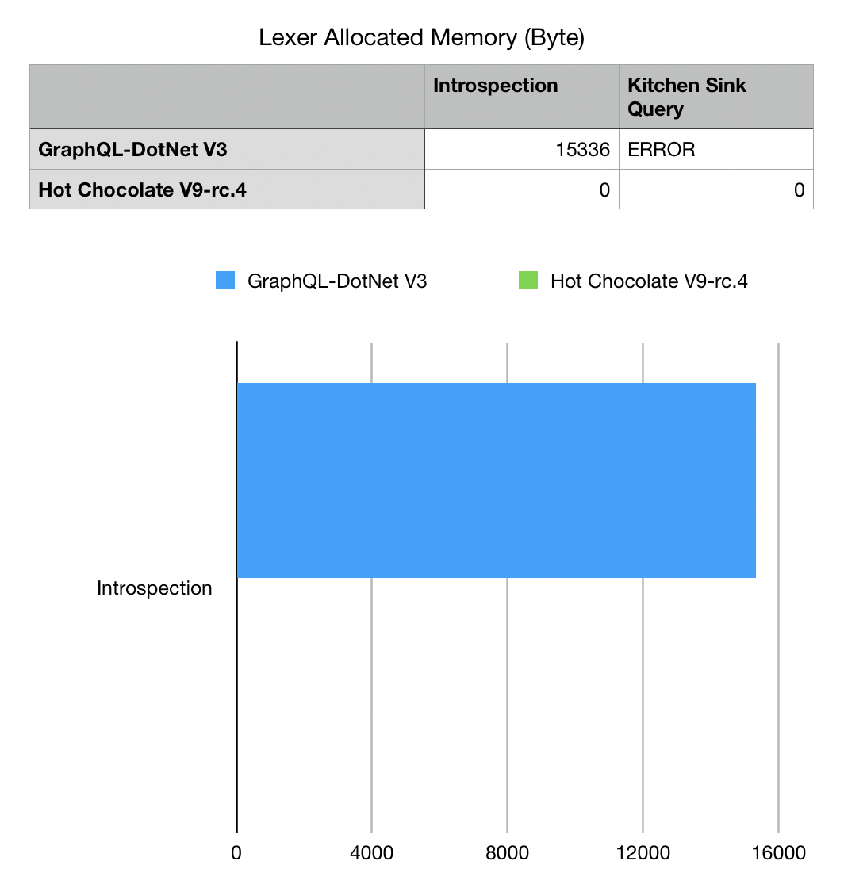
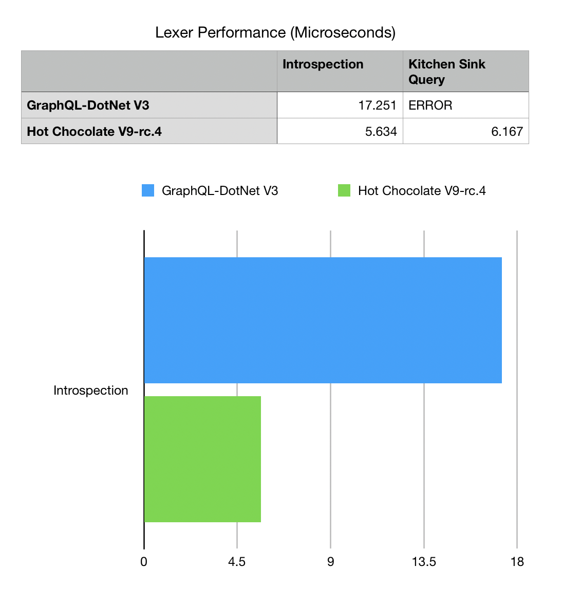
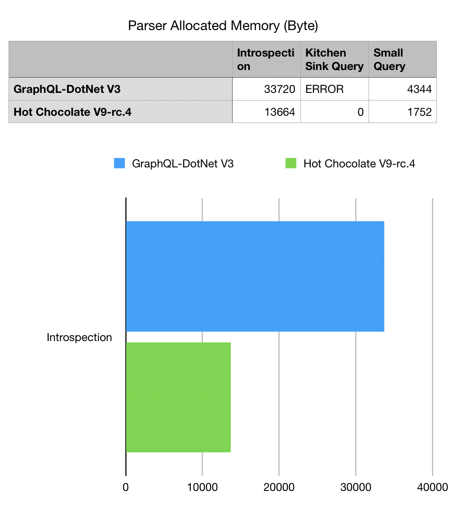
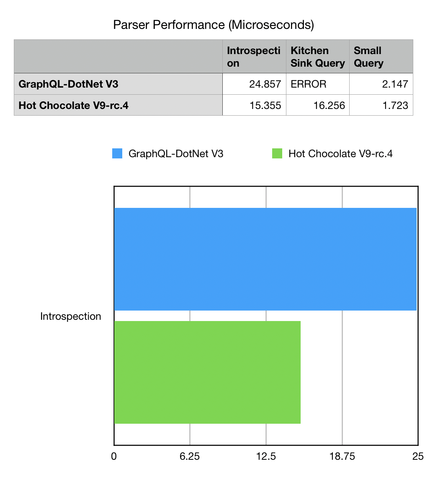
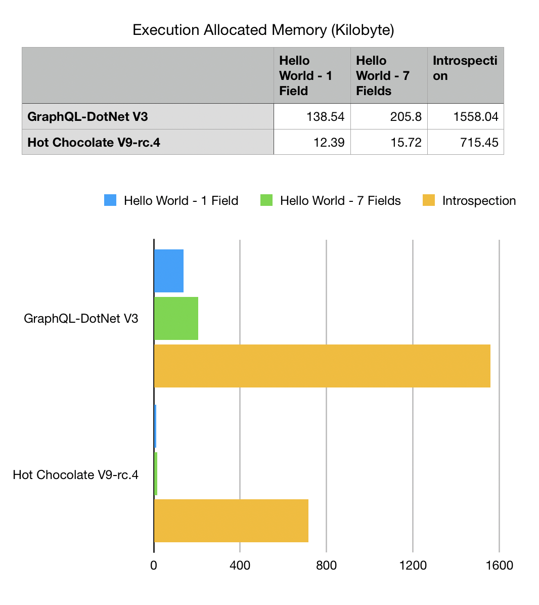
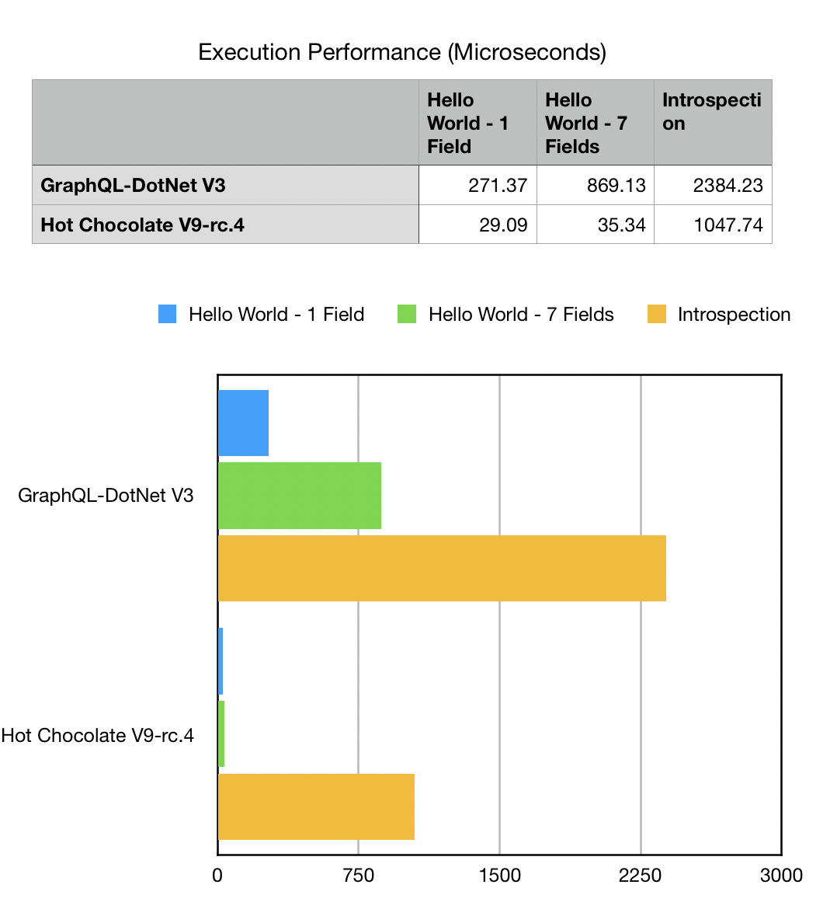
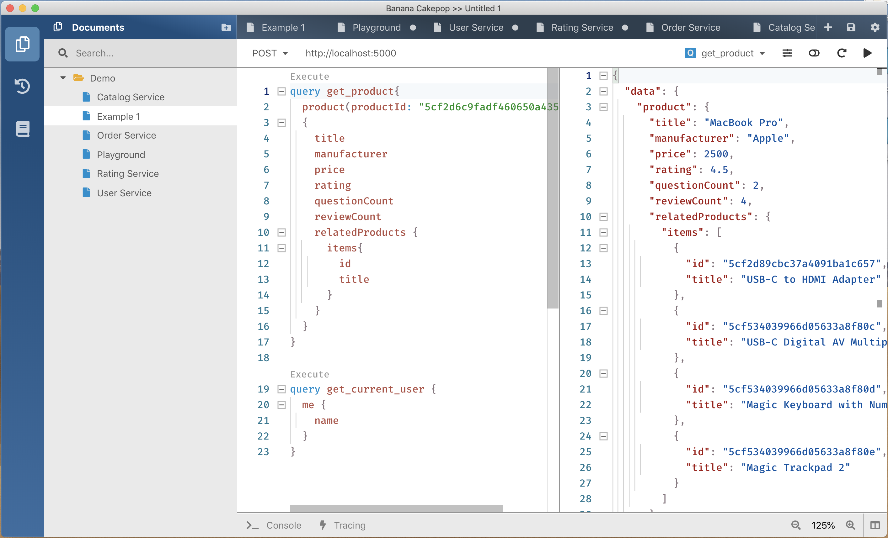

Today we have released version 9 of Hot Chocolate. This release was mainly focused on the schema APIs and performance. Furthermore, we started work on the wider _ChilliCream GraphQL Platform_ and today you will get some insides where we are heading with this.

## Schema Builder

The schema builder API is the most visible **new** API with version 9. It provides a simpler API that is easier to extend.

```csharp
SchemaBuilder.New()
    .AddQueryType<MyQueryType>()
    .AddObjectType(d => d.Name("Foo").Field("bar").Resolver("baz))
    .ModifyConfiguration(o => o.UseXmlDocumentation = true)
    .SetSchema(d => d.Description("This is my schema."))
    .AddServices(services)
    ...
    .Create();
```

With the new API you have a lot more capabilities, but do not worry, we did not throw out the old API. You still can use `Schema.Create` to build your schema. The classic API now uses the schema builder underneath so that you should have a seamless upgrade from version 8 to version 9.

> Read more about the new schema builder [here](2019-04-12-type-system.md).

## Extensibility

With the new schema builder, we have opened up the type system so that it is now easily extendable. Things like our relay integration and the upcoming GraphQL filters are built upon these new APIs. It is now very easy to introduce generic schema types and translate those to GraphQL types.

```csharp
public class EdgeType<TSchemaType>
    : ObjectType<IEdge>
    where T : IOutputType
{
    protected override void Configure(
        IObjectTypeDescriptor<IEdge> descriptor)
    {
        descriptor.Name(dependency => dependency.Name + "Edge")
            .DependsOn<TSchemaType>();
    }
}
```

Moreover, we have introduced metadata support to almost every corner of the GraphQL core. This means that you can pass in context data not only into the execution pipeline but also into types, fields, arguments, directives and even into the query result. This means we let you store custom context/state objects everywhere. This makes it very easy to customize the API without introducing new base types.

```csharp
descriptor
  .Extend()
  .OnBeforeCreate(definition =>
  {
      definition.ContextData["Foo"] = "Bar";
  });
```

You can access the context data on a type object like the following:

```csharp
schema.GetType<ObjectType>("Query").ContextData.ContainsKey("Foo");
```

> Read more about extending the type system [here](2019-04-12-type-system.md).

## Relay

We added a lot of APIs in the past to make it easy to create relay compliant schemas. With version 9 we will now make implementing the `Relay Global Object Identification Specification` as simple as eating cake.

In order to enable general support for relay you can now opt-in like the following:

```csharp
SchemaBuilder.New()
    .EnableRelaySupport()
    ...
    .Create();
```

This will automatically add the node field to your query type and add the node resolver logic. You now just have to declare which type is a node type and you are done:

```csharp
public class EntityType
    : ObjectType<Entity>
{
    protected override void Configure(
        IObjectTypeDescriptor<Entity> descriptor)
    {
        descriptor.AsNode()
            .IdField(t => t.Id)
            .NodeResolver((ctx, id) =>
                ctx.Service<Repository>().GetEntityAsync(id));
    }
}
```

> Also see our new [documentation](https://hotchocolate.io/docs/relay) about relay support.

## Performance

Starting with this version we have begun to invest into making Hot Chocolate one of the fastest GraphQL servers out there. Do not get me wrong, we are not quite there yet, and it will be an ongoing effort for quite a while.

With version 9 we are introducing the first step on this road with our new UTF-8 GraphQL parser. This new parser is not anymore, a port of the original graphql-js parser but a reimplementation that uses the raw bytes instead of strings, meaning we are using all those nice new `Span<T>` APIs. This makes it use less memory and perform faster. The new UTF-8 GraphQL parser is the fastest and most standard compliant parser on the .Net platform.









**What do these charts mean?**

The new `Utf8GraphQLReader` is our new lexer implementation, it does not allocate any extra memory to do its work. All allocations are done on the stack which means that we produce less work for the garbage collector.

Also, we only need 1/4th of the time to lex a document compared to the `GraphQL-DotNet` lexer.

What you can also see is that the `GraphQL-DotNet` lexer is unable to lex the kitchen sink test query which is used by the reference implementation to verify that the parser and lexer implementation perform as specified.

Furthermore, the new UTF-8 GraphQL parser uses 1/3 of the memory that the `GraphQL-DotNet` parser uses, meaning that we again produce less work for the GC which means that your server has more time to execute your business logic.

**Why does the parser still allocate some memory?**

The new parser still allocates some memory since we are producing a syntax tree here. The syntax tree is still the same syntax tree we produced with our old parser implementation in order to be compatible. This is where the allocation stems from. The parser itself is a `ref struct` and lives on the stack. So, all the parser state is allocated also on the stack and is gone after the execution has finished.

**So, how do we compare to graphql-js?**

Since, graphql-js is the reference implementation all other implementations of GraphQL should compare themselves to it.

At the moment graphql-js parses round about 52000 kitchen sink queries a second on my MacBook Pro compared to our new parser that does 48000 kitchen sink queries a second.

So, with version 9.0.0 they are still a little faster.

With our new version 9.1 parser preview we are hitting about 54000 kitchen sink queries a second. While version 9 has become the fastest .Net GraphQL parser implementation version 9.1 will start to rival other platform implementations.

Apart from that we have started making our execution engine more efficient. We are just starting here and there will be a much larger investment with version 9.1 when we are introducing our new UTF-8 request parser and the new execution plans feature.

With our release today Hot Chocolate is depending on the use case at least to times faster in executing queries and uses half of the memory compared to GraphQL-DotNet. If you are using schema-first then the performance gains are more dramatic and you could look at up to 13 times faster execution performance compared to GraphQL-DotNet.





**What will the new UTF-8 request parser help?**

The UTF-8 request parser will be an integrated JSON and GraphQL parser that does not any longer parse first the JSON and then extract a string that is then being parsed by the GraphQL parser. The parser will be able to parse a GraphQL JSON request in one go.

Also, we will create a server benchmarking suite based on _GraphQL Bench_ so that it is more transparent what we test and how we test.

We did our performance comparison against GraphQL-DotNet version 2.4 and 3.0.0-preview-1107.

## Documentation

As we promised in the past, we are adding more documentation with every release. With version 9 we are adding documentation for our type system and a completely new tutorial that starts from scratch and shows how to build a GraphQL server with mongo as a database. We know that the more effort we are putting into our documentation the easier we make the life for you.

With this release we have published a first draft of the new documentation and will add missing parts during this week.

## Banana Cakepop

When we released Hot Chocolate version 8 we announced a new _Hot Chocolate Developer Tool_. Since that announcement we were heavily at work building that new tool.

Today we are anouncing _Banana Cake Pop_, a new tool that will help you explore and query GraphQL schemas.



_Banana Cake Pop_ is **NOT** built on top of GraphiQL like all the other tools but built from the ground up with **Monaco** at its heart.

We plan to invest a lot more effort into _Banana Cake Pop_ going forward. Our plan is to build this ultimate GraphQL developer tool that provides advanced schema browsing, querying GraphQL endpoints, creating runbooks and many more things.

We will provide a plugin model so that you can add your own extensions.

Moreover, as we are introducing our new schema registry with version 10 you will be able to configure your GraphQL gateway via drag&drop, see how each GraphQL server in your network performs, how long each resolver takes and how much memory a resolver uses.

We will start very soon with a private preview and as the version matures, we will release a public preview probably together with version 9.1. If you want to participate in our private preview head over to our slack channel and send a message to `@rafael`.

## Roadmap

With every release we are giving a little roadmap what we are working on and what is coming next.

As you might have noticed we have not delivered all the announced version 9 features yet. The reason for that is that we have decided to split version 9 into three releases. Version 9.0.0 focused mainly on the GraphQL core and brings all the new schema goodness with it.

### Version 9.1

With version 9.1 we will now focus mainly on the server implementation, server performance and the new GraphQL filters.

#### GraphQL Filters

GraphQL filters or as we called them before Prisma filters will allow you to configure filter objects that are executed on `IQueryable` with just a view lines of code. This will make it very easy to expose databases through GraphQL.

```csharp
public class PersonFilterType
    : FilterType<Person>
{
    protected override void Configure(IFilterDescriptor<Person> descriptor)
    {
        descriptor.Filter(t => t.Name).AllowGreaterThan() ...
    }
}
```

As with all our types we will have an approach to infer possible filters and apply them to your API. You can declare that you want to define all filters explicitly or decide to override/limit specific filters. I myself are really keen on this one since it will safe you so much code. You will be able to pipeline filters with sorting and paging which makes this super powerful.

> Follow our work on filters [here](https://github.com/ChilliCream/hotchocolate/pull/711).

#### Subscriptions

We are supporting subscriptions for a long time now, but we were never really happy with the implementation.

The implementation was rushed and is not as we would have liked to implement it. With version 9.1 we are now swapping the implementation out with one built on top of the pipeline API of .Net Core.

This will create a very nice and clean API that will perform better with less memory usage. We pushed back subscription stitching in order to first get the backend sorted out and use a lot of the new code to build the subscription client we need for the stitching layer.

> Follow our work on subscriptions [here](https://github.com/ChilliCream/hotchocolate/pull/807).

#### Execution Plans

The execution plan feature is our biggest endeavor in version 9.1 and will fundamentally change how we execute queries. As of now we are executing resolvers level by level.

With execution plans we will pre-analyze the query and create a plan that defines which part of the query should be executed in parallel, which parts of the query could be inlined and so on.

Think about `@defer`.

With `@defer` you will be able to defer the execution of parts of your query. In order to understand this let’s look at an example query:

```graphql
{
  blogpost {
    title
    text
    comments {
      user
      message
    }
  }
}
```

The above query for instance represents a query to fetch a blog post with its comments. The query engine will return this query only after the blog and the comments are resolved. This means that the blog might have long loading times if it has many comments.

What if we could send this query like it is and get the blog data immediately and the comments once they have been resolved? This would let us specify a query once and profit from **DataLoader** usage and at the same time give us the most important data quickly.

This is what `@defer` is basically for. `@defer` lets me tell the query engine that some data can be delivered later so that the query engine can prioritize on the other parts of the query.

```graphql
{
  blogpost {
    title
    text
    comments @defer {
      user
      message
    }
  }
}
```

The execution engine can now branch this comment off and resolve it independently from the original query.

Also, execution plans will help make our stitching layer more powerful by being able to map out a plan what to get first and how to fold in data.

Execution plans can be created ahead of time and can be persisted so that consecutive calls will profit.

We will have a lot more to say about execution plans as we progress with this feature.

#### Batching

We are working to introduce batching and `@export` support. Batching lets me send a couple of queries at once to the server. The queries can produce variables and consecutive queries can use those. This is super powerful when you have mutations where you need the output of one mutation to execute another mutation.

With batching you can do that without having to manage that flow on the client-side.

```js
[
  {
    query: `
      mutation ($input: TokenizeCreditCardInput!) {
        tokenizeCreditCard(input: $input) {
          paymentMethod {
            id @export(as: "id")
          }
        }
      }
    `,
    variables: { input: "..." },
  },
  {
    query: `
      mutation ($id: ID, $transaction: TransactionInput!) {
        chargePaymentMethod(input: { id: $id, transaction: $transaction }) {
          transaction {
            id
            status
          }
        }
      }
    `,
    variables: { transaction: "..." },
  },
];
```

#### APQ and PQ

Another feature that is aimed at performance and bandwidth usage is automatic persisted queries and persisted queries.

Persisted queries are queries that you have stored with the hot chocolate service before deploying your application. With relay for instance you could export all your used APIs and export those to Hot Chocolate. The Hot Chocolate server could then validate and compile those once.

The frontend on the other hand has no longer to send the query to the server that it wants to execute but could just send a hash of that query.

Each execution then would fetch the prepared and optimized query from the cache or if not already on the cache from the query storage.

This saves time and bandwidth.

While persisted queries require you to setup some build scripts that extract the queries from your frontend and store them with the Hot Chocolate server, automatic persisted queries is a flow that you could use to add queries to the storage from the deployed frontend at runtime.

The automatic persisted queries work like the following:

The frontend will always assume that the query is already persisted with the server. So, by default we will just send in the hash instead of the query itself. This means that we basically do the same thing like with persisted queries.

If the server returns an error that it has no query stored with the specified has the client will send the request again, but this time with the hash and the full query.

So, while this will cause a slower execution for the first user of a query all consequtive users will profit.

We will have an abstraction for the query storage and a default implementation that will use redis.

#### Performance

The performance focus for 9.1 will be to make the server implementation faster and use less memory.

Moreover, we want to optimize startup performance and will introduce lazy resolver compilation. This will compile resolvers on first use. You will be able to choose if you want resolvers to be compiled at startup or at first usage.

We also will add support for custom resolver compiles. This will allow you to write nice extensions and simplifications on top of the schema builder.

The main focus for performance will be our visitor implementation which is not really optimized at the moment.

#### Spec Features

Specwise we will start implementing a new draft feature allowing interfaces to implement other interfaces.

https://github.com/graphql/graphql-spec/pull/373

I just looked again, it is not yet draft, but we hope that this will be sorted out at the next GraphQL workgroup meeting.

### Version 9.2

Version 9.2 will mainly focus on the stitching layer and will integrate the new execution plan feature. Also, we will finally do it and integrate subscription stitching.

On the experimental side, we will deliver our new GraphQL C# client. We have already started on this one but want to have a first release ready with version 9.2. We also want to have it compatible with Blazor and show case this with the that release.

### Version 10

Version 10 will be a huge release. It will take about three to four months to complete and we might decide to split it like version 9.

Version 10 will finally introduce our long-promised schema registry and allow to stitch together schemas without needing to code. Also, we will not need your microservices to have any knowledge about the registry or that they are rewritten into a larger schema.

With version 10 we will also release a production ready version of our C# client.

Last but not least as another new addition we will support automatic database mapping. This means that you can come with your database and we will make a GraphQL server from it.

We will support two things with that, building a database with GraphQL just like Prisma does. Moreover, we will support generating a GraphQL schema from your database. So, this will be pretty interesting stuff.

[hot chocolate]: https://hotchocolate.io
[hot chocolate source code]: https://github.com/ChilliCream/hotchocolate
