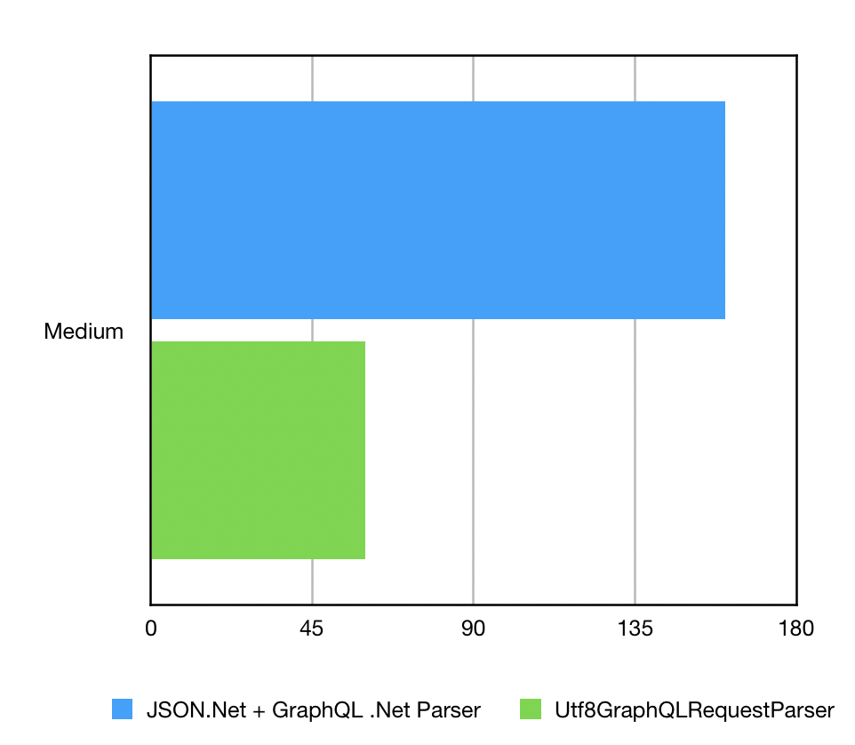

Today we have released version 10 of Hot Chocolate. We originally started building version 9.1 which grew bigger and at one point became version 10. We have focused a lot on our server implementation. But let me walk you through our latest release.

## Filters

So, while we focused a lot on the server implementation, we also added some nice features to the GraphQL core. The main feature we added here is the new filter API.

Filters let you query your backend with a powerful query input type that translates into native database queries.

```graphql
{
  persons(
    where: { OR: [{ firstName_starts_with: "abc" }, { lastName: "def" }] }
  ) {
    firstName
    lastName
  }
}
```

The above query would translate to a something like `persons.Where(t => t.FirstName.StartsWith("abc") || t.LastName == def)`.

This works out of the box if you are using `IQueryable`.

All you have to do in your schema type is to add a `UseFiltering` to your field descriptor.

```csharp
public class QueryType
  : ObjectType<Query>
{
    protected override void Configure(IObjetcTypeDescriptor<Query> descriptor)
    {
        descriptor.Field(t => t.GetPersons(default))
          .Type<ListType<PersonType>>()
          .UseFiltering();
    }
}
```

Filters are easily combined with our pagination.

```csharp
public class QueryType
  : ObjectType<Query>
{
    protected override void Configure(IObjetcTypeDescriptor<Query> descriptor)
    {
        descriptor.Field(t => t.GetPersons(default))
          .UsePaging<PersonType>()
          .UseFiltering();
    }
}
```

Also, it is possible to customize filters by describing what fields are filterable and what operators are allowed.

```csharp
public class QueryType
  : ObjectType<Query>
{
    protected override void Configure(IObjetcTypeDescriptor<Query> descriptor)
    {
        descriptor
          .Field(t => t.GetPersons(default))
          .UsePaging<PersonType>()
          .UseFiltering(d => d.Ignore(t => t.LastName));
    }
}
```

If you want to use the same filter multiple times all over your schema you can also describe the filter input type separately.

```csharp
public class PersonFilterType
    : FilterInputType<Person>
{
    protected override void Configure(
        IFilterInputTypeDescriptor<Foo> descriptor)
    {
        descriptor
            .BindFieldsExplicitly()
            .Filter(t => t.Name)
            .BindOperationsExplicitly()
            .AllowEquals().Name("equals").And()
            .AllowContains().Name("contains").And()
            .AllowIn().Name("in");
    }
}
```

And then use this filter type where you need it.

```csharp
public class QueryType
  : ObjectType<Query>
{
    protected override void Configure(IObjetcTypeDescriptor<Query> descriptor)
    {
        descriptor
          .Field(t => t.GetPersons(default))
          .UsePaging<PersonType>()
          .UseFiltering<PersonFilterType>());
    }
}
```

The nice thing here is that the filter works out of the box on `IQueryable` and `IEnumerable` so you can use it for database queries as well as for in-memory lists.

With version 10 of Hot Chocolate we are supporting filters on scalar fields. But we are already working on support for object filters and enumerable filters.

Also, we are working on sorting which should be included in the first preview of version 11.

If you want to give input or follow our work, you can head over to these four issues that will be coming with version 11.

- [Object Filters #921](https://github.com/ChilliCream/hotchocolate/issues/921)
- [IEnumerable Filters #922](https://github.com/ChilliCream/hotchocolate/issues/922)
- [Sorting #923](https://github.com/ChilliCream/hotchocolate/issues/923)
- [Aggregations #924](https://github.com/ChilliCream/hotchocolate/issues/924)

> If you want to check out more about filters head over to our [documentation](https://hotchocolate.io/docs/filters).

Let me also thank [Pascal](https://github.com/PascalSenn) for his awesome work on this one.

## Subscriptions

Subscriptions was another big investment that we took for this release.

### Redis

For the core API we introduced a _Redis_ subscription provider. This means that you now can use _Redis_ as a pub/sub system without a hassle.

```csharp
var configuration = new ConfigurationOptions
{
    Ssl = true,
    AbortOnConnectFail = false,
    Password = password
};

configuration.EndPoints.Add("host:port");

services.AddRedisSubscriptionProvider(configuration);
```

That\`s all you have to do to connect the query engine with `Redis`.

**So why should we want to use `Redis` anyway.**

The thing with in-memory subscriptions is that they will only work reliable if you have one instance of Hot Chocolate. When you have deployed multiple instance of _Hot Chcocolate_ or if you are scaling on demand with a massive amount of subscribers then you want to make sure that your pub/sub system scales and that mutations executed on one server raise an event on another one.

But there is more, sometimes you want to raise an event without triggering a mutation, maybe there was an event somewhere in your infrastructure that you want to relay as a GraphQL subscription, this can also be done through an external pub/sub system like Redis.

With version 11 We will add _Kafka_ and _Azure EventHub_ support and are also looking into other pub/sub systems, so that you can use whatever feels best to you.

### Pipelines

We also rebuild the whole WebSocket handling in the server by using the new `Pipeline` API that Microsoft introduced to .Net. This makes it now super-efficient how we handle the messages with our new `UTF8RequestParser`. But we are not done here and will with version 11 further optimize our parser to work even better with pipelines.

> If you want to check out more about subscriptions head over to our [documentation](https://hotchocolate.io/docs/code-first-subscription).

Let me also thank [Gabriel](https://github.com/glucaci) for his great work on subscriptions.

## Batching

Another big feature we have invested in was batching. When we started on this one we reflected a lot about how we want to do this and if we really need this one. In the end we decided that batching could enable great scenarios and is worth adding to our server.

When Lee Byron initially showed batching off, he explained that this would be useful in cases where you want to fetch important data first and delay more expensive data without needing to issue two separate calls.

They had this example that they want to fetch the news stream of a given user and the comments should appear once those are available.

`POST /graphql?batchOperations=[NewsFeed, StoryComments]`

```graphql
query NewsFeed {
  stories {
    id @export(as: "ids")
    actor
    message
  }
}

query StoryComments {
  stories(ids: $ids) {
    comments(first: 2) {
      actor
      message
    }
  }
}
```

In the above query we would first fetch the stories, collect all the story ids and use these as an input to the next query to fetch all the comments for the former stories.

The nice thing is that this is done in one HTTP call and as soon as query one is executed, we will write the result into the stream and the client can already work with that data while waiting for the second result.

This all is working over one HTTP call without WebSockets and is super-efficient.

**Why did we question its use?**

The thing is that with version 11 we will introduce `@defer` which will allow you to do the following:

```graphql
query NewsFeed {
  stories {
    id @export(as: "ids")
    actor
    message
    ... @defer {
      comments(first: 2) {
        actor
        message
      }
    }
  }
}
```

The fragment that is annotated with `@defer` will be deferred to when it is ready. This means you can write queries much cleaner with this and reap the same benefits.

**What makes batching a great feature then?**

First, you can defer query parts with this now in version 10.

Second, I think batching is very interesting with mutations where you can write complex mutation flows that use the results of one mutation to feed data in the next mutation. The ability to export result data into variables lets you write nice data flows.

Look at how easy you can export data as variable by just adding `@export`.

```graphql
{
  foo {
    bar @export
  }
}
```

What\`s important to know here is that you also can export objects that will convert to a matching input type.

```graphql
{
  foo @export(as: "something") {
    bar
  }
}
```

Third, we also wanted to support Apollo batching where Apollo collects all the queries of a client in a certain time window and sends those in one request to our server. One batch will share the _DataLoader_ instances which means that the batch request will be faster than sending them in separately.

> We are supporting operation batching and request batching and if you would like to know more about it head over to our [documentation](https://hotchocolate.io/docs/batching).

## Persisted Queries

With version 10 we now support persisted queries. With persisted queries you can add well-knonw queries to a second-level cache. All queries stored in there are considered valid.

**So, what is this for?**

Persisted queries are faster, since we validate those only once. Moreover, you do not need to send us the query every time, you can instead just send the query name and the server will look up the query and execute it. This can dramatically improves performance, reduces bandwidth and memory usage.

This makes it feasible to use a simple `GET` request instead of a `POST` request which can also have benefits when using things like CDNs.

`GET http://example.com/graphql?namedQuery=QUERYNAME&variables={"id":"QVBJcy5ndXJ1"}`

We have opted to support both active persisted queries and persisted queries.

> Read more about this [here](https://hotchocolate.io/docs/persisted-queries);

## Server Modularization

With Version 10 we have now a modularized server implementation. That each middleware is placed in its own package. You can still just add our `HotChocolate.AspNetCore` or `HotChocolate.AspNetClassic` package and do not worry what is included in your server. But with version 10 you could now just add some of the middleware like maybe just HTTP-GET or HTTP-POST. This way if you do not use for instance subscriptions than there will not even be the code for subscriptions.

With version 10 we have the following middleware available:

- HotChocolate.AspNetCore.HttpPost
- HotChocolate.AspNetCore.HttpGet
- HotChocolate.AspNetCore.HttpGetSchema
- HotChocolate.AspNetCore.Subscriptions
- HotChocolate.AspNetCore.Authorization

> Read more about this right [here](https://hotchocolate.io/docs/aspnet)

## UTF-8 Request Parser

With GraphQL most requests are provided as `JSON` that contains the request as an escaped string. This is kind of bad for performance since we first parse the `JSON` then take the string and parse again a string that we actually do not need.

With the new _UTF-8 request parser_ we can finally just read the binary request stream and parse the JSON and the GraphQL request in one go. But there is more, we have given our new UTF-8 request parser access to our document cache, meaning while we parse the JSON request and hit the part were the GraphQL request is, we can look up if this query is already cached. This dramatically reduces memory usage and performance since we will not consume the query property anyway.



The new request parser does only allocate 1/3 of the memory that GraphQL-DotNet uses with it\`s combination of JSON.Net and it\`s string based GraphQL parser.

The Hot Chocolate GraphQL parser is twice as fast than the GraphQL-DotNet parser on average. The whole request pipeline is 3 times faster on average, but we are not done yet and will double down on performance with the new query execution plans and our updated syntax tree that allows to further reduce string usage.

## Everything Else

With version 10 we added a ton of bug fixes and also, we added a lot of API improvements that will make your day to day business so much easier.

Like now you can add error filter to the dependency injection instead of registering them with the execution builder.

```csharp
services.AddErrorFilter<MyCustomErrorFilter>();
```

The same goes for class _DataLoader_.

```csharp
services.AddDataLoader<MyCustomDataLoader>();
```

When you use this extension, we also will add the _DataLoader_ registry.

Also, we refined things like the schema builder so that you can in place now define all the types:

```csharp
SchemaBuilder.New()
  .AddEnumType(d => d.Name("MyEnum").Value("FOO))
  ...
  .Create();
```

There are so many little things that can make your day :)

## Version 11

Like with every release we are giving a little outlook for the next version. As the releases are fluid, we are sometimes moving things around.

We want to really focus on two major topics with the next release.

## Query Execution Plans

We originally planned for this one for version 10 (aka version 9.1) but decided that the current set of new features is already a good version that is worth to release. But with the next release this is one of the two things we really will focus on. With this in place we will double down on performance and will introduce features like `@defer` and `@stream`.

Moreover, this one will be the backbone of our new stitching layer that will bring lots of new features to schema stitching.

## Client API

The second thing we already started work on is a client API for .NET Core. We are currently experimenting with how we design this new piece of API. We have started a discussion around this in our slack channel and will start with some coding soon.

## Banana Cakepop

**Oh, didn`t you forget something?**

Yes, yes originally, we had planned to release _Banana Cakepop_ alongside this version. We ran into some performance issues with the tree we originally selected when using large schemas with more than 1000 types.

We have now started to write the tree component ourselves which is taking some extra time. We already see that we can handle now massive schemas far beyond 1000 types without any hiccups. But we have still lots to do on the new tree.

I hope that we can see the promised preview in the next 4 to 8 weeks. We want to release something really good and not something half-backed.

## The Other Things

We also will add more features to our filter API and make working with databases even easier.

Also, we will add more subscription provider like Kafka and EventHub.

Furthermore, we will rework our `Utf8GraphQLReader` to use `ReadOnlySequence<byte>` instead of `ReadOnlySpan<byte>` in order to make this even better work with the Pipeline API. Apart from that we will optimize the syntax tree to be able to work with raw bytes instead of strings. At the moment scalar like String, Int, Float and Enum are parsed as string representation like with the original node parser. The scalar type parses then the string into the native type. The same goes for the new UTF-8 request parser. This is unnecessary with the `Utf8Parser` and `Utf8Formater`. We will change the AST to instead have the raw bytes. The current `Value` property will still be there but only for compatibility with tools that use the current version of the AST. The new scalar types will have access to a `ReadOnlySpan<byte>` and can decide how to efficiently parse literals.

If you want to get into contact with us head over to our slack channel and join our community.

[hot chocolate]: https://hotchocolate.io
[hot chocolate source code]: https://github.com/ChilliCream/hotchocolate
