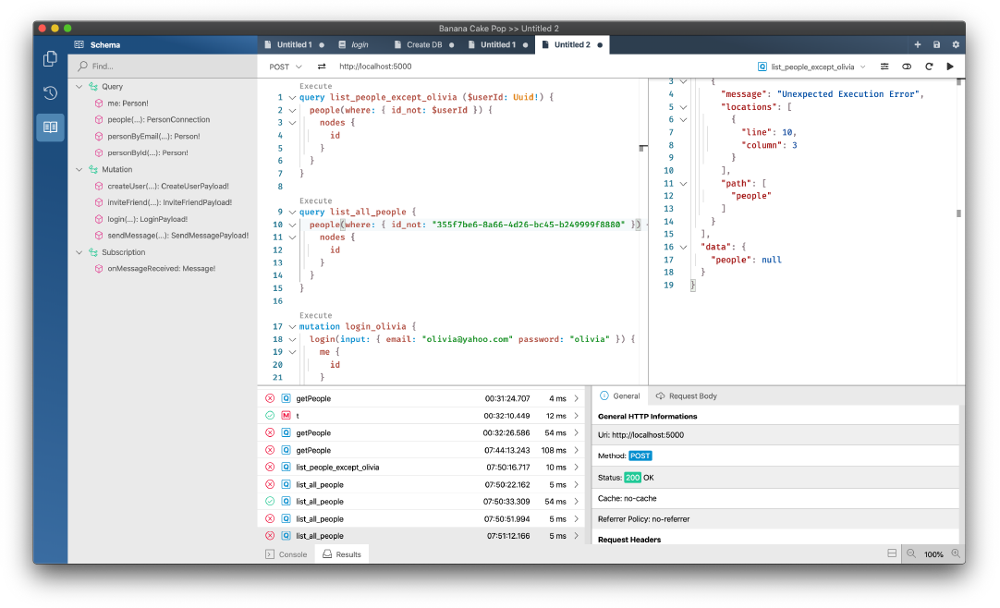
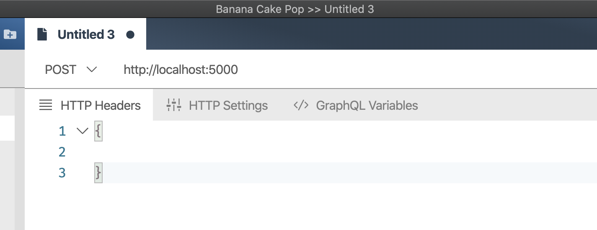
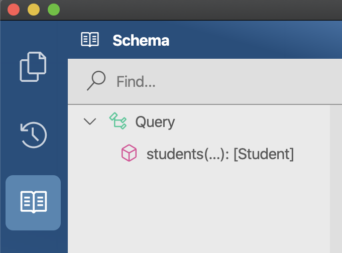
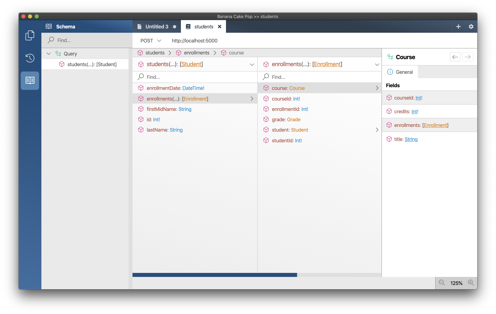
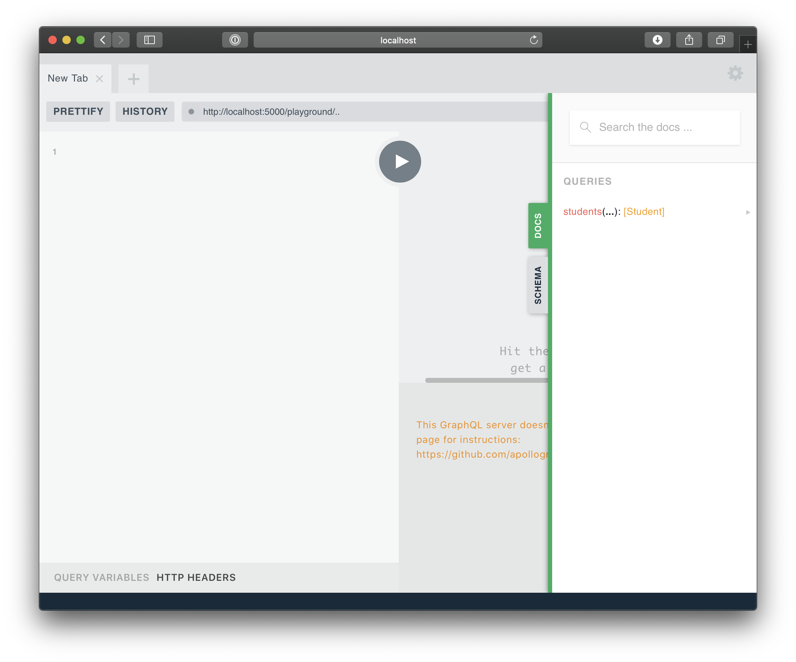
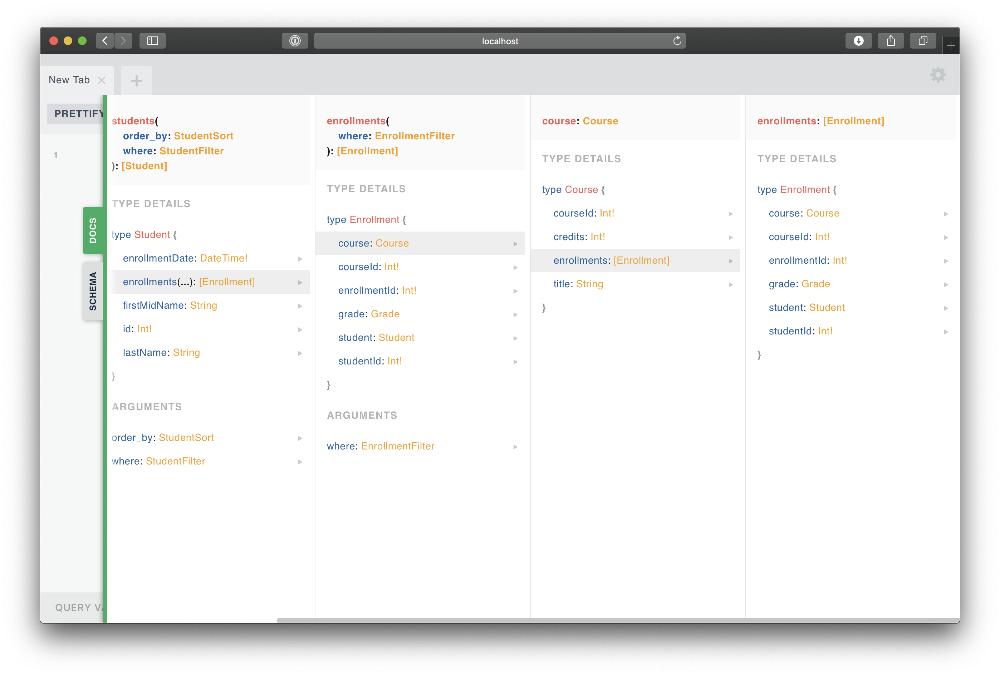
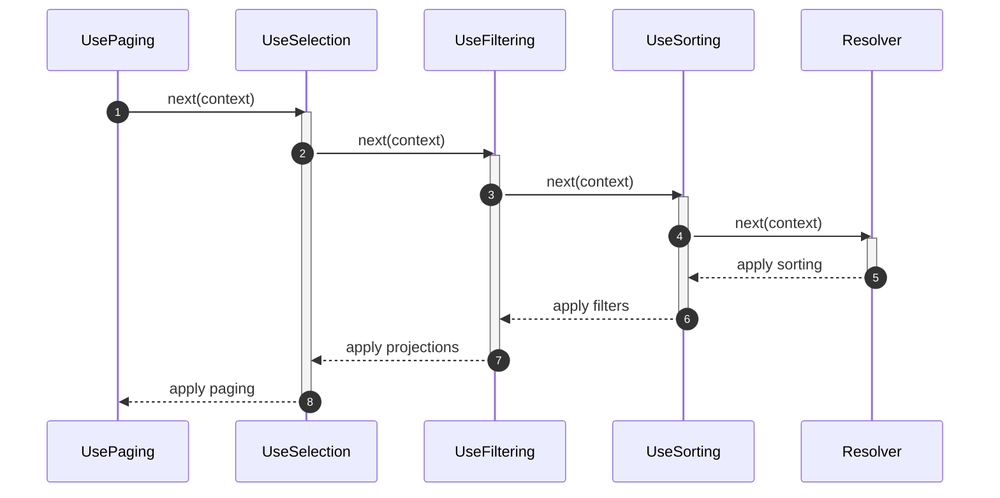
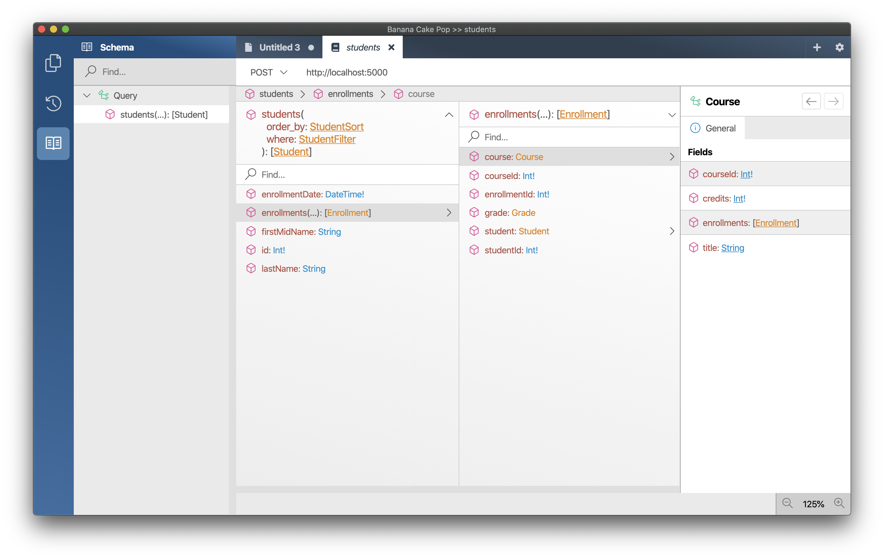

In this post I will walk you through how to build a GraphQL Server using _Hot Chocolate_ and _Entity Framework_.

_Entity Framework_ is an OR-mapper from Microsoft that implements the unit-of-work pattern. This basically means that with _Entity Framework_ we work against a `DbContext` and once in a while commit changes aggregated on that context to the database by invoking `SaveChanges`.

With _Entity Framework_ we can write database queries with _LINQ_ and do not have to deal with _SQL_ directly. This means that we can compile our database queries and can detect query errors before we run our code.

## Introduction

This blog post is based on the Contoso University example application used by Microsoft to demonstrate the usage of _Entity Framework_ with ASP.NET Core.

In this blog post we will take that example and build with it a simple GraphQL server for the university website. With it, we can query students, courses, and instructor information.

Before we get started let us setup our server project.

```bash
mkdir ContosoUniversity
dotnet new web
```

Next wee need to add _Entity Framework_ to our project.

```bash
dotnet add package Microsoft.EntityFrameworkCore
```

Last but not least we are adding the SQLLite _Entity Framework_ provided in order to have a lightweight database.

```bash
dotnet add package Microsoft.EntityFrameworkCore.Sqlite
```

For our data we have three models representing the student, the enrollments and the courses.

The student entity has some basic data about the student like the first name, the last name or the date when the student first enrolled into the university.

The enrollment entity represents the enrollment of a student to a specific course. The enrollment entity not only represents the relationship between the student and the course but also holds the Grade that a student achieved in that course.

Last but not least we have the course to which many students are enrolled to. The course has a title and a property defining the credit that a student can achieve in that course.

Let’s copy our models into our project.

```csharp
using System;
using System.Collections.Generic;
using System.ComponentModel.DataAnnotations;
using System.ComponentModel.DataAnnotations.Schema;

namespace ContosoUniversity
{
    public class Student
    {
        [Key]
        [DatabaseGenerated(DatabaseGeneratedOption.Identity)]
        public int Id { get; set; }
        public string LastName { get; set; }
        public string FirstMidName { get; set; }
        public DateTime EnrollmentDate { get; set; }

        public virtual ICollection<Enrollment> Enrollments { get; set; }
    }

    public enum Grade
    {
        A, B, C, D, F
    }

    public class Enrollment
    {
        [Key]
        [DatabaseGenerated(DatabaseGeneratedOption.Identity)]
        public int EnrollmentId { get; set; }
        public int CourseId { get; set; }
        public int StudentId { get; set; }
        public Grade? Grade { get; set; }

        public virtual Course Course { get; set; }
        public virtual Student Student { get; set; }
    }

    public class Course
    {
        [Key]
        [DatabaseGenerated(DatabaseGeneratedOption.Identity)]
        public int CourseId { get; set; }
        public string Title { get; set; }
        public int Credits { get; set; }

        public virtual ICollection<Enrollment> Enrollments { get; set; }
    }
}
```

For our models we do need a `DbContext` against which we can interact with our database.

```csharp
using Microsoft.EntityFrameworkCore;

namespace ContosoUniversity
{
    public class SchoolContext : DbContext
    {
        public DbSet<Student> Students { get; set; }
        public DbSet<Enrollment> Enrollments { get; set; }
        public DbSet<Course> Courses { get; set; }

        protected override void OnConfiguring(DbContextOptionsBuilder options)
        {
            options.UseSqlite("Data Source=uni.db");
        }

        protected override void OnModelCreating(ModelBuilder modelBuilder)
        {
            modelBuilder.Entity<Student>()
                .HasMany(t => t.Enrollments)
                .WithOne(t => t.Student)
                .HasForeignKey(t => t.StudentId);

            modelBuilder.Entity<Enrollment>()
                .HasIndex(t => new { t.StudentId, t.CourseId })
                .IsUnique();

            modelBuilder.Entity<Course>()
                .HasMany(t => t.Enrollments)
                .WithOne(t => t.Course)
                .HasForeignKey(t => t.CourseId);
        }
    }
}
```

The `SchoolContext` exposes access to our entities through `DbSet`. We can query a `DbSet<T>` with _LINQ_ or add new entities to it. Moreover, our `ShoolContext` has some configuration that defines the relations between our entities.

Copy the context as well to our project.

Next, we need to register our `SchoolContext` with the dependency injection so that our GraphQL server can request instances of it. For that lets open our `Startup.cs` and replace the `ConfigureServices` method with the following code.

```csharp
public void ConfigureServices(IServiceCollection services)
{
    services.AddDbContext<SchoolContext>();
}
```

There is one last thing to finish up our preparations with the database and to get into GraphQL.

We somehow need to create our database. Since we are in this post only exploring how we can query data with entity framework and GraphQL we will also need to seed some data.

Add the following method to the `Startup.cs`:

```csharp
private static void InitializeDatabase(IApplicationBuilder app)
{
    using (var serviceScope = app.ApplicationServices.GetService<IServiceScopeFactory>().CreateScope())
    {
        var context = serviceScope.ServiceProvider.GetRequiredService<SchoolContext>();
        if (context.Database.EnsureCreated())
        {
            var course = new Course { Credits = 10, Title = "Object Oriented Programming 1" };

            context.Enrollments.Add(new Enrollment
            {
                Course = course,
                Student = new Student { FirstMidName = "Rafael", LastName = "Foo", EnrollmentDate = DateTime.UtcNow }
            });
            context.Enrollments.Add(new Enrollment
            {
                Course = course,
                Student = new Student { FirstMidName = "Pascal", LastName = "Bar", EnrollmentDate = DateTime.UtcNow }
            });
            context.Enrollments.Add(new Enrollment
            {
                Course = course,
                Student = new Student { FirstMidName = "Michael", LastName = "Baz", EnrollmentDate = DateTime.UtcNow }
            });
            context.SaveChangesAsync();
        }
    }
}
```

`InitializeDatabase` ensures that our database is created and seeds some initial data so that we can do some queries.

Next call `InitializeDatabase` in the first line of the `Configure` method in the `Startup.cs`. The updated `Configure` method should look like the following:

```csharp
public void Configure(IApplicationBuilder app, IWebHostEnvironment env)
{
    InitializeDatabase(app);

    if (env.IsDevelopment())
    {
        app.UseDeveloperExceptionPage();
    }

    app.UseRouting();

    app.UseEndpoints(endpoints =>
    {
        endpoints.MapGet("/", async context =>
        {
            await context.Response.WriteAsync("Hello World!");
        });
    });
}
```

We are basically done with our preparations. So far, we have defined our models, created our `ShoolContext` through which we can query the database. We also registered the `ShoolContext` with the dependency injection container and added some initialization logic so that our database is created with some initial data. With that settled let us move on and talk about GraphQL.

## GraphQL Schema

Everything in GraphQL resolves around a schema. The schema defines the types that are available and the data that our GraphQL server exposes.

In GraphQL we interact with the data through root types. In this post we will only query data which means that we only need to define the query root type.

The query root type exposes fields which are called root fields. The root fields define how we can query for data. For our university GraphQL server we want to be able to query the students and then drill deeper into what courses a student is enrolled to or what grade he/she has in a specific course.

Before we actually can put some GraphQL types in our project we again need to add some packages. This time we need to add the `HotChocolate.AspNetCore` package to enable the core GraphQL server functionality. Also we need the `HotChocolate.Types.Selections` package to be able to use _Entity Framework_ projections.

```bash
dotnet add package HotChocolate.AspNetCore
dotnet add package HotChocolate.Types.Selections
```

With _Hot Chocolate_ and the _pure code-first_ approach the query root type is represented by a simple class. Public methods or public properties on that type are inferred as fields of our GraphQL type.

The following class:

```csharp
public class Query
{
    /// <summary>
    /// Gets all students.
    /// </summary>
    public IQueryable<Student> GetStudents() => throw new NotImplementedException();
}
```

Is translated to the following GraphQL type:

```graphql
type Query {
  """
  Gets all students
  """
  students: [Student]
}
```

> _Hot Chocolate_ will apply GraphQL conventions to inferred types which will remove the verb `Get` for instance from the method or if it is an async method the postfix `async` will be removed. These conventions can be configured.

In GraphQL we call the method `GetStudents` a resolver since it resolves for us some data. Resolvers are executed independent from one another and each resolver has dependencies on different resources. Everything that a resolver needs can be injected as a method parameter. Our `GetStudents` resolver for instance needs the `ShoolContext` to fetch some data. By using argument injection the execution engine can better optimize how to execute a query.

OK, with this knowledge lets implement our `Query` class.

```csharp
public class Query
{
    /// <summary>
    /// Gets all students.
    /// </summary>
    public IQueryable<Student> GetStudents([Service]SchoolContext schoolContext) =>
        schoolContext.Students;
}
```

Our query class up there would already work. But only for the first level. It basically would resolve all students but we could not drill deeper. The enrollments would always be empty. In _Hot Chocolate_ we have a concept of field middleware that can alter the execution pipeline of our field resolver.

The middleware order is important since multiple middleware form a field execution pipeline.

In our case we want _Entity Framework_ projections to work so that we can drill into data in our GraphQL query. For this we can add the selection middleware. Middleware in _pure code-first_ are represented by simple attributes. Since middleware order is important the order of these middleware attributes is important too. Middleware attributes always start with the verb `Use`. So, for our selections middleware we add `[UseSelection]`.

```csharp
using System.Linq;
using HotChocolate;
using HotChocolate.Types;

namespace ContosoUniversity
{
    public class Query
    {
        /// <summary>
        /// Gets all students.
        /// </summary>
        [UseSelection]
        public IQueryable<Student> GetStudents([Service]SchoolContext schoolContext) =>
            schoolContext.Students;
    }
}
```

Let’s paste this file into our project.

I pointed out that in GraphQL everything resolves around a schema. In order to get our GraphQL server up and running we need to create and host a GraphQL schema in our server. In _Hot Chocolate_ we define a schema with the `SchemaBuilder`.

Open the `Startup.cs` again and then let us add a simple schema with our `Query` type.

For that replace the `ConfigureServices` method with the following code.

```csharp
public void ConfigureServices(IServiceCollection services)
{
    services.AddDbContext<SchoolContext>();

    services.AddGraphQL(
        SchemaBuilder.New()
            .AddQueryType<Query>()
            .Create(),
        new QueryExecutionOptions { ForceSerialExecution = true });
}
```

The above code registers a GraphQL schema with the dependency injection container.

```csharp
SchemaBuilder.New()
    .AddQueryType<Query>()
    .Create()
```

The schema builder registers our `Query` class as GraphQL `Query` root type.

```csharp
new QueryExecutionOptions { ForceSerialExecution = true }
```

Also, we are defining that the execution engine shall be forced to execute serially since `DbContext` is not thread-safe.

> The upcoming version 11 of _Hot Chocolate_ uses `DbContext` pooling to use multiple `DbContext` instances in one request. This allows version 11 to parallelize data fetching better with _Entity Framework_.

In order to enable our ASP.NET Core server to process GraphQL requests we need to register the _Hot Chocolate_ GraphQL middleware.

For that we need to replace the `Configure` method of our `Startup.cs` with the following code.

```csharp
public void Configure(IApplicationBuilder app, IWebHostEnvironment env)
{
    InitializeDatabase(app);

    if (env.IsDevelopment())
    {
        app.UseDeveloperExceptionPage();
    }

    app.UseRouting();

    app.UseGraphQL();

    app.UseEndpoints(endpoints =>
    {
        endpoints.MapGet("/", async context =>
        {
            await context.Response.WriteAsync("Hello World!");
        });
    });
}
```

`app.UseGraphQL();` registers the GraphQL middleware with the server. Since we did not specify any path the middleware will run on the root of our server. Like with field middleware the order of ASP.NET Core middleware is important.

## Testing a GraphQL Server

In order to now query our GraphQL server we need a GraphQL IDE to formulate queries and explore the schema. If you want a deluxe GraphQL IDE as an application, you can get our very own Banana Cakepop which can be downloaded [here](/docs/bananacakepop).



But you can also opt for _Playground_ and host a simple GraphQL IDE as a middleware with the server. If you want to use playground add the following package to the project:

```bash
dotnet add package HotChocolate.AspNetCore.Playground
```

After that we need to register the playground middleware. For that add `app.UsePlayground();` after `app.UseGraphQL()`. By default, playground is hosted on `/playground` meaning in our case `http://localhost:5000/playground`.

The `Configure` method should now look like the following:

```csharp
public void Configure(IApplicationBuilder app, IWebHostEnvironment env)
{
    InitializeDatabase(app);

    if (env.IsDevelopment())
    {
        app.UseDeveloperExceptionPage();
    }

    app.UseRouting();

    app.UseGraphQL();
    app.UsePlayground();

    app.UseEndpoints(endpoints =>
    {
        endpoints.MapGet("/", async context =>
        {
            await context.Response.WriteAsync("Hello World!");
        });
    });
}
```

Let’s test our GraphQL server.

```bash
dotnet run --urls http://localhost:5000
```

### Testing with Banana Cakepop

If you have chosen _Banana Cakepop_ to test and explore the GraphQL Schema open it now.

_Banana Cakepop_ will open with an empty tab. In the address bar type in the URL of our GraphQL server `http://localhost:5000` and hit `enter`.



Once our GraphQL IDE has fetched the schema we can start exploring it. On the left-hand side click on the `Book` button. The left-hand side now shows us the root types and the root fields.



In our current schema we can see that we have a single root field called `students`. If we click on that the schema explorer opens and we can drill into our type. We can see what fields we can request from our `Student` type. We also can see that we can drill in further and fetch the enrollments and from the enrollments the courses and so on.



Now close the schema tab again so that we can write some queries.

### Testing with Playground

If you have opted for _Playground_ open your browser and navigate to `http://localhost:5000/playground`.

On the right-hand side click on the `Docs` button. A pane will slide out showing us the root types and root fields of our schema.



In our current schema we can see that we have a single root field called `students`. If we click on that the schema explorer opens and we can drill into our type. We can see what fields we can request from our `Student` type. We also can see that we can drill in further and fetch the enrollments and from the enrollments the courses and so on.



Now click onto `Docs` again so that the schema tab slides back in again. We are now ready to write our first query.

### Recap

While we just added one field that exposes the `Student` entity to _Hot Chocolate_, _Hot Chocolate_ explored what data is reachable from that entity. In conjunction with the `UseSelection` middleware we can now query all that data and drill into our graph.

We have explored tooling with which we can explore the schema before issuing the first request.

If we would print our schema it would now look like the following.

> The schema SDL can be downloaded from http://localhost:5000/schema.

```graphql
schema {
  query: Query
}

type Query {
  students: [Student]
}

type Student {
  enrollmentDate: DateTime!
  enrollments: [Enrollment]
  firstMidName: String
  id: Int!
  lastName: String
}

type Course {
  courseId: Int!
  credits: Int!
  enrollments: [Enrollment]
  title: String
}

type Enrollment {
  course: Course
  courseId: Int!
  enrollmentId: Int!
  grade: Grade
  student: Student
  studentId: Int!
}

enum Grade {
  A
  B
  C
  D
  F
}

"The `DateTime` scalar represents an ISO-8601 compliant date time type."
scalar DateTime

"The `Int` scalar type represents non-fractional signed whole numeric values. Int can represent values between -(2^31) and 2^31 - 1."
scalar Int

"The `String` scalar type represents textual data, represented as UTF-8 character sequences. The String type is most often used by GraphQL to represent free-form human-readable text."
scalar String
```

### Writing Queries

In both GraphQL IDEs we can type in the GraphQL queries on the left-hand pane. If we click on the play button the result will be displayed on the right-hand side pane.

Let us start with a simple query in which we ask for the first name of all students that we have in our database.

```graphql
query {
  students {
    firstMidName
  }
}
```

The above query resolves correctly the data from our database, and we get the following result:

```json
{
  "data": {
    "students": [
      {
        "firstMidName": "Rafael"
      },
      {
        "firstMidName": "Pascal"
      },
      {
        "firstMidName": "Michael"
      }
    ]
  }
}
```

What is interesting is that the GraphQL engine rewrites the incoming GraphQL request to an expression tree that is applied onto the `IQueryable<Student>` our root field resolver returns. The expression will only query for data from the database that was needed to fulfill our request.

The SQL query in this case will look like the following:

```sql
SELECT "s"."FirstMidName" FROM "Students" AS "s"
```

Let us drill into the data a little more and fetch additionally to the `firstMidName` also the title of the course the students are enlisted to.

```graphql
query {
  students {
    firstMidName
    enrollments {
      course {
        title
      }
    }
  }
}
```

The above query returns:

```json
{
  "data": {
    "students": [
      {
        "firstMidName": "Rafael",
        "enrollments": [
          {
            "course": {
              "title": "Object Oriented Programming 1"
            }
          }
        ]
      },
      {
        "firstMidName": "Pascal",
        "enrollments": [
          {
            "course": {
              "title": "Object Oriented Programming 1"
            }
          }
        ]
      },
      {
        "firstMidName": "Michael",
        "enrollments": [
          {
            "course": {
              "title": "Object Oriented Programming 1"
            }
          }
        ]
      }
    ]
  }
}
```

In order to fetch the data, the GraphQL query is rewritten to the following SQL:

```sql
SELECT "s"."FirstMidName",
       "s"."Id",
       "t"."Title",
       "t"."EnrollmentId",
       "t"."CourseId"
    FROM "Students" AS "s"
    LEFT JOIN (
        SELECT "c"."Title",
               "e"."EnrollmentId",
               "c"."CourseId",
               "e"."StudentId"
        FROM "Enrollments" AS "e"
        INNER JOIN "Courses" AS "c"
              ON "e"."CourseId" = "c"."CourseId"
    ) AS "t" ON "s"."Id" = "t"."StudentId"
    ORDER BY "s"."Id", "t"."EnrollmentId", "t"."CourseId"
```

The `UseSelection` middleware allows us by just attributing it to a field resolver that returns an `IQueryable<T>` to drill into that data set.

Without a lot of code, we already have a working GraphQL server that returns all the students. We are already able to drill into our data and the `UseSelection` middleware rewrites GraphQL selections into `IQueryable<T>` projections that ensures that we only select the data that we need from the database.

Think about it, we really just added entity framework and exposed a single root field that basically just returns the `DbSet<Student>`.

## Filtering

Let us go further with this. We actually can do more here and _Hot Chocolate_ provides you with a filter and sorting middleware to really give you the power to query your data with complex expressions.

First, we need to add two more packages that will add the sorting and filtering middleware.

```bash
dotnet add package HotChocolate.Types.Filters
dotnet add package HotChocolate.Types.Sorting
```

With these new packages in place let us rewrite our query type in order to enable proper filtering support.

```csharp
using System.Linq;
using HotChocolate;
using HotChocolate.Types;

namespace ContosoUniversity
{
    public class Query
    {
        [UseSelection]
        [UseFiltering]
        [UseSorting]
        public IQueryable<Student> GetStudents([Service]SchoolContext context) =>
            context.Students;
    }
}
```

The above query type has now two new attributes `UseFiltering` and `UseSorting`. Let me again state that the order of middleware is important.

In order to understand how a field pipeline with middleware works have a look at the following sequence diagram which depicts our data pipeline applied to the above resolver.



Each field middleware initially yields control to the next field middleware until the resolver is invoked. The resolver returns its result and the field middleware will now on the way back apply their functionality to the result. In our case the field middleware are applying expressions to the queryable to build up the database query.

With that upgraded `Query` type let us restart our server.

```bash
dotnet run --urls http://localhost:5000
```

Now let us inspect our schema again. When we look at the `students` field we can see that there are new arguments called `where` and `orderBy`.



For our first query let us fetch the students with the `lastName` `Bar` or `Baz`.

```graphql
query {
  students(where: { OR: [{ lastName: "Bar" }, { lastName: "Baz" }] }) {
    firstMidName
    lastName
    enrollments {
      course {
        title
      }
    }
  }
}
```

Which will return the following result:

```json
{
  "data": {
    "students": [
      {
        "firstMidName": "Pascal",
        "lastName": "Bar",
        "enrollments": [
          {
            "course": {
              "title": "Object Oriented Programming 1"
            }
          }
        ]
      },
      {
        "firstMidName": "Michael",
        "lastName": "Baz",
        "enrollments": [
          {
            "course": {
              "title": "Object Oriented Programming 1"
            }
          }
        ]
      }
    ]
  }
}
```

Again, we are rewriting the whole GraphQL query into one expression tree that translates into the following SQL.

```sql
SELECT "s"."FirstMidName",
       "s"."LastName",
       "s"."Id",
       "t"."Title",
       "t"."EnrollmentId",
       "t"."CourseId"
    FROM "Students" AS "s"
    LEFT JOIN (
        SELECT "c"."Title",
               "e"."EnrollmentId",
               "c"."CourseId",
               "e"."StudentId"
        FROM "Enrollments" AS "e"
        INNER JOIN "Courses" AS "c"
              ON "e"."CourseId" = "c"."CourseId"
    ) AS "t" ON "s"."Id" = "t"."StudentId"
    WHERE ("s"."LastName" = 'Bar') OR ("s"."LastName" = 'Baz')
    ORDER BY "s"."Id", "t"."EnrollmentId", "t"."CourseId"
```

But we can go further and even allow more. Let’s say we want to allow the consumer of our API to search for specific grades in our student’s enrolment list.

In order to allow filtering on the enrollments we can add the same `UseFiltering` attribute in our entity on the `Enrollments` collection and this property becomes filterable.

```csharp
public class Student
{
    [Key]
    [DatabaseGenerated(DatabaseGeneratedOption.Identity)]
    public int Id { get; set; }
    public string LastName { get; set; }
    public string FirstMidName { get; set; }
    public DateTime EnrollmentDate { get; set; }

    [UseFiltering]
    public virtual ICollection<Enrollment> Enrollments { get; set; }
}
```

We don\`t need to apply `UseSelections` again. `UseSelections` really only has to be applied where the data is initially fetched. In this case we do only want to support filtering but no sorting on enrollments. I could again add both but decided to only use filtering here.

Let us restart our server and modify our query further.

```bash
dotnet run --urls http://localhost:5000
```

For the next query we will get all students with the last name `Bar` that are enrolled in the course with the `courseId` `1`.

```graphql
query {
  students(where: { lastName: "Bar" }) {
    firstMidName
    lastName
    enrollments(where: { courseId: 1 }) {
      courseId
      course {
        title
      }
    }
  }
}
```

The following query translates again to a single SQL statement.

```sql
SELECT "s"."FirstMidName",
       "s"."LastName",
       "s"."Id",
       "t"."CourseId",
       "t"."Title",
       "t"."EnrollmentId",
       "t"."CourseId0"
    FROM "Students" AS "s"
    LEFT JOIN (
        SELECT "e"."CourseId",
               "c"."Title",
               "e"."EnrollmentId".
               "c"."CourseId" AS "CourseId0",
               "e"."StudentId"
        FROM "Enrollments" AS "e"
        INNER JOIN "Courses" AS "c"
              ON "e"."CourseId" = "c"."CourseId"
        WHERE "e"."CourseId" = 1
    ) AS "t" ON "s"."Id" = "t"."StudentId"
    WHERE "s"."LastName" = 'Bar'
    ORDER BY "s"."Id", "t"."EnrollmentId", "t"."CourseId0"
```

With filtering and sorting we infer complex filters from our models without almost any code. This allows us to query our data with complex expressions while drilling into the data graph.

_Hot Chocolate_ supports complex expressions with a variety of query operators that can be enabled by just adding a simple attribute on your field resolver. We can also configure the filter capabilities which we want to allow. This means you can for instance disallow `OR` combinations of filter clauses.

## Paging

But we still might get too much data back. What if we select all the students from a real university database? This is where our paging middleware comes in. The paging middleware implements the relay cursor pagination spec.

> Since we cannot do a skip while with _Entity Framework_, we actually use an indexed based pagination underneath. For convenience we are wrapping this as really cursor pagination. With mongoDB and other database provider we are supporting real cursor based pagination.

Like with filtering, sorting and selection we just annotate the paging middleware and it just works. Again, middleware order is important, so we need to put the paging attribute on the top since the most top field middleware is actually applied last like shown in the diagram.

```csharp
using System.Linq;
using HotChocolate;
using HotChocolate.Types;
using HotChocolate.Types.Relay;

namespace ContosoUniversity
{
    public class Query
    {
        [UsePaging]
        [UseSelection]
        [UseFiltering]
        [UseSorting]
        public IQueryable<Student> GetStudents([Service]SchoolContext context) =>
            context.Students;
    }
}
```

Since paging adds metadata for pagination like a `totalCount` or a `pageInfo` the actual result structure now changes. Also, the paging middleware adds arguments to our field that we need to navigate between pages.

Our `students` field now returns a `StudentConnection` which allows us to either fetch the actual `Student` nodes of the current page or to ask for the pagination metadata.

We could in fact just fetch the `totalCount` of our data set.

```graphql
query {
  students(first: 1) {
    totalCount
  }
}
```

Which would again translate to a simple SQL.

```sql
SELECT 1 FROM "Students" AS "s"
```

Next let us just fetch the `lastName` of the first student.

```graphql
query {
  students(first: 1) {
    nodes {
      lastName
    }
  }
}
```

Which translates to a simple limit query for _SQLLite_.

```sql
SELECT "s"."LastName"
    FROM "Students" AS "s"
    LIMIT @__p_0
```

In order to navigate forward through pages we also need to get data from our `pageInfo` like if there is a next page and the last cursor of the current page.

```graphql
query {
  students(first: 1) {
    nodes {
      lastName
    }
    pageInfo {
      hasNextPage
      endCursor
    }
  }
}
```

```json
{
  "data": {
    "students": {
      "nodes": [
        {
          "lastName": "Foo"
        }
      ],
      "pageInfo": {
        "hasNextPage": true,
        "endCursor": "eyJfX3RvdGFsQ291bnQiOjMsIl9fcG9zaXRpb24iOjB9"
      }
    }
  }
}
```

With the `endCursor` of a page we can get the next page that comes after the `endCursor` by feeding the `endCursor` into the `after` argument.

```graphql
query {
  students(first: 1, after: "eyJfX3RvdGFsQ291bnQiOjMsIl9fcG9zaXRpb24iOjB9") {
    nodes {
      lastName
    }
    pageInfo {
      hasNextPage
      endCursor
    }
  }
}
```

```json
{
  "data": {
    "students": {
      "nodes": [
        {
          "lastName": "Bar"
        }
      ],
      "pageInfo": {
        "hasNextPage": true,
        "endCursor": "eyJfX3RvdGFsQ291bnQiOjMsIl9fcG9zaXRpb24iOjF9"
      }
    }
  }
}
```

This will then be translated into simple offset navigation when using _Entity Framework_.

```sql
SELECT "s"."LastName"
    FROM "Students" AS "s"
    ORDER BY (SELECT 1)
    LIMIT @__p_0 OFFSET @__p_0
```

Again, without a lot of effort we were able to create a powerful GraphQL server with advanced filter and pagination capabilities by just writing basically one line of code with lots of attributes on top of that.

```csharp
using System.Linq;
using HotChocolate;
using HotChocolate.Types;
using HotChocolate.Types.Relay;

namespace ContosoUniversity
{
    public class Query
    {
        [UsePaging]
        [UseSelection]
        [UseFiltering]
        [UseSorting]
        public IQueryable<Student> GetStudents([Service]SchoolContext context) =>
            context.Students;
    }
}
```

Each request in GraphQL translates into native SQL. Whenever possible we translate it into a single SQL request reducing the need to fetch multiple times from the database.

## Single Selects

We still can improve our query and allow to explore the data from different angles.

```csharp
using System.Linq;
using HotChocolate;
using HotChocolate.Types;
using HotChocolate.Types.Relay;

namespace ContosoUniversity
{
    public class Query
    {
        [UsePaging]
        [UseSelection]
        [UseFiltering]
        [UseSorting]
        public IQueryable<Student> GetStudents([Service]SchoolContext context) =>
            context.Students;

        [UsePaging]
        [UseSelection]
        [UseFiltering]
        [UseSorting]
        public IQueryable<Course> GetCourses([Service]SchoolContext context) =>
            context.Courses;
    }
}
```

With the above code we can now drill into the data from both sides. In order to get an even nicer API, we might also want to allow dedicated fetches maybe for a `Student` by the student ID.

We could do something like the following and it would work.

```csharp
public Task<Student> GetStudentByIdAsync([Service]SchoolContext context, int studentId) =>
    context.Students.FirstOrDefaultAsync(t => t.Id == studentId);
```

If we did something like that with _Entity Framework_ we actually would need to write a couple more resolvers to fetch the edges of the entity like the `Enrollments` since with this resolver there is no middleware that does the hard work for us. With the resolver above we are fully in control of the data fetching.

Also doing it like that will lead into other problems since now we are causing multiple fetches to the database and we would no need to think about things like `DataLoader` to guarantee consistency between fetches in a single request.

But we actually have a simple solution for this since we could use our selection middleware still and just tell the middleware pipeline that we actually just want a single result for that resolver.

Let us rewrite the above resolver and look at it again.

```csharp
[UseFirstOrDefault]
[UseSelection]
public IQueryable<Student> GetStudentById([Service]SchoolContext context, int studentId) =>
    context.Students.Where(t => t.Id == studentId);
```

This now looks like the initial resolvers that we wrote to fetch all students. We predefined the where clause and we added a new middleware called `UseFirstOrDefault`. The `UseFirstOrDefault` middleware will rewrite the result type for the GraphQL schema from `[Student]` to `Student` and ensure the we will only fetch a single entity from the database.

`UseFirstOrDefault` from a semantics perspective aligns to `FirstOrDefaultAsync` provided by the _Entity Framework_. _Hot Chocolate_ also provides you with a `UseSingleOrDefault` middleware that will produce a GraphQL field error whenever there is more than one result.

## Conclusion and Outlook

_Hot Chocolate_ has a powerful execution model that allows to natively integrate with data sources of any kind.

The middleware that we showed you here like `UseSelection` or `UseFiltering` etc. do not only work with _Entity Framework_ but also support other providers that support `IQueryable<T>` to express database queries.

But even if you want to support native SQL without `IQueryable<T>` it is super simple to inherit from our query rewriter base classes and and add this translation.

By just implementing such a query rewriter you are creating a native database provider for _Hot Chocolate_ that integrates fully with the query engine.

We also support the full features shown here with multiple other approaches like code-first with schema types or SDL first.

With version 11 we are introducing a new more powerful query engine that will provide full query execution plan support. Version 11 will have even better filters and push what we showed here today to the limit.

The example used in this post can be found [here](https://github.com/ChilliCream/hotchocolate-examples/tree/master/blog/2020/2020-03-18-entity-framework/ContosoUni).

We also have a more complex real-time GraphQL server example in multiple flavors and different database integrations [here](https://github.com/ChilliCream/hotchocolate-examples/tree/master/workshop/src/Server).

If you want to get into contact with us head over to our [slack channel](https://join.slack.com/t/hotchocolategraphql/shared_invite/enQtNTA4NjA0ODYwOTQ0LTViMzA2MTM4OWYwYjIxYzViYmM0YmZhYjdiNzBjOTg2ZmU1YmMwNDZiYjUyZWZlMzNiMTk1OWUxNWZhMzQwY2Q) and join our community.

[hot chocolate]: https://hotchocolate.io
[hot chocolate source code]: https://github.com/ChilliCream/hotchocolate
