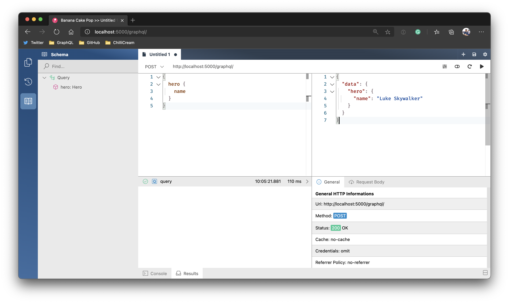
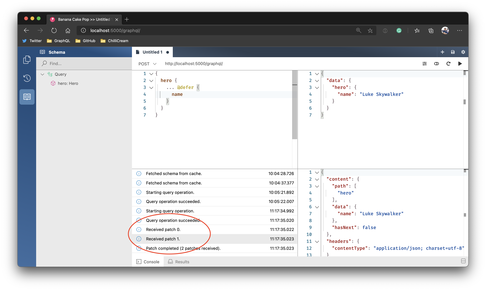

Today we are releasing Hot Chocolate server 11. We started work on this version about 1 1/2 years ago. We occasionally took a break from this project to create another 10.x version and deliver new features to the stable branch. From a user perspective, we have provided a new feature version every two months. For the core team, it was quite an intense time creating this new server and, at the same time, looking at the old version to keep it current.

With Hot Chocolate 11, we are now fully embracing .NET 5 while still supporting older .NET platforms. If you opt into .NET 5, you will get a much more refined experience to express a GraphQL schema in entirely different ways.

Records are now fully supported and let you create full GraphQL types with a single line of code. I personally like to use records for input types when using the pure code-first (annotation based) approach.

```csharp
public record AddSessionInput(string Title, string SpeakerId);
```

We reworked Hot Chocolate also to accept attributes on the parameters when using the short-hand syntax.

```csharp
public record AddSessionInput(string Title, [ID(nameof(Speaker))] string SpeakerId);
```

This allows you to write very slim input types and get rid of a lot of boilerplate code.

We have also started exploring how we can use source generators to make Hot Chocolate faster and reduce boilerplate even further. You will see this trickling in with the next dot releases.

# New Configuration API

While .NET 5 support is nice, the most significant change from an API perspective is the new configuration API, which now brings together all the different builders to set up a GraphQL server. This makes the server configuration now very accessible and straightforward to use.

```csharp
services
    .AddGraphQLServer()
    .AddQueryType<Query>();
```

The builder API lets you chain in new extension methods that can add new capabilities without the need to change the actual builder API. The builder interface is nothing more than a named access to the service collection, which lets you add named configurations to the DI that are consecutively used to create a GraphQL server.

```csharp
public interface IRequestExecutorBuilder
{
    /// <summary>
    /// Gets the name of the schema.
    /// </summary>
    NameString Name { get; }

    /// <summary>
    /// Gets the application services.
    /// </summary>
    IServiceCollection Services { get; }
}
```

Significant here is our switch to allow multiple named schemas that can be hot-reloaded during runtime. This allows us to improve a lot of workloads like schema stitching. But we will have more on that later.

With the new configuration API, you now can chain in various configurations without the need to remember where these things were hidden.

```csharp
services
    .AddGraphQLServer()
    .AddQueryType(d => d.Name("Query"))
        .AddType<AttendeeQueries>()
        .AddType<SessionQueries>()
        .AddType<SpeakerQueries>()
        .AddType<TrackQueries>()
    .AddMutationType(d => d.Name("Mutation"))
        .AddType<AttendeeMutations>()
        .AddType<SessionMutations>()
        .AddType<SpeakerMutations>()
        .AddType<TrackMutations>()
    .AddSubscriptionType(d => d.Name("Subscription"))
        .AddType<AttendeeSubscriptions>()
        .AddType<SessionSubscriptions>()
    .AddType<AttendeeType>()
    .AddType<SessionType>()
    .AddType<SpeakerType>()
    .AddType<TrackType>()
    .AddFiltering()
    .AddSorting()
    .AddProjections()
    .EnableRelaySupport()
    .AddDataLoader<AttendeeByIdDataLoader>()
    .AddDataLoader<SessionByIdDataLoader>()
    .AddDataLoader<SpeakerByIdDataLoader>()
    .AddDataLoader<TrackByIdDataLoader>()
    .EnsureDatabaseIsCreated()
    .AddInMemorySubscriptions()
    .AddFileSystemQueryStorage("./persisted_queries")
    .UsePersistedQueryPipeline();
```

With the new configuration API, we also reworked the ASP.NET Core integration to use the endpoints API. It now is effortless to apply the Hot Chocolate server to a routing configuration.

```csharp
public void Configure(IApplicationBuilder app, IWebHostEnvironment env)
{
    if (env.IsDevelopment())
    {
        app.UseDeveloperExceptionPage();
    }

    app.UseWebSockets();
    app.UseRouting();

    app.UseEndpoints(endpoints =>
    {
        endpoints.MapGraphQL();
    });
}
```

With the new middleware, we dropped support for Playground and GraphiQL and have added our own GraphQL IDE Banana Cake Pop, which will be automatically added to a GraphQL route.



To configure Banana Cake Pop or other middleware settings, you can chain in the server options with the GraphQLEndpointConventionBuilder.

```csharp
public void Configure(IApplicationBuilder app, IWebHostEnvironment env)
{
    if (env.IsDevelopment())
    {
        app.UseDeveloperExceptionPage();
    }

    app.UseWebSockets();
    app.UseRouting();

    app.UseEndpoints(
        e => e.MapGraphQL().WithOptions(
            new GraphQLServerOptions
            {
                Tool = { Enable = false }
            }));
}
```

# Execution Engine

While the new Configuration API is the first change, you will notice we changed a whole lot more underneath. One of the most significant investments we made was into our new execution engine. The new execution engine uses a new operation optimizer component to create execution plans and optimize executing requests. The first request now is a little slower since we need to essentially compile a query and then execute it. All consecutive requests can now simply execute and no longer need to interpret things like skip, include, defer, and other things.

With the new execution engine, we also introduced a new batching mechanism that is now much more efficient and abstracts the batching mechanism from DataLoader, meaning you can write your own batching functionality and integrate it. The stitching layer, for instance, does this to batch requests to the downstream services.

Apart from this, the new DataLoader API now follows the DataLoader spec version 2 and lets you inject the batch scheduler into the DataLoader. This makes it now easy to use Green Donut in your business logic. The beauty of this is that you do not need to expose any GraphQL libraries into your business layer and are able to layer your application nicely.

We also rewrote the validation layer for Hot Chocolate to make it much more correct and much faster on execution. To make the query validation more correct and ensure quality, we have ported all the `graphql-js` tests regarding validation to Hot Chocolate. While porting and integrating these tests, we found countless little issues with our implementation of field merging, for instance.

So, what do we mean with much faster execution? We put a lot of effort into reducing our memory footprint to execute more in parallel.

Let's have a look at how Hot Chocolate 11 compares to GraphQL .NET Server 4.3.1.

| Server           | Benchmark                  |    Time |  Allocated |
| ---------------- | -------------------------- | ------: | ---------: |
| Hot Chocolate 11 | Three Fields               |   11.94 |    7.49 KB |
| GraphQL .NET     | Three Fields               |   46.36 |   30.59 KB |
| Hot Chocolate 11 | Small Query with Fragments |   43.32 |   13.64 KB |
| GraphQL .NET     | Small Query with Fragments |  138.56 |  135.41 KB |
| Hot Chocolate 11 | Introspection              |  750.96 |  392.31 KB |
| GraphQL .NET     | Introspection              | 2277.24 | 2267.26 KB |

Hot Chocolate 11 uses a lot less memory and, on top of that, uses a lot less time to execute queries. But we also looked at other GraphQL servers and added Hot Chocolate to a variety of benchmarks.

For instance, we ran tests against the Apollo GraphQL server and other nodejs GraphQL servers.

| Server                     | Requests / second |
| -------------------------- | ----------------: |
| Hot Chocolate 11           |           19983.2 |
| graphyne                   |           17918.4 |
| express-gql                |            5931.4 |
| apollo-fastify-graphql-jit |            4046.2 |
| apollo                     |            2697.1 |

In our throughput tests, we can see that Hot Chocolate outperforms any node-based GraphQL server. Hot Chocolate is optimized for parallel requests meaning the more CPU cores your system has, the better Hot Chocolate server performs. This also means that if you have, for instance, only one CPU core graphyne will actually perform better. But even with less parallelization, Hot Chocolate turns up in the top three ahead of Express GraphQL and Apollo GraphQL.

This said, we are not done on performance and pulled the two biggest performance features on the execution side since we could not get them done in time for the 11 release. We already have seen huge potential in improving the overall performance of the server by using source generators. Source generators let us move a lot of the logic into the build process instead of executing resolver compilation at runtime. Also, we pulled a lot of our execution plan optimizers that would rewrite the execution tree to optimize data fetching. These performance improvements will trickle in with the next dot releases and should push Hot Chocolate further.

# Relay

We have invested a lot of time to make it even easier to create relay schemas. One of the things I often found cumbersome was to create entities that implemented the node interface. With Hot Chocolate 10.5, you could not do that with pure code-first (annotation based) and always needed to use code-first with the fluent API or schema-first. This now has changed, and it is much easier to write relay compliant schemas with any schema definition approach.

To write an entity that implements the node interface, you can now just put everything into one class.

```csharp
[Node]
public class Person
{
    public int Id { get; set; }

    public string Name { get; set; }

    public static async Task<Person> GetPersonAsync(MyDbContext context, int id)
    {
        // ...
    }
}
```

We often want to have the node resolver logic in a separate class that only deals with fetching the entity by ID. Or even have multiple node resolvers co-located in the same class. This can be done by specifying the node resolver type on the node attribute.

```csharp
[Node(NodeResolverType = typeof(IPersonResolver))]
public class Person
{
    public int Id { get; set; }

    public string Name { get; set; }
}
```

There are more variations and options possible to define a node type; the essence here is that it has become more natural.

# Draft Specification

As always, we try to implement draft specifications early, and we added a couple more draft spec features with Hot Chocolate 11.

## Allow interfaces to implement other interfaces

[GraphQL Spec PR 373](https://github.com/graphql/graphql-spec/pull/373)

One thing that users often requested is that interfaces could implement interfaces. With GraphQL until now, this was not possible. With the new GraphQL draft spec, we now have this capability, and we have optimized Hot Chocolate to make it very simple to apply.

The GraphQL spec states that you have to reimplement an interface on every level. This decision was made to optimize the GraphQL SDL for readability, and further show the impact of changes to an interface.

We will help you that this does not feel cumbersome and automatically add the missing re-implementations with code-first.

```csharp
public interface INode
{
    string Id { get; }
}

public interface IPerson : INode
{
    string Name { get; }
}

public class Person : IPerson
{
    public string Id { get; }

    public string Name { get; }
}

public class Query
{
    public IPerson GetPerson() => new Person();
}

services
    .AddGraphQLServer()
    .AddQueryType<Query>()
    .AddInterfaceType<INode>()
```

This schema will translate to the following GraphQL SDL.

```sdl
schema {
  query: Query
}

interface INode {
  id: String
}

interface IPerson implements INode {
  id: String
  name: String
}

type Person implements IPerson & INode {
  id: String
  name: String
}

type Query {
  person: IPerson
}
```

## Custom Scalar Specification URLs

[GraphQL Spec PR 649](https://github.com/graphql/graphql-spec/pull/649)

Another feature that we think will make tooling better over time is the ability to state the scalar specification. Andi Marek from graphql-java has created a new scalar specification website that, at the moment, only hosts one scalar specification for `DateTime`. Hopefully, this will grow over time. Scalars that have a specification can point to an URL of a human-readable spec. This will allow tooling to use the spec URLs as identifiers and apply then IntelliSense or other means of validation to a GraphQL IDE.

When you implement a scalar type, you can now pass on this `specifiedBy` URL.

```csharp
public class MyScalar : ScalarType
{
    public MyScalar()
        : base("MyScalar")
    {
        SpecifiedBy = new Uri("URL");
    }

    // ...
}
```

## Defer and Stream

[GraphQL Spec PR 742](https://github.com/graphql/graphql-spec/pull/742)

We also invested a lot of time in a very early feature called defer and stream. Defer, and stream allow you to de-prioritize parts of your request. This means that you essentially can tell the server to give you all the data in one go, but you mark the data that can arrive a little later.

```graphql
{
  sessions {
    nodes {
      title
      abstract
      startTime
      endTime
      ... @defer {
        speakers {
          name
        }
      }
    }
  }
}
```

Hot Chocolate Server 11 supports defer. This feature is experimental since the spec still changes, and we will keep it up to date. We have not yet included stream, which will follow with 11.1, probably at the end of January. You do not need to specify anything in your server to use defer; it will just work. You can try out defer with Banana Cake Pop, which will show you exactly how the patches come in.



# Data Integration

I know a lot of you love the data integration API, aka filtering. We completely reinvented this API and created a new package called `HotChocolate.Data`. This new package contains the base for automatic database mapping, filtering, sorting, and projections.

We actually started out in 11 to make the filtering introduced in version 10 better. But people soon chimed in and wanted to do more and wanted to **NOT** be dependant on `IQueryable`. So we create a new API that lets you fully control how filters, sorting, and projections are handled. You can integrate new providers like NeoJ4, MongoDB, or even spatial filter
support.

```csharp
public static class FilterConventionDescriptorMongoDbExtensions
{
    public static IFilterConventionDescriptor UseMongoDbProvider(
        this IFilterConventionDescriptor descriptor) =>
        descriptor.Provider(new MongoDbFilterProvider(x => x.AddDefaultMongoHandler()));

    public static IFilterProviderDescriptor<MongoDbFilterVisitorContext> AddDefaultMongoHandler(
        this IFilterProviderDescriptor<MongoDbFilterVisitorContext> descriptor)
    {
        descriptor.AddFieldHandler<MongoDbEqualsOperationHandler>();
        descriptor.AddFieldHandler<MongoDbNotEqualsOperationHandler>();

        descriptor.AddFieldHandler<MongoDbInOperationHandler>();
        descriptor.AddFieldHandler<MongoDbNotInOperationHandler>();

        // shortened for brevity

        return descriptor;
    }
}
```

What does this actually mean?

We have ported the old filtering to 11, so you can use that and essentially have no breaking change. We are no longer developing this any further and are also no longer investing in this component's bug fixing.

This means that you essentially will need to upgrade to the new `HotChocolate.Data` package. The issue with that is that your graph filter structure will change. Meaning a breaking change to your schema. You can, however, upgrade slowly and use both APIs side by side.

You can read more about the journey on our data integration API in Pascal's blog post [here](/blog/2020/11/18/new-filtering-api).

## Entity Framework

We know that many of you love Entity Framework and that it was quite painful to use Entity Framework with Hot Chocolate. We refined usage of Entity Framework with 10.5 but had to use internal APIs of EF to make it efficient. Hot Chocolate 11 introduces a new package `HotChocolate.Data.EntityFramework`, which integrates seamlessly with the data integration API.

We have a great example with Entity Framework right here:

[GraphQL Workshop](https://github.com/ChilliCream/graphql-workshop)

## Spatial Filtering

Apart from the refactoring of the data integration API, we introduced our new GeoJSON based spatial types. These spatial types are not just simple types but can also be used to add spatial filter capabilities to our data integration API.

```graphql
{
  pubs(
    where: {
      location: {
        within: { geometry: { type: Point, coordinates: [1, 1] }, lt: 120 }
      }
    }
  ) {
    id
    name
    location
  }
}
```

Which translates to:

```sql
 SELECT c."Id", c."Name", c."Area"
 FROM "Counties" AS c
 WHERE ST_Within(c."Area", @__p_0)
```

This use-case was one that has driven us to reinvent the data integration API in the first place. This now very easily allows you to expose complex spatial filters to the consumer.

Let me thank Steve and Pascal for all their work on this feature.

However, we are still developing spatial further, and this feature essentially is still experimental. Meaning, it might change in the next dot releases.

## Support for more providers

We are currently working on more providers for the data integration API like MongoDB native, Neo4J, and Elastic Search, which we will drop with the next dot releases.

The furthest along is our new MongoDB integration. Of course, MongoDB works already through `IQueryable`, but with `IQueryable` performance is sometimes an issue since the translation from `IQueryable` to the native Mongo query is not optimal in all cases. With the new Mongo provider, we use the BSON API to craft a native query that you can also intercept and further modify before it is sent to the database.

We expect to release the MongoDB provider with 11.1 in January.

# Schema Stitching

Schema got a nice upgrade for version 11, although a lot of features were moved to 11.1. We originally wanted to redo the whole stitching execution on top of the new execution engine. In the end, we essentially moved the old stitching engine on top of the new execution engine and integrated the old stitching engine into the new configuration API. This alone already will give you a big upgrade in functionality and usability.

The first thing to note with schema stitching is that it completely integrates with a standard schema. No more is there a separate stitching builder that makes it challenging to add customizations.

```graphql
services
    .AddGraphQLServer()
    .AddQueryType(d => d.Name("Query"))
    .AddRemoteSchema(Accounts)
    .AddRemoteSchema(Inventory)
    .AddRemoteSchema(Products)
    .AddRemoteSchema(Reviews);
```

Essentially now you just merge in types into your schema from anywhere, and you are still able to create local types that are merged with remote types. This gives a lot of control and flexibility to you. With that, any schema could also be a gateway.

```graphql
services
    .AddGraphQLServer()
    // adds a local query type
    .AddQueryType<Query>()
    // and merges that with the incoming schemas
    .AddRemoteSchema(Accounts)
    .AddRemoteSchema(Inventory)
    .AddRemoteSchema(Products)
    .AddRemoteSchema(Reviews);
```

## Federated Schemas

I mentioned in the beginning that we can now hot-reload schemas, which we designed specifically for schema stitching so that you could distribute the schema configuration and use a federated approach to schema stitching.

While there are various ways now to do federated schemas, we internally use one backed by Redis. Essentially, a downstream service can push to the gateway its local configuration, and the gateway will start phasing out the old schema and phasing in the new schema without any disruption every time a configuration changes.

The gateway will further store schema configurations on Redis so that even if there are downstream services offline, we can always create a schema, and only on execution might there be errors for affected parts of the schema. This really makes a federated schema more resilient.

```csharp
services
    .AddGraphQLServer()
    .AddQueryType(d => d.Name("Query"))
    .AddRemoteSchemasFromRedis("Demo", sp => sp.GetRequiredService<ConnectionMultiplexer>());
```

We have created some examples that show the various ways to set up schema stitching, which can be found [here](https://github.com/ChilliCream/hotchocolate-examples/tree/master/misc/Stitching).

But as I said in the beginning, there is a lot more coming with the next dot updates. Like GraphQL over gRPC to improve efficiency between the gateway and the downstream services. Moreover, we are bringing in subscription stitching and full integration with the new execution engine. Furthermore, we will introduce a new fetch directive that will bring much more flexibility to integrating GraphQL schemas and other data sources.

# Extensibility

With Hot Chocolate 11, we changed direction. Hot Chocolate, until now, was quite locked down to provide a refined experience and not expose any extension API that we might regret exposing; we kept a lot of stuff internal. During development, we decided that any new component like `HotChocolate.Data` and `HotChocolate.Stitching` is not allowed to use any internal API to ensure that anybody can build powerful integrations.

We essentially created a new interception API that can hook into the type initialization to completely rewrite an inferred schema. It can create new types when it finds an attribute or branch of types and essentially creates versions of the same graph. It gives you a powerful API that visits each type during its various initialization stages and lets you change the APIs.

Also, it allows you to modify the underlying type definitions rather than being constrained by the fluent API. These extension APIs are not meant for the standard developer creating a schema but for people who want to write powerful, reusable components like `HotChocolate.Data`. We also rewrote a lot of our core components to use this new API, like the introspection.

```csharp
server
    .AddGraphQLServer()
    ...
    .AddTypeInterceptor<IntrospectionTypeInterceptor>();

internal sealed class IntrospectionTypeInterceptor : TypeInterceptor
{
    public override void OnBeforeCompleteType(
        ITypeCompletionContext completionContext,
        DefinitionBase definition,
        IDictionary<string, object> contextData)
    {
        if (definition is ObjectTypeDefinition objectTypeDefinition)
        {
            var position = 0;
            IDescriptorContext context = completionContext.DescriptorContext;

            if (completionContext.IsQueryType ?? false)
            {
                objectTypeDefinition.Fields.Insert(position++, CreateSchemaField(context));
                objectTypeDefinition.Fields.Insert(position++, CreateTypeField(context));
            }

            objectTypeDefinition.Fields.Insert(position, CreateTypeNameField(context));
        }
    }
}
```

We will soon have a follow-up post on writing extensions for Hot Chocolate to drill into what you can do.

# Strawberry Shake

The one thing missing from this launch is Strawberry Shake, our GraphQL client. We decided in August to pause development for Strawberry Shake in order to focus on the server. Many features in Strawberry Shake depended on Hot Chocolate to bring in new features like defer that really will make Strawberry Shake shine. With this decision, we were able to focus on the server and make it great. We essentially broke the 11 development into two parts. We will start next week to put resources again behind Strawberry Shake and hope to get it done by the end of January.

# General Outlook

Where are we going from here? We now essentially are a team of four people, Rafael, Pascal, Fred, and myself. We plan to start focusing for the next three months on three components.

Strawberry Shake will become Freds and my immediate focus, so expect our GraphQL client to get real attention and expect it to get the same attention for detail that made Hot Chocolate your beloved GraphQL server. We think that the client space at the moment does not exist in .NET, and we want to change that. There are a lot of opportunities to bring something unique. We have done a lot of research into things like Relay and Apollo client and think that we can reinvent how you interact with data in Xamarin and Blazor applications.

Apart from Strawberry Shake, we will also take up our original schema stitching engine branch. The new stitching engine can not only do subscription stitching but also is able to merge the Hot Chocolate stitching approach with the Apollo Stitching approach. You will be able to have Apollo federation protocol downstream services as well as Hot Chocolate stitching protocol downstream servers. The gateway can mix and match them. As you have seen with the general execution engine, stitching will become very fast, and we will publish benchmarks soon.

In general, expect a lot more performance improvements to integrate our source generators into the core library.

These changes are more iterative, where we complete and get better. We will also start on a new component that will become a big leap for the whole platform. Rafael and Pascal will focus on this new component that we will start talking about soon.

# Community

The great thing about Hot Chocolate is the people. Every day, I think the best thing we did was to create this slack channel where anybody could join. The slack channel has become the space where the community can congregate and help each other find a solution to a problem.

We internally talked about this great family and how to push this further and help this community grow. We will soon start with our ChilliCream user group, where users from the community can present solutions to their issues or present components that they have build around Hot Chocolate. But we think that we will even go beyond that and ask people from the greater GraphQL community to talk to us and give us fresh ideas and new takes on GraphQL.

Last but not least, let me invite you to our launch party on Thursday and celebrate with us this amazing community and the next chapter of Hot Chocolate.

[Hot Chocolate 11 Launch Party](https://www.meetup.com/ChilliCream-User-Group/events/274656703/)
