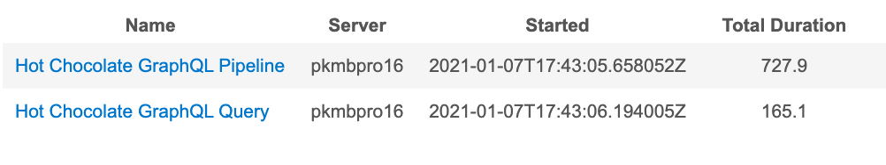
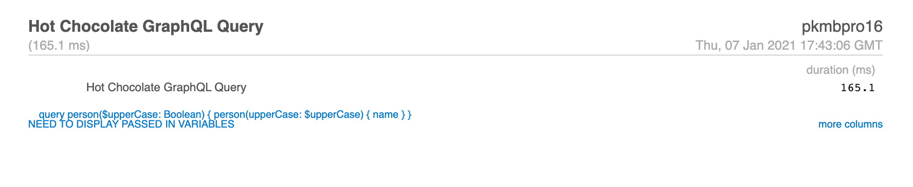

Whether you are a building your first Hot Chocolate GraphQL server or you're on the core team who built it, having an easy way to see both
the query you've sent to the server immediately is very valuable.  Small mistakes in syntax can be easily discovered, problems with
variable definitions can be tricky to uncover, and just in general, having those queries at your finger tips is a big benefit while developing or running your
Hot Chocolate GraphQL server.

# Just Show Me the Code

There are only two things you need to do.  First, you need to create a new class in your project that implements `DiagnosticEventListener`.  You can put this
any place in your project.

```csharp
using HotChocolate.Execution;
using HotChocolate.Execution.Instrumentation;
using Microsoft.Extensions.Logging;

namespace logging
{
    public class ConsoleQueryLogger : DiagnosticEventListener
    {
        private readonly ILogger<ConsoleQueryLogger> _logger;

        public ConsoleQueryLogger(ILogger<ConsoleQueryLogger> logger)
        {
            _logger = logger;
        }

        public override IActivityScope ExecuteRequest(IRequestContext context)
        {
            return new RequestScope(_logger, context);
        }

        private class RequestScope : IActivityScope
        {
            private readonly IRequestContext _context;
            private readonly ILogger<ConsoleQueryLogger> _logger;

            public RequestScope(ILogger<ConsoleQueryLogger> logger, IRequestContext context)
            {
                _logger = logger;
                _context = context;
            }

            public void Dispose()
            {
                if (_context.Document is not null)
                    _logger.LogInformation(_context.Document.ToString(true));
            }
        }
    }
}
```

Then, in your `startup.cs`, you need to add the listener code above as service using the 
`AddDiagnosticEventListener` method.

```csharp
public class Startup
{
    public void ConfigureServices(IServiceCollection services)
    {
        services
            .AddRouting()
            .AddGraphQLServer()
            .AddQueryType<Query>()
            .AddDiagnosticEventListener(sp =>
              new ConsoleQueryLogger(
                sp.GetApplicationService<ILogger<ConsoleQueryLogger>>()
              ));
    }
    
    public void Configure(IApplicationBuilder app, IWebHostEnvironment env)
    {
        if (env.IsDevelopment()) app.UseDeveloperExceptionPage();

        app.UseRouting();

        app.UseEndpoints(endpoints => { endpoints.MapGraphQL(); });
    }
}
```

Let's assume you have in your `Query.cs` a resolver that takes a single parameter and returns a string, like this for example:

```csharp
public class Query
{
    public Person GetPerson(bool upperCase = false) =>
        upperCase ? 
            new Person("Luke Skywalker".ToUpper()) :
            new Person("Luke Skywalker");
}
```

When you execute the GraphQL query

```graphql
query person($upperCase: Boolean) {
  person(upperCase: $upperCase) {
    name
  }
}
```

with the associated variable Boolean in your POST `upperCase`

```graphql
{
  "upperCase": true
}
```

You console output will show this

XXXXX

The console output you'll get will be the following:


That's all you need.  

Now, for a little more details on what's actually happening here, as well as how to log your queries using the very useful 
<a href="https://miniprofiler.com/dotnet/AspDotNetCore" target="_blank">MiniProfiler for ASP.NET Core</a>.


# What is Really Going on Here

Adding console logging is really quite simple in what is going on.  It's straight forward usage of both the ASP.NET Core <a href="https://docs.microsoft.com/en-us/aspnet/core/fundamentals/dependency-injection" target="_blank">Dependency Injection</a> and <a href="https://docs.microsoft.com/en-us/aspnet/core/fundamentals/middleware" target="_blank">Middleware</a> implementations.

Looking at this line of code:

```csharp
.AddDiagnosticEventListener(sp =>
  new ConsoleQueryLogger(
    sp.GetApplicationService<ILogger<ConsoleQueryLogger>>()
  ));
```

`AddDiagnosticEventListener` is adding to the Hot Chocolate GraphQL server middleware, or really just a listener designed to listen for events that happen while the server is processing requests.  Typically, these are diagnostic events that give us the ability to do things like capture GraphQL queries and do something useful with them (like log them to the console).

Our `ConsoleQueryLogger` receives as an injected service, the logger itself that uses the <a href="https://docs.microsoft.com/en-us/aspnet/core/fundamentals/logging" target="_blank">ASP.NET Core Logging API</a> and the built in Console logging provider.

The work of logging the message is performed in the `Dispose` method of the `RequestScope` which is what is listening to all the activity on the GraphQL request.  When the request is finished, the activity scope gets disposed and that gives us a good place to log our query itself.

```csharp
public void Dispose()
{
    if (_context.Document is not null)
        _logger.LogInformation(_context.Document.ToString(true));
}
```


# Logging Requests to MiniProfiler 

Console logs are nice, but can get pretty cluttered and become unmanageable quickly.  Luckily for us, there is very useful open source project that we can include for free in our apps called <a href="https://miniprofiler.com/dotnet/AspDotNetCore" target="_blank">MiniProfiler</a> and there is an implementation specifically written for <a href="https://docs.microsoft.com/en-us/aspnet/core" target="_blank">ASP.NET Core</a>.

The idea is that you get a route you can secure on your website that lists the queries you've run,



and you can drill down on each one and see the actual query as well as the passed in variables with their associated data.



# Wrap

alsdfjals; ldasf l;kads fjl;as
<hr/><hr/>
# BIO PIECE LIKE TELERIK BLOG


<hr/><hr/>
# BOTTOM PIECE? 

***Last but not least we must subscribe to the Green Donut DiagnosticSource.***

*NOT SURE IF YOU WANT THIS ON THE BLOG OR THIS SHOULD BE ON THE FOOTER OF THE BLOG PAGE*
If you want to get into contact with us head over to our [slack channel](https://join.slack.com/t/hotchocolategraphql/shared_invite/enQtNTA4NjA0ODYwOTQ0LTViMzA2MTM4OWYwYjIxYzViYmM0YmZhYjdiNzBjOTg2ZmU1YmMwNDZiYjUyZWZlMzNiMTk1OWUxNWZhMzQwY2Q) and join our community.

[hot chocolate]: https://hotchocolate.io
[hot chocolate source code]: https://github.com/ChilliCream/hotchocolate


