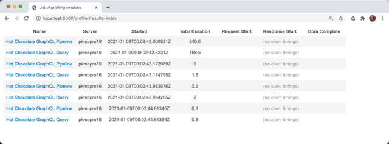
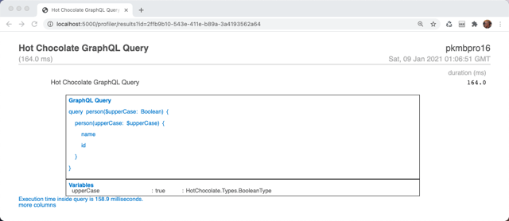
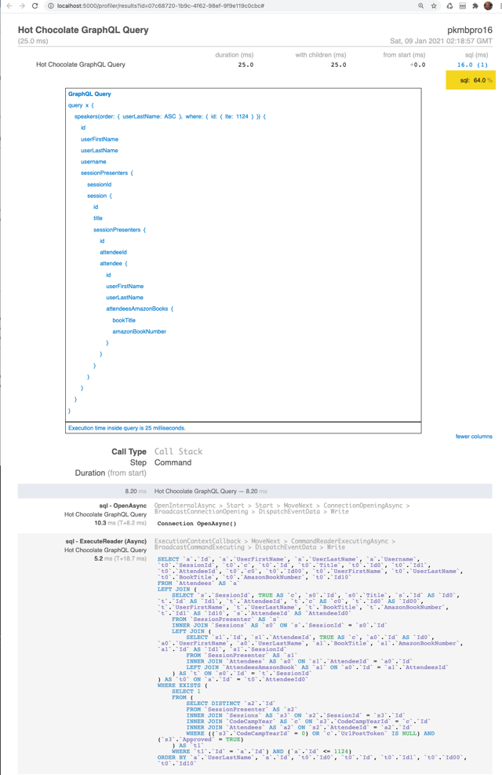

Whether you are a building your first Hot Chocolate GraphQL server, or you're on the core team who built it, having an easy way to see both
the query you've sent to the server immediately is very helpful and valuable. Small mistakes in syntax can be easily discovered, problems with
variable definitions can be tricky to uncover, and just in general, having those queries at your finger tips is a big benefit while developing or running your
Hot Chocolate GraphQL server.

# Just Show Me the Code

You can find all the code from this article in this Github repository.

https://github.com/ChilliCream/hotchocolate-examples/tree/master/blog/2021/2021-01-20-logging

To start logging your GraphQL server requests this is all you need to do. First, you need to create a new class in your project that implements the listener `DiagnosticEventListener`.

```csharp
using System;
using System.Diagnostics;
using System.Linq;
using System.Text;
using HotChocolate.Execution;
using HotChocolate.Execution.Instrumentation;
using Microsoft.Extensions.Logging;

namespace Logging
{
    public class ConsoleQueryLogger : DiagnosticEventListener
    {
        private static Stopwatch _queryTimer;
        private readonly ILogger<ConsoleQueryLogger> _logger;
        public ConsoleQueryLogger(ILogger<ConsoleQueryLogger> logger)
        {
            _logger = logger;
        }

        public override IActivityScope ExecuteRequest(IRequestContext context)
        {
            return new RequestScope(_logger, context);
        }

        private class RequestScope : IActivityScope
        {
            private readonly IRequestContext _context;
            private readonly ILogger<ConsoleQueryLogger> _logger;
            public RequestScope
                (ILogger<ConsoleQueryLogger> logger,
                     IRequestContext context)
            {
                _logger = logger;
                _context = context;
                _queryTimer = new Stopwatch();
                _queryTimer.Start();
            }

            public void Dispose()
            {
                if (_context.Document is not null)
                {
                    StringBuilder stringBuilder =
                        new(_context.Document.ToString(true));
                    stringBuilder.AppendLine();
                    if (_context.Variables != null)
                    {
                        var variablesConcrete =
                            _context.Variables!.ToList();
                        if (variablesConcrete.Count > 0)
                        {
                            stringBuilder.
                                AppendFormat($"Variables {Environment.NewLine}");
                            try
                            {
                                foreach (var variableValue in _context.Variables!)
                                {
                                    string PadRightHelper
                                        (string existingString, int lengthToPadTo)
                                    {
                                        if (string.IsNullOrEmpty(existingString))
                                            return "".PadRight(lengthToPadTo);
                                        if (existingString.Length > lengthToPadTo)
                                            return existingString.Substring(0, lengthToPadTo);
                                        return existingString + " ".PadRight(lengthToPadTo - existingString.Length);
                                    }
                                    stringBuilder.AppendFormat(
                                        $"  {PadRightHelper(variableValue.Name, 20)} :  {PadRightHelper(variableValue.Value.ToString(), 20)}: {variableValue.Type}");
                                    stringBuilder.AppendFormat($"{Environment.NewLine}");
                                }
                            }
                            catch
                            {
                                // all input type records will land here.
                                stringBuilder.Append("  Formatting Variables Error. Continuing...");
                                stringBuilder.AppendFormat($"{Environment.NewLine}");
                            }
                        }
                    }
                    _queryTimer.Stop();
                    stringBuilder.AppendFormat(
                        $"Ellapsed time for query is {_queryTimer.Elapsed.TotalMilliseconds:0.#} milliseconds.");
                    _logger.LogInformation(stringBuilder.ToString());
                }
            }
        }
    }
}
```

Then, in your `startup.cs`, you need to subscribe to the the Hot Chocolate `DiagnosticEventListener`, which is what the above `ConsoleQueryLogger` class implements.

That's done in the `ConfigureServices` method in `startup.cs`.

```csharp
public class Startup
{
    public void ConfigureServices(IServiceCollection services)
    {
        services
            .AddRouting()
            .AddGraphQLServer()
            .AddQueryType<Query>()
            .AddDiagnosticEventListener(sp =>
              new ConsoleQueryLogger(
                sp.GetApplicationService<ILogger<ConsoleQueryLogger>>()
              ));
    }

    public void Configure(IApplicationBuilder app, IWebHostEnvironment env)
    {
        if (env.IsDevelopment()) app.UseDeveloperExceptionPage();

        app.UseRouting();

        app.UseEndpoints(endpoints => { endpoints.MapGraphQL(); });
    }
}
```

For this logger to have something to do, we need to have a `Query` in our project so let's make a very simple class and put it in a file `Query.cs`.

Let's assume you have in your `Query.cs` a resolver that takes a single parameter and returns a string based on a passed in parameter (like this for example).

```csharp
namespace logging
{
    public class Query
    {
        public Person GetPerson(bool upperCase = false)
        {
            return upperCase ?
                new Person("Luke Skywalker".ToUpper(), 101) :
                new Person("Luke Skywalker", 102);
        }
    }

    public class Person
    {
        public Person(string name,int id)
        {
            Name = name; Id = id;
        }
        public string Name { get; }
        public int Id { get; }
    }
}
```

When you execute the GraphQL query

```graphql
query person($upperCase: Boolean) {
  person(upperCase: $upperCase) {
    name
    id
  }
}
```

with the associated `Boolean` variable in your POST `upperCase`

```graphql
{
  "upperCase": true
}
```

You console output will show this

```text
Executing endpoint 'Hot Chocolate GraphQL Pipeline'
info: logging.ConsoleQueryLogger[0]

query person($upperCase: Boolean) {
  person(upperCase: $upperCase) {
    name
    id
  }
}
Variables
upperCase    :true  :HotChocolate.Types.BooleanType
Ellapsed time for query is 162 milliseconds.
```

Notice the execution time shows as 162 milliseconds. If you execute the query again, you'll see that drop to just 1 or 2 milliseconds as now, the query, along with it's resolvers are cached by Hot Chocolate.

Now, for a little more details on what's actually happening here, as well as how to log your queries using the very useful
<a href="https://miniprofiler.com/dotnet/AspDotNetCore" target="_blank">MiniProfiler for ASP.NET Core</a>.

# What is Really Going on Here

Adding console logging is really quite simple in what is going on. It's straight forward usage of both the ASP.NET Core <a href="https://docs.microsoft.com/en-us/aspnet/core/fundamentals/dependency-injection" target="_blank">Dependency Injection</a> and <a href="https://docs.microsoft.com/en-us/aspnet/core/fundamentals/middleware" target="_blank">Middleware</a> implementations.

That middleware is added to our `startup.cs`.

```csharp
.AddDiagnosticEventListener(sp =>
  new ConsoleQueryLogger(
    sp.GetApplicationService<ILogger<ConsoleQueryLogger>>()
  ));
```

`AddDiagnosticEventListener` is adding to the Hot Chocolate GraphQL server a listener designed to listen for events that happen while the server is processing requests. Typically, these are diagnostic events that give us the ability to do things like capture GraphQL queries and variables while at the same time, doing something useful with them (like log them to the console).

Our `ConsoleQueryLogger` receives as an injected service, the logger itself, that uses the <a href="https://docs.microsoft.com/en-us/aspnet/core/fundamentals/logging" target="_blank">ASP.NET Core Logging API</a>, and the built in Console logging provider, `AddConsole`.

You will need to make sure that in your `program.cs` you've added `ConfigureLogging` to your `CreateHostBuilder` method. It should look similar to this.

```csharp
public static IHostBuilder
  CreateHostBuilder(string[] args) =>
    Host.CreateDefaultBuilder(args)
        .ConfigureLogging(c => c.AddConsole())
        .ConfigureWebHostDefaults(webBuilder =>
        {
            webBuilder.UseStartup<Startup>();
        });
```

Back to our `ConsoleQueryLogger` class. The entire purpose of this class is to hook into the Hot Chocolate GraphQL processing pipeline such that we can start a timer before the query starts processing. Then, at that processing completion, the query details, the variables associated with the query and the execution time are logged.

Because this method implements the Hot Chocolate `DiagnosticEventListener`, we can override the `ExecuteRequest` method which gives us a way to hook into the processing pipeline. That "hook in" is by way of Dependency Injection. By making the first parameter of that method an `IRequestContext`, we can get passed into this method, our GraphQL context for this request. That context contains all the details about the request including the query itself and its associated request variables.

From here, we create a new `RequestScope`, that will track our entire request from start to finish in the Hot Chocolate GraphQL server. We pass into that `RequestScope`, our console logger and our newly acquired GraphQL context.

Essentially, this new `RequestScope` tracks our GraphQL query from start to finish. We make use of `System.Diagnostics.Stopwatch` to time our request. We start the timer in the `RequestScope`'s constructor, and we stop it in its `Dispose` method. Because we have access to our request details, as well as the logger class, we can output our complete query to our logger on the completion of the request processing.

```csharp
public void Dispose()
{
    if (_context.Document is not null)
        _logger.LogInformation(_context.Document.ToString(true));
}
```

You don't really need to understand all these details to use the logger, and likely, in the future you would probably get this from another `nuget` package. For now, it's interesting to see how straight forward it is to hook directly into the processing of your GraphQL request.

# Logging Requests to MiniProfiler

Console logs are nice, but can get pretty cluttered and become unmanageable quickly. Luckily for us, there is very useful open source project that we can include for free in our apps called <a href="https://miniprofiler.com/dotnet/AspDotNetCore" target="_blank">MiniProfiler</a> and there is an implementation specifically written for <a href="https://docs.microsoft.com/en-us/aspnet/core" target="_blank">ASP.NET Core</a>.

The idea is that you get a URL route you can secure on your website that lists the queries you've run and how long each one took. Typically it's something like <u>http://localhost:5000/profiler/results-index</u>. Here is an example of us running the query we wrote earlier, multiple times.



You can drill down on each one if these queries, and see the actual query as well as the passed in variables along with their associated input data.



Just like for the `ConsoleQueryLogger` class, we need to create a similar class for our MiniProfiler to work. I've done that in our example repository and named the class `MiniProfilerQueryLogger`.

https://github.com/pkellner/hot-chocolate-query-logging/blob/main/MiniProfilerQueryLogger.cs

It also implements `DiagosticEventListener` just like `ConsoleQueryLogger` did. It gets passed in the request context, but instead of logging to the console with the `ILogger` interface and the `ConsoleLoggerExtension`, it simply calls the MiniProfiler API directly.

I could have implemented it with the ILogger interface and that would have given a lot more flexibility to our logging, but that also would have added a lot more complexity, so for now, if you want to log to MiniProfiler, add this middleware to your GraphQL.

We do need to install the MiniProfiler package for ASP.NET Core so let's do that at the command line with `nuget`. That command is:

```dos
dotnet add package MiniProfiler.AspNetCore.Mvc
```

Then, to our `startup.cs`, we need to add several things. They are:

In `ConfigureServices`

1. Add MVC to our app by adding the service `AddControllersWithViews`
2. Add the `MiniProfilerQueryLogger` service
3. Add the `MiniProfiler` itself to the our services.

In `Configure`

1. Add to our app builder `useMiniProfiler`

Here is our final `startup.cs`.

```csharp
using Microsoft.AspNetCore.Builder;
using Microsoft.AspNetCore.Hosting;
using Microsoft.Extensions.DependencyInjection;
using Microsoft.Extensions.Hosting;
using Microsoft.Extensions.Logging;

namespace logging
{
    public class Startup
    {
        public void ConfigureServices
           (IServiceCollection services)
        {
            services.AddControllersWithViews();
            services
                .AddRouting()
                .AddGraphQLServer()
                .AddQueryType<Query>()
                .AddDiagnosticEventListener(sp =>
                    new ConsoleQueryLogger
                        (sp.GetApplicationService
                           <ILogger<ConsoleQueryLogger>>()))
                .AddDiagnosticEventListener(sp =>
                    new MiniProfilerQueryLogger());
            services.AddMiniProfiler(options =>
                { options.RouteBasePath = "/profiler"; });
        }

        public void Configure(IApplicationBuilder app,
            IWebHostEnvironment env)
        {
            if (env.IsDevelopment())
            {
                app.UseDeveloperExceptionPage();
            }

            app.UseRouting();
            app.UseMiniProfiler();
            app.UseEndpoints(endpoints =>
              { endpoints.MapGraphQL(); });
        }
    }
}
```

That's it! Now, when you run your app and do some GraphQL queries, you can browse to the URL <u>http://localhost:5000/profiler/index-results</u> and that will give you a list of all your GraphQL requests. You can drill down on any request and see both the query itself, as well as any variables passed in with the associated value and type.

Just a side note. You can run both the console logger and the MiniProfiler at the same time and both logs will work as adding listeners is additive.

# Possibilities For Logging SQL and Entity Framework

It's worth mentioning that <a href="https://miniprofiler.com" target="_blank">MiniProfiler</a> has been around for a long time and there are many configuring profiles available including ones for <a href="https://docs.microsoft.com/en-us/dotnet/framework/data/adonet/ado-net-overview" target="_blank">ADO.NET</a> as well as <a href="https://docs.microsoft.com/en-us/ef/" target="_blank">Entity Framework Core</a>.

If you've gotten everything working, it's trivial to add Entity Framework support so that inside your GraphQL requests, you can see the actual SQL sent to the server and the associated timing. Literally, all you have to do is install one `nuget` package

```dos
dotnet add package MiniProfiler.EntityFrameworkCore
```

And, in your `startup.cs`, change the line that adds MiniProfile as follows:

```csharp
services.AddMiniProfiler
   (options =>
      { options.RouteBasePath = "/profiler"; })
         .AddEntityFramework();
```

Then, when you execute a GraphQL query that uses Entity Framework Core, you'll get results like the following. Notice that not only do you get the GraphQL query with it's variables, but also, you get all the SQL generated by Entity Framework that's run on that Query's behalf. Also notice the timing, you can see the time for the GraphQL query as well as the time for just the SQL.



# Wrap

Once you have logging enabled in your Hot Chocolate GraphQL server, you'll wonder how you ever worked without it. It's easy to setup and does not get in the way at all while you're building your apps.

Stay Safe.
