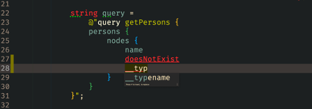
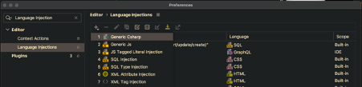
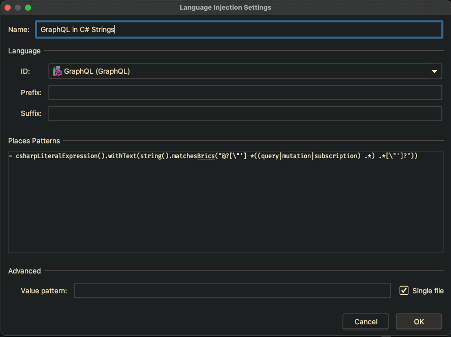
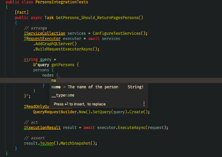

This post will show you how JetBrains Rider can make your life a little easier when working with GraphQL queries in string literals.


## Testing is hard

When writing integration tests for HotChocolate, you find yourself often writing GraphQL queries in string literals. The
most challenging part of writing an integration test is to write the query correctly. You quickly forget a bracket, the
name of a field or a required input field and you end up with an invalid query.

If you use JetBrains Rider, you can easily solve this problem and write integration tests with ease. Rider supports
language injection in string literals.

## Getting Started

Rider has no support for the GraphQL language out of the box. You need to install the extension JS GraphQL
from [Jim Kydne Meyer](https://github.com/jimkyndemeyer). You can install the extension from the marketplace or download
it here [JS GraphQL](https://plugins.jetbrains.com/plugin/8097-js-graphql).

The extension needs to know your schema, but in exchange, you get syntax highlighting, linting and IntelliSense.

## Creating a schema file

When you use the annotation-based or the code-first approach of HotChocolate, a change on a domain model often results
in a change in the schema. Even though this is in most cases wanted, it also happens that you change the schema by
accident. It's recommended to have at least one snapshot test of your GraphQL schema to avoid accidental changes.

A snapshot test captures the schema, stores it in the project folder and from then on compares the stored schema against
the schema from your server. In the HotChocolate code base, we make heavy use of snapshot testing. We can recommend the
package [Snapshooter](https://swisslife-oss.github.io/snapshooter/docs/get-started). With Snapshooter you can create snapshot tests for any object.

```csharp
[Fact]
public void ExampleUseOfSnapshooter()
{
   // arrange
   var serviceToTest = new ServiceToTest();

   // act
   List<string> result = serviceToTest.GetSomeStrings();

   // assert
   result.MatchSnapshot();
}
```

A HotChocolate schema, can be printed into a string and this string can then be used in a snapshot test. This schema
snapshot can also be used as the source for the GraphQL extension. The JS GraphQL extension requires a schema file with
the name `schema.graphql`. You can configure the extension in a `.graphqlconfig` file

The snapshot test to capture the schema could look like this:

_/test/ExampleProject.Tests/SchemaTests.cs_

```csharp
public class SchemaTests
{
    [Fact]
    public async Task SchemaShouldNotChange()
    {
        // arrange
        SnapshotFullName fullName = new XunitSnapshotFullNameReader().ReadSnapshotFullName();
        IServiceCollection services = ConfigureTestServices();
        IRequestExecutor executor = await services
            .AddGraphQLServer()
            .BuildRequestExecutorAsync();

        // act
        string schema = executor.Schema.Print();

        // assert
        schema.MatchSnapshot(new SnapshotFullName("schema.graphql", fullName.FolderPath));
    }
}
```

The example from above creates a snapshot of the schema in `/test/ExampleProject.Tests/__snapshots__/schema.graphql`. You now
have to make the GraphQL extension aware of this schema by creating a `.graphqlconfig`

`_/test/ExampleProject.TestsYourProject.Tests/.graphqlconfig_`

```json
{
  "name": "example-project",
  "schemaPath": "./__snapshots__/schema.graphql"
}
```

Now all `.gql` and `.graphql` files in your project will have proper syntax highlighting, IntelliSense and linting.

## Inject GraphQL into strings

If you write integration tests for your GraphQL server, your tests probably look similar to this:

```csharp
public class PersonsIntegrationTests
{
    [Fact]
    public async Task GetPersons_Should_ReturnPagesPersons()
    {
        // arrange
        IServiceCollection services = ConfigureTestServices();
        IRequestExecutor executor = await services
            .AddGraphQLServer()
            .BuildRequestExecutorAsync();

        string query =
            @"query getPersons {
            persons {
                nodes {
                    name
                }
            }
        }";

        IReadOnlyQueryRequest request =
            QueryRequestBuilder.New().SetQuery(query).Create();

        // act
        IExecutionResult result = await executor.ExecuteAsync(request);

        // assert
        result.ToJson().MatchSnapshot();
    }
}
```

The GraphQL extension now knows the schema, but Rider does not understand that the string contains a GraphQL query.
To make Rider aware of string literals that contain GraphQL queries, you have to add a new language injection provider.

1. Go To 'Preferences' and search for 'Language Injection'
   
2. Add a new 'Generic Csharp' Language Injection
3. Select GraphQL in the Dropdown ID
4. Add the following pattern

```text
- csharpLiteralExpression().withText(string().matchesBrics("@?[\"'] *((query|mutation|subscription) .*) .*[\"']?"))
```



Now every string in C# that starts with either `query`, `mutation`, or `subscription` will be interpreted by Rider as a GraphQL Query.



You can find an example project here [rider-language-injection-example](https://github.com/PascalSenn/rider-language-injection-example)

In case you have questions, [Join our Slack Channel](http://slack.chillicream.com/). We have a very welcoming and helpful community that is waiting for you.

If you like what we are doing at ChilliCream, head over to the [HotChocolate repository and **give us a star**](https://github.com/ChilliCream/graphql-platform).
It helps us to gain visibility and grow our already awesome community!

Thank you!
