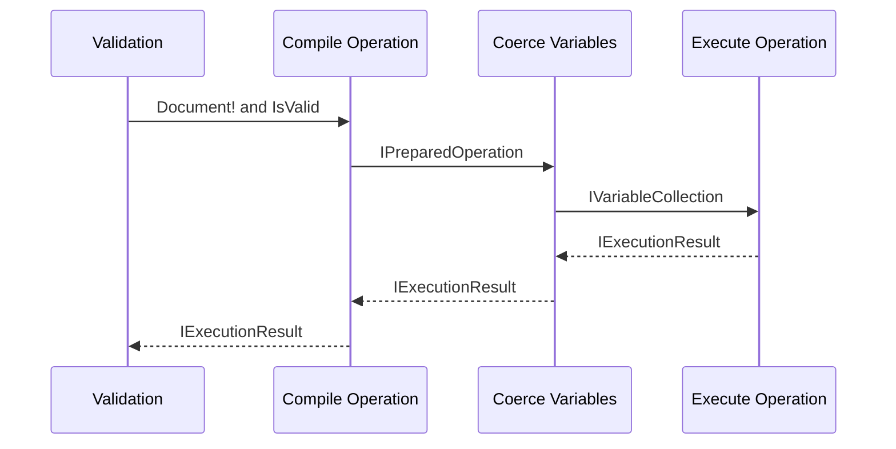
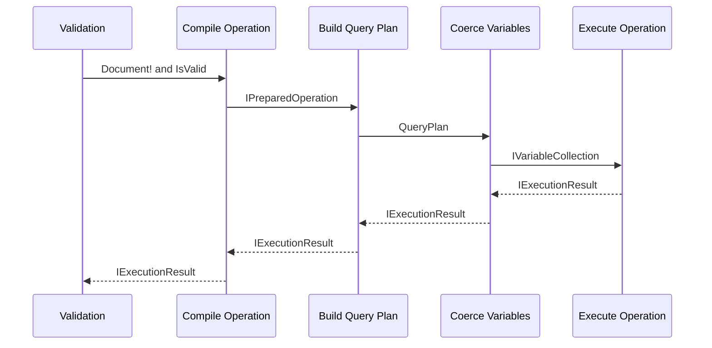
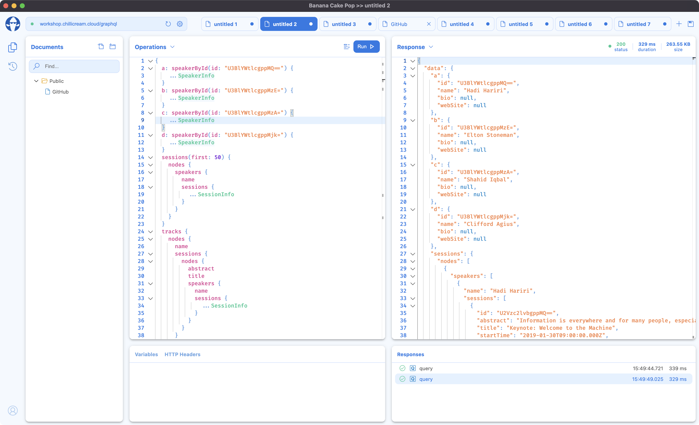

Today we are releasing Hot Chocolate 12, which brings many new features and refinements to the platform. The main focus for this release was to put a new execution engine in place that will allow us to build a more efficient schema federation with the next version. We are constantly iterating on the execution engine to make it more efficient and allow for new use-cases. Many implementations for GraphQL federation/stitching build a specific execution engine to handle federated schemas. With Hot Chocolate, we always wanted to keep this integrated and allow for stitching part of a graph while at the same time extending types in that very same schema. This also allows us to use improvements made for schema federation in other areas like Hot Chocolate Data, which will boost features and reliability with the next release.

# Execution Engine

The execution engine is changing with every release of Hot Chocolate. With version 11, we, for instance, introduced operation compilation, which takes the executed operation out of a document and pre-compiles it so that most of the GraphQL execution algorithm can be skipped in consecutive calls.



> Note, that there are actually more components involved in the actual execution pipeline. For brevity I have shortened the pipeline to the significant parts for this post.

With Hot Chocolate 12, we now take this further by introducing a query plan; essentially, the execution engine traverses a compiled operation tree to create a query plan from it. The query plan can take into account how a resolver is executed. For instance, if a resolver uses services that can only be used by a single thread and thus need synchronization.



Moreover, the execution engine can now inspect if it can pull up data fetching logic and inject a completed result into a resolver pipeline and, by doing this, optimize data fetching. Doing this sounds kind of like DataLoader since we are tackling batching with this in some way. But actually, it makes these implications visible to the executor. Query plans allow the executor to inspect these things before running a query, thus improving execution behavior.

Further, the execution engine now differentiates between pure and async resolvers. Pure resolvers are synchronous and only need what is available in their parent resolver context. Such resolvers can now be inlined by the execution, allowing us to skip a lot of logic we usually would need to execute.

## Performance

We had this simple throughput test for Hot Chocolate 11, which essentially executes a simple query to fetch books and authors. Hot Chocolate 11 achieved 19983 requests a second on our test hardware. With the new execution engine, we clock in 33702 requests a second, which are an additional 13719 requests per second with the same hardware on a test that does not even really take advantage of all the new optimizations.

Hot Chocolate 12 executes much faster but also saves on the memory. In many cases, the execution now needs only 1/3 of the memory Hot Chocolate 11 needed.

| Method                                            |      Median |     Gen 0 |    Gen 1 | Gen 2 | Allocated |
| ------------------------------------------------- | ----------: | --------: | -------: | ----: | --------: |
| Introspection 11                                  |    922.4 μs |   26.3672 |   0.9766 |     - |    275 KB |
| Introspection 12                                  |    333.6 μs |    7.8125 |        - |     - |     85 KB |
| Introspection 5 parallel requests 11              |  4,839.8 μs |  132.8125 |   7.8125 |     - |   1377 KB |
| Introspection 5 parallel requests 12              |  1,658.6 μs |   41.0156 |        - |     - |    423 KB |
| Large query with data fetch 11                    | 19,322.2 μs |  312.5000 | 156.2500 |     - |   3245 KB |
| Large query with data fetch 12                    | 15,461.0 μs |  187.5000 |  93.7500 |     - |   1923 KB |
| Large query with data fetch 5 parallel request 11 | 38,035.6 μs | 1571.4286 | 785.7143 |     - |  16395 KB |
| Large query with data fetch 5 parallel request 12 | 26,187.5 μs |  937.5000 | 468.7500 |     - |   9613 KB |

We are also, as always, comparing against GraphQL .NET, and we have to say they gained a lot of performance. Well done! When we looked the last time at GraphQL .NET, they were performing quite poorly. We, for instance, had this benchmark that executed a very small request of three fields which took GraphQL .NET 31 kb of memory to process. We did the same tests again and with GraphQL.Server.Core 5.0.2 they were now just a little bit slower than Hot Chocolate 11.

But Hot Chocolate 12, at the same time, also gained a lot more performance.

| Method                                        |     Median | Allocated |
| --------------------------------------------- | ---------: | --------: |
| Hot Chocolate 11 Three Fields                 |   11.94 μs |      7 KB |
| Hot Chocolate 12 Three Fields                 |    9.94 μs |      3 KB |
| GraphQL .NET 4.3.1 Three Fields               |   46.36 μs |     31 KB |
| GraphQL .NET 5.0.2 Three Fields               |   22.28 μs |      8 KB |
| Hot Chocolate 11 Small Query with Fragments   |   43.32 μs |     14 KB |
| Hot Chocolate 12 Small Query with Fragments   |   21.68 μs |      7 KB |
| GraphQL .NET 4.3.1 Small Query with Fragments |  138.56 μs |    135 KB |
| GraphQL .NET 5.0.2 Small Query with Fragments |   65.83 μs |     19 KB |
| Hot Chocolate 11 Introspection                |  750.51 μs |    392 KB |
| Hot Chocolate 12 Introspection                |  262.51 μs |     67 KB |
| GraphQL .NET 4.3.1 Introspection              | 2277.24 μs |   2267 KB |
| GraphQL .NET 5.0.2 Introspection              |  676.72 μs |    169 KB |

For the introspection, which produces a large result, GraphQL .NET needs 2.5 times more memory than Hot Chocolate 12. Even if we look at the small query benchmark with just three fields, GraphQL .NET needs 2.6 times more memory. The same goes for execution speed. The new execution engine is 2.2 times faster than GraphQL .NET in the test to query three fields while finishing 2.6 times faster when running an introspection query.

But to be honest, we did not use all the nice new query plan features that we have built-in with Hot Chocolate 12 in these tests. That is why we have started on a more comprehensive set of tests that use an actual database and allow Hot Chocolate to use projections or even query plan batching.

From Hot Chocolate 13 on, we will use our new performance test base we are working on. This new test base will show more aspects of usage. We also will start including even more GraphQL frameworks like juniper, async-graphql, or graphql-java.

Let's have a look at the throughput tests which we run to see the GraphQL engine overhead. The benchmark executes a simple book/author GraphQL query against in-memory data. We fire those requests as HTTP Post requests against the GraphQL servers in our test suite. We start with five users for 20 seconds, then ten users for 20 seconds, and up to 30 users for 20 seconds. We do this in a couple of rounds and let each of these benchmarks run on a freshly rebooted system. We are looking at automating this with k6s, and my colleague Jose will help us with that.

| Method                                     | Requests per Sec. |
| ------------------------------------------ | ----------------: |
| Hot Chocolate 12                           |             33702 |
| Hot Chocolate 11                           |             19983 |
| benzene-http (graphyne)                    |             17691 |
| mercurius+graphql-jit                      |             15185 |
| apollo-server-koa+graphql-jit+type-graphql |              4197 |
| express-graphql                            |              3455 |
| apollo-schema+async                        |              3403 |
| go-graphql                                 |              2041 |

With Hot Chocolate 13, our goal is to hit 40000 requests per second on the throughput tests, and we are hopeful that we can achieve this with some refinements in the execution engine. As we advance, we will start investing in other areas like startup performance as well.

# Entity Framework

I talked about many improvements in the execution engine that we will only unlock with Hot Chocolate 13. Still, we also have some practical use for the new execution engine features with Hot Chocolate 12. Specifically for APIs that use Entity Framework. In general, I always recommend letting the execution engine roam free and parallelize as needed. With Entity Framework, this can be achieved with DBContext pooling. But in some cases, this is not what people want or need for their specific use-case.

With Hot Chocolate 12, you can now mark a resolver as serial and, by doing this, tell the execution engine that it needs to synchronize a resolver. This is required when using a single DBContext instance per request so that it is ensured that only one thread accesses a given DBContext at the same time.

You can mark a single resolver as serial or mark all async resolvers as serial by default.

In the annotation-based approach, we need to annotate our resolver with the `SerialAttribute` to ensure that the execution engine is not executing these resolvers in parallel.

```csharp
[Serial]
public async Task<Person> GetPersonByIdAsync([Service] MyDbContext context)
{
    // omitted for brevity
}
```

Moreover, as mentioned, we can mark all async resolvers as serial by default.

```csharp
services
    .AddGraphQLServer()
    .ModifyOptions(o => o.DefaultResolverStrategy = ExecutionStrategy.Serial)
```

In this case, we still can opt out of the serial execution strategy by using the `ParallelAttribute` on our resolvers.

Serial executable resolvers will be put into a sequence shape of the query plan, which guarantees that they are executed one after the other. You can inspect the query plan by providing the `graphql-query-plan` header with a value of `1`.

We will get the following execution plan if we head over to <https://workshop.chillicream.com> and run the following query with the query plan header.

```graphql
{
  a: sessions {
    nodes {
      title
    }
  }

  b: sessions {
    nodes {
      title
    }
  }
}
```

```json
{
  "extensions": {
    "queryPlan": {
      "flow": {
        "type": "Operation",
        "root": {
          "type": "Resolver",
          "strategy": "Parallel",
          "selections": [
            {
              "id": 0,
              "field": "Query.sessions",
              "responseName": "a"
            },
            {
              "id": 1,
              "field": "Query.sessions",
              "responseName": "b"
            }
          ]
        }
      },
      "selections": "{\n  ... on Query {\n    a: sessions @__execute(id: 0, kind: DEFAULT, type: COMPOSITE) {\n      ... on SessionsConnection {\n        nodes @__execute(id: 4, kind: PURE, type: COMPOSITE_LIST) {\n          ... on Session {\n            title @__execute(id: 5, kind: PURE, type: LEAF)\n          }\n        }\n      }\n    }\n    b: sessions @__execute(id: 1, kind: DEFAULT, type: COMPOSITE) {\n      ... on SessionsConnection {\n        nodes @__execute(id: 2, kind: PURE, type: COMPOSITE_LIST) {\n          ... on Session {\n            title @__execute(id: 3, kind: PURE, type: LEAF)\n          }\n        }\n      }\n    }\n  }\n}"
    }
  }
}
```

Adding this header to your request will add a property to the response with the query plan and the internally compiled operation. We can see that the query plan only has two fields in it; these are the async fields that fetch data, all the other fields are folded into their parent threads. We also can see that these two resolvers can be executed in parallel. Depending on how many components are involved, these query plans can be much bigger end expose the dependencies between the data fetching components.

If we did the same for serial resolvers, we would get a sequence shape that would execute resolver tasks one after the other.

BTW, allowing such serial execution flows in Hot Chocolate 12 was one of the most requested features, and the team is quite happy to provide this now to our community.

# Resolver Compiler

One of the things many people love about Hot Chocolate is how we infer the GraphQL schema from your C# types and how you can inject various things into your resolver.

```csharp
public async Task<Person> GetPersonByIdAsync([Service] MyDbContext context)
{
    // omitted for brevity
}
```

For instance, let's take the above; we are injecting a service `MyDbContext` into our resolver. The resolver compiler knows what to do with this parameter because of the service attribute. These attributes can become quite tedious to annotate if you have a lot of resolvers. Further, people might want to extend the parameter injection or introduce their own parameter injection logic. With Hot Chocolate 12, we open up the resolver compiler and allow you to configure it straightforwardly.

Let's start with a basic example of `MyDbContext` as a well-known service that no longer needs an attribute.

Essentially we want to be able to write the following code without any attributes:

```csharp
public async Task<Person> GetPersonByIdAsync(MyDbContext context)
{
    // omitted for brevity
}
```

To tell the resolver compiler that we have a well-known service, we need to do the following:

```csharp
.AddGraphQLServer()
    .AddQueryType<Query>()
    .ConfigureResolverCompiler(r =>
    {
        r.AddService<Service>();
    });
```

Specifically for the service case, we simplified things with the `AddService` extension method. With this simple configuration, we can make our resolver code cleaner and better to read.

But what if we wanted to inject a specific thing from the request state. Essentially we want to grab something from the `ContextData` map and make it nicely accessible through parameter injection.

```csharp
public async Task<Person> GetPersonByIdAsync(MyDbContext context, CustomState state)
{
    // omitted for brevity
}
```

For the above resolver, we want to pull `CustomState` from the request state.

```csharp
.AddGraphQLServer()
    .AddQueryType<Query>()
    .ConfigureResolverCompiler(r =>
    {
        r.AddService<Service>();
        r.AddParameter<CustomState>(resolverContext => (CustomState)resolverContext.ContextData["myCustomState"]!);
    });
```

I know the expression I wrote up there is not safe; it is just an example of how you can access nearly anything from the resolver context and make it injectable into your resolver. The expression will be compiled into the resolver.

We could go further and write a selector for your resolver compiler extension that inspects the parameter. These inspections are only run at startup, which ensures that there is no reflection overhead at runtime.

```csharp
.AddGraphQLServer()
    .AddQueryType<Query>()
    .ConfigureResolverCompiler(r =>
    {
        r.AddService<Service>();
        r.AddParameter<CustomState>(
            resolverContext => (CustomState)resolverContext.ContextData["myCustomState"]!,
            p => p.Name == "state");
    });
```

However, we are not done with this yet. We are already thinking about giving you even more freedom to extend the resolver compiler by injecting proper logic that runs in the resolver pipeline. We essentially want to support a kind of conditional middleware, where we will append middleware depending on what you inject into your resolver. We have not fully solved all the issues around this yet and have moved this to Hot Chocolate 13.

# Dynamic Schemas

While static schemas created with C# or GraphQL SDL are very simple to build with Hot Chocolate, it was pretty challenging to build dynamic schemas based on JSON files or database tables. It was achievable, like in the case of schema stitching, but it was pretty tricky, and you needed to know quite a lot about the internals of the type system. With Hot Chocolate 12, we are opening up the type system quite a lot to allow you to create types in an unsafe way.

With unsafe, I mean that we allow you to create the types by bypassing validation logic intended for the standard users of Hot Chocolate and using the type system definition objects to create types and type extensions.

I will do a follow-up post that goes deeper into the type system and explains the inner workings. For this post, let me show you a simple example of how you can now create dynamic types. First, let me introduce a new component here called type module.

```csharp
public interface ITypeModule
{
    event EventHandler<EventArgs> TypesChanged;

    ValueTask<IReadOnlyCollection<ITypeSystemMember>> CreateTypesAsync(
        IDescriptorContext context,
        CancellationToken cancellationToken);
}
```

Type modules provide types for specific components or data sources; for instance, the new schema stitching engine will use type modules to provide types to the schema.

A type module consists of an event `TypesChanged` and a method `CreateTypesAsync`. `CreateTypesAsync` is called by the schema building process to create types for a new schema instance. Whenever something changes for a type module, like the underlying database structure, the `TypesChanged` event can be triggered to tell Hot Chocolate that it needs to phase out the old schema and phase in a new schema with the changed types of this module. The Hot Chocolate server will ensure that running requests are still completed against the old schema while new requests are routed to the new schema instance that contains the updated types.

Essentially, `ITypeModule` will remove the complexity of providing a dynamic schema with hot-reload functionality.

But we not only introduced this new interface to provide types, but we also opened up our lower-level configuration API, which now lets you create types straightforwardly from a Json file or what have you.

```csharp
public async ValueTask<IReadOnlyCollection<ITypeSystemMember>> CreateTypesAsync(
    IDescriptorContext context,
    CancellationToken cancellationToken)
{
    var types = new List<ITypeSystemMember>();

    await using var file = File.OpenRead(_file);
    using var json = await JsonDocument.ParseAsync(file, cancellationToken: cancellationToken);

    foreach (var type in json.RootElement.EnumerateArray())
    {
        var typeDefinition = new ObjectTypeDefinition(type.GetProperty("name").GetString()!);

        foreach (var field in type.GetProperty("fields").EnumerateArray())
        {
            typeDefinition.Fields.Add(
                new ObjectFieldDefinition(
                    field.GetString()!,
                    type: TypeReference.Parse("String!"),
                    pureResolver: ctx => "foo"));
        }

        types.Add(
            type.GetProperty("extension").GetBoolean()
                ? ObjectTypeExtension.CreateUnsafe(typeDefinition)
                : ObjectType.CreateUnsafe(typeDefinition));
    }

    return types;
}
```

A complete example of a dynamic schema with hot-reload can be found [here](https://github.com/ChilliCream/graphql-platform-examples/tree/master/misc/TypeModules), and I will also follow up this post with a detailed blog post on dynamic schemas that goes more into the details.

## Type Interceptors

We also added further improvements to the type initialization to allow type interceptors to register new types. Also, on this end, you can now hook into the type initialization to analyze the types registered by a user and then create further types based on the initial schema. Where type modules generate types based on an external component or data source, type interceptors allow you to generate types based on types. This can be useful if you, for instance, create a filter API that is based on the output types provided by a user.

# Schema-First

Another area where we have invested for Hot Chocolate 12 was schema-first. At its very beginning, Hot Chocolate was a schema-first library that developed more and more into a code-first / annotation-based library. If we look back at Hot Chocolate 11, then it almost looked like schema-first was an afterthought. With Hot Chocolate 12, we are bringing schema-first up to par with code-first and the annotation-based approach. This means that we also did some API refactoring and kicked out the old binding APIs. We did these breaking changes to align APIs of the various approaches.

If we now create a schema-first server, it looks very similar to code-first or annotation-based servers from a configuration standpoint.

```csharp
using Demo.Data;
using Demo.Resolvers;

var builder = WebApplication.CreateBuilder(args);

builder.Services
    .AddSingleton<PersonRepository>()
    .AddGraphQLServer()
    .AddDocumentFromFile("./Schema.graphql")
    .AddResolver<Query>();

var app = builder.Build();

app.MapGraphQL();

app.Run();
```

There are now two things in schema first to distinguish, resolver types and runtime types. Runtime types are the representation of a GraphQL type in .NET.

```sdl
type Person {
  name: String!
}
```

```csharp
public record Person(int Id, string Name);
```

The .NET representation, in this case, is a record, but it could also be a map, a JSON structure, or something else. In most cases, we automatically infer the correct binding between runtime type and GraphQL type, but we can now use the same API as with the other approaches if you need to bind the type explicitly.

```csharp
builder.Services
    .AddSingleton<PersonRepository>()
    .AddGraphQLServer()
    .AddDocumentFromFile("./Schema.graphql")
    .AddResolver<Query>()
    .BindRuntimeType<Person>();
```

Or, if the name does not match the .NET type name, you can pass that in as well.

```csharp
builder.Services
    .AddSingleton<PersonRepository>()
    .AddGraphQLServer()
    .AddDocumentFromFile("./Schema.graphql")
    .AddResolver<Query>()
    .BindRuntimeType<Person>("Person");
```

Resolver types are .NET classes that provide resolvers methods, so essentially we give a class that has a couple of methods handling data fetching for our GraphQL types. In this instance, we have a type `Query` that provides a method to fetch persons.

```csharp
public class Query
{
    public IEnumerable<Person> GetPersons([Service] PersonRepository repository)
        => repository.GetPersons();
}
```

In our example, the resolver type name matches the GraphQL type, so bindings are automatically inferred. If you have multiple resolver classes per GraphQL type, you can use an overload that passes in the GraphQL type name.

```csharp
.AddResolver<QueryResolvers>("Query")
```

Naturally, we still have the delegate variants of the `AddResolver` configuration methods to bind a delegate to a GraphQL field.

```csharp
.AddResolver("Query", "sayHello", ctx => "hello")
```

## Middleware and Attributes

One more thing we did was fully integrate our attributes like `UsePaging` with schema first resolvers.

Meaning you can write the following schema now:

```sdl
type Query {
  persons: [Person!]
}

type Person {
  name: String!
}
```

Then on your `Query` resolver for `persons`, annotate it with the `UsePaging` attribute. This will cause the schema initialization to rewrite the schema.

```csharp
public class Query
{
    [UsePaging]
    public IEnumerable<Person> GetPersons([Service] PersonRepository repository)
        => repository.GetPersons();
}
```

The output schema on the server would now look like the following:

```sdl
type Query {
  persons(
    """
    Returns the first _n_ elements from the list.
    """
    first: Int

    """
    Returns the elements in the list that come after the specified cursor.
    """
    after: String

    """
    Returns the last _n_ elements from the list.
    """
    last: Int

    """
    Returns the elements in the list that come before the specified cursor.
    """
    before: String
  ): PersonsConnection
}

type Person {
  name: String!
}

"""
A connection to a list of items.
"""
type PersonsConnection {
  """
  Information to aid in pagination.
  """
  pageInfo: PageInfo!

  """
  A list of edges.
  """
  edges: [PersonsEdge!]

  """
  A flattened list of the nodes.
  """
  nodes: [Person!]
}

"""
Information about pagination in a connection.
"""
type PageInfo {
  """
  Indicates whether more edges exist following the set defined by the client's arguments.
  """
  hasNextPage: Boolean!

  """
  Indicates whether more edges exist prior to the set defined by the client's arguments.
  """
  hasPreviousPage: Boolean!

  """
  When paginating backwards, the cursor to continue.
  """
  startCursor: String

  """
  When paginating forwards, the cursor to continue.
  """
  endCursor: String
}

"""
An edge in a connection.
"""
type PersonsEdge {
  """
  A cursor for use in pagination.
  """
  cursor: String!

  """
  The item at the end of the edge.
  """
  node: Person!
}
```

The paging attribute rewrote the schema and wrapped a middleware around the field resolver to support pagination. Rest assured, you can still fully control your schema and specify all of those types by yourself, but you also can let Hot Chocolate generate all those tedious types like connection types, edge types or filters types, etc.

In the future, we are also thinking of letting descriptor attributes become directives that would allow you to annotate directly in the schema file like the following:

```sdl
type Query {
  persons: [Person!] @paging
}

type Person {
  name: String!
}
```

But for the time being, schema-first got a big update with this release, and we will continue to make it better with every new release.

The schema-first demo can be found [here](https://github.com/ChilliCream/graphql-platform-examples/tree/master/misc/SchemaFirst).

# DataLoader

Another component that got a massive overhaul is DataLoader. It was also one reason the release candidate phase stretched so far since we had lots of issues with the changes in user projects. First, as we already said we would do, we moved all the DataLoader classes into the `GreenDonut` library, meaning that the various DataLoader no longer reside in `HotChocolate.Types`. Apart from that, we have refactored a lot to allow DataLoader to pool more of its objects and use a unified cache for entities. This unified cache allows better control of how much memory can be allocated by a single request and lets us do cross DataLoader updates. Essentially, one DataLoader can now fill the cache for another DataLoader. Cross DataLoader updates often happen when you have entities that can be looked up by multiple keys, like a user that can be fetched by its name or by its id.

To take advantage of the new cache, pass down the DataLoader options to inject them from the DI.

```csharp
public class CustomBatchDataLoader : BatchDataLoader<string, string>
{
    public CustomBatchDataLoader(IBatchScheduler batchScheduler, DataLoaderOptions options)
        : base(batchScheduler, options)
    {
    }

    protected override Task<IReadOnlyDictionary<string, string>> LoadBatchAsync(
        IReadOnlyList<string> keys,
        CancellationToken cancellationToken)
}
```

With DataLoader now, always pass down the options and the batch scheduler so the DI can inject the new unified cache. If you do not pass down the options object, the DataLoader will use a cache per instance like before.

The DataLoader caches with Hot Chocolate 12 are also pooled, meaning that the cache object is cleaned, preserved, and reused, which will save memory. Further, we have now introduced `DataLoaderDiagnosticEventListener`, which allows you to monitor DataLoader execution.

All diagnostic listeners cannot be registered with the schema.

```csharp
services.AddGraphQLServer()
    .AddDiagnosticEventListener<MyDataLoaderEventListener>()
    ...
```

# Stream and Defer

With Hot Chocolate 11, we introduced the `@defer` directive, which allows you to defer parts of your query to get the most important data first, and de-prioritize the execution of more expensive parts of your query.

With Hot Chocolate 12, we are now introducing the `@stream` directive, which allows you to take advantage of async enumerators and define how much data of a stream you want to get immediately and what shall be deferred to a later point in time.

```graphql
{
  persons @stream(initialCount: 2) {
    name
  }
}
```

`@stream` works with any list in Hot Chocolate, but it is only efficient and gives you all the benefits of using stream if your resolver returns an `IAsyncEnumerable<T>`. Our internal paging middleware at the moment does not work with `IAsyncEnumerable<T>`, which means you can stream the results. However, you still will have the full execution impact on the initial piece of the query. We will rework pagination to use `IAsyncEnumerable<T>` when slicing the data and executing the query with Hot Chocolate 13.

Stream and defer both work with Banana Cake Pop if your browser is chrome based. We already have an update in the works to make it work with Safari. We will issue this BCP update with Hot Chocolate 12.1.

# ASP.NET Core improvements

Hot Chocolate neatly integrates with ASP.NET core, and with a simple `MapGraphQL`, you get a GraphQL over HTTP spec-compliant endpoint. This simple `MapGraphQL` is great when you get started with Hot Chocolate but limiting when you go to production and have different authorization requirements for various aspects of the GraphQL transport layer.

Hot Chocolate 12 still keeps its `MapGraphQL` around but now also provides a specific transport method.

| Method              | Description.                                                                                                              |
| ------------------- | ------------------------------------------------------------------------------------------------------------------------- |
| MapGraphQL          | MapGraphQL is our default way of adding GraphQL transport and adds just everything on one route.                          |
| MapGraphQLHttp      | MapGraphQLHttp will add support for GraphQL HTTP Post, GraphQL HTTP GET, and support for MultiPart and batching requests. |
| MapGraphQLWebSocket | MapGraphQLWebSocket will add support for GraphQL over web-sockets.                                                        |
| MapGraphQLSchema    | MapGraphQLSchema will add an endpoint to fetch the GraphQL SDL.                                                           |
| MapBananaCakePop    | MapBananaCakePop will add the Banana Cake Pop GraphQL IDE middleware.                                                     |

These new map methods will allow you to pass in a configuration as you can with `MapGraphQL`.

# Banana Cake Pop

After Hot Chocolate 11, we started reworking Banana Cake Pop and rethinking what we wanted to enable with our GraphQL IDE. Hot Chocolate 12 now incorporates preview 14 of the new Banana Cake Pop, and we will deliver the final version of the new Banana Cake Pop IDE with Hot Chocolate 12.1 at the end of October.

Banana Cake Pop is now again available as middleware and application for Windows, macOS, and Linux. The team is working hard to get major new features like authentication flows, document synchronization, and schema reference into BCP.



[Download](https://bananacakepop.com) the new BCP preview today and help us make this the best GraphQL IDE out there. We still have lots to do to get to that point, but people following us on slack can see the progress. We will soon have the next preview available, which will make a significant jump in functionality.

# The little things that will make your life easier

Apart from our big-ticket items, we also have invested in smaller things that will help make Hot Chocolate easier to learn and better to use.

## Cursor Paging

### Boundaries

We introduced more options for cursor paging that allow you to require paging boundaries like GitHub is doing with their public API.

```csharp
public class Query
{
    [UsePaging(RequirePagingBoundaries = true)] // will create MyNameConnection
    public IEnumerable<Person> GetPersons([Service] PersonRepository repository)
        => repository.GetPersons();
}
```

### Connections

Further, we reworked how the connection name is inferred and allow you to override defaults locally. With Hot Chocolate 12, we infer the connection name from the field instead of the element type. Since this change will break all existing schemas built with Hot Chocolate so far, we allow you to switch to the old way of inferring the connection name with the paging options.

```csharp
services.AddGraphServerQL()
    .AddQueryType<QueryType>()
    .SetPagingOptions(new PagingOptions { InferConnectionNameFromField = false });
```

The connection name, by default, is inferred from the field name; this means if you have a field `friends`, then the connection will be called `FriendsConnection` instead of the old behavior where we used the element type.

You also can override the default connection name.

```csharp
public class Query
{
    [UsePaging(ConnectionName = "MyName")] // will create MyNameConnection
    public IEnumerable<Person> GetPersons([Service] PersonRepository repository)
        => repository.GetPersons();
}
```

### Paging Provider

We also made it now easier to control which paging provider is used. For one, you can now configure the default paging provided. If you do not specify anything, we will set the queryable paging provider as the default provider.

```csharp
services.AddGraphServerQL()
    .AddQueryType<QueryType>()
    .AddCursorPagingProvider<MyCustomProvider>(defaultProvider = true);
```

Also, you can now name a provider, which gives you an easy way to point to the specific paging provider.

**Register Provider:**

```csharp
services.AddGraphServerQL()
    .AddQueryType<QueryType>()
    .AddCursorPagingProvider<MyCustomProvider>("Custom");
```

**Use Provider:**

```csharp
public class Query
{
    [UsePaging(ProviderName = "Custom")]
    public IEnumerable<Person> GetPersons([Service] PersonRepository repository)
        => repository.GetPersons();
}
```

> Since we now can easily interact with multiple providers, we removed the `UseMongoPagingAttribute`. Please have a look at our documentation regarding MongoDB.

### Control

Sometimes, you want to have everything in your own hands and just use Hot Chocolate to take the tedious work of generating types of your hands. In this case, you can implement the paging algorithm in your business logic or the resolver and return a connection instance, and we will know what to do with it.

```csharp
public class Query
{
    [UsePaging]
    public Task<Connection<Person>> GetPersons([Service] PersonRepository repository, int? first, string? after, int? last, string? before)
        => repository.GetPersonsPagedAsync(first, after, last, before);
}
```

If you are using the `HotChocolate.Data` package in combination with the connection type, you can even use our new data extensions to allow for more complex resolvers.

```csharp
public class Query
{
    [UsePaging]
    [UseProjection]
    [UseFiltering]
    [UseSorting]
    public Task<Connection<Person>> GetPersonsAsync(
        [Service] PersonRepository repository,
        IResolverContext context,
        CancellationToken cancellationToken)
        => repository.GetPersons()
              .Filter(Context)
              .Sort(context)
              .Project(context)
              .ApplyCursorPaginationAsync(context, cancellationToken);
}
```

## Relay

As always, we are investing a lot into removing complexity from creating relay schemas. Our new version adds the `nodes` field (a plural version of the `node` field), allowing clients to fetch multiple nodes in one go without rewriting the query since the `ids` can be passed in as a variable. While the `nodes` field is not part of the relay specification, it is a recommended extension.

```graphql
{
  nodes(ids: [ 1, 2 ]) {
    __typename
    ... Person {
      name
    }
    ... Cat {
      name
    }
  }
}
```

Apart from that, we have split the `EnableRelaySupport` configuration method to allow you to opt into partial concepts of the relay specification.

```csharp
services.AddGraphServerQL()
    .AddGlobalObjectIdentification()
    .AddQueryFieldToMutationPayloads();
```

The two new configuration methods are more precise, and you can now opt into the concepts you need and nothing more.

## Errors

Another area where users asked us to improve was with errors. When you want to produce a GraphQL error, you can use a `GraphQLException` or any other exception in combination with error filters.

People often choose the latter since errors may come from the business layer that already has a set of well-defined domain exceptions. The issue that many users had was that one exception could always only spawn one GraphQL error.

With HotChocolate 12, we have introduced the `AggregateError` class, which allows you to wrap multiple errors into one error object; this helps us to preserve the interface but at the same time enables you to transform a single exception or a single error into multiple errors.

**Error Filter**

```csharp
public class ErrorFilter : IErrorFilter
{
    public IError OnError(IError error)
    {
        if (error.Exception is AggregateException ex)
        {
            var errors = new List<IError>();

            foreach (Exception innerException in ex.InnerExceptions)
            {
                errors.Add(error.WithMessage(innerException.Message).WithException(innerException));
            }

            return new AggregateError(errors);
        }

        return error;
    }
}
```

**Registration**

```csharp
builder.Services
    .AddGraphQLServer()
    .AddErrorFilter<ErrorFilter>()
    ...
```

Speaking of errors, we have put a lot of effort into providing better errors. One of these efforts resulted in splitting the infamous error `HC0016` into multiple errors that now clearly outline the issue with invalid variable inputs. It's often these little things that save users from frustrations when searching for issues.

# Outlook

Hot Chocolate 12 is a release where we put a lot of work into the core of the server. In most cases, an upgrade from Hot Chocolate 11 to Hot Chocolate 12 should be just updating the package.

With Hot Chocolate 13, we will now focus on our stitching and schema federation engine as the main topic. Hot Chocolate 12 introduced many new concepts that allow us to completely rethink schema stitching, e.g., with type modules and query plans.

Beginning this week, we will start working on the new version, which we hope to finish at the end of November.

But there are also other topics Hot Chocolate 13 will tackle like support for AzureFunctions, more transport protocols like graphql-ws and Azure Web PubSub and many more things.

If you want to have a look at the high-level roadmap, you can check it out [here](https://github.com/ChilliCream/graphql-platform/projects/28).

There are also dot releases planned for Hot Chocolate 12, with 12.1 already scheduled for the end of October.

We have tons of updates in the pipeline, with the new Banana Cake Pop release waiting already around the corner.

So stay tuned :)
