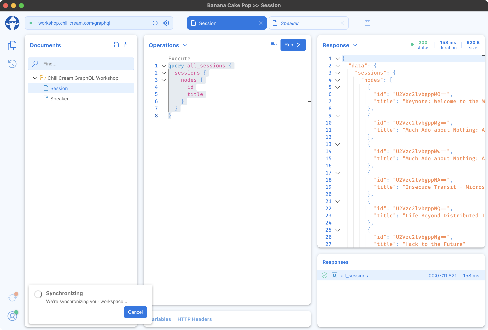
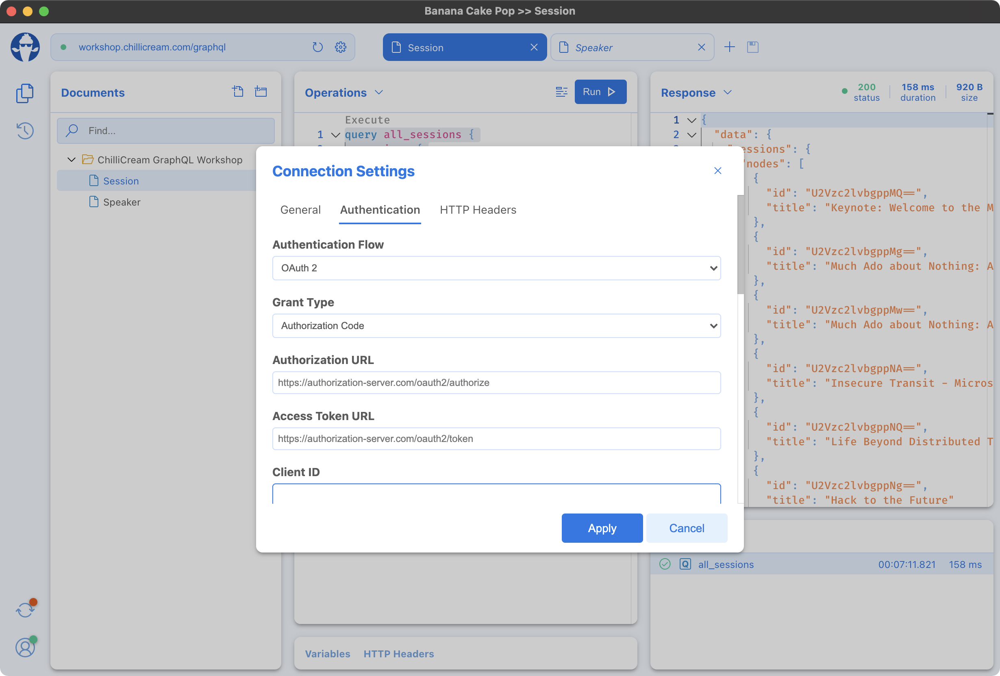
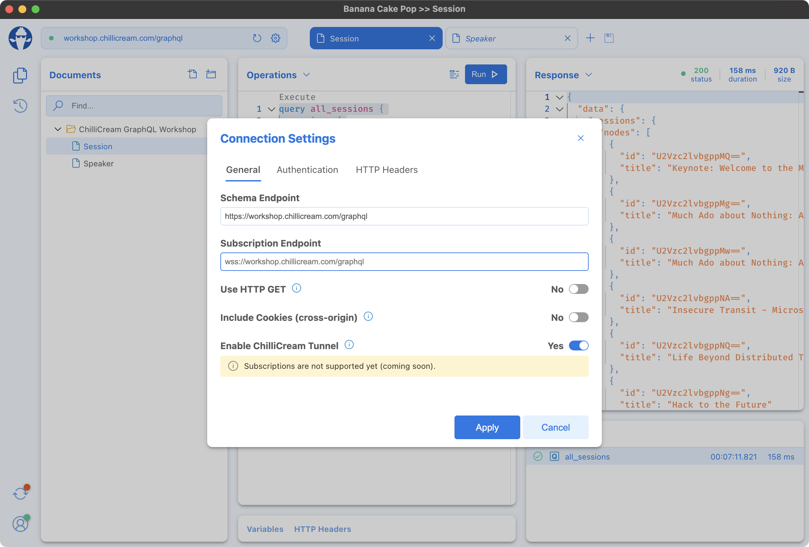
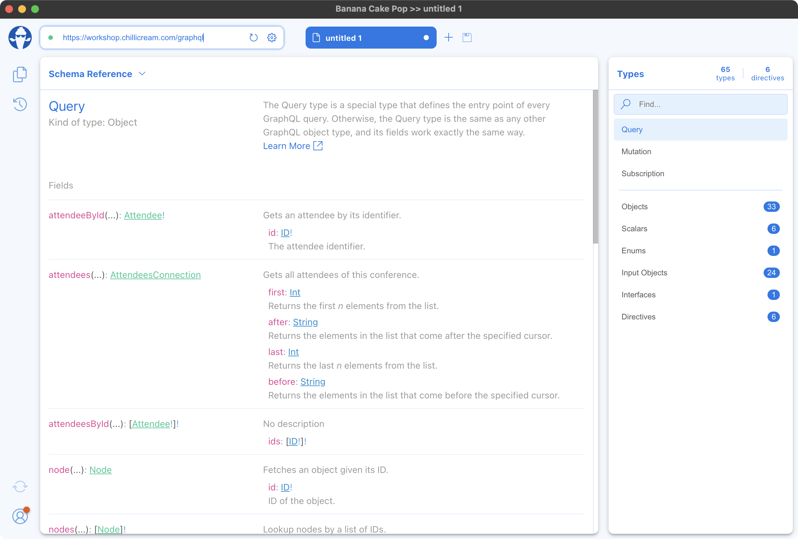

Today we’re introducing a new version of Banana Cake Pop packed with cool features like Personal Workspace, Authorization Flows, the ChilliCream Tunnel, and many more. Moreover, we’re excited to announce that we brought Banana Cake Pop into the cloud. So you don’t even need to install the app anymore if you’re, for example, on a device that does not belong to you.

# Personal Workspace

Synchronize your GraphQL documents with any of your devices, whether you’re using the cloud, app, or the HotChocolate middleware version of Banana Cake Pop. Your GraphQL documents stay with you where ever you are :-) And the best part, Personal Workspace is free! You just need to sign in.

# Authorization Flows

We brought three commonly used authorization flows to Banana Cake Pop:

- OAuth 2
- Bearer
- Basic

More authorization flows are expected to be added soon.

# ChilliCream Tunnel

When working with various GraphQL APIs, we’ve often been confronted with CORS issues. Those issues belong now to the past thanks to the latest and greatest Banana Cake Pop. With the brand new ChilliCream Tunnel, you can bypass CORS issues by enabling it on a per-document basis. The ChilliCream Tunnel will then relay all your graphql traffic through a proxy.

# No Login Required

Would you like to test a GraphQL operation or explore a GraphQL schema? That’s cool! You can do that without the need to create an account. Just go to [https://eat.bananacakepop.com](https://eat.bananacakepop.com) and do whatever you need to do. But if you sign up, we offer you even more features like document synchronization between your devices or the ChilliCream Tunnel, which helps you bypass CORS issues. You decide how far you wanna go ;-)

# Apple Silicon

As of preview 18, we’re introducing Apple Silicon (M1) support for Banana Cake Pop. You can download the newest version [here](https://bananacakepop.com).

# Next Steps

In the upcoming versions, we’re mainly focusing on reducing paper cuts to improve the overall experience in Banana Cake Pop. Furthermore, we will introduce more features to Banana Cake Pop. To name just a few:

- Operation Builder
- Team Workspaces
- Environments
- Different views for the Schema Reference
- Support for the new graphql-ws protocol
- GraphQL File Upload

# Let us know what you think

Help us make Banana Cake Pop the best GraphQL IDE ever by sharing your thought with us. The best way of sharing your valuable feedback with us is on [Slack](http://slack.chillicream.com/), where we have a dedicated channel for Banana Cake Pop: **#banana-cake-pop**. We’re always happy to have a chat with you.
