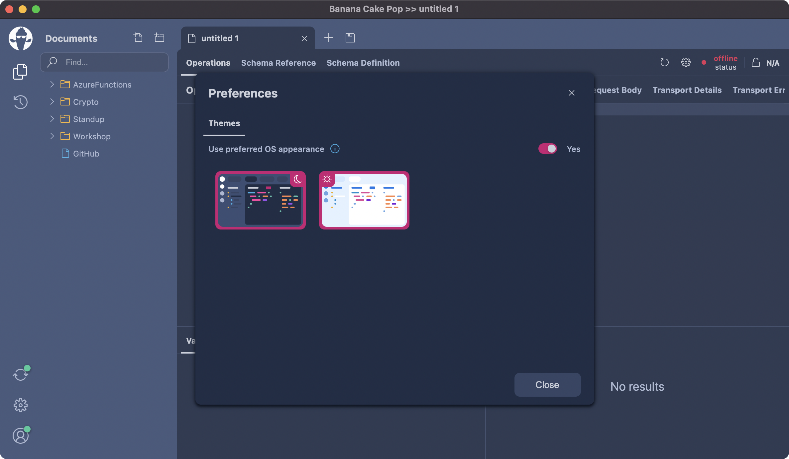
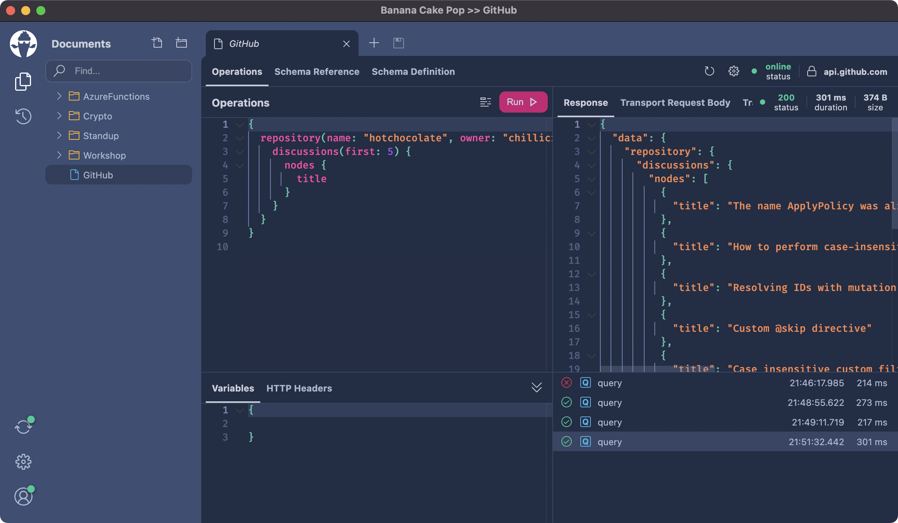
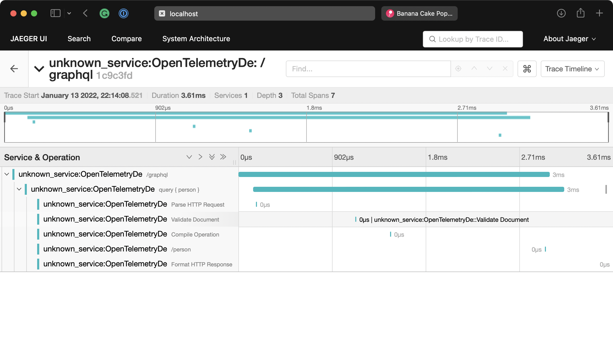

Today we have released Hot Chocolate 12.5, and this release is packed with new features. We put a focus on adding some early spec proposals into this release. We also have completely overhauled our GraphQL IDE Banana Cake Pop to include feedback from our community. Lastly, we picked up an issue created by Simon to support OpenTelemetry.

# Banana Cake Pop

Let us start with the most visible change to Hot Chocolate. With Hot Chocolate 12.5, we have integrated Banana Cake Pop iteration 22, which introduces themes support. One of the top requests for BCP by users was a Dark mode. With the new version, you can now switch between our light and our dark theme. We will add more themes with one of the subsequent iterations.



We put another focus on discoverability. Many people getting into BCP had difficulty finding the schema explorer or other details regarding their operation document. With the new version, the IDE is much more organized and exposes clearly areas you can dig into.



The new Banana Cake Pop version is now available online at <https://eat.bananacakepop.com>, as an application that you can download at <https://bananacakepop.com> or as a middleware in the new Hot Chocolate 12.5.

# Open Telemetry

Hot Chocolate for a long time provides instrumentation events that can be used to add your logging solution. By doing this, we did not bind Hot Chocolate to a specific logging/tracing solution or a specific use-case.

But it also meant that almost everyone had to come up with their own solution to instrument Hot Chocolate. With Hot Chocolate 12.5, we have added the `HotChocolate.Diagnostics` package, which uses the new `ActivitySource` API.

To add OpenTelemetry to your GraphQL server, first add the activity instrumentation to your schema.

```csharp
builder.Services
    .AddGraphQLServer()
    .AddQueryType<Query>()
    .AddInstrumentation();
```

Next, we need to configure OpenTelemetry for our service. To quickly inspect our traces, we will use a Jaeger exported.

```csharp
builder.Services.AddOpenTelemetryTracing(
    b =>
    {
        b.AddHttpClientInstrumentation();
        b.AddAspNetCoreInstrumentation();
        b.AddHotChocolateInstrumentation();
        b.AddJaegerExporter();
    });

builder.Logging.AddOpenTelemetry(
    b =>
    {
        b.IncludeFormattedMessage = true;
        b.IncludeScopes = true;
        b.ParseStateValues = true;
    });
```

With all this in place, we can execute requests against our demo server and inspect the traces with the Jaeger UI.



The complete example can be found [here](https://github.com/ChilliCream/graphql-platform-examples/tree/master/misc/OpenTelemetry).

Docs can be found [here](https://chillicream.com/docs/hotchocolate/server/instrumentation/#opentelemetry).

# `OneOf` Input Objects

One of the most asked-for features in GraphQL is input unions. The GraphQL working group has been discussing this feature for a long time, and we have explored multiple roads to achieve this. The most likely candidate has become the _`OneOf` Input Object_ representing a structural union. A structural union means that _`OneOf` Input Object_ is a special kind of input object where each field represents one choice. The _`OneOf` Input Object_ will only allow one field to be set, and the value can not be null. The type system enforces the rules for `OneOf` Input Objects_.

We support _`OneOf` Input Objects_ in all three schema-building approaches (annotation-based, code-first, and schema-first.

In order to make an input object a _`OneOf` Input Object_ you simply need to annotate it with the `@oneOf` directive.

**schema-first**

```sdl
input PetInput @oneOf {
  cat: CatInput
  dog: DogInput
}
```

**code-first**

```csharp
public class PetInputType : InputObjectType<PetInput>
{
    protected override void Configure(
        IInputObjectTypeDescriptor<PetInput> descriptor)
    {
        descriptor.OneOf();
    }
}

public class PetInput
{
    public Dog? Dog { get; set; }

    public Cat? Cat { get; set; }
}
```

**annotation-based**

```csharp
[OneOf]
public class PetInput
{
    public Dog? Dog { get; set; }

    public Cat? Cat { get; set; }
}
```

Next, you need to enable the RFC feature on the schema.

```csharp
builder.Services
    .AddGraphQLServer()
    ...
    .ModifyOptions(o => o.EnableOneOf = true);
```

The complete example can be found [here](https://github.com/ChilliCream/graphql-platform-examples/tree/master/misc/OneOf).

Docs can be found [here](https://chillicream.com/docs/hotchocolate/defining-a-schema/input-object-types/#oneof-input-objects).

The current GraphQL spec RFC can be found [here](https://github.com/graphql/graphql-spec/pull/825).

# Client-Controlled Nullability

Client-Controlled nullability gives more power to the consumer of a GraphQL API. It allows us to specify error boundaries in GraphQL by defining if a field shall be nullable or required in our GraphQL request. To give this power to the user, the RFC introduces new query syntax to let the user override type nullability on fields and specify where error boundaries are in the GraphQL request.

Let us, for instance, say we have a schema like the following:

```graphql
type Query {
  me: User
}

type User {
  name: String!
  bio: String!
  friends: [User!]
}
```

We have a user object with a name, a bio, and friends in our schema. Let's now consider we have a simple query where we fetch the currently signed-in user and that user's friends.

```graphql
{
  me {
    name
    bio
    friends {
      name
      bio
    }
  }
}
```

In our schema, the field `bio` is a non-null field, and whenever this field would become null due to a processing error or invalid data, the GraphQL non-null propagation rule would erase all friends.

```json
{
  "me": {
    "name": "Michael Staib",
    "bio": "Author of Hot Chocolate ...",
    "friends": null
  }
}
```

With client-controlled nullability, the API consumer can now change this behavior by overriding the field type nullability.

```graphql
{
  me {
    name
    bio
    friends {
      name
      bio?
    }
  }
}
```

We can tell the execution engine that we do not mind if this field becomes `null` by adding a question mark.

But we could also approach this differently and say if the field `bio` does not deliver any data, I do not want a partial result where `friends` becomes `null`. I instead want to have no data at all and fail the complete request.

```graphql
{
  me! {
    name
    bio
    friends! {
      name
      bio
    }
  }
}
```

So, in this case, I added the bang operator to the field `me` and the field `friends`. In GraphQL, a non-null violation will bubble up until it reaches a nullable field or until the complete result is deleted. Since we made the root non-null, the complete result, in this case, is deleted. Meaning either I get all the data I demanded or none.

We could also produce null entries in our `friends` list for users that do not provide a value for the field `bio` with the new list nullability modifier `[?]`.

```graphql
{
  me! {
    name
    bio
    friends[?] {
      name
      bio
    }
  }
}
```

At the moment, Banana Cake Pop is not updated for the new syntax yet. We will do that in the coming days. But you can write and execute the new syntax already since BCP will allow you to execute even with syntax errors. We hope to introduce an updated language server with the next iteration.

The current GraphQL spec RFC can be found [here](https://github.com/graphql/graphql-spec/pull/895).

# Conclusion

We have implemented a ton of other smaller additions and bug fixes. Hot Chocolate 12.5 pushes further ahead and allows you to opt into the newest GraphQL spec proposals and drafts. At the GraphQL working group, we are currently discussing great new additions to the GraphQL spec like fragment modularity and object identity. Together, stream/defer, `oneof`, fragment modularity, object identity, and client-controlled nullability could make GraphQL so much better and help us solve fundamental problems in interacting with our data graphs. We have invested in these new features early and are iterating on these as the spec text matures.
