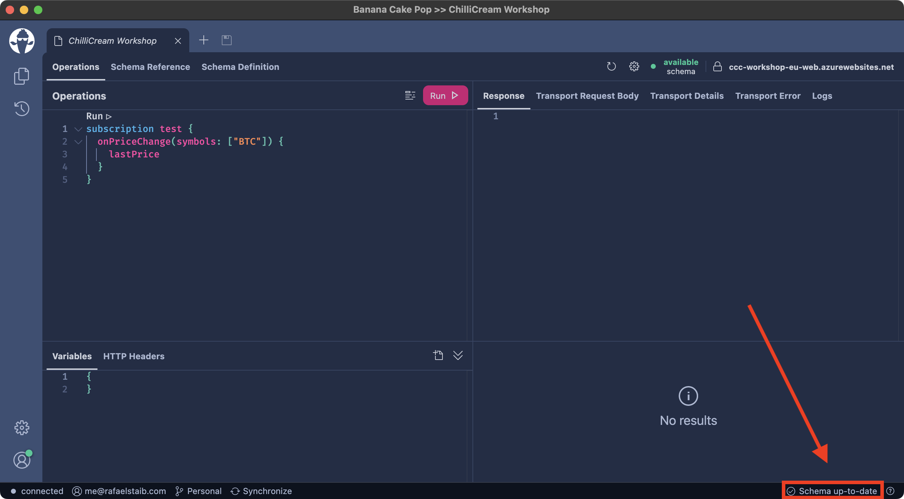

## Getting started

Everything you need to get started with **Banana Cake Pop** you'll find on [bananacakepop.com](https://bananacakepop.com)

## Subscription protocol auto-detection

Auto-detection can save you from a headache when it comes to the following questions:

- _Which subscription protocol is supported by server XYZ?_
- _Which subscription protocol prefers server XYZ?_

The new auto-detection is enabled by default. If you prefer a particular subscription protocol, you can change it in the **Connection Settings** dialog.

**Banana Cake Pop** supports the following subscription protocols.

## Workspace auto synchronization

Your local and remote workspace changes will be synchronized every 60 seconds automatically. No need for you to click the synchronize button anymore. The new synchronize button is now located in the status bar and is also an indicator, showing you whether a workspace is synchronizing.

## Status bar

The new decent status bar shows you a couple of information. For instance, is my browser connected to a network, or with what account am I signed in?

The status bar can also contain context-related information. For instance, is the schema of my current document up to date?

Furthermore, we introduced a new button in the right corner that shows the current version of **Banana Cake Pop** when clicking it.

## Hidden Tabs

We introduced a new button that appears when a tab is at least partly hidden. This button, when clicked, will show a menu with partly hidden and completely hidden tabs.

## Subscribe

To stay up to date, subscribe to our [ChilliCream YouTube Channel](https://www.youtube.com/c/ChilliCream) to get notified whenever we publish new videos.

I'm Rafael Staib, and as soon as **Banana Cake Pop 2** is released, I'll be right here to tell you what's new in **Banana Cake Pop**!
