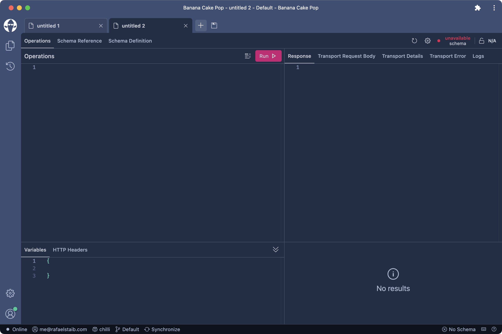

Version 3 comes with a couple of neat features, e.g. Team Workspaces, Enterprise SSO, PWA Support, NodeJS Express Middleware, and more. If you would like to download **Banana Cake Pop 3**, go to [bananacakepop.com](https://bananacakepop.com). Now let’s see what’s new in detail.

## Team Workspaces

In **Banana Cake Pop 1**, we've introduced _Personal Workspaces_ for individuals to keep documents safe across devices. _Personal Workspaces_ is a free tier feature and will stay forever free. However, this time we are introducing a new feature called _Team Workspaces_. _Team Workspaces_, as the name implies, allow teams to work together and share documents. To create _Team Workspaces_ an _Organization_ is required and can be created by anyone. _Organization_ is in preview and becomes a paid feature when the preview phase ends. We'll inform you as soon as the preview phase ends so that you can decide whether to use it.

## Javascript Middleware

We launched our first NodeJS middleware on [NPM](https://www.npmjs.com/package/@chillicream/bananacakepop-express-middleware). Check out our [recipes](https://www.npmjs.com/package/@chillicream/bananacakepop-express-middleware#recipes) for [graphql-http](https://www.npmjs.com/package/graphql-http), [graphql-yoga](https://www.npmjs.com/package/graphql-yoga), and [express-graphql](https://www.npmjs.com/package/express-graphql)!

## Enterprise Single Sign-On (SSO)

We've added Enterprise Single Sign-On (SSO) to **Banana Cake Pop**, which lets companies bring their own identity service, so that their employees can use their company logins. Please reach out to us if you're interested.

## Enterprise Services

For companies, we’re introducing **Banana Cake Pop** enterprise services, which can be deployed under their own Azure subscription. This gives companies control over their own data. Please reach out to us if you're interested.

## Insider Web Version

We brought the _Insider_ version to the web. Check it out here: [insider.bananacakepop.com](https://insider.bananacakepop.com).

## Progressive Web App (PWA)

With version 3, **Banana Cake Pop** meets the PWA requirements, which allows the web version to be installed as an application. In Chrome on macOS, it looks like this.

## Subscribe

To stay up to date, subscribe to our [ChilliCream YouTube Channel](https://www.youtube.com/c/ChilliCream) to get notified whenever we publish new videos.

I'm Rafael Staib, and as soon as **Banana Cake Pop 4** is released, I'll be right here to tell you what's new in **Banana Cake Pop**!
