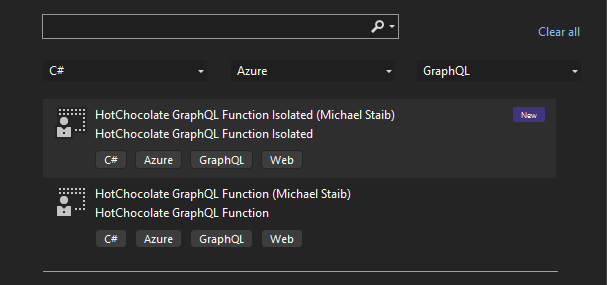

The last major release of Hot Chocolate was on the 27th of September, and since then, I have stopped writing blogs and focused more attention on YouTube. But for this occasion, it feels right to write and would have anyway resulted in a video that is too long.

# What is Version 13 about?

When we started on Hot Chocolate 13, the release focused on our Gateway, aka schema stitching. As we worked on schema stitching, it became apparent to us that we wanted to change and make it much easier than the current solutions that are out there. Distributed graphs should work with GraphQL and not force you to build them in a certain way but still yield best-in-class performance. At some point, our work branched off the original stitching project, and we created a new component called Hot Chocolate Fusion. As we were working on Hot Chocolate Fusion, we saw the time pass by and estimated that it would take considerable time more to get it done in the quality it should be. At this point, we already had so many great features and bugfixes merged into version 13 that we decided to focus development on delivering a Hot Chocolate 13 core with many improvements and ship Fusion as a dot release of 13 when it's ready.

If you asked me what the focus is of version 13, then I would say developer experience and more :)

# GraphQL over Internet

One major focus we put on Hot Chocolate 13 is transport. With Hot Chocolate 13, we are one of two servers (GraphQL-yoga and Hot Chocolate) fully supporting the new GraphQL over HTTP spec draft. The transport spec defines when to use which HTTP status code and introduces a new response content-type, `application/graphql-response+json`. The new transport spec makes proper use of the HTTP accept headers, meaning your client can now define what response content-types it understands and can handle. If your client, for instance, can only deal with `application/json` as a response content-type, then you can define that now in your request.

```curl
curl 'https://api-crypto-workshop.chillicream.com/graphql' \
  -H 'authority: api-crypto-workshop.chillicream.com' \
  -H 'accept: application/json' \
  -H 'content-type: application/json' \
  --data-raw '{"query":"{ __typename }\n","variables":{}}' \
  --compressed
```

[GraphQL over HTTP Spec](https://github.com/graphql/graphql-over-http)

If you do not want to use the new GraphQL over HTTP spec draft, then you can opt into our legacy mode, which uses `application/json` and 200 HTTP status codes.

```csharp
using HotChocolate.AspNetCore;
using HotChocolate.AspNetCore.Serialization;

var builder = WebApplication.CreateBuilder(args);

builder.Services
    .AddHttpResponseFormatter(
        new HttpResponseFormatterOptions
        {
            HttpTransportVersion = HttpTransportVersion.Legacy
        });

builder.Services
    .AddGraphQLServer()
    .AddTypes();

var app = builder.Build();
app.MapGraphQL();
app.Run();
```

> Note: After 2025-01-01T00:00:00Z, GraphQL servers are no longer required to support the legacy transport mode.

Apart from GraphQL over HTTP, we also focused on supporting even more GraphQL transport protocols. So, with Hot Chocolate 13, we now implement the GraphQL-SSE protocol, which allows you to use server-sent events for subscriptions or even queries that use defer. GraphQL-SSE, for me, has become the go-to solution for subscriptions.

But we also brought the WebSocket transport up to speed with GraphQL-WS. We now support the legacy Apollo subscription protocol and the new GraphQL-WS protocol.


[GraphQL-SSE Protocol](https://github.com/enisdenjo/graphql-sse) /
[GraphQL-WS Protocol](https://github.com/enisdenjo/graphql-ws)

## Cache-Control

We now have implemented the GraphQL cache-control feature, which allows you to specify cache-control headers for GraphQL query responses based on the entities you query.

To enable Cache-Control, you will need to install the package `HotChocolate.Caching`.

```bash
dotnet add package HotChocolate.Caching
```

Next, we will need to add the following to your GraphQL configuration. by default.

```csharp
var builder = WebApplication.CreateBuilder(args);

builder.Services
    .AddGraphQLServer()
    .AddTypes()
    .AddCacheControl()
    .UseQueryCachePipeline();

var app = builder.Build();
app.MapGraphQL();
app.Run();
```

Hot Chocolate will apply defaults to your fields which you can override on a by-field basis.

```csharp
[QueryType]
public static class Query
{
    [CacheControl(maxAge: 10_000)]
    public static Book GetBook()
        => new Book("C# in depth.", new Author("Jon Skeet"));
}
```

The GraphQL cache-control header will collect the allowed amount of time the response is cacheable and exposes this as a cache-control header which consequently can be used by CDNs or browsers to cache the result.

## Null Values

Another smaller optimization option we have introduced to Hot Chocolate is the null value erasure.

```csharp
using HotChocolate.AspNetCore.Serialization;
using HotChocolate.Execution.Serialization;

var builder = WebApplication.CreateBuilder(args);

builder.Services
    .AddHttpResponseFormatter(
        new HttpResponseFormatterOptions
        {
            Json = new JsonResultFormatterOptions
            {
                NullIgnoreCondition = JsonNullIgnoreCondition.Fields
            }
        });

builder.Services
    .AddGraphQLServer()
    .AddTypes();

var app = builder.Build();
app.MapGraphQL();
app.Run();
```

Writing now a query where we fetch a field that is null ...

```graphql
{
  book {
    title
    descriptionIsNull
  }
}
```

... will yield the following result.

```json
{
  "data": {
    "book": {
      "title": "C# in depth."
    }
  }
}
```

So, by opting into this formatter feature, we will no longer serialize null fields. Relay now supports this, and you can opt for the same thing when using it.

# Developer Experience

We developers generally like to write less code, or more precisely, to write less repetitive code. The more we can focus on building awesome APIs, the happier we are. This is one of our guiding principles when looking at features. This is why I like source generators so much: we can offload the tedious bits and let someone else write those. The other plus side is that we can still get best-in-class performance since things analyzed and generated with source generators at build time are already computed, with no overhead and unpredictability at runtime.

## Type Auto Registration

With Hot Chocolate 13, we are embracing more features driven by source generators. Let me give you an example here. The following code shows you the GraphQL configuration of a smaller project with five entities without our source generators.

```csharp
builder.Services
    .AddGraphQLServer()
    .AddQueryType()
    .AddMutationType()
    .AddSubscriptionType()
    .AddTypeExtension<AttendeeQueries>()
    .AddTypeExtension<AttendeeMutations>()
    .AddTypeExtension<AttendeeSubscriptions>()
    .AddTypeExtension<AttendeeNode>()
    .AddDataLoader<AttendeeByIdDataLoader>()
    .AddTypeExtension<SessionQueries>()
    .AddTypeExtension<SessionMutations>()
    .AddTypeExtension<SessionSubscriptions>()
    .AddTypeExtension<SessionNode>()
    .AddDataLoader<SessionByIdDataLoader>()
    .AddDataLoader<SessionBySpeakerIdDataLoader>()
    .AddTypeExtension<SpeakerQueries>()
    .AddTypeExtension<SpeakerMutations>()
    .AddTypeExtension<SpeakerNode>()
    .AddDataLoader<SpeakerByIdDataLoader>()
    .AddDataLoader<SessionBySpeakerIdDataLoader>()
    .AddTypeExtension<TrackQueries>()
    .AddTypeExtension<TrackMutations>()
    .AddTypeExtension<TrackNode>()
    .AddDataLoader<TrackByIdDataLoader>()
    .AddUploadType()
    .AddFiltering()
    .AddSorting()
    .AddGlobalObjectIdentification()
    .AddInMemorySubscriptions()
    .AddFileSystemQueryStorage("./persisted_queries")
    .UsePersistedQueryPipeline();
```

And now, let's have a look at the same project with Hot Chocolate 13 and source generators.

```csharp
builder.Services
    .AddGraphQLServer()
    .AddTypes()
    .AddUploadType()
    .AddFiltering()
    .AddSorting()
    .AddGlobalObjectIdentification()
    .AddInMemorySubscriptions()
    .AddFileSystemQueryStorage("./persisted_queries")
    .UsePersistedQueryPipeline();
```

This is amazing! You focus on your code, and the Hot Chocolate source generator will write all those registrations for you. In our example which we migrated from Hot Chocolate 11 to 13, we reduced the configuration code from 32 lines to 10 lines of code. The best thing here is you will never again forget to register a type or DataLoader.

<Video videoId="s1rXR46h86o" />

## DataLoader

But this is not where this ends. One of the most dreaded pieces of code in a GraphQL project is the class DataLoader. DataLoader are amazing as they help you write APIs that take advantage of batched fetches to data sources and ensure that your graph is consistent. But they are just so much fricking code.

```csharp
using System;
using System.Collections.Generic;
using System.Linq;
using System.Threading;
using System.Threading.Tasks;
using Microsoft.EntityFrameworkCore;
using ConferencePlanner.GraphQL.Data;
using GreenDonut;

namespace ConferencePlanner.GraphQL.DataLoader
{
    public class TrackByIdDataLoader : BatchDataLoader<int, Track>
    {
        private readonly IDbContextFactory<ApplicationDbContext> _dbContextFactory;

        public TrackByIdDataLoader(
            IDbContextFactory<ApplicationDbContext> dbContextFactory,
            IBatchScheduler batchScheduler,
            DataLoaderOptions options)
            : base(batchScheduler, options)
        {
            _dbContextFactory = dbContextFactory ??
                throw new ArgumentNullException(nameof(dbContextFactory));
        }

        protected override async Task<IReadOnlyDictionary<int, Track>> LoadBatchAsync(
            IReadOnlyList<int> keys,
            CancellationToken cancellationToken)
        {
            await using ApplicationDbContext dbContext =
                _dbContextFactory.CreateDbContext();

            return await dbContext.Tracks
                .Where(s => keys.Contains(s.Id))
                .ToDictionaryAsync(t => t.Id, cancellationToken);
        }
    }
}
```

With Hot Chocolate 13, we are making DataLoader seamless and reducing them to the fetch function. Moreover, you can now co-locate them with the GraphQL-specific code you have for your entities.

```csharp
[DataLoader]
internal static async Task<IReadOnlyDictionary<int, Track>> GetTrackByIdAsync(
    IReadOnlyList<int> ids,
    ApplicationDbContext context,
    CancellationToken cancellationToken)
    => await dbContext.Tracks
        .Where(s => ids.Contains(s.Id))
        .ToDictionaryAsync(t => t.Id, cancellationToken);
```

The source generator will take the above code and generate the actual DataLoader for us, which you can consequently use in your resolvers, just as if you wrote all of this on your own. This works even with things like entity framework, where we could not execute with multiple threads on the same context. In the past, this would have made you write a ton of additional code to create scope or handle DBContextFactory. With Hot Chocolate 13, it's just one additional switch on the `DataLoaderAttribute`.

```csharp
[DataLoader(ServiceScope = DataLoaderServiceScope.DataLoaderScope)]
```

<Video videoId="72WVRPwzwLk" />

## Resolver Compiler

While we love source generators, we also use runtime code generation to remove clutter further. When we register a DBContext globally, we actually register an `IParameterExpressionBuilder` that will analyze resolver code and generate and compile expressions at runtimes so that you get the best-optimized resolver possible with the least amount of code. We simplified how you can now write your own expression builder to handle global states or other things you want to simplify.

```csharp
builder.Services
    .AddGraphQLServer()
    ...
    .AddParameterExpressionBuilder(
        ctx => ctx.GetGlobalStateOrDefault<ServiceState>(nameof(ServiceState)))
```

For a deep dive into resolver compilers, you can watch the following YouTube episode:

<Video videoId="c2hymm0FLio" />

## Directives

Directives are one of the last APIs we had that were Code-First and Schema-First only but could not be created with the annotation-based approach. With Hot Chocolate 13, we have revamped directives, and they are now super sleek.

```csharp
[DirectiveType(DirectiveLocation.Field)]
public class MyQueryDirective
{
    public MyQueryDirective(string myArg)
    {
        MyArg = myArg;
    }

    public string MyArg { get; }
}
```

The above translates to the following directive.

```SDL
directive @myQuery(myArg: String!) on FIELD
```

We can use this directive now right in our query.

```graphql
{
  book {
    title @myQuery(myArg: "abc")
  }
}
```

If you want to learn more about the improvements we have made for GraphQL directives in Hot Chocolate 13, you can head over into the following video:

<Video videoId="egyO7rZOoMI" />

## JSON Scalar

For some time, we had a scalar called Any, which allowed us to have some untyped data in our graph. But it was ugly how it was constructed with dictionary structures in our resolvers. Further, many of you just wanted to use clean JSON to specify the data. With Hot Chocolate 13, we are now introducing a clean JSON scalar that uses JsonElement as its runtime type.

```csharp
[ExtendObjectType<Book>]
public class BookResolvers
{
    public JsonElement Variant1
        => JsonDocument.Parse(
            """
            {
                "a": 123
            }
            """)
            .RootElement;

    [GraphQLType<JsonType>]
    public string Variant2
        =>
        """
        {
            "a": 123
        }
        """;
}
```

We called it JSON and did not rework Any to keep your existing code working. You can, however, register the JSON scalar as any type if you want to use it in place of the Any scalar.

```csharp
builder.Services
    .AddGraphQLServer()
    .AddTypes()
    .AddType(new JsonType("Any", BindingBehavior.Implicit));
```

<Video videoId="wODiVDT8ECI" />

## Generic Attributes

With Hot Chocolate 13 we are taking advantage of generic attributes in .NET 7. Instead of writing an ugly attribute like the following:

```csharp
[ExtendObjectType(typeof(Foo))]
public static class FooResolvers
```

You can no use it's generic version.

```csharp
[ExtendObjectType<Foo>]
public static class FooResolvers
```

The same goes for many other projects.

## Entity Framework

In the past, we have optimized Hot Chocolate to use the pooled factory approach when using Entity Framework. This did not sit well with many developers since it forced them to rewrite their long-established code patterns with scoped repositories. Hot Chocolate 13 will help you here and reduce the code and complexity of using Entity Framework to almost nothing.

First, when you register a DBContext as a global service with the GraphQL schema, we will handle it as a resolver-scoped service. This means that the executor will create a service scope at the resolver level and retrieve this service from there. All other services that you might use in the resolver are still retrieved from the request service provider. This is important, especially as things like DataLoader enter the scene.

The DBContext, in this case, can still be coming from a pool, but instead of using the factory configuration, you can now use the standard `AddDbContext` or the `AddDbContextPool`. Whatever makes you happy.

```csharp
builder.Services.AddDbContextPool<AssetContext>(o => o.UseSqlite("Data Source=assets.db"));
```

On our schema, we just register the `AssetContext` as a DBContext.

```csharp
builder.Services
    .AddGraphQLServer()
    .AddTypes()
    .RegisterDbContext<AssetContext>();
```

With this registration, we essentially tell our resolver compiler about this well-known service and how to handle it. We now can just use it in our resolver, no attributes, no special code, nothing, just use it.

```csharp
public static IQueryable<Asset> GetAssets(AssetContext context) => context.Assets;
```

But I talked about repositories, and this again is about the DBContext. The DBContext is just a specialized well-known service to the GraphQL engine. You can do the same with any repository or service object registered with the DI.

```csharp
builder.Services
    .AddGraphQLServer()
    .AddTypes()
    .RegisterService<AssetRepository>(ServiceKind.Resolver);
```

Just in the case of `RegisterService`, you have to explicitly opt into the resolver scoping since we default here to the request scope. But again, it's now one line of code in the GraphQL configuration, and you can use it everywhere without any clutter, as the resolver compiler will generate the code to keep the state.

```csharp
public static async Task<IReadOnlyList<Asset>> GetAssets(AssetRepository repository) => await repository.GetAssetsAsync();
```

# Authorization

Using the built-in authorization directives in Hot Chocolate was a pain. They only worked on fields and were executed for each field they were annotated to. So, basically, like with MVC, and this does not really fit into our graph world.

<Video videoId="0nRoP1_u4SE" />

Let me give you an example, given then the following schema:

```graphql
type Query {
  me: User
  userById(id: ID!): User
}

type User {
  name: String!
  friends: [User!]
}
```

To secure our user object, we would need to annotate three fields.

```graphql
type Query {
  me: User @authorize
  userById(id: ID!): User @authorize
}

type User {
  name: String!
  friends: [User!] @authorize
}
```

But if we now work on our schema and introduce new ways to get a user, we will need to continue ensuring it does not leak. This is tedious, and if we throw in unions and interfaces becomes very hard to manage.

This is where our new authorization approach comes in. You can still annotate fields, but annotating object types will ensure that all fields they are retrievable through are secured with the specified authorization rules.
This change alone makes it much easier to ensure your data is secure.

```graphql
type Query {
  me: User #secured because user is authorized
  userById(id: ID!): User #secured because user is authorized
}

type User @authorize {
  name: String!
  friends: [User!] #secured because user is authorized
}
```

But we also wanted to improve the performance of authorization checks and move them, when possible, out of the execution phase. In Hot Chocolate 13, by default, authorization checks are done before the execution by analyzing the query document. If the document has authorization directives that cannot be fulfilled, it will not even execute.

But, sometimes, we need our authorization logic to run in the resolver, either to get the data and authorize by using the actual data it protects or to use the context in the resolver to authorize. This can be easily done by specifying when an `@authorize` directive shall be applied.

```graphql
type Query {
  me: User #secured because user is authorized
  userById(id: ID!): User #secured because user is authorized
}

type User @authorize @authorize(policy: "READ_USER", apply: AFTER_RESOLVER) {
  name: String!
  friends: [User!] #secured because user is authorized
}
```

| Phase           | Description                                                                                                                                                                                       |
| --------------- | ------------------------------------------------------------------------------------------------------------------------------------------------------------------------------------------------- |
| VALIDATION      | The authorization directives are collected and applied in a batch during the validation phase of the document.                                                                                    |
| BEFORE_RESOLVER | The authorization directives are merged into the resolver pipeline and executed before the resolver. The authorize policies have access to the `IMiddlewareContext` but not to the resolved data. |
| AFTER_RESOLVER  | The authorization directives are merged into the resolver pipeline and executed after the resolver. The authorize policies have access to the `IMiddlewareContext` and the resolved data.         |

## Open Policy Agent

With Hot Chocolate 13, we have abstracted our authorization API and can now support multiple authorization solutions. You can even create your own if you want to. All you have to do is to implement the `IAuthorizationHandler` interface.

```csharp
public interface IAuthorizationHandler
{
    ValueTask<AuthorizeResult> AuthorizeAsync(
        IMiddlewareContext context,
        AuthorizeDirective directive,
        CancellationToken cancellationToken = default);

    ValueTask<AuthorizeResult> AuthorizeAsync(
        AuthorizationContext context,
        IReadOnlyList<AuthorizeDirective> directives,
        CancellationToken cancellationToken = default);
}
```

See [IAuthorizationHandler.cs](https://github.com/ChilliCream/graphql-platform/blob/main/src/HotChocolate/Core/src/Authorization/IAuthorizationHandler.cs) for more details.

Out of the box, we support Microsoft's authorization policies that come with ASP.NET Core and OPA (Open Policy Agent). OPA is getting increasingly popular and can be applied to things from Kubernetes to your database, and it is now just one package away from your favorite GraphQL server.

```bash
dotnet install HotChocolate.AspNetCore.Authorization.Opa
```

If you want to learn more about Open Policy agent, you can find more information [here](https://www.openpolicyagent.org/).

# Subscriptions

Subscription is another area where we put a lot of effort into. With Hot Chocolate 12, we had support for Redis as a backing pub-sub, and if you ran a single instance of your service, you could have used our in-memory implementation.

Now with Hot Chocolate 13, we have added support for NATS by using the [AlterNATS C# library](https://github.com/Cysharp/AlterNats).
We also added support for RabbitMQ, a popular solution many of you asked us to support for subscriptions.

Implementing a new subscription provider now also has become so much easier. If you want to support another system, look at the [NATS implementation](https://github.com/ChilliCream/graphql-platform/tree/main/src/HotChocolate/Core/src/Subscriptions.Nats).

# Data

As with almost every release, we have added more integrations to HotChocolate.Data. With Hot Chocolate 13, we are happy to announce built-in support for RavenDB and Marten.

Here is an example of how easy it is now to integrate RavenDB with Hot Chocolate 13.

1. Install the RavenDB provider to your project.

```bash
dotnet install HotChocolate.Data.Raven
```

2. Register your document store.

```csharp
builder.Services.AddSingleton<IDocumentStore>(
    _ => new DocumentStore { Urls = new[] { "http://localhost:8080" }, Database = "Test" }.Initialize());
```

3. Register, Filtering, Sorting, and Paging providers for RavenDB.

```csharp
builder.Services
    .AddGraphQLServer()
    .AddTypes()
    .AddRavenFiltering()
    .AddRavenProjections()
    .AddRavenSorting()
    .AddRavenPagingProviders();
```

4. Next, we can introduce some resolvers, and we are done.

```csharp
[QueryType]
public class Query
{
    [UsePaging]
    [UseProjection]
    [UseFiltering]
    [UseSorting]
    public IRavenQueryable<Person> GetPersons(IAsyncDocumentSession session)
        => session.Query<Person>();

    [UseFirstOrDefault]
    [UseFiltering]
    public IExecutable<Person> GetPerson(IAsyncDocumentSession session)
        => session.Query<Person>().AsExecutable();
}
```

The Marten integration works very similarly. The main difference here is that you have to install a different package.

```bash
dotnet install HotChocolate.Data.Marten
```

# Azure Functions

With version 12, we introduced the Azure Functions integration but only targeted in-process Azure Functions. Now, with Hot Chocolate 13, we have doubled down on Azure Functions and provided the ability to now run in the isolated process model, along with templates for both.

1. Install the HotChocolate Templates.

   ```bash
   dotnet new install HotChocolate.templates
   ```

2. Chose your template to install or take a spin with both.

   ```bash
   dotnet new graphql-azf --output .\hc-graphql-azf
   dotnet new graphql-azf-ip --output .\hc-graphql-azf-ip
   ```

   Or use Visual Studio.
   

# Performance

Performance is, in every release, a core concern that we have. For this release, we have looked at the memory consumption of the execution engine and were able to reduce consumption by 78% while at the same time improving execution performance by 24%.

| Method                                                 |       Mean |    Gen0 |   Gen1 | Allocated |
| ------------------------------------------------------ | ---------: | ------: | -----: | --------: |
| Hot Chocolate 12.17.0 / Introspection Query            |   221.2 us | 13.6719 | 0.2441 |  84.13 KB |
| Hot Chocolate 13.0.2 / Introspection Query             |   167.9 us |  2.9297 | 0.4883 |  18.73 KB |
| Hot Chocolate 12.17.0 / 5 parallel Introspection Query | 1,030.2 us | 68.3594 |      - | 420.63 KB |
| Hot Chocolate 13.0.2 / 5 parallel Introspection Query  |   835.8 us | 14.6484 | 2.9297 |  93.63 KB |

As always, we micro-optimize Hot Chocolate to make more room for your own application logic. What these optimizations mean in your use case might be very different.

# Strawberry Shake

While we did not have a strong focus on Strawberry Shake for this release, we wanted to address some user pain points. The first one was that it was too complex to set up and configure since you needed to fill in configuration and match it with the right packages. With Strawberry Shake 13, we wanted to improve the developer experience and simplify things. We now have three application profiles which translate to three meta-packages, Blazor, Maui, and Server.

| Package                | Description                                                                                                                                                                           |
| ---------------------- | ------------------------------------------------------------------------------------------------------------------------------------------------------------------------------------- |
| StrawberryShake.Blazor | For Blazor projects, use this package in your project, and we pre-configured it to generate Razor components automatically and use a client-side store for reactive web applications. |
| StrawberryShake.Maui   | For Maui projects, use this package in your project, and we pre-configured it to generate and use a client-side store for reactive mobile applications.                               |
| StrawberryShake.Server | For consoles or backend-to-backend communication, we have the service profile, which does not have a client store but gives you a strongly typed client.                              |

Here is a basic flow to initialize a project with a Strawberry Shake client.

1. Create your project.

   ```bash
   dotnet new blazorwasm
   ```

2. Add client tooling to manage the GraphQL schema.

   ```bash
   dotnet new tool-manifest
   dotnet tool install StrawberryShake.Tools
   ```

3. Register GraphQL service with your application.

   ```bash
   dotnet add package StrawberryShake.Blazor
   dotnet graphql init https://api-crypto-workshop.chillicream.com/graphql -n CryptoClient
   ```

With these three steps, you are good to go and can start creating clients for your project.

<Video videoId="-oq7YEciouM" />

We also made it simpler to opt-in to features like persisted queries. Configuration options are now neatly integrated into the project file. To export queries on deployment as persisted queries, you add one property, `GraphQLPersistedQueryOutput`, to your project file, and you are done.

```xml
<Project Sdk="Microsoft.NET.Sdk.BlazorWebAssembly">

  <PropertyGroup>
    <TargetFramework>net7.0</TargetFramework>
    <Nullable>enable</Nullable>
    <ImplicitUsings>enable</ImplicitUsings>
    <GraphQLPersistedQueryOutput Condition="'$(Configuration)' == 'Release'">../output</GraphQLPersistedQueryOutput>
  </PropertyGroup>

  <ItemGroup>
    <PackageReference Include="Microsoft.AspNetCore.Components.WebAssembly" Version="7.0.0" />
    <PackageReference Include="Microsoft.AspNetCore.Components.WebAssembly.DevServer" Version="7.0.0" PrivateAssets="all" />
    <PackageReference Include="StrawberryShake.Blazor" Version="13.0.2" />
  </ItemGroup>

</Project>
```

If you need a deep dive into the setup of persisted queries with Strawberry Shake, you can have a look at the following YouTube episode.

<Video videoId="CYpBafzytB0" />

# Banana Cake Pop

With version 13, we are also releasing Banana Cake Pop 4, which packs many new features. You can read all about this [here](https://chillicream.com/blog/2023/02/07/new-in-banana-cake-pop-4).

# Outlook

There are many more features and fixes in Hot Chocolate 13; too many to go into each of them. Instead, let me give you a couple of numbers around this release. We had 81 contributors, including the core team working on Hot Chocolate 13, and more than 400 PRs went into this release. Not all of them were code; some were bits and pieces of documentation, unit tests, code fixes, or even complete features. The Marten database provider, for instance, was contributed to us by a single member of the community. When I saw this, I remembered the time it was just me. I remember when my brother Rafi and I started the slack channel, and there was this single other person in there asking me questions about Hot Chocolate. Now we are over 4400 on slack.chillicream.com.

Since we were so many people working on this release, I do not want to mention one or two specific names here. It was all of us together who pushed this forward. You can have a look at the GitHub release for all the people who got their commits into main.

[Release Version 13.0.0](https://github.com/ChilliCream/graphql-platform/releases/tag/13.0.0)

The team will focus on tooling and Hot Chocolate Fusion for the next couple of months. We want to make distributed graphs much simpler and help you with great tooling to build and manage graphs at a massive scale. Further down the road, we will focus on AOT without compromise to enable much faster startup times. Also on our list is an overhaul of HotChocolate.Data, we want to make aggregations easier and also simplify creating custom providers. Let's take the next step and get even more people into our community.
