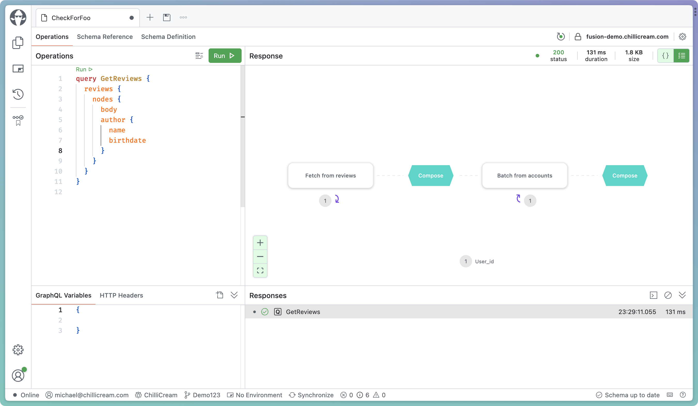

# In the beginning

Right from the beginning, people saw the potential of GraphQL as a gateway technology. GraphQL promised a single integrated schema to the API consumer while offering the flexibility to leverage various technologies and services behind the scenes.

When GraphQL was introduced, front-end engineers were the first to glimpse the power of it and started wrapping their REST services with GraphQL. This made data fetching more efficient by aggregating data calls close to downstream services and rendered the data more accessible. The straightforward, human-understandable schema made it easier to trace relations and reason about data and its connections in an entirely new way.

GraphQL offered a way to model an interface to our core business domain that often diverged from the technical realities of the REST, gRPC, or other APIs behind it. It eliminated the complexity of knowing which micro-service would provide the necessary data or mutations for a particular use case. While micro-service or domain-service architectures provided technical means to scale more efficiently and align with organizational needs, GraphQL introduced simplicity with its unified schema approach.

From the outset, GraphQL server developers were challenged to find ways to simplify distributed GraphQL setups. Over time, we've witnessed the evolution of various methods, from schema stitching techniques to federated solutions like Apollo Federation. However, many of these restrict users within a single-vendor ecosystem or, on the other end, are too rudimentary to cater to sophisticated enterprise requirements.

# Expectations

We believe that distributed GraphQL services — or composite GraphQL services — should be straightforward to set up and seamlessly integrate with the diverse range of CI/CD tools, schema registries, composition utilities, and gateways that enterprises might prefer. The current landscape should not dictate the choice of tools but provide flexibility.

Up to this point, the GraphQL landscape has lacked an open specification tailored for distributed setups – a framework designed from the ground up for extensibility and integration with diverse toolchains. We envisioned a platform where tools from various vendors could effortlessly work in tandem, ensuring that developers and enterprises never feel constrained by their technical choices.

# Let's share and compete

Late last year, [ChilliCream](https://chillicream.com) and [The Guild](https://the-guild.dev/) met in Paris and discussed their approaches towards distributed GraphQL. It became clear that both companies were solving similar problems, and we decided to join forces on this project. ChilliCream would provide the initial work on the Fusion spec and implementation. At the same time, The Guild would start specifying their work on [GraphQL Mesh Gateway](https://the-guild.dev/graphql/mesh) with [OpenAPI support](https://the-guild.dev/graphql/mesh/docs/handlers/openapi) and help shape the initial Fusion spec. As we started, work on prototypes and the initial spec texts, we reached out to more companies in the community to see if there was interest in collaboration. It turns out that the GraphQL community is hungry for an open specification to standardize distributed GraphQL application gateways. [Hasura](https://hasura.io/), [IBM](https://www.ibm.com), [solo.io](https://www.solo.io/), [AWS AppSync](https://aws.amazon.com/de/appsync/), [WunderGraph](https://wundergraph.com/) have all joined the effort for creating a common spec.

Today, we are thrilled to unveil GraphQL-Fusion, an open specification under the **MIT license**. This initiative empowers everyone to craft tools and solutions centered around distributed GraphQL services. Complementing this announcement, we're also introducing [Hot Chocolate](https://chillicream.com/docs/hotchocolate) Fusion, an early implementation of the GraphQL-Fusion spec draft.

The GraphQL-Fusion spec goes beyond what traditional federation approaches went after. It establishes GraphQL as an application gateway that allows integrating GraphQL APIs, REST APIs, gRPC APIs, or even databases. For this reason, in addition to The Guild's work on the Open API to GraphQL spec, Hasura will start specifying GraphQL Data Compliant APIs, the AWS AppSync team will focus on specs for throttling, authentication, and subscriptions and WunderGraph will specify adapter specs for gRPC and Kafka (AsyncApi). As mentioned initially, GraphQL is a great gateway technology, although it started from a different place. It gives the consumer the simplicity of the single schema and hides behind that schema the technical complexities of a heterogenous service landscape.

# A new way to distribute GraphQL schema components

GraphQL-Fusion presents a fresh approach to streamlining the complexities of assembling distributed schemas.

At its heart, GraphQL-Fusion pivots around two foundational principles: schema composition and query planning.

But before delving into these concepts, it's essential to retrace our steps. Let's revisit the challenges surfaced when people first tried GraphQL as a Gateway for constructing their GraphQL servers over REST APIs.

The ideal scenario is one where our teams operate autonomously, deploying updates at their pace. However, positioning a GraphQL server at the forefront as the gateway introduced an unexpected bottleneck to the development flow. Suddenly, updating downstream APIs required updates to the central GraphQL server, leading to inevitable synchronization hurdles. Burdening teams with higher maintenance and reduced flexibility.

While GraphQL schema stitching solutions simplified the composition of GraphQL Gateways, they still suffered from the same coordination dilemma since the gateway retained pivotal configuration logic. Federated GraphQL solutions emerged as a remedy, redistributing this configuration logic across subgraphs, thus enabling teams to work and release subgraphs autonomously.

Fusion represents a fully federated approach but also incorporates the capabilities of stitching solutions to rewrite and transform subgraph schemas. Further, Fusion removes the requirement of subgraph protocols we see in many federated GraphQL solutions. This means you can use any GraphQL server as a Fusion subgraph, and the capabilities of your subgraph within a Fusion setup are defined by the GraphQL spec version your GraphQL server implements.

The Fusion schema composition aims to infer the semantic meaning of a GraphQL schema, reducing annotations to the schema. Fusion schema composition recognizes GraphQL best practices like the Relay patterns or naming patterns and their semantics. Instead of treating fields and types bearing identical names as collisions, Fusion recognizes them as overlaps.

For clarity, consider the following GraphQL query type example:

```graphql
type Query {
  userByID(id: ID!): User
  productBySKU(sku: String!): Product
  articleBySlug(slug: String!): Article
}
```

In this example, fields follow the `{type}By{key}` naming convention:

- userByID for fetching users by ID
- productBySKU for retrieving products by SKU
- articleBySlug for obtaining articles by slug

Things we can fetch by one or multiple keys are entities to Fusion, allowing the Fusion query planner to create query plan tasks to fill in data from various subgraphs. Fusion does not need to know their keys spelled out, as this is inferred from their resolver signature.

Let's consider two subgraphs - one for product reviews and another for user data.

**Subgraph 1: Product Reviews**

```graphql
type Review {
  id: ID!
  body: String!
  product: Product!
  author: User!
}

type User {
  id: ID!
  name: String!
  reviews: [Review!]
}

type Product {
  sku: String!
  reviews: [Review!]
}

type Query {
  reviews: [Review!]
  reviewById(id: ID!): Review
  userById(id: ID!): User
  productBySKU(sku: String!): Product
}
```

**Subgraph 2: User Data**

```graphql
type User {
  id: ID!
  name: String!
  email: String!
}

type Query {
  userById(id: ID!): User
}
```

The outcome? An annotated Fusion graph document, which provides all the metadata for the Fusion gateway query planner.

**Composed Fusion Graph**

```graphql
type Review
  @variable(subgraph: "Reviews", name: "Review_id", select: "id")
  @resolver(
    subgraph: "Reviews"
    select: "{ reviewById(id: $Review_id) }"
    arguments: [{ name: "Review_id", type: "ID!" }]
  ) {
  id: ID! @source(subgraph: "Reviews")
  body: String! @source(subgraph: "Reviews")
  product: Product! @source(subgraph: "Reviews")
  author: User! @source(subgraph: "Reviews")
}

type User
  @variable(subgraph: "Reviews", name: "User_id", select: "id")
  @variable(subgraph: "Account", name: "User_id", select: "id")
  @resolver(
    subgraph: "Reviews"
    select: "{ userById(id: $id) }"
    arguments: [{ name: "User_id", type: "ID!" }]
  )
  @resolver(
    subgraph: "Account"
    select: "{ userById(id: $id) }"
    arguments: [{ name: "User_id", type: "ID!" }]
  ) {
  id: ID! @source(subgraph: "Reviews") @source(subgraph: "Account")
  name: String! @source(subgraph: "Reviews") @source(subgraph: "Account")
  email: String! @source(subgraph: "Account")
}

type Product
  @variable(subgraph: "Reviews", name: "Product_sku", select: "sku")
  @resolver(
    subgraph: "Reviews"
    select: "{ productBySKU(sku: $Product_sku) }"
    arguments: [{ name: "Product_sku", type: "String!" }]
  ) {
  sku: String! @source(subgraph: "Reviews")
  reviews: [Review!] @source(subgraph: "Reviews")
}

type Query {
  reviews: [Review!] @resolver(subgraph: "Reviews", select: "{ reviews }")
  userById(id: ID!): User
    @resolver(
      subgraph: "Reviews"
      select: "{ userById(id: $id) }"
      arguments: [{ name: "id", type: "ID!" }]
    )
    @resolver(
      subgraph: "Account"
      select: "{ userById(id: $id) }"
      arguments: [{ name: "id", type: "ID!" }]
    )

  reviewById(id: ID!): Review
    @resolver(
      subgraph: "Reviews"
      select: "{ reviewById(id: $id) }"
      arguments: [{ name: "id", type: "ID!" }]
    )

  productBySKU(sku: String!): Product
    @resolver(
      subgraph: "Reviews"
      select: "{ productBySKU(id: $id) }"
      arguments: [{ name: "id", type: "ID!" }]
    )
}
```

# Query Planning and Optimizations

The above-annotated schema document allows the Fusion gateway to plan data fetching from its subgraphs efficiently.

When executing a query like the following:

```graphql
query GetReviews {
  reviews {
    body
    author {
      name
      email
    }
  }
}
```

The query planner might produce two downstream queries:

**Query 1**

```graphql
query GetReviews_1 {
  reviews {
    body
    author {
      name
      __export__1: id
    }
  }
}
```

**Query 2**

```graphql
query GetReviews_2($__export__1: ID!) {
  userById(id: $__export__1) {
    email
  }
}
```

We are essentially doing an initial call to the reviews services, collecting all user ids, and then doing a call to our accounts subgraph for each user id we collected to get the emails. While this is not efficient, as we would have to make multiple subgraph requests, the Fusion composition and query planner also understand batching fields and how to integrate them into the query planning process. If we introduced the following root field to our accounts subgraph and recomposed:

```graphql
extend type Query {
  usersById(ids: [ID!]!): [User!]
}
```

The composition would add a batching resolver to the `User` type:

```graphql
extend type User
  @resolver(
    subgraph: "Account",
    select: "{ usersById(ids: $User_Id) }",
    arguments: [ { name: "User_Id", type: "[ID!]!" } ],
    kind: "BATCH_BY_KEY"
    ) {
}
```

With this new field in place, the query planner can prioritize batch resolvers whenever we branch off a request in a list context, even if that list context spreads multiple levels deep.

**Query 1**

```graphql
query GetReviews_1 {
  reviews {
    body
    author {
      name
      __export__1: id
    }
  }
}
```

**Query 2**

```graphql
query GetReviews_2($__export__1: [ID!]!) {
  usersById(id: $__export__1) {
    email
  }
}
```

The Fusion query plan is another standardized component that tooling (like [Banana Cake Pop](https://eat.bananacakepop.com)) can use to give you insights into how efficiently the gateway can resolve the requested data.


_Also available in black ;)_

The Fusion Query plan consists of the following query plan node kinds: `Compose`, `Defer`, `Stream`, `If`, `Introspect`, `Parallel`, `Resolve`, `ResolveByKeyBatch`, `ResolveNode`, `Sequence`, and `Subscribe`. With these abstract nodes, the query planner is able to create complex query plans that support every GraphQL feature and best practice right out of the gate.

While the `Fetch` and `Batch` nodes are clear about what they do in our query plan, the compose step might be a mystery to you. In essence, the query planner can fetch data that does not align with the current structure of the request. Compose will take in the raw data fetched by resolve nodes and composes it into the GraphQL request structure. It also ensures that result coercion rules are correctly applied to be GraphQL spec-compliant.


_In this case, compose creates the result of a single selection set from multiple resolve nodes._

The Hot Chocolate Fusion Gateway implementation supports all supported subscription protocols, from the legacy Apollo subscription protocol over graphql-ws to graphql-sse.

Further, it supports file uploads with the GraphQL multipart request protocol, Facebook-style batching with the `@export` directives, the newest `@defer` and `@stream` spec draft, the newest Client Controlled Nullability spec draft, and many more GraphQL features.

Distributed GraphQL should **not limit** what you can do with GraphQL.

# Relay

The schema composition can also introduce aspects such as the Relay conventions to your Gateway schema, even if they aren't implemented in your subgraphs.

Alternatively, if your subgraphs implement the Relay conventions, such as the global object identity convention, the schema composition will detect this and incorporate it into the Fusion graph document. For example, this can optimize your query planning by utilizing the node field. Further, this makes all object types that implement the `Node` interface an entity to Fusion.

```graphql
extend type User
  @resolver(
    subgraph: "User",
    select: "{ node(id: $User_id) { ... on User { ... User } } }",
    arguments: [ { name: "User_id", type: "ID!" } ])
  @resolver(
    subgraph: "User",
    select: "{ nodes(ids: $User_id) { ... on User { ... User } } }",
    arguments: [ { name: "User_id", type: "[ID!]!" } ],
    kind: "BATCH_BY_KEY") {
}
```

While using the `node` field to fetch entity data is straightforward for exposing the `node` fields to the gateway, we found it necessary to equip the Fusion gateway with data sharding capabilities. This is the ability to dispatch a query at runtime to a specific subgraph based on user-provided data. This can be applied to simple tasks like the node field but can also be harnessed to isolate data partitions by region or any other discriminants you desire.


_`node` field query plan._

If we zoom into the JSON representation of our query plan, we can see in detail the branches of our `ResolveNode` in the query plan. Depending on the type in our encoded `ID`, one of the branches will be executed. If the encoded types have different names in the subgraphs, Fusion will reencode the ID for the particular subgraph.


_JSON representation of our query plan_

# Going Further

While the subgraph inference of the schema composition is quite powerful, there are a lot of cases where we can go further by declaring the semantics of a GraphQL schema. We do not need to integrate such annotations into our subgraph schema directly but can pass additional GraphQL documents into the schema composition that hold type extensions with additional directive annotations.

Let's say the batching field we introduced did not follow the conventions of the other fields in our GraphQL schema.

```graphql
extend type Query {
  users(ids: [ID!]!): [User!]
}
```

In this case, the schema composition cannot just guess what `ids` is. `ids` could be identities for whatever. This is where we can use the fusion subgraph directives to bring meaning to the schema.

```graphql
extend type Query {
  users(ids: [ID!]! @is(field: "id")): [User!]
}
```

The `@is` directive allows us to specify that the argument on our field `users` is semantically identical to the output field `id` on their returning `User` type. Since `ids` is a list that returns a list of users, we can now infer that this field allows us to batch-fetch users by user ids.

# Requirements

Where subgraph directives really become necessary is with requirements. Data requirements let us integrate two or more subgraphs with each other without bleeding internal data requirements into the public schema.

Let's say we have the following schema:

```graphql
type Product {
  sku: String!
  name: String!
  dimension: ProductDimension
}
```

Also, let's say we have a subgraph that can calculate a delivery estimate for a product.

```graphql
type Product {
  deliveryEstimate(zip: String!, width: Float!, height: Float!): Int!
}
```

We need the ZIP code and the product's width and height to calculate the delivery estimate in our shipping subgraph. The product's dimension (width and height) is actually available in the product catalog service, which holds all the information about the product itself.

In this case, we want to create a public API for our consumer where we only have to pass in the ZIP code to the `deliveryEstimate` field on the `Product` type on our Fusion graph.

```graphql
type Product {
  sku: String!
  name: String!
  dimension: ProductDimension
  deliveryEstimate(zip: String!): Int!
}
```

We can express this by using the `@require` directive and referring to the required information relative to the `Product` type.

```graphql
type Product {
  deliveryEstimate(
    zip: String!
    width: Float! @require(field: "dimension { width }")
    height: Float! @require(field: "dimension { height }")
  ): Int!
}
```

We could also design that slightly differently and introduce an input to our subgraph representing the required data we need.

```graphql
input ProductDimensionInput {
  width: Float!
  height: Float!
}

type Product {
  deliveryEstimate(
    zip: String!
    dimension: ProductDimensionInput! @require(field: "dimension")
  ): Int!
}
```

The outcome will stay the same, and we will get this nice API for our users. The query planner will resolve the required data under the hood.


Again, this brings clarity to your subgraph as the field is very clear about what it needs and becomes easily testable in the process.

# Reshaping things

When we rethink a bit the shipping subgraph we actually should realize that the `deliveryEstimate` does not really need to be on the `Product` type as the argument has clear requirements which are expressed by its field arguments. Instead of having the field `deliveryEstimate` on the `Product` type itself, it could very well be exposed through the `Query` type, at least in the context of our subgraph.

```graphql
type Query {
  estimateShipping(zip: String!, width: Float!, height: Float!): Int!
}
```

In the case the subgraph is isolated and does not fully integrate with our intended public model, we can also reshape the subgraph to make it fit.

All the annotations can be put into separate graphql documents providing the extending metadata. This allows us to keep our actual subgraph schema clean. It also helps when you do not fully own the schema that you integrate, like, for instance, the GitHub schema. Just create a `schema.extensions.graphql` and put your annotations and extension in that file, and you're good to go.

First, let's make the whole query type private; we do not want to include anything by default from this subgraph.

```graphql
extend type Query @private
```

Next, we introduce some product metadata.

```graphql
extend type Product {
  estimateShipping(
    zip: String!
    width: Float! @require(field: "dimension { width }")
    height: Float! @require(field: "dimension { height }")
  ): Int!
}

extend type Query @private
```

Last, we want to declare how estimate wires up to our internal `Query` type.

```graphql
extend type Product {
  estimateShipping(
    zip: String!
    width: Float! @require(field: "dimension { width }")
    height: Float! @require(field: "dimension { height }")
  ): Int! @resolve
}

extend type Query @private
```

Since the field and arguments 100% match between the `Query` type and the `Product` type extension, we only need to put the `@resolve` directive on the field without specifying any mapping of arguments. But let's imagine we call it `calculateDelivery` on the product type. In this case, we need to become more explicit.

```graphql
extend type Product {
  calculateDelivery(
    zip: String!
    width: Float! @require(field: "dimension { width }")
    height: Float! @require(field: "dimension { height }")
  ): Int! @resolve(select: "estimateShipping")
}

extend type Query @private
```

Again, arguments match, so we do not need to map them, but we could. Each argument would become an implicit variable in this case.

```graphql
extend type Product {
  calculateShipping(
    zip: String!
    width: Float! @require(field: "dimension { width }")
    height: Float! @require(field: "dimension { height }")
  ): Int! @resolve(select: "estimateShipping(zip: $zip)")
}

extend type Query @private
```

Arguments that you do not map are again inferred, allowing you always just to specify the minimum. Since Fusion compiles the Fusion Graph at build time, this is fine, as the schema composition will always tell you what is missing and precisely in which file you have to specify more information for the composition and query planner to work.

Let's move on from the requirements case and dig deeper into the type reshaping capabilities. Often when we build our data silos, we also do not have all the stub types in there. It would sometimes be tedious to always have them around. Think of the review service.

```graphql
type Review {
  id: ID!
  body: String!
  product: Product!
  author: User!
}
```

This `Product` type is essentially just the `sku` field of the public `Product` type. In many cases, people are more tempted to create something like the following in the subgraph schema since it's just less cluttered.

```graphql
type Review {
  id: ID!
  body: String!
  productSKU: String!
  author: User!
}
```

With Fusion, you can provide us with some metadata in the schema extension file, and we will ensure that the references are introduced on our publicly exposed gateway schema.

```graphql
extend type Review {
  productSKU: String! @is(coordinate: "Product.sku") @private
  product: Product! @resolve
}
```

By declaring the semantics of the field `productSKU`, we can infer a way to resolve a product using one existing way to fetch a `Product` entity. Again, if there is no way to resolve it, we will give you a composition error telling you which subgraphs you could or should introduce `Query` fields to, to resolve the `Product` entity.

In many cases, we want to connect our types from both sides.

```graphql
extend type Product {
  reviews: [Review!] @resolve
}

extend type Review {
  productSKU: String! @is(coordinate: "Product.sku") @private
  product: Product! @resolve
}
```

For this to work, we would need to introduce a `reviewsBySKU` to our reviews subgraph. But in any case, we will be told by our schema composition if it is missing on our subgraph.

Like with our case for estimate delivery, we can be more or less explicit with our `@resolve` directive.

```graphql
extend type Product {
  reviews: [Review!] @resolve(select: "reviewsBySku(sku: $sku)")
}
```

Since `sku` is available on the product, it is automatically a variable available to inject. But because of collisions with field arguments or if the actual `sku` is not directly on the `Product` type, we could also explicitly declare the variable and state what we mean.

```graphql
extend type Product {
  reviews: [Review!]
    @declare(variable: "sku", select: "someOtherField { sku }")
    @resolve(select: "reviewsBySku(sku: $sku)")
}
```

> The `select` argument represents a field selection or selection set syntax and also allows for more complex query constructs that refer to GraphQL query files using fragments and other query constructs. For this introduction to Fusion as a concept, we keep it simple.

When I said at the beginning that Fusion lends concepts from both schema stitching and federation approaches, then its this kind of flexibility that I mean, you can build your graph in a federated structure, and you will, in most cases, not need to declare anything to the composition as everything can be inferred, but you can become very explicit with hints or even with the more precise `@resolve` directive.

# Open Telemetry for Federated Tracing

This brings me to another aspect of Fusion: telemetry. While the GraphQL-Fusion spec isn't primarily concerned with tracing itself, we've decided to leverage OpenTelemetry for the Hot Chocolate Fusion Gateway implementation. We're working to establish a more precise semantic convention for GraphQL in collaboration with the OpenTelemetry community. This effort aims to enable standard GraphQL servers to use OpenTelemetry to expose the intricate processes that occur when a GraphQL server handles a request. These traces, correlated from the gateway to the subgraph, allow any vendor to digest tracing events and provide profound insights into where performance bottlenecks exist in your distributed system.

Combined with the GraphQL subgraphs, which use instead of a generic `_entities` field actual semantic fields like `reviewsBySKU` in Fusion to retrieve data from subgraphs, the traces become very clear to read and expose optimization potential to the developers. The best part? There's no need for specialized approaches — it's as straightforward as crafting a conventional resolver. With the release of [Banana Cake Pop](https://eat.bananacakepop.com) version 9, we're introducing our revamped query plan viewer. This tool signifies our initial step towards integrating telemetry data from GraphQL-Fusion, aiming to provide comprehensive insights into the operations of your distributed GraphQL setup. However, thanks to the open nature of the GraphQL-Fusion spec and the OpenTelemetry definitions, you're not confined to our tools—alternatives like [The Guild's Hive](https://the-guild.dev/graphql/hive), [WunderGraph's Cosmo](https://wundergraph.com/cosmo), or even a plain Elastic Cloud integration are also available.

# CI/CD integrations from the start

We considered CI/CD from the start when conceptualizing Fusion and structured it so that you can easily integrate your solution. Right out of the gate, you can start with [Banana Cake Pop](https://eat.bananacakepop.com), which provides a schema registry, easy rollbacks of changes introduced by your subgraphs, and deployment pipeline synchronization.


But the core principle is that this is open and built into the GraphQL-Fusion spec. To provide tooling a single file containing all the information needed for gateway configuration and even space for gateway-specific features, we've adopted the [Open Packaging Convention](https://en.wikipedia.org/wiki/Open_Packaging_Conventions) as a container for the GraphQL-Fusion Configuration (.fgp).

The [Open Packaging Convention](https://en.wikipedia.org/wiki/Open_Packaging_Conventions) is an open standard provided by [Microsoft](https://microsoft.com), used for everything from Word Documents (.docx) to VSCode extension packages (.vsix). Simply put, think of it as a ZIP container with metadata and relations between its artifacts. The GraphQL-Fusion convention contains the mandatory Fusion Graph document. This document is all that's needed to run and configure a Gateway implementing the core specification.

Additionally, it contains all subgraph schema documents, the publicly exposed Gateway schema, and composition settings the user has opted into. Having all these artifacts in one place gives us a single artifact that we can pass on from the schema composition in a CI/CD pipeline to the schema registry and from there to the actual gateway. We have customers already using this with their custom solutions for distributing the configuration from their deployment pipeline to their gateway or by using our Cloud Services ([Banana Cake Pop](https://eat.bananacakepop.com)). Besides these standard artifacts included in the package, it also allows Gateway implementers to store custom configurations to specify GraphQL WAF settings and more.


# Apollo Federation

We recognize that some of you may have opted into Apollo Federation as a solution, and that is why we designed the Fusion schema composition so that it can compose any Apollo Federation subgraph into a Fusion subgraph. This allows you to seamlessly migrate from an Apollo Federation setup to a GraphQL-Fusion setup without the need to rewrite anything.

# Conclusion

We are still working on GraphQL-Fusion, but you can try an early version already today with the Hot Chocolate Fusion Gateway. We plan to release the GraphQL-Fusion spec as it matures later this year as **MIT license**. While the current iterations are primarily concerned with GraphQL, as mentioned before The Guild, in collaboration with IBM and StepZen, has begun specifying the Open API to GraphQL transformation they've developed in Mesh, and we'll integrate this as it becomes available. Hasura is working on GraphQL Compliant Data APIs spec and WunderGraph wants to contribute a spec for gRPC and Kafka (AsyncApi) to take federated GraphQL to a whole new level.

There's much more from the query plan engine to the schema composition we're eager to showcase in detail. Today I wanted to start talking about GraphQL-Fusion as a concept. We are also working on step-by-step YouTube tutorials for later this year that shows you how to create a GraphQL-Fusion setup from scratch or how to migrate from an Apollo Federation setup without skipping a beat to a GraphQL-Fusion setup.

The one crucial thing behind this effort is creating a truly open spec, which leans heavily on the GraphQL spec and describes the algorithms behind the schema composition and the query planning. No single company will own the spec as the GraphQL Foundation will take ownership of it. This ensures that we have a level playing field where companies can provide services, tooling, or gateways. It gives a better choice to developers building distributed systems with GraphQL as they can easily connect tools from different vendors.

You can join me at [GraphQL conf in San Francisco](https://graphql.org/conf/schedule/4a4e842d1cd0c06083f484d31225abd1/?name=GraphQL%20Fusion:%20Rethinking%20Distributed%20GraphQL%20-%20Michael%20Staib,%20ChilliCream%20Inc) as I will be giving a talk about GraphQL-Fusion with the latest bits.
