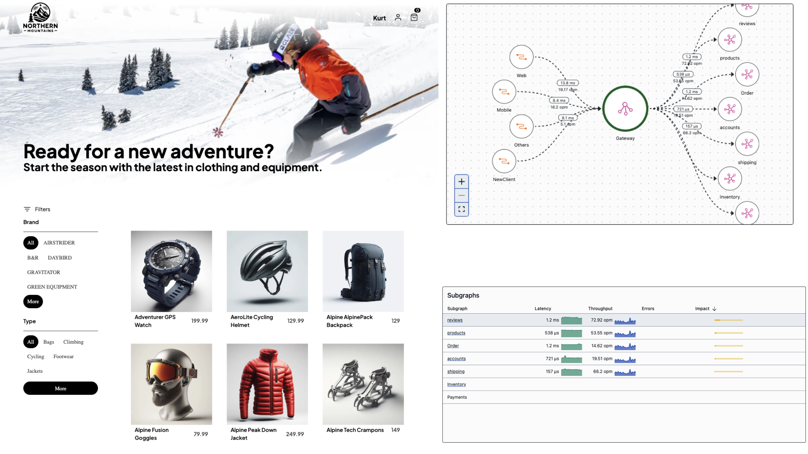

In today's rapidly evolving technology landscape, staying ahead requires not only understanding the latest technologies but also how to implement them effectively. This two-day workshop is a hands-on journey designed to demystify advanced concepts by building from the ground up. We'll start with the basics and progressively build a fully functional distributed web shop using HotChocolate, Relay.js, Fusion, multiple subgraphs .NET Aspire and also concepts like domain driven design, CQRS and clean architecture.

Book your seat now and learn more about the workshop [here](https://learn.chillicream.com/blog/2024-04-01/fullstack-workshop).

Over two days, we'll cover everything from basic concepts to advanced techniques. We start by getting to know GraphQL, learning about its features and benefits compared to traditional methods. Later, we introduce Relay.js, focusing on how it works with GraphQL to improve data handling and application performance.

**Day 1:** We begin with basic GraphQL concepts, then move on to how you can build efficient APIs. In the afternoon, we'll learn about Relay.js, starting with the fundamentals and advancing to more complex topics.

**Day 2:** We explore deeper topics like how to change and improve your GraphQL setup, how to handle data updates smoothly, and how other advanced techniques fit into the GraphQL world. We end by learning about real-time data updates with subscriptions.

For the next online workshop you [find more information here](https://learn.chillicream.com/blog/2024-04-01).

This workshop can also be tailored to meet your company's specific needs. We offer the flexibility to customize the content and focus areas to best match your team's requirements and goals.

Here are the detailed modules available:

**Module 1: Getting Started with GraphQL**

Kick off with GraphQL by understanding its fundamental concepts such as operations, types system, syntax, and reasons for using GraphQL over other APIs. The session ends with setting up a first GraphQL server, providing hands-on experience from the start.

**Module 2: Building a Database Driven Application**

Explore how to build GraphQL apis using Entity Framework Core, with features like paging, filtering, sorting, and projections. The session will also cover some advanced concepts like field middlewares.

**Module 3: Building APIs with Simple Layering**

This session focuses on API with simple layering, including applying filtering and pagination in layered architectures. It also covers best practices using DataLoaders for optimized data fetching operations.

**Module 4: GraphQL Query Patterns and Best Practices**

Detailed exploration of advanced GraphQL patterns such as evolving schemas, entity and connection patterns for large-scale applications, ensuring best practices are met for enterprise development.

**Module 5: Getting Started with Relay.js**

Introduction to Relay.js, focusing on queries, using fragments and arguments effectively.
Module 6: Advanced Fetching Patterns
This module covers complex data fetching strategies in Relay.js, including transitions, refetching, and pagination, essential for managing data in applications and providing peak user experience.

**Module 7: Understanding Relay**

Expands on Relay's core concepts, including store management, data prefetching methods, and internal workings of Relay for performance improvements and predictable state management.

**Module 8: GraphQL Mutations Patterns and Best Practices**

Deep dive into the structure and patterns of GraphQL mutations, focusing on how to effectively manage errors and ensure robust mutation operations.

**Module 9: Mutations In Relay**

This module focuses on teaching effective methods for managing mutations, error handling, and executing optimistic updates within Relay.

**Module 10: GraphQL Schema Evolution**

Review of techniques to evolve a GraphQL schema over time without breaking existing operations, including the use of client and schema registries and implementing open telemetry.

**Module 11: Introduction to Distributed GraphQL**

Covering the concepts and implementation of distributed GraphQL with fusion to allow scalable, efficiently distributed data across different services and servers.

**Module 12: Authentication / Authorization**

Detailed breakdown of implementing authentication and authorization in GraphQL applications, ensuring secure and controlled access to data through proper practices.

**Module 13: CQRS, DDD and GraphQL, the Perfect Fit?**

Exploration of how CQRS and Domain Driven Design can be integrated with GraphQL to optimize complexity management in large-scale domains.

**Module 14: GraphQL Subscriptions Patterns and Best Practices**

In-depth look at implementing real-time functionalities via GraphQL subscriptions, with specific focus on patterns. Implemented in both the backend and frontend..

**Closing Session: Q&A**

An open session where attendees can ask questions or clarify doubts about the topics covered, facilitating deeper understanding and practical implementations.

# We Want to Hear From You

Your insights are invaluable to us. If you have questions, need more information, or just want to talk to use, don’t hesitate to reach out on <contact@chillicream.com> or on [slack.chillicream.com](https://slack.chillicream.com/blog/2024/04/01/fullstack-workshop)
