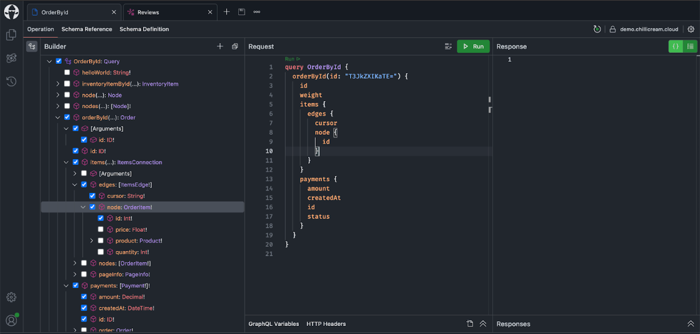
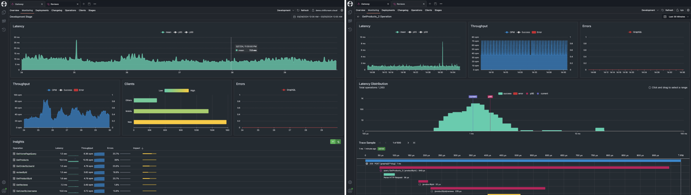
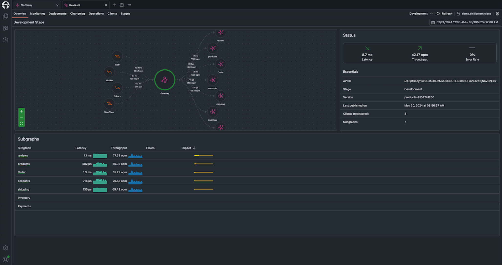
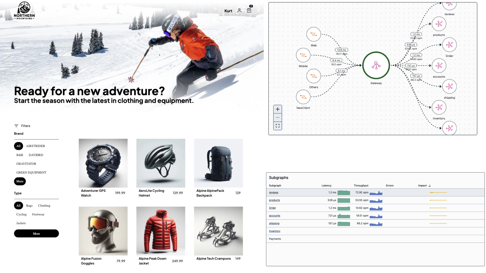

We’re excited to bring you some significant updates from ChiliCream that can genuinely make a difference in your day-to-day development. This isn't just about new features—it's about making your workflow more effective and your projects more successful.

# 🛠️ Operation Builder

We’re proud to introduce the Operation Builder in Banana Cake Pop, a tool designed to make creating and managing your GraphQL operations a breeze.

The Operation Builder simplifies the process of creating and managing queries, making it easier than ever to draft, edit, and inspect your operations. Dive deep into your schema, seamlessly navigate fields and fragments, and gain instant insights into your data structure.

This is perfect for both quick edits and detailed explorations, helping you understand and optimize your queries with ease.

Try out the Operation Builder today and transform the way you work with GraphQL!

**[Check out the video here](https://link.chillicream.com/2024/05/21/ops-builder-video)**

# 📊 Telemetry

We’re want to put a spotlight on our Telemetry integration. Why did we build this? The answer is simple. Understanding your application’s performance shouldn't be a guessing game and GraphQL Telemetry is difficult. With our telemetry integration, you can have complete visibility into your GraphQL server.

- **Trace Visualization:** See every trace in detail. This helps you pinpoint precisely where your system can be improved.
- **Latency Monitoring:** Track average latency and critical percentiles to ensure top-notch performance.
- **Throughput Metrics:** Keep an eye on operations per minute, so you can manage and scale your resources effectively.
- **Client Insights:** Identify which clients impact your system the most, helping you make data-driven decisions.
- **Error Tracking:** Stay ahead of potential issues with real-time error reports.
- **In-depth Operation Analysis:** Gain a comprehensive overview of each operation's latency, throughput, and error rates.

The fusion dashboard offers extensive monitoring capabilities, presenting real-time tracing and telemetry insights of your gateway and subgraphs. The topology view reveals interconnections and client activities, while status indicators provide a quick overview of latency, throughput, and error rates.

_Create, Collaborate, Conquer! Get Started with Banana Cake Pop Pro. Use the promo code **BCPROCKS** to get a discount on your first year and start using our GraphQL IDE to enhance your projects efficiently._

**[Check out the video here](https://link.chillicream.com/2024/05/21/telemetry-video)**

or read the docs: [Open Telemetry Documentation](https://link.chillicream.com/2024/05/21/otel-docs)

# 🛠️ Announcing Our New Full Stack GraphQL Workshop

In today's rapidly evolving technology landscape, staying ahead requires not only understanding the latest technologies but also knowing how to implement them effectively. Our brand-new Full Stack GraphQL Workshop is a two-day, hands-on journey designed to demystify advanced concepts.

We'll start with the basics and progressively build a fully functional distributed web shop using HotChocolate, Relay.js, Fusion, multiple subgraphs, and .NET Aspire. We’ll also delve into foundational principles like domain-driven design, CQRS, and clean architecture.

Learn more about the workshop here: [learn.chillicream.com](https://link.chillicream.com/2024/05/21/learn)

## We Want to Hear From You

Your insights are invaluable to us. If you have questions, need more information, or want to discuss how our tools can fit into your projects, don’t hesitate to reach out on contact@chillicream.com or on [slack.chillicream.com](https://link.chillicream.com/2024/05/21/slack)

## ❤️️ Thank You

We appreciate your engagement and are thrilled to support your projects with our evolving GraphQL solutions. Keep an eye out for HotChocolate 14, and let us help you take your projects to the next level.
