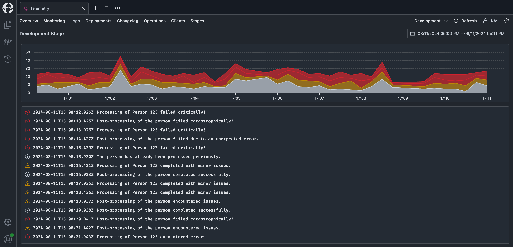
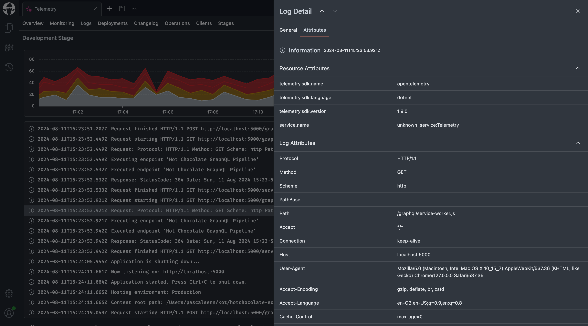
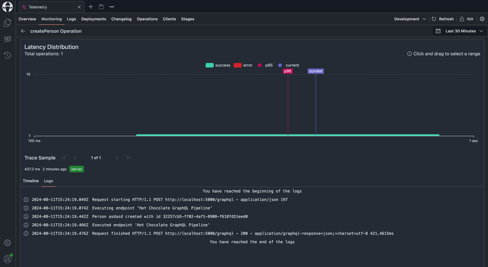

We’re thrilled to announce a new feature in Banana Cake Pop that will enhance your development and debugging experience—**Logging**! Now, you can seamlessly send logs to Banana Cake Pop and analyze them directly within the app, making it easier than ever to monitor and troubleshoot your APIs.

# What’s New?

## Service Logs





APIs now have a dedicated **Logs** tab. This new tab allows you to view all the logs associated with a specific API. Whether you're tracking requests, debugging issues, or monitoring performance, this feature gives you a comprehensive view of what's happening under the hood.

## Trace Logs



We’ve also added the ability to inspect logs within individual traces. When you open a trace, you’ll now see all the logs corresponding to each trace. This granular level of detail is invaluable for pinpointing issues and analyze traces in detail.

## Log Retention

- **Shared Clusters:** Log retention in shared clusters is set to 1 day. This ensures that you can review recent logs.
  
- **Dedicated Clusters:** For those using dedicated clusters, we offer **dynamic log retention times**. This means you can configure log retention according to your specific needs, offering greater flexibility and control over your logging data.

# Getting Started with Logging

To start using this new logging feature, ensure that you are using **Banana Cake Pop version 13.9.0 or 14.x.x-preview.8**. Below is a sample setup to get you started:

```csharp
builder.Services
    .AddGraphQLServer()
    .AddInstrumentation()
    ... // your configuration here
    .AddBananaCakePopServices(x =>
    {
        x.ApiId = ""; // <-- Replace with your API ID
        x.ApiKey = ""; // <-- Replace with your API key
        x.Stage = "dev";
    });

builder.Services
    .AddLogging(x => x
        .AddBananaCakePopExporter()
        .AddOpenTelemetry(x =>
        {
            x.IncludeFormattedMessage = true;
            x.IncludeScopes = true;
        }));
```

You can find the full example over [in the example repository](https://link.chillicream.com/2024/08/11/logging-example) or check out the [documentation](https://link.chillicream.com/2024/08/11/logging-docs) for more details.

We hope this new logging capability helps you gain deeper insights into your APIs and streamline your development workflow. As always, we’re here to help with any questions or feedback you might have.
Don’t hesitate to reach out on <contact@chillicream.com> or on [slack.chillicream.com](https://link.chillicream.com/2024/08/11/slack)

# 🛠️ Announcing Our Enterprise GraphQL Workshop

In the fast-paced world of enterprise software development, mastering advanced architectural patterns is crucial for building robust and scalable applications.
Our upcoming Enterprise GraphQL with DDD, CQRS, and Clean Architecture Workshop is an immersive one-day experience designed to elevate your skills.

This workshop will guide you through the process of integrating GraphQL with DDD, CQRS, and Clean Architecture.
You'll gain hands-on experience in constructing a sophisticated enterprise-level system, starting from the basics and moving towards complex implementations.

Discover more about the workshop here: [DDD Workshop](https://link.chillicream.com/2024/08/11/ddd-workshop)

Happy logging! 🚀
