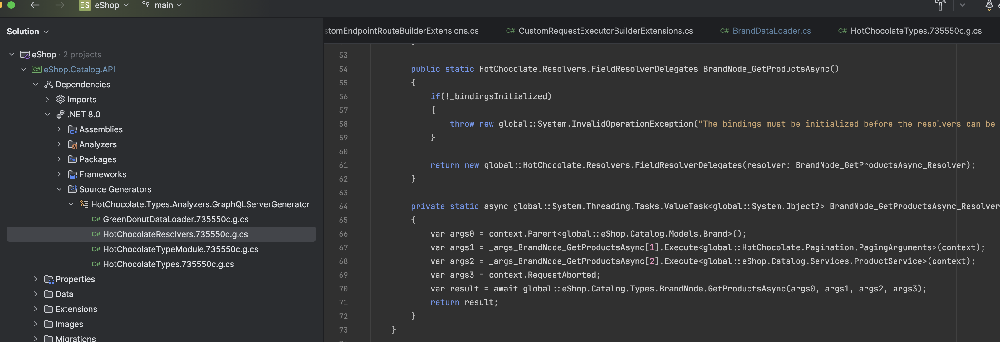
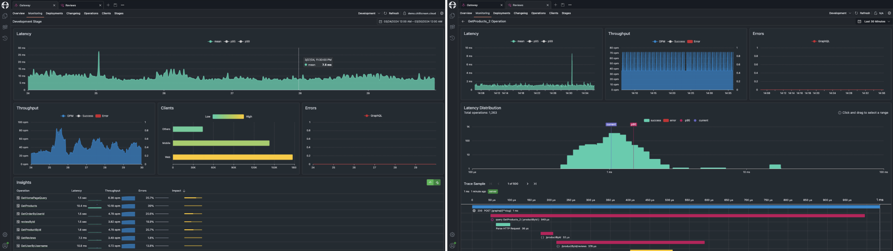
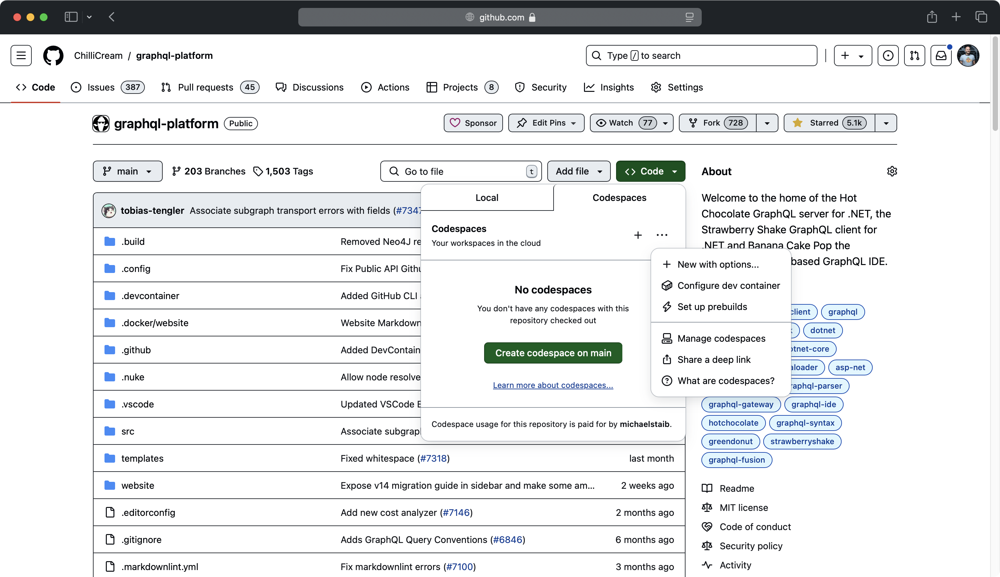

We are almost ready to release a new major version of Hot Chocolate, and with it come many new exciting features. We have been working on this release for quite some time, and we are thrilled to share it with you. In this blog post, we will give you a sneak peek at what you can expect with Hot Chocolate 14.

I will be focusing mainly on the Hot Chocolate server, but we have also been busy working on Hot Chocolate Fusion and the Composite Schema Specification. We will be releasing more information on these projects in the coming weeks.

# Ease of Use

We have focused on making Hot Chocolate easier to use and more intuitive. To achieve this, we have added many new features that will simplify your workflow. This will be apparent right from the start when you begin using Hot Chocolate 14. One major area where you can see this improvement is in dependency injection. Hot Chocolate 13 was incredibly flexible in this area, allowing you to specify which services are multi-thread capable, which services are pooled resources, or which services must be synchronized. While this was a powerful feature, it could be somewhat complex to use, especially for newcomers to our platform.

You either ended up with lengthy configuration code that essentially re-declared all services, or you ended up with very cluttered resolvers.

With Hot Chocolate 14, we have simplified this process by putting dependency injection on auto-pilot. Now, when you write your resolvers, you can simply inject services without the need to explicitly tell Hot Chocolate that they are services or what kind of services they are.

```csharp
public static IQueryable<Session> GetSessions(
    ApplicationDbContext context)
    => context.Sessions.OrderBy(s => s.Title);
```

This leads to dramatically clearer code that is more understandable and easier to maintain. For instance, the resolver above injects the `ApplicationDbContext`. There is no need to tell Hot Chocolate that this is a service or what characteristics this service has; it will just work. This is because we have simplified the way Hot Chocolate interacts with the dependency injection system.

In GraphQL, we essentially have two execution algorithms. The first, used for queries, allows for parallelization to optimize data fetching. This enables us to enqueue data fetching requests transparently and execute them in parallel. The second algorithm, used for mutations, is a sequential algorithm that executes one mutation after another.

So, how is this related to DI? In Hot Chocolate 14, if we have an async resolver that requires services from the DI container, we create a service scope around it, ensuring that the services you use in the resolver are not used concurrently used by other resolvers. Since query resolvers are, by specification, defined as side-effect-free, this is an excellent default behavior where you as the developer can just focus on writing code without concerning yourself with concurrency between resolver instances.

For mutations, the situation is different, as mutations inherently cause side effects. For instance, you might want to use a shared DbContext between two mutations. When executing a mutation Hot Chocolate will use the default request scope as it's guaranteed by the execution algorithm that there will only ever be a single mutation resolver executed at the same time for a request.

While the new default execution behavior is much more opinionated, it leads to a dramatically easier experience when implementing resolvers. However, we recognize that there are reasons you may want to use the request scope everywhere. That's why you can change the default configuration with the default schema options.

```csharp
builder
    .AddGraphQL()
    .AddTypes()
    .ModifyOptions(o =>
    {
        o.DefaultQueryDependencyInjectionScope = DependencyInjectionScope.Resolver;
        o.DefaultMutationDependencyInjectionScope = DependencyInjectionScope.Request;
    });
```

Also, you can override the defaults configured in the schema options, on a per resolver basis.

```csharp
[UseRequestScope]
[UsePaging]
public static async Task<Connection<Brand>> GetBrandsAsync(
    PagingArguments pagingArguments,
    BrandService brandService,
    CancellationToken cancellationToken)
    => await brandService
        .GetBrandsAsync(pagingArguments, cancellationToken)
        .ToConnectionAsync();
```

> We have applied the same DI handling to source generated DataLoader which by default will now use an explicit service scope for each DataLoader fetch.

# Query Inspection

<Video videoId="XZVpimb6sKg" />

Another area where we have made significant improvements is with query inspections. With Hot Chocolate 14, it’s now incredibly simple to check which fields are being requested within the resolver without the need for complex syntax tree traversals. You can now formulate a pattern with the GraphQL selection syntax and let the executor inject a simple boolean that tells you if your pattern matched the user query.

```csharp
public sealed class BrandService(CatalogContext context)
{
    public async Task<Brand> GetBrandAsync(
        int id,
        [IsSelected("products { details }")]
        bool includeProductDetails,
        CancellationToken ct = default)
    {
        var query = context.Brands
            .AsNoTracking()
            .OrderBy(t => t.Name)
            .ThenBy(t => t.Id);

        if (includeProductDetails)
        {
            query = query.Include(t => t.Products.Details);
        }

        return await query.FirstOrDefaultAsync(ct);
    }
}
```

The patterns also support inline fragments to match abstract types.

```graphql
products {
  ... on Book {
    isbn
  }
}
```

However, even with these complex patterns, it can be beneficial to write your own traversal logic without dealing with complex trees. For this, you can now simply inject the resolver context and use our fluent selector inspection API.

```csharp
public sealed class BrandService(CatalogContext context)
{
    public async Task<Brand> GetBrandAsync(
        int id,
        IResolverContext context,
        CancellationToken ct = default)
    {
        var query = context.Brands
            .AsNoTracking()
            .OrderBy(t => t.Name)
            .ThenBy(t => t.Id);

        if (context.Select("products").IsSelected(details))
        {
            query = query.Include(t => t.Products.Details);
        }

        return await query.FirstOrDefaultAsync(ct);
    }
}
```

If you want to go all in and have the full power of the operation executor, you can still inject `ISelection` and traverse the compiled operation tree.

# Pagination

Pagination is a common requirement in GraphQL APIs, and Hot Chocolate 14 makes it easier than ever to implement, no matter if you are building layered applications or using `DbContext` right in your resolvers.

For layered application patterns like DDD, CQRS, or Clean Architecture, we have built a brand new paging API that is completely separate from the Hot Chocolate GraphQL core. When building layered applications, pagination should be a business concern and should be handled in your repository or service layer. Doing so brings some unique concerns, like how the abstraction of a page looks. For this, we have introduced a couple of new primitives like `Page<T>`, `PagingArguments`, and others that allow you to build your own paging API that fits your needs and interfaces well with GraphQL and REST.

We have also implemented keyset pagination for Entity Framework Core, which you can use in your infrastructure layer. The Entity Framework team is planning to have, at some point, a paging API for keyset pagination natively integrated into EF Core ([Holistic end-to-end pagination feature](https://github.com/dotnet/efcore/issues/33160)). Until then, you can use our API to get the best performance out of your EF Core queries when using pagination with a layered application.

```csharp
public sealed class BrandService(CatalogContext context)
{
    public async Task<Page<Brand>> GetBrandsAsync(
        PagingArguments args,
        CancellationToken ct = default)
        => await context.Brands
            .AsNoTracking()
            .OrderBy(t => t.Name)
            .ThenBy(t => t.Id)
            .ToPageAsync(args, ct);
}
```

We are focusing on keyset pagination because it’s the better way to do pagination, as performance is constant for each page accessed, as opposed to a linearly growing performance impact with offset pagination. Apart from the better performance, keyset pagination also allows for stable pagination results even if the underlying data changes.

We also worked hard to allow for pagination in your DataLoader. In GraphQL, where nested pagination is a common requirement, having the capability to batch multiple nested paging requests into one database query is essential.

Let’s assume we have the following GraphQL query and we are using a layered architecture approach.

```graphql
query GetBrands {
  brands(first: 10) {
    nodes {
      id
      name
      products(first: 10) {
        nodes {
          id
          name
        }
      }
    }
  }
}
```

Let's assume we have the following two resolvers for the above query, fetching the brands and the products.

```csharp
[UsePaging]
public static async Task<Connection<Brand>> GetBrandsAsync(
    PagingArguments pagingArguments,
    BrandService brandService,
    CancellationToken cancellationToken)
    => await brandService
        .GetBrandsAsync(pagingArguments, cancellationToken)
        .ToConnectionAsync();

[UsePaging]
public static async Task<Connection<Product>> GetProductsAsync(
    [Parent] Brand brand,
    PagingArguments pagingArguments,
    ProductService productService,
    CancellationToken cancellationToken)
    => await productService
        .GetProductsByBrandAsync(brand.Id, pagingArguments, cancellationToken)
        .ToConnectionAsync();
```

With the above resolvers, the execution engine would first call the `BrandService`, and then for each `Brand`, it would call the `ProductService` to get the products per brand. This would lead to an N+1 query problem within our GraphQL server. To solve this, we can use a DataLoader within our `ProductService` and batch the product requests.

To enable this, we have worked extensively on DataLoader and now support stateful DataLoader. This means we can pass on state to a DataLoader separate from the keys. If we were to peek into the `ProductService`, we would see something like this:

```csharp
public async Task<Page<Product>> GetProductsByBrandAsync(
    int brandId,
    PagingArguments args,
    ProductsByBrandIdDataLoader productsByBrandId,
    CancellationToken ct = default)
    => await productsByBrandId
        .WithPagingArguments(args)
        .LoadAsync(brandId, ct);
```

Our DataLoader in this case would look like the following:

```csharp
public sealed class ProductDataLoader
{
    [DataLoader]
    public static async Task<Dictionary<int, Page<Product>>> GetProductsByBrandIdAsync(
        IReadOnlyList<int> keys,
        PagingArguments pagingArguments,
        CatalogContext context,
        CancellationToken ct)
        => await context.Products
            .AsNoTracking()
            .Where(p => keys.Contains(p.BrandId))
            .OrderBy(p => p.Name).ThenBy(p => p.Id)
            .ToBatchPageAsync(t => t.BrandId, pagingArguments, ct);
}
```

The `ToBatchPageAsync` extension method will rewrite the paging query so that each `brandId` will be a separate page, allowing us to make one database call to get, in this case, 10 products per brand for 10 brands.

An important aspect of keyset pagination is maintaining a stable order, which requires a unique key. In the above case, we order by `Name` and then chain the primary key `Id` in at the end. This ensures that the order remains stable even if the `Name` is not unique.

> If you want to read more about keyset pagination, you can do so [here](https://use-the-index-luke.com/no-offset).

We have brought the same capabilities to non-layered applications, where you now have a new paging provider for EF Core that allows for transparent keyset pagination.

So if you are doing something like this in your resolver:

```csharp
[UsePaging]
public static async IQueryable<Brand> GetBrands(
    CatalogContext context)
    => context.Brands.OrderBy(t => t.Name).ThenBy(t => t.Id);
```

By default, Hot Chocolate would emulate cursor pagination by using `skip/take` underneath. However, as I mentioned, we now have a new keyset pagination provider for EF Core that you can opt into. It's not the default, as it is not compatible with SQLite for instance.

```csharp
builder.Services
    .AddGraphQLServer()
    ...
    .AddDbContextCursorPagingProvider();
```

But what about user-controlled sorting? The above example would fall apart when using `[UseSorting]`, as we could not guarantee that the order is stable. To address this, we have added a couple of helpers to the `ISortingContext` that allow you to manipulate the sorting expression.

```csharp
[UsePaging]
[UseSorting]
public static async IQueryable<Brand> GetBrands(
    CatalogContext context,
    ISortingContext sorting)
{
    // this signals that the expression was not handled within the resolver
    // and the sorting middleware should take over.
    sorting.Handled(false);

    sorting.OnAfterSortingApplied<IQueryable<Brand>>(
        static (sortingApplied, query) =>
        {
            if (sortingApplied && query is IOrderedQueryable<Brand> ordered)
            {
                return ordered.ThenBy(b => b.Id);
            }

            return query.OrderBy(b => b.Id);
        });

    return context.Brands;
}
```

With the `ISortingContext`, we now have a hook that is executed after the user sorting has been applied. This allows us to append a stable order to the user sorting. Typically, this could be generalized and moved into a user extension method to make the resolver look cleaner.

```csharp
[UsePaging]
[UseSorting]
public static async IQueryable<Brand> GetBrands(
    CatalogContext context,
    ISortingContext sorting)
{
    sorting.AppendStableOrder(b => b.Id);
    return context.Brands;
}
```

You could even go further and bake this into a custom middleware.

```csharp
[UsePaging]
[UseCustomSorting]
public static async IQueryable<Brand> GetBrands(
    CatalogContext context)
    => context.Products;
```

With the new paging providers, we now also inline the total count into the database query that slices the page, meaning you have a single call to the database. The paging middleware will inspect what data is actually needed and either fetch the page and the total count in one database query, just the page if the total count is not needed, or just the total count if the page is not needed. All of this is built on top of the new `IsSelected` query inspection API.

# DataLoader

Let's talk about DataLoader. As we already touched on how DataLoader is now more flexible with pagination, what's underneath all of this is the new state that can be associated with DataLoader. Since DataLoader can be accessed from multiple threads concurrently and also be dispatched at multiple points during execution, you have unreliable state that can be used when it's available but should not cause the DataLoader to fail. However, you can also have state that is used to branch a DataLoader, where the state is guaranteed within that branch.

Let me give you some examples. In the following example, we are fetching brands for ID 1 and 2. We also provide some state when we ask for brand 2. The state is guaranteed to be there when I fetch the second brand, but it could be there for the first brand — this all depends on the dispatcher in this case.

```csharp
var task1 = brandById.LoadAsync(1);
var task2 = brandById.SetState("some-state", "some-value").LoadAsync(2);
Task.WaitAll(task1, task2);
```

However, in some cases like paging, we want the state to be guaranteed. This is where branching comes in. We can branch a DataLoader, and into this branch, we pass in some data that represents the context.

```csharp
var branch = brandById
  .Branch("SomeKey")
  .SetState("some-state", "some-value");

var task1 = branch.LoadAsync(1);
var task2 = branch.LoadAsync(2);
Task.WaitAll(task1, task2);
```

When we look at paging, for instance, we use the paging arguments to create a branch key. So, whenever you pass in the same paging arguments, you will get the same branch. This allows us to batch the paging requests for the same paging arguments.

```csharp
productsByBrandId.WithPagingArguments(args).LoadAsync(brandId, ct);
```

We also use the same state mechanism for DataLoader with projections.

```csharp
public class Query
{
    public async Task<Brand?> GetBrandByIdAsync(
        int id,
        ISelection selection,
        BrandByIdDataLoader brandById,
        CancellationToken cancellationToken)
        => await brandById
            .Select(selection)
            .LoadAsync(id, cancellationToken);
}
```

You can pass an `ISelection` into the DataLoader. Any selection that is structurally equivalent will point to the same DataLoader branch and be batched together. We can even chain other things to that branched state like properties we want include even if they were not requested by the user and even if they are not part of the schema.

```csharp
public class Query
{
    public async Task<Brand?> GetBrandByIdAsync(
        int id,
        ISelection selection,
        BrandByIdDataLoader brandById,
        CancellationToken cancellationToken)
        => await brandById
            .Select(selection)
            .Include(b => b.Products)
            .LoadAsync(id, cancellationToken);
}
```

From the DataLoader side, we can inject these selections and apply them to our queryable.

```csharp
internal static class BrandDataLoader
{
    [DataLoader]
    public static async Task<Dictionary<int, Brand>> GetBrandByIdAsync(
        IReadOnlyList<int> ids,
        CatalogContext context,
        ISelectorBuilder selector,
        CancellationToken ct)
        => await context.Brands
            .AsNoTracking()
            .Select(selector, key: b => b.Id)
            .ToDictionaryAsync(b => b.Id, ct);
}
```

When using our DataLoader projections, we are utilizing a new projection engine that is separate from `HotChocolate.Data`, and we are using this to redefine what projections are in Hot Chocolate. This is why `IsProjectedAttribute` is not supported by DataLoader projections. Instead, we have modified the `ParentAttribute` to specify requirements.

```csharp
public static class ProductExtensions
{
    [UsePaging]
    public static async Task<Connection<Product>> GetProductsAsync(
        [Parent(nameof(Brand.Id))] Brand brand,
        PagingArguments pagingArguments,
        ProductService productService,
        CancellationToken cancellationToken)
        => await productService
            .GetProductsByBrandAsync(brand.Id, pagingArguments, cancellationToken)
            .ToConnectionAsync();
}
```

The optional argument on the `ParentAttribute` specifies a selection set that describes the requirements for the parent object. In the example above, it defines that the brand ID is required. However, you could also specify that you need the IDs of the products as well, such as `Id Products { Id }`. The parent that is injected is guaranteed to have the properties filled with the required data. We evaluate this string representing the requirement in the source generator, and if it does not match the object structure, it would yield a compile-time error. The whole DataLoader projections engine is marked as experimental, and we are looking for feedback.

Apart from this, we have invested a lot into `GreenDonut` to ensure that you can use the source-generated DataLoader without any dependencies on `HotChocolate`, since DataLoader is ideally used between the business layer and the data layer, and is transparent to the REST or GraphQL layer.

With Hot Chocolate 14, you can now add the `HotChocolate.Types.Analyzers` package and the `GreenDonut` package to your data layer. The analyzers package is just the source generator and will not be a dependency of your own package. We will generate the DataLoader code plus the dependency injection code for registering your DataLoader. You simply need to add the `DataLoaderModuleAttribute` to your project like the following:

```csharp
[assembly: DataLoaderModule("CatalogDataLoader")]
```

Lastly, on the topic of DataLoader, we have made the DataLoader cache observable, allowing you to share entities between DataLoader for even more efficient caching. Let's for instance say that we have two Brand DataLoader, one fetches the entity by ID and the other one by name. How can we make sure that we do not fetch the same entity twice just because we have different keys?

```csharp
internal static class BrandDataLoader
{
    [DataLoader]
    public static async Task<Dictionary<int, Brand>> GetBrandByIdAsync(
        IReadOnlyList<int> ids,
        CatalogContext context,
        CancellationToken ct)
        => await context.Brands
            .AsNoTracking()
            .Where(t => ids.Contains(t.Id))
            .ToDictionaryAsync(t => t.Id, ct);

    [DataLoader]
    public static async Task<Dictionary<string, Brand>> GetBrandByNameAsync(
        IReadOnlyList<string> names,
        CatalogContext context,
        CancellationToken ct)
        => await context.Brands
            .AsNoTracking()
            .Where(t => names.Contains(t.Name))
            .ToDictionaryAsync(t => t.Name, ct);
}
```

This can be easily done by writing two observer methods that create a new cache lookup for the same object. So, at the moment one of the DataLoader instances is instantiated, it will subscribe for `Brand` entities on the cache and create lookups. After that, the DataLoader will receive real-time notifications if any other DataLoader has fetched a `Brand` entity and will be able to use the cached entity.

```csharp
internal static class BrandDataLoader
{
    [DataLoader(Lookups = [nameof(CreateBrandByIdLookup)])]
    public static async Task<Dictionary<int, Brand>> GetBrandByIdAsync(
        IReadOnlyList<int> ids,
        CatalogContext context,
        CancellationToken ct)
        => await context.Brands
            .AsNoTracking()
            .Where(t => ids.Contains(t.Id))
            .ToDictionaryAsync(t => t.Id, ct);

    private static int CreateBrandByIdLookup(Brand brand) => brand.Id;

    [DataLoader(Lookups = [nameof(CreateBrandByNameLookup)])]
    public static async Task<Dictionary<string, Brand>> GetBrandByNameAsync(
        IReadOnlyList<string> names,
        CatalogContext context,
        CancellationToken ct)
        => await context.Brands
            .AsNoTracking()
            .Where(t => names.Contains(t.Name))
            .ToDictionaryAsync(t => t.Name, ct);

    private static string CreateBrandByNameLookup(Brand brand) => brand.Name;
}
```

Where this really shines is with optional includes. For instance, when using the `BrandByIdDataLoader`, we could include the products in one request because we know that we will need them later.

```csharp
public sealed class BrandService(CatalogContext context)
{
    public async Task<Page<Brand>> GetBrandByIdAsync(
        PagingArguments args,
        BrandByIdDataLoader brandById,
        CancellationToken ct = default)
        => await brandById
            .AsNoTracking()
            .Include(b => b.Products)
            .ToPageAsync(args, ct);
}
```

In this case, we can subscribe to `Brand` entities on the cache and check if they have the products list populated. If they do, we can create lookups for the products.

```csharp
internal static class ProductDataLoader
{
    [DataLoader(Lookups = [nameof(CreateProductByIdLookups)])]
    public static async Task<Dictionary<int, Product>> GetProductByIdAsync(
        => ...

    private static IEnumerable<KeyValuePair<int, Product>> CreateProductByIdLookups(Brand brand)
      => brand.Products.Select(p => new KeyValuePair<int, Product>(p.Id, p));
}
```

# Source Generators

With Hot Chocolate 14, we have started to expand our use of source-generated code. We have already used source generators in the past to automatically register types or generate the boilerplate code for DataLoader. With Hot Chocolate 14, we are now beginning to use source generators to generate resolvers. This feature is opt-in and, at the moment, only available for our new type extension API.

The new `ObjectTypeAttribute<T>` will, over the next few versions, replace the `ExtendObjectType` attribute. The new attribute works only in combination with the source generator and combines the power of the implementation-first approach with the code-first fluent API.

```csharp
[ObjectType<Brand>]
public static partial class BrandNode
{
    static partial void Configure(IObjectTypeDescriptor<Brand> descriptor)
    {
        descriptor.Ignore(t => t.Subscriptions);
    }

    [UsePaging]
    public static async Task<Connection<Product>> GetProductsAsync(
        [Parent] Brand brand,
        PagingArguments pagingArguments,
        ProductService productService,
        CancellationToken cancellationToken)
        => await productService
            .GetProductsByBrandAsync(brand.Id, pagingArguments, cancellationToken)
            .ToConnectionAsync();
}
```

The beauty of the source generator is that, in contrast to expression compilation, the results are fully inspectable, and we can guide you by issuing compile-time warnings and errors. The source generator output can be viewed within your IDE and is debuggable.



With the new type extension API, we also allow for new ways to declare root fields and colocate queries, mutations, and subscriptions.

```csharp
public static class Operations
{
    [Query]
    public static async Task<Connection<Brand>> GetBrandsAsync(
        BrandService brandService,
        PagingArguments pagingArgs,
        CancellationToken ct)
        => await brandService.GetBrandsAsync(pagingArgs, ct);

    [Mutation]
    public static async Task<Brand> CreateBrand(
        CreateBrandInput input,
        BrandService brandService,
        CancellationToken ct)
        => await brandService.CreateBrandAsync(input, ct);
}
```

Operation fields can even be colocated into extension types.

```csharp
[ObjectType<Brand>]
public static partial class BrandNode
{
    static partial void Configure(IObjectTypeDescriptor<Brand> descriptor)
    {
        descriptor.Ignore(t => t.Subscriptions);
    }

    [UsePaging]
    public static async Task<Connection<Product>> GetProductsAsync(
        [Parent] Brand brand,
        PagingArguments pagingArguments,
        ProductService productService,
        CancellationToken cancellationToken)
        => await productService
            .GetProductsByBrandAsync(brand.Id, pagingArguments, cancellationToken)
            .ToConnectionAsync();

    [Query]
    public static async Task<Connection<Brand>> GetBrandsAsync(
        BrandService brandService,
        PagingArguments pagingArgs,
        CancellationToken ct)
        => await brandService.GetBrandsAsync(pagingArgs, ct);

    [Mutation]
    public static async Task<Brand> CreateBrand(
        CreateBrandInput input,
        BrandService brandService,
        CancellationToken ct)
        => await brandService.CreateBrandAsync(input, ct);
}
```

This allows for more flexibility in addition to the already established `QueryTypeAttribute`, `MutationTypeAttribute`, and `SubscriptionTypeAttribute`, we now have the new `QueryAttribute`, `MutationAttribute`, and `SubscriptionAttribute`.

With the new version of Hot Chocolate, we are also introducing a new type extension API for interfaces, which allows you to add base resolvers for common functionality. Think of this like base classes.

```csharp
public interface IEntity
{
    [ID] int Id { get; }
}

[InterfaceType<IEntity>]
public static partial class EntityInterface
{
    public static string SomeField([Parent] IEntity entity)
        => ...;
}
```

The field definition and the resolver are inherited by all implementing object types. So, if an object type does not declare `someField`, it will inherit the resolver from the interface declaration.

This is also available through the fluent API, where you now have `Resolve` descriptors on interface fields.

# Relay Support

With Hot Chocolate 14, we have also improved our Relay support. We have made it easier to integrate aggregations into the connection type and to add custom data to edges. You now have more control over the shape of the connection type, allowing you to disable the `nodes` field — either to remove it as unnecessary or to replace it with a custom field.

```csharp
builder
    .AddGraphQL()
    .ModifyPagingOptions(o => o.IncludeNodesField = false)
```

Additionally, we have reworked the node ID serializers to be extendable and support composite identifiers.

```csharp
builder
    .AddGraphQL()
    .AddNodeIdValueSerializer<SomeTypeSerializer>()
```

The new serializer is more efficient and aligns better with the ID serialization format of other GraphQL servers, where the encoded ID has the following format: `{TypeName}:{Id}`.

The new serializer still allows for the old format to be passed in, and you can also register the legacy serializer if you prefer the way we handled it before.

Relay remains the best GraphQL client library, with others still trying to catch up by copying Relay concepts. We have always been very vocal about this and use Relay as our first choice in customer projects. Relay is a smart GraphQL client that would benefit immensely from a feature called fragment isolation, where an error in one fragment would not cause the erasure of data from a colocated fragment.

The issue here is that the GraphQL specification defines that if a non-null field either returns null or throws an error, the selection set is erased, and the error is propagated upwards. This is a problem for Relay because it would cause the erasure of data from colocated fragments.

We have been working on a solution to this problem for years now within the GraphQL foundation, and Hot Chocolate has implemented, in past versions, a proposal called CCN (Client-Controlled-Nullability) where the user could change the nullability of fields.

However, there is now a new push to solve this problem in a simpler way with a proposal called true-nullability, which allows smart clients to simply disable null bubbling. In this case, a smart client could create a sort of fragment isolation on the client side by only deleting the fragment affected by an error or non-null violation.

With Hot Chocolate 14, we have decided to remove CCN and add a new HTTP header `hc-disable-null-bubbling` that allows you to disable null bubbling for a request. This is a first step towards true-nullability, which would also introduce a new semantic nullability type to the type system.

We have prefixed the header with `hc-` to signal that this is a Hot Chocolate-specific header and to avoid collision with the eventual GraphQL specification header.

# Data

To make it easier to integrate new data sources into Hot Chocolate, we have made our `IExecutable` abstraction simpler to implement and integrated it more fully into our resolver pipeline. This allows for easier integration of `IQueryable`-based data drivers, like Entity Framework Core or Cosmos DB, without the need to branch the entire data provider in Hot Chocolate.

We have integrated the current Cosmos DB driver with the new `HotChocolate.Data.Cosmos` package and added the new `AsCosmosExecutable` extension method to the `IQueryable` interface. This allows you to easily convert your Cosmos DB queryable into an `IExecutable` that can be used within the default Filter, Sorting, and Projection middleware.

```csharp
[QueryType]
public static class Query
{
    [UsePaging]
    [UseFiltering]
    [UseSorting]
    public static IExecutable<Book> GetBooks(Container container)
        => container
            .GetItemLinqQueryable<Book>(allowSynchronousQueryExecution: true)
            .AsCosmosExecutable();
}
```

However, if you are already trying out EF Core 9, you should give the new Cosmos driver within EF Core a second look, as it was rewritten from the ground up and is now on par with the Cosmos DB SDK driver.

# Query Conventions

<Video videoId="yoW2Mt6C0Cg" />

Our mutation conventions were very well received by the community when we introduced them. They help to implement a complex GraphQL pattern around mutations and errors. With mutation conventions, we provided consistency and removed the boilerplate from your code.

Ever since we introduced the mutation conventions, we have been asked to provide a similar pattern for queries. While in most cases, I would not recommend resorting to error patterns like those used for mutations — because queries are typically side-effect-free and should be easily queried without concern for complex result types — there are cases where you want to return a domain error as part of your query. For these situations, we recognized the need for a consistent pattern.

However, queries are different from mutations, and there is a better pattern than introducing payload-esque types. With our new query conventions, we are embracing a union type as the result type, where the first entry in the union represents success, and the following entries represent errors.

```graphql
type Query {
  book(id: ID!): BookResult
}

union BookResult = Book | BookNotFound | BookAccessDenied
```

This allows us to query like the following:

```graphql
query {
  book(id: "1") {
    ... on Book {
      title
    }
    ... on Error {
      code: __typename
      message
    }
    ... on BookNotFound {
      bookId
    }
    ... on BookAccessDenied {
      requiredRoles
    }
  }
}
```

To opt into the query conventions you can chain into the configuration builder `AddQueryConventions`.

```csharp
builder
  .AddGraphQL()
  .AddTypes()
  .AddQueryConventions();
```

This in turn allows you, as with mutation conventions, to annotate errors on your resolver or use the `FieldResult<TResult, TError>` type.

```csharp
public class Query
{
    [Error<BookNotFoundException>]
    [Error<BookAccessDeniedException>]
    public async Task<Book> GetBook(
        int id,
        BookService bookService,
        CancellationToken ct)
        => await bookService.GetBookAsync(id, ct);
}
```

# Transport

Let's talk about the GraphQL transport layer and what has changed with Hot Chocolate 14. The GraphQL over HTTP spec is now in its final stages, and we have been adopting the latest changes. This means that we no longer return status code 500 when the full result has been erased due to a non-null violation. Instead, we return status code 200 with a JSON body that contains the error information and `data` as null.

If you are interested in the spec, you can find the current version [here](https://github.com/graphql/graphql-over-http).

We have also reintroduced the error code for not authenticated errors to make it easier for authentication flows. This was something we originally dropped in Hot Chocolate 13, but because many of you struggled with this, we have reintroduced it.

<Video videoId="NK0Y1Y9NQrU" />

Apart from these smaller bits and pieces, we have completely rewritten our persisted operation pipeline, aka trusted document pipeline, to introduce end-to-end traceability across the entire transport layer. We have done this by implementing a feature we call semantic routes. The idea here is that each operation has a unique URI that is derived from the document hash and the operation name.

This new persisted operation transport pipeline can be mapped separately, as shown in the following example:

```csharp
app.MapGraphQLPersistedOperations();
```

> In production you could drop the standard GraphQL middleware and only map the persisted operations middleware.

By default, we would map the persisted operations to `/graphql/persisted/{documentHash}/{operationName}`, but you can change the root for this path.

Now, with this setup, only the variables and extensions are posted to the server. If you are using a query, you can also use a GET request, like the following:

```csharp
GET /graphql/persisted/1234/GetBook?variables={id:1}
```

This also makes it much easier to work with CDNs or to reroute certain operations to different servers.

For this release, we have also reimplemented our batching transport layer and now support both variable batching and request batching. Variable batching is a new batching proposal we have created for the upcoming Composite Schema Specification to transparently use batching in combination with standard GraphQL queries, instead of relying on special fields like the `_entities` field or the batching fields in Fusion.

With variable batching, you can batch multiple sets of variables for the same operation.

```json
{
  "query": "query GetBooks($id: ID!) { book(id: $id) { title } }",
  "variables": [{ "id": "1" }, { "id": "2" }]
}
```

Since a variable batch request has the same structure as a standard GraphQL request, except for the `variables` field, which in this case is a list, we can also batch these within a batch request.

```json
[
  {
    "query": "query GetBooks($id: ID!) { book(id: $id) { title } }",
    "variables": [{ "id": "1" }, { "id": "2" }]
  },
  {
    "query": "query GetBooks($id: ID!) { book(id: $id) { title } }",
    "variables": { "id": "3" }
  }
]
```

This new batching API within your backend allows for new use cases and is a great way to optimize your GraphQL server.

# Security

We have seen countless GraphQL servers over the last year as part of our consulting engagements, and in many cases, they were not configured in a secure way. This was not due to a lack of functionality in Hot Chocolate but because engineers transitioning to GraphQL often did not know good security practices for GraphQL.

GraphQL, as Facebook created and used it, was built around flexibility during development and persisted operations in production. This means that when Facebook deploys to production, the GraphQL server essentially becomes a REST server — there is no open GraphQL endpoint in production. The GraphQL server is only able to execute trusted operations that were exported from the various frontends into an operation store.

In the build pipeline, operations are stripped from the frontend code and replaced with a unique identifier. The stripped operation documents are stored in an operation store. In production, the frontend sends the unique identifier to the GraphQL server instead of a full operation. The GraphQL server only executes operations stored in the operations store and will deny execution of an arbitrary GraphQL requests.

This is the BEST way to do GraphQL and provides the best approach for schema evolvability, as operations are centrally known and can be statically analyzed. It also ensures that you know the performance characteristics and impact of operations on your backend. With Banana Cake Pop, you can set up a schema registry and an operation store in less than 5 minutes. Have a look [here](https://chillicream.com/docs/bananacakepop/v2/apis/schema-registry) for more information.

However, most new developers are not aware of how to do this or do not understand why they should do it in the first place. Another problem is that there is no easy path from an open GraphQL server to a closed system once you have clients working against your API.

With Hot Chocolate 14, we wanted to ensure that your GraphQL server is secure even if you do not configure any security related options, even if you do not know about persisted operations, or even if you explicitly want an open GraphQL server. Going forward, we have built into the core of Hot Chocolate the IBM cost specification to weigh the impact of your requests and to restrict expensive operations right from the start.

<Video videoId="R6Rq4kU_GfM" />

When you export your schema with Hot Chocolate 14, you will see that we have added cost directives to certain fields. We estimate costs automatically so that you do not have to do this manually. You can override these estimates where necessary. The IBM cost spec has two weights it calculates: type cost, which estimates the objects being produced (essentially the data cost), and field cost, which estimates the computational cost.

> With Hot Chocolate 14, we have implemented static analysis, but we will add runtime analysis and result analysis in later updates as well.

The static analysis estimates maximums, meaning if you request a list of 50 elements, it will estimate 50 elements, not the actual number of elements that is returned. This ensures that you do not overwhelm your server with a single request and provides a good estimate of what the request could mean for your backend.

You can combine the cost analysis scores with rate limiting to ensure that a user stays within cost boundaries over time.

```csharp
.UseRequest(next =>
{
    var rateLimiter = new SlidingWindowRateLimiter(
        new SlidingWindowRateLimiterOptions
        {
            PermitLimit = 10000,
            Window = TimeSpan.FromHours(1),
            SegmentsPerWindow = 6, // 10-minute segments
            QueueProcessingOrder = QueueProcessingOrder.OldestFirst,
            QueueLimit = 1,
        });

    return async context =>
    {
        if (context.ContextData.TryGetValue(WellKnownContextData.CostMetrics, out var value)
            && value is CostMetrics metrics)
        {
            using RateLimitLease lease = await rateLimiter.AcquireAsync(
                permitCount: (int)metrics.TypeCost,
                context.RequestAborted);

            if (!lease.IsAcquired)
            {
                context.Result =
                    OperationResultBuilder.New()
                        .AddError(ErrorBuilder.New()
                            .SetMessage("Rate limit exceeded.")
                            .SetCode("RATE_LIMIT_EXCEEDED")
                            .Build())
                        .SetContextData(
                            WellKnownContextData.HttpStatusCode,
                            HttpStatusCode.TooManyRequests)
                        .Build();
                return;
            }
        }

        await next(context);
    };
})
```

While you would need a more sophisticated setup in production, such as using Redis to have a distributed rate limiter, this is a good start to ensure that your server is not overwhelmed and as predictable performance characteristics.

With the cost spec, you can also estimate a request's impact without executing the actual request by sending the header `GraphQL-Cost:validate`. If you want the request to be executed but still want to see the cost, even if the request is valid, you can send the header `GraphQL-Cost:report`.

With the IBM cost spec baked into the core, it's always on, making your GraphQL server more secure and predictable. However, it will also reveal the true cost of your requests, which might be challenging when you migrate.

We have also ensured that migrating from an open GraphQL server to trusted documents can now be done in a few minutes by integrating with Banana Cake Pop. Over a period of 30, 60, or 90 days, the GraphQL server will report executed operations to Banana Cake Pop which will store them in the operation store. You can manually decide which queries to exclude. After that period, you can switch to trusted operations, and only operations tracked in the operation store will be allowed from that day forward.

Another change we made with Hot Chocolate 14 is around introspection. When we detect a production environment in ASP.NET Core, we will automatically disable introspection and provide a schema file at the route `/graphql?sdl`, which is a one-time computed schema file that will be served as a simple file from your server. The misunderstanding with introspection is often that people think it's about hiding the schema. This actually is not the case since it's quite simple to infer the schema from requests observed in a web application. The problem with introspection is that it can easily produce very large results. When I say large, I mean 200-300 MB, depending on your schema. Most tools will work fine with a schema file, which is much smaller than the introspection result and costs virtually nothing in terms of compute and memory. You can override this behavior as follows:

```csharp
builder
    .AddGraphQLServer()
    .DisableIntrospection(false);
```

Also the schema file can be disabled like the following.

```csharp
builder
    .AddGraphQLServer()
    .ModifyRequestOptions(o => o.EnableSchemaFileSupport = false);
```

# Fusion

OK, with that, let's talk about Fusion, our GraphQL solution for federated APIs. With version 14, we have focused heavily on stability. Based on feedback from the community, we have improved how errors traverse from the source schemas to the composite schema.

We have also made the configuration process easier by providing a new package that offers attributes for Fusion. This allows you to use C# instead of GraphQL extension files.

```csharp
public static class Query
{
    [Lookup]
    public static async Task<Brand?> GetBrandByProductIdAsync(
        [Is("product { id }")] int id,
        ISelection selection,
        BrandByProductIdDataLoader brandByProductId,
        CancellationToken cancellationToken)
        => await brandByProductId
            .Select(selection)
            .LoadAsync(id, cancellationToken);
}
```

This is especially nice when we talk about `@require`.

```csharp
public static int EstimateShippingTime(
    [Require("dimension { weight }")] int productWeight)
```

We have also worked on experimental support for Aspire, which gives you a much nicer development workflow around distributed GraphQL.

Apart from these smaller changes, we are currently working on three major areas for Fusion. The first is implementing the composite schema specification, which will align Hot Chocolate Fusion with the open spec proposal. The second effort is achieving AOT compatibility for the gateway. This is a major undertaking, as we are essentially creating a second GraphQL server from scratch, focused solely on the gateway.

Additionally, recognizing that many people use Apollo Federation and may want to migrate to a pure .NET solution, we are also working on compatibility with the Apollo Federation spec. As the composite schema specification merges Fusion concepts around lookups and the Apollo Federation spec around schema evolution and traffic steering, the step from Fusion to supporting Apollo Federation is not that big anymore. However, we have moved these tasks from Hot Chocolate 14 to Hot Chocolate 15 as we still have lots to do here.

# Client

For Hot Chocolate Fusion, we have created a low-level GraphQL client that supports a variety of GraphQL protocols. We have refactored Strawberry Shake to use this basic client for HTTP traffic. For many server-to-server use cases, we recommend using this client as it is geared toward performance and allows you to bring your own models.

```csharp
var client = new DefaultGraphQLHttpClient(httpClient);

var query =
    """
    query($episode: Episode!) {
      hero(episode: $episode) {
        name
      }
    }
    """;

var variables = new Dictionary<string, object?>
{
    ["episode"] = "JEDI",
};

var response = await client.PostAsync(query, variables);

using var body = await response.ReadAsResultAsync(cts.Token);
var mode = body.Data.Deserialize<MyResponseModel>()
```

# GraphQL Cockpit

With Banana Cake Pop, we have further shifted to give you more control over your applications with an end-to-end GraphQL cockpit that provides a schema registry, client registry, operation store, GraphQL telemetry, end-to-end OpenTelemetry tracing, logging, metrics, and strong schema evolution workflows that put you in control.



With Banana Cake Pop you have the best solution to manage your distributed GraphQL setup.

<Video videoId="KfBV3GQ3760" />

# Community

In this release, we had a staggering **30** new contributors who helped alongside the team of core contributors. Overall, we had 46 contributors working on Hot Chocolate 14. These contributions ranged from fixing typos to optimizing our filter expressions, like the [pull request](https://github.com/ChilliCream/graphql-platform/pull/7311) from @nikolai-mb. We are very grateful to have such a vibrant community that helps us make Hot Chocolate better every day.

For this reason, we have now created a GitHub DevContainer template so that you can get started with contributing in about 2 minutes. You can either run the DevContainer directly on GitHub:



Or you can run it locally on your own Docker. If you do not know what DevContainers are, you can read up on them [here](https://docs.github.com/en/codespaces/setting-up-your-project-for-codespaces/adding-a-dev-container-configuration/introduction-to-dev-containers).

# Documentation and Courses

We are still hard at work updating the documentation and are also taking feedback on this version. This post is based on 14.0.0-rc.1 which will be out in a couple of days.

If you want to learn all about the new features of Hot Chocolate, I have made a course on DomeTrain that gives you the ultimate introduction to GraphQL and uses Hot Chocolate in its preview builds.

If you use the code `STAIB`, you will get a 20% discount on the course.

[https://dometrain.com/course/getting-started-graphql-in-dotnet/](https://dometrain.com/course/getting-started-graphql-in-dotnet/)

Apart from the in-depth workshop at DomeTrain we have also reworked our Getting Started workshop that you can now find [here](https://github.com/ChilliCream/graphql-workshop).

# Hot Chocolate 15

Lastly, let's talk about the roadmap ahead. We have already started work on Hot Chocolate 15, which is slated for release in December/January. Hot Chocolate 15 will have a heavy focus on Hot Chocolate Fusion and will introduce a brand new gateway and new composition tooling. As I outlined in the Fusion section, we are working on three key areas that will reinvent what Fusion is.

Other areas we will focus on include DataLoader, with a new batch scheduler that uses its own `TaskScheduler` to better track DataLoader promises in batching and defer scenarios. We already have a PR up for this but had stability concerns for version 14. With version 15, we will have the time to get this right and provide a much more efficient DataLoader implementation.

Projections is another area where we are all in, working on a brand new projections engine. You can already see bits and pieces in Hot Chocolate 14 with the experimental features we've introduced around DataLoader projections. The new projection engine in `HotChocolate.Data` will be built on top of DataLoader and will offer a much more efficient way to project your data with proper data requirements.

With Hot Chocolate 15, we are dropping support for `.NETStandard 2.0`, `.NET 6.0`, and `.NET 7.0`. Going forward, you will need to run on `.NET 8.0` or `.NET 9.0`. This change will allow us to modernize a lot of code and eliminate many precompile directives.

Looking beyond Hot Chocolate 15, we will shift our focus back to Strawberry Shake, which will undergo a major overhaul.

With that, I encourage you to try out Hot Chocolate 14 RC.1 and give us your feedback as soon as it will drop on nuget.org. We have planned for three more RCs after RC.1 to address issues our community finds.
