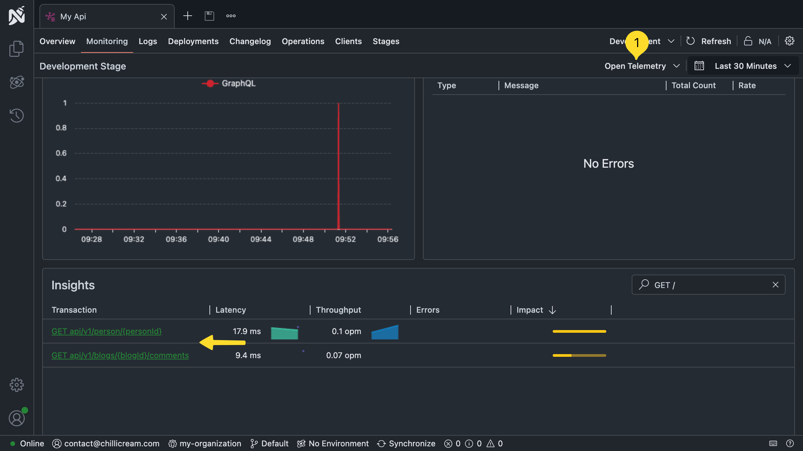

Dear ChilliCream Community,

We hope this message finds you well and as excited as we are about the future of GraphQL development! We've been hard at work, and we have some big news to share with you.

# Hot Chocolate 14 is Here!

After over a year of dedication and over 500 commits from more than 50 contributors, we're thrilled to announce the release of **Hot Chocolate 14**. This is our biggest release since version 10.5 and marks a significant shift in how you build GraphQL servers.

**What's New:**

Hot Chocolate 14 brings a host of new features and improvements designed to make your development experience more intuitive, efficient, and secure.

- **Ease of Use and Simplified Dependency Injection:** We've streamlined dependency injection, allowing you to inject services directly into your resolvers without extra configuration. This leads to cleaner, more maintainable code. No more `[Service]` attribute needed!

- **Enhanced Query Inspection:** Easily check which fields are being requested within a resolver without complex syntax tree traversals. Optimize data fetching based on actual query needs with our new fluent selector inspection API.

- **Improved Pagination:** Implementing pagination is now more straightforward, whether you're building layered applications or using `DbContext` in your resolvers. We've introduced new primitives like `Page<T>` and `PagingArguments`, along with keyset pagination support for Entity Framework Core, enhancing performance and stability.

- **Advanced DataLoader Capabilities:** DataLoader now supports stateful operations, enabling you to batch multiple nested paging requests into a single database query. This optimizes performance, especially for complex queries with nested pagination. Projections in DataLoaders are now possible!

- **Source Generators for Resolvers:** We've expanded our use of source-generated code, allowing for the generation of resolvers and improving build-time feedback. This feature is opt-in and works with our new type extension API, combining the power of the implementation-first approach with the code-first fluent API. Checkout `[ObjectType<T>]`!

- **Enhanced Relay Support:** Hot Chocolate 14 offers better integration with Relay, including support for custom data on edges, control over the shape of connection types, and updated node ID serializers for more efficient handling.

- **Security Enhancements:** We've integrated the IBM cost specification directly into the core of Hot Chocolate. This means that even if you don't configure any security-related options, your GraphQL server is more secure by default. The cost analysis helps prevent expensive operations from overwhelming your server.

- **Optimized Transport Layer:** We've adopted the latest changes from the GraphQL over HTTP specification and reimplemented our persisted operation pipeline. This introduces end-to-end traceability and allows for more efficient operation execution with features like semantic routes.

- **Improved Fusion Support:** While focusing on stability, we've made it easier to configure Fusion with new attributes and improved error handling from source schemas to the composite schema.

**Learn More:**

For a detailed overview of these (and more) new features and improvements, please read our in-depth blog post:

🔗 **[Sneak Peek at Hot Chocolate 14](https://chillicream.com/blog/2024/08/30/hot-chocolate-14)**

---

# Introducing Nitro: A Unified GraphQL Ecosystem

We're also excited to unveil **Nitro**, the new name that brings together our suite of GraphQL tools under one unified ecosystem. Inspired by the smooth yet powerful kick of nitrogen-infused drinks, Nitro embodies the speed, efficiency, and energy we aim to provide in your development workflow.

**Why Nitro?**

As our products evolved, we wanted a name that reflects our commitment to delivering a seamless and powerful GraphQL experience. By **rebranding Banana Cake Pop and Barista to Nitro**, we're simplifying our ecosystem to make it more cohesive and easier to navigate.

**What's Included in Nitro:**

- **Nitro App (Formerly BananaCakePop):** Your all-in-one tool for developing, testing, and optimizing GraphQL APIs.

  - **Get the Nitro App:** [Download Here](https://get-nitro.chillicream.com)
  - **Try Nitro Cloud:** [Launch Now](https://nitro.chillicream.com)

- **Nitro CLI (Formerly Barista):** Manage APIs, publish schema versions, and deploy clients—all from your command line.

- **Nitro Server (Formerly Banana Cake Pop Services):** The backbone of Nitro, providing essential backend services for managing your GraphQL schemas and monitoring API performance.

**Migration Information:**

For details on migrating to Nitro and the changes to our NuGet and NPM packages, please refer to our blog post:

🔗 **[Introducing Nitro: A New Name, A Unified GraphQL Ecosystem](https://chillicream.com/blog/2024/10/07/introducing-nitro)**

## Full Open Telemetry

While our telemetry integration was previously focused only on GraphQL operations, we're excited to announce that we're expanding our telemetry capabilities to include full OpenTelemetry support. This means you can now also monitor your REST APIs, gRPC services, background jobs, and more—all within the same dashboard.

# Get Hands-On with DDD and GraphQL in Our One-Day Workshop  

Join us for a focused, one-day workshop on Domain-Driven Design with GraphQL, where we’ll guide you through practical DDD concepts and their implementation in .NET 9, ASP.NET Core 9, Aspire, Hot Chocolate and Fusion. Learn how CQRS and Domain Events work with GraphQL, and how to manage complex application domains with clean architecture practices. This session is ideal for developers who want to deepen their understanding of DDD principles and see them in action in a GraphQL environment.

Claim your **30% discount NOW**:

👉 [Register for the Workshop](https://www.eventbrite.com/e/enterprise-graphql-with-ddd-cqrs-and-clean-architecture-tickets-1057250156679)

# Share Your Success Story with Us!

Do you love using **Hot Chocolate**, **Fusion**, or **Nitro**? Have you built something amazing that you'd like the world to know about? **We want to hear from you!**

We're on the lookout for testimonials and case studies to feature on our website. Your experiences can inspire others and showcase the real-world impact of our tools.

**Interested in Sharing?**

👉 **[Click here to share your story with us!](https://tally.so/r/3j7R4E)**

---

# Thank You! ❤️

A huge congratulations and thank you to our incredible team and community contributors who poured countless hours into making these releases possible. We're eager to continue pushing the boundaries of what's possible with GraphQL, and we couldn't do it without your support.

Thank you for being a vital part of the ChilliCream community. Let's build the future of GraphQL together!

Warm regards,

The ChilliCream Team
