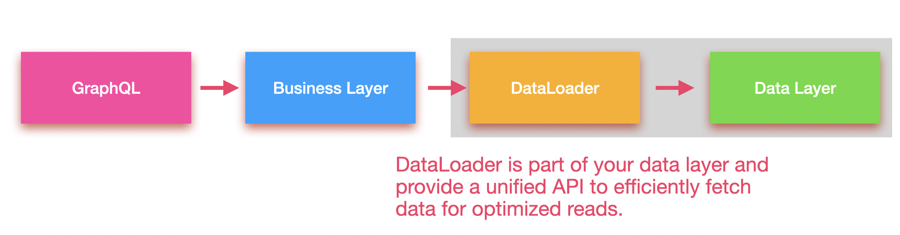

Originally, we did not plan on releasing another major version of Hot Chocolate before we release the next major version of Fusion. Really the whole team was focused on working in Fusion, our platform for building distributed GraphQL services. However, while I was upgrading Microsoft’s Azure Data API Builder to Hot Chocolate 14, I stumbled upon a regression introduced between Hot Chocolate 12 and Hot Chocolate 14. Unfortunately, fixing it in 14.4 would have required breaking changes.

## Type System

Microsoft’s Azure Data API Builder uses type interceptors to build a GraphQL schema from a database schema. The intermediary schema it produces is a heavily annotated GraphQL schema document. This approach is straightforward and we do something similar with Hot Chocolate Fusion. However, in the case of Azure Data API Builder, the directives used are more complex and utilize input object structures.

The issue here is that, when we complete a type while initializing the schema, we do not yet have the entire schema available. Parsing directives is thus not possible before all input types are available. While we have tests covering input objects in directives, they did not cover the specific complexity used by Azure Data API Builder. Also, a bit of randomness in the order of initialization exacerbated the problem.

In Hot Chocolate 15, we fixed this by introducing two additional steps to the initialization process of the type system:

- Complete types – This step no longer completes directives and default values; instead, it only completes types and directive definitions.
- Complete metadata – Directive annotations on type-system members and default values are now completed here, once all types have been fully established.

However, this change had broader implications, so we also introduced another step afterward to complete resolvers and make the schema executable.

**Why does this matter to you?**

If you are using type interceptors, the `OnAfterCompleteTypes` hook may no longer behave as before. This might cause errors that do not break compilation per se but do break the runtime behavior. Because of these changes, we decided to rename the Hot Chocolate 14.4 release to Hot Chocolate 15.

## Opportunities

If we are doing a major release, let’s not waste a version bump just for a regression fix. We decided to merge the changes of our current development branch and turn it into a proper major release, shipping a few nice features in the process.

## Supported .NET Versions

With Hot Chocolate 15, we have realigned the frameworks we support and dropped support for .NET Standard 2.0, .NET 6.0, and .NET 7.0. Going forward, Hot Chocolate 15 supports .NET 8.0 and .NET 9.0. This allows us to modernize a lot of code and remove many conditional compilation directives.

## Projections

One long-standing feature of Hot Chocolate is the `HotChocolate.Data` integration, which makes it easy to build on top of _Entity Framework_, Marten, _RavenDB_ or _MongoDB_. It also rich data features like pagination, sorting, filtering, and projections with minimal setup:

```csharp
[UsePaging]
[UseProjection]
[UseFiltering]
[UseSorting]
public static IQueryable<Product> GetProducts(CatalogContext dbContext)
    => dbContext.Products.AsNoTracking();
```

The drawback to this approach is that your GraphQL layer requires direct access to your data layer, which can be undesirable. It can also lead to a **cartesian explosion** issue, where users can traverse deeply into the graph, retrieving a huge number of rows in the process. This can be not only slow but also quite expensive in terms of database and network load.

Sure, you can use split queries in the case of Entity Framework:

```csharp
[UsePaging]
[UseProjection]
[UseFiltering]
[UseSorting]
public static IQueryable<Product> GetProducts(CatalogContext dbContext)
    => dbContext.Products.AsSplitQuery();
```

We introduced some **experimental** features in Hot Chocolate 14 to address these problems, but we weren’t fully satisfied with the implementation. The general direction was good, but the specifics needed work. So we took a step back, refined what worked, and turned it into a proper feature that is no longer experimental.

## DataLoader Basics

Let’s first discuss **DataLoader**, a fundamental concept in GraphQL for batching and deferring data fetching. What many people don’t know is that Meta (formals Facebook) used the concept of a "data loader" before GraphQL even existed, calling it "preparables" or "loader." The idea is to have a unified, interface for efficiently fetching data.

A DataLoader typically lives close to the data-access layer, and your business logic uses it to fetch data.



The business logic itself should remain simple. Don’t burden your business logic or your consumer with batching concerns or other complexities in fetching data.

**Lets start at the top!**

Ideally, we want our GraphQL layer to be as thin as possible. It serves us to expose our business logic to the outside world but should not be the business logic.

```csharp
public static async Task<Connection<Brand>> GetBrandByIdAsync(
    int id,
    BrandService brandService,
    CancellationToken cancellationToken)
    => await brandService.GetBrandsAsync(id, cancellationToken);
```

There can be many variants of this approach (e.g., using MediatR), but the important bit is: **the resolver is thin and has no direct access to your data layer**. It merely hooks into your business logic.

**Example using MediatR:**

```csharp
[UsePaging]
public static async Task<Connection<Brand>> GetBrandByIdAsync(
    int id,
    ISender sender,
    CancellationToken cancellationToken)
    => await sender.Send(new GetBrandByIdQuery(id), cancellationToken);
```

The business logic enforces rules, handles authorization, or any other checks. The same business logic applies whether you expose it through GraphQL, REST, or some internal service call.

Below is a simplified query/handler:

```csharp
public record GetBrandByIdQuery(int BrandId) : IRequest<Brand?>;

public class GetBrandByIdQueryHandler(IBrandByIdDataLoader dataLoader)
    : IRequestHandler<GetBrandsQuery, Brand?>
{
    public Task<Brand?> Handle(
        GetBrandsQuery request,
        CancellationToken cancellationToken)
        => dataLoader.LoadAsync(request.BrandId, cancellationToken);
}
```

In this example, we’re using a DataLoader (IBrandByIdDataLoader) that fetches a single brand by ID. Regardless of how many times a brand is requested in a GraphQL query, the DataLoader will batch these requests together into a single database call. That’s the power of DataLoader.

```graphql
query GetBrandById {
  brand(id: 1) {
    id
    name
  }
}

query GetBrandsByProducts {
  products {
    nodes {
      name
      brand {
        name
      }
    }
  }
}
```

With Hot Chocolate, writing a DataLoader only requires you to implementing your batch fetch logic. Our source generator takes care of interfaces, dispatching logic, and so forth:

```csharp
[DataLoader]
public static async Task<Dictionary<int, Brand>> GetBrandByIdAsync(
    IReadOnlyList<int> ids,
    CatalogContext context,
    CancellationToken cancellationToken)
    => await context.Brands
        .Where(t => ids.Contains(t.Id))
        .ToDictionaryAsync(t => t.Id, cancellationToken);
```

So, the example above will lead to the DataLoader interface `IBrandByIdDataLoader`.

## Adding Projections, Filtering, and Sorting

How do we now introduce _client-driven_ projections, filtering, and sorting without exposing `IQueryable` from our business layer?

In Hot Chocolate 15, we rethought and rewrote the **GreenDonut** (DataLoader) implementation and introduced some new packages that provide a few primitives to pass between layers while keeping them isolated.


These packages introduce four foundational types:

- `Page<T>` represents a slice (page) of a larger data set.
- `PagingArguments` are used to page through a data set, define what slice you want to have the the larger data set.
- `QueryContext<T>`: Encapsulates a selector expression, a filter expression, and a sort definition.
- `SortDefinition<T>`: Defines how to sort a data set.

These primitives let us build _data-driven_ interactions into our business layer.

Let’s have a look how we might update our resolver to support projections or filtering by adding a `QueryContext<Brand>`.

First lets update our `GetBrandByIdQueryHandler` by adding the query context as optional argument that we pass on to the DataLoader.

```csharp
public record GetBrandByIdQuery(int BrandId, QueryContext<Brand>? Query = null) : IRequest<Brand?>;

public class GetBrandByIdQueryHandler(IBrandByIdDataLoader dataLoader)
    : IRequestHandler<GetBrandsQuery, Brand?>
{
    public Task<Brand?> Handle(
        GetBrandByIdQuery request,
        CancellationToken cancellationToken)
        => dataLoader.With(Query).LoadAsync(request.BrandId, cancellationToken);
}
```

The `QueryContext<Brand>` is simple to use and pass around. In this specific case where we do not need sorting or filtering, we could also just pass an `Expression<Func<Brand, Brand>>` to describe the properties requested by the client. Both will work just fine.

```csharp
public record GetBrandByIdQuery(int BrandId, Expression<Func<Brand, Brand>>? Selector = null) : IRequest<Brand?>;

public class GetBrandByIdQueryHandler(IBrandByIdDataLoader dataLoader)
    : IRequestHandler<GetBrandsQuery, Brand?>
{
    public Task<Brand?> Handle(
        GetBrandByIdQuery request,
        CancellationToken cancellationToken)
        => dataLoader.Select(Selector).LoadAsync(request.BrandId, cancellationToken);
}
```

> if you are using DTOs in your solution the mapping would already be done by the DataLoader. So the selector would be on the DTO type.

This is really a minimal optional change to our business layer but now allows us the specify a selector. Within our DataLoader we can now inject the `QueryContext<Brand>` as DataLoader state and apply this state to our queryable, which will rewrite the queryable to only select the properties the client requested.

```csharp
[DataLoader]
public static async Task<Dictionary<int, Brand>> GetBrandByIdAsync(
    IReadOnlyList<int> ids,
    QueryContext<Brand> query,
    CatalogContext context,
    CancellationToken cancellationToken)
    => await context.Brands
        .Where(t => ids.Contains(t.Id))
        .With(query)
        .ToDictionaryAsync(t => t.Id, cancellationToken);
```

Within our batching method it will never be null. The source generator will either give us an empty context which will select all properties from Brand or pass along the one from the business layer, that reflects the selection choices of the client request.

Within Hot Chocolate you can now register the `QueryContext<T>` so that the resolver compiler recognizes it and compiles an expression for it which defines the field selection.

```csharp
services
  .AddGraphQLServer()
  ...
  .AddQueryContext();
```

With that setup we can update our resolver.

```csharp
[UsePaging]
public static async Task<Connection<Brand>> GetBrandByIdAsync(
    int id,
    QueryContext<Brand> query,
    ISender sender,
    CancellationToken cancellationToken)
    => await sender.Send(new GetBrandByIdQuery(id, query), cancellationToken);
```

This is a very powerful feature that allows you to keep your business layer clean while still enabling client-driven data fetching. Since we are using DataLoader, we do not have to worry about split queries or other inefficiencies.

## Pagination

So, how does this change our resolver when we want to filter and sort? Lets say we have a top-level query that fetches all brands.

```csharp
[UsePaging]
[UseFiltering]
[UseSorting]
public static async Task<Brand[]> GetBrandsAsync(
    ISender sender,
    CancellationToken cancellationToken)
    => await sender.Send(new GetBrands(), cancellationToken);
```

Lets first look at the `GetBrandsQuery` so that we understand what we need to do under the hood.

```csharp
public record GetBrandsQuery(
    PagingArguments PagingArguments,
    QueryContext<Brand>? Query = null)
    : IRequest<Page<Brand>>;
```

The `GetBrandsQuery` is a simple record that takes paging arguments and an optional query context. The paging arguments specify which portion of the dataset to retrieve. The query returns a page of brands, which is one of our four GreenDonut primitives.

```csharp
public class GetBrandQueryHandler(CatalogContext context)
    : IRequestHandler<GetBrandsQuery, Page<Brand>>
{
    public async Task<Page<Brand>> Handle(
        GetBrandsQuery request,
        CancellationToken cancellationToken)
        => await context.Brands
            .With(request.Query)
            .ToPageAsync(request.PagingArguments, cancellationToken);
}
```

The handler in this case simply uses the `CatalogContext` and applies the query context to the queryable. With GreenDonut, we introduced the `ToPageAsync` extension method, which paginates the dataset and implements cursor-based paging algorithms.

For cursor pagination to work, we need a guaranteed order in the dataset. This ensures that we filter directly into the correct section rather than skipping rows and wasting performance on the database. The cursors encode the properties used for ordering. If we were not using client-controlled ordering, I would simply define an order with LINQ.

```csharp
context.Brands.OrderBy(t => t.Name).ThenBy(t => t.Id).ToPageAsync(request.PagingArguments cancellationToken);
```

The important point here is that the order must produce a unique cursor. That’s why we added the `Id` property as the last `ThenBy`. This is a common pattern to ensure the cursor remains unique

With client-controlled sorting, we cannot simply use LINQ, as we do not know whether the user has already applied an order. This is where the Wither method comes in — it allows us to rewrite the order to ensure that the sort definition produces a unique cursor.

```csharp
public class GetBrandQueryHandler(CatalogContext context)
    : IRequestHandler<GetBrandsQuery, Page<Brand>>
{
    public async Task<Page<Brand>> Handle(
        GetBrandsQuery request,
        CancellationToken cancellationToken)
        => await context.Brands
            .With(request.Query, s => s.AddAscending(t => t.Id))
            .ToPageAsync(request.PagingArguments, cancellationToken);
}
```

In the example above, we added the `Id` property in ascending order. However, we could also define a default order if the user has not specified one.

```csharp
public class GetBrandQueryHandler(CatalogContext context)
    : IRequestHandler<GetBrandsQuery, Page<Brand>>
{
    public async Task<Page<Brand>> Handle(
        GetBrandsQuery request,
        CancellationToken cancellationToken)
        => await context.Brands
            .With(request.Query, DefaultOrder)
            .ToPageAsync(request.PagingArguments, cancellationToken);

    private static SortDefinition<Brand> DefaultOrder(SortDefinition<Brand> sort)
        => sort.IfEmpty(o => o.AddDescending(t => t.Name)).AddAscending(t => t.Id);
}
```

Basically, ordering by name is only added if the user has not defined an order, whereas ordering by ID is always appended.

```csharp
[UsePaging]
[UseFiltering]
[UseSorting]
public static async Task<Brand[]> GetBrandsAsync(
    PagingArguments pagingArgs,
    QueryContext<Brand> query,
    ISender sender,
    CancellationToken cancellationToken)
    => await sender.Send(new GetBrands(pagingArgs, query), cancellationToken);
```

The resolver itself changes only slightly, simply passing along the selection, filter, and sorting context wrapped in a `QueryContext<T>`, along with some paging arguments. However, this alone is not sufficient. In GraphQL, the paging type is a connection, whereas in our business layer, we have designed it as a `Page<T>`. Therefore, we still need to convert the `Page<T>` to a `Connection<T>`. For this the `HotChocolate.Data` package provides an extension method called `ToConnectionAsync`.

```csharp
[UsePaging]
[UseFiltering]
[UseSorting]
public static async Task<Connection<Brand>> GetBrandsAsync(
    PagingArguments pagingArgs,
    QueryContext<Brand> query,
    ISender sender,
    CancellationToken cancellationToken)
    => await sender.Send(new GetBrands(pagingArgs, query), cancellationToken).ToConnectionAsync();
```

Awesome, we’re done! But wait — we didn’t use a DataLoader in this case since it’s a top-level functionality. DataLoaders are useful when fetching data by a specific key. For instance, if we were retrieving a product’s brand, we would need a DataLoader. Otherwise, a query like the following could result in an excessive number of database queries.

```graphql
query GetBrandsByProducts {
  brands {
    nodes {
      name
      products {
        nodes {
          name
        }
      }
    }
  }
}
```

If we were to fetch 50 brands, we would end up making 50 database requests to retrieve the products for each brand in view.

To optimize this, we could build a DataLoader following the same approach as we did for fetching a brand by ID. However, in this case, we need to batch, paginate, and slice the dataset using cursor pagination efficiently.

```csharp
[DataLoader]
public static async Task<Dictionary<int, Page<Product>>> GetProductsByBrandAsync(
    IReadOnlyList<int> brandIds,
    PagingArguments pagingArgs,
    QueryContext<Product> queryContext,
    CatalogContext context,
    CancellationToken cancellationToken)
{
    return await context.Products
        .Where(t => brandIds.Contains(t.BrandId))
        .With(queryContext)
        .ToBatchPageAsync(t => t.BrandId, pagingArgs, cancellationToken);
}
```

Again, we pass along the `QueryContext<T>`. However, instead of using `ToPageAsync`, we use ToBatchPageAsync, which batches data fetching and slicing into a single database request.

```csharp
public async Task<Page<Brand>> Handle(
    GetProductsByBrandsQuery request,
    CancellationToken cancellationToken = default)
    => await productsByBrand
        .With(request.PagingArguments, request.Query)
        .LoadAsync(brandId, cancellationToken) ?? Page<Product>.Empty;
```

The beauty of this approach is that the complexity in my business layer remains unchanged. Similarly, in my resolver, the complexity is the same as implementing a top-level query. Overall, while I gain full control over what happens in each layer, the complexity within each layer remains constant.


## DataLoader Branching

But wait — if we use a DataLoader and fetch by key and path in different query contexts, wouldn’t that lead to conflicting data fetches? It would if we were using the same DataLoader. However, DataLoaders are immutable. When we apply a wither method, we are effectively branching the DataLoader as we are effectively changing what we fetch and how we fetch it.

Essentially, we create a unique key based on the state passed into the DataLoader, which generates a new branch. If another resolver with the same state requests a different entity key, we look up the corresponding branch of the DataLoader and delegate the request to the correct instance.

You can even branch further on top of the Wither method. For example, if you always need to ensure that data is queried within a specific customer context, you could add an additional where clause on top of our DataLoader. This would create a new branch of our DataLoader ensuring that only this `Handle` method will restrict data fetching.

```csharp
public async Task<Page<Brand>> Handle(
    GetProductsByBrandsQuery request,
    CancellationToken cancellationToken = default)
    => await productsByBrand
        .With(request.PagingArguments, request.Query)
        .Where(t => t.CustomerId == session.CustomerId)
        .LoadAsync(brandId, cancellationToken) ?? Page<Product>.Empty;
```

We distinguish between ordering, where clauses, and selections. Selections, for instance, can be merged within the same instance, resulting in slight overfetching but still retrieving the correct data within a single request.

```csharp
public async Task<Page<Brand>> Handle(
    GetProductsByBrandsQuery request,
    CancellationToken cancellationToken = default)
    => await productsByBrand
        .With(request.PagingArguments, request.Query)
        .Where(t => t.CustomerId == session.CustomerId)
        .Include(t => t.SomeInternalId)
        .LoadAsync(brandId, cancellationToken) ?? Page<Product>.Empty;
```

In this case, the Include is merged into the same DataLoader branch. The new DataLoader allows you to define custom branching rules and introduce custom state, enabling you to extend the base functionality as needed.

## Conclusion

While we hadn’t originally planned to release this at this time, I believe it brings a fantastic set of additions and will empower you to build layered and clean GraphQL  services better than ever. With the new APIs — and I’ve only shown a fraction of them — you can now create well-structured GraphQL services without compromising performance or abstraction. At the same time, you can keep complexity low and productivity high.

Try it out and let us know what you think! We’re always looking to improve Hot Chocolate based on your feedback.

I will follow up the blog post with a couple of more detailed YouTube episodes on how to use these new features.

In the meantime, we’re hard at work on the next major Fusion update, which is going to be huge. I’d love to share some tidbits with you, but I don’t want to spoil the surprise! 😃

Join our community on Slack or follow us on Twitter — we’re always happy to help and chat with you!

https://slack.chillicream.com
