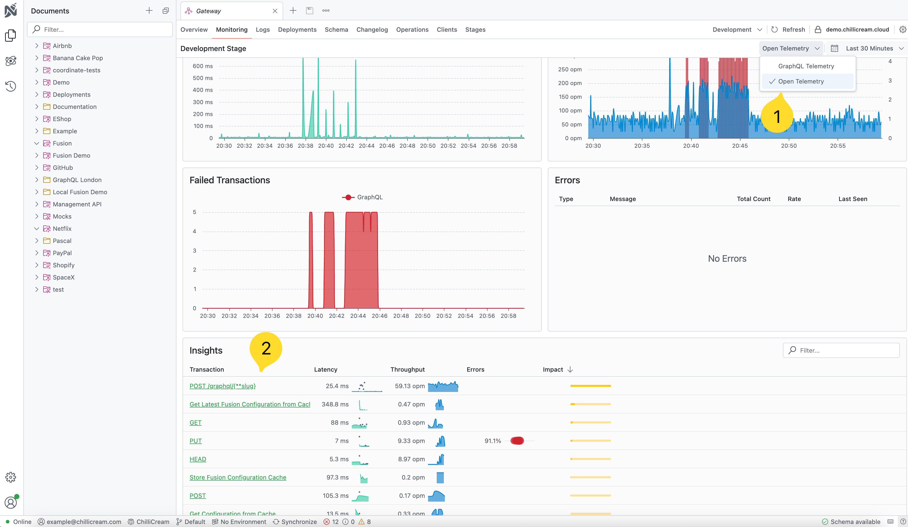

# Open Telemetry for All Your Services (and More!)

We’re thrilled to introduce **OpenTelemetry support for all your .NET-based services** - not just your GraphQL Servers. Whether you have REST APIs, background workers, or any other .NET applications, you can now unify and analyze your telemetry data in Nitro. This marks a significant step in helping you gain deeper insights across your entire infrastructure.

With **ChilliCream.Nitro.Telemetry** version 15.0.0 and 14.1.0, simply call the extension method `AddNitroTelemetry` in your service registration to integrate Nitro with any .NET service. All you need to do is configure OpenTelemetry exporters, and Nitro will collect and visualize your logs and traces:

```csharp
services.ConfigureOpenTelemetryTracerProvider(x => x.AddNitroExporter());
services.ConfigureOpenTelemetryLoggerProvider(x => x.AddNitroExporter());

services.AddNitroTelemetry(options =>
{
    options.ApiId = apiId;
    options.ApiKey = apiKey;
    options.Stage = stage;
});
```

On the trace overview of your API in the Nitro dashboard, select **OpenTelemetry** from the dropdown on the top right. You’ll be able to inspect all your HTTP requests, background workers, or anything else you’re tracking with OTEL. We’ve also **drastically improved telemetry performance**, so these insights will load and refresh faster than ever.



In this post, you’ll also learn about:

- **Personal Access Tokens (PATs)**, which bring more secure and granular authentication options to your automation workflows.
- **Enhanced Non-Interactive Command Execution** in the Nitro CLI, enabling full automation for API lifecycle tasks.
- The difference between **API Keys** and **PATs**, helping you choose the right authentication mechanism for every scenario.

Read on to discover how you can level up your .NET observability and API management automation, all within one powerful platform.

---

## Introducing Personal Access Tokens (PATs)

To provide more flexibility and security in your automation processes, we have introduced **Personal Access Tokens (PATs)**. PATs allow you to authenticate with the Nitro platform in a secure and granular manner, ideal for scripting and automated tasks.

### What are PATs?

Personal Access Tokens are tokens associated with your user account that grant access to the Nitro API.

- **Automation-Friendly**: PATs are perfect for use in CI/CD pipelines, scripts, and other automated workflows where you need to authenticate non-interactively.
- **User-Specific**: Unlike API keys tied to a specific API, PATs are linked to your user account, providing access across multiple APIs.

### How to Create a PAT

You can create a PAT using the following command:

```shell
nitro pat create --description "My Automation Token" --expires 180
```

- `--description`: A description for the token to help you identify it later.
- `--expires`: The number of days after which the token will expire (default is 180 days).

## Non-Interactive Command Execution

We have improved the Nitro CLI to support full non-interactive execution for all commands. This enhancement empowers you to automate every aspect of your API lifecycle management, from creating APIs and editing stages to generating API keys.

### Benefits of Non-Interactive Commands

- **Automation**: Integrate Nitro CLI commands into your scripts and CI/CD pipelines without manual intervention.
- **Consistency**: Ensure consistent execution of tasks across different environments.
- **Efficiency**: Automate repetitive tasks to save time and reduce human error.

### How to Use Commands Non-Interactively

All commands now accept input via command-line options or environment variables, allowing you to bypass interactive prompts. For example, to create an API non-interactively:

```shell
nitro api create --name "My API" --path "/my-api" --workspace-id "workspace123"
```

You can also set environment variables for inputs:

```shell
export NITRO_API_NAME="My API"
export NITRO_API_PATH="/my-api"
export NITRO_WORKSPACE_ID="workspace123"
nitro api create
```

### Parsing Command Output

By default, Nitro CLI provides human-readable output. When automating, you might need machine-readable output. Use the `--output json` option to get the output in JSON format:

```shell
nitro api-key list --output json
```

This output can then be parsed using tools like `jq`:

```shell
nitro api-key list --output json | jq '.'
```

## API Keys vs. PAT

**API Keys**

- **Purpose**: Designed for application-level authentication, such as telemetry reporting from your GraphQL server.
- **Scope**: Tied to a specific API and workspace.
- **Creation**: Generated using the `nitro api-key create` command.
- **Usage**: Best for telemetry, fusion, client registry, or other application-level tasks where you need to authenticate a specific API.

**Personal Access Tokens (PATs)**

- **Purpose**: Intended for user-level authentication, suitable for automating tasks that require broader access across APIs.
- **Scope**: Associated with your user account, has workspace permissions.
- **Creation**: Generated using the `nitro pat create` command.
- **Usage**: Best for scripts, automation tools, and CI/CD pipelines that need to perform various operations on the Nitro platform.

---

## Get Started Today

With **expanded OpenTelemetry integration**, **personal access tokens**, and **full non-interactive command support**, it’s never been easier to automate your API management workflows while simultaneously gaining comprehensive insights into your.NET services. Try out the improved telemetry overview, create your first PAT, and add Nitro to your automation pipelines to take full advantage of these new features.

### Need Help? We’ve Got You Covered!

Whether you’re integrating OpenTelemetry for the first time or looking to streamline your API automation, our **support contracts** provide expert guidance to help you get up and running quickly. From troubleshooting to best practices, our team is here to ensure your success. [Learn more about our support plans](https://chillicream.com/services/support) and get tailored assistance for your specific needs.

### Resources

- **Documentation**: Check out our [updated documentation](https://chillicream.com/docs/nitro) for a deeper look at the new commands and options.
- **Support**: If you have any questions or need assistance, feel free to reach out to our support team on slack!
