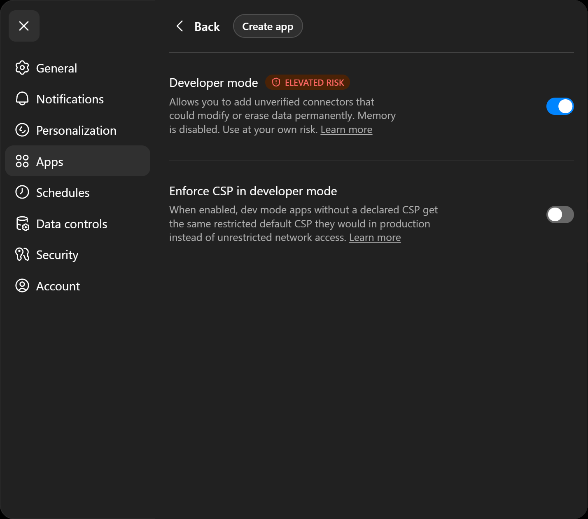
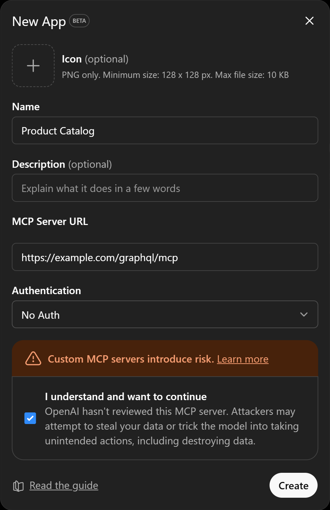
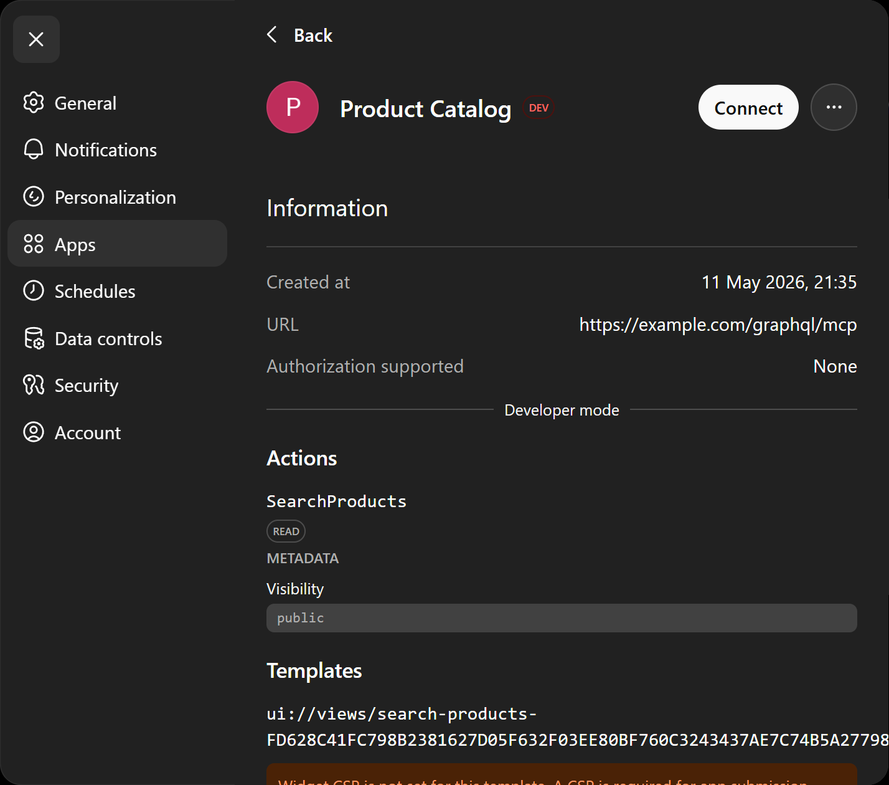
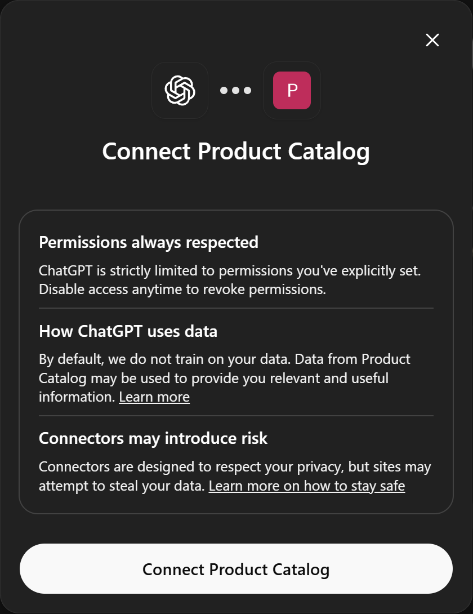
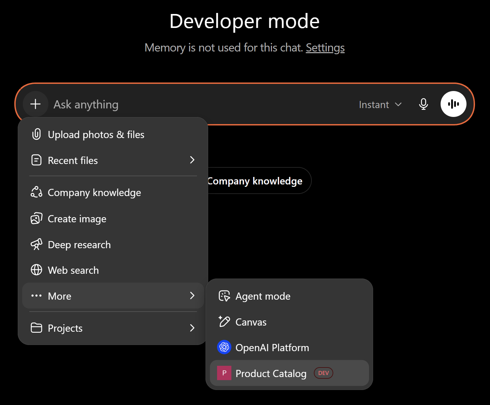
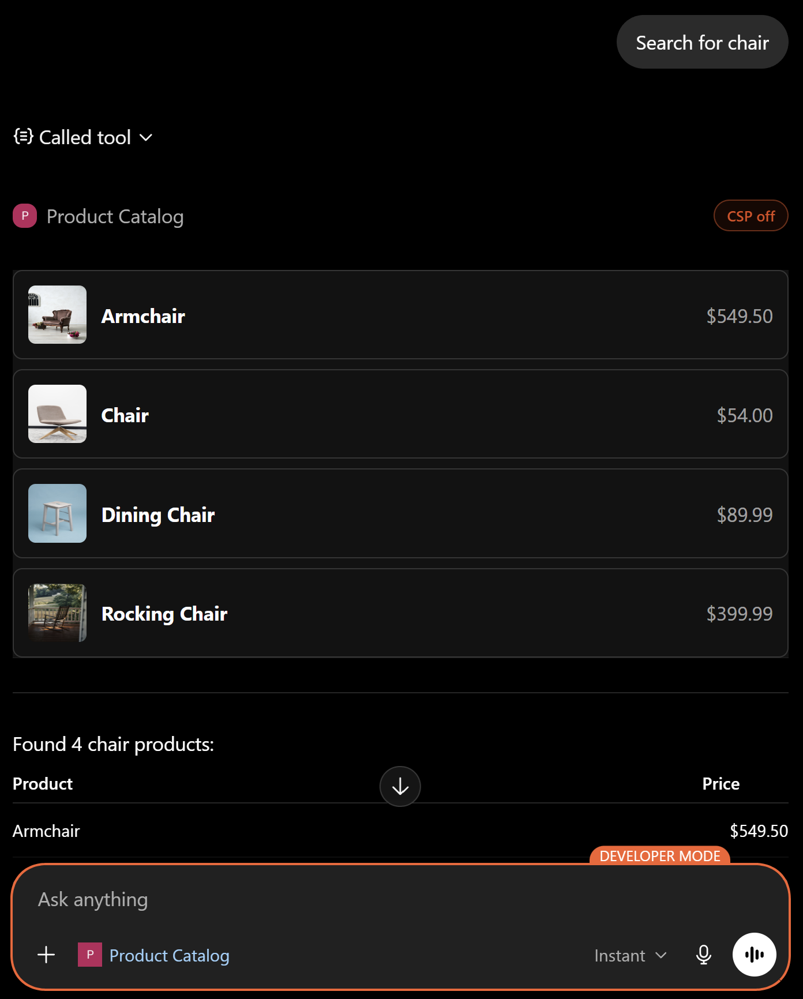

Agents are becoming first-class consumers of our APIs. Alongside the web and mobile clients we have always served, our servers now talk to models that reason over typed tool results and decide what to call next. The [Model Context Protocol](https://modelcontextprotocol.io) (MCP) is the interface they use. If you already run a GraphQL server with Hot Chocolate or a Fusion gateway, you have most of what you need to be an MCP server. You have a typed schema, you have operations with arguments and results, you have validation and error handling. What is missing is the wiring.

Hot Chocolate 16 ships that wiring. With the new MCP adapter and Nitro as the control plane, two calls on your server expose every published tool and prompt at `/graphql/mcp`. Authoring is plain files on disk, deployment is a CLI command, and rolling out a new version of your tool catalog does not require a redeploy.

## What MCP is, and why you might want it

MCP is an open standard for connecting AI applications to external systems. The host (Claude, ChatGPT, a VS Code agent, an internal agent runtime) speaks the protocol once. Any MCP-compatible server plugs in without custom integration code per product.

An MCP server exposes two main things:

- **Tools** are callable operations. The model picks which one to call, fills in the arguments, and reads the result.
- **Prompts** are templated workflows. The user picks one from the host's prompt menu, fills in a few inputs, and the host hands a pre-shaped conversation to the model.

For a GraphQL backend the fit is good. A tool is a GraphQL operation, its arguments are GraphQL variables, and its result is the JSON your server already returns. Your schema stays the source of truth, and your tool catalog is just a set of operations against it.

## The pieces

There are three moving parts:

1. **The MCP adapter** on your Hot Chocolate server or Fusion gateway. It speaks MCP over Streamable HTTP and answers tool and prompt requests by running operations against the schema.
2. **A feature collection** on disk: GraphQL files for tools, JSON files for prompts, optional HTML files for inline views.
3. **Nitro** as the control plane. It stores versioned, immutable snapshots of the collection, validates them on upload, distributes them to your runtime, and surfaces per-tool telemetry.

The adapter does not know how to fetch tools on its own. It asks an `IMcpStorage` for them. With Nitro referenced, that storage is wired up automatically. With Nitro absent, you can implement `IMcpStorage` yourself for self-hosted scenarios, but most teams should let Nitro do the heavy lifting.

## Enable MCP on a Hot Chocolate server

Start with an existing GraphQL server. Reference the adapter, the core Nitro package, and the Hot Chocolate integration:

```bash
dotnet add package HotChocolate.Adapters.Mcp
dotnet add package ChilliCream.Nitro
dotnet add package ChilliCream.Nitro.HotChocolate
```

`ChilliCream.Nitro` ships a source generator that emits an `AddDefaults()` extension method from the integration packages you reference. With `ChilliCream.Nitro.HotChocolate` in the project, `AddDefaults()` calls `AddHotChocolate()` for you.

Wire it up:

```csharp
var builder = WebApplication.CreateBuilder(args);

builder.Services
    .AddNitro(o =>
    {
        o.ApiId = builder.Configuration["Nitro:ApiId"]!;
        o.ApiKey = builder.Configuration["Nitro:ApiKey"]!;
        o.Stage = builder.Configuration["Nitro:Stage"]!;
    })
    .AddDefaults();

builder
    .AddGraphQL()
    .AddMcp();

var app = builder.Build();

app.MapGraphQL();
app.MapGraphQLMcp();

app.Run();
```

`AddMcp()` registers the MCP server and a warmup that pulls tool and prompt definitions from storage at startup. `MapGraphQLMcp()` exposes the transport at `/graphql/mcp`. That is the URL any MCP client will connect to.

If you prefer environment variables, set `NITRO_API_ID`, `NITRO_API_KEY`, and `NITRO_STAGE` and drop the `AddNitro` delegate entirely. Nitro service options bind to them.

## Enable MCP on a Fusion gateway

The Fusion story is the same shape. Different packages, same two calls:

```bash
dotnet add package HotChocolate.Fusion.Adapters.Mcp
dotnet add package ChilliCream.Nitro
dotnet add package ChilliCream.Nitro.Fusion
```

```csharp
var builder = WebApplication.CreateBuilder(args);

builder.Services
    .AddNitro(o =>
    {
        o.ApiId = builder.Configuration["Nitro:ApiId"]!;
        o.ApiKey = builder.Configuration["Nitro:ApiKey"]!;
        o.Stage = builder.Configuration["Nitro:Stage"]!;
    })
    .AddDefaults();

builder
    .AddGraphQLGateway()
    .AddMcp();

var app = builder.Build();

app.MapGraphQL();
app.MapGraphQLMcp();

app.Run();
```

The gateway resolves your tools' GraphQL operations across all source schemas it composes, so a single tool can fetch data from multiple subgraphs in one call. From the model's perspective there is just one MCP server and one URL.

## Author tools and prompts on disk

A feature collection is a folder tree. Each tool and each prompt lives in its own folder, and files inside the folder share the folder name as the basename:

```text
mcp/
├── prompts/
│   └── SearchProducts/
│       └── SearchProducts.json
└── tools/
    └── SearchProducts/
        ├── SearchProducts.graphql
        ├── SearchProducts.html
        └── SearchProducts.json
```

The CLI picks files up by glob (`./mcp/tools/**/*.graphql`, `./mcp/prompts/**/*.json`) and brings sibling `.json` and `.html` files along automatically.

### A tool is a GraphQL operation

The minimum a tool needs is a `.graphql` file. The basename is the tool name. GraphQL variables become MCP tool arguments. The result the server returns is what the model sees.

`mcp/tools/SearchProducts/SearchProducts.graphql`:

```graphql
query SearchProducts($text: String!, $first: Int! = 10) {
  products(searchText: $text, first: $first) {
    nodes {
      id
      name
      price
      pictureUrl
    }
  }
}
```

With just that file, `SearchProducts` is already a working MCP tool.

### Optional settings

Add a sibling `.json` file for a custom title, icons, or behavior hints:

`mcp/tools/SearchProducts/SearchProducts.json`:

```json
{
  "title": "Search Products",
  "annotations": {
    "openWorldHint": false,
    "idempotentHint": true
  }
}
```

The title shows up in the host's tool picker. Annotations help the model decide whether the call is safe to retry or whether it could have side effects.

### An optional MCP Apps view

[MCP Apps](https://apps.extensions.modelcontextprotocol.io/) is an extension to MCP that lets the server return interactive HTML the host renders inside the chat, alongside the plain-text result. The host loads the HTML into a sandboxed iframe and bridges JSON-RPC over `postMessage`, so the view can read tool results, follow the host's theme, and call other tools.

Drop a sibling `.html` file next to your `.graphql` file. The basename matches the tool name. A small JavaScript module connects to the host via the MCP Apps SDK:

`mcp/tools/SearchProducts/SearchProducts.html`:

```html
<!DOCTYPE html>
<html lang="en">
  <head>
    <style>
      :root {
        color-scheme: light dark;
      }
      body {
        font-family: var(--font-sans, system-ui, sans-serif);
        margin: 0;
        padding: 16px;
        color: var(--color-text-primary, CanvasText);
        background: var(--color-background-primary, Canvas);
      }
      ul {
        list-style: none;
        margin: 0;
        padding: 0;
        display: grid;
        gap: 8px;
      }
      li {
        display: flex;
        align-items: center;
        gap: 12px;
        padding: 12px;
        border: 1px solid var(--color-border-primary, color-mix(in srgb, CanvasText
                15%, transparent));
        border-radius: var(--border-radius-md, 8px);
      }
      img {
        border-radius: var(--border-radius-sm, 6px);
        flex-shrink: 0;
      }
      strong {
        flex: 1;
      }
      span {
        color: var(
          --color-text-secondary,
          color-mix(in srgb, CanvasText 60%, transparent)
        );
        font-variant-numeric: tabular-nums;
      }
    </style>
  </head>
  <body>
    <ul id="products"></ul>

    <script type="module">
      import {
        App,
        applyHostStyleVariables,
        applyHostFonts,
      } from "https://cdn.jsdelivr.net/npm/@modelcontextprotocol/ext-apps@1.7.1/dist/src/app-with-deps.js";

      const app = new App({ name: "SearchProducts", version: "1.0.0" });

      app.ontoolresult = (result) => {
        const products = result?.structuredContent?.data?.products?.nodes ?? [];
        document.getElementById("products").innerHTML = products
          .map(
            (p) => `
              <li>
                
                <strong>${p.name}</strong>
                <span>$${p.price.toFixed(2)}</span>
              </li>
            `
          )
          .join("");
      };

      app.onhostcontextchanged = (ctx) => {
        if (ctx.theme) {
          document.documentElement.style.colorScheme = ctx.theme;
        }
        if (ctx.styles?.variables)
          applyHostStyleVariables(ctx.styles.variables);
        if (ctx.styles?.css?.fonts) applyHostFonts(ctx.styles.css.fonts);
      };

      await app.connect();

      const ctx = app.getHostContext();
      if (ctx) app.onhostcontextchanged(ctx);
    </script>
  </body>
</html>
```

What is happening here:

1. We import the MCP Apps SDK straight from jsDelivr to keep the example self-contained. In production you would bundle it (Vite, esbuild, your tool of choice) and emit a single HTML file as the build output, so the view does not depend on a third-party CDN at runtime.
2. We register an `ontoolresult` handler before calling `app.connect()`. The host can deliver the initial tool result the moment the bridge opens, so wiring the handler up after the connect call would miss it.
3. The handler reads `result.structuredContent`, which is the JSON result of the tool's GraphQL operation, and renders the nodes as a plain list.

In hosts that support MCP Apps, the chat will render this list inline. In plain-text hosts the view is ignored and the tool result is displayed as text. Both work without changes.

<!-- spell-checker:ignore: ontoolresult onhostcontextchanged nums srgb -->

### A prompt is templated JSON

`mcp/prompts/SearchProducts/SearchProducts.json`:

```json
{
  "title": "Search Products",
  "description": "Search the catalog from a free-text query.",
  "arguments": [
    {
      "name": "searchQuery",
      "title": "Search Query",
      "required": true
    }
  ],
  "messages": [
    {
      "role": "user",
      "content": {
        "type": "text",
        "text": "Find products related to \"{searchQuery}\" in our catalog."
      }
    }
  ]
}
```

`{searchQuery}` is interpolated from the matching argument. Whatever you declare in `arguments` is available as `{name}` inside `messages`.

## Publish with the Nitro CLI

The CLI does the archive, validate, upload, and publish steps. Three commands take you from disk to a live tool catalog.

### 1. Create the feature collection

A collection is a named container for a set of tools and prompts. Create one for your API:

```shell
nitro mcp create \
  --name "Product Catalog" \
  --api-id "<api-id>"
```

`<api-id>` comes from `nitro api list` or the Nitro UI. The command prints the new collection ID. Save it.

### 2. Upload a tagged version

Each upload is a complete, immutable snapshot tagged with a name (a release tag, a Git SHA, anything you want):

```shell
nitro mcp upload \
  --mcp-feature-collection-id "<collection-id>" \
  --tag "v1" \
  --tool-pattern "./mcp/tools/**/*.graphql" \
  --prompt-pattern "./mcp/prompts/**/*.json"
```

The CLI walks the glob patterns, picks up sibling `.json` and `.html` files, packages everything into a ZIP, and uploads it. Nitro validates the archive on the server before storing it.

### 3. Publish to a stage

Uploading does not expose anything to clients. Publishing makes a tagged version live on a stage:

```shell
nitro mcp publish \
  --mcp-feature-collection-id "<collection-id>" \
  --tag "v1" \
  --stage "dev"
```

Stages are independent. Publishing to `dev` does not touch `production`. To roll back, publish an earlier tag to the same stage. The runtime picks up the change over the Nitro change feed and updates its tool set in place, no restart required.

### Optional: smoke-test with MCP Inspector

Before you point a chat host at the URL, exercise the tools with [MCP Inspector](https://github.com/modelcontextprotocol/inspector), the official MCP debugging tool:

```shell
npx @modelcontextprotocol/inspector
```

Open the printed URL in a browser, point it at `https://<your-graphql-host>/graphql/mcp`, and invoke the tools with arbitrary arguments. This catches schema mismatches and bad prompt JSON without round-tripping through a chat host.

## Add the server to ChatGPT

ChatGPT exposes remote MCP servers as apps in Developer mode. The flow is similar in Claude, VS Code, and other hosts. The exact menus shift over time, so the canonical references are:

- [Connect from ChatGPT (Apps SDK)](https://developers.openai.com/apps-sdk/deploy/connect-chatgpt)
- [Claude custom connectors](https://support.claude.com/en/articles/11175166-get-started-with-custom-connectors-using-remote-mcp)
- [VS Code MCP servers](https://code.visualstudio.com/docs/copilot/customization/mcp-servers)
- [Full MCP clients directory](https://modelcontextprotocol.io/clients)

In ChatGPT, open **Settings** → **Apps** → **Advanced settings** and enable **Developer mode**. Then add a new app:



Fill in a name, the MCP server URL (`https://<your-graphql-host>/graphql/mcp`), and the authentication settings your server requires. A description is optional. Tick the **I understand and want to continue** checkbox to acknowledge the warning about third-party servers:



Click **Create**. The app's detail page opens, listing the published tools with a **Connect** button in the top right:



Click **Connect**. ChatGPT shows a confirmation dialog that summarizes permissions, data use, and the risks of connecting third-party servers:



Confirm by clicking **Connect Product Catalog** at the bottom of the dialog. The app is now available in chats. In a new chat, open the **+** menu next to the composer, expand **More**, and select your app:



When the model decides to call `SearchProducts`, the host invokes the tool, your gateway runs the GraphQL operation, and the result comes back. If the tool has an Apps view, it renders inline:



## What you get from Nitro

Once tools are flowing, the management surface is where Nitro pays off:

- **Versioning**: every `nitro mcp upload` produces an immutable tagged snapshot. Rollback is republishing an earlier tag.
- **Multi-stage**: publish to `dev`, validate, then publish the same tag to `production`. Stages are independent and permissions are stage-scoped.
- **Validation**: GraphQL documents are validated against your schema, prompt JSON against its structure, and the validator checks for conflicts with what is already published. Broken collections never reach a stage.
- **Telemetry**: per-tool request count, error rate, mean and P95/P99 latency, traces, and structured logs in the Nitro UI.

When a new version is published, the change feed pushes it to the runtime. The server picks up the new tools and prompts in place.

## Wrap up

Two lines on the server, a folder of files on disk, three CLI commands to publish. If you have a Hot Chocolate server or a Fusion gateway, you have an MCP server.

We are building on top of the existing strengths of GraphQL here. Your tools reuse the schema you already have, your arguments reuse the type system you already have, and your results reuse the responses you already serve. The MCP adapter is the protocol shim. Nitro is the control plane. Everything else is your API.

If you want to go deeper, the full references are here:

- Hot Chocolate adapter: [MCP Adapter](/docs/hotchocolate/v16/build/adapters/mcp)
- Fusion adapter: [MCP Adapter](/docs/fusion/v16/adapters/mcp)
- Nitro authoring and CLI: [Nitro MCP](/docs/nitro/adapters/mcp)
- MCP specification: [modelcontextprotocol.io](https://modelcontextprotocol.io/)
- MCP Apps SDK: [API reference](https://apps.extensions.modelcontextprotocol.io/api/)

Give it a try, ship a few tools, and let us know what you build.
