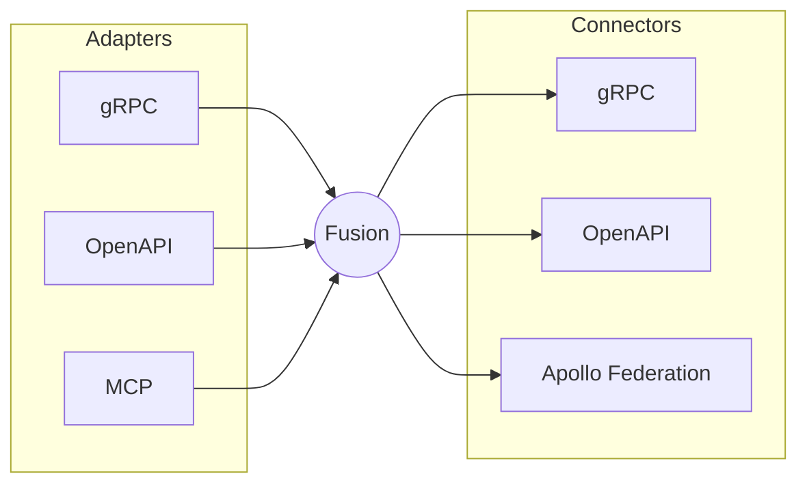

# What’s New in Fusion 16

When we first created Fusion, it was built as an extension on top of Hot Chocolate. This approach let us leverage Hot Chocolate’s strengths and saved us significant development and maintenance effort. However, it also imposed constraints on both projects. Hot Chocolate had to avoid breaking Fusion, and Fusion was limited by Hot Chocolate’s architecture. For example, because we couldn’t change the type system to natively carry the metadata Fusion needs for operation planning, we had to rely on generic extension points, which cost us performance.

The breaking point came with a Hot Chocolate 14 bug fix that inadvertently broke Fusion’s query planner. A correct fix in one project became a regression in the other. That’s when we knew it was time to untangle the two.

Around this time, we noticed other gateway vendors rewriting their solutions in Rust and other went straight with Go. It’s tempting to follow that trend: pick a new language, claim performance gains, and move on. For us, though, switching platforms did not make sense. We have always **considered ASP.NET Core our biggest asset**, and building on it with C# gave us the strongest foundation for Fusion.

## ASP.NET Core

Every GraphQL gateway faces the same challenges and must implement core features like authentication, header propagation, retries, rate limits, observability, and more. While most gateways either reimplement these features and hiding them behind layers of configuration and closed binaries, we chose a different path.

Fusion is NOT a closed product you install and configure from the outside. Instead, it is an open library that you bring into your own ASP.NET Core application, giving you direct access to every part of the stack and letting you shape the gateway to your needs.

Fusion is an OPEN library that sits on top of ASP.NET Core, giving you full access to your Program.cs, middleware pipeline, dependency injection container, and `IHttpClientFactory`. Your application is the gateway, not a closed product or a black box.

This single decision shapes everything that follows:

- Authentication uses the same AddAuthentication() you already know, whether that is JWT, OIDC, mTLS, cookies, or any other method your platform team prefers. Fusion does not ship its own authentication stack because ASP.NET Core already provides one.
- Header propagation, mTLS to subgraphs, connection pooling, hedging and retries are all managed by `IHttpClientFactory`. This component is battle-tested by Microsoft and used at massive scale in Azure, Bing, and Office.
- Observability is built on the standard .NET OpenTelemetry pipeline, using the same exporters, conventions, and dashboards as the rest of your fleet. Fusion implements the new GraphQL OpenTelemetry specification, so traces and metrics align with other GraphQL servers.
- Extensibility is pure C#. There is no scripting, no plugin ABI, and no out-of-process coprocessors. If you need Redis, just add the StackExchange.Redis package and write your code.

Most importantly, Fusion automatically benefits from every security patch Microsoft releases, every performance improvement in the .NET stack, and every new Kestrel release.

To get started with a Fusion gateway, first install our templates:

```bash
dotnet new install HotChocolate.Templates
```

Next, create your project:

```bash
dotnet new graphql-gateway
```

That’s all it takes. The default gateway is as simple as an empty ASP.NET Core web application. You can ship it as-is, bundled with the composition output:

```csharp
var builder = WebApplication.CreateBuilder(args);

builder.Services
    .AddHttpClient("fusion");

builder
    .AddGraphQLGateway()
    .AddFileSystemConfiguration("./gateway.far");

var app = builder.Build();

app.MapGraphQL();

app.Run();
```

If you want to add request deduplication, just add a message handler to the HttpClient. There is no need for brittle YAML configuration. Register the HttpClient for the gateway, enable deduplication, and you are done:

```csharp
var builder = WebApplication.CreateBuilder(args);

builder.Services
    .AddHttpClient("fusion")
    .AddRequestDeduplication();

builder
    .AddGraphQLGateway()
    .AddFileSystemConfiguration("./gateway.far");

var app = builder.Build();

app.MapGraphQL();

app.Run();
```

For incremental retry, hedging, or other policies, simply add Polly or use the Aspire service defaults:

```csharp
builder.Services
    .AddHttpClient("fusion")
    .AddRequestDeduplication()
    .AddStandardResilienceHandler(options =>
    {
        options.Retry.MaxRetryAttempts = 5;
        options.Retry.BackoffType = DelayBackoffType.Linear;
        options.Retry.Delay = TimeSpan.FromMilliseconds(500);
    });
```

## Performance

With Fusion 16 we focused on .NET and examined the core challenges for the gateway. These are similar to the problems Kestrel had to solve. In the hot path, a GraphQL gateway repeatedly fetches data from subgraphs and integrates it into the gateway response. Most of this data is JSON.

A naive approach would parse each subgraph response into a `JsonDocument`, build the gateway response as a mutable `JsonNode`, and merge them. This method is inefficient, leading to many object allocations and constant data copying. Inspired by Rust’s arena allocation model, where all resources for a request are released together, we sought a better way than relying on the garbage collector.

In .NET, it’s common to rent byte arrays to reduce pressure on the garbage collector and keep allocations stable. However, resizing arrays is inefficient and can hurt performance. When you need to store data but do not know its final size, you typically rent an array of a certain size. If the array turns out to be too small, you must rent a larger one, copy the existing data over, and return the old array. This process is slow and reduces the efficiency of the array pool, especially with unpredictable GraphQL response sizes.

To make .NET competitive, we adopted several principles:

1. **Everything is managed as bytes**. This allows memory to be reused for metadata, objects, scalars, and JSON.
2. **We do not copy memory**. Instead of copying data from the source schema results into the gateway result, we reference the data directly. The gateway result is composed of many pointers to the memory of the source schemas. This approach reduces the need to duplicate data and keeps the memory footprint small.
3. **Memory is chunked**. We never expand a rented array, which would require copying. Instead, memory is divided into fixed-size chunks. Each request rents chunks and writes into them as needed. Most values fit within a single chunk, but cross-chunk reads are supported and efficient.
4. **Each request owns its memory chunks** and returns them when completed. This prevents memory leaks and simplifies resource management.
5. **The memory pool expands as needed** and only releases capacity when demand drops. This approach avoids sudden garbage collection spikes after brief increases in memory usage.

To validate our approach, we forked the GraphQL federation benchmarks from The Guild and integrated Fusion. We expanded the benchmarks and run them nightly on dedicated hardware to ensure consistent results. Each benchmark runs ten times per gateway for accuracy.

In constant-load benchmarks against Rust subgraphs with no added latency, Fusion ranks second only to the Hive Router, outperforming two Rust-based routers and one Go router.

| Gateway                     | Version       | Median RPS | Best RPS | Worst RPS |  CV% | Notes                                       |
| :-------------------------- | :------------ | ---------: | -------: | --------: | ---: | :------------------------------------------ |
| hive-router                 | v0.0.49       |      2,889 |    3,082 |     2,866 | 2.6% |                                             |
| hotchocolate                | 16.1.0-p.1.10 |      2,140 |    2,175 |     2,127 | 0.8% |                                             |
| grafbase                    | 0.53.3        |      2,061 |    2,101 |     2,024 | 1.2% |                                             |
| cosmo                       | 0.307.0       |      1,255 |    1,273 |     1,246 | 0.7% | non-compatible response (2 across 2/9 runs) |
| hive-gateway-router-runtime | 2.5.25        |        541 |      553 |       535 | 1.0% |                                             |
| apollo-router               | v2.13.1       |        424 |      433 |       411 | 1.6% |                                             |
| hive-gateway                | 2.5.25        |        252 |      257 |       250 | 0.9% |                                             |
| apollo-gateway              | 2.13.3        |        238 |      240 |       236 | 0.6% |                                             |

In a more realistic scenario, where subgraphs have a fixed 4ms cost per request (simulating database access or other IO), the gap between Hive Router and Fusion nearly disappears.

| Gateway                     | Version       | Median RPS | Best RPS | Worst RPS |  CV% | Notes                                       |
| :-------------------------- | :------------ | ---------: | -------: | --------: | ---: | :------------------------------------------ |
| hive-router                 | v0.0.49       |      1,590 |    1,618 |     1,585 | 0.7% |                                             |
| hotchocolate                | 16.1.0-p.1.10 |      1,441 |    1,463 |     1,434 | 0.6% |                                             |
| cosmo                       | 0.307.0       |      1,136 |    1,152 |     1,127 | 0.9% | non-compatible response (2 across 2/9 runs) |
| grafbase                    | 0.53.3        |      1,121 |    1,142 |     1,110 | 0.9% |                                             |
| hive-gateway-router-runtime | 2.5.25        |        511 |      522 |       507 | 1.0% |                                             |
| apollo-router               | v2.13.1       |        394 |      404 |       391 | 1.1% |                                             |
| hive-gateway                | 2.5.25        |        244 |      248 |       242 | 0.9% |                                             |
| apollo-gateway              | 2.13.3        |        236 |      239 |       234 | 0.7% |                                             |

With .NET 11, Microsoft is moving async execution into the runtime, eliminating the need for compiler tricks. This will allow us to reduce allocations even further and possible close the performance gap to the Hive ro.

Fusion delivers an exceptionally fast gateway that ranks near the top in benchmarks, while providing all the benefits of .NET and ASP.NET Core.

One major reason why Rust and Go are chosen for gateways is performance, and while you can write really fast software with Rust it does not mean that .NET cannot be fast. I would even say, don't be fooled, .NET is really, really fast, especially when we are talking about work that involves IO like network calls. The whole request processing pipeline of Kestrel is blazing fast.

So we leaned into .NET and looked at the problems we needed to solve for a gateway, and they are essentially the same problems Kestrel had to overcome.

What does a GraphQL gateway actually do in the hot path?

It's basically this:

1. fetch data from subgraph
2. integrate data into gateway response
3. fetch data from subgraph
4. integrate data into gateway response

What we fetch is mainly JSON. A naive implementation would parse each subgraph response into a `JsonDocument`, build the gateway response as a mutable `JsonNode`, and then merge one into the other.

There are multiple things inefficient about such an approach. One is that it would allocate a lot of objects. We would also be copying data around constantly. One thing I was fascinated by is the arena allocation model in Rust, where you put an arena around a request. All resources allocated during that request are released in one go when the request completes. Much better than relying on a garbage collector that needs to walk the heap to figure out what is ready to be released.

JSON values can be handled as UTF-8 strings in the form of bytes, and that is how we fundamentally read the response we receive from a subgraph. In .NET it's quite common to rent byte arrays to take pressure off the GC and keep a stable allocation profile. The constant problem with this is that you rent an array, you write into it, and once you realize it's too small you have to rent a bigger one, copy everything over, and continue. That is quite inefficient and can add considerable performance strain. You could always pick a larger array up front, but with GraphQL subgraph responses it's difficult to find the right size, and the larger the array, the fewer of them the pool can actually manage.

To make .NET viable as a competitor to other gateways, we had to rethink how we approach these problems. So we came up with the following principles.

**Everything is bytes**

The most efficient way to manage memory is to work with raw bytes. That way the same memory can be reused for metadata, objects, scalars, and JSON.

**Do not copy**

Never copy memory, reference it. When we build a gateway response we do so by pointing into the memory of the subgraph results. Our `CompositeResultDocument` carries a small metadata buffer that describes the shape of the result, but it does not own the underlying memory. It's pointers all the way down. The metadata buffer itself is laid out as 20-byte rows.

**Memory is chunked**

Not copying also means we can never expand a rented array, because expanding an array means copying memory. So we look at memory in chunks. Each request rents fixed-size chunks; when we need more memory we simply write into the next chunk. In most cases a single value lives inside a single chunk, but this is not guaranteed, so the chunking has to be transparent and cross-chunk reads have to be cheap.

**A request owns its memory**

Each request owns its memory chunks and returns them when it completes. This makes sure we never leak chunks, because the consumer never has to think about returning memory. Need to store something? You just write it.

**Expand when you need more**

A problem with the array pool is that it does not simply expand when there is more demand, which degrades performance under pressure. Fusion's memory pool expands when more is needed and only releases capacity once pressure returns to previous levels. That means short bursts do not lead to sudden GC spikes after a brief dip. When memory demand increases, Fusion holds on to more memory.

That's a lot of words. Late last year we forked the GraphQL federation benchmarks from The Guild and integrated Fusion into them. We expanded the original benchmarks and run them on controlled hardware dedicated to this purpose so that variance stays low. Each night every benchmark runs 10 times per gateway, which keeps results consistent across runs.

Let me highlight two distinct categories. First, the constant-load benchmarks against Rust subgraphs with no latency per request. Fusion comes in second only to the Hive Router, ahead of two Rust-based routers and one Go router.

| Gateway                     | Version       | Median RPS | Best RPS | Worst RPS |  CV% | Notes                                       |
| :-------------------------- | :------------ | ---------: | -------: | --------: | ---: | :------------------------------------------ |
| hive-router                 | v0.0.49       |      2,889 |    3,082 |     2,866 | 2.6% |                                             |
| hotchocolate                | 16.1.0-p.1.10 |      2,140 |    2,175 |     2,127 | 0.8% |                                             |
| grafbase                    | 0.53.3        |      2,061 |    2,101 |     2,024 | 1.2% |                                             |
| cosmo                       | 0.307.0       |      1,255 |    1,273 |     1,246 | 0.7% | non-compatible response (2 across 2/9 runs) |
| hive-gateway-router-runtime | 2.5.25        |        541 |      553 |       535 | 1.0% |                                             |
| apollo-router               | v2.13.1       |        424 |      433 |       411 | 1.6% |                                             |
| hive-gateway                | 2.5.25        |        252 |      257 |       250 | 0.9% |                                             |
| apollo-gateway              | 2.13.3        |        238 |      240 |       236 | 0.6% |                                             |

Let's look at a second, more realistic category. In this scenario the subgraphs have a fixed 4ms cost per request, simulating database access or other IO work. Under these conditions the gap between Hive Router and Fusion essentially melts away.

| Gateway                     | Version       | Median RPS | Best RPS | Worst RPS |  CV% | Notes                                       |
| :-------------------------- | :------------ | ---------: | -------: | --------: | ---: | :------------------------------------------ |
| hive-router                 | v0.0.49       |      1,590 |    1,618 |     1,585 | 0.7% |                                             |
| hotchocolate                | 16.1.0-p.1.10 |      1,441 |    1,463 |     1,434 | 0.6% |                                             |
| cosmo                       | 0.307.0       |      1,136 |    1,152 |     1,127 | 0.9% | non-compatible response (2 across 2/9 runs) |
| grafbase                    | 0.53.3        |      1,121 |    1,142 |     1,110 | 0.9% |                                             |
| hive-gateway-router-runtime | 2.5.25        |        511 |      522 |       507 | 1.0% |                                             |
| apollo-router               | v2.13.1       |        394 |      404 |       391 | 1.1% |                                             |
| hive-gateway                | 2.5.25        |        244 |      248 |       242 | 0.9% |                                             |
| apollo-gateway              | 2.13.3        |        236 |      239 |       234 | 0.7% |                                             |

The full benchmark suite lives in our [federation benchmarks fork](<!-- TODO: link to benchmarks repo -->).

With .NET 11, Microsoft is finally moving async execution into the runtime. No more compiler tricks, which means we will be able to eradicate even more allocations and narrow the gap further.

With Fusion you get an exceptionally fast gateway that ranks #2 across the benchmarks, plus all the benefits of .NET and ASP.NET Core as a platform.

## AOT

One other reason why people choose Rust over managed languages is that its instantly hot. No wait for a JIT just instant performance. Thats why we have made a major investment into AOT compliance for the whole platform. Fusion 16 is fully AOT compliant and you can compile it to AOT. However, we found that the JIT compiled gateway has a higher throughput once its hot.

## Aspire

The Fusion Aspire integration has been completely revamped and no longer relies on command-line tooling for composition. Instead we annotate our subgraphs and declare that they expose a schema endpoint. The composer uses that endpoint to fetch the schema and compose the gateway on startup.

```csharp
var accountsApi = builder
    .AddProject<Projects.Demo_Accounts>("accounts-api")
    .WithReference(accountsDb)
    .WithEnvironment("ConnectionStrings__accounts_db", accountsDb.Resource.ConnectionStringExpression)
    .WithGraphQLSchemaEndpoint()
    .WaitFor(postgres);
```

Aspire is great for the inner dev loop, and being able to compose on the fly right on your dev box without any CLI tooling is just the thing that makes iterating on a federated graph feel as fast as editing a single service.

You might think this forces you to have every subgraph in a single repository, which would defeat the point of federation. It doesn't. In combination with Nitro we can tell the gateway to compose your local service against a dev stage. The local gateway is reconfigured to use the dev-stage environment for every service you cannot provide locally.

```csharp
builder
    .AddProject<Projects.Demo_Gateway>("gateway-api")
    .WithGraphQLSchemaComposition(
        settings: new GraphQLCompositionSettings
        {
            EnableGlobalObjectIdentification = true,
            EnvironmentName = "aspire"
        })
    .WithReference(accountsApi)
    .WithNitroConfiguration(
        organization: "ChilliCream",
        workspace: "Default",
        api: "eShop",
        stage: "dev");
```

With Aspire as your local dev orchestrator you can debug a complex distributed environment without the need to replicate its configuration locally.

## CI/CD

Another area where we have heavily invested is deployment. In the past you had to run at least five CLI commands to get a subgraph deployed, which was overkill for most setups. The new Nitro CLI simplifies this massively. In version 16 the same flow is a single command: `nitro fusion publish`. You still have the transactional flow available if you need it, but when you don't, the new publish command is enough.

We also natively integrate with both GitHub Actions and Azure DevOps, making things even easier if you are on either platform.


## Incremental Delivery

Finally, we are bringing support for `@defer` to the Fusion gateway. We support both the v0.1 and v0.2 incremental delivery protocols, and we also support the much slimmer JSONL format. Defer and stream are baked into your query plan, and we put a lot of effort into making this efficient.

Incremental delivery is enabled by default, but you can toggle it explicitly via the gateway options:

```csharp
builder
    .AddGraphQLGateway()
    .ModifyOptions(o => o.EnableDefer = true);
```

Give it a try.

## Semantic Introspection

I am not going to cover all of our AI-focused work in this post, because several of those features deserve their own write-up. One addition is worth a quick mention here though: Semantic Introspection.

Classic GraphQL introspection is great when a client wants to inspect the whole schema. For agents, that is often too blunt. They usually do not want the whole schema, they want the right part of the schema for the task in front of them. Dumping thousands of fields into the model costs tokens, pollutes context, and still leaves the model to figure out what matters. On top of that, many enterprise GraphQL schemas are simply too large to fit comfortably, even in a 1M-token context window.

Semantic Introspection turns schema discovery into a search problem. With `__search`, an agent can ask for the capabilities that are relevant to a user task and get back the best matching types and fields, together with the paths that lead to them. With `__definitions`, it can then fetch just the precise schema details it needs to build the next query. That is what makes it cool: GraphQL keeps its precision, while discovery becomes a constant-shape two-step process that works the same whether your schema has 10 types or 1000. In the dedicated post, a discovery-cost comparison also shows it to be markedly more cost-efficient than the other approaches that were measured.

Semantic Introspection is enabled by default in development mode just like introspection itself.

```csharp
builder
    .AddGraphQLGateway()
    .ModifyOptions(o => o.EnableSemanticIntrospection = false);
```

By default, Fusion indexes the schema with BM25, so there is nothing else to wire up. If you want the full story, including how `__search` and `__definitions` work in practice, the [Semantic Introspection](/blog/2026/04/22/semantic-introspection) post goes much deeper. And if you want to see the agent side of it, including the skill prompt that teaches an agent how to use semantic introspection effectively, take a look at the [GraphQL skill prompt](https://github.com/PascalSenn/apidays-singapore/blob/main/case-study/prompt-graphql-skill.md).

## Adapters and Connectors

Adapters and Connectors are big enough to deserve their own posts, so here is just the elevator pitch.

With Fusion 16 we are introducing two new concepts to the gateway: Adapters expose the GraphQL schema as something else (OpenAPI, MCP, soon gRPC), while Connectors let you plug non-GraphQL APIs (OpenAPI, gRPC, Apollo Federation) into Fusion as if they were native subgraphs.




### Adapters

Adapters create API projections on top of the GraphQL schema. For example, the OpenAPI adapter lets you publish a curated REST API on top of an existing GraphQL schema, which is useful as an integration surface for external partners or for scenario-specific REST endpoints.

To project a GraphQL operation as a REST endpoint, all you do is annotate it with a couple of directives:

```graphql
"Fetches a user by their id"
query GetUserById($userId: ID!) @http(method: GET, route: "/users/{userId}") {
  userById(id: $userId) {
    id
    name
    email
  }
}

"Creates a user"
mutation CreateUser($user: UserInput! @body) @http(method: POST, route: "/users") {
  createUser(user: $user) {
    id
    name
    email
  }
}
```


We currently ship Adapters for OpenAPI and MCP, with a gRPC Adapter landing in one of the next dot releases.

### Connectors

Orthogonal to Adapters are Connectors, which let you plug non-GraphQL APIs into the gateway. Today we support OpenAPI, gRPC, and Apollo Federation, so Fusion can sit in front of an Apollo Federation graph or a fleet of REST and gRPC services without forcing you to put a GraphQL server in front of each one.

As mentioned above, we will go much deeper on both concepts in dedicated posts over the coming days.

## Wrapping up

When we set out to rewrite Fusion we had three goals: stop letting Hot Chocolate's constraints shape the gateway, get genuinely top-tier performance out of .NET, and make the gateway feel like a natural extension of your ASP.NET Core app instead of a black box you configure with YAML. Fusion 16 is the first release where all three are true at the same time, same Kestrel, same `IHttpClientFactory`, same OpenTelemetry pipeline, but a brand-new type system and execution engine designed for the way real federated graphs are actually shaped.

Everything in this post, Aspire-driven composition, single-command publishing, `@defer`, Semantic Introspection, Adapters and Connectors, is open source, MIT, and built on open standards under the GraphQL Foundation. No coprocessors, no plugin ABIs, no rewrites in another language to get there.

Give it a spin with `dotnet new graphql-gateway`, jump into our [Slack](https://slack.chillicream.com) if you get stuck, and stay tuned, gRPC adapters, deeper Federation interop, and the long-form posts on Adapters, Connectors, and the new execution engine are all queued up.
