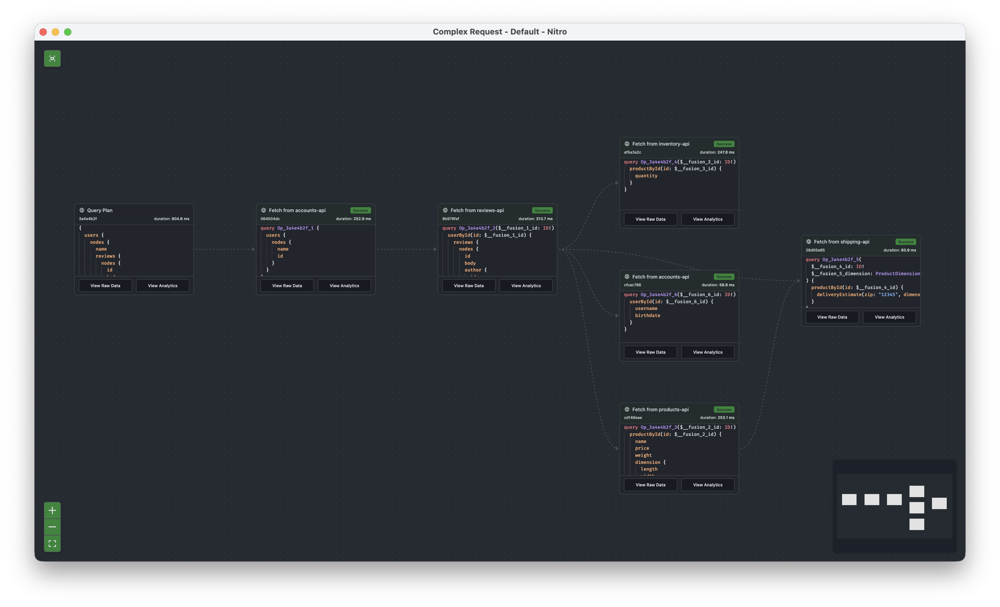
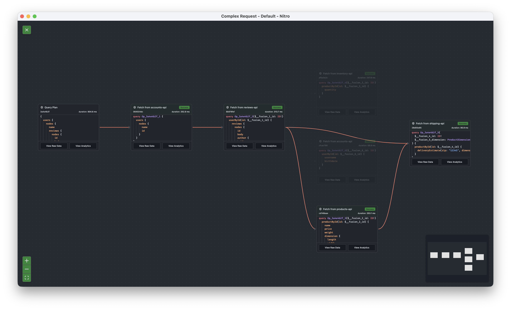
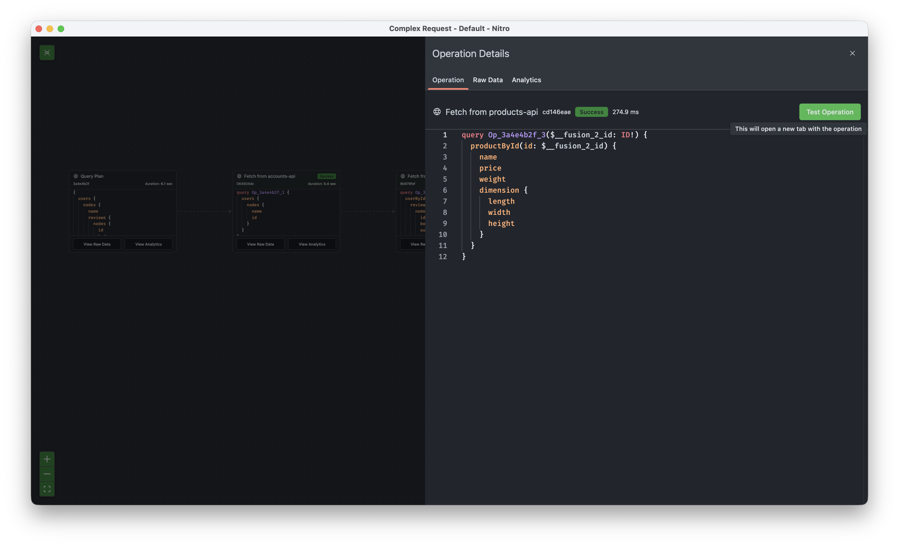
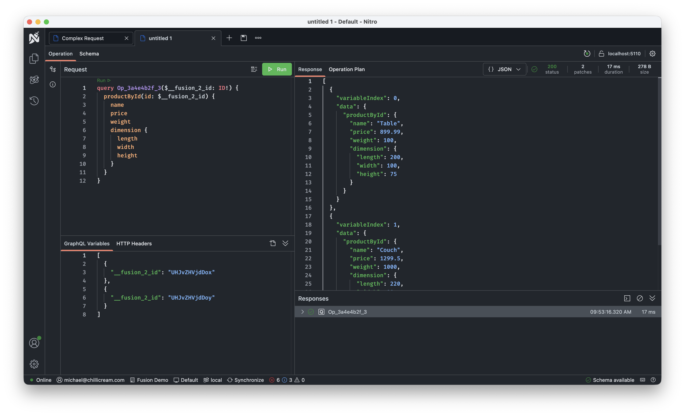
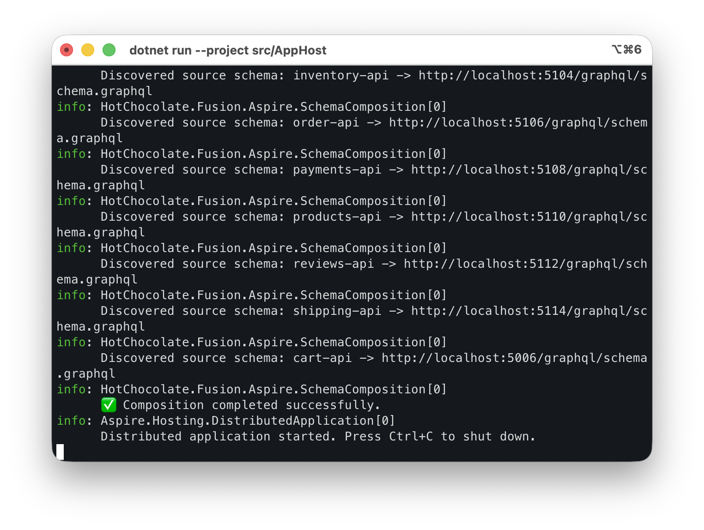
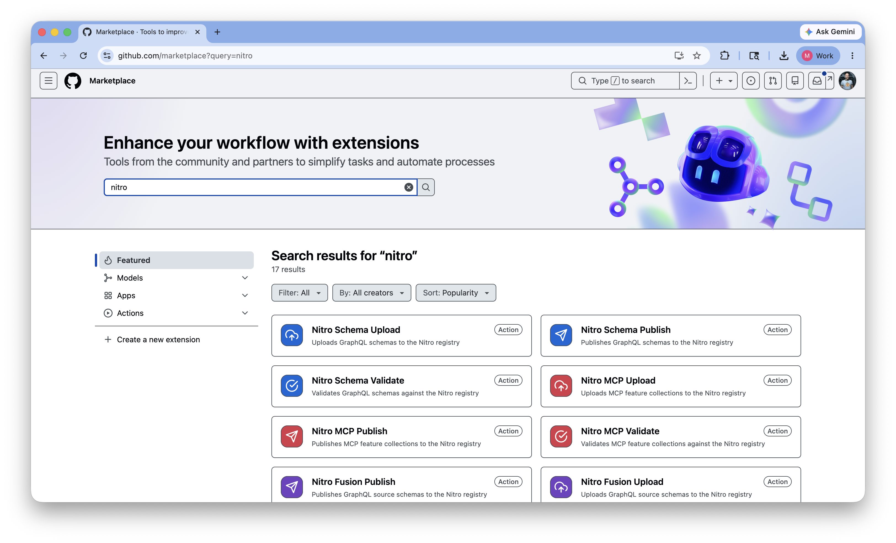
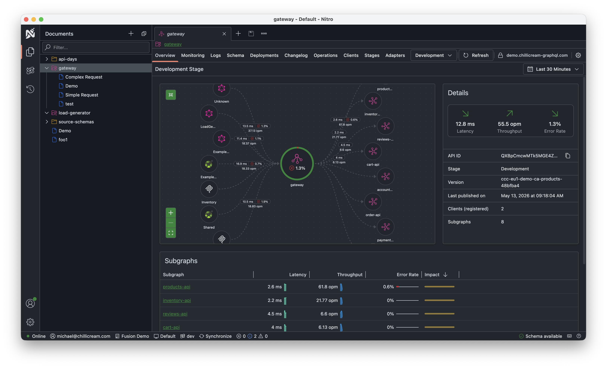
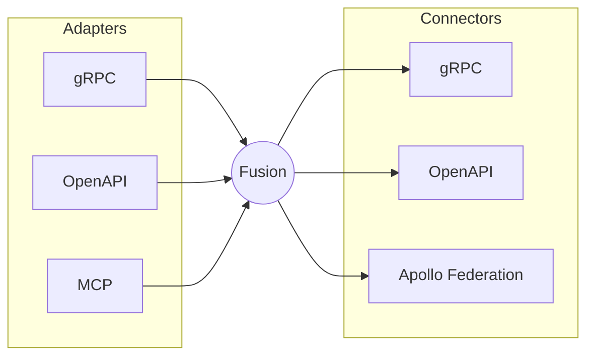
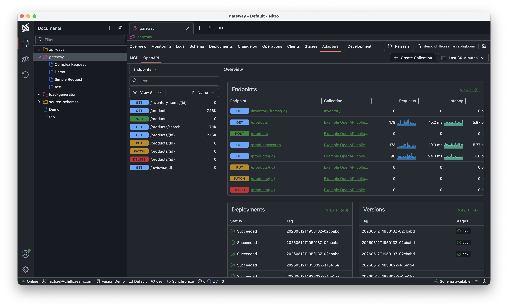

When we first created Fusion, it was built as an extension on top of Hot Chocolate. This approach let us leverage Hot Chocolate’s strengths and saved us significant development and maintenance effort. However, it also imposed constraints on both projects. Hot Chocolate had to avoid breaking Fusion, and Fusion was limited by Hot Chocolate’s architecture. For example, because we couldn’t change the type system to natively carry the metadata Fusion needs for operation planning, we had to rely on generic extension points, which cost us performance.

The breaking point came with a Hot Chocolate 14 bug fix that inadvertently broke Fusion’s query planner. A correct fix in one project became a regression in the other. That’s when we knew it was time to untangle the two.

Around this time, we noticed other gateway vendors rewriting their solutions in Rust, while others went straight to Go. It’s tempting to follow that trend: pick a new language, claim performance gains, and move on. For us, though, switching platforms did not make sense. We have always **considered ASP.NET Core our biggest asset**, and building on it with C# gave us the strongest foundation for Fusion.

> Upgrading from Fusion 15? Head straight to the [migration guide](/docs/fusion/v16/migration/migrate-from-15-to-16) for the full list of breaking changes and upgrade notes.

## ASP.NET Core

Every GraphQL gateway faces the same challenges and must implement core features like authentication, header propagation, retries, rate limits, observability, and more. While most gateways either reimplement these features or hide them behind layers of configuration and closed binaries, we chose a different path.

Fusion is NOT a closed product you install and configure from the outside. Instead, it is an open library that you bring into your own ASP.NET Core application, giving you direct access to every part of the stack and letting you shape the gateway to your needs.

Fusion is an OPEN library that sits on top of ASP.NET Core, giving you full access to your Program.cs, middleware pipeline, dependency injection container, and `IHttpClientFactory`. Your application is the gateway, not a closed product or a black box.

This single decision shapes everything that follows:

- Authentication uses the same AddAuthentication() you already know, whether that is JWT, OIDC, mTLS, cookies, or any other method your platform team prefers. Fusion does not ship its own authentication stack because ASP.NET Core already provides one.
- Header propagation, mTLS to subgraphs, connection pooling, hedging and retries are all managed by `IHttpClientFactory`. This component is battle-tested by Microsoft and used at massive scale in Azure, Bing, and Office.
- Observability is built on the standard .NET OpenTelemetry pipeline, using the same exporters, conventions, and dashboards as the rest of your fleet. Fusion implements the new GraphQL OpenTelemetry specification, so traces and metrics align with other GraphQL servers.
- Extensibility is pure C#. There is no scripting layer, no custom binary to compile, and no out-of-process coprocessors. If you need Redis, just add the StackExchange.Redis package and write your code.

Most importantly, Fusion automatically benefits from every security patch Microsoft releases, every performance improvement in the .NET stack, and every new Kestrel release.

To get started with a Fusion gateway, first install our templates:

```bash
dotnet new install HotChocolate.Templates
```

Next, create your project:

```bash
dotnet new graphql-gateway
```

That’s all it takes. The default gateway is as simple as an empty ASP.NET Core web application. You can ship it as-is, bundled with the composition output:

```csharp
var builder = WebApplication.CreateBuilder(args);

builder.Services
    .AddHttpClient("fusion");

builder
    .AddGraphQLGateway()
    .AddFileSystemConfiguration("./gateway.far");

var app = builder.Build();

app.MapGraphQL();

app.Run();
```

If you want to add request deduplication, just add a message handler to the HttpClient. There is no need for brittle YAML configuration. Register the HttpClient for the gateway, enable deduplication, and you are done:

```csharp
var builder = WebApplication.CreateBuilder(args);

builder.Services
    .AddHttpClient("fusion")
    .AddRequestDeduplication();

builder
    .AddGraphQLGateway()
    .AddFileSystemConfiguration("./gateway.far");

var app = builder.Build();

app.MapGraphQL();

app.Run();
```

For incremental retry, hedging, or other policies, simply add Polly or use the Aspire service defaults:

```csharp
builder.Services
    .AddHttpClient("fusion")
    .AddRequestDeduplication()
    .AddStandardResilienceHandler(options =>
    {
        options.Retry.MaxRetryAttempts = 5;
        options.Retry.BackoffType = DelayBackoffType.Linear;
        options.Retry.Delay = TimeSpan.FromMilliseconds(500);
    });
```

For a full walkthrough, see the [Getting Started](/docs/fusion/v16/getting-started) guide.

## Performance

With Fusion 16 we focused on .NET and examined the core challenges for the gateway. These are similar to the problems Kestrel had to solve. In the hot path, a GraphQL gateway repeatedly fetches data from subgraphs and integrates it into the gateway response. Most of this data is JSON.

A naive approach would parse each subgraph response into a `JsonDocument`, build the gateway response as a mutable `JsonNode`, and merge them. This method is inefficient, leading to many object allocations and constant data copying. Inspired by Rust’s arena allocation model, where all resources for a request are released together, we sought a better way than relying on the garbage collector.

In .NET, it’s common to rent byte arrays to reduce pressure on the garbage collector and keep allocations stable. However, resizing arrays is inefficient and can hurt performance. When you need to store data but do not know its final size, you typically rent an array of a certain size. If the array turns out to be too small, you must rent a larger one, copy the existing data over, and return the old array. This process is slow and reduces the efficiency of the array pool, especially with unpredictable GraphQL response sizes.

To make .NET competitive, we adopted several principles:

1. **Everything is managed as bytes**. This allows memory to be reused for metadata, objects, scalars, and JSON.
2. **We do not copy memory**. Instead of copying data from the source schema results into the gateway result, we reference the data directly. The gateway result is composed of many pointers to the memory of the source schemas. This approach reduces the need to duplicate data and keeps the memory footprint small.
3. **Memory is chunked**. We never expand a rented array, which would require copying. Instead, memory is divided into fixed-size chunks. Each request rents chunks and writes into them as needed. Most values fit within a single chunk, but cross-chunk reads are supported and efficient.
4. **Each request owns its memory chunks** and returns them when completed. This prevents memory leaks and simplifies resource management.
5. **The memory pool expands as needed** and only releases capacity when demand drops. This approach avoids sudden garbage collection spikes after brief increases in memory usage.

To validate our approach, we forked the GraphQL federation benchmarks from The Guild and integrated Fusion. We expanded the benchmarks and ran them nightly on dedicated hardware to ensure consistent results. Each benchmark runs ten times per gateway for accuracy.

In constant-load benchmarks against Rust subgraphs with no added latency, Fusion ranks second only to the Hive Router, outperforming two Rust-based routers and one Go router.

| Gateway                     | Version       | Median RPS | Best RPS | Worst RPS |  CV% | Notes                                       |
| :-------------------------- | :------------ | ---------: | -------: | --------: | ---: | :------------------------------------------ |
| hive-router                 | v0.0.49       |      2,889 |    3,082 |     2,866 | 2.6% |                                             |
| hotchocolate                | 16.1.0-p.1.10 |      2,140 |    2,175 |     2,127 | 0.8% |                                             |
| grafbase                    | 0.53.3        |      2,061 |    2,101 |     2,024 | 1.2% |                                             |
| cosmo                       | 0.307.0       |      1,255 |    1,273 |     1,246 | 0.7% | non-compatible response (2 across 2/9 runs) |
| hive-gateway-router-runtime | 2.5.25        |        541 |      553 |       535 | 1.0% |                                             |
| apollo-router               | v2.13.1       |        424 |      433 |       411 | 1.6% |                                             |
| hive-gateway                | 2.5.25        |        252 |      257 |       250 | 0.9% |                                             |
| apollo-gateway              | 2.13.3        |        238 |      240 |       236 | 0.6% |                                             |

In a more realistic scenario, where subgraphs have a fixed 4ms cost per request (simulating database access or other IO), the gap between Hive Router and Fusion nearly disappears.

| Gateway                     | Version       | Median RPS | Best RPS | Worst RPS |  CV% | Notes                                       |
| :-------------------------- | :------------ | ---------: | -------: | --------: | ---: | :------------------------------------------ |
| hive-router                 | v0.0.49       |      1,590 |    1,618 |     1,585 | 0.7% |                                             |
| hotchocolate                | 16.1.0-p.1.10 |      1,441 |    1,463 |     1,434 | 0.6% |                                             |
| cosmo                       | 0.307.0       |      1,136 |    1,152 |     1,127 | 0.9% | non-compatible response (2 across 2/9 runs) |
| grafbase                    | 0.53.3        |      1,121 |    1,142 |     1,110 | 0.9% |                                             |
| hive-gateway-router-runtime | 2.5.25        |        511 |      522 |       507 | 1.0% |                                             |
| apollo-router               | v2.13.1       |        394 |      404 |       391 | 1.1% |                                             |
| hive-gateway                | 2.5.25        |        244 |      248 |       242 | 0.9% |                                             |
| apollo-gateway              | 2.13.3        |        236 |      239 |       234 | 0.7% |                                             |

The full benchmark suite lives in our [federation benchmarks](https://github.com/ChilliCream/graphql-gateway-benchmarks).

With .NET 11, Microsoft is moving async execution into the runtime, eliminating the need for compiler tricks. This will allow us to reduce allocations even further and narrow the performance gap to the Hive Router.

Fusion delivers an exceptionally fast gateway that ranks near the top in benchmarks, while providing all the benefits of .NET and ASP.NET Core.

For tuning knobs like HTTP/2 multiplexing, connection pooling, and concurrency limits, see the [Performance Tuning](/docs/fusion/v16/performance-tuning) guide.

## AOT

On another note, Fusion 16 now supports AOT compilation. With an AOT compiled gateway, startup is instant because there is no need to wait for JIT compilation. However, we found that a JIT compiled gateway achieves higher throughput once it is warmed up. You can choose between instant startup with AOT or higher peak throughput with JIT. The best option depends on how quickly you need to scale and start new instances.

## Query Planner Overhaul

In Fusion 16, we have completely reworked the query planner. Query plans are now fully serializable, so you can export and import them as needed. This enables features like query plan pinning and build-time planning for complex federated setups. The new planner also produces much clearer execution plan views.



It’s now easier than ever to understand how operations are executed. You can click into any operation to see which other operations contribute to the result, making it simple to analyze and optimize your queries.



But what was fundamentally difficult in the past was to debug into a plan. Now with Fusion 16 and Nitro we can go into the plan details to see the structure of the subgraph request but also to look at the requirement data that is passed in.



In the details you find a button to test the operations which will create a new tab that is configured to run this operation against the subgraph directly.



## Aspire

The Fusion Aspire integration has been completely redesigned. It no longer depends on command-line tools for composition. Now, you simply annotate your subgraphs and declare that they expose a schema endpoint. The composer fetches the schema from each endpoint and composes the gateway automatically at startup.

```csharp
var accountsApi = builder
    .AddProject<Projects.Demo_Accounts>("accounts-api")
    .WithReference(accountsDb)
    .WithEnvironment("ConnectionStrings__accounts_db", accountsDb.Resource.ConnectionStringExpression)
    .WithGraphQLSchemaEndpoint()
    .WaitFor(postgres);
```

Aspire is excellent for the inner development loop. Being able to compose on the fly, right on your development machine, without any CLI tooling, makes iterating on a federated graph feel as fast and seamless as editing a single service.



The [Aspire Integration](/docs/fusion/v16/aspire-integration) guide covers schema endpoint annotations, composition settings, and Nitro-backed remote subgraph composition in detail.

## CI/CD

Deployment is another area where we have made significant improvements. Previously, deploying a subgraph required running at least five CLI commands, which was excessive for most setups. The new Nitro CLI streamlines this process. In version 16, you can deploy with a single command: `nitro fusion publish`. The transactional flow is still available if you need it, but for most cases, the new publish command is all you need.

We also now provide native integration with both GitHub Actions and Azure DevOps, making deployment even easier on these platforms.



See the [Deployment and CI/CD](/docs/fusion/v16/deployment-and-ci-cd) guide and the [Nitro CLI reference](/docs/fusion/v16/cli) for the full command set.

## Incremental Delivery

We’re excited to announce support for `@defer` in the Fusion gateway. Fusion now supports both the v0.1 and v0.2 incremental delivery protocols, as well as the streamlined JSONL format. Defer and stream are fully integrated into your query plans, and we’ve worked hard to make this process efficient.

Incremental delivery is enabled by default, but you can also control it explicitly through the gateway options:

```csharp
builder
    .AddGraphQLGateway()
    .ModifyOptions(o => o.EnableDefer = true);
```

## Semantic Introspection

I am not going to cover all of our AI-focused work in this post, because several of those features deserve their own write-up. One addition is worth a quick mention here though: Semantic Introspection.

Classic GraphQL introspection is great when a client wants to inspect the whole schema. For agents, that is often too blunt. They usually do not want the whole schema, they want the right part of the schema for the task in front of them. Dumping thousands of fields into the model costs tokens, pollutes context, and still leaves the model to figure out what matters. On top of that, many enterprise GraphQL schemas are simply too large to fit comfortably, even in a 1M-token context window.

Semantic Introspection turns schema discovery into a search problem. With `__search`, an agent can ask for the capabilities that are relevant to a user task and get back the best matching types and fields, together with the paths that lead to them. With `__definitions`, it can then fetch just the precise schema details it needs to build the next query. That is what makes it cool: GraphQL keeps its precision, while discovery becomes a constant-shape two-step process that works the same whether your schema has 10 types or 1000. In the dedicated post, a discovery-cost comparison also shows it to be markedly more cost-efficient than the other approaches that were measured.

Semantic Introspection is enabled by default in development mode, just like introspection itself.

```csharp
builder
    .AddGraphQLGateway()
    .ModifyOptions(o => o.EnableSemanticIntrospection = false);
```

By default, Fusion indexes the schema with BM25, so there is nothing else to wire up. If you want the full story, including how `__search` and `__definitions` work in practice, the [Semantic Introspection](/blog/2026/04/22/semantic-introspection) post goes much deeper. And if you want to see the agent side of it, including the skill prompt that teaches an agent how to use semantic introspection effectively, take a look at the [GraphQL skill prompt](https://github.com/PascalSenn/apidays-singapore/blob/main/case-study/prompt-graphql-skill.md).

## Adapters and Connectors

Adapters and Connectors are major additions in Fusion 16, each deserving a deep dive of their own. Here’s a quick overview:

With Fusion 16, we introduce two new concepts for the gateway. Adapters allow you to expose your GraphQL schema as other protocols, such as OpenAPI, MCP, and soon gRPC. Connectors on the other hand let you integrate non-GraphQL APIs, including OpenAPI, gRPC, and other federation dialects like Apollo Federation, into Fusion. These APIs are treated as if they were native GraphQL Federation subgraphs.





### Adapters

Adapters create API projections on top of your GraphQL schema. For example, the OpenAPI adapter lets you publish a curated REST API based on an existing GraphQL schema. This is especially useful for providing integration surfaces to external partners or for building scenario-specific REST endpoints.

Projecting a GraphQL operation as a REST endpoint is simple. Just annotate the operation with a few directives:

```graphql
"Fetches a user by their id"
query GetUserById($userId: ID!) @http(method: GET, route: "/users/{userId}") {
  userById(id: $userId) {
    id
    name
    email
  }
}

"Creates a user"
mutation CreateUser($user: UserInput! @body) @http(method: POST, route: "/users") {
  createUser(user: $user) {
    id
    name
    email
  }
}
```



We currently ship Adapters for OpenAPI and MCP, with a gRPC Adapter landing in one of the next dot releases. The [MCP Adapter](/docs/fusion/v16/adapters/mcp) docs are up now; the OpenAPI Adapter docs follow with its dedicated post.

### Connectors

Connectors complement Adapters by letting you plug non-GraphQL APIs directly into the gateway. Fusion currently supports OpenAPI, gRPC, and Apollo Federation. This means Fusion can sit in front of an Apollo Federation graph or a mix of REST and gRPC services, without requiring you to add a GraphQL server for each one.

We’ll explore both Adapters and Connectors in more detail in dedicated posts soon.

## Composite Schemas Working Group

A few years ago, together with Apollo and The Guild, we began working on an open specification for federated GraphQL under the GraphQL Foundation: the Composite Schema Specification. But the spec itself isn't the only thing the group has produced.

Along the way, we've gotten a shared vocabulary, a reference test suite, and implementations across multiple vendors. For the first time, federation is not controlled by any single company, but by the GraphQL community.

This specification is now nearing completion, and Fusion 16 fully implements the current version. Once finalized, it will be published as the official GraphQL Federation specification. Already today, there are two gateways implementing the spec and two more that will announce adoption very soon. It's truly amazing to see how the GraphQL ecosystem has worked together to bring this specification to life and create true interoperability.

## Wrapping up

When we set out to rewrite Fusion, we had three main goals: remove the constraints imposed by Hot Chocolate, achieve top-tier performance with .NET, and make the gateway feel like a natural extension of your ASP.NET Core app, rather than a black box configured with YAML. Fusion 16 is the first release where all three goals are realized. You get the same Kestrel, the same `IHttpClientFactory`, and the same OpenTelemetry pipeline, but now with a brand-new type system and execution engine designed specifically for Fusion.

Everything in this post, Aspire-driven composition, single-command publishing, `@defer`, Semantic Introspection, Adapters and Connectors, is open source, MIT, and built on open standards under the GraphQL Foundation.

Give it a spin with `dotnet new graphql-gateway`, or explore an end-to-end setup in the [Fusion demo](https://github.com/ChilliCream/fusion-demo), which shows the new Fusion in action across subgraphs, Aspire composition, and the gateway. Jump into our [Slack](https://slack.chillicream.com) if you get stuck. Stay tuned: gRPC adapters, deeper Federation interop, and the long-form posts on Adapters, Connectors, and the new execution engine are all queued up.
