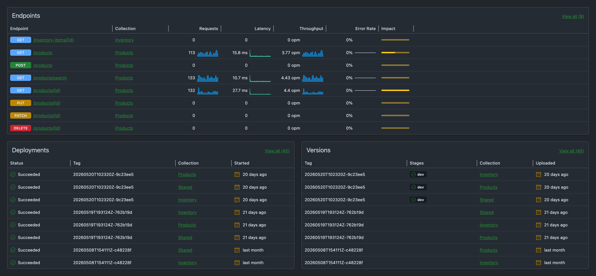

Every GraphQL project eventually meets a consumer that doesn't speak GraphQL. A partner platform, a legacy system, or a tool outside of your control asks your team for a plain REST endpoint.

Until now, that meant spinning up a one-off HTTP endpoint somewhere in your stack that

- falls outside your existing GraphQL telemetry and field usage tracking,
- potentially duplicates your authentication and authorization setup,
- duplicates type definitions that diverge over time, and
- in the case of Fusion, falls outside the composition model: each subgraph is built to contribute its slice of the overall schema, so no single subgraph is positioned to serve an endpoint that aggregates data across the others.

Sooner or later, that endpoint comes back to haunt you. Its traffic never shows up in your schema usage insights, so the next breaking change is decided on incomplete data. Its authorization is a copy that silently drifts from the original. Its DTOs mirror your GraphQL types until they don't. And the subgraph hosting the aggregated endpoint ends up hand-rolling the cross-service composition your gateway already does.

And for what? You already have a well-defined GraphQL schema. A few one-off endpoints shouldn't require a second API technology.

### Meet the new OpenAPI Adapter

The adapter ships with Hot Chocolate 16 and Fusion, and the idea behind it is simple: you define HTTP endpoints by authoring GraphQL documents that invoke your graph and select exactly the fields the REST API needs. In essence, your REST endpoints become just another client of your existing graph.

Here is what that looks like in practice:

<!-- prettier-ignore -->
```graphql
query GetProductById($productId: ID!) @http(method: GET, route: "/api/products/{productId}") {
  productById(id: $productId) {
    id
    name
    price
    deliveryEstimate
  }
}
```

The `@http` directive assigns the operation an HTTP method and a route. A request to `GET /api/products/42` executes the operation against your schema, passing `42` as the `$productId` variable, and returns the root field's data as plain JSON without the usual GraphQL response envelope:

```json
{
  "id": "42",
  "name": "Mountain Bike",
  "price": 899.99,
  "deliveryEstimate": "2026-06-13"
}
```

If your GraphQL server is a Fusion gateway, this gets even better: `name` and `price` might come from a `products` subgraph, while `deliveryEstimate` is resolved through a `shipping` subgraph. The REST caller receives one flat resource, and the gateway does the cross-subgraph composition it was built for. No subgraph has to step outside its role to make this endpoint possible.

Notice what is _not_ there: no controller, no DTO, no auth code, no serializer setup. The schema already provides the types, validation, and resolvers this endpoint needs. The request runs through the same execution pipeline as any GraphQL request, so your existing authorization rules are enforced, and the traffic shows up in your telemetry and field usage tracking like that of any other client.

Mutations are just as simple. The `@body` directive maps the HTTP request body onto a variable, and route parameters can reach into that variable with the `key:$variable.path` syntax. That comes in handy for sub-resource endpoints, where the URL carries the parent ID and the body carries the rest:

<!-- prettier-ignore -->
```graphql
mutation CreateProductReview($review: CreateProductReviewInput! @body)
    @http(method: POST, route: "/api/products/{productId:$review.productId}/reviews") {
  createProductReview(input: $review) {
    id
    rating
    text
  }
}
```

A `POST /api/products/42/reviews` writes `42` into `$review.productId` and fills the remaining input object fields from the JSON body.

While fragments are generally [not meant for re-use](https://youtube.com/watch?v=gMCh8jRVMiQ) in client development, a REST API is different: a `Product` should have the same shape no matter which endpoint returns it. So the adapter lets you define a fragment in its own document and spread it across endpoint definitions, where it acts as a shared model:

```graphql
fragment Product on Product {
  id
  name
  price
  deliveryEstimate
}
```

### Wiring it up

Install the `HotChocolate.Adapters.OpenApi` NuGet package into your GraphQL server project, or `HotChocolate.Fusion.Adapters.OpenApi` if your server is a Fusion gateway:

```bash
dotnet add package HotChocolate.Adapters.OpenApi
```

Then extend your GraphQL server and endpoint configuration:

```diff
var builder = WebApplication.CreateBuilder(args);

builder.Services.AddNitro().AddHotChocolate();

builder.Services
+    .AddOpenApi(options =>
+    {
+        options.AddGraphQLTransformer();
+    });

builder
    .AddGraphQL()
+    .AddOpenApi()
    .AddQueryType<Query>();

var app = builder.Build();

app.UseRouting();
+ app.MapOpenApi();
+ app.MapOpenApiEndpoints();
app.MapGraphQL();

app.Run();
```

Two of these additions do the heavy lifting: `AddOpenApi()` on the GraphQL server loads the endpoint definitions from a registered `IOpenApiDefinitionStorage`, and `MapOpenApiEndpoints()` exposes the resulting HTTP endpoints. If you're already using Nitro, that's all it takes: your server now loads its OpenAPI GraphQL documents from Nitro and listens for updates.

The other two, `AddOpenApi()` on the service collection and `MapOpenApi()`, are optional.<br/>They enable the `Microsoft.AspNetCore.OpenApi` integration, which describes your generated endpoints in a standard OpenAPI document served at `/openapi/v1.json`.

From there, interactive documentation is one package away. Install `Swashbuckle.AspNetCore.SwaggerUI` and point it at the document:

```csharp
app.UseSwaggerUI(options =>
{
    options.SwaggerEndpoint("/openapi/v1.json", "v1");
});
```

This renders the Swagger UI explorer at `/swagger/index.html`, where consumers can discover and try out your REST endpoints.

### Publishing your first endpoint

Endpoint definitions are plain GraphQL files, and Nitro treats them like any other deployable artifact. They are organized into OpenAPI collections, each containing its own individually versioned set of endpoints and models. An API can serve any number of collections, so each team or department can contribute endpoints to the GraphQL server independently, on its own release cadence.

Create a collection once with `nitro openapi create`, then upload your documents as a tagged version and publish that tag to a stage:

```bash
nitro openapi upload \
  --openapi-collection-id "<collection-id>" \
  --tag "v1" \
  --pattern "./openapi/**/*.graphql"

nitro openapi publish \
  --openapi-collection-id "<collection-id>" \
  --tag "v1" \
  --stage "dev"
```

Your running server picks up the published version and starts serving the new endpoints in place, without a redeploy. The endpoint also stays protected after publishing: if your schema evolves in a way that would make the endpoint document no longer executable, schema validation catches it.

From there, the endpoint participates in your graph like any other client: its field selections feed your schema insights and field usage tracking, its traffic shows up in your telemetry, and schema changes that would break it are surfaced before they go live.

There is also a dedicated dashboard that shows all of your adapter endpoints and their telemetry at a glance:



### Wrap up

So the next time someone asks you for a REST endpoint, ask yourself: can my graph already provide this? If it can, don't go off and build a separate API. Plug in the OpenAPI adapter, author an endpoint document, and let your graph do the rest.

If you want to go deeper, check out the [OpenAPI Adapter guide](/docs/hotchocolate/v16/guides/openapi-adapter).
