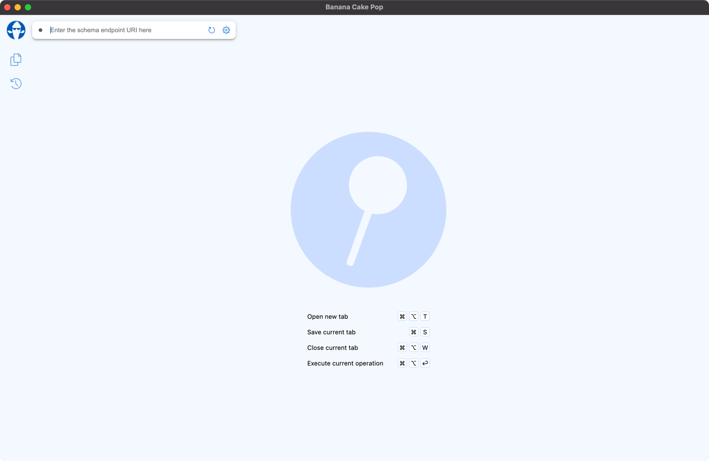
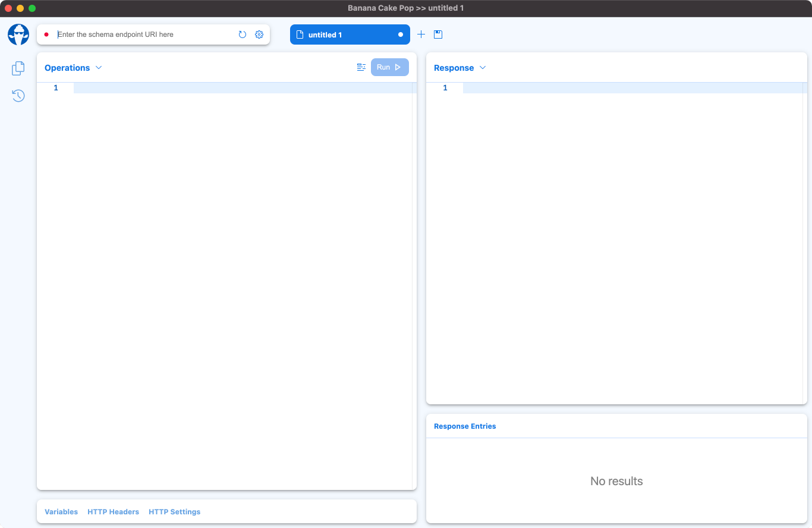
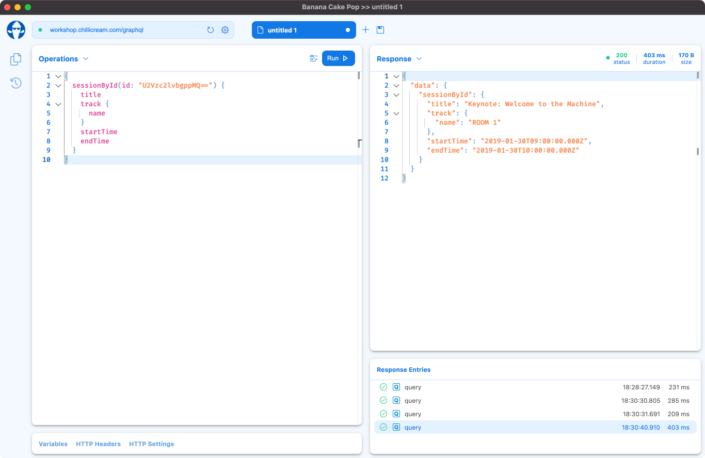

Welcome to Banana Cake Pop!
When you enter the application it will look like below. Fairly minimal until you enter a GraphQL endpoint.



Lets get going with Banana Cake Pop and make our first GraphQL request. If you do not have a GraphQL API you can use the mock API below provided by ChilliCream.

Endpoint: https://workshop.chillicream.com/graphql

After entering your endpoint and hitting enter, your Banana Cake Pop workspace should fill with "Operations" and "Response" area like seen below.



You can now copy and paste the query below into the "Operations" editor area and hit the "Run" button which should return a response in the "Response" area with data.

```graphql
{
  sessionById(id: "U2Vzc2lvbgppMQ==") {
    title
    track {
      name
    }
    startTime
    endTime
  }
}
```



Congratulations, you have completed a GraphQL query. Next lets check out the [Schema Reference](/docs/bananacakepop/schema-reference) area so we can explore the API and learn about it
