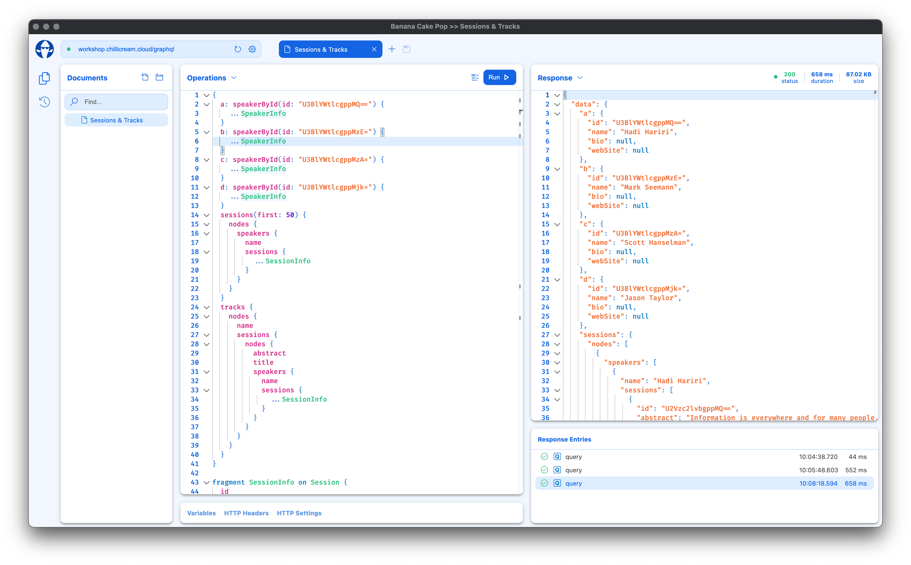

Banana Cake Pop makes it easy and enjoyable to test your GraphQL server implementations. It works well with Hot Chocolate and any other GraphQL server. Try it out and give us feedback via [slack](http://slack.chillicream.com/) in the ** #banana-cake-pop ** channel .

# Download

Banana Cake Pop is currently in preview and the current version is `1.0.0-preview.14`. It has an auto update feature built in, so as new releases come out you will get notifications in the app.

- [MacOS Installer](https://download.chillicream.com/bananacakepop/BananaCakePop-1.0.0-preview.14.dmg)
- [Windows Installer](https://download.chillicream.com/bananacakepop/BananaCakePop-1.0.0-preview.14.exe)
- [Ubuntu Installer](https://download.chillicream.com/bananacakepop/BananaCakePop-1.0.0-preview.14.AppImage)

After downloading head over to [getting started](/docs/bananacakepop/getting-started) and lets make our first GraphQL query in Banana Cake Pop.

