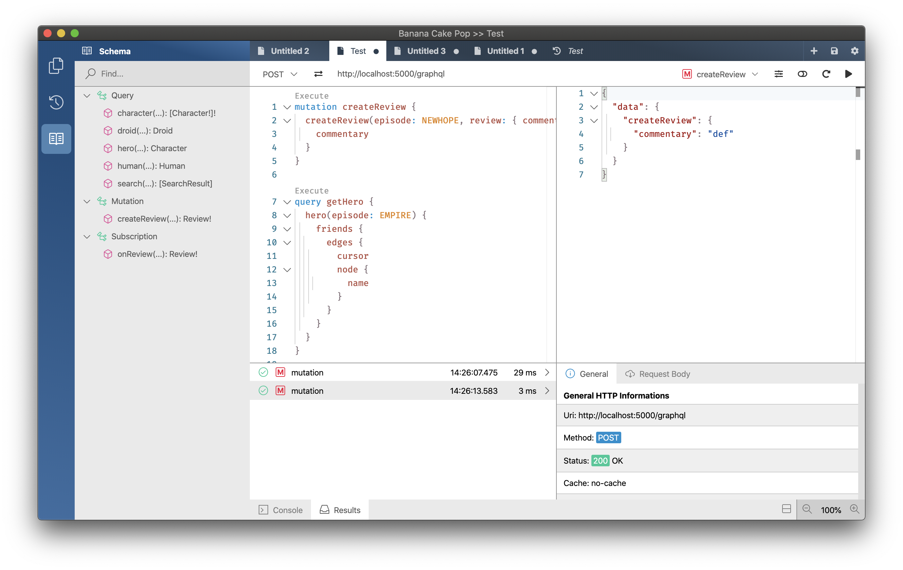
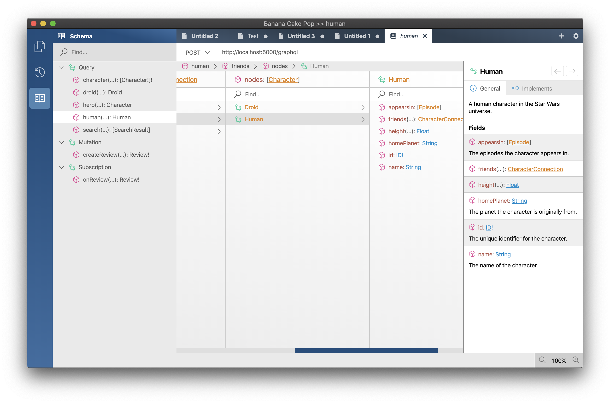
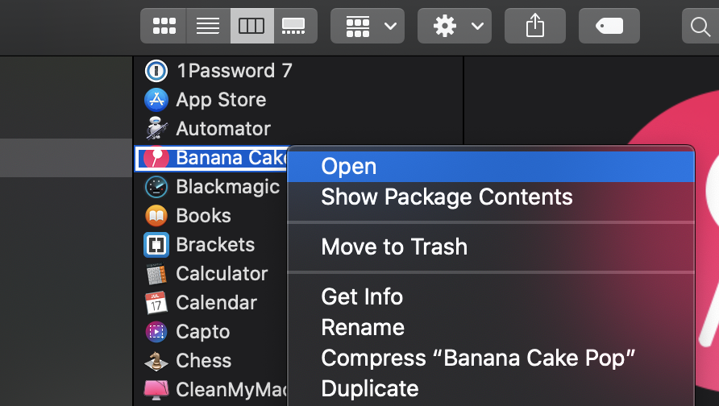
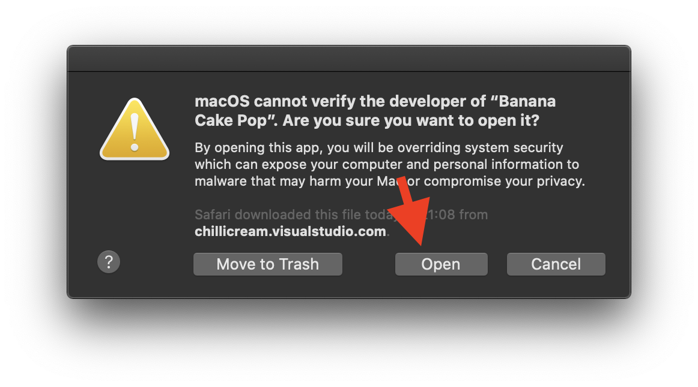

Banana Cake Pop is our brand new GraphQL IDE which works well with Hot Chocolate and any other GraphQL server. It's still in preview so try it out and give us feedback via our [slack channel](https://join.slack.com/t/hotchocolategraphql/shared_invite/enQtNTA4NjA0ODYwOTQ0LTViMzA2MTM4OWYwYjIxYzViYmM0YmZhYjdiNzBjOTg2ZmU1YmMwNDZiYjUyZWZlMzNiMTk1OWUxNWZhMzQwY2Q).

Banana Cake Pop uses 2-phase introspection to tune the IDE to the GraphQL features, such as repeatable directives or subscription support, that are supported by a certain GraphQL server.

Banana Cake Pop lets you work with large schemas without slowing you down.

# Download

Banana Cake Pop is currently in preview and the current version is `1.0.0-preview.3`.

- [macOS Installer](https://blob.chillicream.io/banana/BananaCakePop-1.0.0-preview.3.dmg)
- [windows Installer](https://blob.chillicream.io/banana/BananaCakePop-1.0.0-preview.3.exe)
- [ubuntu Installer](https://blob.chillicream.io/banana/BananaCakePop-1.0.0-preview.3.AppImage)

## macOS Catalina

With macOS Catalina Apple has begun to be stricter regarding apps that are not available through the app store. We are working to get Apple's new app notarization integrated into our build process. For now you have to right-click on the app after you have installed it and then click on open in the context menu.

After that a message box will open where you have to click on open in order to run Banana Cake Pop.

